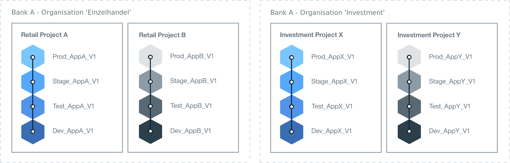

---

copyright:

  years: 2015, 2017
lastupdated: "2017-02-22"

---

{:new_window: target="_blank"}
{:shortdesc: .shortdesc}
{:screen:.screen}
{:codeblock:.codeblock}

# Bewährte Verfahren zur Einrichtung der {{site.data.keyword.Bluemix_notm}}-Umgebung
{: #patterns}

Für den Erfolg eines Projekts ist es sinnvoll, sich Zeit zum Planen und Entwerfen zu nehmen, um die erforderlichen Ressourcen und die Anforderungen Ihres Unternehmens zu klären. Beginnen Sie für Einstieg in Ihr Cloudprojekt mit den folgenden Fragen:

* Wie viele und welche Typen von Anwendungen sollen bereitgestellt werden?
* Auf welche Services werden die Anwendungen Zugriff benötigen?
* Welche Personen werden am Entwicklungsprozess mitarbeiten und welche Rolle werden sie spielen?
* Welcher Grad an Isolierung ist für jede Phase des Projekts erforderlich?
* Werden die Infrastrukturressourcen von Ihrem Unternehmen bereitgestellt? 
* Wie kommuniziert Ihr Unternehmen?
* Gibt es einen Benennungsstandard, den Sie implementieren können, um die Organisation und die Speicherplatzbelegung eindeutig kenntlich zu machen?   

{:shortdesc}

Beim Entwurf einer Cloudlösung sind darüber hinaus auch Aspekte der Kontosicherheit und Betriebsanforderungen, nationale Regelungen, Marktrichtlinien sowie unternehmensinterne Richtlinien zu berücksichtigen. 
Zur Erfüllung Ihrer jeweiligen Projektanforderungen werden mit {{site.data.keyword.Bluemix}} drei Typen von Cloudumgebungen angeboten. 

* [{{site.data.keyword.Bluemix_notm}} Public](/docs/overview/whatisbluemix.html "{{site.data.keyword.Bluemix_notm}} Public"): Die Infrastrukturressourcen werden von verschiedenen Unternehmen und Benutzern gemeinsam genutzt.
* [{{site.data.keyword.Bluemix_notm}} Dedicated](/docs/dedicated/index.html#dedicated "{{site.data.keyword.Bluemix_notm}} Dedicated"): Sie verwenden eine eigene dedizierte SoftLayer-Infrastruktur, die Sie sicher mit der {{site.data.keyword.Bluemix_notm}} Public-Cloud und dem eigenem Netz verbinden können.
* [{{site.data.keyword.Bluemix_notm}} Local](/docs/local/index.html#local "{{site.data.keyword.Bluemix_notm}} Local"): Diese Infrastruktur befindet sich hinter der Firewall Ihres Unternehmens, die Ihre sensibelsten Workloads schützen und sichere Verbindungen zu {{site.data.keyword.Bluemix_notm}} Public- und {{site.data.keyword.Bluemix_notm}} Dedicated-Clouds herstellen kann.

Planen Sie bei der Entscheidung, welcher Typ von Cloudumgebung benötigt wird, die Struktur Ihrer Konten, Organisationen, Bereiche, Ressourcen und Teammitglieder. 

Für die meisten Unternehmen reicht ein einzelnes {{site.data.keyword.Bluemix_notm}}-Konto aus. Für größere Unternehmen mit mehreren Geschäftsbereichen könnte sich ein separates {{site.data.keyword.Bluemix_notm}}-Konto
für jeden Geschäftsbereich anbieten. In einem großen Finanzunternehmen könnte es zum Beispiel separate Konten für den Einzelhandelssektor und den Großkundensektor geben.

Die folgende Tabelle enthält eine Zusammenfassung einiger Schlüsselelemente. 

| Element   | Beschreibung |
|---------------------------------------|--------------------------------------------------------------------------------------|
| Konto   | Jedes Konto hat genau einen Kontoeigner. |
|| Enthält eine oder mehrere Organisationen. Sie müssen ein nutzungsabhängiges Konto haben, um mehr als eine Organisation erstellen zu können. |
| Kontoeigner   | Ist für alle Nutzungsgebühren verantwortlich, die für das Konto auflaufen. |
|| Kann nur Eigner eines Kontos sein. |
|| Kann einen oder mehrere Organisationsmanager zur Delegierung des Organisationsmanagements hinzufügen, das Lese- und Schreibberechtigungen für die Organisationen umfasst. |
|| Kann ein Teammitglied in Organisationen und Bereichen in anderen {{site.data.keyword.Bluemix_notm}}-Konten sein. |
| Organisation   | Enthält einen oder mehrere Bereiche. | 
|| Enthält einen oder mehrere Organisationsmanager. |
|| Enthält ein oder mehrere Teammitglieder. Jedem Teammitglied können eine oder mehrere Rollen erteilt werden. |
|| Die Nutzungsgebühren, die durch eine bereitgestellte Anwendung in einem Bereich generiert werden, werden auf Organisationsebene gemeldet. |
| Bereich   | Enthält eine oder mehrere Ressourcen. |
|| Enthält eine oder mehrere Anwendungen. |
|| Enthält einen oder mehrere Bereichsmanager. |
|| Enthält ein oder mehrere Teammitglieder. Jeder Benutzer muss bereits ein Teammitglied in der Eignerorganisation sein. Jedem Teammitglied können eine oder mehrere Rollen erteilt werden. |
| Teammitglied   | Kann einer oder mehreren Organisationen und einem oder mehreren Bereichen über verschiedene Konten hinweg hinzugefügt werden. |
|| Kann mehrere Rollen innerhalb derselben Organisation und/oder desselben Bereichs innehaben. | 
{:caption="Table 1. Description of key elements" caption-side="top"}

## {{site.data.keyword.Bluemix_notm}}-Umgebung bestimmen
{: #bpimplementation}

Anstelle der traditionellen, streng definierten Entwicklungs-, Test- und Produktionsmethodik haben Sie die Möglichkeit, eine Umgebung zu implementieren, in der Entwickler und Tester mit anderen Teammitgliedern zusammenarbeiten können. Wenn Sie die Art und Weise gestalten, in der Sie Ihre Anwendungen entwickeln und liefern wollen, können Sie {{site.data.keyword.Bluemix_notm}}-Bereiche erstellen, um diese Methodik umzusetzen. Ziehen Sie in Betracht, beim Entwurf Ihrer {{site.data.keyword.Bluemix_notm}}-Umgebung nicht von der Organisationsebene aus abwärts, sondern von der Bereichsebene an aufwärts vorzugehen.

Berücksichtigen Sie die Größenordnung und den Geltungsbereich der Anwendungen, wenn Sie die Entwicklung und Bereitstellung planen. Ein {{site.data.keyword.Bluemix_notm}}-Bereich kann als Entwicklungsumgebung für eine oder mehrere Anwendungen verwendet werden, die eng miteinander verbunden oder zusammenhängend definiert sind. Abgesehen von einem Entwicklungsbereich kann es zum Beispiel wünschenswert sein, Bereiche für Komponententests, Leistungstests und Integrationstests zu erstellen. Außerdem können Bereiche für Build, Staging und Produktion eingesetzt werden. Jeder der Bereiche, die Sie erstellen, kann von verschiedenen Teammitgliedern innerhalb derselben Organisation gemeinsam genutzt werden. 

Erstellen Sie separate {{site.data.keyword.Bluemix_notm}}-Organisationen, wenn Sie Mitarbeiter haben, die in verschiedenen Geschäftsbereichen tätig sind und sich die Tätigkeiten nicht überschneiden. Wenn zwei voneinander völlig unabhängige Gruppen vorhanden sind, lassen sich durch die Erstellung je einer Organisation für jede Gruppe klare Abgrenzungen für die Bereitstellung sowie für das Management von Teampartnern und Ressourcen definieren. Für die Kommunikation zwischen den Organisationen können Sie eine API definieren.  

{{site.data.keyword.Bluemix_notm}}-Organisationen können so erstellt werden, dass sie nicht so sehr die Struktur innerhalb eines Unternehmens als viel mehr die gewünschten Arbeitsweisen abbilden. Unternehmensorganisationen können sich im Lauf der Zeit ändern, während die Entwicklung und Verwaltung einer Anwendung davon meist völlig unabhängig fortgeführt wird. 
Entwerfen Sie also Ihre {{site.data.keyword.Bluemix_notm}}-Umgebung im Hinblick auf die Lebensdauer der Anwendungen und nicht mit Blick auf die Organisationsstruktur Ihres Unternehmens. 

Die iterative Entwicklung und Bereitstellung kann dazu führen, dass Anwendungen rasch sehr viel Platz benötigen. Der Entwurf für Ihren Bereitstellungsprozess muss sich schnell und einfach vertikal skalieren lassen. Es ist eine kontinuierliche Entwicklung mit hoher Bereitstellungsrate gewünscht. Wenn Ihre Entwicklungs- und Produktionsbereiche in derselben {{site.data.keyword.Bluemix_notm}}-Organisation enthalten sind, haben sie Zugriff auf dieselben Ressourcen. Die Verwaltung unterschiedlicher Bereiche innerhalb einer Organisation verringert den Verwaltungsaufwand. Das Personal für Entwicklung, Tests und Betrieb kann problemlos zusammenarbeiten, wenn sie innerhalb derselben {{site.data.keyword.Bluemix_notm}}-Organisation arbeiten. 

Implementieren Sie einen Benennungsstandard, um die Organisation und die Speicherbelegung klar zu kennzeichnen. Sie können zum Beispiel den Typ von Cloud, die geografische Region, den Nutzungstyp (z. B. dev, test oder prod), den Anwendungsnamen und die Versions- oder Revisionsnummer in die Namen einschließen. Die Organisationen und Bereiche sind dadurch leicht bei Verwaltung und Zugriff zu identifizieren.  

Die Anzahl von Bereichen kann sich aufgrund der iterativen Entwicklung rasch erhöhen. Sie können Bereiche innerhalb einer Organisation nach Bedarf definieren. Wenn Sie planen, eine große Anzahl von Bereichen zu definieren, kann es sinnvoll sein, eine Anwendung zu erstellen, die bei der Verwaltung der Bereiche hilft. Überschreiten die Bereiche die Anzahl von 60, empfiehlt es sich vielleicht, eine weitere Organisation zu definieren. 

Lassen Sie nur eine Person eine Organisation erstellen und verwalten, Bereiche definieren und Teammitgliedern Zugriffsrechte erteilen. Eine zweite Person könnte dieselben Zugriffsrechte erhalten, um die Umgebung zu verwalten, wenn der Organisationsmanager nicht verfügbar ist.  

Ermitteln Sie alle Personen, die Zugriff auf die einzelnen Bereiche und Organisationen benötigen. Legen Sie Rollen für diese Personen fest. Durch die Tätigkeitsrolle eines Teammitglieds wird die entsprechende Berechtigung festgelegt. Beispiel: Ein leitender Entwickler benötigt die Berechtigung zum Anzeigen und Aktualisieren der gesamten {{site.data.keyword.Bluemix_notm}}-Entwicklungsumgebung. Mitarbeitende Entwickler können hingegen einen eingeschränkten Zugriff auf Komponenten haben, die sie anzeigen und aktualisieren können.

## Organisationsarchitektur bestimmen
{: #orgstructure}

Für den Entwurf einer Cloudumgebung, in der {{site.data.keyword.Bluemix_notm}} Public, {{site.data.keyword.Bluemix_notm}} Dedicated, {{site.data.keyword.Bluemix_notm}} Local oder eine beliebige Kombination dieser Produkte eingesetzt werden, können Sie die folgenden Organisationsarchitekturen verwenden:

* Einzelorganisation: Ziehen Sie diese Architektur in Betracht, wenn bei Ihnen dieselbe Gruppe von Benutzern auf Ressourcen zugreifen muss, die an einer beliebigen Stelle in der Organisation in {{site.data.keyword.Bluemix_notm}} Public, {{site.data.keyword.Bluemix_notm}} Dedicated oder {{site.data.keyword.Bluemix_notm}} Local verfügbar sind.
* Mehrere Organisationen: Ziehen Sie diese Architektur in Betracht, wenn bei Ihnen eine Isolierung zwischen verschiedenen Umgebungen innerhalb von {{site.data.keyword.Bluemix_notm}} Public, {{site.data.keyword.Bluemix_notm}} Dedicated oder {{site.data.keyword.Bluemix_notm}} Local erforderlich ist. 

### Umgebung mit einer Einzelorganisation im Vergleich zu einer Umgebung mit mehreren Organisationen
{: #singleormulti}

In einer Umgebung mit einer Einzelorganisation werden die Infrastrukturressourcen von verschiedenen Bereichen des Unternehmens gemeinsam genutzt. Demgegenüber werden die Infrastrukturressourcen in einer Umgebung mit mehreren Organisationen nicht gemeinsam genutzt. 

Beide Organisationsarchitekturen unterstützten die folgenden Prinzipien:

* Abgrenzung von Anwendungen, Projekten oder beides.
* Berechtigungen zur Verwaltung von Ressourcen, die durch Benutzerrollen erteilt werden.

Zur Implementierung einer Architektur mit einer Einzelorganisation erstellen Sie ein Konto in {{site.data.keyword.Bluemix_notm}} Public, {{site.data.keyword.Bluemix_notm}} Dedicated oder {{site.data.keyword.Bluemix_notm}} Local und definieren nur eine Organisation. Anschließend können Sie mehrere Bereiche definieren, die auf verschiedenen Geschäftsfeldern (LOB, Lines of Business), Bereitstellungsphasen, bestimmten Projekten, Anwendungen, Benutzerberechtigungen oder einer Kombination dieser Komponenten basieren.

Zur Implementierung einer Architektur mit mehreren Organisationen, erstellen Sie ein Konto in {{site.data.keyword.Bluemix_notm}} Public, {{site.data.keyword.Bluemix_notm}} Dedicated oder {{site.data.keyword.Bluemix_notm}} Local. Anschließend können Sie Organisationen definieren, die verschiedenen Geschäftsfeldern (LOBs), Bereitstellungsphasen, bestimmten Projekten, Benutzerberechtigungen oder einer Kombination dieser Komponenten entsprechen. Daraufhin können Sie mehrere Bereiche definieren, die auf Anwendungen oder Projekten basieren, die von derselben Abteilung im Unternehmen bereitgestellt werden. 

**Hinweis:** Sie müssen ein belastbares Konto haben, wie zum Beispiel ein nutzungsabhängiges Konto oder ein Abonnement, um mehrere Organisationen definieren zu können. 

### Organisationsaspekte
{: #orgconsiderations}

Wenn Sie eine Architektur mit einer Einzelorganisation implementieren, enthält die Organisation sämtliche Cloudressourcen, Services und Anwendungen, die Sie zum Entwickeln, Verwalten und Bereitstellen von Cloudanwendungen verwenden. In {{site.data.keyword.Bluemix_notm}} Public stellt die Organisation eine Trennung zwischen Konten bereit und ist über alle Regionen hinweg verfügbar.

 

 Abbildung 1. Beispiel für eine Architektur mit einer Einzelorganisation für {{site.data.keyword.Bluemix_notm}} Public, {{site.data.keyword.Bluemix_notm}} Dedicated und
 {{site.data.keyword.Bluemix_notm}} Local 
{: #bpfigure1}

Wenn Sie eine Architektur mit mehreren Organisationen implementieren, stellen Organisationen die erste Ebene der Abgrenzung und Abstraktion bereit, die Sie zum Steuern und Definieren der Tätigkeiten und Berechtigungen verwenden können. Entwerfen Sie jede Organisation im Hinblick auf die verschiedenen Geschäftsfelder (LOBs), Bereitstellungsphasen, Rollen der Benutzer, bestimmten Projekte oder im Hinblick auf eine Kombination dieser Komponenten.  

Die Anzahl der Organisationen, die Sie benötigen, hängt von mehreren Faktoren ab:

* Der Unterteilungsgrad, den Sie in Ihrer Organisation zur Verwaltung von Kontingenten und zur Steuerung von Kosten benötigen.
* Die Sicherheitsstufe, die Sie in Ihren verschiedenen Umgebungen umsetzen müssen. Wenn Sie zum Beispiel Container verwenden, wollen Sie Container-Images, die für die Entwicklung verwendet werden, möglicherweise von den Container-Images trennen, die für die Produktionsumgebung verwendet werden.
* Der Standort der Organisation wegen der Anforderungen, die für das Unternehmen, das Land und die Branche berücksichtigt werden müssen. Sie könnten zum Beispiel alle Ihre Apps in einer dedizierten Cloud ausführen, die sich in einer bestimmten Region in Ihrer Geografie (geo) befindet.

Beachten Sie bei der Definition der verschiedenen Organisationen für Ihre Cloudstruktur die folgenden Hinweise:

* Definieren Sie eine Namenskonvention und machen Sie ihre Verwendung verbindlich. Definieren Sie zum Beispiel eine Namenskonvention, bei der der Name der Organisation Informationen zum Geschäftsbereich, zum Typ der Cloud ({{site.data.keyword.Bluemix_notm}} Public, {{site.data.keyword.Bluemix_notm}} Local oder {{site.data.keyword.Bluemix_notm}} Dedicated) und zur Prozessphase (Entwicklung, Test oder Produktion) enthält. Für Organisationen, die sich in {{site.data.keyword.Bluemix_notm}} Public befinden, können Sie auch Informationen zur Region hinzufügen.
* Definieren Sie die Einschränkungen, die für die Organisation gelten. Definieren Sie zum Beispiel die Rolle der Teammitglieder, die in dieser Organisation arbeiten werden.
* Geben Sie den Manager der Organisation an.
* Geben Sie den Geschäftsbereich an, der dieser Organisation zugeordnet ist.

Die folgenden Szenarios zeigen verschiedene Ansätze, die Sie verfolgen können, wenn Sie die Anzahl der {{site.data.keyword.Bluemix_notm}}-Organisationen in einer Cloudumgebung definieren:
* **Szenario 1: Trennung von Benutzergruppen nach Bereitstellung von Geschäftsanwendungen**

 Beschreibung: Im Unternehmen festgelegte Regeln sehen vor, dass die Apps jedes Geschäftsfelds (LOB) jeweils von Benutzern dieser Geschäftsfelder entwickelt, verwaltet und bereitgestellt werden sollen. Sicherheitsmaßnahmen müssen eingerichtet werden, sodass Benutzer nur auf die Apps zugreifen können, die für ihren Teil des Geschäfts relevant sind. Das heißt, die Benutzer arbeiten in verschiedenen Geschäftsbereichen und die Anwendungen, an denen sie arbeiten, erfordern Zugriff auf verschiedene {{site.data.keyword.Bluemix_notm}}-Ressourcen und es gibt keine Überschneidung von Aktivitäten. 

  Lösung: Sie können eine Organisation für jeden Bereitstellungsprozess von Geschäftsanwendungen erstellen. Zum Beispiel eine Organisation für das Privatkundengeschäft einer Bank und eine Organisation für das Investment Banking der Bank.

  

  Abbildung 2. Beispiel für eine Architektur mit mehreren Organisationen, die sich an der Bereitstellung durch Geschäftsfelder orientiert
{: #bpfigure2}

* **Szenario 2: Trennung nach Benutzertyp (interne Benutzer, externe Benutzer)**

  Beschreibung: Ihr Unternehmen arbeitet mit verschiedenen Partnern zusammen und benötigt eine klare Abgrenzung von internen und externen Benutzern.

  Lösung: Sie können eine Organisation zur Bereitstellung von Anwendungen erstellen, die intern verwendet werden. Zusätzlich können Sie eine Organisation für jeden externen Partner erstellen.

* **Szenario 3: Isolierung nach Projekt**

  Beschreibung: Ihr Unternehmen führt Hackathons zur Erkundung neuer Services durch.  

  Lösung: Sie können eine Organisation pro Hackathon definieren und die Organisation als Sandbox nutzen. Nach dem Hackathon können Sie die Sandbox-Organisation in eine weitere Organisation in Ihrem Konto umstufen.

* **Szenario 4: Isolierung von Benutzern nach Bereitstellungsphase**

  Beschreibung: Ein Unternehmen möchte, dass Entwicklungs-, Test- und Produktionsbenutzer über die Bereitstellung hinweg zusammenarbeiten, wobei der Zugriff dieser Benutzer durch ihre Rolle und ihre Berufserfahrung gesteuert werden soll.

  Lösung: Sie können eine Einzelorganisation erstellen und einen Bereich für jede Bereitstellungsphase definieren. Anschließend können Sie den Benutzern abhängig von ihrer Rolle und ihrer Berufserfahrung den Lese- und Schreibzugriff erteilen, den Sie zur Erfüllung ihrer Aufgabe und zur Zusammenarbeit innerhalb der Organisation benötigen. 

  

   Abbildung 3. Beispiel für eine Architektur mit Einzelorganisation, die sich an den Bereitstellungsphasen orientiert 
{: #bpfigure3}

### Benennung, Einschränkungen und Verwaltung von Organisationen
{: #orgadmin}   
   
Beachten Sie die folgenden Hinweise für Organisationen:

* Definieren Sie eine Namenskonvention und machen Sie sie verbindlich. Definieren Sie zum Beispiel eine Namenskonvention, bei der der Name der Organisation Informationen zum Geschäftsbereich, zum Typ der Cloud ({{site.data.keyword.Bluemix_notm}} Public, {{site.data.keyword.Bluemix_notm}} Local oder {{site.data.keyword.Bluemix_notm}} Dedicated) und zur IT-Rolle (Entwicklung, Test oder Produktion) enthält. Für Organisationen, die sich in {{site.data.keyword.Bluemix_notm}} Public befinden, können Sie auch Informationen zur Region hinzufügen. Sie können den Namen einer Organisation ändern, nachdem er erstellt wurde. Wenn ein Organisationsname geändert wird, müssen Sie alle Teammitglieder der Organisation darüber informieren. 
* Definieren Sie die Einschränkungen, die für die Organisation gelten. Definieren Sie zum Beispiel die Rolle jedes der Teammitglieder und die Berechtigungen, die diese zur Arbeit in der Organisation benötigen.
* Geben Sie den Manager der Organisation an. Es kann sinnvoll sein, die Verwaltung einer Organisation an mehrere Personen zu delegieren. 
* Geben Sie den Geschäftsbereich an, der dieser Organisation zugeordnet ist. Die Anwendungsnutzung, die in jedem der Bereiche innerhalb der Organisation generiert wird, wird auf Organisationsebene summiert und gemeldet. 

## Bereiche bestimmen
{: #determinespaces}

Innerhalb einer Organisation bieten Bereiche eine zusätzliche Abgrenzungs- und Abstraktionsebene.

Ein Bereich ist ein reservierter Teil in der Organisation, in dem Benutzer Anwendungen und Services entwickeln und ausführen können. Sie können eine beliebige Anzahl von Bereichen in einer Organisation erstellen. 
Sie können steuern, welche Benutzer Zugriff auf einen Bereich haben. Weitere Informationen finden Sie unter [Bereiche](/docs/admin/orgs_spaces.html#spaceinfo "Bereiche").

Wenn Sie planen, eine große Anzahl von Bereichen zu definieren, kann es sinnvoll sein, eine Anwendung zu erstellen, die bei der Verwaltung der Bereiche hilft. Überschreiten die Bereiche die Anzahl von 60, empfiehlt es sich vielleicht, eine weitere Organisation zu definieren. 

### Bereiche für eine Einzelorganisation und Bereiche in mehreren Organisationen
{: #spaceconsiderations}

Wenn Sie sich für eine Architektur mit Einzelorganisation entscheiden, wird die Abgrenzungs- und Abstraktionsebene durch die Bereiche bereitgestellt, die Sie innerhalb der Organisation definieren. Beachten Sie beim Definieren von Bereichen die folgenden Hinweise:

* Definieren Sie einen Bereich, um einen Service zu hosten, der nur eine einmalige Bereitstellung und Konfiguration in der Organisation erfordert.
* Definieren Sie Bereiche auf der Basis des Bereitstellungslebenszyklus.
  Beispiel: Sie können einen oder mehrere Bereiche für Anwendungen definieren, die entwickelt werden, einen oder mehrere Bereiche für Anwendungen, die in der Testphase sind, und einen oder mehrere Bereiche für Anwendungen, die in der Produktion eingesetzt werden.
* Wenn die Abgrenzung nach Bereitstellungslebenszyklus nicht ausreicht, können Sie eine weitere Abgrenzung erreichen, indem Sie einen oder mehrere Bereiche pro Geschäftsfeld (LOB) und Bereitstellungsphase definieren.
* Ermitteln Sie, ob Sie Abgrenzungen für verschiedene Benutzergruppen benötigen.
  Beispiel: Ihre Entwickler können die Anwendung nicht entwickeln und testen. Sie benötigen eine andere Benutzergruppe, die die Anwendung testet. In diesem Szenario erstellen Sie zwei Bereiche: einen für Entwickler der Anwendung und einen für Tester der Anwendung. Anschließend erteilen Sie jeder Benutzergruppe Zugriff auf den richtigen Bereich.

Wenn Sie eine Architektur mit mehreren Organisationen implementieren, können Sie jede Organisation nach Geschäftsfeld (LOB), nach Bereitstellungslebenszyklus oder nach beiden Kategorien abgrenzen. Anschließend können Sie mehrere Bereiche definieren, die auf der Anzahl der Anwendungen oder Projekte basieren, die durch dieselbe Abteilung im Unternehmen bereitgestellt werden. Beachten Sie die folgenden Hinweise, wenn Sie die Bereiche in einer Organisation planen:

* Definieren Sie einen Bereich, um einen Service zu hosten, der nur eine einmalige Bereitstellung und Konfiguration in der Organisation erfordert.
* Definieren Sie einen Bereich pro Anwendung, pro Gruppe zusammengehöriger Anwendungen oder für ein bestimmtes Projekt.
* Wenn Sie Abgrenzungen für verschiedene Benutzer benötigen, definieren Sie einen Bereich für jede Benutzergruppe. Wenn einem Benutzer eine Entwicklerrolle in einem Bereich erteilt wird, hat der Benutzer vollen Zugriff auf alle Ressourcen und {{site.data.keyword.Bluemix_notm}}-Services, die in diesem Bereich bereitgestellt und ausgeführt werden. Wenn Sie eine strengere Sicherheit einrichten müssen, um zu verhindern, dass Benutzer jede Ressource steuern können, ziehen Sie in Betracht, mehrere verschiedene Bereiche zu definieren. Innerhalb aller dieser Bereiche können Sie {{site.data.keyword.Bluemix_notm}}-Services bereitstellen, die von den Apps verwendet werden, die im jeweiligen Bereich ausgeführt werden.

### Benennung, Einschränkungen und Verwaltung von Bereichen  
{: #spaceadmin} 
 
Beachten Sie bei der Definition der verschiedenen Bereiche für Ihre Cloudorganisation die folgenden Hinweise:

* Definieren Sie eine Namenskonvention und machen Sie sie verbindlich. Definieren Sie zum Beispiel eine Namenskonvention, bei der der Name des Bereichs Informationen zum Standort der Organisation und zum Typ der Cloud ({{site.data.keyword.Bluemix_notm}} Public, {{site.data.keyword.Bluemix_notm}} Dedicated oder {{site.data.keyword.Bluemix_notm}} Local) enthält. Sie können den Namen eines Bereichs ändern, nachdem er erstellt wurde. Wenn ein Bereichsname geändert wird, müssen Sie alle Teammitglieder des Bereichs darüber informieren. 
* Definieren Sie die Einschränkungen, die für den Bereich gelten. Definieren Sie zum Beispiel den Typ von Anwendungen, der in jedem Bereich entwickelt, verwaltet und bereitgestellt werden kann.
* Geben Sie den Manager des Bereichs an. Es kann sinnvoll sein, die Verwaltung eines Bereichs an mehrere Personen zu delegieren. 

## Kontingent für eine Organisation bestimmen
{: #determinequota}

Wenn Sie eine Organisation in {{site.data.keyword.Bluemix_notm}} erstellen, stellen Sie Infrastrukturressourcen bereit, zu denen Ressourcen wie Arbeitspeicher, Internet Protocol (IP), Server und Speicherplatz gehören:
*	Bei {{site.data.keyword.Bluemix_notm}} Public wird einer Organisation ein minimaler Satz von Ressourcen durch IBM zugeordnet. Abhängig vom Kontotyp haben Sie verschiedene Ressourcenzuordnungen. Diese Ressourcen definieren das Kontingent, das einer Organisation durch IBM zugeordnet wird.
*	Bei {{site.data.keyword.Bluemix_notm}} Dedicated fordern Sie einen Satz von Ressourcen von IBM an, den Sie dann auf die verschiedenen Organisationen in Ihrer {{site.data.keyword.Bluemix_notm}} Dedicated-Cloudumgebung verteilen können.
*	Bei {{site.data.keyword.Bluemix_notm}} Local stellen Sie die Ressourcen bereit, die Sie auf die Organisationen in Ihrer {{site.data.keyword.Bluemix_notm}} Local-Cloudumgebung verteilen können.

Bei {{site.data.keyword.Bluemix_notm}} Public und {{site.data.keyword.Bluemix_notm}} Dedicated können Sie zusätzliche Ressourcen von IBM anfordern. Bei {{site.data.keyword.Bluemix_notm}} Local sind Sie selbst für die Bereitstellung aller Ressourcen verantwortlich, die zur Ausführung Ihres Geschäfts in der lokalen Cloud erforderlich sind.

Das Kontingent, das einer Organisation zugeordnet wird, stellt die Ressourcen dar, die innerhalb der Organisation verfügbar sind. Sie verwalten das Kontingent selbst und entscheiden, wie die Ressourcen auf die Organisation verteilt werden. 

### Kontingent verwalten und überwachen 
{: #managequota}

Sie verwalten und überwachen das Kontingent eines Kontos nach Bereich und nach Infrastruktur. Jede Ressource die in einem Bereich bereitgestellt und von der bereitgestellten Anwendung verwendet wird, beansprucht einen Teil des Kontingents, das der Organisation zur Verfügung steht.
* Weitere Informationen zum Anzeigen und Verwalten des Kontingents einer Organisation in {{site.data.keyword.Bluemix_notm}} Public finden Sie unter [Kontingent verwalten](/docs/admin/orgs_spaces.html#managequota "Kontingent verwalten").
* Weitere Informationen zum Anzeigen und Verwalten des Kontingents einer Organisation in {{site.data.keyword.Bluemix_notm}} Dedicated oder {{site.data.keyword.Bluemix_notm}} Local finden Sie unter [Nutzungsinformationen und Berichte anzeigen](/docs/admin/index.html?pos=2#oc_resource "Nutzungsinformationen und Berichte anzeigen").

## Rollen zuweisen
{: #roles}

In einem {{site.data.keyword.Bluemix_notm}}-Konto können Teammitgliedern mehrere Rollen zugewiesen werden. Diese Rollen definieren die Berechtigungen der Benutzer im Hinblick auf die Verwaltung von Konto- und Organisationsressourcen:
* Sie können Mitgliedern einer Organisation [Benutzerrollen](/docs/admin/users_roles.html#userrolesinfo "Benutzerrollen") erteilen. Diese Rollen definieren die Zugriffsebene innerhalb der Organisation und beschränken den Zugriff von Benutzern auf einen Bereich und seine Ressourcen. Sie können Benutzern zum Beispiel unterschiedliche Berechtigungen für unterschiedliche Bereiche erteilen.
* Nur in {{site.data.keyword.Bluemix_notm}} Dedicated und {{site.data.keyword.Bluemix_notm}} Local können Sie Mitgliedern eines Kontos [Verwaltungsrollen](/docs/admin/index.html#oc_useradmin "Verwaltungsrollen") erteilen, sodass sie Systeminformationen, die Nutzung von Kontoressourcen, Berichte und Protokolle, Katalogservices, Benutzer und die Ressourcennutzung pro Organisation verwalten können.

### Kontoeigner
{: #accountowner}

Der Kontoeigner ist unabhängig davon, ob die Architektur eine oder mehrere Organisationen umfasst, der Superuser der Cloudumgebung.

Zu den Kernaufgaben des Kontoeigners gehören die folgenden Tasks:

* Verwaltung der Ressourcen des globalen Kontos
* Erstellung von Organisationen
* Hinzufügen von Teammitgliedern zum Konto

Zum Hinzufügen von Teammitgliedern in einem Konto verwenden Sie die E-Mail-Adresse des Benutzers oder eine Liste von E-Mail-Adressen. In {{site.data.keyword.Bluemix_notm}} Dedicated und {{site.data.keyword.Bluemix_notm}} Local
können Sie auch das LDAP-Verzeichnis des Unternehmens zum Hinzufügen von Benutzern, Benutzergruppen oder beidem verwenden. Sie können Benutzer außerdem aus einer Datei importieren. Weitere Informationen finden Sie unter [Benutzer und Berechtigungen verwalten](/docs/admin/index.html#oc_useradmin "Benutzer und Berechtigungen verwalten").

Der Kontoeigner kann außerdem die folgenden Tasks ausführen:

* Er kann einen oder mehrere Benutzer als Manager einer Organisation hinzufügen, indem er diesen Benutzern die Rolle **Manager** zuweist. Ziehen Sie in Betracht, zwei Benutzer als Organisationsmanager hinzuzufügen. Der erste Benutzer ist der Hauptmanager der Organisation. Der zweite Benutzer fungiert als stellvertretender Manager, falls der Hauptmanager nicht verfügbar ist.
* Er kann in {{site.data.keyword.Bluemix_notm}} Public abhängig vom [Kontotyp](/docs/pricing/index.html#pay-accounts "Kontotyp") Benachrichtigungen über Ausgaben festlegen. Zunächst definiert der Kontoeigner die Schwellenwerte, durch die er benachrichtigt wird, wenn Kosten einen bestimmten Grenzwert erreichen. Anschließend [konfiguriert er E-Mail-Benachrichtigungen](/docs/admin/account.html#notifications "konfiguriert er E-Mail-Benachrichtigungen"). Der Kontomanager kann die Informationen in den E-Mails als Alertbenachrichtigungen verwenden und Maßnahmen abhängig von den enthaltenen Informationen ergreifen, wie zum Beispiel ein Upgrade für das Konto durchführen. **Hinweis:** Der Kontoeigner ist die einzige Person, die Benachrichtigungs-E-Mails über Ausgaben empfangen kann.
* Er kann einen oder mehrere Benutzer als Administratoren des Kontos hinzufügen, indem er diesen Benutzern die Rolle **Admin** zuweist. Ziehen Sie in Betracht, mindestens zwei Benutzer hinzuzufügen. Der erste Benutzer ist der Hauptadministrator des Kontos. Der zweite Benutzer fungiert als stellvertretender Administrator.
* Er kann Kontobenachrichtigungen definieren, um über Wartungsaktualisierungen oder Alerts bei kritischen Vorfällen zu informieren. Diese Benachrichtigungen können so konfiguriert werden, dass eine E-Mail oder eine SMS-Nachricht (Short Message Service) gesendet wird.

### Benutzerrollen
{: #userroles}

Benutzerrollen definieren die Berechtigungen, die Sie einem Teammitglied in einer Organisation zuweisen können, und definieren die Zugriffsebene, über die ein Teammitglied innerhalb der Organisation und in den einzelnen Bereichen verfügt.

Definieren Sie in einer Architektur mit mehreren Organisationen oder mit einer Einzelorganisation die Teammitglieder und die Berechtigungen, die jeder einzelne Benutzer zur Ausführung seiner Arbeit benötigt:

1. Geben Sie die Gruppe von Benutzern an, die Zugriff auf eine Organisation benötigt.
2. Definieren Sie die Berechtigungen für jedes Teammitglied in der Organisation und in einem Bereich der Organisation.
3. Wählen Sie die Rolle aus, die einem Benutzer die erforderlichen Berechtigungen erteilt.

   * Organisationsmanager
   * Organisationsauditor
   * Abrechnungsmanager der Organisation
   * Bereichsmanager
   * Bereichsentwickler
   * Bereichsauditor

#### Organisationsmanager
{: #bporgmgr}

Ein Organisationsmanager ist unter anderem für solche Tasks verantwortlich, wie Bereiche zu erstellen, das Kontingent auf die Bereiche zu verteilen, Teammitglieder einzuladen und diesen optional besondere Rollen zu erteilen, und angepasste Domänen zu definieren.

#### Organisationsauditor
{: #bporgauditor}

Die Teammitglieder mit der Organisationsrolle **Auditor** können das Kontingent, die Ressourcennutzung und die Teammitglieder für alle Bereiche in einer Organisation überwachen. 
Die Auditoren können anschließend Berichte zur Organisationseffizienz erstellen und auf potenzielle Probleme hinweisen.

* Wenn Sie eine Architektur mit mehreren Organisationen einrichten, kann es sinnvoll sein, die Auditorrolle den gleichen Teammitgliedern für jede Organisation, die Teil des Kontos ist, zu erteilen. 
Diese Teammitglieder können dann das Kontingent für alle Organisationen in Ihrer Cloudumgebung überwachen und sich einen umfassenden Überblick über das Konto verschaffen.
* Wenn Sie eine Architektur mit einer Einzelorganisation einrichten, erteilen Sie die Auditorrolle den Teammitgliedern, die für die Überwachung der Kontingentnutzung und der allgemeinen Effizienz der Organisation zuständig sind.

#### Abrechnungsmanager der Organisation
{: #bporgbillingmgr}

Die Teammitglieder mit der Rolle des **Abrechnungsmanagers** können die Kosten einer Organisation überwachen.

* Wenn Sie eine Architektur mit mehreren Organisationen einrichten, kann es sinnvoll sein, die Abrechnungsrolle der gleichen Gruppe von Teammitgliedern für jede Organisation, die Teil des Kontos ist, zu erteilen. Diese Teammitglieder können dann die Kosten für jede Organisation überwachen und sich einen umfassenden Überblick über das Konto verschaffen.
* Geben Sie in einer Architektur mit einer Einzelorganisation die Benutzer an, die für die Kostenüberwachung zuständig sind.

#### Bereichsmanager
{: #bpspacemgr}

Der **Bereichsmanager** für alle Arbeiten zuständig, die innerhalb des Bereichs ausgeführt werden, den er verwaltet und steuert. Der Bereichsmanager kann die folgenden Tasks ausführen:

* Überwachen des Kontingents, das dem Bereich zugeordnet ist.
* Anfordern zusätzlicher Ressourcen vom Organisationsmanager.
* Benachrichtigen des Organisationsmanager über Ressourcen, die nicht erforderlich sind.
* Hinzufügen von Teammitgliedern zum Bereich mit der **Entwicklerrolle**.
* Optional: Zuweisen der Rolle **Bereichsmanager** zu einem Teammitglied, sodass dieses als stellvertretender Bereichsmanager in Abwesenheit des Bereichsmanagers fungieren kann.

#### Bereichsentwickler
{: #bpspacedev}

Ein Bereichsentwickler kann die folgenden Tasks ausführen:

* Verwalten von Cloud Foundry-Anwendungen
* Bereitstellen und Konfigurieren von {{site.data.keyword.Bluemix_notm}}-Services
* Zuordnen von Domänen zu Anwendungen

#### Bereichsauditor
{: #bpspaceauditor}

Es kann sinnvoll sein, für jeden Bereich denselben Teammitgliedern die Rolle des **Bereichsauditors** mit der Rolle des **Organisationsauditors** zu erteilen. In Ihrem Unternehmen muss diese Rolle möglicherweise einer bestimmten Gruppe von Benutzern erteilt werden.

### Verwaltungsrollen
{: #adminroles}

[Verwaltungsrollen](/docs/admin/index.html#oc_useradmin "Verwaltungsrollen") definieren die Berechtigungen, die Sie Benutzern zur Verwaltung eines {{site.data.keyword.Bluemix_notm}} Dedicated- oder {{site.data.keyword.Bluemix_notm}} Local-Kontos erteilen können. 
Sie können Lese- oder Schreibberechtigungen erteilen, um einem Benutzer zu berechtigen, Systeminformationen, Daten zur Nutzung der Kontoressourcen, Berichte und Protokolle, Katalogservices, Benutzer und Daten zur Ressourcennutzung pro Organisation anzuzeigen.

Definieren Sie in einer Architektur mit mehreren Organisationen oder mit einer Einzelorganisation die Benutzer und die Berechtigungen, die jeder einzelne Benutzer zur Verwaltung des Kontos benötigt:

1. Geben Sie die Gruppe von Cloud-Teambenutzern zur Verwaltung an und erteilen Sie ihnen die relevanten Verwaltungsberechtigungen. Schließen Sie die Organisationsmanager als Mitglieder in dieses Team ein.
2. Definieren Sie die Berechtigungen für diese Benutzer im Konto. Teilen Sie die Berechtigungen zur Verwaltung des Katalogs und der Berichte unter den Benutzern des Teams auf.
3. Wählen Sie eine oder mehrere Rollen für jeden Benutzer aus, die den Berechtigungen entsprechen, die zur Verwaltung des Kontos erforderlich sind:

   * Administratorrolle: Erteilen Sie diese Rolle zwei oder mehr Benutzern im Konto. Benutzer mit dieser Rolle haben die Berechtigung, die gesamte Organisation zu verwalten.
   * Benutzerrolle: Diese Rolle kann mit Lese- oder Schreibberechtigungen konfiguriert werden. Erteilen Sie diese Rolle mit Schreibberechtigungen Managern von Organisationen, sodass diese dem Konto und den zugehörigen Organisationen Benutzer hinzufügen können. Erteilen Sie diese Rolle mit Leseberechtigungen Managern von Organisationen, die möglicherweise Zugriff benötigen, um die Liste der Mitglieder in diesem Konto anzuzeigen.
   * Katalogrolle: Diese Rolle kann mit Lese- oder Schreibberechtigungen konfiguriert werden. Erteilen Sie diese Rolle einer Gruppe von Benutzern mit Schreibberechtigungen, sodass diese definieren und verwalten können, welche Bluemix-Services und Starters für Benutzer im {{site.data.keyword.Bluemix_notm}}-Katalog sichtbar sind. Erteilen Sie diese Rolle mit Leseberechtigungen Managern der Organisation.
   * Berichtsrolle: Diese kann mit Lese- oder Schreibberechtigungen konfiguriert werden. Erteilen Sie diese Rolle einer Gruppe von Benutzern mit Schreibberechtigungen, sodass diese Berichte anzeigen und hinzufügen können, die andere Benutzer mit Leseberechtigungen dann herunterladen können. Erteilen Sie allen Mitgliedern des Administratorteams Leseberechtigungen.
   * Anmelderolle: Erteilen Sie diese Rollen allen Mitgliedern des Administratorteams. Sie können diese Rolle außerdem anderen Benutzern im Konto erteilen, die Zugriff benötigen, um Benachrichtigungen und Systeminformationen anzuzeigen.
