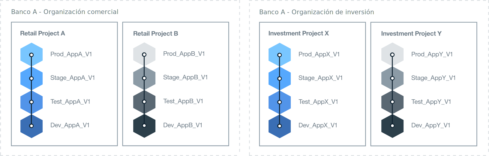

---

copyright:

  years: 2015, 2017
lastupdated: "2017-04-07"

---

{:new_window: target="_blank"}
{:shortdesc: .shortdesc}
{:screen:.screen}
{:codeblock:.codeblock}

# Configuración del entorno de Bluemix
{: #patterns}

Para un proyecto satisfactorio, tómese tiempo para planificar y diseñar qué recursos necesita y cuáles son sus requisitos empresariales. Para ayudarle a empezar con el proyecto en la nube, tenga en cuenta las preguntas siguientes:

* ¿Cuántas aplicaciones se desarrollarán, y de qué tipo?
* ¿A qué servicios necesitarán acceder las aplicaciones?
* ¿Quién colaborará en el proceso de desarrollo y qué rol desempeñará?
* ¿Qué grado de aislamiento es necesario para cada fase del proyecto?
* ¿Proporcionará su empresa los recursos de la infraestructura?
* ¿Cómo se comunica su empresa?
* ¿Existe un estándar de denominación que pueda implementar para identificar claramente la organización y el uso de espacio?   

{:shortdesc}

Al diseñar una solución en la nube, piense también en la seguridad de la cuenta y en los requisitos operativos, en las regulaciones del país, en las directivas del mercado y en las políticas corporativas.
Para cubrir las necesidades del proyecto, {{site.data.keyword.Bluemix}} ofrece tres tipos de entornos de nube.

* [{{site.data.keyword.Bluemix_notm}} Público](/docs/overview/whatisbluemix.html "{{site.data.keyword.Bluemix_notm}} Public"): Los recursos de infraestructura los comparten distintas empresas y usuarios.
* [{{site.data.keyword.Bluemix_notm}} Dedicado](/docs/dedicated/index.html#dedicated "{{site.data.keyword.Bluemix_notm}} Dedicated"): Utilice su propia infraestructura de SoftLayer dedicada, que puede conectar de forma segura a la nube Pública de {{site.data.keyword.Bluemix_notm}} y a su propia red.
* [{{site.data.keyword.Bluemix_notm}} Local](/docs/local/index.html#local "{{site.data.keyword.Bluemix_notm}} Local"): Se encuentra detrás del cortafuegos de la empresa, que puede proteger sus cargas de trabajo más sensibles y puede conectarse de forma segura a las nubes Pública de {{site.data.keyword.Bluemix_notm}} y Dedicada de {{site.data.keyword.Bluemix_notm}}.

Como parte de la decisión de qué tipo de entorno de nube necesita, planifique la estructura de su cuenta, de las organizaciones, de los espacios, de los recursos y de los miembros del equipo.

Para la mayoría de las empresas, es suficiente con una sola cuenta de {{site.data.keyword.Bluemix_notm}}. Para empresas más grandes, donde hay más de un área empresarial, es posible que desee
una cuenta independiente de {{site.data.keyword.Bluemix_notm}} para cada dominio empresarial. Por ejemplo, dentro de una entidad bancaria de gran tamaño, puede que haya cuentas independientes para los sectores de venta al pormenor y comerciales.

En la tabla siguiente se proporciona un resumen de algunos de los elementos clave.

| Elemento   | Descripción |
|---------------------------------------|--------------------------------------------------------------------------------------|
| Cuenta   | Cada cuenta tiene un propietario de cuenta. |
|| Contiene una o más organizaciones. Debe tener una cuenta Pago según uso para crear más de una organización. |
| Propietario de la cuenta   | Responsable de todos los cargos de uso acumulados dentro de la cuenta. |
|| Solo puede tener una cuenta. |
|| Puede añadir uno o varios gestores de la organización para delegar la gestión de la organización, lo que incluye los permisos de lectura y escritura en las organizaciones. |
|| Puede ser un miembro del equipo en organizaciones y espacios de otras cuentas de {{site.data.keyword.Bluemix_notm}}. |
| Organización   | Contiene uno o varios espacios. |
|| Contiene uno o varios gestores de la organización. |
|| Contiene uno o varios miembros del equipo. A cada miembro del equipo se le puede otorgar uno o varios roles. |
|| Los cargos de uso, generados por una aplicación desplegada dentro de un espacio, se notifican al nivel de organización. |
| Espacio   | Contiene uno o varios recursos. |
|| Contiene una o varias aplicaciones. |
|| Contiene uno o varios gestores de espacios. |
|| Contiene uno o varios miembros del equipo. Cada usuario ya debe ser un miembro del equipo en la organización de su propiedad. A cada miembro del equipo se le puede otorgar uno o varios roles. |
| Miembro de equipo   | Puede añadirse a una o varias organizaciones y espacios en distintas cuentas. |
|| Se le puede dar más de un rol en la misma organización, espacio, o ambos. |
{:caption="Tabla 1. Descripción de elementos clave" caption-side="top"}

## Determinación de su entorno de {{site.data.keyword.Bluemix_notm}}
{: #bpimplementation}

En lugar de la metodología tradicional y estrictamente definida de desarrollo, prueba y producción, puede implementar un entorno donde los desarrolladores y los probadores puedan colaborar junto a otros miembros del equipo. Si diseña la forma en la que desea desarrollar y entregar sus aplicaciones, puede crear espacios de {{site.data.keyword.Bluemix_notm}} para satisfacer dicha metodología. En lugar de diseñar el entorno desde el nivel inferior de la organización, considere la posibilidad de diseñar el entorno de {{site.data.keyword.Bluemix_notm}} desde el nivel superior del espacio.

Tenga en cuenta la escala y el ámbito de las aplicaciones que tiene intención de desarrollar y de desplegar. Se puede utilizar un espacio de {{site.data.keyword.Bluemix_notm}} como un entorno de desarrollo para una o varias aplicaciones que están estrechamente conectadas o definidas. Además de un espacio de desarrollo, por ejemplo, es posible que desee crear espacios para las pruebas de unidad, las pruebas de rendimiento y las pruebas de integración. Los espacios también pueden estar definidos para la compilación, la transferencia y la producción. Cada uno de los espacios que cree se pueden compartir con distintos miembros del equipo dentro de la misma organización.

Cree organizaciones de {{site.data.keyword.Bluemix_notm}} independientes cuando haya personas trabajando en distintas áreas empresariales y donde sus actividades no se solapen. Si hay dos grupos totalmente independientes, la creación de una organización para cada uno de ellos define los límites claros para la entrega y la gestión de los profesionales y los recursos del equipo. Puede definir una API para la comunicación entre las organizaciones.  

Las organizaciones de {{site.data.keyword.Bluemix_notm}} pueden crearse para que coincidan con el modo en que desea trabajar en lugar de con la estructura de una empresa. Normalmente, las organizaciones de la empresa pueden cambiar, pero el desarrollo y el mantenimiento de una aplicación continuará independientemente.
Diseñe el entorno de {{site.data.keyword.Bluemix_notm}} durante el tiempo de vida de las aplicaciones y no en la estructura de organización de la empresa.

El desarrollo y el despliegue iterativos pueden dar lugar a que las aplicaciones se expandan rápidamente. El diseño del proceso de entrega debe ser capaz de aumentar de forma rápida y sencilla. Deseará un desarrollo continuo con una tasa de despliegue rápida. Tener los espacios de desarrollo y de producción en la misma organización de {{site.data.keyword.Bluemix_notm}} proporcionará acceso a los mismos recursos. La gestión de distintos espacios dentro de una sola organización reduce la sobrecarga administrativa. El personal de desarrollo, de prueba y de operaciones puede colaborar fácilmente si está trabajando dentro de la misma organización de {{site.data.keyword.Bluemix_notm}}.

Implemente un estándar de denominación para identificar claramente el uso de la organización y del espacio. Por ejemplo, puede incluir el tipo de nube, la región geográfica, el tipo de uso (por ejemplo, dev, test, prod), el nombre de aplicación, y el número de versión o de revisión. Las organizaciones y los espacios se podrán identificar fácilmente para fines de administración y de acceso.  

El número de espacios se puede multiplicar rápidamente debido al desarrollo iterativo. Puede definir tantos espacios como necesite dentro de una organización. Si tiene previsto definir un gran número de espacios, es posible que desee crear una aplicación para ayudar a gestionar los espacios. Cuando el número de espacios supere los sesenta, es posible que desee definir otra organización.

Haga que una persona cree y gestione una organización, defina los espacios y otorgue acceso a los miembros del equipo. Se puede otorgar el mismo acceso a una segunda persona para mantener el entorno cuando el gestor de la organización no esté disponible.  

Identifique todas las personas que necesitarán acceso a cada espacio y organización. Determine su rol. El rol de trabajo de un miembro del equipo determinará su autoridad. Por ejemplo, un desarrollador sénior necesitará la autorización para ver y actualizar todo el entorno de desarrollo de {{site.data.keyword.Bluemix_notm}}. Sin embargo, un desarrollador junior tendrá limitación en lo que pueda ver y actualizar.

## Determinación de la arquitectura de la organización
{: #orgstructure}

Para diseñar un entorno de nube que utilice {{site.data.keyword.Bluemix_notm}} Público, {{site.data.keyword.Bluemix_notm}} Dedicado, {{site.data.keyword.Bluemix_notm}} Local, o cualquier combinación, puede utilizar las siguientes arquitecturas de organización:

* Organización única: Considere la posibilidad de utilizar esta arquitectura si necesita el mismo conjunto de usuarios para acceder a los recursos disponibles en cualquier lugar de la organización en {{site.data.keyword.Bluemix_notm}} Público, {{site.data.keyword.Bluemix_notm}} Dedicado, o {{site.data.keyword.Bluemix_notm}} Local.
* Organización múltiple: Considere la posibilidad de utilizar esta arquitectura si necesita aislamiento entre distintos entornos de {{site.data.keyword.Bluemix_notm}} Público, {{site.data.keyword.Bluemix_notm}} Dedicado, o {{site.data.keyword.Bluemix_notm}} Local.

### Una única organización en comparación con varias organizaciones
{: #singleormulti}

En un entorno de organización única, los recursos de infraestructura los comparten distintas áreas de
la empresa. Sin embargo, en un entorno de organización múltiple, los recursos de infraestructura no se comparten.

Las dos arquitecturas de organización dan soporte a los siguientes principios:

* Imposición de límites para aplicaciones, proyectos, o ambos.
* Autorización para gestionar recursos otorgados por el rol de usuario.

Para implementar la arquitectura de una organización única, cree una cuenta en {{site.data.keyword.Bluemix_notm}} Público, {{site.data.keyword.Bluemix_notm}} Dedicado o
{{site.data.keyword.Bluemix_notm}} Local, y defina una organización. A continuación, puede definir varios espacios que se basan en distintas líneas de negocio (LOB),
las fases de entrega, proyectos específicos, aplicaciones, permisos de usuarios, o una combinación de estos componentes.

Para implementar una arquitectura de organización múltiple, cree una cuenta en {{site.data.keyword.Bluemix_notm}} Público, {{site.data.keyword.Bluemix_notm}} Dedicado,
o {{site.data.keyword.Bluemix_notm}} Local. A continuación, puede definir las organizaciones que se corresponden con distintas LOB, fases de entrega,
proyectos específicos, permisos de usuarios, o una combinación de estos componentes. A continuación, puede definir diversos espacios que se basan en aplicaciones o proyectos entregados por el mismo departamento de la empresa.

**Nota:** Debe tener una cuenta facturable, como por ejemplo Pago según uso o Suscripción, para definir varias organizaciones.

### Consideraciones sobre la organización
{: #orgconsiderations}

Al implementar una arquitectura de organización única, la organización incluirá todos los recursos de nube, los servicios y las aplicaciones que puede utilizar para desarrollar, gestionar y
desplegar aplicaciones de nube. En {{site.data.keyword.Bluemix_notm}} Público, la organización proporciona segregación entre cuentas y está disponible en todas las regiones.

 

 Figura 1. Ejemplo de una arquitectura de organización única para {{site.data.keyword.Bluemix_notm}} Público, {{site.data.keyword.Bluemix_notm}} Dedicado y
{{site.data.keyword.Bluemix_notm}} Local
{: #bpfigure1}

Al implementar una arquitectura de organización múltiple, las organizaciones proporcionarán el primer nivel de imposición de límites y de abstracción, que puede utilizar para controlar y definir qué se puede hacer y quién lo puede hacer. Diseñe cada organización en torno a las distintas LOB, las fases de entrega, los roles de los usuarios, los proyectos específicos, o una combinación de estos componentes.  

El número de organizaciones que necesita depende de varios factores:

* El nivel de granularidad que necesita dentro de su organización para gestionar cuotas y costes de control.
* El nivel de seguridad que debe imponer en los distintos entornos. Por ejemplo, si está utilizando contenedores, es posible que desee segregar imágenes de contenedor que se utilizan para el desarrollo a partir de imágenes del contenedor que se utilizan para la producción.
* La ubicación de las organizaciones debido a requisitos corporativos, del país y del sector. Por ejemplo, puede que desee ejecutar todas las apps en una nube dedicada ubicada en una región específica de su geografía (geo).

Cuando está definiendo las distintas organizaciones para la estructura de nube, tenga en cuenta la orientación siguiente:

* Defina y, a continuación, aplique un convenio de denominación. Por ejemplo, defina un convenio de denominación donde el nombre de la organización incluya información sobre el área de negocio, el tipo de nube ({{site.data.keyword.Bluemix_notm}} Pública, {{site.data.keyword.Bluemix_notm}} Local, o {{site.data.keyword.Bluemix_notm}} Dedicada), y la fase del proceso (desarrollo, pruebas o producción). Para las organizaciones que se encuentran en {{site.data.keyword.Bluemix_notm}} Público, es posible que desee añadir también información sobre la región.
* Defina las restricciones que se aplican a la organización. Por ejemplo, defina el rol de los miembros del equipo que van a trabajar en dicha organización.
* Identifique al gestor de la organización.
* Identifique el área de la empresa que se asigna a esta organización.

Los casos de ejemplo siguientes muestran distintos enfoques que puede adoptar al definir el número de organizaciones de {{site.data.keyword.Bluemix_notm}} en un entorno de nube:
* **Caso de ejemplo 1: Segregación de los grupos de usuarios por entrega de aplicación empresarial**

 Descripción: Las reglas empresariales requieren que las apps de cada LOB deban estar desarrolladas, gestionadas y desplegadas por los usuarios de cada LOB. Se debe imponer seguridad para que los usuarios sólo puedan acceder a las apps que sean relevantes para su parte del negocio. Por lo tanto, los usuarios trabajan en distintas áreas de negocio, las aplicaciones en las que están trabajando necesitan acceso a distintos recursos de {{site.data.keyword.Bluemix_notm}}, y no hay solapamiento de actividades.

  Solución: Puede crear una organización para cada proceso de entrega de aplicación empresarial. Por ejemplo, una organización para banca comercial, y otra para banca de inversión.

  

  Figura 2. Ejemplo de una arquitectura de varias organizaciones alineada con la entrega de LOB
{: #bpfigure2}

* **Caso de ejemplo 2: Segregación basada en el tipo de usuarios (usuarios internos, usuarios externos)**

  Descripción: Su empresa trabaja con distintos socios y necesita límites claros entre los usuarios internos y externos.

  Solución: Puede crear una organización para entregar aplicaciones que se utilizan internamente. Además, puede crear una organización para cada socio externo.

* **Caso de ejemplo 3: Aislamiento por proyecto**

  Descripción: Su empresa ejecuta hackathons para identificar servicios nuevos.  

  Solución: Puede definir una organización por hackathon y utilizar la organización como un recinto de pruebas. Después del hackathon, puede promover la organización del recinto de pruebas en una organización adicional de su cuenta.

* **Caso de ejemplo 4: Aislamiento de usuarios por fase de entrega**

  Descripción: Una empresa desea usuarios de desarrollo, de prueba y de producción para que colaboren en una entrega, pero su acceso está controlado por el rol del usuario y la experiencia laboral.

  Solución: Puede crear una única organización y definir un espacio para cada fase de entrega. A continuación, en función del rol de usuario y de la experiencia laboral, otorgue el acceso de lectura y de escritura que necesiten para finalizar su trabajo y colaborar también dentro de la organización.

  

   Figura 3. Ejemplo de una arquitectura de organización única alineada por fase de entrega
{: #bpfigure3}

### Denominación, restricciones y gestión de la organización 
{: #orgadmin}   

Tenga en cuenta la siguiente orientación de organización:

* Defina y aplique un convenio de denominación. Por ejemplo, defina un convenio de denominación donde el nombre de la organización incluya información sobre el área de negocio, el tipo de nube ({{site.data.keyword.Bluemix_notm}} Público, {{site.data.keyword.Bluemix_notm}} Local, o {{site.data.keyword.Bluemix_notm}} Dedicado), y el rol de TI (desarrollo, prueba o producción). Para las organizaciones que se encuentran en {{site.data.keyword.Bluemix_notm}} Público, es posible que desee añadir también información sobre la región. Puede cambiar el nombre de una organización una vez que esté creada. Si el nombre de una organización se altera, notifique a todos los miembros del equipo de la organización sobre el cambio.
* Defina las restricciones que se aplican a la organización. Por ejemplo, defina el rol de cada uno de los miembros del equipo y los permisos que necesitan para trabajar en dicha organización.
* Identifique al gestor de la organización. Es posible que desee delegar la administración de la organización a más de una persona.
* Identifique el área de la empresa que se asigna a esta organización. El uso de la aplicación que se genera en cada uno de los espacios, dentro de la organización, se acumula y se notifica a nivel de organización.

## Determinación de sus espacios
{: #determinespaces}

Dentro de una organización, los espacios proporcionan un nivel adicional de cumplimiento y abstracción de los límites.

Un espacio es un área reservada de la organización donde los usuarios pueden desarrollar y ejecutar aplicaciones y servicios. En una organización podrá crear tantos espacios como desee y controlar los usuarios que tendrán acceso a dichos espacios. Consulte [Espacios](/docs/admin/orgs_spaces.html#spaceinfo "Espacios") para obtener información más detallada. 

Si tiene previsto definir un gran número de espacios, es posible que desee crear una aplicación para ayudar a gestionar los espacios. Cuando el número de espacios supere los sesenta, es posible que desee definir otra organización.

### Espacios para una única organización en comparación con varias organizaciones
{: #spaceconsiderations}

Cuando se adopta una arquitectura de organización única, el nivel de segregación y de abstracción se proporciona mediante los espacios que define en la organización. Tenga en cuenta lo siguiente al definir espacios:

* Defina un espacio para alojar un servicio que necesite suministro y configuración sólo una vez en la organización.
* Defina espacios basados en el ciclo de vida de entrega.
  Por ejemplo, puede definir uno o varios espacios para aplicaciones que se están desarrollando, uno o varios espacios para aplicaciones que se encuentran en fase de prueba, y una o varios espacios para aplicaciones que están en producción.
* Si el límite del ciclo de vida de entrega no es suficiente, puede conseguir más segregación definiendo uno o varios espacios por LOB y fase de entrega.
* Identifique si necesita imponer límites para distintos grupos de usuarios.
  Por ejemplo, sus desarrolladores no pueden desarrollar la aplicación ni probarla. Necesita un conjunto distinto de usuarios para probar la aplicación. En este caso de ejemplo, cree dos espacios, uno para los desarrolladores de la aplicación y otro para sus probadores. A continuación, otorgue cada conjunto de acceso de usuarios al espacio correcto.

Al implementar una arquitectura con varias organizaciones, puede segregar cada organización mediante el LOB, el ciclo de vida de entrega, o ambos. A continuación, puede definir
varios espacios, que se basan en el número de aplicaciones o proyectos que entrega el mismo departamento de la empresa. Tenga en cuenta lo siguiente como guía cuando se planifican los espacios de una organización:

* Defina un espacio para alojar un servicio que necesite suministro y configuración sólo una vez en la organización.
* Defina un espacio por aplicación, por grupo de aplicaciones relacionadas, o por proyecto específico.
* Si necesita imponer límites para distintos usuarios, defina un espacio para cada conjunto de usuarios. Cuando a un usuario se le otorga un rol de desarrollador en un espacio, dicho usuario tendrá acceso completo a todos los recursos y servicios de {{site.data.keyword.Bluemix_notm}} suministrados y en ejecución en dicho espacio. Cuando necesite imponer una seguridad más estricta para impedir que los usuarios controlen todos los recursos, tenga en cuenta la posibilidad de definir distintos espacios. Dentro de cualquiera de estos espacios, puede suministrar servicios de {{site.data.keyword.Bluemix_notm}} que utilizarán las apps que se ejecutan en dicho espacio.

### Denominación, restricciones y gestión del espacio  
{: #spaceadmin}

Para definir los distintos espacios para la organización de la nube, tenga en cuenta las siguientes instrucciones:

* Defina y aplique un convenio de denominación. Por ejemplo, defina un convenio de denominación donde el nombre de espacio incluya información sobre el lugar donde está ubicada la organización y el tipo de nube ({{site.data.keyword.Bluemix_notm}} Público, {{site.data.keyword.Bluemix_notm}} Dedicado o {{site.data.keyword.Bluemix_notm}} Local). Puede cambiar el nombre de un espacio una vez que se haya creado. Si se altera un nombre de espacio, notifique a todos los miembros del equipo del espacio sobre el cambio.
* Defina las restricciones que se aplican al espacio. Por ejemplo, defina el tipo de aplicaciones que se pueden desarrollar, gestionar y desplegar en cada espacio.
* Identifique al gestor del espacio. Es posible que desee delegar la administración del espacio a más de una persona.

## Determinación de la cuota para una organización
{: #determinequota}

Al crear una organización en {{site.data.keyword.Bluemix_notm}}, suministrará recursos de infraestructura entre los que se incluyen recursos como la memoria, IP (Internet Protocol, protocolo de Internet), servidores y almacenamiento:
*	Para {{site.data.keyword.Bluemix_notm}} Público, IBM asignará un conjunto mínimo de recursos a una organización. En función del tipo de cuenta, tendrá distintas asignaciones de recursos. Estos recursos definen la cuota asignada por IBM a una organización.
*	Para {{site.data.keyword.Bluemix_notm}} Dedicado, solicite un conjunto de recursos a IBM, y a continuación podrá distribuirlos entre las distintas organizaciones del entorno de nube de {{site.data.keyword.Bluemix_notm}} Dedicado.
*	Para {{site.data.keyword.Bluemix_notm}} Local, proporcione los recursos y entonces podrá distribuirlos entre las organizaciones del entorno de nube de {{site.data.keyword.Bluemix_notm}} Local.

Para {{site.data.keyword.Bluemix_notm}} Público y {{site.data.keyword.Bluemix_notm}} Dedicado, podrá solicitar recursos adicionales de IBM. Para {{site.data.keyword.Bluemix_notm}} Local, es responsable de proporcionar los recursos que puedan ser necesarios para gestionar su empresa en la nube local.

La cuota que se asigna a una organización representa los recursos disponibles de la organización. Gestione la cuota y decida cómo se distribuirán los recursos en la organización.

### Gestión y supervisión de la cuota
{: #managequota}

Gestione y supervise la cuota de una cuenta por espacio y por infraestructura. Cualquier recurso que se suministra en un espacio y que después utiliza la aplicación desplegada consume una parte de la cuota disponible para la organización.
* Para obtener más información sobre cómo ver y gestionar la cuota de una organización en {{site.data.keyword.Bluemix_notm}} Público, consulte [Gestión de cuota](/docs/admin/manageorg.html#managequota "Managing quota").
* Para obtener más información sobre cómo ver y gestionar la cuota de una organización en {{site.data.keyword.Bluemix_notm}} Dedicado o {{site.data.keyword.Bluemix_notm}} Local, consulte [Visualización de uso e informes](/docs/admin/index.html?pos=2#oc_resource "Visualización de uso e informes").

## Asignación de roles
{: #roles}

Puede otorgar varios roles a miembros del equipo en una cuenta de {{site.data.keyword.Bluemix_notm}}. Estos roles definen los permisos del usuario para gestionar los recursos de la cuenta y de la organización:
* Puede otorgar [roles de usuario](/docs/iam/users_roles.html#userrolesinfo "user roles") a miembros de una organización. Estos roles definen el nivel de acceso dentro de la organización, y restringen quién puede acceder a un espacio y a sus recursos. Por ejemplo, puede otorgar a los usuarios distintos permisos en distintos espacios.
* Sólo en {{site.data.keyword.Bluemix_notm}} Dedicado y {{site.data.keyword.Bluemix_notm}} Local, puede otorgar [roles administrativos](/docs/admin/index.html#oc_useradmin "administrative roles") a miembros de una cuenta para gestionar información del sistema, uso de los recursos de una cuenta, informes y registros, servicios de catálogo, usuarios y uso de recursos por organización.

### Propietario de la cuenta
{: #accountowner}

Tanto si diseña una arquitectura con varias organizaciones como una arquitectura con una única organización, el propietario de la cuenta será el superusuario del entorno de nube.

Entre las tareas principales del propietario de la cuenta se incluyen las siguientes:

* Gestión de los recursos de la cuenta global.
* Creación de organizaciones.
* Adición de los miembros del equipo a la cuenta.

Para añadir miembros del equipo a una cuenta, utilice la dirección de correo electrónico del usuario o una lista de direcciones de correo electrónico. En {{site.data.keyword.Bluemix_notm}} Dedicado y {{site.data.keyword.Bluemix_notm}} Local, también puede utilizar el LDAP de la empresa para añadir usuarios, grupos de usuarios, o ambos. También puede importar usuarios desde un archivo. Para obtener más información, consulte [Gestión de usuarios y permisos](/docs/admin/index.html#oc_useradmin "Managing users and permissions").

El propietario de cuenta también puede realizar las tareas siguientes:

* Añada uno o varios usuarios como gestores de una organización asignando a estos usuarios el rol **Gestor**. Considere la posibilidad de añadir dos usuarios como gestores de la organización. El primer usuario actúa como el gestor principal de la organización. El segundo usuario actúa como el gestor adjunto, en caso de que el gestor principal no esté disponible.
* En {{site.data.keyword.Bluemix_notm}} Público, y dependiendo del [tipo de cuenta](/docs/pricing/index.html#pay-accounts "account type"), estableciendo notificaciones de gasto. En primer lugar, el propietario de la cuenta definirá los umbrales que se utilizan para alertarle de cuando los costes lleguen a un determinado límite. A continuación, [configurará las notificaciones por correo electrónico](/docs/admin/account.html#notifications "configures email notifications"). El gestor de la cuenta puede utilizar la información de los mensajes de correo electrónico como notificaciones de alerta y pueden realizar acciones en función de la información proporcionada, por ejemplo actualizando la cuenta. **Nota:** El propietario de la cuenta es la única persona que puede recibir correos electrónicos de notificaciones de gasto.
* Añada uno o varios usuarios como administradores de la cuenta asignando a estos usuarios el rol **Admin**. Considere la posibilidad de añadir un mínimo de dos usuarios. El primer usuario actúa como el administrador principal de la cuenta. El segundo usuario actúa como el administrador adjunto.
* Defina las notificaciones de la cuenta para informar sobre las actualizaciones de mantenimiento o las alertas de incidencias críticas. Estas notificaciones se pueden configurar para enviar un correo electrónico o un SMS (Short Message Service, servicio de mensajes cortos).

### Roles de usuario
{: #userroles}

Los roles de usuario definen los permisos que puede asignar a un miembro del equipo en una organización y definen el nivel de acceso que tiene un miembro del equipo dentro de la organización y de cada espacio.

En una arquitectura con varias organizaciones o con una única organización, defina los miembros del equipo y los permisos que necesita cada usuario para completar su trabajo:

1. Identifique el conjunto de usuarios que necesitan acceso a una organización.
2. Defina los permisos para cada miembro del equipo en la organización y en un espacio de la organización.
3. Seleccione el rol que otorga a un usuario los permisos que necesita.

   * Gestor de organización
   * Auditor de organización
   * Gestor de facturación de organización
   * Gestor de espacio
   * Desarrollador de espacio
   * Auditor de espacio

#### Gestor de organización
{: #bporgmgr}

Entre las tareas de las que un gestor de la organización es responsable se incluyen la creación de espacios, la distribución de la cuota entre los espacios, la invitación de los miembros del equipo y, opcionalmente, la otorgación a los mismos de roles específicos, y la definición de dominios personalizados.

#### Auditor de organización
{: #bporgauditor}

Los miembros del equipo con el rol **Auditor** de la organización pueden supervisar la cuota, el uso de recursos y los miembros del equipo para todos los espacios de una organización.
Los auditores podrán entonces informar sobre la eficiencia de la organización y resaltar cualquier problema potencial.

* Al adoptar una arquitectura con varias organizaciones, es posible que desee otorgar el rol de auditor a los mismos miembros del equipo para todas las organizaciones que formen parte de la cuenta.
A continuación, estos miembros del equipo pueden supervisar la cuota en todas las organizaciones del entorno de nube y obtener una vista global de la cuenta.
* Al adoptar una arquitectura con una única organización, otorgue el rol de auditor a los miembros del equipo con la responsabilidad para supervisar el uso de la cuota y la eficiencia global
de la organización.

#### Gestor de facturación de organización
{: #bporgbillingmgr}

Los miembros del equipo con el rol **Gestor de facturación** pueden supervisar los costes de una organización.

* Al adoptar una arquitectura con varias organizaciones, es posible que desee otorgar el rol de facturación al mismo conjunto de miembros del equipo para todas las organizaciones que forman parte de la cuenta. A continuación, estos miembros del equipo podrán supervisar el coste de cada organización y obtener una vista global de la cuenta.
* En una arquitectura con una única organización, identifique los usuarios que son responsables de la supervisión del coste.

#### Gestor de espacio
{: #bpspacemgr}

El **Gestor** del espacio es responsable de cualquier trabajo que se realice dentro del espacio que gestiona y controla. El gestor de espacios puede realizar las tareas siguientes:

* Supervisar la cuota asignada al espacio.
* Solicitar recursos adicionales al gestor de la organización.
* Notificar al gestor de la organización sobre los recursos que no son necesarios.
* Añadir miembros del equipo al espacio con el rol **Desarrollador**.
* Opcionalmente, asignar el rol **Gestor** de espacio a un miembro del equipo para que actúe como gestor de espacio adjunto en su ausencia.

#### Desarrollador de espacio
{: #bpspacedev}

Un desarrollador de espacio puede realizar las tareas siguientes:

* Gestionar aplicaciones de Cloud Foundry.
* Suministrar y configurar servicios de {{site.data.keyword.Bluemix_notm}}.
* Asociar dominios a aplicaciones.

#### Auditor de espacio
{: #bpspaceauditor}

Para todos los espacios, es posible que desee otorgar el rol **Auditor** de espacio a los mismos miembros del equipo con el rol **Auditor** de la organización. En la empresa, este rol se podría otorgar a un conjunto de usuarios específico.

### Roles administrativos para cuentas locales y dedicadas
{: #adminroles}

Los [roles administrativos](/docs/hybrid/index.html#oc_useradmin "Gestión de usuarios y permisos") definen los permisos que puede otorgar a los usuarios para gestionar una cuenta {{site.data.keyword.Bluemix_notm}} Dedicado o {{site.data.keyword.Bluemix_notm}} Local.
Puede otorgar permisos de lectura o de grabación para permitir que un usuario vea información del sistema, uso de los recursos de la cuenta, informes y registros, servicios de catálogo, usuarios, y uso de recursos por organización.

En una arquitectura con varias organizaciones o con una única organización, defina los usuarios y los permisos que necesita cada usuario para gestionar la cuenta:

1. Identifique el conjunto de usuarios del equipo de la administración de la nube y otórgueles los permisos de administración relevantes. Incluya los gestores de la organización como miembros de este equipo.
2. Defina los permisos para estos usuarios en la cuenta. Divida permisos para gestionar el catálogo y los informes entre los usuarios del equipo.
3. Seleccione uno o varios roles para cada usuario para que coincidan con los permisos necesarios para gestionar la cuenta:

   * Rol de administrador: Los usuarios tendrán la autorización para gestionar toda la organización. 
   * Rol de usuario: Los gestores de organización con permisos de escritura pueden añadir usuarios a la cuenta y sus organizaciones. Los gestores de organización con permisos de lectura pueden ver la lista de miembros en la cuenta. 
   * Rol de catálogo: Los usuarios con permisos de escritura pueden definir y gestionar los iniciadores y servicios de Bluemix visibles en el catálogo de {{site.data.keyword.Bluemix_notm}} para los usuarios. 
   * Rol de informes: Los usuarios con permisos de escritura pueden ver y añadir informes que otros usuarios con permisos de lectura pueden descargar. Otorgue permisos de lectura a todos los miembros del equipo de administración.
   * Rol de inicio de sesión: Otorgue este rol a todos los miembros del equipo de administración. También puede otorgar este rol a otros usuarios de la cuenta que necesitan acceso para ver las notificaciones de la cuenta y la información del sistema.
