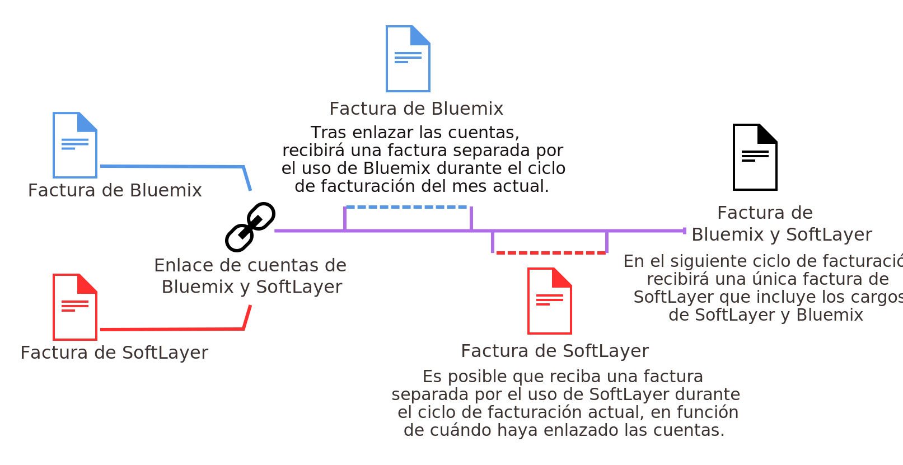

---

 

copyright:

  years: 2016, 2017
lastupdated: "2017-01-11"
 

---

{:shortdesc: .shortdesc}
{:codeblock: .codeblock}
{:screen: .screen}
{:new_window: target="_blank"}

# Actualización y unificación de las cuentas de facturación de {{site.data.keyword.Bluemix_notm}} y SoftLayer
{: #softlayerlink}

Si tiene una cuenta de prueba de {{site.data.keyword.Bluemix_notm}} y desea acceder al panel de control Infraestructura, debe actualizar a una cuenta de Pago según uso de {{site.data.keyword.Bluemix_notm}}. También debe actualizar si desea utilizar otros recursos facturables que no están disponibles dentro de una cuenta de prueba, o si su cuenta de prueba finaliza. 

Puede unificar las cuentas de facturación existentes de {{site.data.keyword.Bluemix_notm}} y SoftLayer enlazando las cuentas. Cuando enlace las cuentas, se le facturará mediante {{site.data.keyword.Bluemix_notm}} para ambos recursos de {{site.data.keyword.Bluemix_notm}} y SoftLayer.

**Atención:** Una cuenta de suscripción de {{site.data.keyword.Bluemix_notm}} no se puede enlazar con una cuenta de SoftLayer. Para acceder al panel de control Infraestructura, debe crear una cuenta Pago según uso, una segunda cuenta, que se enlaza automáticamente con una cuenta SoftLayer. A continuación, recibirá dos facturas, una para cada cuenta de {{site.data.keyword.Bluemix_notm}}. Aunque los recursos de la infraestructura se facturarán en una cuenta Pago según uso independiente, los recursos se pueden utilizar con aplicaciones y servicios en su cuenta de suscripción. Por ejemplo, si activa un servicio de Watson en su cuenta de suscripción, puede copiar las credenciales de servicio y, a continuación, añadir las credenciales a la aplicación nativa que se obtiene de la cuenta Pago según uso.
{:shortdesc}

## Actualización a una cuenta de Pago según uso de {{site.data.keyword.Bluemix_notm}}
{: #upgradetopayg}

Cuando inicia una sesión en {{site.data.keyword.Bluemix_notm}} utilizando una cuenta de prueba, no podrá acceder al panel de control de Infraestructura de {{site.data.keyword.Bluemix_notm}}. Si desea que sus aplicaciones utilicen los recursos de infraestructura, debe actualizar a una cuenta de Pago según uso.

Para actualizar su cuenta de prueba a una cuenta de Pago según uso de {{site.data.keyword.Bluemix_notm}}, siga estos pasos:

 1. Pulse **Cuenta** &gt; **Facturación**.
 2. A continuación, pulse **Añadir tarjeta de crédito**.
 3. Especifique los detalles de facturación necesarios. 
 4. Lea y acepte los términos y las condiciones para la cuenta de Pago según uso. 
 5. Una vez haya terminado, pulse **Actualizar**. 
 
Una vez que haya actualizado a una cuenta Pago según uso, las opciones de **Infraestructura** se listarán en el **Catálogo** de {{site.data.keyword.Bluemix_notm}}. Si utiliza más que la concesión gratuita, recibirá una factura mensual de {{site.data.keyword.Bluemix_notm}}. La factura estará en dólares de Estados Unidos (USD) y detallará los cargos de recursos. 

## Unificación de sus cuentas de {{site.data.keyword.Bluemix_notm}} y SoftLayer
{: #unifyingaccounts}

Puede unificar las cuentas de {{site.data.keyword.Bluemix_notm}} y SoftLayer para hacer uso de los recursos combinados. Cuando enlace las cuentas de {{site.data.keyword.Bluemix_notm}} y Softlayer, recibirá una factura única de {{site.data.keyword.Bluemix_notm}}. Si ya tiene una cuenta de {{site.data.keyword.Bluemix_notm}}, la facturación a través de {{site.data.keyword.Bluemix_notm}} para los recursos de SoftLayer será efectiva para el nuevo ciclo de facturación que empieza una vez que se han enlazado las cuentas.

**Importante:** todas las cuentas vinculadas en {{site.data.keyword.Bluemix_notm}} deben ser cuentas Pago según uso. Se puede crear una cuenta Pago según uso nueva o enlazar con una cuenta existente de este tipo. También puede enlazar una cuenta de prueba, pero se actualizará a una cuenta Pago según uso. No se pueden enlazar las cuentas de suscripción a {{site.data.keyword.Bluemix_notm}}.  

Una vez que se hayan enlazado las cuentas:

* Debe utilizar las credenciales de ID de IBM para acceder a sus cuentas tanto de SoftLayer como de {{site.data.keyword.Bluemix_notm}}.
* Cualquier descuento existente de SoftLayer se aplicará en cargos de {{site.data.keyword.Bluemix_notm}}. 
* Recibirá una factura en dólares de Estados Unidos (USD).
* Puede supervisar el uso de los recursos de
{{site.data.keyword.BluSoftlayer}} en la interfaz de usuario de {{site.data.keyword.Bluemix_notm}}. 

**Atención:** una vez que las cuentas estén enlazadas, no podrá desenlazarlas. 

Si tiene una cuenta SoftLayer, y desea enlazar cuentas de SoftLayer y {{site.data.keyword.Bluemix_notm}}, siga estos pasos:

 1. Desde {{site.data.keyword.slportal}}, haga clic en **Enlaza a una cuenta {{site.data.keyword.Bluemix_notm}}**.
 2. Lea y acepte las condiciones para enlazar cuentas de SoftLayer y {{site.data.keyword.Bluemix_notm}}.
 3. Cuando se le solicite, proporcione la dirección de correo electrónico asociada con su cuenta de {{site.data.keyword.Bluemix_notm}}. Si no tiene ninguna cuenta de {{site.data.keyword.Bluemix_notm}}, especifique la dirección de correo electrónico que desea utilizar y siga las instrucciones para ser invitado a {{site.data.keyword.Bluemix_notm}} y crear una cuenta.

Debe ser usuario maestro en la cuenta de SoftLayer para enlazar cuentas.

Después de enlazar las cuentas, el enlace **Ir a {{site.data.keyword.Bluemix_notm}}** aparece disponible en la cabecera global de SoftLayer. Al hacer clic en este enlace, accederá a la página de inicio de sesión de {{site.data.keyword.Bluemix_notm}}. Además, el enlace de **SoftLayer** estará disponible en la cabecera de {{site.data.keyword.Bluemix_notm}}. Al hacer clic en este enlace, accederá a la página de inicio de {{site.data.keyword.slportal}} en una nueva ventana.

Las ofertas de infraestructura de {{site.data.keyword.Bluemix_notm}} están conectadas a una red de tres capas, que segmenta tráfico público, privado y de gestión. Las ofertas de infraestructura de una cuenta de {{site.data.keyword.Bluemix_notm}} del cliente pueden transferir datos entre sí mediante la red privada sin coste adicional. Las ofertas de infraestructura, como los servidores nativos, los servidores virtuales y el almacenamiento en nube, se conectan con otras aplicaciones y servicios del catálogo de {{site.data.keyword.Bluemix_notm}}, como por ejemplo servicios, contenedores o tiempos de ejecución de Watson, en la red pública. La transferencia de datos entre estos dos tipos de ofertas se mide y se carga en tasas estándares de ancho de banda de red públicas.

## Invitación a miembros del equipo de SoftLayer a {{site.data.keyword.Bluemix_notm}}
{: #invite_users}

Puede invitar a los miembros de su equipo de SoftLayer para que se unan a {{site.data.keyword.Bluemix_notm}} al enlazar las cuentas de {{site.data.keyword.Bluemix_notm}} y SoftLayer. También puede invitar a los miembros del equipo de SoftLayer desde la interfaz de usuario de {{site.data.keyword.Bluemix_notm}}.
{:shortdesc}

Desde la interfaz de usuario de {{site.data.keyword.Bluemix_notm}}, puede invitar a todos los miembros de su cuenta de SoftLayer o bien seleccionar solo a determinados miembros. Al invitar a miembros del equipo, debe establecer el rol de la cuenta de {{site.data.keyword.Bluemix_notm}} para los invitados. Para obtener más información sobre los distintos roles en {{site.data.keyword.Bluemix_notm}}, consulte [Roles de usuario](https://console.ng.bluemix.net/docs/admin/users_roles.html#userrolesinfo).

Debe ser usuario maestro en la cuenta de SoftLayer para invitar a miembros a la cuenta de {{site.data.keyword.Bluemix_notm}}.

Para invitar a los miembros del equipo mediante {{site.data.keyword.Bluemix_notm}}, siga estos pasos:

 1. Pulse **Cuenta** &gt; **Invitar a miembros del equipo**.
 2. Pulse **Añadir** para autenticarse en la cuenta de SoftLayer y ver una lista de los miembros del equipo de su cuenta de {{site.data.keyword.BluSoftlayer}}.
 3. Seleccione a los miembros del equipo que desee invitar y pulse **Enviar**.
 
El miembro del equipo recibe un correo electrónico que incluye un enlace **Únase a la organización**. Si el miembro del equipo no tiene ID de IBM, se le redirige a una página de registro. A continuación, el miembro del equipo puede entrar información básica y crear su cuenta de {{site.data.keyword.Bluemix_notm}}.

Para obtener más información sobre cómo invitar a miembros a través de la interfaz de usuario de {{site.data.keyword.Bluemix_notm}}, consulte [Invitar a miembros del equipo](https://console.ng.bluemix.net/docs/admin/users_roles.html#inviteteammembers).

## Cambiar al ID de IBM
{: #ibmid_switch}

La autenticación en SoftLayer ahora utiliza el ID de IBM para proporcionar un inicio de sesión único para todo {{site.data.keyword.Bluemix_notm}}. Las cuentas existentes de SoftLayer se están habilitando para poder cambiar a la autenticación mediante ID de IBM y el asistente de migración le guiará por este proceso de cambio.
{:shortdesc}

Si es un usuario maestro y no ve el indicador para conmutar a un ID de IBM en el {{site.data.keyword.slportal}}, [póngase en contacto con el equipo de soporte de IBM](https://console.ng.bluemix.net/docs/support/index.html#contacting-support) para obtener ayuda para habilitar esta característica. 

Cuando empiece a conmutar al ID de IBM, siempre puede cancelar la conmutación antes de finalizar el proceso. Sin embargo, se le seguirá solicitando que cambie al ID de IBM la próxima vez que inicie sesión. Cada cuenta que piense enlazar a la cuenta de {{site.data.keyword.Bluemix_notm}} debe ser propiedad de un ID de IBM exclusivo con una dirección de correo electrónico exclusiva. 

Para cambiar su nombre de usuario de SoftLayer existente por un ID de IBM, siga estos pasos:

 1. Si ha seleccionado **Más tarde** en el indicador inicial después de iniciar la sesión pero ha decidido que desea empezar a cambiar a la autenticación con ID de IBM en la sesión actual, vaya a la página Editar perfil de usuario y pulse **Cambiar a ID de IBM**.
 2. Siga las indicaciones del asistente para crear el ID de IBM. El ID de IBM es una dirección de correo electrónica exclusiva y no se puede modificar después de que se cree. Puede actualizar el correo electrónico asociado con el perfil más adelante; de forma predeterminada dicho valor se establece como lo que se ha definido para el ID de IBM. Recibirá un correo electrónico con su código de registro que le indicará que ha completado el asistente de migración.  
 3. Cuando reciba el correo electrónico, siga el enlace o copie el URL en un navegador y especifique el código de registro. El código es válido durante 7 días y solo se puede utilizar una vez. 
 
 
Después de cambiar a autenticación con ID de IBM, solo podrá iniciar la sesión en su cuenta con su ID de IBM. En el indicador de inicio de sesión, pulse **Iniciar sesión con el ID de IBM** en lugar de especificar el nombre de usuario y contraseña de SoftLayer.
 
Si consulta su pedido como cliente nuevo, se le pedirá una dirección de correo electrónico para la cuenta del ID de IBM existente o que cree una cuenta nueva del ID de IBM. Si crea un nuevo ID de IBM, escriba la dirección de correo electrónico del nuevo ID de IBM. El correo electrónico de invitación se enviará a esta dirección de correo electrónico, que también constituye el nombre de usuario para el nuevo ID de IBM. 

### Cómo permitir a los usuarios que cambien a un ID de IBM
{: #link_accounts_resellers}

En algunos casos, para que un usuario pueda cambiar a un ID de IBM, el concesionario o distribuidor debe habilitar la cuenta para que utilice la autenticación con ID de IBM.  

 * Para permitir que una cuenta existente con credenciales antiguas de SoftLayer utilice la autenticación con ID de IBM, [póngase en contacto con el equipo de soporte de IBM](https://console.ng.bluemix.net/docs/support/index.html#contacting-support) para que habilite la migración a ID de IBM. Este debe estar habilitado para cada cuenta existente de usuario final que desee enlazar a una cuenta de {{site.data.keyword.Bluemix_notm}}. 
 
 * Para garantizar que las nuevas cuentas de usuario se creen con un ID de IBM, se debe establecer el atributo `CREATE_NEW_ACCOUNT_WITH_IBMid_AUTHENTICATION` en la cuenta de usuario maestro. [Póngase en contacto con el equipo de soporte de IBM](https://console.ng.bluemix.net/docs/support/index.html#contacting-support) o con su proveedor para que establezca este atributo para sus cuentas. 
 
### Enlace de sus cuentas de usuario
{: #link_user_accounts}
Después de que los usuarios cambien a la autenticación con ID de IBM, los concesionarios y distribuidores pueden enlazar cuentas de SoftLayer y de {{site.data.keyword.Bluemix_notm}}. 

**Nota:** 
  * El usuario maestro de la cuenta que se enlaza debe ser un ID de IBM. 
  * Inicie una sesión en cada cuenta de usuario final como usuario maestro. Vaya a la página de perfil de usuario y pulse **Cambiar al ID de IBM**.
  * Cada cuenta que enlace a la cuenta de {{site.data.keyword.Bluemix_notm}} debe ser propiedad de un ID de IBM exclusivo con una dirección de correo electrónico exclusiva. Aunque un ID de IBM puede poseer varias cuentas de SoftLayer, no puede enlazar las cuentas a cuentas de {{site.data.keyword.Bluemix_notm}}. Si un ID de IBM es el usuario maestro de varias cuentas de SoftLayer y desea enlazar dichas cuentas a cuentas de {{site.data.keyword.Bluemix_notm}}, debe cambiar los usuarios maestros para disponer de un ID de IBM exclusivo para cada cuenta. Póngase en contacto con el [equipo de soporte de IBM SoftLayer ](https://knowledgelayer.softlayer.com/topic/support){: new_window} para cambiar el usuario maestro en una cuenta de SoftLayer. 
  
Siga estos pasos para enlazar cada cuenta a una cuenta de {{site.data.keyword.Bluemix_notm}}:  

 1. Para crear una nueva cuenta de {{site.data.keyword.Bluemix_notm}} o para enlazar con una cuenta de {{site.data.keyword.Bluemix_notm}} existente, inicie una sesión en la cuenta de SoftLayer como usuario maestro y pulse el enlace **{{site.data.keyword.Bluemix_notm}}**. Esto le ofrecerá la oportunidad de crear una nueva cuenta de {{site.data.keyword.Bluemix_notm}} o de enlazar con una cuenta existente de {{site.data.keyword.Bluemix_notm}}. El ID de IBM que constituya el usuario maestro para la cuenta de SoftLayer debe ser propietario de la cuenta de Bluemix con la que está enlazando. Siga las indicaciones del asistente, incluida la adición de los usuarios de la cuenta de SoftLayer a la cuenta de {{site.data.keyword.Bluemix_notm}}.  
 2. Después de enlazar la cuenta, indique a los usuarios finales de la cuenta que migren al ID de IBM. Luego los usuarios finales podrán acceder a los paneles de control de infraestructura, aplicaciones y servicios de la consola de {{site.data.keyword.Bluemix_notm}}. 
 3. Cuando se añadan nuevos usuarios a la cuenta enlazada, tendrá que añadirlos a la cuenta de SoftLayer y a la cuenta de {{site.data.keyword.Bluemix_notm}} para que tengan acceso a todas las funciones de la consola unificada. 
 
**Recomendación:** migre únicamente cuentas de usuario final a un ID de IBM. No migre cuentas derivadas, que son cuentas padre de cuentas de usuario final y no contienen recursos. Los usuarios de cuentas derivadas que migren a un ID de IBM pierden la posibilidad de iniciar una sesión en el portal de Brand Agent Portal (BAP). 

<!--
### Mapping multiple SoftLayer accounts to one IBMid
{: #map_multiple_accounts}

You can associate one IBMid with multiple SoftLayer accounts by using an existing IBMid email address when setting up the account. Only one SoftLayer user for each account can be mapped to the single IBMid. The IBMid must be unique within each SoftLayer account. However, one user with access to multiple SoftLayer accounts can use one IBMid to access multiple SoftLayer accounts.

For example, an IBMid can map to the master user in accounts A and B, and to an additional user in accounts C and D. One of the accounts mapped to that IBMid is the default account.  Usually, the default account is the account that was first mapped to the IBMid. However, you can switch which account is the default account  through an account switching feature in the Customer Portal.

For a user with IBMid access to multiple accounts with two-factor authentication enabled, an appropriate two-factored authentication verification code per account is required during account log in and account switching.
-->

## Utilización de servicios de {{site.data.keyword.Bluemix_notm}} con activos de SoftLayer
{: #bluemix_services}

Puede utilizar servicios de {{site.data.keyword.Bluemix_notm}} públicos basados en API con sus activos de SoftLayer. Todas las API son seguras y están cifradas para proteger sus datos.
{:shortdesc}

Por ejemplo, ¿ha querido alguna vez añadir capacidades cognitivas de Watson a sus aplicaciones que se ejecutan en servidores nativos desde SoftLayer? Puede añadir un servicio como {{site.data.keyword.personalityinsightsshort}} para entender el usuario de la aplicación en cuatro pasos sencillos:

1. Busque el servicio en el catálogo de {{site.data.keyword.Bluemix_notm}}.
2. Especifique una instancia del servicio con tan solo unas pulsaciones.
3. Configure el servicio para que se ejecute con el código existente copiando las credenciales del servicio y añadiéndolas a la aplicación.
4. Después de actualizar la aplicación, despliegue la nueva versión en la infraestructura de SoftLayer.

Puede obtener conocimientos sobre *Insights and Cognitive* invocando las API de Watson desde sus aplicaciones en SoftLayer para personalizarlas. O bien puede utilizar servicios de *Datos y análisis* para realizar un análisis más profundo del rendimiento para sus aplicaciones. Asimismo, puede seleccionar una base de datos como servicio cuando deje la gestión en manos de {{site.data.keyword.Bluemix_notm}}.

Modernice el desarrollo de sus aplicaciones utilizando contenedores con servicios como {{site.data.keyword.activedeployshort}} y {{site.data.keyword.deliverypipeline}}. Luego puede utilizar el servicio {{site.data.keyword.vpn_short}} para comunicarse con SoftLayer para conectar el contenedor de una red privada a la red privada de SoftLayer. Todos los cargos por uso de los recursos y servicios de cálculo se reflejan en la factura de {{site.data.keyword.Bluemix_notm}}. 

### Servicios de {{site.data.keyword.Bluemix_notm}} basados en API
No todos los servicios de {{site.data.keyword.Bluemix_notm}} pueden utilizarse con SoftLayer. Los siguientes servicios se pueden configurar para ejecutarse con el código de la aplicación:
* {{site.data.keyword.alchemyapishort}}
* {{site.data.keyword.alertnotificationshort}}
* {{site.data.keyword.sparks}}
* {{site.data.keyword.appseccloudshort}}
* {{site.data.keyword.blockchain}}
* {{site.data.keyword.cloudant}}
* {{site.data.keyword.conceptinsightsshort}}
* {{site.data.keyword.iotmapinsights_short}}
* {{site.data.keyword.dashdbshort}}
* {{site.data.keyword.dialogshort}}
* {{site.data.keyword.documentconversionshort}}
* {{site.data.keyword.twittershort}}
* {{site.data.keyword.weather_short}}
* {{site.data.keyword.iotdriverinsights_short}}
* {{site.data.keyword.geospatialshort_Geospatial}}
* {{site.data.keyword.graphshort}}
* {{site.data.keyword.iotelectronics}}
* {{site.data.keyword.languagetranslationshort}}
* {{site.data.keyword.messagehub}}
* {{site.data.keyword.mqa}}
* {{site.data.keyword.mobileappbuilder_short}}
* {{site.data.keyword.mql}}
* {{site.data.keyword.nlclassifierlshort}}
* {{site.data.keyword.objectstorageshort}}
* {{site.data.keyword.personalityinsightsshort}}
* {{site.data.keyword.presenceinsightsshort}}
* {{site.data.keyword.relationshipextractionshort}}
* {{site.data.keyword.retrieveandrankshort}}
* {{site.data.keyword.speechtotextshort}}
* {{site.data.keyword.sqldb}}
* {{site.data.keyword.streaminganalyticsshort}}
* {{site.data.keyword.texttospeechshort}}
* {{site.data.keyword.toneanalyzershort}}
* {{site.data.keyword.tradeoffanalyticsshort}}
* {{site.data.keyword.visualinsightsshort}}
* {{site.data.keyword.visualrecognitionshort}}
* {{site.data.keyword.workflow}}
* {{site.data.keyword.workloadscheduler}}

**Nota:** no todos los planes de estos servicios están disponibles. Para utilizar con las cuentas enlazadas, solo están disponibles los planes habilitados para cuentas Pago según uso. Sin embargo, puede utilizar cualquier plan para cualquiera de estos servicios si tiene una cuenta de {{site.data.keyword.Bluemix_notm}} independiente que se factura por separado.

## Facturación para el uso de {{site.data.keyword.Bluemix_notm}} cuando las cuentas están enlazadas
{: #bill_usage}

Una vez que haya enlazado sus cuentas de facturación de {{site.data.keyword.Bluemix_notm}} y SoftLayer, el siguiente ciclo de facturación se cargará en una única factura de {{site.data.keyword.Bluemix_notm}}.
{:shortdesc}

El ciclo de uso de {{site.data.keyword.Bluemix_notm}} se basa en meses naturales, por lo que la cuenta se factura cada mes el día de facturación que se estableció para su acuerdo de cargo. Con SoftLayer, el ciclo de uso empieza al empezar a utilizar SoftLayer, por lo que la facturación es cada mes, el día en el que se registró para la cuenta de SoftLayer. 

Cuando las cuentas estén enlazadas, el uso de {{site.data.keyword.Bluemix_notm}} seguirá midiéndose para el ciclo mensual y dicho uso se facturará en una factura de {{site.data.keyword.Bluemix_notm}}. A partir del día 1 del siguiente mes, los cargos de {{site.data.keyword.Bluemix_notm}} y SoftLayer se combinarán en la factura de {{site.data.keyword.Bluemix_notm}}.

Por ejemplo, si enlazó las cuentas el 16 de abril, recibirá una factura de Bluemix para su uso de abril. Según cuándo haya enlazado las cuentas, podrá obtener una factura independiente para el uso de SoftLayer. Su uso de mayo para SoftLayer y {{site.data.keyword.Bluemix_notm}} se facturará mediante su cuenta de {{site.data.keyword.Bluemix_notm}}.

Una vez que se enlacen las facturas, la factura de {{site.data.keyword.Bluemix_notm}} listará los distintos cargos para cada recurso que haya utilizado en las siguientes cabeceras:

* **Servidores nativos y Servicios adjuntos**
* **Servidores virtuales y Servicios adjuntos**
* **Servicios no adjuntos**

Para obtener información sobre cómo ver el uso de {{site.data.keyword.Bluemix_notm}}, consulte [Visualización de detalles de uso](https://console.ng.bluemix.net/docs/pricing/index.html#usage).

