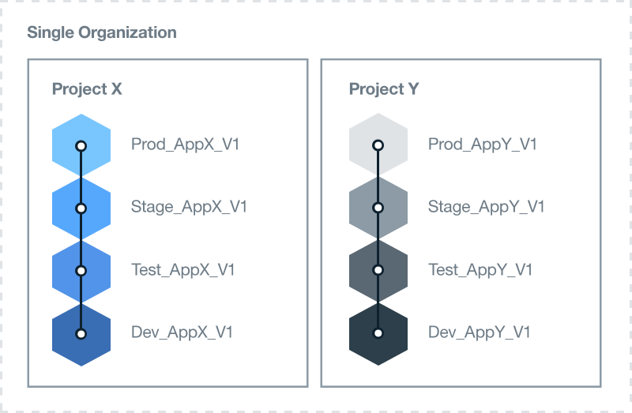

---

copyright:

  years: 2015, 2017
lastupdated: "2017-04-07"

---

{:new_window: target="_blank"}
{:shortdesc: .shortdesc}
{:screen:.screen}
{:codeblock:.codeblock}

# Configuration de votre environnement Bluemix 
{: #patterns}

Pour que votre projet aboutisse, prenez le temps de planifier et concevoir les ressources dont vous avez besoin et les exigences de votre entreprise. Pour vous aider à démarrer avec votre projet cloud, tenez compte des questions suivantes :

* Combien d'applications, et de quel type, seront développées ?
* Quels sont les services auxquels les applications auront besoin d'accéder ?
* Quelles sont les personnes qui participeront au processus de développement et quel sera le rôle de chacune d'elles ?
* Quel est le niveau d'isolement requis pour chaque phase du projet ?
* Les ressources d'infrastructure seront-elles fournies par votre entreprise ?
* De quelle manière votre société communique-t-elle ?
* Existe-t-il une norme de dénomination que vous pouvez implémenter pour identifier clairement l'utilisation de l'organisation et de l'espace ?   

{:shortdesc}

Lorsque vous concevez une solution de cloud, prenez également en compte les exigences de sécurité de compte et opérationnelles, la réglementation des pays, les directives du marché et les politiques d'entreprise.
Pour répondre aux besoins de votre projet, {{site.data.keyword.Bluemix}} offre trois types d'environnements de cloud.

* [Environnement {{site.data.keyword.Bluemix_notm}} public](/docs/overview/whatisbluemix.html "{{site.data.keyword.Bluemix_notm}} public") : les ressources d'infrastructure sont partagées par différentes sociétés et différents utilisateurs.
* [Environnement {{site.data.keyword.Bluemix_notm}} dédié](/docs/dedicated/index.html#dedicated "{{site.data.keyword.Bluemix_notm}} dédié") : vous utilisez votre propre infrastructure SoftLayer dédiée, que vous pouvez connecter de manière sécurisée au cloud {{site.data.keyword.Bluemix_notm}} public et à votre propre réseau.
* [{{site.data.keyword.Bluemix_notm}} local](/docs/local/index.html#local "{{site.data.keyword.Bluemix_notm}} Local") : se trouve derrière le pare-feu de votre entreprise et peut protéger les charges de travail les plus sensibles et se connecter de manière sécurisée aux clouds {{site.data.keyword.Bluemix_notm}} public et  {{site.data.keyword.Bluemix_notm}} dédié.

Lorsque vous déterminez le type d'environnement de cloud dont vous avez besoin, planifiez la structure de votre compte, de vos organisations, de vos espaces, de vos ressources et des membres de votre équipe.

Pour la plupart des entreprises, un seul compte {{site.data.keyword.Bluemix_notm}} suffit. Pour les entreprises de grande taille, comprenant plusieurs domaines métier, vous souhaiterez peut-être disposer d'un compte {{site.data.keyword.Bluemix_notm}} distinct pour chacun d'eux. Par exemple, une compagnie bancaire de grande taille peut disposer de comptes distincts pour le secteur de la vente au détail et le secteur commercial.

Le tableau suivant fournit un récapitulatif de certains des éléments clés.

| Elément   | Description |
|---------------------------------------|--------------------------------------------------------------------------------------|
| Compte   | Il existe un propriétaire de compte pour chaque compte. |
|| Contient une ou plusieurs organisations. Vous devez disposer d'un compte de type Paiement à la carte pour créer plusieurs organisations. |
| Propriétaire de compte   | Responsable de l'ensemble des frais d'utilisation accumulés dans le compte. |
|| Ne peut posséder qu'un seul compte. |
|| Peut ajouter un ou plusieurs responsables d'organisation afin de déléguer la gestion de l'organisation, ce qui inclut les droits d'accès en lecture et en écriture aux organisations. |
|| Peut être un membre d'équipe dans des organisations et des espaces dans d'autres comptes {{site.data.keyword.Bluemix_notm}}. |
| Organisation   | Contient un ou plusieurs espaces. |
|| Contient un ou plusieurs responsables d'organisation. |
|| Contient un ou plusieurs membres d'équipe. Chaque membre d'équipe peut se voir accorder un ou plusieurs rôles. |
|| Les frais d'utilisation, générés par une application déployée dans un espace, sont signalés au niveau de l'organisation. |
| Espace   | Contient une ou plusieurs ressources. |
|| Contient une ou plusieurs applications. |
|| Contient un ou plusieurs responsables d'espace. |
|| Contient un ou plusieurs membres d'équipe. Chaque utilisateur doit déjà être un membre d'équipe dans l'organisation propriétaire. Chaque membre d'équipe peut se voir accorder un ou plusieurs rôles. |
| Membre d'équipe   | Peut être ajouté à une ou plusieurs organisations et à un ou plusieurs espaces sur différents comptes. |
|| Peut se voir accorder plusieurs rôles au sein d'une même organisation et/ou d'un même espace. |
{:caption="Tableau 1. Description des éléments clés" caption-side="top"}

## Détermination de votre environnement {{site.data.keyword.Bluemix_notm}}
{: #bpimplementation}

Au lieu de la méthodologie de production, de test et de développement traditionnelle strictement définie, vous pouvez implémenter un environnement dans lequel les développeurs et les testeurs peuvent collaborer avec d'autres membres d'équipe. Si vous concevez la façon dont vous souhaitez développer et distribuer vos applications, vous pouvez créer des espaces {{site.data.keyword.Bluemix_notm}} permettant d'atteindre cette méthodologie. Au lieu de concevoir votre environnement au niveau de l'organisation (inférieur), pensez à concevoir votre environnement {{site.data.keyword.Bluemix_notm}} au niveau de l'espace (supérieur).

Tenez compte de l'échelle et de la portée des applications que vous prévoyez de développer et déployer. Un espace {{site.data.keyword.Bluemix_notm}} peut être utilisé en tant qu'environnement de développement pour une ou plusieurs applications rigoureusement connectées ou définies. Hormis un espace de développement, par exemple, vous souhaiterez peut-être créer des espaces pour un test unitaire, un test de performance et un test d'intégration. Des espaces peuvent également être définis pour la génération, le transfert et la production. Chacun des espaces que vous créez peut être partagé par différents membres d'équipe au sein d'une même organisation.

Créez des organisations {{site.data.keyword.Bluemix_notm}} distinctes lorsque des personnes travaillent dans différents domaines métier et que leurs activités ne se chevauchent pas. S'il existe deux groupes totalement indépendants, la création d'une organisation pour chacun d'eux définit des limites précises pour la distribution et la gestion des membres d'équipe et des ressources. Vous pouvez définir une API permettant la communication entre les organisations.  

Des organisations {{site.data.keyword.Bluemix_notm}} peuvent être créées afin de correspondre à la façon dont vous souhaitez travailler plutôt qu'à la structure au sein d'une société. En général, même s'il arrive que des organisations de société soient modifiées, rien ne peut empêcher la poursuite du développement et de la maintenance d'une application.
Concevez votre environnement {{site.data.keyword.Bluemix_notm}} pour la durée de vie des applications et non selon la structure d'organisation de votre société.

Un développement et un déploiement itératifs peuvent engendrer une extension rapide des applications. La conception de votre processus de distribution doit pouvoir s'adapter rapidement et facilement. Vous souhaiterez bénéficier d'un développement en continu avec un taux de déploiement rapide. Le fait d'avoir des espaces de développement et de production dans la même organisation {{site.data.keyword.Bluemix_notm}} permet d'accéder aux mêmes ressources. Le fait de gérer différents espaces au sein d'une même organisation réduit la surcharge administrative. Le personnel du développement, des tests et des opérations peut collaborer facilement s'il ne travaille pas dans la même organisation {{site.data.keyword.Bluemix_notm}}.

Implémentez une norme de dénomination pour identifier clairement l'utilisation de l'organisation et de l'espace. Par exemple, vous pouvez inclure le type de cloud, la région géographique, le type d'utilisation (par exemple, développement, test et production), le nom d'application et le numéro de version ou de révision. Les organisations et les espaces peuvent ensuite être facilement identifiés à des fins d'administration et d'accès.  

Le nombre d'espaces peut croître rapidement dans le cadre d'un développement itératif. Vous pouvez définir autant d'espaces que nécessaire au sein d'une organisation. Si vous prévoyez de définir un grand nombre d'espaces, vous souhaiterez peut-être créer une application dédiée à la gestion des espaces. Pour plus de soixante espaces, vous pouvez envisager de définir une autre organisation.

Chargez une personne de créer et gérer une organisation, de définir les espaces et d'accorder un accès aux membres d'équipe. Une seconde personne peut se voir accorder le même accès pour gérer l'environnement lorsque le responsable de l'organisation n'est pas disponible.  

Identifiez toutes les personnes qui devront accéder à chaque espace et à chaque organisation. Déterminez leur rôle. Le rôle professionnel d'un membre d'équipe détermine ses droits d'accès. Par exemple, un développeur confirmé disposera des droits nécessaires pour visualiser et mettre à jour l'ensemble de l'environnement de développement {{site.data.keyword.Bluemix_notm}}. En revanche, un développeur débutant ne pourra visualiser et mettre à jour que la partie de l'environnement de développement qui lui a été affectée.

## Détermination de votre architecture d'organisation
{: #orgstructure}

Pour concevoir un environnement de cloud qui utilise un environnement {{site.data.keyword.Bluemix_notm}} public, {{site.data.keyword.Bluemix_notm}} dédié, {{site.data.keyword.Bluemix_notm}} local ou n'importe quelle combinaison de ces environnements, vous pouvez utiliser les architectures d'organisation suivantes :

* Organisation unique : envisagez d'utiliser cette architecture si vous souhaitez qu'un même groupe d'utilisateurs puisse accéder aux ressources disponibles dans l'organisation, que ce soit dans l'environnement {{site.data.keyword.Bluemix_notm}} public, l'environnement {{site.data.keyword.Bluemix_notm}} dédié ou l'environnement {{site.data.keyword.Bluemix_notm}} local.
* Plusieurs organisations : envisagez d'utiliser cette architecture si vous avez besoin d'isoler différents environnements au sein de {{site.data.keyword.Bluemix_notm}} public, de {{site.data.keyword.Bluemix_notm}} dédié ou de {{site.data.keyword.Bluemix_notm}} local.

### Organisation unique/Plusieurs organisations
{: #singleormulti}

Dans un environnement à organisation unique, les ressources d'infrastructure sont partagées par différents secteurs de la société. En revanche, dans un environnement avec plusieurs organisations, les ressources d'infrastructure ne sont pas partagées.

Chacune de ces architectures d'organisation prend en charge les principes suivants :

* Application des limites pour les applications et/ou les projets
* Autorisation de gestion des ressources accordée en fonction des rôles utilisateur

Pour implémenter une architecture à organisation unique, créez un compte dans {{site.data.keyword.Bluemix_notm}} public, {{site.data.keyword.Bluemix_notm}} dédié ou {{site.data.keyword.Bluemix_notm}} local, puis définissez une organisation. Vous pouvez ensuite définir plusieurs espaces correspondant à différents secteurs d'activité, aux phases de distribution, à des projets spécifiques, aux applications, aux autorisations utilisateur ou à une combinaison de ces composants.

Pour implémenter une architecture avec plusieurs organisations, créez un compte dans {{site.data.keyword.Bluemix_notm}} public, {{site.data.keyword.Bluemix_notm}} dédié ou {{site.data.keyword.Bluemix_notm}} local. Vous pouvez ensuite définir des organisations correspondant à différents secteurs d'activité, aux phases de distribution, à des projets spécifiques, aux autorisations utilisateur ou à une combinaison de ces composants. Vous pouvez ensuite définir plusieurs espaces basés sur des applications ou des projets qui sont fournis par le même service de la société.

**Remarque :** vous devez disposer d'un compte facturable, par exemple, un compte de type Paiement à la carte ou Abonnement, pour définir plusieurs organisations.

### Remarques relatives à l'organisation
{: #orgconsiderations}

Lorsque vous implémentez une architecture à organisation unique, l'organisation comprend l'ensemble des ressources, services et applications de cloud que vous utilisez pour développer, gérer et déployer des applications de cloud. Dans l'environnement {{site.data.keyword.Bluemix_notm}} public, l'organisation fournit la séparation des comptes et est disponible dans toutes les régions.

 

 Figure 1. Exemple d'une architecture à organisation unique pour un environnement {{site.data.keyword.Bluemix_notm}} public, un environnement {{site.data.keyword.Bluemix_notm}} dédié et un environnement {{site.data.keyword.Bluemix_notm}} local
{: #bpfigure1}

Lorsque vous implémentez une architecture avec plusieurs organisations, les organisations fournissent le premier niveau de l'application des limites et l'abstraction que vous pouvez utiliser pour contrôler et définir ce qui peut être effectué et par qui. Concevez chaque organisation autour des différents secteurs d'activité, des phases de distribution, des rôles des utilisateurs, de projets spécifiques ou d'une combinaison de ces composants.  

Le nombre d'organisations dont vous avez besoin dépend de plusieurs facteurs :

* Le niveau de granularité requis au sein de votre organisation pour gérer les quotas et contrôler les coûts.
* Le niveau de sécurité que vous devez appliquer dans vos différents environnements. Par exemple, si vous utilisez des conteneurs, vous souhaiterez peut-être séparer les images de conteneur qui sont utilisées pour le développement des images de conteneur qui sont utilisées pour la production.
* L'emplacement des organisations imposé par les exigences de l'entreprise, du pays et de l'industrie. Par exemple, vous souhaiterez peut-être exécuter toutes vos applications dans un cloud dédié situé dans une région spécifique de votre géographie.

Lorsque vous définissez les différentes organisations de votre structure en cloud, tenez compte des conseils suivants :

* Définissez et appliquez une convention de dénomination. Par exemple, définissez une convention de dénomination dans laquelle le nom de l'organisation inclut des informations sur le secteur d'activité, le type de cloud ({{site.data.keyword.Bluemix_notm}} public, {{site.data.keyword.Bluemix_notm}} local ou {{site.data.keyword.Bluemix_notm}} dédié) et la phase du processus (développement, test ou production). Pour les organisations situées dans {{site.data.keyword.Bluemix_notm}} public, vous souhaiterez peut-être ajouter également des informations sur la région.
* Définissez les restrictions qui s'appliquent à l'organisation. Par exemple, définissez le rôle des membres de l'équipe qui va travailler dans l'organisation.
* Identifiez le responsable de l'organisation.
* Identifiez le secteur d'activité attribué à cette organisation.

Les scénarios suivants illustrent les différentes approches que vous pouvez adopter pour définir le nombre d'organisations {{site.data.keyword.Bluemix_notm}} dans un environnement de cloud :
* **Scénario 1 : séparation de groupes d'utilisateurs par distribution d'application métier**

 Description : Les règles d'entreprise requièrent que les applications de chaque secteur d'activité soient développées, gérées et déployées par des utilisateurs issus de chaque secteur d'activité. Des mesures de sécurité doivent être appliquées de sorte que les utilisateurs puissent accéder uniquement aux applications qui concernent leur secteur d'activité. Ainsi, les utilisateurs travaillent dans différentes domaines d'activité, les applications sur lesquelles ils travaillent accèdent à différentes ressources {{site.data.keyword.Bluemix_notm}} et il n'existe aucun chevauchement d'activité.

  Solution : vous pouvez créer une organisation pour chaque processus de distribution d'application métier. Par exemple, une organisation dédiée au secteur de la banque aux particuliers et une autre dédiée au secteur de la banque d'investissement.

  

  Figure 2. Exemple d'une architecture avec plusieurs organisations alignées sur une distribution par secteur d'activité
{: #bpfigure2}

* **Scénario 2 : séparation basée sur un type d'utilisateur (utilisateurs internes, utilisateurs externes)**

  Description : votre société travaille avec différents partenaires et vous avez besoin de définir des limites claires entre les utilisateurs internes et les utilisateurs externes.

  Solution : vous pouvez créer une organisation pour fournir des applications utilisées en interne. En outre, vous pouvez créer une organisation pour chaque partenaire externe.

* **Scénario 3 : isolement par projet**

  Description : votre société conduit des hackathons pour identifier de nouveaux services.  

  Solution : vous pouvez définir une organisation par hackathon et utiliser l'organisation comme bac à sable. Après l'hackathon, vous pouvez promouvoir l'organisation de bac à sable dans une autre organisation de votre compte.

* **Scénario 4 : isolement d'utilisateurs par phase de distribution**

  Description : une société souhaite que des utilisateurs de développement, de test et de production collaborent à une distribution, mais les droits d'accès de ces utilisateurs sont déterminés par leur rôle utilisateur et leur expérience professionnelle.

  Solution : vous pouvez créer une organisation unique et définir un espace pour chaque phase de distribution. Ensuite, en fonction du rôle utilisateur et de l'expérience professionnelle, accordez les droits d'accès en lecture et en écriture requis pour réaliser le travail et collaborer au sein de l'organisation.

  

   Figure 3. Exemple d'une architecture à organisation unique alignée par phase de distribution
{: #bpfigure3}

### Dénomination, restrictions et gestion d'une organisation 
{: #orgadmin}   

Tenez compte des conseils suivants pour une organisation :

* Définissez et appliquez une convention de dénomination. Par exemple, définissez une convention de dénomination dans laquelle le nom de l'organisation inclut des informations sur le secteur d'activité, le type de cloud ({{site.data.keyword.Bluemix_notm}} public, {{site.data.keyword.Bluemix_notm}} local ou {{site.data.keyword.Bluemix_notm}} dédié) et le rôle informatique (développement, test ou production). Pour les organisations situées dans {{site.data.keyword.Bluemix_notm}} public, vous souhaiterez peut-être ajouter également des informations sur la région. Vous pouvez modifier le nom d'une organisation après l'avoir créée. Si le nom d'une organisation est modifié, prévenez tous les membres d'équipe de l'organisation de cette modification.
* Définissez les restrictions qui s'appliquent à l'organisation. Par exemple, définissez le rôle de chacun des membres de l'équipe et les droits requis pour travailler dans l'organisation.
* Identifiez le responsable de l'organisation. Vous souhaiterez peut-être déléguer l'administration de l'organisation à plusieurs personnes.
* Identifiez le secteur d'activité attribué à cette organisation. L'utilisation d'application qui est générée dans chacun des espaces au sein de l'organisation est accumulée et signalée au niveau de l'organisation.

## Détermination de vos espaces
{: #determinespaces}

Au sein d'une organisation, des espaces fournissent un niveau supplémentaire d'application de limites et d'abstraction.

Un espace est une zone réservée dans l'organisation où les utilisateurs peuvent développer et exécuter des applications et des services. Vous pouvez créer autant d'espaces que nécessaire dans une organisation et définir les utilisateurs pouvant accéder à un espace.
Voir [Espaces](/docs/admin/orgs_spaces.html#spaceinfo "Espaces") pour plus de détails. 

Si vous prévoyez de définir un grand nombre d'espaces, vous souhaiterez peut-être créer une application dédiée à la gestion des espaces. Pour plus de soixante espaces, vous pouvez envisager de définir une autre organisation.

### Espaces pour une organisation unique/pour plusieurs organisations
{: #spaceconsiderations}

Lorsque vous adoptez une architecture à organisation unique, le niveau de séparation et d'abstraction est fourni par les espaces que vous définissez dans l'organisation. Tenez compte des conseils suivants lorsque vous définissez des espaces :

* Définissez un espace qui héberge un service nécessitant une seule mise à disposition et une seule configuration dans l'organisation.
* Définissez des espaces basés sur le cycle de vie de distribution.
  Par exemple, vous pouvez définir un ou plusieurs espaces pour des applications en cours de développement, un ou plusieurs espaces pour des applications en phase de test et un ou plusieurs espaces pour des applications en production.
* Si les limites du cycle de vie de distribution ne sont pas suffisantes, vous pouvez obtenir davantage de séparation en définissant un ou plusieurs espaces par secteur d'activité et par phase de distribution.
* Déterminez si vous devez appliquer des limites pour différents groupes d'utilisateurs.
  Par exemple, vos développeurs ne peuvent pas développer l'application et la tester. Vous avez besoin d'un autre groupe d'utilisateurs pour tester l'application. Dans ce scénario, vous créez deux espaces, un pour les développeurs de l'application et l'autre pour les testeurs de l'application. Ensuite, vous accordez à chaque groupe d'utilisateurs les droits d'accès à l'espace approprié.

Lorsque vous implémentez une architecture avec plusieurs organisations, vous pouvez séparer chaque organisation par secteur d'activité et/ou cycle de vie de distribution. Vous pouvez ensuite définir plusieurs espaces basés sur le nombre d'applications ou de projets qui sont fournis par le même service de la société. Tenez compte des conseils suivants lorsque vous planifiez les espaces d'une organisation :

* Définissez un espace qui héberge un service nécessitant une seule mise à disposition et une seule configuration dans l'organisation.
* Définissez un espace par application, par groupe d'applications connexes ou pour un projet spécifique.
* Si vous devez appliquer des limites pour différents utilisateurs, définissez un espace pour chaque groupe d'utilisateurs. Lorsqu'un utilisateur se voit accorder un rôle de développeur dans un espace, il dispose d'un accès complet aux ressources et aux services {{site.data.keyword.Bluemix_notm}} mis à disposition et qui s'exécutent dans cet espace. Lorsque vous devez appliquer une sécurité renforcée pour empêcher les utilisateurs de contrôler chaque ressource, pensez à définir différents espaces. Au sein de chacun de ces espaces, vous pouvez mettre à disposition des services {{site.data.keyword.Bluemix_notm}} qui sont utilisés par les applications qui s'exécutent dans cet espace.

### Attribution d'un nom à un espace, restrictions et gestion  
{: #spaceadmin}

Lorsque vous définissez les différents espaces de votre organisation en cloud, tenez compte des conseils suivants :

* Définissez et appliquez une convention de dénomination. Par exemple, définissez une convention de dénomination dans laquelle le nom de l'espace inclut des informations sur l'emplacement de l'organisation et le type de cloud ({{site.data.keyword.Bluemix_notm}} public, {{site.data.keyword.Bluemix_notm}} dédié ou {{site.data.keyword.Bluemix_notm}} local). Vous pouvez modifier le nom d'un espace après l'avoir créé. Si le nom d'un espace est modifié, prévenez tous les membres d'équipe de l'espace de cette modification.
* Définissez les restrictions qui s'appliquent à l'espace. Par exemple, définissez le type d'application qui peut être développé, géré et déployé dans chaque espace.
* Identifiez le responsable de l'espace. Vous souhaiterez peut-être déléguer l'administration de l'espace à plusieurs personnes.

## Détermination d'un quota pour une organisation
{: #determinequota}

Lorsque vous créez une organisation dans {{site.data.keyword.Bluemix_notm}}, vous mettez à disposition des ressources d'infrastructure, telles que la mémoire, le protocole IP, les serveurs et l'espace de stockage :
*	Pour {{site.data.keyword.Bluemix_notm}} public, un ensemble minimum de ressources est alloué par IBM à une organisation. En fonction du type de compte, il existe différentes allocations de ressources. Ces ressources définissent le quota qui est alloué par IBM à une organisation.
*	Pour {{site.data.keyword.Bluemix_notm}} dédié, vous demandez un ensemble de ressources auprès d'IBM que vous pouvez ensuite distribuer entre les différentes organisations de votre environnement de cloud {{site.data.keyword.Bluemix_notm}} dédié.
*	Pour {{site.data.keyword.Bluemix_notm}} local, vous fournissez les ressources que vous pouvez ensuite distribuer entre les différentes organisations de votre environnement de cloud {{site.data.keyword.Bluemix_notm}} local.

Pour {{site.data.keyword.Bluemix_notm}} public et {{site.data.keyword.Bluemix_notm}} dédié, vous pouvez demander d'autres ressources auprès d'IBM. Pour {{site.data.keyword.Bluemix_notm}} local, il vous incombe de fournir toutes les ressources pouvant s'avérer nécessaires à l'exécution de votre activité dans le cloud local.

Le quota alloué à une organisation représente les ressources disponibles au sein de l'organisation. Vous gérez le quota et vous définissez le mode de distribution des ressources dans l'organisation.

### Gestion et surveillance des quotas
{: #managequota}

Vous gérez et surveillez le quota d'un compte par espace et par infrastructure. Toute ressource qui est mise à disposition dans un espace, puis utilisée par l'application déployée utilise une partie du quota disponible pour l'organisation.
* Pour plus d'informations sur l'affichage et la gestion du quota d'une organisation dans {{site.data.keyword.Bluemix_notm}} public, voir [Gestion du quota](/docs/admin/manageorg.html#managequota "Gestion du quota").
* Pour plus d'informations sur l'affichage et la gestion du quota d'une organisation dans l'environnement {{site.data.keyword.Bluemix_notm}} dédié ou l'environnement {{site.data.keyword.Bluemix_notm}} local, voir [Affichage de l'utilisation et des rapports](/docs/admin/index.html?pos=2#oc_resource "Affichage de l'utilisation et des rapports").

## Affectation de rôles
{: #roles}

Vous pouvez affecter plusieurs rôles à des membres d'équipe dans un compte {{site.data.keyword.Bluemix_notm}}. Ces rôles définissent les droits d'accès dont dispose l'utilisateur pour gérer les ressources de l'organisation :
* Vous pouvez accorder des [rôles utilisateur](/docs/iam/users_roles.html#userrolesinfo "rôles utilisateur") aux membres d'un organisation. Ces rôles définissent le niveau d'accès au sein de l'organisation et limitent les personnes habilitées à accéder à un espace et à ses ressources. Par exemple, vous pouvez accorder aux utilisateurs différents droits d'accès sur différents espaces.
* Dans {{site.data.keyword.Bluemix_notm}} dédié et {{site.data.keyword.Bluemix_notm}} local uniquement, vous pouvez accorder des [rôles d'administration](/docs/admin/index.html#oc_useradmin "rôles d'administration") aux membres d'un compte pour leur permettre de gérer des informations système, l'utilisation de ressources de compte, des rapports et des journaux, des services de catalogue, des utilisateurs et l'utilisation de ressources par organisation.

### Propriétaire de compte
{: #accountowner}

Lorsque vous concevez une architecture avec plusieurs organisations ou une architecture à organisation unique, le propriétaire de compte est le superutilisateur de l'environnement de cloud.

Les principales tâches du propriétaire de compte sont les suivantes :

* Gérer les ressources du compte global
* Créer des organisations
* Ajouter des membres d'équipe au compte

Pour ajouter des membres d'équipe à un compte, utilisez l'adresse électronique de l'utilisateur ou une liste d'adresses électroniques. Dans {{site.data.keyword.Bluemix_notm}} dédié ou {{site.data.keyword.Bluemix_notm}} local, vous pouvez également utiliser le protocole LDAP de la société pour ajouter des utilisateurs et/ou des groupes d'utilisateurs. Vous pouvez également importer des utilisateurs à partir d'un fichier. Pour plus d'informations, voir [Gestion des utilisateurs et des droits](/docs/admin/index.html#oc_useradmin "Gestion des utilisateurs et des droits").

Le propriétaire de compte peut également effectuer les tâches suivantes :

* Ajouter un ou plusieurs utilisateurs en tant que responsables d'une organisation en affectant à ces utilisateurs le rôle **Responsable**. Envisagez d'ajouter deux utilisateurs en tant que responsables de l'organisation. Le premier utilisateur joue le rôle de responsable principal de l'organisation. Le second utilisateur joue le rôle de responsable adjoint et agit si le responsable principal n'est pas disponible.
* Dans {{site.data.keyword.Bluemix_notm}} public et selon le [type de compte](/docs/pricing/index.html#pay-accounts "type de compte"), définir les notifications relatives aux dépenses. Le propriétaire de compte commence par définir les seuils qui sont utilisés pour l'alerter lorsque les coûts atteignent une certaine limite. Ensuite, il [configure les notifications par courrier électronique](/docs/admin/account.html#notifications "configure les notifications par courrier électronique"). Le responsable de compte peut utiliser les informations contenues dans les courriers électroniques comme notifications d'alerte et peut prendre des mesures basées sur ces informations, par exemple, procéder à la mise à niveau du compte. **Remarque :** le propriétaire de compte est la seule personne qui peut recevoir des courriers électroniques de notification relatifs aux dépenses.
* Ajouter un ou plusieurs utilisateurs en tant qu'administrateurs du compte en affectant à ces utilisateurs le rôle **Administrateur**. Envisagez d'ajouter au moins deux utilisateurs. Le premier utilisateur joue le rôle d'administrateur principal du compte. Le second utilisateur joue le rôle d'administrateur adjoint.
* Définir les notifications de compte afin de signaler des mises à jour de maintenance ou des alertes d'incident critique. Ces notifications peuvent être configurées pour envoyer un courrier électronique ou un SMS.

### Rôles utilisateur
{: #userroles}

Les rôles utilisateur définissent les droits d'accès que vous pouvez affecter à un membre d'équipe dans une organisation et spécifient le niveau d'accès d'un membre d'équipe au sein de l'organisation et de chaque espace.

Dans une architecture avec plusieurs organisations ou dans une architecture à organisation unique, définissez les membres d'équipe et les droits d'accès dont chaque utilisateur a besoin pour pouvoir effectuer pour son travail :

1. Identifiez le groupe d'utilisateurs qui a besoin d'accéder à une organisation.
2. Définissez les droits d'accès pour chaque membre d'équipe dans l'organisation et dans un espace de l'organisation.
3. Sélectionnez le rôle qui accorde à un utilisateur les droits d'accès dont il a besoin.

   * Responsable de l'organisation
   * Auditeur de l'organisation
   * Responsable de la facturation de l'organisation
   * Responsable de l'espace
   * Développeur de l'espace
   * Auditeur de l'espace

#### Responsable de l'organisation
{: #bporgmgr}

Le responsable de l'organisation est notamment chargé de créer des espaces, de distribuer le quota entre les espaces, d'inviter les membres d'équipe, et éventuellement de leur accorder des rôles spécifiques, et de définir des domaines personnalisés.

#### Auditeur de l'organisation
{: #bporgauditor}

Les membres d'équipe dotés du rôle **Auditeur** de l'organisation peuvent surveiller le quota, l'utilisation des ressources et les membres d'équipe pour tous les espaces de l'organisation.
Les auditeurs peuvent ensuite générer un rapport sur l'efficience de l'organisation et mettre en évidence les problèmes potentiels.

* Lorsque vous adoptez une architecture avec plusieurs organisations, vous avez la possibilité d'accorder le rôle Auditeur aux mêmes membres d'équipe dans chacune des organisations associées au compte.
Cela permet aux membres d'équipe de surveiller le quota dans toutes les organisations de votre environnement de cloud et de disposer d'une vue globale du compte.
* Lorsque vous adoptez une architecture à organisation unique, vous accordez le rôle Auditeur aux membres d'équipe et vous les chargez de surveiller l'utilisation du quota et l'efficience globale de l'organisation.

#### Responsable de la facturation de l'organisation
{: #bporgbillingmgr}

Les membres d'équipe dotés du rôle **Responsable de la facturation** de l'organisation peuvent surveiller les coûts de l'organisation.

* Lorsque vous adoptez une architecture avec plusieurs organisations, vous avez la possibilité d'accorder le rôle Responsable de la facturation aux mêmes membres d'équipe dans chacune des organisations associées au compte. Cela permet à ces membres d'équipe de surveiller le coût de chaque organisation et de disposer d'une vue globale du compte.
* Dans une architecture à organisation unique, identifiez les utilisateurs chargés de surveiller le coût.

#### Responsable de l'espace
{: #bpspacemgr}

Le **responsable de l'espace** est responsable de l'ensemble du travail effectué dans l'espace dont il assure la gestion et le contrôle. Le gestionnaire d'espace peut également effectuer les tâches suivantes :

* Surveiller le quota alloué à l'espace
* Demander des ressources supplémentaires au responsable de l'organisation
* Prévenir le responsable de l'organisation que des ressources ne sont pas requises
* Ajouter à l'espace des membres d'équipe dotés du rôle **Développeur**
* Le cas échéant, affecter le rôle **Responsable** de l'espace à un membre d'équipe pour permettre à celui-ci d'agir en tant que responsable d'espace adjoint en son absence

#### Développeur de l'espace
{: #bpspacedev}

Un développeur de l'espace peut effectuer les tâches suivantes :

* Gérer les applications Cloud Foundry
* Mettre à disposition et configurer les services {{site.data.keyword.Bluemix_notm}}
* Associer des domaines aux applications

#### Auditeur de l'espace
{: #bpspaceauditor}

Pour chaque espace, vous avez la possibilité d'accorder le rôle **Auditeur** de l'espace aux membres d'équipe qui disposent du rôle **Auditeur** de l'organisation. Dans votre entreprise, ce rôle devra peut-être être accordé à un groupe d'utilisateurs spécifique.

### Rôles d'administration pour les comptes dédiés et locaux 
{: #adminroles}

[Les rôles d'administration](/docs/hybrid/index.html#oc_useradmin "Gestion des utilisateurs et des droits") définissent les droits que vous pouvez accorder à des utilisateurs pour gérer un compte {{site.data.keyword.Bluemix_notm}} dédié ou un compte {{site.data.keyword.Bluemix_notm}} local.
Vous pouvez accorder des droits d'accès en lecture ou en écriture pour permettre à un utilisateur de visualiser des informations système, l'utilisation des ressources de compte, des rapports et des journaux, des services de catalogue, des utilisateurs et l'utilisation des ressources par organisation.

Dans une architecture avec plusieurs organisations ou dans une architecture à organisation unique, définissez les utilisateurs et les droits d'accès dont chaque utilisateur a besoin pour pouvoir gérer le compte :

1. Identifiez les membres de l'équipe d'administration et accordez-leur les droits d'accès d'administration appropriés. Ajoutez les responsables d'organisation comme membres de cette équipe.
2. Définissez les droits d'accès de ces utilisateurs dans le compte. Répartissez les droits d'accès entre les utilisateurs de cette équipe pour gérer le catalogue et les rapports.
3. Sélectionnez un ou plusieurs rôles pour chaque utilisateur en fonction des droits d'accès requis pour gérer le compte :

   * Rôle Admin : les utilisateurs peuvent gérer l'ensemble de l'organisation. 
   * Rôle Utilisateur : les responsables de l'organisation disposant de droits d'accès en écriture peuvent ajouter des utilisateurs au compte et à leurs organisations. Les responsables de l'organisation disposant de droits d'accès en lecture peuvent afficher la liste des membres du compte. 
   * Rôle Catalogue : les utilisateurs disposant de droits d'accès en écriture peuvent définir et gérer les services et les modules de démarrage Bluemix que les utilisateurs peuvent voir dans le catalogue {{site.data.keyword.Bluemix_notm}}. 
   * Rôle Rapports : les utilisateurs disposant de droits d'accès en écriture peuvent afficher et ajouter des rapports que d'autres utilisateurs disposant de droits d'accès en lecture peuvent télécharger. Accordez des droits d'accès en lecture à tous les membres de l'équipe d'administration.
   * Rôle Connexion : accordez ce rôle à à tous les membres de l'équipe d'administration. Vous pouvez également l'accorder aux autres utilisateurs qui ont besoin d'afficher les notifications de compte et les informations système.
