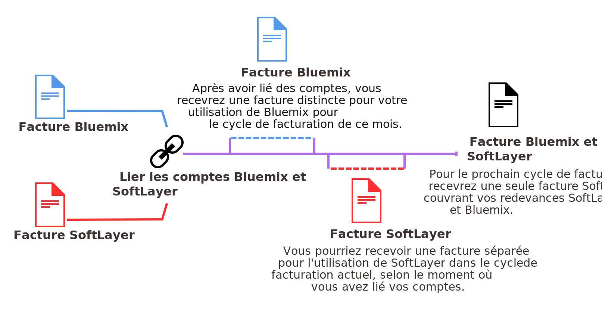

---

 

copyright:

  years: 2016, 2017
lastupdated: "2017-01-11"
 

---

{:shortdesc: .shortdesc}
{:codeblock: .codeblock}
{:screen: .screen}
{:new_window: target="_blank"}

# Mise à niveau et unification des comptes de facturation {{site.data.keyword.Bluemix_notm}} et SoftLayer
{: #softlayerlink}

Si vous disposez d'un compte d'essai {{site.data.keyword.Bluemix_notm}} et voulez accéder au tableau de bord Infrastructure, vous devez
procéder à la mise à niveau vers un compte {{site.data.keyword.Bluemix_notm}} Paiement à la carte. Vous devez également effectuer une mise à niveau si vous voulez utiliser d'autres ressources payantes qui ne sont pas disponible dans un compte d'essai ou une fois votre compte d'essai arrivé à expiration. 

Vous pouvez unifier vos comptes de facturation {{site.data.keyword.Bluemix_notm}} et SoftLayer en les liant. Lorsque vous liez vos
comptes, vous êtes facturé via {{site.data.keyword.Bluemix_notm}} pour l'utilisation de ressources {{site.data.keyword.Bluemix_notm}} et
SoftLayer.

**Attention :** Un compte d'abonnement {{site.data.keyword.Bluemix_notm}} ne peut pas être lié à un compte SoftLayer. Pour
accéder au tableau de bord Infrastructure, vous devez créer un compte Paiement
à la carte, un second compte qui est automatiquement lié à un
compte SoftLayer. Vous recevez ensuite deux factures, une pour chaque compte {{site.data.keyword.Bluemix_notm}}. Même
si vos ressources d'infrastructure sont facturées dans un compte Paiement à la
carte distinct, elles peuvent être utilisées avec les applications et les
services de votre compte d'abonnement. Ainsi, si vous activez un service Watson
dans votre compte d'abonnement, vous pouvez copier les données d'identification
du service et les ajouter à votre application Bare Metal provenant de
votre compte Paiement à la carte. 
{:shortdesc}

## Mise à niveau vers un compte {{site.data.keyword.Bluemix_notm}} Paiement à la carte
{: #upgradetopayg}

Lorsque vous vous connectez à {{site.data.keyword.Bluemix_notm}} avec un compte d'essai, vous ne parvenez pas à accéder au tableau de bord
Infrastructure {{site.data.keyword.Bluemix_notm}}. Si vous voulez que vos applications utilisent les ressources d'infrastructure, vous devez
procéder à la mise à niveau vers un compte Paiement à la carte.

Pour mettre à niveau votre compte d'essai vers un compte {{site.data.keyword.Bluemix_notm}} Paiement à la carte, procédez comme suit :

 1. Cliquez sur **Compte** &gt; **Facturation**.
 2. Ensuite, cliquez sur **Ajouter une carte de crédit**.
 3. Entrez les détails de facturation requis. 
 4. Lisez et acceptez les dispositions relatives au compte Paiement à la carte. 
 5. Une fois que vous avez terminé, cliquez sur **Mise à niveau**. 
 
Une fois la mise à niveau vers un compte Paiement à la carte effectuée, les options **Infrastructure** sont
répertoriées dans le **catalogue** {{site.data.keyword.Bluemix_notm}}. Si vous utilisez plus que la franchise, vous recevrez
une facture {{site.data.keyword.Bluemix_notm}} mensuelle. Celle-ci est en dollars américains (USD) et détaille le prix des ressources. 

## Unification de vos comptes {{site.data.keyword.Bluemix_notm}} et SoftLayer
{: #unifyingaccounts}

Vous pouvez unifier vos comptes {{site.data.keyword.Bluemix_notm}} et SoftLayer afin d'utiliser les ressources combinées. Si vous liez
vos comptes {{site.data.keyword.Bluemix_notm}} et Softlayer, vous ne recevrez qu'une seule facture {{site.data.keyword.Bluemix_notm}}. Si vous possédez un compte {{site.data.keyword.Bluemix_notm}}, la facturation via {{site.data.keyword.Bluemix_notm}} pour des ressources
SoftLayer est appliquée lors du nouveau cycle de facturation qui démarre après la liaison des comptes.

**Important :** tous les comptes liés dans {{site.data.keyword.Bluemix_notm}} doivent être du type Paiement à la carte. Vous pouvez
en créer un nouveau ou utiliser un compte Paiement à la carte existant. Vous pouvez aussi lier un compte d'essai existant, mais celui-ci sera transformé en
compte Paiement à la carte. Les comptes d'abonnement {{site.data.keyword.Bluemix_notm}} ne peuvent pas être liés.  

Une fois vos comptes liés :

* Vous devez utiliser vos données d'identification IBMid pour accéder à votre compte SoftLayer et à votre compte
{{site.data.keyword.Bluemix_notm}}.
* Les remises SoftLayer existantes sont appliquées à tous les prix {{site.data.keyword.Bluemix_notm}}. 
* Vous recevez une facture en dollars américains (USD).
* Vous pouvez surveiller l'utilisation de vos ressources {{site.data.keyword.BluSoftlayer}} dans l'interface utilisateur
{{site.data.keyword.Bluemix_notm}}. 

**Attention :** la liaison des comptes est irréversible. 

Si vous disposez d'un compte SoftLayer et voulez lier des comptes SoftLayer et {{site.data.keyword.Bluemix_notm}}, procédez comme suit :

 1. Depuis le {{site.data.keyword.slportal}}, cliquez sur **Link a {{site.data.keyword.Bluemix_notm}}** Account.
 2. Lisez et acceptez les dispositions pour la liaison de comptes SoftLayer et {{site.data.keyword.Bluemix_notm}}.
 3. A l'invite, indiquez l'adresse électronique associée à votre compte {{site.data.keyword.Bluemix_notm}}. Si vous ne disposez pas d'un compte
{{site.data.keyword.Bluemix_notm}}, indiquez l'adresse électronique que vous voulez utiliser, puis suivez les instructions pour être invité dans
{{site.data.keyword.Bluemix_notm}} et créer un compte.

Vous devez être défini comme utilisateur principal dans le compte SoftLayer pour lier des comptes.

Après avoir lié vos comptes, le lien **Accéder à {{site.data.keyword.Bluemix_notm}}** est disponible dans l'en-tête
global SoftLayer. En cliquant sur ce lien, vous accédez à la page de connexion de {{site.data.keyword.Bluemix_notm}}. De plus, le lien
**SoftLayer** est désormais disponible dans l'en-tête {{site.data.keyword.Bluemix_notm}}. En cliquant sur ce lien, vous accédez à la
page d'accueil du {{site.data.keyword.slportal}} dans une nouvelle fenêtre.

Les offres d'infrastructure {{site.data.keyword.Bluemix_notm}} sont connectées à un réseau à trois niveaux qui segmente le trafic public,
privé et de gestion. Les offres d'infrastructure sur un compte {{site.data.keyword.Bluemix_notm}} de client peuvent transférer les données dans une infrastructure de ce type sur le réseau privé gratuitement. Les offres d'infrastructure, telles que les serveurs Bare Metal, les serveurs virtuels et le stockage en cloud se connectent à d'autres
applications et services figurant dans le catalogue {{site.data.keyword.Bluemix_notm}}, comme des services Watson, des conteneurs ou des contextes
d'exécution, sur le réseau public. Le transfert de données entre ces deux types d'offre est mesuré et facturé en fonction des tarifs de bande
passante de réseau public
standard.

## Invitation de membres d'équipe SoftLayer dans {{site.data.keyword.Bluemix_notm}}
{: #invite_users}

Vous pouvez inviter vos membres d'équipe SoftLayer à rejoindre {{site.data.keyword.Bluemix_notm}} lorsque vous liez les comptes {{site.data.keyword.Bluemix_notm}} et SoftLayer. Vous pouvez également inviter plus tard des membres d'équipe SoftLayer depuis l'interface utilisateur de {{site.data.keyword.Bluemix_notm}}.
{:shortdesc}

Depuis l'interface utilisateur de {{site.data.keyword.Bluemix_notm}}, vous pouvez inviter en bloc tous les membres de votre compte SoftLayer ou sélectionner des membres individuels. Lorsque vous invitez des membres de l'équipe, vous devez les affecter au rôle de compte {{site.data.keyword.Bluemix_notm}}. Pour plus d'informations sur les différents rôles dans {{site.data.keyword.Bluemix_notm}}, voir [Rôles utilisateur](https://console.ng.bluemix.net/docs/admin/users_roles.html#userrolesinfo).

Vous devez être défini comme utilisateur principal dans le compte SoftLayer pour inviter des membres d'équipe dans le compte {{site.data.keyword.Bluemix_notm}}.

Pour inviter des membres d'équipe dans {{site.data.keyword.Bluemix_notm}}, procédez comme suit :

 1. Cliquez sur **Compte** &gt; **Inviter des membres d'équipe**.
 2. Cliquez sur **Ajouter** pour vous authentifier dans votre compte SoftLayer et afficher la liste des membres d'équipe de votre
compte {{site.data.keyword.BluSoftlayer}}.
 3. Sélectionnez les membres de l'équipe à ajouter et cliquez sur **Envoyer**.
 
Le membre de l'équipe reçoit un courrier électronique incluant un lien **Join the organization**. Si le membre d'équipe ne dispose pas d'un IBMid, il est redirigé vers une page d'enregistrement. Il peut alors soumettre des informations de base et créer son compte {{site.data.keyword.Bluemix_notm}}.

Pour plus d'informations sur l'invitation de membres d'équipe via l'interface utilisateur de {{site.data.keyword.Bluemix_notm}}, voir [Invitation de membres d'équipe](https://console.ng.bluemix.net/docs/admin/users_roles.html#inviteteammembers).

## Passage à l'IBMid
{: #ibmid_switch}

Désormais, l'authentification dans SoftLayer utilise un IBMid afin de fournir une connexion unique pour {{site.data.keyword.Bluemix_notm}} dans son intégralité. Les comptes SoftLayer existants sont activés pour passer à l'authentification par IBMid.
Un assistant de migration vous aide à effectuer cette opération.
{:shortdesc}

Si vous êtes un utilisateur principal et qu'une invite indiquant de passer à un IBMid n'apparaît pas dans {{site.data.keyword.slportal}}, [contactez le support IBM](/docs/support/index.html#contacting-support) pour obtenir de l'aide sur l'activation de cette fonction.

Lorsque vous commencez à passer à un IBMid, vous pouvez toujours annuler cette opération avant de terminer le processus. Cependant, chaque fois que vous vous connecterez, une invite indiquant de passer à un IBMid s'affichera. Chaque compte SoftLayer que vous envisagez de lier à un compte {{site.data.keyword.Bluemix_notm}} doit être la propriété d'un IBMid unique, doté d'une adresse électronique unique.

Pour passer de votre nom d'utilisateur SoftLayer existant à un IBMid, procédez comme suit :

 1. Connectez-vous à votre compte SoftLayer. Lorsque l'invite indiquant de passer à un IBMid s'affiche, cliquez sur **OK**. 
 
    Si vous êtes déjà connecté (vous avez cliqué sur **Later** à l'invite indiquant de passer à un IBMid), mais que vous décidez de passer à l'authentification par IBMid dans la session en cours, accédez à la page Edit User Profile et cliquez sur **Switch to IBMid**.
	
 2. Suivez les invites de l'assistant pour créer votre IBMid. 
 
    Pour créer un nouvel IBMid, entrez une adresse électronique qui n'est utilisée par aucun IBMid. Le nouvel IBMid utilisera cette adresse électronique comme nom d'utilisateur et comme adresse électronique. Une fois l'IBMid créé, vous pouvez mettre à jour l'adresse électronique qui lui est associée, mais vous ne pouvez pas modifier le nom d'utilisateur. Le courrier électronique d'invitation sera envoyé à l'adresse électronique que vous avez indiquée. 
    
    Après que vous avez exécuté l'assistant, vous recevez un courrier électronique contenant votre code d'enregistrement. 
 
 3. Lorsque vous recevez le courrier électronique, suivez le lien ou copiez l'adresse URL dans un navigateur, puis entrez votre code d'enregistrement. Le code est valide pendant 7 jours et ne peut être utilisé qu'une seule fois.
 
    Après avoir opté pour l'authentification par IBMid, vous ne pouvez vous connecter à votre compte qu'avec votre IBMid. A l'invite de connexion au compte, accédez à la section **IBMid Account Login** et cliquez sur **Log in with IBMid**. N'utilisez pas les zones **Username** et **Password** que vous avez précédemment utilisées avec votre ID SoftLayer. 
 
Si vous êtes un nouveau client, lorsque vous vérifiez votre commande, vous êtes invité à indiquer votre IBMid existant ou à créer un nouvel IBMid.  

 * Pour utiliser un IBMid existant, entrez le nom d'utilisateur ou l'adresse électronique de l'IBMid si elle est unique (autrement dit, elle n'est pas partagée par plusieurs IBMid).
 
 * Pour créer un nouvel IBMid, entrez une adresse électronique qui n'est utilisée par aucun IBMid. Le nouvel IBMid utilisera cette adresse électronique comme nom d'utilisateur et comme adresse électronique. Une fois l'IBMid créé, vous pouvez mettre à jour l'adresse électronique qui lui est associée, mais vous ne pouvez pas modifier le nom d'utilisateur. Le courrier électronique d'invitation sera envoyé à l'adresse électronique que vous avez indiquée. 

Pour résoudre les problèles liés à la connexion à l'aide de votre IBMid, voir [Traitement des incidents liés à l'accès à Bluemix](/docs/troubleshoot/ts_accessing.html#accessing).

### Permettre aux utilisateurs de passer à l'IBMid
{: #link_accounts_resellers}

Dans certains cas, un revendeur ou un distributeur doit permettre au compte d'utiliser l'authentification par IBMid pour qu'un utilisateur puisse passer à l'IBMid. 

 * Pour permettre à un compte existant doté de données d'identification SoftLayer existantes d'utiliser l'authentification par IBMid, [contactez le support IBM](https://console.ng.bluemix.net/docs/support/index.html#contacting-support) pour activer la migration vers l'IBMid. Cette opération doit être effectuée pour chaque compte utilisateur final existant que vous souhaitez lier vers un compte {{site.data.keyword.Bluemix_notm}}.
 
 * Pour garantir que les nouveaux comptes utilisateur sont créés avec un IBMid, définissez l'attribut `CREATE_NEW_ACCOUNT_WITH_IBMid_AUTHENTICATION` sur le compte de l'utilisateur principal immédiat. [Contactez le support IBM](https://console.ng.bluemix.net/docs/support/index.html#contacting-support) ou votre fournisseur pour que cet attribut soit défini sur vos comptes.
 
### Liaison de vos comptes utilisateur
{: #link_user_accounts}
Une fois que vos utilisateurs sont passés à l'authentification par IBMid, les revendeurs et les distributeurs peuvent lier les comptes SoftLayer et {{site.data.keyword.Bluemix_notm}}.

**Remarque :** 
  * L'utilisateur principal du compte lié doit être un IBMid.
  * Connectez-vous à chacun des comptes utilisateur final en tant qu'utilisateur principal. Accédez à la page du profil utilisateur et cliquez sur **Switch to IBMid**.
  * Chaque compte que vous liez à un compte {{site.data.keyword.Bluemix_notm}} doit être la propriété d'un IBMid unique, doté d'une adresse électronique unique. Même si un IBMid peut être le propriétaire de plusieurs comptes SoftLayer, vous ne pouvez pas lier ces comptes vers les comptes {{site.data.keyword.Bluemix_notm}}. Si un IBMid est l'utilisateur principal de plusieurs comptes SoftLayer et que vous souhaitez lier ces comptes à des comptes {{site.data.keyword.Bluemix_notm}}, vous devez modifier les utilisateurs principaux de telle sorte qu'ils soient un IBMid unique pour chaque compte. Contactez le [support IBM SoftLayer ](https://knowledgelayer.softlayer.com/topic/support){: new_window} pour modifier l'utilisateur principal sur un compte SoftLayer.
  
Pour lier chaque compte à un compte {{site.data.keyword.Bluemix_notm}}, procédez comme suit : 

 1. Pour créer un compte {{site.data.keyword.Bluemix_notm}} ou pour vous lier à un compte {{site.data.keyword.Bluemix_notm}} existant, connectez-vous à votre compte SoftLayer en tant qu'utilisateur principal et cliquez sur le lien **{{site.data.keyword.Bluemix_notm}}**. Cela vous permet de créer un compte {{site.data.keyword.Bluemix_notm}} ou de vous lier vers un compte {{site.data.keyword.Bluemix_notm}} existant. L'IBMid qui est l'utilisateur principal du compte SoftLayer doit être le propriétaire du compte Bluemix auquel vous vous liez. Suivez les invites de l'assistant en ajoutant les utilisateurs du compte SoftLayer au compte {{site.data.keyword.Bluemix_notm}}. 
 2. Après vous être lié au compte, informez les utilisateurs finals du compte qu'ils doivent migrer vers l'IBMid. Les utilisateurs finals peuvent accéder aux tableaux de bord Infrastructure, Applications et Services dans la console {{site.data.keyword.Bluemix_notm}}.
 3. Lorsque de nouveaux utilisateurs sont ajoutés au compte lié, vous devez les ajouter à la fois au compte SoftLayer et au compte {{site.data.keyword.Bluemix_notm}} pour qu'ils aient accès à toutes les fonctionnalités au sein de la console unifiée.
 
**Recommandation :** Ne migrez que les comptes utilisateur final vers l'IBMid. Ne migrez pas les comptes de marque, qui sont les comptes parent des comptes utilisateur final et qui ne contiennent aucune ressource. Les utilisateurs des comptes de marque qui migrent vers l'IBMid perdent la possibilité de se connecter au portail Brand Agent Portal (BAP).

<!--
### Mapping multiple SoftLayer accounts to one IBMid
{: #map_multiple_accounts}

You can associate one IBMid with multiple SoftLayer accounts by using an existing IBMid email address when setting up the account. Only one SoftLayer user for each account can be mapped to the single IBMid. The IBMid must be unique within each SoftLayer account. However, one user with access to multiple SoftLayer accounts can use one IBMid to access multiple SoftLayer accounts.

For example, an IBMid can map to the master user in accounts A and B, and to an additional user in accounts C and D. One of the accounts mapped to that IBMid is the default account.  Usually, the default account is the account that was first mapped to the IBMid. However, you can switch which account is the default account  through an account switching feature in the Customer Portal.

For a user with IBMid access to multiple accounts with two-factor authentication enabled, an appropriate two-factored authentication verification code per account is required during account log in and account switching.
-->

## Utilisation de services {{site.data.keyword.Bluemix_notm}} avec des actifs SoftLayer
{: #bluemix_services}

Vous pouvez utiliser sans difficulté des services {{site.data.keyword.Bluemix_notm}} publics reposant sur des API avec vos actifs SoftLayer. Toutes les API sont sécurisées et chiffrées de sorte que vos données sont protégées.
{:shortdesc}

Par exemple, souhaiteriez-vous ajouter des capacités cognitives de Watson à vos applications s'exécutant sur des serveurs sans système d'exploitation depuis SoftLayer ? Vous pouvez ajouter un service tel que {{site.data.keyword.personalityinsightsshort}} pour mieux comprendre l'utilisateur de votre application en quatre étapes simples :

1. Recherchez le service dans le catalogue {{site.data.keyword.Bluemix_notm}}.
2. Mettez en place une instance du service en quelques clics.
3. Configurez le service pour son exécution avec le code existant en copiant les données d'identification au service et en les ajoutant à votre application.
4. Après la mise à jour de l'application, déployez sa nouvelle version dans votre infrastructure SoftLayer.

Vous pouvez dégager des enseignements *Insights and Cognitive* en appelant des API Watson depuis vos applications dans SoftLayer pour les personnaliser davantage. Vous pouvez également utiliser les services *Data and Analytics* pour exploiter des analyses à hautes performances dans vos applications. Vous pouvez aussi opter pour une approche DBaaS (database-as-a-service) où la gestion est laissée à {{site.data.keyword.Bluemix_notm}}.

Modernisez votre développement d'applications en utilisant des conteneurs avec des services tels que {{site.data.keyword.activedeployshort}} et {{site.data.keyword.deliverypipeline}}. Vous pourrez ensuite utiliser le service {{site.data.keyword.vpn_short}} pour communiquer avec SoftLayer et connecter votre conteneur dans un réseau privé au réseau privé SoftLayer. Tous les frais d'utilisation des ressources de traitement et des services sont reflétés dans votre facture {{site.data.keyword.Bluemix_notm}}. 

### Services {{site.data.keyword.Bluemix_notm}} reposant sur des API
Certains services {{site.data.keyword.Bluemix_notm}} ne peuvent pas être utilisés avec SoftLayer. Les services suivants peuvent être configurés pour s'exécuter avec votre code d'application :
* {{site.data.keyword.alchemyapishort}}
* {{site.data.keyword.alertnotificationshort}}
* {{site.data.keyword.sparks}}
* {{site.data.keyword.appseccloudshort}}
* {{site.data.keyword.blockchain}}
* {{site.data.keyword.cloudant}}
* {{site.data.keyword.conceptinsightsshort}}
* {{site.data.keyword.iotmapinsights_short}}
* {{site.data.keyword.dashdbshort}}
* {{site.data.keyword.dialogshort}}
* {{site.data.keyword.documentconversionshort}}
* {{site.data.keyword.twittershort}}
* {{site.data.keyword.weather_short}}
* {{site.data.keyword.iotdriverinsights_short}}
* {{site.data.keyword.geospatialshort_Geospatial}}
* {{site.data.keyword.graphshort}}
* {{site.data.keyword.iotelectronics}}
* {{site.data.keyword.languagetranslationshort}}
* {{site.data.keyword.messagehub}}
* {{site.data.keyword.mqa}}
* {{site.data.keyword.mobileappbuilder_short}}
* {{site.data.keyword.mql}}
* {{site.data.keyword.nlclassifiershort}}
* {{site.data.keyword.objectstorageshort}}
* {{site.data.keyword.personalityinsightsshort}}
* {{site.data.keyword.presenceinsightsshort}}
* {{site.data.keyword.relationshipextractionshort}}
* {{site.data.keyword.retrieveandrankshort}}
* {{site.data.keyword.speechtotextshort}}
* {{site.data.keyword.sqldb}}
* {{site.data.keyword.streaminganalyticsshort}}
* {{site.data.keyword.texttospeechshort}}
* {{site.data.keyword.toneanalyzershort}}
* {{site.data.keyword.tradeoffanalyticsshort}}
* {{site.data.keyword.visualinsightsshort}}
* {{site.data.keyword.visualrecognitionshort}}
* {{site.data.keyword.workflow}}
* {{site.data.keyword.workloadscheduler}}

**Remarque :** certains plans ne sont pas disponibles pour ces services. Seuls les plans activés pour les comptes Paiement à la carte peuvent être utilisés avec des comptes liés. Toutefois, vous pouvez utiliser n'importe quel plan pour l'un de ces services si vous disposez d'un compte {{site.data.keyword.Bluemix_notm}} séparé qui est facturé à part.

## Facturation pour l'utilisation de {{site.data.keyword.Bluemix_notm}} lorsque les comptes sont liés
{: #bill_usage}

Une fois que vous avez lié vos comptes {{site.data.keyword.Bluemix_notm}} et SoftLayer, le prochain cycle de facturation sera imputé dans une seule facture {{site.data.keyword.Bluemix_notm}}.
{:shortdesc}

Votre cycle d'utilisation de {{site.data.keyword.Bluemix_notm}} est basé sur le mois calendaire et votre compte sera facturé chaque mois le jour de facturation établi pour votre contrat de crédit. Avec SoftLayer, votre cycle d'utilisation débute au moment où vous avez commencé à utiliser SoftLayer, et vous êtes donc facturé chaque mois le même jour où vous avez ouvert votre compte SoftLayer. 

Lorsque vos comptes sont liés, votre utilisation de {{site.data.keyword.Bluemix_notm}} continue d'être mesurée pour le cycle du mois en cours et vous serez facturé pour cette utilisation sur une facture {{site.data.keyword.Bluemix_notm}}. A compter du premier jour du mois suivant, vos frais {{site.data.keyword.Bluemix_notm}} et SoftLayer seront combinés sur votre facture {{site.data.keyword.Bluemix_notm}}.

Par exemple, si vous avez lié vos comptes le 16 avril, vous recevrez une facture Bluemix pour votre consommation en avril. Selon la date à laquelle vous avez lié vos comptes, vous pouvez recevoir une facture distincte pour votre utilisation de SoftLayer. Votre utilisation en mai pour SoftLayer et {{site.data.keyword.Bluemix_notm}} sera facturée via votre compte {{site.data.keyword.Bluemix_notm}}.

Une fois vos factures liées, votre facture {{site.data.keyword.Bluemix_notm}} répertorie les prix de chaque ressource que vous avez utilisée sous les en-têtes suivants :

* **Bare Metal Servers and Attached Services**
* **Virtual Servers and Attached Services**
* **Unattached Services**

Pour plus d'informations sur l'affichage de l'utilisation de {{site.data.keyword.Bluemix_notm}}, voir [Affichage des détails de l'utilisation](https://console.ng.bluemix.net/docs/pricing/index.html#usage).

