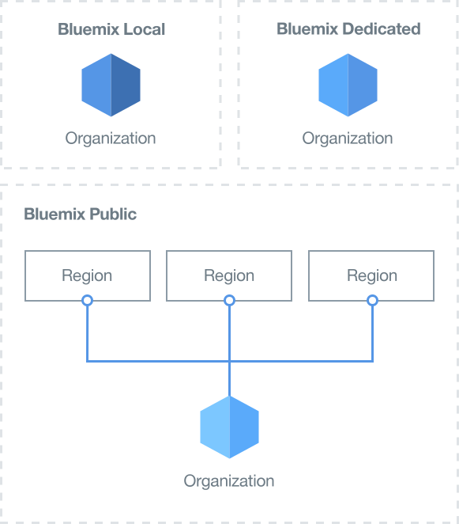
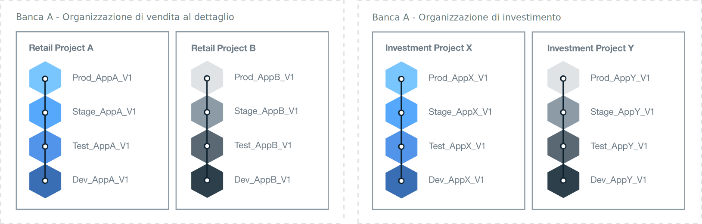

---

copyright:

  years: 2015, 2017
lastupdated: "2017-04-07"

---

{:new_window: target="_blank"}
{:shortdesc: .shortdesc}
{:screen:.screen}
{:codeblock:.codeblock}

# Configurazione del tuo ambiente Bluemix
{: #patterns}

Per il buon esito di un progetto, ti occorre del tempo per pianificare e progettare quali siano le risorse di cui hai bisogno e i requisiti della tua azienda. Per aiutarti a iniziare con il tuo progetto cloud, considera le seguenti domande:

* Quante e quali tipi di applicazioni verranno sviluppate?
* A quali servizi dovranno accedere le applicazioni?
* Chi collaborerà nel processo di sviluppo e quale sarà il suo ruolo?
* Che grado di isolamento è richiesto per ogni fase del progetto?
* La tua azienda fornirà le risorse dell'infrastruttura?
* In che modo comunica la tua azienda?
* Esiste una denominazione standard che puoi implementare per identificare chiaramente l'utilizzo dell'organizzazione e dello spazio?   

{:shortdesc}

Quando progetti una soluzione cloud, considera anche i requisiti funzionali e di sicurezza dell'account, le normative nazionali, le direttive per il mercato e le politiche aziendali.
Per soddisfare le tue esigenze di progetto, {{site.data.keyword.Bluemix}} offre tre tipi di ambiente cloud.

* [{{site.data.keyword.Bluemix_notm}} pubblico](/docs/overview/whatisbluemix.html "{{site.data.keyword.Bluemix_notm}} Public"): le risorse dell'infrastruttura sono condivise da differenti aziende e utenti.
* [{{site.data.keyword.Bluemix_notm}} dedicato](/docs/dedicated/index.html#dedicated "{{site.data.keyword.Bluemix_notm}} Dedicated"): utilizza la tua propria infrastruttura SoftLayer dedicata, che puoi collegare in modo sicuro al cloud {{site.data.keyword.Bluemix_notm}} pubblico e alla tua rete.
* [{{site.data.keyword.Bluemix_notm}} locale](/docs/local/index.html#local "{{site.data.keyword.Bluemix_notm}} Local"): si trova dietro il tuo firewall aziendale, può proteggere i tuoi carichi di lavoro più sensibili e può connettersi in modo sicuro ai cloud {{site.data.keyword.Bluemix_notm}} pubblico e {{site.data.keyword.Bluemix_notm}} dedicato.

Quando devi decidere quale tipo di ambiente cloud ti serve, pianifica la struttura dei tuoi account, organizzazioni, spazi, risorse e membri del team.

Per la maggior parte delle aziende, un account {{site.data.keyword.Bluemix_notm}} è sufficiente. Per le aziende più grandi, in cui c'è più di un'area di business,
potresti voler un account {{site.data.keyword.Bluemix_notm}} separato per ogni dominio di business. Ad esempio, all'interno di una grande azienda bancaria potrebbero esserci account separati per i settori al dettaglio e commerciali.

La seguente tabella fornisce un riepilogo di alcuni degli elementi chiave.

| Elemento   | Descrizione |
|---------------------------------------|--------------------------------------------------------------------------------------|
| Account   | Ogni account ha un solo proprietario. |
|| Contiene una o più organizzazioni. Per creare più di un'organizzazione, devi disporre di un account con pagamento a consumo. |
| Proprietario dell'account   | Responsabile di tutti gli addebiti di utilizzo che si accumulano all'interno dell'account. |
|| Puoi essere proprietario di un solo account. |
|| Puoi aggiungere uno o più gestori dell'organizzazione per delegarne la gestione, che comprende le autorizzazioni di lettura e scrittura per le organizzazioni. |
|| Puoi essere un membro del team in organizzazioni e spazi di altri account {{site.data.keyword.Bluemix_notm}}. |
| Organizzazione   | Contiene uno o più spazi. |
|| Contiene uno o più gestori organizzazione. |
|| Contiene uno o più membri del team. A ogni membro del team possono essere concessi uno o più ruoli. |
|| Gli addebiti di utilizzo, che vengono generati da un'applicazione distribuita in uno spazio, vengono segnalati a livello dell'organizzazione. |
| Spazio   | Contiene una o più risorse. |
|| Contiene una o più applicazioni. |
|| Contiene uno o più gestori spazio. |
|| Contiene uno o più membri del team. Ogni utente deve essere già un membro del team nell'organizzazione proprietaria. A ogni membro del team possono essere concessi uno o più ruoli. |
| Membro del team   | Può essere aggiunto a una o più organizzazioni e spazi tra i diversi account. |
|| Gli può essere fornito più di un ruolo all'interno della stessa organizzazione e/o dello stesso spazio. |
{:caption="Tabella 1.  Descrizione di elementi chiave" caption-side="top"}

## Determinazione del tuo ambiente {{site.data.keyword.Bluemix_notm}}
{: #bpimplementation}

Invece della rigorosa metodologia di sviluppo, test e produzione tradizionale, puoi implementare un ambiente in cui sviluppatori e tester siano in grado di collaborare con gli altri membri del team. Se progetti il modo in cui vuoi sviluppare e distribuire le tue applicazioni, puoi creare degli spazi {{site.data.keyword.Bluemix_notm}} per soddisfare questa metodologia. Anziché progettare il tuo ambiente dal livello dell'organizzazione a scendere, prova a progettare il tuo ambiente {{site.data.keyword.Bluemix_notm}} dal livello dello spazio a salire.

Considera la dimensione e l'ambito delle applicazioni che intendi sviluppare e distribuire. Uno spazio {{site.data.keyword.Bluemix_notm}} può essere utilizzato come ambiente di sviluppo per una o più applicazioni strettamente connesse o definite. Oltre a uno spazio di sviluppo, ad esempio, potresti voler creare degli spazi per i test di unità, test delle prestazioni e test di integrazione. Inoltre, gli spazi possono essere definiti per le fasi di creazione, preparazione e produzione. Ogni spazio creato può esser condiviso con diversi membri del team all'interno della stessa organizzazione.

Crea delle organizzazioni {{site.data.keyword.Bluemix_notm}} separate per le persone che lavorano in diverse aree di business e in cui le loro attività non si sovrappongano. Se ci sono due gruppi completamente indipendenti, la creazione di un'organizzazione per ognuno di questi definisce chiaramente i limiti per la distribuzione e gestione dei gruppi e delle risorse. Puoi definire una API per la comunicazione tra le organizzazioni.  

Le organizzazioni {{site.data.keyword.Bluemix_notm}} possono essere create per soddisfare il modo in cui vuoi lavorare anziché la struttura all'interno di un'azienda. Di norma, le organizzazioni aziendali possono cambiare, ma lo sviluppo e la manutenzione di un'applicazione continueranno a prescindere.
Progetta il tuo ambiente {{site.data.keyword.Bluemix_notm}} per tutta la durata delle applicazioni e non in base alla struttura dell'organizzazione aziendale.

Lo sviluppo e la distribuzione iterativa possono comportare una rapida espansione delle applicazioni. La progettazione del tuo processo di distribuzione deve potersi incrementare in modo rapido e veloce e tu necessiterai di uno sviluppo continuo con un tasso di distribuzione elevato. Con gli spazi di sviluppo e produzione presenti nella stessa organizzazione {{site.data.keyword.Bluemix_notm}}, si fornirà accesso alle stesse risorse. La gestione di spazi diversi all'interno di una singola organizzazione riduce i doveri amministrativi. Il personale addetto allo sviluppo, al test e alle operazioni può collaborare facilmente se lavorano tutti all'interno della stessa organizzazione {{site.data.keyword.Bluemix_notm}}.

Implementa una denominazione standard per identificare chiaramente l'utilizzo dell'organizzazione e dello spazio. Ad esempio, potresti includere il tipo di cloud, la regione geografica, il tipo di utilizzo (ad esempio, sviluppo, test, produzione), il nome dell'applicazione e il numero di versione o revisione. Le organizzazioni e gli spazi possono essere facilmente identificati per scopi di amministrazione e accesso.  

Il numero di spazi può moltiplicarsi rapidamente per via dello sviluppo iterativo. All'interno di un'organizzazione, puoi definire il numero di spazi desiderato. Se intendi definire un numero elevato di spazi, potresti creare un'applicazione per facilitare la gestione di tali spazi. Se il numero di spazi supera sessanta, puoi valutare la possibilità di definire un'altra organizzazione.

Scegli una persona che crei e gestisca un'organizzazione, definisca gli spazi e conceda l'accesso ai membri del team. A una seconda persona può essere fornito lo stesso accesso per mantenere l'ambiente quando il gestore dell'organizzazione non è disponibile.  

Identifica tutte le persone che avranno bisogno dell'accesso a ogni spazio e organizzazione. Determina i loro ruoli. Il ruolo lavorativo di un membro del team ne determina l'autorità. Ad esempio, uno sviluppatore senior avrà bisogno dell'autorità per visualizzare e aggiornare l'intero ambiente di sviluppo {{site.data.keyword.Bluemix_notm}}. Tuttavia, per uno sviluppatore junior vi saranno delle limitazioni su ciò che potrà visualizzare e aggiornare.

## Determinazione dell'architettura della tua organizzazione
{: #orgstructure}

Per progettare un ambiente cloud che utilizzi {{site.data.keyword.Bluemix_notm}} pubblico, {{site.data.keyword.Bluemix_notm}} dedicato, {{site.data.keyword.Bluemix_notm}} locale o una qualsiasi combinazione di essi, puoi utilizzare le seguenti architetture di organizzazione:

* Singola organizzazione: prendi in considerazione l'utilizzo di questa architettura se richiedi che lo stesso insieme di utenti acceda alle risorse disponibili in tutta l'organizzazione in {{site.data.keyword.Bluemix_notm}} pubblico, {{site.data.keyword.Bluemix_notm}} dedicato o {{site.data.keyword.Bluemix_notm}} locale.
* Più organizzazioni: prendi in considerazione l'utilizzo di questa architettura se richiedi l'isolamento tra i diversi ambienti all'interno di {{site.data.keyword.Bluemix_notm}} pubblico, {{site.data.keyword.Bluemix_notm}} dedicato o {{site.data.keyword.Bluemix_notm}} locale.

### Singola organizzazione contro più organizzazioni
{: #singleormulti}

In un ambiente a singola organizzazione, le risorse dell'infrastruttura sono condivise dalle diverse aree
dell'azienda. Al contrario, in un ambiente a più organizzazioni le risorse dell'infrastruttura non sono condivise.

Entrambe le architetture dell'organizzazione supportano i seguenti principi:

* Applicazione di limiti per applicazioni e/o progetti.
* Autorizzazione per gestire le risorse concessa dal ruolo utente.

Per implementare un'architettura a singola organizzazione, crea un account in {{site.data.keyword.Bluemix_notm}} pubblico, {{site.data.keyword.Bluemix_notm}} dedicato o
{{site.data.keyword.Bluemix_notm}} locale e definisci un'organizzazione. Puoi quindi definire più spazi basati su differenti linee di business (LOB),
fasi di distribuzione, specifici progetti, applicazioni, autorizzazioni utente o una combinazione di questi componenti.

Per implementare un'architettura a più organizzazioni, crea un account in {{site.data.keyword.Bluemix_notm}} pubblico, {{site.data.keyword.Bluemix_notm}} dedicato
o {{site.data.keyword.Bluemix_notm}} locale. Successivamente, puoi definire le organizzazioni che corrispondono a differenti LOB, fasi di distribuzione.
specifici progetti, autorizzazioni utente o una combinazione di questi componenti. Puoi quindi definire più spazi che si basano su applicazioni o progetti forniti dallo stesso reparto nell'azienda.

**Nota:** per definire più organizzazioni, devi disporre di un account fatturabile, ad esempio Pagamento a consumo o Sottoscrizione.

### Considerazioni sulle organizzazioni
{: #orgconsiderations}

Quando implementi un'architettura a singola organizzazione, questa include ogni risorsa cloud, servizio e applicazione da te utilizzati per sviluppare, gestire e
distribuire le applicazioni cloud. In {{site.data.keyword.Bluemix_notm}} pubblico, l'organizzazione fornisce la separazione tra gli account ed è disponibile in tutte le regioni.

 

 Figura 1. Esempio di architettura a singola organizzazione per {{site.data.keyword.Bluemix_notm}} pubblico, {{site.data.keyword.Bluemix_notm}} dedicato e
 {{site.data.keyword.Bluemix_notm}} locale
{: #bpfigure1}

Quando implementi un'architettura a più organizzazioni, le organizzazioni forniscono il primo livello di applicazione di limiti e astrazione che puoi utilizzare per controllare e definire
cosa può essere fatto e da chi. Progetta ogni organizzazione attorno a differenti LOB, fasi di distribuzione, specifici progetti o una combinazione di questi componenti.  

Il numero di organizzazioni necessarie dipende da più fattori:

* Il livello di granularità di cui hai bisogno all'interno della tua organizzazione per gestire le quote e controllare i costi.
* Il livello di sicurezza che devi applicare nei tuoi diversi ambienti. Ad esempio, se utilizzi dei contenitori, potresti voler separare le immagini di contenitore utilizzate per lo sviluppo da quelle utilizzate per la produzione.
* La posizione delle organizzazioni dovuta ai requisiti aziendali, del paese e del settore. Ad esempio, potresti voler eseguire tutte le tue applicazioni in un cloud dedicato che si trova in una specifica regione della tua area geografica.

Quando definisci le diverse organizzazioni per la tua struttura cloud, tieni presenti le seguenti indicazioni:

* Definisci e quindi applica una convenzione di denominazione. Ad esempio, definisci una convenzione di denominazione in cui il nome dell'organizzazione include informazioni sull'area di business, sul tipo di cloud ({{site.data.keyword.Bluemix_notm}} pubblico, {{site.data.keyword.Bluemix_notm}} locale o {{site.data.keyword.Bluemix_notm}} dedicato) e sulla fase del processo (sviluppo, test o produzione). Per le organizzazioni che si trovano in {{site.data.keyword.Bluemix_notm}} pubblico, potresti anche aggiungere informazioni sulla regione.
* Definisci le restrizioni applicabili all'organizzazione. Ad esempio, definisci il ruolo dei membri del team che lavoreranno in tale organizzazione.
* Identifica il gestore dell'organizzazione.
* Identifica l'area di business assegnata a questa organizzazione.

I seguenti scenari mostrano i diversi approcci che puoi adottare per definire il numero di organizzazioni {{site.data.keyword.Bluemix_notm}} in un ambiente cloud:
* **Scenario 1: Separazione dei gruppi di utenti in base alla distribuzione delle applicazioni di business**

 Descrizione: le regole aziendali richiedono che le applicazioni di ogni LOB siano sviluppate, gestite e distribuite dagli utenti di ciascuna LOB. È necessario applicare la sicurezza in modo che gli utenti possano accedere solo alle applicazioni pertinenti alla loro parte del business. Dunque, gli utenti lavorano in differenti aree di business, le applicazioni su cui stanno lavorando richiedono l'accesso alle diverse risorse {{site.data.keyword.Bluemix_notm}} e non vi è alcuna sovrapposizione di attività.

  Soluzione: puoi creare un'organizzazione per ogni processo di distribuzione delle applicazioni di business. Ad esempio, un'organizzazione per l'attività bancaria al dettaglio e una per l'attività di investimento.

  

  Figura 2. Esempio di architettura a più organizzazioni allineata alla distribuzione LOB
{: #bpfigure2}

* **Scenario 2: Separazione in base al tipo di utenti (utenti interni e utenti esterni)**

  Descrizione: la tua azienda lavora con diversi partner e hai bisogno di stabilire dei chiari limiti tra gli utenti interni ed esterni.

  Soluzione: puoi creare un'organizzazione per distribuire le applicazioni utilizzate internamente e puoi creare inoltre un'organizzazione per ogni partner esterno.

* **Scenario 3: Isolamento in base al progetto**

  Descrizione: la tua azienda organizza degli hackathon per identificare nuovi servizi.  

  Soluzione: puoi definire un'organizzazione per ogni hackathon e utilizzare l'organizzazione come un sandbox. Dopo l'hackathon, puoi promuovere l'organizzazione sandbox in un'ulteriore organizzazione nel tuo account.

* **Scenario 4: Isolamento di utenti in base alla fase di distribuzione**

  Descrizione: un'azienda vuole che gli utenti di sviluppo, test e produzione collaborino in una distribuzione, ma il loro accesso è controllato dal ruolo utente e dall'esperienza lavorativa.

  Soluzione: puoi creare una singola organizzazione e definire uno spazio per ogni fase di distribuzione. Quindi, a seconda del ruolo utente e dell'esperienza lavorativa, concedi agli utenti l'accesso in lettura e scrittura richiesto per completare il loro lavoro e per collaborare all'interno dell'organizzazione.

  

   Figura 3. Esempio di architettura a singola organizzazione allineata alla fase di distribuzione
{: #bpfigure3}

### Denominazione, restrizioni e gestione dell'organizzazione 
{: #orgadmin}   

Tieni conto delle seguenti indicazioni sull'organizzazione:

* Definisci e applica una convenzione di denominazione. Ad esempio, definisci una convenzione di denominazione in cui il nome dell'organizzazione include informazioni sull'area di business, sul tipo di cloud ({{site.data.keyword.Bluemix_notm}} pubblico, {{site.data.keyword.Bluemix_notm}} locale o {{site.data.keyword.Bluemix_notm}} dedicato) e sul ruolo IT (sviluppo, test o produzione). Per le organizzazioni che si trovano in {{site.data.keyword.Bluemix_notm}} pubblico, potresti anche aggiungere informazioni sulla regione. Puoi modificare il nome di un'organizzazione dopo che è stata creata. Se un nome organizzazione viene modificato, avvisa tutti i membri del team dell'organizzazione in merito alla modifica.
* Definisci le restrizioni applicabili all'organizzazione. Ad esempio, definisci il ruolo di ogni membro del team e le autorizzazioni necessarie per lavorare in tale organizzazione.
* Identifica il gestore dell'organizzazione. Potresti voler delegare l'amministrazione dell'organizzazione a più di una persona.
* Identifica l'area di business assegnata a questa organizzazione. L'utilizzo dell'applicazione generato in ciascuno spazio all'interno dell'organizzazione, viene accumulato e segnalato a livello dell'organizzazione.

## Determinazione dei tuoi spazi
{: #determinespaces}

All'interno di un'organizzazione, gli spazi forniscono un ulteriore livello di applicazione di limiti e astrazione.

Uno spazio è un'area riservata dell'organizzazione in cui gli utenti possono sviluppare ed eseguire applicazioni e servizi. Puoi creare un numero qualsiasi di spazi all'interno di un'organizzazione e puoi controllare gli utenti che hanno accesso a uno spazio. Per ulteriori dettagli, vedi [Spazi](/docs/admin/orgs_spaces.html#spaceinfo "Spaces").

Se intendi definire un numero elevato di spazi, potresti creare un'applicazione per facilitare la gestione di tali spazi. Se il numero di
spazi supera sessanta, puoi valutare la possibilità di definire un'altra organizzazione.

### Spazi per singola organizzazione contro più organizzazioni
{: #spaceconsiderations}

Quando adotti un'architettura a singola organizzazione, il livello di separazione e astrazione viene fornito dagli spazi da te definiti all'interno dell'organizzazione. Tieni conto delle seguenti indicazioni quando definisci gli spazi:

* Definisci uno spazio per ospitare un servizio che richieda di effettuare una sola volta il provisioning e la configurazione nell'organizzazione.
* Definisci gli spazi in base al ciclo di vita della distribuzione.
  Ad esempio, puoi definire uno o più spazi per le applicazioni da sviluppare, uno o più spazi per le applicazioni che si trovano già in fase di test e uno o più
  spazi per le applicazioni che sono in produzione.
* Se il limite del ciclo di vita della distribuzione non è sufficiente, puoi ottenere ulteriore separazione definendo uno o più spazi per ogni LOB e fase di distribuzione.
* Stabilisci se hai bisogno di applicare dei limiti per i diversi gruppi di utenti.
  Ad esempio, gli sviluppatori non possono sviluppare l'applicazione e testarla. Hai bisogno di un insieme di utenti diverso per testare l'applicazione. In questo scenario crei due spazi, uno per
  gli sviluppatori dell'applicazione e uno per i tester. Ad ogni insieme di utenti concedi quindi l'accesso allo spazio corretto.

Quando implementi un'architettura a più organizzazioni, puoi separare ogni organizzazione in base alla LOB e/o al ciclo di vita della distribuzione. Puoi quindi definire
più spazi che si basano sul numero di applicazioni o progetti forniti dallo stesso reparto nell'azienda. Tieni conto delle seguenti indicazioni quando pianifichi gli spazi in un'organizzazione:

* Definisci uno spazio per ospitare un servizio che richieda di effettuare una sola volta il provisioning e la configurazione nell'organizzazione.
* Definisci uno spazio per ogni applicazione, per ogni gruppo di applicazioni correlate o per uno specifico progetto.
* Se hai bisogno di applicare dei limiti per i diversi utenti, definisci uno spazio per ogni insieme di utenti. Quando a un utente viene concesso il ruolo di sviluppatore in uno spazio, tale utente ha accesso completo a tutte le risorse e ai servizi {{site.data.keyword.Bluemix_notm}} forniti e in esecuzione in questo spazio. Se hai bisogno di applicare una maggiore sicurezza per impedire agli utenti di controllare ogni risorsa, valuta la possibilità di definire più spazi. In tutti questi spazi, puoi fornire i servizi {{site.data.keyword.Bluemix_notm}} utilizzati dalle applicazioni in esecuzione in tale spazio.

### Denominazione, restrizioni e gestione dello spazio  
{: #spaceadmin}

Per definire i diversi spazi per la tua organizzazione cloud, tieni presenti le seguenti indicazioni:

* Definisci e applica una convenzione di denominazione. Ad esempio, definisci una convenzione di denominazione in cui il nome dello spazio include informazioni sulla posizione dell'organizzazione e sul tipo di cloud ({{site.data.keyword.Bluemix_notm}} pubblico, {{site.data.keyword.Bluemix_notm}} dedicato o {{site.data.keyword.Bluemix_notm}} locale). Puoi modificare il nome di uno spazio dopo che è stato creato. Se un nome spazio viene modificato, avvisa tutti i membri del team dello spazio in merito alla modifica.
* Definisci le restrizioni applicabili allo spazio. Ad esempio, definisci il tipo di applicazione che è possibile sviluppare, gestire e distribuire in ciascuno spazio.
* Identifica il gestore dello spazio. Potresti voler delegare l'amministrazione dello spazio a più di una persona.

## Determinazione della quota per un'organizzazione
{: #determinequota}

Quando crei un'organizzazione in {{site.data.keyword.Bluemix_notm}}, fornisci le risorse dell'infrastruttura che includono la memoria, l'IP (Internet Protocol), i server e l'archiviazione:
*	Per {{site.data.keyword.Bluemix_notm}} pubblico, IBM assegna un insieme minimo di risorse a un'organizzazione. In base al tipo di account, hai diverse assegnazioni delle risorse. Queste risorse definiscono la quota che viene assegnata da IBM a un'organizzazione.
*	Per {{site.data.keyword.Bluemix_notm}} dedicato, richiedi un insieme di risorse a IBM che potrai quindi distribuire tra le diverse organizzazioni nel tuo ambiente cloud {{site.data.keyword.Bluemix_notm}} dedicato.
*	Per {{site.data.keyword.Bluemix_notm}} locale, fornisci tu le risorse che potrai quindi distribuire tra le organizzazioni nel tuo ambiente cloud {{site.data.keyword.Bluemix_notm}} locale.

Per {{site.data.keyword.Bluemix_notm}} pubblico e {{site.data.keyword.Bluemix_notm}} dedicato, puoi richiedere ulteriori risorse a IBM. Per
{{site.data.keyword.Bluemix_notm}} locale, sei tu il responsabile di fornire tutte le risorse che potrebbero essere necessarie per gestire il tuo business nel cloud locale.

La quota assegnata a un'organizzazione rappresenta le risorse disponibili all'interno dell'organizzazione. Sei tu che gestisci la quota e decidi in che modo vengono distribuite le risorse nell'organizzazione.

### Gestione e monitoraggio della quota
{: #managequota}

Puoi gestire e monitorare la quota di un account in base allo spazio e all'infrastruttura. Tutte le risorse fornite in uno spazio e quindi utilizzate dall'applicazione distribuita consumano una parte di quota disponibile nell'organizzazione.
* Per ulteriori informazioni su come visualizzare e gestire la quota di un'organizzazione in {{site.data.keyword.Bluemix_notm}} pubblico, vedi [Gestione della quota](/docs/admin/manageorg.html#managequota "Managing quota").
* Per ulteriori informazioni su come visualizzare e gestire la quota di un'organizzazione in {{site.data.keyword.Bluemix_notm}} dedicato o {{site.data.keyword.Bluemix_notm}} locale, vedi [Visualizzazione di utilizzo e report](/docs/admin/index.html?pos=2#oc_resource "Viewing usage and reports").

## Assegnazione di ruoli
{: #roles}

In un account {{site.data.keyword.Bluemix_notm}}, puoi concedere più ruoli ai membri del team. Questi ruoli definiscono le autorizzazioni dell'utente per gestire le risorse dell'account e dell'organizzazione:
* Puoi concedere i [ruoli utente](/docs/iam/users_roles.html#userrolesinfo "user roles") ai membri di un'organizzazione. Questi ruoli definiscono il livello di accesso all'interno dell'organizzazione e limitano l'accesso a uno spazio e alle sue risorse. Ad esempio, puoi concedere agli utenti differenti autorizzazioni per spazi diversi.
* Solo in {{site.data.keyword.Bluemix_notm}} dedicato e {{site.data.keyword.Bluemix_notm}} locale, puoi concedere i [ruoli amministrativi](/docs/admin/index.html#oc_useradmin "administrative roles") ai membri di un account per gestire le informazioni di sistema, l'utilizzo delle risorse dell'account, i report e i log, i servizi di catalogo, gli utenti e l'utilizzo delle risorse per ogni organizzazione.

### Proprietario dell'account
{: #accountowner}

Sia che tu scelga di progettare un'architettura a più organizzazioni o un'architettura a singola organizzazione, il proprietario dell'account è il superuser dell'ambiente cloud.

Le attività principali del proprietario dell'account includono:

* Gestione delle risorse dell'account globale.
* Creazione delle organizzazioni.
* Aggiunta di membri del team all'account.

Per aggiungere i membri del team a un account, utilizza l'indirizzo e-mail dell'utente o un elenco di indirizzi e-mail. In {{site.data.keyword.Bluemix_notm}} dedicato e {{site.data.keyword.Bluemix_notm}}
locale, puoi anche utilizzare il LDAP dell'azienda per aggiungere utenti e gruppi di utenti. Puoi anche importare gli utenti da un file. Per ulteriori informazioni, vedi [Gestione di utenti e autorizzazioni](/docs/admin/index.html#oc_useradmin "Managing users and permissions").

Il proprietario dell'account può effettuare anche le seguenti attività:

* Aggiungere uno o più utenti come gestori di un'organizzazione assegnando a tali utenti il ruolo di **Gestore**. Valuta la possibilità di aggiungere due utenti come gestori dell'organizzazione. Il primo utente funge da gestore principale dell'organizzazione mentre il secondo utente funge da sostituto nel caso in cui il gestore principale non sia disponibile.
* In {{site.data.keyword.Bluemix_notm}} pubblico e a seconda del [tipo di account](/docs/pricing/index.html#pay-accounts "account type"), impostare le notifiche di spesa. Innanzitutto, il proprietario dell'account definisce le soglie utilizzate per gli avvisi quando i costi raggiungono un certo limite. Quindi, [configura le notifiche e-mail](/docs/admin/account.html#notifications "configures email notifications"). Il gestore dell'account può utilizzare le informazioni contenute nelle e-mail come notifiche di avviso e potrebbe intervenire in base alle informazioni fornite, ad esempio aggiornando l'account. **Nota:** il proprietario dell'account è l'unica persona che può ricevere le e-mail di notifica di spesa.
* Aggiungere uno o più utenti come amministratori dell'account assegnando a tali utenti il ruolo **Admin**. Valuta la possibilità di aggiungere almeno due utenti. Il primo utente funge da amministratore principale dell'account mentre il secondo utente funge da vice amministratore.
* Definire le notifiche di account per informare sugli aggiornamenti di manutenzione o gli avvisi di incidenti critici. Queste notifiche possono essere configurate per l'invio di un'e-mail o un SMS.

### Ruoli utente
{: #userroles}

I ruoli utente definiscono le autorizzazioni che puoi assegnare a un membro del team in un'organizzazione e definire il livello di accesso di cui dispone un membro del team all'interno dell'organizzazione e di ciascuno spazio.

In un'architettura a più organizzazioni o in un'architettura a singola organizzazione, definisci i membri del team e le autorizzazioni richieste da ciascun utente per completare il proprio lavoro:

1. Identifica l'insieme di utenti che richiedono accesso a un'organizzazione.
2. Definisci le autorizzazioni per ogni membro del team nell'organizzazione e in uno spazio dell'organizzazione.
3. Seleziona il ruolo che conceda a un utente le autorizzazioni richieste.

   * Gestore organizzazione
   * Revisore organizzazione
   * Gestore fatturazione dell'organizzazione
   * Gestore spazio
   * Sviluppatore spazio
   * Revisore spazio

#### Gestore organizzazione
{: #bporgmgr}

Le attività di cui è responsabile un gestore organizzazione includono la creazione di spazi, la distribuzione della quota tra gli spazi, l'invito dei membri del team e, facoltativamente, la concessione di specifici ruoli e la definizione di domini personalizzati.

#### Revisore organizzazione
{: #bporgauditor}

I membri del team con il ruolo **Revisore** dell'organizzazione possono monitorare la quota, l'utilizzo delle risorse e i membri del team di tutti gli spazi in un'organizzazione.
I revisori possono quindi riferire in merito all'efficienza dell'organizzazione ed evidenziare eventuali problemi.

* Quando adotti un'architettura a più organizzazioni, potresti voler concedere il ruolo di revisore agli stessi membri del team per ogni organizzazione che fa parte dell'account.
Questi membri del team possono quindi monitorare la quota in tutte le organizzazioni del tuo ambiente cloud e ottenere una visione globale dell'account.
* Quando adotti un'architettura a singola organizzazione, concedi il ruolo di revisore ai membri del team con la responsabilità di monitorare l'utilizzo della quota e l'efficienza
complessiva dell'organizzazione.

#### Gestore fatturazione dell'organizzazione
{: #bporgbillingmgr}

I membri del team con il ruolo **Gestore fatturazione** possono monitorare i costi di un'organizzazione.

* Quando adotti un'architettura a più organizzazioni, potresti voler concedere il ruolo di gestore fatturazione allo stesso insieme di membri del team per ogni organizzazione che fa parte dell'account. Questi membri del team possono quindi monitorare il costo di ciascuna organizzazione e ottenere una visione globale dell'account.
* In un'architettura a singola organizzazione, identifica gli utenti responsabili del monitoraggio dei costi.

#### Gestore spazio
{: #bpspacemgr}

Il **Gestore** dello spazio è responsabile di qualsiasi lavoro svolto all'interno dello spazio che gestisce e controlla. Il gestore spazio può effettuare le seguenti attività:

* Monitoraggio della quota assegnata allo spazio.
* Richiesta di ulteriori risorse al gestore dell'organizzazione.
* Notifica al gestore organizzazione in merito a risorse che non sono richieste.
* Aggiunta di membri del team allo spazio con il ruolo **Sviluppatore**.
* Facoltativamente, assegnazione del ruolo **Gestore** spazio a un membro del team in modo che funga da sostituto in sua assenza.

#### Sviluppatore spazio
{: #bpspacedev}

Uno sviluppatore spazio può effettuare le seguenti attività:

* Gestire le applicazioni Cloud Foundry.
* Fornire e configurare i servizi {{site.data.keyword.Bluemix_notm}}.
* Associare i domini alle applicazioni.

#### Revisore spazio
{: #bpspaceauditor}

Per ogni spazio, potresti voler concedere il ruolo di **Revisore** spazio agli stessi membri del team con il ruolo di **Revisore** dell'organizzazione. Nella tua azienda, questo ruolo potrebbe essere concesso a uno specifico insieme di utenti.

### Ruoli amministrativi per gli account dedicato e locale
{: #adminroles}

I [Ruoli amministrativi](/docs/hybrid/index.html#oc_useradmin "Managing users and permissions") definiscono le autorizzazioni che puoi concedere agli utenti per gestire un account {{site.data.keyword.Bluemix_notm}} dedicato o {{site.data.keyword.Bluemix_notm}} locale.
Puoi concedere le autorizzazioni di lettura o scrittura per consentire a un utente di visualizzare le informazioni di sistema, l'utilizzo delle risorse dell'account, i report e i log, i servizi di catalogo, gli utenti e l'utilizzo delle risorse per ogni organizzazione.

In un'architettura a più organizzazioni o in un'architettura a singola organizzazione, definisci gli utenti e le autorizzazioni richieste per gestire l'account:

1. Identifica l'insieme di utenti del team cloud di amministrazione e concedi loro le relative autorizzazioni di amministrazione. Includi i gestori organizzazione come membri di questo team.
2. Definisci le autorizzazioni per questi utenti nell'account. Suddividi le autorizzazioni per la gestione del catalogo e dei report tra gli utenti del team.
3. Seleziona uno o più ruoli per ogni utente in modo da soddisfare le autorizzazioni richieste per gestire l'account:

   * Ruolo Admin: gli utenti hanno l'autorizzazione per gestire l'intera organizzazione.
   * Ruolo Utente: i gestori dell'organizzazione con le autorizzazioni di scrittura possono aggiungere utenti all'account e alle proprie organizzazioni. I gestori dell'organizzazione con le autorizzazioni di lettura possono visualizzare l'elenco di membri nell'account.
   * Ruolo Catalogo: gli utenti con le autorizzazioni di scrittura possono definire e gestire quali servizi e starter Bluemix rendere visibili agli utenti nel catalogo {{site.data.keyword.Bluemix_notm}}.
   * Ruolo Report: gli utenti con le autorizzazioni di scrittura possono visualizzare e aggiungere report che altri utenti con autorizzazioni di lettura possono scaricare. Concedi le autorizzazioni di lettura a tutti i membri del team di amministrazione.
   * Ruolo Accesso: concedi questo ruolo a tutti i membri del team di amministrazione. Puoi concedere questo ruolo anche ad altri utenti nell'account che richiedono l'accesso per visualizzare le notifiche di account e le informazioni sul sistema.
