---

copyright:

  years: 2015, 2017
lastupdated: "2017-02-22"

---

{:new_window: target="_blank"}
{:shortdesc: .shortdesc}
{:screen:.screen}
{:codeblock:.codeblock}

# {{site.data.keyword.Bluemix_notm}} 環境をセットアップするためのベスト・プラクティス
{: #patterns}

プロジェクトを成功させるために、時間をかけて、必要なリソースおよびエンタープライズの要件を計画し、設計してください。クラウド・プロジェクトを始めるにあたって、以下の点を検討してください。

* いくつのアプリケーション、どのようなタイプのアプリケーションを開発するか?
* アプリケーションは、どのサービスにアクセスする必要があるか?
* 開発プロセスで誰がコラボレーションし、どのような役割を持つか?
* プロジェクトの各フェーズにどの程度の分離が必要か?
* エンタープライズでインフラストラクチャー・リソースを提供するか? 
* 会社はどのようにして通信するか?
* 組織およびスペースの使用を明確に識別するために実装できる命名標準はあるか?   

{:shortdesc}

クラウド・ソリューションの設計では、アカウント・セキュリティーおよび運用要件、国の規制、市場の指向性、企業のポリシーについても考慮してください。
プロジェクトのニーズに対応するために、{{site.data.keyword.Bluemix}} では 3 つのタイプのクラウド環境が提供されています。 

* [{{site.data.keyword.Bluemix_notm}} Public](/docs/overview/whatisbluemix.html "{{site.data.keyword.Bluemix_notm}} Public"): インフラストラクチャー・リソースが、異なる会社およびユーザーで共有されます。
* [{{site.data.keyword.Bluemix_notm}} Dedicated](/docs/dedicated/index.html#dedicated "{{site.data.keyword.Bluemix_notm}} Dedicated"): {{site.data.keyword.Bluemix_notm}} Public クラウドと独自のネットワークに安全に接続できる、専用の SoftLayer インフラストラクチャーを使用します。
* [{{site.data.keyword.Bluemix_notm}} Local](/docs/local/index.html#local "{{site.data.keyword.Bluemix_notm}} Local"): 機密性の高いワークロードを保護し、{{site.data.keyword.Bluemix_notm}} Public クラウドおよび {{site.data.keyword.Bluemix_notm}} Dedicated クラウドに安全に接続できる企業ファイアウォールの後ろに位置します。

必要なクラウド環境のタイプを決定する一環として、アカウント、組織、スペース、リソース、およびチーム・メンバーの構造を計画します。 

ほとんどの会社では、単一の {{site.data.keyword.Bluemix_notm}} アカウントで十分です。複数のビジネス・エリアがある大企業では、
ビジネス・ドメインごとに別々の {{site.data.keyword.Bluemix_notm}} アカウントが必要な場合もあります。例えば、大規模なバンキング・コーポレーションの中で、リテール部門とコマーシャル部門に別々のアカウントがあることがあります。

次の表に、主ないくつかの要素のサマリーを示します。 

| 要素   | 説明 |
|---------------------------------------|--------------------------------------------------------------------------------------|
| アカウント   | 各アカウントごとに 1 人のアカウント所有者がいます。 |
|| 1 つ以上の組織を含みます。複数の組織を作成するには、従量課金 (PAYG) アカウントが必要です。 |
| アカウント所有者   | アカウント内で集計されたすべての使用料金に責任を持ちます。 |
|| 所有できるアカウントは 1 つのみです。 |
|| 組織管理 (組織への読み取りおよび書き込みの許可を含む) を委任する 1 人以上の組織管理者を追加できます。 |
|| 他の {{site.data.keyword.Bluemix_notm}} アカウントで組織およびスペースのチーム・メンバーになることが可能です。 |
| 組織   | 1 つ以上のスペースを含みます。 | 
|| 1 人以上の組織管理者を含みます。 |
|| 1 人以上のチーム・メンバーを含みます。各チーム・メンバーに、1 つ以上の役割を付与できます。 |
|| スペース内にデプロイされたアプリケーションで発生した使用料金は、組織レベルで報告されます。 |
| スペース   | 1 つ以上のリソースを含みます。 |
|| 1 つ以上のアプリケーションを含みます。 |
|| 1 人以上のスペース管理者を含みます。 |
|| 1 人以上のチーム・メンバーを含みます。各ユーザーは、所有している組織で既にチーム・メンバーでなければなりません。各チーム・メンバーに、1 つ以上の役割を付与できます。 |
| チーム・メンバー   | 異なるアカウントをまたがって 1 つ以上の組織およびスペースに追加可能です。 |
|| 同じ組織またはスペース、あるいはその両方の中で複数の役割を付与されることが可能です。 | 
{:caption="Table 1. Description of key elements" caption-side="top"}

## {{site.data.keyword.Bluemix_notm}} 環境の決定
{: #bpimplementation}

従来の厳密に定義された開発、テスト、実動の方法に代わって、開発者やテスターが他のチーム・メンバーとコラボレーションできる環境を実装できます。アプリケーションの開発およびデリバリーの方法を設計する場合に、{{site.data.keyword.Bluemix_notm}} スペースを作成してその方法を実現させることができます。組織レベルから下に向かって環境を設計するのではなく、スペース・レベルから上に向かって {{site.data.keyword.Bluemix_notm}} 環境を設計することを検討してください。

開発してデプロイする予定のアプリケーションのスケールとスコープを検討します。{{site.data.keyword.Bluemix_notm}} スペースは、緊密に結合または定義された 1 つ以上のアプリケーションの開発環境として使用できます。開発スペースとは別に、例えば、単体テスト、パフォーマンス・テスト、統合テストのスペースを作成する場合もあります。ビルド、ステージング、実動のスペースも定義できます。作成した各スペースは、同じ組織内の別のチーム・メンバーと共有することができます。 

異なるビジネス・エリアで仕事をする人たちがいて、そのアクティビティーが重なり合わない場合は、別々の {{site.data.keyword.Bluemix_notm}} 組織を作成します。完全に独立した 2 つのグループがある場合には、それぞれに組織を作成することで、チームの構成員およびリソースの提供と管理の境界が明確に定義されます。組織間で通信するための API を定義可能です。  

{{site.data.keyword.Bluemix_notm}} の組織は、会社内の構造ではなく、必要な作業形態に合わせて作成することができます。一般的に、会社の組織は変化しますが、アプリケーションの開発と保守はそれに関係なく継続します。
{{site.data.keyword.Bluemix_notm}} 環境は、会社の組織構造ではなく、アプリケーションのライフタイムに合わせて設計してください。 

反復型開発およびデプロイメントにより、アプリケーションが急速に拡大する可能性があります。デリバリー・プロセス設計は、迅速かつ簡単に拡大可能でなければなりません。迅速なデプロイメントによる継続的開発が必要になります。同じ {{site.data.keyword.Bluemix_notm}} 組織に開発スペースと実動スペースがあれば、同じリソースへのアクセスが提供されます。異なるスペースを 1 つの組織内で管理すると、管理オーバーヘッドが削減されます。開発、テスト、および運用の担当者が、同じ {{site.data.keyword.Bluemix_notm}} 組織内で作業すると、簡単にコラボレーションを図ることができます。 

組織およびスペースの使用を明確に識別する命名標準を実装します。例えば、クラウドのタイプ、地域、使用タイプ (dev、test、prod など)、アプリケーション名、バージョン番号またはリビジョン番号を含めます。これにより、管理およびアクセスの目的で、組織やスペースを簡単に識別することができます。  

反復型開発のため、スペースの数は急速に倍増する可能性があります。スペースは、組織内に必要な数だけ定義可能です。定義する予定のスペースの数が多い場合は、スペース管理を支援するアプリケーションを作成できます。スペースの数が 60 を超える場合は、別の組織を定義することも検討してください。 

組織の作成および管理、スペースの定義、チーム・メンバーへのアクセス権限の付与は、1 人のユーザーが行うようにします。組織管理者が不在のときに環境を保守できるように、同じアクセス権限を もう 1 人のユーザーに付与することができます。  

各スペースおよび組織へのアクセスが必要なすべてのユーザーを識別します。それらのユーザーの役割を決定します。チーム・メンバーのジョブ役割によって、権限が決定されます。例えば、上級の開発者には、{{site.data.keyword.Bluemix_notm}} 開発環境全体を表示および更新する権限が必要になります。一方、初級の開発者には、表示および更新の対象が制限されます。

## 組織体系の決定
{: #orgstructure}

{{site.data.keyword.Bluemix_notm}} Public、{{site.data.keyword.Bluemix_notm}} Dedicated、{{site.data.keyword.Bluemix_notm}} Local、またはその任意の組み合わせを使用するクラウド環境を設計するには、次の組織体系を使用できます。

* 単一組織: 同じユーザー集合が、{{site.data.keyword.Bluemix_notm}} Public、{{site.data.keyword.Bluemix_notm}} Dedicated、または {{site.data.keyword.Bluemix_notm}} Local で、組織内のすべての場所で使用可能なリソースにアクセスする必要がある場合は、この体系の使用を検討してください。
* 複数組織: {{site.data.keyword.Bluemix_notm}} Public、{{site.data.keyword.Bluemix_notm}} Dedicated、または {{site.data.keyword.Bluemix_notm}} Local 内の異なる環境を分離する必要がある場合は、この体系の使用を検討してください。 

### 単一組織と複数組織の対比
{: #singleormulti}

単一組織環境では、会社のさまざまなエリアでインフラストラクチャー・リソースが共有されます。
一方、複数組織環境で、インフラストラクチャー・リソースは共有されません。 

どちらの組織体系も、次の原理をサポートします。

* アプリケーションまたはプロジェクト、あるいはその両方に関する境界の適用。
* ユーザー役割で付与されたリソースを管理する許可。

単一組織体系を実装するには、{{site.data.keyword.Bluemix_notm}} Public、{{site.data.keyword.Bluemix_notm}} Dedicated、または
{{site.data.keyword.Bluemix_notm}} Local でアカウントを作成し、1 つの組織を定義します。その後、さまざまな基幹業務 (LOB)、
デリバリー・フェーズ、特定プロジェクト、アプリケーション、ユーザー許可、あるいはこれらのコンポーネントの組み合わせに基づいて複数のスペースを定義することができます。

複数組織体系を実装するには、{{site.data.keyword.Bluemix_notm}} Public、{{site.data.keyword.Bluemix_notm}} Dedicated、または
{{site.data.keyword.Bluemix_notm}} Local でアカウントを作成します。次に、さまざまな LOB、デリバリー・フェーズ、
特定プロジェクト、ユーザー許可、あるいはこれらのコンポーネントの組み合わせに対応した組織を定義できます。その後、会社内の同じ部門によってデリバリーされるアプリケーションまたはプロジェクトに基づいて複数のスペースを定義することができます。 

**注:** 複数の組織を定義する場合には、従量課金 (PAYG) やサブスクリプションなどの請求可能なアカウントを持っていなければなりません。 

### 組織に関する考慮事項
{: #orgconsiderations}

単一組織体系を実装すると、クラウド・アプリケーションの開発、管理、デプロイに使用するクラウドのリソース、サービス、アプリケーションがすべて、その組織に含まれます。
{{site.data.keyword.Bluemix_notm}} Public では、組織はアカウント間の分離を提供し、すべての地域から使用可能になります。

 

 図 1. {{site.data.keyword.Bluemix_notm}} Public、{{site.data.keyword.Bluemix_notm}} Dedicated、および
{{site.data.keyword.Bluemix_notm}} Local の単一組織体系の例
{: #bpfigure1}

複数組織体系を実装すると、実行内容と実行者の制御および定義に使用できる、第 1 レベルの境界適用と抽象化が組織によって提供されます。
さまざまな LOB、デリバリー・フェーズ、ユーザーの役割、特定プロジェクト、あるいはこれらのコンポーネントの組み合わせに基づいて各組織を設計します。  

必要な組織の数は、次のような複数の要因に依存します。

* 割り当て量管理およびコスト制御のために組織内で必要な細分度。
* 異なる環境で適用が必要なセキュリティーのレベル。例えば、コンテナーを使用する場合に、実動に使用されるコンテナー・イメージから、開発に使用されるコンテナー・イメージを分離することがあります。
* 企業、国、業界の要件を理由とする組織のロケーション。例えば、管轄地域の中でも特定の地域にある専用クラウドですべてのアプリを実行する必要があることがあります。

クラウド構造にさまざまな組織を定義する際には、以下のガイダンスを考慮してください。

* 命名規則を定義して適用します。例えば、ビジネス・エリア、クラウドのタイプ ({{site.data.keyword.Bluemix_notm}} Public、{{site.data.keyword.Bluemix_notm}} Local、または {{site.data.keyword.Bluemix_notm}} Dedicated)、プロセス・フェーズ (開発、テスト、実動) に関する情報を組織名に含めるという命名規則を定義します。{{site.data.keyword.Bluemix_notm}} Public にある組織では、地域に関する情報も追加することをお勧めします。
* 組織に適用される制約事項を定義します。例えば、その組織で働くチーム・メンバーの役割を定義します。
* 組織の管理者を特定します。
* この組織に割り振られたビジネス・エリアを特定します。

以下のシナリオでは、クラウド環境で {{site.data.keyword.Bluemix_notm}} 組織の数を定義する際に採用できるさまざまなアプローチを示します。
* **シナリオ 1: ビジネス・アプリケーション・デリバリーによるユーザー・グループの分離**

 説明: 各 LOB のアプリが、各 LOB のユーザーによって開発、管理、デプロイされる必要があると、企業規則で要求されます。ユーザーが自分の業務に関連するアプリのみにアクセス可能になるよう、セキュリティーが適用される必要があります。ユーザーはさまざまなビジネス・エリアで働き、使用するアプリケーションではさまざまな {{site.data.keyword.Bluemix_notm}} リソースへのアクセスが必要で、重なり合うアクティビティーはありません。 

  解決策: ビジネス・アプリケーション・デリバリー・プロセスごとに 1 つの組織を作成します。例えば、リテール・バンキング用の組織、投資バンキング用の組織などです。

  

  図 2. LOB デリバリーに調整した複数組織体系の例
{: #bpfigure2}

* **シナリオ 2: ユーザーのタイプ (内部ユーザー、外部ユーザー) に基づく分離**

  説明: 会社がさまざまなパートナーと協働しており、内部ユーザーと外部ユーザー間の明確な境界が必要です。

  解決策: 内部的に使用されるアプリケーションをデリバリーするための組織を作成します。さらに、外部パートナーごとに 1 つの組織を作成します。

* **シナリオ 3: プロジェクトによる分離**

  説明: 新しいサービスを見い出すために会社がハッカソンを実施します。  

  解決策: ハッカソンごとに 1 つの組織を定義し、組織をサンドボックスとして使用します。ハッカソンの後、そのサンドボックス組織をアカウントの追加組織にプロモートすることができます。

* **シナリオ 4: デリバリー・フェーズによるユーザーの分離**

  説明: 開発、テスト、実動の各ユーザーがデリバリー全体でコラボレーションすることを会社は望んでいますが、アクセス権限は、ユーザーの役割と仕事の経験で制御されています。

  解決策: 単一組織を作成して、デリバリー・フェーズごとに 1 つのスペースを定義します。その後、ユーザーの役割と仕事の経験に応じて、作業の遂行と組織内のコラボレーションに必要な読み取りおよび書き込みのアクセス権限を付与します。 

  

   図 3. デリバリー・フェーズによって調整された単一組織体系の例
{: #bpfigure3}

### 組織の命名、制約事項、および管理
{: #orgadmin}   
   
組織に関する以下のガイダンスを考慮してください。

* 命名規則を定義して適用します。例えば、ビジネス・エリア、クラウドのタイプ ({{site.data.keyword.Bluemix_notm}} Public、{{site.data.keyword.Bluemix_notm}} Local、または {{site.data.keyword.Bluemix_notm}} Dedicated)、IT 役割 (開発、テスト、実動) に関する情報を組織名に含めるという命名規則を定義します。{{site.data.keyword.Bluemix_notm}} Public にある組織では、地域に関する情報も追加することをお勧めします。組織名は、作成後に変更可能です。組織名が変更されたら、すべての組織チーム・メンバーにその変更を通知してください。 
* 組織に適用される制約事項を定義します。例えば、各チーム・メンバーの役割と、その組織での作業に必要な許可を定義します。
* 組織の管理者を特定します。複数のユーザーに組織管理を委任すると有効です。 
* この組織に割り振られたビジネス・エリアを特定します。組織内での各スペースで発生したアプリケーション使用は、組織レベルで集計されて報告されます。 

## スペースの決定
{: #determinespaces}

組織内で、スペースは、追加レベルの境界適用および抽象化を提供します。

スペースは、組織内で、ユーザーがアプリケーションおよびサービスを開発して実行することができる予約済みの領域です。スペースは、1 つの組織内にいくつでも作成可能です。
スペースへのアクセス権限を持つユーザーを制御することができます。詳しくは、『[スペース](/docs/admin/orgs_spaces.html#spaceinfo "スペース")』を参照してください。

定義する予定のスペースの数が多い場合は、スペース管理を支援するアプリケーションを作成できます。スペースの数が 60 を超える場合は、別の組織を定義することも検討してください。 

### 単一組織と複数組織のスペースの対比
{: #spaceconsiderations}

単一組織体系を採用すると、組織内に定義したスペースによって、分離と抽象化のレベルが提供されます。スペースを定義する際には、以下のガイダンスを考慮してください。

* 1 回だけプロビジョンと構成を要求するサービスをホストするスペースを組織に定義します。
* デリバリー・ライフサイクルに基づいてスペースを定義します。
  例えば、開発中のアプリケーション用に 1 つ以上のスペース、テスト・フェーズのアプリケーション用に 1 つ以上のスペース、実動アプリケーション用に 1 つ以上のスペースを定義することができます。
* デリバリー・ライフサイクル境界が不十分な場合は、LOB およびデリバリー・フェーズごとに 1 つ以上のスペースを定義することで、分離を強化することが可能です。
* 異なるユーザー・グループに対して境界を適用する必要があるかどうかを識別します。
  例えば、開発者は、アプリケーションを開発した後、それをテストすることはできません。アプリケーションをテストするには、別のユーザー集合が必要です。このシナリオでは、アプリケーション開発者用スペースとアプリケーション・テスター用スペースの 2 つを
  作成します。その後、各ユーザー集合に、適切なスペースへのアクセス権限を付与します。

複数組織体系を実装すると、LOB またはデリバリー・ライフサイクル、あるいはその両方で各組織を分離することができます。その後、会社内の同じ部門によって
デリバリーされるアプリケーションまたはプロジェクトの数に基づいて複数のスペースを定義することができます。組織内のスペースを計画する際には、以下のガイダンスを考慮してください。

* 1 回だけプロビジョンと構成を要求するサービスをホストするスペースを組織に定義します。
* アプリケーションごと、関連アプリケーションのグループごと、または特定プロジェクトのスペースを定義します。
* 異なるユーザーに境界を適用する必要がある場合は、各ユーザー集合ごとにスペースを定義します。スペースで開発者役割が付与されたユーザーは、そのスペースでプロビジョンされて実行中のすべてのリソースと {{site.data.keyword.Bluemix_notm}} サービスへの全アクセス権限を持ちます。ユーザーがリソースのすべては制御できないようにセキュリティーを強化する必要がある場合は、異なるスペースを定義することを検討してください。これらのどのスペース内でも、該当スペースで実行中のアプリで使用される {{site.data.keyword.Bluemix_notm}} サービスをプロビジョンできます。

### スペースの命名、制約事項、および管理  
{: #spaceadmin} 
 
クラウド組織にさまざまなスペースを定義する際には、以下のガイダンスを考慮してください。

* 命名規則を定義して適用します。例えば、組織のロケーションおよびクラウドのタイプ ({{site.data.keyword.Bluemix_notm}} Public、{{site.data.keyword.Bluemix_notm}} Dedicated、または {{site.data.keyword.Bluemix_notm}} Local) に関する情報をスペース名に含めるという命名規則を定義します。スペース名は、作成後に変更可能です。スペース名が変更されたら、すべてのスペース・チーム・メンバーにその変更を通知してください。 
* スペースに適用される制約事項を定義します。例えば、各スペースで開発、管理、デプロイが可能なアプリケーションのタイプを定義します。
* スペースの管理者を特定します。複数のユーザーにスペース管理を委任すると有効です。 

## 組織の割り当て量の決定
{: #determinequota}

{{site.data.keyword.Bluemix_notm}} に組織を作成したら、インフラストラクチャー・リソースをプロビジョンします。これには、メモリー、インターネット・プロトコル (IP)、サーバー、ストレージなどのリソースが含まれます。
*	{{site.data.keyword.Bluemix_notm}} Public の場合は、最小リソース・セットが IBM によって組織に割り振られます。アカウントのタイプに基づいて、異なるリソース割り振りがあります。これらのリソースは、IBM によって組織に割り振られる割り当て量を定義します。
*	{{site.data.keyword.Bluemix_notm}} Dedicated の場合は、IBM からリソース・セットを要求し、{{site.data.keyword.Bluemix_notm}} Dedicated クラウド環境内の異なる組織にそれらを分散することができます。
*	{{site.data.keyword.Bluemix_notm}} Local の場合は、自社でリソースを提供し、その後、{{site.data.keyword.Bluemix_notm}} Local クラウド環境内の組織にそれらを分散することができます。

{{site.data.keyword.Bluemix_notm}} Public と {{site.data.keyword.Bluemix_notm}} Dedicated では、IBM から追加リソースを要求することができます。
{{site.data.keyword.Bluemix_notm}} Local では、ローカル・クラウドでのビジネスの実行に必要なすべてのリソースを、責任をもって提供してください。

組織に割り振られた割り当て量は、組織内で使用可能なリソースを表します。割り当て量を管理し、リソースを組織でどのように分散するかを決定してください。 

### 割り当て量の管理とモニタリング 
{: #managequota}

スペースごと、およびインフラストラクチャーごとにアカウントの割り当て量を管理し、モニターします。スペースでプロビジョンされ、デプロイ済みアプリケーションによって使用されるリソースは、組織が使用できる割り当て量の一部を消費します。
* {{site.data.keyword.Bluemix_notm}} Public で組織の割り当て量を表示および管理する方法について詳しくは、『[割り当て量の管理](/docs/admin/orgs_spaces.html#managequota "割り当て量の管理")』を参照してください。
* {{site.data.keyword.Bluemix_notm}} Dedicated または {{site.data.keyword.Bluemix_notm}} Local で組織の割り当て量を表示および管理する方法について詳しくは、『[使用量およびレポートの表示](/docs/admin/index.html?pos=2#oc_resource "使用量およびレポートの表示")』を参照してください。

## 役割の割り当て
{: #roles}

{{site.data.keyword.Bluemix_notm}} アカウントでチーム・メンバーに複数の役割を付与することができます。これらの役割では、アカウントおよび組織のリソースを管理するためのユーザーの許可を定義します。
* 組織のメンバーに[ユーザー役割](/docs/admin/users_roles.html#userrolesinfo "ユーザー役割")を付与することができます。これらの役割では、組織内でのアクセス権限のレベルを定義し、スペースおよびそのリソースに誰がアクセスできるかを制限します。例えば、異なるスペースに対する異なる許可をユーザーに付与できます。
* {{site.data.keyword.Bluemix_notm}} Dedicated および {{site.data.keyword.Bluemix_notm}} Local においてのみ、システム情報、アカウント・リソースの使用、レポートおよびログ、カタログ・サービス、ユーザー、および組織ごとのリソース使用を管理するために、[管理役割](/docs/admin/index.html#oc_useradmin "管理役割")をアカウントのメンバーに付与できます。

### アカウント所有者
{: #accountowner}

複数組織体系または単一組織体系のどちらを設計する場合でも、アカウント所有者はクラウド環境のスーパーユーザーです。

アカウント所有者の主要なタスクとして、以下があります。

* グローバル・アカウントのリソースを管理する。
* 組織を作成する。
* アカウントにチーム・メンバーを追加する。

アカウントにチーム・メンバーを追加するには、ユーザーの E メール・アドレス、または E メール・アドレスのリストを使用します。{{site.data.keyword.Bluemix_notm}} Dedicated および {{site.data.keyword.Bluemix_notm}}
Local では、社内の LDAP を使用してユーザーまたはユーザー・グループ、あるいはその両方を追加することも可能です。ファイルからユーザーをインポートすることもできます。詳しくは、『[ユーザーおよび許可の管理](/docs/admin/index.html#oc_useradmin "ユーザーおよび許可の管理")』を参照してください。

アカウント所有者は、以下のタスクも実行できます。

* **管理者**役割を割り当てることで、1 人以上のユーザーを組織の管理者として追加します。組織管理者として 2 人のユーザーを追加することを検討してください。最初のユーザーは、組織の主要な管理者として役割を果たします。2 人目のユーザーは、主要な管理者が不在の場合に、代理の管理者として役割を果たします。
* {{site.data.keyword.Bluemix_notm}} Public において、[アカウント・タイプ](/docs/pricing/index.html#pay-accounts "アカウント・タイプ")によっては、消費量通知を設定します。まず、アカウント所有者が、特定の限度にコストが達した場合にアラートを受け取るために使用されるしきい値を定義します。その後、[E メール通知を構成します](/docs/admin/account.html#notifications "E メール通知の構成")。アカウント管理者は、E メール内の情報をアラート通知として使用し、提供された情報を基に、アカウントのアップグレードなどのアクションをとります。**注:** 消費量通知 E メールを受け取ることができるのは、アカウント所有者のみです。
* **管理**役割を割り当てることで、1 人以上のユーザーをアカウントの管理者として追加します。最小で 2 人のユーザーを追加することを検討してください。最初のユーザーは、アカウントの主要な管理者として役割を果たします。2 人目のユーザーは、代理の管理者として役割を果たします。
* 保守更新や重大インシデント・アラートに関して知らせるアカウント通知を定義します。これらの通知は、E メールまたはショート・メッセージ・サービスを送信するように構成できます。

### ユーザー役割
{: #userroles}

ユーザー役割では、組織内のチーム・メンバーに割り当てることができる許可を定義し、組織および各スペース内でチーム・メンバーが持つアクセス権限のレベルを定義します。

複数組織体系または単一組織体系で、チーム・メンバーと、その作業の完了に各ユーザーが必要とする許可を定義します。

1. 組織へのアクセス権限を必要とするユーザーの集合を特定します。
2. 組織およびそのスペースで各チーム・メンバーの許可を定義します。
3. 必要な許可をユーザーに付与する役割を選択します。

   * 組織管理者
   * 組織監査員
   * 組織請求管理者
   * スペース管理者
   * スペース開発者
   * スペース監査員

#### 組織管理者
{: #bporgmgr}

組織管理者が責任を持つタスクには、スペースの作成、スペース間での割り当て量の分散、チーム・メンバーの招待とオプションでチーム・メンバーへの特定役割の付与、およびカスタム・ドメインの定義があります。

#### 組織監査員
{: #bporgauditor}

組織の**監査員**役割を持つチーム・メンバーは、組織内のすべてのスペースの割り当て量、リソース使用、およびチーム・メンバーをモニターできます。
その後、監査員は、組織の効率性に関して報告し、発生しうる問題を指摘することができます。

* 複数組織体系を採用した場合、アカウントに含まれるすべての組織に対して同じチーム・メンバーに監査員役割を付与することをお勧めします。
これにより、これらのチーム・メンバーは、クラウド環境内のすべての組織で割り当て量をモニターし、アカウントの全体像を取得できます。
* 単一組織体系を採用した場合、組織の割り当て量使用と全体的な効率性をモニターする責任を持つチーム・メンバーに、
監査員役割を付与します。

#### 組織請求管理者
{: #bporgbillingmgr}

**請求管理者**役割を持つチーム・メンバーは、組織のコストをモニターできます。

* 複数組織体系を採用した場合、アカウントに含まれるすべての組織に対して同じチーム・メンバー集合に請求管理者役割を付与することをお勧めします。これにより、これらのチーム・メンバーは、各組織のコストをモニターし、アカウントの全体像を取得できます。
* 単一組織体系では、コストをモニターする責任を持つユーザーを特定します。

#### スペース管理者
{: #bpspacemgr}

スペース**管理者**は、管理および制御するスペース内で実行されるすべての作業の責任を担います。スペース管理者は、以下のタスクを実行できます。

* スペースに割り振られた割り当て量をモニターする。
* 組織管理者に追加リソースを要求する。
* 不要なリソースを組織管理者に通知する。
* スペースに**開発者**役割のチーム・メンバーを追加する。
* オプションで、スペース管理者の不在時に代理のスペース管理者として役割を果たすチーム・メンバーに、スペース**管理者**役割を割り当てる。

#### スペース開発者
{: #bpspacedev}

スペース開発者は、以下のタスクを実行できます。

* Cloud Foundry アプリケーションを管理する。
* {{site.data.keyword.Bluemix_notm}} サービスをプロビジョンして構成する。
* ドメインをアプリケーションに関連付ける。

#### スペース監査員
{: #bpspaceauditor}

すべてのスペースに対して、組織の**監査員**役割を持つ同じチーム・メンバーに、スペース**監査員**役割を付与することをお勧めします。エンタープライズでは、この役割を特定のユーザー集合に付与する必要がある場合もあります。

### 管理ロール
{: #adminroles}

[管理ロール](/docs/admin/index.html#oc_useradmin "管理ロール")は、{{site.data.keyword.Bluemix_notm}} Dedicated または {{site.data.keyword.Bluemix_notm}} Local アカウントを管理するユーザーに付与できる許可を定義します。
システム情報、アカウント・リソースの使用、レポートおよびログ、カタログ・サービス、ユーザー、および組織ごとのリソース使用をユーザーが表示するための読み取りまたは書き込みの許可を付与できます。

複数組織体系または単一組織体系で、ユーザーと、アカウントの管理に各ユーザーが必要とする許可を定義します。

1. 管理クラウド・チーム・ユーザーの集合を特定し、これらのユーザーに関連する管理許可を付与します。このチームのメンバーとして組織管理者を含めてください。
2. アカウントのこれらのユーザーの許可を定義します。チームのユーザー間で、カタログとレポートを管理する許可を分けます。
3. 各ユーザーに、アカウントの管理に必要な許可に適合した役割を 1 つ以上選択します。

   * 管理役割: アカウントの 2 人以上のユーザーにこの役割を付与してください。この役割を持つユーザーには、組織全体を管理する権限があります。
   * ユーザー役割: この役割は、読み取りまたは書き込みの許可を付けて構成できます。組織の管理者に書き込み許可付きでこの役割を付与すると、それらの管理者はアカウントおよび組織にユーザーを追加することが可能になります。アカウントのメンバー・リストを表示するアクセス権限が必要な組織の管理者には、読み取り許可付きでこの役割を付与します。
   * カタログ役割: この役割は、読み取りまたは書き込みの許可を付けて構成できます。ユーザー集合に書き込み許可付きでこの役割を付与すると、それらのユーザーは{{site.data.keyword.Bluemix_notm}} カタログでどの Bluemix サービスおよびスターターをユーザーに表示するかを定義して管理することが可能になります。組織の管理者には、読み取り許可付きでこの役割を付与します。
   * レポート役割: この役割は、読み取りまたは書き込みの許可を付けて構成できます。ユーザー集合に書き込み許可付きでこの役割を付与すると、それらのユーザーは読み取り許可を持つ他のユーザーがダウンロードできるレポートを表示および追加することが可能になります。管理チームのすべてのメンバーに読み取り許可を付与します。
   * ログイン役割: 管理チームのすべてのメンバーにこの役割を付与します。アカウント内でアカウント通知およびシステム情報を表示するアクセス権限が必要な他のユーザーにも、この役割を付与できます。
