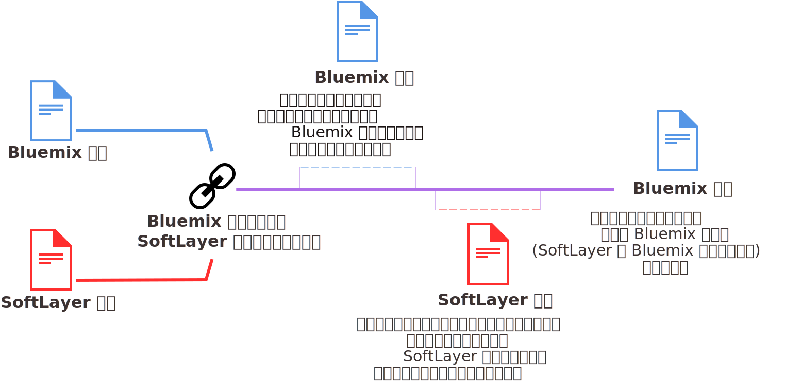

---

 

copyright:

  years: 2016, 2017
lastupdated: "2017-01-11"
 

---

{:shortdesc: .shortdesc}
{:codeblock: .codeblock}
{:screen: .screen}
{:new_window: target="_blank"}

# {{site.data.keyword.Bluemix_notm}} および SoftLayer 請求アカウントのアップグレードおよび一元化
{: #softlayerlink}

{{site.data.keyword.Bluemix_notm}} トライアル・アカウントを使用していて、「インフラストラクチャー」ダッシュボードにアクセスする場合、{{site.data.keyword.Bluemix_notm}} 従量課金 (PAYG) アカウントにアップグレードする必要があります。また、トライアル・アカウントでは使用できない、他の課金対象リソースを使用する場合や、トライアル・アカウントが終了した場合にも、アップグレードが必要です。 

既存の {{site.data.keyword.Bluemix_notm}} 請求アカウントと SoftLayer 請求アカウントをリンクして一元化できます。アカウントをリンクすると、{{site.data.keyword.Bluemix_notm}} と SoftLayer の両方のリソースについて {{site.data.keyword.Bluemix_notm}} から請求されるようになります。

**注意:** アカウントの自動リンク以前に作成された {{site.data.keyword.Bluemix_notm}} サブスクリプション・アカウントおよび旧 {{site.data.keyword.Bluemix_notm}} 従量課金 (PAYG) アカウントは、SoftLayer アカウントとリンクすることはできません。「インフラストラクチャー」ダッシュボードにアクセスするには、2 つ目のアカウントとして従量課金アカウントを作成する必要があります。これは自動的に SoftLayer アカウントとリンクされます。これにより、2 通の請求書 ({{site.data.keyword.Bluemix_notm}} アカウントごとに 1 通ずつ) が送付されます。インフラストラクチャー・リソースは別の従量課金アカウントで請求されますが、サブスクリプション・アカウントのアプリやサービスでそのリソースを使用できます。例えば、サブスクリプション・アカウントで Watson サービスを有効化した場合、サービス資格情報をコピーして、従量課金アカウントから調達したベア・メタル・アプリケーションにその資格情報を追加できます。
{:shortdesc}

## {{site.data.keyword.Bluemix_notm}} 従量課金 (PAYG) アカウントへのアップグレード
{: #upgradetopayg}

トライアル・アカウントを使用して {{site.data.keyword.Bluemix_notm}} にログインした場合、{{site.data.keyword.Bluemix_notm}} の「インフラストラクチャー」ダッシュボードにアクセスできません。アプリでインフラストラクチャー・リソースを使用する場合、従量課金 (PAYG) アカウントにアップグレードする必要があります。

トライアル・アカウントを {{site.data.keyword.Bluemix_notm}} 従量課金 (PAYG) アカウントにアップグレードするには、以下のステップを実行します。

 1. **「アカウント」**&gt;**「請求処理」**をクリックします。
 2. 次に、**「クレジット・カードの追加」**をクリックします。
 3. 必要な請求処理詳細を入力します。 
 4. 従量課金 (PAYG) アカウントのご使用条件を読んで受け入れます。 
 5. 完了したら、**「アップグレード」**をクリックします。 
 
従量課金 (PAYG) アカウントにアップグレードした後には、**「インフラストラクチャー」**オプションが、{{site.data.keyword.Bluemix_notm}} **カタログ**にリストされます。使用量が無料枠を超えると、月次の {{site.data.keyword.Bluemix_notm}} 請求書を受け取ることになります。請求書は米国ドル (USD) 単位であり、リソースの課金について詳しく示されます。 

## {{site.data.keyword.Bluemix_notm}} アカウントと SoftLayer アカウントの一元化
{: #unifyingaccounts}

{{site.data.keyword.Bluemix_notm}} アカウントと SoftLayer アカウントを一元化して、組み合わせたリソースを使用できます。{{site.data.keyword.Bluemix_notm}} アカウントと Softlayer アカウントをリンクすると、単一の {{site.data.keyword.Bluemix_notm}} 請求書を受け取ることになります。既存の {{site.data.keyword.Bluemix_notm}} アカウントがある場合、SoftLayer リソースについての {{site.data.keyword.Bluemix_notm}} を介した請求は、アカウントのリンク後に開始する新しい請求処理サイクルから有効になります。

**重要:** {{site.data.keyword.Bluemix_notm}} でリンクされるアカウントはすべて、従量課金 (PAYG) アカウントでなければなりません。新規従量課金 (PAYG) アカウントを作成するか、既存の従量課金 (PAYG) アカウントをリンクできます。あるいは、既存のトライアル・アカウントをリンクすることもできますが、そのアカウントは従量課金 (PAYG) アカウントにアップグレードされます。サブスクリプション {{site.data.keyword.Bluemix_notm}} アカウントは、リンクできません。  

アカウントがリンクされると、以下のようになります。

* SoftLayer と {{site.data.keyword.Bluemix_notm}} アカウントの両方にアクセスするために、IBM ID 資格情報を使用する必要があります。
* 既存の SoftLayer 割引は、{{site.data.keyword.Bluemix_notm}} の料金全体に適用されます。 
* 米国ドル (USD) 単位の 1 つの請求書を受け取ります。
* {{site.data.keyword.BluSoftlayer}} ユーザー・インターフェースで {{site.data.keyword.Bluemix_notm}} リソースの使用量をモニターできます。 

**注意:** リンクされたアカウントをリンク解除することはできません。 

SoftLayer アカウントがあり、SoftLayer アカウントと {{site.data.keyword.Bluemix_notm}} アカウントをリンクする場合は、以下のステップを実行します。

 1. {{site.data.keyword.slportal}} で、**「{{site.data.keyword.Bluemix_notm}} アカウントをリンク (Link a {{site.data.keyword.Bluemix_notm}} Account)」**をクリックします。
 2. SoftLayer アカウントと {{site.data.keyword.Bluemix_notm}} アカウントをリンクする場合のご利用条件を読み、同意します。
 3. 要求されたら、{{site.data.keyword.Bluemix_notm}} アカウントに関連付けられている E メール・アドレスを指定します。{{site.data.keyword.Bluemix_notm}} アカウントがない場合は、使用する E メール・アドレスを指定し、{{site.data.keyword.Bluemix_notm}} への招待を受けてアカウントを作成するための手順に従います。

アカウントをリンクするには、SoftLayer アカウントのマスター・ユーザーでなければなりません。

アカウントをリンクすると、SoftLayer グローバル・ヘッダーで**「{{site.data.keyword.Bluemix_notm}} に進む」**リンクが使用可能になります。このリンクをクリックすると、{{site.data.keyword.Bluemix_notm}} ログイン・ページに移動します。また、{{site.data.keyword.Bluemix_notm}} ヘッダーで**「SoftLayer」**リンクが使用可能になっています。このリンクをクリックすると、新規ウィンドウで {{site.data.keyword.slportal}} のホーム・ページに移動します。

{{site.data.keyword.Bluemix_notm}} インフラストラクチャー・オファリングは、3 層のネットワークに接続され、パブリック・トラフィック、プライベート・トラフィック、および管理トラフィックがセグメント化されます。お客様の {{site.data.keyword.Bluemix_notm}} アカウントのインフラストラクチャー・オファリングは、無料で、プライベート・ネットワークを介して相互にデータを転送できます。ベアメタル・サーバー、仮想サーバー、およびクラウド・ストレージなどのインフラストラクチャー・オファリングは、パブリック・ネットワークを介して、{{site.data.keyword.Bluemix_notm}} カタログ内の他のアプリケーションおよびサービス (Watson サービス、コンテナー、ランタイムなど) に接続します。そのような 2 つのタイプのオファリング間で転送されるデータは、計測され、標準パブリック・ネットワーク帯域幅レートで課金されます。

## {{site.data.keyword.Bluemix_notm}} への SoftLayer チーム・メンバーの招待
{: #invite_users}

{{site.data.keyword.Bluemix_notm}} アカウントと SoftLayer アカウントをリンクするときに、{{site.data.keyword.Bluemix_notm}} に参加するように SoftLayer チーム・メンバーを招待できます。あるいは、後で {{site.data.keyword.Bluemix_notm}} ユーザー・インターフェースから SoftLayer チーム・メンバーを招待することもできます。
{:shortdesc}

{{site.data.keyword.Bluemix_notm}} ユーザー・インターフェースから、SoftLayer アカウントのすべてのメンバーを招待することを選択します。また、個別にメンバーを選択することもできます。チーム・メンバーを招待する際には、被招待者の {{site.data.keyword.Bluemix_notm}} アカウントの役割を設定する必要があります。{{site.data.keyword.Bluemix_notm}} の各種役割について詳しくは、[ユーザー役割](https://console.ng.bluemix.net/docs/admin/users_roles.html#userrolesinfo)を参照してください。

チーム・メンバーを {{site.data.keyword.Bluemix_notm}} アカウントに招待するには、SoftLayer アカウントのマスター・ユーザーでなければなりません。

{{site.data.keyword.Bluemix_notm}} でチーム・メンバーを招待するには、以下のステップを実行します。

 1. **「アカウント」**&gt;**「チーム・メンバーの招待」**をクリックします。
 2. **「追加」**をクリックし、SoftLayer アカウントへの認証操作を行い、{{site.data.keyword.BluSoftlayer}} アカウントからチーム・メンバーのリストを表示します。
 3. 招待するチーム・メンバーを選択し、**「送信」**をクリックします。
 
チーム・メンバーは、**「組織に参加してください (Join the organization)」**リンクが含まれた E メールを受け取ります。チーム・メンバーは、IBM ID を所有していない場合、登録ページにリダイレクトされます。次に、チーム・メンバーは、いくつかの基本情報を入力し、{{site.data.keyword.Bluemix_notm}} アカウントを作成できます。

{{site.data.keyword.Bluemix_notm}} ユーザー・インターフェースを使用したチーム・メンバーの招待について詳しくは、『[チーム・メンバーの招待](https://console.ng.bluemix.net/docs/admin/users_roles.html#inviteteammembers)』を参照してください。

## IBM ID への切り替え
{: #ibmid_switch}

SoftLayer での認証は、IBM ID を使用して {{site.data.keyword.Bluemix_notm}} のすべてに対して単一のログインを提供するようになりました。既存の SoftLayer アカウントは IBM ID 認証への切り替えが有効になっています。マイグレーション・ウィザードを使用して、この切り替えの処理を行います。
{:shortdesc}

マスター・ユーザーであるのに {{site.data.keyword.slportal}} に IBM ID への切り替えを促すプロンプトが表示されない場合、[IBM サポートに連絡](/docs/support/index.html#contacting-support)して、この機能の有効化についての支援を依頼してください。

IBM ID への切り替えを開始しても、処理が完了する前であればいつでも切り替えを取り消すことができます。ただし、ログインするたびに、IBM ID への切り替えを促すプロンプトが表示されます。{{site.data.keyword.Bluemix_notm}} アカウントにリンクする予定の各 SoftLayer アカウントは、固有の E メール・アドレスを持つ固有の IBM ID によって所有される必要があります。

既存の SoftLayer ユーザー名から IBM ID に切り替えるには、以下の手順を実行します。

 1. SoftLayer アカウントにログインします。IBM ID への切り替えを促すプロンプトが表示されたら、**「OK」**をクリックします。 
 
    既にログインしているが (IBM ID への切り替えのプロンプトで**「後で」**をクリックしたが)、IBM ID 認証への切り替えを現行セッションで行うことにした場合は、「ユーザー・プロファイルの編集」ページに移動し、**「IBM ID への切り替え」**をクリックします。
	
 2. ウィザードのプロンプトに従って IBM ID を作成します。 
 
    新規 IBM ID を作成するには、どの IBM ID でも現在使われていない E メール・アドレスを入力します。新規 IBM ID は、その E メール・アドレスをユーザー名および E メール・アドレスとして使用します。IBM ID の作成後に、IBM ID に関連付けられている E メール・アドレスを更新できますが、ユーザー名は変更できません。招待 E メールは、指定された E メール・アドレスに送信されます。
    
    ウィザードの完了後に、登録コードが記載された E メールが届けられます。
 
 3. E メールを受信したら、リンクをたどるか URL をブラウザーにコピーし、登録コードを入力します。コードは 7 日間有効であり、1 回のみ使用できます。
 
    IBM ID 認証に切り替えた後は、IBM ID でのみアカウントにログインできます。「アカウントのログイン」プロンプトで、**「IBM ID アカウントでのログイン」**セクションに移動し、**「IBM ID でログイン」**をクリックします。以前に SoftLayer ID で使用していた**「ユーザー名」**と**「パスワード」**のフィールドは使用しないでください。
 
新規のお客様の場合、オーダーをチェックアウトすると、既存の IBM ID の入力を求められるか、新規 IBM ID を作成するように求められます。 

 * 既存の IBM ID を使用するには、ユーザー名を入力するか、IBM ID の E メール・アドレスが固有であれば (つまり、複数の IBM ID 間で共有されていなければ) E メール・アドレスを入力します。
 
 * 新規 IBM ID を作成するには、どの IBM ID でも現在使われていない E メール・アドレスを入力します。新規 IBM ID は、その E メール・アドレスをユーザー名および E メール・アドレスとして使用します。IBM ID の作成後に、IBM ID に関連付けられている E メール・アドレスを更新できますが、ユーザー名は変更できません。招待 E メールは、指定された E メール・アドレスに送信されます。

IBM ID を使用したログインに関する問題を解決するには、[Bluemix へのアクセスに関するトラブルシューティング](/docs/troubleshoot/ts_accessing.html#accessing)を参照してください。

### ユーザーの IBM ID への切り替えの有効化
{: #link_accounts_resellers}

場合によっては、アカウントでの IBM ID 認証の使用を販売店または流通業者が前もって有効にしておかないと、ユーザーが IBM ID に切り替えることができないことがあります。 

 * 古い SoftLayer 資格情報を持つ既存アカウントでの IBM ID 認証の使用を有効にするには、[IBM サポートに連絡](https://console.ng.bluemix.net/docs/support/index.html#contacting-support)して IBM ID マイグレーションを有効にします。これは、{{site.data.keyword.Bluemix_notm}} アカウントにリンクしたいすべての既存エンド・ユーザー・アカウントで有効にする必要があります。
 
 * 新規ユーザー・アカウントが確実に IBM ID を使用して作成されるようにするには、即時マスター・ユーザー・アカウントに `CREATE_NEW_ACCOUNT_WITH_IBMid_AUTHENTICATION` 属性が設定される必要があります。[IBM サポートに連絡](https://console.ng.bluemix.net/docs/support/index.html#contacting-support)するか、またはベンダーに連絡して、ご使用のアカウントに対してこれを設定するよう依頼してください。
 
### ユーザー・アカウントのリンク
{: #link_user_accounts}
ユーザーが IBM ID 認証に切り替えた後、販売店および流通業者は SoftLayer アカウントと {{site.data.keyword.Bluemix_notm}} アカウントをリンクすることができます。

**注:** 
  * リンクされるアカウントのマスター・ユーザーは IBM ID でなければなりません。
  * 各エンド・ユーザー・アカウントにマスター・ユーザーとしてログインします。「ユーザー・プロファイル」ページに移動し、**「IBM ID への切り替え」**をクリックします。
  * {{site.data.keyword.Bluemix_notm}} アカウントにリンクする各アカウントは、固有の E メール・アドレスを持つ固有の IBM ID によって所有される必要があります。1 つの IBM ID が複数の SoftLayer アカウントを所有できますが、それらのアカウントを {{site.data.keyword.Bluemix_notm}} アカウントにリンクすることはできません。
1 つの IBM ID が複数の SoftLayer アカウントのマスター・ユーザーであり
、それらのアカウントを {{site.data.keyword.Bluemix_notm}} アカウントにリンクしたい場合は、アカウントごとに固有の IBM ID になるようにマスター・ユーザーを変更する必要があります。SoftLayer アカウントのマスター・ユーザーを変更するには、[IBM SoftLayer サポート ](https://knowledgelayer.softlayer.com/topic/support){: new_window} に連絡してください。
  
各アカウントを {{site.data.keyword.Bluemix_notm}} アカウントにリンクするには、以下のステップを実行します。 

 1. 新規 {{site.data.keyword.Bluemix_notm}} アカウントを作成するか、既存 {{site.data.keyword.Bluemix_notm}} アカウントをリンクするには、マスター・ユーザーとして SoftLayer アカウントにログインし、**{{site.data.keyword.Bluemix_notm}}** リンクをクリックします。これによって、新規 {{site.data.keyword.Bluemix_notm}} アカウントの作成または既存 {{site.data.keyword.Bluemix_notm}} アカウントのリンクを行うことができるようになります。SoftLayer アカウントのマスター・ユーザーである IBM ID は、リンクする先の Bluemix アカウントの所有者でなければなりません。SoftLayer アカウントのユーザーを {{site.data.keyword.Bluemix_notm}} アカウントに追加する操作も含めて、ウィザードのプロンプトに従います。 
 2. アカウントをリンクした後、そのアカウントのエンド・ユーザーに IBM ID にマイグレーションするよう通知します。エンド・ユーザーは、その後、{{site.data.keyword.Bluemix_notm}} コンソールで、「インフラストラクチャー」ダッシュボード、「アプリケーション」ダッシュボード、および「サービス」ダッシュボードにアクセスできます。
 3. リンクされたアカウントに新規ユーザーが追加される場合、それらのユーザーが一元化されたコンソール内ですべての機能にアクセスできるようにするため、それらのユーザーを SoftLayer アカウントと {{site.data.keyword.Bluemix_notm}} アカウントの両方に追加することが必要になります。
 
**推奨:** エンド・ユーザー・アカウントのみを IBM ID にマイグレーションしてください。ブランド・アカウント (エンド・ユーザー・アカウントの親アカウントであり、リソースを含んでいない) はマイグレーションしないでください。ブランド・アカウント・ユーザーは、IBM ID にマイグレーションすると、Brand Agent Portal (BAP) ポータルにログインできなくなります。

<!--
### Mapping multiple SoftLayer accounts to one IBMid
{: #map_multiple_accounts}

You can associate one IBMid with multiple SoftLayer accounts by using an existing IBMid email address when setting up the account. Only one SoftLayer user for each account can be mapped to the single IBMid. The IBMid must be unique within each SoftLayer account. However, one user with access to multiple SoftLayer accounts can use one IBMid to access multiple SoftLayer accounts.

For example, an IBMid can map to the master user in accounts A and B, and to an additional user in accounts C and D. One of the accounts mapped to that IBMid is the default account.  Usually, the default account is the account that was first mapped to the IBMid. However, you can switch which account is the default account  through an account switching feature in the Customer Portal.

For a user with IBMid access to multiple accounts with two-factor authentication enabled, an appropriate two-factored authentication verification code per account is required during account log in and account switching.
-->

## SoftLayer 資産での {{site.data.keyword.Bluemix_notm}} サービスの使用
{: #bluemix_services}

SoftLayer 資産で API ベースの公開 {{site.data.keyword.Bluemix_notm}} サービスを簡単に使用できます。すべての API はセキュアであり暗号化されているため、データが保護されます。
{:shortdesc}

例えば、SoftLayer からベア・メタル・サーバーで実行されているアプリに Watson のコグニティブ機能を追加したいと思ったことはありませんか。以下の簡単な 4 つのステップで、{{site.data.keyword.personalityinsightsshort}} などのサービスを追加して、アプリのユーザーを把握できるようにすることが可能です。

1. {{site.data.keyword.Bluemix_notm}} カタログでサービスを見つけます。
2. わずか数クリックで、サービスのインスタンスをプロビジョンします。
3. サービス資格情報をコピーし、アプリケーションに追加して、サービスが既存のコードで実行されるようにセットアップします。
4. アプリを更新した後に、SoftLayer インフラストラクチャーで新規バージョンをデプロイします。

SoftLayer のアプリから Watson API を呼び出して*洞察およびコグニティブ* の知識を得ることで、アプリをさらにパーソナライズできます。あるいは、*データおよび分析* サービスを使用して、アプリでハイパフォーマンス分析を利用できます。あるいは、DaaS (Database-as-a-Service) を選択し、管理を {{site.data.keyword.Bluemix_notm}} に任せることができます。

{{site.data.keyword.activedeployshort}} や {{site.data.keyword.deliverypipeline}} などのサービスとともにコンテナーを使用することで、アプリケーション開発を最新化できます。これにより、{{site.data.keyword.vpn_short}} サービスを使用して SoftLayer と通信し、プライベート・ネットワーク内のコンテナーを SoftLayer プライベート・ネットワークに接続できるようになります。計算リソースおよびサービスの使用量に対するすべての課金は、{{site.data.keyword.Bluemix_notm}} 請求に反映されます。 

### API ベースの {{site.data.keyword.Bluemix_notm}} サービス
一部の {{site.data.keyword.Bluemix_notm}} サービスは、SoftLayer で使用できません。以下のサービスは、アプリケーション・コードを使用して実行するようにセットアップできます。
* {{site.data.keyword.alchemyapishort}}
* {{site.data.keyword.alertnotificationshort}}
* {{site.data.keyword.sparks}}
* {{site.data.keyword.appseccloudshort}}
* {{site.data.keyword.blockchain}}
* {{site.data.keyword.cloudant}}
* {{site.data.keyword.conceptinsightsshort}}
* {{site.data.keyword.iotmapinsights_short}}
* {{site.data.keyword.dashdbshort}}
* {{site.data.keyword.dialogshort}}
* {{site.data.keyword.documentconversionshort}}
* {{site.data.keyword.twittershort}}
* {{site.data.keyword.weather_short}}
* {{site.data.keyword.iotdriverinsights_short}}
* {{site.data.keyword.geospatialshort_Geospatial}}
* {{site.data.keyword.graphshort}}
* {{site.data.keyword.iotelectronics}}
* {{site.data.keyword.languagetranslationshort}}
* {{site.data.keyword.messagehub}}
* {{site.data.keyword.mqa}}
* {{site.data.keyword.mobileappbuilder_short}}
* {{site.data.keyword.mql}}
* {{site.data.keyword.nlclassifiershort}}
* {{site.data.keyword.objectstorageshort}}
* {{site.data.keyword.personalityinsightsshort}}
* {{site.data.keyword.presenceinsightsshort}}
* {{site.data.keyword.relationshipextractionshort}}
* {{site.data.keyword.retrieveandrankshort}}
* {{site.data.keyword.speechtotextshort}}
* {{site.data.keyword.sqldb}}
* {{site.data.keyword.streaminganalyticsshort}}
* {{site.data.keyword.texttospeechshort}}
* {{site.data.keyword.toneanalyzershort}}
* {{site.data.keyword.tradeoffanalyticsshort}}
* {{site.data.keyword.visualinsightsshort}}
* {{site.data.keyword.visualrecognitionshort}}
* {{site.data.keyword.workflow}}
* {{site.data.keyword.workloadscheduler}}

**注:** これらのサービスの一部のプランは使用できません。リンクされたアカウントで使用できるのは、従量課金 (PAYG) アカウント用に有効になっているプランのみです。ただし、個別に請求される個別の {{site.data.keyword.Bluemix_notm}} アカウントがある場合は、これらのすべてのサービスのすべてのプランを使用できます。

## アカウントがリンクされている場合の {{site.data.keyword.Bluemix_notm}} 使用量に対する請求処理
{: #bill_usage}

{{site.data.keyword.Bluemix_notm}} と SoftLayer の請求アカウントをリンクすると、次の請求処理サイクルは、単一の {{site.data.keyword.Bluemix_notm}} 請求で課金されます。
{:shortdesc}

{{site.data.keyword.Bluemix_notm}} の使用量サイクルは暦月ベースであるため、アカウントは毎月、課金契約に設定された請求日に請求されます。SoftLayer では、使用量サイクルは、SoftLayer の使用を開始したときから始まるため、毎月、SoftLayer アカウントを登録したときと同じ日に請求されます。 

アカウントをリンクした場合、現行月のサイクルの間、{{site.data.keyword.Bluemix_notm}} の使用量が引き続き計測され、その使用量については {{site.data.keyword.Bluemix_notm}} の請求書で請求されます。翌月の初めから、{{site.data.keyword.Bluemix_notm}} と SoftLayer の課金が、{{site.data.keyword.Bluemix_notm}} 請求書で結合されるようになります。

例えば、4 月 16 日にアカウントをリンクした場合、4 月の使用量については Bluemix の請求書を受け取ります。アカウントをリンクしたタイミングによっては、SoftLayer 使用量に対して別個の請求書を受け取ることがあります。SoftLayer と {{site.data.keyword.Bluemix_notm}} の両方の 5 月の使用量は、{{site.data.keyword.Bluemix_notm}} アカウントを介して請求されます。

請求書がリンクされた後には、{{site.data.keyword.Bluemix_notm}} 請求書には、以下の見出しで、使用した各リソースに対する別個の料金がリストされます。

* **ベア・メタル・サーバーと付属サービス**
* **仮想サーバーと付属サービス**
* **付属しないサービス**

{{site.data.keyword.Bluemix_notm}} の使用量を表示する方法については、『[使用量詳細の表示](https://console.ng.bluemix.net/docs/pricing/index.html#usage)』を参照してください。

