---

copyright:

  years: 2015, 2017
lastupdated: "2017-04-07"

---

{:new_window: target="_blank"}
{:shortdesc: .shortdesc}
{:screen:.screen}
{:codeblock:.codeblock}

# Bluemix 환경 설정
{: #patterns}

프로젝트 성공을 위해 충분한 시간을 들여 필요한 리소스 및 엔터프라이즈 요구사항을 계획하고 디자인하십시오. 클라우드 프로젝트를 시작하는 데 도움이 되도록 다음 질문을 고려하십시오.

* 개발하려는 애플리케이션의 수와 유형은 무엇입니까?
* 애플리케이션이 어떤 서비스에 액세스해야 합니까?
* 개발 프로세스에서 누가 협업하고 각각 어떤 역할을 수행합니까?
* 프로젝트의 각 단계에 어느 정도의 격리가 필요합니까?
* 엔터프라이즈가 인프라 리소스를 제공합니까?
* 회사가 어떻게 의사소통합니까?
* 조직과 영역 사용을 분명하게 식별하기 위해 구현할 수 있는 이름 지정 표준이 있습니까?   

{:shortdesc}

클라우드 솔루션을 디자인할 때 계정 보안과 운영 요구사항, 지역 규정, 시장 지침과 기업 정책에 대해서도 생각하십시오. 프로젝트 요구사항을 충족하도록 {{site.data.keyword.Bluemix}}에서 세 가지 유형의 클라우드 환경을 제공합니다.

* [{{site.data.keyword.Bluemix_notm}} 퍼블릭](/docs/overview/whatisbluemix.html "{{site.data.keyword.Bluemix_notm}} 퍼블릭"): 여러 회사와 사용자가 인프라 리소스를 공유합니다.
* [{{site.data.keyword.Bluemix_notm}} 데디케이티드](/docs/dedicated/index.html#dedicated "{{site.data.keyword.Bluemix_notm}} 데디케이티드"): {{site.data.keyword.Bluemix_notm}} 퍼블릭 클라우드와 고유 네트워크에 안전하게 연결할 수 있는 고유 데디케이티드 SoftLayer 인프라를 사용합니다.
* [{{site.data.keyword.Bluemix_notm}} 로컬](/docs/local/index.html#local "{{site.data.keyword.Bluemix_notm}} 로컬"): 회사 방화벽 뒤에 위치하여 대부분의 중요한 워크로드를 보호하고 {{site.data.keyword.Bluemix_notm}} 퍼블릭 클라우드와 {{site.data.keyword.Bluemix_notm}} 데디케이티드 클라우드에 안전하게 연결할 수 있습니다.

필요한 클라우드 환경의 유형을 결정하는 과정의 일부로 계정, 조직, 영역, 리소스 및 팀 구성원의 구조를 계획하십시오.

대부분의 회사의 경우 단일 {{site.data.keyword.Bluemix_notm}} 계정으로 충분합니다. 둘 이상의 비즈니스 영역이 있는 대규모 회사의 경우
각 비즈니스 도메인에 대한 별도의 {{site.data.keyword.Bluemix_notm}} 계정을 원할 수 있습니다. 예를 들어, 큰 은행 내에는 소매와 상업 부분을 위한 별도의 계정이 있을 수 있습니다.

다음 표는 일부 핵심 요소를 요약하여 보여줍니다. 

| 요소   | 설명 |
|---------------------------------------|--------------------------------------------------------------------------------------|
| 계정   | 각 계정에는 하나의 계정 소유자가 있습니다. |
|| 하나 이상의 조직을 포함합니다. 둘 이상의 조직을 작성하려면 종량과금제 계정이 있어야 합니다. |
| 계정 소유자   | 계정 내에 누적되는 모든 사용 비용에 대한 책임이 있습니다. |
|| 하나의 계정만 소유할 수 있습니다. |
|| 하나 이상의 조직 관리자를 추가하여 조직에 대한 읽기 및 쓰기 권한을 포함하는 조직 관리를 위임할 수 있습니다. |
|| 다른 {{site.data.keyword.Bluemix_notm}} 계정의 영역과 조직의 팀 구성원이 될 수 있습니다. |
| 조직   | 하나 이상의 영역을 포함합니다. |
|| 하나 이상의 조직 관리자를 포함합니다. |
|| 하나 이상의 팀 구성원을 포함합니다. 각 팀 구성원은 하나 이상의 역할을 부여받을 수 있습니다. |
|| 영역 내 배치된 애플리케이션에서 생성된 사용 비용은 조직 레벨에서 보고됩니다. |
| 영역   | 하나 이상의 리소스를 포함합니다. |
|| 하나 이상의 애플리케이션을 포함합니다. |
|| 하나 이상의 영역 관리자를 포함합니다. |
|| 하나 이상의 팀 구성원을 포함합니다. 각 사용자는 이미 소유 조직의 팀 구성원이어야 합니다. 각 팀 구성원은 하나 이상의 역할을 부여받을 수 있습니다. |
| 팀 구성원   | 여러 계정에 있는 하나 이상의 조직과 영역에 추가될 수 있습니다. |
|| 동일한 조직, 영역 또는 두 가지 모두에 있는 둘 이상의 역할에 지정될 수 있습니다. |
{:caption="표 1. 핵심 요소 설명" caption-side="top"}

## {{site.data.keyword.Bluemix_notm}} 환경 판별
{: #bpimplementation}

엄격하게 정의된 기존 개발, 테스트 및 프로덕션 방법 대신 개발자 및 테스터가 다른 팀 구성원과 함께 협업할 수 있는 환경을 구현할 수 있습니다. 애플리케이션을 개발하고 전달하는 방법을 디자인하는 경우 {{site.data.keyword.Bluemix_notm}} 영역을 작성하여 해당 방법을 충족시킬 수 있습니다. 조직 레벨에서 아래로 사용자 환경을 디자인하는 대신 영역 레벨에서 위로 {{site.data.keyword.Bluemix_notm}} 환경 디자인을 고려하십시오.

개발하고 배치할 애플리케이션의 스케일과 범위를 고려하십시오. {{site.data.keyword.Bluemix_notm}} 영역은 연결되거나 정의된 하나 이상의 애플리케이션에 대한 개발 환경으로 사용 가능합니다. 개발 영역을 제외하고 예를 들어, 단위 테스트, 성능 테스트 및 통합 테스트를 위한 영역을 작성할 수 있습니다. 빌드, 스테이징 및 프로덕션을 위한 영역도 정의할 수 있습니다. 작성한 각 영역은 동일한 조직 내 다른 팀 구성원과 공유할 수 있습니다.

사용자가 여러 비즈니스 영역에서 작업 중이고 해당 활동이 겹치지 않는 개별 {{site.data.keyword.Bluemix_notm}} 조직을 작성하십시오. 두 개의 완전히 독립적인 그룹이 있는 경우 각각에 대한 조직을 작성하면 팀 플레이어와 리소스의 전달 및 관리에 대한 분명한 경계가 정의됩니다. 조직 간 통신을 위해 API를 정의할 수 있습니다.  

회사 내 구조가 아닌 작업 방법과 일치하도록 {{site.data.keyword.Bluemix_notm}} 조직을 작성할 수 있습니다. 일반적으로 회사 조직은 변할 수 있지만 애플리케이션의 개발 및 유지보수는 이에 관계없이 계속됩니다. 회사 조직 구조가 아니라 애플리케이션의 수명에 맞게 {{site.data.keyword.Bluemix_notm}} 환경을 디자인하십시오.

반복 개발 및 배치로 인해 애플리케이션이 빠르게 확장될 수 있습니다. 전달 프로세스 디자인은 빠르고 쉽게 확장 가능해야 합니다. 빠른 배치 속도로 지속적으로 개발하기를 원합니다. 동일한 {{site.data.keyword.Bluemix_notm}} 조직에 개발 및 프로덕션 영역이 있으면 동일한 리소스에 대한 액세스가 제공됩니다. 단일 조직 내에서 여러 영역을 관리하면 관리 오버헤드가 감소됩니다. 개발, 테스트 및 운영 담당자가 동일한 {{site.data.keyword.Bluemix_notm}} 조직 내에서 작업하는 경우 쉽게 협업할 수 있습니다.

이름 지정 표준을 구현하여 조직 및 영역 사용을 분명하게 식별하십시오. 예를 들어, 클라우드의 유형, 지리적 지역, 사용 유형(예: dev, test, prod), 애플리케이션 이름 및 버전 또는 개정 번호를 포함할 수 있습니다. 조직 및 영역은 관리 및 액세스를 위해 쉽게 식별될 수 있습니다.  

반복 개발로 인해 영역의 수가 빠르게 증가할 수 있습니다. 조직 내에서 필요한 만큼의 영역을 정의할 수 있습니다. 많은 수의 영역을 정의하려는 경우 영역 관리에 도움이 되도록 애플리케이션을 작성할 수 있습니다. 영역 수가 60을 넘으면 다른 조직 정의를 고려할 수 있습니다.

한 사용자가 조직을 작성하고 관리하게 하고, 영역을 정의하고, 팀 구성원에게 액세스 권한을 부여하십시오. 조직 관리자가 사용 불가능한 경우 두 번째 사용자에게 환경 유지보수를 위한 동일한 액세스 권한을 부여할 수 있습니다.  

각 영역 및 조직에 대한 액세스 권한이 필요한 모든 사용자를 식별하십시오. 해당 역할을 판별하십시오. 팀 구성원의 작업 역할은 해당 권한을 판별합니다. 예를 들어, 시니어 개발자에게 전체 {{site.data.keyword.Bluemix_notm}} 개발 환경을 보고 업데이트할 수 있는 권한이 필요합니다. 하지만 주니어 개발자의 경우 보기 및 업데이트 대상이 제한됩니다.

## 조직 아키텍처 판별
{: #orgstructure}

{{site.data.keyword.Bluemix_notm}} 퍼블릭, {{site.data.keyword.Bluemix_notm}} 데디케이티드, {{site.data.keyword.Bluemix_notm}} 로컬 또는 임의 조합을 사용하는 클라우드 환경을 디자인하기 위해 다음 조직 아키텍처를 사용할 수 있습니다.

* 단일 조직: 동일한 사용자 세트가 {{site.data.keyword.Bluemix_notm}} 퍼블릭, {{site.data.keyword.Bluemix_notm}} 데디케이티드 또는 {{site.data.keyword.Bluemix_notm}} 로컬의 조직 어디에서든 사용 가능한 리소스에 액세스해야 하는 경우 이 아키텍처 사용을 고려하십시오.
* 다중 조직: {{site.data.keyword.Bluemix_notm}} 퍼블릭, {{site.data.keyword.Bluemix_notm}} 데디케이티드 또는 {{site.data.keyword.Bluemix_notm}} 로컬 내 여러 환경을 격리해야 하는 경우 이 아키텍처 사용을 고려하십시오.

### 단일 조직 대 다중 조직
{: #singleormulti}

단일 조직 환경에서 인프라 리소스는 회사의 여러 영역에서
공유됩니다. 반면에 다중 조직 환경에서는 인프라 리소스가 공유되지 않습니다.

두 조직 아키텍처 모두 다음 원칙을 지원합니다.

* 애플리케이션, 프로젝트 또는 두 가지 모두에 대한 경계 적용.
* 리소스를 관리하는 권한이 사용자 역할에 의해 부여됨.

단일 조직 아키텍처를 구현하려면 {{site.data.keyword.Bluemix_notm}} 퍼블릭, {{site.data.keyword.Bluemix_notm}} 데디케이티드 또는
{{site.data.keyword.Bluemix_notm}} 로컬에서 계정을 작성하고 하나의 조직을 정의하십시오. 그런 다음 다른 비즈니스 분야(LOB) 또는 전달 단계, 특정 프로젝트, 애플리케이션, 사용자 권한 또는 이러한 컴포넌트의 조합을 기반으로 하는 여러 영역을 정의할 수 있습니다.

다중 조직 아키텍처를 구현하려면 {{site.data.keyword.Bluemix_notm}} 퍼블릭, {{site.data.keyword.Bluemix_notm}} 데디케이티드 또는
{{site.data.keyword.Bluemix_notm}} 로컬에서 계정을 작성하십시오. 그런 다음 다른 LOB, 전달 단계, 특정 프로젝트, 사용자 권한 또는
이러한 컴포넌트의 조합에 해당하는 조직을 정의할 수 있습니다. 그런 다음 회사의 동일한 부서에서 전달하는 애플리케이션 또는 프로젝트를 기반으로 한 여러 영역을 정의할 수 있습니다.

**참고:** 다중 조직을 정의하려면 종량과금제 또는 구독과 같은 청구 가능한 계정이 있어야 합니다.

### 조직 고려사항
{: #orgconsiderations}

단일 조직 아키텍처를 구현할 때 조직에 클라우드 애플리케이션을 개발하고 관리하고 배치하는 데 사용하는 클라우드 리소스,
서비스 및 애플리케이션이 모두 포함됩니다. {{site.data.keyword.Bluemix_notm}} 퍼블릭에서 조직은 계정 간 분리를 제공하고 모든 지역에서 사용 가능합니다.

 

 그림 1. {{site.data.keyword.Bluemix_notm}} 퍼블릭, {{site.data.keyword.Bluemix_notm}} 데디케이티드 및
{{site.data.keyword.Bluemix_notm}} 로컬의 단일 조직 아키텍처 예
{: #bpfigure1}

사용자가 다중 조직 아키텍처를 구현할 때 조직은 수행할 수 있는 작업 및 수행하는 사용자를 제어하고 정의하는 데 사용할 수 있는 첫 번째 레벨의 경계
적용 및 추출을 제공합니다. 다른 LOB, 전달 단계, 사용자의 역할, 특정 프로젝트 또는 이러한 컴포넌트의 조합에 맞춰 각 조직을 디자인하십시오.  

필요한 조직 수는 다음 요인에 따라 다릅니다.

* 할당량 및 제어 비용을 관리하기 위해 조직 내에 필요한 단위 레벨입니다.
* 여러 환경에 적용해야 하는 보안 레벨입니다. 예를 들어, 컨테이너를 사용하는 경우 프로덕션에 사용되는 컨테이너 이미지에서 개발을 위해 사용되는 컨테이너 이미지를 분리할 수 있습니다.
* 회사, 국가 및 업계 요구사항으로 인한 조직의 위치입니다. 예를 들어, 지리(geo)상 특정 지역에 있는 데디케이티드 클라우드에서 모든 앱을 실행할 수 있습니다.

클라우드 구조에 맞게 여러 조직을 정의하는 경우 다음 안내를 고려하십시오.

* 이름 지정 규칙을 정의한 다음 적용하십시오. 예를 들어, 조직 이름에 비즈니스 영역, 클라우드 유형({{site.data.keyword.Bluemix_notm}} 퍼블릭, {{site.data.keyword.Bluemix_notm}} 로컬 또는 {{site.data.keyword.Bluemix_notm}} 데디케이티드) 및 프로세스 단계(개발, 테스트 또는 프로덕션)에 대한 정보가 포함된 이름 지정 규칙을 정의하십시오. {{site.data.keyword.Bluemix_notm}} 퍼블릭에 있는 조직의 경우 지역에 대한 정보도 추가할 수 있습니다.
* 조직에 적용되는 제한사항을 정의하십시오. 예를 들어, 해당 조직에서 작업할 팀 구성원의 역할을 정의하십시오.
* 조직의 관리자를 식별하십시오.
* 이 조직에 할당된 비즈니스 영역을 식별하십시오.

다음 시나리오에는 클라우드 환경에서 {{site.data.keyword.Bluemix_notm}} 조직 수를 정의할 때 채택할 수 있는 여러 접근법이 표시됩니다.
* **시나리오 1: 비즈니스 애플리케이션 전달에 의한 사용자 그룹 분리**

 설명: 회사 규칙에서는 각 LOB의 사용자가 각 LOB의 앱을 개발하고 관리하고 배치해야 합니다. 사용자가 비즈니스의 해당 파트와 관련된 앱에만 액세스할 수 있도록 보안을 적용해야 합니다. 따라서 사용자는 서로 다른 비즈니스 영역에서 작업하고, 작업하는 애플리케이션에 서로 다른 {{site.data.keyword.Bluemix_notm}} 리소스에 대한 액세스 권한이 필요하며, 활동이 겹치지 않습니다.

  솔루션: 각 비즈니스 애플리케이션 전달 프로세스에 대해 조직을 작성할 수 있습니다. 예를 들어, 소매 은행업무를 위한 조직 하나와 투자 은행업무를 위한 조직 하나입니다.

  

  그림 2. LOB 전달에 맞춘 다중 조직 아키텍처의 예
{: #bpfigure2}

* **시나리오 2: 사용자 유형(내부 사용자, 외부 사용자)을 기반으로 한 분리**

  설명: 회사는 여러 파트너와 작업하며 내부 사용자와 외부 사용자 간에 분명한 경계가 필요합니다.

  솔루션: 조직을 작성하여 내부적으로 사용되는 애플리케이션을 전달할 수 있습니다. 또한 각 외부 파트너에 대해 하나의 조직을 작성할 수 있습니다.

* **시나리오 3: 프로젝트에 의한 격리**

  설명: 회사가 해커톤(Hackathon)을 실행하여 새 서비스를 식별합니다.  

  솔루션: 해커톤(Hackathon)마다 하나의 조직을 정의하고 조직을 샌드박스로 사용할 수 있습니다. 해커톤(Hackathon) 다음에 샌드박스 조직을 사용자 계정의 추가 조직으로 승격시킬 수 있습니다.

* **시나리오 4: 전달 단계에 의한 사용자 격리**

  설명: 회사에서는 개발, 테스트, 프로덕션 사용자가 전달 시 협업하기를 원하지만 해당 액세스는 사용자 역할 및 작업 경험을 통해 제어됩니다.

  솔루션: 단일 조직을 작성하고 각 전달 단계를 위한 영역을 정의할 수 있습니다. 그런 다음 사용자 역할 및 작업 경험에 따라 작업을 완료하고 조직 내에서 협업하는 데 필요한 읽기 및 쓰기 액세스 권한을 부여하십시오.

  

   그림 3. 전달 단계로 맞춘 단일 조직 아키텍처의 예
{: #bpfigure3}

### 조직 이름 지정, 제한사항, 관리 
{: #orgadmin}   

다음 조직 안내를 고려하십시오.

* 이름 지정 규칙을 정의하고 적용하십시오. 예를 들어, 조직 이름에 비즈니스 영역, 클라우드 유형({{site.data.keyword.Bluemix_notm}} 퍼블릭, {{site.data.keyword.Bluemix_notm}} 로컬 또는 {{site.data.keyword.Bluemix_notm}} 데디케이티드) 및 IT 역할(개발, 테스트 또는 프로덕션)에 대한 정보가 포함된 이름 지정 규칙을 정의하십시오. {{site.data.keyword.Bluemix_notm}} 퍼블릭에 있는 조직의 경우 지역에 대한 정보도 추가할 수 있습니다. 조직 이름 작성 후 변경할 수 있습니다. 조직 이름이 변경되면 모든 조직 팀 구성원에게 변경에 대해 알리십시오.
* 조직에 적용되는 제한사항을 정의하십시오. 예를 들어, 각 팀 구성원의 역할 및 해당 조직에서 작업하는 데 필요한 권한을 정의하십시오.
* 조직의 관리자를 식별하십시오. 조직 관리를 둘 이상의 사용자에게 위임할 수 있습니다.
* 이 조직에 할당된 비즈니스 영역을 식별하십시오. 조직 내 각 영역에 생성된 애플리케이션 사용량은 누적되고 조직 레벨에서 보고됩니다.

## 영역 판별
{: #determinespaces}

조직 내에서 영역은 추가 레벨의 경계 적용 및 추출을 제공합니다.

영역은 사용자가 애플리케이션 및 서비스를 개발하고 실행할 수 있는 조직에서 예약된 영역입니다. 조직에서 임의의 수의 영역을 작성할 수 있으며, 영역에 액세스할 수 있는 사용자를 제어할 수 있습니다. 추가 세부사항은 [영역](/docs/admin/orgs_spaces.html#spaceinfo "영역")을 참조하십시오. 

많은 수의 영역을 정의하려는 경우 영역 관리에 도움이 되도록 애플리케이션을 작성할 수 있습니다. 영역 수가
60을 넘으면 다른 조직 정의를 고려할 수 있습니다.

### 단일 조직 대 다중 조직을 위한 영역
{: #spaceconsiderations}

단일 조직 아키텍처를 채택하면 분리 및 추출 레벨이 조직 내에서 정의한 영역에서 제공됩니다. 영역을 정의할 때 다음 안내를 고려하십시오.

* 영역을 정의하여 조직에서 한 번만 프로비저닝하고 구성해야 하는 서비스를 호스팅하십시오.
* 전달 라이프사이클을 기반으로 영역을 정의하십시오.
  예를 들어, 개발 중인 애플리케이션을 위한 하나 이상의 영역, 테스트 단계에 있는 애플리케이션을 위한 하나 이상의 영역,
  프로덕션 상태의 애플리케이션을 위한 하나 이상의 영역을 정의할 수 있습니다.
* 전달 라이프사이클 경계가 충분하지 않은 경우 LOB 및 전달 단계마다 하나 이상의 영역을 정의하여 추가 분리할 수 있습니다.
* 서로 다른 사용자 그룹에 경계를 적용해야 하는지 식별하십시오.
  예를 들어, 개발자는 애플리케이션을 개발하고 테스트할 수 없습니다. 서로 다른 사용자 세트가 애플리케이션을 테스트해야 합니다. 이 시나리오에서 두 개의
  영역, 즉 애플리케이션 개발자를 위한 영역과 애플리케이션 테스터를 위한 영역을 작성합니다. 그런 다음 각 사용자 세트에 올바른 영역에 대한 액세스 권한을 부여합니다.

다중 조직 아키텍처를 구현하는 경우 LOB, 전달 라이프사이클 또는 두 가지 모두를 통해 각 조직을 분리할 수 있습니다. 그런 다음 회사의 동일한 부서에서 전달되는
애플리케이션 또는 프로젝트 수를 기반으로 하는 여러 영역을 정의할 수 있습니다. 조직에서 영역을 계획할 때 다음 안내를 고려하십시오.

* 영역을 정의하여 조직에서 한 번만 프로비저닝하고 구성해야 하는 서비스를 호스팅하십시오.
* 애플리케이션마다, 관련 애플리케이션 그룹마다 또는 특정 프로젝트에 대해 영역을 정의하십시오.
* 서로 다른 사용자에 경계를 적용해야 하는 경우 각 사용자 세트를 위한 영역을 정의하십시오. 영역에서 사용자가 개발자 역할을 부여받은 경우 해당 사용자가 이 영역에서 프로비저닝되어 실행 중인 임의 리소스 및 {{site.data.keyword.Bluemix_notm}} 서비스에 대한 전체 액세스 권한을 갖습니다. 사용자가 모든 리소스를 제어하지 못하도록 하기 위해 더 강력한 보안을 적용해야 하는 경우 여러 영역 정의를 고려하십시오. 이러한 영역 내에서, 실행 중인 앱이 사용하는 {{site.data.keyword.Bluemix_notm}} 서비스를 프로비저닝할 수 있습니다.

### 영역 이름 지정, 제한사항 및 관리  
{: #spaceadmin}

클라우드 조직을 위한 여러 영역을 정의하려면 다음 안내를 고려하십시오.

* 이름 지정 규칙을 정의하고 적용하십시오. 예를 들어, 영역 이름에 조직이 있는 위치 및 클라우드 유형({{site.data.keyword.Bluemix_notm}} 퍼블릭, {{site.data.keyword.Bluemix_notm}} 데디케이티드 또는 {{site.data.keyword.Bluemix_notm}} 로컬)에 대한 정보가 포함된 이름 지정 규칙을 정의하십시오. 영역 이름 작성 후 변경할 수 있습니다. 영역 이름이 변경되면 모든 영역 팀 구성원에게 변경에 대해 알리십시오.
* 영역에 적용되는 제한사항을 정의하십시오. 예를 들어, 각 영역에서 개발하고 관리하고 배치할 수 있는 애플리케이션 유형을 정의하십시오.
* 영역의 관리자를 식별하십시오. 영역 관리를 둘 이상의 사용자에게 위임할 수 있습니다.

## 조직의 할당량 판별
{: #determinequota}

{{site.data.keyword.Bluemix_notm}}에서 조직을 작성할 때 메모리, IP(Internet Protocol), 서버 및 스토리지와 같은 리소스가 포함된 인프라 리소스를 프로비저닝합니다.
*	{{site.data.keyword.Bluemix_notm}} 퍼블릭의 경우 최소 리소스 세트가 IBM에 의해 조직에 할당됩니다. 계정 유형에 따라 서로 다른 리소스 할당이 있습니다. 이러한 리소스는 IBM에 의해 조직에 할당되는 할당량을 정의합니다.
*	{{site.data.keyword.Bluemix_notm}} 데디케이티드의 경우 IBM에서 리소스 세트를 요청한 다음 {{site.data.keyword.Bluemix_notm}} 데디케이티드 클라우드 환경의 여러 조직 간에 분배할 수 있습니다.
*	{{site.data.keyword.Bluemix_notm}} 로컬의 경우 리소스를 제공한 다음 {{site.data.keyword.Bluemix_notm}} 로컬 클라우드 환경의 조직 간에 분배할 수 있습니다.

{{site.data.keyword.Bluemix_notm}} 퍼블릭 및 {{site.data.keyword.Bluemix_notm}} 데디케이티드의 경우, IBM의 추가 리소스를 요청할 수 있습니다. {{site.data.keyword.Bluemix_notm}} 로컬의 경우에는
사용자가 로컬 클라우드에서 비즈니스를 실행하는 데 필요한 리소스를 제공해야 합니다.

조직에 할당된 할당량은 조직 내에서 사용 가능한 리소스를 나타냅니다. 할당량을 관리하고 조직에 리소스를 분배하는 방법을 결정합니다.

### 할당량 관리 및 모니터링
{: #managequota}

영역 및 인프라별로 계정 할당량을 관리하고 모니터링합니다. 영역에 프로비저닝된 다음 배치된 애플리케이션에서 사용되는 리소스는 조직에서 사용 가능한 할당량의 일부를 이용합니다.
* {{site.data.keyword.Bluemix_notm}} 퍼블릭에서 조직 할당량을 보고 관리하는 방법에 대한 자세한 정보는 [할당량 관리](/docs/admin/manageorg.html#managequota "할당량 관리")를 참조하십시오.
* {{site.data.keyword.Bluemix_notm}} 데디케이티드 또는 {{site.data.keyword.Bluemix_notm}} 로컬에서 조직의 할당량을 보고 관리하는 방법에 대한 자세한 정보는 [사용량 및 보고서 보기](/docs/admin/index.html?pos=2#oc_resource "사용량 및 보고서 보기")를 참조하십시오. 

## 역할 지정
{: #roles}

{{site.data.keyword.Bluemix_notm}} 계정에서 팀 구성원에 여러 역할을 부여할 수 있습니다. 이러한 역할은 사용자 권한을 정의하여 계정 및 조직 리소스를 관리합니다.
* 조직의 구성원에게 [사용자 역할](/docs/iam/users_roles.html#userrolesinfo "사용자 역할")을 부여할 수 있습니다. 이러한 역할은 조직 내 액세스 레벨을 정의하고 영역 및 해당 리소스에 액세스할 수 있는 사용자를 제한합니다. 예를 들어, 서로 다른 영역에 대한 서로 다른 권한을 사용자에게 부여할 수 있습니다.
* {{site.data.keyword.Bluemix_notm}} 데디케이티드 및 {{site.data.keyword.Bluemix_notm}} 로컬에서만 시스템 정보, 계정 리소스 사용, 보고서 및 로그, 카탈로그 서비스, 사용자, 조직당 리소스 사용량을 관리하는 [관리 역할](/docs/admin/index.html#oc_useradmin "관리 역할")을 계정 구성원에게 부여할 수 있습니다.

### 계정 소유자
{: #accountowner}

다중 조직 아키텍처를 디자인할지 아니면 단일 조직 아키텍처를 디자인할지에 관계없이 계정 소유자는 클라우드 환경의 수퍼유저입니다.

계정 소유자의 핵심 태스크는 다음과 같습니다.

* 글로벌 계정의 리소스 관리.
* 조직 작성.
* 계정에 팀 구성원 추가.

계정에 팀 구성원을 추가하려면 사용자의 이메일 주소 또는 이메일 주소 목록을 사용하십시오. 또한 {{site.data.keyword.Bluemix_notm}} 데디케이티드 및 {{site.data.keyword.Bluemix_notm}} 로컬에서
회사 LDAP을 사용하여 사용자, 사용자 그룹 또는 두 가지 모두를 추가할 수 있습니다. 파일에서 사용자를 가져올 수도 있습니다. 자세한 정보는
[사용자 및 권한 관리](/docs/admin/index.html#oc_useradmin "사용자 및 권한 관리")를 참조하십시오.

계정 소유자는 다음 태스크도 수행할 수 있습니다.

* 사용자에게 **관리자** 역할을 지정하여 조직의 관리자로서 하나 이상의 사용자를 추가합니다. 두 사용자를 조직 관리자로 추가하는 것을 고려합니다. 첫 번째 사용자는 조직의 주요 관리자 역할을 합니다. 두 번째 사용자는 주요 관리자가 없을 경우 관리자 대리 역할을 수행합니다.
* {{site.data.keyword.Bluemix_notm}} 퍼블릭에서 그리고 [계정 유형](/docs/pricing/index.html#pay-accounts "계정 유형")에 따라 지출 알림을 설정합니다. 먼저 계정 소유자가 비용이 특정 한계에 도달할 때 경고하는 데 사용되는 임계값을 정의합니다. 그런 다음 [이메일 알림을 구성](/docs/admin/account.html#notifications "이메일 알림 구성")합니다. 계정 관리자는 경보 알림으로 발송되는 이메일의 정보를 사용할 수 있으며, 제공된 정보를 기반으로 계정 업그레이드와 같은 조치를 수행할 수 있습니다. **참고:** 계정 소유자는 지출 알림 이메일을 수신할 수 있는 유일한 사용자입니다.
* 사용자에게 **관리** 역할을 지정하여 계정의 관리자로서 하나 이상의 사용자를 추가합니다. 둘 이상의 사용자 추가를 고려합니다. 첫 번째 사용자는 계정의 주요 관리자 역할을 합니다. 두 번째 사용자는 관리자 대리 역할을 수행합니다.
* 유지보수 업데이트 또는 중요 인시던트 경보에 대해 알리는 계정 알림을 정의합니다. 이메일 또는 SMS(Short Message Service)를 발송하도록 이러한 알림을 구성할 수 있습니다.

### 사용자 역할
{: #userroles}

사용자 역할은 조직의 팀 구성원에 지정할 수 있는 권한을 정의하고 조직 및 각 영역 내에서 팀 구성원이 갖는 액세스 권한 레벨을 정의합니다.

다중 조직 아키텍처 또는 단일 조직 아키텍처에서 팀 구성원 및 각 사용자가 해당 작업을 완료하는 데 필요한 권한을 정의하십시오.

1. 조직에 대한 액세스 권한이 필요한 사용자 세트를 식별하십시오.
2. 조직 및 조직의 영역에서 각 팀 구성원의 권한을 정의하십시오.
3. 필요한 권한을 사용자에게 부여하는 역할을 선택하십시오.

   * 조직 관리자
   * 조직 감사자
   * 조직 청구 관리자
   * 영역 관리자
   * 영역 개발자
   * 영역 감사자

#### 조직 관리자
{: #bporgmgr}

조직 관리자가 담당하는 태스크에는 영역 작성, 영역 간에 할당량 분배, 팀 구성원 초대 및 팀 구성원에게 특정 역할 부여(선택사항), 사용자 정의 도메인 정의가 포함됩니다.

#### 조직 감사자
{: #bporgauditor}

조직 **감사자** 역할의 팀 구성원은 조직의 모든 영역에서 할당량, 리소스 사용량 및 팀 구성원을 모니터링할 수 있습니다.
그런 다음 감사자가 조직 효율성에 대해 보고하고 잠재적 문제점을 강조표시할 수 있습니다.

* 다중 조직 아키텍처를 채택할 때 계정의 일부인 모든 조직의 동일한 팀 구성원에 감사자 역할을 부여할 수 있습니다.
그런 다음 이러한 팀 구성원은 클라우드 환경의 모든 조직에서 할당량을 모니터링하고 계정의 글로벌 보기를 확보할 수 있습니다.
* 단일 조직 아키텍처를 채택하는 경우 팀 구성원에 조직의 할당량 사용 및 전반적 효율성을 모니터링해야 하는
감사자 역할을 부여하십시오.

#### 조직 청구 관리자
{: #bporgbillingmgr}

**청구 관리자** 역할의 팀 구성원은 조직의 비용을 모니터링할 수 있습니다.

* 다중 조직 아키텍처를 채택할 때 계정의 일부인 모든 조직의 동일한 팀 구성원 세트에 청구 역할을 부여할 수 있습니다. 그런 다음 이러한 팀 구성원은 각 조직의 비용을 모니터링하고 계정의 글로벌 보기를 확보할 수 있습니다.
* 단일 조직 아키텍처에서 비용을 모니터링해야 하는 사용자를 식별하십시오.

#### 영역 관리자
{: #bpspacemgr}

영역 **관리자**는 관리하고 제어하는 영역 내에서 수행되는 작업에 대한 책임이 있습니다. 영역 관리자는 다음 태스크를 수행할 수 있습니다.

* 영역에 할당된 할당량 모니터링.
* 조직 관리자에게 추가 리소스 요청.
* 필요 없는 리소스에 대해 조직 관리자에게 알림.
* **개발자** 역할로 영역에 팀 구성원 추가.
* 선택적으로, 부재 시 영역 관리자 대리의 역할을 하도록 팀 구성원에 영역 **관리자** 역할 지정.

#### 영역 개발자
{: #bpspacedev}

영역 개발자는 다음 태스크를 수행할 수 있습니다.

* Cloud Foundry 애플리케이션 관리.
* {{site.data.keyword.Bluemix_notm}} 서비스 프로비저닝 및 구성.
* 애플리케이션에 도메인 연관.

#### 영역 감사자
{: #bpspaceauditor}

모든 영역에서 조직 **감사자** 역할의 동일한 팀 구성원에게 영역 **감사자** 역할을 부여할 수 있습니다. 기업에 따라 이 역할은 특정 사용자 세트에 부여되어야 할 수 있습니다.

### 데디케이티드 및 로컬 계정에 대한 관리 역할
{: #adminroles}

[관리 역할](/docs/hybrid/index.html#oc_useradmin "사용자 및 권한 관리")에서는 {{site.data.keyword.Bluemix_notm}} 데디케이티드 또는 {{site.data.keyword.Bluemix_notm}} 로컬 계정을 관리하기 위해 사용자에게 부여할 수 있는 권한을 정의합니다.
사용자가 시스템 정보, 계정 리소스 사용량, 보고서 및 로그, 카탈로그 서비스, 사용자, 조직당 리소스 사용량을 볼 수 있도록 읽기 또는 쓰기 권한을 부여할 수 있습니다.

다중 조직 아키텍처 또는 단일 조직 아키텍처에서 사용자 및 각 사용자가 계정을 관리하는 데 필요로 하는 권한을 정의하십시오.

1. 관리 클라우드 팀 사용자 세트를 식별하고 관련 관리 권한을 부여하십시오. 조직 관리자를 이 팀의 구성원으로 포함하십시오.
2. 계정에서 이러한 사용자의 권한을 정의하십시오. 팀의 사용자 간에 카탈로그 및 보고서를 관리하도록 권한을 나누십시오.
3. 계정 관리에 필요한 권한과 일치하도록 각 사용자에 대한 하나 이상의 역할을 선택하십시오.

   * 관리 역할: 사용자에게 전체 조직을 관리할 권한이 있습니다. 
   * 사용자 역할: 쓰기 권한이 있는 조직 관리자는 사용자를 계정 및 해당 조직에 추가할 수 있습니다. 읽기 권한이 있는 조직 관리자는 계정에서 구성원의 목록을 볼 수 있습니다. 
   * 카탈로그 역할: 쓰기 권한이 있는 사용자는 {{site.data.keyword.Bluemix_notm}} 카탈로그에서 사용자가 볼 수 있는 Bluemix 서비스와 스타터를 정의하고 관리할 수 있습니다. 
   * 보고서 역할: 쓰기 권한이 있는 사용자는 읽기 권한이 있는 다른 사용자가 다운로드할 수 있는 보고서를 보고 추가할 수 있습니다. 관리 팀의 모든 구성원에게 읽기 권한을 부여하십시오.
   * 로그인 역할: 관리 팀의 모든 구성원에게 이 역할을 부여하십시오. 계정 알림 및 시스템 정보를 볼 수 있는 액세스 권한이 필요한 계정의 다른 사용자에게 이 역할을 부여할 수도 있습니다.
