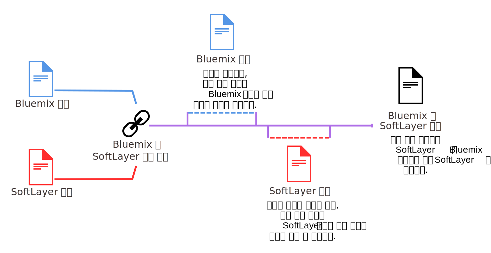

---

 

copyright:

  years: 2016

 

---

{:shortdesc: .shortdesc}
{:codeblock: .codeblock}
{:screen: .screen}
{:new_window: target="_blank"}

<!-- draft - staging only -->

#SoftLayer 및 {{site.data.keyword.Bluemix_notm}} 청구 계정 링크
{: #softlayerlink}
*마지막 업데이트 날짜: 2016년 6월 10일*
{: .last-updated}

이제 SoftLayer 및 {{site.data.keyword.Bluemix_notm}} 청구 계정을 링크할 수 있습니다. 계정을 링크하면, SoftLayer 및 {{site.data.keyword.Bluemix_notm}} 자원 모두가 SoftLayer를 통해 청구됩니다. 기존 계정을 보유하는 경우, {{site.data.keyword.Bluemix_notm}}의 SoftLayer를 통한 청구는 계정이 링크된 이후 시작되는 새 청구 주기에 적용됩니다.
{:shortdesc}

**중요사항:** {{site.data.keyword.Bluemix_notm}}의 모든 링크된 계정은 종량과금제 계정이어야 합니다. 종량과금제 계정을 새로 작성하거나 기존 종량과금제 계정을 링크할 수 있습니다. 또는 기존 시험판 계정을 링크할 수 있지만, 이는 종량과금제 계정으로 업그레이드됩니다.   

계정이 링크된 후에는 {{site.data.keyword.Bluemix_notm}} 사용자 인터페이스에서 {{site.data.keyword.Bluemix_notm}} 자원의 사용량을 계속해서 모니터할 수 있습니다. 그러나 이러한 자원에 대한 청구는 이제 SoftLayer 송장에 나타납니다. 

계정 청구가 링크되며 계정 간에 손쉽게 전환이 가능하지만, 그래도 {{site.data.keyword.Bluemix_notm}} 및 SoftLayer에는 별도의 ID가 있어야 합니다. 계속해서 SoftLayer 제품 및 서비스에는 SoftLayer ID를 사용하고 {{site.data.keyword.Bluemix_notm}} 제품 및 서비스에는 IBM id를 사용하십시오.  

**주의:** 일단 계정이 링크되면 이를 링크 해제할 수 없습니다.   

SoftLayer 계정을 보유 중이며 {{site.data.keyword.Bluemix_notm}} 계정을 링크하려면 다음 단계를 완료하십시오. 
 1. {{site.data.keyword.slportal}}에서 **{{site.data.keyword.Bluemix_notm}} 계정 링크**를 클릭하십시오.  
 2. SoftLayer 및 {{site.data.keyword.Bluemix_notm}} 계정의 링크와 관련된 이용 약관을 읽고 이에 동의하십시오. 
 3. 요청이 있으면 {{site.data.keyword.Bluemix_notm}} 계정과 연관된 이메일 주소를 입력하십시오. {{site.data.keyword.Bluemix_notm}} 계정이 없으면, 사용하고자 하는 이메일 주소를 입력한 후에 지시사항에 따라 {{site.data.keyword.Bluemix_notm}}에 방문하여 계정을 작성하십시오. 

계정을 링크하려면 SoftLayer 계정의 마스터 사용자이어야 합니다. 

계정이 링크되면, SoftLayer 글로벌 헤더에서 **{{site.data.keyword.Bluemix_notm}}로 이동**을 사용할 수 있습니다. 이 링크를 클릭하면 {{site.data.keyword.Bluemix_notm}} 로그인 페이지로 이동됩니다. 또한 {{site.data.keyword.Bluemix_notm}} 헤더에서 이제 **SoftLayer**를 사용할 수 있습니다. 링크를 클릭하면 새 창에서 {{site.data.keyword.slportal}}의 홈 페이지로 이동됩니다. 

## 계정 링크 시의 {{site.data.keyword.Bluemix_notm}} 사용에 대한 크레딧
{: #slcredit}

{{site.data.keyword.Bluemix_notm}} 및 SoftLayer 청구 계정을 링크하면 {{site.data.keyword.Bluemix_notm}} 사용에 대해 $200.00 크레딧을 받습니다. 크레딧은 계정 링크 이후 30일 내에 사용해야 합니다. 

크레딧 및 만기 날짜를 보는 방법에 대한 정보는 [크레딧 보기](https://console.ng.bluemix.net/docs/pricing/index.html#credits)를 참조하십시오.

## {{site.data.keyword.Bluemix_notm}}에 SoftLayer 팀 구성원 초대
{: #invite_users}

{{site.data.keyword.Bluemix_notm}} 및 SoftLayer 계정을 링크할 때 {{site.data.keyword.Bluemix_notm}}에 가입하도록 SoftLayer SoftLayer 팀 구성원을 초대할 수 있습니다. 또는 {{site.data.keyword.Bluemix_notm}} 사용자 인터페이스에서 나중에  SoftLayer SoftLayer 팀 구성원을 초대할 수 있습니다.
{:shortdesc}

{{site.data.keyword.Bluemix_notm}} 사용자 인터페이스에서, SoftLayer 계정의 모든 구성원을 초대하도록 선택하거나 개별 구성원을 선택할 수 있습니다. 팀 구성원을 초대할 때는 초대되는 사용자의 {{site.data.keyword.Bluemix_notm}} 계정 역할을 설정해야 합니다. {{site.data.keyword.Bluemix_notm}}의 다양한 역할에 대한 자세한 정보는 [사용자 역할](https://console.ng.bluemix.net/docs/admin/users_roles.html#userrolesinfo)을 참조하십시오. 

{{site.data.keyword.Bluemix_notm}} 계정에 팀 구성원을 초대하려면 SoftLayer 계정의 마스터 사용자이어야 합니다. 

{{site.data.keyword.Bluemix_notm}}를 통해 팀 구성원을 초대하려면 다음을 수행하십시오. 
 1. **계정 및 지원** 아이콘  > **계정** > **팀 구성원 초대**로 이동하십시오.
 2. **추가**를 클릭하여 SoftLayer 계정으로 인증하고 SoftLayer 계정에서 팀 구성원의 목록을 보십시오. 
 3. 초대할 팀 구성원을 선택하고 **전송**을 클릭하십시오. 

추가적인 팀 구성원이 Softlayer 계정에 추가될 수 있도록 이 조작을 반복해서 수행할 수 있습니다. 
 
팀 구성원은 **조직 가입** 링크가 포함된 이메일을 받습니다. 구성원에게 IBM id가 없으면 구성원이 등록 페이지로 경로 재지정됩니다. 그리고 구성원은 일부 기본 정보를 입력하고 {{site.data.keyword.Bluemix_notm}} 계정을 작성할 수 있습니다. 

{{site.data.keyword.Bluemix_notm}} 사용자 인터페이스를 통한 팀 구성원 초대에 대한 자세한 정보는 [팀 구성원 초대](https://console.ng.bluemix.net/docs/admin/users_roles.html#inviteteammembers)를 참조하십시오. 

## SoftLayer 자산으로 {{site.data.keyword.Bluemix_notm}} 서비스 사용
{: #bluemix_services}

SoftLayer 자산으로 API 기반 공용 {{site.data.keyword.Bluemix_notm}} 서비스를 손쉽게 사용할 수 있습니다. 모든 API는 사용자 데이터의 보호를 위해 보안이 유지되고 암호화됩니다.
{:shortdesc}

예를 들어, Watson의 코그너티브 기능을 SoftLayer의 베어메탈 서버에서 실행 중인 앱에 추가하고자 한 적이 있습니까? {{site.data.keyword.personalityinsightsshort}} 등의 서비스를 추가하면 4개의 간편한 단계로 앱 사용자를 파악하는 데 도움이 될 수 있습니다. 

1. {{site.data.keyword.Bluemix_notm}} 카탈로그에서 서비스를 찾으십시오. 
2. 수 차례의 클릭만으로 서비스의 인스턴스를 제공하십시오. 
3. 서비스 신임 정보를 복사하고 이를 사용자 애플리케이션에 추가하여 기존 코드로 실행할 서비스를 설정하십시오. 
4. 앱을 업데이트한 후에 SoftLayer 인프라에 새 버전을 배치하십시오. 

SoftLayer에서 사용자 앱의 Watson API를 호출하여 이를 보다 개인화함으로써 *Insights 및 Cognitive* 지식을 얻을 수 있습니다. 또는 *데이터 및 분석* 서비스를 사용하여 앱에 대한 고성능 분석을 활용할 수 있습니다. 또는 {{site.data.keyword.Bluemix_notm}}에 관리를 맡길 수 있는 DaaS(database-as-a-service)를 선택하십시오. 

{{site.data.keyword.activedeployshort}} 및 {{site.data.keyword.deliverypipeline}} 등의 서비스와 함께 컨테이너를 사용하여 애플리케이션 개발을 현대화하십시오. 그리고 {{site.data.keyword.vpn_short}} 서비스를 사용하여 SoftLayer로 다시 터널링함으로써 사설 네트워크의 컨테이너를 SoftLayer 사설 네트워크에 연결할 수 있습니다. 계산 자원 및 서비스에 대한 모든 사용 비용은 SoftLayer 청구에 반영됩니다.  

### API 기반 {{site.data.keyword.Bluemix_notm}} 서비스
일부 {{site.data.keyword.Bluemix_notm}} 서비스는 SoftLayer에서 사용될 수 없습니다. 
다음 서비스를 사용자의 애플리케이션 코드에서 실행되도록 설정할 수 있습니다. 
* {{site.data.keyword.alchemyapishort}}
* {{site.data.keyword.alertnotificationshort}}
* {{site.data.keyword.sparks}}
* {{site.data.keyword.appseccloudshort}}
* {{site.data.keyword.blockchain}}
* {{site.data.keyword.cloudant}}
* {{site.data.keyword.conceptinsightsshort}}
* {{site.data.keyword.iotmapinsights_short}}
* {{site.data.keyword.dashdbshort}}
* {{site.data.keyword.dialogshort}}
* {{site.data.keyword.documentconversionshort}}
* {{site.data.keyword.twittershort}}
* {{site.data.keyword.weather_short}}
* {{site.data.keyword.iotdriverinsights_short}}
* {{site.data.keyword.geospatialshort_Geospatial}}
* {{site.data.keyword.graphshort}}
* {{site.data.keyword.iotelectronics}}
* {{site.data.keyword.languagetranslationshort}}
* {{site.data.keyword.messagehub}}
* {{site.data.keyword.mqa}}
* {{site.data.keyword.mobileappbuilder_short}}
* {{site.data.keyword.mql}}
* {{site.data.keyword.nlclassifierlshort}}
* {{site.data.keyword.objectstorageshort}}
* {{site.data.keyword.personalityinsightsshort}}
* {{site.data.keyword.presenceinsightsshort}}
* {{site.data.keyword.relationshipextractionshort}}
* {{site.data.keyword.retrieveandrankshort}}
* {{site.data.keyword.servicediscoveryshort}}
* {{site.data.keyword.speechtotextshort}}
* {{site.data.keyword.sqldb}}
* {{site.data.keyword.streaminganalyticsshort}}
* {{site.data.keyword.texttospeechshort}}
* {{site.data.keyword.toneanalyzershort}}
* {{site.data.keyword.tradeoffanalyticsshort}}
* {{site.data.keyword.visualinsightsshort}}
* {{site.data.keyword.visualrecognitionshort}}
* {{site.data.keyword.workflow}}
* {{site.data.keyword.workloadscheduler}}

**참고:** 이 서비스의 일부 플랜은 사용 가능하지 않습니다. 종량과금제 계정에 사용되는 플랜만 링크된 계정에서 사용될 수 있습니다. 그러나 별도로 청구되는 별도의 {{site.data.keyword.Bluemix_notm}} 계정이 있으면 이러한 서비스에 대해 임의의 플랜을 사용할 수 있습니다. 

## 계정 링크 시의 {{site.data.keyword.Bluemix_notm}} 사용에 대한 청구
{: #bill_usage}

{{site.data.keyword.Bluemix_notm}} 및 SoftLayer 청구 계정을 링크한 이후, 다음 청구 주기는 단일 SoftLayer 청구로 부과됩니다.
{:shortdesc}

{{site.data.keyword.Bluemix_notm}} 사용 주기가 달력 월 기반이므로, 사용자 계정은 매월마다 월초에 청구됩니다. SoftLayer에서 사용 주기는 SoftLayer가 시작된 시점에서 시작됩니다. 따라서 사용자에게는 매월 SoftLayer 계정에 서명한 날과 동일한 날에 청구됩니다.  

계정이 링크되면, {{site.data.keyword.Bluemix_notm}} 사용량이 계속해서 당월 주기에 대해 측정되며 사용자는 {{site.data.keyword.Bluemix_notm}} 송장에서 해당 사용량에 대해 청구됩니다. 차월 초에서 시작하여, {{site.data.keyword.Bluemix_notm}} 비용은 SoftLayer 송장에서 부과됩니다. 

예를 들어, 4월 16일에 계정을 링크한 경우에는 4월 사용량에 대해 Bluemix 송장을 받습니다. 5월 사용량은 SoftLayer 계정을 통해 청구됩니다. 

청구가 결합되면, SoftLayer 송장의 요약 송장에는 **{{site.data.keyword.Bluemix_notm}}** 섹션이 있습니다. 상세 청구 보기에서 {{site.data.keyword.Bluemix_notm}} 비용은 다른 서비스로서 나타나며 *"{{site.data.keyword.Bluemix_notm}} 플랜..."으로 시작됩니다. *.

{{site.data.keyword.Bluemix_notm}} 사용량을 보는 방법에 대한 정보는 [사용량 세부사항 보기](https://console.ng.bluemix.net/docs/pricing/index.html#usage)를 참조하십시오. 

# 관련 링크
## 일반
* [비디오: 단일 송장에 대한 SoftLayer 및 Bluemix 계정 링크](https://www.youtube.com/watch?v=Xb01idt2NiU&index=1&list=PLzpeuWUENMK2d3L5qCITo2GQEt-7r0oqm)
