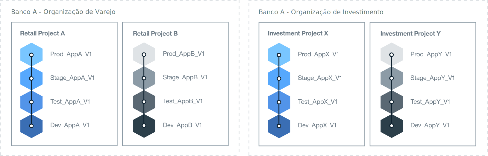

---

copyright:

  years: 2015, 2017
lastupdated: "2017-02-22"

---

{:new_window: target="_blank"}
{:shortdesc: .shortdesc}
{:screen:.screen}
{:codeblock:.codeblock}

# Melhores práticas para configurar seu ambiente {{site.data.keyword.Bluemix_notm}}
{: #patterns}

Para um projeto bem-sucedido, reserve um tempo para planejar e projetar quais recursos você precisa e quais são seus requisitos corporativos. Para ajudá-lo a começar com o seu projeto em nuvem, considere as perguntas a seguir:

* Quantos e quais tipos de aplicativos serão desenvolvidos?
* Quais serviços os aplicativos precisarão acessar?
* Quem colaborará no processo de desenvolvimento e qual função eles desempenharão?
* Qual grau de isolamento é necessário para cada fase do projeto?
* A sua empresa fornecerá os recursos de infraestrutura? 
* Como sua empresa se comunica?
* Existe um padrão de nomenclatura que é possível implementar para identificar claramente a organização e o uso de espaço?   

{:shortdesc}

Ao projetar uma solução em nuvem, pense também sobre a segurança da conta e os requisitos operacionais, regulamentações do país, diretivas de mercado e políticas corporativas. 
Para atender às suas necessidades do projeto, o {{site.data.keyword.Bluemix}} oferece três tipos de ambientes de nuvem. 

* [{{site.data.keyword.Bluemix_notm}} Public](/docs/overview/whatisbluemix.html "{{site.data.keyword.Bluemix_notm}} Public"): os recursos de infraestrutura são compartilhados por diferentes empresas e usuários.
* [{{site.data.keyword.Bluemix_notm}} Dedicated](/docs/dedicated/index.html#dedicated "{{site.data.keyword.Bluemix_notm}} Dedicated"): você usa a sua própria infraestrutura SoftLayer dedicada, que é possível conectar com segurança à nuvem do {{site.data.keyword.Bluemix_notm}} Public e sua própria rede.
* [{{site.data.keyword.Bluemix_notm}} Local](/docs/local/index.html#local "{{site.data.keyword.Bluemix_notm}} Local"): fica sob o firewall da empresa, que pode proteger as cargas de trabalho mais sensíveis e pode conectar-se com segurança às nuvens do {{site.data.keyword.Bluemix_notm}} Public e do {{site.data.keyword.Bluemix_notm}} Dedicated.

Como parte da decisão de qual tipo de ambiente de nuvem você precisa, planeje a estrutura de sua conta, organizações, espaços, recursos e membros da equipe. 

Para a maioria das empresas, uma única conta do {{site.data.keyword.Bluemix_notm}} é suficiente. Para empresas maiores, em que há mais de uma área de negócios, você talvez
deseje uma conta do {{site.data.keyword.Bluemix_notm}} separada para cada domínio de negócios. Por exemplo, em uma grande corporação bancária, pode haver contas separadas para os setores de varejo e comerciais.

A tabela a seguir fornece um resumo de alguns dos elementos chave. 

| Element   | Descrição |
|---------------------------------------|--------------------------------------------------------------------------------------|
| Conta   | Cada conta possui um proprietário da conta. |
|| Contém uma ou mais organizações. Deve-se ter uma conta Pay-As-You-Go para criar mais de uma organização. |
| Proprietário da conta   | Responsável por todos os encargos de uso que são acumulados na conta. |
|| Pode possuir somente uma conta. |
|| Pode incluir um ou mais gerenciadores de organização para delegar o gerenciamento da organização, que inclui as permissões de leitura e gravação para as organizações. |
|| Pode ser um membro da equipe em organizações e espaços em outras contas do {{site.data.keyword.Bluemix_notm}}. |
| Organização   | Contém um ou mais espaços. | 
|| Contém um ou mais gerenciadores de organização. |
|| Contém um ou mais membros da equipe. Uma ou mais funções podem ser concedidas a cada membro da equipe. |
|| Os encargos de uso, que são gerados por um aplicativo implementado em um espaço, são relatados no nível de organização. |
| Espaço   | Contém um ou mais recursos. |
|| Contém um ou mais aplicativos. |
|| Contém um ou mais gerenciadores de espaço. |
|| Contém um ou mais membros da equipe. Cada usuário já deve ser um membro da equipe na organização proprietária. Uma ou mais funções podem ser concedidas a cada membro da equipe. |
| Membro da Equipe   | Pode ser incluído em uma ou mais organizações e espaços entre contas diferentes. |
|| Pode ter mais de uma função dentro da mesma organização, espaço ou ambos. | 
{:caption="Table 1. Description of key elements" caption-side="top"}

## Determinando seu ambiente {{site.data.keyword.Bluemix_notm}}
{: #bpimplementation}

Em vez da metodologia tradicional estritamente definida de desenvolvimento, teste e produção, é possível implementar um ambiente no qual os desenvolvedores e os testadores podem colaborar com outros membros da equipe. Se você projetar como deseja desenvolver e entregar seus aplicativos, será possível criar espaços do {{site.data.keyword.Bluemix_notm}} para cumprir essa metodologia. Em vez de projetar seu ambiente do nível de organização para baixo, considere projetar seu ambiente {{site.data.keyword.Bluemix_notm}} do nível de espaço para cima.

Considere a escala e o escopo dos aplicativos que você planeja desenvolver e implementar. Um espaço do {{site.data.keyword.Bluemix_notm}} pode ser usado como um ambiente de desenvolvimento para um ou mais aplicativos que são fortemente conectados ou definidos. Além de um espaço de desenvolvimento, por exemplo, você talvez deseje criar espaços para teste de unidade, teste de desempenho e teste de integração. Espaços também podem ser definidos para construção, preparação e produção. Cada um dos espaços criados pode ser compartilhado com diferentes membros da equipe dentro da mesma organização. 

Crie organizações do {{site.data.keyword.Bluemix_notm}} separadas quando você tiver pessoas trabalhando em diferentes áreas de negócios e nas quais as suas atividades não se sobreponham. Se houver dois grupos completamente independentes, a criação de uma organização para cada um definirá limites claros para a entrega e o gerenciamento de reprodutores e recursos da equipe. É possível definir uma API para se comunicar entre as organizações.  

As organizações do {{site.data.keyword.Bluemix_notm}} podem ser criadas para corresponder como você deseja trabalhar em vez da estrutura dentro de uma empresa. Geralmente, as organizações da empresa podem mudar, mas o desenvolvimento e a manutenção de um aplicativo continuarão independentemente. 
Projete seu ambiente {{site.data.keyword.Bluemix_notm}} para o tempo de vida dos aplicativos e não em sua estrutura da organização da empresa. 

O desenvolvimento e a implementação interativos podem resultar em aplicativos se expandindo rapidamente. Seu design do processo de entrega deve ser capaz de aumentar a capacidade de modo rápido e fácil. Você desejará desenvolvimento contínuo com uma taxa de implementação rápida. Ter seus espaços de desenvolvimento e produção na mesma organização do {{site.data.keyword.Bluemix_notm}} fornecerá acesso aos mesmos recursos. O gerenciamento de diferentes espaços dentro de uma única organização reduz a sobrecarga de administração. A equipe de desenvolvimento, teste e operações poderá colaborar facilmente se eles estiverem trabalhando dentro da mesma organização do {{site.data.keyword.Bluemix_notm}}. 

Implemente um padrão de nomenclatura para identificar claramente a organização e o uso de espaço. Por exemplo, você pode incluir o tipo de nuvem, a região geográfica, o tipo de uso (como desenvolvimento, teste, produção), o nome do aplicativo e o número da versão ou revisão. As organizações e os espaços podem então ser facilmente identificados para propósitos de administração e acesso.  

O número de espaços pode se multiplicar rapidamente devido ao desenvolvimento iterativo. É possível definir quantos espaços forem necessários dentro de uma organização. Caso planeje definir um grande número de espaços, você talvez desejará criar um aplicativo para ajudar a gerenciar os espaços. Quando o número de espaços exceder sessenta, você talvez desejará considerar definir outra organização. 

Permita que uma pessoa crie e gerencie uma organização, defina os espaços e conceda acesso ao membro da equipe. O mesmo acesso pode ser concedido a uma segunda pessoa para manter o ambiente quando o gerenciador de organização estiver indisponível.  

Identifique todas as pessoas que precisarão de acesso a cada espaço e organização. Determine suas funções. O cargo de um membro da equipe determinará sua autoridade. Por exemplo, um desenvolvedor sênior precisará da autoridade para visualizar e atualizar todo o ambiente de desenvolvimento do {{site.data.keyword.Bluemix_notm}}. No entanto, um desenvolvedor júnior será limitado quanto ao que ele pode visualizar e atualizar.

## Determinando sua arquitetura da organização
{: #orgstructure}

Para projetar um ambiente de nuvem que use o {{site.data.keyword.Bluemix_notm}} Public, {{site.data.keyword.Bluemix_notm}} Dedicated, {{site.data.keyword.Bluemix_notm}} Local ou qualquer combinação, é possível usar as arquiteturas de organização a seguir:

* Organização única: considere usar esta arquitetura se for requerido o mesmo conjunto de usuários para acessar recursos que estão disponíveis em qualquer lugar na organização no {{site.data.keyword.Bluemix_notm}} Public, {{site.data.keyword.Bluemix_notm}} Dedicated ou {{site.data.keyword.Bluemix_notm}} Local.
* Organização múltipla: considere usar esta arquitetura se for requerido o isolamento entre os diferentes ambientes dentro do {{site.data.keyword.Bluemix_notm}} Public, {{site.data.keyword.Bluemix_notm}} Dedicated ou {{site.data.keyword.Bluemix_notm}} Local. 

### Organização única versus organização múltipla
{: #singleormulti}

Em um ambiente de organização única, os recursos de infraestrutura são compartilhados por diferentes áreas da
empresa. Por outro lado, em um ambiente de organização múltipla, os recursos de infraestrutura não são compartilhados. 

Ambas as arquiteturas de organização suportam os princípios a seguir:

* Cumprimento de limite para aplicativos, projetos ou ambos.
* Autorização para gerenciar recursos concedidos por função de usuário.

Para implementar uma arquitetura de organização única, crie uma conta no {{site.data.keyword.Bluemix_notm}} Public, {{site.data.keyword.Bluemix_notm}} Dedicated ou
{{site.data.keyword.Bluemix_notm}} Local e defina uma organização. É possível, então, definir múltiplos espaços que são baseados em diferentes linhas de negócios (LOB),
as fases de entrega, projetos específicos, aplicativos, permissões de usuário ou uma combinação desses componentes.

Para implementar uma arquitetura de organização múltipla, crie uma conta no {{site.data.keyword.Bluemix_notm}} Public, {{site.data.keyword.Bluemix_notm}} Dedicated
ou {{site.data.keyword.Bluemix_notm}} Local. Em seguida, é possível definir as organizações que correspondem a diferentes LOBs, fases de entrega,
projetos específicos, permissões de usuário ou uma combinação desses componentes. É possível, então, definir múltiplos espaços com base em aplicativos ou projetos que são entregues pelo mesmo departamento na empresa. 

**Nota:** deve-se ter uma conta faturável, como Pay-As-You-Go ou Assinatura, para definir múltiplas organizações. 

### Considerações sobre organização
{: #orgconsiderations}

Ao implementar uma arquitetura de organização única, a organização inclui todos os recursos, serviços e aplicativos em nuvem que são usados para desenvolver, gerenciar e
implementar aplicativos em nuvem. No {{site.data.keyword.Bluemix_notm}} Public, a organização fornece segregação entre contas e está disponível em todas as regiões.

 

 Figura 1. Exemplo de uma arquitetura de organização única para o {{site.data.keyword.Bluemix_notm}} Public, {{site.data.keyword.Bluemix_notm}} Dedicated e
 {{site.data.keyword.Bluemix_notm}} Local 
{: #bpfigure1}

Ao implementar uma arquitetura de organização múltipla, as organizações fornecem o primeiro nível de cumprimento de limite e abstração que é possível usar para controlar e definir o que pode ser
feito e por quem. Projete cada organização em torno dos diferentes LOBs, as fases de entrega, as funções dos usuários, projetos específicos ou uma combinação desses componentes.  

O número de organizações requeridas depende de múltiplos fatores:

* O nível de granularidade requerido dentro da organização para gerenciar cotas e custos de controle.
* O nível de segurança que deve-se impingir nos diferentes ambientes. Por exemplo, se você estiver usando contêineres, talvez deseje segregar as imagens de contêineres que são usadas para desenvolvimento das imagens de contêineres que são usadas para produção.
* O local das organizações devido aos requisitos do país, da indústria e corporativos. Por exemplo, você talvez deseje executar todos os apps em uma nuvem dedicada que esteja localizada em uma região específica em sua geografia (geo).

Quando você estiver definindo as diferentes organizações para sua estrutura em nuvem, considere a orientação a seguir:

* Defina e, em seguida, impinja uma convenção de nomenclatura. Por exemplo, defina uma convenção de nomenclatura na qual o nome da organização inclua informações sobre a área de negócios, o tipo de nuvem ({{site.data.keyword.Bluemix_notm}} Public, {{site.data.keyword.Bluemix_notm}} Local ou {{site.data.keyword.Bluemix_notm}} Dedicated) e a fase do processo (desenvolvimento, teste ou produção). Para organizações que estão localizadas no {{site.data.keyword.Bluemix_notm}} Public, você talvez deseje incluir informações sobre a região também.
* Defina as restrições que se aplicam à organização. Por exemplo, defina a função dos membros da equipe que vão trabalhar nessa organização.
* Identifique o gerenciador da organização.
* Identifique a área do negócio que está alocada para essa organização.

Os cenários a seguir mostram as diferentes abordagens que podem ser adotadas ao definir o número de organizações do {{site.data.keyword.Bluemix_notm}} em um ambiente de nuvem:
* **Cenário 1: segregação de grupos de usuários por entrega de aplicativo de negócios**

 Descrição: as regras corporativas requerem que os apps de cada LOB sejam desenvolvidos, gerenciados e implementados por usuários de cada LOB. A segurança deve ser impingida para que os usuários possam acessar somente os apps que são relevantes para sua parte do negócio. Por conseguinte, os usuários trabalham em áreas de negócios diferentes, os aplicativos no qual eles estão trabalhando requerem acesso a diferentes recursos do {{site.data.keyword.Bluemix_notm}} e não há sobreposição de atividade. 

  Solução: é possível criar uma organização para cada processo de entrega de aplicativo de negócios. Por exemplo, uma organização para financeiro de varejo e uma para financeiro de investimento.

  

  Figura 2. Exemplo de uma arquitetura de organização múltipla alinhada com a entrega de LOB
{: #bpfigure2}

* **Cenário 2: segregação com base nos tipos de usuários (usuários internos e usuários externos)**

  Descrição: sua empresa trabalha com diferentes parceiros e você requer limites claros entre usuários internos e externos.

  Solução: é possível criar uma organização para entregar aplicativos que são usados internamente. Além disso, é possível criar uma organização para cada parceiro externo.

* **Cenário 3: isolamento por projeto**

  Descrição: sua empresa executa hackathons para identificar novos serviços.  

  Solução: é possível definir uma organização por hackathon e usar a organização como um ambiente de simulação. Após o hackathon, é possível promover a organização de ambiente de simulação em uma organização adicional em sua conta.

* **Cenário 4: isolamento de usuários por fase de entrega**

  Descrição: uma empresa deseja que os usuários de desenvolvimento, teste e produção colaborem em uma entrega, mas seus acessos são controlados por função de usuário e experiência de cargo.

  Solução: é possível criar uma organização única e definir um espaço para cada fase de entrega. Em seguida, dependendo da função de usuário e experiência de cargo, conceda o acesso de leitura e gravação requerido para concluir o trabalho e também colaborar dentro da organização. 

  

   Figura 3. Exemplo de uma arquitetura de organização única alinhada por fase de entrega 
{: #bpfigure3}

### Nomenclatura, restrições e gerenciamento de organização
{: #orgadmin}   
   
Considere a orientação de organização a seguir:

* Defina e impinja uma convenção de nomenclatura. Por exemplo, defina uma convenção de nomenclatura na qual o nome da organização inclua informações sobre a área de negócios, o tipo de nuvem ({{site.data.keyword.Bluemix_notm}} Public, {{site.data.keyword.Bluemix_notm}} Local ou {{site.data.keyword.Bluemix_notm}} Dedicated) e a função de TI (desenvolvimento, teste ou produção). Para organizações que estão localizadas no {{site.data.keyword.Bluemix_notm}} Public, você talvez deseje incluir informações sobre a região também. É possível mudar o nome de uma organização após sua criação. Se um nome da organização for alterado, notifique todos os membros da equipe da organização sobre a mudança. 
* Defina as restrições que se aplicam à organização. Por exemplo, defina a função de cada um dos membros da equipe e as permissões que eles precisam para trabalhar nessa organização.
* Identifique o gerenciador da organização. Você talvez deseje delegar a administração da organização para mais que uma pessoa. 
* Identifique a área do negócio que está alocada para essa organização. O uso de aplicativo que é gerado em cada um dos espaços, dentro da organização, é acumulado e relatado no nível de organização. 

## Determinando seus espaços
{: #determinespaces}

Dentro de uma organização, os espaços fornecem um nível adicional de cumprimento de limite e abstração.

Um espaço é uma área reservada na organização na qual os usuários podem desenvolver e executar aplicativos e serviços. É possível criar qualquer número de espaços em uma organização. 
É possível controlar os usuários que têm acesso a um espaço. Para obter mais informações, veja [Espaços](/docs/admin/orgs_spaces.html#spaceinfo "Espaços").

Caso planeje definir um grande número de espaços, você talvez desejará criar um aplicativo para ajudar a gerenciar os espaços. Quando o número de
espaços exceder sessenta, você talvez desejará considerar definir outra organização. 

### Espaços para organização única versus organização múltipla
{: #spaceconsiderations}

Ao adotar uma arquitetura de organização única, o nível de segregação e abstração é fornecido pelos espaços definidos dentro da organização. Considere a orientação a seguir ao definir espaços:

* Defina um espaço para hospedar um serviço que requer fornecimento e configuração somente uma vez na organização.
* Defina os espaços com base no ciclo de vida de entrega.
  Por exemplo, é possível definir um ou mais espaços para aplicativos que estão sendo desenvolvidos, um ou mais espaços para aplicativos que estão na fase de teste e um ou mais
  espaços para aplicativos que estão em produção.
* Se o limite do ciclo de vida de entrega não for suficiente, será possível alcançar mais segregação definindo um ou mais espaços por LOB e fase de entrega.
* Identifique se será necessário aplicar limites para diferentes grupos de usuários.
Por exemplo, seus desenvolvedores não podem desenvolver o aplicativo e testá-lo. Você requer um conjunto diferente de usuários para testar o aplicativo. Neste cenário, você cria dois espaços, um para os
  desenvolvedores do aplicativo e um para os testadores do aplicativo. Em seguida, concede a cada conjunto de usuários o acesso ao espaço correto.

Ao implementar uma arquitetura de organização múltipla, é possível segregar cada organização pelo LOB, o ciclo de vida de entrega ou ambos. É possível, então, definir
múltiplos espaços com base no número de aplicativos ou projetos que são entregues pelo mesmo departamento na empresa. Considere a orientação a seguir ao planejar os espaços em uma organização:

* Defina um espaço para hospedar um serviço que requer fornecimento e configuração somente uma vez na organização.
* Defina um espaço por aplicativo, por grupo de aplicativos relacionados para um projeto específico.
* Se for necessário impingir limites para diferentes usuários, defina um espaço para cada conjunto de usuários. Quando uma função de desenvolvedor é concedida a um usuário em um espaço, esse usuário tem acesso total a quaisquer recursos (e serviços {{site.data.keyword.Bluemix_notm}}) que são provisionados e estão em execução nesse espaço. Quando você precisar impingir maior segurança para evitar que os usuários controlem todos os recursos, considere definir espaços diferentes. Em qualquer um desses espaços, é possível provisionar os serviços {{site.data.keyword.Bluemix_notm}} que são usados pelos apps em execução nesse espaço.

### Nomenclatura, restrições e gerenciamento de espaço  
{: #spaceadmin} 
 
Para definir os diferentes espaços para sua organização em nuvem, considere a orientação a seguir:

* Defina e impinja uma convenção de nomenclatura. Por exemplo, defina uma convenção de nomenclatura na qual o nome do espaço inclua informações sobre onde a organização está localizada e o tipo de nuvem ({{site.data.keyword.Bluemix_notm}} Public, {{site.data.keyword.Bluemix_notm}} Dedicated ou {{site.data.keyword.Bluemix_notm}} Local). É possível mudar o nome de um espaço após sua criação. Se um nome de espaço for alterado, notifique todos os membros da equipe do espaço sobre a mudança. 
* Defina as restrições que se aplicam ao espaço. Por exemplo, defina os tipos de aplicativos que podem ser desenvolvidos, gerenciados e implementados em cada espaço.
* Identifique o gerenciador do espaço. Você talvez deseje delegar a administração do espaço para mais de uma pessoa. 

## Determinando cota para uma organização
{: #determinequota}

Ao criar uma organização no {{site.data.keyword.Bluemix_notm}}, você provisiona os recursos de infraestrutura que incluem recursos como memória, Protocolo da Internet (IP), servidores e armazenamento:
*	Para o {{site.data.keyword.Bluemix_notm}} Public, um conjunto mínimo de recursos é alocado pela IBM para uma organização. Com base no tipo de conta, você tem alocações de recursos diferentes. Esses recursos definem a cota que é alocada pela IBM para uma organização.
*	Para o {{site.data.keyword.Bluemix_notm}} Dedicated, você solicita um conjunto de recursos da IBM e, em seguida, pode distribuí-los entre as diferentes organizações em seu ambiente de nuvem {{site.data.keyword.Bluemix_notm}} Dedicated.
*	Para o {{site.data.keyword.Bluemix_notm}} Local, você fornece os recursos e, em seguida, pode distribuí-los entre as organizações em seu ambiente de nuvem {{site.data.keyword.Bluemix_notm}} Local.

Para o {{site.data.keyword.Bluemix_notm}} Public e {{site.data.keyword.Bluemix_notm}} Dedicated, é possível solicitar recursos adicionais da IBM. Para o
{{site.data.keyword.Bluemix_notm}} Local, você é responsável por fornecer quaisquer recursos que possam ser necessários para executar seus negócios na nuvem local.

A cota que é alocada para uma organização representa os recursos que estão disponíveis dentro da organização. Você gerencia a cota e decide como os recursos são distribuídos na organização. 

### Gerenciando e monitorando a cota 
{: #managequota}

Você gerencia e monitora a cota de uma conta por espaço e por infraestrutura. Qualquer recurso que é fornecido em um espaço e, então, usado pelo aplicativo implementado consome uma parte da cota disponível para a organização.
* Para obter mais informações sobre como visualizar e gerenciar a cota de uma organização no {{site.data.keyword.Bluemix_notm}} Public, veja [Gerenciando a cota](/docs/admin/orgs_spaces.html#managequota "Gerenciando a cota").
* Para obter mais informações sobre como visualizar e gerenciar a cota de uma organização no {{site.data.keyword.Bluemix_notm}} Dedicated ou {{site.data.keyword.Bluemix_notm}} Local, veja [Visualizando o uso e relatórios](/docs/admin/index.html?pos=2#oc_resource "Visualizando o uso e relatórios").

## Designando funções
{: #roles}

É possível conceder múltiplas funções para membros da equipe em uma conta do {{site.data.keyword.Bluemix_notm}}. Essas funções definem as permissões do usuário para gerenciar recursos da conta e da organização:
* É possível conceder [funções de usuário](/docs/admin/users_roles.html#userrolesinfo "funções de usuário") para os membros de uma organização. Essas funções definem o nível de acesso dentro da organização e restringem quem pode acessar um espaço e seus recursos. Por exemplo, é possível conceder aos usuários permissões diferentes para espaços diferentes.
* Somente no {{site.data.keyword.Bluemix_notm}} Dedicated e {{site.data.keyword.Bluemix_notm}} Local, é possível conceder [funções administrativas](/docs/admin/index.html#oc_useradmin "funções administrativas") para os membros de uma conta para gerenciar informações do sistema, o uso de recursos da conta, relatórios e logs, serviços de catálogo, usuários e o uso de recursos por organização.

### Proprietário da conta
{: #accountowner}

Independentemente se você projetar uma arquitetura de organização múltipla ou uma arquitetura de organização única, o proprietário da conta é o superusuário do ambiente de nuvem.

As tarefas principais do proprietário da conta incluem:

* Gerenciar os recursos da conta global.
* Criar organizações.
* Incluir membros da equipe na conta.

Para incluir membros da equipe em uma conta, use o endereço de e-mail do usuário ou uma lista de endereços de e-mail. No {{site.data.keyword.Bluemix_notm}} Dedicated e {{site.data.keyword.Bluemix_notm}}
Local, também é possível usar o LDAP da empresa para incluir usuários, grupos de usuários ou ambos. Também é possível importar usuários de um arquivo. Para obter mais informações, veja [Gerenciando usuários e permissões](/docs/admin/index.html#oc_useradmin "Gerenciando usuários e permissões").

O proprietário da conta também pode executar as tarefas a seguir:

* Incluir um ou mais usuários como gerenciadores de uma organização, designando a função **Gerenciador** a esses usuários. Considere incluir dois usuários como gerenciadores de organização. O primeiro usuário age como o gerenciador principal da organização. O segundo usuário age como o gerenciador substituto, no caso, o gerenciador principal está indisponível.
* No {{site.data.keyword.Bluemix_notm}} Public e, dependendo do [tipo de conta](/docs/pricing/index.html#pay-accounts "tipo de conta"), configurar notificações de gastos. Primeiro, o proprietário da conta define os limites que são usados para alertá-lo quando os custos atingirem um certo limite. Em seguida, [configura as notificações por e-mail](/docs/admin/account.html#notifications "configura as notificações por e-mail"). O gerente de contas pode usar as informações nos e-mails como notificações de alertas e pode tomar uma ação com base nas informações fornecidas, por exemplo, fazer upgrade da conta. **Nota:** o proprietário da conta é a única pessoa que pode receber e-mails de notificação de gastos.
* Incluir um ou mais usuários como administradores da conta, designando a função **Administrador** a esses usuários. Considere incluir um mínimo de dois usuários. O primeiro usuário age como o administrador principal da conta. O segundo usuário age como o administrador substituto.
* Definir as notificações de conta para informar sobre atualizações de manutenção ou alertas de incidentes críticos. Essas notificações podem ser configuradas para enviar um e-mail ou um Serviço de Mensagens Curtas.

### Funções de usuário
{: #userroles}

As funções de usuário definem as permissões que é possível designar a um membro da equipe em uma organização e definem o nível de acesso que um membro da equipe tem dentro da organização e cada espaço.

Em uma arquitetura de organização múltipla ou em uma arquitetura de organização única, defina os membros da equipe e as permissões que cada usuário requer para concluir seu trabalho:

1. Identifique o conjunto de usuários que requerem acesso a uma organização.
2. Defina as permissões para cada membro da equipe na organização e em um espaço da organização.
3. Selecione a função que concede a um usuário as permissões que ele requer.

   * Gerente da organização
   * Auditor da organização
   * Gerente de faturamento da organização
   * Gerente de espaço
   * Desenvolvedor de espaço
   * Auditor de espaço

#### Gerente da organização
{: #bporgmgr}

As tarefas pelas quais um gerenciador de organização é responsável incluem criar espaços, distribuir a cota entre os espaços, convidar membros da equipe e, opcionalmente, conceder funções específicas a eles e definir domínios customizados.

#### Auditor da organização
{: #bporgauditor}

Os membros da equipe com a função de **Auditor** da organização podem monitorar a cota, o uso de recursos e os membros da equipe para todos os espaços em uma organização. 
Os auditores podem, então, relatar sobre a eficiência da organização e destacar quaisquer problemas potenciais.

* Ao adotar uma arquitetura de organização múltipla, você poderá desejar conceder a função de auditor para os mesmos membros da equipe para cada organização que faz parte da conta. 
Em seguida, esses membros da equipe podem monitorar a cota em todas as organizações em seu ambiente de nuvem e obter uma visualização global da conta.
* Ao adotar uma arquitetura de organização única, conceda a função de auditor para os membros da equipe com a responsabilidade de monitorar o uso de cota e a eficiência geral
da organização.

#### Gerente de faturamento da organização
{: #bporgbillingmgr}

Os membros da equipe com a função de **Gerenciador de faturamento** podem monitorar os custos de uma organização.

* Ao adotar uma arquitetura de organização múltipla, você pode desejar conceder a função de faturamento para o mesmo conjunto de membros da equipe para cada organização que faz parte da conta. Em seguida, esses membros da equipe podem monitorar o custo de cada organização e obter uma visualização global da conta.
* Em uma arquitetura de organização única, identifique os usuários que são responsáveis por monitorar o custo.

#### Gerente de espaço
{: #bpspacemgr}

O **Gerenciador** de espaço é responsável por qualquer trabalho feito dentro do espaço que ele gerencia e controla. O gerenciador de espaço pode executar as tarefas a seguir:

* Monitorar a cota que é permitida para o espaço.
* Solicitar recursos adicionais para o gerenciador de organização.
* Notificar o gerenciador de organização dos recursos que não são necessários.
* Incluir membros da equipe no espaço com a função de **Desenvolvedor**.
* Opcionalmente, designar a função de **Gerenciador** de espaço a um membro da equipe para agir como um gerenciador de espaço substituto na sua ausência.

#### Desenvolvedor de espaço
{: #bpspacedev}

Um desenvolvedor de espaço pode executar as tarefas a seguir:

* Gerenciar aplicativos do Cloud Foundry.
* Provisionionar e configurar serviços {{site.data.keyword.Bluemix_notm}}.
* Associar domínios a aplicativos.

#### Auditor de espaço
{: #bpspaceauditor}

Para cada espaço, você pode desejar conceder a função de **Auditor** de espaço para os mesmos membros da equipe com a função de **Auditor** da organização. Em sua empresa, essa função pode precisar ser concedida a um conjunto específico de usuários.

### Funções administrativas
{: #adminroles}

[Funções administrativas](/docs/admin/index.html#oc_useradmin "Funções administrativas") definem as permissões que é possível conceder aos usuários para gerenciar uma conta do {{site.data.keyword.Bluemix_notm}} Dedicated ou {{site.data.keyword.Bluemix_notm}} Local. 
É possível conceder permissões de leitura ou gravação para permitir que um usuário visualize informações do sistema, o uso dos recursos de conta, relatórios e logs, serviços de catálogo, usuários e o uso de recursos por organização.

Em uma arquitetura de organização múltipla ou em uma arquitetura de organização única, defina os usuários e as permissões que cada usuário requer para gerenciar a conta:

1. Identifique o conjunto de usuários da equipe de nuvem de administração e conceda a eles as permissões de administração relevantes. Inclua os gerenciadores de organização como membros dessa equipe.
2. Defina as permissões para esses usuários na conta. Divida as permissões para gerenciar o catálogo e os relatórios entre os usuários da equipe.
3. Selecione uma ou mais funções para cada usuário para corresponder às permissões necessárias para gerenciar a conta:

   * Função administrativa: conceda essa função para dois ou mais usuários na conta. Os usuários com essa função têm a autoridade para gerenciar a organização inteira.
   * Função de usuário: essa função pode ser configurada com permissões de leitura ou gravação. Conceda essa função com permissões de gravação para os gerenciadores de organizações para permitir que eles incluam usuários na conta e suas organizações. Conceda essa função com permissões de leitura para os gerenciadores de organizações que podem precisar de acesso para ver a lista de membros na conta.
   * Função de catálogo: essa função pode ser configurada com permissões de leitura ou gravação. Conceda essa função para um conjunto de usuários com permissões de gravação para permitir que eles definam e gerenciem quais serviços e iniciadores do Bluemix são visíveis aos usuários no catálogo do {{site.data.keyword.Bluemix_notm}}. Conceda essa função com permissões de leitura para gerenciadores de organizações.
   * Função de relatórios: essa função pode ser configurada com permissões de leitura ou gravação. Conceda essa função para um conjunto de usuários com permissões de gravação para permitir que eles visualizem e incluam relatórios dos quais outros usuários com permissões de leitura podem fazer download. Conceda permissões de leitura para todos os membros da equipe administrativa.
   * Função de login: conceda essa função para todos os membros da equipe administrativa. Também é possível conceder essa função para outros usuários na conta que requerem acesso para visualizar as notificações da conta e informações do sistema.
