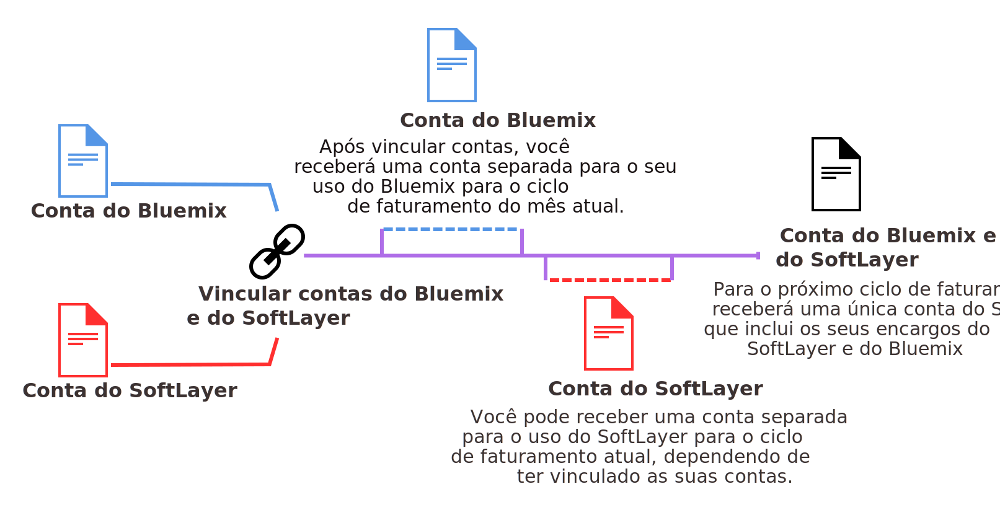

---

 

copyright:

  years: 2016, 2017
lastupdated: "2017-01-11"
 

---

{:shortdesc: .shortdesc}
{:codeblock: .codeblock}
{:screen: .screen}
{:new_window: target="_blank"}

# Fazendo upgrade e unificando as contas de cobrança do {{site.data.keyword.Bluemix_notm}} e do SoftLayer
{: #softlayerlink}

Se você tem uma conta para teste do {{site.data.keyword.Bluemix_notm}} e deseja acessar o painel Infraestrutura, deve-se fazer upgrade para uma conta pay-as-you-go do {{site.data.keyword.Bluemix_notm}}. Você também deverá fazer upgrade se usar outros recursos debitáveis que não estão disponíveis em uma conta para teste, ou sua conta para teste será concluída. 

É possível unificar suas contas de cobrança {{site.data.keyword.Bluemix_notm}} e SoftLayer existentes, vinculando as contas. Ao vincular as suas contas, você será faturado pelo {{site.data.keyword.Bluemix_notm}} pelos recursos do {{site.data.keyword.Bluemix_notm}} e do SoftLayer.

**Atenção:** as contas da assinatura do {{site.data.keyword.Bluemix_notm}}
e as contas Pay-As-You-Go do {{site.data.keyword.Bluemix_notm}} antigas que foram criadas antes de
vinculação da conta automática não podem ser vinculadas com uma conta do SoftLayer. Para
acessar o painel Infraestrutura deve-se criar uma conta Pay-As-You-Go, uma segunda conta, que é automaticamente vinculada com uma conta do SoftLayer. Você, então,
receberá duas faturas, uma para cada conta do {{site.data.keyword.Bluemix_notm}}. Embora os seus recursos de infraestrutura irão ser faturados em uma conta
Pay-As-You-Go separada, os recursos poderão ser usados com apps e serviços em sua conta da assinatura. Por exemplo, se você ativar um serviço do Watson em sua conta
da assinatura, poderá copiar as credenciais de serviço e, em seguida, incluir as credenciais em seu aplicativo bare metal que for originado de sua conta
Pay-As-You-Go. 
{:shortdesc}

## Fazendo upgrade para uma conta pay-as-you-go do {{site.data.keyword.Bluemix_notm}}
{: #upgradetopayg}

Ao efetuar login no {{site.data.keyword.Bluemix_notm}} usando uma conta para teste, não é possível acessar o painel Infraestrutura do {{site.data.keyword.Bluemix_notm}}. Se você deseja que seus apps usem os recursos de infraestrutura, deve-se fazer upgrade para uma conta pay-as-you-go.

Para fazer upgrade de sua conta para teste para uma conta pay-as-you-go do {{site.data.keyword.Bluemix_notm}}, conclua as etapas a seguir:

 1. Clique em **Conta** &gt; **Faturamento**.
 2. Em seguida, clique em **Incluir cartão de crédito**.
 3. Insira os detalhes de faturamento necessários. 
 4. Leia e aceite os termos e condições para a conta pay-as-you-go. 
 5. Ao concluir, clique em **Fazer upgrade**. 
 
Após fazer upgrade para uma conta pay-as-you-go, as opções de **Infraestrutura** são listadas no **Catálogo** {{site.data.keyword.Bluemix_notm}}. Se você usar mais do que o abono grátis, receberá uma fatura mensal do {{site.data.keyword.Bluemix_notm}}. A fatura será em dólares dos Estados Unidos (USD) e detalhará os encargos do recurso. 

## Unificando as contas do {{site.data.keyword.Bluemix_notm}} e do SoftLayer
{: #unifyingaccounts}

É possível unificar suas contas do {{site.data.keyword.Bluemix_notm}} e do SoftLayer para usar os recursos combinados. Ao vincular suas contas do {{site.data.keyword.Bluemix_notm}} e do Softlayer, você receberá uma única fatura do {{site.data.keyword.Bluemix_notm}}. Se você tiver uma conta existente do {{site.data.keyword.Bluemix_notm}}, o faturamento por meio do {{site.data.keyword.Bluemix_notm}} para recursos do SoftLayer
entrará em vigor para o novo ciclo de faturamento que se inicia após as contas serem vinculadas.

**Importante:** todas as contas vinculadas no {{site.data.keyword.Bluemix_notm}} devem ser contas de Pagamento por uso. É possível criar uma nova conta de Pagamento por uso ou
vincular uma conta de Pagamento por uso existente. Ou, é possível vincular uma conta para teste existente, mas ela terá upgrade feito para uma conta de Pagamento por uso. As contas de assinatura do {{site.data.keyword.Bluemix_notm}} não podem ser vinculadas.  

Após as suas contas serem vinculadas:

* Deve-se usar as credenciais IBMid para acessar as contas do SoftLayer e do {{site.data.keyword.Bluemix_notm}}.
* Quaisquer descontos existentes do SoftLayer são aplicados em encargos do {{site.data.keyword.Bluemix_notm}}. 
* Você receberá uma única fatura em dólares dos Estados Unidos (USD).
* É possível monitorar o uso de seus recursos do {{site.data.keyword.BluSoftlayer}} na interface com o usuário do {{site.data.keyword.Bluemix_notm}}. 

**Atenção:** Após as contas serem vinculadas, elas não poderão ser desvinculadas. 

Se você tiver uma conta do SoftLayer e desejar vincular contas do SoftLayer e do {{site.data.keyword.Bluemix_notm}}, conclua estas etapas:

 1. A partir do {{site.data.keyword.slportal}}, clique em **Vincular uma Conta do {{site.data.keyword.Bluemix_notm}}**.
 2. Leia e aceite os termos para vincular contas do SoftLayer e do {{site.data.keyword.Bluemix_notm}}.
 3. Quando solicitado, forneça o endereço de e-mail que está associado à sua conta do {{site.data.keyword.Bluemix_notm}}. Se você não tiver uma conta do
{{site.data.keyword.Bluemix_notm}}, forneça o endereço de e-mail que deseja usar e, em seguida, siga as instruções para ser convidado para o {{site.data.keyword.Bluemix_notm}} e criar uma
conta.

Deve-se ser um Usuário Principal na conta do SoftLayer para vincular contas.

Após ter vinculado as suas contas, o link **Acesse o {{site.data.keyword.Bluemix_notm}}** estará disponível no cabeçalho global do SoftLayer. Clicar nesse link conduz você para a
página de login do {{site.data.keyword.Bluemix_notm}}. Além disso, o link **SoftLayer** agora está disponível no cabeçalho do {{site.data.keyword.Bluemix_notm}}. Clicar no link
conduz você para a página inicial do {{site.data.keyword.slportal}} em uma nova janela.

As ofertas de infraestrutura do {{site.data.keyword.Bluemix_notm}} estão conectadas a uma rede de três camadas, segmentando o tráfego público, privado e de gerenciamento. As ofertas de infraestrutura em uma conta do {{site.data.keyword.Bluemix_notm}} do cliente podem transferir dados entre si através da rede privada, sem nenhum custo. As ofertas de infraestrutura, como servidores bare metal, servidores virtuais e armazenamento em nuvem, conectam-se a outros aplicativos e serviços no catálogo do {{site.data.keyword.Bluemix_notm}}, como serviços, contêineres ou tempos de execução do Watson, através
da rede pública. A transferência de dados entre esses dois tipos de ofertas é medida e cobrada em taxas padrão de largura da banda da rede pública.

## Convidando membros da equipe do SoftLayer para o {{site.data.keyword.Bluemix_notm}}
{: #invite_users}

É possível convidar membros da equipe do SoftLayer para se juntarem ao {{site.data.keyword.Bluemix_notm}} quando você vincula suas contas do {{site.data.keyword.Bluemix_notm}} e do SoftLayer. Ou, é possível convidar membros da equipe do SoftLayer posteriormente, a partir da interface com o usuário do {{site.data.keyword.Bluemix_notm}}.
{:shortdesc}

A partir da interface com o usuário do {{site.data.keyword.Bluemix_notm}}, é possível selecionar para convidar todos os membros de sua conta do SoftLayer ou é possível selecionar membros
individuais. Ao convidar membros da equipe, deve-se configurar a função de conta do {{site.data.keyword.Bluemix_notm}} para os convidados. Para obter mais informações sobre as diferentes funções no
{{site.data.keyword.Bluemix_notm}}, consulte [Funções de Usuário](https://console.ng.bluemix.net/docs/admin/users_roles.html#userrolesinfo).

Deve-se ser um Usuário Principal na conta do SoftLayer para convidar membros da equipe para a conta do {{site.data.keyword.Bluemix_notm}}.

Para convidar membros da equipe por meio do {{site.data.keyword.Bluemix_notm}}, conclua as etapas a seguir:

 1. Clique em **Conta** &gt; **Convidar membros da equipe**.
 2. Clique em **Incluir** para autenticar em sua conta do SoftLayer e visualizar uma lista de membros da equipe a partir de sua conta do {{site.data.keyword.BluSoftlayer}}
 3. Selecione os membros da equipe para convidar e clique em **Enviar**.
 
O membro da equipe recebe um e-mail que inclui um link **Associar-se à organização**. Se o membro da equipe não tiver um IBMid, ele será redirecionado para uma página de registro. Em seguida, ele poderá inserir algumas informações básicas e criar a sua conta do {{site.data.keyword.Bluemix_notm}}.

Para obter mais informações sobre convidar membros da equipe por meio da interface com o usuário do {{site.data.keyword.Bluemix_notm}}, consulte
[Convidando membros da equipe](https://console.ng.bluemix.net/docs/admin/users_roles.html#inviteteammembers).

## Alternando para o IBMid
{: #ibmid_switch}

A autenticação no SoftLayer agora usa o IBMid para fornecer um único login para todos os {{site.data.keyword.Bluemix_notm}}. As contas existentes do SoftLayer estão sendo ativadas para alternar para a autenticação do IBMid. Um assistente de migração fornece orientação durante essa alternância. 
{:shortdesc}

Se você for um usuário principal e um prompt para alternar para um IBMid não for exibido no {{site.data.keyword.slportal}}, [entre em contato com o suporte IBM](/docs/support/index.html#contacting-support) para obter ajuda com a ativação do recurso.

Quando você iniciar a alternância para um IBMid, sempre será possível cancelá-la antes de concluir o processo. No entanto, toda vez que você efetuar login, o prompt para alternar para um IBMid será exibido. Cada conta do SoftLayer que você planejar vincular a uma conta do {{site.data.keyword.Bluemix_notm}} deverá pertencer a um IBMid exclusivo com um endereço de e-mail exclusivo.

Para alternar de seu nome de usuário existente do SoftLayer para um IBMid, conclua as etapas a seguir:

 1. Efetue login em sua conta do SoftLayer. Quando o prompt para alternar para um IBMid for exibido, clique em **OK**. 
 
    Se você já estiver conectado (clicou em **Posteriormente** no prompt para alternar para um IBMid), mas deseja alternar para a autenticação do IBMid na sessão atual, acesse a página Editar perfil do usuário e clique em **Alternar para o IBMid**.
	
 2. Siga os prompts do assistente para criar seu IBMid. 
 
    Para criar um novo IBMid, insira um endereço de e-mail que não esteja atualmente em uso por nenhum IBMid. O novo IBMid usará esse endereço de e-mail como o nome do usuário e o endereço de e-mail. Após a criação do IBMid, será possível atualizar o endereço de e-mail que está associado ao IBMid, mas não será possível mudar o nome do usuário. O e-mail de convite vai para o endereço de e-mail fornecido.
    
    Depois de concluir o assistente, você receberá um e-mail com o código de registro.
 
 3. Ao receber o e-mail, siga o link ou copie a URL em um navegador e, em seguida, insira seu código de registro. O código é válido por 7 dias e só poderá ser usado uma vez.
 
    Depois que você alternar para a autenticação do IBMid, será possível efetuar login em sua conta somente com o seu IBMid. No prompt Login da conta, acesse a seção **Login da conta IBMid** e clique em **Efetuar login com o IBMid**. Não use os campos **Nome do usuário** e **Senha** que foram usados anteriormente com seu ID do SoftLayer.
 
Se for um novo cliente, ao efetuar check-out de sua ordem, você será solicitado a fornecer seu IBMid existente ou solicitado a criar um novo IBMid. 

 * Para usar um IBMid existente, insira o nome do usuário ou o endereço de e-mail do IBMid se for exclusivo (ou seja, ele não é compartilhado entre diversos IBMids).
 
 * Para criar um novo IBMid, insira um endereço de e-mail que não esteja atualmente em uso por nenhum IBMid.  O novo IBMid usará esse endereço de e-mail como o nome do usuário e o endereço de e-mail.  Após a criação do IBMid, será possível atualizar o endereço de e-mail que está associado ao IBMid, mas não será possível mudar o nome do usuário. O e-mail de convite vai para o endereço de e-mail fornecido.

Para resolver quaisquer problemas ao efetuar login com seu IBMid, veja [Resolução de problemas para acessar o Bluemix](/docs/troubleshoot/ts_accessing.html#accessing).

### Permitindo que os usuários alternem para o IBMid
{: #link_accounts_resellers}

Em alguns casos, antes que um usuário possa alternar para um IBMid, um revendedor ou distribuidor deve ativar a conta para usar a autenticação do IBMid. 

 * Para permitir que uma conta existente com credenciais anteriores do SoftLayer use a autenticação do IBMid, [Entre em contato com o suporte IBM](https://console.ng.bluemix.net/docs/support/index.html#contacting-support) para ativar a migração do IBMid. Isso deverá ser ativado para cada conta de usuário final existente que você desejar vincular a uma conta do {{site.data.keyword.Bluemix_notm}}.
 
 * Para assegurar-se de que novas contas do usuário sejam criadas com um IBMid, o atributo `CREATE_NEW_ACCOUNT_WITH_IBMid_AUTHENTICATION` deve ser configurado na conta do usuário principal imediato. [Entre em contato com o suporte IBM](https://console.ng.bluemix.net/docs/support/index.html#contacting-support) ou com seu fornecedor para que isso seja configurado para suas contas.
 
### Vinculando suas contas do usuário
{: #link_user_accounts}
Depois que seus usuários alternarem para a autenticação do IBMid, os revendedores e distribuidores poderão vincular o SoftLayer e as contas do {{site.data.keyword.Bluemix_notm}}.

**Nota:** 
  * O usuário principal da conta que está sendo vinculada deve ser um IBMid.
  * Efetue login em cada conta do usuário final como o usuário principal. Acesse a página de perfil do usuário e clique em **Alternar para o IBMid**.
  * Cada conta que você vincular a uma conta do {{site.data.keyword.Bluemix_notm}} deverá pertencer a um IBMid exclusivo com um endereço de e-mail exclusivo. Embora um IBMid possa ter múltiplas contas do SoftLayer, não será possível vinculá-las às contas do {{site.data.keyword.Bluemix_notm}}. Se um IBMid for o usuário principal para múltiplas contas do SoftLayer e você desejar vincular essas contas às contas do {{site.data.keyword.Bluemix_notm}}, deverá mudar os usuários principais para que sejam um IBMid exclusivo para cada conta. Entre em contato com o [suporte do IBM SoftLayer ](https://knowledgelayer.softlayer.com/topic/support){: new_window} para mudar o usuário principal em uma conta do SoftLayer.
  
Conclua as etapas a seguir para vincular cada conta a uma conta do {{site.data.keyword.Bluemix_notm}}: 

 1. Para criar uma nova conta do {{site.data.keyword.Bluemix_notm}} ou para se vincular a uma conta existente do {{site.data.keyword.Bluemix_notm}}, efetue login em sua conta do SoftLayer como o usuário principal e clique no link do **{{site.data.keyword.Bluemix_notm}}**. Isso dará a oportunidade de criar uma nova conta do {{site.data.keyword.Bluemix_notm}} ou de vincular-se a uma conta existente do {{site.data.keyword.Bluemix_notm}}. O IBMid que for o usuário principal para a conta do SoftLayer deverá ser o proprietário da conta do Bluemix à qual você está se vinculando. Siga os prompts do assistente, incluindo a inclusão de usuários da conta do SoftLayer na conta do {{site.data.keyword.Bluemix_notm}}. 
 2. Depois de vincular a conta, informe aos usuários finais sobre a conta a ser migrada para o IBMid. Os usuários finais poderão então acessar os painéis Infraestrutura, Aplicativos e Serviços no console do {{site.data.keyword.Bluemix_notm}}.
 3. Quando novos usuários forem incluídos na conta vinculada, será necessário incluí-los na conta do SoftLayer e na conta do {{site.data.keyword.Bluemix_notm}} para que eles tenham acesso a todos os recursos do console unificado.
 
**Recomendação:** migre somente as contas do usuário final para o IBMid. Não migre contas da marca, que são contas pai para contas do usuário final e não contêm recursos. Usuários de conta da marca que migram para o IBMid perdem a capacidade de efetuar login no portal Brand Agent Portal (BAP).

<!--
### Mapping multiple SoftLayer accounts to one IBMid
{: #map_multiple_accounts}

You can associate one IBMid with multiple SoftLayer accounts by using an existing IBMid email address when setting up the account. Only one SoftLayer user for each account can be mapped to the single IBMid. The IBMid must be unique within each SoftLayer account. However, one user with access to multiple SoftLayer accounts can use one IBMid to access multiple SoftLayer accounts.

For example, an IBMid can map to the master user in accounts A and B, and to an additional user in accounts C and D. One of the accounts mapped to that IBMid is the default account.  Usually, the default account is the account that was first mapped to the IBMid. However, you can switch which account is the default account  through an account switching feature in the Customer Portal.

For a user with IBMid access to multiple accounts with two-factor authentication enabled, an appropriate two-factored authentication verification code per account is required during account log in and account switching.
-->

## Usando os serviços do {{site.data.keyword.Bluemix_notm}} com ativos do SoftLayer
{: #bluemix_services}

É possível usar facilmente serviços públicos do {{site.data.keyword.Bluemix_notm}} baseados em API com os seus ativos do SoftLayer. Todas as APIs são seguras e criptografadas para que os seus
dados estejam protegidos.
{:shortdesc}

Por exemplo, você já quis incluir recursos cognitivos do Watson em seus aplicativos em execução em servidores bare metal a partir do SoftLayer? É possível incluir um serviço como o
{{site.data.keyword.personalityinsightsshort}} para ajudar a entender o usuário do seu aplicativo em quatro etapas fáceis:

1. Localize o serviço no catálogo do {{site.data.keyword.Bluemix_notm}}.
2. Provisione uma instância do serviço com apenas alguns cliques.
3. Configure o serviço para executar com o seu código existente, copiando as credenciais de serviço e incluindo-as em seu aplicativo.
4. Após a atualização para o aplicativo, implemente a nova versão em sua infraestrutura do SoftLayer.

É possível ganhar conhecimento de *Insights e Cognitivo* chamando APIs do Watson a partir de seus aplicativos no SoftLayer, para torná-los mais personalizados. Ou, use serviços de
*Dados e de Analítica* para explorar a análise de alto desempenho para os seus aplicativos. Ou,
escolha banco de dados como serviço no qual você pode deixar o
gerenciamento para o
{{site.data.keyword.Bluemix_notm}}.

Modernize o seu desenvolvimento de aplicativo usando contêineres com serviços como {{site.data.keyword.activedeployshort}} e
{{site.data.keyword.deliverypipeline}}. É possível, então, usar o serviço do {{site.data.keyword.vpn_short}} para se comunicar com o SoftLayer
para conectar o seu contêiner em uma rede privada com a rede privada do SoftLayer. Todos os encargos de uso dos recursos de cálculo e serviços são refletidos em sua conta do {{site.data.keyword.Bluemix_notm}}. 

### Serviços do {{site.data.keyword.Bluemix_notm}} baseados em API
Nem todos os serviços do {{site.data.keyword.Bluemix_notm}} podem ser usados com o SoftLayer. Os serviços a seguir podem ser configurados para execução com o seu código do aplicativo:
* {{site.data.keyword.alchemyapishort}}
* {{site.data.keyword.alertnotificationshort}}
* {{site.data.keyword.sparks}}
* {{site.data.keyword.appseccloudshort}}
* {{site.data.keyword.blockchain}}
* {{site.data.keyword.cloudant}}
* {{site.data.keyword.conceptinsightsshort}}
* {{site.data.keyword.iotmapinsights_short}}
* {{site.data.keyword.dashdbshort}}
* {{site.data.keyword.dialogshort}}
* {{site.data.keyword.documentconversionshort}}
* {{site.data.keyword.twittershort}}
* {{site.data.keyword.weather_short}}
* {{site.data.keyword.iotdriverinsights_short}}
* {{site.data.keyword.geospatialshort_Geospatial}}
* {{site.data.keyword.graphshort}}
* {{site.data.keyword.iotelectronics}}
* {{site.data.keyword.languagetranslationshort}}
* {{site.data.keyword.messagehub}}
* {{site.data.keyword.mqa}}
* {{site.data.keyword.mobileappbuilder_short}}
* {{site.data.keyword.mql}}
* {{site.data.keyword.nlclassifiershort}}
* {{site.data.keyword.objectstorageshort}}
* {{site.data.keyword.personalityinsightsshort}}
* {{site.data.keyword.presenceinsightsshort}}
* {{site.data.keyword.relationshipextractionshort}}
* {{site.data.keyword.retrieveandrankshort}}
* {{site.data.keyword.speechtotextshort}}
* {{site.data.keyword.sqldb}}
* {{site.data.keyword.streaminganalyticsshort}}
* {{site.data.keyword.texttospeechshort}}
* {{site.data.keyword.toneanalyzershort}}
* {{site.data.keyword.tradeoffanalyticsshort}}
* {{site.data.keyword.visualinsightsshort}}
* {{site.data.keyword.visualrecognitionshort}}
* {{site.data.keyword.workflow}}
* {{site.data.keyword.workloadscheduler}}

**Nota:** nem todos os planos para esses serviços estão disponíveis. Somente os planos ativados para contas de Pagamento por uso estão disponíveis para uso com contas vinculadas. No
entanto, será possível usar qualquer plano para qualquer um desses serviços se você tiver uma conta do {{site.data.keyword.Bluemix_notm}} separada que for cobrada separadamente.

## Faturamento para uso do {{site.data.keyword.Bluemix_notm}} quando as contas estão vinculadas
{: #bill_usage}

Após ter vinculado suas contas de cobrança do {{site.data.keyword.Bluemix_notm}} e do SoftLayer, o próximo ciclo de faturamento será cobrado em uma única fatura do {{site.data.keyword.Bluemix_notm}}.
{:shortdesc}

O seu ciclo de uso do {{site.data.keyword.Bluemix_notm}} está em uma base por mês de calendário; portanto, a sua conta será faturada todo mês no dia de faturamento que foi estabelecido para
a sua concordância com os encargos. Com o SoftLayer, o seu ciclo de uso
começa a partir de quando você começou com o SoftLayer; portanto, você é faturado todo mês no mesmo dia do mês em que você se inscreveu para a sua conta do SoftLayer. 

Quando as suas contas estão vinculadas, o seu uso do {{site.data.keyword.Bluemix_notm}} continuará a ser medido para o ciclo do mês atual e você será faturado por esse uso em uma conta do {{site.data.keyword.Bluemix_notm}}. Iniciando no primeiro dia do próximo mês, seus encargos do {{site.data.keyword.Bluemix_notm}} e do SoftLayer serão combinados em sua fatura do {{site.data.keyword.Bluemix_notm}}.

Por exemplo, se você vinculou as suas contas em 16 de abril, obterá uma fatura do Bluemix para o seu uso de abril. Dependendo de quando você vinculou as suas contas, você poderá ter uma conta separada para o uso do SoftLayer. O uso de maio tanto para o SoftLayer como para o {{site.data.keyword.Bluemix_notm}} será faturado por meio de sua conta do {{site.data.keyword.Bluemix_notm}}.

Após as contas serem vinculadas, a sua fatura do {{site.data.keyword.Bluemix_notm}} listará os encargos diferentes para cada recurso que você utilizou sob os títulos a seguir:

* **Servidores bare metal e serviços anexados**
* **Servidores virtuais e serviços anexados**
* **Serviços não anexados**

Para obter informações sobre como visualizar o uso do {{site.data.keyword.Bluemix_notm}}, consulte [Visualizando detalhes
de uso](https://console.ng.bluemix.net/docs/pricing/index.html#usage).

