---

copyright:

  years: 2015, 2017
lastupdated: "2017-02-22"

---

{:new_window: target="_blank"}
{:shortdesc: .shortdesc}
{:screen:.screen}
{:codeblock:.codeblock}

# 设置 {{site.data.keyword.Bluemix_notm}} 环境的最佳做法
{: #patterns}

要想成功实施项目，需要花时间规划和设计需要哪些资源，以及您的企业需求是什么。为了帮助您开始使用云项目，请考虑以下问题：

* 将开发哪种类型的应用程序，打算开发多少个？
* 应用程序需要访问哪些服务？
* 谁将在开发过程中进行协作，他们将承担什么角色？
* 项目的每个阶段需要多大程度的隔离？
* 企业是否将提供基础架构资源？ 
* 公司以何种方式进行沟通？
* 是否有命名标准可以实施，以用于明确地标识组织和空间用途？   

{:shortdesc}

设计云解决方案时，还请考虑帐户安全和运营需求、国家或地区法规、市场监管指令以及公司政策。为了满足项目需求，{{site.data.keyword.Bluemix}} 提供了三种类型的云环境。 

* [{{site.data.keyword.Bluemix_notm}} Public](/docs/overview/whatisbluemix.html "{{site.data.keyword.Bluemix_notm}} Public")：基础架构资源由不同的公司和用户共享。
* [{{site.data.keyword.Bluemix_notm}} Dedicated](/docs/dedicated/index.html#dedicated "{{site.data.keyword.Bluemix_notm}} Dedicated")：您使用自己的专用 SoftLayer 基础架构，通过该基础架构，可以安全地连接到 {{site.data.keyword.Bluemix_notm}} Public 云和您自己的网络。
* [{{site.data.keyword.Bluemix_notm}} Local](/docs/local/index.html#local "{{site.data.keyword.Bluemix_notm}} Local")：位于公司防火墙后，可以保护您最敏感的工作负载，并可以安全地连接到 {{site.data.keyword.Bluemix_notm}} Public 云和 {{site.data.keyword.Bluemix_notm}} Dedicated 云。

在决定需要的云环境类型的同时，请规划帐户、组织、空间、资源和团队成员的结构。 

对于大多数公司，单个 {{site.data.keyword.Bluemix_notm}} 帐户就足以满足要求。对于有多个业务领域的较大型公司，可能需要对每个业务域使用一个单独的 {{site.data.keyword.Bluemix_notm}} 帐户。例如，在大型银行机构中，可能有不同的帐户分别用于零售和商业部门。

下表提供了其中一些关键元素的摘要。 

| 元素   | 描述 |
|---------------------------------------|--------------------------------------------------------------------------------------|
| 帐户   | 每个帐户都有一个帐户所有者。 |
|| 包含一个或多个组织。您必须拥有“现买现付”帐户才能创建多个组织。 |
| 帐户所有者   | 负责帐户内累计的所有使用量费用。 |
|| 只能拥有一个帐户。 |
|| 可以添加一个或多个组织管理员以授权其管理组织，这包括对组织的读和写许可权。 |
|| 可以是其他 {{site.data.keyword.Bluemix_notm}} 帐户中的组织和空间中的团队成员。 |
| 组织   | 包含一个或多个空间。 | 
|| 包含一个或多个组织管理员。 |
|| 包含一个或多个团队成员。可以向每个团队成员授予一个或多个角色。 |
|| 由空间内部署的应用程序生成的使用量费用在组织级别进行报告。 |
| 空间   | 包含一个或多个资源。 |
|| 包含一个或多个应用程序。 |
|| 包含一个或多个空间管理员。 |
|| 包含一个或多个团队成员。每个用户必须已经是所属组织中的团队成员。可以向每个团队成员授予一个或多个角色。 |
| 团队成员   | 可以添加到跨不同帐户的一个或多个组织和空间。 |
|| 可以向其指定同一组织和/或空间内的多个角色。 | 
{:caption="表 1. 关键元素的描述" caption-side="top"}

## 确定 {{site.data.keyword.Bluemix_notm}} 环境
{: #bpimplementation}

您可以实现开发者和测试者可与其他团队成员协作的环境，而不采用严格定义的传统的开发、测试和生产方法。如果设计了要用于开发和交付应用程序的方式，那么可以创建 {{site.data.keyword.Bluemix_notm}} 空间来实现该方法。请考虑从空间级别向上设计 {{site.data.keyword.Bluemix_notm}} 环境，而不是从组织级别向下设计环境。

请考虑计划开发和部署的应用程序的规模和作用域。{{site.data.keyword.Bluemix_notm}} 空间可以用作紧密连接或定义的一个或多个应用程序的开发环境。例如，除了开发空间，您可能还希望创建空间以用于单元测试、性能测试和集成测试。还可以定义空间以用于构建、编译打包和生产。创建的每个空间都可以与同一组织内的不同团队成员共享。 

如果有人员在不同的业务领域工作，并且他们的活动互不重叠，请创建单独的 {{site.data.keyword.Bluemix_notm}} 组织。如果有两个完全独立的组，那么为每个组创建一个组织会为交付和管理团队成员和资源定义明确的边界。您可以定义一个 API 以用于在组织之间进行通信。  

可以创建 {{site.data.keyword.Bluemix_notm}} 组织，以匹配您希望的工作方式，而不是公司内的结构。通常，公司组织可能会更改，但应用程序的开发和维护仍会继续进行。
针对应用程序的生命周期而不是公司组织结构来设计 {{site.data.keyword.Bluemix_notm}} 环境。 

迭代开发和部署可能会导致应用程序迅速扩大。交付过程设计必须能够快速、轻松地向上扩展。您会希望以快速部署速度进行持续开发。通过将开发和生产空间置于同一 {{site.data.keyword.Bluemix_notm}} 组织中，可提供对相同资源的访问权。管理单个组织中的不同空间可降低管理开销。如果开发、测试和运营人员是在同一 {{site.data.keyword.Bluemix_notm}} 组织中工作，那么他们可以轻松进行协作。 

实施命名标准，以用于明确地标识组织和空间用途。例如，您可以包含云的类型、地理区域、用途类型（如开发、测试或生产）、应用程序名称以及版本号或修订版号。然后，就可以轻松标识组织和空间以用于管理和访问目的。  

空间的数量可能会由于迭代开发而迅速激增。您可以在一个组织内根据需要定义任意多个空间。如果计划定义大量空间，您可能需要创建一个应用程序来帮助管理这些空间。当空间数超过 60 个时，可能需要考虑定义另一个组织。 

安排一人负责创建和管理组织，定义空间，以及向团队成员授予访问权。当组织管理员不在时，可向另一人授予相同的访问权来维护环境。  

确定将需要访问每个空间和组织的所有人员。确定他们的角色。团队成员的工作角色将决定他们的权限。例如，高级开发者将需要查看和更新整个 {{site.data.keyword.Bluemix_notm}} 开发环境的权限。然而，初级开发者在可以查看和更新的内容方面则受到限制。

## 确定组织体系结构
{: #orgstructure}

要设计使用 {{site.data.keyword.Bluemix_notm}} Public、{{site.data.keyword.Bluemix_notm}} Dedicated、{{site.data.keyword.Bluemix_notm}} Local 或上述各项任意组合的云环境，可以使用以下组织体系结构：

* 单组织：如果需要同一组用户来访问在组织中 {{site.data.keyword.Bluemix_notm}} Public、{{site.data.keyword.Bluemix_notm}} Dedicated 或 {{site.data.keyword.Bluemix_notm}} Local 中任何位置提供的资源，请考虑使用此体系结构。
* 多组织：如果在 {{site.data.keyword.Bluemix_notm}} Public、{{site.data.keyword.Bluemix_notm}} Dedicated 或 {{site.data.keyword.Bluemix_notm}} Local 内的不同环境之间需要隔离，请考虑使用此体系结构。 

### 单组织相较于多组织
{: #singleormulti}

在单组织环境中，基础架构资源由公司的不同领域共享。而在多组织环境中，基础架构资源并不共享。 

这两种组织体系结构都支持以下原则：

* 对应用程序和/或项目强制实施边界。
* 按用户角色授予管理资源的权限。

要实施单组织体系结构，请在 {{site.data.keyword.Bluemix_notm}} Public、{{site.data.keyword.Bluemix_notm}} Dedicated 或 {{site.data.keyword.Bluemix_notm}} Local 中创建一个帐户，并定义一个组织。然后，可以基于不同的业务线 (LOB)、交付阶段、特定项目、应用程序、用户许可权或以上各项的组合来定义多个空间。

要实施多组织体系结构，请在 {{site.data.keyword.Bluemix_notm}} Public、{{site.data.keyword.Bluemix_notm}} Dedicated 或 {{site.data.keyword.Bluemix_notm}} Local 中创建一个帐户。接着，可为不同的 LOB、交付阶段、特定项目、用户许可权或以上各项的组合定义对应的组织。随后，可以基于公司中同一部门交付的应用程序或项目来定义多个空间。 

**注：**您必须拥有计费帐户（例如，“现买现付”帐户或“预订”帐户）才可定义多个组织。 

### 组织注意事项
{: #orgconsiderations}

实施单组织体系结构时，该组织会包含用于开发、管理和部署云应用程序的所有云资源、服务和应用程序。在 {{site.data.keyword.Bluemix_notm}} Public 中，该组织提供帐户之间的隔离，并且在所有区域均可用。

 

 图 1. {{site.data.keyword.Bluemix_notm}} Public、{{site.data.keyword.Bluemix_notm}} Dedicated 和 {{site.data.keyword.Bluemix_notm}} Local 的单组织体系结构示例
{: #bpfigure1}

实施多组织体系结构时，组织将提供第一级边界强制实施和抽象，可用于控制和定义可以执行的操作以及执行者。根据不同的 LOB、交付阶段、用户的角色、特定项目或以上各项的组合来设计每个组织。  

需要的组织数量取决于多个因素：

* 在组织内管理配额和控制成本所需的详细程度级别。
* 必须在不同环境中强制实施的安全等级。例如，如果要使用容器，那么可能需要将用于开发的容器映像与用于生产的容器映像相隔离。
* 根据公司、国家或地区以及行业要求确定的组织位置。例如，您可能希望在位于您所在地理位置中特定区域的专用云中运行所有应用程序。

如果要为云结构定义不同组织，请考虑以下指导信息：

* 定义并强制实施命名约定。例如，定义命名约定，使组织的名称包含有关业务领域、云类型（{{site.data.keyword.Bluemix_notm}} Public、{{site.data.keyword.Bluemix_notm}} Local 或 {{site.data.keyword.Bluemix_notm}} Dedicated）和过程阶段（开发、测试或生产）的信息。对于位于 {{site.data.keyword.Bluemix_notm}} Public 中的组织，可能还要添加有关区域的信息。
* 定义适用于组织的限制。例如，定义将在该组织中工作的团队成员的角色。
* 确定组织的管理员。
* 确定分配给此组织的业务领域。

以下场景显示了在云环境中定义 {{site.data.keyword.Bluemix_notm}} 组织数量时可采用的不同方法：
* **场景 1：按业务应用程序交付隔离用户组**

 描述：公司规则要求每个 LOB 的应用程序都必须由每个 LOB 中的用户进行开发、管理和部署。必须强制实施安全性，以便用户只能访问与其业务部分相关的应用程序。因此，用户在不同的业务领域工作，他们使用的应用程序需要访问不同的 {{site.data.keyword.Bluemix_notm}} 资源，并且没有活动重叠。 

  解决方案：您可以为每个业务应用程序交付过程创建一个组织。例如，针对零售银行和投资银行分别创建一个组织。

  

  图 2. 与 LOB 交付对应的多组织体系结构示例
{: #bpfigure2}

* **场景 2：基于用户类型（内部用户和外部用户）隔离**

  描述：您的公司与不同的合作伙伴进行合作，因此您需要内部用户与外部用户之间有明确的边界。

  解决方案：可以创建一个组织来交付内部使用的应用程序。此外，可以为每个外部合作伙伴创建一个组织。

* **场景 3：按项目隔离**

  描述：您的公司运行编程马拉松来确定新服务。  

  解决方案：可以为每个编程马拉松定义一个组织，并将组织用作沙箱。在运行编程马拉松后，可以将沙箱组织升级成为您帐户中的额外组织。

* **场景 4：按交付阶段隔离用户**

  描述：公司希望开发、测试和生产用户能在一个交付中进行协作，但他们的访问权受用户角色和工作经验控制。

  解决方案：可以创建单组织，并为每个交付阶段定义一个空间。然后，根据用户角色和工作经验，授予他们完成其工作以及在组织内进行协作所需的读和写访问权。 

  

   图 3. 按交付阶段对应的单组织体系结构示例
{: #bpfigure3}

### 组织命名、限制和管理
{: #orgadmin}   
   
请考虑以下组织指导信息：

* 定义并强制实施命名约定。例如，定义命名约定，使组织的名称包含有关业务领域、云类型（{{site.data.keyword.Bluemix_notm}} Public、{{site.data.keyword.Bluemix_notm}} Local 或 {{site.data.keyword.Bluemix_notm}} Dedicated）和 IT 角色（开发、测试或生产）的信息。对于位于 {{site.data.keyword.Bluemix_notm}} Public 中的组织，可能还要添加有关区域的信息。创建组织后，可以更改其名称。如果更改了组织名称，请向该组织所有团队成员通知此更改。 
* 定义适用于组织的限制。例如，定义每个团队成员的角色及其在该组织中工作所需的许可权。
* 确定组织的管理员。您可能希望将组织管理授权给多人。 
* 确定分配给此组织的业务领域。在组织内每个空间中生成的应用程序使用量会进行累计并在组织级别进行报告。 

## 确定空间
{: #determinespaces}

在组织内，空间提供了额外的边界强制实施和抽象级别。

空间是组织中的保留区域，在其中用户可以开发和运行应用程序与服务。可以在一个组织中创建任意数量的空间。您可以控制有权访问空间的用户。有关更多信息，请参阅[空间](/docs/admin/orgs_spaces.html#spaceinfo "空间")。

如果计划定义大量空间，您可能需要创建一个应用程序来帮助管理这些空间。当空间数超过 60 个时，可能需要考虑定义另一个组织。 

### 用于单组织的空间相较于用于多组织的空间
{: #spaceconsiderations}

采用单组织体系结构时，隔离和抽象级别由您在组织内定义的空间提供。定义空间时，请考虑以下指导信息：

* 定义一个空间来托管只需在组织中供应和配置一次的服务。
* 基于交付生命周期定义多个空间。例如，可以为正在开发的应用程序定义一个或多个空间，为处于测试阶段的应用程序定义一个或多个空间，并为处于生产阶段的应用程序定义一个或多个空间。
* 如果交付生命周期边界不充分，那么可以通过为每个 LOB 和交付阶段定义一个或多个空间来实现更充分的隔离。
* 确定是否需要对不同用户组强制实施边界。例如，开发者不能既开发应用程序，又对其进行测试。需要由另一组用户对应用程序进行测试。在此场景中，您将创建两个空间，一个空间用于应用程序开发者，另一个空间用于应用程序测试者。然后，向每组用户授予对正确空间的访问权。

实施多组织体系结构时，可以按 LOB 和/或交付生命周期来隔离每个组织。随后，可以基于公司中同一部门交付的应用程序数或项目数来定义多个空间。规划组织中的空间时，请考虑以下指导信息：

* 定义一个空间来托管只需在组织中供应和配置一次的服务。
* 为每个应用程序定义一个空间，为每组相关应用程序定义一个空间，或为特定项目定义一个空间。
* 如果需要对不同用户强制实施边界，请为每组用户定义一个空间。在空间中向用户授予开发者角色后，该用户即具有对该空间中已供应并正在运行的任何资源和 {{site.data.keyword.Bluemix_notm}} 服务的完全访问权。如果需要强制实施更严格的安全性以阻止用户控制所有资源，请考虑定义不同的空间。在其中任一空间内，都可以供应由该空间中运行的应用程序使用的 {{site.data.keyword.Bluemix_notm}} 服务。

### 空间命名、限制和管理  
{: #spaceadmin} 
 
要为云组织定义不同的空间，请考虑以下指导信息：

* 定义并强制实施命名约定。例如，定义命名约定，使空间名称包含有关组织位置和云类型（{{site.data.keyword.Bluemix_notm}} Public、{{site.data.keyword.Bluemix_notm}} Dedicated 或 {{site.data.keyword.Bluemix_notm}} Local）的信息。创建空间后，可以更改其名称。如果更改了空间名称，请向该空间所有团队成员通知此更改。 
* 定义适用于空间的限制。例如，定义可以在每个空间中开发、管理和部署的应用程序类型。
* 确定空间的管理员。您可能希望将空间管理授权给多人。 

## 确定组织的配额
{: #determinequota}

在 {{site.data.keyword.Bluemix_notm}} 中创建组织时，您将供应基础架构资源，其中包括内存、因特网协议 (IP)、服务器和存储器之类的资源：
*	对于 {{site.data.keyword.Bluemix_notm}} Public，IBM 将为组织分配最少的一组资源。根据帐户类型，将有不同的资源分配。这些资源将定义 IBM 分配给组织的配额。
*	对于 {{site.data.keyword.Bluemix_notm}} Dedicated，您可向 IBM 请求一组资源，然后在 {{site.data.keyword.Bluemix_notm}} Dedicated 云环境中的不同组织之间分发这些资源。
*	对于 {{site.data.keyword.Bluemix_notm}} Local，您可提供资源，然后在 {{site.data.keyword.Bluemix_notm}} Local 云环境中的各组织之间分发这些资源。

对于 {{site.data.keyword.Bluemix_notm}} Public 和 {{site.data.keyword.Bluemix_notm}} Dedicated，可以向 IBM 请求额外的资源。对于 {{site.data.keyword.Bluemix_notm}} Local，由您负责提供在本地云中运行业务可能需要的任何资源。

分配给组织的配额表示在该组织内可用的资源。由您管理配额并决定如何在组织中分发这些资源。 

### 管理和监视配额 
{: #managequota}

您可按空间和按基础架构来管理和监视帐户配额。在空间中供应并随后由部署的应用程序使用的任何资源都将消耗可用于组织的配额的一部分。
* 有关如何在 {{site.data.keyword.Bluemix_notm}} Public 中查看和管理组织配额的更多信息，请参阅[管理配额](/docs/admin/orgs_spaces.html#managequota "管理配额")。
* 有关如何在 {{site.data.keyword.Bluemix_notm}} Dedicated 或 {{site.data.keyword.Bluemix_notm}} Local 中查看和管理组织配额的更多信息，请参阅[查看使用情况和报告](/docs/admin/index.html?pos=2#oc_resource "查看使用情况和报告")。

## 分配角色
{: #roles}

可以向 {{site.data.keyword.Bluemix_notm}} 帐户中的团队成员授予多个角色。这些角色定义了用户管理帐户和组织资源的许可权：
* 可以向组织成员授予[用户角色](/docs/admin/users_roles.html#userrolesinfo "用户角色")。这些角色定义了组织内的访问权级别，并限制谁可以访问空间及其资源。例如，可以向用户授予对不同空间的不同许可权。
* 仅在 {{site.data.keyword.Bluemix_notm}} Dedicated 和 {{site.data.keyword.Bluemix_notm}} Local 中，可以向帐户成员授予[管理角色](/docs/admin/index.html#oc_useradmin "管理角色")来管理系统信息、帐户资源使用情况、报告和日志、目录服务、用户以及每个组织的资源使用情况。

### 帐户所有者
{: #accountowner}

不管是设计多组织体系结构还是单组织体系结构，帐户所有者都是云环境的超级用户。

帐户所有者的核心任务包括：

* 管理全局帐户的资源。
* 创建组织。
* 将团队成员添加到该帐户。

要将团队成员添加到帐户，请使用用户的电子邮件地址或电子邮件地址列表。在 {{site.data.keyword.Bluemix_notm}} Dedicated 和 {{site.data.keyword.Bluemix_notm}} Local 中，还可以使用公司的 LDAP 来添加用户和/或用户组。还可以从文件导入用户。有关更多信息，请参阅[管理用户和许可权](/docs/admin/index.html#oc_useradmin "管理用户和许可权")。

帐户所有者还可以执行以下任务：

* 通过为一个或多个用户分配**管理员**角色，将这些用户添加为组织管理员。请考虑将两个用户添加为组织管理员。第一个用户充当组织的主管理员。第二个用户充当副管理员，以备主管理员不在时负责工作。
* 在 {{site.data.keyword.Bluemix_notm}} Public 中，根据[帐户类型](/docs/pricing/index.html#pay-accounts "帐户类型")设置花费通知。首先，帐户所有者定义用于在成本达到特定限制时向其发出警报的阈值。然后，[配置电子邮件通知](/docs/admin/account.html#notifications "配置电子邮件通知")。帐户管理员可以将电子邮件中的信息用作警报通知，并可根据提供的信息执行操作，例如升级帐户。**注：**只有帐户所有者一个人可以接收花费通知电子邮件。
* 通过为一个或多个用户分配**管理员**角色，将这些用户添加为帐户管理员。请考虑至少添加两个用户。第一个用户充当帐户的主管理员。第二个用户充当副管理员。
* 定义帐户通知，以通知有关维护更新或严重事件警报的信息。可以将这些通知配置为发送电子邮件或短信。

### 用户角色
{: #userroles}

用户角色定义了可以分配给组织中团队成员的许可权，并定义了团队成员在组织以及每个空间中具有的访问权级别。

在多组织体系结构或单组织体系结构中，定义团队成员以及每个用户完成其工作所需的许可权：

1. 确定需要访问组织的用户组。
2. 为组织中和组织的空间中的每个团队成员定义许可权。
3. 选择用于向用户授予所需许可权的角色。

   * 组织管理员
   * 组织审计员
   * 组织记帐管理员
   * 空间管理员
   * 空间开发者
   * 空间审计员

#### 组织管理员
{: #bporgmgr}

组织管理员负责的任务包括创建空间，在空间之间分发配额，邀请团队成员并（可选）向其授予特定角色，以及定义定制域。

#### 组织审计员
{: #bporgauditor}

具有组织**审计员**角色的团队成员可以监视组织中所有空间的配额、资源使用情况和团队成员。然后，审计员可以报告组织效率，并重点说明任何潜在的问题。

* 采用多组织体系结构时，您可能希望在属于该帐户的每个组织中向相同团队成员授予审计员角色。然后，这些团队成员可以监视云环境中所有组织中的配额，并获得帐户的全局视图。
* 采用单组织体系结构时，请向负责监视组织的配额使用情况和总体效率的团队成员授予审计员角色。

#### 组织记帐管理员
{: #bporgbillingmgr}

具有**记帐管理员**角色的团队成员可以监视组织的开销。

* 采用多组织体系结构时，您可能希望在属于该帐户的每个组织中向同一组团队成员授予记帐管理员角色。然后，这些团队成员可以监视每个组织的开销，并获得帐户的全局视图。
* 在单组织体系结构中，确定负责监视成本的用户。

#### 空间管理员
{: #bpspacemgr}

**空间管理员**负责在其管理和控制的空间内执行的任何工作。空间管理员可以执行以下任务：

* 监视分配给空间的配额。
* 向组织管理员请求更多资源。
* 向组织管理员通知不需要的资源。
* 将团队成员添加到具有**开发者**角色的空间。
* （可选）将**空间管理员**角色分配给团队成员，以备在空间管理员不在时充当副空间管理员。

#### 空间开发者
{: #bpspacedev}

空间开发者可以执行以下任务：

* 管理 Cloud Foundry 应用程序。
* 供应和配置 {{site.data.keyword.Bluemix_notm}} 服务。
* 将域与应用程序相关联。

#### 空间审计员
{: #bpspaceauditor}

对于每个空间，您可能希望向具有组织**审计员**角色的相同团队成员授予空间**审计员**角色。在您的企业中，可能必须将此角色授予一组特定用户。

### 管理角色
{: #adminroles}

[管理角色](/docs/admin/index.html#oc_useradmin "管理角色")定义可以授予用户以管理 {{site.data.keyword.Bluemix_notm}} Dedicated 或 {{site.data.keyword.Bluemix_notm}} Local 帐户的许可权。您可以授予读或写许可权，以允许用户查看系统信息、帐户资源使用情况、报告和日志、目录服务、用户以及每个组织的资源使用情况。

在多组织体系结构或单组织体系结构中，定义用户以及每个用户管理帐户所需的许可权：

1. 确定一组管理云团队用户，并向其授予相关的管理许可权。包含组织管理员作为此团队的成员。
2. 为帐户中的这些用户定义许可权。在团队中各用户之间划分许可权来管理目录和报告。
3. 为每个用户选择一个或多个角色，以匹配管理帐户所需的许可权：

   * 管理员角色：向此帐户中的两个或更多用户授予此角色。具有此角色的用户有权管理整个组织。
   * 用户角色：可以将此角色配置为具有读或写许可权。向组织的管理员授予具有写许可权的此角色，以允许管理员向帐户及其组织添加用户。向可能需要访问权来查看帐户成员列表的组织管理员授予具有读许可权的此角色。
   * 目录角色：可以将此角色配置为具有读或写许可权。向一组用户授予具有写许可权的此角色，以允许这些用户定义和管理用户可以在 {{site.data.keyword.Bluemix_notm}}“目录”中看到哪些 Bluemix 服务和入门模板。向组织管理员授予具有读许可权的此角色。
   * 报告角色：可以将此角色配置为具有读或写许可权。向一组用户授予具有写许可权的此角色，以允许这些用户查看和添加报告，其他具有读许可权的用户可以下载这些报告。向管理员团队中的所有成员授予读许可权。
   * 登录角色：向管理员团队中的所有成员授予此角色。您还可以向帐户中需要访问权来查看帐户通知和系统信息的其他用户授予此角色。
