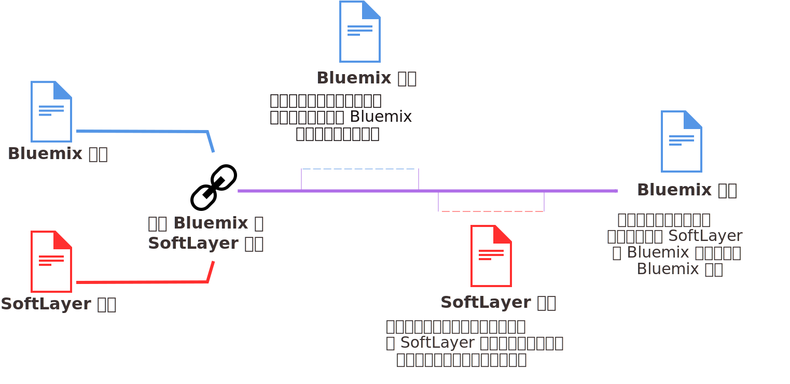

---

 

copyright:

  years: 2016, 2017
lastupdated: "2017-01-11"
 

---

{:shortdesc: .shortdesc}
{:codeblock: .codeblock}
{:screen: .screen}
{:new_window: target="_blank"}

# 升级和联合 {{site.data.keyword.Bluemix_notm}} 与 SoftLayer 缴费账户
{: #softlayerlink}

如果您拥有 {{site.data.keyword.Bluemix_notm}} 试用帐户，并且要访问“基础架构”仪表板，那么必须升级到 {{site.data.keyword.Bluemix_notm}}“现买现付”帐户。如果要使用在试用帐户内不可用的其他收费资源，或者试用帐户已到期，那么也必须升级。 

您可以通过将现有 {{site.data.keyword.Bluemix_notm}} 和 SoftLayer 缴费账户链接在一起，以联合这两个帐户。链接帐户时，您将通过 {{site.data.keyword.Bluemix_notm}} 同时对 {{site.data.keyword.Bluemix_notm}} 和 SoftLayer 资源进行记帐。

**注意：**{{site.data.keyword.Bluemix_notm}} 预订帐户和在自动帐户链接之前创建的旧 {{site.data.keyword.Bluemix_notm}}“现买现付”帐户无法与 SoftLayer 帐户链接。要访问“基础架构”仪表板，您必须创建“现买现付”帐户，即自动与 SoftLayer 帐户链接的第二个帐户。然后，您将收到两个发票，每个 {{site.data.keyword.Bluemix_notm}} 帐户一个。虽然将在不同的“现买现付”帐户中对基础架构资源开具发票，但是资源可与预订帐户中的应用程序和服务一起使用。例如，如果您在预订帐户中激活 Watson 服务，那么您可以复制服务凭证，然后将凭证添加到源自“现买现付”帐户的裸机应用程序。
{:shortdesc}

## 升级到 {{site.data.keyword.Bluemix_notm}}“现买现付”帐户
{: #upgradetopayg}

使用试用帐户登录到 {{site.data.keyword.Bluemix_notm}} 时，不能访问 {{site.data.keyword.Bluemix_notm}}“基础架构”仪表板。如果希望应用程序使用基础架构资源，那么必须升级到“现买现付”帐户。

要将试用帐户升级到 {{site.data.keyword.Bluemix_notm}}“现买现付”帐户，请完成以下步骤：

 1. 单击**帐户** &gt; **记帐**。
 2. 然后，单击**添加信用卡**。
 3. 输入必需的记帐详细信息。 
 4. 阅读并接受“现买现付”帐户的条款和条件。 
 5. 完成后，单击**升级**。 
 
升级到“现买现付”帐户后，**基础架构**选项会列在 {{site.data.keyword.Bluemix_notm}} **目录**中。如果使用量超过免费限额，那么您将收到按月开具的 {{site.data.keyword.Bluemix_notm}} 发票。发票将采用美元 (USD) 计费，并将详细描述您的资源费用。 

## 联合 {{site.data.keyword.Bluemix_notm}} 和 SoftLayer 帐户
{: #unifyingaccounts}

您可以联合 {{site.data.keyword.Bluemix_notm}} 和 SoftLayer 帐户以利用组合资源。链接 {{site.data.keyword.Bluemix_notm}} 和 Softlayer 帐户后，您将收到单个 {{site.data.keyword.Bluemix_notm}} 发票。如果您有现有的 {{site.data.keyword.Bluemix_notm}} 帐户，那么通过 {{site.data.keyword.Bluemix_notm}} 对 SoftLayer 资源进行记帐会在链接帐户之后启动的新记帐周期生效。

**重要信息：**{{site.data.keyword.Bluemix_notm}} 中的所有链接帐户都必须是“现买现付”帐户。您可以创建新的“现买现付”帐户，或者链接现有的“现买现付”帐户。或者，您可以链接现有的试用帐户，但是它将升级到“现买现付”帐户。不能链接预订 {{site.data.keyword.Bluemix_notm}} 帐户。  

链接帐户后：

* 必须使用 IBM 标识凭证来访问 SoftLayer 和 {{site.data.keyword.Bluemix_notm}} 帐户。
* 将对全体 {{site.data.keyword.Bluemix_notm}} 费用应用所有现有的 SoftLayer 折扣。 
* 您将收到一张以美元 (USD) 计费的发票。
* 您可以在 {{site.data.keyword.BluSoftlayer}} 用户界面中监视 {{site.data.keyword.Bluemix_notm}} 资源的使用情况。 

**注意：**帐户链接之后即无法对它们取消链接。 

如果您具有 SoftLayer 帐户，且您想要链接 SoftLayer 和 {{site.data.keyword.Bluemix_notm}} 帐户，请完成以下步骤：

 1. 从 {{site.data.keyword.slportal}}，单击**链接 {{site.data.keyword.Bluemix_notm}} 帐户**。
 2. 阅读并接受链接 SoftLayer 和 {{site.data.keyword.Bluemix_notm}} 帐户的条款。
 3. 要求时，提供与 {{site.data.keyword.Bluemix_notm}} 帐户相关联的电子邮件地址。如果您没有 {{site.data.keyword.Bluemix_notm}} 帐户，请提供要使用的电子邮件地址，然后遵循指示受邀加入 {{site.data.keyword.Bluemix_notm}} 并创建帐户。

您必须是 SoftLayer 帐户中的主用户，才能链接帐户。

链接帐户之后，SoftLayer 全局标题中即可使用**转至 {{site.data.keyword.Bluemix_notm}}** 链接。单击此链接可带您进入 {{site.data.keyword.Bluemix_notm}} 登录页面。此外，**SoftLayer** 链接现在可在 {{site.data.keyword.Bluemix_notm}} 标题中使用。单击该链接可在新窗口中带您进入 {{site.data.keyword.slportal}} 的主页。

{{site.data.keyword.Bluemix_notm}} 基础架构产品连接到一个三层网络，对公共、专用和管理流量进行分段处理。客户的 {{site.data.keyword.Bluemix_notm}} 帐户上的基础架构产品可在专用网络上免费相互传输数据。基础架构产品（例如，裸机服务器、虚拟服务器和云存储器）在公用网络上连接到 {{site.data.keyword.Bluemix_notm}}“目录”中的其他应用程序和服务，如 Watson 服务、容器或运行时。这两种类型的产品之间的数据传输按标准公用网络带宽费率计量并收费。

## 邀请 SoftLayer 团队成员加入 {{site.data.keyword.Bluemix_notm}}
{: #invite_users}

链接 {{site.data.keyword.Bluemix_notm}} 和 SoftLayer 帐户后，可以邀请 SoftLayer 团队成员加入 {{site.data.keyword.Bluemix_notm}}。或者，您可以在以后从 {{site.data.keyword.Bluemix_notm}} 用户界面邀请 SoftLayer 团队成员。
{:shortdesc}

从 {{site.data.keyword.Bluemix_notm}} 用户界面，您可以选择邀请 SoftLayer 帐户的所有成员，或者您可以选择个别成员。邀请团队成员时，您必须为被邀请者设置 {{site.data.keyword.Bluemix_notm}} 帐户角色。有关 {{site.data.keyword.Bluemix_notm}} 中不同角色的更多信息，请参阅[用户角色](https://console.ng.bluemix.net/docs/admin/users_roles.html#userrolesinfo)。

您必须是 SoftLayer 帐户中的主用户，才能邀请团队成员加入 {{site.data.keyword.Bluemix_notm}} 帐户。

要通过 {{site.data.keyword.Bluemix_notm}} 邀请团队成员，请完成以下步骤：

 1. 单击**帐户** &gt; **邀请团队成员**。
 2. 单击**添加**，以在 SoftLayer 帐户中进行认证，并查看 {{site.data.keyword.BluSoftlayer}} 帐户的团队成员列表。
 3. 选择要邀请的团队成员，然后单击**发送**。
 
团队成员接收包含**加入组织**链接的电子邮件。如果该团队成员没有 IBM 标识，那么会将该团队成员重定向到注册页面。接下来，该团队成员可以输入一些基本信息，并创建自己的 {{site.data.keyword.Bluemix_notm}} 帐户。

有关通过 {{site.data.keyword.Bluemix_notm}} 用户界面邀请团队成员的更多信息，请参阅[邀请团队成员](https://console.ng.bluemix.net/docs/admin/users_roles.html#inviteteammembers)。

## 切换到 IBM 标识
{: #ibmid_switch}

现在，在 SoftLayer 中进行认证将使用 IBM 标识来提供对所有 {{site.data.keyword.Bluemix_notm}} 的单点登录。将允许现有 SoftLayer 帐户切换到 IBM 标识认证。迁移向导将指导您完成此切换。
{:shortdesc}

如果您是主用户并且在 {{site.data.keyword.slportal}} 中未显示切换到 IBM 标识的提示，请[联系 IBM 支持](/docs/support/index.html#contacting-support)以获取关于启用此功能的帮助。

开始切换到 IBM 标识的过程后，只要尚未完成切换过程，随时都可以将其取消。然而，您每次登录时，都会显示切换到 IBM 标识的提示。计划链接到 {{site.data.keyword.Bluemix_notm}} 帐户的每个 SoftLayer 帐户都必须由具有唯一电子邮件地址的唯一 IBM 标识所拥有。

要从现有 SoftLayer 用户名切换到 IBM 标识，请完成以下步骤：

 1. 登录到 SoftLayer 帐户。显示切换到 IBM 标识的提示时，单击**确定**。 
 
    如果您已登录（在切换到 IBM 标识的提示中单击了**稍后**），但在当前会话中又希望切换到 IBM 标识认证，请转至“编辑用户个人档案”页面，然后单击**切换到 IBM 标识**。
	
 2. 遵循向导提示来创建 IBM 标识。 
 
    要创建新的 IBM 标识，请输入当前任何 IBM 标识均未使用的电子邮件地址。新的 IBM 标识将使用该电子邮件地址作为用户名和电子邮件地址。创建 IBM 标识后，可以更新与此 IBM 标识关联的电子邮件地址，但不能更改用户名。邀请电子邮件将发往您提供的电子邮件地址。
    
    完成向导后，您将收到一封包含注册代码的电子邮件。
 
 3. 收到电子邮件后，请访问相应链接或将相应 URL 复制到浏览器中，然后输入注册代码。该代码有效期为 7 天，并且只能使用一次。
 
    切换到 IBM 标识认证后，就只能使用 IBM 标识登录到您的帐户。在“帐户登录”提示中，转至 **IBM 标识帐户登录**部分，并单击**使用 IBM 标识登录**。不要使用先前用于 SoftLayer 标识的**用户名**和**密码**字段。
 
如果您是新客户，在检查订单时，系统会要求您输入现有 IBM 标识或创建新的 IBM 标识。 

 * 要使用现有 IBM 标识，请输入 IBM 标识的用户名或电子邮件地址（如果唯一，即未在多个 IBM 标识之间共享）。
 
 * 要创建新的 IBM 标识，请输入当前任何 IBM 标识均未使用的电子邮件地址。新的 IBM 标识将使用该电子邮件地址作为用户名和电子邮件地址。创建 IBM 标识后，可以更新与此 IBM 标识关联的电子邮件地址，但不能更改用户名。邀请电子邮件将发往您提供的电子邮件地址。

要解决使用 IBM 标识登录的任何问题，请参阅[有关访问 Bluemix 的故障诊断](/docs/troubleshoot/ts_accessing.html#accessing)。

### 允许用户切换到 IBM 标识
{: #link_accounts_resellers}

在某些情况下，经销商或分销商必须允许帐户使用 IBM 标识认证后，用户才能切换到 IBM 标识。 

 * 要允许使用旧 SoftLayer 凭证的现有帐户使用 IBM 标识认证，请[联系 IBM 支持](https://console.ng.bluemix.net/docs/support/index.html#contacting-support)以启用 IBM 标识迁移。必须为要链接到 {{site.data.keyword.Bluemix_notm}} 帐户的每个现有最终用户帐户启用此功能。
 
 * 要确保使用 IBM 标识创建新用户帐户，必须在直接主用户帐户上设置 `CREATE_NEW_ACCOUNT_WITH_IBMid_AUTHENTICATION` 属性。请[联系 IBM 支持](https://console.ng.bluemix.net/docs/support/index.html#contacting-support)或供应商为您的帐户设置此属性。
 
### 链接用户帐户
{: #link_user_accounts}
用户切换到 IBM 标识认证后，经销商和分销商可以链接 SoftLayer 和 {{site.data.keyword.Bluemix_notm}} 帐户。

**注：** 
  * 要链接的帐户的主用户必须是 IBM 标识。
  * 以主用户身份登录到每个最终用户帐户。转至用户个人档案页面，然后单击**切换到 IBM 标识**。
  * 链接到 {{site.data.keyword.Bluemix_notm}} 帐户的每个帐户都必须由具有唯一电子邮件地址的唯一 IBM 标识所拥有。虽然一个 IBM 标识可以拥有多个 SoftLayer 帐户，但不能将这多个帐户链接到 {{site.data.keyword.Bluemix_notm}} 帐户。如果一个 IBM 标识是多个 SoftLayer 帐户的主用户，并且您希望将这些帐户链接到 {{site.data.keyword.Bluemix_notm}} 帐户，那么必须将每个帐户的主用户更改为唯一 IBM 标识。请联系 [IBM SoftLayer 支持 ](https://knowledgelayer.softlayer.com/topic/support){: new_window}，以更改 SoftLayer 帐户上的主用户。
  
要将每个帐户链接到 {{site.data.keyword.Bluemix_notm}}，请完成以下步骤： 

 1. 要创建新的 {{site.data.keyword.Bluemix_notm}} 帐户或链接到现有 {{site.data.keyword.Bluemix_notm}} 帐户，请以主用户身份登录到 SoftLayer 帐户，然后单击 **{{site.data.keyword.Bluemix_notm}}** 链接。这将让您有机会创建新的 {{site.data.keyword.Bluemix_notm}} 帐户或链接到现有 {{site.data.keyword.Bluemix_notm}} 帐户。作为 SoftLayer 帐户主用户的 IBM 标识必须是要链接到的 Bluemix 帐户的所有者。请遵循向导提示，包括将 SoftLayer 帐户中的用户添加到 {{site.data.keyword.Bluemix_notm}} 帐户。 
 2. 链接帐户后，请通知该帐户的最终用户迁移到 IBM 标识。然后，最终用户可以在 {{site.data.keyword.Bluemix_notm}} 控制台中访问“基础架构”、“应用程序”和“服务”仪表板。
 3. 将新用户添加到链接的帐户时，需要将这些用户同时添加到 SoftLayer 帐户和 {{site.data.keyword.Bluemix_notm}} 帐户，这样这些用户才有权访问统一控制台中的所有功能。
 
**建议：**仅将最终用户帐户迁移到 IBM 标识。请勿迁移品牌帐户，品牌帐户是最终用户帐户的父帐户，不包含任何资源。迁移到 IBM 标识的品牌帐户用户将无法再登录到 Brand Agent Portal (BAP) 门户网站。

<!--
### Mapping multiple SoftLayer accounts to one IBMid
{: #map_multiple_accounts}

You can associate one IBMid with multiple SoftLayer accounts by using an existing IBMid email address when setting up the account. Only one SoftLayer user for each account can be mapped to the single IBMid. The IBMid must be unique within each SoftLayer account. However, one user with access to multiple SoftLayer accounts can use one IBMid to access multiple SoftLayer accounts.

For example, an IBMid can map to the master user in accounts A and B, and to an additional user in accounts C and D. One of the accounts mapped to that IBMid is the default account.  Usually, the default account is the account that was first mapped to the IBMid. However, you can switch which account is the default account  through an account switching feature in the Customer Portal.

For a user with IBMid access to multiple accounts with two-factor authentication enabled, an appropriate two-factored authentication verification code per account is required during account log in and account switching.
-->

## 使用 {{site.data.keyword.Bluemix_notm}} 服务与 SoftLayer 资产
{: #bluemix_services}

您可以轻松地使用基于 API 的公共 {{site.data.keyword.Bluemix_notm}} 服务与 SoftLayer 资产。所有 API 都很安全且已加密，以便保护您的数据。
{:shortdesc}

例如，您曾想要通过 SoftLayer，将认知功能从 Watson 添加到在裸机服务器上运行的应用程序吗？您可以使用四个简单的步骤，添加 {{site.data.keyword.personalityinsightsshort}} 等服务，以帮助了解您的应用程序用户：

1. 在 {{site.data.keyword.Bluemix_notm}} 目录中查找服务。
2. 仅使用几下单击，供应服务的实例。
3. 通过复制服务凭证并将它们添加到应用程序，设置服务以与现有代码一起运行。
4. 更新应用程序之后，在 SoftLayer 基础架构上部署新版本。

通过在 SoftLayer 中从应用程序调用 Watson API，使它们更具个性化，您可以获得*洞察和认知*知识。或者，使用*数据和分析*服务，以对您的应用程序使用高性能分析。或者，选择数据库即服务，在这里您可以让 {{site.data.keyword.Bluemix_notm}} 来进行管理。

将容器与 {{site.data.keyword.activedeployshort}} 和 {{site.data.keyword.deliverypipeline}} 等服务配合使用，使得您的应用程序开发更具现代化。然后，您可以使用 {{site.data.keyword.vpn_short}} 服务，与 SoftLayer 进行通信，以将专用网络中的容器连接到 SoftLayer 专用网络。计算资源和服务的所有使用量费用都会反映在 {{site.data.keyword.Bluemix_notm}} 帐单中。 

### 基于 API 的 {{site.data.keyword.Bluemix_notm}} 服务
并非所有 {{site.data.keyword.Bluemix_notm}} 服务都可以和 SoftLayer 一起使用。以下服务可以设置为与应用程序代码一起运行：
* {{site.data.keyword.alchemyapishort}}
* {{site.data.keyword.alertnotificationshort}}
* {{site.data.keyword.sparks}}
* {{site.data.keyword.appseccloudshort}}
* {{site.data.keyword.blockchain}}
* {{site.data.keyword.cloudant}}
* {{site.data.keyword.conceptinsightsshort}}
* {{site.data.keyword.iotmapinsights_short}}
* {{site.data.keyword.dashdbshort}}
* {{site.data.keyword.dialogshort}}
* {{site.data.keyword.documentconversionshort}}
* {{site.data.keyword.twittershort}}
* {{site.data.keyword.weather_short}}
* {{site.data.keyword.iotdriverinsights_short}}
* {{site.data.keyword.geospatialshort_Geospatial}}
* {{site.data.keyword.graphshort}}
* {{site.data.keyword.iotelectronics}}
* {{site.data.keyword.languagetranslationshort}}
* {{site.data.keyword.messagehub}}
* {{site.data.keyword.mqa}}
* {{site.data.keyword.mobileappbuilder_short}}
* {{site.data.keyword.mql}}
* {{site.data.keyword.nlclassifiershort}}
* {{site.data.keyword.objectstorageshort}}
* {{site.data.keyword.personalityinsightsshort}}
* {{site.data.keyword.presenceinsightsshort}}
* {{site.data.keyword.relationshipextractionshort}}
* {{site.data.keyword.retrieveandrankshort}}
* {{site.data.keyword.speechtotextshort}}
* {{site.data.keyword.sqldb}}
* {{site.data.keyword.streaminganalyticsshort}}
* {{site.data.keyword.texttospeechshort}}
* {{site.data.keyword.toneanalyzershort}}
* {{site.data.keyword.tradeoffanalyticsshort}}
* {{site.data.keyword.visualinsightsshort}}
* {{site.data.keyword.visualrecognitionshort}}
* {{site.data.keyword.workflow}}
* {{site.data.keyword.workloadscheduler}}

**注：**并非这些服务的所有套餐都可用。只有针对“现买现付”帐户启用的套餐可用于与相链接的帐户一起使用。但是，如果您具有单独记帐的独立 {{site.data.keyword.Bluemix_notm}} 帐户，那么您可以对这些服务中的任何一个使用任何套餐。

## 链接帐户时 {{site.data.keyword.Bluemix_notm}} 使用情况的帐单
{: #bill_usage}

在您链接 {{site.data.keyword.Bluemix_notm}} 和 SoftLayer 缴费帐户之后，下一个记帐周期将会记入单个 {{site.data.keyword.Bluemix_notm}} 帐单。
{:shortdesc}

{{site.data.keyword.Bluemix_notm}} 使用情况周期以日历月为基础，因此您的帐户会在每月的建立收费协议的记帐日进行记帐。使用 SoftLayer，您的使用情况周期从您开始使用 SoftLayer 开始，因此每月会在您注册 SoftLayer 帐户的那一天进行记帐。 

当链接帐户时，{{site.data.keyword.Bluemix_notm}} 使用情况将继续在当前月份周期内测量，并会在 {{site.data.keyword.Bluemix_notm}} 发票上对该使用情况进行记帐。从下个月的第一天开始，您的 {{site.data.keyword.Bluemix_notm}} 和 SoftLayer 费用将会一并列在 {{site.data.keyword.Bluemix_notm}} 发票上。

例如，如果您在 4 月 16 日链接帐户，那么您将获得四月使用情况的 Bluemix 发票。根据链接帐户的时间，您可能会收到针对 SoftLayer 使用量的单独帐单。您在五月对 SoftLayer 和 {{site.data.keyword.Bluemix_notm}} 的使用量将通过 {{site.data.keyword.Bluemix_notm}} 帐户记帐。

链接帐单后，{{site.data.keyword.Bluemix_notm}} 发票将在以下标题下列出针对所使用的每个资源的不同费用：

* **裸机服务器和连接的服务**
* **虚拟服务器和连接的服务**
* **未连接的服务**

有关如何查看 {{site.data.keyword.Bluemix_notm}} 使用情况的更多信息，请参阅[查看使用情况详细信息](https://console.ng.bluemix.net/docs/pricing/index.html#usage)。

