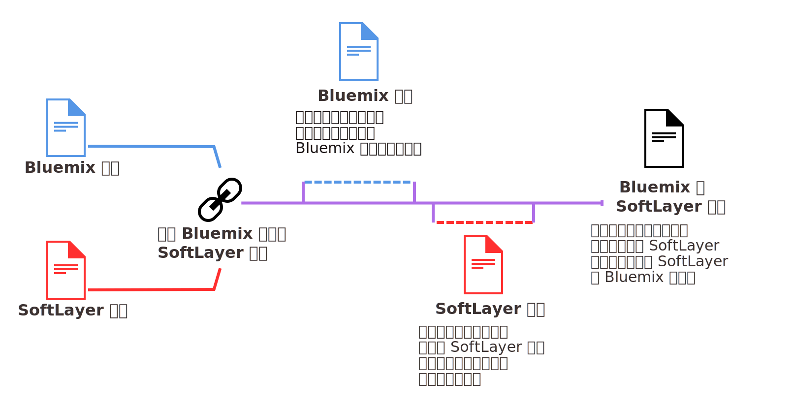

---

 

copyright:

  years: 2016

 

---

{:shortdesc: .shortdesc}
{:codeblock: .codeblock}
{:screen: .screen}
{:new_window: target="_blank"}

<!-- draft - staging only -->

#鏈結 SoftLayer 與 {{site.data.keyword.Bluemix_notm}} 計費帳戶
{: #softlayerlink}
*前次更新：2016 年 6 月 10 日*
{: .last-updated}

您現在可以鏈結 SoftLayer 與 {{site.data.keyword.Bluemix_notm}} 計費帳戶。在您將帳戶鏈結後，就會透過 SoftLayer 同時針對 SoftLayer 和 {{site.data.keyword.Bluemix_notm}} 資源向您收費。如果您有現存的帳戶，將在帳戶鏈結之後開始的新計費週期，透過 SoftLayer 來收取 {{site.data.keyword.Bluemix_notm}} 的費用。
{:shortdesc}

**重要事項：**{{site.data.keyword.Bluemix_notm}} 中所有鏈結的帳戶都必須是「隨收隨付制」帳戶。您可以建立新的「隨收隨付制」帳戶，也可以鏈結至現有的「隨收隨付制」帳戶。或者，您可以鏈結現有的試用帳戶，但它將會升級為「隨收隨付制」帳戶。  

帳戶鏈結之後，您還是可以在 {{site.data.keyword.Bluemix_notm}} 使用者介面中監視 {{site.data.keyword.Bluemix_notm}} 資源的使用情形。不過，這些資源的計費現在會出現在 SoftLayer 發票上。

雖然帳戶計費將會鏈結，而且您能夠在帳戶之間輕易切換，但針對 {{site.data.keyword.Bluemix_notm}} 和 SoftLayer 還是需要有個別 ID。請繼續將 SoftLayer ID 用於 SoftLayer 產品與服務，並將 IBM ID 用於 {{site.data.keyword.Bluemix_notm}} 產品與服務。 

**注意：**帳戶鏈結之後，便無法解除鏈結。  

如果您有 SoftLayer 帳戶，而且想要將 SoftLayer 帳戶與 {{site.data.keyword.Bluemix_notm}} 帳戶鏈結，請完成下列步驟：
 1. 從 {{site.data.keyword.slportal}}，按一下**鏈結 {{site.data.keyword.Bluemix_notm}} 帳戶**。 
 2. 閱讀並接受將 SoftLayer 帳戶與 {{site.data.keyword.Bluemix_notm}} 帳戶鏈結所適用的條款。
 3. 當系統要求時，提供與 {{site.data.keyword.Bluemix_notm}} 帳戶相關聯的電子郵件位址。如果您沒有 {{site.data.keyword.Bluemix_notm}} 帳戶，請提供您要使用的電子郵件位址，然後遵循指示，以受邀加入 {{site.data.keyword.Bluemix_notm}} 並建立帳戶。

您必須是 SoftLayer 帳戶的「主要使用者」，才能鏈結帳戶。

鏈結帳戶之後，SoftLayer 廣域標頭中會出現**移至 {{site.data.keyword.Bluemix_notm}}**。按一下此鏈結，即可讓您進入 {{site.data.keyword.Bluemix_notm}} 登入頁面。此外，{{site.data.keyword.Bluemix_notm}} 標頭中現在也會有 **SoftLayer**。按一下此鏈結，即可讓您進入新視窗中的 {{site.data.keyword.slportal}} 首頁。

## 帳戶鏈結後的 {{site.data.keyword.Bluemix_notm}} 使用額度
{: #slcredit}

當您將 {{site.data.keyword.Bluemix_notm}} 計費帳戶與 SoftLayer 計費帳戶鏈結時，會收到 200.00 美元的 {{site.data.keyword.Bluemix_notm}} 使用額度。該額度必須在鏈結帳戶後的 30 天內使用。

如需如何檢視額度和到期日的相關資訊，請參閱[檢視額度](https://console.ng.bluemix.net/docs/pricing/index.html#credits)。

## 邀請 SoftLayer 團隊成員加入 {{site.data.keyword.Bluemix_notm}}
{: #invite_users}

您可以在將 {{site.data.keyword.Bluemix_notm}} 帳戶與 SoftLayer 帳戶鏈結時，邀請您的 SoftLayer 團隊成員加入 {{site.data.keyword.Bluemix_notm}}。也可以之後再從 {{site.data.keyword.Bluemix_notm}} 使用者介面來邀請 SoftLayer 團隊成員。
{:shortdesc}

從 {{site.data.keyword.Bluemix_notm}} 使用者介面，您可以選擇邀請 SoftLayer 帳戶的所有成員，也可以選取個別成員。在邀請團隊成員時，您必須為受邀者設定 {{site.data.keyword.Bluemix_notm}} 帳戶角色。如需 {{site.data.keyword.Bluemix_notm}} 中不同角色的相關資訊，請參閱[使用者角色](https://console.ng.bluemix.net/docs/admin/users_roles.html#userrolesinfo)。

您必須是 SoftLayer 帳戶的「主要使用者」，才能邀請團隊成員加入 {{site.data.keyword.Bluemix_notm}} 帳戶。

若要透過 {{site.data.keyword.Bluemix_notm}} 邀請團隊成員，請執行下列動作：
 1. 移至**帳戶和支援**圖示  > **帳戶** > **邀請團隊成員**。
 2. 按一下**新增**，以鑑別至 SoftLayer 帳戶中，並從 SoftLayer 帳戶檢視團隊成員清單。
 3. 選取要邀請的團隊成員，然後按一下**傳送**。

隨著更多的團隊成員新增至您的 SoftLayer 帳戶，您可以一再地重複此作業。
 
團隊成員會收到包含**加入組織**鏈結的電子郵件。如果該成員沒有 IBM ID，則會重新導向至登錄頁面。接著，該成員可以輸入一些基本資訊，並建立自己的 {{site.data.keyword.Bluemix_notm}} 帳戶。

如需透過 {{site.data.keyword.Bluemix_notm}} 使用者介面來邀請團隊成員的相關資訊，請參閱[邀請團隊成員](https://console.ng.bluemix.net/docs/admin/users_roles.html#inviteteammembers)。

## 將 {{site.data.keyword.Bluemix_notm}} 服務與 SoftLayer 資產搭配使用
{: #bluemix_services}

您可以輕鬆地將 API 型公用 {{site.data.keyword.Bluemix_notm}} 服務與 SoftLayer 資產搭配使用。所有 API 都很安全且經過加密，讓您的資料受到保護。{:shortdesc}

例如，您是否曾經想要將 Watson 的認知功能新增至在 SoftLayer 的裸機伺服器上執行的應用程式？使用四個簡單的步驟，就可以新增 {{site.data.keyword.personalityinsightsshort}} 之類的服務，以協助瞭解您應用程式的使用者：

1. 在 {{site.data.keyword.Bluemix_notm}} 型錄中尋找服務。
2. 只要按幾下滑鼠，即可佈建服務的實例。
3. 複製服務認證，並將其新增至您的應用程式，將服務設定為使用您現有的程式碼來執行。
4. 更新應用程式之後，將新版本部署在 SoftLayer 基礎架構上。

您可以從 SoftLayer 中的應用程式呼叫 Watson API，使其更加個人化，以獲得*見解和認知* 的知識。或者，使用*資料和分析* 服務，為您的應用程式進行高效能分析。或者，選擇資料庫即服務 (database-as-a-service)，將管理工作交給 {{site.data.keyword.Bluemix_notm}}。

使用容器搭配 {{site.data.keyword.activedeployshort}} 和 {{site.data.keyword.deliverypipeline}} 等服務，使您的應用程式開發作業現代化。然後，您可以使用 {{site.data.keyword.vpn_short}} 服務來建立回到 SoftLayer 的通道，以將私密網路中的容器連接至 SoftLayer 私密網路。運算資源和服務的所有使用收費，都會反映在您的 SoftLayer 帳單上。 

### API 型 {{site.data.keyword.Bluemix_notm}} 服務
並非所有 {{site.data.keyword.Bluemix_notm}} 服務都可以與 SoftLayer 搭配使用。下列服務可設定為與您的應用程式碼搭配執行：
* {{site.data.keyword.alchemyapishort}}
* {{site.data.keyword.alertnotificationshort}}
* {{site.data.keyword.sparks}}
* {{site.data.keyword.appseccloudshort}}
* {{site.data.keyword.blockchain}}
* {{site.data.keyword.cloudant}}
* {{site.data.keyword.conceptinsightsshort}}
* {{site.data.keyword.iotmapinsights_short}}
* {{site.data.keyword.dashdbshort}}
* {{site.data.keyword.dialogshort}}
* {{site.data.keyword.documentconversionshort}}
* {{site.data.keyword.twittershort}}
* {{site.data.keyword.weather_short}}
* {{site.data.keyword.iotdriverinsights_short}}
* {{site.data.keyword.geospatialshort_Geospatial}}
* {{site.data.keyword.graphshort}}
* {{site.data.keyword.iotelectronics}}
* {{site.data.keyword.languagetranslationshort}}
* {{site.data.keyword.messagehub}}
* {{site.data.keyword.mqa}}
* {{site.data.keyword.mobileappbuilder_short}}
* {{site.data.keyword.mql}}
* {{site.data.keyword.nlclassifierlshort}}
* {{site.data.keyword.objectstorageshort}}
* {{site.data.keyword.personalityinsightsshort}}
* {{site.data.keyword.presenceinsightsshort}}
* {{site.data.keyword.relationshipextractionshort}}
* {{site.data.keyword.retrieveandrankshort}}
* {{site.data.keyword.servicediscoveryshort}}
* {{site.data.keyword.speechtotextshort}}
* {{site.data.keyword.sqldb}}
* {{site.data.keyword.streaminganalyticsshort}}
* {{site.data.keyword.texttospeechshort}}
* {{site.data.keyword.toneanalyzershort}}
* {{site.data.keyword.tradeoffanalyticsshort}}
* {{site.data.keyword.visualinsightsshort}}
* {{site.data.keyword.visualrecognitionshort}}
* {{site.data.keyword.workflow}}
* {{site.data.keyword.workloadscheduler}}

**附註：**並非這些服務的所有方案都可供使用。只有針對「隨收隨付制」帳戶啟用的方案，才能用於已鏈結的帳戶。不過，如果您有分開計費的個別 {{site.data.keyword.Bluemix_notm}} 帳戶，則可將任何方案用於上述任何服務。

## 帳戶鏈結後的 {{site.data.keyword.Bluemix_notm}} 使用計費
{: #bill_usage}

將 {{site.data.keyword.Bluemix_notm}} 計費帳戶與 SoftLayer 計費帳戶鏈結之後，將以一張 SoftLayer 帳單收取下一個計費週期的費用。
{:shortdesc}

您的 {{site.data.keyword.Bluemix_notm}} 使用週期是以公曆月為基準，所以會在每個月 1 日向您的帳戶收費。使用 SoftLayer 時，您的使用週期是從 SoftLayer 起始使用日開始，所以會以 SoftLayer 帳戶註冊當月的相同日期，每月向您收費。 

帳戶鏈結之後，會繼續計算當月週期的 {{site.data.keyword.Bluemix_notm}} 用量，並且會在 {{site.data.keyword.Bluemix_notm}} 發票上向您收取該用量的費用。從下個月 1 日開始，{{site.data.keyword.Bluemix_notm}} 的費用將會列在 SoftLayer 發票上。

例如，如果您在 4 月 16 日鏈結帳戶，則會收到 4 月用量的 Bluemix 發票。5 月的用量則會透過 SoftLayer 帳戶收取。

帳單合併之後，SoftLayer 發票的摘要發票上會有一個 **{{site.data.keyword.Bluemix_notm}}** 區段。在詳細計費視圖中，{{site.data.keyword.Bluemix_notm}} 費用會顯示為其他服務，且開頭為*「{{site.data.keyword.Bluemix_notm}} 方案...」*。

如需如何檢視 {{site.data.keyword.Bluemix_notm}} 用量的相關資訊，請參閱[檢視用量詳細資料](https://console.ng.bluemix.net/docs/pricing/index.html#usage)。

# 相關鏈結
## 一般
* [影片：將 SoftLayer 帳戶與 Bluemix 帳戶鏈結，合併為單一發票](https://www.youtube.com/watch?v=Xb01idt2NiU&index=1&list=PLzpeuWUENMK2d3L5qCITo2GQEt-7r0oqm)
