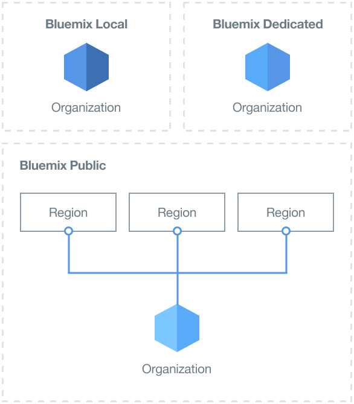
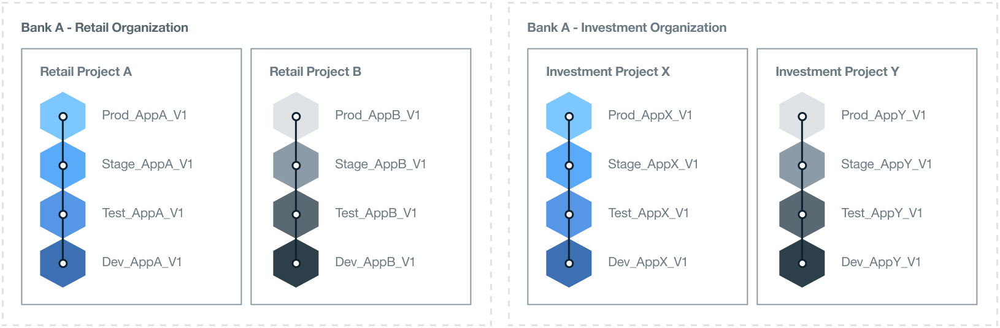
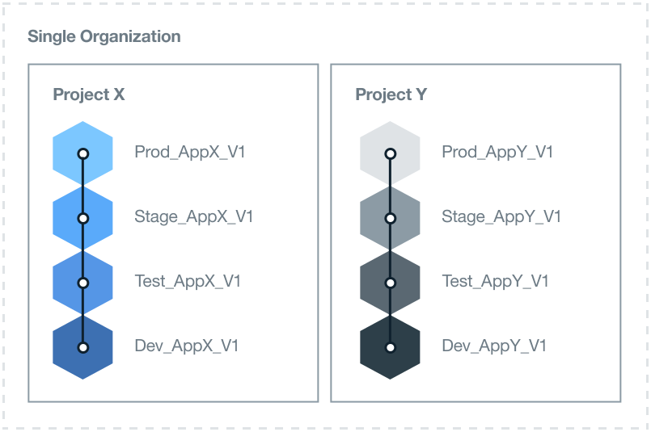

---

copyright:

  years: 2015, 2017
lastupdated: "2017-02-22"

---

{:new_window: target="_blank"}
{:shortdesc: .shortdesc}
{:screen:.screen}
{:codeblock:.codeblock}

# Best practices for setting up your {{site.data.keyword.Bluemix_notm}} environment
{: #patterns}

For a successful project, take time to plan and design which resources you need and what your enterprise requirements are. To help you get started with your cloud project, consider the following questions:

* How many, and what type of, applications will be developed?
* Which services will the applications need to access?
* Who will be collaborating in the development process and what role will they play?
* What degree of isolation is required for each phase of the project?
* Will your enterprise supply the infrastructure resources? 
* How does your company communicate?
* Is there a naming standard that you can implement to clearly identify the organization and space usage?   

{:shortdesc}

When you design a cloud solution, also think about account security and operational requirements, country regulations, market directives, and corporate policies. 
To cater for your project needs, {{site.data.keyword.Bluemix}} offers three types of cloud environments. 

* [{{site.data.keyword.Bluemix_notm}} Public](/docs/overview/whatisbluemix.html "{{site.data.keyword.Bluemix_notm}} Public"): The infrastructure resources are shared by different companies and users.
* [{{site.data.keyword.Bluemix_notm}} Dedicated](/docs/dedicated/index.html#dedicated "{{site.data.keyword.Bluemix_notm}} Dedicated"): You use your own dedicated SoftLayer infrastructure, which you can connect securely to the {{site.data.keyword.Bluemix_notm}} Public cloud and your own network.
* [{{site.data.keyword.Bluemix_notm}} Local](/docs/local/index.html#local "{{site.data.keyword.Bluemix_notm}} Local"): Sits behind your company firewall, which can protect your most sensitive workloads and can connect securely to both {{site.data.keyword.Bluemix_notm}} Public and {{site.data.keyword.Bluemix_notm}} Dedicated clouds.

As part of deciding which type of cloud environment you need, plan the structure of your account, organizations, spaces, resources, and team members. 

For most companies, a single {{site.data.keyword.Bluemix_notm}} account is sufficient. For larger companies, where there is more than one business area, you might 
want a separate {{site.data.keyword.Bluemix_notm}} account for each business domain. For example, within a large banking corporation there might be separate accounts for the retail and commercial sectors.

The folllowing table provides a summary of some of the key elements. 

| Element   | Description |
|---------------------------------------|--------------------------------------------------------------------------------------|
| Account   | Each account has one account owner. |
|| Contains one or more organizations. You must have a Pay-As-You-Go account to create more than one organization. |
| Account owner   | Responsible for all of the usage charges that are accumulated within the account. |
|| Can own only one account. |
|| Can add one or more organization managers to delegate the org management, which includes the read and write permissions to the organizations. |
|| Can be a team member in organizations and spaces in other {{site.data.keyword.Bluemix_notm}} accounts. |
| Organization   | Contains one or more spaces. | 
|| Contains one or more org managers. |
|| Contains one or more team members. Each team member can be granted one or more roles. |
|| The usage charges, which are generated by a deployed application within a space, are reported at the organization level. |
| Space   | Contains one or more resources. |
|| Contains one or more applications. |
|| Contains one or more space managers. |
|| Contains one or more team members. Each user must already be a team member in the owning organization. Each team member can be granted one or more roles. |
| Team member   | Can be added to one or more organizations and spaces across different accounts. |
|| Can be given more than one role within the same organization, space, or both. | 
{:caption="Table 1. Description of key elements" caption-side="top"}

## Determining your {{site.data.keyword.Bluemix_notm}} environment
{: #bpimplementation}

Instead of the traditional, strictly defined development, test, and production methodology, you can implement an environment where developers and testers can collaborate along with other team members. If you design the way you want to develop and deliver your aplications, you can create {{site.data.keyword.Bluemix_notm}} spaces to fulfil that methodology. Instead of designing your environment from the organization level down, consider designing your {{site.data.keyword.Bluemix_notm}} environment from the space level up.

Consider the scale and scope of the applications you plan to develop and deploy. A {{site.data.keyword.Bluemix_notm}} space can be used as a development environment for one or more applications that are tightly connected or defined. Apart from a development space, for example, you might want to create spaces for unit testing, performance testing, and integration testing. Spaces can also be defined for build, staging, and production. Each of the spaces that you create can be shared with different team members within the same organization. 

Create separate {{site.data.keyword.Bluemix_notm}} organizations when you have people working on different business areas and where their activities do not overlap. If there are two completely independent groups, then creating an organization for each defines clear boundaries for the delivery and management of team players and resources. You can define an API to communicate between the organizations.  

{{site.data.keyword.Bluemix_notm}} organizations can be created to match how you want to work rather than the structure within a company. Typically, company organizations can change but the development and maintenance of an application will continue regardless. 
Design your {{site.data.keyword.Bluemix_notm}} environment for the lifetime of the applications and not on your company organization structure. 

Iterative development and deployment can result in applications expanding quickly. Your delivery process design must be able to scale up quickly and easily. You will want continuous development with a fast deployment rate. Having your development and production spaces in the same {{site.data.keyword.Bluemix_notm}} organization will provide access to the same resources. Managing different spaces within a single organization reduces the administration overhead. The development, test, and operations personnel can collaborate easily if they are working within the same {{site.data.keyword.Bluemix_notm}} organization. 

Implement a naming standard to clearly identify the organization and space usage. For example, you might include the type of cloud, the geographical region, the usage type (such as dev, test, prod), the application name, and the version or revision number. The organizations and spaces can then be easily identified for administration and access purposes.  

The number of spaces can multiply rapidly because of iterative development. You can define as many spaces as you need within an organization. If you plan to define a large number of spaces, you might want to create an application to help manage the spaces. When the number of spaces exceeds sixty, you might want to consider defining another organization. 

Have one person create and manage an organization, define the spaces, and grant team member access. A second person can be given the same access to maintain the environment when the organization manager is unavailable.  

Identify all of the people who will need access to each space and organization. Determine their role. The job role of a team member will determine their authority. For example, a senior developer will need the authority to view and update the whole {{site.data.keyword.Bluemix_notm}} development environment. However, a junior developer will be limited as to what they can view and update.

## Determining your organization architecture
{: #orgstructure}

To design a cloud environment that uses {{site.data.keyword.Bluemix_notm}} Public, {{site.data.keyword.Bluemix_notm}} Dedicated, {{site.data.keyword.Bluemix_notm}} Local, or any combination, you can use the following organization architectures:

* Single-organization: Consider using this architecture if you require the same set of users to access resources that are available anywhere in the organization either in {{site.data.keyword.Bluemix_notm}} Public, {{site.data.keyword.Bluemix_notm}} Dedicated, or {{site.data.keyword.Bluemix_notm}} Local.
* Multi-organization: Consider using this architecture if you require isolation between different environments within {{site.data.keyword.Bluemix_notm}} Public, {{site.data.keyword.Bluemix_notm}} Dedicated, or {{site.data.keyword.Bluemix_notm}} Local. 

### Single-organization versus multi-organization
{: #singleormulti}

In a single-organization environment, the infrastructure resources are shared by different areas of 
the company. Whereas, in a multi-organization environment the infrastructure resources are not shared. 

Both organization architectures support the following priciples:

* Boundary enforcement for applications, projects, or both.
* Authorization to manage resources granted by user role.

To implement a single-organization architecture, create an account in {{site.data.keyword.Bluemix_notm}} Public, {{site.data.keyword.Bluemix_notm}} Dedicated, or 
{{site.data.keyword.Bluemix_notm}} Local, and define one organization. You can then define multiple spaces that are based on different lines of business (LOB), 
the delivery phases, specific projects, applications, user permisisons, or a combination of these components.

To implement a multi-organization architecture, create an account in {{site.data.keyword.Bluemix_notm}} Public, {{site.data.keyword.Bluemix_notm}} Dedicated, 
or {{site.data.keyword.Bluemix_notm}} Local. Next, you can define organizations that correspond to different LOBs, delivery phases, 
specific projects, user permisisons, or a combination of these components. You can then define multiple spaces that are based on applications or projects that are delivered by the same department in the company. 

**Note:** You must have a billable account, such as Pay-As-You-Go or Subscription, to define multiple organizations. 

### Organization considerations
{: #orgconsiderations}

When you implement a single-organization architecture, the organization includes all of the cloud resources, services, and applications that you use to develop, manage, and 
deploy cloud applications. In {{site.data.keyword.Bluemix_notm}} Public, the organization provides segregation between accounts and is available across all regions.

 

 Figure 1. Example of a single-organization architecture for {{site.data.keyword.Bluemix_notm}} Public, {{site.data.keyword.Bluemix_notm}} Dedicated, and 
 {{site.data.keyword.Bluemix_notm}} Local 
{: #bpfigure1}

When you implement a multi-organization architecture, organizations provide the first level of boundary enforcement and abstraction that you can use to control and define what can be 
done and by whom. Design each organization around the different LOBs, the delivery phases, the roles of the users, specific projects, or a combination of these components.  

The number of organizations that you require depends on multiple factors:

* The level of granularity that you require within your organization to manage quotas and control costs.
* The level of security that you must enforce in your different environments. For example, if you are using containers, you might want to segregate container images that are used for development from the container images that are used for production.
* The location of the organizations due to corporate, country, and industry requirements. For example, you might want to run all of your apps in a dedicated cloud that is located in a specific region in your geography (geo).

When you are defining the different organizations for your cloud structure, consider the following guidance:

* Define and then enforce a naming convention. For example, define a naming convention where the name of the organization includes information about the business area, the type of cloud ({{site.data.keyword.Bluemix_notm}} Public, {{site.data.keyword.Bluemix_notm}} Local, or {{site.data.keyword.Bluemix_notm}} Dedicated), and the process phase (development, testing, or production). For organizations that are located in {{site.data.keyword.Bluemix_notm}} Public, you might want to add information about the region too.
* Define the restrictions that apply to the organization. For example, define the role of the team members that are going to work in that organization.
* Identify the manager of the organization.
* Identify the area of the business that is allocated to this organization.

The following scenarios show different approaches that you can adopt when you define the number of {{site.data.keyword.Bluemix_notm}} organizations in a cloud environment:
* **Scenario 1: Segregation of user groups by business application delivery**

 Description: Corporate rules require that the apps of each LOB must be developed, managed, and deployed by users from each LOB. Security must be enforced so that users can access only the apps that are relevant to their part of the business. So, the users work in different business areas, the applications they are working on require access to different {{site.data.keyword.Bluemix_notm}} resources, and there is no activity overlap. 

  Solution: You can create an organization for each business application delivery process. For example, one organization for retail banking, and one for investment banking.

  

  Figure 2. Example of a multi-organization architecture aligned to LOB delivery
{: #bpfigure2}

* **Scenario 2: Segregation based on type of users (internal users, external users)**

  Description: Your company works with different partners and you require clear boundaries between internal and external users.

  Solution: You can create an organization to deliver applications that are used internally. In addition, you can create one organization  for each external partner.

* **Scenario 3: Isolation by project**

  Description: Your company runs hackathons to identify new services.  

  Solution: You can define one organization per hackathon and use the organization as a sandbox. After the hackathon, you can promote the sandbox organization into an additional organization in your account.

* **Scenario 4: Isolation of users by delivery phase**

  Description: A company wants development, test, and production users to collaborate across a delivery, but their access is controlled by user role and job experience.

  Solution: You can create a single-organization and define a space for each delivery phase. Then, depending on the user role and job experience, grant the read and write access they require to complete their work and also collaborate within the organization. 

  

   Figure 3. Example of a single-organization architecture aligned by delivery phase 
{: #bpfigure3}

### Organization naming, restrictions, and management 
{: #orgadmin}   
   
Consider the following organization guidance:

* Define and enforce a naming convention. For example, define a naming convention where the name of the organization includes information about the business area, the type of cloud ({{site.data.keyword.Bluemix_notm}} Public, {{site.data.keyword.Bluemix_notm}} Local, or {{site.data.keyword.Bluemix_notm}} Dedicated), and the IT role (development, testing, or production). For organizations that are located in {{site.data.keyword.Bluemix_notm}} Public, you might want to add information about the region too. You can change the name of an organization after it is created. If an organization name is altered, notify all of the organization team members about the change. 
* Define the restrictions that apply to the organization. For example, define the role of each of the team members and the permissions they need to work in that organization.
* Identify the manager of the organization. You might want to delegate the organization administration to more that one person. 
* Identify the area of the business that is allocated to this organization. The application usage that is generated in each of the spaces, within the organization, is accumulated and reported at the organization level. 

## Determining your spaces
{: #determinespaces}

Within an organization, spaces provide an additional level of boundary enforcement and abstraction.

A space is a reserved area in the organization where users can develop and run applications and services. You can create any number of spaces in an organization. 
You can control the users that have access to a space. For more information, see [Spaces](/docs/admin/orgs_spaces.html#spaceinfo "Spaces").

If you plan to define a large number of spaces, you might want to create an application to help manage the spaces. When the number of
spaces exceeds sixty, you might want to consider defining another organization. 

### Spaces for single-organization versus multi-organization
{: #spaceconsiderations}

When you adopt a single-organization architecture, the level of segregation and abstraction is provided by the spaces that you define within the organization. Consider the following guidance when you define spaces:

* Define a space to host a service that requires provisioning and configuring only once in the organization.
* Define spaces based on the delivery lifecycle.
  For example, you can define one or more spaces for applications that are being developed, one or more spaces for applications that are in the test phase, and one or more 
  spaces for applications that are in production.
* If the delivery lifecycle boundary is not sufficient, you can achieve more segregation by defining one or more spaces per LOB and delivery phase.
* Identify if you need to enforce boundaries for different users groups.
  For example, your developers cannot develop the application and test it. You require a different set of users to test the application. In this scenario, you create two spaces, one for 
  developers of the application and one for testers of the application. Then grant each set of users access to the correct space.

When you implement a multi-organization architecture, you can segregate each organization by the LOB, the delivery lifecycle, or both. You can then define 
multiple spaces, which are based on the number of applications or projects that are delivered by the same department in the company. Consider the following guidance when you plan the spaces in an organization:

* Define a space to host a service that requires provisioning and configuring only once in the organization.
* Define a space per application, per group of related applications, or for a specific project.
* If you need to enforce boundaries for different users, define a space for each set of users. When a user is granted a developer role in a space, that user has full access to any resources and {{site.data.keyword.Bluemix_notm}} services) that are provisioned and running in that space. When you need to enforce tighter security to prevent users controlling every resource, consider defining different spaces. Within any of these spaces, you can provison {{site.data.keyword.Bluemix_notm}} services that are used by the apps running in that space.

### Space naming, restrictions, and management  
{: #spaceadmin} 
 
To define the different spaces for your cloud organization, consider the following guidance:

* Define and enforce a naming convention. For example, define a naming convention where the space name includes information about where the organization is located and the type of cloud ({{site.data.keyword.Bluemix_notm}} Public, {{site.data.keyword.Bluemix_notm}} Dedicated, or {{site.data.keyword.Bluemix_notm}} Local). You can change the name of a space after it is created. If a space name is altered, notify all of the space team members about the change. 
* Define the restrictions that apply to the space. For example, define the type of applications that can be developed, managed, and deployed in each space.
* Identify the manager of the space. You might want to delegate the space administration to more than one person. 

## Determining quota for an organization
{: #determinequota}

When you create an organization in {{site.data.keyword.Bluemix_notm}}, you provision infrastructure resources that include resources such as memory, Internet Protocol (IP), servers, and storage:
*	For {{site.data.keyword.Bluemix_notm}} Public, a minimum set of resources is allocated by IBM to an organization. Based on the type of account, you have different resource allocations. These resources define the quota that is allocated by IBM to an organization.
*	For {{site.data.keyword.Bluemix_notm}} Dedicated, you request a set of resources from IBM, and then you can distribute them between the different organizations in your {{site.data.keyword.Bluemix_notm}} Dedicated cloud environment.
*	For {{site.data.keyword.Bluemix_notm}} Local, you provide the resources and then you can distribute them between organizations in your {{site.data.keyword.Bluemix_notm}} Local cloud environment.

For {{site.data.keyword.Bluemix_notm}} Public and {{site.data.keyword.Bluemix_notm}} Dedicated, you can request additional resources from IBM. For 
{{site.data.keyword.Bluemix_notm}} Local, you are responsible for providing any resources that might be required to run your business in the local cloud.

The quota that is allocated to an organization represents the resources that are available within the organization. You manage the quota and you decide how the resources are distributed across the organization. 

### Managing and monitoring quota 
{: #managequota}

You manage and monitor the quota of an account by space and by infrastructure. Any resource that is provisioned in a space and is then used by the deployed application consumes a portion of the quota available to the organization.
* For more information about how to view and manage the quota of an organization in {{site.data.keyword.Bluemix_notm}} Public, see [Managing quota](/docs/admin/orgs_spaces.html#managequota "Managing quota").
* For more information about how to view and manage the quota of an organization in {{site.data.keyword.Bluemix_notm}} Dedicated or {{site.data.keyword.Bluemix_notm}} local, see [Viewing usage and reports](/docs/admin/index.html?pos=2#oc_resource "Viewing usage and reports").

## Assigning roles
{: #roles}

You can grant multiple roles to team members in a {{site.data.keyword.Bluemix_notm}} account. These roles define the permissions of the user to manage account and organization resources:
* You can grant [user roles](/docs/admin/users_roles.html#userrolesinfo "user roles" ) to members of an organization. These roles define the level of access within the organization, and restrict who can access a space and its resources. For example, you can grant users different permissions to different spaces.
* In {{site.data.keyword.Bluemix_notm}} Dedicated and {{site.data.keyword.Bluemix_notm}} Local only, you can grant [administrative roles](/docs/admin/index.html#oc_useradmin "administrative roles" ) to members of an account to manage system information, usage of account resources, reports and logs, catalog services, users, and resource usage per organization.

### Account owner
{: #accountowner}

Whether you design a multi-organization architecture or a single-organization architecture, the account owner is the super user of the cloud environment.

The account owner core tasks include:

* Managing the resources of the global account.
* Creating organizations.
* Adding team members to the account.

To add team members to an account, use the email address of the user or a list of email addresses. In {{site.data.keyword.Bluemix_notm}} Dedicated and {{site.data.keyword.Bluemix_notm}} 
Local, you can also use the company LDAP to add users, groups of users, or both. You can also import users from a file. For more information, see [Managing users and permissions](/docs/admin/index.html#oc_useradmin "Managing users and permissions").

The account owner can also perform the following tasks:

* Add one or more users as managers of an organization by assigning these users the **Manager** role. Consider adding two users as organization managers. The first user acts as the principal manager of the organization. The second user acts as the deputy manager, in case, the principal manager is unavailable.
* In {{site.data.keyword.Bluemix_notm}} Public, and depending on the [account type](/docs/pricing/index.html#pay-accounts "account type"), setting spending notifications. First, the account owner defines the thresholds that are used to alert him when costs reach a certain limit. Then, [configures email notifications](/docs/admin/account.html#notifications "configures email notifications"). The account manager can use the information in the emails as alert notifications and might take action based on the information provided, for example upgrading the account. **Note:** The account owner is the only person that can receive spending notification emails.
* Add one or more users as administrators of the account by assigning these users the **Admin** role. Consider adding a minimum of two users. The first user acts as the principal administrator of the account. The second user acts as the deputy administrator.
* Define the account notifications to inform about maintenance updates or critical incident alerts. These notifications can be configured to send an email or a Short Message Service.

### User roles
{: #userroles}

User roles define the permissions that you can assign to a team member in an organization and define the level of access that a team member has within the organization and each space.

In a multi-organization architecture or in a single-organization architecture, define the team members and the permissions that each user requires to complete their work:

1. Identify the set of users that require access to an organization.
2. Define the permissions for each team member in the organization and in a space of the organization.
3. Select the role that grants a user the permissions they require.

   * Organization manager
   * Organization auditor
   * Organization billing manager
   * Space manager
   * Space developer
   * Space auditor

#### Organization manager
{: #bporgmgr}

The tasks that an organization manager is responsible for includes creating spaces, distributing the quota between the spaces, inviting team members and optionally granting them specific roles, and defining custom domains.

#### Organization auditor
{: #bporgauditor}

The team members with the organization **Auditor** role can monitor the quota, the resource usage, and the team members for all of the spaces in an organization. 
The auditors can then report on the organization efficiency and highlight any potential problems.

* When you adopt a multi-organization architecture, you might want to grant the auditor role to the same team members for every organization that is part of the account. 
Then, these team members can monitor the quota across all of the organizations in your cloud environment and obtain a global view of the account.
* When you adopt a single-organization architecture, grant the auditor role to the team members with the responsibility for monitoring the quota usage and overall efficiency 
of the organization.

#### Organization billing manager
{: #bporgbillingmgr}

The team members with the **Billing Manager** role can monitor the costs of an organization.

* When you adopt a multi-organization architecture, you might want to grant the billing role to the same set of team members for every organization that is part of the account. Then, these team members can then monitor the cost of each organization and obtain a global view of the account.
* In a single-organization architecture, identify the users that are responsible for monitoring the cost.

#### Space manager
{: #bpspacemgr}

The space **Manager** is responsible for any work that is done within the space that they manage and control. The space manager can perform the following tasks:

* Monitoring the quota that is allocated to the space.
* Requesting additional resources to the organization manager.
* Notifying the organization manager of resources that are not required.
* Addind team members to the space with the **Developer** role.
* Optionally, assigning the space **Manager** role to a team member to act as a deputy space manager in their absence.

#### Space developer
{: #bpspacedev}

A space developer can do the following tasks:

* Manage Cloud Foundry applications.
* Provision and configure {{site.data.keyword.Bluemix_notm}} services.
* Associate domains to applications.

#### Space auditor
{: #bpspaceauditor}

For every space, you might want to grant the space **Auditor** role to the same team members with the organization **Auditor** role. In your enterprise, this role might have to be granted to a specific set of users.

### Administrative roles
{: #adminroles}

[Administrative roles](/docs/admin/index.html#oc_useradmin "Administrative roles" ) define the permissions that you can grant to users to manage a {{site.data.keyword.Bluemix_notm}} Dedicated or a {{site.data.keyword.Bluemix_notm}} Local account. 
You can grant read or write permissions to allow a user to view system information, usage of the account resources, reports and logs, catalog services, users, and resource usage per organization.

In a multi-organization architecture or in a single-organization architecture, define the users and the permissions that each user requires to manage the account:

1. Identify the set of administration cloud team users and fgrant them the relevant administration permissions. Include the organization managers as members of this team.
2. Define the permissions for these users in the account. Divide permissions to manage the catalog and reports between users of the team.
3. Select one or more roles for each user to match the permissions required to manage the account:

   * Admin role: Grant this role to two or more users in the account. Users with this role have the authority to manage the entire organization.
   * User role: This role can be configured with read or write permissions. Grant this role with write permissions to managers of organizations to allow them to add users to the account and their organizations. Grant this role with read permissions to managers of organizations that might need access to see the list of members in the account.
   * Catalog role: This role can be configured with read or write permissions. Grant this role to a set of users with write permissions to allow them to define and manage which Bluemix services and starters are visible to users in the {{site.data.keyword.Bluemix_notm}} Catalog. Grant this role with read permissions to managers of organizations.
   * Reports role: This role can be configured with read or write permissions. Grant this role to a set of users with write permissions to allow them to view and add reports that other users with read permissions can download. Grant read permissions to all members of the admin team.
   * Login role: Grant this role to all members of the admin team. You can also grant this role to other users in the account that require access to view the account notifications and system information.
