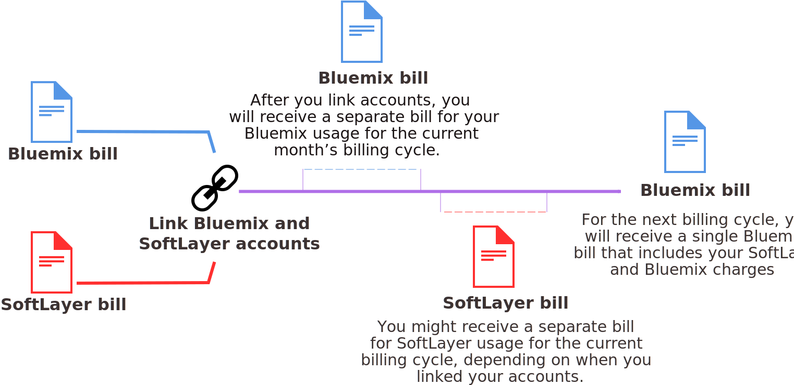

---

 

copyright:

  years: 2016

 

---

{:shortdesc: .shortdesc}
{:codeblock: .codeblock}
{:screen: .screen}
{:new_window: target="_blank"}

<!-- draft - staging only -->

#Linking SoftLayer and {{site.data.keyword.Bluemix_notm}} billing accounts
{: #softlayerlink}
*Last updated: 10 June 2016*

You can now link SoftLayer and {{site.data.keyword.Bluemix_notm}} billing accounts. When you link your accounts, you are billed through SoftLayer for both SoftLayer and {{site.data.keyword.Bluemix_notm}} resources. If you have an existing account, billing through SoftLayer for {{site.data.keyword.Bluemix_notm}} takes effect for the new billing cycle that starts after the accounts are linked.
{:shortdesc}

**Important:** All linked accounts in {{site.data.keyword.Bluemix_notm}} must be Pay-As-You-Go accounts. You can create a new Pay-As-You-Go account or link an existing Pay-As-You-Go account. Or, you can link an existing trial account, but it will be upgraded to a Pay-As-You-Go account.  

After your accounts are linked, you can still monitor the usage of your {{site.data.keyword.Bluemix_notm}} resources in the  {{site.data.keyword.Bluemix_notm}} user interface. However, the billing for these resources will now appear on the SoftLayer invoice.

Although your account billing will be linked and you will be able to switch between accounts easily, you'll still need to have separate IDs for {{site.data.keyword.Bluemix_notm}} and SoftLayer. Continue to use your SoftLayer ID for SoftLayer products and services and use your IBM id for {{site.data.keyword.Bluemix_notm}} products and services. 

**Attention:** After accounts are linked, they cannot be unlinked.  

If you have a SoftLayer account, and you want to link SoftLayer and {{site.data.keyword.Bluemix_notm}} accounts, complete these steps:
 1. From the {{site.data.keyword.slportal}}, click **Link a {{site.data.keyword.Bluemix_notm}} Account**. 
 2. Read and accept the terms for linking SoftLayer and {{site.data.keyword.Bluemix_notm}} accounts.
 3. When requested, provide the email address that is associated with your {{site.data.keyword.Bluemix_notm}} account. If you don't have a {{site.data.keyword.Bluemix_notm}} account, provide the email address that you want to use, then follow the instructions to be invited to {{site.data.keyword.Bluemix_notm}} and create an account.

You must be a Master User in the SoftLayer account to link accounts.

After you have linked your accounts, **Go to {{site.data.keyword.Bluemix_notm}}** is available in the SoftLayer global header. Clicking this link takes you to the {{site.data.keyword.Bluemix_notm}} login page. In addition, **SoftLayer** is now available in the {{site.data.keyword.Bluemix_notm}} header. Clicking the link takes you to the home page of the {{site.data.keyword.slportal}} in a new window.

## Credits for {{site.data.keyword.Bluemix_notm}} usage when accounts are linked
{: #slcredit}

When you link {{site.data.keyword.Bluemix_notm}} and SoftLayer billing accounts, you receive a $200.00 credit toward {{site.data.keyword.Bluemix_notm}} usage. The credit must be used within 30 days of linking the accounts.

For information about how to view the credits and expiration date, see [Viewing credits](https://console.ng.bluemix.net/docs/pricing/index.html#credits).

## Inviting SoftLayer team members to {{site.data.keyword.Bluemix_notm}}
{: #invite_users}

You can invite your SoftLayer team members to join {{site.data.keyword.Bluemix_notm}} when linking  {{site.data.keyword.Bluemix_notm}} and SoftLayer accounts. Or, you can invite SoftLayer team members later from the {{site.data.keyword.Bluemix_notm}} user interface.
{:shortdesc}

From the {{site.data.keyword.Bluemix_notm}} user interface, you can select to invite all members of your SoftLayer account or you can select individual members. When inviting team members, you must set the {{site.data.keyword.Bluemix_notm}} account role for the invitees. For more information about the different roles in {{site.data.keyword.Bluemix_notm}}, see [User roles](https://console.ng.bluemix.net/docs/admin/users_roles.html#userrolesinfo).

You must be a Master User in the SoftLayer account to invite team members to the {{site.data.keyword.Bluemix_notm}} account.

To invite team members through {{site.data.keyword.Bluemix_notm}}:
 1. Go to the **Account and Support** icon  > **Accounts** > **Invite Team Members**.
 2. Click **Add** to authenticate into your SoftLayer account and view a list of team members from your SoftLayer account.
 3. Select the team members to invite and click **Send**.

You can do this operation over and over as more team members are added to your Softlayer account.
 
The team member receives an email that includes a **Join the organization** link. If the member does not have an IBM id, the member is redirected to a registration page. Next, the member can enter some basic information and create their {{site.data.keyword.Bluemix_notm}} account.

For more information about inviting team members through the {{site.data.keyword.Bluemix_notm}} user interface, see [Inviting team members](https://console.ng.bluemix.net/docs/admin/users_roles.html#inviteteammembers).

## Using {{site.data.keyword.Bluemix_notm}} services with SoftLayer assets
{: #bluemix_services}

You can easily use API-based public {{site.data.keyword.Bluemix_notm}} services with your SoftLayer assets. All APIs are secure and encrypted so that your data is protected.
{:shortdesc}

For example, have you ever wanted to add cognitive capabilities from Watson to your apps running on bare metal servers from SoftLayer? You can add a service such as {{site.data.keyword.personalityinsightsshort}} to help understand your app's user in four easy steps:

1. Find the service in the {{site.data.keyword.Bluemix_notm}} catalog.
2. Provision an instance of the service with just a few clicks.
3. Set up the service to run with your existing code by copying the service credentials and adding them to your application.
4. After the update to the app, deploy the new version on your SoftLayer infrastructure.

You can gain *Insights and Cognitive* knowledge by calling Watson APIs from your apps in SoftLayer to make them more personalized. Or, use *Data and Analytics* services to tap into high performance analytics for your apps. Or, choose database-as-a-service where you can leave the management to {{site.data.keyword.Bluemix_notm}}.

Modernize your application development by using containers with services like {{site.data.keyword.activedeployshort}} and {{site.data.keyword.deliverypipeline}}. You can then use the {{site.data.keyword.vpn_short}} service to tunnel back to SoftLayer to connect your container in a private network to the SoftLayer private network. All of the usage charges of the compute resources and services are reflected in your SoftLayer bill. 

### API-based {{site.data.keyword.Bluemix_notm}} services
Not all {{site.data.keyword.Bluemix_notm}} services can be used with SoftLayer. The following services can be set up to run with your application code:
* {{site.data.keyword.alchemyapishort}}
* {{site.data.keyword.alertnotificationshort}}
* {{site.data.keyword.sparks}}
* {{site.data.keyword.appseccloudshort}}
* {{site.data.keyword.blockchain}}
* {{site.data.keyword.cloudant}}
* {{site.data.keyword.conceptinsightsshort}}
* {{site.data.keyword.iotmapinsights_short}}
* {{site.data.keyword.dashdbshort}}
* {{site.data.keyword.dialogshort}}
* {{site.data.keyword.documentconversionshort}}
* {{site.data.keyword.twittershort}}
* {{site.data.keyword.weather_short}}
* {{site.data.keyword.iotdriverinsights_short}}
* {{site.data.keyword.geospatialshort_Geospatial}}
* {{site.data.keyword.graphshort}}
* {{site.data.keyword.iotelectronics}}
* {{site.data.keyword.languagetranslationshort}}
* {{site.data.keyword.messagehub}}
* {{site.data.keyword.mqa}}
* {{site.data.keyword.mobileappbuilder_short}}
* {{site.data.keyword.mql}}
* {{site.data.keyword.nlclassifierlshort}}
* {{site.data.keyword.objectstorageshort}}
* {{site.data.keyword.personalityinsightsshort}}
* {{site.data.keyword.presenceinsightsshort}}
* {{site.data.keyword.relationshipextractionshort}}
* {{site.data.keyword.retrieveandrankshort}}
* {{site.data.keyword.servicediscoveryshort}}
* {{site.data.keyword.speechtotextshort}}
* {{site.data.keyword.sqldb}}
* {{site.data.keyword.streaminganalyticsshort}}
* {{site.data.keyword.texttospeechshort}}
* {{site.data.keyword.toneanalyzershort}}
* {{site.data.keyword.tradeoffanalyticsshort}}
* {{site.data.keyword.visualinsightsshort}}
* {{site.data.keyword.visualrecognitionshort}}
* {{site.data.keyword.workflow}}
* {{site.data.keyword.workloadscheduler}}

**Note:** Not all plans for these services are available. Only the plans enabled for Pay-As-You-Go accounts are available to use with linked accounts. However, you can use any plan for any of these services if you have a separate {{site.data.keyword.Bluemix_notm}} account that is billed separately.

## Billing for {{site.data.keyword.Bluemix_notm}} usage when accounts are linked
{: #bill_usage}

After you've linked your {{site.data.keyword.Bluemix_notm}} and SoftLayer billing accounts, the next billing cycle will be charged in a single SoftLayer bill.
{:shortdesc}

Your {{site.data.keyword.Bluemix_notm}} usage cycle is on a calendar month basis, so your account is billed each month on the first of the month. With SoftLayer, your usage cycle begins from when you started with SoftLayer, so you are billed each month on the same day of the month as when you signed up for your SoftLayer account. 

When your accounts are linked, your {{site.data.keyword.Bluemix_notm}} usage will continue to be measured for the current month's cycle, and you will be billed for that usage on a {{site.data.keyword.Bluemix_notm}} invoice. Starting on the first of the next month, your {{site.data.keyword.Bluemix_notm}} charges will be on your SoftLayer invoice.

For example, if you linked your accounts on April 16th, you will get a Bluemix invoice for your April usage. Your May usage will be billed through your SoftLayer account.

After your bills are combined, your SoftLayer invoice will have a **{{site.data.keyword.Bluemix_notm}}** section on the summary invoice. On the detailed billing view, {{site.data.keyword.Bluemix_notm}} charges will show as other services and begin with *"{{site.data.keyword.Bluemix_notm}} Plan..."*.

For information about how to view {{site.data.keyword.Bluemix_notm}} usage, see [Viewing usage details](https://console.ng.bluemix.net/docs/pricing/index.html#usage).

# rellinks
## general
* [Video: Link SoftLayer and Bluemix Accounts For a Single Invoice](https://www.youtube.com/watch?v=Xb01idt2NiU&index=1&list=PLzpeuWUENMK2d3L5qCITo2GQEt-7r0oqm)
