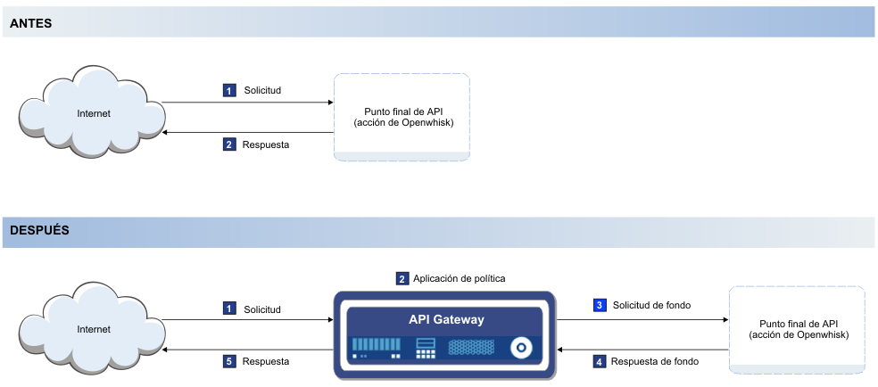

---

copyright:
  years: 2017
lastupdated: "2017-04-12"

---

{:new_window: target="_blank"}
{:shortdesc: .shortdesc}
{:screen: .screen}
{:codeblock: .codeblock}
{:pre: .pre}

# Visión general
{: #index}

Puede gestionar las API de forma nativa en {{site.data.keyword.Bluemix}} tanto si están asociadas a una acción de {{site.data.keyword.openwhisk_short}} como si forman parte de una lista de servicios integrados de {{site.data.keyword.Bluemix_notm}}, como el servicio {{site.data.keyword.appconserviceshort}}. La gestión de las API le permite controlar su uso, aumentar su adopción y realizar un seguimiento de sus estadísticas.

Tal como se muestra en el diagrama siguiente, la gestión de API funciona insertando una pasarela ligera y rápida frente a los puntos finales existentes en la nube. La pasarela, al que se denomina API Gateway en el diagrama, es la responsable de responder a las llamadas de API entrantes procedentes de las aplicaciones. API Gateway proporciona un conjunto completo de políticas de API relacionadas con la seguridad, la gestión de tráfico, la mediación, la aceleración, y el soporte de protocolos que no sean HTTP.

Cuando expone una API, la pone a disposición de otras personas para que la utilicen. Esto suele significar que se otorga a los usuarios de la API un acceso limitado a la información que se encuentra en los servidores que mantiene. Este acceso facilita el uso por parte del usuario final, ya que puede acceder a la información directamente desde la interfaz actual.

En ocasiones deseará controlar parte de la actividad realizada en sus servidores. Por ejemplo, si hay demasiadas solicitudes de API en un servidor durante un breve periodo de tiempo, es posible que el servidor se sobrecargue y se cierre. Para evitar situaciones como esta, puede gestionar la tasa de llamadas de API mediante la gestión de API. La pasarela ligera que esté conectada a la API realiza un seguimiento del número de llamadas e impone límites en cuanto al número de llamadas que acepta. La gestión de API también permite realizar un seguimiento del volumen de llamadas de API procedentes de un determinado origen mediante el registro de su clave de API. La clave de API es una serie de caracteres exclusiva que el equipo de desarrollo de API proporciona al equipo consumidor de las API y que permite al desarrollador de API supervisar estadísticas acerca de las llamadas que generan las solicitudes del equipo consumidor.   

Dispone de las siguientes características con la gestión de API de {{site.data.keyword.Bluemix_notm}}: 
## Análisis de API
{: #basic_analytics notoc}

Si desea supervisar el uso de las API, puede utilizar la característica de análisis para realizar un seguimiento del uso de llamadas. También puede supervisar el uso para comprender el uso de las API y poder tomar decisiones informadas sobre cómo actualizar las API para aumentar su adopción. 

Puede ver las siguientes estadísticas sobre las API:
* El número de respuestas y el tiempo medio de respuesta durante la última hora o durante el intervalo de tiempo que especifique. 
* El número de llamadas de API por minuto.
* Las 100 últimas respuestas.

## Limitación de la tasa por suscripción (clave de API)
{: #rate_limit notoc}

Puede imponer una tasa límite para gestionar el número de llamadas que pueden realizar las aplicaciones a las API. Puede especificar una tasa límite de modo que sólo se realicen el número de llamadas permitido por segundo, por minuto, por hora, de modo que, por ejemplo, el programa de fondo no se sobrecargue. Puede establecer este límite por API general o para cada clave de API. 

## OAuth
{: #oauth notoc}

Para detener el uso no deseado de los datos que proporciona, puede asegurarse de que solo los usuarios con la autenticación correcta puedan acceder a sus API. Puede controlar el acceso a sus API mediante el estándar de autorización OAuth. OAuth es un protocolo de autorización basado en señales que permite que sitios web o aplicaciones de terceros accedan a datos de usuario sin que el usuario tenga que compartir información personal. 

## CORS
{: #cors notoc}

CORS permite a scripts incorporados en una página web para realizar llamadas a la API entre límites de dominio. Esto beneficia al usuario de la API, ya que permite que la API recupere información de otro dominio cuando la API realiza una llamada. Si CORS no está habilitado, cualquier recuperación de contenido se limita al dominio en el que se encuentra la solicitud que la ha originado. Para obtener más información sobre CORS y sobre cómo implementarlo, consulte [Control de acceso HTTP (CORS) ](https://developer.mozilla.org/en-US/docs/Web/HTTP/Access_control_CORS.html){: new_window}.

## Opciones adicionales de gestión de API
{: #add_mgt_options notoc}

Estas características de gestión de API están disponibles en el separador Gestión de API de {{site.data.keyword.openwhisk_short}} o del panel de control de App Connect. Para soluciones de gestión más complejas, puede actualizar al servicio {{site.data.keyword.apiconnect_full}} completo para acceder a más características, como análisis detallado, estrategias de empaquetado de las API o un portal de desarrollador para socializar las API. Consulte [Iniciación a API Connect](https://console.ng.bluemix.net/docs/services/apiconnect/index.html){: new_window} para obtener más información sobre el servicio {{site.data.keyword.apiconnect_full}}. 

Para obtener más información sobre cómo actualizar las API que gestiona en {{site.data.keyword.Bluemix_notm}} al servicio {{site.data.keyword.apiconnect_short}}, consulte [Acceso a más características de gestión de API](upgrade.html).

