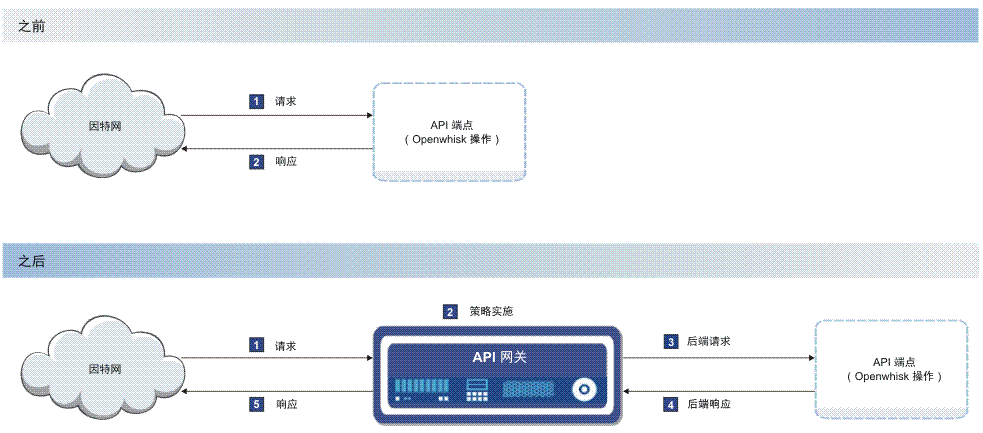

---

copyright:
  years: 2017
lastupdated: "2017-04-12"

---

{:new_window: target="_blank"}
{:shortdesc: .shortdesc}
{:screen: .screen}
{:codeblock: .codeblock}
{:pre: .pre}

# 概述
{: #index}

您可以在 {{site.data.keyword.Bluemix}} 中本机管理 API，不管这些 API 是与 {{site.data.keyword.openwhisk_short}} 操作相关联，还是与不断增长的集成 {{site.data.keyword.Bluemix_notm}} 服务（例如，{{site.data.keyword.appconserviceshort}} 服务）的列表相关联。通过管理 API，可以控制使用情况、提高采用率以及跟踪统计信息。

如下图中所示，API Management 通过在现有云端点前插入快速、轻量级的网关进行工作。网关（图中称为“API 网关”）负责响应来自应用程序的入局 API 调用。API 网关提供了一组综合 API 策略，用于支持安全性、流量管理、调解、加速和非 HTTP 协议。

公开 API 后，该 API 即可供其他人使用。这通常意味着给予 API 用户对您在服务器上所维护信息的有限访问权。此访问权允许最终用户直接从当前界面访问信息，从而为他们提供更无缝的客户体验。

有时您会希望控制服务器上的某些活动。例如，如果服务器上短时间内的 API 请求数太多，那么服务器会因超负荷而关闭。为了避免类似这样的情况，可以使用 API Management 来管理 API 调用速率。连接到 API 的轻量级网关可跟踪对 API 的调用数，并强制实施对其接受的调用数的限制。此外，API Management 还支持通过记录特定源的 API 密钥，跟踪来自该源的 API 调用量。API 密钥是 API 开发团队为 API 使用团队提供的唯一字符串，支持 API 开发者监视有关使用团队请求所生成的调用的统计信息。  

针对 {{site.data.keyword.Bluemix_notm}} API Management 提供了以下功能：
## API 分析
{: #basic_analytics notoc}

如果要对 API 的使用计算费用，可以使用分析功能来跟踪调用使用情况。您还可以监视使用情况来了解 API 的目前使用情况，以便可以就如何更新 API 来提高采用率进行知情决策。

可以查看有关 API 的以下统计信息：
* 最近 1 小时或指定时间间隔内的响应数和平均响应时间。
* 每分钟的 API 调用数。
* 最近 100 个响应。

## 按预订（API 密钥）限制速率
{: #rate_limit notoc}

可以强制实施速率限制，以管理应用程序可以对 API 发起的调用数。您可以指定速率限制，以便每秒、每分钟或每小时只发起允许数量的调用，这样可避免一些问题，例如后端不会超负荷。可以按总体 API 或按每个 API 密钥设置速率限制。

## OAuth
{: #oauth notoc}

要阻止不必要的使用您提供的数据，可以确保只有正确认证的用户才能访问您的 API。可以通过 OAuth 授权标准来控制对 API 的访问。OAuth 是基于令牌的授权协议，允许第三方 Web 站点或应用程序访问用户数据，而无需用户共享个人信息。

## CORS
{: #cors notoc}

CORS 允许 Web 页面中嵌入的脚本跨域边界调用 API。这对 API 用户十分有利，因为它允许 API 从其调用的其他域中检索信息。未启用 CORS 时，任何内容检索都限制为在其中发起请求的域。有关 CORS 以及如何实施 CORS 的更多信息，请参阅 [HTTP 访问控制 (CORS) ](https://developer.mozilla.org/en-US/docs/Web/HTTP/Access_control_CORS.html){: new_window}。

## 其他 API Management 选项
{: #add_mgt_options notoc}

API Management 的这些功能在 {{site.data.keyword.openwhisk_short}} 的 API Management 选项卡中或者在 App Connect 仪表板中提供。要获取更复杂的管理解决方案，可以升级到完整 {{site.data.keyword.apiconnect_full}} 服务来访问更多功能，例如详细分析、API 的包装策略或用于将 API 社交化的开发者门户网站。有关 {{site.data.keyword.apiconnect_full}} 服务的更多信息，请参阅 [Getting started with API Connect](https://console.ng.bluemix.net/docs/services/apiconnect/index.html){: new_window}。

有关将 {{site.data.keyword.Bluemix_notm}} 中管理的 API 升级到 {{site.data.keyword.apiconnect_short}} 服务的更多信息，请参阅[访问更多 API Management 功能](upgrade.html)。

