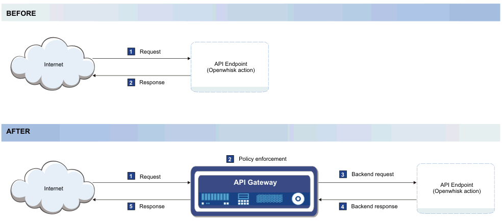

---

copyright:
  years: 2017
lastupdated: "2017-04-12"

---

{:new_window: target="_blank"}
{:shortdesc: .shortdesc}
{:screen: .screen}
{:codeblock: .codeblock}
{:pre: .pre}

# Übersicht
{: #index}

Sie können APIs nativ in {{site.data.keyword.Bluemix}} verwalten, und zwar unabhängig davon, ob sie einer {{site.data.keyword.openwhisk_short}}-Aktion oder einer anwachsenden Liste integrierter {{site.data.keyword.Bluemix_notm}}-Services wie dem {{site.data.keyword.appconserviceshort}}-Service zugeordnet sind. Durch Verwalten der APIs können Sie die Nutzung steuern, die Akzeptanz erhöhen und Statistiken verfolgen. 

Wie im folgenden Diagramm dargestellt, basiert die Funktion des API-Managements auf der Einfügung eines schnellen und schlanken Gateways, das vorhandenen Cloudendpunkten vorgeschaltet wird. Das Gateway, das im Diagramm als API-Gateway bezeichnet wird, ist dafür zuständig, auf eingehende API-Aufrufe von Anwendungen zu antworten. Das API-Gateway stellt einen umfassenden Satz von API-Richtlinien für die Sicherheit, das Datenverkehrsmanagement, die Mediation und die Beschleunigung sowie für die Unterstützung von anderen Protokollen als das HTTP-Protokoll bereit. 

Wenn Sie eine API offenlegen, machen Sie sie zur Verwendung durch andere Personen verfügbar. Dies bedeutet in vielen Fällen, dass Sie den Benutzern der API einen begrenzten Zugriff auf Informationen geben, die sich auf Servern befinden, die Sie pflegen. Dieser Zugriff ermöglicht eine nahtlosere Kundenerfahrung für die Endbenutzer, weil sie auf die Informationen direkt über die aktuelle Schnittstelle zugreifen können. 

Es gibt Umstände, unter denen es wünschenswert ist, einige der Aktivitäten auf den eigenen Servern zu steuern. Wenn zum Beispiel zu viele API-Anforderungen auf einem Server in kurzer Zeit eingehen, kann der Server überlastet und abgeschaltet werden. Zur Vermeidung einer solchen Situation können Sie die Rate der API-Aufrufe über das API-Management verwalten. Das schlanke Gateway, das der API angeschlossen wird, verfolgt die Anzahl der Aufrufe, die an Ihre API gerichtet sind, und setzt Begrenzungen für die Anzahl der Aufrufe um, die akzeptiert werden. Das API-Management ermöglicht außerdem durch Aufzeichnen des jeweiligen API-Schlüssels die Verfolgung des Volumens an API-Aufrufen aus einer bestimmten Quelle. Der API-Schlüssel ist eine eindeutige Zeichenfolge, die das API-Entwicklerteam für das API-Nutzerteam bereitstellt, die es dem API-Entwickler ermöglicht, Statistiken über die Aufrufe zu überwachen, die durch die Nutzerteamanforderungen generiert werden.   

Die folgenden Funktionen werden durch das {{site.data.keyword.Bluemix_notm}}-API-Management zur Verfügung gestellt: 
## API-Analyse
{: #basic_analytics notoc}

Wenn Sie die Verwendung Ihrer APIs zur Erzielung finanzieller Erträge nutzen möchten, können Sie die Analysefunktion zur Verfolgung der Aufrufnutzung verwenden. Sie können die Verwendung auch überwachen, um zu verstehen, wie Ihre APIs verwendet werden, sodass Sie fundierte Entscheidungen darüber treffen können, wie Ihre APIs zur Erhöhung der Akzeptanz aktualisiert werden sollen. 

Sie können die folgenden Statistiken für Ihre APIs anzeigen: 
* Die Anzahl der Antworten und die durchschnittliche Antwortzeit der letzten Stunde oder des von Ihnen angegebenen Zeitintervalls. 
* Die Anzahl der API-Aufrufe pro Minute. 
* Die letzten 100 Antworten. 

## Ratenbegrenzung nach Abonnement (API-Schlüssel)
{: #rate_limit notoc}

Sie können eine Ratenbegrenzung festlegen, um die Anzahl von Aufrufen zu verwalten, die Anwendungen an Ihre APIs richten können. Sie können eine Ratenbegrenzung so angeben, dass zum Beispiel nur die zugelassene Anzahl von Aufrufen pro Sekunde, Minute oder Stunde ausgeführt werden kann, sodass Ihr Back-End nicht überlastet wird. Sie können dies entweder allgemein nach API oder für einzelne API-Schlüssel festlegen. 

## OAuth
{: #oauth notoc}

Um eine unerwünschte Nutzung der Datei, die Sie bereitstellen, zu verhindern, können Sie sicherstellen, dass nur Benutzer mit der richtigen Authentifizierung auf Ihre APIs zugreifen können. Sie können den Zugriff auf Ihre APIs durch den OAuth-Autorisierungsstandard steuern. OAuth ist ein tokenbasiertes Berechtigungsprotokoll, dass es Websites oder Anwendungen von Drittanbietern erlaubt, auf Benutzerdaten zuzugreifen, ohne dass der Benutzer persönliche Daten mitteilen muss. 

## CORS
{: #cors notoc}

CORS ermöglicht es eingebetteten Scripts einer Webseite, die API über Domänengrenzen hinweg aufzurufen. Dies ist für den Benutzer der API von Vorteil, weil die API die Informationen aus einer anderen Domäne abrufen kann, wenn sie von der API aufgerufen wird. Ohne Aktivierung von CORS ist jeder Abruf von Inhalten auf die Domäne beschränkt, aus der die Anforderung erfolgt. Weitere Informationen zu CORS und zur Implementierung von CORS finden Sie unter [HTTP Access Control (CORS) ](https://developer.mozilla.org/en-US/docs/Web/HTTP/Access_control_CORS.html){: new_window}. 

## Zusätzliche Optionen für das API-Management
{: #add_mgt_options notoc}

Diese Funktionen für das API-Management stehen auf der Registerkarte 'API Management' Ihres {{site.data.keyword.openwhisk_short}}- oder App Connect-Dashboards zur Verfügung. Wenn Sie komplexere Managementlösungen bevorzugen, können Sie ein Upgrade auf den vollen {{site.data.keyword.apiconnect_full}}-Service durchführen, um Zugriff auf weitere Funktionen zu erhalten, wie zum Beispiel detaillierte Analysen, Paketierungsstrategien für Ihre APIs oder ein Entwicklerportal für den Austausch von APIs und zugehörigen Informationen. Weitere Informationen zum {{site.data.keyword.apiconnect_full}}-Service finden Sie in der [Einführung in API Connect](https://console.ng.bluemix.net/docs/services/apiconnect/index.html){: new_window}. 

Weitere Informationen zum Upgrade Ihrer APIs, die Sie in {{site.data.keyword.Bluemix_notm}} verwalten, auf den {{site.data.keyword.apiconnect_short}}-Service finden Sie in [Auf weitere API-Managementfunktionen zugreifen](upgrade.html). 

