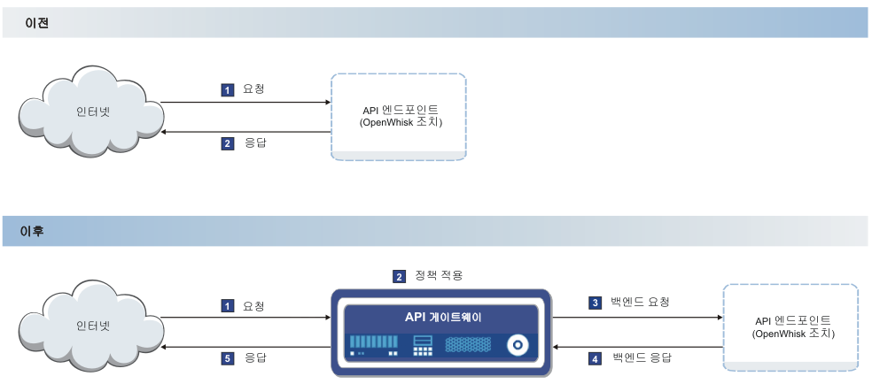

---

copyright:
  years: 2017
lastupdated: "2017-04-12"

---

{:new_window: target="_blank"}
{:shortdesc: .shortdesc}
{:screen: .screen}
{:codeblock: .codeblock}
{:pre: .pre}

# 개요
{: #index}

{{site.data.keyword.openwhisk_short}} 조치와 연관되었는지 아니면 통합된 {{site.data.keyword.Bluemix_notm}} 서비스(예: {{site.data.keyword.appconserviceshort}} 서비스)의 증가하는 목록과 연관되었는지에 관계없이 기본적으로 {{site.data.keyword.Bluemix}}에서 API를 관리할 수 있습니다. API를 관리하면 사용량을 제어하고 채택을 늘리고 통계를 추적할 수 있습니다.

다음 다이어그램에 표시된 대로 기존 클라우드 엔드포인트 앞에 빠른 경량 게이트웨이를 삽입하여 API Management가 작동됩니다. 다이어그램에서 API 게이트웨이라고 하는 게이트웨이는 애플리케이션의 수신 API 호출에 응답해야 합니다. API 게이트웨이는 보안, 트래픽 관리, 중개, 가속화 및 비HTTP 프로토콜 지원을 위한 종합 API 정책 세트를 제공합니다.

API를 표시하면 다른 사용자들이 이 API를 사용할 수 있습니다. 즉, 유지보수하는 서버에 있는 정보에 대한 API 제한 액세스 권한을 사용자에게 제공합니다. 이러한 액세스 권한을 통해 일반 사용자가 현재 인터페이스에서 직접 정보에 액세스할 수 있으므로 고객에게 보다 완벽한 경험이 제공됩니다.

서버의 일부 활동을 제어할 때가 있습니다. 예를 들어, 짧은 시간 동안 서버에 너무 많은 API 요청이 있는 경우 서버가 과부하되어 종료될 수 있습니다. 이러한 상황을 방지하기 위해 API Management를 사용하여 API 호출 속도를 관리할 수 있습니다. API에 접속된 경량 게이트웨이가 API에 대한 호출 수를 추적하고 허용하는 호출 수에 한계를 적용합니다. 또한 API Management를 통해 API 키를 기록하여 특정 소스에서 API 호출의 볼륨을 추적할 수 있습니다. API 키는 API 개발자가 이용 중인 팀 요청이 생성하는 호출에 대한 통계를 모니터할 수 있는 API 이용 팀에 API 개발 팀이 제공하는 고유 문자열입니다.  

다음 기능은 {{site.data.keyword.Bluemix_notm}} API Management에 사용할 수 있습니다.
## API 분석
{: #basic_analytics notoc}

API 사용을 수익화하려는 경우, 분석 기능을 사용하여 호출 사용을 추적할 수 있습니다. 또한 API를 업데이트하여 채택을 늘리는 방법을 결정할 수 있도록 사용을 모니터하여 API를 사용하는 방법을 파악할 수 있습니다.

API에 대한 다음 통계를 볼 수 있습니다.
* 지정된 시간 간격 또는 마지막 시간의 응답 수와 평균 응답 시간입니다.
* 분당 API 호출 수입니다.
* 마지막 100개의 응답입니다.

## 구독(API 키)에 의한 비율 제한
{: #rate_limit notoc}

비율 한계를 적용하여 애플리케이션이 API에 대해 수행할 수 있는 호출 수를 관리할 수 있습니다. 허용된 수의 호출만 초, 분, 시간마다 수행되도록(예: 백엔드가 과부하되지 않도록) 비율 한계를 지정할 수 있습니다. 전체 API 또는 각 API 키로 이를 설정할 수 있습니다.

## OAuth
{: #oauth notoc}

제공하는 데이터의 불필요한 사용을 중지하려면 올바른 인증의 사용자만 API에 액세스할 수 있도록 합니다. OAuth 권한 표준을 통해 API에 대한 액세스를 제어할 수 있습니다. OAuth는 개인 정보를 공유하도록 사용자에게 요구하지 않고 써드파티 웹 사이트 또는 애플리케이션이 사용자 데이터에 액세스하도록 허용하는 토큰 기반 권한 부여 프로토콜입니다.

## CORS
{: #cors notoc}

CORS는 웹 페이지의 임베디드 스크립트가 도메인 경계의 API를 호출하도록 합니다. 이렇게 하면 API를 통해 호출 시 API가 다른 도메인에서 정보를 검색할 수 있으므로 API의 사용자에게 유용합니다. CORS를 사용하지 않는 경우 컨텐츠 검색이 원래 요청과 동일한 도메인으로 제한됩니다. CORS 및 구현 방법에 대한 자세한 정보는 [HTTP 액세스 제어(CORS) ](https://developer.mozilla.org/en-US/docs/Web/HTTP/Access_control_CORS.html){: new_window}를 참조하십시오.

## 추가 API Management 옵션
{: #add_mgt_options notoc}

API Management를 위한 이러한 기능은 {{site.data.keyword.openwhisk_short}} 또는 앱 연결 대시보드의 API Management 탭에서 사용 가능합니다. 복잡한 관리 솔루션을 보기 위해 전체 {{site.data.keyword.apiconnect_full}} 서비스로 업그레이드하여 상세 분석, API의 패키징 전략 또는 API를 소셜화하는 개발자 포털과 같은 추가 기능에 액세스할 수 있습니다. {{site.data.keyword.apiconnect_full}} 서비스에 대한 자세한 정보는 [Getting started with API Connect](https://console.ng.bluemix.net/docs/services/apiconnect/index.html){: new_window}를 참조하십시오.

{{site.data.keyword.Bluemix_notm}}에서 관리하는 API를 {{site.data.keyword.apiconnect_short}} 서비스로 업그레이드하는 방법에 대한 자세한 정보는 [추가 API Management 기능에 액세스](upgrade.html)를 참조하십시오.

