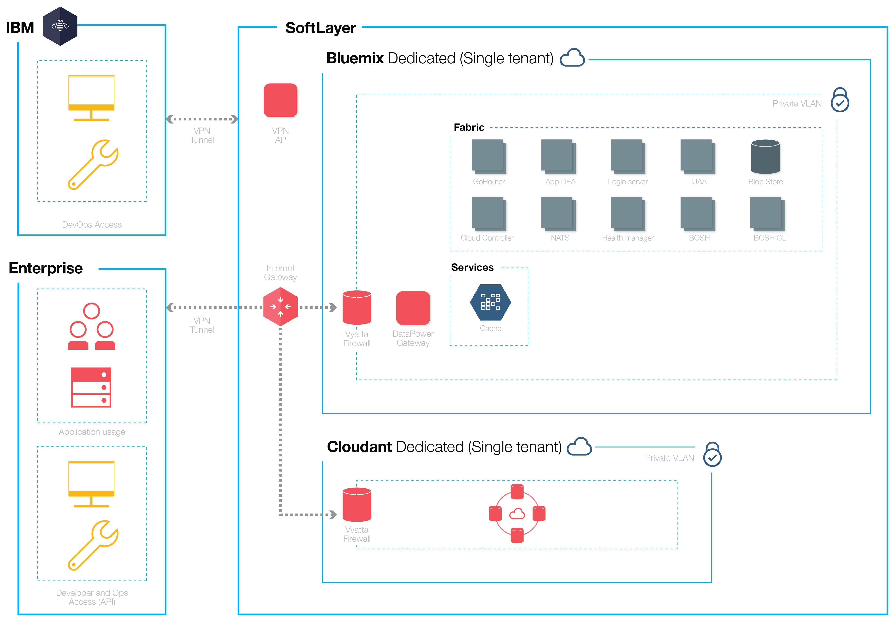

{:new_window: target="_blank"} 
{:shortdesc: .shortdesc}

#{{site.data.keyword.Bluemix_notm}} Dedicated
{: #dedicated}

*Last updated: 15 October 2015*

{{site.data.keyword.Bluemix}} is an open-standards, cloud-based platform for building, running, and managing applications. With {{site.data.keyword.Bluemix_notm}} Dedicated, you get the power and simplicity of {{site.data.keyword.Bluemix_notm}}—in your own dedicated SoftLayer environment that’s securely connected to both the {{site.data.keyword.Bluemix_notm}} Public environment and your own network.
{:shortdesc}

{{site.data.keyword.Bluemix_notm}} Dedicated includes a private catalog that displays the dedicated services that are available exclusively to you. It also includes additional services that are syndicated from and available for you to use from {{site.data.keyword.Bluemix_notm}} Public.

{{site.data.keyword.Bluemix_notm}} Dedicated is built on SoftLayer so that you have the highest performing cloud infrastructure available to you. Each data center has 24 hour, 7 days a week security, and rigorous controls. You and IBM access your {{site.data.keyword.Bluemix_notm}} dedicated instance through a VPN tunnel and a private VLAN.

*Figure 1. Detailed {{site.data.keyword.Bluemix_notm}} Dedicated diagram*

{{site.data.keyword.Bluemix_notm}} Dedicated environments have the same security standards as the public {{site.data.keyword.Bluemix_notm}} in terms of infrastructure, operational, and physical security. However, developer access to the dedicated {{site.data.keyword.Bluemix_notm}} is controlled by your LDAP policies, which can be configured by the {{site.data.keyword.Bluemix_notm}} team when they set up your environment. Within the dedicated environment, you can manage user roles and permissions. See [Managing users and permissions](../admin/index.html#oc_useradmin) for details.

{{site.data.keyword.Bluemix_notm}} Dedicated comes with all included {{site.data.keyword.Bluemix_notm}} runtimes and 128 GB of application memory.

In addition, there is a set of included services by default and optional ones that you can choose for your dedicated instance. 

| **Type**        | **Name**            | **Description** |      
|-----------------|-------------------|-------------------|
| Included | {{site.data.keyword.autoscaling}} | Dynamically increase or decrease the compute capacity of your application based on policies. With this service, you have unlimited use in your {{site.data.keyword.Bluemix_notm}} Dedicated environment. |
| Included | {{site.data.keyword.datacshort}} | This service provides an in-memory data grid that supports distributed caching scenarios for your apps. Includes 50 GB of in-memory Cache. |
| Included | {{site.data.keyword.cloudant}} | IBM’s NoSQL database that provides a high performance JSON data layer (compatible with CouchDB). Includes 1.6 TB and up to 3,000 API requests per second. |
| Optional | {{site.data.keyword.sqldb}} | IBM {{site.data.keyword.sqldbfull}} Database for {{site.data.keyword.Bluemix_notm}} adds a fully provisioned relational database to your application. {{site.data.keyword.sqldb}} provides a managed database to handle the demanding web and transactional workloads of your business. |
| Optional | {{site.data.keyword.mql}} | IBM {{site.data.keyword.mqlfull}} for {{site.data.keyword.Bluemix_notm}} is a cloud-based messaging service that provides flexible and easy to use messaging for {{site.data.keyword.Bluemix_notm}} apps. {{site.data.keyword.mql}} provides an administration-light solution to messaging. You can use {{site.data.keyword.mql}} to make your apps more responsive and scalable, and you can share and offload work between apps with a simple, powerful API. |
| Optional | {{site.data.keyword.dashdbshort}} | Use dashDB to store relational data, including special types such as geospatial data. Then analyze that data with SQL or advanced built-in analytics like predictive analytics and data mining, analytics with R, and geospatial analytics. |

*Table 1. Dedicated Services*

##Setting up {{site.data.keyword.Bluemix_notm}} Dedicated
{: #setupdedicated}

{{site.data.keyword.Bluemix_notm}} Dedicated is designed to provide a private version of the {{site.data.keyword.Bluemix_notm}} Public offering. You can use {{site.data.keyword.Bluemix_notm}} services and runtimes to support your computing needs in an IBM-hosted SoftLayer account.

IBM provides you access to {{site.data.keyword.Bluemix_notm}} Dedicated by using a password-secured login. You can access the services, runtimes, and associated resources, and deploy and remove {{site.data.keyword.Bluemix_notm}} apps. IBM takes advantage of multiple SoftLayer locations to deliver {{site.data.keyword.Bluemix_notm}} Dedicated, so you can get your private version in a location close to you.

To set up your private version of {{site.data.keyword.Bluemix_notm}}:

<ol>
<li>Contact your IBM designated account representative or contact [{{site.data.keyword.Bluemix_notm}} sales](https://console.ng.bluemix.net/#/contactUs/cloudOEPaneId=contactUs){: new_window} to get started.</li>
<li>The monthly recurring fee is based on the dedicated services that you want to use, plus a subscription to all {{site.data.keyword.Bluemix_notm}} public services. You then receive an invoice for anything that you use beyond that subscription agreement.
<ol type="a">
	<li>Work with IBM on your fee for your {{site.data.keyword.Bluemix_notm}} Dedicated instance.
	The monthly recurring fee is based on the dedicated services that you want to use, plus a subscription to all {{site.data.keyword.Bluemix_notm}} public services. You then receive an invoice for anything that you use beyond that subscription agreement.</li>
	<li>Identify the deadlines for each phase of setting up your {{site.data.keyword.Bluemix_notm}} Dedicated instance.</li>
	</ol>
	</li>
<li>You select the [SoftLayer data center location](https://www.softlayer.com/data-centers){: new_window} for your dedicated instance. Then, your dedicated platform and account are created. For your account, you identify the people in your organization for the roles that are needed to get your dedicated instance up and running. For each role, there is a corresponding IBM representative. 

Customer roles:

<dl>
<dt>**Procurement focal**</dt>
<dd>Works with the IBM representative on establishing your {{site.data.keyword.Bluemix_notm}} Dedicated environment, including identifying the right people in your organization to work on any aspect of the project. This role oversees pattern selection, commercial arrangements, and arrangement of access to customer resources. The procurement focal is the overall contact for setting up the dedicated instance.</dd>
<dt>**Compliance officer**</dt>
<dd>Works with the IBM representative to select a topology and deployment option that meets your security requirements. This role works with the IBM compliance consultant to determine which deployment patterns acheive the compliance goals and objectives.</dd>
<dt>**Network Specialist**</dt>
<dd>Works with the IBM representative on the network plans for the {{site.data.keyword.Bluemix_notm}} deployment. This role provides the requirements to the IBM representative and works together on an implementation plan. At the end of the installation and verification phase, this role will "sign-off" that the network configuration is in compliance with corporate standards.</dd>	
<dt>**DevOps focal**</dt>
<dd>Works with the IBM representative to plan and apply the maintenance updates that are needed for the {{site.data.keyword.Bluemix_notm}} platform, services, and runtimes. This role also works with the IBM representative on the configuration of your {{site.data.keyword.Bluemix_notm}} Dedicated instance.</dd>
</dl>

IBM roles:

<dl>
<dt>**IBM provisioning manager**</dt>
<dd>Works with the customer procurement focal to establish the customer environment.</dd>
<dt>**IBM compliance consultant**</dt>
<dd>Works with the customer compliance officer to select a topology and deployment option that meets your security requirements.</dd>
<dt>**IBM network specialist**</dt>
<dd>Works with the customer network specialist to establish the network plans for the deployment. This role works with the customer to collect requirements, and create an implementation plan. This role also performs automated tests to verify the physical result of the implementation plan.</dd>	
<dt>**IBM DevOps focal**</dt>
<dd>Works with the customer DevOps focal on installation and ongoing maintenance of the deployment topology. This role works with the customer to plan and perform the updates needed for the platform and services.</dd>
</dl>
</li>
<li>Define and establish network connectivity between your corporate network and your {{site.data.keyword.Bluemix_notm}} Dedicated instance.
<ol type="a">
	<li>IBM installs monitoring and security infrastructure for the dedicated instance.</li>
	<li>IBM installs the single tenant dedicated services that you selected.</li>
	<li>You provide network configuration and endpoints for things such as IP addresses or firewalls and access to your LDAP for integration into {{site.data.keyword.Bluemix_notm}}.</li>
</ol>
</li>
<li>Identify and assign roles for your administrative team of the environment.
<ol type="a">
	<li>IBM configures network access and LDAP based on what you provided. Administrative access is given to the contacts that you designate. You must also designate a contact for support and billing. </li>
	<li>IBM sets up a syndicated catalog in your dedicated environment to show your dedicated services and many of the public {{site.data.keyword.Bluemix_notm}} services.</li>
	<li>You validate network and firewall configuration and the LDAP endpoint and access.</li>
</ol>
</li>
</ol>

##Maintaining your dedicated instance
{: #maintaindedicated}

IBM maintains and installs updates and fixes as IBM deems appropriate to the {{site.data.keyword.Bluemix_notm}} Dedicated platform, runtimes, and services.

**Important**: IBM reserves the right to interrupt services to apply emergency maintenance as needed. IBM might change scheduled maintenance hours, but will notify you of any such changes, as well as any emergency maintenance information.

The following types of maintenance are required for {{site.data.keyword.Bluemix_notm}} Dedicated:
<dl>
<dt>**Standard Maintenance Windows**</dt>
<dd>The services utilize pre-defined, standard maintenance windows, which might cause the services to be unavailable. IBM does not require customer approval to perform maintenance, but attempts to minimize impact to your services. 
 
IBM sends broadcast messages of the changes that are planned for each maintenance window, through email, phone, or other methods. 
 
**Important**: Some service might not be available to you during the maintenance period.</dd>

<dt>**Monthly Change Window**</dt>
<dd>The monthly maintenance window is applied based on coordination between you and IBM within a 21-day window. You can provide IBM with specific dates or times within the 21-day window that might not work for you. IBM attempts to schedule updates around those times. Based on the requests, IBM communicates the scheduled maintenance window to you. Monthly change windows are not expected to impact the running Bluemix Dedicated environment. 
 
**Note:** If you do not request a specific time for the update, the maintenance is automatically applied at the end of the window. 
 
Go to **ADMINISTRATION > SYSTEM INFORMATION** to view pending updates, set unavailable dates, and approve updates. For more information about notifications and scheduling pending updates, see [Viewing system information](../admin/index.html#oc_system).</dd>
	
<dt>**Other**</dt>
<dd>IBM intends to confine all maintenance that might affect your services, in particular the availability of your {{site.data.keyword.Bluemix_notm}} Dedicated environment, runtimes, and services, to the standard and monthly updates. Other change windows might be used on an exception basis for management of the environment. IBM will make reasonable efforts to minimize the impact to you during such change windows and will notify you in advance.</dd>
</dl>

To set up maintenance of your dedicated instance, work with your IBM designated account representative to identify an agreed up on window for the standard maintenance.
