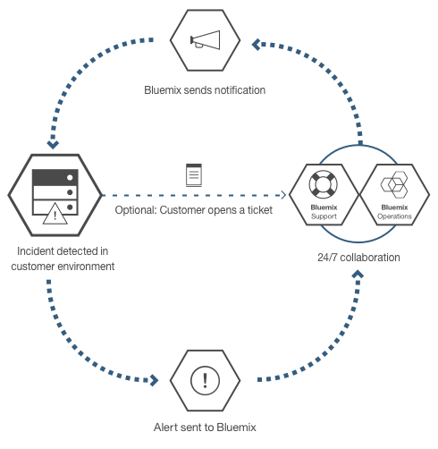

---

copyright:

  years: 2015, 2017

lastupdated: "2017-05-31"

---

{:shortdesc: .shortdesc}

# {{site.data.keyword.Bluemix_dedicated_notm}}
{: #dedicated}

{{site.data.keyword.Bluemix}} is an open-standards, cloud-based platform for building, running, and managing applications. With {{site.data.keyword.Bluemix_dedicated_notm}}, you get the power and simplicity of {{site.data.keyword.Bluemix_notm}}&mdash;in your own dedicated SoftLayer environment that is securely connected to both the {{site.data.keyword.Bluemix_notm}} Public environment and your own network.
{:shortdesc}

All dedicated deployments of {{site.data.keyword.Bluemix_notm}} include the following benefits and features at no additional cost: VPN, private virtual local area network (VLAN), firewall, connectivity with your LDAP, ability to leverage existing on-premises databases and apps, 24/7 on-site security, dedicated hardware, and standard support.

By default, access to your private {{site.data.keyword.Bluemix_notm}} instance is only accessible from your corporate network. If you need the {{site.data.keyword.Bluemix_notm}} environment to be accessible directly from the internet, a mobile device, or a dedicated database, for example, then an additional network security component is required at additional cost.

{{site.data.keyword.Bluemix_dedicated_notm}} comes with all included {{site.data.keyword.Bluemix_notm}} runtimes and 64 GB of compute resources memory.

In addition, there is a set of services and components that are included or optional for purchase. Review the following table to see what is included and what you can purchase optionally.

| **Type**        | **Name**            | **Description** |
|-----------------|-------------------|-------------------|
|Included | [{{site.data.keyword.Bluemix_notm}} runtimes](/docs/cfapps/runtimes.html) | Use runtimes to get your app up and running quickly, with no need to set up and manage machines and operating systems. All {{site.data.keyword.Bluemix_notm}} runtimes are available for you to use in your {{site.data.keyword.Bluemix_dedicated_notm}} instance.|
| Included | [{{site.data.keyword.autoscaling}}](/docs/services/Auto-Scaling/index.html) | Dynamically increase or decrease the compute capacity of your application based on policies. With this service, you have unlimited use in your {{site.data.keyword.Bluemix_dedicated_notm}} environment. Note: Auto-scaling currently only works with Cloud Foundry runtimes |
|Optional | [{{site.data.keyword.apiconnect_short}}](/docs/services/apiconnect/index.html) | {{site.data.keyword.apiconnect_long}} integrates {{site.data.keyword.APIM}} and IBM StrongLoop into a single offering that provides a comprehensive solution to create, run, manage, and enforce APIs and microservices. |
|Optional | [{{site.data.keyword.rules_short}}](/docs/services/rules/rules.html) | {{site.data.keyword.rules_short}} offers a comprehensive environment to automate and execute frequently occurring, repeatable rules-based business decisions. It also enables business users or developers to quickly model decisions and test them at lower costs by reducing the need for IT skills. |
|Optional | [{{site.data.keyword.cloudant}}](/docs/services/Cloudant/index.html#Cloudant) | {{site.data.keyword.cloudant}} provides access to a fully managed NoSQL JSON data layer that's always on. This service is compatible with CouchDB, and accessible through a simple to use HTTP interface for mobile and web application models. |
|Optional | [{{site.data.keyword.containershort}}](/docs/containers/container_index.html) | Run Docker containers on {{site.data.keyword.Bluemix_dedicated_notm}}. Containers are virtual software objects that include all of the elements that an app needs to run. A container has the benefits of resource isolation and allocation, but is more portable and efficient than, for example, a virtual machine. For information about the hardware requirements, see [IBM {{site.data.keyword.containershort}} in {{site.data.keyword.Bluemix_dedicated_notm}} and Bluemix Local](/docs/containers/container_ov.html#container_dl).|
| Optional | [{{site.data.keyword.contdelivery_short}}](/docs/services/ContinuousDelivery/index.html) | Use {{site.data.keyword.contdelivery_short}} Dedicated to automate builds, unit tests, deployments, and more. Edit and push code through the rich web based IDE. Create toolchains to enable tool integrations that support development, deployment, and operations tasks. |
| Optional | [{{site.data.keyword.dashdbshort}}](/docs/services/dashDB/dashDB.html) | IBM {{site.data.keyword.dashdbshort}} for Analytics is a fully managed SQL cloud database service, optimized for data warehouse and analytics workloads. IBM {{site.data.keyword.dashdbshort}} for Transactions is a fully managed SQL cloud database service, optimized for general purpose, web apps, and transactional workloads. |
| Optional | [{{site.data.keyword.datacshort}}](/docs/services/DataCache/index.html#data_cache) | This service provides an in-memory data grid that supports distributed caching scenarios for your apps. Includes 50 GB of in-memory Cache. |
| Optional | [Dedicated GitHub Enterprise](/docs/services/ghededicated/index.html) | {{site.data.keyword.ghe_long}} is the IBM Cloud-hosted and fully managed version of GitHub Enterprise that provides the social experience that developers love. This service is currently available exclusively to {{site.data.keyword.Bluemix_dedicated_notm}} environments. |
| Optional (Beta) | [Logging](/docs/monitoringandlogging/cfapps_ml_logs_dedicated_ov.html#container_ml_logs_dedicated_ov) | Provides logs for your Cloud Foundry apps in your {{site.data.keyword.Bluemix_notm}} user interface and searchable logs and dashboards in Kibana. |
| Optional | [{{site.data.keyword.messagehub}}](/docs/services/MessageHub/index.html#messagehub) | {{site.data.keyword.messagehub}} is a scalable, distributed, high throughput message bus to unite your on-premises and off-premises technologies. {{site.data.keyword.messagehub}} is based on Apache Kafka, which is a fast, scalable, and durable real-time messaging engine. |
|Optional | [{{site.data.keyword.mobilepushshort}}](/docs/services/mobilepush/index.html) | {{site.data.keyword.mobilepushshort}} is a service that you can use to send notifications to iOS and Android device. Notifications can be targeted to all application users or to a specific set of users and devices using tags. You can administer devices, tags, and subscriptions. You can also use an SDK (software development kit) and Representational State Transfer (REST) application program interface (APIs) to further develop your client applications.|
|Optional | [{{site.data.keyword.SecureGateway}}](/docs/services/SecureGateway/secure_gateway.html) | The {{site.data.keyword.SecureGateway}} service provides a secure way to connect {{site.data.keyword.Bluemix_notm}} applications to remote locations on-premises or in the cloud.  |
|Optional | [{{site.data.keyword.sescashort}}](/docs/services/SessionCache/index.html#session_cache) | For increased redundancy, {{site.data.keyword.sescashort}} provides a replica of a session stored in the cache. Therefore, in the event of a brownout or outage, your client application maintains access to the session in the cache. The service supports session caching scenarios for web and mobile applications. |
| Optional | [{{site.data.keyword.iot_short}}](/docs/services/IoT/index.html) | This service lets your apps communicate with and consume data collected by your connected devices, sensors and gateways. The base offering permits running a private version of the {{site.data.keyword.iot_short}} within the dedicated environment with a capacity of 100,000 concurrently connected devices or applications and 1.6 TB of data exchange. |
| Optional | [{{site.data.keyword.appserver_short}}](/docs/services/ApplicationServeronCloud/index.html) | IBM {{site.data.keyword.appserver_short}} for IBM {{site.data.keyword.Bluemix_notm}} is a service that facilitates quick setup on a pre-configured {{site.data.keyword.appserver_short}} Liberty, Traditional Network Deployment, or Traditional WebSphere Java EE instance in a hosted cloud environment on {{site.data.keyword.Bluemix_notm}}. |
{: caption="Table 1. Dedicated Services" caption-side="top"}
{: #table01}

There are optional components that are available for you to purchase to scale and extend the capacity of your resources and services. You can purchase any of these components by contacting the sales team; go to [Contact us](https://console.ng.bluemix.net/?direct=classic/#/contactUs/cloudOEPaneId=contactUs) for information about contacting a sales representative. To increase your plan for a service, you can select the plan from the service tile in your catalog.

| **Name**            | **Description** |
|-------------------|-------------------|
|Dedicated {{site.data.keyword.apiconnect_short}} Professional 5 Million API Calls | An environment that permits running a private version of {{site.data.keyword.apiconnect_short}} within the dedicated environment with a capacity of 5 million API Calls a month targeted towards departmental API projects. |
|Dedicated {{site.data.keyword.apiconnect_short}} Professional 100 thousand API Calls increase | An extension of the {{site.data.keyword.apiconnect_short}} Professional environment to provide additional capacity of 100 thousand API Calls a month. |
|Dedicated {{site.data.keyword.apiconnect_short}} Enterprise 25 Million API Calls | An environment that permits running a private version of {{site.data.keyword.apiconnect_short}} within the dedicated environment with a capacity of 25 million API Calls a month targeted towards enterprise wide API projects. |
|Dedicated {{site.data.keyword.apiconnect_short}} Enterprise 100 thousand API Calls increase | An extension of the {{site.data.keyword.apiconnect_short}} Enterprise environment to provide additional capacity of 100 thousand API Calls a month. |
|IBM {{site.data.keyword.Bluemix_dedicated_notm}} {{site.data.keyword.rules_short}} 1 Million Rules Decisions | A Rules Decision is the outcome of invoking a ruleset from a rule execution server. Sufficient entitlements must be obtained to cover the total number of Rules Decisions, rounded up to the nearest Million, executed or processed, during the billing period. The Rules Decisions measured by this Cloud Service are the calls made to the rule execution server to get a decision. Dedicated deployments of the Cloud Service have an agreed capacity measured by the relevant charge metric. The {{site.data.keyword.rules_short}} service default space allocation on the {{site.data.keyword.Bluemix_dedicated_notm}} platform is 16 GB, from which up to ten instances of 1 GB each can be invoked to execute entitled Rules Decisions. If you exceed that usage limitation, you must purchase additional capacity to cover that usage. |
|Dedicated {{site.data.keyword.cloudant}}  1.6 TB capacity increase | Includes running a private version of the {{site.data.keyword.cloudantfull}} within the dedicated environment with a design capacity of 1.6 terabytes.  |
|Dedicated {{site.data.keyword.datacshort}} and {{site.data.keyword.sescashort}} 50 GB capacity increase | An environment that permits deploying and running {{site.data.keyword.datacshort}} and {{site.data.keyword.sescashort}} instances up to a cumulative capacity of 50 GB. |
|{{site.data.keyword.contdelivery_short}} Dedicated Instance | A private version of {{site.data.keyword.contdelivery_short}} running within a dedicated environment. The capacity is determined by {{site.data.keyword.contdelivery_short}} Dedicated Authorized User entitlements. |
|{{site.data.keyword.contdelivery_short}} Dedicated Authorized User | Grants an Authorized User access to and for the use of a designated {{site.data.keyword.contdelivery_short}} Dedicated environment. Every user belonging to a {{site.data.keyword.Bluemix_notm}} Organization containing a {{site.data.keyword.contdelivery_short}} service instance must be authorized. |
|Dedicated {{site.data.keyword.dashdbshort}} Enterprise 64.1 | One database per service instance on a dedicated server with 64 GB RAM, 16 vCPUs. Recommended for up to 1 TB of pre-load data, based on typical compression.  |
|Dedicated {{site.data.keyword.dashdbshort}} Enterprise 256.4 | One database per service instance on a dedicated bare metal server with 256 GB RAM, 32 cores. Recommended for up to 4 TB of pre-load data, based on typical compression. |
|Dedicated {{site.data.keyword.dashdbshort}} Enterprise 256.12  | One database per service instance on a dedicated bare metal server with 256 GB RAM, 32 Cores. Recommended for up to 12 TB of pre-load data, based on typical compression. This is a storage dense plan suitable for environments where data volumes are higher and queries do not need to run at in-memory speeds. |
|IBM {{site.data.keyword.Bluemix_dedicated_notm}} {{site.data.keyword.dashdbshort}} Enterprise for Transactions 2.8.500 | Dedicated instance supporting Online Transaction Processing (OLTP) workloads with 8GB RAM and 500 GB of space for data and logs. |
|IBM {{site.data.keyword.Bluemix_dedicated_notm}} {{site.data.keyword.dashdbshort}} Enterprise for Transactions 12.128.1400 | Dedicated instance supporting Online Transaction Processing (OLTP) workloads with 128GB RAM and 1.4 TB SSD storage for data and logs. |
|IBM {{site.data.keyword.Bluemix_dedicated_notm}} {{site.data.keyword.dashdbshort}} Enterprise for Transactions High Availability 2.8.500 | Dedicated instance supporting Online Transaction Processing (OLTP) workloads with 8GB RAM and 500 GB of space for data and logs, and it includes an additional Standby server for high availability. |
|IBM {{site.data.keyword.Bluemix_dedicated_notm}} {{site.data.keyword.dashdbshort}} Enterprise for Transactions High Availability 12.128.1400 | Dedicated instance supporting Online Transaction Processing (OLTP) workloads with 128GB RAM and 1.4 TB SSD storage for data and logs, and it includes an additional Standby server for high availability. |
|{{site.data.keyword.Bluemix_dedicated_notm}} community services  | An environment that permits deploying and running  community services up to a total of 50 instances for each community service.  |
|{{site.data.keyword.Bluemix_dedicated_notm}} {{site.data.keyword.cloudant}} Cluster Instance | This optional component includes a 3-node cluster for which you are responsible for providing the infrastructure, and the storage and compute capacity can be determined based on your specific needs. {{site.data.keyword.cloudant}} provides access to a fully managed NoSQL JSON data layer that's always on. This service is compatible with CouchDB, and accessible through a simple to use HTTP interface for mobile and web application models. |
|IBM {{site.data.keyword.Bluemix_dedicated_notm}} {{site.data.keyword.messagehub}} | An environment that provides publish/subscribe messaging of up to 10 GB per partition, limited to 100 partitions. |
|IBM Bluemix Dedicated {{site.data.keyword.mobilepushshort}} | An environment that permits deployment and execution of {{site.data.keyword.mobilepushshort}} instances with ability to accept 300 requests per second. |
|{{site.data.keyword.iot_short}} Dedicated incremental increase | An environment increase that permits running a private version of the {{site.data.keyword.iot_short}} within the dedicated environment with a capacity of 100,000 concurrently connected devices or applications and 0.5 TB of data exchange. |
|IBM {{site.data.keyword.appserver_short}} for {{site.data.keyword.Bluemix_notm}} - Dedicated Small| A pre-configured {{site.data.keyword.appserver_short}} Liberty, Traditional Network Deployment, or Traditional WebSphere Java EE instance in a hosted cloud environment on {{site.data.keyword.Bluemix_notm}} with 64 vCores, 128GB RAM and 1TB HDD per month. |
|IBM {{site.data.keyword.appserver_short}} for {{site.data.keyword.Bluemix_notm}} - Dedicated Medium| A pre-configured {{site.data.keyword.appserver_short}} Liberty, Traditional Network Deployment, or Traditional WebSphere Java EE instance in a hosted cloud environment on {{site.data.keyword.Bluemix_notm}} with 128 vCores, 256GB RAM and 2TB HDD per month. |
|IBM {{site.data.keyword.appserver_short}} for {{site.data.keyword.Bluemix_notm}} - Dedicated Large| A pre-configured {{site.data.keyword.appserver_short}} Liberty, Traditional Network Deployment, or Traditional WebSphere Java EE instance in a hosted cloud environment on {{site.data.keyword.Bluemix_notm}} with 256 vCores, 512GB RAM and 4TB HDD per month. |
|IBM {{site.data.keyword.appserver_short}} for {{site.data.keyword.Bluemix_notm}} - Dedicated| A pre-configured {{site.data.keyword.appserver_short}} Liberty, Traditional Network Deployment, or Traditional WebSphere Java EE instance in a hosted cloud environment on {{site.data.keyword.Bluemix_notm}} with HDD Expansion and 1TB per month. |
{: caption="Table 2. Optional service components for purchase" caption-side="top"}
{: #table02}

| **Name**            | **Description** |
|-------------------|-------------------|
|Dedicated runtimes 16 GB capacity increase  | An extension of the runtimes environment to provide an extra 16 GB of runtime capacity. |
|Dedicated Direct Link 1 Gbps capacity | A dedicated network link that connects directly to the appropriate {{site.data.keyword.BluSoftlayer}} network point of presence designed for data transfers of up to 1 Gbps. |
|Dedicated Direct Link 10 Gbps capacity | A dedicated network link that connects directly to the appropriate {{site.data.keyword.BluSoftlayer}} network point of presence designed for data transfers of up to 10 Gbps. |
|IBM Bluemix Dedicated Hardware Firewall - High Availability | A redundant 1 Gbps hardware firewall configured for protection for single, multiple, or all servers on same VLAN within the Dedicated environment. |
{: caption="Table 3. Optional platform add-on components for purchase" caption-side="top"}
{: #table03}

**Note**: {{site.data.keyword.Bluemix_dedicated_notm}} components might indicate a specific configured capacity, such as gigabytes or transactions per second. Because actual capacity in practice for any configuration of the cloud service varies depending on many factors, the actual capacity in practice might be more or less than the configured capacity.

## Syndicated catalog
{: #catalogdedicated}

{{site.data.keyword.Bluemix_dedicated_notm}} includes a private catalog that brings together approved services across your public, dedicated and local deployments. You can even publish and manage access to your own services through the {{site.data.keyword.Bluemix_notm}} catalog. You have the option to decide which public services meet the requirements for your business based on your data privacy and security criteria.

If you have a private instance of the service for your dedicated environment, you see a "Dedicated" tag with the service names in your catalog. Similarly, if it is a custom service, meaning you used a service broker to create it, you see "Custom" listed with the service name. All other services listed that do not have a "dedicated" or "custom" tag are available by using syndication from {{site.data.keyword.Bluemix_notm}} Public. Syndicated services provide the function to create hybrid applications that consist of public and private services.

|Service	|Available in US South region	|Available in Europe United Kingdom region |Available in Australian Sydney region|
|:----------|:------------------------------|:------------------|:------------------|
|{{site.data.keyword.alchemyapishort}} 		|Yes	   	|Yes  		|Yes|
|{{site.data.keyword.alertnotificationshort}}	|Yes		|Yes		|Yes	|
|{{site.data.keyword.apiconnect_short}}         |Yes            |Yes            |Yes  |
|{{site.data.keyword.appseccloudshort}}		|Yes		|Yes		|Yes |
|{{site.data.keyword.apiconnect_short}} 	|Yes   	 	|Yes  	 	|Yes   |
|Automated Accessibility Checker |Yes       |Yes    |Yes   |
|{{site.data.keyword.rules_short}}		|Yes		|Yes		|Yes |
|{{site.data.keyword.cloudant}}			|Yes		|Yes		|Yes |
|{{site.data.keyword.iotmapinsights_short}}    |Yes  |Yes  |Yes  |
|{{site.data.keyword.conversationshort}}  |Yes  |Yes  |Yes  |
|{{site.data.keyword.dashdbshort}}		|Yes		|Yes		|Yes |
|{{site.data.keyword.dataworks_short}}		|Yes		|Yes		|No|
|{{site.data.keyword.DB2OnCloud_short}}		|Yes		|Yes		|Yes |
|Digital Content Checker |Yes  |Yes  |Yes  |
|{{site.data.keyword.documentconversionshort}}	|Yes		|Yes		|Yes|
|{{site.data.keyword.iotdriverinsights_short}}  |Yes |Yes  |Yes  |
|{{site.data.keyword.geospatialshort_Geospatial}}	|Yes	|Yes		|Yes |
|{{site.data.keyword.GlobalizationPipeline_short}}	|Yes		| Yes		| Yes |
|{{site.data.keyword.identitymixershort}}		|Yes		|Yes		|Yes|
|{{site.data.keyword.iot4auto_short}} |Yes   |Yes  |Yes  |
|{{site.data.keyword.iotelectronics}}  |Yes  |Yes  |No |
|{{site.data.keyword.iotinsurance_short}} |No   |No   |Yes  |
|{{site.data.keyword.twittershort}}		|Yes		|Yes		|Yes|
|{{site.data.keyword.languagetranslationshort}}	|Yes		|Yes		|Yes |
|{{site.data.keyword.languagetranslatorshort}} |Yes  |Yes  |Yes  |
|{{site.data.keyword.dwl_short}}  |Yes  |Yes  |No  |
|{{site.data.keyword.eventhubshort}}		|Yes		|No		|No|
|{{site.data.keyword.messagehub}}		|Yes		|Yes		|No|
|{{site.data.keyword.manda}}			|Yes		|Yes		|Yes |
|{{site.data.keyword.amashort}}			|Yes		|Yes		|Yes |
|{{site.data.keyword.mqa}}			|Yes		|Yes		|Yes |
|{{site.data.keyword.mql}}			|No		|No		|Yes |
|{{site.data.keyword.nlclassifierlshort}} 	|Yes 		|Yes 		|Yes|
|{{site.data.keyword.personalityinsightsshort}}	|Yes		|Yes		|Yes|
|{{site.data.keyword.pm_short}}			|Yes		|Yes		|No |
|{{site.data.keyword.mobilepushshort}}		|Yes		|Yes		|Yes |
|{{site.data.keyword.retrieveandrankshort}}	|Yes 		|Yes 		|Yes|
|{{site.data.keyword.runbook_short}}		|Yes		|Yes		|Yes|
|{{site.data.keyword.SecureGateway}}		|Yes		|Yes		|Yes |
|{{site.data.keyword.ssofull}}			|Yes		|No		|No|
|{{site.data.keyword.speechtotextshort}}	|Yes 		|Yes	 	|Yes|
|{{site.data.keyword.streaminganalyticsshort}}	|Yes		|Yes		|Yes |
|{{site.data.keyword.texttospeechshort}} 	|Yes 		|Yes	 	|Yes|
|{{site.data.keyword.toneanalyzershort}} 	|Yes 		|Yes 		|Yes|
|{{site.data.keyword.tradeoffanalyticsshort}}	|Yes		|Yes		|Yes|
|{{site.data.keyword.visualrecognitionshort}}	|Yes 		|Yes	 	|Yes|
|{{site.data.keyword.iot_short}}		|Yes		|Yes		|No|
|{{site.data.keyword.weather_short}}		|Yes		|Yes		|Yes|
|{{site.data.keyword.workloadscheduler}}	|Yes		|Yes		|Yes |
{: caption="Table 4. Services available for syndication from {{site.data.keyword.Bluemix_notm}} Public by region" caption-side="top"}
{: #table04}

**Note**: Third-party services are not included in the table. Check your dedicated catalog for third-party service options.

## {{site.data.keyword.Bluemix_dedicated_notm}} architecture
{: #dedicatedarch}

{{site.data.keyword.Bluemix_dedicated_notm}} can be deployed in any [{{site.data.keyword.IBM_notm}} SoftLayer data center ](http://www.softlayer.com/data-centers){: new_window} around the world. {{site.data.keyword.IBM_notm}} SoftLayer provides the highest performing cloud infrastructure. Each data center has 24 hour, 7 days a week security, and rigorous controls.

Each {{site.data.keyword.Bluemix_dedicated_notm}} deployment is dedicated to a single enterprise on {{site.data.keyword.IBM_notm}} SoftLayer dedicated hardware in it's own private network. {{site.data.keyword.Bluemix_dedicated_notm}} environments have the same security standards as the public {{site.data.keyword.Bluemix_notm}} in terms of infrastructure, operational, and physical security. However, developer access to the dedicated {{site.data.keyword.Bluemix_notm}} is controlled by your LDAP policies, which can be configured by the {{site.data.keyword.Bluemix_notm}} team when they set up your environment. Within the dedicated environment, you can manage user roles and permissions. See [Managing users and permissions](/docs/admin/index.html#oc_useradmin) for details. The following figure depicts the logical architecture of a default {{site.data.keyword.Bluemix_dedicated_notm}} deployment.

Figure 1. Detailed {{site.data.keyword.Bluemix_dedicated_notm}} diagram default architecture
{: #figure01}

The significant architectureal components depicted in the previous architecture diagram include the following:

<dl>
<dt>{{site.data.keyword.IBM_notm}} Cloud</dt>
<dd>
The {{site.data.keyword.IBM_notm}} Cloud environment as a whole includes the following significant networking environments:
<ul>
<li>{{site.data.keyword.Bluemix_dedicated_notm}}</li>
<li>{{site.data.keyword.Bluemix_notm}} Public</li>
<li>{{site.data.keyword.IBM_notm}} Operations</li>
</ul>
</dd>
<dt>{{site.data.keyword.Bluemix_dedicated_notm}}</dt>
<dd>
At a minimum, this contains the Cloud Foundry components and some dedicated application services. {{site.data.keyword.Bluemix_notm}} provides both Cloud Foundry and {{site.data.keyword.containerlong}}-based compute environments. An enterprise might have one or both of these compute environments configured. 
An enterprise might add additional dedicated application services. 
Please refer to [table 2](#table02) for additional services and compute capabilities that may be added.
</dd>
<dt>{{site.data.keyword.Bluemix_notm}} Public</dt>
<dd>
An {{site.data.keyword.Bluemix_dedicated_notm}} might include an outbound connection to an {{site.data.keyword.Bluemix_notm}} Public region. This provides syndication of public services onto the dedicated catalog. {{site.data.keyword.Bluemix_notm}} Public service syndication provides a convenient method for developers to build applications hosted on their enterprise's {{site.data.keyword.Bluemix_dedicated_notm}} and accessing services running in {{site.data.keyword.Bluemix_notm}} Public. The list of services that can be syndicated from {{site.data.keyword.Bluemix_notm}} Public shown on [table 4 of the Syndicated catalog section](#catalogdedicated).
</dd>
<dt>{{site.data.keyword.IBM_notm}} Operations</dt>
<dd>
{{site.data.keyword.IBM_notm}} manages, monitors, and maintains the dedicated platform and dedicated services so you can focus on building innovative applications. The {{site.data.keyword.IBM_notm}} Operations Support Services (OSS) team performs operations by using a VPN tunnel connection from {{site.data.keyword.IBM_notm}}'s Operations network.
</dd>
<dt>Enterprise</dt>
<dd>
The enterprise network environment may have a secured private bi-directional network link to {{site.data.keyword.Bluemix_dedicated_notm}}. This allows applications hosted in {{site.data.keyword.Bluemix_dedicated_notm}} to access services and resources in the enterprise, including data sources and enterprise services. This network link also allows {{site.data.keyword.Bluemix_dedicated_notm}} to use your LDAP for authentication of your enterprise's developers and administrators. 
 
There are several options for creating the secured private network link. Talk to your IBM technical specialist about the best networking option for your enterprise. 
 
The default connection from {{site.data.keyword.Bluemix_dedicated_notm}} to your enterprise network uses a Virtual Private Network (VPN). {{site.data.keyword.Bluemix_dedicated_notm}} has a Dedicated 1 Gbps Vyatta VPN termination configured for high availability.
 
In the default architecture for {{site.data.keyword.Bluemix_dedicated_notm}} as shown in [figure 1](#figure01), there is no inbound network traffic directly from the Internet. If your enterprise wishes to allow Internet access to applications hosted on {{site.data.keyword.Bluemix_dedicated_notm}}, the access must be configured through your Enterprise network.
</dd>
</dl>

## Setting up {{site.data.keyword.Bluemix_dedicated_notm}}
{: #setupdedicated}

{{site.data.keyword.Bluemix_dedicated_notm}} is designed to provide a private version of the {{site.data.keyword.Bluemix_notm}} Public offering. You can use {{site.data.keyword.Bluemix_notm}} services and runtimes to support your computing needs in an IBM-hosted {{site.data.keyword.BluSoftlayer}} account.

IBM provides you access to {{site.data.keyword.Bluemix_dedicated_notm}} by using a password-secured login. You can access the services, runtimes, and associated resources, and deploy and remove {{site.data.keyword.Bluemix_notm}} apps. IBM takes advantage of multiple {{site.data.keyword.BluSoftlayer}} locations to deliver {{site.data.keyword.Bluemix_dedicated_notm}}, so you can get your private version in a location close to you.

To set up your private version of {{site.data.keyword.Bluemix_notm}}:

<ol>
<li>Contact your IBM designated account representative or <a href="https://console.ng.bluemix.net/?direct=classic/#/contactUs/cloudOEPaneId=contactUs" target="_blank">contact {{site.data.keyword.Bluemix_notm}} </a> to get started.</li>
<li>Work with IBM on your fee for your {{site.data.keyword.Bluemix_dedicated_notm}} instance. The monthly recurring fee is based on the dedicated services that you want to use, plus a subscription to all {{site.data.keyword.Bluemix_notm}} public services. You then receive an invoice for anything that you use beyond that subscription agreement.</li>
<li>Identify the deadlines for each phase of setting up your {{site.data.keyword.Bluemix_dedicated_notm}} instance. For information about each phase and the tasks involved, see <a href="/docs/dedicated/index.html#rolesresponsibilities">{{site.data.keyword.Bluemix_dedicated_notm}} roles and responsibilities</a>.</li>
<li>You select the <a href="http://www.softlayer.com/data-centers" target="_blank">{{site.data.keyword.BluSoftlayer}} data center location </a> for your dedicated instance. Then, your dedicated platform and account are created. For your account, you identify the people in your organization for the roles that are needed to get your dedicated instance up and running. For information about the roles that you assign, see <a href="/docs/dedicated/index.html#rolesresponsibilities">{{site.data.keyword.Bluemix_dedicated_notm}} roles and responsibilities</a>.
</li>
<li>Define and establish network connectivity between your corporate network and your {{site.data.keyword.Bluemix_dedicated_notm}} instance. There is a mandatory network security appliance that includes firewall and intrusion prevention capabilities with an associated cost for this option.
	<ol type="a">
	<li>IBM installs monitoring and security infrastructure for the dedicated instance.</li>
	<li>IBM installs the single-tenant dedicated services that you selected.</li>
	<li>You provide network configuration and endpoints for things such as IP addresses or firewalls and access to your LDAP for integration into {{site.data.keyword.Bluemix_notm}}.</li>
	</ol>
</li>
<li>Identify and assign roles for your administrative team for the environment.
	<ol type="a">
	<li>IBM configures network access and LDAP based on what you provided. Administrative access is given to the contacts that you designate. You must also designate a contact for support and billing.</li>
	<li>IBM sets up a syndicated catalog in your dedicated environment to show your dedicated services. The syndicated catalog includes additional services that are syndicated from and available for you to use from {{site.data.keyword.Bluemix_notm}} Public. You have the option to decide which public services meet the requirements for your business based on your data privacy and security criteria.</li>
	<li>You validate network and firewall configuration and the LDAP endpoint and access.</li>
	</ol>
</li>
</ol>

You can expect a process similar to the following list for the initial deployment and configuration for your environment. For details about who is responsible for each task, see [Roles and responsibilities](index.html#rolesresponsibilities).

<ol>
<li>You select which data center to use to host your dedicated instance. For information about data center options, see <a href="http://www.softlayer.com/data-centers" target="_blank">{{site.data.keyword.BluSoftlayer}} data center location </a>.</li>
<li>You specify the domain names for the deployment, and the IDs that you want to use. You get three domains when you set up your {{site.data.keyword.Bluemix_notm}} instance. You pick the prefix for the <code>*mycompany*.*region*.bluemix.net</code> and <code>*mycompany*.*region*.mybluemix.net</code>. And, you choose the full name for the third domain. 

You can choose as many custom domains as you want. However, you are responsible for the certificates for the custom domains. For information about creating your custom domain, see <a href="/docs/manageapps/updapps.html#domain">Creating and using a custom domain</a>.
</li>
<li>You identify an owner for the public account that is used to represent your company in {{site.data.keyword.Bluemix_notm}} Public. IBM uses this account for tracking syndicated services usage.</li>
<li>You select the type of secure connection to your data center. You can select from {{site.data.keyword.Bluemix_notm}} VPN, {{site.data.keyword.Bluemix_notm}} Direct Link, and AT&T Net Bond.</li>
<li>You decide whether there will be any access to your dedicated environment from the public Internet.</li>
<li>You select the type of authentication that will be used. You can select from IBMid or Active Directory. For information about using and registering for an IBMid, see the <a href="https://www.ibm.com/account/profile/us?page=regfaqhelp#4">Help and FAQ</a> page.
</li>
<li>You identify and assign roles for your administrative team for the environment. For information about the roles that you must assign, see <a href="/docs/dedicated/index.html#rolesresponsibilities">{{site.data.keyword.Bluemix_dedicated_notm}} roles and responsibilities</a>.</li>
<li>IBM deploys the core platform that includes the elastic runtimes, console, administration feature, and monitoring.</li>
<li>IBM configures your administrative access to the environment.</li>
<li>You can start using your dedicated instance that is monitored by the IBM operations team in order to respond to alerts.</li>
</ol>

After your {{site.data.keyword.Bluemix_notm}} instance is set up, you can monitor and manage your {{site.data.keyword.Bluemix_notm}} instance by using the Administration page. For more information, see [Managing {{site.data.keyword.Bluemix_notm}} Local and Dedicated](../admin/index.html#mng). For information about upgrades and maintenance, see [Maintaining your dedicated instance](index.html#maintaindedicated).

##Roles and responsibilities
{: #rolesresponsibilities}

If you set up a {{site.data.keyword.Bluemix_dedicated_notm}} account, you identify the people in your organization for the roles that are needed to get your instance up and running.

###Roles

The following list shows the customer roles and responsibilities that you assign:

<dl>
<dt>**Procurement focal**</dt>
<dd>Works with the IBM representative on establishing your {{site.data.keyword.Bluemix_dedicated_notm}} environment, including identifying the right people in your organization to work on any aspect of the project. The person assigned to this role takes on a project management role and oversees pattern selection, commercial arrangements, and arrangement of access to customer resources. The procurement focal is the overall contact for setting up the dedicated instance and tracking the process of the deployment.</dd>
<dt>**Compliance officer**</dt>
<dd>Works with the IBM representative to select a topology and deployment option that meets your security requirements. The person assigned to this role works with the IBM compliance consultant to determine which deployment patterns achieve the compliance goals.</dd>
<dt>**Network specialist**</dt>
<dd>Works with the IBM representative on the network plans for the {{site.data.keyword.Bluemix_notm}} deployment. The person assigned to this role reviews the required networking specifications required by IBM and works together with IBM on an implementation plan. At the end of the installation and verification phase, the person assigned to this role approves that the network configuration is in compliance with corporate standards.</dd>
<dt>**DevOps focal**</dt>
<dd>Works with the IBM representative to plan and apply the maintenance updates that are needed for the {{site.data.keyword.Bluemix_notm}} platform, services, and runtimes. The person assigned to this role also works with the IBM representative on the configuration of your {{site.data.keyword.Bluemix_dedicated_notm}} instance.</dd>
<dt>Operations focal</dt>
<dd>Works with the IBM support team as needed once the environment is up and running. This is someone with Superuser access to the Administration console who can approve and schedule maintenance updates for the Bluemix environment and be available at all times in the event of a critical incident. The person assigned to this role must have technical knowledge of the Bluemix environment and be in a position to reach others within company that have expert skills in an area that might be affected including networking or security, for example.</dd>
</dl>

Your customer representatives work with IBM specialists that work together to ensure that you always have the support that you need. You can upgrade to the Premium support tier to work with a dedicated Client Success Manager (CSM) for your account. For more information about the different support tiers, see [Contacting support](../support/index.html#contacting-support).The CSM completes the following types of tasks:

<ul>
<li>Enables rapid adoption of your {{site.data.keyword.Bluemix_dedicated_notm}} environment.</li>
<li>Delivers valuable education and enablement materials to improve your self-sufficiency.</li>
<li>Cultivates a long-term relationship between you and {{site.data.keyword.Bluemix_notm}} development, support, and services that you use.</li>
</ul>

The {{site.data.keyword.Bluemix_notm}} support and operations team that works with you on your {{site.data.keyword.Bluemix_notm}} instance might access your local environment, but does so only for the following reasons.

<ul>
<li>To respond to alerts and perform operational maintenance</li>
<li>To attempt to reproduce a problem that is reported on a support ticket</li>
</ul>

### Responsibilities

From setting up your environment to continued maintenance, a variety of tasks must be completed. The following table outlines the required tasks and the owner for completing the task throughout the inception, progression, and completion phases.

The inception phase is used to establish the {{site.data.keyword.Bluemix_dedicated_notm}} environment. The primary goals of this phase include the following:

- Review the financial agreement, and establish the milestone dates for delivery.
- Create the {{site.data.keyword.Bluemix_notm}} platform, and provide access to runtimes and services.
- Define and establish network connectivity between your corporate network and {{site.data.keyword.Bluemix_notm}} operations.
- Identify and assign roles for your administrative team.

| **Task** | **Task details** | **Responsible party** |
|----------|------------------|-----------------------|
|Set compliance standards | Identify government, industry, and proprietary corporate standards that are required for the environment. | Customer |
|Create security and compliance integration plan | Create security and integration plan that includes costs, scheduling, and resources that are required to achieve security compliance. | IBM |
|Compliance plan approval | Approve the compliance plan. | Customer |
|Create sizing for environment |  	Create environment sizing based on predefined choices that take into consideration the high availability and disaster recovery goals, as well as initial CELL and service provisioning that is necessary to support the apps created with the platform. You and IBM work together to define, for example, what databases are needed, what services are offered in the customer's syndicated catalog, and more. | IBM and customer share responsibility |
|Select architecture | Select architecture based on predefined choices that take into account high availability and disaster recovery requirements. | IBM |
|Define disaster recovery goals | Define the disaster recovery requirements for the environment. | Customer |
|Create disaster recovery plan | Consult and define the disaster recovery plan. IBM creates a disaster recovery model, and consults with you where you provide feedback and approve the plan. | IBM and customer share responsibility |
|Create backup and recovery plan | Create a backup and recovery plan that defines the frequency and the requirements for on-and-off site distribution of the backup. IBM backs up fabric components, IBM services, service metadata including user roles, and more. You back up any application-specific data that you are responsible for. | IBM and customer share responsibility |
|Identify tools for event detection and problem determination | Identify IBM and third-party tools used for event detection and problem determination at the {{site.data.keyword.Bluemix_notm}} platform level. | IBM |
|Define escalation plan | Define the escalation plan to triage and resolve events detected from the monitoring components. | IBM |
|Sign infrastructure, platform, and support agreements | Sign the subscription agreement including the financial terms and conditions for the environment. Sign support subscription. | Customer |
|Procure environment | Procure compute resources, network, and storage including core and Services VLAN to host {{site.data.keyword.Bluemix_notm}}, bare metal services to host Data Power, and {{site.data.keyword.Bluemix_notm}} Firewall. Provide infrastructure to allow for VPN tunnel. | IBM |
|Install fabric, application, and monitoring and management components | Install, configure, and verify fabric components, such as BOSH Director, Cloud Controller, Health Manager, messaging, routers, CELLs and Service providers, and the monitoring components that are defined in the escalation and problem detection plan. | IBM |
|Install and configure security components | Install and configure security components that are tied into the monitoring and escalation plan including IBM QRadar, credential vault, intrusion prevention system, IBM BigFix, and IBM Security Privileged Identity Management. | IBM |
|Install and configure custom components |  	Install and configure custom components that reside outside the scope of the {{site.data.keyword.Bluemix_notm}} product and services. | Customer |
|Establish initial network configuration | Establish initial network configuration including firewalls, DataPower, Fortigate, and DNS. | IBM |
|Connect {{site.data.keyword.Bluemix_notm}} pipeline | Connect {{site.data.keyword.Bluemix_notm}} continuous integration and continuous delivery pipeline with IBM repositories. | IBM |
|Customize external solution components | Customize load balancers for disaster recovery scenarios. | Customer |
|Install VPN solution | Install bidirectional VPN solution. | IBM |
|Configure login server | Configure the login server for use with the corporate LDAP. | IBM |
|Track status for security, compliance, and audit controls  | Track status up to the point where all tools and processes are in place to achieve identified compliance. | Customer |
|Review physical infrastructure | Review physical premises that host the solution components for threats and review of security controls to protect the data center. | Customer |
|Inspect monitoring software | Inspect monitoring and management components as defined in the escalation and problem determination plan. | Customer |
|Inspect OS | Inspect to ensure that the operating system image meets compliance standards. IBM provides access to the OS image. | IBM and customer share responsibility |
{: caption="Table 5. Inception phase tasks" caption-side="top"}

Next is the progression phase. The progression phase describes the on-going, collaborative relationship between you and IBM Cloud. The primary goals for this phase include the following:

- Review capacity and coordinate necessary adjustments.
- Review maintenance and platform improvements.
- Coordinate the activities for problem resolution and root cause analysis.

| **Task** | **Task details** | **Responsible party** |
|----------|------------------|-----------------------|
|Review weekly capacity reports | Review the weekly capacity reports and take corrective action, if needed. | Customer |
|Create month-to-month projections | Collect information and create a month-to-month projection of capacity and consumption. | IBM and customer share responsibility |
|Review capacity projections | Review the capacity projections as they relate to external events that might impact capacity as well as anticipated new deployments of apps. Work with IBM to review the projections and plan accordingly. | IBM and customer share responsibility |
|Review projections | Review the capacity projections as it relates to external events that might impact capacity. | Customer |
|Adjust capacity |  Add or remove capacity as your needs change. | IBM |
|Publish upcoming updates and maintenance | Create documentation for the required maintenance of IBM components. | IBM |
|Perform maintenance | Work with IBM to schedule required maintenance within a 21-day window. You can provide dates that might not work for you in the 21-day window, and IBM works to schedule the maintenance accordingly. | IBM and customer share responsibility |
|Address provisioning failures | Fix provisioning failures, if they occur, for customer-created services that are deployed to the Catalog. | IBM |
|Perform network and IP scans | Perform daily and monthly network and IP scans. | IBM and customer share responsibility |
|Provide access to audit logs | Provide access to all security and administrative audit logs.   | IBM and customer share responsibility |
|Conduct testing | Conduct periodic Key Controls over Operations testing and third-party penetration testing. | IBM and customer share responsibility |
|Status reporting, audit coordination, and compliance meetings  | Complete status reporting, external audit coordination, and representation at compliance review status meetings. | IBM |
|Employment and business need verification | Complete quarterly employment verification and verification of continued business need for IBM representatives that have access to the customer environment. | IBM |
|Resolution of security vulnerabilities | Resolve reported security vulnerabilities in the platform. | IBM |
{: caption="Table 6. Progression phase tasks" caption-side="top"}

The final stage of completion represents the end of the relationship between you and IBM {{site.data.keyword.Bluemix_notm}}. The primary tasks for this phase include the following:

* Ending of the financial agreement
* Removing all network connections
* Recycling infrastructure

| **Task** | **Task details** | **Responsible party** |
|----------|------------------|-----------------------|
|End financial agreement | Discuss and agree to an end to the financial agreement contract. | IBM and customer share responsibility |
|Decommission environment | Shut down access to and credentials for the environment. | IBM and customer share responsibility |
|Remove customer network connections | Remove network connections between IBM and the customer environment. | IBM and customer share responsibility |
|Recycle infrastructure | Your environment is recycled based on the {{site.data.keyword.BluSoftlayer}}-defined processes. | IBM |
{: caption="Table 7. Completion phase tasks" caption-side="top"}

##Maintaining your dedicated instance
{: #maintaindedicated}

IBM maintains and installs updates and fixes as IBM deems appropriate to the {{site.data.keyword.Bluemix_notm}} runtimes and services. Services might not be available during maintenance windows. In addition, IBM works with you to schedule maintenance updates for the {{site.data.keyword.Bluemix_notm}} platform.

The following types of maintenance are required for {{site.data.keyword.Bluemix_dedicated_notm}}:
<dl>
<dt>**Standard maintenance for services**</dt>
<dd>The services utilize pre-defined, standard maintenance windows, which might cause the services to be unavailable. IBM does not require customer approval to perform service maintenance, but attempts to minimize impact to your services. 
 
IBM sends broadcast messages of the changes that are planned for each maintenance window on the Status page. 
 
**Important**: Some service might not be available to you during the maintenance period.</dd>

<dt>**Standard maintenance for the {{site.data.keyword.Bluemix_notm}} platform**</dt>
<dd>Maintenance updates are applied based on coordination between you and IBM within a 21-day window. You provide IBM with preapproved maintenance windows and specific dates or times that might not work for you, and IBM works to schedule updates during or around the dates that you selected.

Go to **ADMINISTRATION > SYSTEM INFORMATION** to view scheduled and pending maintenance updates. For more information about setting your preapproved windows, unavailable dates, and viewing or approving scheduled maintenance updates, see <a href="/docs/admin/index.html#oc_schedulemaintenance">Maintenance updates</a>.
</dd>
</dl>

**Important**: IBM reserves the right to interrupt services to apply emergency maintenance as needed. IBM might change scheduled maintenance hours, but will notify you of any such changes, as well as any emergency maintenance information.

If there is a reported issue following a maintenance update, you agree with {{site.data.keyword.Bluemix_notm}} Support if it is in your best interest to allow IBM to roll back the update. Upon agreement, IBM rolls back the update to restore the environment to the previous state.

## Incident response and support for {{site.data.keyword.Bluemix_dedicated_notm}}
{: #incidentresponse}

### Customer-detected issues

If you identify an issue that needs attention from IBM support and operations, you can contact support by using a few different methods. For information about how to contact support, see [Contacting support](../support/index.html#contacting-bluemix-support-local). Depending on the issue, you, IBM, or both work together to fix the issue.

### IBM-detected critical incidents

Critical incidents are urgent, unexpected service outages, and stability issues that affect your environment or your users. If IBM detects a critical incident within your environment, you are notified by a notification on the **Status** page. You can also check the Status page for any known issues for the platform or your services. For more information about the Status page, see [Viewing status](../admin/index.html#oc_status).

If you want to integrate your notifications with a web service that supports web hooks, see [Notifications and event subscriptions](../admin/index.html#oc_eventsubscription) for information about how to extend your notification capabilities.

Figure 2. Incident response process

Depending on the issue, you, IBM, or both of you work together to fix the issue. If you have a question regarding the incident, or if you need an IBM representative to help you resolve the issue, then you can open a support ticket. For information about how to contact support, see [Contacting support](/docs/support/index.html#contacting-bluemix-support-local).

**Note**: Severity 1 support tickets are monitored 24 hours a day, 7 days a week. Other tickets are processed from Sunday 10:00 pm GMT through Saturday 12:00 am GMT. For more information about severity of support tickets and working with support, see <a href="/docs/support/index.html#contacting-bluemix-support-local">Contacting support</a>.

## Disaster recovery for {{site.data.keyword.Bluemix_dedicated_notm}}
{: #dr}

Disaster recovery for {{site.data.keyword.Bluemix_short}} Dedicated can be set up similarly to the way that it works when you use {{site.data.keyword.Bluemix_short}} Public. {{site.data.keyword.Bluemix_short}} Public provides a continuously available platform for innovation with multiple fail-safe measures to ensure that your orgs, spaces, and apps are always available. Deploying apps to multiple geographic regions enables continuous availability that protects against unplanned, simultaneous loss of multiple hardware or software components, or the loss of an entire data center, so that even in the event of a natural disaster in one geographic location, your distributed {{site.data.keyword.Bluemix_notm}} Public app instances in alternate geographic locations will be available.
{: shortdesc}

Disaster recovery for {{site.data.keyword.Bluemix_short}} Dedicated is made possible through continuous availability for your apps, the inherent high availability of the platform, and the ability to restore your instance in the event of a failure. You are responsible for enabling continuous availability of your apps by deploying to multiple regions. High availability is built in at the platform level through  technologies included in Cloud Foundry and other components. And, you can work together with IBM to ensure your data is properly backed up in the case that you need to restore your instance at any time.

### Enabling continuous availability for {{site.data.keyword.Bluemix_dedicated_notm}}
{: #enabling}

By default, {{site.data.keyword.Bluemix_notm}} Public deploys to multiple geographic locations. However, you must do the following to enable globally distributed {{site.data.keyword.Bluemix_dedicated_notm}} instances:

* Ensure that your developers are deploying apps in more than one region, either through a manual or automated process. Regions should be more than 200 km apart from each other to ensure that a natural disaster cannot affect both geographic locations.
* Configure a global load balancer, like Akamai or Dyn, to point to apps in at least two different regions.

**Note**: Not all {{site.data.keyword.Bluemix_notm}} services support regional distribution. When you construct an application, if you want to achieve geographic distribution, then you must also make sure that the services that are used by that application have data synchronization as a key feature.

#### Deploying {{site.data.keyword.Bluemix_dedicated_notm}} apps to multiple geographic locations
{: #deploying}

To deploy into a second location or multiple locations, you must follow a process similar to the one you took to enable your primary geographic location:

1. Enable a new dedicated environment to host additional instances of your applications. To create a new environment, contact your IBM sales team to initiate the process. For more information about setting up a dedicated instance, see [Setting up {{site.data.keyword.Bluemix_dedicated_notm}}](/docs/dedicated/index.html#setupdedicated). You must log in separately to access each environment. Each physical location for the hosted environments should be a minimum of 200 km away from the original location to ensure availability.
2. Obtain the unique domain name where your new deployed app will be hosted.  For example, if your original domain is *mycompany.caeast.bluemix.net*, then you can create a new local environment with a new domain such as *mycompany.cawest.bluemix.net*, and deploy to the new domain.
3. Each time you deploy your original app, also deploy to the new location. For more information about deploying, see [Uploading your app](/docs/starters/upload_app.html).

#### Enabling a global load balancer for {{site.data.keyword.Bluemix_dedicated_notm}}
{: #glb}

A global load balancer not only ensures continuous availability and is required for disaster recovery, but it also has several additional benefits:

* Routes users to the closest {{site.data.keyword.Bluemix_notm}} region by default
* Routes based on performance
* Selectively directs a percentage of traffic to a new application version
* Provides site failover based on region health check
* Provides site failover based on application health check
* Uses weighted routing between endpoints

You can choose a global load balancer such as Akamai or Dyn. For more about using Akamai as a global load balancer, see [Global traffic management ](https://www.akamai.com/us/en/solutions/products/web-performance/global-traffic-management.jsp "Opens in new window"){: new_window}. For more about using Dyn as a global load balancer, see [4 Reasons Businesses Are Taking Global Load Balancing to the Cloud ](http://dyn.com/blog/4-reasons-businesses-are-taking-global-load-balancing-to-the-cloud/){: new_window}.

### High availability
{: #ha}

In addition to enabling continuous availability, {{site.data.keyword.Bluemix_notm}} also provides high availability across the platform by using technologies built into Cloud Foundry and other components.

These technologies include the following:

<dl>
<dt>CELL Scalability in Cloud Foundry</dt>
<dd>A Cloud Foundry <a href="https://docs.cloudfoundry.org/concepts/architecture/execution-agent.html" target="_blank">Droplet Execution Agent (CELL) </a> performs health checks on the apps running within it. If there is a problem with the app or the CELL itself, it deploys additional instances of the app to an alternate CELL to address the issue. For more information, see <a href="https://docs.cloudfoundry.org/concepts/high-availability.html" target="_blank">Configuring CF for High Availability with Redundancy </a>.

To ensure high availability for your applications, you need enough compute resources to balance the load, and you might also require additional compute resources to support a possible failure. If you need to scale your environment by increasing your CELL pool to be prepared for a failure or address a spike in the load for your app instances, you can work with your IBM representative to order additional CELLs and ensure that you have the appropriate hardware to support the added resources.

</dd>
<dt>{{site.data.keyword.BluSoftlayer}} redundancy</dt>
<dd>With {{site.data.keyword.BluSoftlayer}} in dedicated environments, data in each cloud storage cluster is written multiple times, and storage clusters are configured with auto-healing capabilities in case of drive failure. If there is a problem with a virtual server, {{site.data.keyword.BluSoftlayer}} tries to restart the virtual server on another host.</dd>
<dt>Metadata backup</dt>
<dd>Metadata is backed up using {{site.data.keyword.BluSoftlayer}} EVault Backup to a location that is a minimum of 200 km away.</dd>
</dl>

##Restoring your dedicated instance
{: #restorededicated}

{{site.data.keyword.Bluemix_dedicated_notm}} settings, metadata, and configurations are backed up regularly to prepare for any unplanned outages in the environment. Your data that you are responsible for backing up includes application data, cloud database services data, and object stores.

As part of the data backup, which includes system metadata and configurations, IBM completes the following tasks:

<ul>
<li>Encrypts all backup copies and manages encryption keys</li>
<li>Monitors and manages backup activity</li>
<li>Provides the encrypted backup files</li>
<li>Restores the requested data</li>
<li>Manages scheduling conflicts between backup and fix management operations</li>
</ul>

Because protection of private data is critical, IBM needs your collaboration when dealing with backup file management, so that the files are not moved outside of your data centers. Specifically, IBM asks that you complete the following tasks:

<ul>
<li>Move a copy of your encrypted backup data off-site, just as you would for any other backup data that you manage.</li>
<li>Provide the backup files for the IBM operator in case of any need to restore.</li>
</ul>
