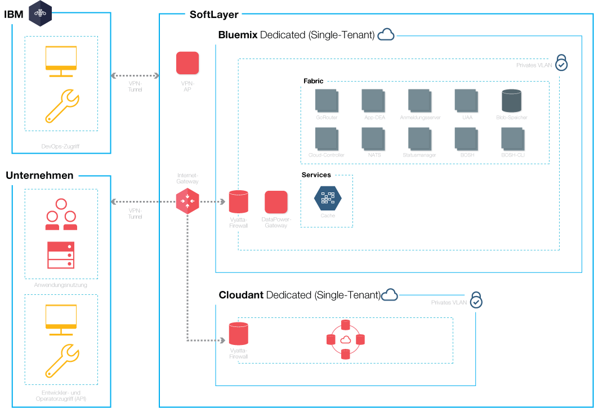

{:new_window: target="_blank"} 
{:shortdesc: .shortdesc}

#{{site.data.keyword.Bluemix_notm}} Dedicated
{: #dedicated}

*Letzte Aktualisierung: 20. Oktober 2015*

{{site.data.keyword.Bluemix}} ist eine cloudbasierte
Plattform mit offenen Standards für das Erstellen, Ausführen und Verwalten von Anwendungen. Mit
{{site.data.keyword.Bluemix_notm}} Dedicated erhalten Sie die Leistung und
Einfachheit von {{site.data.keyword.Bluemix_notm}} - und zwar in Ihrer eigenen
dedizierten SoftLayer-Umgebung, die sowohl mit der
{{site.data.keyword.Bluemix_notm}} Public-Umgebung als auch Ihrem eigenen Netz
sicher verbunden ist. {:shortdesc}

{{site.data.keyword.Bluemix_notm}} Dedicated umfasst einen privaten
Katalog, in dem die dedizierten Services angezeigt werden, die ausschließlich Ihnen zur Verfügung stehen. Er umfasst
außerdem zusätzliche Services, die aus {{site.data.keyword.Bluemix_notm}} Public
syndiziert werden und die Sie verwenden können. 

{{site.data.keyword.Bluemix_notm}} Dedicated basiert auf
SoftLayer. Das bedeutet, dass Ihnen eine besonders leistungsfähige
Cloudinfrastruktur zur Verfügung steht. In jedem Rechenzentrum besteht rund um die Uhr die ganze Woche über
ein Sicherheitsschutz mit strengen Kontrollen. Sie und IBM greifen über einen
VPN-Tunnel und ein privates VLAN auf die
{{site.data.keyword.Bluemix_notm}} Dedicated-Instanz zu. 

*Abbildung 1. Ausführliches Diagramm zu {{site.data.keyword.Bluemix_notm}} Dedicated*

{{site.data.keyword.Bluemix_notm}} Dedicated-Umgebungen besitzen
in Hinblick auf Infrastruktur, Betriebssicherheit und physische Sicherheit dieselben Sicherheitsstandards wie die
öffentliche {{site.data.keyword.Bluemix_notm}}-Plattform. Der Zugriff von Entwicklern auf die dedizierte
{{site.data.keyword.Bluemix_notm}}-Plattform wird jedoch durch Ihre LDAP-Richtlinien
gesteuert, die bei der Einrichtung Ihrer Umgebung durch das
{{site.data.keyword.Bluemix_notm}}-Team konfiguriert werden können. Sie können innerhalb der dedizierten Umgebung
Benutzerrollen und Berechtigungen verwalten. Weitere Informationen finden Sie im Abschnitt zum [Verwalten von Benutzern und Berechtigungen](../admin/index.html#oc_useradmin). 

{{site.data.keyword.Bluemix_notm}} Dedicated wird mit vollständig
integrierten {{site.data.keyword.Bluemix_notm}}-Laufzeiten und 128 GB
Anwendungsspeicher ausgeliefert. 

Des Weiteren gibt es eine Reihe inbegriffener Standardservices sowie optionale Services, die
Sie für Ihre dedizierte Instanz auswählen können.  

| **Typ**        | **Name**            | **Beschreibung** |      
|-----------------|-------------------|-------------------|
| Inbegriffen | {{site.data.keyword.autoscaling}} | Dynamisches Erhöhen oder Verringern der Rechenleistung Ihrer Anwendung basierend auf Richtlinien. Mit diesem
Service können Sie Ihre {{site.data.keyword.Bluemix_notm}} Dedicated-Umgebung
unbegrenzt nutzen.  |
| Inbegriffen | {{site.data.keyword.datacshort}} | Dieser Service bietet ein speicherinternes Datengitter, durch das Szenarios mit verteiltem
Caching für Ihre Apps unterstützt werden. Umfasst 50 GB speicherinternen Cache.  |
| Inbegriffen | {{site.data.keyword.cloudant}} | Die NoSQL-Datenbank von IBM bietet eine leistungsstarke JSON-Datenschicht (mit CouchDB kompatibel). Umfasst 1,6 TB und bis zu 3.000 API-Anforderungen pro Sekunde.  |
| Optional | {{site.data.keyword.sqldb}} | IBM {{site.data.keyword.sqldbfull}} Database for {{site.data.keyword.Bluemix_notm}} fügt Ihrer
Anwendung eine vollständig bereitgestellte relationale Datenbank hinzu. {{site.data.keyword.sqldb}} stellt eine verwaltete Datenbank für die Abwicklung der anspruchsvollen web- und transaktionsorientierten Workloads Ihres Unternehmens bereit. |
| Optional | {{site.data.keyword.mql}} | IBM {{site.data.keyword.mqlfull}} for {{site.data.keyword.Bluemix_notm}} ist ein cloudbasierter Nachrichtenübertragungsservice, der flexible und benutzerfreundliche Messaging-Funktionalität für {{site.data.keyword.Bluemix_notm}}-Apps zur Verfügung stellt. {{site.data.keyword.mql}} bietet eine
Messaging-Lösung mit geringem Verwaltungsaufwand. Mit {{site.data.keyword.mql}} können Sie Ihre Apps
reaktionsfähiger und flexibler gestalten und mithilfe einer einfachen und leistungsfähigen API
die Arbeitslast zwischen Apps aufteilen und auslagern.  |
| Optional | {{site.data.keyword.dashdbshort}} | Verwenden Sie dashDB zum Speichern
relationaler Daten (einschließlich spezieller Datentypen wie Geodaten). Analysieren Sie die Daten anschließend
mit SQL oder mit erweiterten integrierten Analyseverfahren wie Vorhersageanalyse, Data Mining oder Geodatenanalyse. |

*Tabelle 1. Dedizierte Services*

##{{site.data.keyword.Bluemix_notm}} Dedicated einrichten
{: #setupdedicated}

{{site.data.keyword.Bluemix_notm}} Dedicated wurde konzipiert,
um eine private Version des Produktangebots {{site.data.keyword.Bluemix_notm}}
Public bereitzustellen. Sie können {{site.data.keyword.Bluemix_notm}}-Services
und -Laufzeiten verwenden, um Ihre Datenverarbeitungsanforderungen in einem von IBM gehosteten
SoftLayer-Konto zu unterstützen. 

IBM bietet Ihnen über eine kennwortgesicherte Anmeldung Zugriff auf
{{site.data.keyword.Bluemix_notm}} Dedicated. Sie können auf die Services,
Laufzeiten und zugehörigen Ressourcen zugreifen und
{{site.data.keyword.Bluemix_notm}}-Apps bereitstellen und entfernen. IBM nutzt mehrere
SoftLayer-Positionen, um
{{site.data.keyword.Bluemix_notm}} Dedicated bereitzustellen, sodass sich
Ihre private Version an einem Standort in Ihrer Nähe befindet. 

Gehen Sie wie folgt vor, um Ihre private Version von
{{site.data.keyword.Bluemix_notm}} einzurichten: 

<ol>
<li>Wenden Sie sich an Ihren zugewiesenen IBM Kundenbeauftragten oder wenden
Sie sich an <a href="https://console.ng.bluemix.net/?direct=classic/#/contactUs/cloudOEPaneId=contactUs" target="_blank">{{site.data.keyword.Bluemix_notm}}</a>,
um mit der Arbeit zu beginnen. </li>
<li>Die monatlich fällige Gebühr basiert auf den dedizierten Services, die Sie nutzen möchten. Hinzu kommt
ein Abonnement für alle {{site.data.keyword.Bluemix_notm}} Public-Services. Sie erhalten dann eine Rechnung für alle Nutzungen, die über die Abonnementvereinbarung hinausgehen. <ol type="a">
	<li>Erarbeiten Sie mit IBM Ihre Gebühren für Ihre
{{site.data.keyword.Bluemix_notm}} Dedicated-Instanz. 	Die monatlich fällige Gebühr basiert auf den dedizierten Services, die Sie nutzen möchten. Hinzu kommt
ein Abonnement für alle {{site.data.keyword.Bluemix_notm}} Public-Services. Sie erhalten dann eine Rechnung für alle Nutzungen, die über die Abonnementvereinbarung hinausgehen. </li>
	<li>Ermitteln Sie die Fristen für die einzelnen Einrichtungsphasen Ihrer
{{site.data.keyword.Bluemix_notm}} Dedicated-Instanz. </li>
	</ol>
	</li>
<li>Sie wählen den <a href="http://www.softlayer.com/data-centers" target="_blank">Standort
des SoftLayer-Rechenzentrums</a> für Ihre dedizierte Instanz aus. Anschließend werden Ihre dedizierte Plattform und Ihr Konto erstellt. Für Ihr Konto ermitteln Sie die Personen in Ihrer Organisation für die Rollen,
die benötigt werden, um Ihre dedizierte Instanz betriebsbereit zu machen. Für jede Rolle gibt es einen entsprechenden IBM Ansprechpartner.  

Kundenrollen:

<dl>
<dt>**Zentraler Ansprechpartner für das Beschaffungswesen**</dt>
<dd>Arbeitet mit dem IBM Ansprechpartner zusammen an der Einrichtung Ihrer {{site.data.keyword.Bluemix_notm}} Dedicated-Umgebung. Dazu gehört
das Ermitteln geeigneter Personen in Ihrer Organisation für die Arbeit an den einzelnen Aspekten des Projekts. Diese Rolle überwacht die Musterauswahl, geschäftliche Vereinbarungen und die Regelung für den Zugang zu Kundenressourcen. Dieser zentraler Ansprechpartner ist der allgemeine Ansprechpartner für die Einrichtung der dedizierten Instanz. </dd>
<dt>**Compliance-Manager**</dt>
<dd>Arbeitet mit dem IBM Ansprechpartner zusammen, um eine Topologie
und eine Bereitstellungsoption auszuwählen, die Ihren Sicherheitsanforderungen entsprechen. Zudem legt der Compliance-Manager gemeinsam mit dem IBM Compliance-Berater fest, mit welchen Implementierungsmustern die Compliance-Ziele und -Zielsetzungen erreicht werden. </dd>
<dt>**Netzspezialist**</dt>
<dd>Arbeitet mit dem IBM Ansprechpartner zusammen an den Netzplänen für die {{site.data.keyword.Bluemix_notm}}-Bereitstellung.
Diese Rolle stellt dem IBM Ansprechpartner die Anforderungen zur Verfügung
und arbeitet am Implementierungsplan mit. Am Ende der Installations- und Verifizierungsphase zeichnet diese Rolle ab, dass die Netzkonfiguration im Einklang mit den Unternehmensstandards ist. </dd>
<dt>**Zentraler DevOps-Ansprechpartner**</dt>
<dd>Arbeitet mit dem IBM Ansprechpartner zusammen, um die für die {{site.data.keyword.Bluemix_notm}}-Plattform, -Services und -Laufzeiten benötigten Wartungsaktualisierungen zu planen und anzuwenden. Diese Rolle arbeitet auch mit dem
IBM Ansprechpartner an der Konfiguration Ihrer {{site.data.keyword.Bluemix_notm}} Dedicated-Instanz zusammen. </dd>
</dl>

IBM Rollen:

<dl>
<dt>**IBM Bereitstellungsmanager**</dt>
<dd>Arbeitet gemeinsam mit dem zentralen Ansprechpartner für das Beschaffungswesen des Kunden an der Erstellung der Umgebung des Kunden. </dd>
<dt>**IBM Compliance-Berater**</dt>
<dd>Arbeitet mit dem Compliance-Manager des Kunden zusammen, um eine Topologie
und eine Bereitstellungsoption auszuwählen, die Ihren Sicherheitsanforderungen entsprechen. </dd>
<dt>**IBM Netzspezialist**</dt>
<dd>Arbeitet mit dem Netzspezialisten des Kunden zusammen an den Netzplänen für die Implementierung. Diese Rolle arbeitet gemeinsam mit dem Kunden, um anhand zusammengetragener Anforderungen einen Implementierungsplan zu erstellen. Zudem führt der Netzspezialist automatisierte Tests durch, um das physische Ergebnis des Implementierungsplans zu überprüfen. </dd>	
<dt>**Zentraler IBM DevOps-Ansprechpartner**</dt>
<dd>Arbeitet mit dem zentralen DevOps-Ansprechpartner des Kunden an der Installation und ständigen Wartung der Implementierungstopologie. Diese Rolle arbeitet mit dem Kunden zusammen, um die für die Plattform und Services erforderlichen Aktualisierungen zu planen und durchzuführen. </dd>
</dl>
</li>
<li>Definieren Sie die Netzkonnektivität zwischen Ihrem Unternehmensnetz und Ihrer
{{site.data.keyword.Bluemix_notm}} Dedicated-Instanz und richten Sie sie ein. <ol type="a">
	<li>IBM installiert die Überwachungs- und Sicherheitsinfrastruktur für die dedizierte Instanz. </li>
	<li>IBM installiert die von Ihnen ausgewählten dedizierten Single-Tenant-Services. </li>
	<li>Sie stellen die Netzkonfiguration und die Endpunkte z. B. für IP-Adressen oder Firewalls sowie Zugriff auf
Ihr LDAP für die Integration mit {{site.data.keyword.Bluemix_notm}} bereit. </li>
	</ol>
</li>
<li>Ermitteln Sie die Rollen für Ihr Verwaltungsteam der Umgebung und weisen Sie sie zu. <ol type="a">
	<li>IBM konfiguriert den Netzzugriff und LDAP Ihren Angaben entsprechend. Die von Ihnen bestimmten Ansprechpartner erhalten Verwaltungszugriff. Sie müssen auch einen Ansprechpartner
für die Unterstützung und die Abrechnung bestimmen. </li>
	<li>IBM richtet in Ihrer dedizierten Umgebung einen syndizierten Katalog ein,
um Ihnen Ihre dedizierten Services und viele der öffentlichen {{site.data.keyword.Bluemix_notm}}-Services zu zeigen. </li>
	<li>Sie überprüfen die Netz- und Firewallkonfiguration sowie den LDAP-Endpunkt und -Zugriff. </li>
	</ol>
</li>
</ol>

##Dedizierte Instanz warten
{: #maintaindedicated}

IBM wartet und installiert Aktualisierungen und Fixes, sofern IBM dies für die
{{site.data.keyword.Bluemix_notm}} Dedicated-Plattform, -Laufzeiten und
-Services für angemessen hält. 

**Wichtig**: IBM behält sich das Recht vor,
Services zu unterbrechen, um im Bedarfsfall Notfallwartungen vorzunehmen. IBM
kann die geplanten Wartungszeiten ändern, wird Sie aber über solche Änderungen sowie über eventuelle
Notfallwartungen benachrichtigen. 

Die folgenden Wartungsarten sind für
{{site.data.keyword.Bluemix_notm}} Dedicated erforderlich: 
<dl>
<dt>**Standardwartungsfenster**</dt>
<dd>Die Services verwenden vordefinierte Standardwartungsfenster, die dazu führen können, dass die Services nicht verfügbar sind. IBM benötigt nicht die Genehmigung des Kunden, um Wartungsarbeiten durchzuführen, versucht jedoch, die Auswirkungen auf Ihre Services so gering wie möglich zu halten.  
 
IBM übermittelt per E-Mail, Telefon oder über andere Medien Rundsendungen zu den jeweils für ein Wartungsfenster
geplanten Änderungen.  
 
**Wichtig**: Einige Services stehen Ihnen während des Wartungszeitraums möglicherweise nicht zur Verfügung. </dd>

<dt>**Monatliches Änderungsfenster**</dt>
<dd>Das monatliche Änderungsfenster wird basierend auf der entsprechenden Koordination zwischen Ihnen und IBM innerhalb eines 21-tägigen Fensters angewendet. Sie können IBM bestimmte Daten oder Zeiten innerhalb dieses 21-tägigen Zeitfensters mitteilen, die für Sie ungünstig sind. IBM wird sich bemühen, Aktualisierungen außerhalb dieser angegebenen Daten oder Zeiten zu planen. Basierend auf den Anfragen teilt Ihnen IBM das Wartungsfenster mit. Monatliche Änderungsfenster haben für gewöhnlich keinerlei Auswirkungen auf die aktive Bluemix Dedicated-Umgebung.  
 
**Hinweis:** Wenn Sie für die Aktualisierung keine bestimmte Zeit anfordern, wird die Wartung automatisch am Ende des Zeitfensters durchgeführt.  
 
Wechseln Sie zu **ADMINISTRATION > SYSTEM INFORMATION**, um anstehende Aktualisierungen anzuzeigen, nicht verfügbare Daten festzulegen und Aktualisierungen zu genehmigen. Weitere Informationen zu Benachrichtigungen und zum Planen anstehender Aktualisierungen finden Sie im Abschnitt zum <a href="../admin/index.html#oc_system">Anzeigen von Systeminformationen</a>. </dd>
	
<dt>**Sonstige**</dt>
<dd>IBM beabsichtigt, alle Wartungstätigkeiten, die Ihre Services
beeinträchtigen, insbesondere die Verfügbarkeit Ihrer {{site.data.keyword.Bluemix_notm}} Dedicated-Umgebung, -Laufzeiten und -Services auf die monatlichen und Standardaktualisierungen zu beschränken.
In Ausnahmefällen können andere Änderungsfenster für die Verwaltung der Umgebung verwendet werden. IBM
wird sich in angemessenem Maße bemühen, die Auswirkungen auf Sie während solcher Änderungsfenster zu minimieren
und Sie im Voraus benachrichtigen. </dd>
</dl>

Arbeiten Sie mit Ihrem von IBM zugewiesenen Kundenbeauftragten zusammen, um die Wartung Ihrer dedizierten
Instanz festzulegen und sich auf ein Fenster für die Standardwartung zu einigen. 
