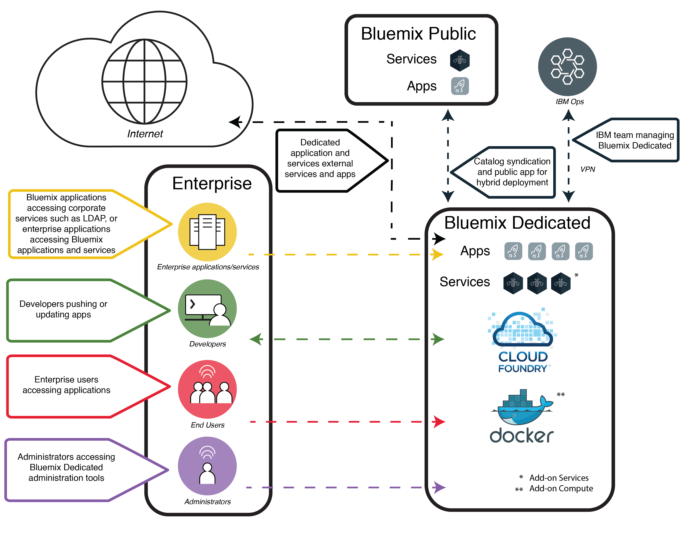

---

copyright:

  years: 2015, 2017

lastupdated: "2017-05-03"

---

{:shortdesc: .shortdesc}

# {{site.data.keyword.Bluemix_dedicated_notm}}
{: #dedicated}

{{site.data.keyword.Bluemix}} ist eine cloudbasierte Plattform mit offenen Standards für das Erstellen, Ausführen und Verwalten von Anwendungen. Mit {{site.data.keyword.Bluemix_dedicated_notm}} erhalten Sie die Leistung und Einfachheit von {{site.data.keyword.Bluemix_notm}} &mdash; in Ihrer eigenen dedizierten SoftLayer-Umgebung, die sowohl mit der {{site.data.keyword.Bluemix_notm}} Public-Umgebung als auch mit Ihrem eigenen Netz sicher verbunden ist.
{:shortdesc}

Alle dedizierten Bereitstellungen von {{site.data.keyword.Bluemix_notm}} beinhalten die folgenden Leistungen und Funktionen ohne gesonderte Berechnung: VPN, privates virtuelles LAN (VLAN), Firewall, Konnektivität mit Ihrem LDAP, Möglichkeit zur Nutzung lokal (d. h. am eigenen Standort) vorhandener Datenbanken und Apps, 24/7-Sicherheit vor Ort, dedizierte Hardware und Standardunterstützung.

Sie haben standardmäßig Zugriff auf Ihre private {{site.data.keyword.Bluemix_notm}}-Instanz nur über Ihr Unternehmensnetz. Wenn Sie die {{site.data.keyword.Bluemix_notm}}-Umgebung z. B. direkt über das Internet, über ein Mobilgerät oder eine dedizierte Datenbank aufrufen wollen, dann ist eine zusätzliche Netzsicherheitskomponente erforderlich, die mit zusätzlichen Kosten verbunden ist.

{{site.data.keyword.Bluemix_dedicated_notm}} wird mit allen integrierten {{site.data.keyword.Bluemix_notm}}-Laufzeiten und 64 GB Rechenressourcenspeicher geliefert.

Darüber hinaus gibt es eine Reihe von Services und Komponenten, die inbegriffen sind oder optional erworben werden können. In der folgenden Tabelle wird aufgeführt, welche Komponenten inbegriffen sind und welche optional käuflich erworben werden können.

| **Typ**        | **Name**            | **Beschreibung** |
|-----------------|-------------------|-------------------|
|Inbegriffen | [{{site.data.keyword.Bluemix_notm}}-Laufzeiten](/docs/cfapps/runtimes.html) | Machen Sie mit Laufzeiten Ihre App schnell betriebsbereit, ohne Maschinen und Betriebssysteme einrichten und verwalten zu müssen. Alle {{site.data.keyword.Bluemix_notm}}-Laufzeiten stehen Ihnen zur Verwendung in Ihrer {{site.data.keyword.Bluemix_dedicated_notm}}-Instanz zur Verfügung.|
| Inbegriffen | [{{site.data.keyword.autoscaling}}](/docs/services/Auto-Scaling/index.html) | Dynamisches Erhöhen oder Verringern der Rechenleistung Ihrer Anwendung basierend auf Richtlinien. Mit diesem Service können Sie Ihre {{site.data.keyword.Bluemix_dedicated_notm}}-Umgebung unbegrenzt nutzen. Hinweis: Auto-Scaling funktioniert gegenwärtig nur mit Cloud Foundry-Laufzeiten. |
|Optional | [{{site.data.keyword.apiconnect_short}}](/docs/services/apiconnect/index.html) | {{site.data.keyword.apiconnect_long}} integriert {{site.data.keyword.APIM}} und IBM StrongLoop in ein einzelnes Angebot, das eine Komplettlösung bietet, um APIs und Microservices zu erstellen, auszuführen, zu verwalten und durchzusetzen. |
|Optional | [{{site.data.keyword.rules_short}}](/docs/services/rules/rules.html) | {{site.data.keyword.rules_short}} stellen eine umfassende Umgebung bereit, in der häufig vorkommende, wiederholbare regelbasierte Geschäftsentscheidungen automatisiert und ausgeführt werden können. Fachanwender oder Entwickler können darüber hinaus schnell Entscheidungen modellieren und testen und dabei aufgrund des geringeren Bedarfs an IT-Kenntnissen Kosten reduzieren. |
|Optional | [{{site.data.keyword.cloudant}}](/docs/services/Cloudant/index.html#Cloudant) | {{site.data.keyword.cloudant}} bietet Zugriff auf eine vollständig verwaltete NoSQL-JSON-Datenebene, die permanent aktiv ist. Dieser Service ist mit CouchDB kompatibel und über eine einfache HTTP-Schnittstelle für mobile Anwendungsmodelle und Webanwendungsmodelle zugänglich. |
|Optional | [{{site.data.keyword.containershort}}](/docs/containers/container_index.html) | Docker-Container in {{site.data.keyword.Bluemix_dedicated_notm}} ausführen. Container sind virtuelle Softwareobjekte, die alle für die Ausführung von Apps erforderlichen Elemente enthalten. Container bieten den Vorteil der Ressourcenisolation und -zuordnung, wobei sie besser portierbar und effizienter als beispielsweise virtuelle Maschinen sind. Informationen zu den Hardwarevoraussetzungen finden Sie unter [IBM {{site.data.keyword.containershort}} in {{site.data.keyword.Bluemix_dedicated_notm}} und Bluemix Local](/docs/containers/container_ov.html#container_dl).|
| Optional | [{{site.data.keyword.contdelivery_short}}](/docs/services/ContinuousDelivery/index.html) | Mit {{site.data.keyword.contdelivery_short}} Dedicated können Sie Builds, Komponententests, Bereitstellungen und weitere Tasks automatisieren. In der umfangreichen webbasierten IDE können Sie Code bearbeiten und mit einer Push-Operation übertragen. Durch die Erstellung von Toolchains werden Toolintegrationen ermöglicht, die Entwicklungs-, Bereitstellungs- und Betriebstasks unterstützten. |
| Optional | [{{site.data.keyword.dashdbshort}}](/docs/services/dashDB/dashDB.html) | IBM {{site.data.keyword.dashdbshort}} for Analytics bietet einen vollständig verwalteten SQL-Clouddatenbankservice, der für Workloads aus einem Data-Warehouse und aus Analysen optimiert ist. IBM {{site.data.keyword.dashdbshort}} for Transactions bietet einen vollständig verwalteten SQL-Clouddatenbankservice, der für allgemeine Zwecke, Web-Apps und transaktionsorientierte Workloads optimiert ist. |
| Optional | [{{site.data.keyword.datacshort}}](/docs/services/DataCache/index.html#data_cache) | Dieser Service bietet ein speicherinternes Datengitter, durch das Szenarios mit verteiltem Caching für Ihre Apps unterstützt werden. Umfasst 50 GB speicherinternen Cache. |
| Optional | [Dedicated GitHub Enterprise](/docs/services/ghededicated/index.html) | {{site.data.keyword.ghe_long}} ist die von IBM Cloud gehostete und vollständig verwaltbare Version von GitHub Enterprise, die ein von Entwicklern gewünschtes Social Experience bietet. Dieser Service ist zurzeit nur für {{site.data.keyword.Bluemix_dedicated_notm}}-Umgebungen verfügbar. |
| Optional (Beta) | [Protokollierung](/docs/monitoringandlogging/cfapps_ml_logs_dedicated_ov.html#container_ml_logs_dedicated_ov) | Stellt Protokolle für Ihre Cloud Foundry-Apps in der {{site.data.keyword.Bluemix_notm}}-Benutzerschnittstelle sowie durchsuchbare Protokolle und Dashboards in Kibana bereit. |
| Optional | [{{site.data.keyword.messagehub}}](/docs/services/MessageHub/index.html#messagehub) | {{site.data.keyword.messagehub}} ist ein skalierbarer, dezentraler Nachrichtenbus mit hohem Durchsatz, um Ihre lokalen und nicht lokalen Technologien zu verbinden. {{site.data.keyword.messagehub}} basiert auf Apache Kafka, einer schnellen, skalierbaren und dauerhaft echtzeitorientierten Messaging-Engine. |
|Optional | [{{site.data.keyword.mobilepush}}](/docs/services/mobilepush/index.html) | {{site.data.keyword.mobilepush}} ist ein Service, mit dem Sie Benachrichtigungen an iOS- und Android-Geräte senden können. Benachrichtigungen können sich an alle Anwendungsbenutzer oder mithilfe von Tags an eine bestimmte Gruppe von Benutzern und Geräten wenden. Sie können Geräte, Tags und Abonnements verwalten. Sie können auch ein SDK (SDK, Software-Development-Kit) und REST-APIs (REST, Representational State Transfer; API, Application Program Interface) verwenden, um die Clientanwendung weiterzuentwickeln.|
|Optional | [{{site.data.keyword.SecureGateway}}](/docs/services/SecureGateway/secure_gateway.html) | Der {{site.data.keyword.SecureGateway}}-Service stellt eine sichere Methode zur Verbindung von {{site.data.keyword.Bluemix_notm}}-Anwendungen mit fernen Standorten lokal oder in der Cloud bereit.  |
|Optional | [{{site.data.keyword.sescashort}}](/docs/services/SessionCache/index.html#session_cache) | Um die Redundanz zu erhöhen, stellt {{site.data.keyword.sescashort}} eine Replik für eine Sitzung bereit, die im Cache gespeichert ist. Daher kann Ihre Clientanwendung auch im Falle eines Spannungsabfalls oder einer Betriebsunterbrechung weiterhin auf die im Cache gespeicherte Sitzung zugreifen. Der Service unterstützt das Sitzungs-Caching für Webanwendungen und mobile Anwendungen. |
| Optional | [{{site.data.keyword.iot_short}}](/docs/services/IoT/index.html) | Dieser Service ermöglicht Ihren Apps die Kommunikation mit und die Nutzung der erfassten Daten von Ihren verbundenen Geräten, Sensoren und Gateways. Das Basisangebot ermöglicht die Ausführung einer privaten Version von {{site.data.keyword.iot_short}} in der dedizierten Umgebung mit einer Kapazität für 100.000 gleichzeitig verbundene Geräte oder Anwendungen und 1,6 Terabyte (TB) für den Datenaustausch. |
| Optional | [{{site.data.keyword.appserver_short}}](/docs/services/ApplicationServeronCloud/index.html) | IBM {{site.data.keyword.appserver_short}} for IBM {{site.data.keyword.Bluemix_notm}} ist ein Service, der eine schnelle Einrichtung in einer vorkonfigurierten {{site.data.keyword.appserver_short}} Liberty-, einer klassischen Network Deployment- oder einer klassischen WebSphere Java EE-Instanz in einer gehosteten Cloudumgebung unter {{site.data.keyword.Bluemix_notm}} ermöglicht. |
{: caption="Tabelle 1. Dedicated-Services" caption-side="top"}
{: #table01}

Durch optionale Komponenten, die zusätzlich zum Kauf angeboten werden, können Sie die Kapazität Ihrer Ressourcen und Services skalieren und erweitern. Wenden Sie sich zum Kauf dieser Optionen an das Vertriebsteam unter [Contact us](https://console.ng.bluemix.net/?direct=classic/#/contactUs/cloudOEPaneId=contactUs), um Kontakt mit einem Vertriebsbeauftragten aufzunehmen. Um Ihren Serviceplan zu erweitern, können Sie den Plan über die Kachel für den Service in Ihrem Katalog auswählen.

| **Name**            | **Beschreibung** |
|-------------------|-------------------|
|Dedicated {{site.data.keyword.apiconnect_short}} Professional - 5 Millionen API-Aufrufe | Diese Umgebung ermöglicht die Ausführung einer privaten Version von {{site.data.keyword.apiconnect_short}} innerhalb der dedizierten Umgebung mit einer Kapazität von 5 Millionen API-Aufrufen pro Monat. Richtet sich an API-Projekte auf Abteilungsebene. |
|Dedicated {{site.data.keyword.apiconnect_short}} Professional - Kapazitätserweiterung auf 100.000 API-Aufrufe | Diese Erweiterung der {{site.data.keyword.apiconnect_short}} Professional-Umgebung bietet eine zusätzliche Kapazität von 100.000 API-Aufrufen pro Monat. |
|Dedicated {{site.data.keyword.apiconnect_short}} Enterprise - 25 Millionen API-Aufrufe | Diese Umgebung ermöglicht die Ausführung einer privaten Version von {{site.data.keyword.apiconnect_short}} innerhalb der dedizierten Umgebung mit einer Kapazität von 25 Millionen API-Aufrufen pro Monat. Richtet sich an API-Projekte auf Unternehmensebene. |
|Dedicated {{site.data.keyword.apiconnect_short}} Enterprise - Kapazitätserweiterung auf 100.000 API-Aufrufe | Diese Erweiterung der {{site.data.keyword.apiconnect_short}} Enterprise-Umgebung bietet eine zusätzliche Kapazität von 100.000 API-Aufrufen pro Monat. |
|IBM {{site.data.keyword.Bluemix_dedicated_notm}} {{site.data.keyword.rules_short}} - 1 Million Regelentscheidungen | Eine Regelentscheidung ist das Ergebnis eines Aufrufs eines Regelsatzes über einen Regelausführungsserver (Rule Execution Server). Ausreichende Berechtigungen müssen angefordert werden, um die gesamte Anzahl von Regelentscheidungen (Rules Decisions), aufgerundet auf die nächste Million, abzudecken, die während des Abrechnungszeitraums ausgeführt oder verarbeitet werden. Die Regelentscheidungen, die durch diesen Cloud-Service gemessen werden, sind die Aufrufe, die an den Regelausführungsserver gesendet werden, um eine Entscheidung abzurufen. Dedicated-Bereitstellungen des Cloud-Service haben eine vereinbarte Kapazität, die mit der relevanten Gebührenmetrik gemessen wird. Die Standardbereichszuordnung für den {{site.data.keyword.rules_short}}-Service auf der {{site.data.keyword.Bluemix_dedicated_notm}}-Plattform beträgt 16 GB, von denen bis zu zehn Instanzen von 1 GB aufgerufen werden können, um berechtigte Regelentscheidungen auszuführen. Wenn Sie diese Nutzungsbegrenzung überschreiten, müssen Sie zusätzliche Kapazität kaufen, um diese Nutzung abzudecken. |
|Dedicated {{site.data.keyword.cloudant}} - Kapazitätserweiterung auf 1,6 TB | Beinhaltet die Ausführung einer privaten Version von {{site.data.keyword.cloudantfull}} in der dedizierten Umgebung mit einer Designkapazität von 1,6 Terabyte.  |
|Dedicated {{site.data.keyword.datacshort}} und {{site.data.keyword.sescashort}} -  Kapazitätserweiterung auf 50 GB | Diese Umgebung ermöglicht die Bereitstellung und Ausführung von {{site.data.keyword.datacshort}}- und {{site.data.keyword.sescashort}}-Instanzen mit einer kumulativen Kapazität bis zu 50 GB. |
|{{site.data.keyword.contdelivery_short}} Dedicated-Instanz | Eine private Version von {{site.data.keyword.contdelivery_short}}, die in einer dedizierten Umgebung ausgeführt wird. Die Kapazität wird anhand von {{site.data.keyword.contdelivery_short}} Dedicated Authorized User-Berechtigungen ermittelt. |
|{{site.data.keyword.contdelivery_short}} Dedicated Authorized User | Erteilt einem berechtigten Benutzer Zugriff und die Berechtigung zur Nutzung einer vorgesehenen {{site.data.keyword.contdelivery_short}} Dedicated-Umgebung. Jeder Benutzer, der zu einer {{site.data.keyword.Bluemix_notm}}-Organisation gehört, die eine {{site.data.keyword.contdelivery_short}}-Serviceinstanz enthält, muss berechtigt werden. |
|Dedicated {{site.data.keyword.dashdbshort}} Enterprise 64.1 | Eine Datenbank pro Serviceinstanz auf einem dedizierten Server mit 64 GB RAM und 16 vCPUs. Empfohlen für vorheriges Laden von Daten bis 1 TB bei normaler Komprimierung.  |
|Dedicated {{site.data.keyword.dashdbshort}} Enterprise 256.4 | Eine Datenbank pro Serviceinstanz auf einem dedizierten Bare-Metal-Server mit 256 GB RAM und 32 Kernen. Empfohlen für vorheriges Laden von Daten bis 4 TB bei normaler Komprimierung. |
|Dedicated {{site.data.keyword.dashdbshort}} Enterprise 256.12  | Eine Datenbank pro Serviceinstanz auf einem dedizierten Bare-Metal-Server mit 256 GB RAM und 32 Kernen. Empfohlen für vorheriges Laden von Daten bis 12 TB bei normaler Komprimierung. Dieser Plan mit hoher Speicherdichte eignet sich für Umgebungen mit höheren Datenvolumen, wenn Abfragen nicht mit speicherinternen Geschwindigkeiten ausgeführt werden müssen. |
|IBM {{site.data.keyword.Bluemix_dedicated_notm}} {{site.data.keyword.dashdbshort}} Enterprise for Transactions 2.8.500 | Die Dedicated-Instanz unterstützt Arbeitslasten für die Onlinetransaktionsverarbeitung (OLTP) von 8 GB RAM und 500 GB Speicher für Daten und Protokolle. |
|IBM {{site.data.keyword.Bluemix_dedicated_notm}} {{site.data.keyword.dashdbshort}} Enterprise for Transactions 12.128.1400 | Die Dedicated-Instanz unterstützt Arbeitslasten für die Onlinetransaktionsverarbeitung (OLTP) von 128 GB RAM und 1,4 TB SSD-Speicher für Daten und Protokolle. |
|IBM {{site.data.keyword.Bluemix_dedicated_notm}} {{site.data.keyword.dashdbshort}} Enterprise for Transactions High Availability 2.8.500 | Die Dedicated-Instanz unterstützt Arbeitslasten für die Onlinetransaktionsverarbeitung (OLTP) von 8 GB RAM und 500 GB Speicher für Daten und Protokolle und enthält einen weiteren Standby-Server für eine Hochverfügbarkeit. |
|IBM {{site.data.keyword.Bluemix_dedicated_notm}} {{site.data.keyword.dashdbshort}} Enterprise for Transactions High Availability 12.128.1400 | Die Dedicated-Instanz unterstützt Arbeitslasten für die Onlinetransaktionsverarbeitung (OLTP) von 128 GB RAM und 1,4 TB SSD-Speicher für Daten und Protokolle und enthält einen weiteren Standby-Server für eine Hochverfügbarkeit. |
|{{site.data.keyword.Bluemix_dedicated_notm}}-Community-Services  | Diese Umgebung ermöglicht die Bereitstellung und Ausführung von bis zu 50 Instanzen für jeden Community-Service.  |
|{{site.data.keyword.Bluemix_dedicated_notm}} {{site.data.keyword.cloudant}}-Clusterinstanz | Diese optionale Komponente enthält einen Cluster mit 3 Knoten, dem Sie die Infrastruktur bereitstellen müssen. Die Speicher- und Rechenkapazitäten können auf Grundlage Ihres spezifischen Bedarfs ermittelt werden. {{site.data.keyword.cloudant}} bietet Zugriff auf eine vollständig verwaltete NoSQL-JSON-Datenebene, die permanent aktiv ist. Dieser Service ist mit CouchDB kompatibel und über eine einfache HTTP-Schnittstelle für mobile Anwendungsmodelle und Webanwendungsmodelle zugänglich. |
|IBM {{site.data.keyword.Bluemix_dedicated_notm}} {{site.data.keyword.messagehub}} | Diese Umgebung stellt eine Nachrichtenübermittlung zum Veröffentlichen/Abonnieren von bis zu 10 GB pro Partition für bis zu 100 Partitionen bereit.  |
|IBM Bluemix Dedicated {{site.data.keyword.mobilepushshort}} | Eine Umgebung, die die Implementierung und Ausführung von {{site.data.keyword.mobilepushshort}}-Instanzen mit der Möglichkeit, 300 Anfragen pro Sekunde zu akzeptieren, bietet. |
|{{site.data.keyword.iot_short}} Dedicated - inkrementelle Erhöhung | Diese Umgebung ermöglicht die Ausführung einer privaten Version von {{site.data.keyword.iot_short}} in der dedizierten Umgebung mit einer Kapazität für 100.000 gleichzeitig verbundene Geräte oder Anwendungen und 0,5 TB für den Datenaustausch. |
|IBM {{site.data.keyword.appserver_short}} for {{site.data.keyword.Bluemix_notm}} - Dedicated klein| Eine vorkonfigurierte {{site.data.keyword.appserver_short}} Liberty-, klassische Network Deployment- oder klassische WebSphere Java EE-Instanz in einer gehosteten Cloudumgebung unter {{site.data.keyword.Bluemix_notm}} mit 64 vCores, 128 GB RAM und 1 TB Festplattenspeicher pro Monat. |
|IBM {{site.data.keyword.appserver_short}} for {{site.data.keyword.Bluemix_notm}} - Dedicated mittel| Eine vorkonfigurierte {{site.data.keyword.appserver_short}} Liberty-, klassische Network Deployment- oder klassische WebSphere Java EE-Instanz in einer gehosteten Cloudumgebung unter {{site.data.keyword.Bluemix_notm}} mit 128 vCores, 256 GB RAM und 2 TB Festplattenspeicher pro Monat. |
|IBM {{site.data.keyword.appserver_short}} for {{site.data.keyword.Bluemix_notm}} - Dedicated groß| Eine vorkonfigurierte {{site.data.keyword.appserver_short}} Liberty-, klassische Network Deployment- oder klassische WebSphere Java EE-Instanz in einer gehosteten Cloudumgebung unter {{site.data.keyword.Bluemix_notm}} mit 256 vCores, 512 GB RAM und 4 TB Festplattenspeicher pro Monat. |
|IBM {{site.data.keyword.appserver_short}} for {{site.data.keyword.Bluemix_notm}} - Dedicated| Eine vorkonfigurierte {{site.data.keyword.appserver_short}} Liberty-, klassische Network Deployment- oder klassische WebSphere Java EE-Instanz in einer gehosteten Cloudumgebung unter {{site.data.keyword.Bluemix_notm}} mit HDD Expansion und 1 TB Festplattenspeicher pro Monat. |
{: caption="Tabelle 2. Käuflich erhältliche optionale Servicekomponenten" caption-side="top"}
{: #table02}

| **Name**            | **Beschreibung** |
|-------------------|-------------------|
|Dedicated-Laufzeiten - Kapazitätserweiterung um 16 GB  | Diese Erweiterung der Laufzeitumgebung stellt zusätzlich 16 GB Laufzeitkapazität zur Verfügung. |
|Dedicated Direct Link mit 1 Gb/s Nutzungsvolumen | Eine dedizierte direkte Netzverbindung mit dem zugehörigen {{site.data.keyword.BluSoftlayer}}-Netzbereitstellungspunkt für Datenübertragungsvolumen bis 1 Gb/s. |
|Dedicated Direct Link mit 10 Gb/s Nutzungsvolumen | Eine dedizierte direkte Netzverbindung mit dem zugehörigen {{site.data.keyword.BluSoftlayer}}-Netzbereitstellungspunkt für Datenübertragungsvolumen bis 10 Gb/s. |
|IBM Bluemix Dedicated Hardware Firewall - Hochverfügbarkeit | Eine redundante Hardware-Firewall mit 1 Gb/s, konfiguriert für den Schutz von einzelnen, mehreren oder allen Servern in demselben VLAN innerhalb der Dedicated-Umgebung. |
{: caption="Tabelle 3. Käuflich erhältliche optionale Plattform-Add-on-Komponenten" caption-side="top"}
{: #table03}

**Hinweis:** Für {{site.data.keyword.Bluemix_dedicated_notm}}-Komponenten wird möglicherweise eine bestimmte konfigurierte Kapazität (z. B. Gigabyte oder Transaktionen pro Sekunde) angegeben. Da die tatsächliche Kapazität im realen Einsatz für eine bestimmte Konfiguration des Cloud-Service von vielen verschiedenen Faktoren abhängt, kann die tatsächliche Kapazität in der Praxis nach oben oder unten von der konfigurierten Kapazität abweichen.

### Syndizierter Katalog
{: #catalogdedicated}

{{site.data.keyword.Bluemix_dedicated_notm}} umfasst einen privaten Katalog, der genehmigte Services der öffentlichen, dedizierten und lokalen Bereitstellungen kombiniert. Sie können sogar Ihre eigenen Services über den {{site.data.keyword.Bluemix_notm}}-Katalog veröffentlichen und verwalten. Sie können auf der Basis Ihrer Kriterien für Datenschutz und Sicherheit entscheiden, welche öffentlichen Services die Anforderungen Ihres Unternehmens erfüllen.

Wenn Sie über eine private Serviceinstanz Ihrer dedizierten Umgebung verfügen, wird bei den Servicenamen in Ihrem Katalog das Tag "Dedicated" angezeigt. Entsprechend sehen Sie "Angepasst" bei den Servicekacheln (d. h. Sie haben einen Servicebroker für die Erstellung verwendet), wenn es sich um einen benutzerdefinierten Service handelt. Alle anderen aufgelisteten Services ohne das Tag "Dediziert" oder "Angepasst" sind über die Syndikation aus {{site.data.keyword.Bluemix_notm}} Public verfügbar. Syndizierte Services bieten die Funktion zum Erstellen von Hybridanwendungen, die aus öffentlichen und privaten Services bestehen.

|Service	|Verfügbar in Region 'US South'	|Verfügbar in Region 'Europe United Kingdom' |Verfügbar in Region 'Australia Sydney'|
|:----------|:------------------------------|:------------------|:------------------|
|{{site.data.keyword.alchemyapishort}} 		|Ja	   	|Ja  		|Ja|
|{{site.data.keyword.alertnotificationshort}}	|Ja		|Ja		|Ja	|
|{{site.data.keyword.apiconnect_short}}         |Ja            |Ja            |Ja  |
|{{site.data.keyword.appseccloudshort}}		|Ja		|Ja		|Ja |
|{{site.data.keyword.apiconnect_short}} 	|Ja   	 	|Ja  	 	|Ja   |
|Automatisches Prüfprogramm für Eingabehilfen |Ja       |Ja    |Ja   |
|{{site.data.keyword.rules_short}}		|Ja		|Ja		|Ja |
|{{site.data.keyword.cloudant}}			|Ja		|Ja		|Ja |
|{{site.data.keyword.iotmapinsights_short}}    |Ja  |Ja  |Ja  |
|{{site.data.keyword.conversationshort}}  |Ja  |Ja  |Ja  |
|{{site.data.keyword.dashdbshort}}		|Ja		|Ja		|Ja |
|{{site.data.keyword.dataworks_short}}		|Ja		|Ja		|Nein|
|{{site.data.keyword.DB2OnCloud_short}}		|Ja		|Ja		|Ja |
|Prüfprogramm für digitalen Inhalt |Ja  |Ja  |Ja  |
|{{site.data.keyword.documentconversionshort}}	|Ja		|Ja		|Ja|
|{{site.data.keyword.iotdriverinsights_short}}  |Ja |Ja  |Ja  |
|{{site.data.keyword.geospatialshort_Geospatial}}	|Ja	|Ja		|Ja |
|{{site.data.keyword.GlobalizationPipeline_short}}	|Ja		| Ja		| Ja |
|{{site.data.keyword.identitymixershort}}		|Ja		|Ja		|Ja|
|{{site.data.keyword.iot4auto_short}} |Ja   |Ja  |Ja  |
|{{site.data.keyword.iotelectronics}}  |Ja  |Ja  |Nein |
|{{site.data.keyword.iotinsurance_short}} |Nein   |Nein   |Ja  |
|{{site.data.keyword.twittershort}}		|Ja		|Ja		|Ja|
|{{site.data.keyword.languagetranslationshort}}	|Ja		|Ja		|Ja |
|{{site.data.keyword.languagetranslatorshort}} |Ja  |Ja  |Ja  |
|{{site.data.keyword.dwl_short}}  |Ja  |Ja  |Nein  |
|{{site.data.keyword.eventhubshort}}		|Ja		|Nein		|Nein|
|{{site.data.keyword.messagehub}}		|Ja		|Ja		|Nein|
|{{site.data.keyword.manda}}			|Ja		|Ja		|Ja |
|{{site.data.keyword.amashort}}			|Ja		|Ja		|Ja |
|{{site.data.keyword.mqa}}			|Ja		|Ja		|Ja |
|{{site.data.keyword.mql}}			|Nein		|Nein		|Ja |
|{{site.data.keyword.nlclassifierlshort}} 	|Ja 		|Ja 		|Ja|
|{{site.data.keyword.personalityinsightsshort}}	|Ja		|Ja		|Ja|
|{{site.data.keyword.pm_short}}			|Ja		|Ja		|Nein |
|{{site.data.keyword.mobilepush}}		|Ja		|Ja		|Ja |
|{{site.data.keyword.retrieveandrankshort}}	|Ja 		|Ja 		|Ja|
|{{site.data.keyword.runbook_short}}		|Ja		|Ja		|Ja|
|{{site.data.keyword.SecureGateway}}		|Ja		|Ja		|Ja |
|{{site.data.keyword.ssofull}}			|Ja		|Nein		|Nein|
|{{site.data.keyword.speechtotextshort}}	|Ja 		|Ja	 	|Ja|
|{{site.data.keyword.streaminganalyticsshort}}	|Ja		|Ja		|Ja |
|{{site.data.keyword.texttospeechshort}} 	|Ja 		|Ja	 	|Ja|
|{{site.data.keyword.toneanalyzershort}} 	|Ja 		|Ja 		|Ja|
|{{site.data.keyword.tradeoffanalyticsshort}}	|Ja		|Ja		|Ja|
|{{site.data.keyword.visualrecognitionshort}}	|Ja 		|Ja	 	|Ja|
|{{site.data.keyword.iot_short}}		|Ja		|Ja		|Nein|
|{{site.data.keyword.weather_short}}		|Ja		|Ja		|Ja|
|{{site.data.keyword.workloadscheduler}}	|Ja		|Ja		|Ja |
{: caption="Tabelle 4. Für die Syndikation verfügbare Services aus Bluemix Public nach Region" caption-side="top"}
{: #table04}

**Hinweis:** Diese Tabelle enthält keine Services von Drittanbietern. Überprüfen Sie Ihren dedizierten Katalog auf Optionen für Services von Drittanbietern.

## {{site.data.keyword.Bluemix_dedicated_notm}}-Architektur
{: #dedicatedarch}

{{site.data.keyword.Bluemix_dedicated_notm}} kann in jedem [{{site.data.keyword.IBM_notm}} SoftLayer-Rechenzentrum ](http://www.softlayer.com/data-centers){: new_window} weltweit bereitgestellt werden. {{site.data.keyword.IBM_notm}} SoftLayer bietet eine der leistungsfähigsten Cloudinfrastrukturen. In jedem Rechenzentrum besteht rund um die Uhr die ganze Woche über ein Sicherheitsschutz mit strengen Kontrollen.

Jede {{site.data.keyword.Bluemix_dedicated_notm}}-Bereitstellung ist für ein einzelnes Unternehmen auf der dedizierten {{site.data.keyword.IBM_notm}} SoftLayer-Hardware in einem eigenen privaten Netz vorgesehen. {{site.data.keyword.Bluemix_dedicated_notm}}-Umgebungen besitzen in Hinblick auf Infrastruktur, Betriebssicherheit und physische Sicherheit dieselben Sicherheitsstandards wie die öffentliche {{site.data.keyword.Bluemix_notm}}-Plattform. Der Zugriff von Entwicklern auf die dedizierte {{site.data.keyword.Bluemix_notm}}-Plattform wird jedoch durch Ihre LDAP-Richtlinien gesteuert, die bei der Einrichtung Ihrer Umgebung durch das {{site.data.keyword.Bluemix_notm}}-Team konfiguriert werden können. Sie können innerhalb der dedizierten Umgebung Benutzerrollen und Berechtigungen verwalten. Weitere Informationen finden Sie unter [Benutzer und Berechtigungen verwalten](/docs/admin/index.html#oc_useradmin). In der folgenden Abbildung ist die logische Architektur einer standardmäßigen {{site.data.keyword.Bluemix_dedicated_notm}}-Bereitstellung dargestellt.

Abbildung 1. Ausführliches Diagramm zur {{site.data.keyword.Bluemix_dedicated_notm}}-Standardarchitektur
{: #figure01}

Im hier aufgeführten Architekturdiagramm werden die folgenden wichtigen Komponenten der Architektur aufgeführt:

<dl>
<dt>{{site.data.keyword.IBM_notm}} Cloud</dt>
<dd>
Die vollständige {{site.data.keyword.IBM_notm}} Cloud-Umgebung umfasst die folgenden wichtigen Netzbetriebsumgebungen:
<ul>
<li>{{site.data.keyword.Bluemix_dedicated_notm}}</li>
<li>{{site.data.keyword.Bluemix_notm}} Public</li>
<li>{{site.data.keyword.IBM_notm}} Operations</li>
</ul>
</dd>
<dt>{{site.data.keyword.Bluemix_dedicated_notm}}</dt>
<dd>
Dies umfasst mindestens die Cloud Foundry-Komponenten und einige dedizierte Anwendungsservices. {{site.data.keyword.Bluemix_notm}} stellt sowohl Cloud Foundry- als auch {{site.data.keyword.containerlong}}-basierte Rechenumgebungen bereit. In einem Unternehmen können Sie eine oder beide dieser Rechenumgebungen konfigurieren. 
Außerdem kann ein Unternehmen weitere dedizierte Anwendungsservices hinzufügen. 
Informationen zu zusätzlichen Services und Rechenfunktionen, die hinzugefügt werden können, finden Sie in [Tabelle 2](#table02).
</dd>
<dt>{{site.data.keyword.Bluemix_notm}} Public</dt>
<dd>
{{site.data.keyword.Bluemix_dedicated_notm}} kann eine abgehende Verbindung zu einer {{site.data.keyword.Bluemix_notm}} Public-Region umfassen. Dadurch wird die Syndikation öffentlicher Services für den dedizierten Katalog bereitgestellt. Die Servicesyndikation von {{site.data.keyword.Bluemix_notm}} Public ist ein komfortables Verfahren für Entwickler, um Anwendungen zu erstellen, deren Host das {{site.data.keyword.Bluemix_dedicated_notm}}-System des Unternehmens ist, und um auf Services zuzugreifen, die unter {{site.data.keyword.Bluemix_notm}} Public ausgeführt werden. Die Liste der Services, die von {{site.data.keyword.Bluemix_notm}} Public syndiziert werden können, werden in [Tabelle 4 im Abschnitt 'Syndizierter Katalog'](#catalogdedicated) dargestellt.
</dd>
<dt>{{site.data.keyword.IBM_notm}} Operations</dt>
<dd>
{{site.data.keyword.IBM_notm}} verwaltet, überwacht und wartet die dedizierte Plattform und die dedizierten Services. Sie können sich somit ganz auf die Erstellung innovativer Anwendungen konzentrieren. Das Team von {{site.data.keyword.IBM_notm}} Operations Support Services (OSS) führt Operationen unter Verwendung einer VPN-Tunnelverbindung mit dem {{site.data.keyword.IBM_notm}} Operations-Netz durch.
</dd>
<dt>Unternehmen</dt>
<dd>
Die Unternehmensnetzumgebung besitzt möglicherweise eine gesicherte, private bidirektionale Netzverbindung zu {{site.data.keyword.Bluemix_dedicated_notm}}. Hierdurch können Anwendungen, die in {{site.data.keyword.Bluemix_dedicated_notm}} gehostet werden, auf Services und Ressourcen im Unternehmen zugreifen. Hierzu zählen auch Datenquellen und Unternehmensservices. Diese Netzverbindung ermöglicht {{site.data.keyword.Bluemix_dedicated_notm}} außerdem die Verwendung Ihrer LDAP-Komponenten zur Authentifizierung Ihrer Unternehmensentwickler und -administratoren. 
 
Es gibt verschiedene Optionen für das Erstellen der gesicherten privaten Netzverbindung. Wenden Sie sich an Ihren IBM Technikexperten, um zu erfahren, welche Netzbetriebsoption für Ihr Unternehmen am besten geeignet ist. 
 
Die Standardverbindung von {{site.data.keyword.Bluemix_dedicated_notm}} zu Ihrem Unternehmensnetz verwendet ein VPN (Virtual Private Network). {{site.data.keyword.Bluemix_dedicated_notm}} verfügt über einen dedizierten 1-Gbps-Vyatta-VPN-Abschluss, der für die Hochverfügbarkeit konfiguriert ist.
 
In der Standardarchitektur für {{site.data.keyword.Bluemix_dedicated_notm}} (siehe hierzu [Abbildung 1](#figure01)) findet kein direkt eingehender Netzdatenverkehr über das Internet statt. Wenn in Ihrem Unternehmen der Internetzugriff auf die Anwendungen, die unter {{site.data.keyword.Bluemix_dedicated_notm}} gehostet werden, erlaubt werden soll, dann muss der Zugriff über das Unternehmensnetz konfiguriert werden.
</dd>
</dl>

## {{site.data.keyword.Bluemix_dedicated_notm}} einrichten
{: #setupdedicated}

{{site.data.keyword.Bluemix_dedicated_notm}} wurde konzipiert, um eine private Version des Produktangebots {{site.data.keyword.Bluemix_notm}} Public bereitzustellen. Sie können {{site.data.keyword.Bluemix_notm}}-Services und -Laufzeiten verwenden, um Ihre Datenverarbeitungsanforderungen in einem von IBM gehosteten {{site.data.keyword.BluSoftlayer}}-Konto zu unterstützen.

IBM bietet Ihnen über eine kennwortgesicherte Anmeldung Zugriff auf {{site.data.keyword.Bluemix_dedicated_notm}}. Sie können auf die Services, Laufzeiten und zugehörigen Ressourcen zugreifen und {{site.data.keyword.Bluemix_notm}}-Apps bereitstellen und entfernen. IBM nutzt mehrere {{site.data.keyword.BluSoftlayer}}-Standorte, um {{site.data.keyword.Bluemix_dedicated_notm}} bereitzustellen, sodass sich Ihre private Version an einem Standort in Ihrer Nähe befindet.

Gehen Sie wie folgt vor, um Ihre private Version von {{site.data.keyword.Bluemix_notm}} einzurichten:

<ol>
<li>Wenden Sie sich an Ihren zugewiesenen IBM Kundenbeauftragten oder <a href="https://console.ng.bluemix.net/?direct=classic/#/contactUs/cloudOEPaneId=contactUs" target="_blank">wenden Sie sich an {{site.data.keyword.Bluemix_notm}} </a>, um mit der Arbeit zu beginnen.</li>
<li>Erarbeiten Sie mit IBM Ihre Gebühren für Ihre {{site.data.keyword.Bluemix_dedicated_notm}}-Instanz. Die monatlich fällige Gebühr basiert auf den dedizierten Services, die Sie nutzen möchten. Hinzu kommt ein Abonnement für alle {{site.data.keyword.Bluemix_notm}} Public-Services. Sie erhalten dann eine Rechnung für alle Nutzungen, die über die Abonnementvereinbarung hinausgehen.</li>
<li>Ermitteln Sie die Fristen für die einzelnen Einrichtungsphasen Ihrer {{site.data.keyword.Bluemix_dedicated_notm}}-Instanz. Informationen zu den einzelnen relevanten Phasen und Tasks finden Sie unter <a href="/docs/dedicated/index.html#rolesresponsibilities">{{site.data.keyword.Bluemix_dedicated_notm}}-Rollen und -Zuständigkeiten</a>.</li>
<li>Sie wählen den <a href="http://www.softlayer.com/data-centers" target="_blank">Standort des {{site.data.keyword.BluSoftlayer}}-Rechenzentrums </a> für Ihre dedizierte Instanz aus. Anschließend werden Ihre dedizierte Plattform und Ihr Konto erstellt. Für Ihr Konto ermitteln Sie die Personen in Ihrer Organisation für die Rollen, die benötigt werden, um Ihre dedizierte Instanz betriebsbereit zu machen. Informationen zu den Rollen, die Sie zuweisen, finden Sie unter <a href="/docs/dedicated/index.html#rolesresponsibilities">{{site.data.keyword.Bluemix_dedicated_notm}}-Rollen und -Zuständigkeiten</a>.
</li>
<li>Definieren Sie die Netzkonnektivität zwischen Ihrem Unternehmensnetz und Ihrer {{site.data.keyword.Bluemix_dedicated_notm}}-Instanz und richten Sie sie ein. Es gibt eine obligatorische Netzsicherheit-Appliance, die Funktionen für Firewall und Abwehr unbefugter Zugriffe enthält. Diese Option ist kostenpflichtig.
	<ol type="a">
	<li>IBM installiert die Überwachungs- und Sicherheitsinfrastruktur für die dedizierte Instanz.</li>
	<li>IBM installiert die von Ihnen ausgewählten dedizierten Single-Tenant-Services.</li>
	<li>Sie stellen die Netzkonfiguration und die Endpunkte z. B. für IP-Adressen oder Firewalls sowie Zugriff auf Ihr LDAP für die Integration mit {{site.data.keyword.Bluemix_notm}} bereit.</li>
	</ol>
</li>
<li>Ermitteln Sie die Rollen für Ihr Verwaltungsteam für die Umgebung und weisen Sie sie zu.
	<ol type="a">
	<li>IBM konfiguriert den Netzzugriff und LDAP Ihren Angaben entsprechend. Die von Ihnen bestimmten Ansprechpartner erhalten Verwaltungszugriff. Sie müssen auch einen Ansprechpartner für die Unterstützung und die Abrechnung bestimmen.</li>
	<li>IBM richtet in Ihrer dedizierten Umgebung einen syndizierten Katalog ein, um Ihnen Ihre dedizierten Services zu zeigen. Der syndizierte Katalog umfasst außerdem zusätzliche Services, die aus {{site.data.keyword.Bluemix_notm}} Public syndiziert werden und die Sie verwenden können. Sie können auf der Basis Ihrer Kriterien für Datenschutz und Sicherheit entscheiden, welche öffentlichen Services die Anforderungen Ihres Unternehmens erfüllen.</li>
	<li>Sie überprüfen die Netz- und Firewallkonfiguration sowie den LDAP-Endpunkt und -Zugriff.</li>
	</ol>
</li>
</ol>

Für die Erstbereitstellung und Erstkonfiguration Ihrer Umgebung können Sie einen Prozess wie in der folgenden Liste dargestellt erwarten. Details dazu, wer für die einzelnen Tasks verantwortlich ist, finden Sie unter [Rollen und Zuständigkeiten](index.html#rolesresponsibilities).

<ol>
<li>Sie wählen das Rechenzentrum aus, das als Host Ihrer dedizierten Instanz verwendet werden soll. Weitere Informationen zu Optionen für das Rechenzentrum finden Sie unter <a href="http://www.softlayer.com/data-centers" target="_blank">Standort des {{site.data.keyword.BluSoftlayer}}-Rechenzentrums </a>.</li>
<li>Sie geben die Domänennamen für die Bereitstellung und die gewünschten IDs an. Sie erhalten drei Domänen, wenn Sie Ihre {{site.data.keyword.Bluemix_notm}}-Instanz einrichten. Sie wählen das Präfix für <code>*mycompany*.*region*.bluemix.net</code> und <code>*mycompany*.*region*.mybluemix.net</code> aus. Und Sie wählen den vollständigen Name für die dritte Domäne aus. 

Sie können so viele angepasste Domänen wählen, wie Sie möchten. Sie sind jedoch für die Zertifikate für die angepassten Domänen verantwortlich. Informationen zur Erstellung einer angepassten Domäne finden Sie unter <a href="/docs/manageapps/updapps.html#domain">Angepasste Domäne erstellen und verwenden</a>.
</li>
<li>Sie geben einen Eigner für das öffentliche Konto an, das zur Darstellung Ihres Unternehmens in {{site.data.keyword.Bluemix_notm}} Public verwendet wird. IBM verwendet dieses Konto zur Verfolgung der Nutzung syndizierter Services.</li>
<li>Sie wählen den Typ der sicheren Verbindung zu Ihrem Rechenzentrum aus. Sie haben die Auswahl zwischen {{site.data.keyword.Bluemix_notm}} VPN, {{site.data.keyword.Bluemix_notm}} Direct Link und AT&T Net Bond.</li>
<li>Sie entscheiden, ob ein Zugriff auf Ihre dedizierte Umgebung über das öffentliche Internet erfolgen soll.</li>
<li>Sie wählen den Typ der Authentifizierung aus, die verwendet werden soll. Sie haben die Auswahl zwischen IBMid oder Active Directory. Informationen zur Verwendung und Registrierung einer IBMid finden Sie auf der Seite für <a href="https://www.ibm.com/account/profile/us?page=regfaqhelp#4">Hilfe und FAQ</a>.
</li>
<li>Sie ermitteln die Rollen für Ihr Verwaltungsteam für die Umgebung und weisen sie zu. Informationen zu den Rollen, die Sie zuweisen müssen, finden Sie unter <a href="/docs/dedicated/index.html#rolesresponsibilities">{{site.data.keyword.Bluemix_dedicated_notm}}-Rollen und -Zuständigkeiten</a>.</li>
<li>IBM stellt die zentrale Plattform bereit, die elastische Laufzeiten, Konsolen, Verwaltungsfunktionen und Überwachung umfasst.</li>
<li>IBM konfiguriert Ihren Verwaltungszugriff auf die Umgebung.</li>
<li>Sie können mit der Verwendung Ihrer dedizierten Instanz beginnen, die vom IBM Operationsteam überwacht wird, um auf Alerts zu reagieren.</li>
</ol>

Nach der Einrichtung Ihrer {{site.data.keyword.Bluemix_notm}}-Instanz können Sie die Ihre {{site.data.keyword.Bluemix_notm}}-Instanz über die Verwaltungsseite ('Administration') überwachen und verwalten. Weitere Informationen finden Sie unter [{{site.data.keyword.Bluemix_notm}} Local und Bluemix Dedicated verwalten](../admin/index.html#mng). Weitere Informationen zu Upgrades und Wartung finden Sie unter [Dedizierte Instanz warten](index.html#maintaindedicated).

##Rollen und Zuständigkeiten
{: #rolesresponsibilities}

Wenn Sie ein {{site.data.keyword.Bluemix_dedicated_notm}}-Konto einrichten, ermitteln Sie die Personen in Ihrer Organisation für die Rollen, die benötigt werden, um Ihre lokale Instanz betriebsbereit zu machen.

###Rollen

In der folgenden Liste sind die Kundenrollen und -zuständigkeiten enthalten, die Sie zuweisen:

<dl>
<dt>**Zentraler Ansprechpartner für das Beschaffungswesen**</dt>
<dd>Arbeitet mit dem IBM Ansprechpartner zusammen an der Einrichtung Ihrer {{site.data.keyword.Bluemix_dedicated_notm}}-Umgebung. Dazu gehört das Ermitteln geeigneter Personen in Ihrer Organisation für die Arbeit an den einzelnen Aspekten des Projekts. Die Person, die dieser Rolle zugewiesen ist, übernimmt eine Projektmanagementrolle und überwacht die Musterauswahl, geschäftlichen Vereinbarungen und die Regelung für den Zugang zu Kundenressourcen. Dieser zentrale Ansprechpartner ist der allgemeine Ansprechpartner für die Einrichtung der dedizierten Instanz und die Verfolgung des Bereitstellungsprozesses.</dd>
<dt>**Compliance-Manager**</dt>
<dd>Arbeitet mit dem IBM Ansprechpartner zusammen, um eine Topologie
und eine Bereitstellungsoption auszuwählen, die Ihren Sicherheitsanforderungen entsprechen. Die Person, die dieser Rolle zugewiesen ist, legt gemeinsam mit dem IBM Compliance-Berater fest, mit welchen Implementierungsmustern die Compliance-Ziele erreicht werden.</dd>
<dt>**Netzspezialist**</dt>
<dd>Arbeitet mit dem IBM Ansprechpartner zusammen an den Netzplänen für die {{site.data.keyword.Bluemix_notm}}-Bereitstellung. Die Person, die dieser Rolle zugewiesen ist, überprüft die von IBM vorausgesetzten Netzspezifikationen und arbeitet gemeinsam mit IBM an einem Implementierungsplan. Am Ende der Installations- und Verifizierungsphase prüft die Person, die dieser Rolle zugewiesen ist, dass die Netzkonfiguration im Einklang mit den Unternehmensstandards ist.</dd>
<dt>**Zentraler DevOps-Ansprechpartner**</dt>
<dd>Arbeitet mit dem IBM Ansprechpartner zusammen, um die für die {{site.data.keyword.Bluemix_notm}}-Plattform, -Services und -Laufzeiten benötigten Wartungsaktualisierungen zu planen und anzuwenden. Die Person, die dieser Rolle zugewiesen ist, arbeitet auch mit dem
IBM Ansprechpartner an der Konfiguration Ihrer {{site.data.keyword.Bluemix_dedicated_notm}}-Instanz.</dd>
<dt>**Operations-Ansprechpartner**</dt>
<dd>Arbeitet bei Bedarf mit dem IBM Support-Team zusammen, sobald die Umgebung betriebsbereit ist. Die entsprechende Person besitzt einen Superuser-Zugriff auf die Administrationskonsole, kann Wartungsaktualisierungen für die Bluemix-Umgebung genehmigen und planen und steht für den Fall eines kritischen Vorfalls jederzeit zur Verfügung. Die Person, die dieser Rolle zugewiesen ist, muss technisches Wissen über die Bluemix-Umgebung besitzen und in der Lage sein, andere Mitarbeiter des Unternehmens zu erreichen, die Expertenkenntnisse über einen Bereich besitzen, der betroffen sein könnte (z. B. Netzbetrieb oder Sicherheit).</dd>
</dl>

Ihre Ansprechpartner beim Kunden arbeiten mit IBM Spezialisten zusammen, um sicherzustellen, dass Sie immer die benötigte Unterstützung erhalten. Sie können ein Upgrade auf die Stufe Premium Support durchführen, um für Ihr Konto mit einem dedizierten Cluster Systems Manager (CSM) zu arbeiten. Weitere Informationen zu den unterschiedlichen Unterstützungskategorien finden Sie unter [Support kontaktieren](../support/index.html#contacting-support). Der CSM führt folgende Typen von Tasks aus:

<ul>
<li>Schnelle Einführung Ihrer {{site.data.keyword.Bluemix_dedicated_notm}}-Umgebung.</li>
<li>Bereitstellung wertvoller Schulungs- und Weiterbildungsmaterialien, damit Sie selbstständiger arbeiten können.</li>
<li>Pflege eine langfristigen Beziehung zwischen Ihnen und den zuständigen {{site.data.keyword.Bluemix_notm}}-Entwicklungs-, -Support- und -Services-Mitarbeitern.</li>
</ul>

Das {{site.data.keyword.Bluemix_notm}}-Support- und -Operationsteam, das gemeinsam mit Ihnen an der {{site.data.keyword.Bluemix_notm}}-Instanz arbeitet, kann auf die lokale Umgebung zugreifen, tut dies aber nur unter den folgenden Umständen.

<ul>
<li>Zum Antworten auf Alerts und zum Durchführen einer Betriebswartung</li>
<li>Zum Reproduzieren eines Problems, das in einem Support-Ticket berichtet wurde</li>
</ul>

### Zuständigkeiten

Von der Einrichtung Ihrer Umgebung bis hin zur kontinuierlichen Wartung muss eine Vielfalt von Tasks abgeschlossen werden. Die folgende Tabelle beschreibt grob die erforderlichen Tasks und den Eigner zum Abschließen der Task in den Phasen der Konzeption, des Fortschritts und der Fertigstellung.

In der Konzeptionsphase wird die {{site.data.keyword.Bluemix_dedicated_notm}}-Umgebung eingerichtet. Die primären Ziele dieser Phase sind unter anderem:

- Überprüfung der finanziellen Vereinbarung und Festlegung der Meilensteindaten für die Bereitstellung.
- Erstellung der {{site.data.keyword.Bluemix_notm}}-Plattform und Bereitstellung von Zugriff auf Laufzeiten und Services.
- Definition und Einrichtung der Netzkonnektivität zwischen Ihrem Unternehmensnetz und {{site.data.keyword.Bluemix_notm}}-Operationen.
- Ermittlung und Zuweisung von Rollen für Ihr Verwaltungsteam.

| **Task** | **Taskdetails** | **Zuständiges Team** |
|----------|------------------|-----------------------|
|Festlegen von Konformitätsstandards | Ermitteln Sie Behörden-, Branchen- und proprietäre Unternehmensstandards, die für die Umgebung erforderlich sind. | Kunde |
|Erstellen eines Sicherheits- und Konformitätsintegrationsplans | Erstellen Sie einen Sicherheits- und Integrationsplan, der Kosten, Planung und Ressourcen einbezieht, die für die Einhaltung von Sicherheitsbestimmungen erforderlich sind. | IBM |
|Genehmigen des Konformitätsplans | Genehmigen Sie den Konformitätsplan. | Kunde |
|Dimensionieren der Umgebung |  	Dimensionieren Sie die Umgebung auf der Basis von vordefinierten Optionen, die die Hochverfügbarkeits- und Disaster-Recovery-Ziele sowie den ursprünglichen DEA und die Servicebereitstellung berücksichtigen, die zur Unterstützung der mit der Plattform erstellten Apps erforderlich sind. Gemeinsam mit IBM definieren Sie beispielsweise, welche Datenbanken erforderlich sind, welche Services im syndizierten Katalog des Benutzers angeboten werden und vieles mehr. | IBM und Kunde |
|Auswählen der Architektur | Wählen Sie die Architektur auf der Basis vordefinierter Optionen aus, die Hochverfügbarkeits- und Disaster-Recovery-Anforderungen berücksichtigen. | IBM |
|Definieren von Disaster-Recovery-Zielen | Definieren Sie die Disaster-Recovery-Anforderungen für die Umgebung. | Kunde |
|Erstellen eines Disaster-Recovery-Plans | Konsultieren und definieren Sie den Disaster-Recovery-Plan. IBM erstellt ein Disaster-Recovery-Modell und berät mit Ihnen, wo Sie Feedback bereitstellen und den Plan genehmigen. | IBM und Kunde |
|Erstellen eines Sicherungs- und Wiederherstellungsplans | Erstellen Sie einen Sicherungs- und Wiederherstellungsplan, der die Häufigkeit und die Anforderungen einer zentralen bzw. dezentralen Verteilung der Sicherung definiert. IBM sichert Fabric-Komponenten, IBM Services, Servicemetadaten wie Benutzerrollen und vieles mehr. Sie sichern alle anwendungsspezifischen Daten, für die Sie verantwortlich sind. | IBM und Kunde |
|Angeben von Tools für Ereigniserkennung und Problembestimmung | Geben Sie IBM Tools und Tools von Drittanbietern für die Ereigniserkennung und Problembestimmung auf der {{site.data.keyword.Bluemix_notm}}-Plattformebene an. | IBM |
|Definieren eines Eskalationsplans | Definieren Sie den Eskalationsplan zur Klassifizierung und Auflösung von Ereignissen, die von Überwachungskomponenten erkannt werden. | IBM |
|Unterzeichnen von Infrastruktur-, Plattform- und Supportvereinbarungen | Unterzeichnen Sie die Abonnementvereinbarung, einschließlich der finanziellen Vertragsbedingungen für die Umgebung. Unterzeichnen Sie das Supportabonnement. | Kunde |
|Beschaffen einer Umgebung | Beschaffen Sie Rechenressourcen, Netz und Speicher, einschließlich Core- und Services-VLAN zum Hosten von {{site.data.keyword.Bluemix_notm}} sowie Bare-Metal-Services zum Hosten von Data Power und {{site.data.keyword.Bluemix_notm}} Firewall. Stellen Sie eine Infrastruktur bereit, die einen VPN-Tunnel ermöglicht. | IBM |
|Installieren von Fabric-, Anwendungs- sowie Überwachungs- und Verwaltungskomponenten | Installieren, konfigurieren und überprüfen Sie Fabric-Komponenten wie BOSH Director, Cloud-Controller, Statusmanager, Messaging, Router, DEAs und Service-Provider sowie die Überwachungskomponenten, die im Eskalations- und Problemerkennungsplan definiert sind. | IBM |
|Installieren und Konfigurieren von Sicherheitskomponenten | Installieren und konfigurieren Sie Sicherheitskomponenten, die in den Überwachungs- und Eskalationsplan eingebunden sind, darunter IBM QRadar, Vault für Berechtigungsnachweise, Abwehrsystem gegen Angriffe von außen, IBM BigFix und IBM Security Privileged Identity Management. | IBM |
|Installieren und Konfigurieren von angepassten Komponenten |  	Installieren und konfigurieren Sie angepasste Komponenten, die sich außerhalb des Geltungsbereichs des {{site.data.keyword.Bluemix_notm}}-Produkts und der -Services befinden. | Kunde |
|Einrichten einer Netzerstkonfiguration | Richten Sie eine Netzerstkonfiguration mit Firewalls, DataPower, Fortigate und DNS ein. | IBM |
|Verbinden einer {{site.data.keyword.Bluemix_notm}}-Pipeline | Verbinden Sie eine {{site.data.keyword.Bluemix_notm}}-Pipeline für kontinuierliche Integration und Bereitstellung mit IBM Repositorys. | IBM |
|Anpassen externer Lösungskomponenten | Passen Sie Lastausgleichsfunktionen für Disaster-Recovery-Szenarios an. | Kunde |
|Installieren einer VPN-Lösung | Installieren Sie eine bidirektionale VPN-Lösung. | IBM |
|Konfigurieren eines Anmeldungsservers | Konfigurieren Sie den Anmeldungsserver für die Verwendung mit dem unternehmensweiten LDAP. | IBM |
|Verfolgen des Status von Sicherheits-, Konformitäts- und Prüfungsmaßnahmen  | Verfolgen Sie den Status bis zu dem Zeitpunkt, an dem alle Tools und Prozesse zum Erzielen der gewünschten Konformität vorhanden und einsatzbereit sind. | Kunde |
|Überprüfen der physischen Infrastruktur | Überprüfen Sie die Orte, an denen die Lösungskomponenten für Bedrohungen gehostet werden, und überprüfen Sie die Sicherheitsmaßnahmen zum Schutz des Rechenzentrums. | Kunde |
|Untersuchen der Überwachungssoftware | Untersuchen Sie Überwachungs- und Verwaltungskomponenten, wie im Eskalations- und Problembestimmungsplan definiert. | Kunde |
|Untersuchen des Betriebssystems | Stellen Sie sicher, dass das Betriebssystemimage Konfomitätsstandards entspricht. IBM stellt Zugriff auf das Betriebssystemimage bereit. | IBM und Kunde |
{: caption="Tabelle 5. Tasks der Konzeptionsphase" caption-side="top"}

Als Nächstes folgt die Fortschrittsphase. Die Fortschrittsphase beschreibt die laufende, interaktive Beziehung zwischen Ihnen und IBM Cloud. Die primären Ziele dieser Phase sind unter anderem:

- Überprüfen der Kapazität und Koordinieren von erforderlichen Anpassungen.
- Überprüfen von Wartungs- und Plattformverbesserungen.
- Koordinieren der Aktivitäten für Fehlerbehebung und Ursachenanalyse.

| **Task** | **Taskdetails** | **Zuständiges Team** |
|----------|------------------|-----------------------|
|Überprüfen von wöchentlichen Kapazitätsberichten | Überprüfen Sie die wöchentlichen Kapazitätsberichte und ergreifen Sie ggf. Korrekturmaßnahmen. | Kunde |
|Erstellen von monatlichen Projektionen | Erfassen Sie Informationen und erstellen Sie eine monatliche Projektion von Kapazität und Nutzung. | IBM und Kunde |
|Überprüfen von Kapazitätsprojektionen | Überprüfen Sie die Kapazitätsprojektionen hinsichtlich externer Ereignisse, die sich sowohl auf die Kapazität als auch auf geplante neue Implementierungen von Apps auswirken können. Arbeiten Sie gemeinsam mit IBM an der Überprüfung der Projektionen und der entsprechenden Planung. | IBM und Kunde |
|Überprüfen von Projektionen | Überprüfen Sie die Kapazitätsprojektionen hinsichtlich externer Ereignisse, die sich auf die Kapazität auswirken können. | Kunde |
|Anpassen der Kapazität |  Fügen Sie Kapazität hinzu oder entfernen Sie Kapazität nach Bedarf. | IBM |
|Veröffentlichen zukünftiger Aktualisierungen und Wartungen | Erstellen Sie eine Dokumentation für die erforderliche Wartung von IBM Komponenten. | IBM |
|Durchführen einer Wartung | Planen Sie gemeinsam mit IBM die erforderlicher Wartung innerhalb eines 21-tägigen Zeitraums. Sie können innerhalb des 21-tägigen Zeitraums Daten angeben, an denen keine Wartungsarbeiten ausgeführt werden sollen, und IBM bemüht sich, die Wartung entsprechend zu planen. | IBM und Kunde |
|Adressieren von Bereitstellungsfehlern | Beheben Sie ggf. auftretende Bereitstellungsfehler für vom Kunden erstellte Services, die im Katalog implementiert werden. | IBM |
|Durchführen von Netz- und IP-Scans | Führen Sie tägliche und monatliche Netz- und IP-Scans durch. | IBM und Kunde |
|Bereitstellen von Zugriff auf Prüfprotokolle | Stellen Sie Zugriff auf alle Sicherheits- und Verwaltungsprüfprotokolle bereit.   | IBM und Kunde |
|Durchführen von Tests | Führen Sie regelmäßige Kontrollen für Operationstests und Penetrationstests von Drittanbietern durch. | IBM und Kunde |
|Statusberichterstattung, Prüfungskoordination und Konformitätsbesprechungen  | Führen Sie eine Statusberichterstattung, eine externe Prüfungskoordination und eine Präsentation bei Statusbesprechungen zur Konformitätsprüfung aus. | IBM |
|Prüfung der Beschäftigungssituation und Geschäftsanforderungen | Führen Sie eine vierteljährliche Prüfung der Beschäftigungssituation sowie eine Prüfung kontinuierlicher Geschäftsanforderungen für IBM Ansprechpartner aus, die Zugriff auf die Umgebung des Kunden haben. | IBM |
|Beheben von Sicherheitslücken | Beheben Sie berichtete Sicherheitslücken in der Plattform. | IBM |
{: caption="Tabelle 6. Tasks der Fortschrittsphase" caption-side="top"}

Die finale Phase der Fertigstellung stellt das Ende der Beziehung zwischen Ihnen und IBM {{site.data.keyword.Bluemix_notm}} dar. Die primären Tasks in dieser Phase sind unter anderem:

* Beenden der finanziellen Vereinbarung
* Entfernen aller Netzverbindungen
* Recyceln der Infrastruktur

| **Task** | **Taskdetails** | **Zuständiges Team** |
|----------|------------------|-----------------------|
|Beenden der finanziellen Vereinbarung | Erörtern und vereinbaren Sie ein Ende der finanziellen Vereinbarung. | IBM und Kunde |
|Stilllegen der Umgebung | Inaktivieren Sie den Zugriff auf und die Berechtigungsnachweise für die Umgebung. | IBM und Kunde |
|Entfernen von Kundennetzverbindungen | Entfernen Sie Netzverbindungen zwischen IBM und der Umgebung des Kunden. | IBM und Kunde |
|Recyceln der Infrastruktur | Ihre Umgebung wird auf der Basis von {{site.data.keyword.BluSoftlayer}}-definierten Prozessen recycelt. | IBM |
{: caption="Tabelle 7. Tasks der Fertigstellungsphase" caption-side="top"}

##Dedizierte Instanz warten
{: #maintaindedicated}

IBM wartet und installiert Aktualisierungen und Fixes, sofern IBM dies für die {{site.data.keyword.Bluemix_notm}}-Laufzeiten und -Services für angemessen hält. Es kann vorkommen, dass Services während Wartungszeiten nicht verfügbar sind. Zusätzlich arbeitet IBM mit Ihnen bei der Terminierung von Wartungszeiten für die {{site.data.keyword.Bluemix_notm}}-Plattform zusammen.

Die folgenden Wartungsarten sind für
{{site.data.keyword.Bluemix_dedicated_notm}} erforderlich:
<dl>
<dt>**Standardwartung für Services**</dt>
<dd>Die Services verwenden vordefinierte Standardwartungsfenster, die dazu führen können, dass die Services nicht verfügbar sind. IBM benötigt nicht die Genehmigung des Kunden, um Servicewartungsarbeiten durchzuführen, versucht jedoch, die Auswirkungen auf Ihre Services so gering wie möglich zu halten. 
 
IBM sendet Broadcastnachrichten zu den geplanten Änderungen für jeden Wartungszeitraum auf der Statusseite. 
 
**Wichtig**: Einige Services stehen Ihnen während des Wartungszeitraums möglicherweise nicht zur Verfügung.</dd>

<dt>**Standardwartung für die {{site.data.keyword.Bluemix_notm}}-Plattform**</dt>
<dd>Wartungsaktualisierung werden basierend auf der Koordination zwischen Ihnen und IBM innerhalb eines 21-tägigen Zeitfensters angewendet. Sie geben IBM vorab genehmigte Wartungszeiten und bestimmte Daten oder Uhrzeiten an, zu denen eine Wartung nicht möglich ist. IBM plant die Aktualisierungen dann entsprechend der von Ihnen ausgewählten Wartungs- und Ausschlusszeiten.

Wechseln Sie zu **Verwaltung > Systeminformationen**, um anstehende und ausstehende Wartungsaktualisierungen anzuzeigen. Weitere Informationen zu Einstellungen Ihrer vorab genehmigten Zeiten, zu nicht verfügbaren Daten und zur Anzeige oder Prüfung der geplanten Wartungsaktualisierungen finden Sie unter <a href="/docs/admin/index.html#oc_schedulemaintenance">Wartungsaktualisierung</a>.
</dd>
</dl>

**Wichtig**: IBM behält sich das Recht vor,
Services zu unterbrechen, um im Bedarfsfall Notfallwartungen vorzunehmen. IBM
kann die geplanten Wartungszeiten ändern, wird Sie aber über solche Änderungen sowie über eventuelle
Notfallwartungen benachrichtigen.

Falls nach einer Wartungsaktualisierung ein Problem berichtet wird, entscheiden Sie gemeinsam mit dem {{site.data.keyword.Bluemix_notm}} Support, ob es sinnvoll wäre, dass IBM die Aktualisierung rückgängig macht. Nachdem Sie sich geeinigt haben, macht IBM die Aktualisierung rückgängig und stellt die Umgebung in ihrem ursprünglichen Zustand wieder her.

## Intervention und Unterstützung bei Vorfällen für
{{site.data.keyword.Bluemix_dedicated_notm}}
{: #incidentresponse}

### Von Kunden erkannte Probleme

Wenn Sie ein Problem feststellen, das durch den IBM Support und durch IBM Operationen behandelt werden muss, können Sie mit verschiedenen Methoden Kontakt mit dem Support aufnehmen. Informationen zur Kontaktaufnahme mit dem Support finden Sie unter [Support kontaktieren](../support/index.html#contacting-bluemix-support-local). Die Behebung des Problems erfolgt je nach Problem entweder durch Sie selbst, durch IBM oder in Zusammenarbeit von Ihnen und IBM.

### Von IBM erkannte kritische Probleme

Kritische Probleme (Vorfälle) sind dringende, nicht erwartete Serviceausfälle und Stabilitätsprobleme, die sich auf Ihre Umgebung oder Ihre Benutzer auswirken. Wenn IBM ein kritisches Problem in Ihrer Umgebung erkennt, werden Sie durch eine Benachrichtigung auf der Seite **Status** darüber informiert. Auf der Statusseite finden Sie außerdem bekannte Probleme mit Ihrer Plattform oder Ihren Services. Weitere Informationen zur Seite 'Status' finden Sie in [Status anzeigen](../admin/index.html#oc_status).

Wenn Sie Ihre Benachrichtigungen in einen Web-Service, der Web-Hooks unterstützt, integrieren wollen, finden Sie Informationen zur Erweiterung der Benachrichtigungsfunktionalität unter [Benachrichtigungen und Ereignisabonnements](../admin/index.html#oc_eventsubscription).

Abbildung 2. Problembehebungsprozess

Die Behebung des Problems erfolgt je nach Problem entweder durch Sie selbst, durch IBM oder in Zusammenarbeit von Ihnen und IBM. Wenn Sie eine Frage in Bezug auf das Problem haben oder wenn Sie Hilfe durch einen IBM Ansprechpartner bei der Lösung des Problems benötigen, können Sie ein Support-Ticket öffnen. Informationen zur Kontaktaufnahme mit dem Support finden Sie unter [Support kontaktieren](/docs/support/index.html#contacting-bluemix-support-local).

**Hinweis:** Support-Tickets der Priorität 1 werden 24 Stunden täglich und 7 Tage die Woche überwacht. Andere Ticket werden in der Zeit zwischen Sonntag 22:00 Uhr GMT und Samstag 12:00 GMT bearbeitet. Weitere Informationen zu Prioritätsstufen von Support-Tickets sowie zur Zusammenarbeit mit dem Support finden Sie unter <a href="/docs/support/index.html#contacting-bluemix-support-local">Support kontaktieren</a>.

## Disaster-Recovery for
{{site.data.keyword.Bluemix_dedicated_notm}}
{: #dr}

Disaster-Recovery für {{site.data.keyword.Bluemix_short}} Dedicated kann auf ähnliche Weise konfiguriert werden wie bei der Verwendung von {{site.data.keyword.Bluemix_short}} Public. {{site.data.keyword.Bluemix_short}} Public bietet eine fortlaufend verfügbare Plattform für Innovationen mit mehreren sichern Kennzahlen, die sicherstellen, dass Ihre Organisationen, Bereiche und Apps immer verfügbar sind. Durch das Bereitstellen von Apps in mehreren geografischen Regionen lässt sich eine kontinuierliche Verfügbarkeit realisieren, die vor einem ungeplanten, gleichzeitigen Ausfall mehrerer Hardware- und Softwarekomponenten bzw. dem Ausfall eines gesamten Rechenzentrums schützt. Auf diese Weise sind selbst im Fall einer Naturkatastrophe an einem spezifischen Standort die verteilten Instanzen der {{site.data.keyword.Bluemix_notm}} Public-App an anderen Standorten weiterhin verfügbar.
{: shortdesc}

Disaster-Recovery für {{site.data.keyword.Bluemix_short}} Dedicated ist aufgrund einer kontinuierlichen Verfügbarkeit für Ihre Apps, der integrierten Hochverfügbarkeit der Plattform und der Möglichkeit, Ihre Instanz im Fall eines Fehlers wiederherzustellen, möglich. Ihre Aufgabe ist es, eine kontinuierliche Verfügbarkeit für Ihre Apps zu ermöglichen, indem Sie die Apps in mehreren Regionen bereitstellen. Hochverfügbarkeit ist über Technologien in Cloud Foundry und anderen Komponenten auf Plattformebene integriert. Und Sie können gemeinsam mit IBM sicherstellen, dass Ihre Daten ordnungsgemäß gesichert werden, falls Sie Ihre Instanz zu einem beliebigen Zeitpunkt wiederherstellen müssen.

### Kontinuierliche Verfügbarkeit für {{site.data.keyword.Bluemix_dedicated_notm}} aktivieren
{: #enabling}

Standardmäßig wird {{site.data.keyword.Bluemix_notm}} Public an mehreren Standorten bereitgestellt. Sie müssen jedoch folgende Schritte ausführen, um global verteilte {{site.data.keyword.Bluemix_dedicated_notm}}-Instanzen zu ermöglichen:

* Stellen Sie entweder manuell oder mithilfe eines automatisierten Prozesses sicher, dass Ihre Entwickler Apps in mehr als einer Region bereitstellen. Regionen sollten mehr als 200 km auseinander liegen, damit sichergestellt ist, dass eine Naturkatastrophe nicht beide Standorte betrifft.
* Konfigurieren Sie eine globale Lastausgleichsfunktion wie Akamai oder Dyn, um auf Apps in mindestens zwei unterschiedlichen Regionen zu verweisen.

**Hinweis:** Nicht alle {{site.data.keyword.Bluemix_notm}}-Services unterstützen eine regionale Verteilung. Wenn Sie eine Anwendung erstellen, müssen Sie, falls Sie eine geografische Verteilung erzielen möchten, sicherstellen, dass die von dieser Anwendung verwendeten Services über eine Datensynchronisation als Schlüsselfunktion verfügen.

#### {{site.data.keyword.Bluemix_dedicated_notm}}-Apps an mehreren Standorten bereitstellen
{: #deploying}

Für eine Bereitstellung an einem zweiten Standort bzw. an mehreren Standorten müssen Sie einen Prozess ganz ähnlich dem zur Aktivierung Ihres primären Standorts ausführen:

1. Aktivieren Sie eine neue dedizierte Umgebung, in der zusätzliche Instanzen Ihrer Anwendungen gehostet werden sollen. Wenden Sie sich zum Erstellen einer neuen Umgebung an Ihr IBM Vertriebsteam, das den Prozess einleitet. Weitere Informationen zum Einrichten einer dedizierten Instanz finden Sie unter [{{site.data.keyword.Bluemix_dedicated_notm}} einrichten](/docs/dedicated/index.html#setupdedicated). Für den Zugriff auf die einzelnen Umgebungen müssen Sie sich bei jeder Umgebung separat anmelden. Die Standorte für die gehosteten Umgebungen sollten mindestens 200 km entfernt von dem ursprünglichen Standort liegen, damit ihre Verfügbarkeit sichergestellt werden kann.
2. Rufen Sie den eindeutigen Namen der Domäne ab, in der Ihre neue bereitgestellte App gehostet wird.  Beispiel: Wenn Ihre ursprüngliche Domäne *mycompany.caeast.bluemix.net* ist, können Sie eine neue lokale Umgebung mit einer neuen Domäne wie *mycompany.cawest.bluemix.net* erstellen und die App in der neuen Domäne bereitstellen.
3. Stellen Sie Ihre ursprüngliche App jedes Mal auch an dem neuen Standort bereit. Weitere Informationen zur Bereitstellung finden Sie unter [Anwendung hochladen](/docs/starters/upload_app.html).

#### Globale Lastausgleichsfunktion für {{site.data.keyword.Bluemix_dedicated_notm}} aktivieren
{: #glb}

Eine globale Lastausgleichsfunktion stellt nicht nur eine kontinuierliche Verfügbarkeit sicher und ist für eine Disaster-Recovery unverzichtbar, sie hat auch diverse andere Vorteile:

* Standardmäßige Weiterleitung von Benutzern zur nächstgelegenen {{site.data.keyword.Bluemix_notm}}-Region.
* Leistungsabhängige Weiterleitung.
* Gezielte Übertragung eines Prozentsatzes des Datenverkehrs an eine neue Anwendungsversion.
* Bereitstellung von Failover für einen Standort auf der Basis einer Regionsdiagnose.
* Bereitstellung von Failover für einen Standort auf der Basis einer Anwendungsdiagnose.
* Gewichtete Weiterleitung zwischen Endpunkten.

Sie können eine globale Lastausgleichsfunktion wie Akamai oder Dyn auswählen. Weitere Informationen zur Verwendung von Akamai als globale Lastausgleichsfunktion finden Sie unter [Global Traffic Management ](https://www.akamai.com/us/en/solutions/products/web-performance/global-traffic-management.jsp "Wird in einem neuen Fenster geöffnet"){: new_window}. Weitere Informationen zur Verwendung von Dyn als globale Lastausgleichsfunktion finden Sie unter [4 Reasons Businesses Are Taking Global Load Balancing to the Cloud ](http://dyn.com/blog/4-reasons-businesses-are-taking-global-load-balancing-to-the-cloud/){: new_window}.

### Hochverfügbarkeit
{: #ha}

Zusätzlich zur Aktivierung einer kontinuierlichen Verfügbarkeit stellt {{site.data.keyword.Bluemix_notm}} durch den Einsatz von Technologien, die in Cloud Foundry und andere Komponenten integriert sind, auch eine plattformübergreifende Hochverfügbarkeit bereit.

Zu diesen Technologien zählen die folgenden:

<dl>
<dt>DEA-Skalierbarkeit in Cloud Foundry</dt>
<dd>Ein Cloud Foundry <a href="https://docs.cloudfoundry.org/concepts/architecture/execution-agent.html" target="_blank">Droplet Execution Agent (DEA) </a> führt Diagnosen der integrierten Apps aus. Falls ein Problem mit der App oder dem DEA selbst auftritt, werden zusätzliche Instanzen der App in einem alternativen DEA bereitgestellt, um das Problem zu beheben. Weitere Informationen finden Sie unter <a href="https://docs.cloudfoundry.org/concepts/high-availability.html" target="_blank">Configuring CF for High Availability with Redundancy </a>.

Um die Hochverfügbarkeit für Ihre Anwendungen sicherzustellen, benötigen Sie genügend Rechenressourcen für den Lastausgleich sowie gegebenenfalls weitere Rechenressourcen zur Unterstützung einer möglichen Störung. Wenn Sie Ihre Umgebung skalieren möchten, indem Sie den DEA-Pool vergrößern, um für eine Störung vorbereitet zu sein oder eine Lastspitze für Ihre App-Instanzen auszugleichen, können Sie in Absprache mit Ihrem IBM Ansprechpartner zusätzliche DEAs bestellen und sicherstellen, dass Sie über die entsprechende Hardware verfügen, um die zusätzlichen Ressourcen zu unterstützen.

</dd>
<dt>{{site.data.keyword.BluSoftlayer}}-Redundanz</dt>
<dd>Mit {{site.data.keyword.BluSoftlayer}} in dedizierten Umgebungen werden Daten in den einzelnen Cloudspeicherclustern mehrfach geschrieben und Speichercluster werden für den Fall eines Laufwerkausfalls mit Selbstheilungsfunktionen konfiguriert. Falls ein Problem mit einem virtuellen Server auftritt, versucht {{site.data.keyword.BluSoftlayer}}, den virtuellen Server auf einem anderen Host erneut zu starten.</dd>
<dt>Metadatensicherung</dt>
<dd>Metadaten werden mithilfe von {{site.data.keyword.BluSoftlayer}} EVault Backup an einem Standort in mindestens 200 km Entfernung gesichert.</dd>
</dl>

##Dedizierte Instanz wiederherstellen
{: #restorededicated}

{{site.data.keyword.Bluemix_dedicated_notm}}-Einstellungen, -Metadaten und -Konfigurationen werden für den Fall ungeplanter Ausfälle in der Umgebung regelmäßig gesichert. Zu den Daten, für deren Sicherung Sie zuständig sind, zählen Anwendungsdaten, Daten aus Clouddatenbankservices und Objektspeicher.

Im Rahmen der Datensicherung, die Systemmetadaten und Konfigurationen umfasst, führt IBM die folgenden Tasks aus:

<ul>
<li>Verschlüsselung aller Sicherungskopien und Verwaltung von Verschlüsselungsschlüsseln</li>
<li>Überwachung und Verwaltung der Sicherungsaktivität</li>
<li>Bereitstellung der verschlüsselten Sicherungsdateien</li>
<li>Wiederherstellen der angeforderten Daten</li>
<li>Beheben von Planungskonflikten beim Optionen des Sicherungs- und Fixmanagements</li>
</ul>

Da der Schutz privater Daten kritisch ist, ist IBM beim Umgang mit dem Sicherungsdateimanagement auf Ihre Kooperation angewiesen, damit die Dateien nicht an einen Ort außerhalb der Rechenzentren verschoben werden können. Deswegen fordert Sie IBM auf, die folgenden Tasks auszuführen:

<ul>
<li>Lagern Sie eine Kopie Ihrer verschlüsselten Sicherungsdaten analog zur Vorgehensweise für alle anderen von Ihnen verwalteten Sicherungsdaten aus.</li>
<li>Stellen Sie die Sicherungsdateien für den IBM Operator bereit, falls eine Wiederherstellung erforderlich sein sollte.</li>
</ul>

# rellinks
{: rellinks}
## general
{: general}
* [Entdecken Sie: {{site.data.keyword.Bluemix_dedicated_notm}}](http://www.ibm.com/cloud-computing/bluemix/hybrid/dedicated/)
* [Neuerungen in {{site.data.keyword.Bluemix_notm}}](/docs/whatsnew/index.html)
* [{{site.data.keyword.Bluemix_notm}}-Glossar](/docs/overview/glossary/index.html)
* [{{site.data.keyword.Bluemix_notm}} Local und {{site.data.keyword.Bluemix_dedicated_notm}} verwalten](/docs/admin/index.html#mng)
* [Support kontaktieren](/docs/support/index.html#getting-customer-support)
