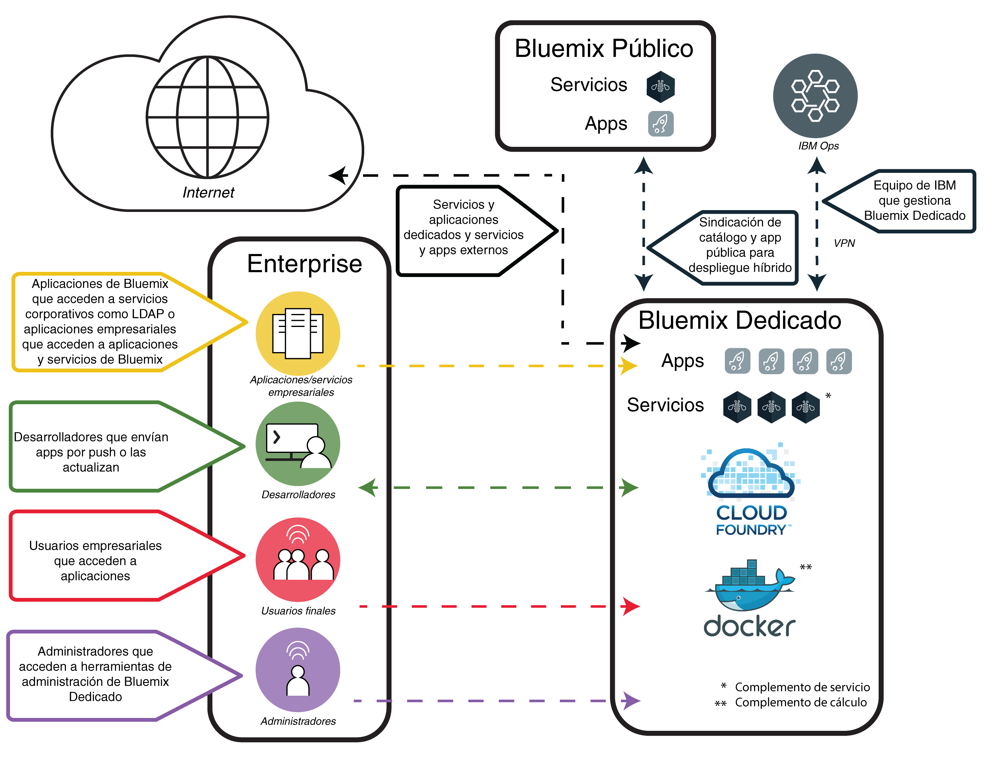

---

copyright:

  years: 2015, 2017

lastupdated: "2017-05-03"

---

{:shortdesc: .shortdesc}

# {{site.data.keyword.Bluemix_dedicated_notm}}
{: #dedicated}

{{site.data.keyword.Bluemix}} es una plataforma de estándares abiertos basada en la nube para crear, ejecutar y gestionar apps. Con {{site.data.keyword.Bluemix_dedicated_notm}}, obtendrá la potencia y la simplicidad de {{site.data.keyword.Bluemix_notm}}&mdash;en su propio entorno dedicado de SoftLayer, que se conecta de forma segura tanto al entorno público de {{site.data.keyword.Bluemix_notm}} como a su propia red.
{:shortdesc}

Los despliegues dedicados de {{site.data.keyword.Bluemix_notm}} incluyen los siguientes beneficios y características sin ningún coste adicional: VPN, red de área local virtual (VLAN) privada, cortafuegos, conectividad con LDAP, optimización de las apps y bases de datos locales existentes, seguridad local 24 horas al día/7 días por semana, hardware dedicado y soporte estándar.

De forma predeterminada, el acceso a su instancia {{site.data.keyword.Bluemix_notm}} privada solo es accesible desde la red corporativa. Si necesita que el entorno de {{site.data.keyword.Bluemix_notm}} sea accesible directamente desde Internet, un dispositivo móvil o una base de datos dedicada, por poner un ejemplo, entonces será necesario un componente de seguridad de red adicional con coste adicional.

{{site.data.keyword.Bluemix_dedicated_notm}} se suministra con todos los tiempos de ejecución de {{site.data.keyword.Bluemix_notm}} incluidos y a los 64 GB de memoria de recursos de cálculo.

Además, hay varios servicios y componentes que se incluyen o que están disponibles para su compra. Revise la tabla siguiente para ver lo que se incluye y qué hay disponible para comprar opcionalmente.

| **Tipo**        | **Nombre**            | **Descripción** |
|-----------------|-------------------|-------------------|
|Incluido | [Tiempos de ejecución de {{site.data.keyword.Bluemix_notm}}](/docs/cfapps/runtimes.html) | Utilice los tiempos de ejecución para que su app esté activa y en funcionamiento con rapidez, sin necesidad de configurar y gestionar las máquinas ni los sistemas operativos. Todos los tiempos de ejecución de {{site.data.keyword.Bluemix_notm}} están disponibles para utilizarlos en la instancia de {{site.data.keyword.Bluemix_dedicated_notm}}.|
| Incluido | [{{site.data.keyword.autoscaling}}](/docs/services/Auto-Scaling/index.html) | Aumente o reduzca de forma dinámica la capacidad de cálculo de la app en función de políticas. Con este servicio, dispone de un uso ilimitado del entorno de {{site.data.keyword.Bluemix_dedicated_notm}}. Nota: El escalado automático sólo funciona en este momento con tiempos de ejecución de Cloud Foundry |
|Opcional | [{{site.data.keyword.apiconnect_short}}](/docs/services/apiconnect/index.html) | {{site.data.keyword.apiconnect_long}} integra {{site.data.keyword.APIM}} e IBM StrongLoop en una única oferta que proporciona una solución completa para crear, ejecutar gestionar e imponer API y microservicios. |
|Opcional | [{{site.data.keyword.rules_short}}](/docs/services/rules/rules.html) | {{site.data.keyword.rules_short}} ofrece un entorno completo para automatizar y ejecutar decisiones empresariales basadas en reglas que se produzcan con frecuencia y que se repitan. También permite que los usuarios empresariales o los desarrolladores tomen decisiones rápidamente y que las prueben a un precio menor, reduciendo así la necesidad de tener habilidades de TI. |
|Opcional | [{{site.data.keyword.cloudant}}](/docs/services/Cloudant/index.html#Cloudant) | {{site.data.keyword.cloudant}} proporciona acceso a una capa de datos JSON de NoSQL completamente gestionada que siempre está activa. Este servicio es compatible con CouchDB y se puede acceder a través de una interfaz HTTP fácil de utilizar para los modelos de aplicación web y móvil. |
|Opcional | [{{site.data.keyword.containershort}}](/docs/containers/container_index.html) | Ejecutar contenedores de Docker en {{site.data.keyword.Bluemix_dedicated_notm}}. Los contenedores son objetos de software virtuales que incluyen todos los elementos que una app necesita para ejecutarse. Un contenedor tiene las ventajas del aislamiento y asignación de recursos, pero es más portable y eficiente que, por ejemplo, una máquina virtual. Para obtener información sobre los requisitos de hardware, consulte [IBM {{site.data.keyword.containershort}} en {{site.data.keyword.Bluemix_dedicated_notm}} y Bluemix Local](/docs/containers/container_ov.html#container_dl).|
| Opcional | [{{site.data.keyword.contdelivery_short}}](/docs/services/ContinuousDelivery/index.html) | Utilice {{site.data.keyword.contdelivery_short}} dedicado para automatizar las compilaciones, las pruebas de unidad, los despliegues y más. Edite y envíe el código a través de un potente IDE basado en web. Cree cadenas de herramientas para habilitar las integraciones de herramientas que dan soporte a las tareas de desarrollo, despliegue y operaciones. |
| Opcional | [{{site.data.keyword.dashdbshort}}](/docs/services/dashDB/dashDB.html) | IBM {{site.data.keyword.dashdbshort}} for Analytics es un servicio de base de datos de nube de SQL totalmente gestionado, optimizado para el almacén de datos y las cargas de trabajo de análisis. IBM {{site.data.keyword.dashdbshort}} for Transactions es un servicio de base de datos de nube de SQL totalmente gestionado, optimizado para el uso general, las apps web y las cargas de trabajo transaccionales. |
| Opcional | [{{site.data.keyword.datacshort}}](/docs/services/DataCache/index.html#data_cache) | Este servicio proporciona una cuadrícula de datos en memoria que da soporte a casos de ejemplo de memoria caché distribuidos para las apps. Incluye 50 GB de memoria caché en memoria. |
| Opcional | [Dedicated GitHub Enterprise](/docs/services/ghededicated/index.html) | {{site.data.keyword.ghe_long}} es la versión alojada en IBM y totalmente gestionada de GitHub Enterprise que proporciona la experiencia social preferida por los desarrolladores. Este servicio actualmente solo está disponible para entornos de {{site.data.keyword.Bluemix_dedicated_notm}}. |
| Opcional (Beta) | [Registro](/docs/monitoringandlogging/cfapps_ml_logs_dedicated_ov.html#container_ml_logs_dedicated_ov) | Proporciona registros para las apps de Cloud Foundry en la interfaz de usuario de {{site.data.keyword.Bluemix_notm}} y registros y paneles de control en los que pueden realizarse búsquedas en Kibana. |
| Opcional | [{{site.data.keyword.messagehub}}](/docs/services/MessageHub/index.html#messagehub) | {{site.data.keyword.messagehub}} es un bus de mensajes escalable, distribuido y de alto rendimiento para unir las tecnologías locales y externas. {{site.data.keyword.messagehub}} se basa en Apache Kafka, que es un motor de mensajería en tiempo real escalable y duradero. |
|Opcional | [{{site.data.keyword.mobilepush}}](/docs/services/mobilepush/index.html) | {{site.data.keyword.mobilepush}} es un servicio que puede utilizar para enviar notificaciones a un dispositivo iOS y Android. Las notificaciones pueden dirigirse a todos los usuarios de aplicaciones o a un conjunto específico de usuarios y dispositivos utilizando etiquetas. Puede administrar dispositivos, etiquetas y suscripciones. También puede utilizar un kit de desarrollo de software (SDK) y una interfaz de programa de aplicación (API) de aplicación REST (Representational State Transfer) para seguir desarrollando las aplicaciones cliente.|
|Opcional | [{{site.data.keyword.SecureGateway}}](/docs/services/SecureGateway/secure_gateway.html) | El servicio {{site.data.keyword.SecureGateway}} proporciona una forma segura para conectar las aplicaciones de {{site.data.keyword.Bluemix_notm}} a ubicaciones remotas locales o en la nube.  |
|Opcional | [{{site.data.keyword.sescashort}}](/docs/services/SessionCache/index.html#session_cache) | Para una mayor redundancia, {{site.data.keyword.sescashort}} proporciona una réplica de una sesión almacenada en la memoria caché. Por lo tanto en el caso de una caída de la red o una interrupción, la aplicación cliente mantiene el acceso a la sesión en la memoria caché. El servicio da soporte a casos de ejemplo de almacenamiento en caché de sesión para aplicaciones web y para móvil. |
| Opcional | [{{site.data.keyword.iot_short}}](/docs/services/IoT/index.html) | Este servicio permite a las apps comunicarse y consumir datos recopilados por los dispositivos, sensores y pasarelas conectados. La oferta base permite ejecutar una versión privada de {{site.data.keyword.iot_short}} dentro del entorno dedicado con una capacidad de 100.000 aplicaciones o dispositivos conectados simultáneamente y 1,6 TB de intercambio de datos. |
| Opcional | [{{site.data.keyword.appserver_short}}](/docs/services/ApplicationServeronCloud/index.html) | IBM {{site.data.keyword.appserver_short}} for IBM {{site.data.keyword.Bluemix_notm}} es un servicio que facilita una rápida configuración en una instancia preconfigurada de {{site.data.keyword.appserver_short}} Liberty, Traditional Network Deployment o Traditional WebSphere Java EE en un entorno de nube alojado en {{site.data.keyword.Bluemix_notm}}. |
{: caption="Tabla 1. Servicios dedicados" caption-side="top"}
{: #table01}

Hay componentes opcionales que se pueden adquirir para escalar y ampliar la capacidad de los recursos y servicios. Puede adquirir cualquiera de estos componentes poniéndose en contacto con el equipo de ventas de; vaya a [Póngase en contacto con nosotros](https://console.ng.bluemix.net/?direct=classic/#/contactUs/cloudOEPaneId=contactUs) para obtener información acerca de cómo ponerse en contacto con un representante de ventas. Para aumentar el plan para un servicio, puede seleccionar el plan en el mosaico del servicio del catálogo.

| **Nombre**            | **Descripción** |
|-------------------|-------------------|
|5 millones de llamadas de API de {{site.data.keyword.apiconnect_short}} Professional dedicado | Un entorno que permite ejecutar una versión privada de {{site.data.keyword.apiconnect_short}} en el entorno dedicado con una capacidad para 5 millones de llamadas de API al mes destinadas a proyectos de API de departamento. |
|Aumento de 100 mil llamadas de API de {{site.data.keyword.apiconnect_short}} Professional dedicado | Una extensión del entorno {{site.data.keyword.apiconnect_short}} Professional para proporcionar una capacidad adicional de 100 mil llamadas de API al mes. |
|25 millones de llamadas de API de {{site.data.keyword.apiconnect_short}} Enterprise dedicado | Un entorno que permite ejecutar una versión privada de {{site.data.keyword.apiconnect_short}} en el entorno dedicado con una capacidad para 25 millones de llamadas de API al mes destinadas a proyectos de API de toda la empresa. |
|Aumento de 100 mil llamadas de API de {{site.data.keyword.apiconnect_short}} Enterprise dedicado | Una extensión del entorno {{site.data.keyword.apiconnect_short}} Enterprise para proporcionar una capacidad adicional de 100 mil llamadas de API al mes. |
|1 millón de decisiones de reglas de IBM {{site.data.keyword.Bluemix_dedicated_notm}} {{site.data.keyword.rules_short}} | Una Decisión de reglas es el resultado de invocar un conjunto de reglas desde un servidor de ejecución de reglas. Se deben obtener suficientes titularidades para cubrir el número total de Decisiones de reglas, redondeadas al millón más cercano, ejecutadas o procesadas, durante el periodo de facturación. Las Decisiones de reglas medidas por este Servicio en la nube son las llamadas realizadas al servidor de ejecución de reglas para tomar una decisión. Los despliegues dedicados del Servicio de nube tienen una capacidad acordada que se mide por la métrica de cargo relevante. La asignación del espacio predeterminado del servicio de {{site.data.keyword.rules_short}} en la plataforma {{site.data.keyword.Bluemix_dedicated_notm}} es de 16 GB, en el que se pueden invocar hasta un máximo de diez instancias de 1 GB para ejecutar las Decisiones de regla autorizadas. Si se excede esta limitación de uso, es necesario comprar capacidad adicional para cubrir esta utilización. |
|Aumento de capacidad de 1,6 TB de {{site.data.keyword.cloudant}} dedicado | Incluye la ejecución de una versión privada de {{site.data.keyword.cloudantfull}} dentro del entorno dedicado con una capacidad de diseño de 1,6 terabytes.  |
|Aumento de capacidad de 50 GB de {{site.data.keyword.datacshort}} y {{site.data.keyword.sescashort}} dedicados | Entorno que permite desplegar y ejecutar instancias de {{site.data.keyword.datacshort}} y {{site.data.keyword.sescashort}} hasta una capacidad acumulativa de 50 GB. |
|Instancia de {{site.data.keyword.contdelivery_short}} dedicado | Una versión privada de {{site.data.keyword.contdelivery_short}} que se ejecuta en un entorno dedicado. La capacidad se determina mediante titularidades de usuario autorizado de {{site.data.keyword.contdelivery_short}} dedicado. |
|Usuario autorizado de {{site.data.keyword.contdelivery_short}} dedicado | Otorga un acceso de Usuario autorizado a y para el uso de un entorno designado de {{site.data.keyword.contdelivery_short}} dedicado. Cada usuario que pertenezca a una organización de {{site.data.keyword.Bluemix_notm}} que contenga una instancia de servicio de {{site.data.keyword.contdelivery_short}} debe estar autorizado. |
|{{site.data.keyword.dashdbshort}} Enterprise 64.1 dedicado | Una base de datos por instancia de servicio en un servidor dedicado con 16 vCPU de 64 GB de RAM. Recomendado para hasta 1 TB de datos de precarga, en función de la compresión típica.  |
|{{site.data.keyword.dashdbshort}} Enterprise 256.4 dedicado | Una base de datos por instancia de servicio en un servidor nativo dedicado con 32 núcleos de 256 GB de RAM. Recomendado para hasta 4 TB de datos de precarga, en función de la compresión típica. |
|{{site.data.keyword.dashdbshort}} Enterprise 256.12 dedicado  | Una base de datos por instancia de servicio en un servidor nativo dedicado con 32 núcleos de 256 GB de RAM. Recomendado para hasta 12 TB de datos de precarga, en función de la comprensión típica. Es un plan denso de almacenamiento adecuado para entornos donde los volúmenes de datos son más altos y las consultas no necesitan ejecutarse en velocidades en memoria. |
|IBM {{site.data.keyword.Bluemix_dedicated_notm}} {{site.data.keyword.dashdbshort}} Enterprise for Transactions 2.8.500 | Instancia dedicada que soporta cargas de trabajo de proceso de transacción en línea (OLTP) con 8 GB de RAM y 500 GB de espacio para datos y registros. |
|IBM {{site.data.keyword.Bluemix_dedicated_notm}} {{site.data.keyword.dashdbshort}} Enterprise for Transactions 12.128.1400 | Instancia dedicada que soporta cargas de trabajo de proceso de transacción en línea (OLTP) con 128 GB de RAM y 1.4 TB de espacio SSD para datos y registros. |
|IBM {{site.data.keyword.Bluemix_dedicated_notm}} {{site.data.keyword.dashdbshort}} Enterprise for Transactions High Availability 2.8.500 | Instancia dedicada que soporta cargas de trabajo de proceso de transacción en línea (OLTP) con 8 GB de RAM y 500 GB de espacio para datos y registros e incluye un servidor en espera adicional para alta disponibilidad. |
|IBM {{site.data.keyword.Bluemix_dedicated_notm}} {{site.data.keyword.dashdbshort}} Enterprise for Transactions High Availability 12.128.1400 | Instancia dedicada que soporta cargas de trabajo de proceso de transacción en línea (OLTP) con 128 GB de RAM y 1.4 TB de espacio SSD para datos y registros e incluye un servidor en espera adicional para alta disponibilidad. |
|Servicios de la comunidad de {{site.data.keyword.Bluemix_dedicated_notm}}  | Un entorno que permite desplegar y ejecutar servicios de comunidad hasta un total de 50 instancias para cada servicio de comunidad.  |
|Instancia de clúster de {{site.data.keyword.Bluemix_dedicated_notm}} {{site.data.keyword.cloudant}} | Este componente opcional incluye un clúster de 3 nodos para el que usted es responsable de proporcionar la infraestructura, y la capacidad de almacenamiento y de cálculo se puede determinar en función de sus necesidades específicas. {{site.data.keyword.cloudant}} proporciona acceso a una capa de datos JSON de NoSQL completamente gestionada que siempre está activa. Este servicio es compatible con CouchDB y se puede acceder a través de una interfaz HTTP fácil de utilizar para los modelos de aplicación web y móvil. |
|IBM {{site.data.keyword.Bluemix_dedicated_notm}} {{site.data.keyword.messagehub}} | Un entorno que proporciona mensajería de publicación/suscripción de hasta 10 GB por partición, con un límite de hasta 100 particiones.  |
|IBM Bluemix Dedicated {{site.data.keyword.mobilepushshort}} | Un entorno que permite el despliegue y la ejecución de instancias de {{site.data.keyword.mobilepushshort}} con capacidad para aceptar 300 solicitudes por segundo. |
|Aumento incremental de {{site.data.keyword.iot_short}} dedicado | Un incremento de entorno que permite ejecutar una versión privada de {{site.data.keyword.iot_short}} dentro del entorno dedicado con una capacidad de 100.000 aplicaciones o dispositivos conectados simultáneamente y 0,5 TB de intercambio de datos. |
|IBM {{site.data.keyword.appserver_short}} for {{site.data.keyword.Bluemix_notm}} - Dedicado pequeño| Una instancia preconfigurada de {{site.data.keyword.appserver_short}} Liberty, Traditional Network Deployment o Traditional WebSphere Java EE en un entorno de nube alojado en {{site.data.keyword.Bluemix_notm}} con 64 vCores, 128 GB de RAM y 1 TB de HDD al mes. |
|IBM {{site.data.keyword.appserver_short}} for {{site.data.keyword.Bluemix_notm}} - Dedicado medio| Una instancia preconfigurada de {{site.data.keyword.appserver_short}} Liberty, Traditional Network Deployment o Traditional WebSphere Java EE en un entorno de nube alojado en {{site.data.keyword.Bluemix_notm}} con 128 vCores, 256 GB de RAM y 2 TB de HDD al mes. |
|IBM {{site.data.keyword.appserver_short}} for {{site.data.keyword.Bluemix_notm}} - Dedicado grande| Una instancia preconfigurada de {{site.data.keyword.appserver_short}} Liberty, Traditional Network Deployment o Traditional WebSphere Java EE en un entorno de nube alojado en {{site.data.keyword.Bluemix_notm}} con 256 vCores, 512 GB de RAM y 4 TB de HDD al mes. |
|IBM {{site.data.keyword.appserver_short}} for {{site.data.keyword.Bluemix_notm}} - Dedicado| Una instancia preconfigurada de {{site.data.keyword.appserver_short}} Liberty, Traditional Network Deployment o Traditional WebSphere Java EE en un entorno de nube alojado en {{site.data.keyword.Bluemix_notm}} con expansión de HDD y 1 TB de HDD al mes. |
{: caption="Tabla 2. Componentes de servicio opcionales para comprar" caption-side="top"}
{: #table02}

| **Nombre**            | **Descripción** |
|-------------------|-------------------|
|Aumento de capacidad de 16 GB de tiempos de ejecución dedicados  | Extensión del entorno de tiempos de ejecución para proporcionar 16 GB adicionales de capacidad de tiempo de ejecución. |
|Capacidad de 1 de enlace directo dedicado | Un enlace de red dedicado que conecta directamente con el punto de presencia de red de {{site.data.keyword.BluSoftlayer}} correcto para las transferencias de datos de hasta 1 Gbps. |
|Capacidad de 10 Gbps de enlace directo dedicado | Un enlace de red dedicado que conecta directamente con el punto de presencia de red de {{site.data.keyword.BluSoftlayer}} correcto para las transferencias de datos de hasta 10 Gbps. |
|IBM Bluemix Dedicated Hardware Firewall - Alta disponibilidad | Un cortafuegos de hardware de 1 Gbps redundante configurado para la protección para un solo servidor, varios servidores o todos los servidores en la misma VLAN dentro del entorno dedicado. |
{: caption="Tabla 3. Componentes de complemento de plataforma opcionales para su compra" caption-side="top"}
{: #table03}

**Nota**: Los componentes de {{site.data.keyword.Bluemix_dedicated_notm}} pueden indicar una capacidad configurada específica, como gigabytes o transacciones por segundo. Dado que la capacidad actual en la práctica para cualquier configuración del servicio de nube varía en función de muchos factores, la capacidad real en la práctica puede ser superior o inferior a la capacidad configurada.

### Catálogo sindicado
{: #catalogdedicated}

{{site.data.keyword.Bluemix_dedicated_notm}} incluye un catálogo privado que aúna servicios aprobados de los despliegues públicos, dedicados y locales. Incluso puede publicar y gestionar el acceso a sus propios servicios a través del catálogo de {{site.data.keyword.Bluemix_notm}}. Tiene la opción de decidir qué servicios públicos cumplen los requisitos de su empresa en función de sus criterios de privacidad de datos y de seguridad.

Si es una instancia privada del servicio para el entorno dedicado, verá una etiqueta "Dedicado" con los nombres del servicio en el catálogo. De forma parecida, si es un servicio personalizado (es decir, para cuya creación se ha utilizado un intermediario de servicio) verá "Personalizado" listado con el nombre del servicio. El resto de servicios listados que no incluyen la etiqueta "dedicado" o "personalizado" están disponibles mediante la sindicación desde {{site.data.keyword.Bluemix_notm}} público. Los servicios sindicados proporcionan la función para crear aplicaciones híbridas que constan de servicios públicos o privados.

|Servicio	|Disponible en la región EE.UU. sur	|Disponible en la región Europa Reino Unido |Disponible en la región Australiana Sídney|
|:----------|:------------------------------|:------------------|:------------------|
|{{site.data.keyword.alchemyapishort}} 		|Sí	   	|Sí  		|Sí|
|{{site.data.keyword.alertnotificationshort}}	|Sí		|Sí		|Sí	|
|{{site.data.keyword.apiconnect_short}}         |Sí            |Sí            |Sí  |
|{{site.data.keyword.appseccloudshort}}		|Sí		|Sí		|Sí |
|{{site.data.keyword.apiconnect_short}} 	|Sí   	 	|Sí  	 	|Sí   |
|Comprobador de accesibilidad automatizado |Sí       |Sí    |Sí   |
|{{site.data.keyword.rules_short}}		|Sí		|Sí		|Sí |
|{{site.data.keyword.cloudant}}			|Sí		|Sí		|Sí |
|{{site.data.keyword.iotmapinsights_short}}    |Sí  |Sí  |Sí  |
|{{site.data.keyword.conversationshort}}  |Sí  |Sí  |Sí  |
|{{site.data.keyword.dashdbshort}}		|Sí		|Sí		|Sí |
|{{site.data.keyword.dataworks_short}}		|Sí		|Sí		|No|
|{{site.data.keyword.DB2OnCloud_short}}		|Sí		|Sí		|Sí |
|Comprobador de contenido digital |Sí  |Sí  |Sí  |
|{{site.data.keyword.documentconversionshort}}	|Sí		|Sí		|Sí|
|{{site.data.keyword.iotdriverinsights_short}}  |Sí |Sí  |Sí  |
|{{site.data.keyword.geospatialshort_Geospatial}}	|Sí	|Sí		|Sí |
|{{site.data.keyword.GlobalizationPipeline_short}}	|Sí		| Sí		| Sí |
|{{site.data.keyword.identitymixershort}}		|Sí		|Sí		|Sí|
|{{site.data.keyword.iot4auto_short}} |Sí   |Sí  |Sí  |
|{{site.data.keyword.iotelectronics}}  |Sí  |Sí  |No |
|{{site.data.keyword.iotinsurance_short}} |No   |No   |Sí  |
|{{site.data.keyword.twittershort}}		|Sí		|Sí		|Sí|
|{{site.data.keyword.languagetranslationshort}}	|Sí		|Sí		|Sí |
|{{site.data.keyword.languagetranslatorshort}} |Sí  |Sí  |Sí  |
|{{site.data.keyword.dwl_short}}  |Sí  |Sí  |No  |
|{{site.data.keyword.eventhubshort}}		|Sí		|No		|No|
|{{site.data.keyword.messagehub}}		|Sí		|Sí		|No|
|{{site.data.keyword.manda}}			|Sí		|Sí		|Sí |
|{{site.data.keyword.amashort}}			|Sí		|Sí		|Sí |
|{{site.data.keyword.mqa}}			|Sí		|Sí		|Sí |
|{{site.data.keyword.mql}}			|No		|No		|Sí |
|{{site.data.keyword.nlclassifierlshort}} 	|Sí 		|Sí 		|Sí|
|{{site.data.keyword.personalityinsightsshort}}	|Sí		|Sí		|Sí|
|{{site.data.keyword.pm_short}}			|Sí		|Sí		|No |
|{{site.data.keyword.mobilepush}}		|Sí		|Sí		|Sí |
|{{site.data.keyword.retrieveandrankshort}}	|Sí 		|Sí 		|Sí|
|{{site.data.keyword.runbook_short}}		|Sí		|Sí		|Sí|
|{{site.data.keyword.SecureGateway}}		|Sí		|Sí		|Sí |
|{{site.data.keyword.ssofull}}			|Sí		|No		|No|
|{{site.data.keyword.speechtotextshort}}	|Sí 		|Sí	 	|Sí|
|{{site.data.keyword.streaminganalyticsshort}}	|Sí		|Sí		|Sí |
|{{site.data.keyword.texttospeechshort}} 	|Sí 		|Sí	 	|Sí|
|{{site.data.keyword.toneanalyzershort}} 	|Sí 		|Sí 		|Sí|
|{{site.data.keyword.tradeoffanalyticsshort}}	|Sí		|Sí		|Sí|
|{{site.data.keyword.visualrecognitionshort}}	|Sí 		|Sí	 	|Sí|
|{{site.data.keyword.iot_short}}		|Sí		|Sí		|No|
|{{site.data.keyword.weather_short}}		|Sí		|Sí		|Sí|
|{{site.data.keyword.workloadscheduler}}	|Sí		|Sí		|Sí |
{: caption="Tabla 4. Servicios disponibles para su sindicación desde Bluemix Public por región" caption-side="top"}
{: #table04}

**Nota**: Los servicios de terceros no están incluidos en la tabla. Compruebe el catálogo dedicado para las opciones de servicio de terceros.

## Arquitectura de {{site.data.keyword.Bluemix_dedicated_notm}}
{: #dedicatedarch}

{{site.data.keyword.Bluemix_dedicated_notm}} se puede desplegar en cualquier centro de datos de [{{site.data.keyword.IBM_notm}} SoftLayer ](http://www.softlayer.com/data-centers){: new_window} del mundo. {{site.data.keyword.IBM_notm}} SoftLayer proporciona la infraestructura de nube que más funciona. Cada centro de datos dispone de servicios de seguridad 24 horas, 7 días `por semana y rigurosos controles.

Cada despliegue de {{site.data.keyword.Bluemix_dedicated_notm}} se dedica a una sola empresa en el hardware dedicado de {{site.data.keyword.IBM_notm}} SoftLayer en su propia red privada. Los entornos de {{site.data.keyword.Bluemix_dedicated_notm}} tienen los mismos estándares de seguridad que {{site.data.keyword.Bluemix_notm}} público en la infraestructura y en la seguridad física y operativa. Sin embargo, el acceso de desarrollador a {{site.data.keyword.Bluemix_notm}} dedicado está controlado por políticas de LDAP, que las pueden configurar el equipo de {{site.data.keyword.Bluemix_notm}} al configurar el entorno. En el entorno dedicado, puede gestionar los roles y permisos de usuarios. Consulte [Gestión de usuarios y permisos](/docs/admin/index.html#oc_useradmin) para ver más detalles. La figura siguiente ilustra la arquitectura lógica de un despliegue de {{site.data.keyword.Bluemix_dedicated_notm}} predeterminado.

Figura 1. Arquitectura predeterminada de diagrama de {{site.data.keyword.Bluemix_dedicated_notm}} detallada
{: #figure01}

Los componentes arquitectónicos significativos descritos en el diagrama de arquitectura anterior incluye lo siguiente:

<dl>
<dt>{{site.data.keyword.IBM_notm}} Cloud</dt>
<dd>
El entorno de nube de {{site.data.keyword.IBM_notm}} en conjunto incluye los siguientes entornos de red:
<ul>
<li>{{site.data.keyword.Bluemix_dedicated_notm}}</li>
<li>{{site.data.keyword.Bluemix_notm}} público</li>
<li>{{site.data.keyword.IBM_notm}} Operations</li>
</ul>
</dd>
<dt>{{site.data.keyword.Bluemix_dedicated_notm}}</dt>
<dd>
Como mínimo, contiene los componentes de Cloud Foundry y algunos servicios de aplicaciones dedicados. {{site.data.keyword.Bluemix_notm}} proporciona entornos de cálculo basados en Cloud Foundry y en {{site.data.keyword.containerlong}}. Una empresa puede tener configurado uno de estos entornos de cálculo o ambos. 
Una empresa puede tener servicios de aplicaciones dedicados adicionales. 
Consulte [table 2](#table02) para ver los servicios adicionales y las funciones de cálculo que se pueden añadir.
</dd>
<dt>{{site.data.keyword.Bluemix_notm}} público</dt>
<dd>
Un {{site.data.keyword.Bluemix_dedicated_notm}} puede incluir una conexión de salida a una región pública de {{site.data.keyword.Bluemix_notm}}. Esto proporciona la sindicación de servicios públicos en el catálogo dedicado. La sindicación del servicio {{site.data.keyword.Bluemix_notm}} público ofrece a los desarrolladores un método práctico para crear aplicaciones alojadas en {{site.data.keyword.Bluemix_dedicated_notm}} y los servicios de acceso de su empresa que se ejecutan en {{site.data.keyword.Bluemix_notm}} público. La lista de servicios que se pueden sindicar desde {{site.data.keyword.Bluemix_notm}} público se muestra en la [tabla 4 de la sección Catálogo sindicado](#catalogdedicated).
</dd>
<dt>{{site.data.keyword.IBM_notm}} Operations</dt>
<dd>
{{site.data.keyword.IBM_notm}} gestiona, supervisa y mantiene la plataforma y los servicios dedicados, de modo que pueda centrarse en la creación de aplicaciones innovadoras. El equipo de Servicios de soporte de operaciones (OSS) de {{site.data.keyword.IBM_notm}} lleva a cabo operaciones utilizando una conexión de túnel VPN desde la red de {{site.data.keyword.IBM_notm}} Operations.
</dd>
<dt>Empresa</dt>
<dd>
El entorno de red de la empresa puede tener un enlace de red bidireccional privado seguro a {{site.data.keyword.Bluemix_dedicated_notm}}. Esto permite que las aplicaciones alojadas en {{site.data.keyword.Bluemix_dedicated_notm}} puedan acceder a los servicios y recursos de la empresa, incluidas fuentes de datos y servicios de empresa. Este enlace de red también permite a {{site.data.keyword.Bluemix_dedicated_notm}} utilizar su LDAP para la autenticación de desarrolladores y administradores de la empresa. 
 
Existen varias opciones para crear el enlace de red privada protegido. Póngase en contacto con el técnico especialista de IBM para ver la mejor opción de red para su empresa. 
 
La conexión predeterminada desde {{site.data.keyword.Bluemix_dedicated_notm}} a su red de empresa utiliza una red privada virtual (VPN). {{site.data.keyword.Bluemix_dedicated_notm}} tiene una terminación Dedicated 1 Gbps Vyatta VPN configurada para la alta disponibilidad.
 
En la arquitectura predeterminada para {{site.data.keyword.Bluemix_dedicated_notm}} tal como se muestra en la [figure 1](#figure01), no hay ningún tráfico de red de entrada directamente desde Internet. Si su empresa desea permitir el acceso a Internet para aplicaciones alojadas en {{site.data.keyword.Bluemix_dedicated_notm}}, el acceso se debe configurar a través de su red de Enterprise.
</dd>
</dl>

## Configuración de {{site.data.keyword.Bluemix_dedicated_notm}}
{: #setupdedicated}

{{site.data.keyword.Bluemix_dedicated_notm}} se ha diseñado para proporcionar una versión privada del producto {{site.data.keyword.Bluemix_notm}} público. Puede utilizar los servicios y tiempos de ejecución de {{site.data.keyword.Bluemix_notm}} para satisfacer sus requisitos de cálculo en una cuenta {{site.data.keyword.BluSoftlayer}} alojada en IBM.

IBM le proporciona acceso a {{site.data.keyword.Bluemix_dedicated_notm}} mediante un inicio de sesión protegido por contraseña. Puede acceder a los servicios, tiempos de ejecución y recursos asociados, y desplegar y eliminar apps {{site.data.keyword.Bluemix_notm}}. IBM se beneficia de varias ubicaciones de {{site.data.keyword.BluSoftlayer}} para ofrecer {{site.data.keyword.Bluemix_dedicated_notm}}, de modo que puede obtener su versión privada en una ubicación cercana.

Para configurar su versión privada de {{site.data.keyword.Bluemix_notm}}:

<ol>
<li>Póngase en contacto con el representante designado de la cuenta de IBM o con el contacto de <a href="https://console.ng.bluemix.net/?direct=classic/#/contactUs/cloudOEPaneId=contactUs" target="_blank"> {{site.data.keyword.Bluemix_notm}} </a> para empezar a trabajar.</li>
<li>Trabaje con IBM, a cargo del cliente, para configurar la instancia de {{site.data.keyword.Bluemix_dedicated_notm}}. El cargo mensual se basa en los servicios dedicados que desee utilizar, más una suscripción a todos los servicios públicos de {{site.data.keyword.Bluemix_notm}}. Recibirá una factura por todo lo que utilice por encima del acuerdo de suscripción.</li>
<li>Identifique los plazos límite para cada fase de la configuración de la instancia de {{site.data.keyword.Bluemix_dedicated_notm}}. Para obtener información sobre cada fase y las tareas implicadas, consulte <a href="/docs/dedicated/index.html#rolesresponsibilities">Roles y responsabilidades de {{site.data.keyword.Bluemix_dedicated_notm}}</a>.</li>
<li>Seleccione la <a href="http://www.softlayer.com/data-centers" target="_blank">ubicación del centro de datos de {{site.data.keyword.BluSoftlayer}} </a> para su instancia dedicada. A partir de aquí se crea la plataforma dedicada y la cuenta. Para la cuenta, identifique las personas de la organización para los roles necesarios para configurar y activar la instancia dedicada. Para obtener información sobre los roles que puede asignar, consulte <a href="/docs/dedicated/index.html#rolesresponsibilities">Roles y responsabilidades de {{site.data.keyword.Bluemix_dedicated_notm}}</a>.
</li>
<li>Defina y establezca la conectividad de red entre su red corporativa y la instancia de {{site.data.keyword.Bluemix_dedicated_notm}}. Existe un dispositivo de seguridad de red obligatorio que incluye funciones de firewall y prevención de intrusión con un coste adicional para esta opción.
	<ol type="a">
	<li>IBM instala la infraestructura de supervisión y seguridad para la instancia dedicada.</li>
	<li>IBM instala los servicios dedicados de arrendatario único que seleccione.</li>
	<li>El cliente proporciona la configuración de la red y puntos finales para elementos tales como direcciones IP o cortafuegos y acceso a LDAP para la integración en {{site.data.keyword.Bluemix_notm}}.</li>
	</ol>
</li>
<li>Identifique y asigne roles para el equipo de administración del entorno.
	<ol type="a">
	<li>IBM configura el acceso a la red y LDAP en función de lo que proporcione el usuario. Se ofrece acceso de administración a los contactos que designe el cliente. También debe designar un contacto para soporte y facturación.</li>
	<li>IBM configura un catálogo sindicado en el entorno dedicado para mostrar los servicios dedicados. El catálogo sindicado incluye servicios adicionales sindicados y disponibles para que los utilice el usuario a partir de {{site.data.keyword.Bluemix_notm}} público. Tiene la opción de decidir qué servicios públicos cumplen los requisitos de su empresa en función de sus criterios de privacidad de datos y de seguridad.</li>
	<li>El cliente debe validar la configuración de la red y del cortafuegos, además del punto final LDAP y el acceso.</li>
	</ol>
</li>
</ol>

Puede prever un proceso similar a la siguiente lista para el despliegue y la configuración iniciales de su entorno. Para obtener detalles sobre la persona responsable de cada tarea, consulte [Roles y responsabilidades](index.html#rolesresponsibilities).

<ol>
<li>Se selecciona el centro de datos a utilizar para que aloje la instancia dedicada. Para obtener información sobre las opciones del centro de datos, consulte <a href="http://www.softlayer.com/data-centers" target="_blank">Ubicación del centro de datos de {{site.data.keyword.BluSoftlayer}} </a>.</li>
<li>Debe especificar los nombres de dominio para el despliegue, y los ID que desea utilizar. Obtendrá tres dominios al configurar la instancia de {{site.data.keyword.Bluemix_notm}}. Seleccione el prefijo para <code>*mycompany*.*region*.bluemix.net</code> y <code>*mycompany*.*region*.mybluemix.net</code>. Y puede elegir el nombre completo del tercer dominio. 

Puede elegir tantos dominios personalizados como desee. Sin embargo, el usuario es responsable de los certificados para los dominios personalizados. Para obtener información sobre cómo crear el dominio personalizado, consulte <a href="/docs/manageapps/updapps.html#domain">Creación y utilización de un dominio personalizado</a>.
</li>
<li>Debe identificar un propietario para la cuenta pública que se utiliza para representar la empresa en {{site.data.keyword.Bluemix_notm}} público. IBM utiliza esta cuenta para realizar el seguimiento del uso de los servicios sindicados.</li>
<li>Seleccione el tipo de conexión segura en el centro de datos. Puede seleccionar desde {{site.data.keyword.Bluemix_notm}} VPN, {{site.data.keyword.Bluemix_notm}} Direct Link y AT&T Net Bond.</li>
<li>Decida si habrá acceso al entorno dedicado desde la Internet pública.</li>
<li>Seleccione el tipo de autenticación que se utilizará. Puede seleccionar entre el ID de IBM y Active Directory. Para obtener información sobre cómo utilizar y registrarse para obtener un ID de IBM, consulte la página <a href="https://www.ibm.com/account/profile/us?page=regfaqhelp#4">Ayuda y preguntas frecuentes</a>.
</li>
<li>Identifique y asigne roles para el equipo de administración del entorno. Para obtener información sobre los roles que debe asignar, consulte <a href="/docs/dedicated/index.html#rolesresponsibilities">Roles y responsabilidades de {{site.data.keyword.Bluemix_dedicated_notm}}</a>.</li>
<li>IBM despliega la plataforma principal que incluye los tipos de ejecución elásticos, la consola, la función de administración y la supervisión.</li>
<li>IBM configura el acceso administrativo al entorno.</li>
<li>Puede empezar utilizando la instancia dedicada que está supervisada por el equipo de operaciones de IBM para responder a las alertas.</li>
</ol>

Una vez que se configure la instancia de {{site.data.keyword.Bluemix_notm}}, puede supervisar y gestionar la instancia de {{site.data.keyword.Bluemix_notm}} utilizando la página Administración. Para obtener más información, consulte [Gestión de {{site.data.keyword.Bluemix_notm}} local y dedicado](../admin/index.html#mng). Para obtener información sobre las actualizaciones y el mantenimiento, consulte [Mantenimiento de la instancia dedicada](index.html#maintaindedicated).

##Roles y responsabilidades
{: #rolesresponsibilities}

Si establece una cuenta de {{site.data.keyword.Bluemix_dedicated_notm}}, puede identificar a las personas de su organización para los roles necesarios para configurar y activar la instancia.

###Roles

La lista siguiente muestra los roles y responsabilidades de cliente que se asignan:

<dl>
<dt>**Contacto de suministro**</dt>
<dd>Trabaja con el representante de IBM en el establecimiento del entorno de {{site.data.keyword.Bluemix_dedicated_notm}}, incluida la identificación de las personas adecuadas de la organización que trabajarán en cualquier aspecto del proyecto. La persona asignada a este rol toma un rol de gestión de proyectos y supervisa la selección del patrón, las formas comerciales y la disposición de acceso a los recursos del cliente. El contacto de suministro es el contacto general para configurar la instancia dedicada y para rastrear el proceso del despliegue.</dd>
<dt>**Responsable de suministro**</dt>
<dd>Trabaja con el representante de IBM para seleccionar una topología y opción de despliegue que se ajuste a sus requisitos de seguridad. La persona asignada a este rol trabaja con el asesor de suministro de IBM para determinar qué patrones de despliegue consiguen los objetivos y las metas de conformidad.</dd>
<dt>**Especialista en redes**</dt>
<dd>Trabaja con el representante de IBM en los planes de red para el despliegue de {{site.data.keyword.Bluemix_notm}}. La persona asignada a este rol revisa las especificaciones de red necesarias para IBM y trabaja conjuntamente con IBM en un plan de implementación. Al final de la fase de instalación y de verificación, la persona asignada a este rol concluirá que la configuración de red está en conformidad con los estándares corporativos.</dd>
<dt>**Contacto de DevOps**</dt>
<dd>Trabaja con el representante de IBM para planificar y aplicar las actualizaciones de mantenimiento necesarias para la plataforma, servicios y tiempos de ejecución de {{site.data.keyword.Bluemix_notm}}. La persona asignada a este rol también trabaja con el representante de IBM en la configuración de la instancia de {{site.data.keyword.Bluemix_dedicated_notm}}.</dd>
<dt>Contacto de operaciones</dt>
<dd>Trabaja con el equipo de soporte de IBM cuando sea necesario una vez el entorno está activo y en ejecución. Se trata de alguien con acceso de Superusuario a la consola de administración que puede aprobar y planificar actualizaciones de mantenimiento para el entorno Bluemix y que está siempre disponible en el caso de que se produzca un incidente crítico. La persona asignada a este rol debe tener conocimientos técnicos del entorno Bluemix y debe tener capacidad para establecer contacto con la persona de la organización con los conocimientos específicos del área que se vea afectada, incluidas, por ejemplo, las áreas de red o de seguridad.</dd>
</dl>

Los representantes de los clientes trabajan con los especialistas de IBM que trabajan conjuntamente para asegurarse de que siempre tenga el soporte que necesita. Puede actualizar al nivel de soporte Premium para trabajar con un CSM (Client Success Manager) dedicado para su cuenta. Para obtener más información sobre los distintos niveles de soporte, consulte [Cómo obtener soporte](../support/index.html#contacting-support). El CSM completa los siguientes tipos de tareas:

<ul>
<li>Permite una adopción rápida del entorno {{site.data.keyword.Bluemix_dedicated_notm}}.</li>
<li>Entrega valiosos materiales de formación y capacitación para mejorar su autosuficiencia.</li>
<li>Establece una relación duradera entre usted y el desarrollo, el soporte y los servicios de {{site.data.keyword.Bluemix_notm}} que utilice.</li>
</ul>

El equipo de soporte y operaciones de {{site.data.keyword.Bluemix_notm}} que trabaja con usted en la instancia de {{site.data.keyword.Bluemix_notm}} puede acceder a su entorno local, pero solo por los siguientes motivos:

<ul>
<li>Para responder a las alertas y realizar tareas de mantenimiento operativo</li>
<li>Para intentar reproducir un problema notificado en una incidencia de soporte</li>
</ul>

### Responsabilidades

Desde configurar su entorno hasta efectuar tareas de mantenimiento continuado, hay una gran variedad de tareas que deben llevarse a cabo. En la tabla siguiente se describen las tareas necesarias, así como el encargado de llevar a cabo la tarea durante la fase inicial, de progresión y de finalización.

La fase inicial se utiliza para establecer el entorno de {{site.data.keyword.Bluemix_dedicated_notm}}. Los objetivos principales de dicha fase son los siguientes:

- Revisar el acuerdo financiero y establecer las fechas objetivo para la entrega.
- Crear la plataforma {{site.data.keyword.Bluemix_notm}} y proporcionar acceso a tiempos de ejecución y servicios.
- Definir y establecer la conectividad de red entre su red corporativa y las operaciones de {{site.data.keyword.Bluemix_notm}}.
- Identificar y asignar roles al equipo de administración.

| **Tarea** | **Detalles de la tarea** | **Parte responsable** |
|----------|------------------|-----------------------|
|Establecer estándares de conformidad | Identificar estándares gubernamentales, sectoriales y de propiedad corporativa necesarios para el entorno. | Cliente |
|Crear un plan de seguridad y de integración de conformidad | Crear un plan de seguridad e integración que incluya costes, planificación y recursos necesarios para conseguir la conformidad de seguridad. | IBM |
|Aprobación de un plan de conformidad | Aprobar el plan de conformidad. | Cliente |
|Crear una variación de tamaño para los entornos |  	Crear una variación de tamaño de los entornos en función de opciones predefinidas que tengan en cuenta los objetivos de alta disponibilidad y la recuperación en caso de error, así como el DEA inicial y el suministro de servicios necesario para dar soporte a las apps creadas con la plataforma. Usted e IBM trabajan conjuntamente para definir, por ejemplo, qué bases de datos son necesarias, qué servicios se ofrecen en el catálogo sindicado del cliente, entre otros. | Responsabilidad compartida de IBM y el cliente |
|Seleccionar una arquitectura | Seleccionar una arquitectura basada en opciones predefinidas que tengan en cuenta requisitos de alta disponibilidad y de recuperación en caso de desastre. | IBM |
|Definir objetivos de recuperación en caso de error | Definir los requisitos de recuperación en caso de error para el entorno. | Cliente |
|Crear un plan de recuperación en caso de error | Consultar y definir el plan de recuperación en caso de error. IBM crea un modelo de recuperación en caso de error y le consulta donde debe proporcionar comentarios y aprobar el plan. | Responsabilidad compartida de IBM y el cliente |
|Crear un plan de copia de seguridad y recuperación | Crear un plan de copia de seguridad y recuperación que defina la frecuencia y los requisitos para la distribución interna y externa de la copia de seguridad. IBM realiza una copia de seguridad de componentes de entramados, servicios de IBM, metadatos de servicios (roles de usuarios), etc. Debe realizar una copia de seguridad de todos los datos específicos de app de los que sea responsable. | Responsabilidad compartida de IBM y el cliente |
|Identificar herramientas para la detección de sucesos y la determinación de problemas | Identificar herramientas de IBM y de terceros utilizadas para la detección de sucesos y la determinación de problemas en el nivel de plataforma de {{site.data.keyword.Bluemix_notm}}. | IBM |
|Definir un plan de escalamiento | Definir el plan de escalamiento para seleccionar y resolver sucesos detectados desde los componentes de supervisión. | IBM |
|Firmar acuerdos de infraestructuras, plataformas y soporte | Firmar el acuerdo de suscripción, incluidos los términos y condiciones financieros del entorno. Firmar una suscripción de soporte. | Cliente |
|Obtener un entorno | Obtener recursos informáticos, redes y almacenamiento, incluyendo VLAN principales y de servicios para alojar servicios nativos de {{site.data.keyword.Bluemix_notm}}, y alojar Data Power y el cortafuegos de {{site.data.keyword.Bluemix_notm}}. Proporcionar una infraestructura para el túnel VPN. | IBM |
|Instalar componentes de estructura, app y supervisión y gestión | Instalar, configurar y verificar componentes de estructura, como BOSH Director, Cloud Controller, Health Manager, mensajería, routers, DEA y proveedores de servicios y los componentes de supervisión definidos en el plan de escalamiento y detección de problemas. | IBM |
|Instalar y configurar componentes de seguridad | Instalar y configurar componentes de seguridad enlazados con el plan de supervisión y escalamiento, incluyendo IBM QRadar, almacén de credenciales, sistema de prevención de intrusión, IBM BigFix e IBM Security Privileged Identity Management. | IBM |
|Instalar y configurar componentes personalizados |  	Instalar y configurar componentes personalizados que residen fuera del ámbito del producto y los servicios de {{site.data.keyword.Bluemix_notm}}. | Cliente |
|Establecer una configuración inicial de red | Establecer una configuración inicial de red incluyendo cortafuegos, DataPower, Fortigate y DNS. | IBM |
|Conectar el conducto de {{site.data.keyword.Bluemix_notm}} | Conectar la integración continua y el conducto de entrega continua de {{site.data.keyword.Bluemix_notm}} con repositorios de IBM. | IBM |
|Personalizar componentes de soluciones externas | Personalizar equilibradores de carga para escenarios de recuperación en caso de error. | Cliente |
|Instalar una solución VPN | Instalar una solución VPN bidireccional. | IBM |
|Configurar un servidor de inicio de sesión | Configurar el servidor de inicio de sesión para utilizarlo con el LDAP corporativo. | IBM |
|Hacer un seguimiento del estado de la seguridad, la conformidad y los controles de auditoría  | Hacer un seguimiento del estado hasta el punto en que todas las herramientas y procesos estén en regla para conseguir la conformidad identificada. | Cliente |
|Revisar la infraestructura física | Revisar las instalaciones físicas que alojan los componentes de la solución para detectar amenazas y revisar los controles de seguridad para proteger el centro de datos. | Cliente |
|Inspeccionar el software de supervisión | Inspeccionar los componentes de supervisión y gestión, como se define en el plan de escalamiento y determinación de problemas. | Cliente |
|Inspeccionar el SO | Inspeccionar y asegurarse de que la imagen del sistema operativo cumple los estándares de conformidad. IBM proporciona acceso a la imagen del SO. | Responsabilidad compartida de IBM y el cliente |
{: caption="Tabla 5. Tareas de fases iniciales" caption-side="top"}

A continuación tenemos la fase de progresión. En la fase de progresión se describe la relación de colaboración entre usted e IBM Cloud. Los objetivos principales de esta fase son los siguientes:

- Revisar la capacidad y coordinar los ajustes necesarios.
- Revisar el mantenimiento y las mejoras en la plataforma.
- Coordinar las actividades para la resolución de problemas y analizar las causas originarias.

| **Tarea** | **Detalles de la tarea** | **Parte responsable** |
|----------|------------------|-----------------------|
|Revisar informes de capacidad semanalmente | Revisar los informes de capacidad semanalmente y tomar acciones de corrección, si procede. | Cliente |
|Crear proyecciones mes a mes | Recopilar información y crear una proyección mes a mes de la capacidad y el consumo. | Responsabilidad compartida de IBM y el cliente |
|Revisar las proyecciones de capacidad | Revisar las proyecciones de capacidad relacionadas con sucesos externos que puedan afectar a la capacidad, así como la previsión de nuevos despliegues de apps. Trabajar con IBM para revisar las proyecciones y efectuar una planificación según convenga. | Responsabilidad compartida de IBM y el cliente |
|Revisar las proyecciones | Revisar las proyecciones de capacidad con relación a los sucesos externos que puedan afectar a la capacidad. | Cliente |
|Ajustar la capacidad |  Añadir o eliminar capacidad a medida que cambien sus necesidades. | IBM |
|Publicar actualizaciones venideras y realizar mantenimiento | Crear documentación para el mantenimiento necesario de los componentes de IBM. | IBM |
|Realizar tareas de mantenimiento | Trabajar con IBM para planificar tareas de mantenimiento necesarias en un intervalo de 21 días. Puede proporcionar fechas que no le vayan bien en dicho período de 21 días, e IBM trabajará para planificar el mantenimiento según convenga. | Responsabilidad compartida de IBM y el cliente |
|Abordar fallos de aprovisionamiento | Corregir fallos de aprovisionamiento, si se producen, de los servicios creados por el cliente desplegados en el catálogo. | IBM |
|Realizar exploraciones de red y de IP | Realizar exploraciones diarias y mensuales de red y de IP. | Responsabilidad compartida de IBM y el cliente |
|Proporcionar acceso a los registros de auditoría | Proporcionar acceso a todos los registros de auditoría de seguridad y administración.   | Responsabilidad compartida de IBM y el cliente |
|Realizar pruebas | Realizar pruebas Key Controls over Operations (KCO) periódicas y pruebas de penetración de terceros. | Responsabilidad compartida de IBM y el cliente |
|Informes de estado, coordinación de auditorías y reuniones de conformidad  | Efectuar informes de estado, coordinación de auditorías externas y representación en reuniones de estado de revisión de conformidad. | IBM |
|Verificación de necesidades empresariales y de ocupación | Efectuar verificaciones de ocupación trimestrales y verificaciones de necesidades empresariales continuadas para los representantes de IBM que tienen acceso al entorno del cliente. | IBM |
|Resolución de vulnerabilidades de seguridad | Resolver vulnerabilidades de seguridad notificadas en la plataforma. | IBM |
{: caption="Tabla 6. Tareas de las fases de progresión" caption-side="top"}

La etapa final de la finalización representa el final de la relación entre usted e IBM {{site.data.keyword.Bluemix_notm}}. Las tareas principales de esta fase son las siguientes:

* Finalización del acuerdo financiero
* Eliminación de todas las conexiones de red
* Reciclaje de la infraestructura

| **Tarea** | **Detalles de la tarea** | **Parte responsable** |
|----------|------------------|-----------------------|
|Finalizar el acuerdo financiero | Debatir y acordar el contrato del acuerdo financiero. | Responsabilidad compartida de IBM y el cliente |
|Retirar el entorno | Cerrar el acceso y retirar las credenciales del entorno. | Responsabilidad compartida de IBM y el cliente |
|Eliminar las conexiones de red del cliente | Eliminar las conexiones de red entre IBM y el entorno del cliente. | Responsabilidad compartida de IBM y el cliente |
|Reciclar la infraestructura | El entorno se recicla a partir de procesos definidos con {{site.data.keyword.BluSoftlayer}}. | IBM |
{: caption="Tabla 7. Tareas de la fase de finalización" caption-side="top"}

##Mantenimiento de la instancia dedicada
{: #maintaindedicated}

IBM mantiene e instala actualizaciones y arreglos como IBM considere adecuado para los tiempos de ejecución y servicios de {{site.data.keyword.Bluemix_notm}}. Es posible que los servicios no estén disponibles durante las ventanas de mantenimiento. Además, IBM trabaja con usted para planificar actualizaciones de mantenimiento para la plataforma {{site.data.keyword.Bluemix_notm}}.

Se requieren los siguientes tipos de mantenimiento para {{site.data.keyword.Bluemix_dedicated_notm}}:
<dl>
<dt>**Mantenimiento estándar para servicios**</dt>
<dd>Los servicios utilizan ventanas de mantenimiento estándar y predefinidas, lo cual podría hacer que los servicios no estén disponibles. IBM no requiere aprobación del cliente para realizar el mantenimiento de servicios, aunque intenta minimizar el impacto en los servicios. 
 
IBM envía mensajes de difusión general de los cambios planificados para cada ventana de mantenimiento en la página Estado. 
 
**Importante**: Es posible que algún servicio no esté disponible durante el periodo de mantenimiento.</dd>

<dt>**Mantenimiento estándar para la plataforma de {{site.data.keyword.Bluemix_notm}}**</dt>
<dd>Las actualizaciones de mantenimiento se aplican en función de la coordinación entre el usuario e IBM dentro de un periodo de 21 días. Proporcione a IBM ventanas de mantenimiento y fechas u horas específicas aprobadas previamente que pueden no funcionar para usted, e IBM trabaja para planificar actualizaciones durante o alrededor de las fechas seleccionadas.

Vaya a **ADMINISTRACIÓN > INFORMACIÓN DEL SISTEMA** para ver las actualizaciones de mantenimiento planificadas y pendientes. Para obtener más información sobre cómo establecer las ventanas aprobadas previamente y las fechas no disponibles y para visualizar o aprobar actualizaciones de mantenimiento planificadas, consulte <a href="/docs/admin/index.html#oc_schedulemaintenance">Actualizaciones de mantenimiento</a>.
</dd>
</dl>

**Importante**: IBM se reserva el derecho de interrumpir servicios para aplicar mantenimiento emergencia si es necesario. IBM puede modificar las horas de mantenimiento planificadas, pero le notificará cualquier cambio, así como la información de mantenimiento de emergencia.

Si hay un problema después de una actualización de mantenimiento, acuerda con el soporte de {{site.data.keyword.Bluemix_notm}} si le conviene permitir que IBM retrotraiga la actualización. Si se acuerda, IBM retrotrae la actualización para restaurar el entorno al estado anterior.

## Respuesta y soporte de incidencias para {{site.data.keyword.Bluemix_dedicated_notm}}
{: #incidentresponse}

### Problemas detectados por el cliente

Si detecta un problema que necesite la atención de operaciones y soporte de IBM puede ponerse en contacto con el soporte mediante diversos
métodos. Para obtener información sobre cómo contactar con el soporte, consulte [Cómo obtener soporte](../support/index.html#contacting-bluemix-support-local). Según la naturaleza del problema, el usuario, IBM o ambos pueden trabajar para solucionarlo.

### Incidencias críticas detectadas por IBM

Las incidencias críticas son urgentes, cortes de servicio inesperados y problemas de estabilidad que afectan a su
entorno o sus usuarios. Si IBM detecta una incidencia crítica en su entorno, se le envía una notificación en la página
**Estado**. También se puede revisar la página Estado para buscar problemas conocidos para la plataforma o
sus servicios. Para obtener más información sobre la página Estado, consulte [Visualización de estado](../admin/index.html#oc_status).

Si quiere integrar sus notificaciones con un servicio web que admita ganchos (hooks), consulte
[Notificaciones y suscripciones de sucesos](../admin/index.html#oc_eventsubscription) para obtener información sobre
cómo ampliar las funciones de notificación.

Figura 2. Proceso de respuesta de incidencias

Según la naturaleza del problema, el usuario, IBM o ambos pueden trabajar para solucionarlo. Si tiene alguna pregunta relativa a la incidencia, o si necesita que un representante de IBM le ayude a resolver el problema, puede abrir una incidencia de soporte. Para obtener información sobre cómo contactar con el soporte, consulte [Cómo obtener soporte](/docs/support/index.html#contacting-bluemix-support-local).

**Nota**: Las incidencias de soporte de gravedad 1 se supervisan 24 horas al día, 7 días por semana. Otras incidencias
se procesan desde las 22:00 del domingo (GMT) hasta las 00:00 del sábado (GMT). Para obtener más información sobre la gravedad de
las incidencias de soporte y cómo trabajar con soporte, consulte <a href="/docs/support/index.html#contacting-bluemix-support-local">Contacto
con soporte</a>.

## Recuperación tras desastre para {{site.data.keyword.Bluemix_dedicated_notm}}
{: #dr}

La recuperación tras desastre para {{site.data.keyword.Bluemix_short}} dedicado puede configurarse de forma parecida a la forma en que funciona cuando utiliza
{{site.data.keyword.Bluemix_short}} público. {{site.data.keyword.Bluemix_short}} público proporciona una plataforma disponible de forma continua para la innovación con varias medidas libre de errores para garantizar que las organizaciones, los espacios y las apps estén siempre disponibles. El despliegue de apps en varias regiones geográficas permite la disponibilidad continua, que protege frente a la pérdida no planificada y simultánea de varios componentes de hardware o software, o la pérdida de todo un centro de datos, de modo que, incluso en el caso de un desastre natural en una ubicación geográfica, las instancias distribuidas de la app de {{site.data.keyword.Bluemix_notm}} público, situadas en ubicaciones geográficas alternativas, seguirán estando disponibles.
{: shortdesc}

La recuperación en caso de error de {{site.data.keyword.Bluemix_short}} dedicado es posible gracias a la disponibilidad continua de sus apps, la alta disponibilidad inherente de la plataforma y la capacidad de restaurar la instancia en caso de error. Es responsable de habilitar una disponibilidad continua de sus apps desplegándolas en varias regiones. La alta disponibilidad está integrada en el nivel de la plataforma mediante tecnologías incluidas en Cloud Foundry y otros componentes. También puede trabajar conjuntamente con IBM para asegurarse de que se ha hecho una copia de seguridad correcta de sus datos en el caso de que necesite restaurar su instancia en cualquier momento.

### Habilitación de la disponibilidad continua para {{site.data.keyword.Bluemix_dedicated_notm}}
{: #enabling}

De forma predeterminada, {{site.data.keyword.Bluemix_notm}} público se despliega en varias ubicaciones geográficas. Sin embargo, debe llevar a cabo lo siguiente para habilitar las instancias de {{site.data.keyword.Bluemix_dedicated_notm}} distribuidas globalmente:

* Asegúrese de que los desarrolladores están desplegando apps en más de una región, ya sea a través de un proceso manual o automatizado. Las regiones deben estar a una distancia de más de 200 km entre ellas para garantizar que, en caso de desastre natural, ambas ubicaciones geográficas no se vean afectadas.
* Configure un equilibrador de carga global, como Akamai o Dyn, para que apunten a apps en al menos dos regiones distintas.

**Nota**: No todos los servicios de {{site.data.keyword.Bluemix_notm}} admiten la distribución regional. Al construir una app, si desea lograr la distribución geográfica, también debe asegurarse de que los servicios que se utilizan en la app tienen la sincronización de datos como característica clave.

#### Despliegue de apps de {{site.data.keyword.Bluemix_dedicated_notm}} en varias ubicaciones geográficas
{: #deploying}

Para efectuar un despliegue en una segunda ubicación o en varias ubicaciones, debe seguir un proceso similar al que siguió para habilitar la ubicación geográfica primaria:

1. Habilite un nuevo entorno dedicado para alojar instancias adicionales de las apps. Para crear un nuevo entorno, póngase en contacto con el equipo de ventas de IBM para iniciar el proceso. Para obtener más información sobre cómo configurar una instancia dedicada, consulte [Configuración de {{site.data.keyword.Bluemix_dedicated_notm}}](/docs/dedicated/index.html#setupdedicated). Debe iniciar sesión por separado para acceder a cada entorno. Cada ubicación física de los entornos alojados debe estar a una distancia mínima de 200 km de la ubicación original para garantizar la disponibilidad.
2. Obtenga el nombre de dominio exclusivo en el que se alojará la nueva app desplegada.  Por ejemplo, si el dominio original es *mycompany.caeast.bluemix.net*, puede crear un nuevo entorno local con un nuevo dominio como *mycompany.cawest.bluemix.net* y realizar el despliegue en el nuevo dominio.
3. Cada vez que despliegue la app original, también la desplegará en la nueva ubicación. Para obtener más información sobre el despliegue, consulte [Carga de una app](/docs/starters/upload_app.html).

#### Habilitación de un equilibrador de carga global para {{site.data.keyword.Bluemix_dedicated_notm}}
{: #glb}

Un equilibrador de carga global no solo garantiza una disponibilidad continua y es necesario para la recuperación en caso de error, sino que también presenta varias ventajas adicionales:

* Dirige a los usuarios a la región más próxima de {{site.data.keyword.Bluemix_notm}} de forma predeterminada
* Efectúa un enrutamiento en función del rendimiento
* Dirige de forma selectiva un porcentaje de tráfico a una nueva versión de una app
* Proporciona migración tras error de sitio en función de la comprobación del estado de la región
* Proporciona migración tras error de sitio en función de la comprobación del estado de la app
* Utiliza un direccionamiento ponderado entre los puntos finales

Puede elegir un equilibrador de carga global como Akamai o Dyn. Para obtener más información sobre cómo utilizar Akamai como un equilibrador de carga global, consulte [Gestión de tráfico global ](https://www.akamai.com/us/en/solutions/products/web-performance/global-traffic-management.jsp "Se abre en una ventana nueva"){: new_window}. Para obtener más información sobre cómo utilizar Dyn como equilibrador de carga global, consulte [4 Reasons Businesses Are Taking Global Load Balancing to the Cloud ](http://dyn.com/blog/4-reasons-businesses-are-taking-global-load-balancing-to-the-cloud/){: new_window}.

### Alta disponibilidad
{: #ha}

Además de habilitar una disponibilidad continua, {{site.data.keyword.Bluemix_notm}} también proporciona alta disponibilidad en la plataforma mediante tecnologías integradas en Cloud Foundry y otros componentes.

Estas tecnologías incluyen:

<dl>
<dt>Escalabilidad de DEA en Cloud Foundry</dt>
<dd>Un <a href="https://docs.cloudfoundry.org/concepts/architecture/execution-agent.html" target="_blank">agente de ejecución de gotas (DEA) </a> de Cloud Foundry efectúa comprobaciones de estado en las apps que se ejecutan en el mismo. Si se produce algún problema con la app o con el propio DEA, despliega instancias adicionales de la app en un DEA alternativo para solucionar el problema. Para obtener más información, consulte <a href="https://docs.cloudfoundry.org/concepts/high-availability.html" target="_blank">Configuración de CF para la alta disponibilidad con redundancia </a>.

Para asegurar la alta disponibilidad de las aplicaciones, serán necesarios suficientes recursos de cálculo para equilibrar la carga y también pueden ser necesarios recursos de cálculo adicionales para dar soporte a una posible anomalía. Si es necesario escalar el entorno aumentando la agrupación de DEA para que esté preparada para una anomalía o abordar un pico en la carga para las instancias de la app, puede trabajar con el representante de IBM para solicitar DEA adicionales y asegurarse de que tiene el hardware apropiado para dar soporte a los recursos añadidos.

</dd>
<dt>Redundancia {{site.data.keyword.BluSoftlayer}}</dt>
<dd>Con {{site.data.keyword.BluSoftlayer}} en los entornos dedicados, los datos de cada clúster de almacenamiento en la nube se graban varias veces y los clústeres de almacenamiento se configuran con capacidades de solución automática en caso de error en la unidad. Si hay un problema con un servidor virtual, {{site.data.keyword.BluSoftlayer}} intenta reiniciar el servidor virtual en otro host.</dd>
<dt>Copia de seguridad de metadatos</dt>
<dd>Se realiza una copia de seguridad de los metadatos mediante {{site.data.keyword.BluSoftlayer}} EVault Backup en una ubicación a una distancia mínima de 200 km.</dd>
</dl>

##Restauración de la instancia dedicada
{: #restorededicated}

Se hace una copia de seguridad de forma regular de los valores, los metadatos y las configuraciones de {{site.data.keyword.Bluemix_dedicated_notm}} para prepararse ante cualquier interrupción no planificada del entorno. Los datos de cuya copia de seguridad es responsable incluyen datos de app, datos de servicios de bases de datos en la nube y almacenes de objetos.

Como parte de la copia de seguridad de los datos, que incluye metadatos del sistema y configuraciones, IBM lleva a cabo las tareas siguientes:

<ul>
<li>Cifra todas las copias de seguridad y gestiona las claves de cifrado</li>
<li>Supervisa y gestiona la actividad de copia de seguridad</li>
<li>Proporciona los archivos de copia de seguridad cifrados</li>
<li>Restaura los datos solicitados</li>
<li>Gestiona conflictos de planificación entre operaciones de copia de seguridad y de gestión de arreglos</li>
</ul>

Puesto que la protección de datos privados es crítica, IBM necesita su colaboración cuando se trabaja con la gestión de archivos de copia de seguridad, de modo que los archivos no se traspasen fuera de sus centros de datos. Específicamente, IBM le solicita que complete las tareas siguientes:

<ul>
<li>Mover una copia de los datos de copia de seguridad cifrados fuera del sitio, como lo haría para cualesquiera otros datos de copia de seguridad que gestione.</li>
<li>Proporcionar los archivos de copia de seguridad para el operador de IBM en caso de cualquier necesidad de restauración.</li>
</ul>

# rellinks
{: rellinks}
## general
{: general}
* [Descubrir: {{site.data.keyword.Bluemix_dedicated_notm}}](http://www.ibm.com/cloud-computing/bluemix/hybrid/dedicated/)
* [Novedades de {{site.data.keyword.Bluemix_notm}}](/docs/whatsnew/index.html)
* [{{site.data.keyword.Bluemix_notm}} glosario](/docs/overview/glossary/index.html)
* [Gestión de {{site.data.keyword.Bluemix_notm}} local y {{site.data.keyword.Bluemix_dedicated_notm}}](/docs/admin/index.html#mng)
* [Cómo obtener soporte](/docs/support/index.html#getting-customer-support)
