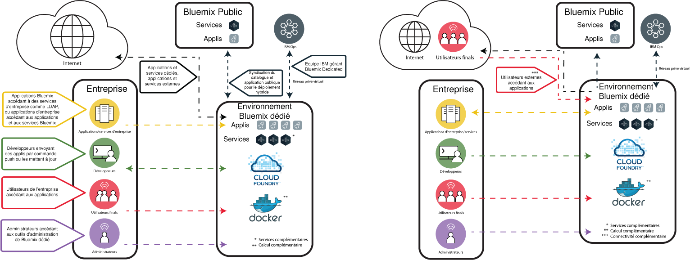

---

copyright:

  years: 2015, 2017

lastupdated: "2017-05-03"

---

{:shortdesc: .shortdesc}

# {{site.data.keyword.Bluemix_dedicated_notm}}
{: #dedicated}

{{site.data.keyword.Bluemix}} est une plateforme à normes ouvertes reposant sur le cloud qui permet de construire, d'exécuter et de gérer des applications. Avec l'environnement
{{site.data.keyword.Bluemix_dedicated_notm}}, vous bénéficiez de la
puissance et de la simplicité de {{site.data.keyword.Bluemix_notm}} et
ce, dans votre propre environnement SoftLayer dédié, connecté de façon sécurisée à l'environnement {{site.data.keyword.Bluemix_notm}} public et à votre propre réseau.
{:shortdesc}

Tous les déploiements dédiés de {{site.data.keyword.Bluemix_notm}} incluent les fonctions et les avantages suivants gratuitement : réseau
privé virtuel (VPN), réseau local virtuel (VLAN) privé, connectivité avec votre protocole LDAP, possibilité d'optimiser des applications et des bases de
données sur
site existantes, sécurité sur site 24 heures sur 24 et 7 jours sur 7, matériel dédié et support standard.

Par défaut, l'accès à votre instance {{site.data.keyword.Bluemix_notm}} privée n'est disponible que depuis votre réseau d'entreprise. Si l'environnement {{site.data.keyword.Bluemix_notm}} doit être
accessible directement depuis Internet, un périphérique mobile ou une base de
données dédiée par exemple,
un composant de sécurité des réseaux additionnel payant est requis.

L'environnement {{site.data.keyword.Bluemix_dedicated_notm}} est
fourni avec tous les contextes d'exécution
{{site.data.keyword.Bluemix_notm}} et 64 Go de mémoire pour les
ressources de traitement.

De plus, divers services et composants sont inclus ou proposés à la vente. Consultez le tableau ci-après pour prendre connaissance des éléments inclus
ou que vous pouvez acheter si vous le souhaitez.

| **Type**        | **Nom **            | **Description** |
|-----------------|-------------------|-------------------|
|Inclus | [Contextes d'exécution {{site.data.keyword.Bluemix_notm}}](/docs/cfapps/runtimes.html) | Utilisez des contextes d'exécution pour que votre application soit opérationnelle rapidement, sans qu'il soit nécessaire de configurer et de gérer des machines et des systèmes d'exploitation. Vous pouvez utiliser tous les contextes d'exécution {{site.data.keyword.Bluemix_notm}} dans votre instance {{site.data.keyword.Bluemix_dedicated_notm}}.|
| Inclus | [{{site.data.keyword.autoscaling}}](/docs/services/Auto-Scaling/index.html) | Augmentez ou diminuez dynamiquement la capacité de traitement de votre application en fonction de règles. Avec ce service, vous bénéficiez d'une utilisation illimitée dans votre environnement {{site.data.keyword.Bluemix_dedicated_notm}}. Remarque : Actuellement, la mise à l'échelle automatique fonctionne uniquement avec les contextes d'exécution Cloud Foundry. |
|Facultatif | [{{site.data.keyword.apiconnect_short}}](/docs/services/apiconnect/index.html) | {{site.data.keyword.apiconnect_long}} intègre {{site.data.keyword.APIM}} et IBM StrongLoop dans une offre unique qui fournit une solution complète pour la création, l'exécution, la gestion et l'application d'API et de microservices. |
|Facultatif | [{{site.data.keyword.rules_short}}](/docs/services/rules/rules.html) | {{site.data.keyword.rules_short}} offre un environnement complet permettant d'automatiser et d'exécuter des décisions métier basées sur des règles reproductibles qui se produisent fréquemment. Il permet également aux utilisateurs métier et aux développeurs de modéliser rapidement les décisions et de les tester à moindre coût en réduisant le besoin de compétences informatiques. |
|Facultatif | [{{site.data.keyword.cloudant}}](/docs/services/Cloudant/index.html#Cloudant) | {{site.data.keyword.cloudant}} fournit l'accès à une couche de données JSON NoSQL entièrement gérée toujours active. Ce service est compatible avec CouchDB et accessible via une interface HTTP facile à utiliser pour les modèles d'application mobile et Web. |
|Facultatif | [{{site.data.keyword.containershort}}](/docs/containers/container_index.html) | Conteneurs Run Docker dans l'environnement {{site.data.keyword.Bluemix_dedicated_notm}}. Les conteneurs sont des objets logiciels virtuels qui incluent tous les éléments qu'une application a besoin d'exécuter. Un conteneur tire parti de l'isolation et de l'allocation des ressources, mais est plus portable et efficace que, par exemple, une machine virtuelle. Pour des informations sur la configuration matérielle requise, voir [IBM {{site.data.keyword.containershort}} dans les environnements {{site.data.keyword.Bluemix_dedicated_notm}} et local](/docs/containers/container_ov.html#container_dl).|
| Facultatif | [{{site.data.keyword.contdelivery_short}}](/docs/services/ContinuousDelivery/index.html) | {{site.data.keyword.contdelivery_short}} dédié permet d'automatiser les générations, les tests unitaires, les déploiements, etc. Editez et insérez du code via l'interface IDE Web enrichie. Créez des chaînes d'outils pour activer les intégrations d'outils prenant en charge des tâches de développement, de déploiement et d'opérations. |
| Facultatif | [{{site.data.keyword.dashdbshort}}](/docs/services/dashDB/dashDB.html) | IBM {{site.data.keyword.dashdbshort}} for Analytics est un service de base de données de cloud SQL entièrement géré, optimisé pour l'entrepôt de données et les charges de travail analytiques. IBM {{site.data.keyword.dashdbshort}} for Transactions est un service de base de données de cloud SQL entièrement géré, optimisé pour des tâches générales, les applications Web et les charges de travail transactionnelles. |
| Facultatif | [{{site.data.keyword.datacshort}}](/docs/services/DataCache/index.html#data_cache) | Ce service fournit une grille de données en mémoire qui prend en charge des scénarios de mise en cache distribuée pour vos applications. Il inclut 50 Go de mémoire cache interne. |
| Facultatif | [Dedicated GitHub Enterprise](/docs/services/ghededicated/index.html) | {{site.data.keyword.ghe_long}} est la version entièrement gérée et hébergée dans le cloud IBM de GitHub Enterprise, qui propose une expérience sociale très appréciée des développeurs. Ce service n'est actuellement disponible que dans les environnements {{site.data.keyword.Bluemix_dedicated_notm}}. |
| Facultatif (bêta) | [Logging](/docs/monitoringandlogging/cfapps_ml_logs_dedicated_ov.html#container_ml_logs_dedicated_ov) | Fournit des journaux pour vos applications Cloud Foundry dans votre interface utilisateur {{site.data.keyword.Bluemix_notm}} et des journaux permettant une recherche et des tableaux de bord dans Kibana. |
| Facultatif | [{{site.data.keyword.messagehub}}](/docs/services/MessageHub/index.html#messagehub) | {{site.data.keyword.messagehub}} est un bus de messages évolutif, distribué et à haut débit permettant de combiner vos technologies sur site et hors site. {{site.data.keyword.messagehub}} s'appuie sur Apache Kafka, qui est un moteur de messagerie en temps réel rapide, évolutif et durable. |
|Facultatif | [{{site.data.keyword.mobilepush}}](/docs/services/mobilepush/index.html) | {{site.data.keyword.mobilepush}} est un service que vous pouvez utiliser pour envoyer des notifications à un périphérique iOS ou Android. Les notifications peuvent être ciblées pour tous les utilisateurs d'application ou pour un ensemble spécifique d'utilisateurs et de périphériques à l'aide d'étiquettes. Vous pouvez administrer des périphériques, des étiquettes et des abonnements. Vous pouvez aussi utiliser un logiciel SDK (kit de développement de logiciels) et des API (interfaces de programme d'application) REST (Representational State Transfer) pour développer plus en détail vos applications client.|
|Facultatif | [{{site.data.keyword.SecureGateway}}](/docs/services/SecureGateway/secure_gateway.html) | Le service {{site.data.keyword.SecureGateway}} fournit un moyen sécurisé pour connecter des applications {{site.data.keyword.Bluemix_notm}} à des emplacements distants sur site ou dans le cloud.  |
|Facultatif | [{{site.data.keyword.sescashort}}](/docs/services/SessionCache/index.html#session_cache) | Pour augmenter la redondance, {{site.data.keyword.sescashort}} fournit une réplique d'une session qu'il stocke en cache. Par conséquent, en cas de microcoupure ou d'indisponibilité, votre application client peut continuer à accéder à la session en cache. Le service prend en charge des scénarios de mise en cache de session pour les applications Web et mobiles. |
| Facultatif | [{{site.data.keyword.iot_short}}](/docs/services/IoT/index.html) | Ce service permet à vos applications de communiquer et de consommer les données collectées par vos périphériques connectés, capteurs et passerelles. Le service de base permet d'exécuter une version privée de {{site.data.keyword.iot_short}} dans l'environnement dédié, avec une capacité de 100000 périphériques ou applications connectés simultanément et avec 1,6 To d'échange de données. |
| Facultatif | [{{site.data.keyword.appserver_short}}](/docs/services/ApplicationServeronCloud/index.html) | IBM {{site.data.keyword.appserver_short}} for IBM {{site.data.keyword.Bluemix_notm}} est un service qui facilite la configuration rapide sur une instance Java EE {{site.data.keyword.appserver_short}} Liberty, Traditional Network Deployment ou Traditional WebSphere préconfigurée dans un environnement de cloud hébergé sur {{site.data.keyword.Bluemix_notm}}. |
{: caption="Tableau 1. Services dédiés" caption-side="top"}
{: #table01}

Vous pouvez acquérir des composants facultatifs pour élargir la capacité de vos ressources et périphériques. Vous pouvez acquérir ces composants en contactant
l'équipe commerciale. Accédez à la page [Contactez-nous](https://console.ng.bluemix.net/?direct=classic/#/contactUs/cloudOEPaneId=contactUs) for
pour plus d'informations sur la manière de contacter un ingénieur commercial. Pour rehausser votre plan pour un service, vous pouvez sélectionner un plan
depuis la vignette Service dans votre catalogue.

| **Nom **            | **Description** |
|-------------------|-------------------|
|Dedicated {{site.data.keyword.apiconnect_short}} Professional 5 Million API Calls | Environnement permettant l'exécution d'une version privée de {{site.data.keyword.apiconnect_short}} dans l'environnement dédié avec une capacité de 5 millions d'appels d'API par mois ciblant des projets d'API au niveau des départements de l'entreprise. |
|Dedicated {{site.data.keyword.apiconnect_short}} Professional 100 thousand API Calls increase | Extension de l'environnement {{site.data.keyword.apiconnect_short}} Professional offrant une capacité supplémentaire de 100000 appels d'API par mois. |
|Dedicated {{site.data.keyword.apiconnect_short}} Enterprise 25 Million API Calls | Environnement permettant l'exécution d'une version privée de {{site.data.keyword.apiconnect_short}} dans l'environnement dédié avec une capacité de 25 millions d'appels d'API par mois ciblant des projets d'API au niveau de l'entreprise. |
|Dedicated {{site.data.keyword.apiconnect_short}} Enterprise 100 thousand API Calls increase | Extension de l'environnement {{site.data.keyword.apiconnect_short}} Enterprise offrant une capacité supplémentaire de 100000 appels d'API par mois. |
|IBM {{site.data.keyword.Bluemix_dedicated_notm}} {{site.data.keyword.rules_short}} 1 Million Rules Decisions | Une décision Règles est le résultat de l'appel d'un ensemble de règles à partir d'un serveur d'exécution de règle. Les autorisations d'utilisation appropriées doivent être obtenues pour couvrir le nombre total de décisions Règles, arrondi au million le plus proche, exécuté ou traité, lors de la période de facturation. Les décisions Règles mesurées par ce service de cloud sont les appels émis vers ce serveur d'exécution de règle pour obtenir une décision. Les déploiements dédiés du service Cloud ont une capacité accordée qui est mesurée par le paramètre de calcul des frais pertinent. L'allocation d'espace par défaut par le service {{site.data.keyword.rules_short}} sur la plateforme {{site.data.keyword.Bluemix_dedicated_notm}} est de 16 Go, dont un maximum de dix instances d'1 Go chacune peutêtre appelé pour exécuter des décisions Règles autorisées. Si vous dépassez cette limite d'utilisation, vous devez acheter de la capacité supplémentaire pour cette utilisation. |
|Dedicated {{site.data.keyword.cloudant}}  1.6 TB capacity increase | Inclut l'exécution d'une version privée de {{site.data.keyword.cloudantfull}} dans l'environnement dédié avec une capacité de conception de 1,6 téraoctets  |
|Dedicated {{site.data.keyword.datacshort}} and {{site.data.keyword.sescashort}} 50 GB capacity increase | Environnement permettant le déploiement et l'exécution d'instances {{site.data.keyword.datacshort}} et {{site.data.keyword.sescashort}} jusqu'à une capacité cumulée de 50 Go. |
|{{site.data.keyword.contdelivery_short}} Dedicated Instance | Version privée de {{site.data.keyword.contdelivery_short}} exécutée dans un environnement dédié. La capacité est déterminée par les autorisations de {{site.data.keyword.contdelivery_short}} Dedicated Authorized User. |
|{{site.data.keyword.contdelivery_short}} Dedicated Authorized User | Accorde un accès d'utilisateur autorisé à un environnement {{site.data.keyword.contdelivery_short}} Dedicated donné en vue de son utilisation. Chaque utilisateur appartenant à une organisation {{site.data.keyword.Bluemix_notm}} contenant une instance de service {{site.data.keyword.contdelivery_short}} doit être autorisé. |
|Dedicated {{site.data.keyword.dashdbshort}} Enterprise 64.1 | Une base de données par instance de service sur un serveur dédié avec 64 Go de mémoire RAM, 16 UC virtuelles. Recommandé pour jusqu'à 1 To de pré-chargement de données, en fonction du type de compression.  |
|Dedicated {{site.data.keyword.dashdbshort}} Enterprise 256.4 | Une base de données par instance de service sur un serveur dédié sans système d'exploitation avec 256 Go de mémoire RAM, 32 coeurs. Recommandé pour jusqu'à 4 To de pré-chargement de données, en fonction de la compression classique. |
|Dedicated {{site.data.keyword.dashdbshort}} Enterprise 256.12  | Une base de données par instance de service sur un serveur dédié sans système d'exploitation avec 256 Go de mémoire RAM, 32 coeurs. Recommandé pour jusqu'à 12 To de pré-chargement de données, en fonction du type de compression. Il s'agit d'un plan de stockage dense pour les environnements où les volumes de données sont plus importants et où les requêtes n'ont pas besoin de s'exécuter à la vitesse de la mémoire. |
|IBM {{site.data.keyword.Bluemix_dedicated_notm}} {{site.data.keyword.dashdbshort}} Enterprise for Transactions 2.8.500 | Instance dédiée admettant les charges de travail de traitement des transactions en ligne (OLTP) avec une mémoire vive de 8 Go et 500 Go d'espace pour les données et les journaux. |
|IBM {{site.data.keyword.Bluemix_dedicated_notm}} {{site.data.keyword.dashdbshort}} Enterprise for Transactions 12.128.1400 | Instance dédiée admettant les charges de travail de traitement des transactions en ligne (OLTP) avec une mémoire vive de 128 Go et 1,4 To d'espace de stockage SSD pour les données et les journaux. |
|IBM {{site.data.keyword.Bluemix_dedicated_notm}} {{site.data.keyword.dashdbshort}} Enterprise for Transactions High Availability 2.8.500 | Instance dédiée admettant les charges de travail de traitement des transactions en ligne (OLTP) avec une mémoire vive de 8 Go et 500 Go d'espace pour les données et les journaux, et qui inclut un serveur de secours supplémentaire pour la haute disponibilité. |
|IBM {{site.data.keyword.Bluemix_dedicated_notm}} {{site.data.keyword.dashdbshort}} Enterprise for Transactions High Availability 12.128.1400 | Instance dédiée admettant les charges de travail de traitement des transactions en ligne (OLTP) avec une mémoire vive de 128 Go et 1,4 To d'espace de stockage SSD pour les données et les journaux, et qui inclut un serveur de secours supplémentaire pour la haute disponibilité. |
|{{site.data.keyword.Bluemix_dedicated_notm}} community services  | Environnement permettant le déploiement et l'exécution de services de communauté pouvant comprendre chacun jusqu'à 50 instances.  |
|{{site.data.keyword.Bluemix_dedicated_notm}} {{site.data.keyword.cloudant}} Cluster Instance | Ce composant facultatif inclut un cluster à trois noeuds pour lequel vous devez fournir l'infrastructure ; les capacités de stockage et de traitement sont déterminées en fonction de vos besoins. {{site.data.keyword.cloudant}} fournit l'accès à une couche de données JSON NoSQL entièrement gérée toujours active. Ce service est compatible avec CouchDB et accessible via une interface HTTP facile à utiliser pour les modèles d'application mobile et Web. |
|IBM {{site.data.keyword.Bluemix_dedicated_notm}} {{site.data.keyword.messagehub}} | Environnement qui fournit une messagerie de publication/abonnement pouvant aller jusqu'à 10 Go par partition, avec une limite de 100 partitions.  |
|IBM Bluemix Dedicated {{site.data.keyword.mobilepushshort}} | Environnement permettant le déploiement et l'exécution d'instances {{site.data.keyword.mobilepushshort}} pouvant accepter 300 demandes par seconde. |
|{{site.data.keyword.iot_short}} Dedicated incremental increase | Elargissement de l'environnement permettant l'exécution d'une version privée de {{site.data.keyword.iot_short}} dans l'environnement dédié avec une capacité de 100000 périphériques ou applications connectés simultanément et 0,5 To d'échange de données. |
|IBM {{site.data.keyword.appserver_short}} for {{site.data.keyword.Bluemix_notm}} - Dedicated Small| Instance Java EE {{site.data.keyword.appserver_short}} Liberty, Traditional Network Deployment ou Traditional WebSphere préconfigurée dans un environnement de cloud hébergé sur {{site.data.keyword.Bluemix_notm}} avec 64 vCores, 128 Go de RAM et 1 To de disque dur par mois. |
|IBM {{site.data.keyword.appserver_short}} for {{site.data.keyword.Bluemix_notm}} - Dedicated Medium| Instance Java EE  {{site.data.keyword.appserver_short}} Liberty, Traditional Network Deployment ou Traditional WebSphere préconfigurée dans un environnement de cloud hébergé sur {{site.data.keyword.Bluemix_notm}} avec 128 vCores, 256 Go de RAM et 2 To de disque dur par mois. |
|IBM {{site.data.keyword.appserver_short}} for {{site.data.keyword.Bluemix_notm}} - Dedicated Large| Instance Java EE {{site.data.keyword.appserver_short}} Liberty, Traditional Network Deployment ou Traditional WebSphere préconfigurée dans un environnement de cloud hébergé sur {{site.data.keyword.Bluemix_notm}} avec 256 vCores, 512 Go de RAM et 4 To de disque dur par mois. |
|IBM {{site.data.keyword.appserver_short}} for {{site.data.keyword.Bluemix_notm}} - Dedicated| Instance Java EE {{site.data.keyword.appserver_short}} Liberty, Traditional Network Deployment ou Traditional WebSphere préconfigurée dans un environnement de cloud hébergé sur {{site.data.keyword.Bluemix_notm}} avec une extension de disque dur et 1 To par mois. |
{: caption="Tableau 2. Composants de service facultatifs pour achat" caption-side="top"}
{: #table02}

| **Nom **            | **Description** |
|-------------------|-------------------|
|Dedicated runtimes 16 GB capacity increase  | Extension de l'environnement d'exécution en lui ajoutant une capacité de 16 Go. |
|Dedicated Direct Link 1 Gbps capacity | Lien réseau dédié se connectant directement au point de présence réseau {{site.data.keyword.BluSoftlayer}} approprié, conçu pour des transferts de données jusqu'à 1 Gbit/s. |
|Dedicated Direct Link 10 Gbps capacity | Lien réseau dédié se connectant directement au point de présence réseau {{site.data.keyword.BluSoftlayer}} approprié, conçu pour des transferts de données jusqu'à 10 Gbit/s. |
|IBM Bluemix Dedicated Hardware Firewall - High Availability | Pare-feu matériel d'1 Gbit/s configuré pour la protection d'un serveur unique, de plusieurs serveurs ou de tous les serveurs sur le même réseau local virtuel dans l'environnement Bluemix Dedicated. |
{: caption="Tableau 3. Composants de module complémentaire de plateforme facultatifs pour achat" caption-side="top"}
{: #table03}

**Remarque **: Les composants {{site.data.keyword.Bluemix_dedicated_notm}} peuvent indiquer une capacité configurée spécifique, par exemple en gigaoctets ou transactions par seconde. Comme la capacité effective concrète pour chaque configuration du service de cloud varie en fonction de nombreux facteurs, elle peut être supérieure ou inférieure à la capacité configurée.

### Catalogue mixte
{: #catalogdedicated}

L'environnement {{site.data.keyword.Bluemix_dedicated_notm}} inclut un catalogue privé qui regroupe les services approuvés dans vos
déploiements public, dédié et local. Vous pouvez même publier et gérer l'accès à vos propres services via ce catalogue
{{site.data.keyword.Bluemix_notm}}. Vous pouvez choisir les services publics qui satisfont les exigences pour votre activité selon vos critères de sécurité et de confidentialité des données.

Si vous disposez d'une instance privée de votre environnement dédié, l'étiquette "Dédié" est associée aux noms de service dans votre catalogue. De
même, si le service est personnalisé (créé avec un courtier de services), l'étiquette "Personnalisé" est associée à son nom. Tous les autres services
répertoriés sans l'étiquette "Dédié" ou "Personnalisé" sont disponibles via la syndication depuis l'environnement
{{site.data.keyword.Bluemix_notm}} public. Les services syndiqués permettent la création d'applications hybrides composées de services
publics et privés.

|Service	|Disponible dans la région Sud des Etats-Unis	|Disponible dans la région Europe-Royaume-Uni |Disponible dans la région Australie-Sydney|
|:----------|:------------------------------|:------------------|:------------------|
|{{site.data.keyword.alchemyapishort}} 		|Oui	   	|Oui  		|Oui|
|{{site.data.keyword.alertnotificationshort}}	|Oui		|Oui		|Oui	|
|{{site.data.keyword.apiconnect_short}}         |Oui            |Oui            |Oui  |
|{{site.data.keyword.appseccloudshort}}		|Oui		|Oui		|Oui |
|{{site.data.keyword.apiconnect_short}} 	|Oui   	 	|Oui  	 	|Oui   |
|Automated Accessibility Checker |Oui       |Oui    |Oui   |
|{{site.data.keyword.rules_short}}		|Oui		|Oui		|Oui |
|{{site.data.keyword.cloudant}}			|Oui		|Oui		|Oui |
|{{site.data.keyword.iotmapinsights_short}}    |Oui  |Oui  |Oui  |
|{{site.data.keyword.conversationshort}}  |Oui  |Oui  |Oui  |
|{{site.data.keyword.dashdbshort}}		|Oui		|Oui		|Oui |
|{{site.data.keyword.dataworks_short}}		|Oui		|Oui		|Non|
|{{site.data.keyword.DB2OnCloud_short}}		|Oui		|Oui		|Oui |
|Digital Content Checker |Oui  |Oui  |Oui  |
|{{site.data.keyword.documentconversionshort}}	|Oui		|Oui		|Oui|
|{{site.data.keyword.iotdriverinsights_short}}  |Oui |Oui  |Oui  |
|{{site.data.keyword.geospatialshort_Geospatial}}	|Oui	|Oui		|Oui |
|{{site.data.keyword.GlobalizationPipeline_short}}	|Oui		| Oui		| Oui |
|{{site.data.keyword.identitymixershort}}		|Oui		|Oui		|Oui|
|{{site.data.keyword.iot4auto_short}} |Oui   |Oui  |Oui  |
|{{site.data.keyword.iotelectronics}}  |Oui  |Oui  |Non |
|{{site.data.keyword.iotinsurance_short}} |Non   |Non   |Oui  |
|{{site.data.keyword.twittershort}}		|Oui		|Oui		|Oui|
|{{site.data.keyword.languagetranslationshort}}	|Oui		|Oui		|Oui |
|{{site.data.keyword.languagetranslatorshort}} |Oui  |Oui  |Oui  |
|{{site.data.keyword.dwl_short}}  |Oui  |Oui  |Non  |
|{{site.data.keyword.eventhubshort}}		|Oui		|Non		|Non|
|{{site.data.keyword.messagehub}}		|Oui		|Oui		|Non|
|{{site.data.keyword.manda}}			|Oui		|Oui		|Oui |
|{{site.data.keyword.amashort}}			|Oui		|Oui		|Oui |
|{{site.data.keyword.mqa}}			|Oui		|Oui		|Oui |
|{{site.data.keyword.mql}}			|Non		|Non		|Oui |
|{{site.data.keyword.nlclassifierlshort}} 	|Oui 		|Oui 		|Oui|
|{{site.data.keyword.personalityinsightsshort}}	|Oui		|Oui		|Oui|
|{{site.data.keyword.pm_short}}			|Oui		|Oui		|Non |
|{{site.data.keyword.mobilepush}}		|Oui		|Oui		|Oui |
|{{site.data.keyword.retrieveandrankshort}}	|Oui 		|Oui 		|Oui|
|{{site.data.keyword.runbook_short}}		|Oui		|Oui		|Oui|
|{{site.data.keyword.SecureGateway}}		|Oui		|Oui		|Oui |
|{{site.data.keyword.ssofull}}			|Oui		|Non		|Non|
|{{site.data.keyword.speechtotextshort}}	|Oui 		|Oui	 	|Oui|
|{{site.data.keyword.streaminganalyticsshort}}	|Oui		|Oui		|Oui |
|{{site.data.keyword.texttospeechshort}} 	|Oui 		|Oui	 	|Oui|
|{{site.data.keyword.toneanalyzershort}} 	|Oui 		|Oui 		|Oui|
|{{site.data.keyword.tradeoffanalyticsshort}}	|Oui		|Oui		|Oui|
|{{site.data.keyword.visualrecognitionshort}}	|Oui 		|Oui	 	|Oui|
|{{site.data.keyword.iot_short}}		|Oui		|Oui		|Non|
|{{site.data.keyword.weather_short}}		|Oui		|Oui		|Oui|
|{{site.data.keyword.workloadscheduler}}	|Oui		|Oui		|Oui |
{: caption="Tableau 4. Services disponibles pour la syndication à partir de Bluemix Public par région" caption-side="top"}
{: #table04}

**Remarque** : les services tiers ne sont pas répertoriés dans le tableau. Consultez votre catalogue dédié pour prendre connaissance des services tiers disponibles.

## Architecture {{site.data.keyword.Bluemix_dedicated_notm}}
{: #dedicatedarch}

L'environnement {{site.data.keyword.Bluemix_dedicated_notm}} peut être déployé dans n'importe quel [centre de données {{site.data.keyword.IBM_notm}} SoftLayer ](http://www.softlayer.com/data-centers){: new_window}, n'importe où dans le monde. {{site.data.keyword.IBM_notm}} SoftLayer met à disposition l'infrastructure de cloud la plus performante. Chaque centre de données applique des contrôles rigoureux de sécurité 24 heures sur 24, 7 jours sur 7.

Chaque déploiement {{site.data.keyword.Bluemix_dedicated_notm}}
est dédié à une seule entreprise sur un matériel dédié {{site.data.keyword.IBM_notm}} SoftLayer dans son propre réseau privé. Les environnements {{site.data.keyword.Bluemix_dedicated_notm}}
appliquent les mêmes normes de sécurité que l'environnement
{{site.data.keyword.Bluemix_notm}} public en termes d'infrastructure,
de fonctionnement et de sécurité physique. Toutefois, l'accès des développeurs à l'environnement {{site.data.keyword.Bluemix_notm}} dédié est contrôlé par vos stratégies LDAP, qui peuvent être configurées par l'équipe {{site.data.keyword.Bluemix_notm}} lorsqu'elle configure votre environnement. Dans l'environnement dédié, vous pouvez gérer les rôles utilisateur et les droits. Voir [Gestion des utilisateurs et des droits](/docs/admin/index.html#oc_useradmin) pour des détails. La
figure suivante décrit l'architecture logique d'un déploiement {{site.data.keyword.Bluemix_dedicated_notm}} par défaut.

Figure 1. Diagramme détaillé de l'architecture par défaut de {{site.data.keyword.Bluemix_dedicated_notm}}
{: #figure01}

Les principaux composants architecturaux décrits dans le diagramme précédent sont les suivants :

<dl>
<dt>{{site.data.keyword.IBM_notm}} Cloud</dt>
<dd>
L'environnement de cloud {{site.data.keyword.IBM_notm}} dans sa
totalité comprend les environnements réseau significatifs suivants :
<ul>
<li>{{site.data.keyword.Bluemix_dedicated_notm}}</li>
<li>{{site.data.keyword.Bluemix_notm}} public</li>
<li>Opérations {{site.data.keyword.IBM_notm}}</li>
</ul>
</dd>
<dt>{{site.data.keyword.Bluemix_dedicated_notm}}</dt>
<dd>
Contient au minimum les composants Cloud Foundry et certains services
d'application dédiés. {{site.data.keyword.Bluemix_notm}}
fournit l'environnement Cloud Foundry et l'environnement de calcul basé sur
{{site.data.keyword.containerlong}}. L'un ou l'autre de ces
environnements peut être configuré pour une entreprise, ou les deux. 
Une entreprise peut également ajouter des services d'application dédiés
supplémentaires. 
Pour connaître les services supplémentaires et les fonctions de calcul qui
peuvent être ajoutés, reportez-vous au [Tableau 2](#table02).
</dd>
<dt>{{site.data.keyword.Bluemix_notm}} public</dt>
<dd>
Un environnement {{site.data.keyword.Bluemix_dedicated_notm}} peut
disposer d'une connexion sortante vers une région de l'environnement
{{site.data.keyword.Bluemix_notm}} public. Une telle connexion permet
la syndication des services publics vers le catalogue dédié. La syndication des
services de l'environnement {{site.data.keyword.Bluemix_notm}} public
fournit aux développeurs un moyen pratique de générer des applications
hébergées sur l'environnement
{{site.data.keyword.Bluemix_dedicated_notm}} de l'entreprise, ainsi
qu'un accès aux services exécutés dans
{{site.data.keyword.Bluemix_notm}} public. La liste des services qui
peuvent être syndiqués à partir de
l'environnement {{site.data.keyword.Bluemix_notm}} public figure dans
le [tableau 4 de la section relative au catalogue
mixte](#catalogdedicated).
</dd>
<dt>Opérations {{site.data.keyword.IBM_notm}}</dt>
<dd>
{{site.data.keyword.IBM_notm}} gère et surveille la plateforme dédiée
et les service dédiés, et leur applique la maintenance adéquate, pour que vous
puissiez vous concentrer sur la création d'applications innovantes. L'équipe
{{site.data.keyword.IBM_notm}} Operations Support Services (OSS)
effectue ces opérations en utilisant une connexion de tunnel VPN depuis le réseau des opérations
{{site.data.keyword.IBM_notm}}.
</dd>
<dt>Entreprise</dt>
<dd>
L'environnement réseau d'entreprise peut être doté d'un lien réseau privé
sécurisé bidirectionnel vers {{site.data.keyword.Bluemix_dedicated_notm}}. Cela permet aux applications hébergées dans
{{site.data.keyword.Bluemix_dedicated_notm}} d'accéder aux services et
aux ressources de l'entreprise, y compris les sources de données et les
services d'entreprise. Le lien réseau permet également à
{{site.data.keyword.Bluemix_dedicated_notm}} d'utiliser votre protocole
LDAP pour l'authentification des développeurs et des administrateurs de votre
entreprise. 
 
Il existe plusieurs options pour la création du lien de réseau privé
sécurisé. Contactez votre spécialiste technique IBM pour connaître l'option qui
convient le mieux à votre entreprise. 
 
La connexion par défaut de l'environnement {{site.data.keyword.Bluemix_dedicated_notm}} vers votre réseau
d'entreprise utilise un réseau privé virtuel (VPN). L'environnement
{{site.data.keyword.Bluemix_dedicated_notm}} est doté d'une terminaison
de réseau privé virtuel dédiée Vyatta de 1 Gbps configurée pour la haute
disponibilité.
 
Dans l'architecture par défaut de l'environnement
{{site.data.keyword.Bluemix_dedicated_notm}} indiquée dans la
[figure 1](#figure01), aucun trafic réseau entrant ne provient directement d'Internet. Si
votre entreprise souhaite autoriser l'accès Internet aux applications
hébergées sur {{site.data.keyword.Bluemix_dedicated_notm}}, l'accès
doit être configuré via votre réseau d'entreprise.
</dd>
</dl>

## Configuration de {{site.data.keyword.Bluemix_dedicated_notm}}
{: #setupdedicated}

L'environnement {{site.data.keyword.Bluemix_dedicated_notm}} a
été conçu pour fournir une version privée de l'offre d'environnement {{site.data.keyword.Bluemix_notm}} public. Vous pouvez utiliser les services et les contextes d'exécution {{site.data.keyword.Bluemix_notm}} pour répondre à vos besoins informatiques dans un
compte {{site.data.keyword.BluSoftlayer}} hébergé par IBM.

IBM fournit l'accès à l'environnement {{site.data.keyword.Bluemix_dedicated_notm}} par le biais d'une connexion sécurisée par mot de passe. Vous
pouvez accéder aux services, aux contextes d'exécution et aux ressources associées, et déployer et retirer des applications
{{site.data.keyword.Bluemix_notm}}. IBM utilise plusieurs emplacements {{site.data.keyword.BluSoftlayer}} afin de distribuer l'environnement
{{site.data.keyword.Bluemix_dedicated_notm}}, pour que l'emplacement de votre version privée puisse être proche de vous.

Pour configurer votre version privée de {{site.data.keyword.Bluemix_notm}} :

<ol>
<li>Prenez contact avec votre représentant de compte IBM ou <a href="https://console.ng.bluemix.net/?direct=classic/#/contactUs/cloudOEPaneId=contactUs" target="_blank">contactez {{site.data.keyword.Bluemix_notm}} </a> pour commencer.</li>
<li>Décidez avec IBM du tarif correspondant à votre instance {{site.data.keyword.Bluemix_dedicated_notm}}. Le prix mensuel dépend des services dédiés que vous voulez utiliser, et comprend un abonnement à tous les services {{site.data.keyword.Bluemix_notm}} publics. Vous recevez ensuite une facture pour tous les éléments que vous
utilisez au-delà de ce contrat d'abonnement.</li>
<li>Identifiez les échéances pour chaque phase de configuration de votre instance {{site.data.keyword.Bluemix_dedicated_notm}}. Pour obtenir des informations sur chaque phase et les tâches concernées, voir <a href="/docs/dedicated/index.html#rolesresponsibilities">Rôles et responsabilités de l'environnement {{site.data.keyword.Bluemix_dedicated_notm}}</a>.</li>
<li>Sélectionnez l'<a href="http://www.softlayer.com/data-centers" target="_blank">emplacement du centre de données {{site.data.keyword.BluSoftlayer}} </a> pour votre instance dédiée. Ensuite, votre plateforme dédiée et votre compte sont créés. Pour votre compte, vous identifiez les personnes de votre organisation à affecter aux rôles nécessaires à la configuration et à l'exécution de votre instance dédiée. Pour obtenir des informations sur les rôles que vous attribuez, voir <a href="/docs/dedicated/index.html#rolesresponsibilities">Rôles et responsabilités de l'environnement {{site.data.keyword.Bluemix_dedicated_notm}}</a>.
</li>
<li>Définissez et établissez la connectivité du réseau entre votre réseau d'entreprise et votre instance {{site.data.keyword.Bluemix_dedicated_notm}}. Il existe un dispositif de sécurité des réseaux obligatoires payant qui inclut des fonctions de pare-feu et de prévention contre les intrusions.
	<ol type="a">
	<li>IBM installe une infrastructure de surveillance et de sécurité pour l'instance dédiée.</li>
	<li>IBM installe les services dédiés exclusifs que vous avez sélectionnés.</li>
	<li>Vous fournissez la configuration réseau et des noeuds finaux pour des éléments, tels que les adresses IP ou les pare-feux, et l'accès à LDAP pour l'intégration à {{site.data.keyword.Bluemix_notm}}.</li>
	</ol>
</li>
<li>Identifiez et affectez des rôles pour votre équipe d'administration pour l'environnement.
	<ol type="a">
	<li>IBM configure l'accès réseau et LDAP en fonction des éléments que vous avez fournis. L'accès administrateur est accordé aux contacts que vous désignez. Vous devez également désigner un contact pour le support et la facturation.</li>
	<li>IBM configure un catalogue mixte dans votre environnement dédié qui répertorie vos services dédiés. Ce catalogue comprend des services supplémentaires qui sont à votre disposition depuis l'environnement {{site.data.keyword.Bluemix_notm}} public. Vous pouvez choisir les services publics qui satisfont les exigences pour votre activité selon vos critères de sécurité et de confidentialité des données.</li>
	<li>Vous validez la configuration du réseau et du pare-feu ainsi que l'accès et le noeud final LDAP.</li>
	</ol>
</li>
</ol>

Vous pouvez vous attendre à obtenir un processus similaire à la liste suivante pour le déploiement initial et la configuration de votre environnement. Pour obtenir des détails sur les responsables de chaque tâche, voir [Rôles et responsabilités](index.html#rolesresponsibilities).

<ol>
<li>Vous sélectionnez le centre de données à utiliser pour héberger votre instance dédiée. Pour plus d'informations sur les options de centre de données, voir <a href="http://www.softlayer.com/data-centers" target="_blank">Emplacement du centre de données {{site.data.keyword.BluSoftlayer}} </a>.</li>
<li>Vous spécifiez les noms de domaine pour le déploiement et les ID que vous souhaitez utiliser. Vous obtenez trois domaines lorsque vous configurez votre instance {{site.data.keyword.Bluemix_notm}}. Vous sélectionnez le préfixe pour <code>*masociété*.*région*.bluemix.net</code> et <code>*masociété*.*région*.mybluemix.net</code>. Puis vous choisissez le nom complet du troisième domaine. 

Vous pouvez choisir autant de domaines personnalisés que vous le souhaitez. Cependant, vous êtes chargé des certificats de ces domaines personnalisés. Pour plus d'informations sur la création d'un domaine personnalisé, voir <a href="/docs/manageapps/updapps.html#domain">Création et utilisation d'un domaine personnalisé</a>.
</li>
<li>Vous identifiez un propriétaire du compte public utilisé pour représenter votre société dans l'environnement {{site.data.keyword.Bluemix_notm}} public. IBM utilise ce compte pour le suivi de l'utilisation des services mixtes.</li>
<li>Vous sélectionnez le type de connexion sécurisée à votre centre de données. Vous pouvez choisir entre {{site.data.keyword.Bluemix_notm}} VPN,
{{site.data.keyword.Bluemix_notm}} Direct Link et AT&T Net Bond.</li>
<li>Vous décidez s'il y aura un accès à votre environnement dédié à partir de l'Internet public.</li>
<li>Vous sélectionnez le type d'authentification qui sera utilisé. Vous pouvez effectuer une sélection depuis IBMid ou Active Directory. Pour plus d'informations sur l'utilisation et l'enregistrement d'un IBMid, voir la page <a href="https://www.ibm.com/account/profile/us?page=regfaqhelp#4">Help and FAQ</a>.
</li>
<li>Vous identifiez et affectez des rôles pour votre équipe d'administration pour l'environnement. Pour obtenir des informations sur les rôles que vous devez attribuer, voir <a href="/docs/dedicated/index.html#rolesresponsibilities">Rôles et responsabilités de l'environnement {{site.data.keyword.Bluemix_dedicated_notm}}</a>.</li>
<li>IBM déploie la plateforme de base qui comprend les environnements d'exécution élastiques, la console, les fonctions d'administration et de surveillance.</li>
<li>IBM configure votre accès administrateur à l'environnement.</li>
<li>Vous pouvez commencer à utiliser votre instance dédiée surveillée par l'équipe IBM chargée des opérations pour répondre aux alertes.</li>
</ol>

Une fois votre instance {{site.data.keyword.Bluemix_notm}} configurée, vous pouvez surveiller et gérer votre instance {{site.data.keyword.Bluemix_notm}} via la page Administration. Pour plus d'informations, voir [Gestion de l'environnement {{site.data.keyword.Bluemix_notm}} local et de l'environnement Bluemix dédié](../admin/index.html#mng). Pour plus d'informations sur les mises à niveau et la maintenance, voir [Gestion de votre instance dédiée](index.html#maintaindedicated).

##Rôles et responsabilités
{: #rolesresponsibilities}

Si vous configurez un compte {{site.data.keyword.Bluemix_dedicated_notm}}, vous identifiez les personnes de votre organisation à affecter aux rôles nécessaires à la configuration et à l'exécution de votre instance.

###Rôles

La liste suivante répertorie les rôles et les responsabilités des clients que vous attribuez :

<dl>
<dt>**Contact du service Achats (Procurement focal)**</dt>
<dd>Collabore avec l'interlocuteur IBM afin d'établir votre environnement {{site.data.keyword.Bluemix_dedicated_notm}}, notamment pour identifier les personnes autorisées dans votre organisation à travailler sur un aspect du projet. La personne disposant de ce rôle assume un rôle de gestion de projet et supervise la sélection de pattern, les accords commerciaux et les accords relatifs à l'accès aux ressources du client. Le contact du service Achats est le contact général pour la configuration de l'instance dédiée et le suivi du processus de déploiement.</dd>
<dt>**Agent de conformité (Compliance officer)**</dt>
<dd>Collabore avec l'interlocuteur IBM pour sélectionner une topologie et une option de déploiement répondant à vos exigences en matière de sécurité. La personne disposant de ce rôle collabore avec le consultant en conformité d'IBM pour déterminer quels sont les patterns de déploiement qui permettent d'atteindre les objectifs de conformité.</dd>
<dt>**Spécialiste réseau (Network specialist)**</dt>
<dd>Collabore avec l'interlocuteur IBM sur les plans de réseau pour le déploiement {{site.data.keyword.Bluemix_notm}}. La personne disposant de ce rôle passe en revue les spécifications de réseau requises par IBM et collabore avec IBM afin d'établir un plan d'implémentation. A la fin de la phase d'installation et de vérification, elle confirme que la configuration du réseau est conforme aux standard d'entreprise.</dd>
<dt>**Contact DevOps (DevOps focal)**</dt>
<dd>Collabore avec l'interlocuteur IBM afin de planifier et d'appliquer les mises à jour de maintenance nécessaires pour la plateforme, les services et les contextes d'exécution {{site.data.keyword.Bluemix_notm}}. La personne disposant de ce rôle collabore également avec l'interlocuteur IBM sur la configuration de votre instance {{site.data.keyword.Bluemix_dedicated_notm}}.</dd>
<dt>Contact des opérations (Operations focal)</dt>
<dd>Collabore avec l'équipe de support IBM si nécessaire une fois l'environnement configuré et exécuté. Cet utilisateur dispose d'un accès Superutilisateur à la console d'administration et peut approuver et planifier les mises à jour de maintenance de l'environnement Bluemix ; il est également disponible à tout moment en cas d'incident critique. La personne affectée à ce rôle doit avoir les connaissances techniques de l'environnement Bluemix et être en mesure de joindre les experts de la société dans les domaines susceptibles d'être concernés, comme le réseau ou la sécurité.</dd>
</dl>

Vos ingénieurs commerciaux collaborent avec des spécialistes IBM pour garantir que vous disposiez toujours du support dont vous avez besoin. Vous
pouvez procéder à la mise à niveau vers le niveau de support Premium afin d'utiliser un responsable Client Success (CSM) dédié pour votre compte. Pour plus d'informations sur les différents niveaux de support, voir [Contacter le service de support](../support/index.html#contacting-support). Le responsable Client Success (CSM) effectue les types de tâche suivants :

<ul>
<li>Il permet l'adoption rapide de votre environnement {{site.data.keyword.Bluemix_dedicated_notm}}.</li>
<li>Il distribue des ressources d'activation et de formation utiles permettant d'améliorer votre autonomie.</li>
<li>Il entretient une relation à long terme entre vous et le développement {{site.data.keyword.Bluemix_notm}}, le support et les services que
vous utilisez.</li>
</ul>

L'équipe en charge des opérations et du support {{site.data.keyword.Bluemix_notm}} qui travaille avec vous sur votre instance
{{site.data.keyword.Bluemix_notm}} peut accéder à votre environnement local, mais n'utilise cette possibilité que pour les
raisons suivantes :

<ul>
<li>Pour répondre à des alertes et effectuer une maintenance opérationnelle</li>
<li>Pour tenter de reproduire un problème qui a été signalé dans un ticket d'incident</li>
</ul>

### Responsabilités

De la configuration de votre environnement à la maintenance permanente, diverses tâches doivent être effectuées. Le tableau ci-dessous répertorie les
tâches requises ainsi que le propriétaire pour l'exécution de la tâche au cours des phases de création, de progression et d'achèvement.

La phase de création permet d'établir l'environnement {{site.data.keyword.Bluemix_dedicated_notm}}. Les objectifs principaux de cette phase sont les suivants :

- Réviser l'accord financier et établir les dates de jalon pour la distribution.
- Créer la plateforme {{site.data.keyword.Bluemix_notm}} et fournir l'accès aux contextes d'exécution et aux services.
- Définir et établir la connectivité du réseau entre votre réseau d'entreprise et les opérations {{site.data.keyword.Bluemix_notm}}.
- Identifier et affecter des rôles pour votre équipe d'administration.

| **Tâche** | **Détails de la tâche** | **Partie responsable** |
|----------|------------------|-----------------------|
|Définir les normes de conformité | Identifier les normes du gouvernement, de l'industrie et de l'entreprise propriétaire qui sont requises pour l'environnement. | Client |
|Créer un plan d'intégration de conformité et de sécurité | Créer un plan d'intégration et de sécurité qui inclut les coûts, la planification et les ressources qui sont nécessaires pour assurer la conformité et la sécurité. | IBM |
|Approbation du plan de conformité | Approbation du plan de conformité. | Client |
|Créer la taille de l'environnement |  	Créer la taille de l'environnement en fonction de choix prédéfinis qui prennent en compte les objectifs de haute disponibilité et de reprise après incident, ainsi que la mise à disposition initiale des services et de l'agent DEA nécessaires pour la prise en charge des applications créées avec la plateforme. Vous collaborez avec IBM pour définir par exemple les bases de données qui sont nécessaires, les services qui sont proposés dans le catalogue mixte du client, etc. | IBM et le client partagent la responsabilité |
|Sélectionner une architecture | Sélectionner une architecture en fonction de choix prédéfinis qui prennent en compte les exigences de haute disponibilité et de reprise après incident. | IBM |
|Définir les objectifs de reprise après incident | Définir les exigences de reprise après incident pour l'environnement. | Client |
|Créer un plan de reprise après incident | Définir le plan de reprise après incident et vous consulter. IBM crée un modèle de reprise après incident et vous consulte pour que vous puissiez donner votre feedback et approuver le plan. | IBM et le client partagent la responsabilité |
|Créer un plan de sauvegarde et de reprise | Créer un plan de sauvegarde et de reprise qui définit la fréquence et les exigences pour une distribution sur site et hors site de la sauvegarde. IBM sauvegarde des composants de matrice, des services IBM, des métadonnées de service incluant des rôles utilisateur, etc. Vous sauvegardez les données propres à l'application desquelles vous êtes en charge. | IBM et le client partagent la responsabilité |
|Identifier les outils pour la détection d'événements et l'identification des problèmes. | Identifier les outils IBM et tiers utilisés pour la détection d'événements et l'identification des problèmes au niveau de la plateforme {{site.data.keyword.Bluemix_notm}}. | IBM |
|Définir un plan d'escalade | Définir le plan d'escalade pour analyser les besoins et résoudre les événements détectés depuis les composants de surveillance. | IBM |
|Signer des accords relatifs à l'infrastructure, la plateforme et le support | Signer le contrat d'abonnement incluant les dispositions financières pour l'environnement. Signer l'abonnement au support. | Client |
|Procurer l'environnement | Procurer les ressources de traitement, le réseau et le stockage, notamment le réseau local virtuel des services et de base pour héberger {{site.data.keyword.Bluemix_notm}}, des services non virtualisés pour héberger Data Power, et le pare-feu {{site.data.keyword.Bluemix_notm}}. Fournir l'infrastructure pour autoriser un tunnel de réseau privé virtuel. | IBM |
|Installer les composants de matrice, d'application, de surveillance et de gestion | Installer, configurer et vérifier les composants de matrice, comme BOSH Director, le contrôleur de cloud, le gestionnaire de santé, la messagerie, les routeurs, les agents DEA et les fournisseurs de services, ainsi que les composants de surveillance qui sont définis dans le plan d'escalade et de détection des problèmes. | IBM |
|Installer et configurer les composants de sécurité | Installer et configurer les composants de sécurité qui sont liés dans le plan de surveillance et d'escalade, notamment IBM QRadar, le coffre des identifications, le système de prévention des intrusions, IBM BigFix et IBM Security Privileged Identity Management. | IBM |
|Installer et configurer des composants personnalisés |  	Installer et configurer des composants personnalisés qui se trouvent hors de la portée du produit et des services {{site.data.keyword.Bluemix_notm}}. | Client |
|Etablir la configuration réseau initiale | Etablir la configuration réseau initiale, notamment les pare-feux, DataPower, Fortigate et le serveur DNS. | IBM |
|Connecter le pipeline {{site.data.keyword.Bluemix_notm}} | Connecter le pipeline de distribution continue et l'intégration continue {{site.data.keyword.Bluemix_notm}} avec des référentiels IBM. | IBM |
|Personnaliser les composants externes de la solution | Personnaliser les équilibreurs de charge pour les scénarios de reprise après incident. | Client |
|Installer la solution de réseau privé virtuel | Installer la solution de réseau privé virtuel bidirectionnelle. | IBM |
|Configurer le serveur de connexion | Configurer le serveur de connexion en vue de son utilisation avec l'annuaire LDAP d'entreprise. | IBM |
|Effectuer le suivi du statut des contrôles de sécurité, de conformité et d'audit  | Effectuer le suivi du statut jusqu'à ce que tous les outils et processus soient en place pour que la conformité identifiée soit assurée. | Client |
|Réviser l'infrastructure physique | Réviser les locaux physiques qui hébergent les composants de la solution afin d'identifier d'éventuelles menaces et réviser les contrôles de sécurité pour la protection du centre de données. | Client |
|Inspecter le logiciel de surveillance | Inspecter les composants de surveillance et de gestion tels que définis dans le plan d'escalade et d'identification des problèmes. | Client |
|Inspecter le système d'exploitation | Vérifier que l'image de système d'exploitation satisfait les normes de conformité. IBM fournit l'accès à l'image de système d'exploitation. | IBM et le client partagent la responsabilité |
{: caption="Tableau 5. Tâches de la phase de lancement" caption-side="top"}

Ensuite vient la phase de progression. Elle décrit la relation de collaboration qui existe entre vous et le cloud IBM. Les objectifs principaux de cette phase
sont les suivants :

- Réviser la capacité et coordonner les ajustements nécessaires.
- Réviser les améliorations de la maintenance et de la plateforme.
- Coordonner les activités relatives à la résolution des problèmes et à l'analyse de la cause première.

| **Tâche** | **Détails de la tâche** | **Partie responsable** |
|----------|------------------|-----------------------|
|Réviser les rapports de capacité hebdomadaire | Réviser les rapports de capacité hebdomadaires et prendre des mesures correctives, si nécessaire. | Client |
|Créer des projections sur une base mensuelle | Collecter des informations et créer une projection sur une base mensuelle pour la capacité et la consommation. | IBM et le client partagent la responsabilité |
|Réviser les projections de capacité | Réviser les projections de capacité car elle sont liées à des événements externes pouvant avoir un impact sur la capacité ainsi que sur de nouveaux déploiements anticipés des applications. Collaborer avec IBM pour réviser les projections et le plan en conséquence. | IBM et le client partagent la responsabilité |
|Réviser les projections | Réviser les projections de capacité car elles sont liées à des événements externes pouvant avoir un impact sur la capacité. | Client |
|Ajuster la capacité |  Ajouter ou retirer de la capacité au fur et à mesure que vos besoins changent. | IBM |
|Publier la maintenance et les mises à jour entrantes | Créer une documentation pour la maintenance requise des composants IBM. | IBM |
|Assurer la maintenance | Communiquer avec IBM pour planifier une maintenance requise au cours d'une fenêtre de 21 jours. Vous pouvez fournir les dates qui ne vous conviennent pas dans la fenêtre de 30 jours ; IBM s'arrangera pour planifier la maintenance en conséquence. | IBM et le client partagent la responsabilité |
|Echecs de mise à disposition d'adresse | Corriger les échecs de mise à disposition, le cas échéant, pour les services créés par le client qui sont déployés dans le catalogue. | IBM |
|Effectuer une analyse réseau et IP | Effectuer des analyses réseau et IP quotidiennement et mensuellement. | IBM et le client partagent la responsabilité |
|Fournir l'accès aux journaux d'audit | Fournit l'accès à tous les journaux d'audit de sécurité et d'administration   | IBM et le client partagent la responsabilité |
|Mener le test | Tester régulièrement les contrôles clés des opérations et effectuer un test de pénétration tiers. | IBM et le client partagent la responsabilité |
|Génération de rapports sur le statut, coordination de l'audit et réunions sur la conformité  | Assurer la génération de rapports sur le statut, la coordination d'audit externe et la représentation dans des réunions sur le statut des examens de conformité. | IBM |
|Attestation d'emploi et vérification des besoins d'affaires | Effectuer l'attestation d'emploi trimestrielle et la vérification des besoins d'affaires continus pour les interlocuteurs IBM qui ont accès à l'environnement client. | IBM |
|Résolution des vulnérabilités en matière de sécurité | Résoudre les vulnérabilités signalées en matière de sécurité sur la plateforme. | IBM |
{: caption="Tableau 6. Tâches de la phase de progression" caption-side="top"}

L'étape finale d'achèvement représente la fin de la relation entre vous et {{site.data.keyword.Bluemix_notm}}. Les tâches principales de cette phase sont les suivantes :

* Fin de l'accord financier
* Suppression de toutes les connexions réseau
* Recyclage de l'infrastructure

| **Tâche** | **Détails de la tâche** | **Partie responsable** |
|----------|------------------|-----------------------|
|Mettre fin à l'accord financier | Discuter et convenir de la fin de l'accord financier. | IBM et le client partagent la responsabilité |
|Mettre l'environnement hors service | Désactiver l'accès à l'environnement et les données d'identification. | IBM et le client partagent la responsabilité |
|Supprimer les connexions réseau du client | Supprimer les connexions réseau entre IBM et l'environnement client. | IBM et le client partagent la responsabilité |
|Recycler l'infrastructure | Votre environnement est recyclé selon les processus définis par {{site.data.keyword.BluSoftlayer}}. | IBM |
{: caption="Tableau 7. Tâches de la phase d'achèvement" caption-side="top"}

##Gestion de votre instance dédiée
{: #maintaindedicated}

IBM gère et installe les mises à jour et les correctifs qu'elle juge nécessaires pour les contextes d'exécution et les services
{{site.data.keyword.Bluemix_notm}}. Il se peut que les services ne soient pas disponibles pendant les fenêtres de maintenance. De plus, IBM
collabore avec vous afin de planifier des mises à jour de maintenance pour la plateforme {{site.data.keyword.Bluemix_notm}}.

Les types suivants de maintenance sont requis pour l'environnement {{site.data.keyword.Bluemix_dedicated_notm}} :
<dl>
<dt>**Maintenance standard des services**</dt>
<dd>Les services utilisent des fenêtres de maintenance standard prédéfinies qui peuvent entraîner leur indisponibilité. IBM n'exige pas l'approbation du
client avant de procéder à la maintenance des services, mais tente de réduire l'impact sur vos services. 
 
IBM envoie des messages de diffusion concernant les changements qui sont planifiés pour chaque fenêtre de maintenance dans la page Statut. 
 
**Important** : certains services peuvent ne pas être disponibles au cours de la période de maintenance.</dd>

<dt>**Maintenance standard de la plateforme {{site.data.keyword.Bluemix_notm}}**</dt>
<dd>Les mises à jour de maintenance sont appliquées après accord entre le client et IBM au cours d'une fenêtre de 21 jours. Vous indiquez à IBM des
fenêtres de maintenance pré-approuvées et des dates ou heures spécifiques qui ne vous conviennent pas ; IBM s'arrange pour planifier les mises à jour aux dates ou autour des dates que vous avez sélectionnées.

Accédez à **ADMINISTRATION > INFORMATIONS SYSTEME** pour afficher les mises à jour de maintenance planifiées et en attente. Pour plus d'informations sur la définition de fenêtres pré-approuvées et de dates d'indisponibilité, ainsi que sur l'affichage ou l'approbation des mises à jour de maintenance planifiées, voir <a href="/docs/admin/index.html#oc_schedulemaintenance">Mises à jour de maintenance</a>.
</dd>
</dl>

**Important** : IBM se réserve le droit d'interrompre des services afin de procéder à une maintenance d'urgence si nécessaire. IBM
peut changer les heures de maintenance planifiées et vous fera part de tels changements et de toute information relative à la maintenance d'urgence.

Si un problème est signalé suite à une mise à jour de maintenance, déterminez avec le support {{site.data.keyword.Bluemix_notm}} s'il convient de permettre à
IBM
d'annuler la mise à jour. Si vous parvenez à un accord, IBM annule la mise à jour afin de restaurer l'état précédent de l'environnement.

## Réponse aux incidents et support pour l'environnement
{{site.data.keyword.Bluemix_dedicated_notm}}
{: #incidentresponse}

### Problèmes détectés par le client

Si vous identifiez un problème nécessitant l'attention du centre des opérations et du support IBM, vous pouvez prendre contact avec le support de
plusieurs façons. Pour des informations sur la façon de contacter le support, voir
[Contacter le service de support](../support/index.html#contacting-bluemix-support-local). Selon le problème, vous et IBM travaillerez ensemble
ou individuellement pour le résoudre.

### Incidents critiques détectés par IBM

Les incidents critiques sont des problèmes dont la résolution est urgente, comme des indisponibilités de service inattendues ou des
problèmes de stabilité ayant un impact sur votre environnement ou vos utilisateurs. Si IBM détecte un incident critique dans votre environnement, elle vous
envoie une notification sur la page **Statut**. Vous pouvez également rechercher dans la page Statut les problèmes connus pour la
plateforme ou vos services. Pour plus d'informations sur la page Statut, voir [Affichage du statut](../admin/index.html#oc_status).

Si vous voulez intégrer vos notifications à un service Web qui prend en charge les webhooks, voir [Notifications et abonnements à des événements](../admin/index.html#oc_eventsubscription) pour des informations sur l'extension de vos fonctions de notification.

Figure 2. Processus de réponse à un incident

Selon le problème, vous et IBM travaillerez ensemble ou individuellement pour le résoudre. En cas de question relative à l'incident ou si vous avez besoin de l'aide d'un interlocuteur IBM pour résoudre le problème, vous pouvez ouvrir un ticket de
demande de service. Pour des informations sur la façon de contacter le support, voir [Contacter le service de support](/docs/support/index.html#contacting-bluemix-support-local).

**Remarque** : les tickets de demande de service de gravité 1 sont surveillés 24 heures sur 24, 7 jours sur 7. Les autres tickets sont traités du dimanche 22h00 GMT au samedi 12h00 GMT. Pour plus d'informations sur la gravité des tickets de demande de service et la collaboration avec le support, voir <a href="/docs/support/index.html#contacting-bluemix-support-local">Contacter le service de support</a>.

## Reprise après incident pour l'environnement
{{site.data.keyword.Bluemix_dedicated_notm}}
{: #dr}

La reprise après incident pour l'environnement {{site.data.keyword.Bluemix_short}} dédié peut être configurée de la même façon que dans
l'environnement {{site.data.keyword.Bluemix_short}} public. L'environnement {{site.data.keyword.Bluemix_short}} public fournit une
plateforme d'innovation disponible en permanence avec plusieurs mesures de sécurité qui garantissent que vos organisations, vos espaces et vos applications
sont toujours disponibles. Le déploiement d'applications dans plusieurs zones
géographiques permet une disponibilité continue qui constitue une protection contre la perte simultanée et non planifiée de plusieurs composants matériels
ou logiciels, ou la perte d'un centre de données entier, de sorte que même en cas de catastrophe naturelle dans une zone géographique, les instances
d'application {{site.data.keyword.Bluemix_notm}} publiques qui se trouvent dans d'autres zones géographiques restent disponibles.
{: shortdesc}

La reprise après incident pour l'environnement {{site.data.keyword.Bluemix_short}} dédié est possible grâce à la disponibilité continue de
vos applications, la haute disponibilité inhérente à la plateforme, et la possibilité de restaurer votre instance en cas d'échec. Vous êtes en charge de la
disponibilité continue de vos applications et pouvez la configurer en procédant au déploiement dans plusieurs régions. La haute disponibilité est
intégrée au niveau de la plateforme via des technologies incluses dans Cloud Foundry et d'autres composants. De plus, vous pouvez collaborer avec IBM pour
vous assurer que les données sont sauvegardées correctement au cas où vous auriez besoin de restaurer votre instance.

### Configuration de la disponibilité continue pour l'environnement
{{site.data.keyword.Bluemix_dedicated_notm}}
{: #enabling}

Par défaut, l'environnement {{site.data.keyword.Bluemix_notm}} public procède au déploiement dans plusieurs zones géographiques. Toutefois, vous devez effectuer les opérations suivantes pour activer les
instances {{site.data.keyword.Bluemix_dedicated_notm}} distribuées globalement :

* Assurez-vous que vos développeurs déploient les applications dans plusieurs régions, via un processus manuel ou automatisé. Les régions
doivent être séparées d'au moins 200 kilomètres pour éviter qu'une catastrophe naturelle n'ait d'impact sur deux zones géographiques.
* Configurez un équilibreur de charge global, comme Akamai ou Dyn, pour désigner des applications dans deux régions différentes au moins.

**Remarque** : les services {{site.data.keyword.Bluemix_notm}} ne prennent pas tous en charge la distribution régionale. Lorsque vous construisez une application, si vous voulez procéder à une distribution géographique, vous devez aussi vérifier que les services
qui sont utilisés par cette application proposent la synchronisation des données comme fonction principale.

#### Déploiement des applications {{site.data.keyword.Bluemix_dedicated_notm}} dans plusieurs zones géographiques
{: #deploying}

Pour procéder au déploiement dans une deuxième zone ou dans plusieurs zones, vous devez suivre un processus similaire à celui que vous avez appliqué
pour activer votre zone géographique principale :

1. Activez un nouvel environnement dédié pour héberger des instances supplémentaires de vos applications. Pour créer un environnement, prenez contact avec votre équipe commerciale IBM afin d'initier le processus. Pour plus d'informations sur la configuration d'une instance dédiée, voir [Configuration d'un environnement {{site.data.keyword.Bluemix_dedicated_notm}}](/docs/dedicated/index.html#setupdedicated). Vous devez vous connecter séparément pour accéder à chaque environnement. Chaque zone physique pour les environnements hébergés doit se trouver à au moins 200 kilomètres de la zone d'origine pour que la disponibilité soit assurée.
2. Procurez-vous le nom de domaine unique dans lequel votre nouvelle application déployée va être hébergée.  Par exemple, si votre domaine d'origine est *masociété.est.bluemix.net*, vous pouvez créer un environnement local avec un nouveau domaine tel que *masociété.ouest.bluemix.net* et procéder au déploiement dans le nouveau domaine.
3. A chaque fois que vous déployez votre application d'origine, déployez-la également dans la nouvelle zone. Pour plus d'informations sur le déploiement, voir [Téléchargement de votre application](/docs/starters/upload_app.html).

#### Activation d'un équilibreur de charge global pour l'environnement
{{site.data.keyword.Bluemix_dedicated_notm}}
{: #glb}

Un équilibreur de charge global assure non seulement la disponibilité continue et est requis pour la reprise après incident, mais présente également
de nombreux avantages :

* Il achemine les utilisateurs vers la région {{site.data.keyword.Bluemix_notm}} la plus proche par défaut
* Il procède à l'acheminement en fonction des performances
* Il dirige de façon sélective un pourcentage du trafic vers une nouvelle version d'application
* Il fournit la reprise en ligne sur site en fonction du diagnostic d'intégrité de la région
* Il fournit la reprise en ligne sur site en fonction du diagnostic d'intégrité de l'application
* Il utilise le routage pondéré entre les noeuds finaux

Vous pouvez choisir un équilibreur de charge global tel qu'Akamai ou Dyn. Pour plus d'informations sur l'utilisation d'Akamai comme équilibreur de charge global, voir [Global traffic management ](https://www.akamai.com/us/en/solutions/products/web-performance/global-traffic-management.jsp "Opens in new window"){: new_window}. Pour plus d'informations sur l'utilisation de Dyn comme équilibreur de charge global, voir [4 Reasons Businesses Are Taking Global Load Balancing to the Cloud ](http://dyn.com/blog/4-reasons-businesses-are-taking-global-load-balancing-to-the-cloud/){: new_window}.

### Haute disponibilité
{: #ha}

En plus de permettre une disponibilité en continu, {{site.data.keyword.Bluemix_notm}} permet également une haute disponibilité à travers la plateforme
en utilisant des technologies intégrées dans Cloud Foundry et d'autres composants.

Ces technologies présentent les caractéristiques suivantes :

<dl>
<dt>Evolutivité DEA dans Cloud Foundry</dt>
<dd>Un agent <a href="https://docs.cloudfoundry.org/concepts/architecture/execution-agent.html" target="_blank">Droplet Execution Agent (DEA) </a> Cloud Foundry effectue des diagnostics d'intégrité pour les applications qu'il exécute. S'il existe un problème lié à l'application ou à l'agent DEA lui-même, il déploie des instances supplémentaires de l'application dans un autre agent DEA afin de traiter le problème. Pour plus d'informations, voir <a href="https://docs.cloudfoundry.org/concepts/high-availability.html" target="_blank">Configuring CF for High Availability with Redundancy </a>.

Pour garantir une haute disponibilité de vos applications, vous avez besoin de suffisamment de ressources de traitement pour équilibrer la charge, et
éventuellement d'un supplément pour faire face à une panne. Si vous avez besoin d'étoffer votre environnement en élargissant votre pool
DEA pour pouvoir faire face à une panne ou à une pointe de la charge de vos instances d'application, vous pouvez contacter votre ingénieur commercial
IBM pour commander des DEA supplémentaires et être certain de disposer du matériel approprié pour prendre en charge les ressources supplémentaires.

</dd>
<dt>Redondance {{site.data.keyword.BluSoftlayer}}</dt>
<dd>Avec {{site.data.keyword.BluSoftlayer}} dans les environnements dédiés, les données de chaque cluster de stockage en cloud sont écrites plusieurs fois et les clusters de
stockage sont configurés avec des capacités de rétablissement automatique en cas d'échec d'unité. En cas de problème lié à un serveur virtuel, {{site.data.keyword.BluSoftlayer}} tente de redémarrer le serveur virtuel sur un autre hôte.</dd>
<dt>Sauvegarde des métadonnées</dt>
<dd>Les métadonnées sont sauvegardées avec {{site.data.keyword.BluSoftlayer}} EVault Backup dans une zone qui se trouve à au moins 200 kilomètres.</dd>
</dl>

##Restauration de votre instance dédiée
{: #restorededicated}

Les paramètres, les métadonnées et les configurations de l'environnement
{{site.data.keyword.Bluemix_dedicated_notm}} sont sauvegardés
régulièrement en vue d'une indisponibilité non planifiée dans l'environnement. Les données pour lesquelles vous êtes en charge de la sauvegarde incluent
des données d'application, des données de services de base de données de cloud et des magasins d'objets.

Dans le cadre de la sauvegarde des données, qui inclut les métadonnées système et les configurations, IBM effectue les tâches suivantes :

<ul>
<li>Elle chiffre toutes les copies de sauvegarde et gère les clés de chiffrement</li>
<li>Elle surveille et gère l'activité de sauvegarde</li>
<li>Elle fournit les fichiers de sauvegarde chiffrés</li>
<li>Elle restaure les données demandées</li>
<li>Elle gère les conflits de planification entre les opérations de sauvegarde et de gestion des correctifs</li>
</ul>

Etant donné que la protection des données privées est essentielle, IBM a besoin de votre aide pour la gestion des fichiers de sauvegarde, de sorte
que ceux-ci ne soit pas déplacés hors de vos centres de données. En particulier, IBM demande que vous effectuiez les tâches suivantes :

<ul>
<li>Vous devez déplacer une copie de vos données de sauvegarde chiffrées hors site, comme vous le feriez pour d'autres données de sauvegarde que vous
gérez.</li>
<li>Vous devez fournir les fichiers de sauvegarde à l'opérateur IBM si la restauration est nécessaire.</li>
</ul>

# rellinks
{: rellinks}
## general
{: general}
* [Découvrez {{site.data.keyword.Bluemix_dedicated_notm}}](http://www.ibm.com/cloud-computing/bluemix/hybrid/dedicated/)
* [Nouveautés de {{site.data.keyword.Bluemix_notm}}](/docs/whatsnew/index.html)
* [Glossaire {{site.data.keyword.Bluemix_notm}}](/docs/overview/glossary/index.html)
* [Gestion de l'environnement {{site.data.keyword.Bluemix_notm}} local et de l'environnement {{site.data.keyword.Bluemix_dedicated_notm}}](/docs/admin/index.html#mng)
* [Contacter le service de support](/docs/support/index.html#getting-customer-support)
