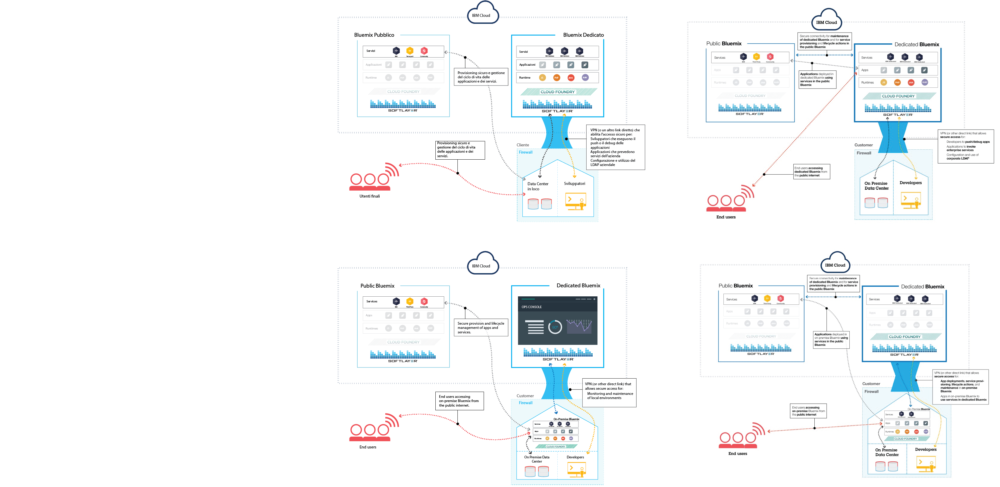

---

 

copyright:

  years: 2015, 2016

 

---

{:new_window: target="_blank"}
{:shortdesc: .shortdesc}

#{{site.data.keyword.Bluemix_notm}} dedicato
{: #dedicated}

*Ultimo aggiornamento: 16 maggio 2016*

{{site.data.keyword.Bluemix}} è
una piattaforma basata su cloud open standard per la creazione, esecuzione e
gestione delle applicazioni. Con {{site.data.keyword.Bluemix_notm}} dedicato, ottieni la potenza unita alla semplicità di {{site.data.keyword.Bluemix_notm}}&mdash; nel tuo ambiente SoftLayer dedicato che è connesso in modo protetto sia all'ambiente {{site.data.keyword.Bluemix_notm}} pubblico sia alla tua rete.
{:shortdesc}

Tutte le distribuzioni dedicate di {{site.data.keyword.Bluemix_notm}} includono i seguenti vantaggi e le seguenti funzioni senza alcun costo aggiuntivo: VPN, VLAN (virtual local area network) privata, firewall, connettività al tuo LDAP, possibilità di avvalerti dei database e delle applicazioni installati in loco già esistenti, sicurezza in loco 24 ore al giorno, 7 giorni su 7, hardware dedicato e supporto standard.

{{site.data.keyword.Bluemix_notm}} dedicato viene fornito con tutti i runtime {{site.data.keyword.Bluemix_notm}} inclusi e 64 GB di memoria per le risorse di calcolo.

Inoltre, è presente una serie di servizi disponibili come servizi dedicati {{site.data.keyword.Bluemix_notm}}. Consulta la seguente tabella per vedere cosa è incluso e cosa è disponibile per l'acquisto.

*Tabella 1. Servizi dedicati*

| **Tipo**        | **Nome**            | **Descrizione** |      
|-----------------|-------------------|-------------------|
|Incluso | Runtime {{site.data.keyword.Bluemix_notm}} | Utilizza i runtime per avere un'applicazione subito operativa, senza dover impostare e gestire macchine e sistemi operativi. Tutti i runtime {{site.data.keyword.Bluemix_notm}} sono a tua disposizione per la tua istanza di {{site.data.keyword.Bluemix_notm}} dedicato.|
|Incluso | {{site.data.keyword.autoscaling}} | Ti permette di aumentare o ridurre dinamicamente la capacità
di elaborazione della tua applicazione in base alle politiche. Con questo servizio,
avrai un uso illimitato nel tuo ambiente {{site.data.keyword.Bluemix_notm}}
dedicato. |
|Facoltativo | {{site.data.keyword.apiconnect_short}} | {{site.data.keyword.apiconnect_long}} integra {{site.data.keyword.APIM}} e IBM StrongLoop in una singola offerta che fornisce una soluzione completa per creare, eseguire, gestire e implementare API e microservizi. |
|Facoltativo | {{site.data.keyword.APIM}} | Utilizza il servizio {{site.data.keyword.APIMfull}}
per comporre, gestire e socializzare le API. Puoi importare delle API con risorse utilizzando un URL proxy o assemblando dati dalle origini dati HTTP. Il servizio {{site.data.keyword.APIM}} offre il vantaggio che puoi gestire la modalità di utilizzo delle tue API. |
|Facoltativo | {{site.data.keyword.cloudant}} | {{site.data.keyword.cloudant}} fornisce l'accesso a un livello di dati JSON NoSQL interamente gestito sempre attivo. Questo servizio è compatibile con CouchDB e accessibile mediante un'interfaccia HTTP di facile utilizzo per i modelli di applicazione web e mobile. |
|Facoltativo | {{site.data.keyword.dashdbshort}} | Usa dashDB per memorizzare dati relazionali, inclusi i tipi speciali quali i dati geospaziali. Quindi, analizza tali dati utilizzando l'analisi integrata SQL o avanzata come l'analisi predittiva e il data mining, l'analisi con R e l'analisi geospaziale. |
|Facoltativo | {{site.data.keyword.datacshort}} | Questo servizio fornisce una griglia di dati in memoria
che supporta scenari di cache distribuita per le tue applicazioni. Include
50 GB di cache in memoria. |
|Facoltativo | {{site.data.keyword.mobilepushshort}} | {{site.data.keyword.mobilepushshort}} è un servizio che puoi utilizzare per inviare notifiche a dispositivi iOS e Android.Le notifiche possono essere destinate a tutti gli utenti dell'applicazione oppure a uno specifico insieme di utenti e dispositivi facendo uso delle tag. Puoi amministrare i dispositivi, le tag e le sottoscrizioni. Puoi anche utilizzare API (application program interface) REST (Representational State Transfer) e SDK (software development kit) per sviluppare ulteriormente le tue applicazioni client. |
|Facoltativo | {{site.data.keyword.messagehub}} | {{site.data.keyword.messagehub}} è un bus di messaggi a velocità elevata scalabile e distribuito per unire le tue tecnologie installate in loco con quelle installate invece altrove. {{site.data.keyword.messagehub}} è basato su Apache Kafka, che è un motore di messaggistica in tempo reale rapido, scalabile e durevole.  |
|Facoltativo | {{site.data.keyword.SecureGateway}} | Il servizio {{site.data.keyword.SecureGateway}} fornisce un modo sicuro per connettere le applicazioni {{site.data.keyword.Bluemix_notm}} da posizioni remote installate in loco o nel cloud.  |
|Facoltativo | {{site.data.keyword.sescashort}} | Per aumentare la ridondanza, {{site.data.keyword.sescashort}} fornisce una replica di una sessione memorizzata nella cache. Pertanto, nel caso di un'interruzione o di un calo di tensione, la tua applicazione client mantiene l'accesso alla sessione nella cache. Il servizio supporta scenari di memorizzazione di sessioni nella cache per applicazioni Web e mobili. |
|Facoltativo | {{site.data.keyword.iot_full}} | Questo servizio consente alle tue applicazioni di comunicare tra loro e utilizzare i dati raccolti dai tuoi dispositivi, sensori e gateway connessi. L'offerta di base consente l'esecuzione di una versione privata di {{site.data.keyword.iot_full}} nell'ambiente dedicato con una capacità di 100,000 applicazioni o dispositivi connessi contemporaneamente e 1.6 TB di scambio dati. |

Sono presenti dei componenti facoltativi disponibili per te da acquistare per ridimensionare e estendere la capacità dei tuoi servizi o risorse. Puoi acquistare tutti questi componenti contattando il team di vendite; vai all'indirizzo [Contatti](https://console.ng.bluemix.net/?direct=classic/#/contactUs/cloudOEPaneId=contactUs) per informazioni su come contattare un rappresentante delle vendite. Per incrementare il tuo piano per un servizio, puoi selezionare il piano dal tile del servizio nel tuo catalogo.

*Tabella 2. Componenti facoltativi per l'acquisto*

| **Nome**            | **Descrizione** |      
|-------------------|-------------------|
|Incremento della capacità di 16 GB dedicato per i runtime  | Un'estensione dell'ambiente dei runtime che fornisce una capacità di runtime extra di 16 GB. |
|Incremento della capacità di 16 TB dedicato per {{site.data.keyword.cloudant}} | Include l'esecuzione di una versione privata di {{site.data.keyword.cloudantfull}} nell'ambiente dedicato con una capacità di 1.6 terabyte.  |
|Incremento della capacità di 50 GB dedicato per {{site.data.keyword.datacshort}} e {{site.data.keyword.sescashort}} | Un ambiente che consente la distribuzione e l'esecuzione di istanze {{site.data.keyword.datacshort}} e {{site.data.keyword.sescashort}} fino a una capacità cumulativa di 50 GB. |
|Capacità di 1 Gbps dedicata per Direct Link | Un link di rete dedicato che si connette direttamente al POP (point of presence) di rete SoftLayer designato per i trasferimenti dati fino a 1 Gbps. |
|Capacità di 10 Gbps dedicata per Direct Link | Un link di rete dedicato che si connette direttamente al POP (point of presence) di rete SoftLayer designato per i trasferimenti dati fino a 10 Gbps. |
|Dedicato per {{site.data.keyword.dashdbshort}} Enterprise 64.1 | Un database per istanza del servizio su un server dedicato con 64 GB RAM e 16 vCPU. Raccomandato fino a un 1 TB di precaricamento dati, in base alla compressione standard.  |
|Dedicato per {{site.data.keyword.dashdbshort}} Enterprise 256.4 | Un database per istanza del servizio su un server dedicato 256 GB RAM e 32 core. Raccomandato fino a un 4 TB di precaricamento dati, in base alla compressione standard. |
|Dedicato per {{site.data.keyword.dashdbshort}} Enterprise 256.12  | Un database per istanza del servizio su un server dedicato 256 GB RAM e 32 core. Raccomandato fino a un 12 TB di precaricamento dati, in base alla compressione standard. Questo è un piano ad alta densità di memorizzazione per gli ambienti in cui i volumi di dati sono elevati e non è necessario eseguire le query alle velocità in memoria. |
|Capacità di 1000 chiamate API dedicata per {{site.data.keyword.APIM}}  | Un ambiente che consente l'esecuzione di una versione privata di {{site.data.keyword.APIM}} nell'ambiente dedicato con una capacità di 1,000 chiamate API al secondo. |
|Incremento della capacità di 500 chiamate API dedicato per {{site.data.keyword.APIM}}  | Un ambiente che consente l'esecuzione di una versione privata di IBM API Management per Bluemix nell'ambiente dedicato con una capacità di 500 chiamate API al secondo.  |
|Servizi di community dedicati per {{site.data.keyword.Bluemix_notm}}  | Un ambiente che consente la distribuzione e l'esecuzione di servizi di community fino a un totale di 50 istanze per ogni servizio di community.  |
|Firewall hardware dedicato per IBM Bluemix  - Elevata disponibilità | Un firewall hardware di 1 Gbps ridondante configurato per la protezione di uno, alcuni o tutti i server nella stessa VLAN nell'ambiente dedicato. |
|VPN Vyatta di 1 Gbps dedicata configurata per l'elevata disponibilità  | Una Vyatta VPN di 1 Gbps configurata per l'elevata disponibilità per l'utilizzo da un ambiente dedicato. |
|IBM {{site.data.keyword.Bluemix_notm}} dedicato {{site.data.keyword.mobilepushshort}} | Un ambiente che consente la distribuzione e l'esecuzione di istanze {{site.data.keyword.mobilepushshort}} con la capacità di accettare 300 richieste al secondo. |
|Aumento incrementale dedicato per {{site.data.keyword.iot_short}} | Un incremento dell'ambiente che consente l'esecuzione di una versione privata di {{site.data.keyword.iot_short}} nell'ambiente dedicato con una capacità di 100,000 applicazioni o dispositivi connessi contemporaneamente e 0.5 TB di scambio dati. |

**Nota**: i componenti dedicati {{site.data.keyword.Bluemix_notm}} possono indicare una capacità configurata specifica, come ad esempio gigabyte o transazioni al secondo. Poiché la capacità attuale messa in pratica per ogni configurazione del servizio cloud varia in base a molti fattori, la capacità attuale messa in pratica può essere maggiore o inferiore alla capacità configurata.

### Catalogo diffuso
{: #catalogdedicated}

{{site.data.keyword.Bluemix_notm}} dedicato include un catalogo privato che consente di visualizzare i servizi locali disponibili in esclusiva per te. Sono compresi inoltre dei servizi messi a tua disposizione da {{site.data.keyword.Bluemix_notm}} pubblico.

Il catalogo diffuso fornisce la funzione per creare applicazioni ibride composte da servizi pubblici e privati. Hai la possibilità di decidere quali servizi pubblici rispondono ai tuoi requisiti aziendali, sulla base di criteri di sicurezza e privacy dei dati. Se si tratta di un'istanza privata del servizio per il tuo ambiente dedicato, vedi una tag "Dedicato" con i tile dei servizi nel tuo catalogo. Analogamente, se si tratta di un servizio personalizzato, vedi "Personalizzato" elencato nel tile del servizio.

*Tabella 3. Servizi disponibili per la diffusione da {{site.data.keyword.Bluemix_notm}} pubblico per regione*

|Servizio	|Disponibile nella regione Stati Uniti Sud	|Disponibile nella regione Europa Regno Unito |Disponibile nella regione di Sydney in Australia|
|:----------|:------------------------------|:------------------|:------------------|
|{{site.data.keyword.alchemyapishort}} 		|Sì	   	|Sì  		|Sì|
|{{site.data.keyword.alertnotificationshort}}		|Sì		|Sì			|Sì		|
|{{site.data.keyword.appseccloudshort}}		|Sì		|Sì		|Sì |
|{{site.data.keyword.hadoopst}}			|Sì		|No		|No |
|{{site.data.keyword.APIM}}			|Sì		|Sì		|Sì |
|{{site.data.keyword.rules_short}}		|Sì		|Sì		|Sì |
|{{site.data.keyword.cloudant}}			|Sì		|Sì		|Sì |
|{{site.data.keyword.conceptexpansionshort}}	|Sì		|Sì		|Sì|
|{{site.data.keyword.conceptinsightsshort}}	|Sì		|Sì		|Sì |
|{{site.data.keyword.dashdbshort}}		|Sì		|Sì		|Sì |
|{{site.data.keyword.dataworks_short}}		|Sì		|Sì		|No|
|{{site.data.keyword.DB2OnCloud_short}}		|Sì		|Sì		|Sì |
|{{site.data.keyword.dialogshort}}		|Sì		|Sì		|Sì|
|{{site.data.keyword.documentconversionshort}}	|Sì		|Sì		|Sì|
|{{site.data.keyword.game}}			|No		|No		|Sì |
|{{site.data.keyword.geospatialshort_Geospatial}}	|Sì	|Sì		|Sì |
|{{site.data.keyword.GlobalizationPipeline_short}}	|Sì		| Sì		| Sì |
|{{site.data.keyword.identitymixershort}}		|Sì		|Sì		|Sì|
|{{site.data.keyword.twittershort}}		|Sì		|Sì		|Sì|
|{{site.data.keyword.weather_short}}		|Sì		|Sì		|Sì|
|{{site.data.keyword.languagetranslationshort}}	|Sì		|Sì		|Sì |
|{{site.data.keyword.eventhubshort}}		|Sì		|No		|No|
|{{site.data.keyword.messagehub}}		|Sì		|Sì		|No|
|{{site.data.keyword.macm_short}}		|Sì		|Sì		|Sì|
|{{site.data.keyword.manda}}			|Sì		|Sì		|Sì |
|{{site.data.keyword.amashort}}			|Sì		|Sì		|Sì |
|{{site.data.keyword.mqa}}			|Sì		|Sì		|Sì |
|{{site.data.keyword.mql}}			|Sì		|Sì		|Sì |
|{{site.data.keyword.nlclassifierlshort}} 	|Sì 		|Sì 		|Sì|
|{{site.data.keyword.personalityinsightsshort}}	|Sì		|Sì		|Sì|
|{{site.data.keyword.pm_short}}			|Sì		|Sì		|No |
|{{site.data.keyword.presenceinsightsshort}}	|Sì		|Sì		|Sì|
|{{site.data.keyword.mobilepush}}		|Sì		|Sì		|Sì |
|{{site.data.keyword.questionandanswershort}}	|Sì		|Sì		|Sì|
|{{site.data.keyword.relationshipextractionshort}}	|Sì	|Sì		|Sì|
|{{site.data.keyword.retrieveandrankshort}}	|Sì 		|Sì 		|Sì|
|{{site.data.keyword.runbook_short}}		|Sì		|Sì		|Sì|
|{{site.data.keyword.SecureGateway}}		|Sì		|Sì		|Sì |
|{{site.data.keyword.ssofull}}			|Sì		|No		|No|
|{{site.data.keyword.speechtotextshort}}	|Sì 		|Sì	 	|Sì|
|{{site.data.keyword.streaminganalyticsshort}}	|Sì		|Sì		|Sì |
|{{site.data.keyword.texttospeechshort}} 	|Sì 		|Sì	 	|Sì|
|{{site.data.keyword.toneanalyzershort}} 	|Sì 		|Sì 		|Sì|
|{{site.data.keyword.tradeoffanalyticsshort}}	|Sì		|Sì		|Sì|
|{{site.data.keyword.visualinsightsshort}}	|Sì		|Sì		|Sì|
|{{site.data.keyword.visualrecognitionshort}}	|Sì 		|Sì	 	|Sì|
|{{site.data.keyword.iot_short}}		|Sì		|Sì		|No|
|{{site.data.keyword.workflow}}			|Sì		|Sì		|Sì |
|{{site.data.keyword.workloadscheduler}}	|Sì		|Sì		|Sì |

## Architettura di {{site.data.keyword.Bluemix_notm}} dedicato
{: #dedicatedarch}

{{site.data.keyword.Bluemix_notm}} dedicato è costruito su SoftLayer, così da permetterti di usufruire della struttura cloud dalle prestazioni più elevate. Ciascun data center fornisce rigorosi controlli di sicurezza 24 ore al giorno, 7
giorni a settimana. Tu e IBM accedete all'istanza di {{site.data.keyword.Bluemix_notm}} dedicato tramite un tunnel VPN e una VLAN privata.

{{site.data.keyword.Bluemix_notm}} dedicato
si inserisce nella tua rete tramite una VPN o una connessione di rete diretta. Il tuo hardware a singolo tenant può essere configurato in qualsiasi data center SoftLayer
in tutto il mondo. {{site.data.keyword.IBM_notm}} gestisce la piattaforma dedicata e i servizi dedicati, così tu puoi concentrarti sullo sviluppo di applicazioni personalizzate. Inoltre, {{site.data.keyword.IBM_notm}} esegue tutta la manutenzione per le istanze dedicate durante una finestra di manutenzione che stabilisci tu.

*Figura 1. Diagramma dettagliato di {{site.data.keyword.Bluemix_notm}} dedicato*

Gli ambienti di {{site.data.keyword.Bluemix_notm}} dedicato
hanno gli stessi standard di sicurezza di {{site.data.keyword.Bluemix_notm}} pubblico in
termini di sicurezza fisica, operativa e di infrastruttura. Tuttavia,
l'accesso degli sviluppatori a {{site.data.keyword.Bluemix_notm}} dedicato è
controllato dalle tue politiche LDAP, che possono essere configurate dal team di {{site.data.keyword.Bluemix_notm}}
nel momento in cui configurano il tuo ambiente. All'interno dell'ambiente dedicato,
puoi gestire i ruoli e le autorizzazioni degli utenti. Per i dettagli, vedi [Gestione di utenti e autorizzazioni](../admin/index.html#oc_useradmin).

##Configurazione dell'istanza di {{site.data.keyword.Bluemix_notm}} dedicato
{: #setupdedicated}

{{site.data.keyword.Bluemix_notm}} dedicato
è progettato per fornire una versione privata dell'offerta {{site.data.keyword.Bluemix_notm}}
pubblico. Puoi utilizzare i servizi e i runtime {{site.data.keyword.Bluemix_notm}} per supportare le tue esigenze di elaborazione in un account SoftLayer ospitato da IBM.

IBM ti fornisce l'accesso a {{site.data.keyword.Bluemix_notm}} dedicato, utilizzando un accesso protetto da password. Puoi accedere a servizi, runtime
e risorse associate nonché distribuire e rimuovere applicazioni {{site.data.keyword.Bluemix_notm}}. IBM si avvale di più sedi SoftLayer per la distribuzione di {{site.data.keyword.Bluemix_notm}} dedicato, il che ti permette di ottenere la tua versione privata in una sede a te vicina.

Per configurare la tua versione privata di {{site.data.keyword.Bluemix_notm}}:

<ol>
<li>Per iniziare, contatta il tuo rappresentante dell'account designato IBM oppure <a href="https://console.ng.bluemix.net/?direct=classic/#/contactUs/cloudOEPaneId=contactUs" target="_blank">contatta {{site.data.keyword.Bluemix_notm}}</a>.</li>
<li>Determina insieme a IBM la quota per la tua istanza di {{site.data.keyword.Bluemix_notm}} dedicato. La quota mensile ricorrente si basa sui servizi dedicati
che desideri utilizzare, oltre a una sottoscrizione a tutti i servizi pubblici
{{site.data.keyword.Bluemix_notm}}. Riceverai quindi una fattura per tutto ciò che scegli di utilizzare
al di fuori di tale accordo di sottoscrizione.</li>
<li>Identifica le scadenze per ogni fase di configurazione
della tua istanza di {{site.data.keyword.Bluemix_notm}}
dedicato. Per informazioni su ciascuna fase e sulle attività coinvolte, vedi <a href="index.html#rolesresponsibilities" target="_blank">Ruoli e responsabilità {{site.data.keyword.Bluemix_notm}} dedicato</a>.</li>
<li>Seleziona la <a href="http://www.softlayer.com/data-centers" target="_blank">sede data center SoftLayer</a> per la tua istanza dedicata. Vengono creati quindi la tua piattaforma dedicata e il tuo account. Per l'account, devi identificare le persone all'interno della tua organizzazione
a cui assegnare i ruoli necessari per rendere operativa la tua istanza
dedicata. Per informazioni sui ruoli che puoi assegnare, vedi <a href="index.html#rolesresponsibilities" target="_blank">Ruoli e responsabilità {{site.data.keyword.Bluemix_notm}} dedicato</a>.
</li>
<li>Definisci e stabilisci la connettività di rete tra la tua rete aziendale e l'istanza di {{site.data.keyword.Bluemix_notm}}
dedicato.
	<ol type="a">
	<li>IBM installa l'infrastruttura di monitoraggio e di sicurezza per l'istanza dedicata.</li>
	<li>IBM installa i servizi dedicati a singolo tenant che hai selezionato.</li>
	<li>Fornisci gli endpoint e la configurazione di rete
per cose come indirizzi IP o firewall e accedi al tuo LDAP per
l'integrazione in {{site.data.keyword.Bluemix_notm}}.</li>
	</ol>
</li>
<li>Identifica e assegna i ruoli del tuo team amministrativo per l'ambiente.
	<ol type="a">
	<li>IBM configura l'accesso alla rete e il LDAP in base alle informazioni che hai fornito. L'accesso amministrativo
viene fornito ai contatti da te designati. Devi designare un
contatto anche per il supporto e la fatturazione.</li>
	<li>IBM configura un catalogo diffuso nell'ambiente dedicato per visualizzare i tuoi servizi dedicati. Il catalogo diffuso include dei servizi aggiuntivi che vengono diffusi e messi a tua disposizione da {{site.data.keyword.Bluemix_notm}} pubblico. Hai la possibilità di decidere quali servizi pubblici rispondono ai tuoi requisiti aziendali, sulla base di criteri di sicurezza e privacy dei dati.</li>
	<li>Convalidi la configurazione di rete e del firewall e l'accesso e l'endpoint LDAP.</li>
	</ol>
</li>
</ol>

Per la distribuzione e configurazione iniziale del tuo ambiente puoi prevedere un processo simile a quello elencato di seguito. Per i dettagli sui responsabili di ciascuna attività, vedi [Ruoli e responsabilità](../dedicated/index.html#rolesresponsibilities).

<ol>
<li>Seleziona il data center che verrà utilizzato per ospitare l'istanza dedicata. Per informazioni sulle opzioni dei data center, vedi <a href="http://www.softlayer.com/data-centers" target="_blank">Sede data center SoftLayer</a>.</li>
<li>Specifica i nomi di dominio per la distribuzione e gli ID che desideri utilizzare. Quando configuri l'istanza {{site.data.keyword.Bluemix_notm}}, ottieni tre domini. Puoi scegliere il prefisso per <code>*mycompany*.*region*.bluemix.net</code> e <code>*mycompany*.*region*.mybluemix.net</code>. Inoltre, puoi scegliere il nome completo per il terzo dominio. 

Puoi scegliere il numero di domini personalizzati desiderato. Tuttavia, sarai responsabile dei certificati dei domini personalizzati. Per ulteriori informazioni sulla creazione del dominio personalizzato, consulta <a href="../manageapps/updapps.html#domain">Creazione e utilizzo di un dominio personalizzato</a>.
</li>
<li>Identifica un proprietario per l'account pubblico che viene utilizzato per rappresentare la tua azienda in {{site.data.keyword.Bluemix_notm}} pubblico. IBM utilizza questo account per tracciare l'utilizzo dei servizi diffusi.</li>
<li>Seleziona il tipo di connessione sicura al tuo data center. Puoi selezionare tra SoftLayer VPN, SoftLayer Direct Link e AT&T Net Bond.</li>
<li>Decidi se consentire l'accesso al tuo ambiente dedicato dall'Internet pubblico.</li>
<li>Seleziona il tipo di autenticazione che verrà utilizzato. Puoi selezionare ID IBM o Active Directory. Per informazioni sull'utilizzo e la registrazione di un ID IBM, consulta la pagina <a href="https://www.ibm.com/account/profile/us?page=regfaqhelp#4">Help and FAQ</a>.
</li>
<li>Identifica e assegna i ruoli del tuo team amministrativo per l'ambiente. Per informazioni sui ruoli che devi assegnare, vedi <a href="index.html#rolesresponsibilities" target="_blank">Ruoli e responsabilità {{site.data.keyword.Bluemix_notm}} dedicato</a>.</li>
<li>IBM distribuisce la piattaforma di base che include i runtime elastici, la console, la funzione di amministrazione e il monitoraggio.</li>
<li>IBM configura il tuo accesso amministrativo all'ambiente.</li>
<li>Puoi iniziare a utilizzare la tua istanza dedicata, monitorata dal team operativo IBM, al fine di rispondere agli avvisi.</li>
</ol>

Una volta configurata la tua istanza {{site.data.keyword.Bluemix_notm}}, puoi monitorare e gestire l'istanza {{site.data.keyword.Bluemix_notm}} utilizzando la pagina Amministrazione. Per ulteriori informazioni, vedi [Gestione di {{site.data.keyword.Bluemix_notm}} locale e dedicato](../admin/index.html#mng). Per informazioni su aggiornamenti e manutenzione, vedi [Manutenzione dell'istanza dedicata](index.html#maintaindedicated).

##Ruoli e responsabilità
{: #rolesresponsibilities}

Se hai configurato un account {{site.data.keyword.Bluemix_notm}} dedicato, devi identificare le persone all'interno della tua organizzazione a cui assegnare i ruoli necessari per rendere operativa la tua istanza.

###Ruoli

Il seguente elenco mostra i ruoli e le responsabilità dei clienti che puoi assegnare:

<dl>
<dt>**Procurement focal**</dt>
<dd>Lavora con il rappresentante IBM per organizzare il tuo ambiente {{site.data.keyword.Bluemix_notm}} dedicato, occupandosi inoltre dell'identificazione delle persone adeguate a gestire ogni aspetto del progetto all'interno della tua organizzazione. La persona assegnata a questo ruolo assume un ruolo di gestione dei progetti e controlla la selezione del modello, gli accordi commerciali e la disposizione dell'accesso alle risorse dei clienti. Il Procurement focal è il contatto generale per la configurazione dell'istanza dedicata e la traccia del processo di distribuzione.</dd>
<dt>**Responsabile della conformità**</dt>
<dd>Lavora con il rappresentante IBM per selezionare un'opzione di topologia e distribuzione che risponda ai tuoi requisiti di sicurezza. La persona assegnata a questo ruolo collabora con i consulenti di conformità IBM per determinare quali modelli di distribuzione raggiungono gli obiettivi di conformità.</dd>
<dt>**Network specialist**</dt>
<dd>Lavora con il rappresentante IBM per identificare i piani di rete per la distribuzione di {{site.data.keyword.Bluemix_notm}}. La persona assegnata a questo ruolo riesamina le specifiche di rete richieste da IBM e lavora con IBM su un piano di implementazione. Al termine della fase di installazione e verifica, la persona assegnata a questo ruolo conferma che la configurazione di rete è in conformità con gli standard aziendali.</dd>
<dt>**DevOps focal**</dt>
<dd>Lavora con il rappresentante IBM per pianificare e applicare gli aggiornamenti di manutenzione necessari per la piattaforma, i servizi e i runtime {{site.data.keyword.Bluemix_notm}}. La persona assegnata a questo ruolo lavora anche con il rappresentante IBM sulla configurazione della tua istanza di {{site.data.keyword.Bluemix_notm}} dedicato.</dd>
</dl>

I tuoi rappresentanti dei clienti collaborano con gli specialisti IBM che lavorano insieme per garantirti tutto il supporto di cui hai bisogno. Puoi eseguire l'upgrade al livello di supporto Premium per lavorare con un CSM (Client Success Manager) dedicato per il tuo account. Per ulteriori informazioni sui diversi livelli di supporto,
vedi [Come contattare il supporto](../support/index.html#contacting-support). Il CSM completa i seguenti tipi di attività:

<ul>
<li>Consente una rapida adozione del tuo ambiente {{site.data.keyword.Bluemix_notm}} dedicato.</li>
<li>Offre utili materiali didattici e di abilitazione per migliorare la tua autosufficienza.</li>
<li>Promuove una relazione a lungo termine tra te e lo sviluppo, il supporto e i servizi {{site.data.keyword.Bluemix_notm}} che utilizzi.</li>
</ul>

Il team operativo e di supporto di {{site.data.keyword.Bluemix_notm}} che insieme a te gestisce l'istanza {{site.data.keyword.Bluemix_notm}} potrebbe accedere al tuo ambiente dedicato, ma lo fa solo per i seguenti motivi.

<ul>
<li>Per rispondere agli avvisi ed eseguire la manutenzione operativa</li>
<li>Per tentare di riprodurre un problema riportato su un ticket di supporto</li>
</ul>

###Responsabilità

Dalla configurazione del tuo ambiente alla manutenzione continua, è necessario completare una serie di attività. La seguente tabella illustra le attività richieste e il proprietario per lo svolgimento delle attività attraverso le fasi di inizio, avanzamento e completamento.

La fase di inizio è utilizzata per organizzare l'ambiente {{site.data.keyword.Bluemix_notm}} dedicato. Gli obiettivi principali di questa fase sono i seguenti:

- Esaminare l'accordo finanziario e stabilire le date cardine per la distribuzione.
- Creare la piattaforma {{site.data.keyword.Bluemix_notm}} e fornire accesso a runtime e servizi.
- Definire e stabilire la connettività di rete tra la tua rete aziendale e le operazioni {{site.data.keyword.Bluemix_notm}}.
- Identificare e assegnare i ruoli per il team amministrativo.

*Tabella 4. Attività della fase di inizio*

| **Attività** | **Dettagli attività** | **Parte responsabile** |
|----------|------------------|-----------------------|
|Impostare gli standard di conformità | Identificare gli standard governativi, di settore e aziendali richiesti per l'ambiente. | Cliente |
|Creare un piano di integrazione di sicurezza e conformità | Creare un piano di sicurezza e di integrazione che includa i costi, la pianificazione e le risorse necessarie per garantire la conformità di sicurezza. | IBM |
|Approvazione del piano di conformità | Approvare il piano di conformità. | Cliente |
|Creare il dimensionamento per l'ambiente |  	Creare il dimensionamento dell'ambiente sulla base di scelte predefinite che tengono in considerazione gli obiettivi di alta disponibilità e ripristino di emergenza, così come il provisioning iniziale di DEA e servizi necessario per supportare le applicazioni create con la piattaforma. Lavora insieme a IBM per definire, ad esempio, quali database sono necessari, quali servizi vengono offerti nel catalogo diffuso del cliente e altro ancora. | Responsabilità condivisa tra IBM e il cliente |
|Selezionare l'architettura | Selezionare l'architettura sulla base di scelte predefinite che tengono in considerazione i requisiti di alta disponibilità e ripristino di emergenza. | IBM |
|Definire gli obiettivi del ripristino di emergenza | Definire i requisiti di ripristino di emergenza per l'ambiente. | Cliente |
|Creare il piano di ripristino di emergenza | Consultare e definire il piano di ripristino di emergenza. IBM crea un modello di ripristino di emergenza e con te stabilisce dove fornire il feedback e approvare il piano. | Responsabilità condivisa tra IBM e il cliente |
|Creare il piano di backup e ripristino | Creare un piano di backup e ripristino che definisce la frequenza e i requisiti per la distribuzione interna ed esterna del backup. IBM esegue il backup dei componenti della piattaforma, dei servizi IBM e dei metadati dei servizi, inclusi i ruoli utente e altro ancora. Tu esegui il backup dei dati specifici dell'applicazione di cui sei responsabile. | Responsabilità condivisa tra IBM e il cliente |
|Identificare gli strumenti per il rilevamento degli eventi e la determinazione dei problemi | Identificare gli strumenti IBM e di terze parti utilizzati per il rilevamento degli eventi e la determinazione dei problemi a livello della piattaforma {{site.data.keyword.Bluemix_notm}}. | IBM |
|Definire il piano di escalation | Definire il piano di escalation per valutare e risolvere gli eventi rilevati dai componenti di monitoraggio. | IBM |
|Firmare gli accordi relativi a infrastruttura, piattaforma e supporto | Firmare l'accordo di sottoscrizione che include i termini e le condizioni finanziarie per l'ambiente. Firmare la sottoscrizione di supporto. | Cliente |
|Disporre l'ambiente | Disporre le risorse di calcolo, la rete e la memoria incluso la VLAN core e dei servizi per ospitare {{site.data.keyword.Bluemix_notm}} e i servizi bare metal per ospitare Data Power e SoftLayer Firewall. Fornire l'infrastruttura per consentire il tunnel VPN. | Cliente |
|Installare i componenti della piattaforma, dell'applicazione e di monitoraggio e gestione | Installare, configurare e verificare i componenti della piattaforma, come ad esempio BOSH Director, Cloud Controller, Health Manager, messaggistica, router, DEA e provider di servizi e i componenti di monitoraggio definiti nel piano di escalation e rilevamento dei problemi. | IBM |
|Installare e configurare i componenti di sicurezza | Installare e configurare i componenti di sicurezza vincolati nel piano di monitoraggio e di escalation, tra cui IBM QRadar, archivio credenziali, sistema di prevenzione delle intrusioni, IBM BigFix e IBM Security Privileged Identity Management. | IBM |
|Installare e configurare i componenti personalizzati |  	Installare e configurare i componenti personalizzati che si trovano al di fuori del campo di applicazione del prodotto e dei servizi {{site.data.keyword.Bluemix_notm}}. | Cliente |
|Stabilire la configurazione di rete iniziale | Stabilire la configurazione di rete iniziale inclusi i firewall, DataPower, Fortigate e DNS. | IBM |
|Connettere la pipeline {{site.data.keyword.Bluemix_notm}} | Connettere la pipeline di fornitura e di integrazione continua {{site.data.keyword.Bluemix_notm}} ai repository IBM. | IBM |
|Personalizzare i componenti della soluzione esterni | Personalizzare i servizi di bilanciamento del carico per gli scenari di ripristino di emergenza. | Cliente |
|Installare la soluzione VPN | Installare la soluzione VPN bidirezionale. | IBM |
|Configurare il server di accesso | Configurare il server di accesso per l'utilizzo del LDAP aziendale. | IBM |
|Tracciare lo stato per le verifiche di sicurezza, conformità e controllo  | Tracciare lo stato fino al punto in cui vengono osservati tutti gli strumenti e processi per raggiungere la conformità identificata. | Cliente |
|Controllare l'infrastruttura fisica | Controllare le sedi fisiche che ospitano i componenti della soluzione per individuare eventuali minacce e riesaminare i controlli di sicurezza per proteggere il data center. | Cliente |
|Ispezionare il software di monitoraggio | Ispezionare i componenti di monitoraggio e gestione, come definito nel piano di escalation e determinazione dei problemi. | Cliente |
|Ispezionare il sistema operativo | Verificare che l'immagine del sistema operativo rispetti gli standard di conformità. IBM fornisce l'accesso all'immagine del sistema operativo. | Responsabilità condivisa tra IBM e il cliente |

La fase successiva è quella di avanzamento. La fase di avanzamento descrive il rapporto di collaborazione in corso tra te e IBM Cloud. Gli obiettivi principali per questa fase sono i seguenti:

- Esaminare le capacità e coordinare le modifiche necessarie.
- Esaminare i miglioramenti di manutenzione e piattaforma.
- Coordinare le attività per la risoluzione dei problemi e l'analisi delle cause principali.

*Tabella 5. Attività della fase di avanzamento*

| **Attività** | **Dettagli attività** | **Parte responsabile** |
|----------|------------------|-----------------------|
|Esaminare i report sulle capacità settimanali | Esaminare i report sulle capacità settimanali e adottare misure correttive laddove necessario. | Cliente |
|Creare proiezioni mensili | Raccogliere informazioni e creare una proiezione mensile della capacità e del consumo. | Responsabilità condivisa tra IBM e il cliente |
|Esaminare le proiezioni della capacità | Esaminare le proiezioni della capacità relative ad eventi esterni che potrebbero influire sulle capacità così come sulle nuove distribuzioni previste per le applicazioni. Lavorare con IBM per esaminare le proiezioni e creare un piano adeguato. | Responsabilità condivisa tra IBM e il cliente |
|Esaminare le proiezioni | Esaminare le proiezioni della capacità relative ad eventi esterni che potrebbero influire sulle capacità. | Cliente |
|Regolare la capacità |  Aggiungere o rimuovere capacità al mutare delle esigenze. | IBM |
|Pubblicare gli aggiornamenti e la manutenzione previsti | Creare la documentazione per la manutenzione richiesta dei componenti IBM. | IBM |
|Effettuare la manutenzione | Lavorare con IBM per pianificare la manutenzione richiesta all'interno di una finestra di 21 giorni. Puoi fornire le date che per te potrebbero non andare bene all'interno della finestra di 21 giorni; IBM provvederà a pianificare la manutenzione di conseguenza.  | Responsabilità condivisa tra IBM e il cliente |
|Rilevamento di errori di provisioning | Correggere gli errori di provisioning, se presenti, per i servizi creati dal cliente che vengono distribuiti nel catalogo. | IBM |
|Eseguire scansioni di rete e IP | Eseguire scansioni di rete e IP giornaliere e mensili. | Responsabilità condivisa tra IBM e il cliente |
|Fornire accesso ai log di controllo | Fornire accesso a tutti i log di controllo amministrativo e della sicurezza.   | Responsabilità condivisa tra IBM e il cliente |
|Effettuare dei test | Effettuare periodicamente il test dei controlli chiave sulle operazioni e il test di penetrazione di terze parti. | Responsabilità condivisa tra IBM e il cliente |
|Segnalazione dello stato, coordinamento dei controlli e incontri di conformità  | Completare la segnalazione dello stato, il coordinamento del controllo esterno e la rappresentazione negli incontri sullo stato di revisione della conformità. | IBM |
|Verifica dell'occupazione lavorativa e delle esigenze aziendali | Completare la verifica trimestrale dell'occupazione lavorativa e la verifica delle continue esigenze aziendali per i rappresentanti IBM che hanno accesso all'ambiente del cliente. | IBM |
|Risoluzione delle vulnerabilità di sicurezza | Risolvere le vulnerabilità di sicurezza segnalate nella piattaforma. | IBM |

La fase finale di completamento rappresenta la fine del rapporto tra te e IBM {{site.data.keyword.Bluemix_notm}}. Le attività principali per questa fase sono le seguenti:

* Termine dell'accordo finanziario
* Rimozione di tutte le connessioni di rete
* Riciclaggio dell'infrastruttura

*Tabella 6. Attività della fase di completamento*

| **Attività** | **Dettagli attività** | **Parte responsabile** |
|----------|------------------|-----------------------|
|Terminare l'accordo finanziario | Discutere e concordare un termine per il contratto dell'accordo finanziario. | Responsabilità condivisa tra IBM e il cliente |
|Rimuovere le autorizzazioni per l'ambiente | Disattivare l'accesso e le credenziali per l'ambiente. | Responsabilità condivisa tra IBM e il cliente |
|Rimuovere le connessioni di rete del cliente | Rimuovere le connessioni di rete tra IBM e l'ambiente del cliente. | Responsabilità condivisa tra IBM e il cliente |
|Riciclare l'infrastruttura | Il tuo ambiente viene riciclato in base ai processi definiti da SoftLayer. | IBM |

##Gestione della tua istanza dedicata
{: #maintaindedicated}

IBM effettua la manutenzione e l'installazione di aggiornamenti e correzioni ogni qualvolta lo ritenta appropriato per i runtime e i servizi {{site.data.keyword.Bluemix_notm}}. I servizi potrebbero non essere disponibili durante le finestre di manutenzione. Inoltre, IBM collabora con te per pianificare gli aggiornamenti di manutenzione per la piattaforma {{site.data.keyword.Bluemix_notm}}.

Per
{{site.data.keyword.Bluemix_notm}} dedicato sono richiesti i seguenti tipi di manutenzione:
<dl>
<dt>**Manutenzione standard per i servizi**</dt>
<dd>I servizi utilizzano delle finestre di manutenzione standard predefinite, che potrebbero causare la non disponibilità del servizi. IBM non richiede l'approvazione dei clienti per eseguire la manutenzione dei servizi, ma prova a ridurre al minimo l'impatto sui tuoi servizi. 
 
IBM invia dei messaggi di broadcast relativi alle modifiche pianificate per ciascuna finestra di manutenzione nella pagina Stato. 
 
**Importante**: alcuni servizi potrebbero non essere a tua disposizione durante il periodo di manutenzione.</dd>

<dt>**Manutenzione standard per la piattaforma {{site.data.keyword.Bluemix_notm}}**</dt>
<dd>Gli aggiornamenti di manutenzione vengono applicati in base al coordinamento tra te e IBM entro una finestra di 21 giorni. Fornisci a IBM le finestre di manutenzione preapprovate e le date o gli orari specifici che potrebbero non andare bene per te; IBM cercherà di pianificare gli aggiornamenti durante o intorno alle date da te selezionate.

Vai a **AMMINISTRAZIONE > INFORMAZIONI DI SISTEMA** per visualizzare gli aggiornamenti di manutenzione pianificati e in sospeso. Per ulteriori informazioni sull'impostazione delle tue finestre preapprovate, e la visualizzazione o l'approvazione degli aggiornamenti di manutenzione, vai a <a href="../admin/index.html#oc_schedulemaintenance">Aggiornamenti di manutenzione</a>
.</dd>
</dl>

**Importante**: IBM si riserva il diritto di interrompere i servizi per applicare la manutenzione di emergenza a seconda delle necessità. IBM potrebbe modificare le ore di manutenzione pianificate, ma verrai avvisato di tali modifiche nonché di tutte le informazioni relative alla manutenzione di emergenza.

Se viene segnalato un problema dopo l'aggiornamento di manutenzione, insieme al rappresentante del supporto {{site.data.keyword.Bluemix_notm}} puoi stabilire se ti è utile consentire a IBM di eseguire il rollback dell'aggiornamento. Previo accordo, IBM esegue il rollback dell'aggiornamento per ripristinare l'ambiente allo stato precedente.

## Supporto e risposta agli incidenti
{: #incidentresponse}

### Problemi rilevati dal cliente

Se identifichi un problema che richiede un intervento e attenzione da parte del supporto IBM, puoi contattarlo in vari modi. Per informazioni su come contattare il supporto, vedi [Come contattare il supporto](../support/index.html#contacting-bluemix-support-local). A seconda del problema, dovrà essere risolto da te e/o da IBM.

### Incidenti critici rilevati da IBM

Gli incidenti critici sono interruzioni dei servizi impreviste con carattere d'urgenza e problemi di stabilità che colpiscono il tuo ambiente o i tuoi utenti. Se IBM individua un incidente critico nel proprio ambiente, te lo comunica tramite notifica nella pagina **Stato**. Puoi consultare la pagina Stato anche per eventuali problemi noti relativi alla piattaforma o ai tuoi servizi. Per ulteriori informazioni sulla pagina Stato, consulta [Visualizzazione dello stato](../admin/index.html#oc_status).

Se desideri integrare le tue notifiche con un servizio Web che supporti gli hook Web, vedi [Notifiche e sottoscrizioni di eventi](../admin/index.html#oc_eventsubscription) per informazioni su come estendere le funzioni di notifica.

*Figura 2. Processo di risposta agli incidenti*

A seconda del problema, dovrà essere risolto da te e/o da IBM. Se hai domande sull'incidente o se hai bisogno che un rappresentante IBM ti aiuti a risolvere il problema, puoi aprire un ticket di supporto. Per informazioni su come contattare il supporto, vedi [Come contattare il supporto](../support/index.html#contacting-bluemix-support-local).

**Nota**: i ticket di supporto con severità 1 vengono monitorati 24 ore al giorno, 7 giorni a settimana. Gli altri ticket vengono elaborati dalle 22:00 GMT di domenica alle 12:00 GMT di sabato. Per ulteriori informazioni sulla severità dei ticket di supporto e sull'utilizzo del supporto, vedi <a href="../support/index.html#contacting-bluemix-support-local">Come contattare il supporto</a>.

## Ripristino di emergenza
{: #dr}

Il ripristino di emergenza per {{site.data.keyword.Bluemix_short}} dedicato può essere configurato in modo analogo a quello valido quando si utilizza {{site.data.keyword.Bluemix_short}} pubblico. {{site.data.keyword.Bluemix_short}} pubblico fornisce una piattaforma costantemente disponibile per l'innovazione con più misure di sicurezza per garantire che le tue organizzazioni, i tuoi spazi e le tue applicazioni siano sempre disponibili. La distribuzione delle applicazioni in più regioni geografiche consente una disponibilità continua che protegge contro l'imprevista perdita simultanea di più componenti hardware o software o la perdita di un intero data center; in tal modo, anche in caso di catastrofe naturale in una posizione geografica, le istanze distribuite della tua applicazione {{site.data.keyword.Bluemix_notm}} pubblico saranno disponibili in posizioni geografiche alternative.
{: shortdesc}

Il ripristino di emergenza per {{site.data.keyword.Bluemix_short}} dedicato è reso possibile grazie alla disponibilità continua per le tue applicazioni, all'alta disponibilità intrinseca della piattaforma e alla possibilità di ripristinare l'istanza in caso di errore. Sei responsabile dell'abilitazione della disponibilità continua delle tue applicazioni mediante la distribuzione a più regioni. L'alta disponibilità viene integrata a livello della piattaforma tramite le tecnologie incluse in Cloud Foundry e altri componenti. Inoltre, puoi collaborare con IBM per assicurarti che il backup dei tuoi dati venga eseguito correttamente nel caso in cui sia necessario ripristinare la tua istanza.

### Abilitazione della disponibilità continua per {{site.data.keyword.Bluemix_notm}} dedicato
{: #enabling}

Per impostazione predefinita, {{site.data.keyword.Bluemix_notm}} pubblico viene distribuito in più posizioni geografiche. Tuttavia, per abilitare le istanze {{site.data.keyword.Bluemix_notm}} dedicato distribuite a livello globale, devi effettuare le seguenti attività:

* Assicurati che gli sviluppatori stiano distribuendo le applicazioni in più di una regione, mediante un processo manuale o automatico. Le regioni dovrebbero trovarsi a più di 200 km di distanza l'una dall'altra per garantire che, in caso di catastrofe naturale, non vengano colpite entrambe le posizioni geografiche.
* Configurare un programma di bilanciamento del carico globale, come Akamai o Dyn, per puntare ad applicazioni in almeno due regioni diverse.

**Nota**: non tutti i servizi {{site.data.keyword.Bluemix_notm}} supportano la distribuzione regionale. Quando crei un'applicazione, se vuoi garantire una distribuzione geografica, devi fare in modo che i servizi utilizzati dall'applicazione abbiano come funzione fondamentale la sincronizzazione dei dati.

#### Distribuzione di applicazioni {{site.data.keyword.Bluemix_notm}} dedicato in più posizioni geografiche
{: #deploying}

Per eseguire la distribuzione in una seconda posizione o in più posizioni, devi seguire un processo simile a quello effettuato per abilitare la posizione geografica primaria:

1. Abilita un nuovo ambiente dedicato per ospitare istanze aggiuntive delle tue applicazioni. Per creare un nuovo ambiente, contatta il team del settore vendite IBM per avviare il processo. Per ulteriori informazioni sulla configurazione di un'istanza dedicata, vedi [Configurazione di {{site.data.keyword.Bluemix_notm}} dedicato](../dedicated/index.html#setupdedicated). Devi effettuare un accesso distinto per ogni ambiente. Ciascuna posizione fisica degli ambienti host deve trovarsi ad almeno 200 km di distanza dalla posizione originale per garantire la disponibilità.
2. Ottieni il nome di dominio univoco in cui verrà ospitata la tua nuova applicazione distribuita. Ad esempio, se il dominio originale è *mycompany.east.bluemix.net*, puoi creare un nuovo ambiente dedicato con un nuovo dominio come, ad esempio, *mycompany.west.bluemix.net* e distribuire al nuovo dominio.
3. Ogni volta che distribuisci l'applicazione originale, esegui anche la distribuzione nella nuova posizione. Per ulteriori informazioni sulla distribuzione, vedi [Caricamento della tua applicazione](../starters/upload_app.html).

#### Abilitazione di un programma di bilanciamento del carico globale per {{site.data.keyword.Bluemix_notm}} dedicato
{: #glb}

Un programma di bilanciamento del carico globale non solo garantisce la disponibilità continua ed è richiesto per il ripristino di emergenza, ma presenta anche diversi vantaggi aggiuntivi:

* Indirizza gli utenti alla regione {{site.data.keyword.Bluemix_notm}} più vicina per impostazione predefinita
* Indirizza in base alle prestazioni
* Instrada selettivamente una percentuale di traffico a una nuova versione dell'applicazione
* Fornisce il failover del sito in base alla verifica dell'integrità della regione
* Fornisce il failover del sito in base alla verifica dell'integrità dell'applicazione
* Utilizza un instradamento ponderato tra gli endpoint

Puoi scegliere un programma di bilanciamento del carico globale come Akamai o Dyn. Per ulteriori informazioni sull'utilizzo di Akamai come programma di bilanciamento del carico globale, vedi [Global traffic management](https://www.akamai.com/us/en/solutions/products/web-performance/global-traffic-management.jsp){: new_window}. Per ulteriori informazioni sull'utilizzo di Dyn come programma di bilanciamento del carico globale, vedi [4 Reasons Businesses Are Taking Global Load Balancing to the Cloud](http://dyn.com/blog/4-reasons-businesses-are-taking-global-load-balancing-to-the-cloud/){: new_window}.

### Alta disponibilità
{: #ha}

Oltre a consentire la disponibilità continua, {{site.data.keyword.Bluemix_notm}} fornisce anche l'alta disponibilità in tutta la piattaforma utilizzando le tecnologie integrate in Cloud Foundry e altri componenti.

Queste tecnologie includono:

<dl>
<dt>Scalabilità in Cloud Foundry DEA</dt>
<dd>Un <a href="https://docs.cloudfoundry.org/concepts/architecture/execution-agent.html" target="_blank">DEA (Droplet Execution Agent)</a> Cloud Foundry effettua verifiche dell'integrità nelle applicazioni eseguite al suo interno. Se si verifica un problema con l'applicazione o con lo stesso DEA, distribuisce ulteriori istanze dell'applicazione a un DEA alternativo per risolvere il problema. Per ulteriori informazioni, vedi <a href="https://docs.cloudfoundry.org/concepts/high-availability.html" target="_blank">Configuring CF for High Availability with Redundancy</a>. 

Per garantire l'elevata disponibilità per le tue applicazioni, hai bisogno di abbastanza risorse di elaborazione per bilanciare il carico e puoi inoltre richiederne ulteriori per supportare un possibile malfunzionamento. Se hai bisogno di ridimensionare il tuo ambiente incrementando il tuo pool DEA in modo da essere preparato a un malfunzionamento o per affrontare un'anomalia durante il caricamento delle tue istanze dell'applicazione, puoi collaborare con il tuo rappresentante IBM per ordinare ulteriori DEA.

</dd>
<dt>Ridondanza SoftLayer</dt>
<dd>Con SoftLayer negli ambienti dedicati, i dati presenti in ciascun cluster di archiviazione cloud vengono scritti più volte e i cluster di archiviazione sono configurati con capacità di riparazione automatica in caso di guasto dell'unità. Se si verifica un problema con un server virtuale, SoftLayer prova a riavviarlo in un altro host.</dd>
<dt>Backup dei metadati</dt>
<dd>I metadati vengono sottoposti a backup mediante il sistema SoftLayer EVault Backup in una posizione che si trova ad almeno 200 km di distanza.</dd>
</dl>

##Ripristino della tua istanza dedicata
{: #restorededicated}

Il backup di impostazioni, metadati e configurazioni di {{site.data.keyword.Bluemix_notm}} dedicato viene eseguito periodicamente come tutela in caso di eventuali interruzioni non pianificate nell'ambiente. I dati per i quali sei responsabile del backup includono i dati dell'applicazione, i dati dei servizi del database cloud e gli archivi oggetti.

Come parte del backup dei dati, che include i metadati del sistema e le configurazioni, IBM completa le seguenti attività:

<ul>
<li>Crittografa tutte le copie di backup e gestisce le chiavi di crittografia</li>
<li>Monitora e gestisce l'attività di backup</li>
<li>Fornisce i file di backup crittografati</li>
<li>Ripristina i dati richiesti</li>
<li>Gestisce i conflitti di pianificazione tra le operazioni di gestione dei backup e delle correzioni</li>
</ul>

Poiché la protezione dei dati privati è di importanza critica, IBM ha bisogno della tua collaborazione quando si occupa della gestione dei file di backup in modo che i file non vengano spostati all'esterno dei tuoi data center. Nello specifico, IBM richiede che tu completi le seguenti attività:

<ul>
<li>Spostare una copia dei tuoi dati di backup crittografati fuori sede, proprio come faresti per qualsiasi altro dato di backup da te gestito.</li>
<li>Fornire i file di backup per l'operatore IBM nel caso occorra eseguire un ripristino.</li>
</ul>

# rellinks
## general
* [Scopri: {{site.data.keyword.Bluemix_notm}} dedicato](http://www.ibm.com/cloud-computing/bluemix/hybrid/dedicated/)
* [Novità in {{site.data.keyword.Bluemix_notm}}](../whatsnew/index.html)
* [{{site.data.keyword.Bluemix_notm}} glossario](../overview/glossary/index.html)
* [Gestione di {{site.data.keyword.Bluemix_notm}} locale e {{site.data.keyword.Bluemix_notm}} dedicato](../admin/index.html#mng)
* [Come contattare il supporto](../support/index.html#getting-customer-support)
