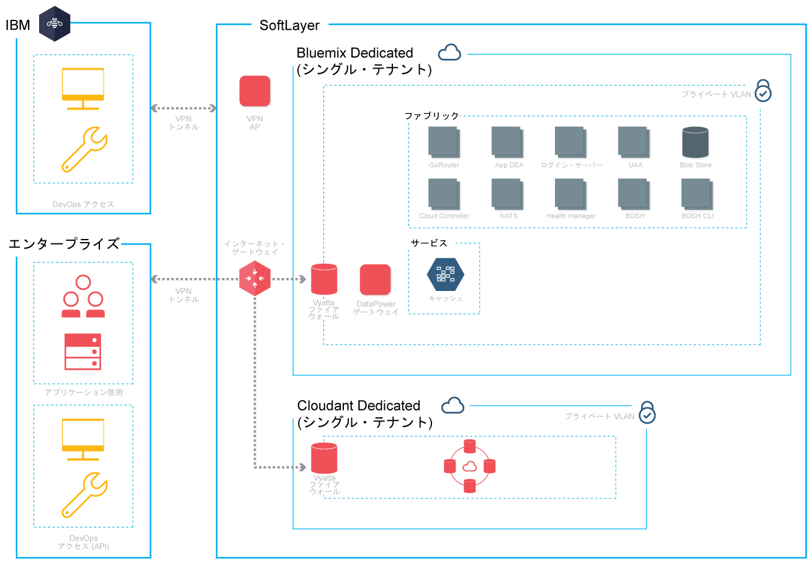

{:new_window: target="_blank"} 
{:shortdesc: .shortdesc}

#{{site.data.keyword.Bluemix_notm}} Dedicated
{: #dedicated}

*最終更新日: 2015 年 10 月 20 日*

{{site.data.keyword.Bluemix}} は、アプリケーションをビルド、実行、および管理するためのクラウド・ベースのオープン標準プラットフォームです。{{site.data.keyword.Bluemix_notm}} Dedicated を使用すれば、{{site.data.keyword.Bluemix_notm}} Public 環境とお客様のネットワークの両方にセキュアに接続されたお客様の専用 SoftLayer 環境で、{{site.data.keyword.Bluemix_notm}} が持つ能力と簡潔さが得られます。
{:shortdesc}

{{site.data.keyword.Bluemix_notm}} Dedicated には、自分だけが使用できる専用サービスを表示するプライベート・カタログが含まれています。また、{{site.data.keyword.Bluemix_notm}} Public からシンジケートおよび使用できる追加サービスも含まれています。

{{site.data.keyword.Bluemix_notm}} Dedicated は、SoftLayer に基づいて構築されているため、最高のパフォーマンスを誇るクラウド・インフラストラクチャーを使用できます。各データ・センターは 1 週間に 7 日、1 日 24 時間のセキュリティー、および厳格な管理が施されています。お客様および IBM は、VPN トンネルおよび専用 VLAN を介して {{site.data.keyword.Bluemix_notm}} Dedicated インスタンスにアクセスします。

*図 1. {{site.data.keyword.Bluemix_notm}} Dedicated の詳細図*

インフラストラクチャー、運用、および物理的セキュリティーの観点から、{{site.data.keyword.Bluemix_notm}} Dedicated 環境のセキュリティー標準はパブリック {{site.data.keyword.Bluemix_notm}} のセキュリティー標準と同じです。ただし、専用 {{site.data.keyword.Bluemix_notm}} に対する開発者のアクセスは LDAP ポリシーによって制御されます。{{site.data.keyword.Bluemix_notm}} チームは、ご使用の環境の設定時にこのポリシーを構成することができます。専用環境内で、ユーザーの役割および許可を管理できます。詳しくは、『[ユーザーおよび許可の管理](../admin/index.html#oc_useradmin)』を参照してください。

{{site.data.keyword.Bluemix_notm}} Dedicated には、付属しているすべての {{site.data.keyword.Bluemix_notm}} ランタイムおよび 128 GB のアプリケーション・メモリーが搭載されています。

さらに、デフォルトの一連の組み込みサービスと、専用インスタンス用に選択できるオプションのサービスがあります。 

| **タイプ **        | **名前**            | **説明** |      
|-----------------|-------------------|-------------------|
| 組み込み | {{site.data.keyword.autoscaling}} | ポリシーに基づいて、アプリケーションの計算能力を動的に増減します。このサービスを使用することで、{{site.data.keyword.Bluemix_notm}} Dedicated 環境で使用量が無制限になります。 |
| 組み込み | {{site.data.keyword.datacshort}} | このサービスは、アプリで分散キャッシュ・シナリオをサポートするメモリー内データ・グリッドを提供します。50 GB のメモリー内キャッシュが含まれます。 |
| 組み込み | {{site.data.keyword.cloudant}} | ハイパフォーマンスの JSON データ・レイヤーを提供する IBM の NoSQL データベース (CouchDB 互換)。1.6 TB および最大 3,000 API 要求/秒が含まれます。 |
| オプション | {{site.data.keyword.sqldb}} | IBM {{site.data.keyword.sqldbfull}} Database for {{site.data.keyword.Bluemix_notm}} は、完全にプロビジョンされたリレーショナル・データベースをアプリケーションに追加します。{{site.data.keyword.sqldb}} は、ビジネスで負荷が高い Web ワークロードとトランザクション・ワークロードを処理するためのマネージド・データベースです。 |
| オプション | {{site.data.keyword.mql}} | IBM {{site.data.keyword.mqlfull}} for {{site.data.keyword.Bluemix_notm}} は、{{site.data.keyword.Bluemix_notm}} アプリにフレキシブルで使いやすいメッセージングを提供する、クラウド・ベースのメッセージング・サービスです。{{site.data.keyword.mql}} は、メッセージングに対する管理しやすいソリューションとなっています。{{site.data.keyword.mql}} を使用すれば、アプリの即応性と拡張性が高まると共に、簡潔で強力な API を使用してアプリ間で作業を共有して、作業の負荷を軽減することができます。 |
| オプション | {{site.data.keyword.dashdbshort}} | dashDB を使用して、地理空間情報などの特殊タイプを含む、リレーショナル・データを保管します。次に、そのデータを SQL、または予測分析とデータ・マイニング、R による分析、および Geospatial Analytics などの拡張組み込み分析を使用して分析します。 |

*表 1. Dedicated のサービス*

##{{site.data.keyword.Bluemix_notm}} Dedicated のセットアップ
{: #setupdedicated}

{{site.data.keyword.Bluemix_notm}} Dedicated は、{{site.data.keyword.Bluemix_notm}} Public オファリングの専用バージョンを提供するように設計されています。{{site.data.keyword.Bluemix_notm}} サービスおよびランタイムを使用して、IBM でホストされている SoftLayer アカウントでコンピューティング・ニーズをサポートすることができます。

IBM は、お客様がパスワードで保護されたログインを使用して {{site.data.keyword.Bluemix_notm}} Dedicated にアクセスできるようにします。サービス、ランタイム、および関連リソースにアクセスしたり、{{site.data.keyword.Bluemix_notm}} アプリをデプロイおよび削除したりすることができます。IBM は複数の SoftLayer ロケーションを利用して、{{site.data.keyword.Bluemix_notm}} Dedicated を提供しているため、お客様に近いロケーションにある専用バージョンをご利用いただけます。

{{site.data.keyword.Bluemix_notm}} の専用バージョンをセットアップするには、以下のようにします。

<ol>
<li>IBM 指定のアカウント担当者に連絡するか、 <a href="https://console.ng.bluemix.net/?direct=classic/#/contactUs/cloudOEPaneId=contactUs" target="_blank">{{site.data.keyword.Bluemix_notm}}</a>に連絡して、開始します。</li>
<li>毎月繰り返し発生する料金は、使用する専用サービスと、すべての {{site.data.keyword.Bluemix_notm}} パブリック・サービスのサブスクリプションに基づきます。さらに、当該サブスクリプション契約を超えて使用したサービスに対する請求書を受け取ります。<ol type="a">
	<li>{{site.data.keyword.Bluemix_notm}} Dedicated インスタンスの料金について IBM と連携して決定します。	毎月繰り返し発生する料金は、使用する専用サービスと、すべての {{site.data.keyword.Bluemix_notm}} パブリック・サービスのサブスクリプションに基づきます。さらに、当該サブスクリプション契約を超えて使用したサービスに対する請求書を受け取ります。</li>
	<li>{{site.data.keyword.Bluemix_notm}} Dedicated インスタンスをセットアップする各フェーズの期限を特定します。</li>
	</ol>
	</li>
<li>専用インスタンスの <a href="http://www.softlayer.com/data-centers" target="_blank">SoftLayer データ・センターのロケーション</a>を選択します。その後、専用プラットフォームおよびアカウントが作成されます。アカウントについて、専用インスタンスを稼働するために必要な役割の組織内のユーザーを特定します。各役割に対して、対応する IBM 担当員が存在します。 

お客様の役割:

<dl>
<dt>**調達フォーカル**</dt>
<dd>IBM 担当員と連携して、{{site.data.keyword.Bluemix_notm}} Dedicated 環境を設定します。これには、プロジェクトのあらゆる側面について作業するのに適切な、組織内のユーザーを特定することが含まれます。この役割では、パターン選択、商業協定およびお客様のリソースへのアクセスの取り決めを監視します。調達フォーカルは、専用インスタンスをセットアップする際の総合的連絡先になります。</dd>
<dt>**コンプライアンス責任者**</dt>
<dd>IBM 担当員と連携して、お客様のセキュリティー要件に合ったトポロジーとデプロイメントのオプションを選択します。この役割は IBM コンプライアンス・コンサルタントと連携して、コンプライアンスの目標と目的を達成するデプロイメント・パターンを決めます。</dd>
<dt>**ネットワーク・スペシャリスト**</dt>
<dd>IBM 担当員と連携して、 {{site.data.keyword.Bluemix_notm}} デプロイメントのネットワーク計画を決定します。この役割は、IBM 担当員に要件を伝え、連携して実装計画を策定します。インストールと検証の段階が終わると、この役割は、ネットワーク構成が企業標準に準拠していることを「承認」します。</dd>
<dt>**DevOps フォーカル**</dt>
<dd>IBM 担当員と連携して、{{site.data.keyword.Bluemix_notm}} のプラットフォーム、サービス、およびランタイムに必要な保守更新を計画して適用します。また、この役割は IBM 担当員と連携して、{{site.data.keyword.Bluemix_notm}} Dedicated インスタンスの構成も行います。</dd>
</dl>

IBM の役割:

<dl>
<dt>**IBM プロビジョニング・マネージャー**</dt>
<dd>お客様の調達フォーカルと連携して、お客様の環境を確立します。</dd>
<dt>**IBM コンプライアンス・コンサルタント**</dt>
<dd>お客様のコンプライアンス責任者と連携して、お客様のセキュリティー要件を満たすトポロジーとデプロイメント・オプションを選択します。</dd>
<dt>**IBM ネットワーク・スペシャリスト**</dt>
<dd>お客様のネットワーク・スペシャリストと連携して、デプロイメントに合ったネットワーク計画を策定します。この役割はお客様と連携して、必要条件を収集し、実装計画を作成します。また、この役割は、実装計画が物理的にどういう結果になるかを検証する自動化されたテストも実行します。</dd>	
<dt>**IBM DevOps フォーカル**</dt>
<dd>お客様の DevOps フォーカルと連携して、デプロイメント・トポロジーのインストールと継続的な保守を行います。この役割は、お客様と連携して、プラットフォームとサービスに必要な更新の計画を立てて実施します。</dd>
</dl>
</li>
<li>お客様の企業ネットワークと {{site.data.keyword.Bluemix_notm}} Dedicated インスタンス間のネットワーク接続を定義して確立します。<ol type="a">
	<li>IBM が、専用インスタンス用のモニターおよびセキュリティー・インフラストラクチャーをインストールします。</li>
	<li>IBM が、お客様によって選択された単一テナント専用サービスをインストールします。</li>
	<li>お客様が、IP アドレスやファイアウォールなどのネットワーク構成とエンドポイント、および {{site.data.keyword.Bluemix_notm}} と統合するための LDAP へのアクセス権限を用意します。</li>
	</ol>
</li>
<li>環境の管理チームの役割を特定して割り当てます。<ol type="a">
	<li>IBM が、お客様が用意した構成に基づいて、ネットワーク・アクセスおよび LDAP を構成します。お客様が指定した連絡先に、管理アクセス権限が付与されます。サポートおよび請求用の連絡先を指定する必要もあります。</li>
	<li>IBM が、専用サービスおよび多くのパブリック {{site.data.keyword.Bluemix_notm}} サービスを示すために、専用環境にシンジケートされたカタログをセットアップします。</li>
	<li>お客様が、ネットワークとファイアウォールの構成、および LDAP エンドポイントとアクセスを確認します。</li>
	</ol>
</li>
</ol>

##専用インスタンスの保守
{: #maintaindedicated}

IBM は、{{site.data.keyword.Bluemix_notm}} Dedicated プラットフォーム、ランタイム、およびサービスに適切と IBM が見なした更新およびフィックスを保守およびインストールします。

**重要**: IBM は、必要に応じて緊急時保守を適用するためにサービスを中断する権利を留保します。IBM は、定期保守の時間を変更することがありますが、そのような変更および緊急時保守の情報についてはすべてお客様に通知いたします。

{{site.data.keyword.Bluemix_notm}} Dedicated では、以下のタイプの保守が必要です。
<dl>
<dt>**標準保守期間**</dt>
<dd>サービスは、事前定義された標準保守期間を利用します。そのため、サービスが利用できなくなる場合があります。IBM は保守の実施に当たり、お客様の承認を必要としませんが、お客様のサービスへの影響が最小限になるよう努めます。 
 
IBM は、E メール、電話、または他の方法を通じて、各保守期間で計画されている変更を示すブロードキャスト・メッセージを通知します。 
 
**重要**: 保守期間中には、一部のサービスが使用不可になる可能性があります。</dd>

<dt>**月次変更期間**</dt>
<dd>月次保守期間は、21 日間の期間内でお客様と IBM の間の調整に基づいて適用されます。お客様は、21 日間の期間内で都合が悪い可能性のある特定の日時を IBM に提示してください。IBM は、その時間を外して更新をスケジュールに入れるようにします。要求に基づき、IBM はスケジュールに入れた保守期間をお客様に伝えます。月次変更期間は、稼働中の Bluemix Dedicated 環境には影響しないと見込まれます。 
 
**注:** 特定の時間に更新するよう要求しない場合、保守は、自動的に期間の最後に適用されます。 
 
**「管理」>「システム情報 (SYSTEM INFORMATION)」**へ移動して保留中の更新を表示し、利用不能日を設定して、更新を承認します。通知と保留中の更新のスケジューリングについて詳しくは、『<a href="../admin/index.html#oc_system">システム情報の表示</a>』を参照してください。</dd>
	
<dt>**その他**</dt>
<dd>IBM は、特に {{site.data.keyword.Bluemix_notm}} Dedicated 環境、ランタイム、およびサービスの可用性をはじめ、サービスに影響する可能性があるすべての保守を標準月次更新に限定する予定です。環境の管理のために例外ベースで、その他の変更期間を使用することがあります。IBM は、そのような変更期間中にお客様に与える影響が最小限に抑えられるように十分に努め、また事前に通知いたします。</dd>
</dl>

専用インスタンスの保守をセットアップするために、IBM 指定のアカウント担当者と連携して、標準保守用に合意した期間を指定してください。
