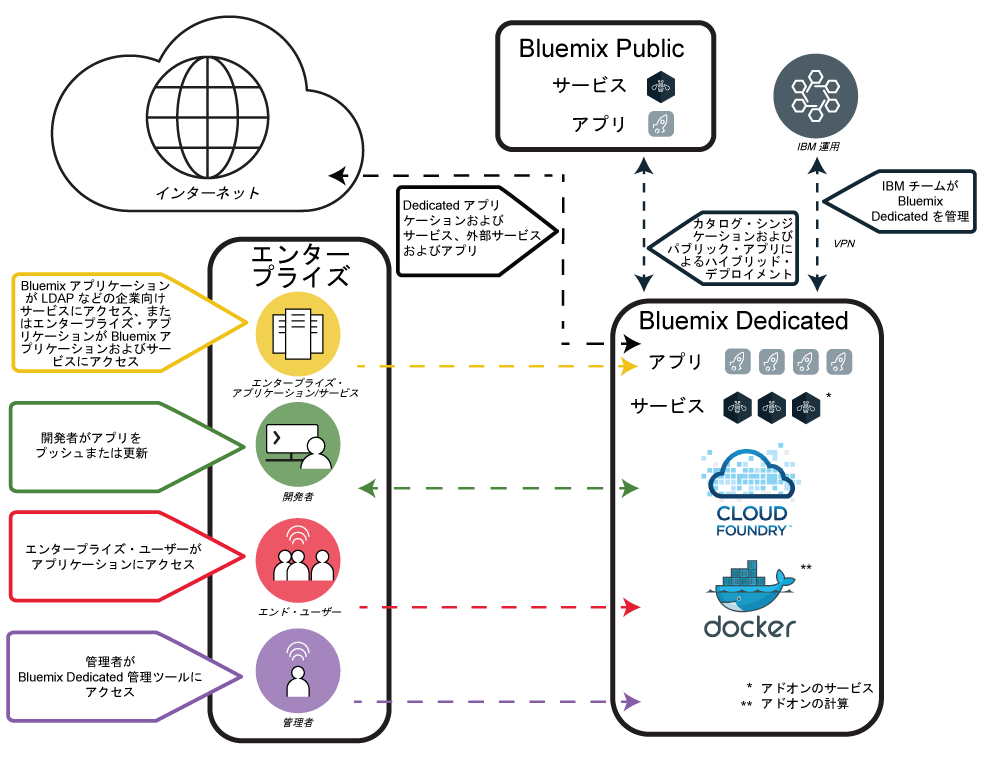

---

copyright:

  years: 2015, 2017

lastupdated: "2017-05-03"

---

{:shortdesc: .shortdesc}

# {{site.data.keyword.Bluemix_dedicated_notm}}
{: #dedicated}

{{site.data.keyword.Bluemix}} は、アプリケーションをビルド、実行、および管理するためのクラウド・ベースのオープン標準プラットフォームです。{{site.data.keyword.Bluemix_dedicated_notm}} を使用すれば、{{site.data.keyword.Bluemix_notm}} Public 環境とお客様のネットワークの両方に安全に接続された専用 SoftLayer 環境で、{{site.data.keyword.Bluemix_notm}} が持つ能力と簡潔さが得られます。
{:shortdesc}

{{site.data.keyword.Bluemix_notm}} のすべての専用デプロイメントには、追加コストなしで次の利点およびフィーチャーが含まれています。VPN、プライベート仮想ローカル・エリア・ネットワーク (VLAN)、ファイアウォール、ご使用の LDAP との接続性、既存のオンプレミス・データベースおよびアプリを利用する機能、 週 7 日 24 時間体制のオンサイト・セキュリティー、専用ハードウェア、および標準サポート。

デフォルトでは、プライベート {{site.data.keyword.Bluemix_notm}} インスタンスへは、企業ネットワークからのみアクセス可能です。例えば、{{site.data.keyword.Bluemix_notm}} 環境にインターネット、モバイル・デバイス、または専用データベースから直接アクセスできることが必要な場合は、追加のネットワーク・セキュリティー・コンポーネントが必要であり、余分なコストがかかります。

{{site.data.keyword.Bluemix_dedicated_notm}} には、付属しているすべての {{site.data.keyword.Bluemix_notm}} ランタイムおよび 64 GB の計算リソース・メモリーが搭載されています。

さらに、組み込まれているか、オプションで購入可能な、一連のサービスおよびコンポーネントがあります。以下の表に、組み込みのものとオプションで購入可能なものを示します。

| **タイプ **        | **名前**            | **説明** |
|-----------------|-------------------|-------------------|
|組み込み | [{{site.data.keyword.Bluemix_notm}} ランタイム](/docs/cfapps/runtimes.html) | ランタイムはアプリを素早く立ち上げて実行するために使用します。マシンとオペレーティング・システムのセットアップと管理は不要です。すべての {{site.data.keyword.Bluemix_notm}} ランタイムが、{{site.data.keyword.Bluemix_dedicated_notm}} インスタンスで使用可能です。|
| 組み込み | [{{site.data.keyword.autoscaling}}](/docs/services/Auto-Scaling/index.html) | ポリシーに基づいて、アプリケーションの計算能力を動的に増減します。このサービスを使用することで、{{site.data.keyword.Bluemix_dedicated_notm}} 環境で使用量が無制限になります。注: Auto-scaling は現在、Cloud Foundry ランタイムでのみ動作します。 |
|オプション | [{{site.data.keyword.apiconnect_short}}](/docs/services/apiconnect/index.html) | {{site.data.keyword.apiconnect_long}} は、{{site.data.keyword.APIM}} と IBM StrongLoop を単一のオファリングに統合し、API とマイクロサービスを作成、実行、管理、および強化する包括的な解決策を提供します。 |
|オプション | [{{site.data.keyword.rules_short}}](/docs/services/rules/rules.html) | {{site.data.keyword.rules_short}} では、頻繁に出現する、反復可能なルール・ベースのビジネス意思決定を自動化し実行する包括的な環境を提供します。これはまた、IT 技術の必要性を低減することで、ビジネス・ユーザーや開発者がより低コストで意思決定を速やかにモデル化してテストすることも可能にします。 |
|オプション | [{{site.data.keyword.cloudant}}](/docs/services/Cloudant/index.html#Cloudant) | {{site.data.keyword.cloudant}} は、常に稼働している完全管理 NoSQL JSON データ層へのアクセスを提供します。このサービスは CouchDB と互換性があり、モバイル・アプリケーション・モデルおよび Web アプリケーション・モデル用の、簡単に使用できる HTTP インターフェースでアクセスできます。 |
|オプション | [{{site.data.keyword.containershort}}](/docs/containers/container_index.html) | {{site.data.keyword.Bluemix_dedicated_notm}} で Docker コンテナーを実行します。コンテナーは、アプリが実行のために必要とするすべてのエレメントを含む仮想ソフトウェア・オブジェクトです。コンテナーには、リソースの分離と割り振りの利点がありますが、例えば仮想マシンなどよりも、移植可能性と効率性が高まっています。ハードウェア要件については、『[{{site.data.keyword.Bluemix_dedicated_notm}} および Bluemix Local における IBM {{site.data.keyword.containershort}}](/docs/containers/container_ov.html#container_dl)』を参照してください。|
| オプション | [{{site.data.keyword.contdelivery_short}}](/docs/services/ContinuousDelivery/index.html) | {{site.data.keyword.contdelivery_short}} Dedicated を使用して、ビルド、単体テスト、デプロイメントなどを自動化します。機能豊富な Web ベース IDE により、コードの編集およびプッシュを行います。開発、デプロイメント、および運用の作業をサポートするツール統合を実現するツールチェーンを作成します。 |
| オプション | [{{site.data.keyword.dashdbshort}}](/docs/services/dashDB/dashDB.html) | IBM {{site.data.keyword.dashdbshort}} for Analytics は、データウェアハウスおよび分析のワークロード用に最適化された完全管理の SQL クラウド・データベース・サービスです。IBM {{site.data.keyword.dashdbshort}} for Transactions は、汎用、Web アプリ、およびトランザクションのワークロード用に最適化された完全管理の SQL クラウド・データベース・サービスです。 |
| オプション | [{{site.data.keyword.datacshort}}](/docs/services/DataCache/index.html#data_cache) | このサービスは、アプリで分散キャッシュ・シナリオをサポートするメモリー内データ・グリッドを提供します。50 GB のメモリー内キャッシュが含まれます。 |
| オプション | [Dedicated GitHub Enterprise](/docs/services/ghededicated/index.html) | {{site.data.keyword.ghe_long}} は、IBM Cloud でホストされて完全に管理されるバージョンの GitHub Enterprise であり、開発者が愛好するソーシャル・エクスペリエンスを提供します。このサービスは、現在は {{site.data.keyword.Bluemix_dedicated_notm}} 環境でのみ使用可能です。 |
| オプション (ベータ版) | [ロギング](/docs/monitoringandlogging/cfapps_ml_logs_dedicated_ov.html#container_ml_logs_dedicated_ov) | {{site.data.keyword.Bluemix_notm}} ユーザー・インターフェースで Cloud Foundry アプリのログおよび Kibana で検索可能なログとダッシュボードを提供します。 |
| オプション | [{{site.data.keyword.messagehub}}](/docs/services/MessageHub/index.html#messagehub) | {{site.data.keyword.messagehub}} は、配布されたスケーラブルで高スループットのメッセージ・バスであり、オンプレミス・テクノロジーとオフプレミス・テクノロジーを統合します。{{site.data.keyword.messagehub}} は、Apache Kafka に基づいています。これは、高速かつスケーラブルで永続的なリアルタイムのメッセージング・エンジンです。 |
|オプション | [{{site.data.keyword.mobilepush}}](/docs/services/mobilepush/index.html) | {{site.data.keyword.mobilepush}} は、通知を iOS および Android デバイスに送信するために使用することができるサービスです。通知は、すべてのアプリケーション・ユーザー、またはタグを使用して特定のユーザーとデバイスのセットを対象にすることができます。デバイス、タグ、およびサブスクリプションを管理することができます。SDK (Software Development Kit) および　Representational State Transfer (REST) アプリケーション・プログラム・インターフェース (API) を使用して、さらにクライアント・アプリケーションを開発することも可能です。|
|オプション | [{{site.data.keyword.SecureGateway}}](/docs/services/SecureGateway/secure_gateway.html) | {{site.data.keyword.SecureGateway}} サービスは、{{site.data.keyword.Bluemix_notm}} アプリケーションをオンプレミスまたはクラウド内のリモート・ロケーションに接続するための安全な方法を提供します。  |
|オプション | [{{site.data.keyword.sescashort}}](/docs/services/SessionCache/index.html#session_cache) | 冗長性を高めるために、{{site.data.keyword.sescashort}} は、キャッシュに保管されたセッションのレプリカを提供します。これにより、ブラウンアウトまたは障害が発生した場合、クライアント・アプリケーションはキャッシュ内のセッションへのアクセスを維持できます。サービスでは、Web アプリケーションとモバイル・アプリケーションのセッション・キャッシュ・シナリオがサポートされます。 |
| オプション | [{{site.data.keyword.iot_short}}](/docs/services/IoT/index.html) | このサービスにより、アプリは、接続されたデバイス、センサー、およびゲートウェイが収集したデータと通信して、それらのデータを取り込むことができます。基本オファリングでは、100,000 個の同時接続されたデバイスまたはアプリケーションと 1.6 TB のデータ交換の容量を備えた専用環境内で {{site.data.keyword.iot_short}} の専用バージョンを実行することができます。 |
| オプション | [{{site.data.keyword.appserver_short}}](/docs/services/ApplicationServeronCloud/index.html) | IBM {{site.data.keyword.appserver_short}} for IBM {{site.data.keyword.Bluemix_notm}} は、{{site.data.keyword.Bluemix_notm}} 上でホストされるクラウド環境で、事前定義済みの {{site.data.keyword.appserver_short}} Liberty、Traditional Network Deployment、または Traditional WebSphere Java EE インスタンスを迅速にセットアップできるようにするサービスです。 |
{: caption="表 1. Dedicated のサービス" caption-side="top"}
{: #table01}

リソースおよびサービスの容量を拡大および拡張するために購入できる、オプションのコンポーネントが用意されています。販売チームに連絡して、これらのコンポーネントを購入できます。営業担当員への連絡について詳しくは、[「お問い合わせ」](https://console.ng.bluemix.net/?direct=classic/#/contactUs/cloudOEPaneId=contactUs)にアクセスしてください。サービスのプランを増やすには、カタログのサービス・タイルからプランを選択します。

| **名前**            | **説明** |
|-------------------|-------------------|
|Dedicated {{site.data.keyword.apiconnect_short}} Professional 500 万回の API 呼び出し | 部門別の API プロジェクトを対象にした、1 月当たり 500 万回の API 呼び出し容量を持つ専用環境内で {{site.data.keyword.apiconnect_short}} の専用バージョンを実行できる環境。 |
|Dedicated {{site.data.keyword.apiconnect_short}} Professional 10 万回の API 呼び出し容量の増加 | 1 月当たり 10 万回の API 呼び出し容量を追加する {{site.data.keyword.apiconnect_short}} Professional 環境の拡張。 |
|Dedicated {{site.data.keyword.apiconnect_short}} Enterprise 2500 万回の API 呼び出し | 企業全体の API プロジェクトを対象にした、1 月当たり 2500 万回の API 呼び出し容量を持つ専用環境内で {{site.data.keyword.apiconnect_short}} の専用バージョンを実行できる環境。 |
|Dedicated {{site.data.keyword.apiconnect_short}} Enterprise 10 万回の API 呼び出し容量の増加 | 1 月当たり 10 万回の API 呼び出し容量を追加する {{site.data.keyword.apiconnect_short}} Enterprise 環境の拡張。 |
|IBM {{site.data.keyword.Bluemix_dedicated_notm}} {{site.data.keyword.rules_short}} 100 万回の「ルールに基づく意思決定」 | 「ルールに基づく意思決定」は、ルール実行サーバーからルールセットを呼び出すことで生じる結果をいいます。請求期間中に実行または処理され、最も近い 100 万単位に切り上げられた「ルールに基づく意思決定」の合計数に対応する十分なライセンスが取得されていなければなりません。本「クラウド・サービス」で課金される「ルールに基づく意思決定」は、意思決定を得るためにルール実行サーバーに対して行われる呼び出しです。「クラウド・サービス」の Dedicated デプロイメントには、関連課金メトリックで測定される合意済みの容量が設定されています。{{site.data.keyword.Bluemix_dedicated_notm}} プラットフォームでの {{site.data.keyword.rules_short}} サービスのデフォルトのスペース割り振りは 16 GB で、権限がある「ルールに基づく意思決定」を実行するために、それぞれ 1 GB の最大 10 個のインスタンスを呼び出すことができます。当該使用制限を超えた場合、その使用をカバーするために追加容量を購入する必要があります。 |
|Dedicated {{site.data.keyword.cloudant}} の 1.6 TB の容量増加 | 設計容量が 1.6 テラバイトの専用環境内での {{site.data.keyword.cloudantfull}} の専用バージョンの実行が組み込まれます。  |
|Dedicated {{site.data.keyword.datacshort}} および {{site.data.keyword.sescashort}} の 50 GB の容量増加 | 最大 50 GB の累積容量まで「{{site.data.keyword.datacshort}}」および「{{site.data.keyword.sescashort}}」のインスタンスをデプロイして実行することができる環境。 |
|{{site.data.keyword.contdelivery_short}} Dedicated インスタンス | 専用環境内で実行されるプライベート・バージョンの {{site.data.keyword.contdelivery_short}}。容量は、{{site.data.keyword.contdelivery_short}} Dedicated 許可ユーザーのライセンスで決まります。 |
|{{site.data.keyword.contdelivery_short}} Dedicated 許可ユーザー | 指定された {{site.data.keyword.contdelivery_short}} Dedicated 環境へのアクセスと使用を許可ユーザーに認可します。{{site.data.keyword.contdelivery_short}} サービス・インスタンスを含む {{site.data.keyword.Bluemix_notm}} 組織に属するすべてのユーザーが許可されなければなりません。 |
|Dedicated {{site.data.keyword.dashdbshort}} Enterprise 64.1 | 64 GB RAM、16 vCPU 搭載の専用サーバー上のサービス・インスタンスごとに 1 つのデータベース。標準圧縮に基づき、最大 1 TB のプリロード・データに対して推奨。  |
|Dedicated {{site.data.keyword.dashdbshort}} Enterprise 256.4 | 256 GB RAM、32 コアを搭載の専用ベアメタル・サーバー上のサービス・インスタンスごとに 1 つのデータベース。標準圧縮に基づき、最大 4 TB のプリロード・データに対して推奨。 |
|Dedicated {{site.data.keyword.dashdbshort}} Enterprise 256.12  | 256 GB RAM、32 コアを搭載の専用ベアメタル・サーバー上のサービス・インスタンスごとに 1 つのデータベース。標準圧縮に基づき、最大 12 TB のプリロード・データに対して推奨。これは、データ量が比較的多く、照会をメモリー内の速度で実行する必要のない環境に適したストレージ高密度プランです。 |
|IBM {{site.data.keyword.Bluemix_dedicated_notm}} {{site.data.keyword.dashdbshort}} Enterprise for Transactions 2.8.500 | データおよびログ用に 8 GB RAM および 500 GB のスペースを備えた、オンライン・トランザクション処理 (OLTP) ワークロードをサポートする専用インスタンス。 |
|IBM {{site.data.keyword.Bluemix_dedicated_notm}} {{site.data.keyword.dashdbshort}} Enterprise for Transactions 12.128.1400 | データおよびログ用に 128 GB RAM および 1.4 TB SSD ストレージを備えた、オンライン・トランザクション処理 (OLTP) ワークロードをサポートする専用インスタンス。 |
|IBM {{site.data.keyword.Bluemix_dedicated_notm}} {{site.data.keyword.dashdbshort}} Enterprise for Transactions High Availability 2.8.500 | データおよびログ用に 8 GB RAM および 500 GB のスペースを備えた、オンライン・トランザクション処理 (OLTP) ワークロードをサポートする専用インスタンスであり、高可用性のための追加スタンバイ・サーバーを含みます。 |
|IBM {{site.data.keyword.Bluemix_dedicated_notm}} {{site.data.keyword.dashdbshort}} Enterprise for Transactions High Availability 12.128.1400 | データおよびログ用に 128 GB RAM および 1.4 TB SSD ストレージを備えた、オンライン・トランザクション処理 (OLTP) ワークロードをサポートする専用インスタンスであり、高可用性のための追加スタンバイ・サーバーを含みます。 |
|{{site.data.keyword.Bluemix_dedicated_notm}} コミュニティー・サービス  | コミュニティー・サービスごとに、最大合計 50 インスタンスまでコミュニティー・サービスをデプロイして実行できる環境。  |
|{{site.data.keyword.Bluemix_dedicated_notm}} {{site.data.keyword.cloudant}} クラスター・インスタンス | このオプションのコンポーネントには、お客様がインフラストラクチャーの提供を担当する 3 ノードのクラスターが含まれ、特定のニーズに基づいて、ストレージおよび計算キャパシティーを決定できます。{{site.data.keyword.cloudant}} は、常に稼働している完全管理 NoSQL JSON データ層へのアクセスを提供します。このサービスは CouchDB と互換性があり、モバイル・アプリケーション・モデルおよび Web アプリケーション・モデル用の、簡単に使用できる HTTP インターフェースでアクセスできます。 |
|IBM {{site.data.keyword.Bluemix_dedicated_notm}} {{site.data.keyword.messagehub}} | 100 区画を限度に、1 区画当たり最大 10 GB のパブリッシュ/サブスクライブ・メッセージングを提供する環境。 |
|IBM Bluemix Dedicated {{site.data.keyword.mobilepushshort}} | 1 秒当たり 300 個の要求を受け入れる能力を持つ {{site.data.keyword.mobilepushshort}} インスタンスをデプロイして実行できる環境。 |
|{{site.data.keyword.iot_short}} Dedicated の増分式の拡張 | 環境の拡張。拡張される環境では、100,000 個の同時接続されたデバイスまたはアプリケーションと 0.5 TB のデータ交換の容量を備えた専用環境内で {{site.data.keyword.iot_short}} の専用バージョンを実行できます。 |
|IBM {{site.data.keyword.appserver_short}} for {{site.data.keyword.Bluemix_notm}} - Dedicated Small| 月当たり 64 vCore、128 GB RAM、および 1 TB HDD を使用できる、{{site.data.keyword.Bluemix_notm}} 上でホストされたクラウド環境内の事前定義された {{site.data.keyword.appserver_short}} Liberty、Traditional Network Deployment、または Traditional WebSphere Java EE インスタンス。 |
|IBM {{site.data.keyword.appserver_short}} for {{site.data.keyword.Bluemix_notm}} - Dedicated Medium| 月当たり 128 vCore、256 GB RAM、および 2 TB HDD を使用できる、{{site.data.keyword.Bluemix_notm}} 上でホストされたクラウド環境内の事前定義された {{site.data.keyword.appserver_short}} Liberty、Traditional Network Deployment、または Traditional WebSphere Java EE インスタンス。 |
|IBM {{site.data.keyword.appserver_short}} for {{site.data.keyword.Bluemix_notm}} - Dedicated Large| 月当たり 256 vCore、512 GB RAM、および 4 TB HDD を使用できる、{{site.data.keyword.Bluemix_notm}} 上でホストされたクラウド環境内の事前定義された {{site.data.keyword.appserver_short}} Liberty、Traditional Network Deployment、または Traditional WebSphere Java EE インスタンス。 |
|IBM {{site.data.keyword.appserver_short}} for {{site.data.keyword.Bluemix_notm}} - Dedicated| 月当たり 1 TB HDD と HDD 拡張を使用できる、{{site.data.keyword.Bluemix_notm}} 上でホストされたクラウド環境内の事前定義された {{site.data.keyword.appserver_short}} Liberty、Traditional Network Deployment、または Traditional WebSphere Java EE インスタンス。 |
{: caption="表 2. 購入用のオプションのサービス・コンポーネント" caption-side="top"}
{: #table02}

| **名前**            | **説明** |
|-------------------|-------------------|
|専用ランタイムの 16 GB の容量増加  | ランタイム容量を 16 GB 分追加する、ランタイム環境の拡張。 |
|Dedicated Direct Link 1 Gbps 容量 | 最大 1 Gbps のデータ転送用に設計され、適切に配置された {{site.data.keyword.BluSoftlayer}} ネットワーク・ポイントに直接接続される、専用ネットワーク・リンク。 |
|Dedicated Direct Link 10 Gbps 容量 | 最大 10 Gbps のデータ転送用に設計され、適切に配置された {{site.data.keyword.BluSoftlayer}} ネットワーク・ポイントに直接接続される、専用ネットワーク・リンク。 |
|IBM Bluemix Dedicated ハードウェア・ファイアウォール - 高可用性 | 専用環境内の同じ VLAN 上の単一、複数、またはすべてのサーバーを保護するように構成された、冗長 1 Gbps ハードウェア・ファイアウォール。 |
{: caption="表 3. 購入用のオプションのプラットフォーム・アドオン・コンポーネント" caption-side="top"}
{: #table03}

**注**: {{site.data.keyword.Bluemix_dedicated_notm}} のコンポーネントは、構成された特定の容量 (ギガバイト数や、1 秒当たりのトランザクション数など) で示される場合があります。どんな構成でも、クラウド・サービスで実際に使用される容量は、さまざまな要因によって異なるため、実際に使用される容量は、構成された容量より増減する可能性があります。

### シンジケートされたカタログ
{: #catalogdedicated}

{{site.data.keyword.Bluemix_dedicated_notm}} には、パブリック・デプロイメント、専用デプロイメント、およびローカル・デプロイメントすべてにわたって承認済みサービスを集めたプライベート・カタログが含まれています。{{site.data.keyword.Bluemix_notm}} カタログを通して、お客様独自のサービスを公開したり、それらのサービスへのアクセスを管理したりすることもできます。データ・プライバシーとセキュリティー基準に基づいて、ビジネスの要件に合致したパブリック・サービスを決定できます。

専用環境用にサービスのプライベート・インスタンスを保有している場合、カタログ内でサービス名と共に「Dedicated」というタグが示されます。同様に、カスタム・サービスである場合 (つまり、サービス・ブローカーを使用して作成した場合)、サービス名と共に「カスタム」と表示されます。「専用」というタグも「カスタム」というタグも付いていない、リスト中の他のサービスはすべて、{{site.data.keyword.Bluemix_notm}} Public からシンジケーションを使用して利用可能です。シンジケートされたサービスは、パブリック・サービスとプライベート・サービスからなるハイブリッド・アプリケーションを作成する機能を提供します。

|サービス	|米国南部地域で利用可能	|ヨーロッパ英国地域で利用可能 |オーストラリア、シドニー地域で利用可能|
|:----------|:------------------------------|:------------------|:------------------|
|{{site.data.keyword.alchemyapishort}} 		|はい	   	|はい  		|はい|
|{{site.data.keyword.alertnotificationshort}}	|はい		|はい		|はい	|
|{{site.data.keyword.apiconnect_short}}         |はい            |はい            |はい  |
|{{site.data.keyword.appseccloudshort}}		|はい		|はい		|はい |
|{{site.data.keyword.apiconnect_short}} 	|はい   	 	|はい  	 	|はい   |
|Automated Accessibility Checker |はい       |はい    |はい   |
|{{site.data.keyword.rules_short}}		|はい		|はい		|はい |
|{{site.data.keyword.cloudant}}			|はい		|はい		|はい |
|{{site.data.keyword.iotmapinsights_short}}    |はい  |はい  |はい  |
|{{site.data.keyword.conversationshort}}  |はい  |はい  |はい  |
|{{site.data.keyword.dashdbshort}}		|はい		|はい		|はい |
|{{site.data.keyword.dataworks_short}}		|はい		|はい		|いいえ|
|{{site.data.keyword.DB2OnCloud_short}}		|はい		|はい		|はい |
|Digital Content Checker |はい  |はい  |はい  |
|{{site.data.keyword.documentconversionshort}}	|はい		|はい		|はい|
|{{site.data.keyword.iotdriverinsights_short}}  |はい |はい  |はい  |
|{{site.data.keyword.geospatialshort_Geospatial}}	|はい	|はい		|はい |
|{{site.data.keyword.GlobalizationPipeline_short}}	|はい		| はい		| はい |
|{{site.data.keyword.identitymixershort}}		|はい		|はい		|はい|
|{{site.data.keyword.iot4auto_short}} |はい   |はい  |はい  |
|{{site.data.keyword.iotelectronics}}  |はい  |はい  |いいえ |
|{{site.data.keyword.iotinsurance_short}} |いいえ   |いいえ   |はい  |
|{{site.data.keyword.twittershort}}		|はい		|はい		|はい|
|{{site.data.keyword.languagetranslationshort}}	|はい		|はい		|はい |
|{{site.data.keyword.languagetranslatorshort}} |はい  |はい  |はい  |
|{{site.data.keyword.dwl_short}}  |はい  |はい  |いいえ  |
|{{site.data.keyword.eventhubshort}}		|はい		|いいえ		|いいえ|
|{{site.data.keyword.messagehub}}		|はい		|はい		|いいえ|
|{{site.data.keyword.manda}}			|はい		|はい		|はい |
|{{site.data.keyword.amashort}}			|はい		|はい		|はい |
|{{site.data.keyword.mqa}}			|はい		|はい		|はい |
|{{site.data.keyword.mql}}			|いいえ		|いいえ		|はい |
|{{site.data.keyword.nlclassifierlshort}} 	|はい 		|はい 		|はい|
|{{site.data.keyword.personalityinsightsshort}}	|はい		|はい		|はい|
|{{site.data.keyword.pm_short}}			|はい		|はい		|いいえ |
|{{site.data.keyword.mobilepush}}		|はい		|はい		|はい |
|{{site.data.keyword.retrieveandrankshort}}	|はい 		|はい 		|はい|
|{{site.data.keyword.runbook_short}}		|はい		|はい		|はい|
|{{site.data.keyword.SecureGateway}}		|はい		|はい		|はい |
|{{site.data.keyword.ssofull}}			|はい		|いいえ		|いいえ|
|{{site.data.keyword.speechtotextshort}}	|はい 		|はい	 	|はい|
|{{site.data.keyword.streaminganalyticsshort}}	|はい		|はい		|はい |
|{{site.data.keyword.texttospeechshort}} 	|はい 		|はい	 	|はい|
|{{site.data.keyword.toneanalyzershort}} 	|はい 		|はい 		|はい|
|{{site.data.keyword.tradeoffanalyticsshort}}	|はい		|はい		|はい|
|{{site.data.keyword.visualrecognitionshort}}	|はい 		|はい	 	|はい|
|{{site.data.keyword.iot_short}}		|はい		|はい		|いいえ|
|{{site.data.keyword.weather_short}}		|はい		|はい		|はい|
|{{site.data.keyword.workloadscheduler}}	|はい		|はい		|はい |
{: caption="表 4. Bluemix パブリックからのシンジケーションに使用可能な、地域別のサービス" caption-side="top"}
{: #table04}

**注**: サード・パーティー・サービスは表に含まれていません。サード・パーティー・サービス・オプションについては、専用カタログを確認してください。

## {{site.data.keyword.Bluemix_dedicated_notm}} アーキテクチャー
{: #dedicatedarch}

{{site.data.keyword.Bluemix_dedicated_notm}} は、世界中のどの [{{site.data.keyword.IBM_notm}} SoftLayer データ・センター ](http://www.softlayer.com/data-centers){: new_window} にもデプロイできます。{{site.data.keyword.IBM_notm}} SoftLayer は、最高レベルの性能を示すクラウド・インフラストラクチャーを提供します。各データ・センターは 1 週間に 7 日、1 日 24 時間のセキュリティー、および厳格な管理が施されています。

{{site.data.keyword.Bluemix_dedicated_notm}} の各デプロイメントは、固有プライベート・ネットワーク内の {{site.data.keyword.IBM_notm}} SoftLayer 専用ハードウェア上の単一エンタープライズ専用です。インフラストラクチャー、運用、および物理的セキュリティーの観点から、{{site.data.keyword.Bluemix_dedicated_notm}} 環境のセキュリティー標準はパブリック {{site.data.keyword.Bluemix_notm}} のセキュリティー標準と同じです。ただし、専用 {{site.data.keyword.Bluemix_notm}} に対する開発者のアクセスは LDAP ポリシーによって制御されます。{{site.data.keyword.Bluemix_notm}} チームは、ご使用の環境の設定時にこのポリシーを構成することができます。専用環境内で、ユーザーの役割および許可を管理できます。詳しくは、『[ユーザーおよび許可の管理](/docs/admin/index.html#oc_useradmin)』を参照してください。以下の図は、デフォルト {{site.data.keyword.Bluemix_dedicated_notm}} デプロイメントの論理アーキテクチャーを示したものです。

図 1. {{site.data.keyword.Bluemix_dedicated_notm}} デフォルト・アーキテクチャーの詳細図
{: #figure01}

上記のアーキテクチャー図に示された重要なアーキテクチャー・コンポーネントには、以下があります。

<dl>
<dt>{{site.data.keyword.IBM_notm}} Cloud</dt>
<dd>
{{site.data.keyword.IBM_notm}} Cloud 環境は全体として以下の重要なネットワーキング環境を含んでいます。
<ul>
<li>{{site.data.keyword.Bluemix_dedicated_notm}}</li>
<li>{{site.data.keyword.Bluemix_notm}} Public</li>
<li>{{site.data.keyword.IBM_notm}} 運用</li>
</ul>
</dd>
<dt>{{site.data.keyword.Bluemix_dedicated_notm}}</dt>
<dd>
これには最小で Cloud Foundry コンポーネントといくつかの専用アプリケーション・サービスが含まれます。{{site.data.keyword.Bluemix_notm}} では、Cloud Foundry と {{site.data.keyword.containerlong}} ベースの計算環境が提供されます。エンタープライズには、これらの計算環境の一方または両方を構成できます。 
エンタープライズで専用アプリケーション・サービスを追加する場合もあります。 
追加できるサービスおよび計算機能については、[表 2](#table02) を参照してください。
</dd>
<dt>{{site.data.keyword.Bluemix_notm}} Public</dt>
<dd>
{{site.data.keyword.Bluemix_dedicated_notm}} には、{{site.data.keyword.Bluemix_notm}} Public 領域へのアウトバウンド接続が含まれる場合があります。これにより、専用カタログへのパブリック・サービスのシンジケーションが行われます。{{site.data.keyword.Bluemix_notm}} Public サービスのシンジケーションにより、開発者が簡単に、エンタープライズの {{site.data.keyword.Bluemix_dedicated_notm}} でホストされるアプリケーションを構築し、また、{{site.data.keyword.Bluemix_notm}} Public で稼働しているサービスにアクセスすることができます。{{site.data.keyword.Bluemix_notm}} Public からシンジケートできるサービスのリストは、[『シンジケートされたカタログ』のセクションの表 4](#catalogdedicated) に示されています。
</dd>
<dt>{{site.data.keyword.IBM_notm}} 運用</dt>
<dd>
専用プラットフォームと専用サービスの管理、モニター、保守は {{site.data.keyword.IBM_notm}} が行うため、お客様は革新的なアプリケーションの構築に集中することができます。{{site.data.keyword.IBM_notm}} 運用サポート・サービス (OSS) チームは、{{site.data.keyword.IBM_notm}} の運用ネットワークから VPN トンネル接続を使用して、運用を実行します。</dd>
<dt>エンタープライズ</dt>
<dd>
エンタープライズ・ネットワーク環境には、{{site.data.keyword.Bluemix_dedicated_notm}} へのセキュアでプライベートな双方向のネットワーク・リンクがある場合があります。これにより、{{site.data.keyword.Bluemix_dedicated_notm}} でホストされたアプリケーションが、データ・ソースやエンタープライズ・サービスなど、エンタープライズ内のサービスおよびリソースにアクセスすることができます。また、このネットワーク・リンクにより、{{site.data.keyword.Bluemix_dedicated_notm}} がエンタープライズの開発者および管理者の認証に LDAP を使用することも可能になります。 
 
保護されたプライベート・ネットワーク・リンクを作成するためのいくつかのオプションがあります。企業に最適のネットワーキング・オプションについて、IBM 技術者と相談してください。 
 
{{site.data.keyword.Bluemix_dedicated_notm}} からエンタープライズ・ネットワークへのデフォルト接続では、仮想プライベート・ネットワーク (VPN) を使用します。{{site.data.keyword.Bluemix_dedicated_notm}} では、高可用性のために専用 1 Gbps Vyatta の VPN 終端が構成されています。
 
[図 1](#figure01) で示された {{site.data.keyword.Bluemix_dedicated_notm}} のデフォルト・アーキテクチャーでは、インターネットから直接のインバウンド・ネットワーク・トラフィックはありません。{{site.data.keyword.Bluemix_dedicated_notm}} でホストされているアプリケーションへのインターネット・アクセスを、エンタープライズが許可したい場合は、エンタープライズ・ネットワークを通してそのアクセスが構成される必要があります。</dd>
</dl>

## {{site.data.keyword.Bluemix_dedicated_notm}} のセットアップ
{: #setupdedicated}

{{site.data.keyword.Bluemix_dedicated_notm}} は、{{site.data.keyword.Bluemix_notm}} Public オファリングの専用バージョンを提供するように設計されています。{{site.data.keyword.Bluemix_notm}} サービスおよびランタイムを使用して、IBM でホストされている {{site.data.keyword.BluSoftlayer}} アカウントでコンピューティング・ニーズをサポートすることができます。

IBM は、お客様がパスワードで保護されたログインを使用して {{site.data.keyword.Bluemix_dedicated_notm}} にアクセスできるようにします。サービス、ランタイム、および関連リソースにアクセスしたり、{{site.data.keyword.Bluemix_notm}} アプリをデプロイおよび削除したりすることができます。IBM は複数の {{site.data.keyword.BluSoftlayer}} ロケーションを利用して {{site.data.keyword.Bluemix_dedicated_notm}} を提供しているため、お客様に近いロケーションにある専用バージョンをご利用いただけます。

{{site.data.keyword.Bluemix_notm}} の専用バージョンをセットアップするには、以下のようにします。

<ol>
<li>IBM 指定のアカウント担当者に連絡するか、<a href="https://console.ng.bluemix.net/?direct=classic/#/contactUs/cloudOEPaneId=contactUs" target="_blank">{{site.data.keyword.Bluemix_notm}} に連絡 </a> して、開始します。</li>
<li>{{site.data.keyword.Bluemix_dedicated_notm}} インスタンスの料金について IBM と連携して決定します。毎月繰り返し発生する料金は、使用する専用サービスと、すべての {{site.data.keyword.Bluemix_notm}} のパブリック・サービスのサブスクリプションに基づきます。さらに、当該サブスクリプション契約を超えて使用したサービスに対する請求書を受け取ります。</li>
<li>{{site.data.keyword.Bluemix_dedicated_notm}} インスタンスをセットアップする各フェーズの期限を特定します。各フェーズおよび関連タスクについては、『<a href="/docs/dedicated/index.html#rolesresponsibilities">{{site.data.keyword.Bluemix_dedicated_notm}} の役割および責任</a>』を参照してください。</li>
<li>専用インスタンス用の <a href="http://www.softlayer.com/data-centers" target="_blank">{{site.data.keyword.BluSoftlayer}} データ・センターのロケーション </a> を選択します。その後、専用プラットフォームおよびアカウントが作成されます。アカウントについて、専用インスタンスを稼働するために必要な役割の組織内のユーザーを特定します。割り当てる役割について詳しくは、『<a href="/docs/dedicated/index.html#rolesresponsibilities">{{site.data.keyword.Bluemix_dedicated_notm}} の役割および責任</a>』を参照してください。
</li>
<li>お客様の企業ネットワークと {{site.data.keyword.Bluemix_dedicated_notm}} インスタンス間のネットワーク接続を定義して確立します。このオプション用に、関連コストを伴う、ファイアウォール機能および侵入防御機能を含む必須ネットワーク・セキュリティー装置があります。
	<ol type="a">
	<li>IBM が、専用インスタンス用のモニターおよびセキュリティー・インフラストラクチャーをインストールします。</li>
	<li>IBM が、お客様によって選択された単一テナント専用サービスをインストールします。</li>
	<li>お客様が、IP アドレスやファイアウォールなどのネットワーク構成とエンドポイント、および {{site.data.keyword.Bluemix_notm}} と統合するための LDAP へのアクセス権限を用意します。</li>
	</ol>
</li>
<li>環境に合わせて管理チームの役割を特定し割り当てます。
	<ol type="a">
	<li>IBM が、お客様が用意した構成に基づいて、ネットワーク・アクセスおよび LDAP を構成します。お客様が指定した連絡先に、管理アクセス権限が付与されます。サポートおよび請求用の連絡先を指定する必要もあります。</li>
	<li>IBM が、専用サービスを示すために、専用環境にシンジケートされたカタログをセットアップします。シンジケートされたカタログには、{{site.data.keyword.Bluemix_notm}} Public からシンジケートされた、ユーザーが使用できる追加サービスが含まれています。データ・プライバシーとセキュリティー基準に基づいて、ビジネスの要件に合致したパブリック・サービスを決定できます。</li>
	<li>お客様が、ネットワークとファイアウォールの構成、および LDAP エンドポイントとアクセスを確認します。</li>
	</ol>
</li>
</ol>

ご使用の環境に合わせた初期デプロイメントおよび構成は、以下にリストするプロセスのようになると考えられます。各タスクを誰が担当するかについて詳しくは、『[役割および責任](index.html#rolesresponsibilities)』を参照してください。

<ol>
<li>専用インスタンスをホストするためにどのデータ・センターを使用するかを選択します。データ・センターのオプションについて詳しくは、<a href="http://www.softlayer.com/data-centers" target="_blank">{{site.data.keyword.BluSoftlayer}} データ・センターのロケーション </a> を参照してください。</li>
<li>ユーザーは、デプロイメント用のドメイン・ネームと、使用する ID を指定します。{{site.data.keyword.Bluemix_notm}} インスタンスのセットアップ時に 3 つのドメインを取得します。<code>*mycompany*.*region*.bluemix.net</code> および <code>*mycompany*.*region*.mybluemix.net</code> の接頭部を選択します。そして、3 番目のドメインのフルネームはユーザーが選択します。 

カスタム・ドメインは必要な数だけ選択できます。ただし、それらのカスタム・ドメインの証明書はユーザーの責任になります。カスタム・ドメインの作成について詳しくは、『<a href="/docs/manageapps/updapps.html#domain">カスタム・ドメインの作成と使用</a>』を参照してください。
</li>
<li>{{site.data.keyword.Bluemix_notm}} Public 内でユーザーの企業を表すために使用されるパブリック・アカウントの所有者を特定します。IBM はこのアカウントを使用して、シンジケートされたサービス使用量を追跡します。</li>
<li>データ・センターへのセキュア接続のタイプを選択します。{{site.data.keyword.Bluemix_notm}} VPN、{{site.data.keyword.Bluemix_notm}} Direct Link、および AT&T Net Bond の中から選択できます。</li>
<li>パブリック・インターネットからユーザーの専用環境へのアクセスがあるかどうかを決定します。</li>
<li>使用される認証のタイプを選択します。IBM ID または Active Directory から選択できます。IBM ID の使用および登録について詳しくは、<a href="https://www.ibm.com/account/profile/us?page=regfaqhelp#4">「ヘルプおよびよくある質問」</a>ページを参照してください。</li>
<li>環境に合わせて管理チームの役割を特定し割り当てます。割り当てが必要な役割については、『<a href="/docs/dedicated/index.html#rolesresponsibilities">{{site.data.keyword.Bluemix_dedicated_notm}} の役割および責任</a>』を参照してください。</li>
<li>IBM は、Elastic Runtime、コンソール、管理フィーチャー、およびモニタリングを含むコア・プラットフォームをデプロイします。</li>
<li>IBM は、環境へのユーザーの管理アクセスを構成します。</li>
<li>専用インスタンスの使用を開始できます。このインスタンスは、アラートに対応できるように IBM 運用チームによってモニターされています。</li>
</ol>

{{site.data.keyword.Bluemix_notm}} インスタンスがセットアップされた後は、「管理」ページを使用して {{site.data.keyword.Bluemix_notm}} インスタンスをモニターおよび管理することができます。詳しくは、[
『{{site.data.keyword.Bluemix_notm}} Local および Dedicated の管理』](../admin/index.html#mng)を参照してください。アップグレードおよび保守については、『[専用インスタンスの保守](index.html#maintaindedicated)』を参照してください。

##役割および責任
{: #rolesresponsibilities}

{{site.data.keyword.Bluemix_dedicated_notm}} アカウントをセットアップした場合、インスタンスを稼働するために必要な役割の組織内のユーザーを特定します。

###役割

以下のリストでは、割り当てる顧客の役割および責任を示します。

<dl>
<dt>**調達フォーカル**</dt>
<dd>IBM 担当員と連携して、{{site.data.keyword.Bluemix_dedicated_notm}} 環境を設定します。これには、プロジェクトのあらゆる側面についての作業に適した個人を組織内で特定することが含まれます。この役割に割り当てられたユーザーは、プロジェクト管理の役割を担当し、パターン選択、商業協定、およびお客様のリソースへのアクセスの取り決めを監視します。調達フォーカルは、専用インスタンスをセットアップし、デプロイメントのプロセスを追跡する際の総合的連絡先になります。</dd>
<dt>**コンプライアンス責任者**</dt>
<dd>IBM 担当員と連携して、お客様のセキュリティー要件に合ったトポロジーとデプロイメントのオプションを選択します。この役割に割り当てられたユーザーは IBM コンプライアンス・コンサルタントと連携して、コンプライアンスの目標を達成するデプロイメント・パターンを決めます。</dd>
<dt>**ネットワーク専門家**</dt>
<dd>IBM 担当員と連携して、{{site.data.keyword.Bluemix_notm}} デプロイメントのネットワーク計画を決定します。この役割に割り当てられたユーザーは、IBM によって要求された必要なネットワーキング仕様をレビューし、実装計画について IBM と連携します。インストールと検証の段階が終わると、この役割に割り当てられたユーザーは、ネットワーク構成が企業標準に準拠していることを承認します。</dd>
<dt>**DevOps フォーカル**</dt>
<dd>IBM 担当員と連携して、{{site.data.keyword.Bluemix_notm}} のプラットフォーム、サービス、およびランタイムに必要な保守更新を計画して適用します。この役割を割り当てられた個人は、IBM 担当員と連携して、{{site.data.keyword.Bluemix_dedicated_notm}} インスタンスの構成も行います。</dd>
<dt>運用フォーカル</dt>
<dd>環境が稼働したら、必要に応じて IBM サポート・チームと連携します。これは、管理コンソールへのスーパーユーザー権限を持ち、Bluemix 環境の保守更新を承認およびスケジュールすることができ、重大インシデントの発生時に常に対応可能なユーザーです。この役割に割り当てられる担当者には、Bluemix 環境の技術的知識が必要です。また、ネットワークやセキュリティーなど、影響を受ける可能性がある領域の専門的スキルを持つ社内の担当者に連絡可能な立場でなければなりません。</dd>
</dl>

お客様の担当者は IBM の専門家と連携して、必要なサポートが常に得られるようにします。プレミアム・サポー
ト層にアップグレードし、アカウントの専用 Client
Success Manager (CSM) と連携できます。異なるサポート層について詳しく
は、[『サポートへのお問い合わせ』](../support/index.html#contacting-support)を参照してください。CSM
は次のタイプのタスクを完了します。

<ul>
<li>{{site.data.keyword.Bluemix_dedicated_notm}} 環境の迅速な採用を可能にします。</li>
<li>自己完結性を高めるための有効な教育およびイネーブルメント資料を配信します。</li>
<li>お客様と、お客様が使用する {{site.data.keyword.Bluemix_notm}} 開発、サポート、およびサービスとの間の長期的な関係を深めます。</li>
</ul>

{{site.data.keyword.Bluemix_notm}} インスタンスについてお客様と連携する {{site.data.keyword.Bluemix_notm}} サポートおよび運用チームは、以下の理由でのみ、お客様のローカル環境にアクセスすることがあります。

<ul>
<li>アラートに対応し、運用上の保守を実行するため</li>
<li>サポート・チケットで報告された問題の再現を試みるため</li>
</ul>

### 責任

環境のセットアップから継続的な保守まで、多様なタスクの実行が必要です。以下の表は、方向付け、進行、完了の各フェーズについて、実行する必要のあるタスクとその責任者の概要を示します。

方向付けフェーズを使用して、{{site.data.keyword.Bluemix_dedicated_notm}} 環境を設定します。このフェーズの主な目標には、以下のものがあります。

- 金融契約を審査し、配信までのマイルストーン日付を設定します。
- {{site.data.keyword.Bluemix_notm}} プラットフォームを作成し、ランタイムおよびサービスにアクセスできるようにします。
- 企業ネットワークと {{site.data.keyword.Bluemix_notm}} 操作との間のネットワーク接続を定義して確立します。
- 管理チームの役割を特定して割り当てます。

| **タスク** | **タスクの詳細** | **責任を持つ側** |
|----------|------------------|-----------------------|
|コンプライアンス規格の設定 | 環境に必要な政府、業界、および専有企業の標準を特定します。 | お客様 |
|セキュリティーおよびコンプライアンス統合計画の作成 | セキュリティー・コンプライアンスの実現に必要なコスト、スケジュール、およびリソースなどのセキュリティーおよび統合計画を作成します。 | IBM |
|コンプライアンス計画の承認 | コンプライアンス計画を承認します。 | お客様 |
|環境のサイジングの作成 |  	高可用性と災害復旧の目標、およびプラットフォームで作成されるアプリをサポートするために必要な初期 DEA とサービス・プロビジョニングを考慮した事前定義の選択に基づいて、環境のサイジングを作成します。お客様と IBM は連携して、必要なデータベース、顧客のシンジケートされたカタログで提供するサービスなどを定義します。 | IBM とお客様の共同の責任 |
|アーキテクチャーの選択 | 高可用性および災害復旧の要件を考慮に入れた事前定義の選択に基づいて、アーキテクチャーを選択します。 | IBM |
|災害復旧目標の定義 | 環境の災害復旧の要件を定義します。 | お客様 |
|災害復旧計画の作成 | 災害復旧計画を相談して定義します。IBM は災害復旧モデルを作成してお客様と相談し、お客様はフィードバックを提供して計画を承認します。 | IBM とお客様の共同の責任 |
|バックアップおよびリカバリー計画の作成 | 頻度およびバックアップのオン/オフ・サイト分配の要件を定義したバックアップとリカバリーの計画を作成します。IBM はファブリック・コンポーネント、IBM サービス、ユーザー役割などのサービス・メタデータなどをバックアップします。お客様は、お客様が責任を持つアプリケーション固有のデータをバックアップします。 | IBM とお客様の共同の責任 |
|イベント検出および問題判別用ツールの特定 | {{site.data.keyword.Bluemix_notm}} プラットフォーム・レベルでイベント検出および問題判別に使用する IBM およびサード・パーティーのツールを特定します。 | IBM |
|エスカレーション計画の定義 | モニター・コンポーネントで検出されたイベントをトリアージおよび解決するためのエスカレーション計画を定義します。 | IBM |
|インフラストラクチャー、プラットフォーム、およびサポートに関する合意の承認 | 環境の金銭的条件など、サブスクリプションに関する合意を承認します。サポート・サブスクリプションを承認します。 | お客様 |
|環境の調達 | 計算リソース、ネットワーク、およびストレージを調達します。これには、{{site.data.keyword.Bluemix_notm}} をホストするためのコアおよびサービス VLAN、Data Power をホストするためのベアメタル・サービス、および {{site.data.keyword.Bluemix_notm}} Firewall が含まれます。VPN トンネルを可能にするインフラストラクチャーを用意します。 | IBM |
|ファブリック、アプリケーション、およびモニターと管理の各コンポーネントのインストール | ファブリック・コンポーネント (BOSH Director、クラウド・コントローラー、正常性マネージャー、メッセージング、ルーター、DEA、サービス・プロバイダーなど) およびエスカレーションや問題検出の計画で定義されているモニター・コンポーネントをインストール、構成、および検証します。 | IBM |
|セキュリティー・コンポーネントのインストールと構成 | モニタリングと報告の計画と結合しているセキュリティー・コンポーネント (IBM QRadar、資格情報ボールト、侵入防御システム、IBM BigFix、IBM Security Privileged Identity Management など) をインストールして構成します。 | IBM |
|カスタム・コンポーネントのインストールと構成 |  	{{site.data.keyword.Bluemix_notm}} 製品およびサービスの有効範囲外にあるカスタム・コンポーネントをインストールして構成します。 | お客様 |
|初期ネットワーク構成の確立 | 初期ネットワーク構成 (ファイアウォール、DataPower、Fortigate、および DNS を含む) を確立します。 | IBM |
|{{site.data.keyword.Bluemix_notm}} パイプラインの接続 | {{site.data.keyword.Bluemix_notm}} の継続的統合および継続的配信のパイプラインを IBM リポジトリーと接続します。 | IBM |
|外部ソリューション・コンポーネントのカスタマイズ | 災害復旧シナリオ用にロード・バランサーをカスタマイズします。 | お客様 |
|VPN ソリューションのインストール | 双方向の VPN ソリューションをインストールします。 | IBM |
|ログイン・サーバーの構成 | 企業 LDAP で使用するログイン・サーバーを構成します。 | IBM |
|セキュリティー、コンプライアンス、および監査管理の状況の追跡  | すべてのツールおよびプロセスが配備されて、特定したコンプライアンスが実現する時点まで状況を追跡します。 | お客様 |
|物理的インフラストラクチャーのレビュー | データ・センターを保護するセキュリティー制御の脅威および審査のためのソリューション・コンポーネントをホストする物理的プレミスをレビューします。 | お客様 |
|モニタリング・ソフトウェアの検査 | エスカレーションおよび問題判別の計画で定義したモニターおよび管理コンポーネントを検査します。 | お客様 |
|OS の検査 | オペレーティング・システム・イメージがコンプライアンス規格に合っていることを確認するための検査を行います。IBM が OS イメージにアクセスできるようにします。 | IBM とお客様の共同の責任 |
{: caption="表 5. 方向付けフェーズのタスク" caption-side="top"}

次に、進行フェーズについて説明します。進行フェーズは、お客様と IBM Cloud との進行中の協力関係を記述します。このフェーズの主な目標には、以下のものがあります。

- キャパシティーを検討し、必要な調整を行います。
- 保守およびプラットフォームの改善を検討します。
- 問題解決および根本原因分析のアクティビティーを調整します。

| **タスク** | **タスクの詳細** | **責任を持つ側** |
|----------|------------------|-----------------------|
|週次容量レポートのレビュー | 週次容量レポートをレビューし、必要に応じて修正アクションを実行します。 | お客様 |
|前月比予測の作成 | 容量および使用量の情報を収集し、前月比予測を作成します。 | IBM とお客様の共同の責任 |
|キャパシティー予測のレビュー | アプリの容量および予想新規デプロイメントに影響する可能性がある外部イベントに関係する容量予測をレビューします。IBM と連携して、予測をレビューし、それに従って計画します。 | IBM とお客様の共同の責任 |
|予測のレビュー | キャパシティー予測をレビューします。これはキャパシティーに影響する可能性のある外部イベントに関連します。 | お客様 |
|容量の調整 |  ニーズの変化に合わせて容量を追加または削除します。 | IBM |
|近く予定されている更新および保守の公開 | IBM コンポーネントの必要な保守に関する文書を作成します。 | IBM |
|保守の実行 | IBM と連携して、21 日の期間内の必要な保守をスケジュールします。お客様は 21 日の期間内のお客様にとって都合が悪い日付を指定することが可能で、IBM はそれに従って保守のスケジュールを組みます。 | IBM とお客様の共同の責任 |
|プロビジョニング失敗の解決 | カタログにデプロイされた顧客作成サービスでプロビジョニング失敗が発生した場合に、その失敗を修正します。 | IBM |
|ネットワークおよび IP スキャンの実行 | 日次および月次のネットワーク・スキャンおよび IP スキャンを実行します。 | IBM とお客様の共同の責任 |
|監査ログへのアクセスの提供 | すべてのセキュリティー監査ログおよび管理監査ログへのアクセスを提供します。   | IBM とお客様の共同の責任 |
|テストの実施 | 定期的な KCO (Key Controls over Operations) テストおよびサード・パーティー侵入テストを実施します。 | IBM とお客様の共同の責任 |
|状況レポート作成、監査調整、およびコンプライアンス会議  | 状況レポート作成、外部監査調整、およびコンプライアンス・レビュー状況会議での説明を実施します。 | IBM |
|雇用とビジネス・ニーズの確認 | 四半期ごとに、顧客環境にアクセスできる IBM 担当者について、雇用の確認およびビジネス・ニーズが継続していることの確認を行います。 | IBM |
|セキュリティー脆弱性の解決 | プラットフォームで報告されたセキュリティー脆弱性を解決します。 | IBM |
{: caption="表 6. 進行フェーズのタスク" caption-side="top"}

最終の完了ステージは、お客様と IBM {{site.data.keyword.Bluemix_notm}} 間の関係の終了を表します。このフェーズの主なタスクには、以下のものがあります。

* 金銭的合意の終了
* すべてのネットワーク接続の削除
* インフラストラクチャーのリサイクル

| **タスク** | **タスクの詳細** | **責任を持つ側** |
|----------|------------------|-----------------------|
|金銭的合意の終了 | 金銭的合意の契約の終了について話し合い、終了に合意します。 | IBM とお客様の共同の責任 |
|環境の廃止 | 環境へのアクセスおよび環境の資格情報をシャットダウンします。 | IBM とお客様の共同の責任 |
|お客様とのネットワーク接続の削除 | IBM とお客様環境との間のネットワーク接続を削除します。 | IBM とお客様の共同の責任 |
|インフラストラクチャーのリサイクル | お客様の環境は {{site.data.keyword.BluSoftlayer}} 定義のプロセスに基づいてリサイクルされます。 | IBM |
{: caption="表 7. 完了フェーズのタスク" caption-side="top"}

##専用インスタンスの保守
{: #maintaindedicated}

IBM は、{{site.data.keyword.Bluemix_notm}} ランタ
イムおよびサービスに適切と IBM が見なした更新およびフィックスを保守およびインストールします。保守期間の間はサービスが利用できない場合があります。
さらに、IBM はお客様と連携して、
{{site.data.keyword.Bluemix_notm}} プラットフォームの保守更新をスケジュールに入れます。

{{site.data.keyword.Bluemix_dedicated_notm}} では、以下のタイプの保守が必要です。
<dl>
<dt>**サービスの標準保守**</dt>
<dd>サービスは、事前定義された標準保守期間を利用します。そのため、サービスが利用できなくなる場合があります。IBM はサービ
スの保守の実施に当たり、お客様の承認を必要としませんが、お客様のサービスへの影響
が最小限になるよう努めます。 
 
IBM は、「状況」ページで、各保守期間で計画されている
変更を示すブロードキャスト・メッセージを通知します。 
 
**重要**: 保守期間中には、一部のサービスが使用不可になる可能性があります。</dd>

<dt>**{{site.data.keyword.Bluemix_notm}} プラ
ットフォームの標準保守**</dt>
<dd>保守の更新は、21 日の期間内でお客様と IBM の間の調整に基づいて適用されます。お客様は IBM に、事前承
認された保守期間およびお客様にとって都合が悪い特定の日時を提供し、
IBM は、お客様が選択した日付の期間またはその近辺で更新のスケジュールを組みます。

**「管理」>「システム情報 (SYSTEM INFORMATION)」
**へ移動してスケジュールされた保留中の保守更新を表示します。
事前承認された期間の設定、利用不可の日付の設定、および定期保守更新の表示と承認について詳しくは、<a href="/docs/admin/index.html#oc_schedulemaintenance">『保守の更新情報』</a>を参照してください。
</dd>
</dl>

**重要**: IBM は、必要に応じて緊急時保守を適用するためにサービスを中断する権利を留保します。IBM は、定期保守の時間を変更することがありますが、そのような変更および緊急時保守の情報についてはすべてお客様に通知いたします。

保守更新後に報告された問題がある場合、IBM による更新のロール
バックを許可するのが最善であるかどうかについて、お客様は {{site.data.keyword.Bluemix_notm}} サポートに合意を示します。合意した場合、IBM はその更新をロールバックして、環境を前の状態に戻します。

## {{site.data.keyword.Bluemix_dedicated_notm}} のインシデント対応およびサポート
{: #incidentresponse}

### お客様が検出した問題

IBM サポートおよび運用チームに知らせる必要のある問題を見つけた場合、サポートに連絡する方法はいくつかあります。サポートへの連絡方法について詳しくは、[サポートへのお問い合わせ](../support/index.html#contacting-bluemix-support-local)を参照してください。問題に応じて、お客様または IBM が問題を修正するか、または協力して問題を修正します。

### IBM が検出した重大インシデント

重大インシデントは、緊急で予期しないサービス障害であり、お客様の環境またはユーザーに影響する安定性の問題です。IBM がお客様の環境内で重大インシデントを検出した場合、それを通知するためにお客様の「**状況**」ページに通知が表示されます。「状況」ページでは、プラットフォームまたはサービスに関して既知の問題があるかどうかも確認できます。「状況」ページについて詳しくは、『[状況の表示](../admin/index.html#oc_status)』を参照してください。

通知を、Web フックをサポートする Web サービスと統合したい場合は、[通知およびイベント・サブスクリプション](../admin/index.html#oc_eventsubscription)で、通知機能の拡張方法についての説明を参照してください。

図 2. インシデント対応プロセス

問題に応じて、お客様または IBM が問題を修正するか、または協力して問題を修正します。インシデントに関する質問がある場合、または、問題を解決するために IBM 担当員の支援を必要とする場合、サポート・チケットをオープンすることができます。サポートへの連絡方法について詳しくは、[サポートへのお問い合わせ](/docs/support/index.html#contacting-bluemix-support-local)を参照してください。

**注**: 重大度 1 のサポート・チケットは、1 日 24 時間、週に 7 日間モニターされます。その他のチケットは、日曜 10:00 pm GMT から土曜 12:00 am GMT まで処理されます。サポート・チケットの重大度とサポートとの協力について詳しくは、<a href="/docs/support/index.html#contacting-bluemix-support-local">サポートへのお問い合わせ</a>を参照してください。

## {{site.data.keyword.Bluemix_dedicated_notm}} の災害復旧
{: #dr}

{{site.data.keyword.Bluemix_short}} Dedicated の災害復旧は、
{{site.data.keyword.Bluemix_short}} Public の使用時の災害復旧方法
と同様にセットアップすることができます。{{site.data.keyword.Bluemix_short}}
Public は、組織、スペース、およびアプリが常に使用可能であるようにする
複数のフェイルセーフ動作手法により、イノベーションのために継続的に使用可
能なプラットフォームを提供します。アプリを複数の地域にデプロイすることで連続可用性が実現し、複数のハードウェアやソフトウェアのコンポーネントが計画外で同時に失われたり、データ・センター全体が失われたりしないように保護されます。これにより、ある地理的場所で自然災害が発生した場合でも、代替の地理的場所にある分散 {{site.data.keyword.Bluemix_notm}} Public アプリ・インスタンスが使用可能になります。
{: shortdesc}

{{site.data.keyword.Bluemix_short}} Dedicated の災害復旧が可能になるのは、アプリの継続的可用性、プラットフォームに本来備わっている高可用性、および、障害時にインスタンスをリストアできる機能を通してです。お客様は、複数の地域にデプロイすることで、アプリの連続可用性を実現する責任を持ちます。高可用性は、Cloud Foundry およびその他のコンポーネントに含まれているテクノロジーによって、プラットフォーム・レベルで組み込まれています。また、IBM と連携して、インスタンスをリストアする必要がある場合はいつでもデータが適切にバックアップされているようにすることもできます。

### {{site.data.keyword.Bluemix_dedicated_notm}} の継続的可用性の有効化
{: #enabling}

デフォルトでは、{{site.data.keyword.Bluemix_notm}} Public は複数の地理的場所にデプロイされます。ただし、グローバルに分散された {{site.data.keyword.Bluemix_dedicated_notm}} インスタンスを有効にするには、以下を行う必要があります。

* 開発者が手動プロセスまたは自動化プロセスのいずれかで複数の地域にアプリをデプロイすることを確認します。地域間の距離は 200 km より大きくして、1 つの自然災害が両方の地域に影響しないようにする必要があります。
* Akamai や Dyn のようなグローバル・ロード・バランサーを構成し
て、少なくとも 2 つの異なる地域にあるアプリを指すようにする。

**注**: すべての {{site.data.keyword.Bluemix_notm}} サービスが地域の分散をサポートするわけではありません。地域の分散を行いたい場合は、アプリケーションを作成するときに、そのアプリケーションで使用されるサービスが主要機能の 1 つとしてデータ同期を備えていることを確認する必要もあります。

#### 複数の地理的場所への {{site.data.keyword.Bluemix_dedicated_notm}} アプリのデプロイ
{: #deploying}

2 つ目の場所または複数の場所にデプロイするには、以下のように、1 次地理的場所を使用可能にする際に実行したのと同じようなプロセスに従う必要があります。

1. アプリケーションの追加インスタンスをホストするための新しい専用環境を使用可能にします。新規環境を作成するには、このプロセスを開始するために IBM 営業チームに連絡してください。専用インスタンスのセットアップについて詳しくは、『[{{site.data.keyword.Bluemix_dedicated_notm}} のセットアップ](/docs/dedicated/index.html#setupdedicated)』を参照してください。各環境にアクセスするには、別個にログインする必要があります。ホストされている環境の各物理的場所は、可用性を確保するために、元の場所から最小でも 200 km 離れている必要があります。
2. 新たにデプロイされたアプリがホストされる固有のドメイン・ネームを入手します。例えば、元のドメインが *mycompany.caeast.bluemix.net* の場合、*mycompany.cawest.bluemix.net* などの新規ドメインで新規ローカル環境を作成し、新規ドメインにデプロイできます。
3. 元のアプリをデプロイするたびに、新規ロケーションにもデプロイします。デプロイについて詳しくは、『[アプリのアップロード](/docs/starters/upload_app.html)』を参照してください。

#### {{site.data.keyword.Bluemix_dedicated_notm}} のグローバル・ロード・バランサーの使用可能化
{: #glb}

グローバル・ロード・バランサーは、連続可用性を確保し、災害復旧に必要なだけではなく、以下のような追加の利点ももたらします。

* デフォルトで、ユーザーを最も近い {{site.data.keyword.Bluemix_notm}} 地域にルーティングする
* パフォーマンスに基づいてルーティングする
* 新規アプリケーション・バージョンに特定の割合のトラフィックを選択的に送信する
* 地域ヘルス・チェックに基づいてサイト・フェイルオーバーを提供する
* アプリケーション・ヘルス・チェックに基づいてサイト・フェイルオーバーを提供する
* 複数のエンドポイント間で重み付きルーティングを使用する

Akamai や Dyn などのグローバル・ロード・バランサーを選択できます。グローバル・ロード・バランサーとしての Akamai の使用について詳しくは、『[GLOBAL TRAFFIC MANAGEMENT ](https://www.akamai.com/us/en/solutions/products/web-performance/global-traffic-management.jsp "新しいウィンドウで開く"){: new_window}』を参照してください。グローバル・ロード・バランサーとしての Dyn の使用について詳しくは、[4 Reasons Businesses Are Taking Global Load Balancing to the Cloud ](http://dyn.com/blog/4-reasons-businesses-are-taking-global-load-balancing-to-the-cloud/){: new_window} を参照してください。

### 高可用性
{: #ha}

連続的可用性を可能にすることに加えて、{{site.data.keyword.Bluemix_notm}} は、Cloud Foundry およびその他のコンポーネントに組み込まれたテクノロジーを使用して、プラットフォーム全体に高可用性も提供します。

これらのテクノロジーには、以下のものがあります。

<dl>
<dt>Cloud Foundry での DEA スケーラビリティー</dt>
<dd>Cloud Foundry <a href="https://docs.cloudfoundry.org/concepts/architecture/execution-agent.html" target="_blank">Droplet Execution Agent (DEA) </a> は、その内部で実行しているアプリに対するヘルス・チェックを実行します。アプリまたは DEA 自体に問題が生じた場合、代替 DEA にアプリの追加インスタンスがデプロイされ、問題が解決されます。詳しくは、<a href="https://docs.cloudfoundry.org/concepts/high-availability.html" target="_blank">Configuring CF for High Availability with Redundancy </a> を参照してください。

アプリケーションの高可用性を確保するには、負荷のバランスを取るための十分な計算リソースが必要であり、さらに、起こりうる障害に対応するために追加の計算リソースが必要になる場合もあります。障害に備えて、あるいはアプリ・インスタンスの負荷のスパイクに対処できるように、DEA プールを増やすことで環境を拡張する必要がある場合は、IBM 担当者と連携して、追加の DEA を発注し、追加されたリソースに対応できる適切なハードウェアを用意することができます。

</dd>
<dt>{{site.data.keyword.BluSoftlayer}} 冗長性</dt>
<dd>専用環境での {{site.data.keyword.BluSoftlayer}} によって、各クラウド・ストレージ・クラスター内のデータは複数回書き込まれ、ストレージ・クラスターはドライブ障害に備えて自動修復機能を持つように構成されます。仮想サーバーで問題があった場合、{{site.data.keyword.BluSoftlayer}} はその仮想サーバーを別のホストで再始動することを試みます。</dd>
<dt>メタデータのバックアップ</dt>
<dd>{{site.data.keyword.BluSoftlayer}} EVault Backup を使用して、メタデータは最低でも 200 km 離れた場所にバックアップされます。</dd>
</dl>

##専用インスタンスのリストア
{: #restorededicated}

{{site.data.keyword.Bluemix_dedicated_notm}} の設定、メタデータ、および構成は、環境における計画外停止に備えるために定期的にバックアップされます。お客様の責任でバックアップする必要があるデータには、アプリケーション・データ、クラウド・データベース・サービス・データ、およびオブジェクト・ストアがあります。

システム・メタデータおよび構成を含むデータのバックアップの一環として、IBM は以下のタスクを実行します。

<ul>
<li>すべてのバックアップ・コピーを暗号化し、暗号鍵を管理します。</li>
<li>バックアップ・アクティビティーをモニターおよび管理します。</li>
<li>暗号化されたバックアップ・ファイルを提供します。</li>
<li>要求されたデータをリストアします。</li>
<li>バックアップとフィックス管理の操作のスケジュール競合を管理します。</li>
</ul>

プライベート・データの保護は重要です。そのため、IBM は、ファイルをお客様のデータ・センターの外部に移動しないようにするために、バックアップ・ファイル管理においてお客様に協力して作業していただく必要があります。具体的に、IBM は以下の作業をお客様にお願いします。

<ul>
<li>お客様が管理する他のバックアップ・データと同様に、暗号化されたバックアップ・データのコピーをオフサイトに移動する。</li>
<li>リストアが必要な場合には、IBM オペレーターにバックアップ・ファイルを提供する。</li>
</ul>

# 関連リンク
{: rellinks}
## 一般
{: general}
* [ディスカバー: {{site.data.keyword.Bluemix_dedicated_notm}}](http://www.ibm.com/cloud-computing/bluemix/hybrid/dedicated/)
* [{{site.data.keyword.Bluemix_notm}} の新機能](/docs/whatsnew/index.html)
* [{{site.data.keyword.Bluemix_notm}} 用語集](/docs/overview/glossary/index.html)
* [{{site.data.keyword.Bluemix_notm}} Local および {{site.data.keyword.Bluemix_dedicated_notm}} の管理](/docs/admin/index.html#mng)
* [サポートへのお問い合わせ](/docs/support/index.html#getting-customer-support)
