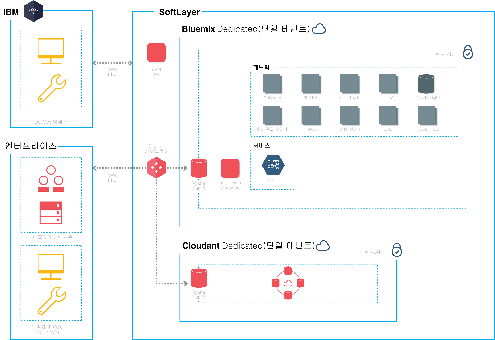

{:new_window: target="_blank"} 
{:shortdesc: .shortdesc}

#{{site.data.keyword.Bluemix_notm}} Dedicated
{: #dedicated}

*마지막 업데이트 날짜: 2015년 10월 20일*

{{site.data.keyword.Bluemix}}는
애플리케이션을 빌드, 실행 및 관리하기 위한 개방형 표준, 클라우드 기반 플랫폼입니다. {{site.data.keyword.Bluemix_notm}} Dedicated를 사용하면 {{site.data.keyword.Bluemix_notm}} Public 환경 및 자체 네트워크 모두에 안전하게 연결되어 있는 자체 전용 SoftLayer 환경에서의{{site.data.keyword.Bluemix_notm}} 강력함과 단순성을 확보할 수 있습니다. {:shortdesc}

{{site.data.keyword.Bluemix_notm}} Dedicated에는
사용자가 독점적으로 사용 가능한 전용 서비스를 표시하는 개인용 카탈로그가 포함되어 있습니다. 또한 {{site.data.keyword.Bluemix_notm}} Public에서
사용 가능하며 여기에서 신디케이트된 추가 서비스도 포함되어 있습니다. 

{{site.data.keyword.Bluemix_notm}} Dedicated는 SoftLayer에서 빌드되었으므로 최고 성능의 클라우드 인프라를 사용할 수 있습니다. 
각 데이터 센터에서는 일주일 내내 24시간 보안 및 엄격한 제어를 수행합니다. 사용자 및 IBM은 VPN 터널 및 사설 VLAN을 통해 {{site.data.keyword.Bluemix_notm}} 전용 인스턴스에 액세스합니다. 

*그림 1. 자세한 {{site.data.keyword.Bluemix_notm}} Dedicated 다이어그램*

{{site.data.keyword.Bluemix_notm}} Dedicated 환경은
인프라, 운영 및 물리적 보안이라는 면에서 공용
{{site.data.keyword.Bluemix_notm}}와 보안 표준이 동일합니다. 그러나 전용 {{site.data.keyword.Bluemix_notm}}에 대한
개발자 액세스는 LDAP 정책에 의해 제어되며, 이 정책은 환경을 설정할 때
{{site.data.keyword.Bluemix_notm}} 팀에서 구성할 수 있습니다. 
전용 환경 내에서는 사용자 역할 및 권한을 관리할 수 있습니다. 세부사항은 [관리자 및 권한 관리](../admin/index.html#oc_useradmin)를 참조하십시오.

{{site.data.keyword.Bluemix_notm}} Dedicated는
{{site.data.keyword.Bluemix_notm}} 런타임 및
128GB의 애플리케이션 메모리가 모두 포함되어 제공됩니다. 

또한 기본적으로 포함되는 서비스와 전용 인스턴스에
선택할 수 있는 선택적 서비스가 있습니다.  

| **유형**        | **이름**            | **설명** |      
|-----------------|-------------------|-------------------|
| 포함 | {{site.data.keyword.autoscaling}} | 정책에 따라 애플리케이션의 계산 용량을 동적으로 늘리거나 줄입니다. 이 서비스를 사용하면
{{site.data.keyword.Bluemix_notm}} Dedicated 환경에서
무제한 사용이 가능합니다.  |
| 포함 | {{site.data.keyword.datacshort}} | 이 서비스는 앱에 대한 분산 캐싱 시나리오를 지원하는 인메모리 데이터 그리드를 제공합니다. 
50GB의 인메모리 캐시가 포함됩니다.  |
| 포함 | {{site.data.keyword.cloudant}} | 고성능 JSON 데이터 계층을 제공하는 IBM의 NoSQL 데이터베이스입니다(CouchDB와 호환 가능). 1.6TB 및 초당 3,000개까지의 API 요청이 포함됩니다. |
| 선택사항 | {{site.data.keyword.sqldb}} | {{site.data.keyword.Bluemix_notm}}에 대한 IBM {{site.data.keyword.sqldbfull}} 데이터베이스는 완전히 프로비저닝된 관계형 데이터베이스를 앱에 추가합니다. {{site.data.keyword.sqldb}}는 요청되는 웹과 기존 업무의 워크로드를 처리해 주는 관리 데이터베이스를 제공합니다.  |
| 선택사항 | {{site.data.keyword.mql}} | {{site.data.keyword.Bluemix_notm}}에 대한 {{site.data.keyword.mqlfull}}는 {{site.data.keyword.Bluemix_notm}} 앱에 유연하고 사용하기 쉬운 메시징을 제공하는 클라우드 기반 메시징 서비스입니다. {{site.data.keyword.mql}}는 관리 작업이 간소화된 메시징 솔루션입니다. {{site.data.keyword.mql}}를 사용하면 앱의 응답성과 확장성이 향상되고 간단하면서 강력한 API를 통해 앱 간에 간편하게 작업을 공유 및 오프로드할 수 있습니다.  |
| 선택사항 | {{site.data.keyword.dashdbshort}} | dashDB는 지리공간 데이터와 같은 특수 유형을 포함한 관계형 데이터를 저장하는 데 사용합니다. 그런 다음 SQL이나 예측 분석 및 데이터 마이닝 같은 고급 기본 제공 분석,
R을 이용한 분석, 지리공간 분석을 사용하여 이 데이터를 분석합니다.  |

*표1. 전용 서비스*

##{{site.data.keyword.Bluemix_notm}} Dedicated 설정
{: #setupdedicated}

{{site.data.keyword.Bluemix_notm}} Dedicated는
{{site.data.keyword.Bluemix_notm}} Public 오퍼링의
개인용 버전을 제공하도록 디자인되었습니다. {{site.data.keyword.Bluemix_notm}} 서비스 및 런타임을 사용하여 IBM이 호스팅하는 SoftLayer 계정의 컴퓨팅 요구사항을 지원할 수 있습니다. 

IBM은 비밀번호로 보호되는 로그인을 사용하여 {{site.data.keyword.Bluemix_notm}} Dedicated에 대한 액세스를 제공합니다. 서비스, 런타임 및 연관된 자원에 액세스하고
{{site.data.keyword.Bluemix_notm}} 앱을 배치 및 제거할 수 있습니다. IBM이 다수의 SoftLayer 위치를 활용하여 {{site.data.keyword.Bluemix_notm}} Dedicated를 제공하기 때문에 사용자는 자신에게 가까운 위치에서 개인용 버전을 가져올 수 있습니다. 

{{site.data.keyword.Bluemix_notm}}의 개인용 버전 설정:

<ol>
<li>시작하려면 IBM 지정 계정 담당자에게 문의하거나 <a href="https://console.ng.bluemix.net/?direct=classic/#/contactUs/cloudOEPaneId=contactUs" target="_blank">{{site.data.keyword.Bluemix_notm}}</a>에 문의하십시오. </li>
<li>매월 발생하는 요금은 사용하고자 하는 전용 서비스 및
모든 {{site.data.keyword.Bluemix_notm}} 공용 서비스에 대한 구독을 기반으로 합니다. 
그런 다음 해당 구독 계약과 더불어 사용하는 모든 항목에 대한 송장을 수령하십시오. <ol type="a">
	<li>{{site.data.keyword.Bluemix_notm}} Dedicated 인스턴스의 사용 요금에 관해 IBM과 함께 작업하십시오. 	매월 발생하는 요금은 사용하고자 하는 전용 서비스 및
모든 {{site.data.keyword.Bluemix_notm}} 공용 서비스에 대한 구독을 기반으로 합니다. 
그런 다음 해당 구독 계약과 더불어 사용하는 모든 항목에 대한 송장을 수령하십시오. </li>
	<li>{{site.data.keyword.Bluemix_notm}} Dedicated 인스턴스 설정의 각 단계마다 최종 기한을 식별하십시오. </li>
	</ol>
	</li>
<li>전용 인스턴스에 대해 <a href="http://www.softlayer.com/data-centers" target="_blank">SoftLayer 데이터 센터 위치</a>를 선택합니다. 그러면 전용 플랫폼 및 계정이 작성됩니다. 
계정에 대해, 전용 인스턴스를 시작하고 실행하기 위해 필요한 역할을 담당할 조직의 직원을 식별하십시오. 각 역할마다 해당하는 IBM 담당자가 있습니다.  

고객 역할:

<dl>
<dt>**조달 담당자**</dt>
<dd>프로젝트의 특정 측면에 관해 작업하는 조직의 적합한 직원 식별을 포함하여 {{site.data.keyword.Bluemix_notm}} Dedicated 환경의 설정에 관해 IBM 담당자와 함께 작업합니다. 이 역할은 패턴 선택, 상업적 배열 및 고객 자원에 대한 액세스 배열을 감독합니다. 이 조달 담당자는 전용 인스턴스를 설정하기 위한 전체 담당자입니다. </dd>
<dt>**규제 준수 담당자**</dt>
<dd>IBM 담당자와 함께 작업하여 보안 요구사항을 충족하는 토폴로지 및 배치 옵션을 선택합니다. 이 역할은 규제 준수 목표 및 목표를 달성하는 배치 패턴을 결정하기 위해 IBM 규제 준수 컨설턴트와 함께 작업합니다.</dd>
<dt>**네트워크 전문가**</dt>
<dd>{{site.data.keyword.Bluemix_notm}} 배치의 네트워크 플랜에 관해 IBM 담당자와 함께 작업합니다. 이 역할은 IBM 담당자에게 요구사항을 제공하며 구현 플랜에 관해 함께 작업합니다. 설치 및 검증 단계의 끝에서 이 역할은 기업 표준 규제를 준수하는 네트워크 구성을 "사인오프"합니다.</dd>
<dt>**DevOps 담당자**</dt>
<dd>IBM 담당자와 함께 작업하여 {{site.data.keyword.Bluemix_notm}} 플랫폼, 서비스 및 런타임에 필요한 유지보수 업데이트를 계획하고 적용합니다. 
이 역할은 {{site.data.keyword.Bluemix_notm}} Dedicated 인스턴스의 구성과 관련해서도 IBM 담당자와 함께 작업합니다. </dd>
</dl>

IBM 역할:

<dl>
<dt>**IBM 프로비저닝 관리자**</dt>
<dd>고객 조달 담당자와 함께 작업하여 고객 환경을 설정합니다.</dd>
<dt>**IBM 규제 준수 컨설턴트**</dt>
<dd>고객 규제 준수 담당자와 함께 작업하여 보안 요구사항을 충족하는 토폴로지 및 배치 옵션을 선택합니다. </dd>
<dt>**IBM 네트워크 전문가**</dt>
<dd>고객 네트워크 전문가와 함께 작업하여 배치의 네트워크 플랜을 연결합니다. 이 역할은 고객과 함께 작업하여 요구사항을 수집하고 구현 플랜을 작성합니다. 이 역할은 또한 자동화된 테스트를 수행하여 구현 플랜의 실제 결과를 확인합니다.</dd>	
<dt>**IBM DevOps 담당자**</dt>
<dd>배치 토폴로지의 설치 및 지속적인 유지보수에 대해 고객 DevOps 담당자와 함께 작업합니다. 이 역할은 고객과 함께 플랫폼 및 서비스에 필요한 업데이트를 계획하고 수행합니다.</dd>
</dl>
</li>
<li>기업 네트워크 및 {{site.data.keyword.Bluemix_notm}} Dedicated
인스턴스 간의 네트워크 연결을 정의하고 설정하십시오. <ol type="a">
	<li>IBM은 전용 인스턴스에 대한 모니터링 및 보안 인프라를 설치합니다. </li>
	<li>IBM은 선택된 단일 테넌트 전용 서비스를 설치합니다. </li>
	<li>IP 주소 또는 방화벽과 같은 항목에 대해 네트워크 구성 및 엔드포인트를 제공하고
{{site.data.keyword.Bluemix_notm}}로의 통합을 위한 LDAP에 액세스하십시오. </li>
	</ol>
</li>
<li>환경의 관리 팀에 대한 역할을 식별하고 지정하십시오. <ol type="a">
	<li>IBM은 제공된 내용을 기반으로 네트워크 액세스 및 LDAP를 구성합니다. 관리 액세스 권한이 지정된 담당자에게 부여됩니다. 지원 및 청구에 대한 담당자도 지정해야 합니다. </li>
	<li>IBM은 전용 환경에서 전용 서비스 및 다수의 공용 {{site.data.keyword.Bluemix_notm}} 서비스를 표시하는 신디케이트된 카탈로그를 설정합니다. </li>
	<li>네트워크 및 방화벽 구성과 LDAP 엔드포인트 및 액세스를 유효성 검증하십시오. </li>
	</ol>
</li>
</ol>

##전용 인스턴스 유지보수
{: #maintaindedicated}

IBM은 {{site.data.keyword.Bluemix_notm}} Dedicated 플랫폼, 런타임 및 서비스에 대해 IBM이 적합하다고 판단되면 업데이트 및 수정사항을 유지보수하고 설치합니다. 

**중요**: IBM은 필요에 따라 비상 유지보수를 적용할 수 있도록 서비스를 인터럽트할 수 있는 권한을 보유합니다. IBM은 스케줄된 유지보수 시간을 변경할 수 있지만 그러한 변경은 물론 비상 유지보수 정보에 대해서도 사용자에게 알려드릴 것입니다. 

다음 유형의 유지보수가 {{site.data.keyword.Bluemix_notm}} Dedicated에 필요합니다. 
<dl>
<dt>**표준 유지보수 창**</dt>
<dd>해당 서비스는 사전 정의된 표준 유지보수 창을 이용하며 서비스가 사용 불가능할 수 있습니다. IBM은 유지보수를 수행하기 위해 고객 승인을 요구하지 않지만 서비스에 미치는 영향을 최소화하기 위해 시도합니다. 
 
IBM은 각각의 유지보수 창에 대해 계획된 변경사항의 브로드캐스트 메시지를 이메일, 전화 또는 기타 방법을 통해 전송합니다.  
 
**중요**: 유지보수 기간 중에는 일부 서비스를 사용하지 못할 수도 있습니다. </dd>

<dt>**월별 변경 창**</dt>
<dd>월별 유지보수 창은 21일 기간 내에 사용자와 IBM 간 조정을 기반으로 적용됩니다. 사용자는 작동하지 않을 수 있는 21일 기간 내에 특정 날짜 또는 시간을 IBM에 제공할 수 있습니다. IBM은 해당 시간을 중심으로 업데이트를 스케줄하기 위해 시도합니다. 요청을 기반으로 IBM은 사용자에게 스케줄된 유지보수 창을 전달합니다. 월별 변경 창은 실행 중인 Bluemix Dedicated 환경에 영향을 미칠 것으로 예상되지 않습니다. 
 
**참고:** 업데이트할 특정 시간을 요청하지 않는 경우 유지보수는 창의 마지막에 자동으로 적용됩니다.  
 
**관리 > 시스템 정보**로 이동하여 보류 중인 업데이트를 확인하고 사용 불가능한 날짜를 설정하며 업데이트를 승인하십시오. 알림 및 보류 중인 업데이트 스케줄링에 대한 자세한 정보는 <a href="../admin/index.html#oc_system">시스템 정보 보기</a>를 참조하십시오.</dd>
	
<dt>**기타**</dt>
<dd>IBM은 서비스(특히 {{site.data.keyword.Bluemix_notm}} Dedicated 환경, 런타임 및 서비스의 가용성)에 영향을 줄 수 있는 모든 유지보수를 표준 및 월간 업데이트로 제한하고자 합니다.
기타 변경 창은 환경 관리를 위한 예외 기반으로 사용될 수 있습니다. IBM은 그러한 변경 창 동안에 사용자에게 미치는 영향을 최소화하기 위해 합리적인 노력을 기울일 것이며 이에 대해 사전에 알려드릴 것입니다. </dd>
</dl>

전용 인스턴스의 유지보수를 설정하려면 IBM 전용 계정 담당자와 함께 작업하여 표준 유지보수에 대해 합의된 기간을 식별하십시오. 
