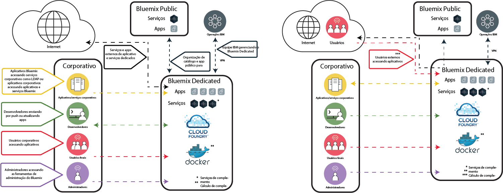

---

copyright:

  years: 2015, 2017

lastupdated: "2017-05-03"

---

{:shortdesc: .shortdesc}

# {{site.data.keyword.Bluemix_dedicated_notm}}
{: #dedicated}

{{site.data.keyword.Bluemix}} é uma plataforma de padrão aberto, baseada em nuvem para construir, executar e gerenciar aplicativos. Com o {{site.data.keyword.Bluemix_dedicated_notm}}, você obtém o poder e a simplicidade do {{site.data.keyword.Bluemix_notm}}&mdash; em seu próprio ambiente dedicado do SoftLayer que está seguramente conectado ao ambiente do {{site.data.keyword.Bluemix_notm}} Public e à sua própria rede.
{:shortdesc}

Todas as implementações dedicadas do {{site.data.keyword.Bluemix_notm}} incluem os benefícios e recursos a seguir sem nenhum custo adicional: VPN, rede local virtual (VLAN) privada, firewall, conectividade com seu LDAP, capacidade de alavancar bancos de dados e apps existentes no local, segurança no site 24x7, hardware dedicado e suporte padrão.

Por padrão, o acesso à sua instância privada do {{site.data.keyword.Bluemix_notm}} é acessível apenas a partir de sua rede corporativa. Se você precisar que o ambiente do {{site.data.keyword.Bluemix_notm}} seja acessível diretamente da Internet, de um dispositivo móvel ou de um banco de dados dedicado, por exemplo, então, um componente de segurança de rede adicional será necessário a um custo adicional.

O {{site.data.keyword.Bluemix_dedicated_notm}} é fornecido com todos os tempos de execução do {{site.data.keyword.Bluemix_notm}} incluídos e 64 GB de memória de recursos de cálculo.

Além disso, há um conjunto de serviços e componentes que são incluídos ou opcionais para compra. Revise a tabela a seguir para ver o que está incluído e o que você pode comprar opcionalmente.

| **Tipo**        | **Nome**            | **Descrição** |
|-----------------|-------------------|-------------------|
|Incluído | [Tempos de execução do {{site.data.keyword.Bluemix_notm}}](/docs/cfapps/runtimes.html) | Use tempos de execução para colocar seu app funcionando rapidamente, sem necessidade de configurar e gerenciar as máquinas e os sistemas operacionais. Todos os tempos de execução do {{site.data.keyword.Bluemix_notm}} estão disponíveis para você usar em sua instância do {{site.data.keyword.Bluemix_dedicated_notm}}.|
| Incluído | [{{site.data.keyword.autoscaling}}](/docs/services/Auto-Scaling/index.html) | Aumentar ou diminuir dinamicamente a capacidade de cálculo do aplicativo com base em políticas. Com esse serviço, você tem uso ilimitado em seu ambiente do {{site.data.keyword.Bluemix_dedicated_notm}}. Nota: o Auto-scaling funciona atualmente somente com os tempos de execução do Cloud Foundry |
|Opcional | [{{site.data.keyword.apiconnect_short}}](/docs/services/apiconnect/index.html) | O {{site.data.keyword.apiconnect_long}} integra o {{site.data.keyword.APIM}} e o IBM StrongLoop em uma única oferta que fornece uma solução abrangente para criar, executar, gerenciar e impingir APIs e microsserviços. |
|Opcional | [{{site.data.keyword.rules_short}}](/docs/services/rules/rules.html) | O {{site.data.keyword.rules_short}} oferece um ambiente abrangente para automatizar e executar decisões de negócios baseadas em regras repetidas e que ocorrem frequentemente. Ele também permite que usuários de negócios ou desenvolvedores rapidamente modelem e testem suas decisões a custos mais baixos, reduzindo a necessidade de conhecimentos de TI. |
|Opcional | [{{site.data.keyword.cloudant}}](/docs/services/Cloudant/index.html#Cloudant) | O {{site.data.keyword.cloudant}} fornece acesso a uma camada de dados do JSON NoSQL totalmente gerenciada que sempre está ativa. Esse serviço é compatível com o CouchDB e acessível por meio de uma interface HTTP simples de usar para modelos de aplicativos móveis e da web. |
|Opcional | [{{site.data.keyword.containershort}}](/docs/containers/container_index.html) | Execute os contêineres do Docker no {{site.data.keyword.Bluemix_dedicated_notm}}. Contêineres são objetos de software virtuais que incluem todos os elementos que um aplicativo precisa executar. Um contêiner tem os benefícios do isolamento e da alocação de recursos, mas é mais móvel e eficiente do que, por exemplo, uma máquina virtual. Para obter informações sobre requisitos de hardware, consulte [IBM {{site.data.keyword.containershort}} em {{site.data.keyword.Bluemix_dedicated_notm}} e Bluemix Local](/docs/containers/container_ov.html#container_dl).|
| Opcional | [{{site.data.keyword.contdelivery_short}}](/docs/services/ContinuousDelivery/index.html) | Use {{site.data.keyword.contdelivery_short}} Dedicated para automatizar construções, testes de unidade, implementações, etc. Edite e envie o código por push por meio do IDE avançado baseado na web. Crie cadeias de ferramentas para ativar integrações de ferramenta que suportam as tarefas de desenvolvimento, implementação e operações. |
| Opcional | [{{site.data.keyword.dashdbshort}}](/docs/services/dashDB/dashDB.html) | O IBM {{site.data.keyword.dashdbshort}} for Analytics é um serviço de banco de dados de nuvem de SQL totalmente gerenciado, otimizado para data warehouse e cargas de trabalho de analítica. O IBM {{site.data.keyword.dashdbshort}} for Transactions é um serviço de banco de dados de nuvem de SQL totalmente gerenciado, otimizado para propósito geral, apps da web e cargas de trabalho transacionais. |
| Opcional | [{{site.data.keyword.datacshort}}](/docs/services/DataCache/index.html#data_cache) | Esse serviço fornece uma grade de dados da memória que suporta cenários de armazenamento em cache distribuído para seus apps. Inclui 50 GB de cache na memória. |
| Opcional | [Dedicated GitHub Enterprise](/docs/services/ghededicated/index.html) | {{site.data.keyword.ghe_long}} é a versão hospedada em Nuvem IBM e completamente gerenciada do GitHub Enterprise que fornece a experiência social que os desenvolvedores amam. Esse serviço atualmente está disponível exclusivamente para ambientes do {{site.data.keyword.Bluemix_dedicated_notm}}. |
| Opcional (Beta) | [Registro de log](/docs/monitoringandlogging/cfapps_ml_logs_dedicated_ov.html#container_ml_logs_dedicated_ov) | Fornece logs para os aplicativos Cloud Foundry em sua interface com o usuário do {{site.data.keyword.Bluemix_notm}} e logs pesquisáveis e painéis em Kibana. |
| Opcional | [{{site.data.keyword.messagehub}}](/docs/services/MessageHub/index.html#messagehub) | O {{site.data.keyword.messagehub}} é um barramento de mensagem escalável, distribuído, de alto rendimento, para unificar as suas tecnologias no local e remotas. O {{site.data.keyword.messagehub}} é baseado no Apache Kafka, que é um mecanismo do sistema de mensagens em tempo real rápido, escalável e durável. |
|Opcional | [{{site.data.keyword.mobilepush}}](/docs/services/mobilepush/index.html) | O {{site.data.keyword.mobilepush}} é um serviço que você pode usar para enviar notificações para iOS e dispositivo Android. É possível direcionar notificações para todos os usuários do aplicativo ou para um conjunto específico de usuários e dispositivos usando tags. É possível administrar dispositivos, tags e assinaturas. É possível também usar um SDK (kit de desenvolvimento de software) e interfaces de programação de aplicativo (APIs) Representational State Transfer (REST) para desenvolver ainda mais seus aplicativos cliente.|
|Opcional | [{{site.data.keyword.SecureGateway}}](/docs/services/SecureGateway/secure_gateway.html) | O serviço {{site.data.keyword.SecureGateway}} fornece uma maneira segura de conectar aplicativos {{site.data.keyword.Bluemix_notm}} a locais remotos no local ou na nuvem.  |
|Opcional | [{{site.data.keyword.sescashort}}](/docs/services/SessionCache/index.html#session_cache) | Para maior redundância, o {{site.data.keyword.sescashort}} fornece uma réplica de uma sessão armazenada no cache. Portanto, no caso de uma indisponibilidade de energia, seu aplicativo cliente manterá acesso à sessão no cache. O serviço suporta cenários de armazenamento em cache de sessão para aplicativos móveis e da web. |
| Opcional | [{{site.data.keyword.iot_short}}](/docs/services/IoT/index.html) | Esse serviço permite que os apps se comuniquem e consumam dados coletados por seus dispositivos conectados, sensores e gateways. A oferta de base permite executar uma versão privada do {{site.data.keyword.iot_short}} no ambiente dedicado com uma capacidade de 100.000 dispositivos ou aplicativos conectados simultaneamente e 1,6 TB de troca de dados. |
| Opcional | [{{site.data.keyword.appserver_short}}](/docs/services/ApplicationServeronCloud/index.html) | O IBM {{site.data.keyword.appserver_short}} for IBM {{site.data.keyword.Bluemix_notm}} é um serviço que facilita a configuração rápida em uma instância pré-configurada do {{site.data.keyword.appserver_short}} Liberty, do Network Deployment tradicional ou do WebSphere Java EE tradicional em um ambiente de nuvem hospedado no {{site.data.keyword.Bluemix_notm}}. |
{: caption="Tabela 1. Serviços dedicados" caption-side="top"}
{: #table01}

Há componentes opcionais que estão disponíveis para você comprar para escalar e ampliar a capacidade de seus recursos e serviços. É possível comprar qualquer um desses componentes entrando em contato com a equipe de vendas; acesse [Contate-nos](https://console.ng.bluemix.net/?direct=classic/#/contactUs/cloudOEPaneId=contactUs) para obter informações sobre como contatar um representante de vendas. Para aumentar seu plano para um serviço, é possível selecionar o plano a partir do ladrilho do serviço em seu catálogo.

| **Nome**            | **Descrição** |
|-------------------|-------------------|
|Dedicated {{site.data.keyword.apiconnect_short}} Professional 5 milhões de Chamadas API | Um ambiente que permite executar uma versão privada do {{site.data.keyword.apiconnect_short}} dentro do ambiente dedicado com uma capacidade de 5 milhões de Chamadas API por mês, destinadas para projetos de API departamentais. |
|Dedicated {{site.data.keyword.apiconnect_short}} Professional aumento de 100 mil Chamadas API | Uma extensão do ambiente do {{site.data.keyword.apiconnect_short}} Professional, para fornecer capacidade adicional de 100 mil chamadas API por mês. |
|Dedicated {{site.data.keyword.apiconnect_short}} Enterprise 25 milhões de Chamadas API | Um ambiente que permite executar uma versão privada do {{site.data.keyword.apiconnect_short}} dentro do ambiente dedicado com uma capacidade de 25 milhões de Chamadas API por mês, destinadas para projetos de API em toda a empresa. |
|Dedicated {{site.data.keyword.apiconnect_short}} Enterprise aumento de 100 mil Chamadas API | Uma extensão do ambiente do {{site.data.keyword.apiconnect_short}} Enterprise, para fornecer capacidade adicional de 100 mil Chamadas API por mês. |
|IBM {{site.data.keyword.Bluemix_dedicated_notm}} {{site.data.keyword.rules_short}} 1 Milhão de decisões de regras | Uma Decisão de regras é o resultado de chamar um conjunto de regras de um servidor de execução de regra. Autorizações suficientes devem ser obtidas para cobrir o número total de Decisões de regras, arredondado para o milhão mais próximo, executado ou processado, durante o período de faturamento. As Decisões de regras medidas por esse Serviço de nuvem são as chamadas feitas para o servidor de execução de regra para obter uma decisão. As implementações dedicadas do Serviço de nuvem têm uma capacidade acordada medida pela métrica de encargos relevantes. A alocação de espaço padrão do serviço {{site.data.keyword.rules_short}} na plataforma {{site.data.keyword.Bluemix_dedicated_notm}} é 16 GB, na qual até dez instâncias de 1 GB cada podem ser chamadas para executar Decisões de regras autorizadas. Se essa limitação de uso é excedida, deve-se comprar capacidade adicional para cobrir esse uso. |
|Aumento de capacidade de 1,6 TB do {{site.data.keyword.cloudant}} dedicado | Inclui a execução de uma versão privada do {{site.data.keyword.cloudantfull}} dentro do ambiente dedicado com uma capacidade de design de 1,6 terabyte.  |
|Aumento de capacidade de 50 GB do {{site.data.keyword.datacshort}} e {{site.data.keyword.sescashort}} dedicados | Um ambiente que permite implementar e executar as instâncias do {{site.data.keyword.datacshort}} e do {{site.data.keyword.sescashort}} até uma capacidade acumulativa de 50 GB. |
|Instância do {{site.data.keyword.contdelivery_short}} Dedicated | Uma versão privada do {{site.data.keyword.contdelivery_short}} em execução dentro de um ambiente dedicado. A capacidade é determinada pelas autorizações de Usuário Autorizado do {{site.data.keyword.contdelivery_short}} Dedicated. |
|Usuário Autorizado do {{site.data.keyword.contdelivery_short}} Dedicated | Concede um acesso de Usuário Autorizado e para o uso de um ambiente do {{site.data.keyword.contdelivery_short}} Dedicated. Cada usuário que pertence a uma Organização do {{site.data.keyword.Bluemix_notm}} que contém uma instância de serviço do {{site.data.keyword.contdelivery_short}} deve ser autorizado. |
|{{site.data.keyword.dashdbshort}} Enterprise 64,1 dedicado | Um banco de dados por instância de serviço em um servidor dedicado com 64 GB de RAM, 16 vCPUs. Recomendado para até 1 TB de dados de pré-carregamento, com base em compactação típica.  |
|{{site.data.keyword.dashdbshort}} Enterprise 256,4 dedicado | Um banco de dados por instância de serviço em um servidor bare metal dedicada com 256 GB de RAM, 32 núcleos. Recomendado para até 4 TB de dados de pré-carregamento, com base em compactação típica. |
|{{site.data.keyword.dashdbshort}} Enterprise 256,12 dedicado  | Um banco de dados por instância de serviço em um servidor bare metal dedicada com 256 GB de RAM, 32 núcleos. Recomendado para até 12 TB de dados de pré-carregamento, com base em compactação típica. Este é um plano denso de armazenamento adequado para ambientes nos quais os volumes de dados são maiores e as consultas não precisam ser executadas em velocidades de memória. |
|IBM {{site.data.keyword.Bluemix_dedicated_notm}} {{site.data.keyword.dashdbshort}} Enterprise for Transactions 2.8.500 | Instância dedicada que suporta cargas de trabalho do Online Transaction Processing (OLTP) com 8 GB de RAM e 500 GB de espaço para dados e logs. |
|IBM {{site.data.keyword.Bluemix_dedicated_notm}} {{site.data.keyword.dashdbshort}} Enterprise for Transactions 12.128.1400 | Instância dedicada que suporta cargas de trabalho do Online Transaction Processing (OLTP) com 128 GB de RAM e 1,4 TB de armazenamento de SSD para dados e logs. |
|IBM {{site.data.keyword.Bluemix_dedicated_notm}} {{site.data.keyword.dashdbshort}} Enterprise for Transactions High Availability 2.8.500 | Instância dedicada que suporta cargas de trabalho do Online Transaction Processing (OLTP) com 8 GB de RAM e 500 GB de espaço para dados e logs e ela inclui um servidor de Espera adicional para alta disponibilidade. |
|IBM {{site.data.keyword.Bluemix_dedicated_notm}} {{site.data.keyword.dashdbshort}} Enterprise for Transactions High Availability 12.128.1400 | Instância dedicada que suporta cargas de trabalho do Online Transaction Processing (OLTP) com 128 GB de RAM e 1,4 TB de armazenamento de SSD para dados e logs e ela inclui um servidor de Espera adicional para alta disponibilidade. |
|Serviços da comunidade do {{site.data.keyword.Bluemix_dedicated_notm}}  | Um ambiente que permite implementar e executar serviços de comunidade até um total de 50 instâncias para cada serviço de comunidade.  |
|Instância de Cluster do {{site.data.keyword.Bluemix_dedicated_notm}} {{site.data.keyword.cloudant}} | Este componente opcional inclui um cluster de 3 nós pelo qual você é responsável por fornecer a infraestrutura, e a capacidade de armazenamento e cálculo pode ser determinada com base em suas necessidades específicas. O {{site.data.keyword.cloudant}} fornece acesso a uma camada de dados do JSON NoSQL totalmente gerenciada que sempre está ativa. Esse serviço é compatível com o CouchDB e acessível por meio de uma interface HTTP simples de usar para modelos de aplicativos móveis e da web. |
|IBM {{site.data.keyword.Bluemix_dedicated_notm}} {{site.data.keyword.messagehub}} | Um ambiente que fornece um sistema de mensagens de publicação/assinatura de até 10 GB por partição, limitado a 100 partições. |
|IBM Bluemix Dedicated {{site.data.keyword.mobilepushshort}} | Um ambiente que permite a implementação e execução de instâncias do {{site.data.keyword.mobilepushshort}} com capacidade para aceitar 300 pedidos por segundo. |
|Aumento incremental do {{site.data.keyword.iot_short}} Dedicated | Um aumento de ambiente que permite a execução de uma versão privada do {{site.data.keyword.iot_short}} no ambiente dedicado com uma capacidade de 100.000 dispositivos ou aplicativos conectados simultaneamente e 0,5 TB de troca de dados. |
|IBM {{site.data.keyword.appserver_short}} for {{site.data.keyword.Bluemix_notm}} - Dedicated Small| Uma instância pré-configurada do {{site.data.keyword.appserver_short}} Liberty, do Network Deployment tradicional ou do WebSphere Java EE tradicional em um ambiente de nuvem hospedado no {{site.data.keyword.Bluemix_notm}} com 64 vCores, 128 GB de RAM e 1 TB de HDD por mês. |
|IBM {{site.data.keyword.appserver_short}} for {{site.data.keyword.Bluemix_notm}} - Dedicated Medium| Uma instância pré-configurada do {{site.data.keyword.appserver_short}} Liberty, do Network Deployment tradicional ou do WebSphere Java EE tradicional em um ambiente de nuvem hospedado no {{site.data.keyword.Bluemix_notm}} com 128 vCores, 256 GB de RAM e 2 TB de HDD por mês. |
|IBM {{site.data.keyword.appserver_short}} for {{site.data.keyword.Bluemix_notm}} - Dedicated Large| Uma instância pré-configurada do {{site.data.keyword.appserver_short}} Liberty, do Network Deployment tradicional ou do WebSphere Java EE tradicional em um ambiente de nuvem hospedado no {{site.data.keyword.Bluemix_notm}} com 256 vCores, 512 GB de RAM e 4 TB de HDD por mês. |
|IBM {{site.data.keyword.appserver_short}} for {{site.data.keyword.Bluemix_notm}} - Dedicated| Uma instância pré-configurada do {{site.data.keyword.appserver_short}} Liberty, do Network Deployment tradicional ou do WebSphere Java EE tradicional em um ambiente de nuvem hospedado no {{site.data.keyword.Bluemix_notm}} com Expansão de HDD e 1 TB por mês. |
{: caption="Tabela 2. Componentes opcionais de serviço para compra" caption-side="top"}
{: #table02}

| **Nome**            | **Descrição** |
|-------------------|-------------------|
|Aumento de capacidade de 16 GB de tempos de execução dedicados  | Uma extensão do ambiente de tempo de execução para fornecer um extra de 16 GB de capacidade de tempo de execução. |
|Capacidade de 1 Gbps de link direto dedicado | Um link de rede dedicado que conecta diretamente ao ponto de presença apropriado da rede do {{site.data.keyword.BluSoftlayer}} projetado para as transferências de dados de até 1 Gbps. |
|Capacidade de 10 Gbps de link direto dedicado | Um link de rede dedicado que conecta diretamente ao ponto de presença apropriado da rede do {{site.data.keyword.BluSoftlayer}} projetado para as transferências de dados de até 10 Gbps. |
|Firewall de hardware do IBM Bluemix Dedicated - Alta disponibilidade | Um firewall de hardware redundante de 1 Gbps configurado para proteção de um único, vários ou todos os servidores na mesma VLAN dentro do ambiente Dedicated. |
{: caption="Tabela 3. Componentes opcionais de complemento de plataforma para compra" caption-side="top"}
{: #table03}

**Nota**: componentes do {{site.data.keyword.Bluemix_dedicated_notm}} podem indicar uma capacidade configurada específica, como gigabytes ou transações por segundo. Como a capacidade real na prática para qualquer configuração do serviço de nuvem varia dependendo de vários fatores, a capacidade real pode ser mais ou menos que a capacidade configurada.

### Catálogo organizado
{: #catalogdedicated}

O {{site.data.keyword.Bluemix_dedicated_notm}} inclui um catálogo privado que reúne serviços aprovados ao longo de suas implementações públicas, dedicadas e locais. É possível publicar e gerenciar o acesso aos seus próprios serviços através do catálogo do {{site.data.keyword.Bluemix_notm}}. Você tem a opção de decidir quais serviços públicos atendem aos requisitos para seus negócios com base em sua privacidade de dados e critérios de segurança.

Se você tiver uma instância privada do serviço para o seu ambiente dedicado, verá uma identificação "Dedicado" com os nomes do serviço em seu catálogo. Da mesma forma, se ela for um serviço customizado, significando que você usou um broker de serviço para criá-la, você verá "Customizado" listado com o nome do serviço. Todos os outros serviços listados que não possuem uma identificação "dedicado" ou "customizado" estão disponíveis usando a organização do {{site.data.keyword.Bluemix_notm}} Public. Serviços organizados fornecem a função para criar aplicativos híbridos que consistem em serviços públicos e privados.

|Serviço	|Disponível na região sul dos EUA	|Disponível na região do Reino Unido na Europa |Disponível na região de Sydney, na Austrália|
|:----------|:------------------------------|:------------------|:------------------|
|{{site.data.keyword.alchemyapishort}} 		|Sim	   	|Sim  		|Sim|
|{{site.data.keyword.alertnotificationshort}}	|Sim		|Sim		|Sim	|
|{{site.data.keyword.apiconnect_short}}         |Sim            |Sim            |Sim  |
|{{site.data.keyword.appseccloudshort}}		|Sim		|Sim		|Sim |
|{{site.data.keyword.apiconnect_short}} 	|Sim   	 	|Sim  	 	|Sim   |
|Verificador de acessibilidade automatizado |Sim       |Sim    |Sim   |
|{{site.data.keyword.rules_short}}		|Sim		|Sim		|Sim |
|{{site.data.keyword.cloudant}}			|Sim		|Sim		|Sim |
|{{site.data.keyword.iotmapinsights_short}}    |Sim  |Sim  |Sim  |
|{{site.data.keyword.conversationshort}}  |Sim  |Sim  |Sim  |
|{{site.data.keyword.dashdbshort}}		|Sim		|Sim		|Sim |
|{{site.data.keyword.dataworks_short}}		|Sim		|Sim		|Não|
|{{site.data.keyword.DB2OnCloud_short}}		|Sim		|Sim		|Sim |
|Verificador de conteúdo digital |Sim  |Sim  |Sim  |
|{{site.data.keyword.documentconversionshort}}	|Sim		|Sim		|Sim|
|{{site.data.keyword.iotdriverinsights_short}}  |Sim |Sim  |Sim  |
|{{site.data.keyword.geospatialshort_Geospatial}}	|Sim	|Sim		|Sim |
|{{site.data.keyword.GlobalizationPipeline_short}}	|Sim		| Sim		| Sim |
|{{site.data.keyword.identitymixershort}}		|Sim		|Sim		|Sim|
|{{site.data.keyword.iot4auto_short}} |Sim   |Sim  |Sim  |
|{{site.data.keyword.iotelectronics}}  |Sim  |Sim  |Não |
|{{site.data.keyword.iotinsurance_short}} |Não   |Não   |Sim  |
|{{site.data.keyword.twittershort}}		|Sim		|Sim		|Sim|
|{{site.data.keyword.languagetranslationshort}}	|Sim		|Sim		|Sim |
|{{site.data.keyword.languagetranslatorshort}} |Sim  |Sim  |Sim  |
|{{site.data.keyword.dwl_short}}  |Sim  |Sim  |Não  |
|{{site.data.keyword.eventhubshort}}		|Sim		|Não		|Não|
|{{site.data.keyword.messagehub}}		|Sim		|Sim		|Não|
|{{site.data.keyword.manda}}			|Sim		|Sim		|Sim |
|{{site.data.keyword.amashort}}			|Sim		|Sim		|Sim |
|{{site.data.keyword.mqa}}			|Sim		|Sim		|Sim |
|{{site.data.keyword.mql}}			|Não		|Não		|Sim |
|{{site.data.keyword.nlclassifierlshort}} 	|Sim 		|Sim 		|Sim|
|{{site.data.keyword.personalityinsightsshort}}	|Sim		|Sim		|Sim|
|{{site.data.keyword.pm_short}}			|Sim		|Sim		|Não |
|{{site.data.keyword.mobilepush}}		|Sim		|Sim		|Sim |
|{{site.data.keyword.retrieveandrankshort}}	|Sim 		|Sim 		|Sim|
|{{site.data.keyword.runbook_short}}		|Sim		|Sim		|Sim|
|{{site.data.keyword.SecureGateway}}		|Sim		|Sim		|Sim |
|{{site.data.keyword.ssofull}}			|Sim		|Não		|Não|
|{{site.data.keyword.speechtotextshort}}	|Sim 		|Sim	 	|Sim|
|{{site.data.keyword.streaminganalyticsshort}}	|Sim		|Sim		|Sim |
|{{site.data.keyword.texttospeechshort}} 	|Sim 		|Sim	 	|Sim|
|{{site.data.keyword.toneanalyzershort}} 	|Sim 		|Sim 		|Sim|
|{{site.data.keyword.tradeoffanalyticsshort}}	|Sim		|Sim		|Sim|
|{{site.data.keyword.visualrecognitionshort}}	|Sim 		|Sim	 	|Sim|
|{{site.data.keyword.iot_short}}		|Sim		|Sim		|Não|
|{{site.data.keyword.weather_short}}		|Sim		|Sim		|Sim|
|{{site.data.keyword.workloadscheduler}}	|Sim		|Sim		|Sim |
{: caption="Tabela 4. Serviços disponíveis para organização do Bluemix Public por região" caption-side="top"}
{: #table04}

**Observação**: os serviços de terceiros não são incluídos na tabela. Verifique seu catálogo dedicado para obter as opções de serviço de terceiros.

## Arquitetura do {{site.data.keyword.Bluemix_dedicated_notm}}
{: #dedicatedarch}

O {{site.data.keyword.Bluemix_dedicated_notm}} pode ser implementado em qualquer datacenter do [{{site.data.keyword.IBM_notm}} SoftLayer ](http://www.softlayer.com/data-centers){: new_window} ao redor do mundo. O {{site.data.keyword.IBM_notm}} SoftLayer fornece a infraestrutura em nuvem de maior desempenho. Cada datacenter possui segurança de 24 horas, 7 dias por semana e controles rigorosos.

Cada implementação do {{site.data.keyword.Bluemix_dedicated_notm}} é dedicada para uma única empresa no hardware dedicado do {{site.data.keyword.IBM_notm}} SoftLayer em sua própria rede privada. Ambientes do {{site.data.keyword.Bluemix_dedicated_notm}} têm os mesmos padrões de segurança que o {{site.data.keyword.Bluemix_notm}} público em termos de segurança de infraestrutura, operacional e física. No entanto, o acesso do desenvolvedor ao {{site.data.keyword.Bluemix_notm}} dedicado é controlado por suas políticas de LDAP, que podem ser configuradas pela equipe do {{site.data.keyword.Bluemix_notm}} quando configuram seu ambiente. No ambiente dedicado, é possível gerenciar funções e permissões do usuário. Consulte [Gerenciando usuários e permissões](/docs/admin/index.html#oc_useradmin) para obter detalhes. A figura a seguir descreve a arquitetura lógica de uma implementação do {{site.data.keyword.Bluemix_dedicated_notm}} padrão.

Figura 1. Arquitetura padrão de diagrama do {{site.data.keyword.Bluemix_dedicated_notm}} detalhado
{: #figure01}

Os componentes arquitetônicos significativos descritos no diagrama de arquitetura anterior incluem os seguintes:

<dl>
<dt>{{site.data.keyword.IBM_notm}} Cloud</dt>
<dd>
O ambiente {{site.data.keyword.IBM_notm}} Cloud como um todo inclui os ambientes de rede significativos a seguir:
<ul>
<li>{{site.data.keyword.Bluemix_dedicated_notm}}</li>
<li>{{site.data.keyword.Bluemix_notm}} Public</li>
<li>Operações da {{site.data.keyword.IBM_notm}}</li>
</ul>
</dd>
<dt>{{site.data.keyword.Bluemix_dedicated_notm}}</dt>
<dd>
No mínimo, isso contém os componentes do Cloud Foundry e alguns serviços de aplicativos dedicados. O {{site.data.keyword.Bluemix_notm}} fornece o Cloud Foundry e ambientes de cálculo baseado no {{site.data.keyword.containerlong}}. Uma empresa pode ter um ou ambos os ambientes de cálculo configurados. 
Uma empresa pode incluir serviços de aplicativos dedicados adicionais. 
Consulte a [tabela 2](#table02) para obter serviços adicionais e recursos de cálculo que podem ser incluídos.
</dd>
<dt>{{site.data.keyword.Bluemix_notm}} Public</dt>
<dd>
Um {{site.data.keyword.Bluemix_dedicated_notm}} pode incluir uma conexão de saída em uma região do {{site.data.keyword.Bluemix_notm}} Public. Isso fornece a organização de serviços públicos no catálogo dedicado. A organização de serviço do {{site.data.keyword.Bluemix_notm}} Public fornece um método conveniente para desenvolvedores construírem aplicativos hospedados em seu {{site.data.keyword.Bluemix_dedicated_notm}} da empresa, bem como acesso a serviços em execução no {{site.data.keyword.Bluemix_notm}} Public. A lista de serviços que podem ser organizados a partir do {{site.data.keyword.Bluemix_notm}} Public é mostrada na [tabela 4 da seção de Catálogo organizado](#catalogdedicated).
</dd>
<dt>Operações da {{site.data.keyword.IBM_notm}}</dt>
<dd>
O {{site.data.keyword.IBM_notm}} gerencia, monitora e mantém a plataforma dedicada e os serviços dedicados para que seja possível concentrar-se na construção de aplicativos inovadores. A equipe de Operations Support Services (OSS) da {{site.data.keyword.IBM_notm}} executa operações usando uma conexão de túnel VPN da rede de Operações da {{site.data.keyword.IBM_notm}}.
</dd>
<dt>Corporativo</dt>
<dd>
O ambiente de rede corporativa pode ter um link de rede bidirecional privado seguro para o {{site.data.keyword.Bluemix_dedicated_notm}}. Isso permite que os aplicativos hospedados no {{site.data.keyword.Bluemix_dedicated_notm}} acessem serviços e recursos na empresa, incluindo origens de dados e serviços corporativos. Esse link de rede também permite que o {{site.data.keyword.Bluemix_dedicated_notm}} use o seu LDAP para autenticação de seus desenvolvedores e administradores da empresa. 
 
Há várias opções para criar o link da rede privada segura. Fale com o especialista técnico da IBM sobre a melhor opção de rede para sua empresa. 
 
A conexão padrão do {{site.data.keyword.Bluemix_dedicated_notm}} para a sua rede corporativa usa uma Rede privada virtual (VPN). O {{site.data.keyword.Bluemix_dedicated_notm}} tem uma terminação VPN Vyatta de 1 Gbps Dedicada configurada para alta disponibilidade.
 
Na arquitetura padrão do {{site.data.keyword.Bluemix_dedicated_notm}}, conforme mostrado na [figura 1](#figure01), não há tráfego de rede de entrada diretamente da Internet. Se a sua empresa deseja permitir acesso à Internet para aplicativos hospedados no {{site.data.keyword.Bluemix_dedicated_notm}}, o acesso deverá ser configurado através de sua Rede corporativa.
</dd>
</dl>

## Configurando o {{site.data.keyword.Bluemix_dedicated_notm}}
{: #setupdedicated}

O {{site.data.keyword.Bluemix_dedicated_notm}} foi projetado para fornecer uma versão privada da oferta {{site.data.keyword.Bluemix_notm}} Public. É possível usar serviços e tempos de execução do {{site.data.keyword.Bluemix_notm}} para suportar suas necessidades computacionais em uma conta do {{site.data.keyword.BluSoftlayer}} hospedada pela IBM.

A IBM fornece acesso ao {{site.data.keyword.Bluemix_dedicated_notm}} usando um login protegido por senha. É possível acessar os serviços, os tempos de execução e os recursos associados e implementar e remover apps do {{site.data.keyword.Bluemix_notm}}. A IBM usufrui das vantagens dos múltiplos locais do {{site.data.keyword.BluSoftlayer}} para entregar o {{site.data.keyword.Bluemix_dedicated_notm}} para que você possa obter sua versão privada em um local próximo a você.

Para configurar sua versão privada do {{site.data.keyword.Bluemix_notm}}:

<ol>
<li>Entre em contato com o representante de conta designado da IBM ou <a href="https://console.ng.bluemix.net/?direct=classic/#/contactUs/cloudOEPaneId=contactUs" target="_blank">entre em contato com o {{site.data.keyword.Bluemix_notm}} </a> para iniciar.</li>
<li>Trabalhe com a IBM com relação à taxa para sua instância do {{site.data.keyword.Bluemix_dedicated_notm}}. A taxa de recorrência mensal baseia-se nos serviços dedicados que você desejar usar, mais uma assinatura de todos os serviços públicos do {{site.data.keyword.Bluemix_notm}}. Em seguida, você receberá uma fatura para tudo o que usar além desse contrato de assinatura.</li>
<li>Identifique os prazos finais para cada fase de configuração da instância do {{site.data.keyword.Bluemix_dedicated_notm}}. Para obter informações sobre cada fase e as tarefas envolvidas, veja <a href="/docs/dedicated/index.html#rolesresponsibilities">Funções e responsabilidades do {{site.data.keyword.Bluemix_dedicated_notm}}</a>.</li>
<li>Você seleciona o local do datacenter do <a href="http://www.softlayer.com/data-centers" target="_blank">{{site.data.keyword.BluSoftlayer}} </a> para sua instância dedicada. Em seguida, sua plataforma e conta dedicadas são criadas. Para a conta, identifique as pessoas de sua organização para as funções que são necessárias para tornar a instância dedicada operacional. Para obter informações sobre as funções designadas, veja <a href="/docs/dedicated/index.html#rolesresponsibilities">Funções e responsabilidades do {{site.data.keyword.Bluemix_dedicated_notm}}</a>.
</li>
<li>Defina e estabeleça a conectividade de rede entre a rede corporativa e a instância do {{site.data.keyword.Bluemix_dedicated_notm}}. Há um dispositivo de segurança de rede obrigatório que inclui recursos de firewall e de intrusão com um custo associado para esta opção.
	<ol type="a">
	<li>A IBM instala a infraestrutura de monitoramento e segurança da instância dedicada.</li>
	<li>A IBM instala os serviços dedicados de único locatário selecionados.</li>
	<li>Você fornece configuração de rede e terminais para coisas como endereços IP ou firewalls e acesso ao LDAP para integração ao {{site.data.keyword.Bluemix_notm}}.</li>
	</ol>
</li>
<li>Identifique e designe funções para sua equipe administrativa para o ambiente.
	<ol type="a">
	<li>A IBM configura o acesso à rede e LDAP baseado no que foi fornecido. É fornecido acesso administrativo aos contatos designados. Deve-se também designar um contato para suporte e faturamento.</li>
	<li>A IBM configura um catálogo organizado em seu ambiente dedicado para mostrar os serviços dedicados. O catálogo organizado inclui serviços adicionais que são organizados e estão disponíveis para uso a partir do {{site.data.keyword.Bluemix_notm}} Public. Você tem a opção de decidir quais serviços públicos atendem aos requisitos para seus negócios com base em sua privacidade de dados e critérios de segurança.</li>
	<li>Você valida a configuração de rede e de firewall, do terminal LDAP, e acessa.</li>
	</ol>
</li>
</ol>

É possível esperar um processo semelhante à lista a seguir para a implementação e a configuração iniciais do seu ambiente. Para obter detalhes sobre quem é responsável por cada uma das tarefas, veja [Funções e responsabilidades](index.html#rolesresponsibilities).

<ol>
<li>Selecione qual datacenter usar para hospedar sua instância dedicada. Para obter informações sobre as opções do datacenter, veja <a href="http://www.softlayer.com/data-centers" target="_blank">Local do datacenter do {{site.data.keyword.BluSoftlayer}} </a>.</li>
<li>Especifique os nomes de domínio para a implementação e os IDs que deseja usar. Obtenha três domínios ao configurar sua instância do {{site.data.keyword.Bluemix_notm}}. Selecione o prefixo para a <code>*mycompany*.*region*.bluemix.net</code> e  <code>*mycompany*.*region*.mybluemix.net</code>. E, escolha o nome completo do terceiro domínio. 

É possível escolher quantos domínios customizados desejar. No entanto, você é responsável pelos certificados dos domínios customizados. Para obter informações sobre como criar seu domínio customizado, veja <a href="/docs/manageapps/updapps.html#domain">Criando e usando um domínio customizado</a>.
</li>
<li>Identifique um proprietário para a conta pública que é usada para representar sua empresa no {{site.data.keyword.Bluemix_notm}} Public. A IBM usa essa conta para rastrear o uso de serviços organizados.</li>
<li>Selecione o tipo de conexão segura para seu datacenter. É possível selecionar a partir do {{site.data.keyword.Bluemix_notm}} VPN, {{site.data.keyword.Bluemix_notm}} Direct Link e AT&T Net Bond.</li>
<li>Decida se haverá qualquer acesso ao seu ambiente dedicado a partir da Internet pública.</li>
<li>Selecione o tipo de autenticação que será usada. É possível selecionar entre ID IBM ou Active Directory. Para obter informações sobre como usar e registrar um ID IBM, consulte a página <a href="https://www.ibm.com/account/profile/us?page=regfaqhelp#4">Ajuda e perguntas mais frequentes</a>.
</li>
<li>Identifique e designe funções à sua equipe administrativa para o ambiente. Para obter informações sobre as funções que devem ser designadas, veja <a href="/docs/dedicated/index.html#rolesresponsibilities">Funções e responsabilidades do {{site.data.keyword.Bluemix_dedicated_notm}}</a>.</li>
<li>A IBM implementa a plataforma principal que inclui os tempos de execução elásticos, o console, o recurso de administração e o monitoramento.</li>
<li>A IBM configura o acesso administrativo para o ambiente.</li>
<li>É possível começar a usar sua instância dedicada que é monitorada pela equipe de operações da IBM para responder aos alertas.</li>
</ol>

Depois que a instância do {{site.data.keyword.Bluemix_notm}} estiver configurada, será possível monitorar e gerenciar sua instância do {{site.data.keyword.Bluemix_notm}} usando a página Administração. Para obter mais informações, consulte [Gerenciando o {{site.data.keyword.Bluemix_notm}} Local e Dedicated](../admin/index.html#mng). Para obter informações sobre upgrades e manutenção, veja [Mantendo sua instância dedicada](index.html#maintaindedicated).

##Funções e Responsabilidades
{: #rolesresponsibilities}

Se você configurar uma conta do {{site.data.keyword.Bluemix_dedicated_notm}}, identificará as pessoas em sua organização para as funções necessárias para que sua instância funcione.

###Funções

A lista a seguir mostra as funções e as responsabilidades designadas ao cliente:

<dl>
<dt>**Focal em compras**</dt>
<dd>Trabalha com o representante IBM no estabelecimento de seu ambiente do {{site.data.keyword.Bluemix_dedicated_notm}}, incluindo a identificação da pessoa certa em sua organização para trabalhar em qualquer aspecto do projeto. A pessoa designada a essa função recebe uma função de gerenciamento de projeto e supervisiona a seleção padrão, acordos comerciais e a disposição de acesso aos recursos do cliente. O focal em compras é o contato geral para configurar a instância dedicada e rastrear o processo da implementação.</dd>
<dt>**Executivo de conformidade**</dt>
<dd>Trabalha com o representante IBM para selecionar uma opção de topologia e de implementação que atenda aos requisitos de segurança. A pessoa designada a essa função trabalha com o consultor de conformidade IBM para determinar quais padrões de implementação alcançam os objetivos de conformidade.</dd>
<dt>**Especialista em rede**</dt>
<dd>Trabalha com o representante IBM nos planos de rede para a implementação do {{site.data.keyword.Bluemix_notm}}. A pessoa designada a essa função revisa as especificações de rede necessárias para a IBM e trabalha junto com a IBM em um plano de implementação. No término da fase de instalação e verificação, a pessoa designada a essa função aprovará que a configuração de rede está em conformidade com os padrões corporativos.</dd>
<dt>**DevOps focal**</dt>
<dd>Trabalha com o representante IBM para planejar e aplicar as atualizações de manutenção que são necessárias para a plataforma, serviços e tempos de execução do {{site.data.keyword.Bluemix_notm}}. A pessoa designada a essa função também trabalha com o representante IBM na configuração de sua instância do {{site.data.keyword.Bluemix_dedicated_notm}}.</dd>
<dt>Focal de operações</dt>
<dd>Trabalha com a equipe de suporte IBM, conforme necessário, quando o ambiente está funcionando. Este é alguém com acesso de Superusuário ao console de Administração que pode aprovar e planejar as atualizações de manutenção para o ambiente do Bluemix e sempre estar disponível no evento de um incidente crítico. A pessoa designada a essa função deve ter conhecimento técnico do ambiente do Bluemix e estar em uma posição para alcançar outras pessoas na empresa que tenham qualificações de especialista em uma área que possa ser afetada, incluindo rede ou segurança, por exemplo.</dd>
</dl>

Seus representantes de serviços trabalham com especialistas IBM, que trabalham juntos para assegurar que você sempre tenha o suporte necessário. É possível fazer upgrade para a camada de suporte Premium, para trabalhar com um Client Success Manager (CSM) dedicado para a sua conta. Para obter mais informações sobre as camadas de suporte diferentes, consulte [Entrando em contato com o suporte](../support/index.html#contacting-support). O CSM conclui os tipos de tarefas a seguir:

<ul>
<li>Permite a adoção rápida do ambiente do {{site.data.keyword.Bluemix_dedicated_notm}}.</li>
<li>Entrega educação de valor e materiais de ativação para melhorar sua autossuficiência.</li>
<li>Cultiva um relacionamento de longo prazo entre você e o desenvolvimento, o suporte e serviços do {{site.data.keyword.Bluemix_notm}} que você usa.</li>
</ul>

O suporte e a equipe de operações do {{site.data.keyword.Bluemix_notm}} que trabalham com você em sua instância do {{site.data.keyword.Bluemix_notm}} podem acessar seu ambiente local, mas faz isso apenas pelos motivos a seguir.

<ul>
<li>Para responder a alertas e executar manutenção operacional</li>
<li>Para tentar reproduzir um problema relatado em um chamado de suporte</li>
</ul>

### Responsabilidades

Da configuração de seu ambiente até a manutenção contínua, deve-se concluir uma variedade de tarefas. A tabela a seguir descreve as tarefas necessárias e o proprietário para concluir a tarefa durante as fases de concepção, progressão e conclusão.

A fase de concepção é usada para estabelecer o ambiente do {{site.data.keyword.Bluemix_dedicated_notm}}. Os objetivos principais dessa fase incluem os itens a seguir:

- Revisar o contrato financeiro e estabelecer as datas do acontecimento para entrega.
- Criar a plataforma {{site.data.keyword.Bluemix_notm}} e fornecer acesso aos tempos de execução e serviços.
- Definir e estabelecer conectividade de rede entre a rede corporativa e as operações do {{site.data.keyword.Bluemix_notm}}.
- Identificar e designar funções para sua equipe administrativa.

| **Tarefa** | **Detalhes da tarefa** | **Parte responsável** |
|----------|------------------|-----------------------|
|Configurar padrões de conformidade | Identificar padrões corporativos do governo, da indústria e proprietários que são necessários para o ambiente. | Cliente |
|Criar plano de integração de segurança e conformidade | Criar plano de segurança e integração que inclui custos, planejamento e recursos que são necessários para atingir conformidade de segurança. | IBM |
|Aprovação do plano de conformidade | Aprovar o plano de conformidade. | Cliente |
|Criar dimensionamento para o ambiente |  	Criar dimensionamento de ambiente com base nas opções predefinidas que consideram a alta disponibilidade e os objetivos de recuperação de desastre, bem como o DEA inicial e o fornecimento de serviço que são necessários para suportar os apps criados com a plataforma. Você e a IBM trabalham juntos para definir, por exemplo, quais bancos de dados são necessários, quais serviços são oferecidos no catálogo organizado do cliente e muito mais. | A IBM e o cliente compartilham a responsabilidade |
|Selecionar arquitetura | Selecione a arquitetura com base nas opções predefinidas que consideram a alta disponibilidade e os requisitos de recuperação de desastre. | IBM |
|Definir objetivos de recuperação de desastre | Definir os requisitos de recuperação de desastre para o ambiente. | Cliente |
|Criar plano de recuperação de desastres | Consultar e definir o plano de recuperação de desastres. A IBM cria um modelo de recuperação de desastre e consulta você sobre fornecimento de feedback e aprovação do plano. | A IBM e o cliente compartilham a responsabilidade |
|Criar plano de backup e recuperação | Criar um plano de backup e recuperação que defina a frequência e os requisitos para distribuição ocasional do backup pelo site. A IBM faz backup de componentes de malha, serviços IBM, metadados de serviço, incluindo funções de usuário e muito mais. Você faz backup de todos os dados específicos do aplicativo pelos quais é responsável. | A IBM e o cliente compartilham a responsabilidade |
|Identificar ferramentas para detecção de eventos e determinação de problemas | Identificar ferramentas da IBM e de terceiros usadas para detecção de eventos e determinação de problemas no nível da plataforma {{site.data.keyword.Bluemix_notm}}. | IBM |
|Definir plano de escalada | Definir o plano de escalada para fazer triagem e resolver eventos detectados a partir dos componentes de monitoramento. | IBM |
|Assinar contratos de infraestrutura, de plataforma e de suporte | Assinar o contrato de assinatura, incluindo os termos financeiros e as condições para o ambiente. Assinar assinatura de suporte. | Cliente |
|Comprar ambiente | Compre recursos de cálculo, rede e armazenamento, incluindo VLAN principal e de serviços, para hospedar o {{site.data.keyword.Bluemix_notm}} e os serviços bare metal para hospedar o Data Power e o {{site.data.keyword.Bluemix_notm}}. Fornecer infraestrutura para permitir túnel VPN. | IBM |
|Instalar componentes de malha, de aplicativo e de monitoramento e gerenciamento | Instalar, configurar e verificar componentes de malha, como BOSH Director, Cloud Controller, Health Manager, sistema de mensagens, roteadores, DEAs e provedores de serviço, além dos componentes de monitoramento definidos no plano de escalada e de detecção de problema. | IBM |
|Instalar e configurar componentes de segurança | Instalar e configurar componentes de segurança que são ligados ao plano de monitoramento e escalada, incluindo IBM QRadar, área segura de credenciais, sistema de prevenção de intrusão, IBM BigFix e IBM Security Privileged Identity Management. | IBM |
|Instalar e configurar componentes customizados |  	Instalar e configurar componentes customizados que residem fora do escopo do produto e serviços {{site.data.keyword.Bluemix_notm}}. | Cliente |
|Estabelecer configuração de rede inicial | Estabelecer configuração de rede inicial, incluindo firewalls, DataPower, Fortigate e DNS. | IBM |
|Conectar pipeline do {{site.data.keyword.Bluemix_notm}} | Conectar pipeline de integração contínua e de entrega contínua do {{site.data.keyword.Bluemix_notm}} com repositórios da IBM. | IBM |
|Customizar componentes de solução externa | Customizar balanceadores de carga para cenários de recuperação de desastre. | Cliente |
|Instalar solução de VPN | Instalar solução de VPN bidirecional. | IBM |
|Configurar servidor de login | Configurar o servidor de login para uso com o LDAP corporativo. | IBM |
|Rastrear status para controles de segurança, de conformidade e de auditoria  | Rastrear status até o ponto em que todas as ferramentas e processos estiverem adequados para atingir a conformidade identificada. | Cliente |
|Revisar a infraestrutura física | Revisar instalações físicas que hospedam os componentes da solução para ameaças e revisão de controles de segurança para proteger o datacenter. | Cliente |
|Inspecionar software de monitoramento | Inspecionar componentes de monitoramento e gerenciamento, conforme definido no plano de escalada e de determinação de problema. | Cliente |
|Inspecionar sistema operacional | Inspecionar para assegurar-se de que a imagem do sistema operacional atenda aos padrões de conformidade. A IBM fornece acesso à imagem do sistema operacional. | A IBM e o cliente compartilham a responsabilidade |
{: caption="Tabela 5. Tarefas da fase de concepção" caption-side="top"}

A fase seguinte é a de progressão. A fase de progressão descreve o relacionamento colaborativo em andamento, entre você e o IBM Cloud. Os objetivos principais dessa fase incluem os itens a seguir:

- Revisar a capacidade e coordenar os ajustes necessários.
- Revisar as melhorias de manutenção e plataforma.
- Coordenar as atividades para resolução de problemas e análise de causa raiz.

| **Tarefa** | **Detalhes da tarefa** | **Parte responsável** |
|----------|------------------|-----------------------|
|Revisar relatórios de capacidade semanal | Revisar os relatórios de capacidade semanal e executar a ação corretiva, se necessário. | Cliente |
|Criar projeções mês a mês | Coletar informações e criar uma projeção mês a mês da capacidade e do consumo. | A IBM e o cliente compartilham a responsabilidade |
|Revisar projeções de capacidade | Revisar as projeções de capacidade, visto que estão relacionadas a eventos externos que podem causar impacto na capacidade, bem como novas implementações previstas de apps. Trabalhe com a IBM para revisar as projeções e planejar adequadamente. | A IBM e o cliente compartilham a responsabilidade |
|Revisar projeções | Revisar as projeções de capacidade, visto que estão relacionadas a eventos externos que podem causar impacto na capacidade. | Cliente |
|Ajustar a capacidade |  Incluir ou remover capacidade conforme suas necessidades mudarem. | IBM |
|Publicar atualizações e manutenção futuras | Criar documentação para a manutenção necessária de componentes da IBM. | IBM |
|Executar manutenção | Trabalhe com a IBM para planejar a manutenção necessária dentro de uma janela de 21 dias. É possível fornecer datas que podem não funcionar para você na janela de 21 dias e a IBM trabalha para planejar a manutenção adequadamente. | A IBM e o cliente compartilham a responsabilidade |
|Tratar de falhas de fornecimento | Corrigir falhas de fornecimento, se ocorrerem, para serviços criados pelo cliente que estejam implementados no Catálogo. | IBM |
|Executar varreduras de rede e de IP | Executar varreduras diárias e mensais de rede e de IP. | A IBM e o cliente compartilham a responsabilidade |
|Fornecer acesso aos logs de auditoria | Fornecer acesso a todos os logs de auditoria de segurança e administrativos.   | A IBM e o cliente compartilham a responsabilidade |
|Conduzir teste | Conduzir teste periódico de Controles de chave sobre operações e teste de penetração de terceiros. | A IBM e o cliente compartilham a responsabilidade |
|Relato de status, coordenação de auditoria e reuniões de conformidade  | Concluir relato de status, coordenação de auditoria externa e representação em reuniões de status de revisão de conformidade. | IBM |
|Verificação de emprego e de necessidade de negócios | Verificação completa do emprego trimestralmente e verificação da necessidade contínua de negócios para representantes IBM que possuem acesso ao ambiente do cliente. | IBM |
|Resolução de vulnerabilidades de segurança | Resolver vulnerabilidades de segurança relatadas na plataforma. | IBM |
{: caption="Tabela 6. Tarefas da fase de progressão" caption-side="top"}

O estágio final da conclusão representa o término do relacionamento entre você e a IBM {{site.data.keyword.Bluemix_notm}}. As tarefas principais dessa fase incluem os itens a seguir:

* Término do contrato financeiro
* Remoção de todas as conexões de rede
* Infraestrutura de reciclagem

| **Tarefa** | **Detalhes da tarefa** | **Parte responsável** |
|----------|------------------|-----------------------|
|Terminar o contrato financeiro | Discutir e concordar com um término para o contrato financeiro. | A IBM e o cliente compartilham a responsabilidade |
|Ambiente de desatribuição | Encerrar o acesso e as credenciais para o ambiente. | A IBM e o cliente compartilham a responsabilidade |
|Remover conexões de rede do cliente | Remover conexões de rede entre a IBM e o ambiente do cliente. | A IBM e o cliente compartilham a responsabilidade |
|Reciclar a infraestrutura | Seu ambiente é reciclado com base nos processos definidos pelo {{site.data.keyword.BluSoftlayer}}. | IBM |
{: caption="Tabela 7. Tarefas da fase de conclusão" caption-side="top"}

##Mantendo sua instância dedicada
{: #maintaindedicated}

A IBM mantém e instala atualizações e correções conforme julga adequado para os tempos de execução e serviços do {{site.data.keyword.Bluemix_notm}}. Os serviços podem não estar disponíveis durante as janelas de manutenção. Além disso, a IBM trabalha com você para planejar atualizações de manutenção para a plataforma do {{site.data.keyword.Bluemix_notm}}.

Os tipos de manutenção a seguir são necessários para o {{site.data.keyword.Bluemix_dedicated_notm}}:
<dl>
<dt>**Manutenção padrão para serviços**</dt>
<dd>Os serviços utilizam janelas de manutenção predefinidas padrão, o que pode fazer com que os serviços fiquem indisponíveis. A IBM não requer aprovação do cliente para executar manutenção, mas tenta minimizar o impacto nos serviços do cliente. 
 
A IBM envia mensagens transmitidas das mudanças que estão planejadas para cada janela de manutenção, na página Status. 
 
**Importante**: Algum serviço pode não ficar disponível durante o período de manutenção.</dd>

<dt>**Manutenção padrão para a plataforma do {{site.data.keyword.Bluemix_notm}}**</dt>
<dd>As atualizações de manutenção são aplicadas com base na coordenação entre você e a IBM dentro de uma janela de 21 dias. Você fornece à IBM janelas de manutenção pré-aprovadas e datas ou horas específicas que podem não funcionar para você e a IBM trabalha para planejar atualizações durante ou em torno das datas que você selecionou.

Acesse **ADMINISTRAÇÃO > INFORMAÇÕES DO SISTEMA**, para visualizar atualizações de manutenção planejadas e pendentes. Para obter mais informações sobre configuração de janelas pré-aprovadas, datas indisponíveis e visualização ou aprovação de atualizações de manutenção planejada, veja <a href="/docs/admin/index.html#oc_schedulemaintenance">Atualizações de manutenção</a>.
</dd>
</dl>

**Importante**: A IBM se reserva o direito de interromper os serviços para aplicar manutenção emergencial, conforme necessário. A IBM pode mudar os horários de manutenção planejados, mas o notificará sobre essas mudanças, bem como sobre quaisquer informações de manutenção emergencial.

Se houver um problema relatado após uma atualização de manutenção, você concordará com o Suporte do {{site.data.keyword.Bluemix_notm}} se for de seu melhor interesse permitir que a IBM recupere a atualização. Em concordância, a IBM reverterá a atualização para restaurar o ambiente para o estado anterior.

## Resposta e suporte de incidente para o {{site.data.keyword.Bluemix_dedicated_notm}}
{: #incidentresponse}

### Problemas detectados pelo cliente

Se você identificar um problema que precisa de atenção do suporte e operações da IBM, será possível entrar em contato com o suporte usando alguns métodos diferentes. Para obter informações sobre como entrar em contato com o suporte, consulte [Contatando o suporte](../support/index.html#contacting-bluemix-support-local). Dependendo do problema, você, a IBM ou ambos trabalham juntos para corrigir o problema.

### Incidentes críticos detectados pela IBM

Os incidentes críticos são indisponibilidades de serviço urgentes e inesperadas e problemas de estabilidade que afetam seu ambiente ou seus usuários. Se a IBM detectar um incidente crítico em seu ambiente, você será notificado por uma notificação na página **Status**. Também é possível verificar a página Status para quaisquer problemas conhecidos da plataforma ou de seus serviços. Para obter mais informações sobre a página Status, veja [Visualizando o status](../admin/index.html#oc_status).

Se deseja integrar suas notificações a um serviço da web que suporta o ganchos da web, consulte [Notificações e inscrições de eventos](../admin/index.html#oc_eventsubscription) para obter informações sobre como estender seus recursos de notificação.

Figura 2. Processo de resposta de incidente

Dependendo do problema, você, a IBM ou ambos trabalham juntos para corrigir o problema. Se você tiver uma pergunta sobre o incidente ou se precisar de um representante IBM para ajudá-lo a resolver o problema, será possível, então, abrir um chamado de suporte. Para obter informações sobre como entrar em contato com o suporte, consulte [Contatando o suporte](/docs/support/index.html#contacting-bluemix-support-local).

**Nota**: chamados de suporte de gravidade 1 são monitorados 24 horas por dia, sete dias por semana. Outros chamados são processados a partir de domingo às 22h GMT até sábado às 0h GMT. Para obter mais informações sobre gravidade de chamados de suporte e trabalhar com suporte, consulte <a href="/docs/support/index.html#contacting-bluemix-support-local">Contatando o suporte</a>.

## Recuperação de desastre para o {{site.data.keyword.Bluemix_dedicated_notm}}
{: #dr}

A recuperação de desastre para o {{site.data.keyword.Bluemix_short}} Dedicated pode ser configurada de forma semelhante à maneira que funciona quando você usa o {{site.data.keyword.Bluemix_short}} Public. O {{site.data.keyword.Bluemix_short}} Public fornece uma plataforma continuamente disponível para inovação com várias medidas à prova de falhas, a fim de assegurar que as suas organizações, os seus espaços e aplicativos estejam sempre disponíveis. Implementar apps em várias regiões geográficas permite disponibilidade contínua que protege contra perda simultânea não planejada de vários componentes de hardware ou software, ou a perda de um datacenter inteiro, para que, mesmo no caso de um desastre natural em uma localização geográfica, as instâncias de app distribuídas do {{site.data.keyword.Bluemix_notm}} Public em localizações geográficas alternativas fiquem disponíveis.
{: shortdesc}

A recuperação de desastre do {{site.data.keyword.Bluemix_short}} Dedicated torna-se possível por meio de disponibilidade contínua para seus apps, da alta disponibilidade inerente da plataforma e da capacidade de restaurar sua instância no caso de uma falha. Você é responsável por ativar a disponibilidade contínua de seus apps implementando em várias regiões. A alta disponibilidade é construída no nível de plataforma por meio de tecnologias incluídas no Cloud Foundry e de outros componentes. Além disso, é possível trabalhar junto com a IBM para assegurar que seus dados sejam corretamente submetidos a backup no caso de você precisar restaurar sua instância a qualquer momento.

### Ativando a disponibilidade contínua para o {{site.data.keyword.Bluemix_dedicated_notm}}
{: #enabling}

Por padrão, o {{site.data.keyword.Bluemix_notm}} Public é implementado em várias localizações geográficas. No entanto, deve-se fazer o seguinte para ativar instâncias do {{site.data.keyword.Bluemix_dedicated_notm}} distribuídas globalmente:

* Assegure-se de que os desenvolvedores estejam implementando apps em mais de uma região, por meio de um processo manual ou automatizado. As regiões devem ter uma separação de mais de 200 km umas das outras para assegurar que um desastre natural não possa afetar ambas as localizações geográficas.
* Configure um balanceador de carga global, como Akamai ou Dyn, para apontar para apps em pelo menos duas regiões diferentes.

**Nota**: nem todos os serviços do {{site.data.keyword.Bluemix_notm}} suportam distribuição regional. Ao construir um aplicativo, para atingir a distribuição geográfica, deve-se também certificar-se de que os serviços usados por esse aplicativo tenham a sincronização de dados como um recurso-chave.

#### Implementando apps do {{site.data.keyword.Bluemix_dedicated_notm}} em múltiplas localizações geográficas
{: #deploying}

Para implementar em um segundo local ou em vários locais, deve-se seguir um processo semelhante ao usado para ativar sua localização geográfica primária:

1. Ative um novo ambiente dedicado para hospedar instâncias adicionais de seus aplicativos. Para criar um novo ambiente, entre em contato com a equipe de vendas da IBM para iniciar o processo. Para obter mais informações sobre a configuração de uma instância dedicada, veja [Configurando o {{site.data.keyword.Bluemix_dedicated_notm}}](/docs/dedicated/index.html#setupdedicated). Deve-se efetuar login separadamente para acessar cada ambiente. Cada local físico dos ambientes hospedados deve ter uma separação mínima de 200 km do local original para assegurar disponibilidade.
2. Obtenha o nome de domínio exclusivo no qual seu novo app implementado será hospedado.  Por exemplo, se o domínio original for *mycompany.caeast.bluemix.net*, será possível criar um novo ambiente local com um novo domínio, como *mycompany.cawest.bluemix.net*, e implementar no novo domínio.
3. Sempre que você implementar seu app original, implemente também no novo local. Para obter mais informações sobre a implementação, consulte [Fazendo upload de seu app](/docs/starters/upload_app.html).

#### Ativando um balanceador de carga global para o {{site.data.keyword.Bluemix_dedicated_notm}}
{: #glb}

Um balanceador de carga global não apenas assegura disponibilidade contínua e é necessário para recuperação de desastre, como também possui diversos benefícios adicionais:

* Roteia usuários para a região mais próxima do {{site.data.keyword.Bluemix_notm}}, por padrão
* Roteia com base no desempenho
* Direciona seletivamente uma porcentagem de tráfego para uma nova versão do aplicativo
* Fornece failover do site com base na verificação de funcionamento da região
* Fornece failover do site com base na verificação de funcionamento do aplicativo
* Usa roteamento ponderado entre os terminais

É possível escolher um balanceador de carga global, como Akamai ou Dyn. Para obter mais informações sobre como usar o Akamai como um balanceador de carga global, veja [Gerenciamento de tráfego global ](https://www.akamai.com/us/en/solutions/products/web-performance/global-traffic-management.jsp "Abre em uma nova janela"){: new_window}. Para obter mais informações sobre como usar o Dyn como um balanceador de carga global, veja [Quatro motivos pelos quais as empresas estão levando o balanceamento de carga global para a nuvem ](http://dyn.com/blog/4-reasons-businesses-are-taking-global-load-balancing-to-the-cloud/){: new_window}.

### Alta disponibilidade
{: #ha}

Além de permitir a disponibilidade contínua, o {{site.data.keyword.Bluemix_notm}} também fornece alta disponibilidade na plataforma usando tecnologias construídas no Cloud Foundry e outros componentes.

Essas tecnologias incluem os itens a seguir:

<dl>
<dt>Escalabilidade de DEA no Cloud Foundry</dt>
<dd>Um <a href="https://docs.cloudfoundry.org/concepts/architecture/execution-agent.html" target="_blank">Droplet Execution Agent (DEA) do Cloud Foundry </a> executa verificações de funcionamento nos apps nele executados. Se houver um problema com o app ou com o próprio DEA, ele implementará instâncias adicionais do app em um DEA alternativo para tratar do problema. Para obter mais informações, veja <a href="https://docs.cloudfoundry.org/concepts/high-availability.html" target="_blank">Configurando o CF para alta disponibilidade com redundância </a>.

Para garantir a alta disponibilidade para seus aplicativos, é necessário calcular recursos suficientes para equilibrar a carga e você também pode requerer recursos de cálculo adicionais para suportar uma possível falha. Se precisar escalar seu ambiente aumentando o conjunto de DEA para ser preparado para uma falha ou direcionar um aumento na carga para suas instâncias de app, será possível trabalhar com seu representante IBM para pedir DEAs adicionais e que tenha o hardware apropriado para suportar os recursos incluídos.

</dd>
<dt>Redundância do {{site.data.keyword.BluSoftlayer}}</dt>
<dd>Com o {{site.data.keyword.BluSoftlayer}} em ambientes dedicados, os dados em cada cluster de armazenamento em nuvem são gravados várias vezes e os clusters de armazenamento são configurados com recursos de recuperação automática, no caso de falha na unidade. Se houver um problema com um servidor virtual, o {{site.data.keyword.BluSoftlayer}} tentará reiniciar o servidor virtual em outro host.</dd>
<dt>Backup de metadados</dt>
<dd>Os metadados são submetidos a backup usando o {{site.data.keyword.BluSoftlayer}} EVault Backup para um local que tenha uma distância de no mínimo 200 km.</dd>
</dl>

##Restaurando sua instância dedicada
{: #restorededicated}

É feito backup regularmente de definições, metadados e configurações do {{site.data.keyword.Bluemix_dedicated_notm}} para se preparar para indisponibilidades não planejadas no ambiente. Os dados por cujo backup você é responsável incluem dados do aplicativo, dados de serviços do banco de dados em nuvem e armazenamentos de objeto.

Como parte do backup de dados, que inclui metadados e configurações do sistema, a IBM conclui as tarefas a seguir:

<ul>
<li>Criptografa todas as cópias de backup e gerencia chaves de criptografia</li>
<li>Monitora e gerencia a atividade de backup</li>
<li>Fornece os arquivos de backup criptografados</li>
<li>Restaura os dados solicitados</li>
<li>Gerencia conflitos de planejamento entre as operações de gerenciamento de backup e correção</li>
</ul>

Como a proteção de dados privados é crítica, a IBM precisa da sua colaboração ao lidar com o gerenciamento de arquivo de backup, de modo que os arquivos não sejam movidos para fora dos datacenters. Especificamente, a IBM solicita que você conclua as tarefas a seguir:

<ul>
<li>Mova uma cópia dos dados de backup criptografados externos, exatamente como faria para quaisquer outros dados de backup gerenciados.</li>
<li>Forneça os arquivos de backup para o operador da IBM no caso de qualquer necessidade de restauração.</li>
</ul>

# rellinks
{: rellinks}
## general
{: general}
* [Descobrir: {{site.data.keyword.Bluemix_dedicated_notm}}](http://www.ibm.com/cloud-computing/bluemix/hybrid/dedicated/)
* [O que há de novo no {{site.data.keyword.Bluemix_notm}}](/docs/whatsnew/index.html)
* [{{site.data.keyword.Bluemix_notm}} glossário](/docs/overview/glossary/index.html)
* [Gerenciando o {{site.data.keyword.Bluemix_notm}} Local e o {{site.data.keyword.Bluemix_dedicated_notm}}](/docs/admin/index.html#mng)
* [Entrando em contato com o suporte](/docs/support/index.html#getting-customer-support)
