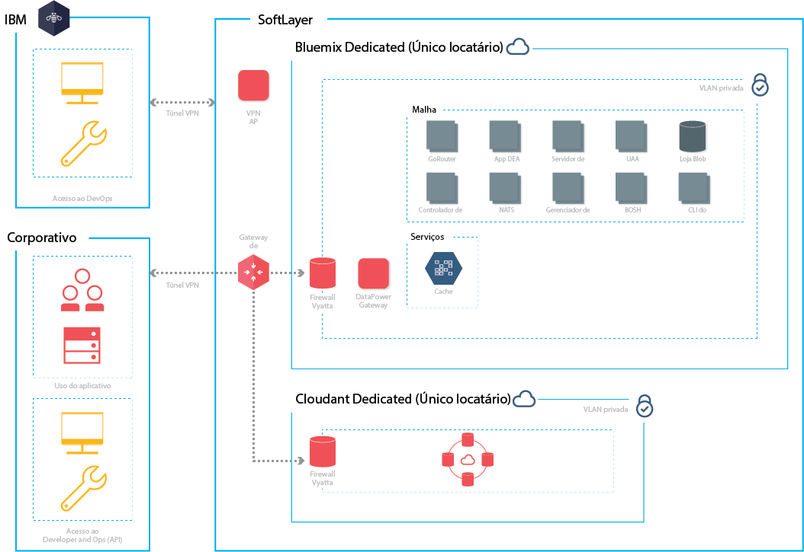

{:new_window: target="_blank"} 
{:shortdesc: .shortdesc}

#{{site.data.keyword.Bluemix_notm}} Dedicado
{: #dedicated}

*Última atualização: 20 de outubro de 2015* 

{{site.data.keyword.Bluemix}} é
uma plataforma de padrão aberto, baseada em nuvem para construir, executar e
gerenciar aplicativos. Com o
{{site.data.keyword.Bluemix_notm}} Dedicated, você obtém o
poder e a simplicidade do {{site.data.keyword.Bluemix_notm}}—
em seu próprio ambiente dedicado do SoftLayer que está firmemente
conectado ao ambiente do {{site.data.keyword.Bluemix_notm}} e
à sua própria rede.
{:shortdesc}

O {{site.data.keyword.Bluemix_notm}} Dedicated
inclui um catálogo particular que exibe os serviços dedicados que
estão disponíveis exclusivamente para você. Ele também inclui serviços adicionais
que são organizados e estão disponíveis para uso a partir do {{site.data.keyword.Bluemix_notm}} Public.

O {{site.data.keyword.Bluemix_notm}} Dedicated é
desenvolvido em SoftLayer para que você tenha o maior desempenho da
infraestrutura de nuvem disponível. Cada datacenter possui segurança de 24 horas, 7 dias por semana e
controles rigorosos. Você e a IBM acessam a instância do
{{site.data.keyword.Bluemix_notm}} Dedicated usando um
túnel VPN e uma VLAN privada.

*Figura 1. Diagrama detalhado do
{{site.data.keyword.Bluemix_notm}}
Dedicated*

Ambientes do {{site.data.keyword.Bluemix_notm}} Dedicated
possuem as mesmas normas de segurança que as do {{site.data.keyword.Bluemix_notm}} público
em termos de segurança de infraestrutura, operacional e física. No entanto,
o acesso do desenvolvedor ao {{site.data.keyword.Bluemix_notm}} dedicado é
controlado por suas políticas de LDAP, que podem ser configuradas pela equipe do {{site.data.keyword.Bluemix_notm}}
quando configuram seu ambiente. No ambiente dedicado,
é possível gerenciar funções e permissões do usuário. Consulte
[Gerenciando
usuários e permissões](../admin/index.html#oc_useradmin) para obter detalhes.

O {{site.data.keyword.Bluemix_notm}} Dedicated
vem com todos os tempos de execução do {{site.data.keyword.Bluemix_notm}} incluídos
e 128 GB de memória do aplicativo.

Além disso, há um conjunto de serviços incluídos por padrão e opcionais que você pode escolher para a sua instância dedicada. 

| **Tipo**        | **Nome**            | **Descrição** |      
|-----------------|-------------------|-------------------|
| Incluído | {{site.data.keyword.autoscaling}} | Aumentar ou diminuir dinamicamente a capacidade de
cálculo do aplicativo com base em políticas. Com esse serviço,
você possui uso ilimitado no ambiente do {{site.data.keyword.Bluemix_notm}}
Dedicated. |
| Incluído | {{site.data.keyword.datacshort}} | Esse serviço fornece uma grade de dados da memória
que suporta cenários de armazenamento em cache distribuído para seus apps. Inclui
50 GB de cache da memória. |
| Incluído | {{site.data.keyword.cloudant}} | Banco de dados NoSQL da IBM que fornece uma camada de dados JSON de alto desempenho (compatível com CouchDB). Inclui 1,6 TB e até 3.000 solicitações de API por segundo. |
| Opcional | {{site.data.keyword.sqldb}} | O IBM
{{site.data.keyword.sqldbfull}} Database for
{{site.data.keyword.Bluemix_notm}} inclui um banco de dados relacional totalmente provisionado para seu aplicativo.. O
{{site.data.keyword.sqldb}} fornece um banco de dados gerenciado para manipular as exigentes cargas de trabalho transacionais e da web dos seus negócios. |
| Opcional | {{site.data.keyword.mql}} | O IBM
{{site.data.keyword.mqlfull}} for
{{site.data.keyword.Bluemix_notm}} é um serviço de sistema de
mensagens baseado em nuvem que fornece mensagens flexíveis e fáceis
de usar para apps {{site.data.keyword.Bluemix_notm}}. O
{{site.data.keyword.mql}} fornece uma solução fácil de administrar para sistema de mensagens. É
possível usar o {{site.data.keyword.mql}} para tornar os seus apps mais responsivos e escaláveis e compartilhar e transferir trabalho entre apps com uma API única e poderosa. |
| Opcional | {{site.data.keyword.dashdbshort}} | Use dashDB para armazenar dados relacionais, incluindo tipos especiais como dados geoespaciais. Depois, analise esses dados com SQL ou análise integrada avançada como análise preditiva e mineração de dados, análise com R e análise geo-espacial. |

*Tabela 1. Serviços dedicados*

##Configurando o {{site.data.keyword.Bluemix_notm}} Dedicated
{: #setupdedicated}

O {{site.data.keyword.Bluemix_notm}} Dedicated
foi projetado para fornecer uma versão privada da oferta {{site.data.keyword.Bluemix_notm}}
Public. É possível usar os serviços e tempos de execução do
{{site.data.keyword.Bluemix_notm}} para suportar suas
necessidades computacionais em uma conta do SoftLayer hospedada pela IBM.

A IBM fornece acesso ao
{{site.data.keyword.Bluemix_notm}} Dedicated usando um login
protegido por senha. É possível acessar os serviços, os tempos de execução
e os recursos associados e implementar e remover apps do {{site.data.keyword.Bluemix_notm}}. A
IBM usufrui das vantagens de vários locais do SoftLayer para entregar o {{site.data.keyword.Bluemix_notm}} Dedicated, para que você tenha sua versão privada em um local perto.

Para configurar sua versão privada do {{site.data.keyword.Bluemix_notm}}:

<ol>
<li>Entre em contato com o representante de conta da IBM ou entre em
contato com o
<a href="https://console.ng.bluemix.net/?direct=classic/#/contactUs/cloudOEPaneId=contactUs" target="_blank">{{site.data.keyword.Bluemix_notm}}</a>
para começar.</li>
<li>A taxa de recorrência mensal baseia-se nos serviços
dedicados que você desejar usar, mais uma assinatura de todos os serviços públicos do
{{site.data.keyword.Bluemix_notm}}. Em seguida, você receberá uma fatura para tudo o que usar além
desse contrato de assinatura.
	<ol type="a">
	<li>Trabalhe com a IBM com relação à taxa de sua instância do {{site.data.keyword.Bluemix_notm}} Dedicated.
	A taxa de recorrência mensal baseia-se nos serviços
dedicados que você desejar usar, mais uma assinatura de todos os serviços públicos do
{{site.data.keyword.Bluemix_notm}}. Em seguida, você receberá uma fatura para tudo o que usar além
desse contrato de assinatura.</li>
	<li>Identifique os prazos finais de cada fase de configuração
da instância do {{site.data.keyword.Bluemix_notm}} Dedicated.</li>
	</ol>
	</li>
<li>Selecione o <a href="http://www.softlayer.com/data-centers" target="_blank">local do datacenter do SoftLayer</a> para a instância dedicada. Em seguida, sua plataforma e conta dedicadas
são criadas. Para a conta, identifique as pessoas de sua organização
para as funções que são necessárias para tornar a instância dedicada
operacional. Para cada função, há um representante IBM correspondente. 

Funções do cliente:

<dl>
<dt>**Focal em compras**</dt>
<dd>Trabalha com o representante IBM no estabelecimento do
ambiente do {{site.data.keyword.Bluemix_notm}} Dedicated, incluindo a identificação das pessoas certas em sua organização para trabalhar em qualquer aspecto do projeto. 
Essa função supervisiona a seleção padrão, acordos comerciais e a
disposição de acesso aos recursos do cliente. O focal em compras é o
contato geral para configurar a instância dedicada.</dd>
<dt>**Executivo de conformidade**</dt>
<dd>Trabalha com o representante IBM para selecionar uma opção de topologia e de implementação que atenda aos requisitos de segurança. 
Essa função trabalha com o consultor de conformidade IBM para
determinar quais padrões de implementação alcançam as metas de
conformidade e objetivos.</dd>
<dt>**Especialista em rede**</dt>
<dd>Trabalha com o representante IBM nos planos de rede para a
implementação do {{site.data.keyword.Bluemix_notm}}. Essa função fornece os requisitos para o representante IBM e trabalha junto em um plano de implementação. 
No final da fase de instalação e verificação, esta função será "sign
off", quando a configuração da rede está em conformidade com os
padrões corporativos.</dd>
<dt>**DevOps focal**</dt>
<dd>Trabalha com o representante IBM para planejar e aplicar as
atualizações de manutenção que são necessárias para a plataforma,
serviços e tempos de execução do
{{site.data.keyword.Bluemix_notm}}. Essa função também
trabalha com o representante IBM na configuração de sua instância do {{site.data.keyword.Bluemix_notm}} Dedicated.</dd>
</dl>

Funções IBM:

<dl>
<dt>**Gerenciador de fornecimento IBM**</dt>
<dd>Trabalha com o focal de compra do cliente para estabelecer o
ambiente de cliente. </dd>
<dt>**Consultor de conformidade IBM**</dt>
<dd>Trabalha com o executivo de conformidade do cliente para
selecionar uma opção de topologia e implementação que atenda aos
requisitos de segurança.</dd>
<dt>**Especialista em rede IBM**</dt>
<dd>Trabalha com o especialista da rede do cliente para estabelecer
os planos de rede para a implementação. Essa função trabalha com o
cliente para coletar requisitos e criar um plano de implementação. 
Essa função também executa testes automatizados para verificar o
resultado físico do plano de implementação.</dd>	
<dt>**Focal IBM DevOps**</dt>
<dd>Trabalha com o focal DevOps do cliente na instalação e manutenção
contínua do topologia de implementação. Essa função trabalha com o
cliente para planejar e executar as atualizações necessárias para a
plataforma e serviços.</dd>
</dl>
</li>
<li>Defina e estabeleça conectividade de rede entre a
rede corporativa e a instância do {{site.data.keyword.Bluemix_notm}}
Dedicated.
	<ol type="a">
	<li>A IBM instala a infraestrutura de
monitoramento e segurança da instância dedicada.</li>
	<li>A IBM instala os serviços dedicados de único locatário selecionados.</li>
	<li>Você fornece configuração de rede e terminais para
coisas como endereços IP ou firewalls e acesso ao LDAP para
integração ao {{site.data.keyword.Bluemix_notm}}.</li>
	</ol>
</li>
<li>Identifique e designe funções para sua equipe administrativa
do ambiente.
	<ol type="a">
	<li>A IBM configura o acesso à rede e LDAP baseado no que foi
fornecido. É fornecido
acesso administrativo aos contatos designados. Deve-se também
designar um contato para suporte e faturamento.</li>
	<li>A IBM configura um catálogo organizado em seu ambiente dedicado
para mostrar os serviços dedicados e vários dos serviços públicos do
{{site.data.keyword.Bluemix_notm}}.</li>
	<li>Você valida a configuração de rede e de firewall,
do terminal LDAP, e acessa.</li>
	</ol>
</li>
</ol>

##Mantendo sua instância dedicada
{: #maintaindedicated}

A IBM mantém e instala atualizações e correções conforme
julga adequado para a plataforma, tempos de execução e serviços do {{site.data.keyword.Bluemix_notm}} Dedicated.

**Importante**: A IBM se reserva o direito
de interromper os serviços para aplicar manutenção emergencial,
conforme necessário. A IBM pode mudar os horários de manutenção planejados, mas o notificará sobre essas mudanças, bem como sobre quaisquer informações de manutenção emergencial.

Os tipos de
manutenção a seguir são necessários para o {{site.data.keyword.Bluemix_notm}} Dedicated:
<dl>
<dt>**Janelas de manutenção padrão**</dt>
<dd>Os serviços utilizam janelas de manutenção predefinidas padrão, o
que pode fazer com que os serviços fiquem indisponíveis. A IBM não
requer aprovação do cliente para executar manutenção, mas tenta
minimizar o impacto em seus serviços. 
 
A IBM envia mensagens transmitidas das mudanças que estão planejadas para cada janela de manutenção, por meio de email, telefone ou outros métodos. 
 
**Importante**: Algum serviço pode não ficar
disponível durante o período de manutenção.</dd>

<dt>**Janela de mudança mensal**</dt>
<dd>A janela de manutenção mensal é aplicada com base na coordenação
entre você e a IBM em uma janela de 21 dias. É possível fornecer à
IBM datas ou horas específicas dentro da janela de 21 dias, o que
pode não funcionar para você. A IBM tenta planejar atualizações
nesses momentos. Com base nas solicitações, a IBM comunica a janela
de manutenção planejada para você. Não se espera que as janelas de
mudança mensal causem impacto no ambiente do Bluemix Dedicated em
execução. 
 
**Nota:** Se você não solicita um momento específico
para a atualização, a manutenção é aplicada automaticamente no final
da janela.  
 
Acesse **ADMINISTRAÇÃO > INFORMAÇÕES DO SISTEMA**
para visualizar atualizações pendentes, configurar datas
indisponíveis e aprovar atualizações. Para obter mais informações
sobre notificações e planejamento de atualizações pendentes, consulte
<a href="../admin/index.html#oc_system">Visualizando informações do
sistema</a>.</dd>
	
<dt>**Outro**</dt>
<dd>A IBM pretende limitar toda a manutenção que possa afetar seus
serviços, especialmente a disponibilidade de seu
ambiente, tempos de execução
e serviços do {{site.data.keyword.Bluemix_notm}}
Dedicated para as atualizações padrão e mensal. Outras janelas de mudança podem ser usadas, excepcionalmente, para gerenciamento
do ambiente. A IBM fará esforços razoáveis para minimizar o impacto a você durante essas janelas de mudança e você será notificado com antecedência.</dd>
</dl>

Para configurar a manutenção de sua instância dedicada, trabalhe com seu representante de conta designado pela IBM para identificar uma janela acordada para a manutenção padrão.
