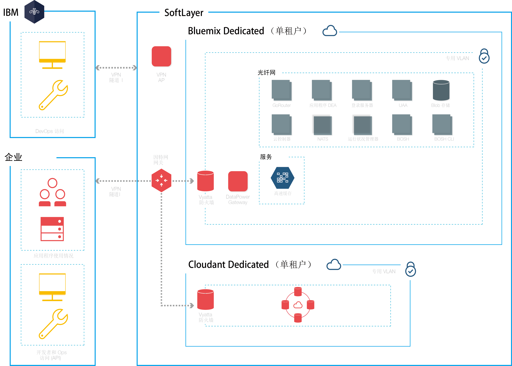

{:new_window: target="_blank"} 
{:shortdesc: .shortdesc}

#{{site.data.keyword.Bluemix_notm}} Dedicated
{: #dedicated}

*上次更新时间：2015 年 11 月 3 日*

{{site.data.keyword.Bluemix}} 是一种基于云的开放标准平台，用于构建、运行和管理应用程序。通过 {{site.data.keyword.Bluemix_notm}} Dedicated，您可以享受到 {{site.data.keyword.Bluemix_notm}} 为您提供的强大功能和简便性，也就是在您自己的专用 SoftLayer 环境中进行操作，该环境以安全方式连接到 {{site.data.keyword.Bluemix_notm}} Public 环境以及您自己的网络。{:shortdesc}

{{site.data.keyword.Bluemix_notm}} Dedicated 包含专用目录，其中显示只供您使用的专用服务。此外，还包含从 {{site.data.keyword.Bluemix_notm}} Public 联合的其他服务，供您使用。

{{site.data.keyword.Bluemix_notm}} Dedicated 基于 SoftLayer 构建，可为您提供性能最佳的云基础架构。每个数据中心都采用严格的全天候安全控制。您和 IBM 可通过 VPN 隧道以及专用 VLAN 来访问您的 {{site.data.keyword.Bluemix_notm}} 专用实例。

*图 1. {{site.data.keyword.Bluemix_notm}} Dedicated 详图*

{{site.data.keyword.Bluemix_notm}} Dedicated 环境在基础架构、操作和物理安全方面所采用的安全标准与公共 {{site.data.keyword.Bluemix_notm}} 相同。但是，开发者对专用 {{site.data.keyword.Bluemix_notm}} 的访问由 LDAP 策略进行控制，这些策略可以由 {{site.data.keyword.Bluemix_notm}} 团队在设置您的环境时进行配置。在该专用环境中，您可以管理用户角色和许可权。有关详细信息，请参阅[管理用户和许可权](../admin/index.html#oc_useradmin)。

{{site.data.keyword.Bluemix_notm}} Dedicated 随附所有内含的 {{site.data.keyword.Bluemix_notm}} 运行时和 128 GB 应用程序内存。

此外，还有一组内含的服务（缺省）以及可为专用实例选择的可选服务。 

| **类型**        | **名称**            | **描述** |      
|-----------------|-------------------|-------------------|
| 内含 | {{site.data.keyword.autoscaling}} | 根据策略，动态增大或减小应用程序的计算容量。通过此服务，您在 {{site.data.keyword.Bluemix_notm}} Dedicated 环境中的使用不受限制。 |
| 内含 | {{site.data.keyword.datacshort}} | 此服务提供内存中数据网格，支持应用程序使用分布式高速缓存方案。包含 50 GB 内存中高速缓存。 |
| 内含 | {{site.data.keyword.cloudant}} | IBM 的非关系型数据库，用于提供高性能 JSON 数据层（与 CouchDB 兼容）。包含 1.6 TB，且每秒最多处理 3,000 个 API 请求。 |
| 可选 | {{site.data.keyword.sqldb}} | IBM {{site.data.keyword.sqldbfull}} Database for {{site.data.keyword.Bluemix_notm}} 会将完整配置的关系数据库添加到您的应用程序。{{site.data.keyword.sqldb}} 提供受管数据库来处理您业务上要求不断提高的 Web 和事务工作负载。 |
| 可选 | {{site.data.keyword.mql}} | IBM {{site.data.keyword.mqlfull}} for {{site.data.keyword.Bluemix_notm}} 是基于云的消息传递服务，其针对 {{site.data.keyword.Bluemix_notm}} 应用程序提供灵活且易于使用的消息传递。{{site.data.keyword.mql}} 提供无需太多管理工作的消息传递解决方案。您可以使用 {{site.data.keyword.mql}} 来提高应用程序的响应性和可扩展性，通过一个简单且强大的 API 在应用程序之间分担和卸下工作负载。 |
| 可选 | {{site.data.keyword.dashdbshort}} | 使用 dashDB 可存储关系数据，包括特殊类型的数据（例如地理空间数据）。然后，使用 SQL 或高级内置分析（例如预测性分析和数据挖掘、使用 R 的分析以及地理空间分析）来分析该数据。 |

*表 1. 专用服务*

##设置 {{site.data.keyword.Bluemix_notm}} Dedicated
{: #setupdedicated}

{{site.data.keyword.Bluemix_notm}} Dedicated 的设计宗旨是提供专用版本的 {{site.data.keyword.Bluemix_notm}} Public 产品。您可以通过 IBM 托管的 SoftLayer 帐户，使用 {{site.data.keyword.Bluemix_notm}} 服务和运行时来满足计算需求。

IBM 为您提供了使用受密码保护的登录来访问 {{site.data.keyword.Bluemix_notm}} Dedicated 的方式。您可以访问服务、运行时和关联的资源，还可以部署和除去 {{site.data.keyword.Bluemix_notm}} 应用程序。IBM 利用多个 SoftLayer 位置来交付 {{site.data.keyword.Bluemix_notm}} Dedicated，因此您可以通过就近的位置来获取您的专用版本。

要设置专用版本的 {{site.data.keyword.Bluemix_notm}}，请执行以下操作：

<ol>
<li>首先联系 IBM 指定的客户代表或联系 <a href="https://console.ng.bluemix.net/?direct=classic/#/contactUs/cloudOEPaneId=contactUs" target="_blank">{{site.data.keyword.Bluemix_notm}}</a>。</li>
<li>每月的经常性费用基于要使用的专用服务以及对所有 {{site.data.keyword.Bluemix_notm}} Public 服务的预订。对于超出预订协议范围的任何费用，您会收到相应发票。<ol type="a">
	<li>与 IBM 一起设置您的 {{site.data.keyword.Bluemix_notm}} Dedicated 实例，费用由您支付。	每月的经常性费用基于要使用的专用服务以及对所有 {{site.data.keyword.Bluemix_notm}} Public 服务的预订。对于超出预订协议范围的任何费用，您会收到相应发票。</li>
	<li>为设置 {{site.data.keyword.Bluemix_notm}} Dedicated 实例的每个阶段确定截止期限。</li>
	</ol>
	</li>
<li>为专用实例选择 <a href="http://www.softlayer.com/data-centers" target="_blank">SoftLayer 数据中心位置</a>。然后，创建专用平台和帐户。针对您的帐户，为组织中需要启动并运行专用实例的角色确定相应人员。 
 
<dl>
<dt>**采购联系人**</dt>
<dd>与 IBM 代表一起建立 {{site.data.keyword.Bluemix_notm}} Dedicated 环境，包括确定组织中负责项目各个方面的相应人员。此角色监管模式选择、商业安排以及安排对客户资源的访问。采购联系人是设置专用实例的总联系人。</dd>
<dt>**合规管理人员**</dt>
<dd>与 IBM 代表一起选择符合您安全需求的拓扑和部署选项。此角色与 IBM 合规顾问一起确定哪些部署模式可达到合规目标。</dd>
<dt>**网络专员**</dt>
<dd>与 IBM 代表一起制定用于 {{site.data.keyword.Bluemix_notm}} 部署的网络计划。此角色向 IBM 代表提出要求，与 IBM 代表一起制定实施计划。安装和验证阶段结束后，此角色将进行“签核”，证明网络配置达到公司标准。</dd>
<dt>**DevOps 联系人**</dt>
<dd>与 IBM 代表一起规划和应用 {{site.data.keyword.Bluemix_notm}} 平台、服务和运行时所需的维护更新。此角色还与 IBM 代表一起配置 {{site.data.keyword.Bluemix_notm}} Dedicated 实例。</dd>
</dl>
</li>
<li>定义并建立企业网络与 {{site.data.keyword.Bluemix_notm}} Dedicated 实例之间的网络连接。<ol type="a">
	<li>IBM 为专用实例安装监视和安全基础架构。</li>
	<li>IBM 安装您所选的单租户专用服务。</li>
	<li>您提供网络配置和端点（IP 地址或防火墙等）以及对 LDAP 的访问权（以便集成到 {{site.data.keyword.Bluemix_notm}} 中）。</li>
	</ol>
</li>
<li>为您的环境管理团队确定并分配角色。<ol type="a">
	<li>IBM 根据您提供的信息配置网络访问和 LDAP。为您指定的联系人授予管理访问权。还必须指定一名联系人来负责记帐和提供相应支持。</li>
	<li>IBM 在您的专用环境中设置联合目录，用于显示您的专用服务以及许多公共 {{site.data.keyword.Bluemix_notm}} 服务。</li>
	<li>您验证网络和防火墙配置以及 LDAP 端点和访问权。</li>
	</ol>
</li>
</ol>

##维护专用实例
{: #maintaindedicated}

IBM 会在 IBM 认为适当的时候，为 {{site.data.keyword.Bluemix_notm}} Dedicated 平台、运行时以及服务维护和安装更新与修订。

**重要信息**：IBM 保留在必要时中断服务来实施紧急维护的权利。IBM 可能会更改所安排的维护时间，但会通知您任何此类更改以及任何紧急维护信息。

{{site.data.keyword.Bluemix_notm}} Dedicated 需要以下类型的维护：
<dl>
<dt>**标准维护时段**</dt>
<dd>服务会利用预定义的标准维护时段，而这可能会导致服务不可用。IBM 无需客户批准就能执行维护，在执行维护时 IBM 会尝试尽可能减小对您服务的影响。 
 
IBM 会通过电子邮件、电话或其他方法来发送有关针对每个维护时段计划进行哪些更改的广播报文。 
 
**重要信息**：在维护期间，某个服务可能不可用。</dd>

<dt>**每月更改时段**</dt>
<dd>每月维护时段根据您与 IBM 的协商在 21 天时段中进行选择。您可以向 IBM 提供这 21 天时段中可能不适合您的具体日期或时间。IBM 会尝试基于这些时间来安排更新。根据请求，IBM 会向您发送安排的维护时段。每月更改时段应该不会影响运行中的 Bluemix Dedicated 环境。 
 
**注：**如果未请求更新的具体时间，那么维护会自动在时段结束时应用。 
 
转至**管理 > 系统信息**以查看暂挂的更新，设置不可用的日期以及批准更新。有关通知和安排暂挂更新的更多信息，请参阅<a href="../admin/index.html#oc_system">查看系统信息</a>。</dd>
	
<dt>**其他**</dt>
<dd>IBM 想要将可能会影响您的服务（尤其是影响 {{site.data.keyword.Bluemix_notm}} Dedicated 环境、运行时和服务的可用性）的所有维护限定在标准更新和每月更新范围内。对于例外情况，可能会使用其他更改时段来管理环境。在此类更改时段内，IBM 会通过合理的努力尽量不影响您，并会提前通知您。</dd>
</dl>

要为专用实例设置维护，请与 IBM 指定的客户代表一起商定标准维护时段。

##复原专用实例
{: #restorededicated}

系统会定期备份 {{site.data.keyword.Bluemix_notm}} Dedicated 设置和配置，以做好准备来应对环境中的任何意外中断。

在备份您的数据过程中，IBM 会完成以下任务：

<ul>
<li>加密所有备份副本并管理加密密钥</li>
<li>监视并管理备份活动</li>
<li>提供加密的备份文件</li>
<li>复原所请求的数据</li>
<li>管理备份和修订管理操作之间的计划冲突</li>
</ul>

由于保护专用数据至关重要，因此 IBM 在处理备份文件管理时需要您的协作，以便不将文件移出您的数据中心。具体来说，IBM 会要求您完成以下任务：

<ul>
<li>异地备份一份您的加密备份数据，与您所管理的任何其他备份数据的处理方法一样。</li>
<li>向 IBM 操作员提供备份文件，以防万一有任何需要复原的情况。</li>
</ul>

# 相关链接
## 常规 
* [Discover: {{site.data.keyword.Bluemix_notm}} Dedicated](http://www.ibm.com/cloud-computing/bluemix/hybrid/dedicated/)
