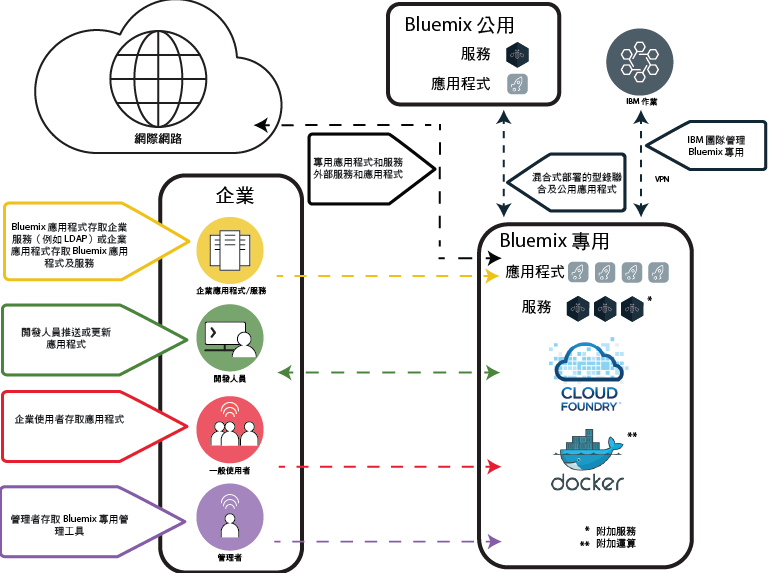

---

copyright:

  years: 2015, 2017

lastupdated: "2017-05-03"

---

{:shortdesc: .shortdesc}

# {{site.data.keyword.Bluemix_dedicated_notm}}
{: #dedicated}

{{site.data.keyword.Bluemix}} 是一種以雲端為基礎的開放標準平台，用於建置、執行及管理應用程式。使用 {{site.data.keyword.Bluemix_dedicated_notm}}，即可在您自己的專用 SoftLayer 環境中，使用強大而簡潔的 {{site.data.keyword.Bluemix_notm}}，而這個環境同時安全地連接至「{{site.data.keyword.Bluemix_notm}} 公用」環境和您自己的網路。
{:shortdesc}

{{site.data.keyword.Bluemix_notm}} 的所有專用部署都包括下列好處及特性，而且不需額外付費：VPN、專用虛擬區域網路 (VLAN)、防火牆、與 LDAP 的連線功能、運用現有內部部署資料庫及應用程式的能力、24 小時全年無休的現場安全防護、專用硬體及標準支援。

依預設，只能從組織網路進行專用 {{site.data.keyword.Bluemix_notm}} 實例的存取。例如，如果您需要直接從網際網路、行動裝置或專用資料庫存取 {{site.data.keyword.Bluemix_notm}} 環境，則需要使用其他網路安全元件並額外付費。

{{site.data.keyword.Bluemix_dedicated_notm}} 包含所有內含的 {{site.data.keyword.Bluemix_notm}} 運行環境，以及 64 GB 的運算資源記憶體。

此外，還會有一組內含或選購的服務及元件。請檢閱下表，以查看內含項目及可選購項目。

| **類型**        | **名稱**            | **說明** |
|-----------------|-------------------|-------------------|
|內含 | [{{site.data.keyword.Bluemix_notm}} 運行環境](/docs/cfapps/runtimes.html) | 使用運行環境可快速啟動並執行您的應用程式，而不需要設定及管理機器和作業系統。您可以在 {{site.data.keyword.Bluemix_dedicated_notm}} 實例中使用所有 {{site.data.keyword.Bluemix_notm}} 運行環境。|
| 內含 | [{{site.data.keyword.autoscaling}}](/docs/services/Auto-Scaling/index.html) | 根據原則，動態增加或減少應用程式的運算能力。使用此服務，即可在 {{site.data.keyword.Bluemix_dedicated_notm}} 環境中無限制地使用。附註：自動擴充目前僅與 Cloud Foundry 運行環境搭配使用 |
|選用 | [{{site.data.keyword.apiconnect_short}}](/docs/services/apiconnect/index.html) | {{site.data.keyword.apiconnect_long}} 將 {{site.data.keyword.APIM}} 及 IBM StrongLoop 整合成單一供應項目，提供綜合性解決方案來建立、執行、管理及強制執行 API 和微服務。 |
|選用 | [{{site.data.keyword.rules_short}}](/docs/services/rules/rules.html) | {{site.data.keyword.rules_short}} 提供綜合性環境，以自動化及執行經常發生且可重複的規則型商業決策。它也可降低 IT 技能需求，讓商業使用者或開發人員，快速建立決策模型並以較低的成本進行測試。 |
|選用 | [{{site.data.keyword.cloudant}}](/docs/services/Cloudant/index.html#Cloudant) | {{site.data.keyword.cloudant}} 提供對於始終處於開啟狀態之完整受管理 NoSQL JSON 資料層的存取。此服務與 CouchDB 相容，而且可透過方便使用的 HTTP 介面來存取，可用於行動及 Web 應用程式模型。 |
|選用 | [{{site.data.keyword.containershort}}](/docs/containers/container_index.html) | 在 {{site.data.keyword.Bluemix_dedicated_notm}} 上執行 Docker 容器。容器是虛擬軟體物件，其中包含應用程式執行所需的所有元素。容器具有資源隔離及配置的優點，而且比虛擬機器（舉例來說）更容易攜帶且更具效率。如需硬體需求的相關資訊，請參閱 [{{site.data.keyword.Bluemix_dedicated_notm}} 和 Bluemix 本端中的 IBM {{site.data.keyword.containershort}}](/docs/containers/container_ov.html#container_dl)。|
| 選用 | [{{site.data.keyword.contdelivery_short}}](/docs/services/ContinuousDelivery/index.html) | 使用「{{site.data.keyword.contdelivery_short}} 專用」來自動進行建置、單元測試、部署及其他作業。透過豐富的 Web 型 IDE 編輯及推送程式碼。建立工具鏈來啟用工具整合，以支援開發、部署及操作作業。 |
| 選用 | [{{site.data.keyword.dashdbshort}}](/docs/services/dashDB/dashDB.html) | IBM {{site.data.keyword.dashdbshort}} for Analytics 是完整受管理 SQL 雲端資料庫服務，最適合用於資料倉儲及分析工作負載。IBM {{site.data.keyword.dashdbshort}} for Transactions 是完整受管理 SQL 雲端資料庫服務，最適合用於一般用途、Web 應用程式及交易式工作負載。 |
| 選用 | [{{site.data.keyword.datacshort}}](/docs/services/DataCache/index.html#data_cache) | 此服務提供記憶體內的資料網格，它支援應用程式的分散式快取情境。包含 50 GB 的記憶體內快取。 |
| 選用 | [專用 GitHub Enterprise](/docs/services/ghededicated/index.html) | {{site.data.keyword.ghe_long}} 是 GitHub Enterprise 的 IBM Cloud 管理之完整受管理版本，可提供開發人員所喜歡的社交經驗。此服務目前專用於 {{site.data.keyword.Bluemix_dedicated_notm}} 環境。 |
| 選用（測試版） | [記載](/docs/monitoringandlogging/cfapps_ml_logs_dedicated_ov.html#container_ml_logs_dedicated_ov) | 在 {{site.data.keyword.Bluemix_notm}} 使用者介面中提供 Cloud Foundry 應用程式的日誌，並在 Kibana 中提供可搜尋的日誌和儀表板。 |
| 選用 | [{{site.data.keyword.messagehub}}](/docs/services/MessageHub/index.html#messagehub) | {{site.data.keyword.messagehub}} 是一個可擴充、分散式、高傳輸量訊息匯流排，以聯合您的內部部署與外部部署技術。{{site.data.keyword.messagehub}} 是以 Apache Kafka 為基礎，後者是一個快速、可擴充及可延續的即時傳訊引擎。 |
|選用 | [{{site.data.keyword.mobilepush}}](/docs/services/mobilepush/index.html) | {{site.data.keyword.mobilepush}} 是一種服務，可用來將通知傳送至 iOS 及 Android 裝置。可以將通知目標設為所有應用程式使用者或一組使用標籤的特定使用者和裝置。您可以管理裝置、標籤及訂閱。您也可以使用 SDK（軟體開發套件）及「具象狀態傳輸 (REST)」應用程式介面 (API) 來進一步開發用戶端應用程式。|
|選用 | [{{site.data.keyword.SecureGateway}}](/docs/services/SecureGateway/secure_gateway.html) | {{site.data.keyword.SecureGateway}} 服務使您能夠以安全的方式將 {{site.data.keyword.Bluemix_notm}} 應用程式連接至內部部署或雲端中的遠端位置。  |
|選用 | [{{site.data.keyword.sescashort}}](/docs/services/SessionCache/index.html#session_cache) | 為了提高備援，{{site.data.keyword.sescashort}} 會提供快取中所儲存階段作業的抄本。因此，電壓過低或作業中斷時，用戶端應用程式仍然保有快取中階段作業的存取權。此服務支援 Web 及行動應用程式的階段作業快取情境。 |
| 選用 | [{{site.data.keyword.iot_short}}](/docs/services/IoT/index.html) | 此服務可讓您的應用程式與已連接的裝置、感應器及閘道進行通訊，並且耗用這些項目所收集的資料。基本供應項目允許在專用環境內執行專用版本的 {{site.data.keyword.iot_short}}，其容量為 100,000 台同時連接的裝置或應用程式，以及 1.6 TB 的資料交換。 |
| 選用 | [{{site.data.keyword.appserver_short}}](/docs/services/ApplicationServeronCloud/index.html) | IBM {{site.data.keyword.appserver_short}} for IBM {{site.data.keyword.Bluemix_notm}} 是一項服務，可協助在 {{site.data.keyword.Bluemix_notm}} 的受管理雲端環境中快速設定預先配置的 {{site.data.keyword.appserver_short}} Liberty、Traditional Network Deployment 或 Traditional WebSphere Java EE 實例。 |
{: caption="表 1. 專用服務" caption-side="top"}
{: #table01}

您可以選購一些元件來擴充及延伸您的資源和服務容量。聯絡銷售團隊，即可購買所有這些元件；如需聯絡業務代表的相關資訊，請移至[與我們聯絡](https://console.ng.bluemix.net/?direct=classic/#/contactUs/cloudOEPaneId=contactUs)。若要增加服務的方案，您可以從型錄的服務磚選取方案。

| **名稱**            | **說明** |
|-------------------|-------------------|
|專用 {{site.data.keyword.apiconnect_short}} Professional 5 百萬個 API 呼叫 | 此環境允許在容量為每月 5 百萬個 API 呼叫的專用環境內，執行專用版本的 {{site.data.keyword.apiconnect_short}}，目標為部門的 API 專案。 |
|專用 {{site.data.keyword.apiconnect_short}} Professional 10 萬個 API 呼叫增加 | {{site.data.keyword.apiconnect_short}} Professional 環境的延伸，每月可提供 10 萬個 API 呼叫的額外容量。 |
|專用 {{site.data.keyword.apiconnect_short}} Enterprise 2500 萬個 API 呼叫 | 此環境允許在容量為每月 2500 萬個 API 呼叫的專用環境內，執行專用版本的 {{site.data.keyword.apiconnect_short}}，目標為整個企業的 API 專案。 |
|專用 {{site.data.keyword.apiconnect_short}} Enterprise 10 萬個 API 呼叫增加 | {{site.data.keyword.apiconnect_short}} Enterprise 環境的延伸，每月可提供 10 萬個 API 呼叫的額外容量。 |
|IBM {{site.data.keyword.Bluemix_dedicated_notm}} {{site.data.keyword.rules_short}} 1 百萬個規則決策 | 「規則決策」為從規則執行伺服器呼叫規則集所產生的結果。必須取得足夠的授權，才能涵蓋在計費期間執行或處理的「規則決策」總數（四捨五入至最接近的百萬位數）。此「雲端服務」所測量的「規則決策」是對規則執行伺服器進行以取得決策的呼叫。「雲端服務」的專用部署具有經過協議的容量，且是按照相關費用度量值來測量。{{site.data.keyword.Bluemix_dedicated_notm}} 平台上的 {{site.data.keyword.rules_short}} 服務預設空間配置是 16 GB，在其中，可以呼叫最多十個各 1 GB 的實例來執行授與的「規則決策」。如果您超出該使用限制，則必須購買額外的容量來涵蓋這項使用。 |
|專用 {{site.data.keyword.cloudant}} 1.6 TB 容量增加 | 包括在設計容量為 1.6 TB 的專用環境內，執行專用版本的 {{site.data.keyword.cloudantfull}}。  |
|專用 {{site.data.keyword.datacshort}} 及 {{site.data.keyword.sescashort}} 50 GB 容量增加 | 此環境允許部署及執行 {{site.data.keyword.datacshort}} 和 {{site.data.keyword.sescashort}} 實例，最多有 50 GB 的累積容量。 |
|{{site.data.keyword.contdelivery_short}} 專用實例 | 在專用環境內執行的 {{site.data.keyword.contdelivery_short}} 的專用版本。容量取決於「{{site.data.keyword.contdelivery_short}} 專用授權使用者」授權。 |
|{{site.data.keyword.contdelivery_short}} 專用授權使用者 | 將「授權使用者」存取權授與所指定的「{{site.data.keyword.contdelivery_short}} 專用」環境，以及用於該環境。必須授權每位屬於 {{site.data.keyword.Bluemix_notm}}「組織」的使用者，而這個組織包含 {{site.data.keyword.contdelivery_short}} 服務實例。 |
|專用 {{site.data.keyword.dashdbshort}} 企業 64.1 | 在具有 64 GB RAM 及 16 個 vCPU 的專用伺服器上，每個服務實例一個資料庫。建議最多使用 1 TB 預載資料（以一般壓縮為依據）。  |
|專用 {{site.data.keyword.dashdbshort}} 企業 256.4 | 在具有 256 GB RAM 及 32 個核心的專用裸機伺服器上，每個服務實例一個資料庫。建議最多使用 4 TB 預載資料（以一般壓縮為依據）。 |
|專用 {{site.data.keyword.dashdbshort}} 企業 256.12  | 在具有 256 GB RAM 及 32 個核心的專用裸機伺服器上，每個服務實例一個資料庫。建議最多使用 12 TB 預載資料（以一般壓縮為依據）。此儲存空間密集方案適合資料量較高且查詢不需要以記憶體內速度執行的環境。 |
|IBM {{site.data.keyword.Bluemix_dedicated_notm}} {{site.data.keyword.dashdbshort}} Enterprise for Transactions 2.8.500 | 支援「線上交易處理 (OLTP)」工作負載的專用實例，具有 8GB RAM 及 500 GB 空間來放置資料及日誌。 |
|IBM {{site.data.keyword.Bluemix_dedicated_notm}} {{site.data.keyword.dashdbshort}} Enterprise for Transactions 12.128.1400 | 支援「線上交易處理 (OLTP)」工作負載的專用實例，具有 128GB RAM 及 1.4 TB SSD 儲存空間來放置資料及日誌。 |
|IBM {{site.data.keyword.Bluemix_dedicated_notm}} {{site.data.keyword.dashdbshort}} Enterprise for Transactions High Availability 2.8.500 | 支援「線上交易處理 (OLTP)」工作負載的專用實例，具有 8GB RAM 及 500 GB 空間來放置資料及日誌，並且包括一部額外的「待命」伺服器來取得高可用性。 |
|IBM {{site.data.keyword.Bluemix_dedicated_notm}} {{site.data.keyword.dashdbshort}} Enterprise for Transactions High Availability 12.128.1400 | 支援「線上交易處理 (OLTP)」工作負載的專用實例，具有 128GB RAM 及 1.4 TB SSD 儲存空間來放置資料及日誌，並且包括一部額外的「待命」伺服器來取得高可用性。 |
|{{site.data.keyword.Bluemix_dedicated_notm}} 社群服務  | 此環境允許部署及執行社群服務，每一個社群服務最多有 50 個實例。  |
|{{site.data.keyword.Bluemix_dedicated_notm}} {{site.data.keyword.cloudant}} 叢集實例 | 此選用元件包括您負責提供基礎架構的 3 節點叢集，以及儲存空間及運算容量（您可以根據您的特定需要來決定）。{{site.data.keyword.cloudant}} 提供對於始終處於開啟狀態之完整受管理 NoSQL JSON 資料層的存取。此服務與 CouchDB 相容，而且可透過方便使用的 HTTP 介面來存取，可用於行動及 Web 應用程式模型。 |
|IBM {{site.data.keyword.Bluemix_dedicated_notm}} {{site.data.keyword.messagehub}} | 提供發佈/訂閱傳訊的環境，每個分割區可提供高達 10 GB 的傳訊，限制為 100 個分割區。 |
|IBM Bluemix 專用 {{site.data.keyword.mobilepushshort}} | 此環境允許部署及執行每秒可接受 300 個要求的 {{site.data.keyword.mobilepushshort}} 實例。 |
|{{site.data.keyword.iot_short}} 專用漸進式增加 | 此環境增加允許在專用環境內執行專用版本的 {{site.data.keyword.iot_short}}，其容量為 100,000 台同時連接的裝置或應用程式，以及 0.5 TB 的資料交換。 |
|IBM {{site.data.keyword.appserver_short}} for {{site.data.keyword.Bluemix_notm}} - 專用小型| {{site.data.keyword.Bluemix_notm}} 的受管理雲端環境中的預先配置 {{site.data.keyword.appserver_short}} Liberty、Traditional Network Deployment 或 Traditional WebSphere Java EE 實例，每個月有 64 個 vCore、128GB RAM 及 1TB HDD。 |
|IBM {{site.data.keyword.appserver_short}} for {{site.data.keyword.Bluemix_notm}} - 專用中型| {{site.data.keyword.Bluemix_notm}} 的受管理雲端環境中的預先配置 {{site.data.keyword.appserver_short}} Liberty、Traditional Network Deployment 或 Traditional WebSphere Java EE 實例，每個月有 128 個 vCore、256GB RAM 及 2TB HDD。 |
|IBM {{site.data.keyword.appserver_short}} for {{site.data.keyword.Bluemix_notm}} - 專用大型| {{site.data.keyword.Bluemix_notm}} 的受管理雲端環境中的預先配置 {{site.data.keyword.appserver_short}} Liberty、Traditional Network Deployment 或 Traditional WebSphere Java EE 實例，每個月有 256 個 vCore、512GB RAM 及 4TB HDD。 |
|IBM {{site.data.keyword.appserver_short}} for {{site.data.keyword.Bluemix_notm}} - 專用| {{site.data.keyword.Bluemix_notm}} 的受管理雲端環境中的預先配置 {{site.data.keyword.appserver_short}} Liberty、Traditional Network Deployment 或 Traditional WebSphere Java EE 實例，每個月有「HDD 擴充」及 1TB。 |
{: caption="表 2. 選購性服務元件" caption-side="top"}
{: #table02}

| **名稱**            | **說明** |
|-------------------|-------------------|
|專用運行環境 16 GB 容量增加  | 延伸運行環境，以提供額外的 16 GB 運行環境容量。 |
|專用直接鏈結 1 Gbps 容量 | 直接連接至針對資料傳送所設計的適當 {{site.data.keyword.BluSoftlayer}} 網路存在點的專用網路鏈結，最高 1 Gbps。 |
|專用直接鏈結 10 Gbps 容量 | 直接連接至針對資料傳送所設計的適當 {{site.data.keyword.BluSoftlayer}} 網路存在點的專用網路鏈結，最高 10 Gbps。 |
|IBM Bluemix 專用硬體防火牆 - 高可用性 | 備用的 1 Gbps 硬體防火牆，配置來保護「專用」環境內相同 VLAN 上的單一、多台或所有伺服器。 |
{: caption="表 3. 選購性平台附加程式元件" caption-side="top"}
{: #table03}

**附註**：{{site.data.keyword.Bluemix_dedicated_notm}} 元件可能會指出特定的已配置容量（例如 GB 數或每秒交易數）。因為任何雲端服務配置的實際容量實際上會因許多因素而不同，所以實際容量實際上可能會高於或低於已配置的容量。

### 聯合型錄
{: #catalogdedicated}

{{site.data.keyword.Bluemix_dedicated_notm}} 包括一份專用型錄，將公用、專用及本端部署的核准服務組織在一起。您甚至可以透過 {{site.data.keyword.Bluemix_notm}} 型錄發佈及管理專屬服務的存取權。您可以選擇根據資料隱私及安全準則來決定符合商業需求的公用服務。

如果有適用於您專用環境的服務專用實例，則會在型錄中看到服務名稱含有「專用」標籤。同樣地，如果它是自訂服務（表示您已使用服務分配管理系統來建立它），則會看到服務名稱列有「自訂」。透過從「{{site.data.keyword.Bluemix_notm}} 公用」進行聯合，可以使用已列出且沒有「專用」或「自訂」標籤的所有其他服務。聯合服務提供建立包含公用及專用服務之混合式應用程式的功能。

|服務	|可在美國南部地區使用	|可在歐洲英國地區使用 |可在澳洲雪梨地區使用|
|:----------|:------------------------------|:------------------|:------------------|
|{{site.data.keyword.alchemyapishort}} 		|是	   	|是  		|是|
|{{site.data.keyword.alertnotificationshort}}	|是		|是		|是	|
|{{site.data.keyword.apiconnect_short}}         |是            |是            |是  |
|{{site.data.keyword.appseccloudshort}}		|是		|是		|是 |
|{{site.data.keyword.apiconnect_short}} 	|是   	 	|是  	 	|是   |
|Automated Accessibility Checker |是       |是    |是   |
|{{site.data.keyword.rules_short}}		|是		|是		|是 |
|{{site.data.keyword.cloudant}}			|是		|是		|是 |
|{{site.data.keyword.iotmapinsights_short}}    |是  |是  |是  |
|{{site.data.keyword.conversationshort}}  |是  |是  |是  |
|{{site.data.keyword.dashdbshort}}		|是		|是		|是 |
|{{site.data.keyword.dataworks_short}}		|是		|是		|否|
|{{site.data.keyword.DB2OnCloud_short}}		|是		|是		|是 |
|Digital Content Checker |是  |是  |是  |
|{{site.data.keyword.documentconversionshort}}	|是		|是		|是|
|{{site.data.keyword.iotdriverinsights_short}}  |是 |是  |是  |
|{{site.data.keyword.geospatialshort_Geospatial}}	|是	|是		|是 |
|{{site.data.keyword.GlobalizationPipeline_short}}	|是		| 是		| 是 |
|{{site.data.keyword.identitymixershort}}		|是		|是		|是|
|{{site.data.keyword.iot4auto_short}} |是   |是  |是  |
|{{site.data.keyword.iotelectronics}}  |是  |是  |否 |
|{{site.data.keyword.iotinsurance_short}} |否   |否   |是  |
|{{site.data.keyword.twittershort}}		|是		|是		|是|
|{{site.data.keyword.languagetranslationshort}}	|是		|是		|是 |
|{{site.data.keyword.languagetranslatorshort}} |是  |是  |是  |
|{{site.data.keyword.dwl_short}}  |是  |是  |否  |
|{{site.data.keyword.eventhubshort}}		|是		|否		|否|
|{{site.data.keyword.messagehub}}		|是		|是		|否|
|{{site.data.keyword.manda}}			|是		|是		|是 |
|{{site.data.keyword.amashort}}			|是		|是		|是 |
|{{site.data.keyword.mqa}}			|是		|是		|是 |
|{{site.data.keyword.mql}}			|否		|否		|是 |
|{{site.data.keyword.nlclassifierlshort}} 	|是 		|是 		|是|
|{{site.data.keyword.personalityinsightsshort}}	|是		|是		|是|
|{{site.data.keyword.pm_short}}			|是		|是		|否 |
|{{site.data.keyword.mobilepush}}		|是		|是		|是 |
|{{site.data.keyword.retrieveandrankshort}}	|是 		|是 		|是|
|{{site.data.keyword.runbook_short}}		|是		|是		|是|
|{{site.data.keyword.SecureGateway}}		|是		|是		|是 |
|{{site.data.keyword.ssofull}}			|是		|否		|否|
|{{site.data.keyword.speechtotextshort}}	|是 		|是	 	|是|
|{{site.data.keyword.streaminganalyticsshort}}	|是		|是		|是 |
|{{site.data.keyword.texttospeechshort}} 	|是 		|是	 	|是|
|{{site.data.keyword.toneanalyzershort}} 	|是 		|是 		|是|
|{{site.data.keyword.tradeoffanalyticsshort}}	|是		|是		|是|
|{{site.data.keyword.visualrecognitionshort}}	|是 		|是	 	|是|
|{{site.data.keyword.iot_short}}		|是		|是		|否|
|{{site.data.keyword.weather_short}}		|是		|是		|是|
|{{site.data.keyword.workloadscheduler}}	|是		|是		|是 |
{: caption="表 4. 依地區可從 Bluemix 公用聯合的服務" caption-side="top"}
{: #table04}

**附註**：此表格不包括協力廠商服務。請檢查協力廠商服務選項的專用型錄。

## {{site.data.keyword.Bluemix_dedicated_notm}} 架構
{: #dedicatedarch}

{{site.data.keyword.Bluemix_dedicated_notm}} 可以部署於全球的任何 [{{site.data.keyword.IBM_notm}} SoftLayer 資料中心 ](http://www.softlayer.com/data-centers){: new_window}。{{site.data.keyword.IBM_notm}} SoftLayer 提供最高執行雲端基礎架構。每一個資料中心都有 24 小時全年無休的安全防護及嚴格控管。

每一個 {{site.data.keyword.Bluemix_dedicated_notm}} 部署都為 {{site.data.keyword.IBM_notm}} SoftLayer 專用硬體（位於它自己的專用網路）上的單一企業所專用。就基礎架構、作業及實體安全而言，{{site.data.keyword.Bluemix_dedicated_notm}} 環境的安全標準與公用 {{site.data.keyword.Bluemix_notm}} 相同。不過，開發人員對專用 {{site.data.keyword.Bluemix_notm}} 的存取會受到您的 LDAP 原則所控制，而 {{site.data.keyword.Bluemix_notm}} 團隊可以在設定環境時配置這些 LDAP 原則。在專用環境內，您可以管理使用者角色及許可權。如需詳細資料，請參閱[管理使用者及許可權](/docs/admin/index.html#oc_useradmin)。下圖說明預設 {{site.data.keyword.Bluemix_dedicated_notm}} 部署的邏輯架構。

圖 1. 詳細的 {{site.data.keyword.Bluemix_dedicated_notm}} 圖表預設架構
{: #figure01}

前一個架構圖中所說明的重要架構元件包括下列各項：

<dl>
<dt>{{site.data.keyword.IBM_notm}} Cloud</dt>
<dd>
整個 {{site.data.keyword.IBM_notm}} Cloud 環境包括下列重要網路環境：
<ul>
<li>{{site.data.keyword.Bluemix_dedicated_notm}}</li>
<li>{{site.data.keyword.Bluemix_notm}} 公用</li>
<li>{{site.data.keyword.IBM_notm}} 作業</li>
</ul>
</dd>
<dt>{{site.data.keyword.Bluemix_dedicated_notm}}</dt>
<dd>
這最少包含 Cloud Foundry 元件及一些專用應用程式服務。{{site.data.keyword.Bluemix_notm}} 同時提供 Cloud Foundry 及 {{site.data.keyword.containerlong}} 型運算環境。企業可能已配置這兩個運算環境的其中一個或兩者。 
企業可以新增其他專用應用程式服務。 
如需可以新增的其他服務及運算功能，請參閱[表 2](#table02)。
</dd>
<dt>{{site.data.keyword.Bluemix_notm}} 公用</dt>
<dd>
{{site.data.keyword.Bluemix_dedicated_notm}} 可能包括與「{{site.data.keyword.Bluemix_notm}} 公用」地區的出埠連線。這會將公用服務聯合至專用型錄。「{{site.data.keyword.Bluemix_notm}} 公用」服務聯合提供一種便利方法，讓開發人員可以建置在企業的 {{site.data.keyword.Bluemix_dedicated_notm}} 上管理的應用程式，以及存取「{{site.data.keyword.Bluemix_notm}} 公用」中執行的服務。可從「{{site.data.keyword.Bluemix_notm}} 公用」聯合的服務清單會顯示在[聯合型錄一節的表 4](#catalogdedicated) 上。
</dd>
<dt>{{site.data.keyword.IBM_notm}} 作業</dt>
<dd>
{{site.data.keyword.IBM_notm}} 可管理、監視及維護專用平台和專用服務，讓您可以專注於建置創新的應用程式。「{{site.data.keyword.IBM_notm}} 作業支援服務 (OSS)」團隊會使用來自 {{site.data.keyword.IBM_notm}} 的「作業」網路的 VPN 通道連線來執行作業。
</dd>
<dt>企業</dt>
<dd>
企業網路環境可能具有 {{site.data.keyword.Bluemix_dedicated_notm}} 的安全專用雙向網路鏈結。這可讓 {{site.data.keyword.Bluemix_dedicated_notm}} 中所管理的應用程式存取企業中的服務及資源（包括資料來源及企業服務）。此網路鏈結也可讓 {{site.data.keyword.Bluemix_dedicated_notm}} 使用您的 LDAP 鑑別您企業的開發人員及管理者。 
 
有數個選項可建立安全專用網路鏈結。請與 IBM 技術專家商討最適合貴企業的網路選項。 
 
從 {{site.data.keyword.Bluemix_dedicated_notm}} 到您企業網路的預設連線使用「虛擬私密網路 (VPN)」。{{site.data.keyword.Bluemix_dedicated_notm}} 具有針對高可用性所配置的「專用 1 Gbps Vyatta VPN」終止。
 
在[圖 1](#figure01) 所顯示的 {{site.data.keyword.Bluemix_dedicated_notm}} 的預設架構中，沒有直接來自網際網路的入埠網路資料流量。如果您的企業想要容許對 {{site.data.keyword.Bluemix_dedicated_notm}} 上所管理的應用程式的網際網路存取權，則必須透過「企業」網路來配置該存取權。</dd>
</dl>

## 設定 {{site.data.keyword.Bluemix_dedicated_notm}}
{: #setupdedicated}

{{site.data.keyword.Bluemix_dedicated_notm}} 的設計是為了提供「{{site.data.keyword.Bluemix_notm}} 公用」供應項目的專用版本。您可以使用 {{site.data.keyword.Bluemix_notm}} 服務及運行環境，來支援 IBM 所管理的 {{site.data.keyword.BluSoftlayer}} 帳戶中的運算需求。

IBM 讓您能使用受到密碼保護的登入方式來存取 {{site.data.keyword.Bluemix_dedicated_notm}}。您可以存取服務、運行環境及相關聯的資源，也可以部署及移除 {{site.data.keyword.Bluemix_notm}} 應用程式。IBM 利用多個 {{site.data.keyword.BluSoftlayer}} 位置來交付 {{site.data.keyword.Bluemix_dedicated_notm}}，因此您可以在接近您的位置取得專用版本。

若要設定您的 {{site.data.keyword.Bluemix_notm}} 專用版本，請執行下列動作：

<ol>
<li>若要開始使用，請與 IBM 指定的客戶業務代表聯絡，或<a href="https://console.ng.bluemix.net/?direct=classic/#/contactUs/cloudOEPaneId=contactUs" target="_blank">與 {{site.data.keyword.Bluemix_notm}} 聯絡 </a>。</li>
<li>向 IBM 確認您的 {{site.data.keyword.Bluemix_dedicated_notm}} 實例費用。每月的經常性費用是根據您要使用的專用服務，再加上所有 {{site.data.keyword.Bluemix_notm}} 公用服務的訂閱。您會收到關於任何超出訂閱合約之使用項目的發票。</li>
<li>識別設定 {{site.data.keyword.Bluemix_dedicated_notm}} 實例的每一個階段的截止時間。如需每一個階段和所涉及作業的相關資訊，請參閱 <a href="/docs/dedicated/index.html#rolesresponsibilities">{{site.data.keyword.Bluemix_dedicated_notm}} 角色及責任</a>。</li>
<li>為您的專用實例選取 <a href="http://www.softlayer.com/data-centers" target="_blank">{{site.data.keyword.BluSoftlayer}} 資料中心位置 </a>。然後，建立您的專用平台及帳戶。對於您的帳戶，請識別組織中負責維持專用實例運作所需角色的人員。如需您指派之角色的相關資訊，請參閱 <a href="/docs/dedicated/index.html#rolesresponsibilities">{{site.data.keyword.Bluemix_dedicated_notm}} 角色及責任</a>。
</li>
<li>定義並建立組織網路與 {{site.data.keyword.Bluemix_dedicated_notm}} 實例之間的網路連線功能。有必要的網路安全應用裝置，其中包括防火牆和侵入防禦功能以及此選項的相關聯成本。
	<ol type="a">
	<li>IBM 針對專用實例安裝監視及安全基礎架構。</li>
	<li>IBM 會安裝您選取的單一承租戶專用服務。</li>
	<li>針對 IP 位址或防火牆之類的事物提供網路配置及端點，並提供 LDAP 的存取權，以整合至 {{site.data.keyword.Bluemix_notm}}。</li>
	</ol>
</li>
<li>識別並指派環境的管理團隊角色。
	<ol type="a">
	<li>IBM 會根據您提供的資訊，配置網路存取權及 LDAP。管理存取權會授與給您指定的聯絡人。您也必須指定聯絡人來負責支援及計費。</li>
	<li>IBM 會在您的專用環境中設定聯合型錄，以顯示您的專用服務。聯合型錄包含來自「{{site.data.keyword.Bluemix_notm}} 公用」，用來形成聯合組織且可供您使用的其他服務。您可以選擇根據資料隱私及安全準則來決定符合商業需求的公用服務。</li>
	<li>您會驗證網路和防火牆配置，以及 LDAP 端點和存取權。</li>
	</ol>
</li>
</ol>

對您的環境進行起始部署和配置的過程應類似於下列清單。如需每個作業負責人員的詳細資料，請參閱[角色及責任](index.html#rolesresponsibilities)。

<ol>
<li>您選取要使用哪個資料中心來管理專用實例。如需資料中心選項的相關資訊，請參閱 <a href="http://www.softlayer.com/data-centers" target="_blank">{{site.data.keyword.BluSoftlayer}} 資料中心位置 </a>。</li>
<li>您為部署指定網域名稱，以及要使用的 ID。設定 {{site.data.keyword.Bluemix_notm}} 實例時，您會得到三個網域。請挑選 <code>*mycompany*.*region*.bluemix.net</code> 和 <code>*mycompany*.*region*.mybluemix.net</code> 的字首。然後，選擇第三個網域的完整名稱。 

您可以根據自己的需要選擇任意數量的自訂網域。不過，您應負責取得自訂網域的憑證。如需建立自訂網域的相關資訊，請參閱<a href="/docs/manageapps/updapps.html#domain">建立及使用自訂網域</a>。
</li>
<li>您識別用來在「{{site.data.keyword.Bluemix_notm}} 公用」中代表您公司之公用帳戶的擁有者。IBM 會使用此帳戶來追蹤聯合服務的用量。</li>
<li>您選取資料中心的安全連線類型。可選取的類型包含 {{site.data.keyword.Bluemix_notm}} VPN、{{site.data.keyword.Bluemix_notm}} Direct Link 及 AT&T Net Bond。</li>
<li>您決定是否將從公用網際網路存取您的專用環境。</li>
<li>您選取將使用的鑑別類型。您可以從 IBM ID 或 Active Directory 進行選抉。如需使用及登錄 IBM ID 的相關資訊，請參閱<a href="https://www.ibm.com/account/profile/us?page=regfaqhelp#4">說明及常見問題</a>頁面。
</li>
<li>您識別並指派環境的管理團隊角色。如需您必須指派之角色的相關資訊，請參閱 <a href="/docs/dedicated/index.html#rolesresponsibilities">{{site.data.keyword.Bluemix_dedicated_notm}} 角色及責任</a>。</li>
<li>IBM 部署核心平台，其中包含彈性運行環境、主控台、管理特性及監視。</li>
<li>IBM 配置您對環境的管理存取權。</li>
<li>您可以開始使用您的專用實例來回應警示，該實例由 IBM 作業中心的團隊進行監視。</li>
</ol>

在設定 {{site.data.keyword.Bluemix_notm}} 實例之後，您可以使用「管理」頁面來監視和管理 {{site.data.keyword.Bluemix_notm}} 實例。如需相關資訊，請參閱[管理 {{site.data.keyword.Bluemix_notm}} 本端及專用](../admin/index.html#mng)。如需升級和維護的相關資訊，請參閱[維護專用實例](index.html#maintaindedicated)。

##角色及責任
{: #rolesresponsibilities}

如果您設定 {{site.data.keyword.Bluemix_dedicated_notm}} 帳戶，請識別組織中負責維持實例運作所需角色的人員。

###角色

下列清單顯示您可指派的客戶角色及責任：

<dl>
<dt>**採購聯絡人**</dt>
<dd>與 IBM 業務代表一起建立您的 {{site.data.keyword.Bluemix_dedicated_notm}} 環境，包括識別組織中處理專案任何層面的正確人員。指派給此角色的人員將擔當專案管理的角色，負責對型樣選取、商業安排以及客戶資源存取安排進行監視。採購聯絡人是設定專用實例和追蹤部署過程的整體聯絡人。</dd>
<dt>**規範管理者**</dt>
<dd>與 IBM 業務代表一起選取符合您安全需求的拓蹼及部署選項。指派給這個角色的人員會與 IBM 規範顧問一起確定哪些部署模式能達到規範目標。</dd>
<dt>**網路專家**</dt>
<dd>與 IBM 業務代表一起訂定 {{site.data.keyword.Bluemix_notm}} 部署的網路方案。指派給這個角色的人員會檢查 IBM 所需的必要網路規格，並與 IBM 一起訂定實作計劃。安裝及驗證階段結束時，指派給這個角色的人員會進行核准，確認網路配置符合組織標準。</dd>
<dt>**DevOps 聯絡人**</dt>
<dd>與 IBM 業務代表一起計劃並套用 {{site.data.keyword.Bluemix_notm}} 平台、服務及運行環境所需的維護更新作業。指派給這個角色的人員也會與 IBM 業務代表一起配置您的 {{site.data.keyword.Bluemix_dedicated_notm}} 實例。</dd>
<dt>作業聯絡人</dt>
<dd>一旦環境開始運行，視需要與 IBM 支援團隊合作。這是對「管理」主控台具有「超級使用者」存取權的人員，其可核准並排定 Bluemix 環境的維護更新，而且隨時可在發生重要突發事件時予以協助。指派給這個角色的人員必須具備 Bluemix 環境的技術知識，而且其職位可以聯繫公司內對可能受到影響的區域（例如，網路或安全）具備專業技能的其他人員。</dd>
</dl>

您的客戶代表會與其他合作的 IBM 專家一起合作，確保您隨時擁有所需的支援。您可以升級至「進階」支援層，以與您帳戶的專用「客戶成功經理 (CSM)」合作。如需不同支援層的相關資訊，請參閱[與支援中心聯絡](../support/index.html#contacting-support)。CSM 會完成下列類型的作業：

<ul>
<li>促成 {{site.data.keyword.Bluemix_dedicated_notm}} 環境的快速採用。</li>
<li>提供有價值的教育訓練及啟用資料，以改善自給自足。</li>
<li>建立您與所使用的 {{site.data.keyword.Bluemix_notm}} 開發、支援及服務之間的長期關係。</li>
</ul>

與您一起處理 {{site.data.keyword.Bluemix_notm}} 實例的 {{site.data.keyword.Bluemix_notm}} 支援及作業團隊可能會存取本端環境，但只會因為下列原因而這麼做。

<ul>
<li>回應警示，並執行作業維護</li>
<li>嘗試重新產生支援問題單上所報告的問題</li>
</ul>

### 責任

從設定您的環境一直到持續維護，必須完成各種作業。下表概述在初始、進行及完成階段的必要作業及完成作業的擁有者。

初始階段用來建立 {{site.data.keyword.Bluemix_dedicated_notm}} 環境。此階段的主要目標包括下列各項：

- 審查財務合約，並建立交付的里程碑日期。
- 建立 {{site.data.keyword.Bluemix_notm}} 平台，並提供運行環境及服務的存取權。
- 定義並建立貴組織網路與 {{site.data.keyword.Bluemix_notm}} 作業之間的網路連線功能。
- 識別並指派管理團隊的角色。

| **作業** | **作業詳細資料** | **負責單位** |
|----------|------------------|-----------------------|
|設定規範標準 | 識別環境所需的政府、產業及專屬組織標準。 | 客戶 |
|建立安全及規範整合計劃 | 建立安全及整合計劃，以包括達成安全規範所需的成本、排程及資源。 | IBM |
|規範計劃核准 | 核准規範計劃。 | 客戶 |
|建立環境的大小 |  	根據預先定義選項來建立環境大小，這些選項考慮高可用性及災難回復目標，以及支援使用平台所建立的應用程式所需的起始 DEA 及服務佈建。例如，您與 IBM 一起定義所需的資料庫、客戶聯合型錄中提供的服務等等。 | IBM 及客戶皆負有責任 |
|選取架構 | 根據考慮高可用性及災難回復需求的預先定義選項來選取架構。 | IBM |
|定義災難回復目標 | 定義環境的災難回復需求。 | 客戶 |
|建立災難回復計劃 | 諮詢並定義災難回復計劃。IBM 會建立災難回復模型，並向您諮詢提供意見並核准計劃的位置。 | IBM 及客戶皆負有責任 |
|建立備份及回復計劃 | 建立備份及回復計劃，以定義在現場及異地分散備份的頻率及需求。IBM 會備份網狀架構元件、IBM 服務中心、服務 meta 資料（包括使用者角色）等等。您要備份您負責的任何應用程式特有資料。 | IBM 及客戶皆負有責任 |
|識別進行事件偵測及問題判斷的工具 | 識別用於在 {{site.data.keyword.Bluemix_notm}} 平台層次進行事件偵測及問題判斷的 IBM 及協力廠商工具。 | IBM |
|定義呈報計劃 | 定義呈報計劃來分類並解決從監視元件偵測到的事件。 | IBM |
|簽署基礎架構、平台及支援合約 | 簽署訂閱合約（包括環境的財務條款）。簽署支援訂閱。 | 客戶 |
|採購環境 | 採購運算資源、網路及儲存空間（包括核心及「服務 VLAN」用來管理 {{site.data.keyword.Bluemix_notm}}、裸機服務用來管理 Data Power，以及 {{site.data.keyword.Bluemix_notm}} Firewall）。提供容許 VPN 通道的基礎架構。 | IBM |
|安裝網狀架構、應用程式，以及監視和管理元件 | 安裝、配置及驗證網狀架構元件（例如 BOSH Director、「雲端控制器」、「性能管理程式」、傳訊、路由器、DEA 及「服務提供者」），以及提升及問題偵測計劃中所定義的監視元件。 | IBM |
|安裝並配置安全元件 | 安裝並配置嵌入監視及呈報計劃的安全元件（包括 IBM QRadar、認證儲存庫、侵入防禦系統、IBM BigFix 及「IBM Security 特許身分管理」）。 | IBM |
|安裝並配置自訂元件 |  	安裝並配置位在 {{site.data.keyword.Bluemix_notm}} 產品及服務範圍外部的自訂元件。 | 客戶 |
|建立起始網路配置 | 建立起始網路配置（包括防火牆、DataPower、Fortigate 及 DNS）。 | IBM |
|連接 {{site.data.keyword.Bluemix_notm}} 管線 | 連接 {{site.data.keyword.Bluemix_notm}} 持續整合及持續交付管線與 IBM 儲存庫。 | IBM |
|自訂外部解決方案元件 | 針對災難回復情境自訂負載平衡器。 | 客戶 |
|安裝 VPN 解決方案 | 安裝雙向 VPN 解決方案。 | IBM |
|配置登入伺服器 | 配置要與組織 LDAP 搭配使用的登入伺服器。 | IBM |
|追蹤安全、規範及審核控制的狀態  | 追蹤狀態，直到所有工具及處理程序都準備好可達到所識別的規範為止。 | 客戶 |
|檢查實體基礎架構 | 檢查可管理威脅解決方案元件的實體場所，並檢查保護資料中心用的安全控制。 | 客戶 |
|檢查監視軟體 | 檢查監視及管理元件（如呈報及問題判斷計劃中所定義）。 | 客戶 |
|檢查 OS | 檢查以確保作業系統映像檔符合規範標準。IBM 提供 OS 映像檔的存取權。 | IBM 及客戶皆負有責任 |
{: caption="表 5. 初始階段作業" caption-side="top"}

接下來是進度階段。進度階段說明您與 IBM Cloud 之間的進行中協同關係。此階段的主要目標包括下列各項：

- 檢查容量，並協調進行必要調整。
- 檢查維護及平台增進功能。
- 協調進行問題解決及主要原因分析的活動。

| **作業** | **作業詳細資料** | **負責單位** |
|----------|------------------|-----------------------|
|檢閱每週容量報告 | 檢閱每週容量報告，並視需要採取更正動作。 | 客戶 |
|建立按月預測 | 收集資訊，並建立容量及耗用量的按月預測。 | IBM 及客戶皆負有責任 |
|檢閱容量預測 | 檢閱容量預測，因為它們與可能影響容量的外部事件，以及預期的新應用程式部署有關。與 IBM 一起據此檢閱預測及計劃。 | IBM 及客戶皆負有責任 |
|檢閱預測 | 檢閱容量預測，因為它與可能影響容量的外部事件有關。 | 客戶 |
|調整容量 |  隨著需求的變更來新增或移除容量。 | IBM |
|發佈即將到來的更新及維護 | 建立用於進行必要 IBM 元件維護的文件。 | IBM |
|執行維護 | 與 IBM 一起排定 21 天時間範圍內的必要維護。您可以提供 21 天時間範圍內無法進行的日期，而 IBM 會據此排定維護。 | IBM 及客戶皆負有責任 |
|處理佈建失敗 | 修正部署至「型錄」之客戶建立服務所發生的佈建失敗。 | IBM |
|執行網路及 IP 掃描 | 執行每日及每月網路和 IP 掃描。 | IBM 及客戶皆負有責任 |
|提供審核日誌的存取權 | 提供所有安全及管理審核日誌的存取權。   | IBM 及客戶皆負有責任 |
|進行測試 | 進行定期「重要作業控制 (KCO)」測試及協力廠商滲透測試。 | IBM 及客戶皆負有責任 |
|狀態報告、審核協調及規範會議  | 完成狀態報告、外部審核協調，以及規範審查狀態會議的呈現。 | IBM |
|聘雇及商業需求驗證 | 完成可存取客戶環境之 IBM 業務代表的每季聘雇驗證及持續商業需求驗證。 | IBM |
|解決安全漏洞 | 解決平台中所報告的安全漏洞。 | IBM |
{: caption="表 6. 進度階段作業" caption-side="top"}

最終階段「完成」代表您與 IBM {{site.data.keyword.Bluemix_notm}} 之間的關係結束。此階段的主要作業包括下列各項：

* 結束財務合約
* 移除所有網路連線
* 回收基礎架構

| **作業** | **作業詳細資料** | **負責單位** |
|----------|------------------|-----------------------|
|結束財務合約 | 討論並同意結束財務合約。 | IBM 及客戶皆負有責任 |
|解除任務環境 | 關閉環境的存取權及認證。 | IBM 及客戶皆負有責任 |
|移除客戶網路連線 | 移除 IBM 與客戶環境之間的網路連線。 | IBM 及客戶皆負有責任 |
|回收基礎架構 | 根據 {{site.data.keyword.BluSoftlayer}} 定義的處理程序，回收您的環境。 | IBM |
{: caption="表 7. 完成階段作業" caption-side="top"}

##維護您的專用實例
{: #maintaindedicated}

當 IBM 認為適當時，即會維護並安裝 {{site.data.keyword.Bluemix_notm}} 運行環境和服務的更新及修正程式。在維護時間範圍期間，可能無法使用服務。此外，IBM 會與您一起合作來排定 {{site.data.keyword.Bluemix_notm}} 平台的維護更新。

{{site.data.keyword.Bluemix_dedicated_notm}} 需要下列類型的維護：
<dl>
<dt>**服務的標準維護**</dt>
<dd>這些服務使用預先定義的標準維護時間範圍，這樣可能導致服務無法使用。IBM 不需要客戶核准即可執行服務維護，但是會嘗試將對服務的影響降到最低。 
 
IBM 會針對「狀態」頁面上每一個維護時間範圍所計劃的變更傳送廣播訊息。 
 
**重要事項**：在維護期間，部分服務可能無法使用。</dd>

<dt>**{{site.data.keyword.Bluemix_notm}} 平台的標準維護**</dt>
<dd>維護更新是根據 21 天的時間範圍內，您與 IBM 之間的協調來套用。您將您不適用但 IBM 適用的預先核准維護時間範圍及特定日期或時間提供給 IBM，來排定在所選取日期期間或大約時間進行更新。

移至**管理 > 系統資訊**，以檢視已排定及擱置維護更新。如需設定預先核准時間範圍、設定無法使用日期，以及檢視或核准排定之維護更新的相關資訊，請參閱<a href="/docs/admin/index.html#oc_schedulemaintenance">維護更新</a>。
</dd>
</dl>

**重要事項**：IBM 保留視需要岔斷服務以套用緊急維護的權利。IBM 可能會變更排定的維護時間，但是一旦有這類變更以及任何緊急維護資訊時，就會通知您。

如果在維護更新之後發生報告過的問題，請與「{{site.data.keyword.Bluemix_notm}} 支援中心」協議容許 IBM 回復更新是否最符合您的權益。達成協議之後，IBM 會回復更新，以將環境還原至前一個狀態。

## {{site.data.keyword.Bluemix_dedicated_notm}} 的突發事件回應及支援
{: #incidentresponse}

### 客戶偵測到的問題

如果您識別到需要 IBM 支援中心及作業注意的問題，則可以使用數種不同的方法來與支援中心聯絡。如需如何與支援中心聯絡的相關資訊，請參閱[與支援中心聯絡](../support/index.html#contacting-bluemix-support-local)。視問題而定，您及（或）IBM 會一起合作來修正問題。

### IBM 偵測到的重要突發事件

重要突發事件包含緊急、非預期的服務中斷，以及影響環境或使用者的穩定性問題。如果 IBM 在您的環境內偵測到重要突發事件，則會透過**狀態**頁面上的通知來通知您。您也可以檢查「狀態」頁面，以尋找平台或您服務的任何已知問題。如需「狀態」頁面的相關資訊，請參閱[檢視狀態](../admin/index.html#oc_status)。

如果您要整合您的通知與支援 Webhook 的 Web 服務，請參閱[通知及事件訂閱](../admin/index.html#oc_eventsubscription)，以取得如何延伸通知功能的相關資訊。

圖 2. 突發事件回應程序

視問題而定，您及（或）IBM 會一起合作來修正問題。如果您有關於突發事件的問題，或者需要 IBM 業務代表來協助您解決問題，則可以開啟支援問題單。如需如何與支援中心聯絡的相關資訊，請參閱[與支援中心聯絡](/docs/support/index.html#contacting-bluemix-support-local)。

**附註**：我們會 24 小時全年無休地監視嚴重性 1 支援問題單。其他問題單的處理時間是從星期日晚上 10:00 GMT 到星期六凌晨 12:00 GMT。如需支援問題單嚴重性以及與支援中心合作的相關資訊，請參閱<a href="/docs/support/index.html#contacting-bluemix-support-local">與支援中心聯絡</a>。

## {{site.data.keyword.Bluemix_dedicated_notm}} 的災難回復
{: #dr}

「{{site.data.keyword.Bluemix_short}} 專用」災難回復的設定方式與使用「{{site.data.keyword.Bluemix_short}} 公用」類似。「{{site.data.keyword.Bluemix_short}} 公用」提供一個連續可用的平台，以使用多種失敗安全的措施來進行創新，確保您的組織、空間及應用程式隨時可用。將應用程式部署至多個地理區域會啟用持續可用性，以免於非計劃性地同時損失多個硬體或軟體元件，或損失整個資料中心，以便即使在某個地理位置發生自然災難時，仍將可以使用替代地理位置中的分散式「{{site.data.keyword.Bluemix_notm}} 公用」應用程式實例。
{: shortdesc}

透過應用程式的持續可用性、固有的平台高可用性以及發生失敗時還原實例的能力，可以達成「{{site.data.keyword.Bluemix_short}} 專用」的災難回復。您需要負責透過部署至多個地區，來啟用應用程式的持續可用性。高可用性是透過 Cloud Foundry 中所含的技術及其他元件建置於平台層次。而且，您可以與 IBM 合作，確保已適當地備份資料，以便隨時應付需要還原實例的情況。

### 啟用 {{site.data.keyword.Bluemix_dedicated_notm}} 的持續可用性
{: #enabling}

依預設，「{{site.data.keyword.Bluemix_notm}} 公用」會部署至多個地理位置。不過，您必須執行下列動作，才能啟用分散在全球的 {{site.data.keyword.Bluemix_dedicated_notm}} 實例：

* 確定您的開發人員將應用程式部署至多個地區（透過手動或自動化處理程序）。地區應該彼此相隔 200 公里以上，確保自然災難不會同時影響這兩個地理位置。
* 配置廣域負載平衡器（例如 Akamai 或 Dyn），使其指向至少兩個不同地區中的應用程式。

**附註**：並非所有 {{site.data.keyword.Bluemix_notm}} 服務都支援地區分散。當您建構應用程式時，如果要達到地理分散，則也必須確保該應用程式所使用的服務具有資料同步處理這個重要特性。

#### 將 {{site.data.keyword.Bluemix_dedicated_notm}} 應用程式部署至多個地理位置
{: #deploying}

若要部署至第二個位置或多個位置，您必須遵循與用來啟用主要地理位置類似的處理程序：

1. 啟用新的專用環境來管理您應用程式的其他實例。若要建立新的環境，請與 IBM 銷售團隊聯絡，來起始處理程序。如需設定專用實例的相關資訊，請參閱[設定 {{site.data.keyword.Bluemix_dedicated_notm}}](/docs/dedicated/index.html#setupdedicated)。您必須分別登入才能存取每一個環境。所管理環境的每一個實體位置都應該與原始位置距離最少 200 公里，以確保可用性。
2. 取得將管理新的已部署應用程式的唯一網域名稱。比方說，如果您的原始網域是 *mycompany.caeast.bluemix.net*，則可以建立具有新網域（例如 *mycompany.cawest.bluemix.net*）的新的本端環境，並部署至新網域。
3. 每次部署原始應用程式時，也都會部署至新位置。如需部署的相關資訊，請參閱[上傳應用程式](/docs/starters/upload_app.html)。

#### 啟用 {{site.data.keyword.Bluemix_dedicated_notm}} 的廣域負載平衡器
{: #glb}

廣域負載平衡器不僅可確保持續可用性，也是災難回復的必要項目，而且它還有數個其他優點：

* 依預設，會將使用者遞送至最近的 {{site.data.keyword.Bluemix_notm}} 地區
* 根據效能進行遞送
* 選擇性地將某個百分比的資料流量導向新的應用程式版本
* 根據地區性能檢查，提供網站失效接手
* 根據應用程式性能檢查，提供網站失效接手
* 在端點之間使用加權遞送

您可以選擇廣域負載平衡器（例如 Akamai 或 Dyn）。如需使用 Akamai 作為廣域負載平衡器的相關資訊，請參閱 [Global traffic management ](https://www.akamai.com/us/en/solutions/products/web-performance/global-traffic-management.jsp "在新視窗中開啟"){: new_window}。如需使用 Dyn 作為廣域負載平衡器的相關資訊，請參閱 [4 Reasons Businesses Are Taking Global Load Balancing to the Cloud ](http://dyn.com/blog/4-reasons-businesses-are-taking-global-load-balancing-to-the-cloud/){: new_window}。

### 高可用性
{: #ha}

除了啟用持續可用性之外，{{site.data.keyword.Bluemix_notm}} 也可透過使用建置至 Cloud Foundry 及其他元件的技術，來提供跨平台的高可用性。

這些技術包括下列各項：

<dl>
<dt>Cloud Foundry 中的 DEA 可擴充性</dt>
<dd>Cloud Foundry <a href="https://docs.cloudfoundry.org/concepts/architecture/execution-agent.html" target="_blank">Droplet Execution Agent (DEA) </a> 會對其內部執行的應用程式執行性能檢查。如果應用程式或 DEA 本身發生問題，則會將應用程式的其他實例部署至替代 DEA，以處理問題。如需相關資訊，請參閱 <a href="https://docs.cloudfoundry.org/concepts/high-availability.html" target="_blank">Configuring CF for High Availability with Redundancy </a>。

若要確保您應用程式的高可用性，您需要有足夠的運算資源來平衡負載，而且也可能需要其他運算資源來支援可能的失敗。如果您需要增加 DEA 儲存區來擴充環境以為失敗做準備，或者處理應用程式實例的負載驟升，則可以與 IBM 業務代表合作來訂購額外的 DEA，並確定您有適當的硬體可支援新增的資源。

</dd>
<dt>{{site.data.keyword.BluSoftlayer}} 備援</dt>
<dd>如果在專用環境中使用 {{site.data.keyword.BluSoftlayer}}，則每一個雲端儲存空間叢集中的資料都會寫入多次，而且儲存空間叢集已配置自動修復功能，以防磁碟機故障。如果虛擬伺服器發生問題，{{site.data.keyword.BluSoftlayer}} 會嘗試在另一台主機上重新啟動虛擬伺服器。</dd>
<dt>meta 資料備份</dt>
<dd>使用 {{site.data.keyword.BluSoftlayer}} EVault Backup，將 meta 資料備份至最少距離 200 公里的位置。</dd>
</dl>

##還原您的專用實例
{: #restorededicated}

{{site.data.keyword.Bluemix_dedicated_notm}} 設定、meta 資料及配置會定期備份，以為環境中發生的任何非計劃性的運作中斷作好準備。您負責備份的資料包括應用程式資料、雲端資料庫服務資料及物件儲存庫。

在資料備份過程（包括系統 meta 資料及配置）中，IBM 會完成下列作業：

<ul>
<li>加密所有備份副本並管理加密金鑰</li>
<li>監視及管理備份活動</li>
<li>提供已加密的備份檔</li>
<li>還原所要求的資料</li>
<li>管理備份與修正管理作業之間的排程衝突</li>
</ul>

因為保護專用資料十分重要，所以 IBM 需要您的協同作業來處理備份檔管理，讓檔案不會移至資料中心外部。具體而言，IBM 會要求您完成下列作業：

<ul>
<li>將已加密備份資料的副本移到異地，就如同您針對所管理的任何其他備份資料所採取的程序一樣。</li>
<li>在需要進行還原時，將備份檔提供給 IBM 操作員。</li>
</ul>

# rellinks
{: rellinks}
## general
{: general}
* [探索：{{site.data.keyword.Bluemix_dedicated_notm}}](http://www.ibm.com/cloud-computing/bluemix/hybrid/dedicated/)
* [{{site.data.keyword.Bluemix_notm}} 新增功能](/docs/whatsnew/index.html)
* [{{site.data.keyword.Bluemix_notm}} 名詞解釋](/docs/overview/glossary/index.html)
* [管理 {{site.data.keyword.Bluemix_notm}} 本端及 {{site.data.keyword.Bluemix_dedicated_notm}}](/docs/admin/index.html#mng)
* [與支援中心聯絡](/docs/support/index.html#getting-customer-support)
