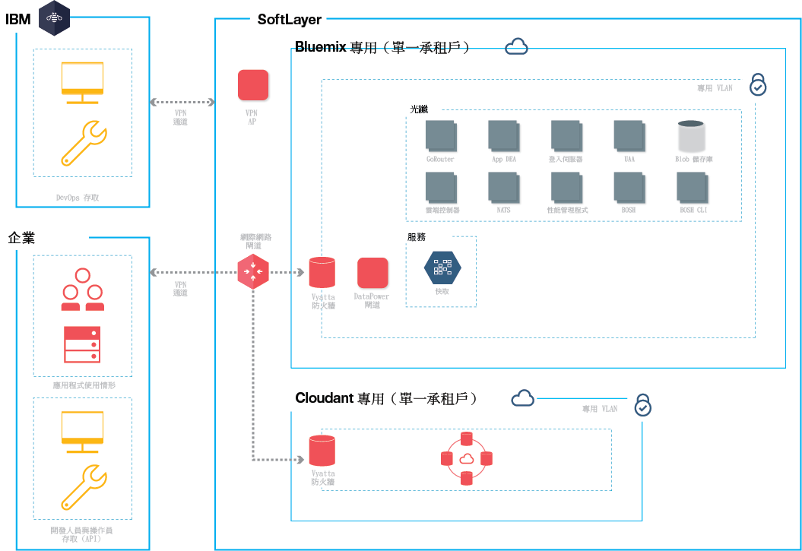

{:new_window: target="_blank"} 
{:shortdesc: .shortdesc}

#{{site.data.keyword.Bluemix_notm}} 專用
{: #dedicated}

*前次更新：2015 年 10 月 20 日*

{{site.data.keyword.Bluemix}} 是一種以雲端為基礎的開放標準平台，用於建置、執行及管理應用程式。使用「{{site.data.keyword.Bluemix_notm}} 專用」，即可使用強大且簡化的 {{site.data.keyword.Bluemix_notm}}—在您專屬的專用 SoftLayer 環境，此環境會安全地連接至「{{site.data.keyword.Bluemix_notm}} 公用」環境及您的專屬網路。{:shortdesc}

「{{site.data.keyword.Bluemix_notm}} 專用」包括專用型錄，其顯示只供您使用的專用服務。它也包括從中同步使用而且可讓您從「{{site.data.keyword.Bluemix_notm}} 公用」中使用的其他服務。

「{{site.data.keyword.Bluemix_notm}} 專用」建置在 SoftLayer 上，因此您可以使用最高效能雲端基礎架構。每一個資料中心都提供 24 小時全年無休的安全及嚴格控制。您和 IBM 透過 VPN 通道及專用 VLAN 來存取您的 {{site.data.keyword.Bluemix_notm}} 專用實例。

*圖 1. 詳細的「{{site.data.keyword.Bluemix_notm}} 專用」圖*

就基礎架構、作業及實體安全而言，「{{site.data.keyword.Bluemix_notm}} 專用」環境的安全標準與公用 {{site.data.keyword.Bluemix_notm}} 相同。不過，開發人員對專用 {{site.data.keyword.Bluemix_notm}} 的存取是透過 LDAP 原則所控制，而
{{site.data.keyword.Bluemix_notm}} 團隊可以在設定環境時配置 LDAP 原則。在專用環境內，您可以管理使用者角色及許可權。如需詳細資料，請參閱[管理使用者及許可權](../admin/index.html#oc_useradmin)。

「{{site.data.keyword.Bluemix_notm}} 專用」包含所有內含的 {{site.data.keyword.Bluemix_notm}} 執行時期，以及 128 GB 的應用程式記憶體。

此外，預設還會有一組內含的服務，以及可針對專用實例選擇的選用服務。 

| **類型**        | **名稱**            | **說明** |      
|-----------------|-------------------|-------------------|
| 內含 | {{site.data.keyword.autoscaling}} | 根據原則，動態增加或減少您應用程式的計算功能。使用此服務，即可在「{{site.data.keyword.Bluemix_notm}} 專用」環境中無限制地使用。 |
| 內含 | {{site.data.keyword.datacshort}} | 此服務提供記憶體內資料網格，其支援應用程式的分散式快取實務範例。包括 50 GB 的記憶體內「快取」。 |
| 內含 | {{site.data.keyword.cloudant}} | IBM 的 NoSQL 資料庫，支援高效能 JSON 資料層（與 CouchDB 相容）。包括 1.6 TB 及最多每秒 3,000 個 API 要求。 |
| 選用 | {{site.data.keyword.sqldb}} | IBM {{site.data.keyword.sqldbfull}} Database for {{site.data.keyword.Bluemix_notm}} 會將完整佈建的關聯式資料庫新增至您的應用程式。{{site.data.keyword.sqldb}} 提供一個受管理資料庫，以處理您商業的需求 Web 及交易式工作量。 |
| 選用 | {{site.data.keyword.mql}} | IBM {{site.data.keyword.mqlfull}} for {{site.data.keyword.Bluemix_notm}} 是一種雲端型傳訊服務，提供 {{site.data.keyword.Bluemix_notm}} 應用程式的彈性及易用傳訊。{{site.data.keyword.mql}} 提供傳訊的簡易管理解決方案。您可以使用 {{site.data.keyword.mql}} 讓應用程式更具回應力且可擴充，使用簡單而強大的 API，在應用程式之間共用及卸載工作。 |
| 選用 | {{site.data.keyword.dashdbshort}} | 使用 dashDB 來儲存關聯式資料，包括地理空間資料之類的特殊類型。然後，使用 SQL 或進階內建分析（例如預測分析及資料採礦、R 分析和 Geospatial Analytics）分析該資料。 |

*表 1. 專用服務*

##設定 {{site.data.keyword.Bluemix_notm}} 專用
{: #setupdedicated}

「{{site.data.keyword.Bluemix_notm}} 專用」的設計旨在提供專用版本的「{{site.data.keyword.Bluemix_notm}} 公用」供應項目。您可以使用 {{site.data.keyword.Bluemix_notm}} 服務及執行時期來支援 IBM 管理之 SoftLayer 帳戶中的計算需求。

IBM 提供您以利用受密碼保護之登入的方式來存取「{{site.data.keyword.Bluemix_notm}} 專用」。您可以存取服務、執行時期及關聯的資源，以及部署和移除 {{site.data.keyword.Bluemix_notm}} 應用程式。IBM 充分運用多個 SoftLayer 位置來交付「{{site.data.keyword.Bluemix_notm}} 專用」，讓您可以在接近您的位置取得專屬版本。

若要設定您的 {{site.data.keyword.Bluemix_notm}} 專屬版本，請執行下列動作：

<ol>
<li>聯絡您的 IBM 指定帳戶代表，或聯絡 <a href="https://console.ng.bluemix.net/?direct=classic/#/contactUs/cloudOEPaneId=contactUs" target="_blank">{{site.data.keyword.Bluemix_notm}}</a>，以開始使用。</li>
<li>每月的經常性費用是基於您要使用的專用服務，外加所有 {{site.data.keyword.Bluemix_notm}} 公用服務的訂閱。然後，您會收到除該訂閱合約外所使用之任何項目的發票。<ol type="a">
	<li>與 IBM 一起處理您的「{{site.data.keyword.Bluemix_notm}} 專用」實例費用。	每月的經常性費用是基於您要使用的專用服務，外加所有 {{site.data.keyword.Bluemix_notm}} 公用服務的訂閱。然後，您會收到除該訂閱合約外所使用之任何項目的發票。</li>
	<li>識別設定「{{site.data.keyword.Bluemix_notm}} 專用」實例的每一個階段的截止時間。</li>
	</ol>
	</li>
<li>為您的專用實例選取 <a href="http://www.softlayer.com/data-centers" target="_blank">SoftLayer 資料中心位置</a>。然後，建立您的專用平台及帳戶。對於您的帳戶，針對啟動及執行專用實例所需的角色，識別您組織中的人員。每一個角色都有對應的 IBM 業務代表。 

客戶角色：

<dl>
<dt>**採購焦點**</dt>
<dd>與 IBM 業務代表一起建立您的「{{site.data.keyword.Bluemix_notm}} 專用」環境，包括識別您組織中要執行專案任何層面的正確人員。這個角色監督型樣選擇、商業安排，以及客戶資源存取權安排。採購焦點是設定專用實例的整體聯絡人。</dd>
<dt>**法規遵循管理者**</dt>
<dd>與 IBM 業務代表一起選取符合您安全需求的拓蹼及部署選項。這個角色與 IBM 法規遵循顧問一起判斷哪些部署型樣達到法規遵循目標及目的。</dd>
<dt>**網路專家**</dt>
<dd>與 IBM 業務代表一起處理 {{site.data.keyword.Bluemix_notm}} 部署的網路計劃。這個角色會向 IBM 業務代表提供需求，並一起研究實作計劃。安裝及驗證階段結束時，這個角色會「簽核」網路配置符合組織標準。</dd>
<dt>**DevOps 焦點**</dt>
<dd>與 IBM 業務代表一起計劃並套用 {{site.data.keyword.Bluemix_notm}} 平台、服務及執行時期所需的維護更新。這個角色也與 IBM 業務代表一起配置您的「{{site.data.keyword.Bluemix_notm}} 專用」實例。</dd>
</dl>

IBM 角色：

<dl>
<dt>**IBM 佈建管理員**</dt>
<dd>與客戶採購焦點一起建立客戶環境。</dd>
<dt>**IBM 法規遵循顧問**</dt>
<dd>與客戶法規遵循管理者一起選取符合您安全需求的拓蹼及部署選項。</dd>
<dt>**IBM 網路專家**</dt>
<dd>與客戶網路專家一起建立部署的網路方案。這個角色與客戶一起收集需求以及建立實作方案。這個角色也會執行自動化測試來驗證實作方案的實體結果。</dd>	
<dt>**IBM DevOps 焦點**</dt>
<dd>與客戶 DevOps 焦點一起進行部署拓蹼的安裝及進行中維護。這個角色與客戶一起計劃及執行平台和服務所需的更新。</dd>
</dl>
</li>
<li>定義並建立貴公司網路與「{{site.data.keyword.Bluemix_notm}} 專用」實例之間的網路連線功能。<ol type="a">
	<li>IBM 針對專用實例安裝監視及安全基礎架構。</li>
	<li>IBM 安裝您選取的單一承租戶專用服務。</li>
	<li>針對 IP 位址或防火牆之類的事物提供網路配置及端點，並提供 LDAP 的存取權，以整合至 {{site.data.keyword.Bluemix_notm}}。</li>
	</ol>
</li>
<li>識別環境的管理團隊，並指派角色。<ol type="a">
	<li>IBM 根據您提供的資訊，配置網路存取權及 LDAP。將管理存取權授與給所指定的聯絡人。您也必須指定用於支援及計費的聯絡人。</li>
	<li>IBM 會在您的專用環境中設定同步型錄，以顯示您的專用服務及許多公用 {{site.data.keyword.Bluemix_notm}} 服務。</li>
	<li>驗證網路和防火牆配置，以及 LDAP 端點和存取權。</li>
	</ol>
</li>
</ol>

##維護專用實例
{: #maintaindedicated}

當 IBM 認為適用於「{{site.data.keyword.Bluemix_notm}} 專用」平台、執行時期及服務時，IBM 即會維護並安裝更新項目及修正程式。

**重要事項**：IBM 保留視需要岔斷服務以套用緊急維護的權利。IBM 可能會變更排定的維護時間，但是一旦有這類變更以及任何緊急維護資訊時，就會通知您。

「{{site.data.keyword.Bluemix_notm}} 專用」需要下列類型的維護：
<dl>
<dt>**標準維護時間**</dt>
<dd>這些服務使用預先定義的標準維護時間，這樣可能導致服務無法使用。IBM 不需要客戶核准即可執行維護，但是會嘗試將對服務的影響降到最低。 
 
IBM 會透過電子郵件、電話或其他方法，來傳送針對每一個維護時間所規劃之變更的播送訊息。 
 
**重要事項**：在維護期間，部分服務可能無法使用。</dd>

<dt>**每月變更時間**</dt>
<dd>根據 21 天時間內您與 IBM 之間的協調來套用每月維護時間。您可以將 21 天時間內可能不適用的特定日期或時間提供給 IBM。IBM 會嘗試排定在這些時間進行更新。根據要求，IBM 會與您溝通排定的維護時間。每月變更時間預期不會影響「Bluemix 專用」環境的執行。 
 
**附註：**如果您未要求在特定時間進行更新，則在時間結束時會自動套用維護。 
 
移至**管理 > 系統資訊**，以檢視擱置更新、設定無法使用的日期，以及核准更新。如需通知及排定擱置更新的相關資訊，請參閱<a href="../admin/index.html#oc_system">檢視系統資訊</a>。</dd>
	
<dt>**其他**</dt>
<dd>IBM 打算將可能會影響您服務（特別是「{{site.data.keyword.Bluemix_notm}} 專用」環境、執行時期及服務的可用性）的所有維護，限制在標準及每月更新。其他變更時間可能會根據異常狀況，用於管理環境。IBM 會盡量降低在這類變更時間期間對您所造成的影響，並會提前通知您。</dd>
</dl>

若要設定專用實例的維護，請與 IBM 指定的帳戶業務代表一起識別用於標準維護的協議時間。
