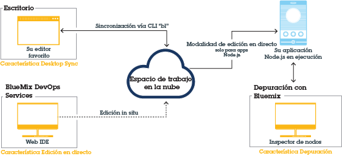

---


copyright:

  years: 2015 2016


---

{:shortdesc: .shortdesc}
{:screen: .screen}
{:new_window: target="_blank"}
{:pre: .pre}

#{{site.data.keyword.Bluemix_notm}} Live Sync {: #live-sync}

*Última actualización: 07 de abril de 2016*  

Si está creando una app Node.js, puede utilizar {{site.data.keyword.Bluemix}} Live Sync para actualizar rápidamente la instancia de la app que se ejecuta en {{site.data.keyword.Bluemix_notm}} y desarrollarla como lo haría en el escritorio sin tener que volver a desplegarla.   
{: shortdesc}

Cuando realice un cambio, puede verlo de inmediato en la app {{site.data.keyword.Bluemix_notm}} en ejecución. {{site.data.keyword.Bluemix_notm}} Live Sync funciona tanto con la línea de mandatos
como con Web IDE. Puede depurar apps escritas en Node.js utilizando {{site.data.keyword.Bluemix_notm}} Live Sync.  

{{site.data.keyword.Bluemix_notm}} Live Sync consta de tres características.

**Desktop Sync**  
    Puede sincronizar cualquier árbol de directorio de escritorio con un espacio de trabajo de proyectos basados en la nube similar al modo de trabajo de Dropbox. Web IDE edita directamente el mismo espacio de trabajo basado en la nube, de manera que ambos están sincronizados. Desktop
Sync funciona para cualquier tipo de app. Para utilizar Desktop Sync debe descargar e instalar la interfaz de línea de mandatos BL.  

**Edición en directo**
    Puede hacer cambios en una app Node.js que se ejecuta en {{site.data.keyword.Bluemix_notm}} y probarlos en el navegador inmediatamente. Todos los cambios que haga en un directorio de escritorio sincronizado o en Web IDE se propagarán
inmediatamente al sistema de archivos de la app.  

**Debug**  
    Mientras una app Node.js está en la modalidad de edición en directo puede aplicarle un shell y depurarla. Con el depurador de node Inspector puede, de manera dinámica, editar el código, insertar puntos de interrupción, recorrer el código, reiniciar el tiempo de ejecución, entre otras características.  

Puede utilizar Desktop Sync para mantener actualizado su espacio de trabajo de escritorio
con el espacio de trabajo de proyectos basados en la nube que edita directamente con Web IDE. Puede utilizar la característica Edición en directo para propagar los cambios en su espacio de trabajo de proyectos basados en la nube
a la app en ejecución. Puede utilizar una o ambas características. Además, si utiliza Desktop Sync o Edición en directo para colocar su
app en la modalidad de edición en directo, puede depurar la app en ejecución.

En el siguiente diagrama se muestra el proceso de Bluemix Live Sync.

*Figura 1. Proceso de Bluemix Live Sync*


Si está desarrollando una app Java
que se ejecuta en Liberty, puede depurarla de forma remota mediante [Eclipse Tools for Bluemix](../manageapps/eclipsetools/eclipsetools.html#eclipsetools).

##Desktop Sync {: #desktop-sync}

Puede utilizar la característica Desktop Sync de Bluemix Live Sync para
actualizar con rapidez la instancia de app en {{site.data.keyword.Bluemix_notm}} y desarrollarla como lo haría en el escritorio.

Desktop Sync tiene las siguientes consideraciones:
* Desktop Sync se ejecuta en estos sistemas operativos:
  * Windows 7 u 8
  * Mac OS X versión 10.9 o posterior
      **Nota:** Windows requiere .NET Framework versión 4.5. Si no tiene .NET instalado, se le solicitará que lo instale cuando instale la interfaz de línea de mandatos (CLI) de {{site.data.keyword.Bluemix_notm}} Live Sync.  
* No es necesario clonar el repositorio Git.
* Independientemente del tipo de app que esté desarrollando, puede sincronizar su proyecto de escritorio con el espacio de trabajo en la nube.
* Si la app está escrita en Node.js, puede propagar los cambios en las apps que están en ejecución.

Para obtener más detalles sobre los mandatos, consulte [Mandatos de Bluemix Live Sync (bl)](bluemixlive.html#bl-commands).

<ol>
<li>Registre gratis una cuenta de <a class="xref" href="https://hub.jazz.net/" target="_blank" alt="Bluemix DevOps Services">Bluemix DevOps Services</a>.</li>
<li>Descargue e instale la línea de mandatos bl de {{site.data.keyword.Bluemix_notm}} Live Sync.   
<p>
<a class="xref" href="http://livesyncdownload.ng.bluemix.net/downloads/blive_setup.msi" target="_blank" title="(se abre en un separador o ventana nueva)"> </a> <a class="xref" href="http://livesyncdownload.ng.bluemix.net/downloads/BluemixLive.pkg" target="_blank" title="(se abre en un separador o ventana nueva)"> </a>
</p>  

<strong>Importante:</strong> La herramienta de línea de mandatos bl solo está disponible para Windows 7 y 8 y Mac OS X versión 10.9 o posterior. </li>

<li>En una línea de mandatos, inicie sesión con el mandato siguiente. Se le solicitará su ID y contraseña de IBM.  
<pre class="codeblock">bl login</pre>
</li>

<li>Consulte la lista de proyectos disponibles para sincronizar {{site.data.keyword.Bluemix_notm}} Live Sync introduciendo el siguiente mandato:
<pre class="codeblock">bl projects</pre>
<p>Busque el nombre de proyecto en la lista que coincida con la app. El nombre del proyecto tiene el formato de su <i>alias</i> | <i>nombre app</i>. </p>
</li>
<li>Sincronice el entorno local con el proyecto en {{site.data.keyword.Bluemix_notm}} especificando
el siguiente mandato. Si es el propietario del proyecto, solo debe especificar nombre-app para nombreProyecto.
<pre class="codeblock">bl sync nombre_proyecto -d directorio_local --verbose</pre>
<p>Este mandato seguirá ejecutándose (y la sincronización continuará) hasta que se especifique una "q". La opción --verbose muestra la información de estado e inicio de sesión. Si alguno de los argumentos contiene un espacio,
deberá escribir el nombre entre comillas. </p></li>
<li>En otra ventana de la línea de mandatos del directorio local,
despliegue la app en {{site.data.keyword.Bluemix_notm}} en la
modalidad de edición en directo especificando el siguiente mandato:
<pre class="codeblock">bl start</pre>
</li>
</ol>

Cuando cambie los archivos en su directorio local, los cambios
se propagarán automáticamente en la app que se ejecuta
en {{site.data.keyword.Bluemix_notm}} y
en el espacio de trabajo de la nube del proyecto. Si tiene que reiniciar la app Node
puede utilizar el siguiente mandato:
```
bl start --restart
```

##Edición en directo {: #live-edit}

Si está creando una app Node.js, al efectuar cambios en el proyecto mediante Web IDE, la característica de edición en directo de {{site.data.keyword.Bluemix_notm}} Live Sync puede actualizar rápidamente la instancia de app que se ejecuta en {{site.data.keyword.Bluemix_notm}}. La edición en directo le permite desarrollar como lo haría en el escritorio sin tener que volver a desplegar.

La característica Edición en directo solo se admite en las apps Node.js.

En Web IDE, en la barra de ejecución, pulse **Edición en directo**.


Edición en directo le permite obtener una vista previa rápida de los cambios en las apps Node.js
que se ejecutan en {{site.data.keyword.Bluemix_notm}}. Al actualizar
el código con la característica Edición en directo activada, puede renovar la ventana del navegador de su app web
para ver dichos cambios reflejados pocos segundos después de efectuarlos.

Para ver un tutorial sobre cómo utilizar la característica Edición en directo de {{site.data.keyword.Bluemix_notm}} Live Sync, vea el tutorial [Pruebe y depure una app Node.js con Bluemix Live Sync](https://hub.jazz.net/tutorials/livesync).

Al cambiar los archivos de Web IDE, se volverán a desplegar
automáticamente en la app que se ejecuta en {{site.data.keyword.Bluemix_notm}}. Si tiene que reiniciar la app Node, puede utilizar el botón **Reiniciar**
de la barra de ejecución.

**NOTA:** Para obtener una experiencia más coherente al utilizar la característica Edición en directo de {{site.data.keyword.Bluemix_notm}} Live Edit, son necesarios 256 MB de memoria adicional y se añadirán. 

##{{site.data.keyword.Bluemix_notm}} Live
Debug {: #live-debug}

Puede acceder a la característica de {{site.data.keyword.Bluemix_notm}} Live Sync Debug cuando {{site.data.keyword.Bluemix_notm}} Live Sync esté habilitado para la app Node.js.

Con la característica debug, puede editar código, insertar puntos de interrupción, recorrer el código,
reiniciar el tiempo de ejecución de forma dinámica, entre otras características, mientras la app está en servicio en {{site.data.keyword.Bluemix_notm}}. Puede desarrollar la app de forma incremental con agilidad mientras elige entre una larga lista de servicios de {{site.data.keyword.Bluemix_notm}}.

{{site.data.keyword.Bluemix_notm}} Live
Debug incluye las siguientes características:

* Control del tiempo de ejecución de la aplicación
* Depuración mediante [node-inspector](https://github.com/node-inspector/node-inspector)
* Acceso a shell

###Control del tiempo de ejecución de la aplicación {: #app-runtime}

Con el control del tiempo de ejecución de la app, puede utilizar Debug
para inspeccionar el estado de la app en el momento inicial. Esta función resulta útil para solucionar los problemas de una app que falla al iniciarse.

Mientras esté desarrollando la app, puede elegir entre las siguientes acciones:

* Realizar un reinicio rápido de la app
* Suspender la app antes de que se ejecute ningún código de la app

###Depurar {: #debug}

Debug incluye las siguientes funciones:

**Restricción:** Se necesita Google Chrome.

* Establecer puntos de interrupción en el código de la app para detener la ejecución en una línea específica.
* Editar las condiciones de los puntos de interrupción cuando se cumplan ciertos criterios.
* Inspeccionar el estado de las variables locales y los campos.
* Visualizar la salida de la depuración de manera inmediata desde las llamadas `console.log()`. Esta opción es más rápida que la supervisión de registros cf.
* Utilizar el editor de código fuente incorporado para introducir cambios inmediatos (aunque temporales) al código de la app en ejecución.

###Shell {: #shell}

Esta herramienta le da acceso de shell al contenedor en el que se ejecuta la app. Con el uso de este terminal puede ejecutar, de manera remota, mandatos de diagnóstico de shell para administrar la app.

Supervise el uso de la memoria y de la CPU en la instancia que utiliza mandatos estándares de Linux, como por ejemplo **top**, **ps** y **kill**.

###Configuración de una app para habilitar {{site.data.keyword.Bluemix_notm}} Live
Debug {: #configure_app_debug}

La app debe usar el paquete de compilación IBM SDK for Node.js. No se da soporte a los paquetes de compilación personalizados.

1. Permita que el paquete de compilación detecte el mandato de inicio de la app. El paquete de compilación debe detectar automáticamente el mandato start y no se debe establecer en el archivo `manifest.yml`.  

    a. Asegúrese de que el archivo `package.json` contenga un script
de inicio que incluya un mandato start para la app.  
    b. Si el archivo `manifest.yml` de la app contiene un mandato, establézcalo en null.  

2. Establezca la variable de entorno.  

    a. En el archivo `manifest.yml`, añada esta variable:
	```
	env:
      ENABLE_BLUEMIX_DEV_MODE: "true"
	```

3. Aumente la memoria.  

    a. En el archivo `manifest.yml` de la app, añada 128M o más al valor especificado para el atributo memory.

Una vez instalado {{site.data.keyword.Bluemix_notm}} Live
Debug, puede utilizar las herramientas de depuración.

Envíe la app por push y vaya a `https://app-host.mybluemix.net/bluemix-debug/manage` para acceder a la interfaz de usuario de depuración de {{site.data.keyword.Bluemix_notm}}. Cuando se le solicite, escriba el ID y la contraseña de IBM para autenticarse.

###Restauración de configuraciones de app e inhabilitación de Bluemix Live
Debug {: #restore_live_debug}

1. Elimine la variable de entorno ENABLE_BLUEMIX_DEV_MODE del archivo `manifest.yml` de la app.

2. Restaure el mandato start y el valor memory originales de la app.

3. Envíe la app por push.

## Mandatos de {{site.data.keyword.Bluemix_notm}} Live Sync (bl)  {: #bl-commands}

Si está creando una aplicación Node.js, puede utilizar {{site.data.keyword.Bluemix_live}}
para actualizar rápidamente la instancia de la aplicación que se ejecuta en {{site.data.keyword.Bluemix_notm}} y desarrollarla como lo haría en el escritorio sin tener que volver a desplegarla. Cuando realice un cambio, puede verlo de inmediato en la app {{site.data.keyword.Bluemix_notm}} en ejecución. La interfaz de línea de mandatos de {{site.data.keyword.Bluemix_live}} se llama *bl*.
{:shortdesc}

Puede utilizar la interfaz de línea de mandatos **bl** para realizar las tareas siguientes:

* Iniciar y detener una aplicación que se esté ejecutando en {{site.data.keyword.Bluemix_notm}}.
* Crear un proyecto nuevo basado en nube desde su escritorio.
* Sincronizar los cambios entre el escritorio y el espacio de trabajo del proyecto basado en la nube y con la aplicación que se ejecuta en {{site.data.keyword.Bluemix_notm}}.
* Ver la lista de los proyectos que se pueden sincronizar.
* Ver el estado de las apps en ejecución.

Para obtener más información sobre cómo descargar y utilizar el mandato bl, consulte [Bluemix Live Sync](../develop/bluemixlive.html).

## Mandatos bl
{: #bl_commands}

La línea de mandatos de {{site.data.keyword.Bluemix_live}}, **bl**, tiene la sintaxis siguiente:

```
bl mandato [argumentos][options] [--help]
```
{: pre}

**Mandatos**

l *login*: Inicia la sesión en {{site.data.keyword.Bluemix_notm}}.

lo *logout*: Finaliza la sesión de {{site.data.keyword.Bluemix_notm}}.

s *sync*: Inicia el proceso de sincronización entre el escritorio y el servidor.

c *create*: Crea un proyecto privado, lo enlaza al repositorio de Git en este directorio y despliega el contenido en {{site.data.keyword.Bluemix_notm}}.

p *projects*: Lista todos los proyectos disponibles para la sincronización.

st *start*: Inicia la instancia de aplicación en {{site.data.keyword.Bluemix_notm}}.

sp *stop*: Detiene la instancia de aplicación en {{site.data.keyword.Bluemix_notm}}.

ss *status*: Lista el estado de la instancia de aplicación en ejecución en
{{site.data.keyword.Bluemix_notm}}.


**Argumentos**

Argumentos para el mandato.


**Opciones**

Opciones para el mandato.

**Opciones globales**

*--help*: Muestra la página de ayuda para el mandato especificado

*--verbose*: Habilita el registro detallado.

**Nota:** Si alguno de los argumentos u opciones contiene un espacio, escriba el valor entre comillas dobles.

## Help
{: bl_help}

```
bl [ command ] --help | --h
```
{: pre}

**Uso**

Utilice este mandato para visualizar la ayuda de un mandato o lista de mandatos.

**Ejemplos**

Muestra la lista de mandatos:

```
bl --help
```
{: pre}

Muestra información detallada sobre el mandato sync:

```
bl sync --help
```
{: pre}

## Login
{: bl_login}

```
bl login | l [ -u nombre de usuario ][-p contraseña ][ -s servidor ]
```
{: pre}

**Finalidad**

Utilice este mandato para iniciar una sesión en {{site.data.keyword.Bluemix_notm}}. El inicio de sesión debe realizarse solo una vez por sesión.

**Advertencia:** No se recomienda proporcionar su contraseña como una opción de línea de mandatos, porque será visible a otros usuarios y se registrará como parte del historial de mandatos.

**Nota:** para poder iniciar sesión, antes debe registrar una cuenta gratuita de
<a class="xref" href="https://hub.jazz.net/" target="_blank" alt="Bluemix DevOps Services">Bluemix DevOps Services</a>.

**Opciones**

-u *nombre de usuario*: El ID de IBM que utiliza para iniciar sesión en
{{site.data.keyword.Bluemix_notm}}.

-p *contraseña*: La contraseña de su ID de IBM.

-s *servidor*: El nombre de servidor o la dirección IP del servidor de  {{site.data.keyword.jazzhub_short}}.

**Ejemplos**

Este mandato solicita tanto un *nombre de usuario* como una *contraseña*:

```
bl login
```
{: pre}

Inicie la sesión del usuario, `name@company.com`:

```
bl login –u name@company.com –p pa55w0rd
```
{: pre}

Inicie la sesión del usuario `name@company.com` con la contraseña *pa55 w0rd* que contiene un espacio, por lo que necesita comillas:

```
bl login –u name@company.com –p “pa55 w0rd”
```
{: pre}

## Logout
{: bl_logout}

```
bl logout | lo
```
{: pre}

**Finalidad**

Utilice este mandato para cerrar la sesión.

## Proyectos
{: bl_projects}

```
bl projects | p
```
{: pre}

**Finalidad**

Utilice este mandato para listar todos los proyectos que están disponibles para la sincronización por parte del usuario que ha iniciado sesión.

## Sync
{: bl_sync}

```
bl sync | s nombreProyecto -d directorioLocal [ --overwritelocal ][ --overwriteremote ] [ --verbose ]
```
{: pre}

**Finalidad**

Utilice este mandato para iniciar la sincronización del contenido de un proyecto con su directorio local. Este mandato se ejecuta hasta que se especifica <code>q</code>. Este mandato puede mostrar de forma opcional un registro de todos los cambios de estado en aplicaciones y archivos.

**Argumento**

*nombreProyecto*: El nombre del proyecto con el formato *“alias | mproject”* o solo *myproject*, si el propietario del proyecto es el usuario que ha iniciado sesión.

**Opciones**

-d *directorioLocal*: La vía de acceso al directorio local. El valor predeterminado es la carpeta actual ".".

*--overwritelocal*: Sobrescribe el directorio local con el contenido del espacio de trabajo del proyecto. 

*--overwriteremote*: Sobrescribe el espacio de trabajo del proyecto con el contenido del directorio local. 

*--verbose*: Muestra el registro detallado.

**Ejemplos**

Este mandato inicia la sincronización con el proyecto asociado si el directorio actual es un destino de sincronización existente. Si el directorio actual está vacío y no es un destino de sincronización existente, el mandato solicita un *nombreProyecto*. Si el directorio actual no está vacío y no es un destino de sincronización existente, se necesita una opción de sobrescritura.

```
bl sync
```
{: pre}

Este mandato empieza la sincronización y es equivalente a `bl sync “alias | myproject”` si el propietario del proyecto es el usuario que ha iniciado sesión. 

```
bl sync  myproject
```
{: pre}

Este mandato inicia la sincronización con el proyecto `my pro ject`, cuyo nombre contiene espacios, por lo que se debe indicar entre comillas:

```
bl sync “my pro ject”
```
{: pre}

Este mandato inicia la sincronización del proyecto `myproject` con el directorio `myfolder`:

```
bl sync myproject –d  myfolder
```
{: pre}

## Create
{: bl_create}

```
bl create | c [ -n PROJECT_NAME ][ -r REGION ] [ -o ORG ][ -s SPACE ] [ -g GIT_REPO ][-e GIT_EXE ] [ --creds ][ --fork ] [ --public ][ --prompt ]
```
{: pre}

**Finalidad**

Utilice este mandato desde un directorio que contenga código para crear un proyecto privado, enlácelo a un repositorio de Git y despliegue el contenido del repositorio en {{site.data.keyword.Bluemix_notm}}.

**Opciones**

-n *PROJECT_NAME*: Un nombre para su proyecto. Valor predeterminado: nombre del directorio actual.

-r *REGION*: Una región de {{site.data.keyword.Bluemix_notm}}. Vaor predeterminado: EE. UU. sur.

-o *ORG*: Una organización de {{site.data.keyword.Bluemix_notm}}. Valor predeterminado: la primera org que se encuentre.

-s *SPACE*: Un espacio de {{site.data.keyword.Bluemix_notm}}. Valor predeterminado: el primer espacio que se encuentre.

-g *GIT_REPO*: Nombre del repositorio que se debe utilizar para los repositorios existentes de Git. Valor predeterminado: origen.

-e *GIT_EXE*: Vía de acceso completo de un ejecutable de Git. Valor predeterminado: detectado.

*--creds*: Solicita las credenciales de Git. 

*--fork*: Usar Fork para este directorio y crear un proyecto y repositorio. 

*--public*: Hace que el proyecto nuevo sea público. 

*--prompt*: Solicita todas las opciones necesarias con las elecciones disponibles. 

**Ejemplos**

Este mandato inicia del proceso de creación de un proyecto privado y solicita un nombre de proyecto a utilizar.

```
bl create
```
{: pre}

Este mandato crea un proyecto público denominado `myNewProject`.

```
bl create -n myNewProject --public
```
{: pre}

## Status
{: bl_status}

```
bl status | ss [ nombreProyecto ]
```
{: pre}

**Finalidad**

Utilice este mandato para listar el estado de las aplicaciones que están asociadas con las configuraciones de lanzamiento en el directorio `./launchConfigurations`.

**Argumento**

*nombreProyecto*: El nombre del proyecto con el formato `“alias | myproject”` o solo `myproject`, si el propietario del proyecto es el usuario que ha iniciado sesión.

**Ejemplos**

Este ejemplo muestra el estado de las aplicaciones en ejecución. Si el directorio actual es un destino de sincronización existente, se utiliza el proyecto asociado. Si el directorio no es un destino de sincronización existente, el mandato solicita el `nombreProyecto`.

``
bl status
```
{: pre}

Este ejemplo muestra el estado del proyecto *myproject* que es equivalente a `bl status “alias | myproject”` si el propietario del proyecto es el usuario que ha iniciado sesión.


```
bl status myproject
```
{: pre}

Este ejemplo muestra el estado de la aplicación en ejecución que está asociada con el proyecto `my pro ject`, cuyo nombre contiene espacios, por lo que se debe indicar entre comillas:

```
bl status “my pro ject”
```
{: pre}

## Start
{: bl_start}

```
bl start | st nombreProyecto [ -l víaAccesoConfiguraciónLanzamiento ] -m víaAccesoManifiesto ] [ --liveedit ][--noliveedit ] [ --restart ]
```
{: pre}

**Finalidad**

Utilice este mandato para iniciar la instancia de aplicación que se describe en el archivo de manifiesto o lanzamiento. De forma predeterminada, la aplicación se inicia en la modalidad de edición en directo, si el paquete de compilación de la aplicación admite la edición en directo. Una
vez iniciado, se muestran las URL para la aplicación, las herramienta de depuración y el panel de control de
{{site.data.keyword.Bluemix_notm}}.

**Argumento**

*nombreProyecto*: El nombre del proyecto con el formato *“alias | myproject”* o solo *myproject*, si el propietario del proyecto es el usuario que ha iniciado sesión.

**Opciones**

-l *víaAccesoConfiguraciónLanzamiento*: El nombre de la configuración de lanzamiento (por ejemplo, `mylaunchconfig`), el nombre del archivo (por ejemplo, `mylaunchconfig.launch`) o una vía de acceso relativa al proyecto del archivo de configuración de lanzamiento (por ejemplo, `launchConfigurations/mylaunchconf.launch`).

-m *víaAccesoManifiesto*: La vía de acceso relativa al proyecto del archivo de manifiesto (por ejemplo, `manifest.yml`).

*--liveedit*: Inicia la aplicación asociada en modalidad de edición en directo o sale sin errores si el paquete de compilación no admite la modalidad de edición en directo.

*--noliveedit*: Inicia la aplicación asociada en modalidad normal.

*--view*: Abre un navegador de la aplicación en ejecución.

*--restart*: Reinicia una aplicación que ya se está ejecutando en modalidad de edición en directo sin volver a desplegarla.

**Ejemplos**

Este mandato inicia una instancia de aplicación de `myproject` asociada con el archivo de lanzamiento `launchConfigurations/my.launch`.

```
bl start myproject –l “launchConfigurations/my.launch”
```
{: pre}

Este mandato inicia una instancia de aplicación del proyecto que está asociada con el directorio actual con el archivo de lanzamiento `launchConfigurations/my.launch`. Si el directorio actual no es un destino de sincronización, se muestra un error.

```
bl start –l “launchConfigurations/my.launch”
```
{: pre}

Este mandato inicia una instancia de aplicación del proyecto que está asociada con el directorio actual con el archivo de manifiesto `manifest.yml`. Se utiliza la información especificada en el manifiesto para crear un nuevo archivo de configuración de lanzamiento. El mandato le pedirá la información restante que se necesite y después iniciará la aplicación que se describe en la configuración de lanzamiento:

```
bl start –m “mymanifest.yml”
```
{: pre}

Este mandato inicia una instancia de aplicación del proyecto que está asociada con el directorio actual con el archivo de manifiesto `manifest.yml`, y es equivalente a `bl start –m manifest.yml`.

```
bl start
```
{: pre}

## Stop
{: bl_stop}

```
bl stop | sp nombreProyecto [ -l ConfiguraciónLanzamiento ]
```
{: pre}

**Finalidad**

Utilice este mandato para detener la instancia de aplicación que está asociada con el archivo de lanzamiento.

**Argumento**

*nombreProyecto*: El nombre del proyecto con el formato *“alias | mproject”* o solo *mproject*, si el propietario del proyecto es el usuario que ha iniciado sesión.

**Opciones**

-l *víaAccesoConfiguraciónLanzamiento*: El nombre de la configuración de lanzamiento (por ejemplo, `mylaunchconfig`), el nombre del archivo (por ejemplo, `mylaunchconfig.launch`) o una vía de acceso relativa al proyecto del archivo de configuración de lanzamiento (por ejemplo, `launchConfigurations/mylaunchconf.launch`).

**Ejemplos**

Este mandato detiene la aplicación si el directorio actual es un destino de sincronización. De lo contrario, finalizará con un error. Si no hay ninguna configuración de lanzamiento, este mandato finalizará con un error. Si hay más de una configuración de lanzamiento, el mandato le pedirá que configuración se debe detener.

```
bl stop
```
{: pre}

Este mandato detiene una instancia de aplicación del proyecto que se está ejecutando con el archivo de lanzamiento `mylaunchConfig`.

```
bl stop myproject –l “mylaunchConfig”
```
{: pre}

Este mandato detiene la aplicación si el directorio actual es un destino de sincronización que se ha iniciado con el archivo de lanzamiento `launchConfigurations/mylaunchconfig.launch`. De lo contrario, finalizará con un error:

```
bl stop –l “launchConfigurations/mylaunchconfig.launch”
```
{: pre}

># Enlaces relacionados {:class="linklist"}
>## Guías de aprendizaje y ejemplos {:id="samples"}
>* [Pruebe y depure una app Node.js con Bluemix Live Sync](https://hub.jazz.net/tutorials/livesync)
>
># Enlaces relacionados {:class="linklist"}
>## Enlaces relacionados {:id="general"}
>* [Herramientas de Eclipse para Bluemix](https://www.ng.bluemix.net/docs/manageapps/eclipsetools/eclipsetools.html)   
>
>{:elementKind="article" id="rellinks"}
