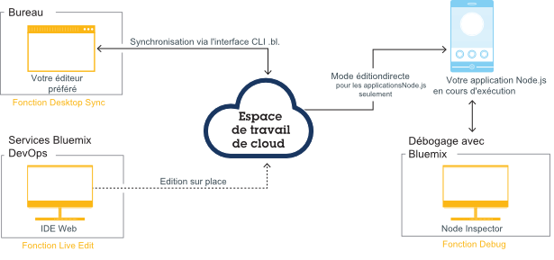

---


copyright:

  years: 2015，2016


---

{:shortdesc: .shortdesc}
{:screen: .screen}
{:new_window: target="_blank"}
{:pre: .pre}

#{{site.data.keyword.Bluemix_notm}} Live Sync {: #live-sync}

*Dernière mise à jour : 7 avril 2016*  

Si vous construisez une application Node.js, vous pouvez utiliser {{site.data.keyword.Bluemix}} Live Sync pour mettre rapidement à jour
l'instance d'application dans {{site.data.keyword.Bluemix_notm}} et procéder au développement sans redéploiement, comme vous le feriez sur le bureau.   
{: shortdesc}

Lorsque vous apportez une modification, vous pouvez immédiatement voir cette modification dans votre application
{{site.data.keyword.Bluemix_notm}} en cours d'exécution. {{site.data.keyword.Bluemix_notm}} Live Sync fonctionne depuis la ligne de
commande et dans l'environnement de développement intégré Web. Vous pouvez déboguer des applications écrites en Node.js avec
{{site.data.keyword.Bluemix_notm}} Live Sync.  

{{site.data.keyword.Bluemix_notm}} Live Sync se compose de trois fonctions.

**Desktop Sync**  
    Vous pouvez synchroniser n'importe quelle arborescence de répertoires de bureau avec un espace de travail de projet reposant sur le cloud de la
même façon qu'avec Dropbox. L'environnement de développement intégré Web édite directement le même espace de travail reposant sur le cloud ; par conséquent, les deux restent
synchronisés. Desktop
Sync fonctionne pour tout type d'application. Pour pouvoir utiliser Desktop Sync, vous devez télécharger et installer l'interface de ligne de commande BL.  

**Live Edit**
    Vous pouvez modifier une application Node.js qui s'exécute dans {{site.data.keyword.Bluemix_notm}} et tester immédiatement les modifications dans votre navigateur. Les modifications que vous apportez dans un répertoire de bureau synchronisé ou dans l'environnement de développement intégré Web sont immédiatement propagées dans le système de fichiers de l'application.  

**Debug**  
    Lorsqu'une application Node.js est en mode édition directe, vous pouvez ouvrir un shell et la déboguer. Vous pouvez éditer le code dynamiquement,
insérer des points d'arrêt, parcourir le code, redémarrer le contexte d'exécution, et effectuer d'autres opérations à l'aide du débogueur Node Inspector.  

Vous pouvez utiliser Desktop Sync pour que votre espace de travail de bureau reste synchronisé avec l'espace de travail de projet reposant sur le
cloud, que vous éditez directement dans l'environnement de développement intégré Web. Vous pouvez utiliser Live Edit pour propager les modifications apportées dans votre espace de travail de projet reposant sur le cloud de votre
application en cours d'exécution. Vous pouvez utiliser l'une de ces fonctions, ou les deux. De plus, si vous utilisez Desktop Sync ou Live Edit pour placer
votre application en mode édition directe, vous pouvez déboguer l'application en cours d'exécution.

Le processus Bluemix Live Sync est illustré dans le diagramme ci-dessous.

*Figure 1. Le processus Bluemix Live Sync*


Si vous développez une application Java qui s'exécute dans Liberty, vous pouvez procéder au débogage à distance avec
[Eclipse Tools for Bluemix](../manageapps/eclipsetools/eclipsetools.html#eclipsetools).

##Desktop Sync {: #desktop-sync}

Vous pouvez utiliser la fonction Desktop Sync de Bluemix Live Sync pour mettre rapidement à jour l'instance d'application dans {{site.data.keyword.Bluemix_notm}} et procéder au
développement, comme vous le feriez sur le bureau.

Prenez connaissance des remarques suivantes relatives à Desktop Sync :
* Desktop Sync s'exécute sur les systèmes d'exploitation suivants :
  * Windows 7 ou 8
  * Mac OS X version 10.9 ou ultérieure
      **Remarque :** Windows requiert .NET Framework version 4.5. Si .NET n'est pas installé, vous êtes invité à l'installer lorsque
vous installez l'interface de ligne de commande {{site.data.keyword.Bluemix_notm}} Live Sync.  
* Il n'est pas nécessaire de cloner votre référentiel Git.
* Quel que soit le type d'application que vous développez, vous pouvez synchroniser votre projet de bureau avec l'espace de travail de cloud.
* Si votre application est écrite en Node.js, vous pouvez propager les applications à des applications en cours d'exécution.

Pour plus de détails sur les commandes, voir [Commandes Bluemix Live Sync (bl)](bluemixlive.html#bl-commands).

<ol>
<li>Inscrivez-vous pour ouvrir un compte <a class="xref" href="https://hub.jazz.net/" target="_blank" alt="Bluemix DevOps Services">Bluemix DevOps Services</a> gratuit.</li>
<li>Téléchargez et installez la ligne de commande bl de {{site.data.keyword.Bluemix_notm}} Live Sync.   
<p>
<a class="xref" href="http://livesyncdownload.ng.bluemix.net/downloads/blive_setup.msi" target="_blank" title="(Ouverture dans un nouvel onglet ou une nouvelle fenêtre)"> </a> <a class="xref" href="http://livesyncdownload.ng.bluemix.net/downloads/BluemixLive.pkg" target="_blank" title="(Ouverture dans un nouvel onglet ou une nouvelle fenêtre)"> </a>
</p>  

<strong>Important :</strong> l'outil de ligne de commande bl est disponible uniquement pour Windows 7 et 8 et Mac OS X version 10.9 ou ultérieure. </li>

<li>Sur une ligne de commande, connectez-vous avec la commande ci-après. Vous serez invité à entrer votre ID IBM et votre mot de passe.  
<pre class="codeblock">bl login</pre>
</li>

<li>Affichez la liste des projets disponibles pour la synchronisation {{site.data.keyword.Bluemix_notm}} Live Sync en entrant la commande suivante
:
<pre class="codeblock">bl projects</pre>
<p>Recherchez le nom de projet dans
la liste qui correspond à votre application. Le nom de projet est au format <i>votre alias</i> | <i>nom de-votre-application</i>. </p>
</li>
<li>Synchronisez votre environnement local avec votre projet dans {{site.data.keyword.Bluemix_notm}} à l'aide de la
commande ci-après. Si vous êtes le propriétaire du projet, il suffit de spécifier nom-de-votre-application pour nom_projet.
<pre class="codeblock">bl sync
nom_projet -d répertoire_local --verbose</pre>
<p>Cette commande continue de s'exécuter (et la synchronisation continue) jusqu'à ce que vous entriez la lettre "q". L'option --verbose affiche les
informations de journalisation et de statut. Si l'un de vos arguments contient un espace, placez-le entre apostrophes. </p></li>
<li>Dans une autre fenêtre de ligne de commande, dans votre répertoire local, déployez l'application dans {{site.data.keyword.Bluemix_notm}} en
mode édition directe avec la commande suivante :
<pre class="codeblock">bl start</pre>
</li>
</ol>

Lorsque vous modifiez les fichiers dans votre répertoire local, les modifications sont propagées automatiquement dans l'application exécutée dans {{site.data.keyword.Bluemix_notm}} et dans l'espace de travail de cloud de projet. Si vous devez
redémarrer l'application de noeud, vous pouvez utiliser la commande suivante :
```
bl start --restart
```

##Live Edit {: #live-edit}

Si vous construisez une application Node.js, lorsque vous apportez des modifications à votre projet dans l'environnement de développement intégré Web,
la fonction Live Edit de {{site.data.keyword.Bluemix_notm}} Live Sync peut mettre à jour rapidement l'instance d'application qui s'exécute dans {{site.data.keyword.Bluemix_notm}}. Live Edit vous permet de procéder au développement comme sur le bureau, sans redéploiement.

La fonction Live Edit est prise en charge uniquement pour les applications Node.js.

Dans l'environnement de développement intégré Web, dans la barre d'exécution, cliquez sur **Live Edit**.


Live Edit permet de prévisualiser rapidement les modifications apportées aux applications Node.js qui s'exécutent dans {{site.data.keyword.Bluemix_notm}}. Lorsque vous mettez à jour
votre code alors que la fonction Live Edit est activée, vous pouvez actualiser la fenêtre de navigateur de votre application Web pour afficher ces
modifications quelques secondes après les avoir effectuées.

Pour suivre un tutoriel sur l'utilisation de la fonction Live Edit de {{site.data.keyword.Bluemix_notm}} Live Sync, voir
[Test and debug a Node.js app with Bluemix Live Sync](https://hub.jazz.net/tutorials/livesync).

Lorsque vous modifiez les fichiers dans votre environnement de développement intégré Web, ceux-ci sont redéployés automatiquement dans votre application
qui s'exécute dans {{site.data.keyword.Bluemix_notm}}. Si vous devez redémarrer l'application de noeud, vous pouvez utiliser le bouton **Redémarrer** dans la barre d'exécution.

**REMARQUE :** pour une expérience plus cohérente lors de l'utilisation de la fonction Live Edit de
{{site.data.keyword.Bluemix_notm}} Live Sync, 256 Mo de mémoire supplémentaire sont requis et seront ajoutés.

##{{site.data.keyword.Bluemix_notm}} Live
Debug {: #live-debug}

Vous pouvez accéder à la fonction Debug de {{site.data.keyword.Bluemix_notm}} Live Sync lorsque {{site.data.keyword.Bluemix_notm}}
Live Sync est
activé pour votre application Node.js.

La fonction debug permet d'éditer le code, d'insérer des points d'arrêt, de parcourir le code, de redémarrer le contexte d'exécution et d'effectuer
d'autres opérations de manière dynamique, pendant que votre application est exécutée par {{site.data.keyword.Bluemix_notm}}. Vous pouvez développer votre application de façon incrémentielle avec agilité en effectuant votre choix dans une longue liste de services
{{site.data.keyword.Bluemix_notm}}.

{{site.data.keyword.Bluemix_notm}} Live
Debug inclut les fonctions suivantes :

* Le contrôle du contexte d'exécution d'application
* Le débogage avec [node-inspector](https://github.com/node-inspector/node-inspector)
* L'accès au shell

###Contrôle du contexte d'exécution d'application {: #app-runtime}

Avec le contrôle du contexte d'exécution d'application, vous pouvez utiliser la fonction Debug afin d'inspecter l'état de l'application
au démarrage. Cette capacité est utile lorsque vous traitez les incidents liés à une application qui tombe en panne au démarrage.

Lorsque vous développez votre application, vous pouvez choisir une action parmi les suivantes :

* Procéder à un redémarrage rapide de l'application
* Suspendre l'application avant l'exécution du code de l'application

###Debug {: #debug}

La fonction Debug inclut les capacités suivantes :

**Restriction :** Google Chrome est requis.

* Définir des points d'arrêt dans le code de l'application pour interrompre l'exécution à une ligne spécifique.
* Editer les conditions de point d'arrêt pour interrompre l'exécution uniquement lorsque certains critères sont remplis.
* Inspecter l'état des zones et des variables locales.
* Afficher immédiatement la sortie de débogage des appels de `console.log()`. Cette action est plus rapide que la surveillance des journaux cf.
* Utiliser l'éditeur de code source intégré pour apporter des modifications immédiates mais temporaires au code d'application en cours d'exécution.

###Shell {: #shell}

Cet outil permet d'accéder au conteneur dans lequel votre application est en cours d'exécution via un shell. Avec ce terminal, vous pouvez
exécuter des commandes shell de diagnostic à distance afin d'administrer votre application.

Surveillez l'utilisation de la mémoire et de l'unité centrale dans l'instance qui utilise des commandes Linux standard, comme
**top**, **ps** et **kill**.

###Configuration d'une application pour activer {{site.data.keyword.Bluemix_notm}}
Live
Debug {: #configure_app_debug}

L'application doit utiliser le pack de construction IBM SDK for Node.js. Les packs de construction personnalisés ne sont pas pris en charge.

1. Autorisez le pack de construction à détecter la commande de démarrage de l'application. La commande start doit être détectée automatiquement par
le pack de construction et ne doit pas être définie dans le fichier `manifest.yml`.  

    a. Vérifiez que le fichier `package.json` contient un script de démarrage, qui inclut une commande start pour l'application.  
    b. Si le fichier `manifest.yml` de l'application contient une commande, définissez la valeur null.  

2. Définissez la variable d'environnement.  

    a. Dans le fichier `manifest.yml`, ajoutez la variable suivante :
	```
	env:
      ENABLE_BLUEMIX_DEV_MODE: "true"
	```

3. Augmentez la mémoire.  

    a. Dans le fichier `manifest.yml` de l'application, ajoutez 128M ou plus à la valeur spécifiée pour l'attribut de mémoire :

Une fois {{site.data.keyword.Bluemix_notm}} Live
Debug installé, vous pouvez utiliser les outils de débogage.

Déployez l'application, puis ouvrez `https://hôte-app.mybluemix.net/bluemix-debug/manage` pour accéder à l'interface
utilisateur de débogage {{site.data.keyword.Bluemix_notm}}. Lorsque vous y êtes invité, entrez votre ID IBM et votre mot de passe pour vous
authentifier.

###Restauration des configurations d'application et désactivation de Bluemix Live Debug {: #restore_live_debug}

1. Supprimez la variable d'environnement ENABLE_BLUEMIX_DEV_MODE du fichier `manifest.yml` de l'application.

2. Restaurez la commande de démarrage et la valeur de mémoire d'origine de l'application.

3. Déployez l'application.

## Commandes {{site.data.keyword.Bluemix_notm}} Live Sync (bl)  {: #bl-commands}

Si vous construisez une application Node.js, vous pouvez utiliser {{site.data.keyword.Bluemix_live}}
pour mettre rapidement à jour l'instance d'application qui s'exécute dans {{site.data.keyword.Bluemix_notm}} et procéder au développement, comme vous le feriez
sur le bureau, sans redéploiement. Lorsque vous apportez une modification, vous pouvez immédiatement voir cette modification dans votre application
{{site.data.keyword.Bluemix_notm}} en cours d'exécution. L'interface de ligne de commande
{{site.data.keyword.Bluemix_live}} s'appelle *bl*.
{:shortdesc}

Vous pouvez utiliser l'interface de ligne de commande **bl** pour effectuer les tâches suivantes :

* Démarrer et arrêter une application qui s'exécute dans {{site.data.keyword.Bluemix_notm}}.
* Créer un projet reposant sur le cloud depuis votre bureau.
* Synchroniser les modifications apportées sur votre bureau dans l'espace de projet reposant sur le cloud et dans l'application en cours d'exécution dans {{site.data.keyword.Bluemix_notm}}.
* Afficher la liste des projets disponibles pour la synchronisation.
* Afficher le statut des applications en cours d'exécution.

Pour plus d'informations sur le téléchargement et l'utilisation de la commande bl, voir [Bluemix Live Sync](../develop/bluemixlive.html).

## Commandes bl
{: #bl_commands}

La ligne de commande {{site.data.keyword.Bluemix_live}}, **bl**, applique la syntaxe suivante :

```
bl commande [arguments][options] [--help]
```
{: pre}

**Commandes**

l *login* : connectez-vous à {{site.data.keyword.Bluemix_notm}}.

lo *logout* : déconnectez-vous de {{site.data.keyword.Bluemix_notm}}.

s *sync* : démarre le processus de synchronisation entre le bureau et le serveur.

c *create* : crée un projet privé, le lie au référentiel Git dans ce répertoire et déploie le contenu dans
{{site.data.keyword.Bluemix_notm}}.

p *projects* : répertorie tous les projets disponibles pour la synchronisation.

st *start* : démarre l'instance d'application dans {{site.data.keyword.Bluemix_notm}}.

sp *stop* : arrête l'instance d'application dans {{site.data.keyword.Bluemix_notm}}.

ss *status* : affiche le statut de l'instance d'application en cours d'exécution dans {{site.data.keyword.Bluemix_notm}}.


**Arguments**

Arguments de la commande.


**Options**

Options de la commande.

**Options globales**

*--help* : affiche la page d'aide pour la commande spécifiée.

*--verbose* : active la journalisation prolixe.

**Remarque :** si l'un de vos arguments ou l'une de vos options comporte un espace, placez la valeur entre guillemets.

## Help
{: bl_help}

```
bl [ command ] --help | --h
```
{: pre}

**Syntaxe**

Utilisez cette commande pour afficher l'aide sur une commande ou sur la liste des commandes.

**Exemples**

Affichez la liste des commandes : 

```
bl --help
```
{: pre}

Affichez des informations détaillées sur la commande sync : 

```
bl sync --help
```
{: pre}

## Login
{: bl_login}

```
bl login | l [ -u nom_utilisateur ][-p password ][ -s serveur ]
```
{: pre}

**Objet**

Utilisez cette commande pour vous connecter à {{site.data.keyword.Bluemix_notm}}. Il suffit d'établir la connexion une fois par session.

**Avertissement :** il est déconseillé de fournir votre mot de passe sous forme d'option de ligne de commande car il est alors visible des autres utilisateurs et enregistré dans votre historique des commandes.

**Remarque :** vous devez vous inscrire pour ouvrir un compte <a class="xref" href="https://hub.jazz.net/" target="_blank" alt="Bluemix DevOps Services">Bluemix DevOps Services</a> gratuit avant de vous connecter.

**Options**

-u *nom_utilisateur* : votre ID IBM à utiliser pour la connexion à  {{site.data.keyword.Bluemix_notm}}.

-p *mot_de_passe* : le mot de passe associé à votre ID IBM. 

-s *serveur* : nom ou adresse IP du serveur {{site.data.keyword.jazzhub_short}}. 

**Exemples**

Cette commande exige la saisie d'un *nom_utilisateur* et d'un *mot_de_passe* :

```
bl login
```
{: pre}

Connectez l'utilisateur `nom@société.com` :

```
bl login –u nom@société.com –p pa55w0rd
```
{: pre}

Connectez l'utilisateur `nom@société.com` avec le mot de passe *pa55 w0rd* qui contient un espace
et doit
donc être placé entre guillemets :

```
bl login –u nom@société.com –p “pa55 w0rd”
```
{: pre}

## Logout
{: bl_logout}

```
bl logout | lo
```
{: pre}

**Objet**

Utilisez cette commande pour vous déconnecter.

## Projets
{: bl_projects}

```
bl projects | p
```
{: pre}

**Objet**

Utilisez cette commande pour répertorier tous les projets disponibles pour la synchronisation par l'utilisateur connecté.

## Sync
{: bl_sync}

```
bl sync | s nom_projet -d répertoire_local [ --overwritelocal ][ --overwriteremote ] [ --verbose ]
```
{: pre}

**Objet**

Utilisez cette commande pour démarrer la synchronisation du contenu d'un projet avec votre répertoire local. Cette commande s'exécute jusqu'à ce que
vous entriez la lettre <code>q</code>. Si vous le souhaitez, cette commande peut afficher un journal de tous les changements d'état de fichier et
d'application.

**Argument**

*nom_projet* : nom du projet au format *“alias | monprojet”* ou juste *monprojet* si le projet
appartient à
l'utilisateur connecté.

**Options**

-d *répertoire_local* : chemin d'accès au répertoire local. Par défaut, il s'agit du dossier en cours ".".

*--overwritelocal* : remplace le répertoire local par le contenu de l'espace de travail de projet.

*--overwriteremote* : remplace l'espace de travail de projet par le contenu du répertoire local.

*--verbose* : affiche la journalisation prolixe. 

**Exemples**

Cette commande démarre la synchronisation avec le projet associé si le répertoire de travail est une cible de synchronisation existante. Si le répertoire
de travail est vide et ne constitue pas une cible de synchronisation existante, la commande demande un nom de projet (*nom_projet*). Si le répertoire de travail n'est pas vide et ne constitue pas une cible de synchronisation existante, une option de remplacement doit être spécifiée.

```
bl sync
```
{: pre}

Cette
commande lance la synchronisation ; elle est équivalente à `bl sync “alias | monprojet”`  si le projet est possédé par l'utilisateur connecté.

```
bl sync  monprojet
```
{: pre}

Cette commande lance la synchronisation avec le projet `mon pro jet`, dont le nom doit être placé entre guillemets car il contient un espace :

```
bl sync “mon pro jet”
```
{: pre}

Cette commande démarre la synchronisation du projet `monprojet` avec le
répertoire `mondossier` :

```
bl sync monprojet –d  mondossier
```
{: pre}

## Create
{: bl_create}

```
bl create | c [ -n NOM_PROJET ][ -r REGION ] [ -o ORG ][ -s ESPACE ] [ -g REFERENTIEL_GIT ][-e EXE_GIT ] [ --creds ][ --fork ] [ --public ][ --prompt ] ```
{: pre}

**Objet**

Utilisez cette commande depuis un répertoire contenant un code pour créer un projet privé, le lier à un référentiel Git, et déployer le contenu
du référentiel dans {{site.data.keyword.Bluemix_notm}}.

**Options**

-n *NOM_PROJET* : nom de votre projet. Par défaut : nom du répertoire de travail.

-r *REGION* : une région {{site.data.keyword.Bluemix_notm}}. Par défaut : Sud des Etats-Unis. 

-o *ORG* : une organisation {{site.data.keyword.Bluemix_notm}}. Par défaut : première organisation trouvée.

-s *ESPACE* : un espace {{site.data.keyword.Bluemix_notm}}. Par défaut : premier espace trouvé.

-g *REFERENTIEL_GIT* : nom du référentiel distant à utiliser pour tout référentiel Git existant. Par défaut : origin.

-e *EXE_GIT* : chemin d'accès complet à un exécutable Git. Par défaut : détecté.

*--creds* : invite de saisie de vos données d'identification Git. 

*--fork* : dévie ce répertoire et crée un projet, ainsi qu'un référentiel.

*--public* : rend le nouveau projet public.

*--prompt* : demande toutes les options requises avec les choix possibles.

**Exemples**

Cette commande lance le processus de création d'un projet privé et vous invite à entrer le nom de projet à utiliser :

```
bl create
```
{: pre}

Cette commande crée un projet public appelé `monNouveauProjet` :

```
bl create -n monNouveauProjet --public
```
{: pre}

## Status
{: bl_status}

```
bl status | ss [ nom_projet ]
```
{: pre}

**Objet**

Utilisez cette commande pour répertorier les statuts des applications qui sont associées aux configurations de lancement dans le répertoire
`./launchConfigurations`.

**Argument**

*nom_projet* : nom du projet au format `“alias | monprojet”` ou juste `monprojet` si le projet
appartient à l'utilisateur connecté.

**Exemples**

Cet exemple affiche le statut des applications en cours d'exécution. Si le répertoire de travail est une cible de synchronisation existante, il utilise
le projet associé. Si le répertoire de travail ne constitue pas une cible de synchronisation existante, la commande demande le nom de projet
(`nom_projet`).

``
bl status
```
{: pre}

Cet exemple affiche le statut du projet *monprojet*, équivalent à
`bl status “alias | monprojet”` si le projet est possédé par l'utilisateur connecté.

```
bl status monprojet
```
{: pre}

L'exemple suivant affiche le statut de l'application en cours d'exécution qui est associée au projet `mon pro jet` dont le nom contient un espace et qui doit donc être placé entre guillemets :

```
bl status “mon pro jet”
```
{: pre}

## Start
{: bl_start}

```
bl start | st nom_projet [ -l chemin_config_lancement ] -m chemin_manifeste ] [ --liveedit ][--noliveedit ] [ --restart ]
```
{: pre}

**Objet**

Utilisez cette commande pour démarrer l'instance d'application, décrite par le fichier de lancement ou le fichier manifeste. L'application est lancée en
mode édition directe par défaut si le pack de construction de l'application prend en charge l'édition directe. Une fois l'application démarrée, les adresses
URL pour l'application, les outils de débogage et le tableau de bord {{site.data.keyword.Bluemix_notm}} s'affichent.

**Argument**

*nom_projet* : nom du projet au format *“alias | monprojet”* ou juste *monprojet* si le projet appartient à
l'utilisateur connecté.

**Options**

-l *chemin_config_lancement* : nom de la configuration de lancement (par exemple `maconfiglancement`),
nom de fichier
(par exemple `maconfiglancement.launch` ou chemin relatif au projet d'accès au fichier de configuration de lancement (par exemple
`launchConfigurations/maconfiglancement.launch`).

-m *chemin_manifeste* : chemin relatif au projet d'accès au fichier manifeste (par exemple `manifest.yml`).

*--liveedit* : démarre l'application associée en mode édition directe, ou quitte avec une erreur si le pack de construction ne prend pas
en charge le mode édition
directe.

*--noliveedit* : démarre l'application associée en mode normal.

*--view* : ouvre un navigateur pour l'application en cours d'exécution.

*--restart* : redémarre une application qui s'exécute déjà en mode édition directe sans la redéployer.

**Exemples**

Cette commande démarre une instance d'application de `monprojet` associée au fichier de configuration
`launchConfigurations/my.launch` :

```
bl start monprojet –l “launchConfigurations/my.launch”
```
{: pre}

Cette commande démarre une instance d'application du projet associé au répertoire de travail avec le fichier de configuration
`launchConfigurations/my.launch`. Si le répertoire de travail n'est pas une cible de synchronisation, une erreur s'affiche.

```
bl start –l “launchConfigurations/my.launch”
```
{: pre}

Cette commande démarre une
instance d'application du projet associé au
répertoire de travail avec le fichier manifeste `manifest.yml`. Les informations spécifiées dans le manifeste sont utilisées pour créer un
nouveau fichier de configuration de lancement. La commande vous invite à entrer les autres informations requises, puis démarre l'application décrite par la
configuration de lancement :

```
bl start –m “monmanifeste.yml”
```
{: pre}

Cette commande démarre une instance d'application du projet qui est associé au répertoire de travail avec le fichier manifeste
`manifest.yml` et équivaut à `bl start –m manifest.yml`.


```
bl start
```
{: pre}

## Stop
{: bl_stop}

```
bl stop | sp nom_projet [ -l configuration_lancement ]
```
{: pre}

**Objet**

Utilisez cette commande pour arrêter l'instance d'application associée au fichier de lancement.

**Argument**

*nom_projet* : nom du projet au format *“alias | monprojet”* ou juste *monprojet* si le projet appartient à
l'utilisateur connecté.

**Options**

-l *chemin_config_lancement* : nom de la configuration de lancement (par exemple `maconfiglancement`), nom de fichier
(par exemple `maconfiglancement.launch` ou chemin relatif au projet d'accès au fichier de configuration de lancement (par exemple
`launchConfigurations/maconfiglancement.launch`).

**Exemples**

Cette commande arrête l'application si le répertoire de travail est une cible de synchronisation ; sinon, elle se ferme avec une erreur. S'il n'existe
pas de configuration de lancement, elle se ferme également avec une erreur. S'il existe plusieurs configurations de lancement, la commande vous invite à
indiquer la configuration de lancement à arrêter.

```
bl stop
```
{: pre}

Cette commande arrête une instance d'application du projet en cours d'exécution avec le fichier de lancement `maconfiglancement`.

```
bl stop monprojet –l “maconfiglancement”
```
{: pre}

Cette commande arrête l'application si le répertoire de travail est une cible de synchronisation du projet associé qui a été démarré avec le fichier de lancement `launchConfigurations/maconfiglancement.launch` ; sinon, elle échoue avec une erreur :

```
bl stop –l “launchConfigurations/maconfiglancement.launch”
```
{: pre}

># Liens connexes {:class="linklist"}
>## Tutoriels et exemples {:id="samples"}
>* [Test and debug a Node.js app with Bluemix Live Sync](https://hub.jazz.net/tutorials/livesync)
>
># Liens connexes {:class="linklist"}
>## Liens connexes {:id="general"}
>* [Eclipse Tools for Bluemix](https://www.ng.bluemix.net/docs/manageapps/eclipsetools/eclipsetools.html)   
>
>{:elementKind="article" id="rellinks"}
