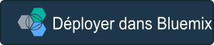

---

 

copyright:

  years: 2015, 2016

 

---

{:new_window: target="_blank"}
{:shortdesc: .shortdesc}
{:screen: .screen}
{:codeblock: .codeblock}

#Création d'un bouton Déployer dans {{site.data.keyword.Bluemix_notm}} {: #deploy-button} 

*Dernière mise à jour : 2 mars 2016* 

Le bouton Déployer dans {{site.data.keyword.Bluemix}} est un moyen efficace de partager votre application publique hébergée par Git de sorte que d'autres personnes puissent tester le code
et le déployer dans {{site.data.keyword.Bluemix_notm}}. Il nécessite une configuration minimale et vous pouvez l'insérer à n'importe quel emplacement prenant en charge le balisage. Un utilisateur qui clique sur le bouton crée une copie clonée du code dans un nouveau référentiel Git pour que votre application d'origine ne soit pas affectée. 
{: shortdesc} 

**Astuce :** si l'image de marque de votre entreprise est importante, vous pouvez [incorporer un flux de trame d'information Déployer dans {{site.data.keyword.Bluemix_notm}}](../develop/deploy_button_embed.html) à votre contenu plutôt qu'insérer un bouton. Lorsque des personnes créent une copie clonée de votre application publique hébergée par Git, elles restent dans votre contenu au lieu d'être redirigées vers le site Web bluemix.net. 

Lorsqu'un utilisateur clique sur votre bouton, les actions suivantes se produisent : 

1. Si la personne ne possède pas de compte {{site.data.keyword.Bluemix}} actif, un compte d'essai doit être créé. 

2. La personne peut sélectionner une région, une organisation, un espace et un nom d'application. Le nom d'application suggéré est construit à partir du nom d'application précédent, du nom d'utilisateur de la personne et de l'heure. 

3. La branche principale du référentiel Git public d'origine est clonée dans un nouveau projet {{site.data.keyword.jazzhub_title}} privé avec un nouveau référentiel Git. 

4. Si l'application requiert un fichier de génération, le fichier de génération est détecté automatiquement et l'application est générée. 

5. Si un pipeline est configuré pour le processus de génération et de déploiement, un fichier `pipeline.yml` est utilisé pour
déployer l'application.

6. Si l'application requiert un conteneur, un fichier `pipeline.yml` définissant le service **IBM Containers**
et un document Dockerfile définissant une image sont utilisés pour déployer l'application dans un conteneur {{site.data.keyword.Bluemix_notm}}. 

7. L'application est déployée dans l'organisation {{site.data.keyword.Bluemix_notm}} de la personne. 

##Exemples de bouton {: #button-examples} 

Exemple de bouton d'application pour un référentiel {{site.data.keyword.jazzhub_short}} public :

 

Exemple de bouton d'application pour un référentiel GitHub public : 

 

Exemple de bouton permettant de voir si une application est déployée dans un conteneur {{site.data.keyword.Bluemix_notm}} : 

 

##Création d'un bouton {: #create-button}

Pour créer un bouton Déployer dans {{site.data.keyword.Bluemix_notm}} : 

<ol>
<li> Copiez et modifiez l'un des modèles de fragment suivants et incluez un référentiel Git public.

<strong>Astuce</strong> : Pour spécifier l'entrée de génération d'un projet DevOps Services, ajoutez un paramètre de branche dans l'URL Git. Lorsque vous ajoutez un paramètre de branche, le référentiel Git public d'origine, avec toutes ses branches, est cloné dans un nouveau projet DevOps Services privé avec un nouveau référentiel Git. La branche Git indiquée est définie comme entrée du travail de génération. Si vous n'indiquez pas de branche, l'entrée du travail de génération et défini sur la branche principale par défaut.

<ul>
<li>HTML :

Branche principale par défaut :

<pre class="codeblock">
&lt;a href="https://bluemix.net/deploy?repository=&lt;URL_référentiel_Git>" # [required]&gt;&lt;img src="https://bluemix.net/deploy/button.png" alt="Déployer dans Bluemix"&gt;&lt;/a&gt;
</pre>

Branche Git indiquée :

<pre class="codeblock">
&lt;a href="https://bluemix.net/deploy?repository=&lt;URL_référentiel_Git&gt;&branch=&lt;branche_Git>" # [required]&gt;&lt;img src="https://bluemix.net/deploy/button.png" alt="Déployer dans Bluemix"&gt;&lt;/a&gt;
</pre>
</li>
<li>Markdown :

Branche principale par défaut :

<pre class="codeblock">
[&#33;[Déployer dans Bluemix]&#40;https://bluemix.net/deploy/button.png&#41;]&#40;https://bluemix.net/deploy?repository=&lt;URL_référentiel_Git> # [required]&#41;
</pre>

Branche Git indiquée :

<pre class="codeblock">
[&#33;[Déployer dans Bluemix]&#40;https://bluemix.net/deploy/button.png&#41;]&#40;https://bluemix.net/deploy?repository=&lt;URL_référentiel_Git> &branch=&lt;branche_Git&gt; # [required]&#41;
</pre>
</li>
</ul>
</li>
<li>Insérez le fragment dans des blogues, des articles, des wikis, des fichiers Readme et partout où vous voulez promouvoir votre application. 
</li>
</ol>

##Remarques sur le fragment du bouton {: #button-snippet}

Tenez compte de ces remarques lorsque vous personnalisez le fragment de votre bouton Déployer dans Bluemix. 

* Les deux modèles utilisent un chemin d'accès par défaut à une image de bouton externe au format PNG en anglais. 

    * Si vous préférez à la place utiliser une image SVG pour le bouton, une version SVG est disponible. Vous pouvez remplacer le chemin d'accès à l'image de bouton externe, qui est utilisée dans le fragment, par `https://bluemix.net/deploy/button.svg`.
	
	* Si vous préférez utiliser une image plus grande pour le bouton, une image PNG deux fois plus grande que l'image d'origine est disponible. Vous pouvez remplacer le chemin d'accès à l'image de bouton externe, qui est utilisée dans le fragment, par `https://bluemix.net/deploy/button_x2.png`. 
	
	* Si vous préférez stocker l'image localement, vous pouvez la télécharger et la stocker dans votre référentiel Git. Ajustez le chemin d'accès pour qu'il reflète l'emplacement relatif de l'image. 
	
	* Si vous voulez utiliser une version traduite du bouton, vous pouvez la référencer à distance ou la télécharger depuis [ftp://public.dhe.ibm.com/cloud/bluemix/deploy_button](ftp://public.dhe.ibm.com/cloud/bluemix/deploy_button). 
	
##Remarques sur le référentiel du bouton {: #button-repo} 

Tenez compte de ces remarques pour le référentiel de projet que vous allez utiliser dans votre bouton Déployer dans Bluemix. 

<ul>
<li>Il n'est pas nécessaire que votre référentiel contienne un fichier <code>manifest.yml</code>. Toutefois, si votre application requiert l'exécution d'autres services, vous devez fournir un fichier manifeste qui déclare ces services.  

Le fichier manifeste vous permet d'indiquer : 
    <ul>
    <li>Un nom d'application unique.</li>  
    <li>Des services déclarés : une extension de manifeste, qui crée ou recherche les services requis ou facultatifs devant être configurés avant le déploiement de l'application, comme un service de cache de données. Vous pouvez afficher la liste des services, des libellés et des plans {{site.data.keyword.Bluemix_notm}} éligibles à l'aide de l'<a href="https://github.com/cloudfoundry/cli/releases">interface de ligne de commande CF</a>, en exécutant la commande <code>cf marketplace</code> ou en parcourant le <a href="https://console.ng.bluemix.net/?ssoLogout=true&cm_mmc=developerWorks-*-dWdevcenter-*-devops-services-_-lp#/store">catalogue {{site.data.keyword.Bluemix_notm}}</a>. 
    
    <strong>Remarque :</strong> les services déclarés constituent une extension IBM du format de manifeste Cloud Foundry standard. Cette extension est susceptible d'être révisée dans une édition ultérieure, parallèlement à l'évolution et à l'amélioration de la fonction.
	
	<a href="http://docs.cloudfoundry.org/devguide/deploy-apps/manifest.html#minimal-manifest" target="_blank">Apprenez à créer un fichier <code>manifest.yml</code>.</a>  
<pre class="codeblock">
	---
    #Modèle de fichier manifest.yml

  declared-services:
    &lt;`nom_instance_service_arbitraire`&gt;:  # [required]
      label: &lt;`nom_service_réel`&gt; # [required] Nom du service réel de la place de marché
      plan: Shared # [optional] Si indiqué, utilisé pour extraire le service déclaré. Sinon, prend par défaut la valeur 'Free' ou 'free'.
  applications:
  - services
    - &lt;`nom_instance_service_arbitraire`&gt;
    name: &lt;`nom_app`&gt;
    host: &lt;`nom_hôte_app`&gt;
</pre>

<pre class="codeblock">
	---
    #Exemple de fichier manifest.yml

  declared-services: 
      sample-java-cloudant-cloudantNoSQLDB: 
        label: cloudantNoSQLDB 
        plan: Shared 
  applications:
  - services
    - sample-java-cloudant-cloudantNoSQLDB
    name: Mon app
    host: monapp
</pre>
   </li>
   </ul>
	<li> Si le référentiel doit être généré avant le déploiement de l'application, une génération automatisée du code dans le référentiel est déclenchée avant le déploiement. Les
générations automatisées ont lieu lorsqu'un fichier script de génération est détecté dans le répertoire racine du référentiel. 
	
	Générateurs pris en charge : 
	    <ul>
		<li> <a href="http://ant.apache.org/manual/using.html" target="_blank">Ant :</a> /<code>build.xml</code>, qui génère la sortie dans le dossier <code>./output/</code> </li>
		<li> <a href="http://docs.cloudfoundry.org/buildpacks/java/build-tool-int.html#gradle" target="_blank">Gradle :</a> <code>/build.gradle</code>, qui génère la sortie dans le dossier <code>.</code> </i>
		<li> <a href="http://gruntjs.com/getting-started#the-gruntfile" target="_blank">Grunt :</a> <code>/Gruntfile.js</code>, qui génère la sortie dans le dossier <code>.</code> </li>
		<li> <a href="http://docs.cloudfoundry.org/buildpacks/java/build-tool-int.html#maven" target="_blank">Maven :</a> <code>/pom.xml</code>, qui génère la sortie dans le dossier <code>./target/</code></li>
	   </ul>
	</li>	
	<li>Afin de configurer un pipeline pour le projet, incluez un fichier <code>pipeline.yml</code> dans un répertoire <code>.bluemix</code>. Vous pouvez créer un fichier <code>pipeline.yml</code> manuellement ou en générer un à partir d'un projet DevOps Services existant. Pour créer un fichier pipeline.yml à partir d'un projet {{site.data.keyword.jazzhub_short}} et l'ajouter à votre référentiel, procédez comme suit. 
<ol>
<li>Ouvrez votre projet DevOps Services dans un navigateur et cliquez sur <b>Build and Deploy</b>.</li>
<li>Configurez votre pipeline avec des travaux de génération et de déploiement.</li>
<li>Dans votre navigateur, ajoutez <code>/yaml</code> à l'adresse URL du pipeline du projet et appuyez sur Entrée. 
 Exemple :
<code>https://hub.jazz.net/pipeline/<propriétaire>/<nom_projet>/yaml</code></li>
<li>Enregistrez le fichier <code>pipeline.yml</code> obtenu.</li>
<li>Dans le répertoire racine de votre projet, créez un répertoire <code>.bluemix</code>.</li>
<li>Téléchargez le fichier <code>pipeline.yml</code> dans le référentiel <code>.bluemix</code>.</li>
</ol> </li>
	<li>Si vous déployez une application dans un conteneur en utilisant <strong>IBM Containers</strong>, vous devez inclure le document Dockerfile dans le répertoire racine du référentiel et inclure un fichier <code>pipeline.yml</code> dans un répertoire <code>.bluemix</code>. 
	<ul>
	    <li> Pour en savoir plus sur la création de documents Dockerfile, <a href="https://docs.docker.com/reference/builder/" target="_blank">voir la documentation Docker</a>. </li>
	    <li>Vous pouvez créer un fichier <code>pipeline.yml</code> manuellement ou en générer un à partir d'un projet DevOps Services existant. Pour créer manuellement un fichier <code>pipeline.yml</code> propre à des conteneurs, <a href="https://github.com/Puquios/" target="_blank">consultez les exemples dans GitHub</a>. </li>
        </ul>

 </li>
 </ul>
</ul>

Pour obtenir de l'aide relative au traitement des incidents, voir [Le bouton Déployer dans Bluemix ne déploie pas d'application](../troubleshoot/index.html#deploytobluemixbuttondoesntdeployanapp){:new_window}.	
