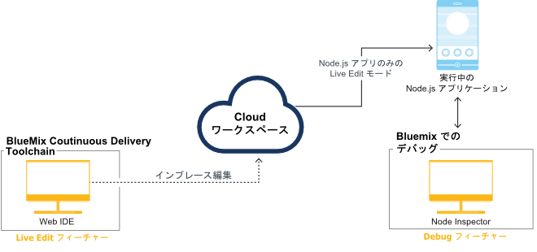

---


copyright:

  years: 2015，2016


---

{:shortdesc: .shortdesc}
{:screen: .screen}
{:new_window: target="_blank"}
{:pre: .pre}

#{{site.data.keyword.Bluemix_notm}} Live Sync {: #live-sync}

*最終更新日: 2016 年 4 月 07 日*  

Node.js アプリケーションを作成する場合、{{site.data.keyword.Bluemix}} Live Sync を使用すると、{{site.data.keyword.Bluemix_notm}} にあるアプリケーション・インスタンスを迅速に更新して、デスクトップにある場合と同じように再デプロイせずに開発することができます。   
{: shortdesc}

変更を行うと、実行中の {{site.data.keyword.Bluemix_notm}} アプリケーションでその変更を即時に確認できます。
{{site.data.keyword.Bluemix_notm}} Live Sync は、コマンド・ラインと Web IDE 内のどちらからでも機能します。Node.js で書かれたアプリケーションを {{site.data.keyword.Bluemix_notm}} Live Sync を使用してデバッグできます。  

{{site.data.keyword.Bluemix_notm}} Live Sync は、3 つのフィーチャーで構成されています。

**Desktop Sync**  
    Dropbox の動作と同じように、デスクトップの任意のディレクトリー・ツリーをクラウド・ベースのプロジェクト・ワークスペースと同期させることができます。Web IDE は、同じクラウド・ベース・ワークスペースを直接編集するので、両者は常に同期が取れた状態にあります。Desktop Sync は、どのような種類のアプリケーションに対しても機能します。Desktop Sync を使用するには、BL コマンド・ライン・インターフェースをダウンロードしてインストールする必要があります。  

**Live Edit**
    {{site.data.keyword.Bluemix_notm}} で実行中の Node.js アプリケーションに変更を加え、その変更をブラウザーで直ちにテストすることができます。同期されているデスクトップ・ディレクトリー内または Web IDE 内で加えた変更はすべて、直ちに当該アプリケーションのファイル・システムに伝搬されます。  

**Debug**  
    Node.js アプリケーションが Live Edit モードになっている間は、そのアプリケーションにシェルを作成してデバッグできます。Node Inspector というデバッガーを使用して、コードの動的な編集、ブレークポイントの挿入、コードのステップスルー、ランタイムの再始動などを行うことができます。  

Desktop Sync を使用すれば、デスクトップのワークスペースを、Web IDE を使用して直接編集するクラウド・ベースのプロジェクト・ワークスペースと同期が取れた状態で維持することができます。Live Edit を使用すれば、クラウド・ベースのプロジェクト・ワークスペース内の変更内容を、実行中のアプリケーションに伝搬させることができます。この 2 つのフィーチャーは、いずれか 1 つを使用することも、両方使用することもできます。そして、Desktop Sync または Live Edit を使用してアプリケーションを Live Edit モードにすると、実行中のアプリケーションをデバッグできます。

Bluemix Live Sync プロセスを以下の図に示します。

*図 1. Bluemix Live Sync プロセス*


Liberty で実行される Java アプリケーションを開発している場合、[Eclipse Tools for Bluemix](../manageapps/eclipsetools/eclipsetools.html#eclipsetools) を使用してリモートでデバッグすることができます。

##Desktop Sync {: #desktop-sync}

Bluemix Live Sync の Desktop Sync フィーチャーを使用すれば、{{site.data.keyword.Bluemix_notm}} にあるアプリケーション・インスタンスを素早く更新し、デスクトップにある場合と同じように開発することができます。

Desktop Sync では以下の点を考慮してください。
* Desktop Sync は、以下のオペレーティング・システムで稼働します。
  * Windows 7 または 8
  * Mac OS X バージョン 10.9 以降
      **注:** Windows には .NET Framework バージョン 4.5 が必要です。.NET がインストールされていない場合、{{site.data.keyword.Bluemix_notm}} Live Sync コマンド・ライン・インターフェース (CLI) のインストール時に、それもインストールするようにプロンプトが出されます。  
* Git リポジトリーの複製は不要です。
* 開発するアプリケーションのタイプに関わらず、デスクトップのプロジェクトをクラウド・ワークスペースと同期させることができます。
* アプリケーションが Node.js で書かれている場合、変更内容を実行中のアプリケーションに伝搬できます。

コマンドについて詳しくは、[「Bluemix Live Sync (bl) コマンド」](bluemixlive.html#bl-commands)を参照してください。

<ol>
<li><a class="xref" href="https://hub.jazz.net/" target="_blank" alt="Bluemix DevOps Services">Bluemix DevOps Services</a> の無料アカウントを登録します。</li>
<li>{{site.data.keyword.Bluemix_notm}} Live Sync bl コマンド・ラインをダウンロードし、インストールします。   
<p>
<a class="xref" href="http://livesyncdownload.ng.bluemix.net/downloads/blive_setup.msi" target="_blank" title="(新しいタブまたはウィンドウで開きます)"> </a>
<a class="xref" href="http://livesyncdownload.ng.bluemix.net/downloads/BluemixLive.pkg" target="_blank" title="(新しいタブまたはウィンドウで開きます)"> </a>
</p>  

<strong>重要:</strong> bl コマンド・ライン・ツールは、Windows 7 と 8、および Mac OS X バージョン 10.9 以降でのみ使用可能です。</li>

<li>コマンド・ラインで、以下のコマンドを使用してログインします。IBM ID とパスワードを求めるプロンプトが出されます。  
<pre class="codeblock">bl login</pre>
</li>

<li>以下のコマンドを入力して、{{site.data.keyword.Bluemix_notm}} Live Sync で同期できるプロジェクトのリストを表示します。
<pre class="codeblock">bl projects</pre>
<p>ご使用のアプリケーションに一致するプロジェクト名をリスト内で見つけます。プロジェクト名のフォーマットは、<i>your alias</i> | <i>your application name</i> です。</p>
</li>
<li>以下のコマンドを入力し、ローカル環境を {{site.data.keyword.Bluemix_notm}} 上のプロジェクトと同期させます。プロジェクトの所有者なら、projectName に your-application-name を指定すれば済みます。<pre class="codeblock">bl sync projectName -d localDirectory --verbose</pre>
<p>このコマンドは、「q」を入力するまで継続して実行されます (そして同期化が続行されます)。--verbose オプションにより、ロギング情報と状況情報が表示されます。引数に空白を含むものがある場合は、名前を引用符で囲む必要があります。</p></li>
<li>別のコマンド・ライン・ウィンドウのローカル・ディレクトリーで以下のコマンドを入力し、アプリケーションを Live Edit モードで {{site.data.keyword.Bluemix_notm}} にデプロイします。
<pre class="codeblock">bl start</pre>
</li>
</ol>

ローカル・ディレクトリーにあるファイルを変更すると、その変更内容は、{{site.data.keyword.Bluemix_notm}} で稼動しているアプリケーションとプロジェクト・クラウド・ワークスペースの両方に自動的に伝搬します。
Node アプリケーションの再始動が必要な場合は、以下のコマンドを使用できます。
```
bl start --restart 
```

##Live Edit {: #live-edit}

Node.js アプリケーションをビルドしている場合、Web IDE を使用してプロジェクトに変更を加えると、{{site.data.keyword.Bluemix_notm}} Live Sync の Live Edit フィーチャーによって、{{site.data.keyword.Bluemix_notm}} で実行中のアプリケーションを素早く更新できます。Live Edit を使用すれば、デスクトップにある場合と同じように再デプロイせずに開発することができます。

Live Edit がサポートされるのは Node.js アプリケーションのみです。

Web IDE の実行バーで、**「Live Edit」**をクリックします。


Live Edit を使用すれば、{{site.data.keyword.Bluemix_notm}} で実行中の Node.js アプリケーションに対する変更を迅速にプレビューできます。Live Edit をオンにしてコードを更新すると、変更を加えてからほんの数秒で、Web アプリケーションのブラウザー・ウィンドウを最新表示して変更が反映されたことを確認できます。

{{site.data.keyword.Bluemix_notm}} Live Sync の Live Edit フィーチャーの使用に関するチュートリアルについては、「[Bluemix Live Sync を使用した Node.js アプリのテストおよびデバッグ](https://hub.jazz.net/tutorials/livesync)」チュートリアルを参照してください。

Web IDE 内でファイルを変更すると、それらのファイルは {{site.data.keyword.Bluemix_notm}} で実行中のアプリケーションに自動的に再デプロイされます。Node アプリケーションの再始動が必要な場合、実行バーにある **「再始動」**ボタンを使用できます。

**注:** {{site.data.keyword.Bluemix_notm}} Live Sync の Live Edit フィーチャーの使用時に、内容がより整合したものになるには、256 MB の追加メモリーが必要であり、メモリーが追加されます。

##{{site.data.keyword.Bluemix_notm}} Live Debug {: #live-debug}

{{site.data.keyword.Bluemix_notm}} Live Sync が Node.js アプリに対して使用可能になっている場合、{{site.data.keyword.Bluemix_notm}} Live Sync Debug フィーチャーにアクセスできます。

Debug を使用すると、アプリが {{site.data.keyword.Bluemix_notm}} で実行されている間に、コードの動的な編集、ブレークポイントの挿入、コードのステップスルー、ランタイムの再始動などを行うことができます。{{site.data.keyword.Bluemix_notm}} の多数のサービスのリストから選択しながら、アプリを段階的に素早く開発できます。

{{site.data.keyword.Bluemix_notm}} Live Debug には、以下のフィーチャーが含まれています。

* アプリケーション・ランタイム制御
* [node-inspector](https://github.com/node-inspector/node-inspector) を使用したデバッグ
* シェル・アクセス

###アプリケーション・ランタイム制御{: #app-runtime}

アプリケーション・ランタイム制御により、Debug を使用してアプリの開始時の状態を検査することができます。この機能は、始動時に異常終了するアプリをトラブルシューティングする際に役立ちます。

アプリの開発中、次のアクションから選択できます。

* アプリの素早い再始動を実行する。
* アプリのコードが実行される前にアプリを一時停止する。

###Debug {: #debug}

Debug には、以下の機能が含まれています。

**制限:** Google Chrome が必要です。

* アプリ・コードにブレークポイントを設定して、特定の行で実行を一時停止する。
* ブレークポイントの条件を編集して、特定の条件が満たされた場合にのみ実行を一時停止する。
* ローカル変数やフィールドの状態を検査する。
* `console.log()` 呼び出しからのデバッグ出力を即座に表示する。cf ログをモニターするより、このアクションの方がより迅速です。
* 組み込みソース・コード・エディターを使用して、実行中のアプリ・コードに即時 (ただし一時的な) 変更を行う。

###シェル {: #shell}

このツールは、アプリが実行されているコンテナーへのシェル・アクセスを提供します。この端末を使用することにより、診断シェル・コマンドをリモート側で実行してアプリを管理することができます。

標準的な Linux コマンド (**top**、**ps**、および **kill** など) を使用するインスタンス内でメモリーおよび CPU の使用量をモニターします。

###{{site.data.keyword.Bluemix_notm}} Live Debug を使用可能にするためのアプリの構成{: #configure_app_debug}

アプリは、IBM SDK for Node.js ビルドパックを使用する必要があります。カスタム・ビルドパックはサポートされていません。

1. ビルドパックがアプリの start コマンドを検出できるようにします。start コマンドは、`manifest.yml` ファイル内に設定されるのではなく、ビルドパックによって自動検出される必要があります。  

    a. `package.json` ファイルに、アプリの start コマンドを含む開始スクリプトを含めるようにします。  
    b. アプリの `manifest.yml` ファイルにコマンドが含まれている場合は、それをヌルに設定します。  

2. 環境変数を設定します。  

    a. `manifest.yml` ファイルに次の変数を追加します。
	```
	env:
      ENABLE_BLUEMIX_DEV_MODE: "true" 
	```

3. メモリーを増やします。  

    a. アプリの `manifest.yml` ファイルで、メモリー属性に指定されている値に 128M 以上を追加します。

{{site.data.keyword.Bluemix_notm}} Live Debug がインストールされたら、デバッグ・ツールを使用することができます。

アプリをプッシュし、`https://app-host.mybluemix.net/bluemix-debug/manage` を参照して {{site.data.keyword.Bluemix_notm}} デバッグ・ユーザー・インターフェースにアクセスします。プロンプトが出されたら、認証のために IBM ID とパスワードを入力してください。

###アプリ構成の復元および Bluemix Live Debug の使用不可化{: #restore_live_debug}

1. アプリの `manifest.yml` ファイルから ENABLE_BLUEMIX_DEV_MODE 環境変数を削除します。

2. アプリの、元の start コマンドとメモリー値を復元します。

3. アプリをプッシュします。

## {{site.data.keyword.Bluemix_notm}} Live Sync (bl) コマンド{: #bl-commands}

Node.js アプリケーションを構築する場合、{{site.data.keyword.Bluemix_live}} を使用して、
{{site.data.keyword.Bluemix_notm}} で実行中のアプリケーション・インスタンスを即時に更新して、デスクトップの場合と同じように再デプロイせずに開発することができます。
変更を行うと、実行中の {{site.data.keyword.Bluemix_notm}} アプリケーションでその変更を即時に確認できます。
{{site.data.keyword.Bluemix_live}} のコマンド・ライン・インターフェースは、*bl* と呼ばれます。
{:shortdesc}

**bl** コマンド・ライン・インターフェース・コマンドを使用して、次のタスクを完了できます。

* {{site.data.keyword.Bluemix_notm}} で実行中のアプリケーションの開始と停止。
* デスクトップからのクラウド・ベースのプロジェクトの新規作成。
* デスクトップの変更を、クラウド・ベースのプロジェクト・ワークスペースおよび {{site.data.keyword.Bluemix_notm}} で実行中のアプリケーションに同期。
* 同期に使用可能なプロジェクトのリストの表示。
* 実行中のアプリケーションの状況の表示。

bl コマンドのダウンロードと使用について詳しくは、[Bluemix Live Sync](../develop/bluemixlive.html) を参照してください。

## bl コマンド
{: #bl_commands}

{{site.data.keyword.Bluemix_live}} コマンド・ライン **bl** の構文は次のとおりです。

```
bl command [arguments][options] [--help]
```
{: pre}

**command**

l *login*: {{site.data.keyword.Bluemix_notm}} にログインします。

lo *logout*: {{site.data.keyword.Bluemix_notm}} からログアウトします。

s *sync*: デスクトップとサーバー間の同期化処理を開始します。

c *create*: プライベート・プロジェクトを作成し、それをこのディレクトリー内の Git リポジトリーにリンクして、コンテンツを {{site.data.keyword.Bluemix_notm}} にデプロイします。

p *projects*: 同期に使用可能なすべてのプロジェクトをリストします。

st *start*: {{site.data.keyword.Bluemix_notm}} のアプリケーション・インスタンスを開始します。

sp *stop*: {{site.data.keyword.Bluemix_notm}} のアプリケーション・インスタンスを停止します。

ss *status*: {{site.data.keyword.Bluemix_notm}} の実行中のアプリケーション・インスタンスの状況をリストします。


**arguments**

コマンドの引数。


**options**

コマンドのオプション。

**グローバル・オプション**

*--help*: 指定されたコマンドのヘルプ・ページを表示します。

*--verbose*: 詳細ロギングを有効にします。

**注:** 引数またはオプションにスペースが含まれる場合、値を二重引用符で囲んでください。

## help
{: bl_help}

```
bl [ command ] --help | --h
```
{: pre}

**使用量**

このコマンドを使用して、コマンドまたはコマンド・リストに関するヘルプを表示します。

**例**

コマンドのリストを表示します。

```
bl --help
```
{: pre}

sync コマンドに関する詳細情報を表示します。

```
bl sync --help
```
{: pre}

## login
{: bl_login}

```
bl login | l [ -u username ][-p password ][ -s server ]
```
{: pre}

**目的**

このコマンドは、{{site.data.keyword.Bluemix_notm}} にログインするために使用します。ログインは、セッションごとに 1 回のみ行う必要があります。


**警告:**コマンド・ライン・オプションは他のユーザーから見えるようになっており、コマンド・ヒストリーの一部として記録されるため、コマンド・ライン・オプションでパスワードを指定することは避けてください。

**注:** ログインする前に、<a class="xref" href="https://hub.jazz.net/" target="_blank" alt="Bluemix DevOps Services">Bluemix DevOps Services</a> の無料アカウントを登録する必要があります。

**options**

-u *username*: {{site.data.keyword.Bluemix_notm}} へのログインに使用する IBM ID。

-p *password*: IBM ID のパスワード。

-s *server*: {{site.data.keyword.jazzhub_short}} サーバーのサーバー名または IP アドレス。

**例**

次のコマンドを実行すると、*username* と *password* の両方の入力を求めるプロンプトが出されます。


```
bl login```
{: pre}

ユーザー `name@company.com` でログインします。

```
bl login –u name@company.com –p pa55w0rd```
{: pre}

ユーザー `name@company.com`、パスワード *pa55 w0rd* でログインします。このパスワードはスペースを含むため、引用符で囲む必要があります。

```
bl login –u name@company.com –p “pa55 w0rd”```
{: pre}

## ログアウト
{: bl_logout}

```
bl logout | lo
```
{: pre}

**目的**

このコマンドを使用して、ログアウトします。

## プロジェクト
{: bl_projects}

```
bl projects | p
```
{: pre}

**目的**

このコマンドを使用して、ログイン・ユーザーが同期の対象として選択できるすべてのプロジェクトをリストします。


## sync
{: bl_sync}

```
bl sync | s projectName -d localDirectory [ --overwritelocal ][ --overwriteremote ] [ --verbose ]
```
{: pre}

**目的**

このコマンドを使用して、ローカル・ディレクトリーとのプロジェクト内容の同期を開始します。
このコマンドは、<code>q</code> が入力されるまで実行されます。
このコマンドでは、オプションで、ファイルおよびアプリケーションのすべての状態変更のログを表示することができます。


**引数**

*projectName*: *“alias | mproject”* という形式のプロジェクト名、または、ログイン・ユーザーが所有しているプロジェクトの場合は単に *myproject* のみのプロジェクト名。

**options**

-d *localDirectory*: ローカル・ディレクトリー・パス。デフォルトでは、現行フォルダー "." です。

*--overwritelocal*: プロジェクト・ワークスペースの内容でローカル・ディレクトリーを上書きします。

*--overwriteremote*: ローカル・ディレクトリーの内容でプロジェクト・ワークスペースを上書きします。

*--verbose*: 詳細ロギングを表示します。

**例**

次のコマンドは、現行ディレクトリーが既存の同期ターゲットであれば、関連プロジェクトとの同期を開始します。
現行ディレクトリーが空であり既存の同期ターゲットではない場合に、このコマンドを実行すると、*projectName* の入力を求めるプロンプトが出されます。
現行ディレクトリーが空ではなく、既存の同期ターゲットでない場合は、上書きオプションが必要です。


```
bl sync```
{: pre}

該当プロジェクトをログイン・ユーザーが所有する場合、
このコマンドは同期を開始し、`bl sync “alias |
myproject”` と同等の処理を行います。


```
bl sync  myproject```
{: pre}

次のコマンドは、
プロジェクト `my pro ject` との同期を開始します。この名前はスペースを含むため、引用符で囲みます。


```
bl sync “my pro ject”
```
{: pre}

次のコマンドは、
プロジェクト `myproject` とディレクトリー `myfolder` の同期を開始します。

```
bl sync myproject –d  myfolder```
{: pre}

## 作成
{: bl_create}

```
bl create | c [ -n PROJECT_NAME ][ -r REGION ] [ -o ORG ][ -s SPACE ] [ -g GIT_REPO ][-e GIT_EXE ] [ --creds ][ --fork ] [ --public ][ --prompt ]
```
{: pre}

**目的**

このコマンドをコードが入っているディレクトリーから使用して、プライベート・プロジェクトを作成し、そのプロジェクトを Git リポジトリーにリンクし、そのリポジトリーのコンテンツを {{site.data.keyword.Bluemix_notm}} にデプロイします。

**options**

-n *PROJECT_NAME*: プロジェクトの名前。デフォルト: 現行ディレクトリー名。

-r *REGION*: {{site.data.keyword.Bluemix_notm}} 地域。デフォルト: 米国南部。

-o *ORG*: {{site.data.keyword.Bluemix_notm}} 組織。デフォルト: 検出された最初の組織。

-s *SPACE*: {{site.data.keyword.Bluemix_notm}} スペース。デフォルト: 検出された最初のスペース。

-g *GIT_REPO*: 既存の Git リポジトリーで使用するリモート・リポジトリーの名前。デフォルト: 発信元。

-e *GIT_EXE*: Git 実行可能ファイルの絶対パス。デフォルト: detected。

*--creds*: Git 資格情報を求めるプロンプトを出します。

*--fork*: このディレクトリーをフォークしてプロジェクトおよびリポジトリーを作成します。

*--public*: 新規プロジェクトをパブリックにします。

*--prompt*: すべての必須指定のオプションを求めるプロンプトを出し、有効な選択項目を示します。

**例**

以下のコマンドは、プライベート・プロジェクトの作成プロセスを開始し、使用するプロジェクト名を求めるプロンプトを出します。

```
bl create```
{: pre}

以下のコマンドは、`myNewProject` という名前のパブリック・プロジェクトを作成します。

```
bl create -n myNewProject --public```
{: pre}

## 状況
{: bl_status}

```
bl status | ss [ projectName ]
```
{: pre}

**目的**

このコマンドを使用して、`./launchConfigurations` ディレクトリーの起動構成に関連付けられたアプリケーションの状況をリストします。

**引数**

*projectName*: `“alias | myproject”` という形式のプロジェクト名、または、ログイン・ユーザーが所有しているプロジェクトの場合は単に `myproject` のみのプロジェクト名。

**例**

この例では、実行中のアプリケーションの状況を表示します。現行ディレクトリーが既存の同期ターゲットであれば、関連付けられたプロジェクトを使用します。
現行ディレクトリーが既存の同期ターゲットではない場合にこのコマンドを実行すると、`projectName` の入力を求めるプロンプトが出されます。


``
bl status ```
{: pre}

該当プロジェクトをログイン・ユーザーが所有する場合、
この例は、プロジェクト *myproject* の状況を表示し、`bl status “alias |
myproject”` と同等です。


```
bl status myproject```
{: pre}

次の例では、プロジェクト `my pro ject` に関連付けられた実行中のアプリケーションの状況を表示します。このプロジェクト名はスペースを含むため、引用符で囲みます。


```
bl status “my pro ject”```
{: pre}

## 開始
{: bl_start}

```
bl start | st projectName [ -l launchConfigPath ] -m manifestPath ] [ --liveedit ][--noliveedit ] [ --restart ]
```
{: pre}

**目的**

このコマンドを使用して、起動ファイルまたはマニフェスト・ファイルによって記述されたアプリケーション・インスタンスを開始します。
アプリケーションのビルドパックがライブ編集をサポートする場合、アプリケーションは、デフォルトでライブ編集モードで起動されます。
開始されると、アプリケーションの URL、デバッグ・ツール、および {{site.data.keyword.Bluemix_notm}} ダッシュボードが表示されます。

**引数**

*projectName*: *“alias | myproject”* という形式のプロジェクト名、または、ログイン・ユーザーが所有しているプロジェクトの場合は単に *myproject* のみのプロジェクト名。

**options**

-l *launchConfiguration*: 起動構成名 (例えば `mylaunchconfig`)、ファイル名 (例えば `mylaunchconfig.launch`)、または起動構成ファイルのプロジェクト相対パス (例えば `launchConfigurations/mylaunchconf.launch`)。

-m *manifestPath*: マニフェスト・ファイルのプロジェクト相対パス (例えば `manifest.yml`)。

*--liveedit*: 関連付けられたアプリケーションをライブ編集モードで開始します。ビルドパックがライブ編集モードをサポートしない場合は、エラーで終了します。

*--noliveedit*: 関連付けられたアプリケーションを通常モードで開始します。

*--view*: 実行中のアプリケーションのブラウザーを開きます。

*--restart*: ライブ編集モードで既に実行中のアプリケーションを再デプロイせずに再始動します。

**例**

次のコマンドは、起動ファイル `launchConfigurations/my.launch` に関連付けられた
`myproject` のアプリケーション・インスタンスを開始します。


```
bl start myproject –l “launchConfigurations/my.launch”```
{: pre}

次のコマンドは、起動ファイル `launchConfigurations/my.launch`
で現行ディレクトリーに関連付けられたプロジェクトのアプリケーション・インスタンスを開始します。
現行ディレクトリーが同期ターゲットではない場合、エラーが表示されます。


```
bl start –l “launchConfigurations/my.launch” ```
{: pre}

次のコマンドは、マニフェスト・ファイル `manifest.yml`
で現行ディレクトリーに関連付けられたプロジェクトのアプリケーション・インスタンスを開始します。
このマニフェストに指定された情報を使用して、新しい起動構成ファイルを作成します。
このコマンドは、必要な残りの情報の入力を求めるプロンプトを出してから、起動構成で記述されたアプリケーションを開始します。


```
bl start –m “mymanifest.yml” ```
{: pre}

次のコマンドは、マニフェスト・ファイル `manifest.yml` で現行ディレクトリーに関連付けられたプロジェクトのアプリケーション・インスタンスを開始します。これは、` bl start –m manifest.yml` と同等です。


```
bl start```
{: pre}

## 停止
{: bl_stop}

```
bl stop | sp projectName [ -l launchConfiguration ]
```
{: pre}

**目的**

このコマンドを使用して、起動ファイルに関連付けられたアプリケーション・インスタンスを停止します。

**引数**

*projectName*: *“alias | mproject”* という形式のプロジェクト名、または、ログイン・ユーザーが所有しているプロジェクトの場合は単に *mproject* のみのプロジェクト名。

**options**

-l *launchConfiguration*: 起動構成名 (例えば `mylaunchconfig`)、ファイル名 (例えば `mylaunchconfig.launch`)、または起動構成ファイルのプロジェクト相対パス (例えば `launchConfigurations/mylaunchconf.launch`)。

**例**

次のコマンドは、現行ディレクトリーが同期ターゲットの場合に、アプリケーションを停止します。
そうでない場合は、エラーで終了します。
起動構成がないと、このコマンドはエラーで終了します。
複数の起動構成がある場合には、停止する構成を指定するように求めるプロンプトがコマンドによって出されます。


```
bl stop```
{: pre}

次のコマンドは、起動ファイル `mylaunchConfig`
を使用して実行中のプロジェクトのアプリケーション・インスタンスを停止します。


```
bl stop myproject –l “mylaunchConfig” ```
{: pre}

次のコマンドは、現行ディレクトリーが、
起動ファイル `launchConfigurations/mylaunchconfig.launch`
で開始された関連プロジェクトの同期ターゲットである場合に、アプリケーションを停止します。
そうでない場合は、エラーで終了します。


```
bl stop –l “launchConfigurations/mylaunchconfig.launch” ```
{: pre}

># 関連リンク{:class="linklist"}
>## チュートリアルおよびサンプル{:id="samples"}
>* [Test and debug a Node.js app with Bluemix Live Sync](https://hub.jazz.net/tutorials/livesync)
>
># 関連リンク{:class="linklist"}
>## 関連リンク{:id="general"}
>* [Eclipse tools for Bluemix](https://www.ng.bluemix.net/docs/manageapps/eclipsetools/eclipsetools.html)   
>
>{:elementKind="article" id="rellinks"}
