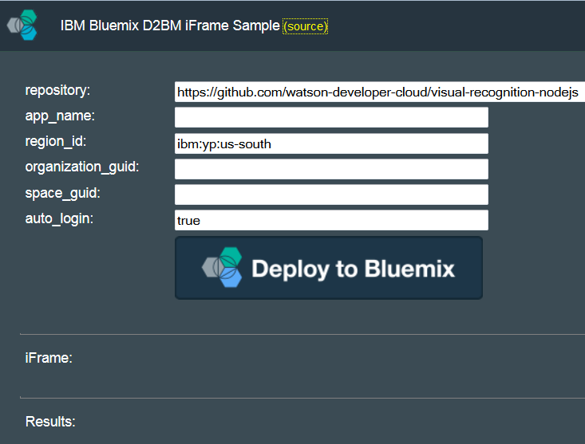

---

copyright:
  years: 2015, 2017
lastupdated: "2017-4-7"

---

{:shortdesc: .shortdesc}
{:screen: .screen}
{:new_window: target="_blank"}
{:codeblock: .codeblock}

#「{{site.data.keyword.Bluemix_notm}} にデプロイ」iFrame フローの埋め込み 
{: #embed-d2bm-iframe}

「{{site.data.keyword.Bluemix_notm}} にデプロイ」フローを iFrame として、マークアップがサポートされている多様なコンテンツに埋め込むことができます。この iFrame は、例えば README ファイル、ブログ、記事、および Web ページに埋め込むことができます。

{: shortdesc}

この iFrame フローは、企業ブランディングを保持したい場合に有用です。埋め込まれた iFrame をクリックしたユーザーは bluemix.net Web サイトにリダイレクトされる代わりに、そのコンテンツ内にとどまります。企業ブランディングに関心がない場合は、iFrame の代わりに普通の[「{{site.data.keyword.Bluemix_notm}} にデプロイ」ボタン](/docs/develop/deploy_button.html)をコンテンツに挿入できます。

##iFrame フローのステップ {: #iframe-steps}

1. アクティブな {{site.data.keyword.Bluemix_notm}} アカウントを持っていない場合はトライアル・アカウントを作成します。

2. 地域、組織、スペース、およびアプリ名を選択できます。推奨アプリ名は、前のアプリ名、ユーザー名、および時刻から作成されます。

3. オリジナルのパブリック Git リポジトリーのマスター・ブランチが、新しい Git リポジトリーを使用した新しいプライベート {{site.data.keyword.jazzhub_short}} プロジェクトに複製されます。

4. アプリにビルド・ファイルが必要な場合、そのビルド・ファイルは自動的に検出されて、アプリがビルドされます。

5. {{site.data.keyword.Bluemix_notm}} 組織にアプリがデプロイされます。

##iFrame フローの例 {: #iframe-example}

<a class="xref" href="http://d2bm-iframe-sample.ng.bluemix.net/" target="_blank" title="(新しいタブまたはウィンドウで開きます)">IBM
Bluemix D2BM iFrame サンプル </a> は、パブリック Git リポジトリーの iFrame フローの例を示します。

このサンプルのソースを表示するには、<a class="xref" href="https://hub.jazz.net/project/idsorg/d2bm-iframe-sample/overview" target="_blank" title="(新しいタブまたはウィンドウで開きます)">ソース </a> をクリックしてください。

##iFrame フローの埋め込み {: #embed-iframe}  

<ol>
<li><a class="xref" href="https://bluemix.net/deploy/embed.js" target="_blank" title="(新しいタブまたはウィンドウで開きます)">https://bluemix.net/deploy/embed.js</a> から JavaScript ユーティリティーをロードします。このユーティリティーは jQuery に依存しており、文書に以下のスクリプト・タグを追加するとロードされます。
<pre class="pre">
<code>&lt;script type="text/javascript" src="https://bluemix.net/deploy/embed.js"&gt;&lt;/script&gt;</code>
</pre>
</li>
<li> 以下の引数を使用して <code>DeployToBluemixIFrame</code> コンストラクターのインスタンスを生成します。<dl class="parml">
<dt class="pt dlterm">domNodeId</dt>
<dd class="pd">iFrame をコンテンツに挿入する domNode の ID。</dd>

<dt class="pt dlterm">callback</dt>
<dd class="pd">この引数は、iFrame フローが完了するか、エラーが発生したときに呼び出されます。この引数はその結果を返します。以下のコード・スニペットは、正常完了の結果としてのコールバックを示します。</dd>

<dt class="pt dlterm">args</dt>
<dd class="pd">ウィジェットへの入力パラメーターを含むオブジェクト。以下のパラメーターが使用可能です。<dl class="parml">

<dt class="pt dlterm">repository</dt>
<dd class="pd">クローン作成とデプロイメントのソースとして使用する Git リポジトリー。この値は必須です。</dd>

<dt class="pt dlterm">app_name</dt>
<dd class="pd">iFrame 内の <strong>app_name</strong> フィールドに指定された値として使用するデフォルトのアプリ名。この値はオプションです。</dd>

<dt class="pt dlterm">region_id</dt>
<dd class="pd">デフォルトのターゲット地域の ID。例えば <code>ibm:yp:us-south</code> です。この値はオプションです。</dd>

<dt class="pt dlterm">organization_guid</dt>
<dd class="pd">デフォルトのターゲット組織の GUID。この値を見つけるには、<strong>「組織の管理」</strong>>「<i>organization_name</i>」をクリックします。その組織の URL に組織の GUID が含まれています。この値はオプションです。</dd>

<dt class="pt dlterm">space_guid</dt>
<dd class="pd">デフォルトのターゲット・スペースの GUID。この値を見つけるには、<strong>「組織の管理」</strong> > 「<i>space_name</i>」をクリックします。そのスペースの URL にスペースの GUID が含まれています。この値はオプションです。</dd>

<dt class="pt dlterm">auto_login</dt>
<dd class="pd">iFrame が自動的にユーザーのログインを行うかどうかを指定します。デフォルト値は <code>true</code> です。この値はオプションです。</dd>

<dt class="pt dlterm">width</dt>
<dd class="pd">iFrame の幅。この値はオプションです。デフォルト値は <code>620</code> です。</dd>

<dt class="pt dlterm">height</dt>
<dd class="pd">iFrame の高さ。この値はオプションです。デフォルト値は <code>470</code>です。</dd>
</dl>

</dd>
</dl>
</li>
</ol>  

**ヒント:** iFrame との対話を最小化するため、**app_name**、**region_id**、**organization_guid**、**space_guid**、および **auto_login** の各フィールドを事前に埋めておくこともできます。
