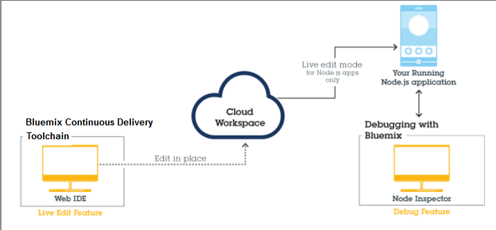

---


copyright:

  years: 2015，2016


---

{:shortdesc: .shortdesc}
{:screen: .screen}
{:new_window: target="_blank"}
{:pre: .pre}

#{{site.data.keyword.Bluemix_notm}} Live Sync {: #live-sync}

*Última atualização: 07 de abril de 2016*  

Se você estiver construindo um aplicativo Node.js, será possível usar o {{site.data.keyword.Bluemix}} Live Sync para atualizar rapidamente a instância do aplicativo no {{site.data.keyword.Bluemix_notm}} e desenvolver da forma usual na área de trabalho sem reimplementar.   
{: shortdesc}

Quando você
fizer uma mudança, será possível ver essa mudança no aplicativo {{site.data.keyword.Bluemix_notm}} em execução
imediatamente. O {{site.data.keyword.Bluemix_notm}} Live Sync funciona a partir da linha de comandos e no Web IDE. É possível depurar aplicativos gravados em Node.js usando o {{site.data.keyword.Bluemix_notm}} Live Sync.  

O {{site.data.keyword.Bluemix_notm}} Live Sync consiste em três recursos.

**Desktop Sync**  
    É possível sincronizar qualquer árvore de diretórios da área de trabalho com uma área de trabalho de projeto baseada em nuvem, semelhante ao modo de funcionamento do Dropbox. O Web IDE edita diretamente a mesma área de trabalho baseada em nuvem, para que ambas permaneçam em sincronização. O Desktop Sync funciona para qualquer tipo de aplicativo. Para usar
o Desktop Sync, você precisa fazer download e instalar a interface da linha de comandos BL.  

**Live Edit**
    É possível fazer mudanças em um aplicativo Node.js em execução no {{site.data.keyword.Bluemix_notm}} e testá-las diretamente em seu navegador. As mudanças feitas em um diretório de área de trabalho sincronizado ou no Web IDE são propagadas para o sistema de arquivos do aplicativo imediatamente.  

**Debug**  
    Enquanto um aplicativo Node.js estiver no modo Live Edit, é possível executar shell nele
e depurá-lo. É possível editar o código dinamicamente, inserir pontos de interrupção,
percorrer o código, reiniciar o tempo de execução e muito mais usando o depurador Node Inspector.  

É possível usar o Desktop Sync para manter sua área de trabalho de desktop em sincronização com a área de trabalho do projeto baseado em nuvem que você edita diretamente com o Web IDE. É possível usar o Live Edit para propagar as mudanças em sua área de trabalho de projeto
baseado em nuvem para seu aplicativo em execução. É possível usar um ou ambos os recursos. E se você usar o Desktop Sync ou o Live Edit para colocar seu aplicativo no modo
Live Edit, poderá depurar seu aplicativo em execução.

O processo Bluemix Live Sync é ilustrado no diagrama a seguir.

*Figura 1. O processo Bluemix Live Sync*


Se você estiver desenvolvendo um aplicativo Java que esteja em execução no Liberty, será possível depurar remotamente usando o [Eclipse Tools for Bluemix](../manageapps/eclipsetools/eclipsetools.html#eclipsetools).

##Desktop Sync {: #desktop-sync}

É possível usar o recurso Desktop Sync do Bluemix Live Sync para atualizar rapidamente a instância de aplicativo no {{site.data.keyword.Bluemix_notm}} e desenvolver da forma usual na área de trabalho.

O Desktop Sync tem as considerações a seguir:
* O Desktop Sync é executado nestes sistemas operacionais:
  * Windows 7 ou 8
  * Mac OS X versão 10.9 ou mais recente
**Nota:** o Windows requer .NET Framework versão 4.5. Se o .NET não estiver instalado, sua instalação será solicitada durante a instalação da interface de linha de comandos (CLI) do {{site.data.keyword.Bluemix_notm}} Live Sync.  
* Não é necessário clonar seu repositório Git.
* Não importa o tipo de aplicativo que você está desenvolvendo, é possível sincronizar seu projeto de desktop com a área de trabalho de nuvem.
* Se seu aplicativo for gravado em Node.js, será possível propagar as mudanças para aplicativos em execução.

Para obter mais detalhes sobre os comandos, consulte [Comandos do Bluemix Live Sync (bl)](bluemixlive.html#bl-commands).

<ol>
<li>Inscreva-se para uma conta grátis do <a class="xref" href="https://hub.jazz.net/" target="_blank" alt="Bluemix DevOps Services">Bluemix DevOps Services</a>.</li>
<li>Faça download e instale a linha de comandos bl do {{site.data.keyword.Bluemix_notm}} Live Sync.   
<p>
<a class="xref" href="http://livesyncdownload.ng.bluemix.net/downloads/blive_setup.msi" target="_blank" title="(Abre em uma nova guia ou janela)"> </a>
<a class="xref" href="http://livesyncdownload.ng.bluemix.net/downloads/BluemixLive.pkg" target="_blank" title="(Abre em uma nova guia ou janela)"> </a>
</p>  

<strong>Importante:</strong> a ferramenta de linha de comandos bl está disponível somente para Windows 7 e 8 e Mac OS X versão 10.9 ou posterior. </li>

<li>Em uma linha de comandos, efetue login usando o comando a seguir. Você será solicitado a fornecer o ID e a senha IBM.  
<pre class="codeblock">bl login</pre>
</li>

<li>Consulte a lista de projetos que estão disponíveis para sincronização do {{site.data.keyword.Bluemix_notm}} Live Sync, inserindo o comando a seguir:
<pre class="codeblock">bl projects</pre>
<p>Localize o nome do projeto
na lista que corresponde ao seu aplicativo. O nome do projeto tem o formato de seu <i>alias</i> | <i>nome do seu aplicativo</i>. </p>
</li>
<li>Sincronize seu ambiente local com o projeto no {{site.data.keyword.Bluemix_notm}}, inserindo o comando a seguir. Se você for o proprietário do projeto, só precisará especificar o nome do seu aplicativo para projectName.
<pre class="codeblock">bl sync projectName -d localDirectory --verbose</pre>
<p>Esse comando continua em execução (e a sincronização continua) até que você insira um
"q". A opção --verbose exibe as informações de criação de log e de status. Se algum de seus argumentos
contiver um espaço, precisará colocar o nome entre aspas. </p></li>
<li>Em outra janela da linha de comandos, em seu diretório local, implemente o aplicativo para
{{site.data.keyword.Bluemix_notm}} no modo Live Edit, inserindo o comando a seguir:
<pre class="codeblock">bl start</pre>
</li>
</ol>

Ao alterar os arquivos em seu diretório local, as mudanças são automaticamente propagadas para ambos,
o aplicativo que está sendo executado no {{site.data.keyword.Bluemix_notm}} e a área de trabalho de nuvem do projeto. Se for necessário reiniciar o aplicativo Node,
é possível usar o comando a seguir:
```
bl start --restart
```

##Live Edit {: #live-edit}

Se você estiver construindo um aplicativo Node.js, ao fazer mudanças no projeto usando o Web IDE, o recurso Live Edit do {{site.data.keyword.Bluemix_notm}} Live Sync pode atualizar rapidamente a instância de aplicativo em execução no {{site.data.keyword.Bluemix_notm}}. O Live Edit permite desenvolver como faria no desktop sem reimplementação.

O Live Edit é suportado para aplicativos Node.js apenas

No Web IDE, na barra de execução, clique em **Live Edit**.


Live Edit permite visualizar rapidamente as mudanças nos aplicativos Node.js em execução no {{site.data.keyword.Bluemix_notm}}. Ao atualizar
seu código com o Live Edit ligado, é possível atualizar sua janela do navegador de aplicativo da Web para
ver essas mudanças refletidas segundos após criá-los.

Para obter um tutorial sobre o uso do recurso Live Edit do {{site.data.keyword.Bluemix_notm}} Live Sync, consulte o tutorial [Testar e depurar um app Node.js com o Bluemix Live Sync](https://hub.jazz.net/tutorials/livesync).

Ao mudar os arquivos no Web IDE, eles são automaticamente reimplementados para seu aplicativo em execução no {{site.data.keyword.Bluemix_notm}}. Se você precisar reiniciar o aplicativo Node, então é possível usar o botão
**Reiniciar** na barra de execução.

**NOTA:** para uma experiência mais consistente ao usar o recurso Live Edit do {{site.data.keyword.Bluemix_notm}} Live Sync, memória adicional de 256 MB é necessária e
será incluída.

##{{site.data.keyword.Bluemix_notm}} Live
Debug {: #live-debug}

É possível acessar o recurso Debug do {{site.data.keyword.Bluemix_notm}} Live Sync quando o {{site.data.keyword.Bluemix_notm}} Live Sync está ativado para o app Node.js.

Com o Debug, é possível editar código dinamicamente, inserir pontos de interrupção, percorrer o código, reiniciar o tempo de execução e muito mais, tudo enquanto seu app está sendo entregue pelo {{site.data.keyword.Bluemix_notm}}. É possível desenvolver incrementalmente seu app com agilidade ao escolher
a partir da grande lista de serviços {{site.data.keyword.Bluemix_notm}}.

O {{site.data.keyword.Bluemix_notm}} Live
Debug inclui os recursos a seguir:

* Controle de tempo de execução do aplicativo
* Depuração usando o [node-inspector](https://github.com/node-inspector/node-inspector)
* Acesso ao shell

###Controle de tempo de execução do aplicativo {: #app-runtime}

Com o controle de tempo de execução do aplicativo, é possível usar o Debug
para inspecionar o estado do app no horário de início. Esse recurso é útil
quando você está solucionando problemas de um app que trava no início.

Enquanto você está desenvolvendo seu app, é possível selecionar a partir das
ações a seguir:

* Executar uma reinicialização rápida do app
* Suspender o app antes da execução de qualquer código de app

###Depurar {: #debug}

O Debug inclui os recursos a seguir:

**Restrição:** o Google Chrome é necessário.

* Veja os pontos de interrupção no código do app para pausar a execução em uma linha
específica.
* Edite as condições do ponto de interrupção para pausar a execução somente quando
determinados critérios forem atendidos.
* Inspecione o estado das variáveis e dos campos locais.
* Visualize a saída de depuração das chamadas `console.log()` imediatamente. Essa ação
é mais rápida do que monitorar logs cf.
* Use o editor de código-fonte integrado para fazer mudanças imediatas, ou mesmo
temporárias, no código do app em execução.

###Shell {: #shell}

Essa ferramenta lhe concede acesso ao shell para o contêiner no qual
seu app está em execução. Usando esse terminal, é possível executar remotamente
os comandos shell de diagnóstico para administrar seu app.

Monitore o uso de memória e CPU na instância que usa comandos Linux padrão, como **top**, **ps** e **kill**.

###Configurando um app para ativar o {{site.data.keyword.Bluemix_notm}} Live
Debug {: #configure_app_debug}

O app deve usar o buildpack do IBM SDK for Node.js. Não há suporte para buildpacks customizados.

1. Permita que o buildpack detecte o comando inicial do app. O comando inicial deve ser detectado automaticamente pelo buildpack, não configurado no arquivo `manifest.yml`.  

    a. Assegure-se de que o arquivo `package.json` contenha um script de início que inclua um comando inicial para o app.  
    b. Se o arquivo `manifest.yml` do app contiver um comando, configure-o como nulo.  

2. Configure a variável de ambiente.  

    a. No arquivo `manifest.yml`, inclua esta variável:
	```
	env:
      ENABLE_BLUEMIX_DEV_MODE: "true"
	```

3. Aumente a memória.  

    a. No arquivo `manifest.yml` do app, inclua 128 M ou mais no valor especificado para o atributo de memória.

Após a instalação do {{site.data.keyword.Bluemix_notm}} Live
Debug, é possível usar as ferramentas de depuração.

Envie por push o app e, em seguida, procure em `https://app-host.mybluemix.net/bluemix-debug/manage` para acessar a interface com o usuário de depuração do {{site.data.keyword.Bluemix_notm}}. Quando solicitado, insira seu ID e senha IBM para autenticação.

###Restaurando configurações do app e desativando o Bluemix Live Debug {: #restore_live_debug}

1. Remova a variável de ambiente ENABLE_BLUEMIX_DEV_MODE do arquivo `manifest.yml` do app.

2. Restaure o comando inicial e o valor de memória originais do app.

3. Envie por push o app.

## Comandos do {{site.data.keyword.Bluemix_notm}} Live Sync (bl)  {: #bl-commands}

Se você estiver construindo um aplicativo Node.js, será possível usar o {{site.data.keyword.Bluemix_live}} para
atualizar rapidamente a instância do aplicativo em execução no {{site.data.keyword.Bluemix_notm}} e
desenvolver da mesma forma como faria na área de trabalho sem reimplementar. Quando você
fizer uma mudança, será possível ver essa mudança no aplicativo {{site.data.keyword.Bluemix_notm}} em execução
imediatamente. A interface da linha de comandos do {{site.data.keyword.Bluemix_live}} é chamada de *bl*.
{:shortdesc}

É possível usar os comandos da interface de linha de comandos **bl** para concluir as tarefas a seguir:

* Inicie e pare um aplicativo que esteja em execução no {{site.data.keyword.Bluemix_notm}}.
* Crie um novo projeto baseado em nuvem a partir de sua área de trabalho.
* Mudanças de sincronização a partir de sua área de trabalho para a área de trabalho do projeto baseada em nuvem e para o aplicativo em execução no {{site.data.keyword.Bluemix_notm}}.
* Consulte a lista de projetos disponíveis para sincronização.
* Consulte o status dos aplicativos em execução.

Para obter informações adicionais sobre download e uso do comando bl, veja [Bluemix Live Sync](../develop/bluemixlive.html).

## Comandos bl
{: #bl_commands}

A linha de comandos do {{site.data.keyword.Bluemix_live}}, **bl**, tem a sintaxe a seguir:

```
comando bl [argumentos][options] [--help]
```
{: pre}

**Comandos**

l *login*: efetuar login no {{site.data.keyword.Bluemix_notm}}.

lo *logout*: efetuar logout do {{site.data.keyword.Bluemix_notm}}.

s *sync*: iniciar o processo de sincronização entre a área de trabalho e o servidor.

c *create*: criar um projeto privado, vinculá-lo ao repositório Git neste diretório e implementar os conteúdos no {{site.data.keyword.Bluemix_notm}}.

p *projects*: listar todos os projetos que estão disponíveis para sincronização.

st *start*: iniciar a instância do aplicativo no {{site.data.keyword.Bluemix_notm}}.

sp *stop*: parar a instância do aplicativo no {{site.data.keyword.Bluemix_notm}}.

ss *status*: listar o status da instância do aplicativo em execução no {{site.data.keyword.Bluemix_notm}}.


**Argumentos**

Argumentos para o comando.


**Opções**

Opções para o comando.

**Opções globais**

*--help*: exibir a página de ajuda para o comando especificado

*--verbose*: ativar a criação de log detalhado.

**Nota:** Se qualquer um de seus argumentos ou opções contiver um espaço, coloque o valor entre aspas duplas.

## Auxílio
{: bl_help}

```
bl [ command ] --help | --h
```
{: pre}

**Uso**

Use esse comando para exibir a ajuda sobre um comando ou a lista de comandos.

**Exemplos**

Exibir a lista de comandos:

```
bl --help
```
{: pre}

Exibir informações detalhadas sobre o comando sync:

```
bl sync --help
```
{: pre}

## Login
{: bl_login}

```
bl login | l [ -u username ][-p password ][ -s server ]
```
{: pre}

**Propósito**

Use esse comando para efetuar login no {{site.data.keyword.Bluemix_notm}}. O log precisa ser feito somente uma vez por sessão.

**Aviso:** é desaconselhável fornecer sua senha como uma opção da linha de comandos, pois estará visível para terceiros e registrada como parte de seu histórico de comandos.

**Nota:** deve-se fazer a inscrição para uma conta grátis do <a class="xref" href="https://hub.jazz.net/" target="_blank" alt="Bluemix DevOps Services">Bluemix DevOps Services</a> antes de efetuar login.

**Opções**

-u *username*: seu ID IBM a ser usado para efetuar login no {{site.data.keyword.Bluemix_notm}}.

-p *password*: Sua senha de ID IBM.

-s *server*: nome do servidor ou endereço IP do servidor {{site.data.keyword.jazzhub_short}}. 

**Exemplos**

Esse comando solicita um *username* e um *password*:

```
bl login
```
{: pre}

Efetue login no usuário, `name@company.com`:

```
bl login –u name@company.com –p pa55w0rd
```
{: pre}

Efetue login no usuário, `name@company.com` com a senha *pa55 w0rd* que contém um espaço; portanto, ele precisa de aspas:

```
bl login –u name@company.com –p “pa55 w0rd”
```
{: pre}

## Logout
{: bl_logout}

```
bl logout | lo
```
{: pre}

**Propósito**

Use esse comando para efetuar logout.

## Projetos
{: bl_projects}

```
bl projects | p
```
{: pre}

**Propósito**

Use esse comando para listar todos os projetos disponíveis para sincronização pelo usuário com login efetuado.

## Sync
{: bl_sync}

```
bl sync | s projectName -d localDirectory [ --overwritelocal ][ --overwriteremote ] [ --verbose ]
```
{: pre}

**Propósito**

Use esse comando para iniciar a sincronização do conteúdo de um projeto com seu diretório local. Esse comando é executado
até que um <code>q</code> seja inserido. Esse comando pode opcionalmente mostrar um log de todas as mudanças
de estado do aplicativo e do arquivo.

**Argumento**

*projectName*: o nome do projeto no formato *“alias | mproject”* ou apenas *myproject* se o projeto for de propriedade do usuário com login efetuado.

**Opções**

-d *localDirectory*: caminho do diretório local. Usa como padrão a pasta atual ".".

*--overwritelocal*: sobrescrever o diretório local com conteúdos da área de trabalho do projeto.

*--overwriteremote*: sobrescrever a área de trabalho do projeto com os conteúdos do diretório local.

*--verbose*: exibir a criação de log detalhado.

**Exemplos**

Este comando inicia a sincronização com o projeto associado, se o diretório atual for um
destino de sincronização existente. Se o diretório atual estiver vazio e não for um destino de sincronização existente,
o comando solicitará um *projectName*. Se o diretório atual não estiver vazio e
não for um destino de sincronização existente, uma opção de sobrescrita será necessária.

```
bl sync
```
{: pre}

Esse
comando inicia a sincronização e é equivalente a `bl sync “alias |
myproject”`, se o projeto for de propriedade do usuário com login efetuado.

```
bl sync  myproject
```
{: pre}

Este
comando inicia a sincronização com o projeto `my pro ject` cujo nome contém espaços; portanto,
ele é colocado entre aspas:

```
bl sync “my pro ject”
```
{: pre}

Este comando inicia a sincronização
do projeto `myproject` com o diretório `myfolder`:

```
bl sync myproject –d  myfolder
```
{: pre}

## Criar
{: bl_create}

```
bl create | c [ -n PROJECT_NAME ][ -r REGION ] [ -o ORG ][ -s SPACE ] [ -g GIT_REPO ][-e GIT_EXE ] [ --creds ][ --fork ] [ --public ][ --prompt ]
```
{: pre}

**Propósito**

Use esse comando a partir de um diretório que contém o código para criar um
projeto privado, vincule-o ao repositório Git e implemente o conteúdo do repositório
no {{site.data.keyword.Bluemix_notm}}.

**Opções**

-n *PROJECT_NAME*: Um nome para o seu projeto. Padrão: nome dir atual.

-r *REGION*: uma região do {{site.data.keyword.Bluemix_notm}}. Padrão: Sul dos EUA.

-o *ORG*: uma organização do {{site.data.keyword.Bluemix_notm}}. Padrão: primeira organização localizada.

-s *SPACE*: um espaço do {{site.data.keyword.Bluemix_notm}}. Padrão: primeiro espaço localizado.

-g *GIT_REPO*: nome do repositório remoto a ser usado para quaisquer repositórios Git existentes. Padrão: origem.

-e *GIT_EXE*: caminho completo para um executável Git. Padrão: detectado.

*--creds*: prompt para as suas credenciais Git.

*--fork*: bifurcar esse diretório e criar um projeto e repositório.

*--public*: tornar público o novo projeto.

*--prompt*: solicitar todas as opções necessárias com as opções disponíveis.

**Exemplos**

Esse comando inicia o processo para criar um projeto privado e
solicita um nome do projeto a ser usado.

```
bl create
```
{: pre}

Esse
comando cria um projeto público denominado `myNewProject`.

```
bl create -n myNewProject --public
```
{: pre}

## Barra de Status
{: bl_status}

```
bl status | ss [ projectName ]
```
{: pre}

**Propósito**

Use esse comando para listar o status dos aplicativos que estão associados às configurações de ativação no diretório `./launchConfigurations`.

**Argumento**

*projectName*: o nome do projeto no formato `“alias | myproject”` ou apenas `myproject` se o projeto for de propriedade do usuário com login efetuado.

**Exemplos**

Este exemplo exibe o status dos aplicativos em execução. Se o diretório atual for um destino de sincronização
existente, ele usará o projeto associado. Se o diretório atual não for um destino de sincronização existente,
o comando solicitará o `projectName`.

``
bl status
```
{: pre}

Esse exemplo
exibe o status do projeto *myproject* que é equivalente a `bl status “alias |
myproject”`, se o projeto for de propriedade do usuário com login efetuado.

```
bl status myproject
```
{: pre}

Este
exemplo exibe o status do aplicativo em execução que é associado ao projeto `my pro ject` cujo
nome contém espaços; portanto, ele é colocado entre aspas:

```
bl status “my pro ject”
```
{: pre}

## Iniciar
{: bl_start}

```
bl start | st projectName [ -l launchConfigPath ] -m manifestPath ] [ --liveedit ][--noliveedit ] [ --restart ]
```
{: pre}

**Propósito**

Use esse comando para iniciar a instância do aplicativo que é descrita pela ativação ou arquivo manifest. O aplicativo
é ativado no modo de edição em tempo real, por padrão, se o buildpack do aplicativo suportar edição em tempo real. Assim
que é iniciado, as URLs para o aplicativo, as ferramentas de depuração e o painel do {{site.data.keyword.Bluemix_notm}}
são exibidos.

**Argumento**

*projectName*: o nome do projeto no formato *“alias | myproject”* ou apenas *myproject* se o projeto for de propriedade do usuário com login efetuado.

**Opções**

-l *launchConfiguration*: o nome da configuração de ativação (por exemplo, `mylaunchconfig`), nome do arquivo (por exemplo, `mylaunchconfig.launch` ou um
caminho relativo ao projeto para o arquivo de configuração de ativação (por exemplo, `launchConfigurations/mylaunchconf.launch`).

-m *manifestPath*: o caminho relativo ao projeto para o arquivo manifest (por exemplo, `manifest.yml`).

*--liveedit*: iniciar o aplicativo associado no modo de edição em tempo real ou saídas com um erro, se o buildpack não suportar o modo de edição em tempo real.

*--noliveedit*: iniciar o aplicativo associado no modo normal.

*--view*: abrir um navegador do aplicativo em execução.

*--restart*: reiniciar um aplicativo já em execução no modo de edição em tempo real sem reimplementá-lo.

**Exemplos**

Esse comando inicia uma instância do aplicativo de `myproject` associada ao arquivo de ativação
`launchConfigurations/my.launch`.

```
bl start myproject –l “launchConfigurations/my.launch”
```
{: pre}

Esse
comando inicia uma instância do aplicativo do projeto que é associado ao diretório atual com o arquivo de ativação
`launchConfigurations/my.launch`. Se o diretório atual não for um destino de sincronização, um erro
será exibido.

```
bl start –l “launchConfigurations/my.launch”
```
{: pre}

Esse
comando inicia uma instância do aplicativo do projeto que é associada ao diretório atual
com arquivo manifest `manifest.yml`. As informações especificadas no manifest
são usadas para criar um novo arquivo de configuração de ativação. O comando solicita as
informações necessárias restantes e, em seguida, inicia o aplicativo descrito pela
configuração de ativação:

```
bl start –m “mymanifest.yml”
```
{: pre}

Esse comando inicia uma instância do aplicativo do projeto que é associada ao diretório atual com arquivo manifest `manifest.yml` e é equivalente a `bl start –m manifest.yml`.

```
bl start
```
{: pre}

## Parar
{: bl_stop}

```
bl stop | sp projectName [ -l launchConfiguration ]
```
{: pre}

**Propósito**

Use esse comando para parar a instância do aplicativo que é associada ao arquivo de ativação.

**Argumento**

*projectName*: o nome do projeto no formato *“alias | mproject”* ou apenas *mproject* se o projeto for de propriedade do usuário com login efetuado.

**Opções**

-l *launchConfiguration*: o nome da configuração de ativação (por exemplo, `mylaunchconfig`), nome do arquivo (por exemplo, `mylaunchconfig.launch` ou um
caminho relativo ao projeto para o arquivo de configuração de ativação (por exemplo, `launchConfigurations/mylaunchconf.launch`).

**Exemplos**

Este comando para o aplicativo, se o diretório atual for um destino de sincronização; caso contrário,
sairá com um erro. Se não houver configurações de ativação, esse comando sairá com um erro. Se houver mais de uma
configuração de ativação, o comando solicitará que você forneça uma para parar.

```
bl stop
```
{: pre}

Esse
comando para uma instância do aplicativo do projeto que está sendo executada com o arquivo de ativação `mylaunchConfig`.

```
bl stop myproject –l “mylaunchConfig”
```
{: pre}

Esse comando para o aplicativo se o diretório
atual for um destino de sincronização do projeto associado que foi iniciado com o arquivo de ativação
`launchConfigurations/mylaunchconfig.launch`; caso contrário, ele sairá com um erro:

```
bl stop –l “launchConfigurations/mylaunchconfig.launch”
```
{: pre}

># Links Relacionados {:class="linklist"}
>## Tutoriais e Amostras {:id="samples"}
>* [Testar e depurar um app Node.js com o Bluemix Live Sync](https://hub.jazz.net/tutorials/livesync)
>
># Links Relacionados {:class="linklist"}
>## links relacionados {:id="general"}
>* [Ferramentas Eclipse para o Bluemix](https://www.ng.bluemix.net/docs/manageapps/eclipsetools/eclipsetools.html)   
>
>{:elementKind="article" id="rellinks"}
