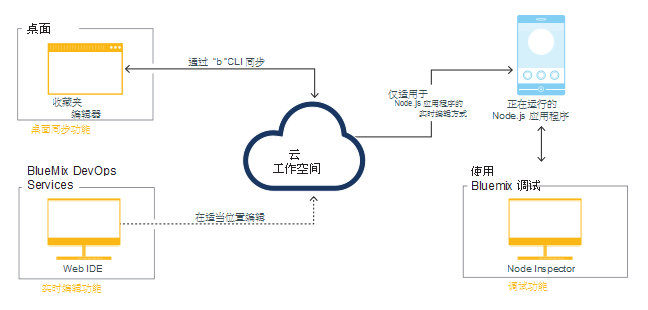

---


copyright:

  years: 2015，2016


---

{:shortdesc: .shortdesc}
{:screen: .screen}
{:new_window: target="_blank"}
{:pre: .pre}

#{{site.data.keyword.Bluemix_notm}} Live Sync {: #live-sync}

*上次更新时间：2016 年 4 月 7 日*  

如果您要构建 Node.js 应用程序，那么可以使用 {{site.data.keyword.Bluemix}} Live Sync 快速更新 {{site.data.keyword.Bluemix_notm}} 上的应用程序实例，并像在桌面上进行操作一样进行开发，而无需重新部署。   
{: shortdesc}

执行更改后，您可以立即在运行中的 {{site.data.keyword.Bluemix_notm}} 应用程序中看到该更改。{{site.data.keyword.Bluemix_notm}} Live Sync 可从命令行以及在 Web IDE 中运行。您可以使用 {{site.data.keyword.Bluemix_notm}} Live Sync 来调试以 Node.js 编写的应用程序。  

{{site.data.keyword.Bluemix_notm}} Live Sync 由三个功能部件组成。

**桌面同步**  
    您可以将任何桌面目录树与基于云的项目工作空间同步，具体与 Dropbox 的工作方式类似。Web IDE 会直接编辑同一基于云的工作空间，因此两者会保持同步。“桌面同步”适用于任何类型的应用程序。要使用“桌面同步”，需要下载和安装 BL 命令行界面。  

**实时编辑**
    您可以对 {{site.data.keyword.Bluemix_notm}} 中运行的 Node.js 应用程序进行更改，然后立即在浏览器中测试这些更改。在同步的桌面目录中或在 Web IDE 中进行的任何更改都会立即传播到应用程序的文件系统中。  

**调试**  
    当 Node.js 应用程序处于“实时编辑”方式时，您可以创建 shell 并在其中进行调试。您可以使用 Node Inspector 调试器来动态编辑代码、插入断点、单步执行代码、重新启动运行时，等等。  

您可以使用“桌面同步”来保持桌面工作空间与您使用 Web IDE 直接编辑的基于云的项目工作空间同步。您可以使用“实时编辑”将基于云的项目工作空间中的更改传播到运行中应用程序。这两个功能部件，既可以使用其中一个，也可以两个同时使用。而且，如果使用“桌面同步”或“实时编辑”将应用程序置于“实时编辑”方式，那么可以调试运行中应用程序。

下图说明了 Bluemix Live Sync 过程。

*图 1. Bluemix Live Sync 过程*


如果您要开发在 Liberty 上运行的 Java 应用程序，那么可以使用 [Eclipse Tools for Bluemix](../manageapps/eclipsetools/eclipsetools.html#eclipsetools) 进行远程调试。

##桌面同步 {: #desktop-sync}

您可以使用 Bluemix Live Sync 的“桌面同步”功能来快速更新 {{site.data.keyword.Bluemix_notm}} 上的应用程序实例，并像在桌面上进行操作一样进行开发。

“桌面同步”的注意事项如下：
* “桌面同步”在以下这些操作系统上运行：
  * Windows 7 或 8
  * Mac OS X V10.9 或更高版本
      **注：**Windows 需要 .NET Framework V4.5。如果未安装 .NET，那么在安装 {{site.data.keyword.Bluemix_notm}} Live Sync 命令行界面 (CLI) 时会提示您安装 .NET。  
* 无需克隆 Git 存储库。
* 无论开发的应用程序是哪种类型，都可以将桌面项目与云工作空间进行同步。
* 如果应用程序是用 Node.js 编写的，那么可以将更改传播到运行中应用程序。

有关命令的更多详细信息，请参阅 [Bluemix Live Sync (bl) 命令](bluemixlive.html#bl-commands)。

<ol>
<li>注册免费 <a class="xref" href="https://hub.jazz.net/" target="_blank" alt="Bluemix DevOps Services">Bluemix DevOps Services</a> 帐户。</li>
<li>下载并安装 {{site.data.keyword.Bluemix_notm}} Live Sync bl 命令行。   
<p>
<a class="xref" href="http://livesyncdownload.ng.bluemix.net/downloads/blive_setup.msi" target="_blank" title="（在新选项卡或窗口中打开）"></a>
<a class="xref" href="http://livesyncdownload.ng.bluemix.net/downloads/BluemixLive.pkg" target="_blank" title="（在新选项卡或窗口中打开）"></a>
</p>  

<strong>重要信息：</strong>bl 命令行工具仅适用于 Windows 7 和 8 以及 Mac OS X V10.9 或更高版本。</li>

<li>在命令行上，使用以下命令登录。系统将提示您输入 IBM 标识和密码。  
<pre class="codeblock">bl login</pre>
</li>

<li>通过输入以下命令，查看可用于 {{site.data.keyword.Bluemix_notm}} Live Sync 同步的项目的列表：
<pre class="codeblock">bl projects</pre>
<p>在列表中找到匹配您应用程序的项目名称。项目名称的格式为 <i>alias</i> | <i>your application name</i>。</p>
</li>
<li>通过输入以下命令，将本地环境与 {{site.data.keyword.Bluemix_notm}} 上的项目同步。如果您是项目所有者，那么只需为 projectName 指定 your-application-name 即可。
<pre class="codeblock">bl sync projectName -d localDirectory --verbose</pre>
<p>此命令继续运行（同步也将继续），直到您输入“q”。--verbose 选项用于显示日志记录和状态信息。如果任何自变量中包含空格，那么需要为该名称加引号。</p></li>
<li>在另一个命令行窗口中，在本地目录下，通过输入以下命令，以“实时编辑”方式将应用程序部署到 {{site.data.keyword.Bluemix_notm}}。
<pre class="codeblock">bl start</pre>
</li>
</ol>

更改本地目录中的文件时，系统会自动将更改传播到正在 {{site.data.keyword.Bluemix_notm}} 上运行的应用程序以及项目云工作空间中。如果需要重新启动 Node 应用程序，那么可以使用以下命令：
```
bl start --restart
```

##实时编辑 {: #live-edit}

如果您要构建 Node.js 应用程序，那么在使用 Web IDE 对项目进行更改后，可以使用 {{site.data.keyword.Bluemix_notm}} Live Sync 的“实时编辑”功能来快速更新 {{site.data.keyword.Bluemix_notm}} 上运行的应用程序实例。利用“实时编辑”，无需重新部署即可像在桌面上一样进行开发。

“实时编辑”仅支持用于 Node.js 应用程序。

在 Web IDE 中，单击运行栏中的**实时编辑**。


使用“实时编辑”，可以快速预览对 {{site.data.keyword.Bluemix_notm}} 上运行的 Node.js 应用程序所进行的更改。如果在打开“实时编辑”的情况下更新代码，那么在执行更改之后仅需几秒钟的时间，就可以通过刷新 Web 应用程序浏览器窗口看到这些更改反映出来。

有关使用 {{site.data.keyword.Bluemix_notm}} Live Sync 的“实时编辑”功能的教程，请参阅教程 [Test and debug a Node.js app with Bluemix Live Sync](https://hub.jazz.net/tutorials/livesync)。

当您在 Web IDE 中更改文件时，系统会自动将它们重新部署到 {{site.data.keyword.Bluemix_notm}} 上运行的应用程序中。如果需要重新启动 Node 应用程序，那么可以使用运行栏中的**重新启动**按钮。

**注：**为了在使用 {{site.data.keyword.Bluemix_notm}} Live Sync 的“实时编辑”功能时能有更一致的体验，需要并将添加额外的 256 MB 内存。

##{{site.data.keyword.Bluemix_notm}} 实时调试 {: #live-debug}

只要为您的 Node.js 应用程序启用了 {{site.data.keyword.Bluemix_notm}} Live Sync，就可以访问 {{site.data.keyword.Bluemix_notm}} Live Sync 的“调试”功能。

使用“调试”，可以执行动态编辑代码、插入断点、单步调试代码、重新启动运行时等操作，而且所有这些操作都可在 {{site.data.keyword.Bluemix_notm}} 为应用程序提供服务期间来执行。通过从大型 {{site.data.keyword.Bluemix_notm}} 服务列表中进行选择，可以敏捷地逐步开发应用程序。

{{site.data.keyword.Bluemix_notm}} 实时调试包括以下功能：

* 应用程序运行时控件
* 使用 [node-inspector](https://github.com/node-inspector/node-inspector) 进行调试
* shell 访问

###应用程序运行时控件 {: #app-runtime}

利用应用程序运行时控件，您可以使用“调试”在启动时检测应用程序的状态。当您对启动时崩溃的应用程序进行故障诊断时，此功能很有用。

在开发应用程序时，可以从以下操作进行选择：

* 快速重新启动应用程序
* 运行任何应用程序代码之前暂挂应用程序

###调试 {: #debug}

“调试”包括以下功能：

**限制：**Google Chrome 是必需的。

* 在应用程序代码中设置断点，以在特定行暂停执行。
* 编辑断点条件以仅在满足特定条件时暂停执行。
* 检查本地变量和字段的状态。
* 立即查看 `console.log()` 调用的调试输出。此操作比监视 cf 日志速度更快。
* 使用内置源代码编辑器对运行中应用程序代码立即执行临时更改。

###shell {: #shell}

使用此工具，可以通过 shell 访问您的应用程序运行所在的容器。通过使用此终端，您可以远程运行诊断 shell 命令以管理您的应用程序。

使用标准 Linux 命令（例如，**top**、**ps** 和 **kill**），监视实例中的内存和 CPU 使用量。

###将应用程序配置为启用 {{site.data.keyword.Bluemix_notm}} 实时调试 {: #configure_app_debug}

应用程序必须使用 IBM SDK for Node.js buildpack。不支持定制 buildpack。

1. 允许 buildpack 检测应用程序 start 命令。start 命令必须由 buildpack 自动检测，而不是在 `manifest.yml` 文件中设置。  

    a. 确保 `package.json` 文件包含启动脚本，其中含有应用程序的 start 命令。  
    b. 如果应用程序 `manifest.yml` 文件包含命令，请将其设置为 null。  

2. 设置环境变量。  

    a. 在 `manifest.yml` 文件中，添加以下变量：
	```
	env:
      ENABLE_BLUEMIX_DEV_MODE: "true" 
	```

3. 增大内存。  

    a. 在应用程序 `manifest.yml` 文件中，将指定给内存属性的值加上 128M 或更大的值。

在安装 {{site.data.keyword.Bluemix_notm}} 实时调试后，可以使用调试工具。

推送应用程序，然后浏览到 `https://app-host.mybluemix.net/bluemix-debug/manage`，以访问 {{site.data.keyword.Bluemix_notm}} 调试用户界面。出现提示时，请输入您的 IBM 标识和密码进行认证。

###复原应用程序配置并禁用 Bluemix 实时调试 {: #restore_live_debug}

1. 从应用程序 `manifest.yml` 文件中除去 ENABLE_BLUEMIX_DEV_MODE 环境变量。

2. 复原应用程序的原始 start 命令和内存值。

3. 推送应用程序。

## {{site.data.keyword.Bluemix_notm}} Live Sync (bl) 命令 {: #bl-commands}

如果您要构建 Node.js 应用程序，那么可使用 {{site.data.keyword.Bluemix_live}} 快速更新在 {{site.data.keyword.Bluemix_notm}} 上运行的应用程序实例，而且无需重新部署即可像在桌面上一样进行开发。执行更改后，您可以立即在运行中的 {{site.data.keyword.Bluemix_notm}} 应用程序中看到该更改。{{site.data.keyword.Bluemix_live}} 命令行界面称为 *bl*。
{:shortdesc}

您可使用 **bl** 命令行界面命令完成以下任务：

* 启动和停止正在 {{site.data.keyword.Bluemix_notm}} 上运行的应用程序。
* 从桌面创建新的基于云的项目
* 将更改从桌面同步到基于云的项目工作空间以及正在 {{site.data.keyword.Bluemix_notm}} 上运行的应用程序。
* 请参阅可用于同步的项目列表。
* 请参阅运行中应用程序的状态。

有关下载和使用 bl 命令的更多信息，请参阅 [Bluemix Live Sync](../develop/bluemixlive.html)。

## bl 命令
{: #bl_commands}

{{site.data.keyword.Bluemix_live}} 命令行 **bl** 的语法如下：

```
bl command [arguments][options] [--help]
```
{: pre}

**命令**

l *login*：登录到 {{site.data.keyword.Bluemix_notm}}。

lo *logout*：从 {{site.data.keyword.Bluemix_notm}} 注销。

s *sync*：启动桌面和服务器之间的同步过程。

c *create*：创建专用项目，将其链接到此目录中的 Git 存储库，并将内容部署到 {{site.data.keyword.Bluemix_notm}}。

p *projects*：列出可用于同步的所有项目。

st *start*：在 {{site.data.keyword.Bluemix_notm}} 中启动应用程序实例。

sp *stop*：在 {{site.data.keyword.Bluemix_notm}} 中停止应用程序实例。

ss *status*：列出 {{site.data.keyword.Bluemix_notm}} 中正在运行的应用程序实例的状态。


**自变量**

命令的自变量。


**选项**

命令的选项。

**全局选项**

*--help*：显示指定命令的帮助页面

*--verbose*：启用详细日志记录。

**注：**如果有任何自变量或选项包含空格，请将值用双引号括住。

## Help
{: bl_help}

```
bl [ command ] --help | --h
```
{: pre}

**用法**

使用此命令可显示有关命令或命令列表的帮助。

**示例**

显示命令列表：

```
bl --help
```
{: pre}

显示有关 sync 命令的详细信息：

```
bl sync --help
```
{: pre}

## Login
{: bl_login}

```
bl login | l [ -u username ][-p password ][ -s server ]
```
{: pre}

**用途**

使用此命令可登录到 {{site.data.keyword.Bluemix_notm}}。针对每个会话，仅需要执行一次登录。

**警告**：建议不要将密码作为命令行选项提供，因为这样一来，其他人也会看到密码，并且密码会记录为命令历史记录的一部分。

**注**：您必须注册免费 <a class="xref" href="https://hub.jazz.net/" target="_blank" alt="Bluemix DevOps Services">Bluemix DevOps Services</a> 帐户后才能登录。

**选项**

-u *username*：您用于登录到 {{site.data.keyword.Bluemix_notm}} 的 IBM 标识。

-p *password*：您的 IBM 标识密码。

-s *server*：{{site.data.keyword.jazzhub_short}} 服务器的服务器名称或 IP 地址。

**示例**

此命令会提示需要 *username* 和 *password*：

```
bl login```
{: pre}

使用户 `name@company.com` 登录：

```
bl login –u name@company.com –p pa55w0rd```
{: pre}

使用户 `name@company.com` 通过密码 *pa55 w0rd* 登录，此密码包含一个空格，因此需要用引号将其括起：

```
bl login –u name@company.com –p “pa55 w0rd”```
{: pre}

## Logout
{: bl_logout}

```
bl logout | lo
```
{: pre}

**用途**

使用此命令可注销。

## 项目
{: bl_projects}

```
bl projects | p
```
{: pre}

**用途**

使用此命令可列出已登录用户可用于进行同步的所有项目。

## Sync
{: bl_sync}

```
bl sync | s projectName -d localDirectory [ --overwritelocal ][ --overwriteremote ] [ --verbose ]
```
{: pre}

**用途**

使用此命令可开始将项目的内容与本地目录同步。此命令将一直运行，直到输入 <code>q</code> 为止。（可选）此命令可显示包含所有文件和应用程序状态更改的日志。

**自变量**

*projectName*：格式为 *“alias | myproject”* 或仅为 *myproject*（如果项目由已登录用户拥有）的项目名称。

**选项**

-d *localDirectory*：本地目录路径。缺省值为当前文件夹“.”.

*--overwritelocal*：使用项目工作空间的内容覆盖本地目录。

*--overwriteremote*：使用本地目录的内容覆盖项目工作空间。

*--verbose*：显示详细日志记录。

**示例**

如果当前目录为现有同步目标，那么此命令会开始与关联项目进行同步。如果当前目录为空且不是现有同步目标，那么此命令会提示需要 *projectName*。如果当前目录不为空且不是现有同步目标，那么需要覆盖选项。

```
bl sync
```
{: pre}

此命令会开始同步，并且等效于 `bl sync “alias | myproject”`（如果项目由已登录用户拥有）。

```
bl sync  myproject```
{: pre}

此命令会开始与其名称包含空格（因此括在引号内）的项目 `my pro ject` 进行同步：

```
bl sync “my pro ject”
```
{: pre}

此命令会开始将项目 `myproject` 与目录 `myfolder` 进行同步：

```
bl sync myproject –d  myfolder```
{: pre}

## Create
{: bl_create}

```
bl create | c [ -n PROJECT_NAME ][ -r REGION ] [ -o ORG ][ -s SPACE ] [ -g GIT_REPO ][-e GIT_EXE ] [ --creds ][ --fork ] [ --public ][ --prompt ]
```
{: pre}

**用途**

从包含代码的目录使用此命令可创建专用项目，将其链接到 Git 存储库，并将该存储库的内容部署到 {{site.data.keyword.Bluemix_notm}}。

**选项**

-n *PROJECT_NAME*：项目的名称。缺省值：当前目录名称。

-r *REGION*：{{site.data.keyword.Bluemix_notm}} 区域。缺省值：美国南部。

-o *ORG*：{{site.data.keyword.Bluemix_notm}} 组织。缺省值：找到的第一个组织。

-s *SPACE*：{{site.data.keyword.Bluemix_notm}} 空间。缺省值：找到的第一个空间。

-g *GIT_REPO*：用于任何现有 Git 存储库的远程存储库名称。缺省值：origin。

-e *GIT_EXE*：Git 可执行文件的完整路径。缺省值：detected。

*--creds*：提示输入 Git 凭证。

*--fork*：派生此目录并创建项目和存储库。

*--public*：使新项目成为公共项目。

*--prompt*：对所有必需选项提示可用的选择。

**示例**

此命令开始创建专用项目的过程，并提示输入要使用的项目名称。

```
bl create```
{: pre}

此命令创建名为 `myNewProject` 的公共项目。

```
bl create -n myNewProject --public```
{: pre}

## 状态
{: bl_status}

```
bl status | ss [ projectName ]
```
{: pre}

**用途**

使用此命令可列出与 `./launchConfigurations` 目录中启动配置相关联的应用程序的状态。

**自变量**

*projectName*：格式为 `“alias | myproject”` 或仅为 `myproject`（如果项目由已登录用户拥有）的项目名称。

**示例**

此示例显示正在运行的应用程序的状态。如果当前目录为现有同步目标，那么它会使用关联项目。如果当前目录不是现有同步目标，那么此命令会提示需要 `projectName`。

``
bl status ```
{: pre}

此示例显示项目 *myproject* 的状态，等效于 `bl status “alias |
myproject”`（如果项目由已登录用户拥有）。

```
bl status myproject```
{: pre}

此示例显示与项目 `my pro ject` 关联的运行中应用程序的状态，此项目的名称包含空格，因此括在引号内：

```
bl status “my pro ject”```
{: pre}

## Start
{: bl_start}

```
bl start | st projectName [ -l launchConfigPath ] -m manifestPath ] [ --liveedit ][--noliveedit ] [ --restart ]
```
{: pre}

**用途**

使用此命令可启动应用程序实例，此实例由启动或清单文件进行描述。如果应用程序的 buildpack 支持实时编辑，那么缺省情况下会以实时编辑方式启动应用程序。一旦启动，即会显示应用程序的 URL、调试工具和 {{site.data.keyword.Bluemix_notm}} 仪表板。

**自变量**

*projectName*：格式为 *“alias | myproject”* 或仅为 *myproject*（如果项目由已登录用户拥有）的项目名称。

**选项**

-l *launchConfiguration*：启动配置名称（例如，`mylaunchconfig`）、文件名（例如，`mylaunchconfig.launch`）或启动配置文件的相对于项目的路径（例如，`launchConfigurations/mylaunchconf.launch`）。

-m *manifestPath*：清单文件（例如，`manifest.yml`）的相对于项目的路径。

*--liveedit*：以实时编辑方式启动关联应用程序，如果 buildpack 不支持实时编辑方式，那么退出并返回错误。

*--noliveedit*：以正常方式启动关联应用程序。

*--view*：打开正在运行的应用程序的浏览器。

*--restart*：重新启动已在实时编辑方式下运行的应用程序，而不进行重新部署。

**示例**

此命令用于启动与启动文件 `launchConfigurations/my.launch` 关联的 `myproject` 应用程序实例。

```
bl start myproject –l “launchConfigurations/my.launch”```
{: pre}

此命令用于启动与具有启动文件 `launchConfigurations/my.launch` 的当前目录关联的项目应用程序实例。如果当前目录不是同步目标，那么会显示错误。

```
bl start –l “launchConfigurations/my.launch” ```
{: pre}

此命令用于启动与具有清单文件 `manifest.yml` 的当前目录关联的项目应用程序实例。清单中指定的信息用于创建新的启动配置文件。此命令提示您输入其余的必需信息，然后会启动由启动配置描述的应用程序：

```
bl start –m “mymanifest.yml” ```
{: pre}

此命令用于通过清单文件 `manifest.yml` 启动与当前目录关联的项目的应用程序实例，并且等效于 `bl start –m manifest.yml`。

```
bl start```
{: pre}

## Stop
{: bl_stop}

```
bl stop | sp projectName [ -l launchConfiguration ]
```
{: pre}

**用途**

使用此命令可停止与启动文件关联的应用程序实例。

**自变量**

*projectName*：格式为 *“alias | myproject”* 或仅为 *myproject*（如果项目由已登录用户拥有）的项目名称。

**选项**

-l *launchConfiguration*：启动配置名称（例如，`mylaunchconfig`）、文件名（例如，`mylaunchconfig.launch`）或启动配置文件的相对于项目的路径（例如，`launchConfigurations/mylaunchconf.launch`）。

**示例**

如果当前目录为同步目标，那么此命令会停止应用程序；否则，此命令会由于发生错误而退出。如果没有启动配置，那么此命令会由于发生错误而退出。如果有多个启动配置，那么此命令会提示您选择要停止的配置。

```
bl stop```
{: pre}

此命令用于停止与使用启动文件 `mylaunchConfig` 运行的项目应用程序实例。

```
bl stop myproject –l “mylaunchConfig” ```
{: pre}

如果当前目录为使用启动文件 `launchConfigurations/mylaunchconfig.launch` 启动的关联项目的同步目标，那么此命令会停止应用程序；否则，此命令会由于发生错误而退出：

```
bl stop –l “launchConfigurations/mylaunchconfig.launch” ```
{: pre}

># 相关链接 {:class="linklist"}
>## 教程和样本 {:id="samples"}
>* [Test and debug a Node.js app with Bluemix Live Sync](https://hub.jazz.net/tutorials/livesync)
>
># 相关链接 {:class="linklist"}
>## 相关链接 {:id="general"}
>* [Eclipse Tools for Bluemix](https://www.ng.bluemix.net/docs/manageapps/eclipsetools/eclipsetools.html)   
>
>{:elementKind="article" id="rellinks"}
