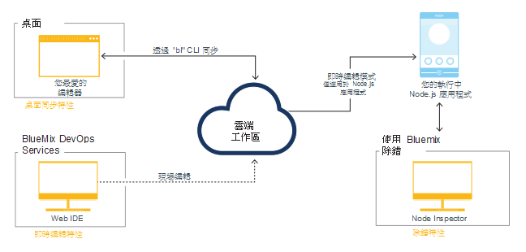

---


copyright:

  years: 2015, 2016


---

{:shortdesc: .shortdesc}
{:screen: .screen}
{:new_window: target="_blank"}
{:pre: .pre}

#{{site.data.keyword.Bluemix_notm}} Live Sync {: #live-sync}

*前次更新：2016 年 4 月 7 日*  

如果您要建置 Node.js 應用程式，可以使用 {{site.data.keyword.Bluemix}} Live Sync 快速更新 {{site.data.keyword.Bluemix_notm}} 上的應用程式實例，並像在桌面上那樣地開發應用程式而不必重新部署。   
{: shortdesc}

當您進行變更時，可以立即在執行中的 {{site.data.keyword.Bluemix_notm}} 應用程式看到該變更。{{site.data.keyword.Bluemix_notm}} Live Sync 在指令行及 Web IDE 中均可運作。您可以使用 {{site.data.keyword.Bluemix_notm}} Live Sync，針對以 Node.js 撰寫的應用程式進行除錯。  

{{site.data.keyword.Bluemix_notm}} Live Sync 包含三個特性。

**桌面同步**  
    您可以將任何桌面目錄樹與雲端型專案工作區同步化，運作方式類似 Dropbox。Web IDE 會直接編輯相同的雲端型工作區，讓兩者保持同步。「桌面同步」適用於任何類型的應用程式。若要使用「桌面同步」，您需要下載並安裝 BL 指令行介面。  

**即時編輯**
    您可以對在 {{site.data.keyword.Bluemix_notm}} 中執行的 Node.js 應用程式進行變更，並立刻在瀏覽器中加以測試。您在已同步的桌面目錄中或在 Web IDE 中所進行的任何變更，都會立即延伸到應用程式的檔案系統。  

**除錯**  
    當 Node.js 應用程式處於「即時編輯」模式時，您可以使用 Shell 方式連入並進行除錯。您可以使用 Node Inspector 除錯器，以動態編輯程式碼、插入岔斷點、逐步執行程式碼、重新啟動執行時期等等。  

您可以使用「桌面同步」，讓桌面工作區與您直接使用 Web IDE 來編輯的雲端型專案工作區保持同步。您可以使用「即時編輯」，將雲端型專案工作區中的變更延伸到執行中的應用程式。您可以單獨或同時使用這些特性。而如果您使用「桌面同步」或「即時編輯」將應用程式置於「即時編輯」模式，就可以對執行中的應用程式進行除錯。

下圖說明 Bluemix Live Sync 處理程序。

*圖 1. Bluemix Live Sync 處理程序*


如果您要開發在 Liberty 上執行的 Java 應用程式，可以使用 [Eclipse Tools for Bluemix](../manageapps/eclipsetools/eclipsetools.html#eclipsetools) 進行遠端除錯。

##桌面同步 {: #desktop-sync}

您可以使用 Bluemix Live Sync 的「桌面同步」特性，快速更新 {{site.data.keyword.Bluemix_notm}} 上的應用程式實例，並如同在桌面上一樣進行開發。

「桌面同步」具有下列考量：
* 「桌面同步」在下列作業系統上執行：
  * Windows 7 或 8
  * Mac OS X 10.9 版或更新版本
      **附註：**Windows 需要 .NET Framework 4.5 版。如果未安裝 .NET，則在您安裝 {{site.data.keyword.Bluemix_notm}} Live Sync 指令行介面 (CLI) 時，系統會提示您進行安裝。  
* 您不需要複製 Git 儲存庫。
* 無論您開發什麼類型的應用程式，都可以將桌面專案與雲端工作區同步化。
* 如果您的應用程式是以 Node.js 撰寫，則可以將變更延伸到執行中應用程式。

如需指令的詳細資料，請參閱 [Bluemix Live Sync (bl) 指令](bluemixlive.html#bl-commands)。

<ol>
<li>註冊免費 <a class="xref" href="https://hub.jazz.net/" target="_blank" alt="Bluemix DevOps Services">Bluemix DevOps Services</a> 帳戶。</li>
<li>下載並安裝 {{site.data.keyword.Bluemix_notm}} Live Sync bl 指令行。   
<p>
<a class="xref" href="http://livesyncdownload.ng.bluemix.net/downloads/blive_setup.msi" target="_blank" title="（在新分頁或視窗中開啟）"> </a>
<a class="xref" href="http://livesyncdownload.ng.bluemix.net/downloads/BluemixLive.pkg" target="_blank" title="（在新分頁或視窗中開啟）"> </a>
</p>  

<strong>重要事項：</strong>bl 指令行工具僅適用於 Windows 7 和 8，以及 Mac OS X 10.9 版或更新版本。</li>

<li>在指令行上，使用下列指令登入。系統會提示您輸入 IBM ID 及密碼。  
<pre class="codeblock">bl login</pre>
</li>

<li>輸入下列指令，以查看可用於 {{site.data.keyword.Bluemix_notm}} Live Sync 同步化的專案清單：
<pre class="codeblock">bl projects </pre>
<p>在清單中尋找符合您應用程式的專案名稱。專案名稱的格式為 <i>your alias</i> | <i>your application name</i>。</p>
</li>
<li>輸入下列指令，將您的本端環境與您在 {{site.data.keyword.Bluemix_notm}} 上的專案同步化。如果您是專案的擁有者，只需要指定 your-application-name 作為 projectName。
<pre class="codeblock">bl sync projectName -d localDirectory --verbose</pre>
<p>此指令會繼續執行（而且同步化也會繼續進行），直到您輸入 "q" 為止。--verbose 選項會顯示記載及狀態資訊。如果有任何引數包含空格，則必須將名稱含括在引號中。</p></li>
<li>使用另一個指令行視窗，在本端目錄中輸入下列指令，以在「即時編輯」模式下，將應用程式部署至 {{site.data.keyword.Bluemix_notm}}：
<pre class="codeblock">bl start</pre>
</li>
</ol>

當您變更本端目錄中的檔案時，變更會自動延伸到 {{site.data.keyword.Bluemix_notm}} 上執行的應用程式，以及專案雲端工作區。如果您需要重新啟動 Node 應用程式，可以使用下列指令：
```
bl start --restart
```

##即時編輯 {: #live-edit}

如果您要建置 Node.js 應用程式，則使用 Web IDE 來變更專案時，{{site.data.keyword.Bluemix_notm}} Live Sync 的「即時編輯」特性能夠快速更新在 {{site.data.keyword.Bluemix_notm}} 上執行的應用程式實例。「即時編輯」可讓您就像在桌面上開發一樣，而無需重新部署。

「即時編輯」支援僅適用於 Node.js 應用程式。

在 Web IDE 的執行列中，按一下**即時編輯**。


「即時編輯」可讓您快速預覽在 {{site.data.keyword.Bluemix_notm}} 上執行之 Node.js 應用程式的變更。當您開啟「即時編輯」來更新程式碼時，可以重新整理 Web 應用程式的瀏覽器視窗，就能看到在進行變更幾秒後所反映的變更。

如需有關使用 {{site.data.keyword.Bluemix_notm}} Live Sync 的「即時編輯」特性的指導教學，請參閱 [Test and debug a Node.js app with Bluemix Live Sync](https://hub.jazz.net/tutorials/livesync) 指導教學。

當您變更 Web IDE 中的檔案時，會自動將其重新部署至在 {{site.data.keyword.Bluemix_notm}} 上執行的應用程式。如果您需要重新啟動 Node 應用程式，可以使用執行列中的**重新啟動**按鈕。

**附註：**為達到使用 {{site.data.keyword.Bluemix_notm}} Live Sync 的「即時編輯」特性時的更一致體驗，則需要且將會新增 256MB 的額外記憶體。

##{{site.data.keyword.Bluemix_notm}} 即時除錯 {: #live-debug}

如果已針對 Node.js 應用程式啟用 {{site.data.keyword.Bluemix_notm}} Live Sync，則您可以存取 {{site.data.keyword.Bluemix_notm}} Live Sync 的「除錯」特性。

您可以使用除錯來動態編輯程式碼、插入岔斷點、逐步執行程式碼、重新啟動執行時期等等，這些全都可以在由 {{site.data.keyword.Bluemix_notm}} 為您的應用程式提供服務時執行。您可以靈活地以漸進方式開發應用程式，同時從龐大的 {{site.data.keyword.Bluemix_notm}} 服務清單進行選擇。

「{{site.data.keyword.Bluemix_notm}} 即時除錯」包含下列特性：

* 應用程式執行時期控制
* 使用 [node-inspector](https://github.com/node-inspector/node-inspector) 進行除錯
* Shell 存取

###應用程式執行時期控制 {: #app-runtime}

使用應用程式執行時期控制，您可以用「除錯」來檢查應用程式在啟動時的狀態。當您對於在啟動時當機的應用程式進行疑難排解時，此功能很有用。

開發應用程式時，可以從下列動作選取：

* 執行應用程式的快速重新啟動
* 在任何應用程式程式碼執行之前先暫停應用程式

###除錯 {: #debug}

「除錯」包含下列功能：

**限制：**需要有 Google Chrome。

* 在應用程式碼中設定岔斷點，以在特定行暫停執行。
* 編輯岔斷點條件，只在符合特定準則時暫停執行。
* 檢查區域變數及欄位的狀態。
* 立即檢視來自 `console.log()` 呼叫的除錯輸出。此動作的速度比監視 cf logs 還要快。
* 使用內建原始碼編輯器，對執行中的應用程式碼進行立即但暫時的變更。

###Shell {: #shell}

此工具可讓您對應用程式執行所在的儲存器進行 Shell 存取。您可以使用此終端機，在遠端執行診斷 Shell 指令來管理應用程式。

監視使用標準 Linux 指令（例如 **top**、**ps** 及 **kill**）之實例內的記憶體及 CPU 使用率。

###配置應用程式，以啟用 {{site.data.keyword.Bluemix_notm}} 即時除錯 {: #configure_app_debug}

應用程式必須使用 IBM SDK for Node.js 建置套件。不支援自訂建置套件。

1. 容許建置套件偵測應用程式啟動指令。啟動指令必須由建置套件自動偵測，而不是設定在 `manifest.yml` 檔案中。  

    a. 確保 `package.json` 檔案包含一個包括應用程式啟動指令的啟動 Script。  
    b. 如果應用程式 `manifest.yml` 檔案包含指令，請將它設為 null。  

2. 設定環境變數。  

    a. 在 `manifest.yml` 檔案中，新增下列變數：
	```
	env:
      ENABLE_BLUEMIX_DEV_MODE: "true" 
	```

3. 增加記憶體。  

    a. 在應用程式 `manifest.yml` 檔案中，在為記憶體屬性指定的值加上 128M 以上。

安裝「{{site.data.keyword.Bluemix_notm}} 即時除錯」之後，您可以使用除錯工具。

推送應用程式，然後瀏覽至 `https://app-host.mybluemix.net/bluemix-debug/manage`，以存取 {{site.data.keyword.Bluemix_notm}} 除錯使用者介面。系統提示時，請輸入您的 IBM ID 及密碼來進行鑑別。

###還原應用程式配置並停用 Bluemix 即時除錯 {: #restore_live_debug}

1. 從應用程式 `manifest.yml` 檔案中移除 ENABLE_BLUEMIX_DEV_MODE 環境變數。

2. 還原應用程式的原始啟動指令及記憶體值。

3. 推送應用程式。

## {{site.data.keyword.Bluemix_notm}} Live Sync (bl) 指令 {: #bl-commands}

如果您要建置 Node.js 應用程式，可以使用 {{site.data.keyword.Bluemix_live}} 快速更新 {{site.data.keyword.Bluemix_notm}} 上執行的應用程式實例，並像在桌面上那樣地開發應用程式而不必重新部署。當您進行變更時，可以立即在執行中的 {{site.data.keyword.Bluemix_notm}} 應用程式看到該變更。{{site.data.keyword.Bluemix_live}} 指令行介面稱為 *bl*。
{:shortdesc}

您可以使用 **bl** 指令行介面指令來完成下列作業：

* 啟動及停止在 {{site.data.keyword.Bluemix_notm}} 上執行的應用程式。
* 從您的桌面建立新的雲端型專案。
* 將桌面的變更同步至雲端專案工作區，以及在 {{site.data.keyword.Bluemix_notm}} 上執行的應用程式。
* 查看可以同步化的專案清單。
* 查看執行中應用程式的狀態。

如需下載及使用 bl 指令的相關資訊，請參閱 [Bluemix Live Sync](../develop/bluemixlive.html)。

## bl 指令
{: #bl_commands}

{{site.data.keyword.Bluemix_live}} 指令行 (**bl**) 的語法如下：

```
bl command [arguments][options] [--help]
```
{: pre}

**指令**

l *login*：登入 {{site.data.keyword.Bluemix_notm}}。

lo *logout*：登出 {{site.data.keyword.Bluemix_notm}}。

s *sync*：啟動桌上型電腦與伺服器之間的同步化處理程序。

c *create*：建立專用專案，將它鏈結至此目錄中的 Git 儲存庫，然後將內容部署至 {{site.data.keyword.Bluemix_notm}}。

p *projects*：列出可用於同步化的所有專案。

st *start*：在 {{site.data.keyword.Bluemix_notm}} 中啟動應用程式實例。

sp *stop*：在 {{site.data.keyword.Bluemix_notm}} 中停止應用程式實例。

ss *status*：列出 {{site.data.keyword.Bluemix_notm}} 中的執行中應用程式實例狀態。


**引數**

指令的引數。


**選項**

指令的選項。

**廣域選項**

*--help*：顯示所指定指令的說明頁面

*--verbose*：啟用詳細記載。

**附註：**如果您的任何引數或選項包含空格，請將值含括在雙引號中。

## Help
{: bl_help}

```
bl [ command ] --help | --h
```
{: pre}

**用法**

使用這個指令來顯示有關指令或指令清單的說明。

**範例**

顯示指令清單：

```
bl --help
```
{: pre}

顯示 sync 指令的詳細資訊：

```
bl sync --help
```
{: pre}

## Login
{: bl_login}

```
bl login | l [ -u username ][-p password ][ -s server ]
```
{: pre}

**用途**

使用這個指令來登入 {{site.data.keyword.Bluemix_notm}}。每個階段作業只需要執行一次登入。


**警告：**不鼓勵您將密碼提供為指令行選項，因為其他人可以看到它，而且它會記錄為指令歷程的一部分。

**附註：**您必須先註冊免費 <a class="xref" href="https://hub.jazz.net/" target="_blank" alt="Bluemix DevOps Services">Bluemix DevOps Services</a> 帳戶，才能登入。

**選項**

-u *username*：您用來登入 {{site.data.keyword.Bluemix_notm}} 的 IBM ID。

-p *password*：IBM ID 密碼。

-s *server*：{{site.data.keyword.jazzhub_short}} 伺服器的「伺服器名稱」或「IP 位址」。

**範例**

這個指令會提示輸入 *username* 及 *password*：

```
bl login
```
{: pre}

將使用者 `name@company.com` 登入：

```
bl login –u name@company.com –p pa55w0rd
```
{: pre}

將使用者 `name@company.com` 登入的密碼 *pa55 w0rd* 包含空格，因此需要加上引號：

```
bl login –u name@company.com –p “pa55 w0rd”
```
{: pre}

## Logout
{: bl_logout}

```
bl logout | lo
```
{: pre}

**用途**

使用這個指令來登出。

## projects
{: bl_projects}

```
bl projects | p
```
{: pre}

**用途**

使用這個指令來列出已登入使用者可用於同步化的所有專案。

## Sync
{: bl_sync}

```
bl sync | s projectName -d localDirectory [ --overwritelocal ][ --overwriteremote ] [ --verbose ]
```
{: pre}

**用途**

使用這個指令來啟動專案內容與本端目錄的同步化。在輸入 <code>q</code> 之前，這個指令會持續執行。這個指令可以選擇性地顯示所有檔案及應用程式狀態變更的日誌。

**引數**

*projectName*：形式為 *"alias | myproject"* 或只有 *myproject*（如果已登入使用者擁有此專案）的專案名稱。

**選項**

-d *localDirectory*：本端目錄路徑。預設為現行資料夾 "."。

*--overwritelocal*：使用專案工作區內容改寫本端目錄。

*--overwriteremote*：使用本端目錄內容改寫專案工作區。

*--verbose*：顯示詳細記載。

**範例**

如果現行目錄是現有同步目標，則這個指令會開始與關聯的專案進行同步化。如果現行目錄是空的而且不是現有同步目標，則指令會提示輸入 *projectName*。如果現行目錄不是空的而且不是現有同步目標，則需要改寫選項。

```
bl sync```
{: pre}

這個指令會開始同步化，且相當於 `bl sync "alias | myproject"`（如果已登入使用者擁有此專案）。

```
bl sync  myproject
```
{: pre}

這個指令會開始與其名稱包含空格的專案 `my pro ject` 進行同步化，因此會使用引號括住該名稱：

```
bl sync "my pro ject"
```
{: pre}

這個指令會開始進行 `myproject` 專案與 `myfolder` 目錄的同步化：

```
bl sync myproject –d  myfolder
```
{: pre}

## Create
{: bl_create}

```
bl create | c [ -n PROJECT_NAME ][ -r REGION ] [ -o ORG ][ -s SPACE ] [ -g GIT_REPO ][-e GIT_EXE ] [ --creds ][ --fork ] [ --public ][ --prompt ]
```
{: pre}

**用途**

從包含程式碼的目錄使用此指令來建立專用專案、將它鏈結至 Git 儲存庫，然後將儲存庫內容部署至
{{site.data.keyword.Bluemix_notm}}。

**選項**

-n *PROJECT_NAME*：您專案的名稱。預設值：現行目錄名稱。

-r *REGION*：{{site.data.keyword.Bluemix_notm}} 地區。預設值：美國南部。

-o *ORG*：{{site.data.keyword.Bluemix_notm}} 組織。預設值：第一個發現的組織。

-s *SPACE*：{{site.data.keyword.Bluemix_notm}} 空間。預設值：第一個發現的空間。

-g *GIT_REPO*：要用於任何現有 Git 儲存庫的遠端儲存庫名稱。預設值：origin。

-e *GIT_EXE*：Git 執行檔的完整路徑。預設值：detected。

*--creds*：提示輸入您的 Git 認證。

*--fork*：分出此目錄並建立專案和儲存庫。

*--public*：使新專案成為公用專案。

*--prompt*：提示輸入所有必要的選項，並提供可用的選擇。

**範例**

這個指令會開始建立專用專案的程序，並提示輸入要使用的專案名稱。


```
bl create
```
{: pre}

這個指令會建立名為 `myNewProject` 的公用專案。


```
bl create -n myNewProject --public
```
{: pre}

## Status
{: bl_status}

```
bl status | ss [ projectName ]
```
{: pre}

**用途**

使用這個指令來列出與 `./launchConfigurations` 目錄裡的啟動配置相關聯之應用程式的狀態。

**引數**

*projectName*：形式為 `"alias | myproject"` 或只有 `myproject`（如果已登入使用者擁有此專案）的專案名稱。

**範例**

此範例顯示執行中應用程式的狀態。如果現行目錄是現有同步目標，則會使用關聯的專案。如果現行目錄不是現有同步目標，則指令會提示輸入 `projectName`。

``
bl status
```
{: pre}

這個範例顯示專案 *myproject* 的狀態，相當於 `bl status "alias | myproject"`（如果已登入使用者擁有此專案）。

```
bl status myproject
```
{: pre}

此範例會顯示與其名稱包含空格的專案 `my pro ject` 相關聯之執行中應用程式的狀態，因此會使用引號括住該名稱：

```
bl status "my pro ject"
```
{: pre}

## Start
{: bl_start}

```
bl start | st projectName [ -l launchConfigPath ] -m manifestPath ] [ --liveedit ][--noliveedit ] [ --restart ]
```
{: pre}

**用途**

使用這個指令來啟動由啟動或資訊清單檔說明的應用程式實例。如果應用程式的建置套件支援即時編輯，則應用程式預設會以即時編輯模式啟動。啟動之後，即會顯示應用程式的 URL、除錯工具及 {{site.data.keyword.Bluemix_notm}} 儀表板。

**引數**

*projectName*：形式為 *"alias | myproject"* 或只有 *myproject*（如果已登入使用者擁有此專案）的專案名稱。

**選項**

-l *launchConfiguration*：啟動配置名稱（例如，`mylaunchconfig`）、檔名（例如，`mylaunchconfig.launch`）或啟動配置檔的專案相對路徑（例如，`launchConfigurations/mylaunchconf.launch`）。

-m *manifestPath*：資訊清單檔的專案相對路徑（例如，`manifest.yml`）。

*--liveedit*：以即時編輯模式啟動關聯的應用程式，或者，如果建置套件不支援即時編輯模式，則會結束，並發生錯誤。

*--noliveedit*：以標準模式啟動關聯的應用程式。

*--view*：開啟執行中應用程式的瀏覽器。

*--restart*：重新啟動已經以即時編輯模式執行的應用程式，而不是重新進行部署。

**範例**

這個指令會啟動與啟動檔 `launchConfigurations/my.launch` 相關聯之 `myproject` 的應用程式實例。

```
bl start myproject –l “launchConfigurations/my.launch”
```
{: pre}

這個指令會啟動與現行目錄（含啟動檔 `launchConfigurations/my.launch`）相關聯之專案的應用程式實例。如果現行目錄不是同步目標，則會顯示一則錯誤。

```
bl start –l “launchConfigurations/my.launch”
```
{: pre}

這個指令會啟動與現行目錄（含資訊清單檔 `manifest.yml`）相關聯之專案的應用程式實例。資訊清單中指定的資訊是用來建立新的啟動配置檔。這個指令會提示您輸入其餘的必要資訊，然後啟動由啟動配置說明的應用程式：

```
bl start –m “mymanifest.yml”
```
{: pre}

這個指令會啟動專案的應用程式實例，而專案是與現行目錄（含資訊清單檔 `manifest.yml`）相關聯且相當於 `bl start –m manifest.yml`。

```
bl start
```
{: pre}

## Stop
{: bl_stop}

```
bl stop | sp projectName [ -l launchConfiguration ]
```
{: pre}

**用途**

使用這個指令來停止與啟動檔相關聯的應用程式實例。

**引數**

*projectName*：形式為 *"alias | mproject"* 或只有 *mproject*（如果已登入使用者擁有此專案）的專案名稱。

**選項**

-l *launchConfiguration*：啟動配置名稱（例如，`mylaunchconfig`）、檔名（例如，`mylaunchconfig.launch`）或啟動配置檔的專案相對路徑（例如，`launchConfigurations/mylaunchconf.launch`）。

**範例**

如果現行目錄是同步目標，則這個指令會停止應用程式；否則，它會結束，並發生錯誤。如果沒有啟動配置，則這個指令會結束，並發生錯誤。如果有多個啟動配置，則這個指令會提示您輸入要停止的啟動配置。

```
bl stop
```
{: pre}

這個指令會停止使用啟動檔 `mylaunchConfig` 執行之專案的應用程式實例。


```
bl stop myproject –l “mylaunchConfig”
```
{: pre}

如果現行目錄是使用啟動檔 `launchConfigurations/mylaunchconfig.launch` 啟動之關聯專案的同步目標，則這個指令會停止應用程式；否則，它會結束，並發生錯誤：

```
bl stop –l “launchConfigurations/mylaunchconfig.launch”
```
{: pre}

># 相關鏈結 {:class="linklist"}
>## 指導教學及範例 {:id="samples"}
>* [Test and debug a Node.js app with Bluemix Live Sync](https://hub.jazz.net/tutorials/livesync)
>
># 相關鏈結 {:class="linklist"}
>## 相關鏈結 {:id="general"}
>* [Eclipse Tools for Bluemix](https://www.ng.bluemix.net/docs/manageapps/eclipsetools/eclipsetools.html)   
>
>{:elementKind="article" id="rellinks"}
