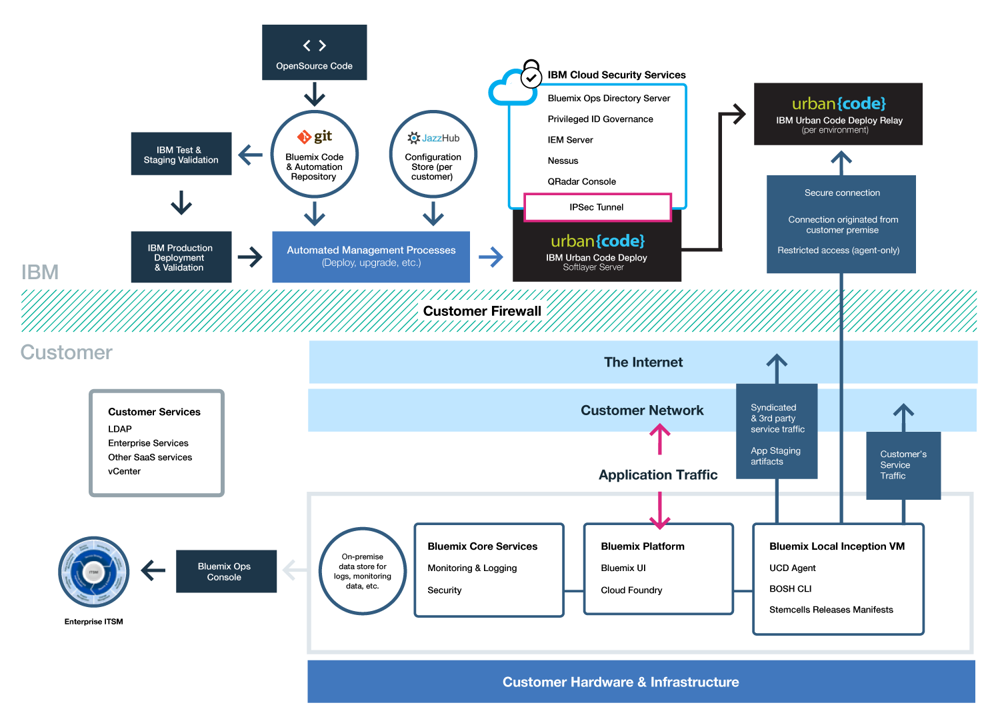

{:new_window: target="_blank"}
{:shortdesc: .shortdesc}

#{{site.data.keyword.Bluemix_notm}} Local
{: #local}
*Last updated: 15 December 2015*

{{site.data.keyword.Bluemix}} Local brings the power and agility of the {{site.data.keyword.Bluemix_notm}} cloud-based platform to your data center. With {{site.data.keyword.Bluemix_notm}} Local, you can protect your most sensitive workloads behind your company firewall, while staying securely connected and in sync with {{site.data.keyword.Bluemix_notm}} Public.
{:shortdesc}

IBM® uses cloud operations as a service to monitor and maintain your environment, so that you can focus on building apps and services that run on top of the environment. IBM also handles platform updates, so that you can focus on the business.

{{site.data.keyword.Bluemix_notm}} Local includes a private, syndicated catalog that displays the local services that are available exclusively to you. It also includes additional services that are syndicated from and available for you to use from {{site.data.keyword.Bluemix_notm}} Public. The syndicated catalog provides the function to create hybrid applications that consist of public and private services. You have the option to decide which public services meet the requirements for your business based on your data privacy and security criteria.

{{site.data.keyword.Bluemix_notm}} Local sits on a virtual machine that is behind your company firewall, so that you have the highest performing and most secure cloud infrastructure available to you. IBM installs, remotely monitors, and manages {{site.data.keyword.Bluemix_notm}} Local in your data center through IBM's relay technology.

*Figure 1. {{site.data.keyword.Bluemix_notm}} Local detailed overview*

{{site.data.keyword.Bluemix_notm}} Local environments have the same security standards as the public {{site.data.keyword.Bluemix_notm}} in terms of operational security. You provide the hardware and infrastructure, which gives you control over infrastructure and physical security. Developer access to the local {{site.data.keyword.Bluemix_notm}} is controlled by your LDAP policies, which can be configured by the {{site.data.keyword.Bluemix_notm}} team when they set up your environment. Within the local environment, using the Admin Console, you can manage user roles and permissions.

{{site.data.keyword.Bluemix_notm}} Local comes with all included {{site.data.keyword.Bluemix_notm}} runtimes and 64 GB of compute memory.

In addition, there is a set of services available for {{site.data.keyword.Bluemix_notm}} Local.

| **Type** | **Name** | **Description** |    
|----------|----------|-----------------|
|Included | {{site.data.keyword.Bluemix_notm}} Runtimes | Use runtimes to get your app up and running quickly, with no need to set up and manage VMs and operating systems. All {{site.data.keyword.Bluemix_notm}} runtimes are available for you to use in your {{site.data.keyword.Bluemix_notm}} Local instance.|
|Included | {{site.data.keyword.autoscaling}}| Dynamically increase or decrease the compute capacity of your application based on policies. With this service, you have unlimited use in your {{site.data.keyword.Bluemix}} Local environment.|
|Optional |{{site.data.keyword.datacshort}}| This service provides an in-memory data grid that supports distributed caching scenarios for your apps. Includes 50 GB of in-memory cache. |
|Optional | {{site.data.keyword.APIM}} | Use the {{site.data.keyword.APIMfull}} service to compose, manage, and socialize APIs. You can import APIs with resources by using a proxy URL or by assembling data from HTTP data sources. The benefit of using the {{site.data.keyword.APIM}} service is that you can manage how your APIs are used. |

*Table 1. Local Services*

### Relay

Relay is a delivery capability included with {{site.data.keyword.Bluemix_notm}} Local that enables IBM to automatically and consistently deliver the latest updates to all local deployments, so that you always have an up-to-date and secure system. Relay achieves secure connectivity through an open, outbound SSL, VPN tunnel that originates from the inception virtual machine on-premises by using certificates that are specific to each {{site.data.keyword.Bluemix_notm}} Local instance. All initial {{site.data.keyword.Bluemix_notm}} releases are available in the inception virtual machine, which also acts as an automation agent machine for deployments and updates. The SSL connection originates from the inception virtual machine, and once a secure connection is established back to the {{site.data.keyword.Bluemix_notm}} automation server, we can check for the currency and consistency of {{site.data.keyword.Bluemix_notm}} releases, and begin deploying updates.

The traffic on this tunnel is automation for serving and maintaining the platform, compute resources, and services for your instance. The inbound web port 443 is used for this connection. Relay is restricted to automation agent-only access. IBM uses the relay capability to deliver platform updates through a consistent testing and validation process to ensure that all deployments pushed to your local environments are stable and secure.

You have complete visibility of the environment for incident, problem, change, capacity, and security management as an administrator.  Administrators access the information about their environment by using the Administration console. Relay technology keeps the Administration console current with the latest data. For more information about user access, security logs, syndicated catalog control, and communication for updates and problem repair, see [Managing {{site.data.keyword.Bluemix_notm}} Local and {{site.data.keyword.Bluemix_notm}} Dedicated](../admin/index.html#mng).

##Setting up your {{site.data.keyword.Bluemix_notm}} Local instance
{: #setuplocal}

{{site.data.keyword.Bluemix_notm}} Local is designed to provide a private version of the {{site.data.keyword.Bluemix_notm}} Public offering that is hosted on your own hardware, managed by you. You can use {{site.data.keyword.Bluemix_notm}} services and runtimes to support your computing needs in a secure, customer-hosted and managed cloud environment.

IBM provides you access to {{site.data.keyword.Bluemix_notm}} Local by using a password-secured login. You can access the services, runtimes, and associated resources, and deploy and remove {{site.data.keyword.Bluemix_notm}} apps. Review the following steps for working with your IBM representative to set up your local instance of {{site.data.keyword.Bluemix_notm}}.

To set up your private version of {{site.data.keyword.Bluemix_notm}}:

<ol>
<li>Review the <a href="index.html#localinfra">{{site.data.keyword.Bluemix_notm}} Local infrastructure requirements</a> for setting up your local instance.</li>
<li>Contact your IBM designated account representative or contact <a href="https://console.ng.bluemix.net/?direct=classic/#/contactUs/cloudOEPaneId=contactUs" target="_blank">{{site.data.keyword.Bluemix_notm}}</a> to get started.</li>
<li>Establish your {{site.data.keyword.Bluemix_notm}} Local agreement with IBM that includes milestone dates for delivery.
	<ol type="a">
	<li>Work with IBM on your fee for your {{site.data.keyword.Bluemix_notm}} Local instance. The monthly recurring fee is based on the local services that you want to use, plus a subscription to all {{site.data.keyword.Bluemix_notm}} public services. You then receive an invoice for anything that you use beyond that subscription agreement.</li>
	<li>Identify the deadlines for each phase of setting up your {{site.data.keyword.Bluemix_notm}} Local instance.</li>
	</ol>
	</li>
<li>After your platform and account are created, you identify the people in your organization for the roles that are needed to get your local instance up and running. For more information about the roles that you assign, see <a href="index.html#rolesresponsibilities" target="_blank">{{site.data.keyword.Bluemix_notm}} Local roles and responsibilities</a>.
</li>
<li>You provide the hardware, and IBM helps you define and establish network connectivity between your corporate network and your {{site.data.keyword.Bluemix_notm}} Local instance. For more information about infrastructure requirements, see <a href="index.html#localinfra">{{site.data.keyword.Bluemix_notm}} Local infrastructure requirements</a>.
	<ol type="a">
	<li>IBM configures network access and LDAP based on what you provided. Administrative access is given to the contacts that you designate. You must also designate a contact for support and billing.</li>
	<li>IBM sets up a syndicated catalog in your local environment to show your local services and many of the public {{site.data.keyword.Bluemix_notm}} services.</li>
	<li>You validate network and firewall configuration and the LDAP endpoint and access.</li>
	</ol>
</li>
</ol>

You can expect a process similar to the following list for the initial deployment and configuration of your environment. For details about who is responsible for each task, see [Roles and responsibilities](../local/index.html#rolesresponsibilities).

<ol>
<li>You provide the VMware configuration that meets the specifications for compute resources, networking, and storage. For more information about the infrastructure requirements, see [{{site.data.keyword.Bluemix_notm}} Local infrastructure requirements](../local/index.html#localinfra).</li>
<li>You provide the vCenter cluster credentials to be used by the inception virtual machine. You must provide the following information:
<ul>
<li>Name of the VMware cluster</li>
<li>vCenter cluster credentials including the user ID and password</li>
<li>Datastore name or names (storage LUN name)</li>
<li>VLAN ID/VMware port group</li>
<li>Resource pool name</li>
</ul>
</li>
<li>You and IBM work together to validate the credentials that you provided in the previous task.</li>
<li>You provide 7 IP addresses on your network. If you have a secured web proxy for allowing outbound access to the Internet for internal {{site.data.keyword.Bluemix_notm}} components, then you must provide the credentials to connect to it.

**Note**: If your web proxy is not secure, then you do not need to provide the credentials. Also, note that not all {{site.data.keyword.Bluemix_notm}} Local customers use a web proxy.
</li>
<li>IBM provides a whitelist of URLs that must be allowed through your web proxy before starting the deployment.</li>
<li>You specify the domain names for the deployment, and the IDs that you want to use. You get two partially defined domains when you set up your local instance, and you pick the prefix for the two domains. For example, you pick the prefix for  <code>*mycompany*.bluemix.net</code> and <code>*mycompany*.mybluemix.net</code>. And, then you can also choose the full domain to create a custom domain.

You can choose as many custom domains as you want. However, you are responsible for the certificates for the custom domains.
</li>
<li>You choose which technology, IPSec or OpenVPN tunnel, to use to configure Relay to connect back to the IBM operations center.</li>
<li>IBM installs and starts up the inception virtual machine within the {{site.data.keyword.Bluemix_notm}} cluster. If you provide your own VMware, then an IBM representative helps your customer representative to complete this task.</li>
<li>IBM configures the Relay to communicate back to the IBM operations center.</li>
<li>The inception virtual machine repository pulls in the updated build artifacts.</li>
<li>You provide the credentials for IBM to connect to the corporate LDAP directory instance.</li>
<li>IBM uses automation to deploy the core {{site.data.keyword.Bluemix_notm}} platform.</li>
<li>IBM deploys the core platform that includes the elastic runtimes, console, administration feature, and monitoring.</li>
<li>IBM configures your administrative access to the environment.</li>
<li>IBM links your syndicated catalog from your local deployment to a Public {{site.data.keyword.Bluemix_notm}} instance for use of public services. A set of public services are available in your local instance by default. You can use the administration page for catalog management to turn the services on or off for your local instance.</li>
<li>You can start using your local instance that is monitored by the IBM operations team in order to respond to alerts.</li>
</ol>

After your {{site.data.keyword.Bluemix_notm}} instance is set up, you can monitor and manage your {{site.data.keyword.Bluemix_notm}} instance by using the Administration page. For more information, see [Managing {{site.data.keyword.Bluemix_notm}} Local and Dedicated](../administer/index.html#mng). For information about upgrades and maintenance, see [Maintaining your local instance](index.html#maintainlocal).

##Roles and responsibilities
{: #rolesresponsibilities}

If you set up a {{site.data.keyword.Bluemix_notm}} Local account, you identify the people in your organization for the roles that are needed to get your instance up and running.

###Roles

The following list shows the customer roles and responsibilities that you assign:

<dl>
<dt>**Procurement focal**</dt>
<dd>Works with the IBM representative on establishing your {{site.data.keyword.Bluemix_notm}} Local environment, including identifying the right people in your organization to work on any aspect of the project. The person assigned to this role oversees pattern selection, commercial arrangements, and arrangement of access to customer resources. The procurement focal is the overall contact for setting up the local instance.</dd>
<dt>**Compliance officer**</dt>
<dd>Works with the IBM representative to select a topology and deployment option that meets your security requirements. The person assigned to this role works with the IBM compliance consultant to determine which deployment patterns achieve the compliance goals.</dd>
<dt>**Network specialist**</dt>
<dd>Works with the IBM representative on the network plans for the {{site.data.keyword.Bluemix_notm}} deployment. The person assigned to this role reviews the required networking specifications required by IBM and works together with IBM on an implementation plan. At the end of the installation and verification phase, the person assigned to this role approves that the network configuration is in compliance with corporate standards.</dd>
<dt>**DevOps focal**</dt>
<dd>Works with the IBM representative to plan and apply the maintenance updates that are needed for the {{site.data.keyword.Bluemix_notm}} platform, services, and runtimes. The person assigned to this role also works with the IBM representative on the configuration of your {{site.data.keyword.Bluemix_notm}} Local instance.</dd>
<dt>**IaaS specialist**</dt>
<dd>Works with the IBM representatives on the deployment plan for VMware. Typically, this is someone who is a VMware administrator in the data center. The person assigned to this role reviews the <a href="../local/index.html#localinfra">{{site.data.keyword.Bluemix_notm}} Local infrastructure requirements</a> and works together with IBM on an implementation plan. At the end of deployment, the person assigned to this role approves that the deployment is in compliance with the corporate standards at the IaaS layer.</dd>
</dl>

Your customer representatives work with a dedicated client success manager (CSM) and other IBM specialists that work together to ensure that you always have the support that you need. The CSM is provided for 6 months at no charge. The CSM completes the following tasks:

<ul>
<li>Provides technical coordination between you and IBM.</li>
<li>Coordinates updates, upgrades, expert help from IBM, and initial enablement from a {{site.data.keyword.Bluemix_notm}} support engineer.</li>
<li>Provides information about the types of support that are available.</li>
<li>Acts as initial escalation point, if needed.</li>
</ul>

The {{site.data.keyword.Bluemix_notm}} support and operations team that works with you on your {{site.data.keyword.Bluemix_notm}} instance might access your local environment, but does so only for the following reasons.

<ul>
<li>To respond to alerts and perform operational maintenance</li>
<li>To attempt to reproduce a problem that is reported on a support ticket</li>
</ul>

###Responsibilities

From setting up your environment to continued maintenance, a variety of tasks must be completed by both you and IBM. The following tables outline the required tasks and the owners for completing the task throughout the inception, progression, and completion phases.

The inception phase is used to establish the {{site.data.keyword.Bluemix_notm}} Local environment. At this point, you have already reviewed the [Local infrastructure requirements](../local/index.html#localinfra) requirements. The primary goals of this phase include the following:

- Review the financial agreement, and establish the milestone dates for delivery.
- Create the {{site.data.keyword.Bluemix_notm}} platform, and provide access to runtimes and services.
- Define and establish network connectivity between your corporate network and {{site.data.keyword.Bluemix_notm}} operations.
- Identify and assign roles for your administrative team.

*Table 1. Inception phase tasks*

| **Task** | **Task details** | **Responsible party** |
|----------|------------------|-----------------------|
|Set compliance standards | Identify government, industry, and proprietary corporate standards that are required for the environment. | Customer |
|Create security and compliance integration plan | Create security and integration plan that includes costs, scheduling, and resources that are required to achieve security compliance. | IBM |
|Compliance plan approval | Approve the compliance plan. | Customer |
|Create sizing for environment |  	Create environment sizing based on predefined choices that take into consideration the high availability and disaster recovery goals, as well as initial DEA and service provisioning that is necessary to support the apps created with the platform. You and IBM work together to define, for example, what databases are needed, what services are offered in the customer's syndicated catalog, and more. | IBM and customer share responsibility |
|Select architecture | Select architecture based on predefined choices that take into account high availability and disaster recovery requirements. | IBM |
|Define disaster recovery goals | Define the disaster recovery requirements for the environment. | Customer |
|Create disaster recovery plan | Consult and define the disaster recovery plan. IBM creates a disaster recovery model, and consults with you where you provide feedback and approve the plan. | IBM and customer share responsibility |
|Create backup and recovery plan | Create a backup and recovery plan that defines the frequency and the requirements for on-and-off site distribution of the backup. IBM backs up fabric components, IBM services, service metadata including user roles, and more. You back up any application-specific data that you are responsible for. | IBM and customer share responsibility |
|Identify tools for event detection and problem determination | Identify IBM and third-party tools used for event detection and problem determination at the {{site.data.keyword.Bluemix_notm}} platform level. | IBM |
|Define escalation plan | Define the escalation plan to triage and resolve events detected from the monitoring components. | IBM |
|Sign infrastructure, platform, and support agreements | Sign the subscription agreement including the financial terms and conditions for the environment. Sign network and security monitoring agreement. Sign support subscription. | Customer |
|Procure environment | Procure compute resources, network, and storage. For more information about the infrastructure requirements for the environment, see [Local infrastructure requirements](../local/index.html#localinfra). | Customer |
|Install VPN solution | Install bidirectional VPN solution. | IBM |
|Install fabric, application, and monitoring and management components | Install, configure, and verify fabric components, such as BOSH Director, Cloud Controller, Health Manager, messaging, routers, DEAs and service providers, and the monitoring components that are defined in the escalation and problem detection plan. | IBM |
|Install and configure security components | Install and configure security components that are tied into the monitoring and escalation plan including IBM QRadar, credential vault, intrusion prevention system, IBM BigFix, and IBM Security Privileged Identity Management. | IBM |
|Configure login server | Configure the login server for use with the corporate LDAP. | IBM |
|Install and configure custom components |  	Install and configure custom components that reside outside the scope of the {{site.data.keyword.Bluemix_notm}} product and services. | Customer |
|Connect {{site.data.keyword.Bluemix_notm}} pipeline | Connect {{site.data.keyword.Bluemix_notm}} continuous integration and continuous delivery pipeline with IBM repositories. | IBM |
|Customize external solution components | Customize load balancers for disaster recovery scenarios. | Customer |
|Track status for security, compliance, and audit controls  | Track status up to the point where all tools and processes are in place to achieve identified compliance. | Customer |
|Review physical infrastructure | Review physical premises that host the solution components for threats and review of security controls to protect the data center. | Customer |
|Inspect monitoring software | Inspect monitoring and management components as defined in the escalation and problem determination plan. | Customer |
|Inspect OS | Inspect to ensure that the operating system image meets compliance standards. IBM provides access to the OS image. | IBM and customer share responsibility |

Next is the progression phase. The progression phase describes the on-going, collaborative relationship between you and IBM. The primary goals for this phase include the following:

- Review capacity and coordinate necessary adjustments.
- Review maintenance and platform improvements.
- Coordinate the activities for problem resolution and root cause analysis.

*Table 2. Progression phase tasks*

| **Task** | **Task details** | **Responsible party** |
|----------|------------------|-----------------------|
|Review weekly capacity reports | Review the weekly capacity reports and take corrective action, if needed. | Customer |
|Create month-to-month projections | Collect information and create a month-to-month projection of capacity and consumption. | IBM and customer share responsibility |
|Review capacity projections | Review the capacity projections as they relate to external events that might impact capacity as well as anticipated new deployments of apps. Work with IBM to review the projections and plan accordingly. | IBM and customer share responsibility |
|Adjust capacity |  Add or remove capacity as your needs change. | IBM |
|Publish upcoming updates and maintenance | Create documentation for the required maintenance of IBM components. | IBM |
|Perform maintenance | Work with IBM to schedule required maintenance within a 30-day window. You can provide dates that might not work for you in the 30-day window, and IBM works to schedule the maintenance accordingly. | IBM and customer share responsibility |
|Address provisioning failures | Fix provisioning failures, if they occur, for customer-created services that are deployed to the Catalog. | IBM |
|Perform network and IP scans | Perform daily and monthly network and IP scans. | IBM and customer share responsibility |
|Provide access to audit logs | Provide access to all security and administrative audit logs.   | IBM and customer share responsibility |
|Conduct testing | Conduct periodic Key Controls over Operations testing and third-party penetration testing. | IBM and customer share responsibility |
|Status reporting, audit coordination, and compliance meetings  | Complete status reporting, external audit coordination, and representation at compliance review status meetings. | IBM |
|Employment and business need verification | Complete quarterly employment verification and verification of continued business need for IBM representatives that have access to the customer environment. | IBM |
|Resolution of security vulnerabilities | Resolve reported security vulnerabilities in the platform. | IBM |

The final stage of completion represents the end of the relationship between you and IBM {{site.data.keyword.Bluemix_notm}}. The primary tasks for this phase include the following:

* Ending of the financial agreement
* Removing all network connections
* Recycling infrastructure

*Table 3. Completion phase tasks*

| **Task** | **Task details** | **Responsible party** |
|----------|------------------|-----------------------|
|End financial agreement | Discuss and agree to an end to the financial agreement contract. | IBM and customer share responsibility |
|Decommission environment | Shut down access to and credentials for the environment. | IBM and customer share responsibility |
|Shut down Relay | Terminate the Relay connection. | IBM |
|Recycle infrastructure | Recycle your infrastructure according to company guidelines. | Customer |

##{{site.data.keyword.Bluemix_notm}} Local infrastructure requirements
{: #localinfra}

For {{site.data.keyword.Bluemix_notm}} Local, you own the physical security and the infrastructure for hosting the local instance. IBM sets the following requirements for setting up {{site.data.keyword.Bluemix_notm}} Local.
###Hardware
While there are requirements for the type and size of available hardware, you can choose any combination to meet the set resource total requirements.
<dl>
<dt>**VMware ESXi hardware**</dt>
<dd>
ESXi is a virtualization layer that runs on physical servers and that abstracts processor, memory, storage, and resources into multiple virtual machines. Choose any combination that meets the following resource totals, on the condition that minimum physical core count per ESXi is eight. The following specifications are for the {{site.data.keyword.Bluemix_notm}} core runtime only.
<ul>
<li>48 Physical cores at 2.0 or more GHz each</li>
<li>756 GB of physical RAM</li>
</li>Total datastore size of 7.5 TB
<ul>
<li>7 TB datastore to hold {{site.data.keyword.Bluemix_notm}}</li>
<li>500 GB datastore to hold the inception virtual machine</li>
</ul>
</ul>

<strong>Note:</strong> If you use multiple datastores, use the same prefix for each.

</dd>
<dt>**High availability**</dt>
<dd>
To support a single node failure, you must have n+1 ESXi. For example, if two ESXis are used, meaning 16x cores each, then a third is needed.

<strong>Note:</strong> The customer VMware administrator can decide to enforce strict high availability failover in the cluster to guarantee resources.

</dd>
<dt>**Network**</dt>
<dd>
Recommended requirements include a customer accessible port group with 7 customer network IP addresses that have outbound internet access in the same subnet. Then, define a second private VLAN between only the ESXis being used for {{site.data.keyword.Bluemix_notm}} Local. This VLAN is shown as a port group in VMware. {{site.data.keyword.Bluemix_notm}} Local uses it for the private subnet, which is more secure and can help avoid routing issues. 

**Note**: IBM can detect if the network connection is lost. In the event that network connection is lost, IBM contacts you and works with your network specialist to resolve the issue.

</dd>
</dl>

###vCenter server configuration
Review the following version, datacenter, resource pool, and datastore requirements.
<dl>
<dt>**Supported VMware versions**</dt>
<dd>vCenter and ESXi 5.1 and 5.5</dd>
<dt>**Supported VMware types**</dt>
<dd>vSphere Enterprise 
vSphere Enterprise plus, if you plan to use distributed virtual switches</dd>
<dt>**Datacenter**</dt>
<dd>Create a datacenter, if one does not exist.</dd>
<dt>**Datacenter folder**</dt>
<dd>Create a VM folder with the same name as the cluster, if you do not plan to grant Administrator access that is propagated from the datacenter.</dd>
<dt>**Cluster**</dt>
<dd>Create a cluster specifically for {{site.data.keyword.Bluemix_notm}} Local use. An example for the cluster name is `bluemix`.</dd>
<dt>**Resource pool**</dt>
<dd>Create a resource pool under the {{site.data.keyword.Bluemix_notm}} Local cluster. An example for resource pool name is `local`.</dd>
</dt>**Datastores**</dt>
<dd>Requires 7.5 TB for the initial deployment of {{site.data.keyword.Bluemix_notm}}. 
 
**Note**: When you use more than one datastore, ensure that each one begins with the same prefix. Examples of multiple datastore names with the same prefix are `bluemix_datastore_01` and `bluemix_datastore_02`.</dd>
</dl>

###Network Bandwidth
Recommended throughput is 5 Mbps up and 5 Mbps down, and you can expect a monthly data usage of 10 GB. IBM establishes agreed upon windows when large bundles of data are delivered, which can be as large as 3 GB.
###VMware permissions
Set the following roles and permissions. Propagation is set for each permission. If the permission is propagated, the permission gets passed down through the object hierarchy. However, permissions for a child object always override permissions that are propagated from a parent object.
<dl>
<dt>**v Center Server**</dt>
<dd>Set the role as read-only and not propagated. 
 
**Note**: This role is needed to retrieve task status for specific disk operations.</dd>
<dt>**Datacenter**</dt>
<dd>Create the role "{{site.data.keyword.Bluemix_notm}}" and grant permissions for **Datastore** including **Low level file operations** and **Update virtual machine files**. 
 
**Note**: This role is needed to support file posts to the datastores.</dd>
<dt>**Cluster**</dt>
<dd>Set the role as administrator and propagated.</dd>
<dt>**Datastores**</dt>
<dd>Set the role administrator and propagated for each {{site.data.keyword.Bluemix_notm}} datastore.</dd>
<dt>**Network**</dt>
<dd>Set public and private port groups with the administrator role, not propagated.</dd>
</dl>

###Droplet Execution Agent (DEA) pool
Each DEA is configured with:
- 16 - 32 GB of RAM
- 2x - 4x vCPU
- 150 - 300 GB of storage

For example, if the ESXi host size is 256 GB of memory with 16x cores, then eight DEAs are added. If the ESXi host size is 64 GB of memory with 8x cores, then two ESXis and four DEAs are required to be added. An additional 1.5 TB of storage is required for every four DEAs. This example is based on a DEA configured with 32 GB of RAM, 4x vCPU, and 300 GB of storage.

##Maintaining your local instance
{: #maintainlocal}

IBM maintains and installs updates and fixes as IBM deems appropriate to the Bluemix Local platform, runtimes, and services. Services might not be available during maintenance windows.

**Important**: IBM reserves the right to interrupt services to apply emergency maintenance as needed. IBM might change scheduled maintenance hours, but notifies you of any such changes, as well as any emergency maintenance information.

The following types of maintenance are required for {{site.data.keyword.Bluemix_notm}} Local:
<dl>
<dt>**Standard Maintenance Windows**</dt>
<dd>The services utilize pre-defined, standard maintenance windows, which might cause the services to be unavailable. IBM does not require customer approval to perform maintenance, but attempts to minimize impact to your services. 
 
IBM sends broadcast messages of the changes that are planned for each maintenance window, through email, phone, or other methods. 
 
**Important**: Some service might not be available to you during the maintenance period.</dd>

<dt>**Monthly Change Window**</dt>
<dd>The monthly maintenance window is applied based on coordination between you and IBM within a 21-day window. You can provide IBM with specific dates or times within the 21-day window that might not work for you. IBM attempts to schedule updates around those times. Based on the requests, IBM communicates the scheduled maintenance window to you. Monthly change windows are not expected to impact the running Bluemix Local environment. 
 
**Note**: If you do not request a specific time for the update, the maintenance is automatically applied at the end of the window. 
 
Go to **ADMINISTRATION > SYSTEM INFORMATION** to view pending updates, set unavailable dates, and approve updates. For more information about notifications and scheduling pending updates, see <a href="../admin/index.html#oc_system">Viewing system information</a>.</dd>

<dt>**Other**</dt>
<dd>IBM intends to confine all maintenance that might affect your services, in particular the availability of your Bluemix Local environment, runtimes, and services, to the standard and monthly windows. Other change windows might be used on an exception basis for management of the environment. IBM makes reasonable efforts to minimize the impact to you during such change windows and notifies you in advance.</dd>
</dl>

To set up maintenance of your local instance, work with your IBM designated account representative to identify an agreed upon window for the standard maintenance.

If there is a reported issue following a maintenance update, you agree with your IBM representative if it is in your best interest to allow IBM to roll back the update. Upon agreement, IBM rolls back the update to restore the environment to the previous state.

## Disaster recovery
{: #dr}

{{site.data.keyword.Bluemix_short}} Public provides a continuously available platform for innovation. Multiple fail-safe measures ensure that your orgs, spaces, and apps are always available. Deploying apps to multiple geographic regions enables continuous availability that protects against unplanned, simultaneous loss of multiple hardware or software components, or the loss of an entire data center, so that even in the event of a natural disaster in one geographic location, your distributed {{site.data.keyword.Bluemix_notm}} Public app instances in alternate geographic locations will be available.
{: shortdesc}

Disaster recovery for {{site.data.keyword.Bluemix_short}} Local is made possible through continuous availability for your apps, the inherent high availability of the platform, and the ability to restore your instance in the event of a failure. You are responsible for enabling continuous availability of your apps by deploying to multiple regions. High availability is built in at the platform level through technologies included in Cloud Foundry and other components. And, you can work together with IBM to ensure that your data is properly backed up in the case that you need to restore your instance at any time.

### Enabling continuous availability for {{site.data.keyword.Bluemix_notm}} Local
{: #enabling}

By default, {{site.data.keyword.Bluemix_notm}} Public deploys to multiple geographic locations. However, you must do the following to enable globally distributed {{site.data.keyword.Bluemix_notm}} Local instances:

* Ensure that your developers are deploying apps in more than one region, either through a manual or automated process. Selected regions should be more than 200 km apart from each other to ensure that a natural disaster cannot affect both geographic locations.
* Configure a global load balancer, like Akamai or Dyn, to point to apps in at least two different regions.

**Note**: Not all {{site.data.keyword.Bluemix_notm}} services support regional distribution. When you construct an app, if you want to achieve geographic distribution, then you must also make sure that the services that are used by that app have data synchronization as a key feature.

#### Deploying {{site.data.keyword.Bluemix_notm}} Local apps to multiple geographic locations
{: #deploying}

To deploy into a second location or multiple locations, you must follow a process similar to the one you took to enable your primary geographic location:

1. Enable a new local environment to host additional instances of your applications. To create a new environment, contact your IBM sales team to initiate the process. For more information about setting up a local instance, see [Setting up {{site.data.keyword.Bluemix_notm}} Local](../local/index.html#setuplocal). You must log in separately to access each environment. Each physical location for the hosted environments should be a minimum of 200 km away from the original location to ensure availability.
2. Obtain the unique domain name where your new deployed app will be hosted. For example, if your original domain is *mycompany.east.bluemix.net*, then you can create a new local environment with a new domain such as *mycompany.west.bluemix.net*, and deploy to the new domain.
3. Deploy to the new location each time you deploy your original app. For more information about deploying, see [Uploading your app](../starters/upload_app.html).

#### Enabling a global load balancer for {{site.data.keyword.Bluemix_notm}} Local
{: #glb}

A global load balancer not only ensures continuous availability and is required for disaster recovery, but it also has several additional benefits:

* Routes users to the closest {{site.data.keyword.Bluemix_notm}} region by default
* Routes based on performance
* Selectively directs a percentage of traffic to a new application version
* Provides site failover based on region health check
* Provides site failover based on application health check
* Uses weighted routing between endpoints

You can choose a global load balancer such as Akamai or Dyn. For more about using Akamai as a global load balancer, see [Global traffic management](https://www.akamai.com/us/en/solutions/products/web-performance/global-traffic-management.jsp){: new_window}. For more about using Dyn as a global load balancer, see [4 Reasons Businesses Are Taking Global Load Balancing to the Cloud](http://dyn.com/blog/4-reasons-businesses-are-taking-global-load-balancing-to-the-cloud/){: new_window}.

### High availability
{: #ha}

In addition to enabling continuous availability, {{site.data.keyword.Bluemix_notm}} also provides high availability across the platform by using technologies built into Cloud Foundry, Docker, and other components.

These technologies include the following:

<dl>
<dt>Scalability in Cloud Foundry</dt>
<dd>A Cloud Foundry <a href="https://docs.cloudfoundry.org/concepts/architecture/execution-agent.html" target="_blank">Droplet Execution Agent (DEA)</a> performs health checks on the apps running within it. If there is a problem with the app or the DEA itself, it deploys additional instances of the app to an alternate DEA to address the issue. For more information, see <a href="https://docs.cloudfoundry.org/concepts/high-availability.html" target="_blank">Configuring CF for High Availability with Redundancy</a>.
</dd>
<dt>Metadata backup</dt>
<dd>Metadata is backed up to a secondary location, typically an on-premises virtual machine. If possible, you should replicate the backup to your own environment at least 200 km away.</dd>
</dl>

##Restoring your local instance
{: #restorelocal}

{{site.data.keyword.Bluemix_notm}} Local settings, metadata, and configurations are backed up regularly to prepare for any unplanned outages in the environment. Your data that you are responsible for backing up includes application data, cloud database services data, and object stores.

As part of the data backup, which includes system metadata and configurations, IBM completes the following tasks:

<ul>
<li>Encrypts all backup copies and manages encryption keys</li>
<li>Monitors and manages backup activity</li>
<li>Provides the encrypted backup files</li>
<li>Restores the requested data</li>
<li>Manages scheduling conflicts between backup and fix management operations</li>
</ul>

Because protection of private data is critical, IBM needs your collaboration when dealing with backup file management, so that the files are not moved outside of your data centers. Specifically, IBM asks that you complete the following tasks:

<ul>
<li>Move a copy of your encrypted backup data off-site, just as you would for any other backup data that you manage.</li>
<li>Provide the backup files for the IBM operator in case of any need to restore.</li>
</ul>

# rellinks
## general
* [Discover: {{site.data.keyword.Bluemix_notm}} Local](http://www.ibm.com/cloud-computing/bluemix/hybrid/local/)
* [Managing {{site.data.keyword.Bluemix_notm}} Local and {{site.data.keyword.Bluemix_notm}} Dedicated](../admin/index.html#mng)
* [Contacting support](../troubleshoot/getting_customer_support.html#bluemix_support)
