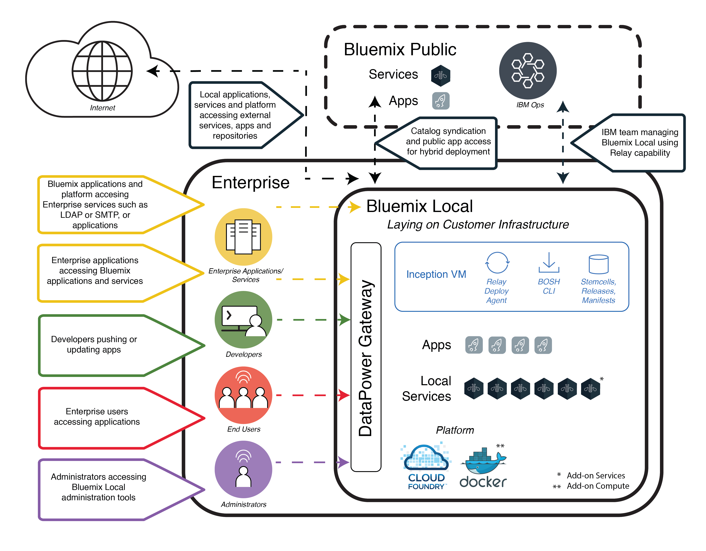

---

copyright:

  years: 2015, 2017

lastupdated: "2017-01-12"

---

{:new_window: target="_blank"}
{:shortdesc: .shortdesc}

# {{site.data.keyword.Bluemix_local_notm}}
{: #local}

{{site.data.keyword.Bluemix_local}} brings the power and agility of the {{site.data.keyword.Bluemix_notm}} cloud-based platform to your data center. With {{site.data.keyword.Bluemix_local_notm}}, you can protect your most sensitive workloads behind your company firewall, while staying securely connected and in sync with {{site.data.keyword.Bluemix_notm}} Public.
{:shortdesc}

IBM® uses cloud operations as a service to monitor and maintain your environment, so that you can focus on building apps and services that run on top of the environment. {{site.data.keyword.IBM_notm}} also handles platform updates, so that you can focus on the business.

{{site.data.keyword.Bluemix_local_notm}} environments have the same security standards as the public {{site.data.keyword.Bluemix_notm}} in terms of operational security. You provide the hardware and infrastructure, which gives you control over infrastructure and physical [security](/docs/security/index.html#localplatformsecurity). Developer access to the local {{site.data.keyword.Bluemix_notm}} environment is controlled by your LDAP policies, which can be configured by the {{site.data.keyword.Bluemix_notm}} team when they set up your environment. Within the local environment, using the Administration page, you can [manage users and permissions](/docs/admin/index.html#oc_useradmin).

{{site.data.keyword.Bluemix_local_notm}} comes with all included {{site.data.keyword.Bluemix_notm}} runtimes and 64 GB of compute memory.

In addition, there is a set of services that are available as {{site.data.keyword.Bluemix_local_notm}} services. Review the following table to see what is included and what is available for you to purchase.

| **Type** | **Name** | **Description** |
|----------|----------|-----------------|
|Included | [{{site.data.keyword.Bluemix_notm}} runtimes](/docs/cfapps/runtimes.html) | Use runtimes to get your app up and running quickly, with no need to set up and manage machines and operating systems. All {{site.data.keyword.Bluemix_notm}} runtimes are available for you to use in your {{site.data.keyword.Bluemix_notm}} Local instance.|
|Included | [{{site.data.keyword.autoscaling}}](/docs/services/Auto-Scaling/index.html)| Dynamically increase or decrease the compute capacity of your application based on policies. With this service, you have unlimited use in your {{site.data.keyword.Bluemix}} Local environment.|
|Optional | [{{site.data.keyword.apiconnect_short}}](/docs/services/apiconnect/index.html) | {{site.data.keyword.apiconnect_long}} integrates {{site.data.keyword.APIM}} and IBM StrongLoop into a single offering that provides a comprehensive solution to create, run, manage, and enforce APIs and microservices. |
|Optional | [{{site.data.keyword.containershort}}](/docs/containers/container_index.html) | Run Docker containers on {{site.data.keyword.Bluemix_notm}} Local. Containers are virtual software objects that include all of the elements that an app needs to run. A container has the benefits of resource isolation and allocation, but is more portable and efficient than, for example, a virtual machine. For information about the hardware requirements, see [IBM {{site.data.keyword.containershort}} in {{site.data.keyword.Bluemix_notm}} Dedicated and Bluemix Local](/docs/containers/container_dl.html). |
|Optional | [{{site.data.keyword.datacshort}}](/docs/services/DataCache/index.html#data_cache) | This service provides an in-memory data grid that supports distributed caching scenarios for your apps. Includes 50 GB of in-memory cache. |
| Optional (Beta) | [Logging](/docs/monitoringandlogging/cfapps_ml_logs_dedicated_ov.html#container_ml_logs_dedicated_ov) | Provides logs for your Cloud Foundry apps in your {{site.data.keyword.Bluemix_notm}} user interface and searchable logs and dashboards in Kibana. |
|Optional | [{{site.data.keyword.mobilepush}}](/docs/services/mobilepush/index.html) | {{site.data.keyword.mobilepush}} is a service that you can use to send notifications to iOS and Android device. Notifications can be targeted to all application users or to a specific set of users and devices using tags. You can administer devices, tags, and subscriptions. You can also use an SDK (software development kit) and Representational State Transfer (REST) application program interface (APIs) to further develop your client applications. |
|Optional | [{{site.data.keyword.sescashort}}](/docs/services/SessionCache/index.html#session_cache) | For increased redundancy, {{site.data.keyword.sescashort}} provides a replica of a session stored in the cache. Therefore, in the event of a brownout or outage, your client application maintains access to the session in the cache. The service supports session caching scenarios for web and mobile applications. |
|Optional | [{{site.data.keyword.iot_short}}](/docs/services/IoT/index.html) | This service lets your apps communicate with and consume data collected by your connected devices, sensors and gateways. The local base offering includes an initial environment that permits running a private version of the IBM {{site.data.keyword.iot_short}} within the local environment with a capacity of 100,000 concurrently connected devices or applications and 1.6 TB of data exchange. |
{: caption="Table 1. Local services and runtimes" caption-side="top"}
{: #table01}

There are optional components that are available for you to purchase to scale and extend the capacity of your resources and services. You can purchase any of these components by contacting the sales team; go to [Contact us](https://console.ng.bluemix.net/?direct=classic/#/contactUs/cloudOEPaneId=contactUs) for information about contacting a sales representative. To increase your plan for a service, you can select the plan from the service tile in your catalog.

| **Name** | **Description** |
|----------|-----------------|
|{{site.data.keyword.Bluemix_notm}} Local {{site.data.keyword.apiconnect_short}} Professional 5 Million API Calls | An environment that permits running a private version of {{site.data.keyword.apiconnect_short}} with a capacity of 5 million API Calls a month targeted towards departmental API projects. |
|{{site.data.keyword.Bluemix_notm}} Local {{site.data.keyword.apiconnect_short}} Professional 100 thousand API Calls increase| An extension of the {{site.data.keyword.apiconnect_short}} Professional environment to provide additional capacity of 100 thousand API Calls a month. |
|{{site.data.keyword.Bluemix_notm}} Local {{site.data.keyword.apiconnect_short}} Enterprise 25 Million API Calls | An environment that permits running a private version of {{site.data.keyword.apiconnect_short}} with a capacity of 25 million API Calls a month targeted towards enterprise wide API projects. |
|{{site.data.keyword.Bluemix_notm}} Local {{site.data.keyword.apiconnect_short}} Enterprise 100 thousand API Calls increase | An extension of the {{site.data.keyword.apiconnect_short}} Enterprise environment to provide additional capacity of 100 thousand API Calls a month. |
|{{site.data.keyword.Bluemix_notm}} Data & Session Cache 50 GB capacity increase | An environment that permits deploying and running Data Cache and Session Cache instances up to a cumulative capacity of 50 GB. |
|{{site.data.keyword.Bluemix_notm}} {{site.data.keyword.iot_short}} Local incremental increase | An environment additional to the {{site.data.keyword.iot_short}} Local base service offering that permits running a private version of the {{site.data.keyword.iot_short}} within the local environment with a capacity of 100,000 concurrently connected devices or applications and 0.5 TB of data exchange. |
|{{site.data.keyword.IBM_notm}} {{site.data.keyword.mobilepush}} Local add-on instance | An environment that permits the deployment and running of {{site.data.keyword.mobilepush}} instance with the ability to accept 300 additional requests per second. |
{: caption="Table 2. Optional services components for purchase" caption-side="top"}
{: #table02}

| **Name** | **Description** |
|----------|-----------------|
|Local Cloud Foundry runtimes 64 GB capacity  | Cloud Foundry runtimes environment with 64 GB of runtime capacity. |
|Local Cloud Foundry runtimes 16 GB capacity increase  | An extension of the Cloud Foundry runtimes environment to provide an extra 16 GB of runtime capacity. |
|Local {{site.data.keyword.containerlong}} 16 GB capacity increase  | An extension of the {{site.data.keyword.containerlong}} environment to provide an extra 16 GB of capacity. |
|Local {{site.data.keyword.containerlong}} 64 GB capacity  | {{site.data.keyword.containerlong}} environment with 64 GB of capacity. |
{: caption="Table 3. Optional platform add-on components for purchase" caption-side="top"}
{: #table03}

**Note**: {{site.data.keyword.Bluemix_notm}} Local components might indicate a specific configured capacity, such as gigabytes or transactions per second. Because actual capacity in practice for any configuration of the cloud service varies depending on many factors, the actual capacity in practice might be more or less than the configured capacity.

### Syndicated catalog
{: #cataloglocal}

{{site.data.keyword.Bluemix_local_notm}} includes a private catalog that brings together approved services across your public and local deployments. You can even publish and manage access to your own services through the {{site.data.keyword.Bluemix_notm}} catalog. You have the option to decide which public services meet the requirements for your business, based on your data privacy and security criteria.

If you have a private instance of a {{site.data.keyword.Bluemix_notm}} service for your local environment, you see a "Local" tag with the service names in your catalog administration view. Similarly, if it is a custom service, meaning you used a service broker to create it, you see "Custom" listed with the service name. All other services listed that do not have a "local" or "custom" tag are available by using syndication from {{site.data.keyword.Bluemix_notm}} Public. Syndicated services provide the function to create hybrid applications that consist of public and private services.

|Service	|Available in US South region	|Available in Europe United Kingdom region |Available in Australian Sydney region|
|:----------|:------------------------------|:------------------|:------------------|
|{{site.data.keyword.alchemyapishort}} 		|Yes	   	|Yes  		|Yes|
|{{site.data.keyword.alertnotificationshort}}	|Yes		|Yes		|Yes	|
|{{site.data.keyword.apiconnect_short}}         |Yes            |Yes            |Yes  |
|{{site.data.keyword.appseccloudshort}}		|Yes		|Yes		|Yes |
|{{site.data.keyword.apiconnect_short}} 	|Yes   	 	|Yes  	 	|Yes   |
|Automated Accessibility Checker |Yes       |Yes    |Yes   |
|{{site.data.keyword.rules_short}}		|Yes		|Yes		|Yes |
|{{site.data.keyword.iotmapinsights_short}}    |Yes  |Yes  |Yes  |
|{{site.data.keyword.conversationshort}}  |Yes  |Yes  |Yes  |
|{{site.data.keyword.dashdbshort}}		|Yes		|Yes		|Yes |
|{{site.data.keyword.dataworks_short}}		|Yes		|Yes		|No|
|{{site.data.keyword.DB2OnCloud_short}}		|Yes		|Yes		|Yes |
|Digital Content Checker |Yes  |Yes  |Yes  |
|{{site.data.keyword.documentconversionshort}}	|Yes		|Yes		|Yes|
|{{site.data.keyword.iotdriverinsights_short}}  |Yes |Yes  |Yes  |
|{{site.data.keyword.geospatialshort_Geospatial}}	|Yes	|Yes		|Yes |
|{{site.data.keyword.GlobalizationPipeline_short}}	|Yes		| Yes		| Yes |
|{{site.data.keyword.identitymixershort}}		|Yes		|Yes		|Yes|
|{{site.data.keyword.iot4auto_short}} |Yes   |Yes  |Yes  |
|{{site.data.keyword.iotelectronics}}  |Yes  |Yes  |No |
|{{site.data.keyword.iotinsurance_short}} |No   |No   |Yes  |
|{{site.data.keyword.twittershort}}		|Yes		|Yes		|Yes|
|{{site.data.keyword.languagetranslationshort}}	|Yes		|Yes		|Yes |
|{{site.data.keyword.languagetranslatorshort}} |Yes  |Yes  |Yes  |
|{{site.data.keyword.dwl_short}}  |Yes  |Yes  |No  |
|{{site.data.keyword.eventhubshort}}		|Yes		|No		|No|
|{{site.data.keyword.messagehub}}		|Yes		|Yes		|No|
|{{site.data.keyword.manda}}			|Yes		|Yes		|Yes |
|{{site.data.keyword.amashort}}			|Yes		|Yes		|Yes |
|{{site.data.keyword.mqa}}			|Yes		|Yes		|Yes |
|{{site.data.keyword.mql}}			|No		|No		|Yes |
|{{site.data.keyword.nlclassifierlshort}} 	|Yes 		|Yes 		|Yes|
|{{site.data.keyword.personalityinsightsshort}}	|Yes		|Yes		|Yes|
|{{site.data.keyword.pm_short}}			|Yes		|Yes		|No |
|{{site.data.keyword.mobilepush}}		|Yes		|Yes		|Yes |
|{{site.data.keyword.retrieveandrankshort}}	|Yes 		|Yes 		|Yes|
|{{site.data.keyword.runbook_short}}		|Yes		|Yes		|Yes|
|{{site.data.keyword.SecureGateway}}		|Yes		|Yes		|Yes |
|{{site.data.keyword.ssofull}}			|Yes		|No		|No|
|{{site.data.keyword.speechtotextshort}}	|Yes 		|Yes	 	|Yes|
|{{site.data.keyword.streaminganalyticsshort}}	|Yes		|Yes		|Yes |
|{{site.data.keyword.texttospeechshort}} 	|Yes 		|Yes	 	|Yes|
|{{site.data.keyword.toneanalyzershort}} 	|Yes 		|Yes 		|Yes|
|{{site.data.keyword.tradeoffanalyticsshort}}	|Yes		|Yes		|Yes|
|{{site.data.keyword.visualrecognitionshort}}	|Yes 		|Yes	 	|Yes|
|{{site.data.keyword.iot_short}}		|Yes		|Yes		|No|
|{{site.data.keyword.weather_short}}		|Yes		|Yes		|Yes|
|{{site.data.keyword.workloadscheduler}}	|Yes		|Yes		|Yes |
{: caption="Table 4. Services available for syndication from {{site.data.keyword.Bluemix_notm}} Public by region" caption-side="top"}
{: #table04}

**Note**: Third-party services are not included in the table. Check your catalog for third-party service options.

## {{site.data.keyword.Bluemix_local_notm}} architecture
{: #localarch}

{{site.data.keyword.Bluemix_local_notm}} sits on a virtualized infrastructure that is behind your Enterprise firewall, providing the highest performing and most secure cloud infrastructure to you. {{site.data.keyword.IBM_notm}} installs, remotely monitors, and manages {{site.data.keyword.Bluemix_local_notm}} in your data center through {{site.data.keyword.IBM_notm}}'s [Relay](#localrelay) technology. The logical architecture in [Figure 1](#figure01) describes how {{site.data.keyword.Bluemix_notm}} is set up in your local environment and how {{site.data.keyword.IBM_notm}} maintains your local instance:

Figure 1. {{site.data.keyword.Bluemix_local_notm}} architecture
{: #figure01}

The inception virtual machine (inception VM) runs on your enterprise virtualized infrastructure behind your enterprise firewall. The inception VM creates an outbound network connection to the {{site.data.keyword.IBM_notm}} Operations center through the {{site.data.keyword.IBM_notm}} relay technology. Relay performs several functions and is described in following [Relay](#localrelay) section.

The {{site.data.keyword.Bluemix_notm}} platform components and core features that support the platform components run in a private, isolated virtual local area network (VLAN). {{site.data.keyword.Bluemix_local_notm}} uses a VLAN for the private subnet. Using a private subnet rather than a public VLAN is more secure and can help avoid routing issues. The set of core features that make up and support the platform include the following:

<dl>
<dt>Platform</dt>
<dd>At a minimum, the platofrm is Cloud Foundry components and some local application services. {{site.data.keyword.Bluemix_notm}} provides both Cloud Foundry and {{site.data.keyword.containerlong}}-based compute environments. An enterprise may have one or both of these compute environments configured. 
An enterprise may also add additional local application services. 

Refer to [Optional components for purchase: Services add-ons](#table02) and [Optional components for purchase: Platform add-ons](#table03) for additional services and compute capabilities that may be added.

</dd>
<dt>{{site.data.keyword.Bluemix_notm}} Public</dt>
<dd>
A {{site.data.keyword.Bluemix_local_notm}} environment might have an outbound connection to a {{site.data.keyword.Bluemix_notm}} Public region. A connection to public enables syndication of public services onto the local catalog. {{site.data.keyword.Bluemix_notm}} Public service syndication provides a convenient method for developers to build applications hosted on the enterprise's {{site.data.keyword.Bluemix_local_notm}} environment as well as access to services running in {{site.data.keyword.Bluemix_notm}} Public. See the list of {{site.data.keyword.IBM_notm}} services that can be syndicated from {{site.data.keyword.Bluemix_notm}} Public in the [Syndicated catalog](#cataloglocal) section.
</dd>
<dt>{{site.data.keyword.IBM_notm}} Operations</dt>
<dd>
{{site.data.keyword.IBM_notm}} manages, monitors, and maintains the local platform and local services, so that you can focus on building innovative applications. The {{site.data.keyword.IBM_notm}} Operations Support Services (OSS) team performs operations by using a VPN tunnel connection from the inception VM to {{site.data.keyword.IBM_notm}}'s Operations network.
</dd>
<dt>Enterprise</dt>
<dd>
The enterprise network environment has a bi-directional network link to {{site.data.keyword.Bluemix_local_notm}}. This allows applciations hosted in {{site.data.keyword.Bluemix_local_notm}} to access services and resources in the enterprise, including data sources and enterprise services. The network link also allows {{site.data.keyword.Bluemix_local_notm}} to use your LDAP for authentication of your developers and administrators.
</dd>
<dt>Local services</dt>
<dd>A set of services are available to be used privately in your {{site.data.keyword.Bluemix_local_notm}} environment. Typically, you decide which services you want for your environment prior to the deployment by the {{site.data.keyword.IBM_notm}} team. For a list of available services, go to [Local services and runtimes](#table01).
</dd>
<dt>DataPower Gateway</dt>
<dd>
{{site.data.keyword.IBM_notm}} DataPower Gateway appliances provide access to {{site.data.keyword.Bluemix_notm}} application domains. These appliances connect to your intranet network and to the {{site.data.keyword.Bluemix_notm}} private network, providing a secure gateway to the {{site.data.keyword.Bluemix_notm}} deployment. Your developers, who are deploying apps and services, get access from your intranet through this gateway. The users of the applications will get access through the DataPower appliances as well as your administrators.
</dd>
<dt>Security intelligence</dt>
<dd>
{{site.data.keyword.IBM_notm}} uses QRadar Security Intelligence Platform to provide a unified architecture for integrating several key components. These components include security information and event management, log management, anomaly detection, incident forensics, and configuration and vulnerability management. {{site.data.keyword.Bluemix_notm}} also uses {{site.data.keyword.IBM_notm}} QRadar security information and event management (SIEM) to monitor privileged user actions and successful and unsuccessful login attempts of application developers. QRadar reports provide the customer with visibility on by using the Reports and Logs section on the Administration page. For information about security reports, see [Viewing reports](/docs/admin/index.html#oc_report).

{{site.data.keyword.IBM_notm}} BigFix ensures that fixes for operating systems are applied at appropriate frequencies. The patching process is automated, and the schedule is agreed upon between you and IBM. For information about maintenance and upgrades, see [Maintaining your local instance](index.html#maintainlocal).

</dd>
</dl>

Your apps are deployed inside virtual containers that run on Cloud Foundry virtual machines. All Cloud Foundry components, such as cloud controllers, health managers, routers, and droplet execution agents (DEAs) are deployed when {{site.data.keyword.Bluemix_notm}} is set up. The various {{site.data.keyword.Bluemix_notm}} management components are also included in the {{site.data.keyword.Bluemix_notm}} deployment.

For information about the network specifications and infrastructure requirements, go to [{{site.data.keyword.Bluemix_local_notm}} infrastructure requirements](/docs/local/index.html#localinfra).

### Relay
{: #localrelay}

Relay is the secure link between your enterprise network and {{site.data.keyword.IBM_notm}} Cloud Operations. The traffic over the relay connection is automated activity for serving and maintaining the {{site.data.keyword.Bluemix_local_notm}} platform, compute resources, and services for your instances. The traffic over the relay connection can be categorized as follows:

* monitoring and events
* security intelligence
* deployments and updates
* problem determination and fixes
* emergency maintenance

<dl>
<dt>
Monitoring and events
</dt>
<dd>
The monitoring and event features are deployed in your data center. Application data remains in your data center. 
The traffic over the relay connection includes the monitoring capability that is used by {{site.data.keyword.IBM_notm}} Operations to perform health monitoring and to complete problem determination when required. 

No sensitive data is included in the monitoring information, meaning no passwords, no application data, no application logs, and no keys. The traffic over the relay includes flows from the inception VM to the {{site.data.keyword.Bluemix_notm}} Operations center.

</dd>
<dt>
Security Intelligence
</dt>
<dd>
{{site.data.keyword.IBM_notm}} uses QRadar Security Intelligence Platform to provide a unified architecture for integrating several key components. These components include security information and event management, log management, anomaly detection, incident forensics, and configuration and vulnerability management. 

{{site.data.keyword.Bluemix_notm}} also uses {{site.data.keyword.IBM_notm}} QRadar security information and event management (SIEM) to monitor privileged user actions and successful and unsuccessful login attempts.

QRadar reports provide the {{site.data.keyword.Bluemix_notm}} administrator with visibility on events and event data by using the Reports and Logs section of the Administration page. QRadar reports are generated on a regular basis, either daily or monthly depending on the report type. All reports are retained for 90 days in the administration console for your retrieval. After that 90 days, the reports are available offline per request from {{site.data.keyword.IBM_notm}} for 9 months. In total, reports are available for retrieval for up to 1 year.

No application data is included in the traffic consumed by QRadar. The only data that could potentially be considered as sensitive are user IDs for the login attempts reports and IP addresses of some {{site.data.keyword.Bluemix_notm}} components.
The traffic over the relay includes the flows between the QRadar Event Processor in {{site.data.keyword.Bluemix_local_notm}} and a QRadar Console in the {{site.data.keyword.IBM_notm}} Operations center.

</dd>
<dt>
Deployment and maintenance updates
</dt>
<dd>
Except for the initial installation of the inception VM that is installed at the early stage of the deployment process, the deployment of most of the other components is automated using UrbanCode Deploy. 

For the deployment activity, UrbanCode Deploy relies on [BOSH ](https://bosh.cloudfoundry.org/){:new_window}, with the BOSH components being among the first components deployed from the inception VM. The continuous delivery capability of UrbanCode Deploy is used to deliver platform updates through a consistent testing and validation process.

Scripts and packages are transferred from the {{site.data.keyword.IBM_notm}} Operations center to your local {{site.data.keyword.Bluemix_notm}} platform over the Relay.

</dd>
<dt>
Fixes
</dt>
<dd>
{{site.data.keyword.IBM_notm}} BigFix ensures that security updates for operating systems are applied at appropriate frequencies. The patching process is automated, and the schedule is agreed upon between you and IBM.
</dd>
<dt>
Problem determination and emergency maintenance
</dt>
<dd>
{{site.data.keyword.IBM_notm}} provides a list of the approved users and IDs from {{site.data.keyword.IBM_notm}} Operations who can access your environment. You can audit any access to your environment through the Administration page for your {{site.data.keyword.Bluemix_local_notm}} environment. 

{{site.data.keyword.IBM_notm}} Operations users will only access the {{site.data.keyword.Bluemix_local_notm}} environment for better insight of the platform status. The Operations team never gains access to the your application code or data, and only runs commands required for problem determination to check configurations or parameters in emergency cases to comduct operations that are not automated. None of these commands transfer any sensitive data over the relay.

Access to your local environment is secured with two-factor authentication during multiple steps in the connection process. By generating a security report, you are able to find out who accessed your environment including when and why it was accessed.

The traffic over the relay for the problem determination and emergency maintenance is SSH traffic, as well as LDAP and Kerberos traffic that is used to authenticate the {{site.data.keyword.IBM_notm}} users. 
The environment is completely visible to you, as the administrator, for incident, problem, change, capacity, and security management. You can access the information about your environment by using the Administration page. Relay technology keeps the Administration page current with the latest platform event data from QRadar. 

</dd>
</dl>

### SSL inspection
{: #sslinspection}

Cloud Foundry and {{site.data.keyword.Bluemix_notm}} applications can work with SSL inspection certificates when accessing sources outside of the local environment. SSL content inspection is available for your environment, if you provide a root certificate which is used to sign inspected SSL streams.

The {{site.data.keyword.Bluemix_notm}} deployment team loads the root certificate to enable SSL inspection in the environment during the deployment process for your local environment. Enabling SSL inspection during the environment set up process does not add additional time for the deployment. If this capability is not enabled during the initial deployment, you can request that it is enabled; however, there might be an additional cost associated and it can take two to four days to complete depending on your available maintenance windows.

## Setting up your {{site.data.keyword.Bluemix_local_notm}} instance
{: #setuplocal}

{{site.data.keyword.Bluemix_local_notm}} provides a private version of the {{site.data.keyword.Bluemix_notm}} Public offering that is hosted on hardware of your choice. The two commonly supported options are as follows:
* You to supply VMware hardware.
* You order the {{site.data.keyword.Bluemix_notm}} Local System, which is built on a pre-configured PureApplication appliance that you can order through {{site.data.keyword.IBM_notm}}. For more information about the PureApplication appliance options, see [IBM {{site.data.keyword.Bluemix_notm}} Local System W3500 and W3550 models run cloud native services, enabled middleware, and open pattern workloads concurrently ](https://www-01.ibm.com/common/ssi/rep_ca/5/897/ENUS216-325/){: new_window}.

For {{site.data.keyword.Bluemix_local_notm}}, you can use the {{site.data.keyword.Bluemix_notm}} services and runtimes to support your computing needs in a secure, customer-hosted and managed cloud environment. {{site.data.keyword.IBM_notm}} provides you access to {{site.data.keyword.Bluemix_local_notm}} by using a password-secured login. You can access the services, runtimes, and associated resources, and deploy and remove {{site.data.keyword.Bluemix_notm}} apps. Review the following steps for working with your {{site.data.keyword.IBM_notm}} representative to set up your local instance of {{site.data.keyword.Bluemix_notm}}.

**Note**: If you host {{site.data.keyword.Bluemix_local_notm}} on the {{site.data.keyword.Bluemix_notm}} Local System hardware, the setup process might differ - you need to provide less information to the IBM representative. Also, the scope of your roles and responsibilities throughout the inception and progression phases might be reduced, because of the "call-home" maintenance model of the PureApplication appliance, compared to the management model that is needed to use customer-owned VMware.

To set up your private version of {{site.data.keyword.Bluemix_notm}}:

<ol>
<li>Review the <a href="index.html#localinfra" title="Opens in new window">{{site.data.keyword.Bluemix_local_notm}} infrastructure requirements</a> for setting up your local instance.</li>
<li>Contact your {{site.data.keyword.IBM_notm}} designated account representative or <a href="https://console.ng.bluemix.net/?direct=classic/#/contactUs/cloudOEPaneId=contactUs" target="_blank">contact {{site.data.keyword.Bluemix_notm}} 
</a> to get started.</li>
<li>Establish your {{site.data.keyword.Bluemix_local_notm}} agreement with {{site.data.keyword.IBM_notm}} that includes milestone dates for delivery.
	<ol type="a">
	<li>Work with IBM on your one-time set up and recurring monthly fees for your {{site.data.keyword.Bluemix_notm}} Local instance. The monthly recurring fee is based on the local services that you want to use, plus a subscription to all {{site.data.keyword.Bluemix_notm}} public services. You then receive an invoice for anything that you use beyond that subscription agreement.</li>
	<li>Identify the deadlines for each phase of setting up your {{site.data.keyword.Bluemix_local_notm}} instance.</li>
	</ol>
	</li>
<li>After your platform and account are created, you identify the people in your organization for the roles that are needed to get your local instance up and running. For more information about the roles that you assign, see <a href="/docs/local/index.html#rolesresponsibilities">{{site.data.keyword.Bluemix_notm}} Local roles and responsibilities</a>.
</li>
<li>You provide the hardware, and {{site.data.keyword.IBM_notm}} helps you define and establish network connectivity between your corporate network and your {{site.data.keyword.Bluemix_local_notm}} instance. For more information about infrastructure requirements, see <a href="index.html#localinfra">{{site.data.keyword.Bluemix_local_notm}} infrastructure requirements</a>.
	<ol type="a">
	<li>{{site.data.keyword.IBM_notm}} configures network access and LDAP based on what you provided. Administrative access is given to the contacts that you designate. You must also designate a contact for support and billing.</li>
	<li>{{site.data.keyword.IBM_notm}} sets up a syndicated catalog in your local environment to show your local services and many of the public {{site.data.keyword.Bluemix_notm}} services.</li>
	<li>You validate network and firewall configuration and the LDAP endpoint and access.</li>
	</ol>
</li>
</ol>

You can expect a process similar to the following list for the initial deployment and configuration of your environment. For details about who is responsible for each task, see [Roles and responsibilities](/docs/local/index.html#rolesresponsibilities).

**Note**: If you choose to host your local instance on the {{site.data.keyword.Bluemix_notm}} Local System hardware option, you can skip steps 1 through 3 in the following list.

<ol>
<li>You provide the VMware configuration that meets the specifications for compute resources, networking, and storage. For more information about the infrastructure requirements, see <a href="/docs/local/index.html#localinfra">{{site.data.keyword.Bluemix_notm}} Local infrastructure requirements</a>.</li>
<li>You provide the vCenter cluster credentials to be used by the inception virtual machine. You must provide the following information:
<ul>
<li>Name of the VMware cluster</li>
<li>vCenter cluster credentials including the user ID and password</li>
<li>Datastore name or names (storage LUN name)</li>
<li>VLAN ID/VMware port group</li>
<li>Resource pool name</li>
</ul>
</li>
<li>You and {{site.data.keyword.IBM_notm}} work together to validate the credentials that you provided in the previous task.</li>
<li>You provide 7 IP addresses on your network. If you have a secured web proxy for allowing outbound access to the Internet for internal {{site.data.keyword.Bluemix_notm}} components, then you must provide the credentials to connect to it.

**Note**: If your web proxy is not secure, then you do not need to provide the credentials. Also, note that not all {{site.data.keyword.Bluemix_local_notm}} customers use a web proxy.
</li>
<li>{{site.data.keyword.IBM_notm}} provides a URL whitelist that must be allowed through your web proxy before starting the deployment. 

**Note**: To ensure that your existing or new applications can access the necessary resources, you might have to take additional steps to bundle the resources with the buildpack, or work with your security team to whitelist the URLs needed to run your applications. For more information about working with node.js and Liberty for Java buildpacks, see <a href="../runtimes/nodejs/offlineMode.html">Offline mode for node.js</a> and <a href="../runtimes/liberty/offlineMode.html">Offline mode for Liberty for Java</a>.

</li>
<li>You specify the domain names for the deployment, and the IDs that you want to use. You get two partially defined domains when you set up your local instance, and you pick the prefix for the two domains. For example, you pick the prefix for  <code>*mycompany*.bluemix.net</code> and <code>*mycompany*.mybluemix.net</code>. 
 
You can also define a fully custom domain, such as mycustombmx.mycompany.com and application.mycompany.com. You are required to provide the SSL certificate, certificate key, and root certificate before the environment is deployed. The provided root certificate can also be used to set up <a href="index.html#sslinspection">SSL inspection</a> for your environment upon request.  
 
You can choose as many custom domains for your applications as you want, as long as you provide the certificates for the custom domains. For information about creating your custom domain, see <a href="../manageapps/updapps.html#domain">Creating and using a custom domain</a>.</li>
<li>You choose which technology, IPSec or OpenVPN tunnel, to use to configure Relay to connect back to the {{site.data.keyword.IBM_notm}} operations center.</li>
<li>{{site.data.keyword.IBM_notm}} installs and starts up the inception virtual machine within the {{site.data.keyword.Bluemix_notm}} cluster. If you provide your own VMware, then an {{site.data.keyword.IBM_notm}} representative helps your customer representative to complete this task. If you ordered the {{site.data.keyword.Bluemix_notm}} Local System hardware option, an IBM representative completes this task.</li>
<li>{{site.data.keyword.IBM_notm}} configures the Relay to communicate back to the {{site.data.keyword.IBM_notm}} operations center.</li>
<li>The inception virtual machine repository pulls in the updated build artifacts.</li>
<li>You provide the credentials for {{site.data.keyword.IBM_notm}} to connect to the corporate LDAP directory instance.</li>
<li>{{site.data.keyword.IBM_notm}} uses automation to deploy the core {{site.data.keyword.Bluemix_notm}} platform.</li>
<li>{{site.data.keyword.IBM_notm}} deploys the core platform that includes the elastic runtimes, console, administration feature, and monitoring.</li>
<li>{{site.data.keyword.IBM_notm}} links your syndicated catalog from your local deployment to a Public {{site.data.keyword.Bluemix_notm}} instance for use of public services. A set of public services are available in your local instance by default. You can use the administration page for catalog management to turn the services on or off for your local instance.</li>
<li>{{site.data.keyword.IBM_notm}} configures your administrative access to the environment.</li>
<li>You can start using your local instance that is monitored by the {{site.data.keyword.IBM_notm}} operations team in order to respond to alerts.</li>
</ol>

After your {{site.data.keyword.Bluemix_notm}} instance is set up, you can monitor and manage your {{site.data.keyword.Bluemix_notm}} instance by using the Administration page. For more information, see [Managing {{site.data.keyword.Bluemix_local_notm}} and Dedicated](../admin/index.html#mng). For information about upgrades and maintenance, see [Maintaining your local instance](index.html#maintainlocal).

##Roles and responsibilities
{: #rolesresponsibilities}

If you set up a {{site.data.keyword.Bluemix_local_notm}} account, you identify the people in your organization for the roles that are needed to get your instance up and running.

###Roles

The following list shows the customer roles and responsibilities that you assign:

<dl>
<dt>**Procurement focal**</dt>
<dd>Works with the {{site.data.keyword.IBM_notm}} representative on establishing your {{site.data.keyword.Bluemix_local_notm}} environment, including identifying the right people in your organization to work on any aspect of the project. The person assigned to this role oversees pattern selection, commercial arrangements, and arrangement of access to customer resources. The procurement focal is the overall contact for setting up the local instance.</dd>
<dt>**Compliance officer**</dt>
<dd>Works with the {{site.data.keyword.IBM_notm}} representative to select a topology and deployment option that meets your security requirements. The person assigned to this role works with the {{site.data.keyword.IBM_notm}} compliance consultant to determine which deployment patterns achieve the compliance goals.</dd>
<dt>**Network specialist**</dt>
<dd>Works with the {{site.data.keyword.IBM_notm}} representative on the network plans for the {{site.data.keyword.Bluemix_notm}} deployment. The person assigned to this role reviews the required networking specifications required by {{site.data.keyword.IBM_notm}} and works together with {{site.data.keyword.IBM_notm}} on an implementation plan. At the end of the installation and verification phase, the person assigned to this role approves that the network configuration is in compliance with corporate standards.</dd>
<dt>**DevOps focal**</dt>
<dd>Works with the {{site.data.keyword.IBM_notm}} representative to plan and apply the maintenance updates that are needed for the {{site.data.keyword.Bluemix_notm}} platform, services, and runtimes. The person assigned to this role also works with the {{site.data.keyword.IBM_notm}} representative on the configuration of your {{site.data.keyword.Bluemix_local_notm}} instance.</dd>
<dt>**IaaS specialist**</dt>
<dd>Works with the {{site.data.keyword.IBM_notm}} representatives on the deployment plan for VMware. Typically, this is someone who is a VMware administrator in the data center. The person assigned to this role reviews the <a href="../local/index.html#localinfra">{{site.data.keyword.Bluemix_local_notm}} infrastructure requirements</a> and works together with {{site.data.keyword.IBM_notm}} on an implementation plan. At the end of deployment, the person assigned to this role approves that the deployment is in compliance with the corporate standards at the IaaS layer.</dd>
<dt>**Operations focal**</dt>
<dd>Works with the {{site.data.keyword.IBM_notm}} support team as needed once the environment is up and running. This is someone with **Superuser** access to the Administration console who can approve and schedule maintenance updates for the {{site.data.keyword.Bluemix_notm}} environment and be available at all times in the event of a critical incident. The person assigned to this role must have technical knowledge of the {{site.data.keyword.Bluemix_notm}} environment and be in a position to reach others within company that have expert skills in an area that might be affected including networking or security, for example.
</dd>
</dl>

Your customer representatives work with {{site.data.keyword.IBM_notm}} specialists that work together to ensure that you always have the support that you need. You can upgrade to the Premium support tier to work with a dedicated Client Success Manager (CSM) for your account. For more information about the different support tiers, see [Contacting support](../support/index.html#contacting-support).The CSM completes the following types of tasks:

<ul>
<li>Provides technical coordination between you and IBM.</li>
<li>Coordinates updates, upgrades, expert help from IBM, and initial enablement from a {{site.data.keyword.Bluemix_notm}} support engineer.</li>
<li>Provides information about the types of support that are available.</li>
<li>Acts as initial escalation point, if needed.</li>
</ul>

The {{site.data.keyword.Bluemix_notm}} support and operations team that works with you on your {{site.data.keyword.Bluemix_notm}} instance might access your local environment, but does so only for the following reasons.

<ul>
<li>To respond to alerts and perform operational maintenance</li>
<li>To attempt to reproduce a problem that is reported on a support ticket</li>
</ul>

###Responsibilities

From setting up your environment to continued maintenance, a variety of tasks must be completed by both you and IBM. The following tables outline the required tasks and the owners for completing the task throughout the inception, progression, and completion phases.

The inception phase is used to establish the {{site.data.keyword.Bluemix_local_notm}} environment. At this point, you have already reviewed the [Local infrastructure requirements](../local/index.html#localinfra) requirements. The primary goals of this phase include the following:

- Review the financial agreement, and establish the milestone dates for delivery.
- Create the {{site.data.keyword.Bluemix_notm}} platform, and provide access to runtimes and services.
- Define and establish network connectivity between your corporate network and {{site.data.keyword.Bluemix_notm}} operations.
- Identify and assign roles for your administrative team.

| **Task** | **Task details** | **Responsible party** |
|----------|------------------|-----------------------|
|Set compliance standards | Identify government, industry, and proprietary corporate standards that are required for the environment. | Customer |
|Create security and compliance integration plan | Create security and integration plan that includes costs, scheduling, and resources that are required to achieve security compliance. | {{site.data.keyword.IBM_notm}} |
|Compliance plan approval | Approve the compliance plan. | Customer |
|Create sizing for environment |  	Create environment sizing based on predefined choices that take into consideration the high availability and disaster recovery goals, as well as initial DEA and service provisioning that is necessary to support the apps created with the platform. You and {{site.data.keyword.IBM_notm}} work together to define, for example, what databases are needed, what services are offered in the customer's syndicated catalog, and more. | {{site.data.keyword.IBM_notm}} and customer share responsibility |
|Select architecture | Select architecture based on predefined choices that take into account high availability and disaster recovery requirements. | {{site.data.keyword.IBM_notm}} |
|Define disaster recovery goals | Define the disaster recovery requirements for the environment. | Customer |
|Create disaster recovery plan | Consult and define the disaster recovery plan. {{site.data.keyword.IBM_notm}} creates a disaster recovery model, and consults with you where you provide feedback and approve the plan. | {{site.data.keyword.IBM_notm}} and customer share responsibility |
|Create backup and recovery plan | Create a backup and recovery plan that defines the frequency and the requirements for on-and-off site distribution of the backup. {{site.data.keyword.IBM_notm}} backs up platform components, {{site.data.keyword.IBM_notm}} services, service metadata including user roles, and more. You back up any application-specific data that you are responsible for. | {{site.data.keyword.IBM_notm}} and customer share responsibility |
|Identify tools for event detection and problem determination | Identify {{site.data.keyword.IBM_notm}} and third-party tools used for event detection and problem determination at the {{site.data.keyword.Bluemix_notm}} platform level. | {{site.data.keyword.IBM_notm}} |
|Define escalation plan | Define the escalation plan to triage and resolve events detected from the monitoring components. | {{site.data.keyword.IBM_notm}} |
|Sign infrastructure, platform, and support agreements | Sign the subscription agreement including the financial terms and conditions for the environment. Sign the support subscription. | Customer |
|Procure environment | Procure compute resources, network, and storage. For more information about the infrastructure requirements for the environment, see [Local infrastructure requirements](../local/index.html#localinfra). | Customer |
|Install VPN solution | Install bidirectional VPN solution. | {{site.data.keyword.IBM_notm}} |
|Install platform, application, and monitoring and management components | Install, configure, and verify platform components, such as BOSH Director, Cloud Controller, Health Manager, messaging, routers, DEAs and service providers, and the monitoring components that are defined in the escalation and problem detection plan. | {{site.data.keyword.IBM_notm}} |
|Install and configure security components | Install and configure security components that are tied into the monitoring and escalation plan including {{site.data.keyword.IBM_notm}} QRadar, credential vault, intrusion prevention system, {{site.data.keyword.IBM_notm}} BigFix, and {{site.data.keyword.IBM_notm}} Security Privileged Identity Management. | {{site.data.keyword.IBM_notm}} |
|Configure login server | Configure the login server for use with the corporate LDAP. | {{site.data.keyword.IBM_notm}} |
|Install and configure custom components |  	Install and configure custom components that reside outside the scope of the {{site.data.keyword.Bluemix_notm}} product and services. | Customer |
|Connect {{site.data.keyword.Bluemix_notm}} pipeline | Connect {{site.data.keyword.Bluemix_notm}} continuous integration and continuous delivery pipeline with {{site.data.keyword.IBM_notm}} repositories. | {{site.data.keyword.IBM_notm}} |
|Customize external solution components | Customize load balancers for disaster recovery scenarios. | Customer |
|Track status for security, compliance, and audit controls  | Track status up to the point where all tools and processes are in place to achieve identified compliance. | Customer |
|Review physical infrastructure | Review physical premises that host the solution components for threats and review of security controls to protect the data center. | Customer |
|Inspect monitoring software | Inspect monitoring and management components as defined in the escalation and problem determination plan. | Customer |
|Inspect OS | Inspect to ensure that the operating system image meets compliance standards. {{site.data.keyword.IBM_notm}} provides access to the OS image. | {{site.data.keyword.IBM_notm}} and customer share responsibility |
{: caption="Table 5. Inception phase tasks" caption-side="top"}

Next is the progression phase. The progression phase describes the on-going, collaborative relationship between you and IBM. The primary goals for this phase include the following:

- Review capacity and coordinate necessary adjustments.
- Review maintenance and platform improvements.
- Coordinate the activities for problem resolution and root cause analysis.

| **Task** | **Task details** | **Responsible party** |
|----------|------------------|-----------------------|
|Review weekly capacity reports | Review the weekly capacity reports and take corrective action, if needed. | Customer |
|Create month-to-month projections | Collect information and create a month-to-month projection of capacity and consumption. | {{site.data.keyword.IBM_notm}} and customer share responsibility |
|Review capacity projections | Review the capacity projections as they relate to external events that might impact capacity as well as anticipated new deployments of apps. Work with {{site.data.keyword.IBM_notm}} to review the projections and plan accordingly. | {{site.data.keyword.IBM_notm}} and customer share responsibility |
|Adjust capacity |  Add or remove capacity as your needs change. | {{site.data.keyword.IBM_notm}} |
|Publish upcoming updates and maintenance | Create documentation for the required maintenance of {{site.data.keyword.IBM_notm}} components. | {{site.data.keyword.IBM_notm}} |
|Perform maintenance | Work with {{site.data.keyword.IBM_notm}} to schedule required maintenance within a 21-day window. You can provide dates that might not work for you in the 21-day window, and {{site.data.keyword.IBM_notm}} works to schedule the maintenance accordingly. | {{site.data.keyword.IBM_notm}} and customer share responsibility |
|Address provisioning failures | Fix provisioning failures, if they occur, for customer-created services that are deployed to the Catalog. | {{site.data.keyword.IBM_notm}} |
|Perform network and IP scans | Perform daily and monthly network and IP scans. | {{site.data.keyword.IBM_notm}} and customer share responsibility |
|Provide access to audit logs | Provide access to all security and administrative audit logs.   | {{site.data.keyword.IBM_notm}} and customer share responsibility |
|Conduct testing | Conduct periodic Key Controls over Operations testing and third-party penetration testing. | {{site.data.keyword.IBM_notm}} and customer share responsibility |
|Status reporting, audit coordination, and compliance meetings  | Complete status reporting, external audit coordination, and representation at compliance review status meetings. | {{site.data.keyword.IBM_notm}} |
|Employment and business need verification | Complete quarterly employment verification and verification of continued business need for {{site.data.keyword.IBM_notm}} representatives that have access to the customer environment. | {{site.data.keyword.IBM_notm}} |
|Resolution of security vulnerabilities | Resolve reported security vulnerabilities in the platform. | {{site.data.keyword.IBM_notm}} |
{: caption="Table 6. Progression phase tasks" caption-side="top"}

The final stage of completion represents the end of the relationship between you and {{site.data.keyword.IBM_notm}} {{site.data.keyword.Bluemix_notm}}. The primary tasks for this phase include the following:

* Ending of the financial agreement
* Removing all network connections
* Recycling infrastructure

| **Task** | **Task details** | **Responsible party** |
|----------|------------------|-----------------------|
|End financial agreement | Discuss and agree to an end to the financial agreement contract. | {{site.data.keyword.IBM_notm}} and customer share responsibility |
|Decommission environment | Shut down access to and credentials for the environment. | {{site.data.keyword.IBM_notm}} and customer share responsibility |
|Shut down Relay | Terminate the Relay connection. | {{site.data.keyword.IBM_notm}} |
|Recycle infrastructure | Recycle your infrastructure according to company guidelines. | Customer |
{: caption="Table 7. Completion phase tasks" caption-side="top"}

## {{site.data.keyword.Bluemix_local_notm}} infrastructure requirements
{: #localinfra}

For {{site.data.keyword.Bluemix_local_notm}}, you own the physical security and the infrastructure for hosting the local instance. The infrastructure requirements are the same whether you choose to use and manage your own VMware or purchase the {{site.data.keyword.Bluemix_local_notm}} System which includes a PureApp appliance ordered from IBM. However, there are two PureApp appliance options you choose from when ordering, and the process of scaling your environment does differ for VMware and the {{site.data.keyword.Bluemix_local_notm}} System. For more information about the PureApp appliance options, see [IBM {{site.data.keyword.Bluemix_notm}} Local System W3500 and W3550 models run cloud native services, enabled middleware, and open pattern workloads concurrently ](https://www-01.ibm.com/common/ssi/rep_ca/5/897/ENUS216-325/){: new_window}.

{{site.data.keyword.IBM_notm}} sets the following minimum requirements for setting up {{site.data.keyword.Bluemix_local_notm}}.

### Hardware

While there are requirements for the type and size of available hardware, you can choose any combination to meet the set resource total requirements.

<dl>
<dt>**VMware ESXi hardware**</dt>
<dd>
ESXi is a virtualization layer that runs on physical servers and that abstracts processor, memory, storage, and resources into multiple virtual machines. Choose any combination that meets the following resource totals, on the condition that minimum physical core count per ESXi is eight. The following specifications are for the {{site.data.keyword.Bluemix_notm}} core runtime only.
<ul>
<li>32 physical cores at 2.0 or more GHz each</li>
<li>512 GB of physical RAM</li>
<li>Total datastore size of 7.5 TB
<ul>
<li>7 TB datastore to hold {{site.data.keyword.Bluemix_notm}}</li>
<li>500 GB datastore to hold the inception virtual machine</li>
</ul>
</li>
</ul>

<strong>Note:</strong> If you use multiple datastores, use the same prefix for each.

</dd>
<dt>**High availability**</dt>
<dd>
To support a single node failure, you must have n+1 ESXi. For example, if the 32 core and 512 GB of memory is met using two 16x cores with 256 GB ESXi servers, you need three of these servers to support a complete failure of a single node.

<strong>Note:</strong> The customer's VMware administrator can decide to enforce strict high availability failover in the cluster to guarantee resources. If you choose to proceed without high availability failover, you can meet the minimum 32 core and 512 GB resource requirement.

</dd>
<dt>**Network**</dt>
<dd>
Recommended requirements include a customer accessible port group with seven customer network IP addresses that have outbound internet access in the same subnet. Two ports are used by the inception virtual machine, three ports are virtual IP addresses used for the domains, and the final two are public IP addresses for the DataPowers. Then, you define a second private VLAN between only the ESXis being used for {{site.data.keyword.Bluemix_local_notm}}. This VLAN is shown as a port group in VMware. {{site.data.keyword.Bluemix_local_notm}} uses it for the private subnet, which is more secure and can help avoid routing issues. 

The following ports are used:

<ul>
<li>Port 443 for the Relay connection

**Note**: If you choose to use an IPSec tunnel instead of an OpenVPN, then you open a customer port for this connection.
</li>
<li>Port 389 or SSL 636 for the LDAP or Active Directory connection</li>
</ul>

**Note**: {{site.data.keyword.IBM_notm}} can detect if the network connection is lost. In the event that network connection is lost, {{site.data.keyword.IBM_notm}} contacts you and works with your network specialist to resolve the issue.

</dd>
<dt>**Network uplinks**</dt>
<dd>Use two or more interfaces that range from 1 to 10 Gbps, depending on the intended workload for the system.</dd>
</dl>

### vCenter server configuration

Review the following version, datacenter, resource pool, and datastore requirements.

<dl>
<dt>**Supported VMware versions**</dt>
<dd>vCenter and ESXi 5.1, 5.5, and 6.0</dd>
<dt>**Supported VMware types**</dt>
<dd>vSphere Enterprise 
vSphere Enterprise plus, if you plan to use distributed virtual switches</dd>
<dt>**Datacenter**</dt>
<dd>Create a datacenter, if one does not exist.</dd>
<dt>**Datacenter folder**</dt>
<dd>Create a VM folder with the same name as the cluster, if you do not plan to grant Administrator access that is propagated from the datacenter.</dd>
<dt>**Cluster**</dt>
<dd>Create a cluster specifically for {{site.data.keyword.Bluemix_local_notm}} use. An example for the cluster name is `bluemix`.</dd>
<dt>**Resource pool**</dt>
<dd>Create a resource pool under the {{site.data.keyword.Bluemix_local_notm}} cluster. An example for resource pool name is `local`.</dd>
</dt>**Datastores**</dt>
<dd>Requires 7.5 TB for the initial deployment of {{site.data.keyword.Bluemix_notm}}. 
 
**Note**: When you use more than one datastore, ensure that each one begins with the same prefix. Examples of multiple datastore names with the same prefix are `bluemix_datastore_01` and `bluemix_datastore_02`.</dd>
<dt>**Network**</dt>
<dd>You must have one customer accessible network with outbound internet capability. The VLAN hosts the private subnet where the Bluemix Local components run. All traffic is routed from the private subnet to the customer subnet. A customer subnet IP is used for all access to Bluemix Local. Then, you can define a second private VLAN between only the ESXis being used for Bluemix Local. This VLAN is shown as a port group in VMware. Bluemix Local uses it for the private subnet, which is more secure and can help avoid routing issues.

If you are using vSphere distributed switches (vDS), create a folder to hold the vDS, and place the vDS inside the folder.

</dl>

### Network Bandwidth for Relay

Recommended throughput is 5 Mbps up and 5 Mbps down, and you can expect a monthly data usage of 10 GB. {{site.data.keyword.IBM_notm}} establishes agreed upon windows when large bundles of data are delivered, which can be as large as 4 GB.

### VMware permissions

Set the following roles and permissions. Propagation is set for each permission. If the permission is propagated, the permission gets passed down through the object hierarchy. However, permissions for a child object always override permissions that are propagated from a parent object.

<dl>
<dt>**vCenter Server**</dt>
<dd>Set the role as read-only and not propagated. 
 
**Note**: This role is needed to retrieve task status for specific disk operations.</dd>
<dt>**Datacenter**</dt>
<dd>Create the role "{{site.data.keyword.Bluemix_notm}}" and grant the following permissions:
<ul>
<li>For **Datastore**, set **Low level file operations** and **Update virtual machine files**.</li>
<li>For **vApp**, set **Import**.</li>
<li>For **dvPort** group, set **Modify**. This is for vDS use only.</li>
</ul>
**Note**: This role is needed to support file posts to the datastores.</dd>
<dt>**Cluster**</dt>
<dd>Set the role as administrator and propagated.</dd>
<dt>**Datastores**</dt>
<dd>Set the role administrator and propagated for each {{site.data.keyword.Bluemix_notm}} datastore.</dd>
<dt>**Network**</dt>
<dd><ul>
<li>For vSwitch, set public and private port groups with the administrator role, not propagated.</li>
<li>For vDS parent folder, set as read-only and propagated.</li>
<li>For vDS, set public and private port groups with the administrator role, not propogated.</li>
</ul>
</dd>
</dl>

### Scaling your environment

#### VMware option

If you have chosen the provide your own VMware hardware option based on the minimum specifications, you are set up with 64 GB of available memory. If you want to add 16 or 32 GB, then you must work with your hardware team to provide the available memory or add an ESXi server, if needed as described in the following example. When the hardware capacity is available, work with your client success manager who can work with the IBM team to manage the compute memory increase.

For increasing the DEA pool, each DEA is configured with:

- 16 or 32 GB of RAM
- 2x or 4x vCPU
- 150 or 300 GB of storage

For example, if the ESXi host size is 256 GB of memory with 16x cores, then eight DEAs are added. If the ESXi host size is 64 GB of memory with 8x cores, then two ESXis and four DEAs are required to be added. An additional 1.5 TB of storage is required for every four DEAs. This example is based on a DEA configured with 32 GB of RAM, 4x vCPU, and 300 GB of storage.

#### Bluemix Local System option

If you choose to order the PureApplication hardware through {{site.data.keyword.IBM_notm}} to host your {{site.data.keyword.Bluemix_notm}} Local instance, you must order another compute node in the specification size that you previously purchased. You can order another node through your client success manager who works with the IBM team to get the updated hardware shipped directly to you. Once the hardware is delivered and installed, IBM is notified and the deployment team adds an additional 64 GB. Depending on the compute node size that you ordered, you might have additional capacity available for future upgrades. In that case, you will simply need to contact IBM, and the team can add additional 64 GB increments of available compute memory as needed.

## Maintaining your local instance
{: #maintainlocal}

{{site.data.keyword.IBM_notm}} maintains and installs updates and fixes to the {{site.data.keyword.Bluemix_notm}} runtimes and services, as {{site.data.keyword.IBM_notm}} deems appropriate. Services might not be available during maintenance windows. In addition, {{site.data.keyword.IBM_notm}} works with you to schedule maintenance updates for the {{site.data.keyword.Bluemix_notm}} platform.

### {{site.data.keyword.Bluemix_notm}} maintenance

The following types of maintenance are required for {{site.data.keyword.Bluemix_local_notm}}:

<dl>
<dt>**Standard maintenance for services**</dt>
<dd>The services utilize pre-defined, standard maintenance windows, which might cause the services to be unavailable. {{site.data.keyword.IBM_notm}} does not require customer approval to perform service maintenance, but attempts to minimize impact to your services. 
 
{{site.data.keyword.IBM_notm}} sends broadcast messages detailing the changes that are planned for each maintenance window on the Status page. 
 
**Important**: Some services might not be available to you during the maintenance period.</dd>

<dt>**Standard maintenance for the {{site.data.keyword.Bluemix_notm}} platform**</dt>
<dd>Maintenance updates are applied based on coordination between you and {{site.data.keyword.IBM_notm}} within a 21-day window. You provide {{site.data.keyword.IBM_notm}} with preapproved maintenance windows and specific dates or times that might not work for you, and {{site.data.keyword.IBM_notm}} works to schedule updates during or around the dates that you selected. 

Go to **ADMINISTRATION > SYSTEM INFORMATION** to view scheduled and pending maintenance updates. For more information about setting your preapproved windows, unavailable dates, and viewing or approving scheduled maintenance updates, see <a href="../admin/index.html#oc_schedulemaintenance">Maintenance updates</a>.
</dd>
</dl>

**Important**: {{site.data.keyword.IBM_notm}} reserves the right to interrupt services to apply emergency maintenance as needed. {{site.data.keyword.IBM_notm}} might change scheduled maintenance hours, but notifies you of any such changes, as well as any emergency maintenance information.

If there is a reported issue following a maintenance update, you agree with {{site.data.keyword.Bluemix_notm}} Support as to whether it is in your best interest to allow {{site.data.keyword.IBM_notm}} to roll back the update. Upon agreement, {{site.data.keyword.IBM_notm}} rolls back the update to restore the environment to the previous state.

### Customer infrastructure maintenance
{: #inframaintenance}

{{site.data.keyword.Bluemix_local_notm}} is deployed onto the ESXi hypervisor, and the vCenter application is used to centrally manage virtual machines and ESXi hosts. {{site.data.keyword.Bluemix_notm}} supports the latest three versions of ESXi and vCenter, including all intermediate updates and patches. You can always find the latest supported versions in the [Local infrastructure requirements](../local/index.html#localinfra) documentation.

**Important**: With {{site.data.keyword.Bluemix_local_notm}} being deployed onto the ESXi hypervisor, upgrades and patches to ESXi can disrupt the availability of the local environment, including all applications and services running within environment. You must notify {{site.data.keyword.Bluemix_notm}} by using a support ticket prior to completing an upgrade or patch to ensure that the disruption does not alert the operations team in error. If you have an assigned client success manager (CSM), you can work with the CSM to communicate the upgrade schedule.

To ensure that your local instance is compatible with the latest supported versions, the {{site.data.keyword.Bluemix_notm}} Operations team monitors the environment for unsupported versions that might not match the latest {{site.data.keyword.Bluemix_notm}} Local environment updates. Some {{site.data.keyword.Bluemix_notm}} updates, such as Cloud Foundry version updates, require you to update the ESXi or vCenter software. {{site.data.keyword.Bluemix_notm}} support will alert you regarding what must be updated and by when. You are provided a window of time to complete this update.

{{site.data.keyword.Bluemix_notm}} makes every effort to keep the local environments compatible with the latest ESXi and vCenter versions. However, there might be short periods of time where the most recent ESXi and vCenter versions are not supported. Refer to the [Local infrastructure requirements](/docs/local/index.html#localinfra) documentation for the latest compatible versions prior to applying any updates.

## Incident response and support for {{site.data.keyword.Bluemix_local_notm}}
{: #incidentresponse}

### Customer-detected issues

If you identify an issue that needs attention from {{site.data.keyword.IBM_notm}} support and operations, you can contact support by using a few different methods. For information about how to contact support, see [Contacting support](../support/index.html#contacting-bluemix-support-local). Depending on the issue, you, IBM, or both work together to fix the issue.

### IBM-detected critical incidents

Critical incidents are urgent, unexpected service outages, and stability issues that affect your environment or your users. If {{site.data.keyword.IBM_notm}} detects a critical incident within your environment, you are notified by a notification on the **Status** page. You can also check the Status page for any known issues for the platform or your services. For more information about the Status page, see [Viewing status](../admin/index.html#oc_status).

If you want to integrate your notifications with a web service that supports web hooks, see [Notifications and event subscriptions](/docs/admin/index.html#oc_eventsubscription) for information about how to extend your notification capabilities.

Figure 2. Incident response process

Depending on the issue, you, IBM, or both of you work together to fix the issue. If you have a question regarding the incident, or if you need an {{site.data.keyword.IBM_notm}} representative to help you resolve the issue, then you can open a support ticket. For information about how to contact support, see [Contacting support](../support/index.html#contacting-bluemix-support-local).

**Note**: Severity 1 support tickets are monitored 24 hours a day, 7 days a week. Other tickets are processed from Sunday 10:00 pm GMT through Saturday 12:00 am GMT. For more information about severity of support tickets and working with support, see <a href="/docs/support/index.html#contacting-bluemix-support-local">Contacting support</a>.

## Disaster recovery for {{site.data.keyword.Bluemix_local_notm}}
{: #dr}

Disaster recovery for {{site.data.keyword.Bluemix_short}} Local can be set up similarly to the way that it works when you use {{site.data.keyword.Bluemix_short}} Public. {{site.data.keyword.Bluemix_short}} Public provides a continuously available platform for innovation with multiple fail-safe measures to ensure that your orgs, spaces, and apps are always available. Deploying apps to multiple geographic regions enables continuous availability that protects against unplanned, simultaneous loss of multiple hardware or software components, or the loss of an entire data center, so that even in the event of a natural disaster in one geographic location, your distributed {{site.data.keyword.Bluemix_notm}} Public app instances in alternate geographic locations will be available.
{: shortdesc}

Disaster recovery for {{site.data.keyword.Bluemix_short}} Local is made possible through continuous availability for your apps, the inherent high availability of the platform, and the ability to restore your instance in the event of a failure. You are responsible for enabling continuous availability of your apps by deploying to multiple regions. High availability is built in at the platform level through technologies included in Cloud Foundry and other components. And, you can work together with {{site.data.keyword.IBM_notm}} to ensure that your data is properly backed up in the case that you need to restore your instance at any time.

### Enabling continuous availability for {{site.data.keyword.Bluemix_local_notm}}
{: #enabling}

By default, {{site.data.keyword.Bluemix_notm}} Public deploys to multiple geographic locations. However, you must do the following to enable globally distributed {{site.data.keyword.Bluemix_local_notm}} instances:

* Ensure that your developers are deploying apps in more than one region, either through a manual or automated process. Selected regions should be more than 200 km apart from each other to ensure that a natural disaster cannot affect both geographic locations.
* Configure a global load balancer, like Akamai or Dyn, to point to apps in at least two different regions.

**Note**: Not all {{site.data.keyword.Bluemix_notm}} services support regional distribution. When you construct an app, if you want to achieve geographic distribution, then you must also make sure that the services that are used by that app have data synchronization as a key feature.

#### Deploying {{site.data.keyword.Bluemix_local_notm}} apps to multiple geographic locations
{: #deploying}

To deploy into a second location or multiple locations, you must follow a process similar to the one you took to enable your primary geographic location:

1. Enable a new local environment to host additional instances of your applications. To create a new environment, contact your {{site.data.keyword.IBM_notm}} sales team to initiate the process. For more information about setting up a local instance, see [Setting up {{site.data.keyword.Bluemix_local_notm}}](../local/index.html#setuplocal). You must log in separately to access each environment. Each physical location for the hosted environments should be a minimum of 200 km away from the original location to ensure availability.
2. Obtain the unique domain name where your new deployed app will be hosted. For example, if your original domain is *mycompany.caeast.bluemix.net*, then you can create a new local environment with a new domain such as *mycompany.cawest.bluemix.net*, and deploy to the new domain.
3. Deploy to the new location each time you deploy your original app. For more information about deploying, see [Uploading your app](/docs/starters/upload_app.html).

#### Enabling a global load balancer for {{site.data.keyword.Bluemix_local_notm}}
{: #glb}

A global load balancer not only ensures continuous availability and is required for disaster recovery, but it also has several additional benefits:

* Routes users to the closest {{site.data.keyword.Bluemix_notm}} region by default
* Routes based on performance
* Selectively directs a percentage of traffic to a new application version
* Provides site failover based on region health check
* Provides site failover based on application health check
* Uses weighted routing between endpoints

You can choose a global load balancer such as Akamai or Dyn. For more about using Akamai as a global load balancer, see [Global traffic management ](https://www.akamai.com/us/en/solutions/products/web-performance/global-traffic-management.jsp){: new_window}. For more about using Dyn as a global load balancer, see [4 Reasons Businesses Are Taking Global Load Balancing to the Cloud ](http://dyn.com/blog/4-reasons-businesses-are-taking-global-load-balancing-to-the-cloud/){: new_window}.

### High availability
{: #ha}

In addition to enabling continuous availability, {{site.data.keyword.Bluemix_notm}} also provides high availability across the platform by using technologies built into Cloud Foundry and other components.

These technologies include the following:

<dl>
<dt>DEA Scalability in Cloud Foundry</dt>
<dd>A Cloud Foundry <a href="https://docs.cloudfoundry.org/concepts/architecture/execution-agent.html" target="_blank">Droplet Execution Agent (DEA) 
</a> performs health checks on the apps running within it. If there is a problem with the app or the DEA itself, it deploys additional instances of the app to an alternate DEA to address the issue. For more information, see <a href="https://docs.cloudfoundry.org/concepts/high-availability.html" target="_blank">Configuring CF for High Availability with Redundancy 
</a>.

To ensure high availability for your applications, you need enough compute resources to balance the load, and you might also require additional compute resources to support a possible failure. If you need to scale your environment by increasing your DEA pool to be prepared for a failure or address a spike in the load for your app instances, you can work with your IBM representative to order additional DEAs and ensure that you have the appropriate hardware to support the added resources.

</dd>
<dt>Metadata backup</dt>
<dd>Metadata is backed up to a secondary location, typically an on-premises virtual machine. If possible, you should replicate the backup to your own environment at least 200 km away.</dd>
</dl>

## Restoring your local instance
{: #restorelocal}

{{site.data.keyword.Bluemix_local_notm}} settings, metadata, and configurations are backed up regularly to prepare for any unplanned outages in the environment. Your data that you are responsible for backing up includes application data, cloud database services data, and object stores.

As part of the data backup, which includes system metadata and configurations, {{site.data.keyword.IBM_notm}} completes the following tasks:

<ul>
<li>Encrypts all backup copies and manages encryption keys</li>
<li>Monitors and manages backup activity</li>
<li>Provides the encrypted backup files</li>
<li>Restores the requested data</li>
<li>Manages scheduling conflicts between backup and fix management operations</li>
</ul>

Because protection of private data is critical, {{site.data.keyword.IBM_notm}} needs your collaboration when dealing with backup file management, so that the files are not moved outside of your data centers. Specifically, {{site.data.keyword.IBM_notm}} asks that you complete the following tasks:

<ul>
<li>Move a copy of your encrypted backup data off-site, just as you would for any other backup data that you manage.</li>
<li>Provide the backup files for the {{site.data.keyword.IBM_notm}} administrator in case of any need to restore.</li>
</ul>

# rellinks
{: rellinks}
## general
{: general}
* [Discover: {{site.data.keyword.Bluemix_local_notm}} ](http://www.ibm.com/cloud-computing/bluemix/hybrid/local/){: new_window}
* [What's new in {{site.data.keyword.Bluemix_notm}}](/docs/whatsnew/index.html)
* [{{site.data.keyword.Bluemix_notm}} glossary](/docs/overview/glossary/index.html)
* [Managing {{site.data.keyword.Bluemix_local_notm}} and {{site.data.keyword.Bluemix_notm}} Dedicated](/docs/admin/index.html#mng)
* [Contacting support](/docs/support/index.html#getting-customer-support)
