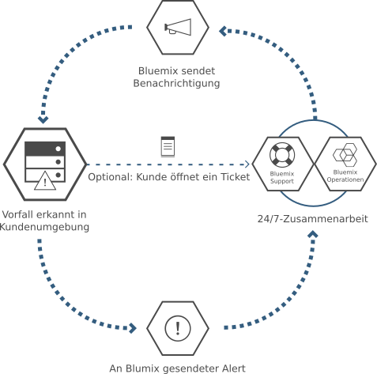

---

 

copyright:

  years: 2015, 2016

 

---

{:new_window: target="_blank"}
{:shortdesc: .shortdesc}

#{{site.data.keyword.Bluemix_notm}} Local
{: #local}
*Letzte Aktualisierung: 16. Mai 2016*

{{site.data.keyword.Bluemix}} Local bringt das Leistungsstärke und Beweglichkeit (der Geschäftsabläufe) der cloudbasierten {{site.data.keyword.Bluemix_notm}}-Plattform in Ihr Rechenzentrum. Mit {{site.data.keyword.Bluemix_notm}} Local können Sie die hochsensiblen Verarbeitungsprozesse hinter der Firewall des Unternehmens schützen und gleichzeitig eine sichere Verbindung und Synchronisation mit {{site.data.keyword.Bluemix_notm}} Public gewährleisten.
{:shortdesc}

IBM® verwendet Cloudoperationen als Service zum Überwachen und Verwalten Ihrer Umgebung, damit Sie sich auf das Erstellen von Apps und Services konzentrieren können, die in dieser Umgebung ausgeführt werden. IBM führt zudem Plattformaktualisierungen aus, während Sie sich um Ihre Geschäftsabläufe kümmern.

{{site.data.keyword.Bluemix_notm}} Local-Umgebungen besitzen in Hinblick auf die Betriebssicherheit dieselben Sicherheitsstandards wie die öffentliche {{site.data.keyword.Bluemix_notm}}-Plattform. Sie stellen die Hardware und Infrastruktur bereit und erhalten so die Kontrolle über die Infrastruktur und physische Sicherheit. Der Zugriff von Entwicklern auf die lokale {{site.data.keyword.Bluemix_notm}}-Plattform wird durch Ihre LDAP-Richtlinien gesteuert, die bei der Einrichtung Ihrer Umgebung durch das {{site.data.keyword.Bluemix_notm}}-Team konfiguriert werden können. Sie können innerhalb der lokalen Umgebung über die Verwaltungsseite Benutzerrollen und Berechtigungen verwalten.

{{site.data.keyword.Bluemix_notm}} Local wird mit vollständig integrierten {{site.data.keyword.Bluemix_notm}}-Laufzeiten und 64 GB Rechenspeicher geliefert.

Darüber hinaus ist eine Reihe von Services als {{site.data.keyword.Bluemix_notm}} Local-Services verfügbar. In der folgenden Tabelle sind die Services aufgeführt, die inbegriffen sind oder optional käuflich erworben werden können.

*Tabelle 1. Lokale Services und Laufzeiten*

| **Typ** | **Name** | **Beschreibung** |
|----------|----------|-----------------|
|Inbegriffen | {{site.data.keyword.Bluemix_notm}}-Laufzeiten | Machen Sie mit Laufzeiten Ihre App schnell betriebsbereit, ohne Maschinen und Betriebssysteme einrichten und verwalten zu müssen. Alle {{site.data.keyword.Bluemix_notm}}-Laufzeiten stehen Ihnen zur Verwendung in Ihrer {{site.data.keyword.Bluemix_notm}} Local-Instanz zur Verfügung.|
|Optional | {{site.data.keyword.APIM}} | Verwenden Sie den {{site.data.keyword.APIMfull}}-Service zum Erstellen, Verwalten und Mitteilen von APIs. Sie können mit einer Proxy-URL oder durch Zusammenstellen von Daten aus HTTP-Datenquellen neue APIs mit Ressourcen importieren. Die Verwendung des {{site.data.keyword.APIM}}-Service bietet den Vorteil, dass Sie steuern können, wie Ihre APIs genutzt werden. |
|Inbegriffen | {{site.data.keyword.autoscaling}}| Dynamisches Erhöhen oder Verringern der Rechenleistung Ihrer Anwendung basierend auf Richtlinien. Mit diesem Service können Sie Ihre {{site.data.keyword.Bluemix}} Local-Umgebung unbegrenzt nutzen.|
|Optional | {{site.data.keyword.datacshort}} | Dieser Service bietet ein speicherinternes Datengitter, durch das Szenarios mit verteiltem Caching für Ihre Apps unterstützt werden. Umfasst 50 GB speicherinternen Cache. |
|Optional | {{site.data.keyword.sescashort}} | Um die Redundanz zu erhöhen, stellt {{site.data.keyword.sescashort}} eine Replik für eine Sitzung bereit, die im Cache gespeichert ist. Daher kann Ihre Clientanwendung auch im Falle eines Spannungsabfalls oder einer Betriebsunterbrechung weiterhin auf die im Cache gespeicherte Sitzung zugreifen. Der Service unterstützt das Sitzungs-Caching für Webanwendungen und mobile Anwendungen. |
|Optional | {{site.data.keyword.iot_full}} | Dieser Service ermöglicht Ihren Apps die Kommunikation mit und die Nutzung der von Ihren verbundenen Geräten, Sensoren und Gateways erfassten Daten. Das lokale Basisangebot beinhaltet eine Startumgebung, die die Ausführung einer privaten Version von IBM {{site.data.keyword.iot_full}} in der lokalen Umgebung mit einer Kapazität für 100.000 gleichzeitig verbundene Geräte oder Anwendungen und 1,6 TB für den Datenaustausch ermöglicht. |

Durch optionale Komponenten, die zusätzlich zum Kauf angeboten werden, können Sie die Kapazität Ihrer Ressourcen und Services skalieren und erweitern. Wenden Sie sich zum Kauf dieser Optionen an das Vertriebsteam unter [Contact us](https://console.ng.bluemix.net/?direct=classic/#/contactUs/cloudOEPaneId=contactUs), um Kontakt mit einem Vertriebsbeauftragten aufzunehmen. Um Ihren Serviceplan zu erweitern, können Sie den Plan über die Kachel für den Service in Ihrem Katalog auswählen.

*Tabelle 2. Kostenpflichtige optionale Komponenten*

| **Name** | **Beschreibung** |
|----------|-----------------|
|Einmalkonfiguration für {{site.data.keyword.Bluemix_notm}} Local | Eine einmalige Einrichtungsgebühr zum Bereitstellen und Konfigurieren der lokalen Umgebung. |
|{{site.data.keyword.Bluemix_notm}} Local - Kapazitätserweiterung der Rechenressourcen um 16 GB | Diese Erweiterung der IBM {{site.data.keyword.Bluemix_notm}} Local-Rechenressourcen stellt zusätzlich 16 GB Hauptspeicherkapazität bereit. |
|{{site.data.keyword.Bluemix_notm}} Data & Session Cache - Kapazitätserweiterung um 50 GB | Diese Umgebung ermöglicht die Bereitstellung und Ausführung von Data Cache- und Session Cache-Instanzen bis zu einer kumulativen Kapazität von 50 GB. |
|{{site.data.keyword.Bluemix_notm}} Local {{site.data.keyword.APIM}} - Kapazitätserweiterung auf 500 API-Aufrufe | Diese Umgebung ermöglicht die Ausführung einer privaten Version von {{site.data.keyword.APIM}} for {{site.data.keyword.Bluemix_notm}} mit einer Kapazität von 500 API-Aufrufen pro Sekunde. |
|{{site.data.keyword.Bluemix_notm}} {{site.data.keyword.iot_short}} Local - inkrementelle Erhöhung | Diese zusätzliche Umgebung zum {{site.data.keyword.iot_full}} Local-Basisserviceangebot ermöglicht die Ausführung einer privaten Version von {{site.data.keyword.iot_full}} in der lokalen Umgebung mit einer Kapazität für 100.000 gleichzeitig verbundene Geräte oder Anwendungen und 0,5 TB für den Datenaustausch. |

**Hinweis**: Für {{site.data.keyword.Bluemix_notm}} Local-Komponenten wird möglicherweise eine bestimmte konfigurierte Kapazität (z. B. Gigabyte oder Transaktionen pro Sekunde) angegeben. Da die tatsächliche Kapazität im realen Einsatz für eine bestimmte Konfiguration des Cloud-Service von vielen verschiedenen Faktoren abhängt, kann die tatsächliche Kapazität in der Praxis nach oben oder unten von der konfigurierten Kapazität abweichen.

### Syndizierter Katalog

{{site.data.keyword.Bluemix_notm}} Local umfasst einen privaten syndizierten Katalog, in dem die lokalen Services angezeigt werden, die ausschließlich Ihnen zur Verfügung stehen. Er umfasst außerdem zusätzliche Services, die zu Ihrer Verwendung aus {{site.data.keyword.Bluemix_notm}} Public verfügbar gemacht werden.

Der syndizierte Katalog bietet die Funktion zum Erstellen von Hybridanwendungen, die aus öffentlichen und privaten Services bestehen. Sie können auf der Basis Ihrer Kriterien für Datenschutz und Sicherheit entscheiden, welche öffentlichen Services die Anforderungen Ihres Unternehmens erfüllen. Wenn es sich um eine private Serviceinstanz für Ihre lokale Umgebung handelt, wird bei den Servicekacheln in Ihrem Katalog das Tag "Lokal" angezeigt. Entsprechend sehen Sie "Angepasst" bei den Servicekacheln, wenn es sich um einen benutzerdefinierten Service handelt.  

*Tabelle 3. Für die Syndikation verfügbare Services aus {{site.data.keyword.Bluemix_notm}} Public nach Region*

|Service	|Verfügbar in Region 'US South'	|Verfügbar in Region 'Europe United Kingdom' |Verfügbar in Region 'Australa Sydney'|
|:----------|:------------------------------|:------------------|:------------------|
|{{site.data.keyword.alchemyapishort}} 		|Ja	   	|Ja  		|Ja|
|{{site.data.keyword.alertnotificationshort}}		|Ja		|Ja			|Ja		|
|{{site.data.keyword.appseccloudshort}}		|Ja		|Ja		|Ja |
|{{site.data.keyword.hadoopst}}			|Ja		|Nein		|Nein |
|{{site.data.keyword.APIM}}			|Ja		|Ja		|Ja |
|{{site.data.keyword.rules_short}}		|Ja		|Ja		|Ja |
|{{site.data.keyword.cloudant}}			|Ja		|Ja		|Ja |
|{{site.data.keyword.conceptexpansionshort}}	|Ja		|Ja		|Ja|
|{{site.data.keyword.conceptinsightsshort}}	|Ja		|Ja		|Ja |
|{{site.data.keyword.dashdbshort}}		|Ja		|Ja		|Ja |
|{{site.data.keyword.dataworks_short}}		|Ja		|Ja		|Nein|
|{{site.data.keyword.DB2OnCloud_short}}		|Ja		|Ja		|Ja |
|{{site.data.keyword.dialogshort}}		|Ja		|Ja		|Ja|
|{{site.data.keyword.documentconversionshort}}	|Ja		|Ja		|Ja|
|{{site.data.keyword.game}}			|Nein		|Nein		|Ja |
|{{site.data.keyword.geospatialshort_Geospatial}}	|Ja	|Ja		|Ja |
|{{site.data.keyword.GlobalizationPipeline_short}}	|Ja		| Ja		| Ja |
|{{site.data.keyword.identitymixershort}}		|Ja		|Ja		|Ja|
|{{site.data.keyword.twittershort}}		|Ja		|Ja		|Ja|
|{{site.data.keyword.weather_short}}		|Ja		|Ja		|Ja|
|{{site.data.keyword.languagetranslationshort}}	|Ja		|Ja		|Ja |
|{{site.data.keyword.eventhubshort}}		|Ja		|Nein		|Nein|
|{{site.data.keyword.messagehub}}		|Ja		|Ja		|Nein|
|{{site.data.keyword.macm_short}}		|Ja		|Ja		|Ja|
|{{site.data.keyword.manda}}			|Ja		|Ja		|Ja |
|{{site.data.keyword.amashort}}			|Ja		|Ja		|Ja |
|{{site.data.keyword.mqa}}			|Ja		|Ja		|Ja |
|{{site.data.keyword.mql}}			|Ja		|Ja		|Ja |
|{{site.data.keyword.nlclassifierlshort}} 	|Ja 		|Ja 		|Ja|
|{{site.data.keyword.personalityinsightsshort}}	|Ja		|Ja		|Ja|
|{{site.data.keyword.pm_short}}			|Ja		|Ja		|Nein |
|{{site.data.keyword.presenceinsightsshort}}	|Ja		|Ja		|Ja|
|{{site.data.keyword.mobilepush}}		|Ja		|Ja		|Ja |
|{{site.data.keyword.questionandanswershort}}	|Ja		|Ja		|Ja|
|{{site.data.keyword.relationshipextractionshort}}	|Ja	|Ja		|Ja|
|{{site.data.keyword.retrieveandrankshort}}	|Ja 		|Ja 		|Ja|
|{{site.data.keyword.runbook_short}}		|Ja		|Ja		|Ja|
|{{site.data.keyword.SecureGateway}}		|Ja		|Ja		|Ja |
|{{site.data.keyword.ssofull}}			|Ja		|Nein		|Nein|
|{{site.data.keyword.speechtotextshort}}	|Ja 		|Ja	 	|Ja|
|{{site.data.keyword.streaminganalyticsshort}}	|Ja		|Ja		|Ja |
|{{site.data.keyword.texttospeechshort}} 	|Ja 		|Ja	 	|Ja|
|{{site.data.keyword.toneanalyzershort}} 	|Ja 		|Ja 		|Ja|
|{{site.data.keyword.tradeoffanalyticsshort}}	|Ja		|Ja		|Ja|
|{{site.data.keyword.visualinsightsshort}}	|Ja		|Ja		|Ja|
|{{site.data.keyword.visualrecognitionshort}}	|Ja 		|Ja	 	|Ja|
|{{site.data.keyword.iot_short}}		|Ja		|Ja		|Nein|
|{{site.data.keyword.workflow}}			|Ja		|Ja		|Ja |
|{{site.data.keyword.workloadscheduler}}	|Ja		|Ja		|Ja |

## {{site.data.keyword.Bluemix_notm}} Local-Architektur
{: #localarch}

{{site.data.keyword.Bluemix_notm}} Local befindet sich auf einer virtuellen Maschine hinter der Firewall Ihres Unternehmens. Auf diese Weise steht Ihnen eine besonders leistungsfähige und sichere Cloudinfrastruktur zur Verfügung. IBM installiert und verwaltet {{site.data.keyword.Bluemix_notm}} Local mit der Relay-Technologie von IBM in Ihrem Rechenzentrum und führt eine Fernüberwachung durch. Im folgenden Diagramm ist dargestellt, wie {{site.data.keyword.Bluemix_notm}} in Ihrer lokalen Umgebung eingerichtet wird und wie IBM Ihre lokale Instanz wartet:

*Abbildung 1. {{site.data.keyword.Bluemix_notm}} Local-Architektur*

Die virtuelle Konzeptionsmaschine (Inception VM) wird hinter Ihrer Kundenfirewall in einem Netz ausgeführt, das eine abgehende Konnektivität zum IBM Operations Center über Relay hat. Die Komponenten der {{site.data.keyword.Bluemix_notm}}-Plattform und die zentralen Features, die die Plattformkomponenten unterstützen, werden in einem privaten, isolierten virtuellen LAN (VLAN) ausgeführt. {{site.data.keyword.Bluemix_notm}} Local verwendet ein VLAN für das private Teilnetz. Die Verwendung eines privaten Teilnetzes ist sicherer als ein öffentliches VLAN und kann helfen, Routingprobleme zu vermeiden. Zu den zentralen Features, die die Plattform unterstützen, gehören die folgenden:

<dl>
<dt>**Überwachung und Protokollierung**</dt>
<dd>Die Überwachungs- und Protokollierungsfunktionen werden durch Relay in Ihren Rechenzentren bereitgestellt und die Daten verbleiben in Ihrem Rechenzentrum. Alerts werden entsprechend definierten Alertkriterien an IBM Operations zurückgesendet. In den Alerts, die an IBM zurückgesendet werden, sind keine sensiblen Informationen enthalten.</dd>
<dt>**Netz**</dt>
<dd>Relay ist das mit {{site.data.keyword.Bluemix_notm}} Local bereitgestellte Zustellnetz. Über Relay kann IBM automatisch und konsistent die neuesten Aktualisierungen für alle lokalen Implementierungen bereitstellen, sodass Sie stets ein aktuelles und sicheres System haben. Bei dem Datenverkehr über diesen Tunnel handelt es sich um eine automatisierte Aktivität zum Bereitstellen und Verwalten der Plattform, Rechenressourcen und Services für Ihre Instanz. Der Datenverkehr schließt die Überwachungsfunktionen mit ein, mit denen IBM Operations Fehlerermittlungen für Ihre lokale Instanz durchführen kann. Weitere Informationen zu Relay finden Sie unter [Relay](index.html#localrelay).</dd>
<dt>**Rechenknoten (Compute)**</dt>
<dd>{{site.data.keyword.Bluemix_notm}} Local verwendet app-orientierte Laufzeitumgebungen auf der Basis von Cloud Foundry.</dd>
<dt>**Sicherheitsdaten**</dt>
<dd>
IBM arbeitet mit QRadar Security Intelligence Platform, um eine vereinheitlichte Architektur zur Integration verschiedener Schlüsselkomponenten bereitzustellen. Diese Komponenten umfassen Sicherheitsinformationen und Ereignismanagement, Protokollmanagement, Anomalieerkennung, Vorfallforensik sowie Konfigurations- und Schwachstellenmanagement. Bluemix verwendet außerdem IBM QRadar SIEM (Security Information and Event Management, Sicherheitsinformations- und Ereignismanagement), um Aktionen privilegierter Benutzer sowie erfolgreiche und nicht erfolgreiche Anmeldeversuche von Anwendungsentwicklern zu überwachen. QRadar stellt für den Kunden Informationen zu diesen Ereignisdaten über den Abschnitt für Berichte und Protokolle der Verwaltungsseite bereit. Informationen zu Sicherheitsberichten finden Sie unter [Berichte anzeigen](../admin/index.html#oc_report).

IBM BigFix stellt sicher, dass in angemessenen Abständen Fixes für Betriebssysteme angewendet werden. Der Patchprozess ist automatisiert und der Zeitplan wird zwischen Ihnen und IBM abgestimmt. Informationen zu Wartungen und Upgrades finden Sie unter [Lokale Instanz warten](index.html#maintainlocal).

</dd>
</dl>

Ihre Apps werden in virtuellen Containern bereitgestellt, die auf virtuellen Cloud Foundry-Maschinen ausgeführt werden. Alle Cloud Foundry-Komponenten, wie zum Beispiel Cloud-Controller, Statusmanager, Router und Droplet Execution Agents (DEAs), werden bei der Einrichtung von {{site.data.keyword.Bluemix_notm}} bereitgestellt. Die verschiedenen {{site.data.keyword.Bluemix_notm}}-Managementkomponenten sind auch in der {{site.data.keyword.Bluemix_notm}}-Bereitstellung enthalten.

DataPower-Appliances stellen den Zugriff auf {{site.data.keyword.Bluemix_notm}}-Anwendungsdomänen bereit. Diese Appliances stellen eine Verbindung zu dem Netz her, das über Ihr Intranet zugänglich ist. Ihre Benutzer, die Apps und Services bereitstellen, erhalten Zugriff über das Netz, das über Ihr Intranet zugänglich ist. Sie müssen sieben IP-Adressen bereitstellen, die einen abgehenden Internetzugriff haben. DataPower-Appliances leiten über diese Kunden-IP-Adressen zu der isolierten {{site.data.keyword.Bluemix_notm}}-Bereitstellung weiter. Informationen zu den Netzspezifikationen und den Infrastrukturanforderungen finden Sie in [{{site.data.keyword.Bluemix_notm}} Local-Infrastrukturanforderungen](../local/index.html#localinfra).

### Relay
{: #localrelay}

Relay ist eine Zustellfunktion, die in {{site.data.keyword.Bluemix_notm}} Local enthalten ist. Über Relay kann IBM automatisch und konsistent die neuesten Aktualisierungen für alle lokalen Implementierungen bereitstellen, sodass Sie stets ein aktuelles und sicheres System haben. Relay erreicht eine sichere Konnektivität mittels eines offenen VPN-Tunnels mit ausgehender SSL, der von der lokalen, virtuellen Konzeptionsmaschine stammt. Dabei werden die entsprechenden Zertifikate der einzelnen {{site.data.keyword.Bluemix_notm}} Local-Instanzen verwendet. Alle ersten {{site.data.keyword.Bluemix_notm}}-Releases sind in der virtuellen Konzeptionsmaschine verfügbar, die auch als Automatisierungsagentenmaschine für Bereitstellungen und Aktualisierungen fungiert. Die SSL-Verbindung geht von der virtuellen Konzeptionsmaschine aus.  Sobald eine sichere Verbindung zurück zum Automation Server von {{site.data.keyword.Bluemix_notm}} eingerichtet wurde, prüft IBM die Aktualität und Konsistenz von {{site.data.keyword.Bluemix_notm}}-Releases und beginnt mit der Bereitstellung von Aktualisierungen.

Bei dem Datenverkehr über diesen Tunnel handelt es sich um eine automatisierte Aktivität zum Bereitstellen und Verwalten der Plattform, Rechenressourcen und Services für Ihre Instanz. Der Datenverkehr schließt die Überwachungsfunktionen mit ein, mit denen IBM Operations Fehlerermittlungen für Ihre lokale Instanz durchführen kann. Der ausgehende Web-Port 443 wird für diese Verbindung verwendet. IBM nutzt die Relay-Funktionalität, um Plattformaktualisierungen durch einen konsistenten Test- und Validierungsprozess bereitzustellen. Dieser Prozess stellt sicher, dass alle Bereitstellungen, die per Push-Operation an Ihre lokalen Umgebungen übertragen werden, stabil und sicher sind.

Nur das IBM Team, das mit Ihnen in Ihrer lokalen Umgebung zusammenarbeitet, kann sicher auf Ihre {{site.data.keyword.Bluemix_notm}}-Instanz zugreifen. Der Zugriff auf Ihre lokale Umgebung wird bei mehreren Schritten im Verbindungsprozess durch eine Zwei-Faktor-Authentifizierung geschützt. IBM stellt eine Liste genehmigter Benutzer und IDs bereit, die auf Ihre Umgebung zugreifen können. Anschließend können Sie jeden Zugriff auf Ihre Umgebung prüfen. Durch Generieren eines Sicherheitsberichts haben Sie die Möglichkeit, zu ermitteln, wer auf Ihre Umgebung zugegriffen hat sowie wann und wozu auf die Umgebung zugegriffen wurde. Informationen zum Generieren der Sicherheitsberichte finden Sie unter [Sicherheitsberichte](../security/index.html#reports).

Die Umgebung ist für Sie als Administrator für die Verwaltung von Vorfällen, Problemen, Änderungen sowie der Kapazität und der Sicherheit vollständig sichtbar. Sie können auf die Informationen zu Ihrer Umgebung über die Seite 'Verwaltung' zugreifen. Durch die Relay-Technologie enthält die Verwaltungsseite immer die aktuellsten Daten. Weitere Informationen zum Benutzerzugriff, zu Sicherheitsprotokollen, zur Kontrolle des syndizierten Katalogs und zur Kommunikation bezüglich Aktualisierungen und Problemlösungen finden Sie unter [{{site.data.keyword.Bluemix_notm}} Local und {{site.data.keyword.Bluemix_notm}} Dedicated verwalten](../admin/index.html#mng).

##{{site.data.keyword.Bluemix_notm}} Local-Instanz einrichten
{: #setuplocal}

{{site.data.keyword.Bluemix_notm}} Local wurde konzipiert, um eine private Version des Produktangebots {{site.data.keyword.Bluemix_notm}} Public bereitzustellen, die auf Ihrer eigenen, von Ihnen verwalteten Hardware gehostet ist. Sie können {{site.data.keyword.Bluemix_notm}}-Services und -Laufzeiten verwenden, um Ihre Datenverarbeitungsanforderungen in einer sicheren, vom Kunden gehosteten und verwalteten Cloudumgebung zu unterstützen.

IBM bietet Ihnen über eine kennwortgesicherte Anmeldung Zugriff auf {{site.data.keyword.Bluemix_notm}} Local. Sie können auf die Services, Laufzeiten und zugehörigen Ressourcen zugreifen und {{site.data.keyword.Bluemix_notm}}-Apps bereitstellen und entfernen. Überprüfen Sie die folgenden Schritte zur Arbeit mit Ihrem IBM Ansprechpartner zum Einrichten Ihrer lokalen Instanz von {{site.data.keyword.Bluemix_notm}}.

Gehen Sie wie folgt vor, um Ihre private Version von {{site.data.keyword.Bluemix_notm}} einzurichten:

<ol>
<li>Prüfen Sie die <a href="index.html#localinfra">Infrastrukturanforderungen für {{site.data.keyword.Bluemix_notm}} Local</a> für die Einrichtung der lokalen Instanz.</li>
<li>Wenden Sie sich an Ihren zugewiesenen IBM Kundenbeauftragten oder wenden Sie sich an <a href="https://console.ng.bluemix.net/?direct=classic/#/contactUs/cloudOEPaneId=contactUs" target="_blank">{{site.data.keyword.Bluemix_notm}}</a>, um mit der Arbeit zu beginnen.</li>
<li>Erstellen Sie Ihre Vereinbarung zu {{site.data.keyword.Bluemix_notm}} Local einschließlich Meilensteindaten für die Bereitstellung mit IBM.
	<ol type="a">
	<li>Erarbeiten Sie mit IBM Ihre Gebühren für Ihre {{site.data.keyword.Bluemix_notm}} Local-Instanz. Die monatlich fällige Gebühr basiert auf den lokalen Services, die Sie nutzen möchten. Hinzu kommt ein Abonnement für alle {{site.data.keyword.Bluemix_notm}} Public-Services. Sie erhalten dann eine Rechnung für alle Nutzungen, die über die Abonnementvereinbarung hinausgehen.</li>
	<li>Ermitteln Sie die Fristen für die einzelnen Einrichtungsphasen Ihrer {{site.data.keyword.Bluemix_notm}} Local-Instanz.</li>
	</ol>
	</li>
<li>Nach dem Erstellen der Plattform und des Kontos ermitteln Sie die Personen in Ihrer Organisation für die Rollen, die benötigt werden, um Ihre lokale Instanz betriebsbereit zu machen. Weitere Informationen zu den Rollen, die Sie zuweisen, finden Sie unter <a href="index.html#rolesresponsibilities" target="_blank">{{site.data.keyword.Bluemix_notm}}</a> Local-Rollen und -Zuständigkeiten.
</li>
<li>Sie stellen die Hardware bereit und IBM hilft Ihnen beim Definieren und Festlegen der Netzkonnektivität zwischen Ihrem Unternehmensnetz und Ihrer {{site.data.keyword.Bluemix_notm}} Local-Instanz. Weitere Informationen zu Infrastrukturanforderungen finden Sie unter <a href="index.html#localinfra">Infrastrukturanforderungen für {{site.data.keyword.Bluemix_notm}} Local</a>.
	<ol type="a">
	<li>IBM konfiguriert den Netzzugriff und LDAP Ihren Angaben entsprechend. Die von Ihnen bestimmten Ansprechpartner erhalten Verwaltungszugriff. Sie müssen auch einen Ansprechpartner für die Unterstützung und die Abrechnung bestimmen.</li>
	<li>IBM richtet in Ihrer lokalen Umgebung einen syndizierten Katalog ein, um Ihnen Ihre lokalen Services und viele der öffentlichen {{site.data.keyword.Bluemix_notm}}-Services zu zeigen.</li>
	<li>Sie überprüfen die Netz- und Firewallkonfiguration sowie den LDAP-Endpunkt und -Zugriff.</li>
	</ol>
</li>
</ol>

Für die Erstbereitstellung und Erstkonfiguration Ihrer Umgebung können Sie einen Prozess wie in der folgenden Liste dargestellt erwarten. Details dazu, wer für die einzelnen Tasks verantwortlich ist, finden Sie unter [Rollen und Zuständigkeiten](../local/index.html#rolesresponsibilities).

<ol>
<li>Sie stellen die VMware-Konfiguration bereit, die die Spezifikationen für Rechenressourcen, Netzbetrieb und Speicher erfüllt. Weitere Informationen zu den Infrastrukturanforderungen finden Sie unter <a href="../local/index.html#localinfra">Infrastrukturanforderungen für {{site.data.keyword.Bluemix_notm}} Local</a>.</li>
<li>Sie stellen die Berechtigungsnachweise für den vCenter-Cluster bereit, die von der virtuellen Konzeptionsmaschine verwendet werden sollen. Sie müssen die folgenden Informationen angeben:
<ul>
<li>Name des VMware-Clusters</li>
<li>Berechtigungsnachweise für den vCenter-Cluster aus Benutzer-ID und Kennwort</li>
<li>Datenspeichername bzw. -namen (LUN-Name für den Speicher)</li>
<li>VLAN ID-/VMware-Portgruppe</li>
<li>Name für den Ressourcenpool</li>
</ul>
</li>
<li>Sie und IBM arbeiten zusammen, um die Berechtigungsnachweise zu validieren, die Sie in der vorherigen Task bereitgestellt haben.</li>
<li>Sie stellen sieben IP-Adressen in Ihrem Netz bereit. Wenn Sie einen gesicherten Web-Proxy haben, um ausgehenden Zugriff auf das Internet für interne {{site.data.keyword.Bluemix_notm}}-Komponenten zuzulassen, müssen Sie die Berechtigungsnachweise für die entsprechende Verbindung bereitstellen.

**Hinweis:** Wenn Ihr Web-Proxy nicht geschützt wird, brauchen Sie die Berechtigungsnachweise nicht bereitzustellen. Beachten Sie außerdem, dass nicht alle {{site.data.keyword.Bluemix_notm}} Local-Kunden einen Web-Proxy verwenden.
</li>
<li>IBM stellt eine Whitelist von URLs bereit, die über Ihren Web-Proxy zugelassen werden müssen, bevor die Bereitstellung beginnt. 

**Hinweis**: Die URL-Whitelist enthält Websites wie twitter.com, facebook.com und youtube.com. Wenn diese URLs nicht zugelassen werden, stehen bestimmte Services und Bereiche von {{site.data.keyword.Bluemix_notm}} möglicherweise nicht für die Verwendung zur Verfügung.

</li>
<li>Sie geben die Domänennamen für die Bereitstellung und die gewünschten IDs an. Sie erhalten zwei teilweise definierte Domänen, wenn Sie Ihre lokale Instanz einrichten, und wählen das Präfix für die beiden Domänen aus. Beispiel: Sie wählen das Präfix für <code>*mycompany*.bluemix.net</code> und <code>*mycompany*.mybluemix.net</code> aus. Anschließend können Sie auch einen vollständigen Domänennamen auswählen, um eine angepasste Domäne zu erstellen.

Sie können so viele angepasste Domänen wählen, wie Sie möchten. Sie sind jedoch für die Zertifikate für die angepassten Domänen verantwortlich. Informationen zur Erstellung einer angepassten Domäne finden Sie unter <a href="../manageapps/updapps.html#domain">Angepasste Domäne erstellen und verwenden</a>.
</li>
<li>Sie wählen die Technologie (IPSec- oder OpenVPN-Tunnel) aus, die zur Konfiguration von Relay für die Rückverbindung zum IBM Operations Center verwendet wird.</li>
<li>IBM installiert und startet die virtuelle Konzeptionsmaschine im {{site.data.keyword.Bluemix_notm}}-Cluster. Wenn Sie ein eigenes VMware bereitstellen, wird Ihr Kundenvertreter von einem IBM Ansprechpartner bei der Ausführung dieser Task unterstützt.</li>
<li>IBM konfiguriert Relay für die Kommunikation mit dem IBM Operations Center.</li>
<li>Das Repository für die virtuelle Konzeptionsmaschine extrahiert die aktualisierten Buildartefakte.</li>
<li>Sie stellen IBM die Berechtigungsnachweise für die Verbindung zur unternehmenseigenen LDAP-Verzeichnisinstanz zur Verfügung.</li>
<li>IBM arbeitet mit einer Automatisierung, um die zentrale {{site.data.keyword.Bluemix_notm}}-Plattform bereitzustellen.</li>
<li>IBM stellt die zentrale Plattform bereit, die elastische Laufzeiten, Konsolen, Verwaltungsfunktionen und Überwachung umfasst.</li>
<li>IBM konfiguriert Ihren Verwaltungszugriff auf die Umgebung.</li>
<li>IBM verlinkt Ihren syndizierten Katalog aus Ihrer lokalen Bereitstellung mit einer öffentlichen {{site.data.keyword.Bluemix_notm}}-Instanz für die Verwendung öffentlicher Services. Eine Gruppe öffentlicher Services ist standardmäßig in Ihrer lokalen Instanz verfügbar. Sie können die Verwaltungsseite für die Katalogverwaltung verwenden, um die Services für Ihre lokale Instanz zu aktivieren oder zu inaktivieren.</li>
<li>Sie können mit der Verwendung Ihrer lokalen Instanz beginnen, die vom IBM Operationsteam überwacht wird, um auf Alerts zu reagieren.</li>
</ol>

Nach der Einrichtung Ihrer {{site.data.keyword.Bluemix_notm}}-Instanz können Sie die Ihre {{site.data.keyword.Bluemix_notm}}-Instanz über die Verwaltungsseite ('Administration') überwachen und verwalten. Weitere Informationen finden Sie unter [{{site.data.keyword.Bluemix_notm}}Local und Dedicated verwalten](../admin/index.html#mng). Weitere Informationen zu Upgrades und Wartung finden Sie unter [Lokale Instanz warten](index.html#maintainlocal).

##Rollen und Zuständigkeiten
{: #rolesresponsibilities}

Wenn Sie ein {{site.data.keyword.Bluemix_notm}} Local-Konto einrichten, ermitteln Sie die Personen in Ihrer Organisation für die Rollen, die benötigt werden, um Ihre lokale Instanz betriebsbereit zu machen.

###Rollen

In der folgenden Liste sind die Kundenrollen und -zuständigkeiten enthalten, die Sie zuweisen:

<dl>
<dt>**Zentraler Ansprechpartner für das Beschaffungswesen**</dt>
<dd>Arbeitet mit dem IBM Ansprechpartner zusammen an der Einrichtung
Ihrer {{site.data.keyword.Bluemix_notm}} Local-Umgebung. Dazu gehört
das Ermitteln geeigneter Personen in Ihrer Organisation für die Arbeit an den einzelnen Aspekten des Projekts. Die Person, die dieser Rolle zugewiesen ist, überwacht die Musterauswahl, die geschäftlichen Vereinbarungen und die Regelung für den Zugang zu Kundenressourcen. Dieser zentrale Ansprechpartner ist der allgemeine Ansprechpartner für die Einrichtung der lokalen Instanz.</dd>
<dt>**Compliance-Manager**</dt>
<dd>Arbeitet mit dem IBM Ansprechpartner zusammen, um eine Topologie
und eine Bereitstellungsoption auszuwählen, die Ihren Sicherheitsanforderungen entsprechen. Die Person, die dieser Rolle zugewiesen ist, legt gemeinsam mit dem IBM Compliance-Berater fest, mit welchen Implementierungsmustern die Compliance-Ziele erreicht werden.</dd>
<dt>**Netzspezialist**</dt>
<dd>Arbeitet mit dem IBM Ansprechpartner zusammen an den Netzplänen für die {{site.data.keyword.Bluemix_notm}}-Bereitstellung. Die Person, die dieser Rolle zugewiesen ist, überprüft die von IBM vorausgesetzten Netzspezifikationen und arbeitet gemeinsam mit IBM an einem Implementierungsplan. Am Ende der Installations- und Verifizierungsphase prüft die Person, die dieser Rolle zugewiesen ist, dass die Netzkonfiguration im Einklang mit den Unternehmensstandards ist.</dd>
<dt>**Zentraler DevOps-Ansprechpartner**</dt>
<dd>Arbeitet mit dem IBM Ansprechpartner zusammen, um die für die {{site.data.keyword.Bluemix_notm}}-Plattform, -Services und -Laufzeiten benötigten Wartungsaktualisierungen zu planen und anzuwenden. Die Person, die dieser Rolle zugewiesen ist, arbeitet auch mit dem
IBM Ansprechpartner an der Konfiguration Ihrer {{site.data.keyword.Bluemix_notm}} Local-Instanz.</dd>
<dt>**IaaS-Spezialist**</dt>
<dd>Arbeitet mit den IBM Ansprechpartnern an dem Bereitstellungsplan für VMware. Typischerweise handelt es sich hierbei um einen VMware-Administrator im Rechenzentrum. Die Person, die dieser Rolle zugewiesen ist, überprüft die <a href="../local/index.html#localinfra">Infrastrukturanforderungen für {{site.data.keyword.Bluemix_notm}} Local</a> und arbeitet gemeinsam mit IBM an einem Implementierungsplan. Am Ende der Installationsphase prüft die Person, die dieser Rolle zugewiesen ist, dass die Implementierung im Einklang mit den Unternehmensstandards auf der IaaS-Ebene ist.</dd>
</dl>

Ihre Ansprechpartner beim Kunden arbeiten mit IBM Spezialisten zusammen, um sicherzustellen, dass Sie immer die benötigte Unterstützung erhalten. Sie können ein Upgrade auf die Stufe Premium Support durchführen, um für Ihr Konto mit einem dedizierten Cluster Systems Manager (CSM) zu arbeiten. Weitere Informationen zu den unterschiedlichen Unterstützungskategorien finden Sie unter [Support kontaktieren](../support/index.html#contacting-support). Der CSM führt folgende Typen von Tasks aus: 

<ul>
<li>Technische Koordination zwischen Ihnen und IBM.</li>
<li>Koordination von Aktualisierungen, Upgrades, kompetenter Hilfe von IBM und Erstaktivierung durch einen {{site.data.keyword.Bluemix_notm}}-Supportmitarbeiter.</li>
<li>Bereitstellen von Informationen zu den verfügbaren Typen von Support.</li>
<li>Ggf. Fungieren als erster Eskalationspunkt.</li>
</ul>

Das {{site.data.keyword.Bluemix_notm}}-Support- und -Operationsteam, das gemeinsam mit Ihnen an der {{site.data.keyword.Bluemix_notm}}-Instanz arbeitet, kann auf die lokale Umgebung zugreifen, tut dies aber nur unter den folgenden Umständen.

<ul>
<li>Zum Antworten auf Alerts und zum Durchführen einer Betriebswartung</li>
<li>Zum Reproduzieren eines Problems, das in einem Support-Ticket berichtet wurde</li>
</ul>

###Zuständigkeiten

Von der Einrichtung Ihrer Umgebung bis hin zur kontinuierlichen Wartung müssen von Ihnen und von IBM eine Vielfalt von Tasks abgeschlossen werden. Die folgenden Tabellen beschreiben grob die erforderlichen Tasks und die Eigner zum Abschließen der Task in den Phasen der Konzeption, des Fortschritts und der Fertigstellung.

In der Konzeptionsphase wird die {{site.data.keyword.Bluemix_notm}} Local-Umgebung eingerichtet. Zu diesem Zeitpunkt haben Sie sich bereits mit den [Infrastrukturanforderungen für Local](../local/index.html#localinfra) vertraut gemacht. Die primären Ziele dieser Phase sind unter anderem:

- Überprüfung der finanziellen Vereinbarung und Festlegung der Meilensteindaten für die Bereitstellung.
- Erstellung der {{site.data.keyword.Bluemix_notm}}-Plattform und Bereitstellung von Zugriff auf Laufzeiten und Services.
- Definition und Einrichtung der Netzkonnektivität zwischen Ihrem Unternehmensnetz und {{site.data.keyword.Bluemix_notm}}-Operationen.
- Ermittlung und Zuweisung von Rollen für Ihr Verwaltungsteam.

*Tabelle 4. Tasks in der Konzeptionsphase*

| **Task** | **Taskdetails** | **Zuständiges Team** |
|----------|------------------|-----------------------|
|Festlegen von Konformitätsstandards | Ermitteln Sie Behörden-, Branchen- und proprietäre Unternehmensstandards, die für die Umgebung erforderlich sind. | Kunde |
|Erstellen eines Sicherheits- und Konformitätsintegrationsplans | Erstellen Sie einen Sicherheits- und Integrationsplan, der Kosten, Planung und Ressourcen einbezieht, die für die Einhaltung von Sicherheitsbestimmungen erforderlich sind. | IBM |
|Genehmigen des Konformitätsplans | Genehmigen Sie den Konformitätsplan. | Kunde |
|Dimensionieren der Umgebung |  	Dimensionieren Sie die Umgebung auf der Basis von vordefinierten Optionen, die die Hochverfügbarkeits- und Disaster-Recovery-Ziele sowie den ursprünglichen DEA und die Servicebereitstellung berücksichtigen, die zur Unterstützung der mit der Plattform erstellten Apps erforderlich sind. Gemeinsam mit IBM definieren Sie beispielsweise, welche Datenbanken erforderlich sind, welche Services im syndizierten Katalog des Benutzers angeboten werden und vieles mehr. | IBM und Kunde |
|Auswählen der Architektur | Wählen Sie die Architektur auf der Basis vordefinierter Optionen aus, die Hochverfügbarkeits- und Disaster-Recovery-Anforderungen berücksichtigen. | IBM |
|Definieren von Disaster-Recovery-Zielen | Definieren Sie die Disaster-Recovery-Anforderungen für die Umgebung. | Kunde |
|Erstellen eines Disaster-Recovery-Plans | Konsultieren und definieren Sie den Disaster-Recovery-Plan. IBM erstellt ein Disaster-Recovery-Modell und berät mit Ihnen, wo Sie Feedback bereitstellen und den Plan genehmigen. | IBM und Kunde |
|Erstellen eines Sicherungs- und Wiederherstellungsplans | Erstellen Sie einen Sicherungs- und Wiederherstellungsplan, der die Häufigkeit und die Anforderungen einer zentralen bzw. dezentralen Verteilung der Sicherung definiert. IBM sichert Plattformkomponenten, IBM Services, Servicemetadaten wie Benutzerrollen und vieles mehr. Sie sichern alle anwendungsspezifischen Daten, für die Sie verantwortlich sind. | IBM und Kunde |
|Angeben von Tools für Ereigniserkennung und Problembestimmung | Geben Sie IBM Tools und Tools von Drittanbietern für die Ereigniserkennung und Problembestimmung auf der {{site.data.keyword.Bluemix_notm}}-Plattformebene an. | IBM |
|Definieren eines Eskalationsplans | Definieren Sie den Eskalationsplan zur Klassifizierung und Auflösung von Ereignissen, die von Überwachungskomponenten erkannt werden. | IBM |
|Unterzeichnen von Infrastruktur-, Plattform- und Supportvereinbarungen | Unterzeichnen Sie die Abonnementvereinbarung, einschließlich der finanziellen Vertragsbedingungen für die Umgebung. Unterzeichnen Sie das Supportabonnement. | Kunde |
|Beschaffen einer Umgebung | Beschaffen Sie Rechen-, Netz- und Speicherressourcen. Weitere Informationen zu den Infrastrukturanforderungen für die Umgebung finden Sie unter [ Local-Infrastrukturanforderungen](../local/index.html#localinfra). | Kunde |
|Installieren einer VPN-Lösung | Installieren Sie eine bidirektionale VPN-Lösung. | IBM |
|Installieren von Plattform-, Anwendungs- sowie Überwachungs- und Verwaltungskomponenten | Installieren, konfigurieren und überprüfen Sie Plattformkomponenten wie BOSH Director, Cloud-Controller, Statusmanager, Messaging, Routers, DEAs und Service-Provider sowie die Überwachungskomponenten, die im Eskalations- und Problemerkennungsplan definiert sind. | IBM |
|Installieren und Konfigurieren von Sicherheitskomponenten | Installieren und konfigurieren Sie Sicherheitskomponenten, die in den Überwachungs- und Eskalationsplan eingebunden sind, darunter IBM QRadar, Vault für Berechtigungsnachweise, Abwehrsystem gegen Angriffe von außen, IBM BigFix und IBM Security Privileged Identity Management. | IBM |
|Konfigurieren eines Anmeldungsservers | Konfigurieren Sie den Anmeldungsserver für die Verwendung mit dem unternehmensweiten LDAP. | IBM |
|Installieren und Konfigurieren von angepassten Komponenten |  	Installieren und konfigurieren Sie angepasste Komponenten, die sich außerhalb des Geltungsbereichs des {{site.data.keyword.Bluemix_notm}}-Produkts und der -Services befinden. | Kunde |
|Verbinden einer {{site.data.keyword.Bluemix_notm}}-Pipeline | Verbinden Sie eine {{site.data.keyword.Bluemix_notm}}-Pipeline für kontinuierliche Integration und Bereitstellung mit IBM Repositorys. | IBM |
|Anpassen externer Lösungskomponenten | Passen Sie Lastausgleichsfunktionen für Disaster-Recovery-Szenarios an. | Kunde |
|Verfolgen des Status von Sicherheits-, Konformitäts- und Prüfungsmaßnahmen  | Verfolgen Sie den Status bis zu dem Zeitpunkt, an dem alle Tools und Prozesse zum Erzielen der gewünschten Konformität vorhanden und einsatzbereit sind. | Kunde |
|Überprüfen der physischen Infrastruktur | Überprüfen Sie die Orte, an denen die Lösungskomponenten für Bedrohungen gehostet werden, und überprüfen Sie die Sicherheitsmaßnahmen zum Schutz des Rechenzentrums. | Kunde |
|Untersuchen der Überwachungssoftware | Untersuchen Sie Überwachungs- und Verwaltungskomponenten, wie im Eskalations- und Problembestimmungsplan definiert. | Kunde |
|Untersuchen des Betriebssystems | Stellen Sie sicher, dass das Betriebssystemimage Konfomitätsstandards entspricht. IBM stellt Zugriff auf das Betriebssystemimage bereit. | IBM und Kunde |

Als nächstes folgt die Fortschrittsphase. Die Fortschrittsphase beschreibt die laufende, interaktive Beziehung zwischen Ihnen und IBM. Die primären Ziele dieser Phase sind unter anderem:

- Überprüfen der Kapazität und Koordinieren von erforderlichen Anpassungen.
- Überprüfen von Wartungs- und Plattformverbesserungen.
- Koordinieren der Aktivitäten für Fehlerbehebung und Ursachenanalyse.

*Tabelle 5. Tasks in der Fortschrittsphase*

| **Task** | **Taskdetails** | **Zuständiges Team** |
|----------|------------------|-----------------------|
|Überprüfen von wöchentlichen Kapazitätsberichten | Überprüfen Sie die wöchentlichen Kapazitätsberichte und ergreifen Sie ggf. Korrekturmaßnahmen. | Kunde |
|Erstellen von monatlichen Projektionen | Erfassen Sie Informationen und erstellen Sie eine monatliche Projektion von Kapazität und Nutzung. | IBM und Kunde |
|Überprüfen von Kapazitätsprojektionen | Überprüfen Sie die Kapazitätsprojektionen hinsichtlich externer Ereignisse, die sich sowohl auf die Kapazität als auch auf geplante neue Implementierungen von Apps auswirken können. Arbeiten Sie gemeinsam mit IBM an der Überprüfung der Projektionen und der entsprechenden Planung. | IBM und Kunde |
|Anpassen der Kapazität |  Fügen Sie Kapazität hinzu oder entfernen Sie Kapazität nach Bedarf. | IBM |
|Veröffentlichen zukünftiger Aktualisierungen und Wartungen | Erstellen Sie eine Dokumentation für die erforderliche Wartung von IBM Komponenten. | IBM |
|Durchführen einer Wartung | Planen Sie gemeinsam mit IBM die erforderlicher Wartung innerhalb eines 21-tägigen Zeitraums. Sie können innerhalb des 21-tägigen Zeitraums Daten angeben, an denen keine Wartungsarbeiten ausgeführt werden sollen, und IBM bemüht sich, die Wartung entsprechend zu planen. | IBM und Kunde |
|Adressieren von Bereitstellungsfehlern | Beheben Sie ggf. auftretende Bereitstellungsfehler für vom Kunden erstellte Services, die im Katalog implementiert werden. | IBM |
|Durchführen von Netz- und IP-Scans | Führen Sie tägliche und monatliche Netz- und IP-Scans durch. | IBM und Kunde |
|Bereitstellen von Zugriff auf Prüfprotokolle | Stellen Sie Zugriff auf alle Sicherheits- und Verwaltungsprüfprotokolle bereit.   | IBM und Kunde |
|Durchführen von Tests | Führen Sie regelmäßige Kontrollen für Operationstests und Penetrationstests von Drittanbietern durch. | IBM und Kunde |
|Statusberichterstattung, Prüfungskoordination und Konformitätsbesprechungen  | Führen Sie eine Statusberichterstattung, eine externe Prüfungskoordination und eine Präsentation bei Statusbesprechungen zur Konformitätsprüfung aus. | IBM |
|Prüfung der Beschäftigungssituation und Geschäftsanforderungen | Führen Sie eine vierteljährliche Prüfung der Beschäftigungssituation sowie eine Prüfung kontinuierlicher Geschäftsanforderungen für IBM Ansprechpartner aus, die Zugriff auf die Umgebung des Kunden haben. | IBM |
|Beheben von Sicherheitslücken | Beheben Sie berichtete Sicherheitslücken in der Plattform. | IBM |

Die finale Phase der Fertigstellung stellt das Ende der Beziehung zwischen Ihnen und IBM {{site.data.keyword.Bluemix_notm}} dar. Die primären Tasks in dieser Phase sind unter anderem:

* Beenden der finanziellen Vereinbarung
* Entfernen aller Netzverbindungen
* Recyceln der Infrastruktur

*Tabelle 6. Tasks in der Fertigstellungsphase*

| **Task** | **Taskdetails** | **Zuständiges Team** |
|----------|------------------|-----------------------|
|Beenden der finanziellen Vereinbarung | Erörtern und vereinbaren Sie ein Ende der finanziellen Vereinbarung. | IBM und Kunde |
|Stilllegen der Umgebung | Inaktivieren Sie den Zugriff auf und die Berechtigungsnachweise für die Umgebung. | IBM und Kunde |
|Beenden von Relay | Beenden Sie die Relay-Verbindung. | IBM |
|Recyceln der Infrastruktur | Recyceln Sie Ihre Infrastruktur im Einklang mit Unternehmensrichtlinien. | Kunde |

## Infrastrukturanforderungen für {{site.data.keyword.Bluemix_notm}} Local
{: #localinfra}

Bei {{site.data.keyword.Bluemix_notm}} Local entscheiden Sie über die physische Sicherheit und die Hosting-Infrastruktur für die lokale Instanz. Die Mindestanforderungen für das Einrichten von {{site.data.keyword.Bluemix_notm}} Local sind von IBM wie im Folgenden angegeben festgelegt.

### Hardware

Während es feste Anforderungen für Typ und Größe der verfügbaren Hardware gibt, können Sie sich für eine beliebige Kombination entscheiden, die die definierten Gesamtressourcenanforderungen erfüllt.

<dl>
<dt>**VMware ESXi-Hardware**</dt>
<dd>
Bei ESXi handelt es sich um eine Virtualisierungsebene, die auf physischen Servern ausgeführt
wird und auf abstrakter Ebene Prozessor, Hauptspeicher, Speicher und Ressourcen in mehreren virtuellen
Maschinen bereitstellt. Wählen Sie eine beliebige Kombination, die dem folgenden Gesamtumfang an
Ressourcen entspricht. Berücksichtigen Sie dabei, dass die Mindestanzahl an physischen Kernen pro
ESXi-Server
bei 8 liegt. Die folgenden Spezifikationen beziehen sich nur auf die {{site.data.keyword.Bluemix_notm}}-Kernlaufzeit.
<ul>
<li>48 physische Kerne mit jeweils mindestens 2,0 GHz</li>
<li>756 GB physischer Arbeitsspeicher</li>
<li>Gesamtdatenspeichergröße von 7,5 TB
<ul>
<li>7 TB Datenspeicher für {{site.data.keyword.Bluemix_notm}}</li>
<li>500 GB Datenspeicher für die virtuelle Anfangsmaschine</li>
</ul>
</li>
</ul>

<strong>Hinweis:</strong> Wenn Sie mehrere
Datenspeicher verwenden, muss das Präfix bei diesen Datenspeichern übereinstimmen.

</dd>
<dt>**Hochverfügbarkeit**</dt>
<dd>
Um den Ausfall eines einzelnen Knotens auffangen zu können, müssen Sie über n+1 ESXi-Server verfügen. Werden beispielsweise drei ESXi-Server mit jeweils 16 Kernen verwendet, wird ein vierter ESXi-Server benötigt.

<strong>Hinweis:</strong> Der VMware-Administrator beim Kunden kann über ein striktes Durchsetzen der automatischen Funktionsübernahme für hohe Verfügbarkeit im Cluster entscheiden, die die Verfügbarkeit von Ressourcen garantiert.

</dd>
<dt>**Netz**</dt>
<dd>
Zu den empfohlenen Voraussetzungen gehört eine für den Kunden zugängliche Portgruppe mit sieben IP-Adressen des Kundennetzes, die einen abgehenden Internetzugriff im selben Teilnetz ermöglichen. Zwei Ports werden von der virtuellen Konzeptionsmaschine verwendet, drei Ports sind virtuelle IP-Adresse, die für die Domänen verwendet werden, und die letzten beiden Ports sind öffentliche IP-Adressen für DataPower-Systeme. Anschließend definieren Sie ein zweites privates VLAN, das auf die ESXi-Server beschränkt ist, die für {{site.data.keyword.Bluemix_notm}} Local verwendet werden. Dieses VLAN wird in VMware als Portgruppe angezeigt. {{site.data.keyword.Bluemix_notm}} Local verwendet dieses VLAN für das private Teilnetz, das sicherer ist und Probleme bei der Weiterleitung verringern kann. 

Die folgenden Ports werden verwendet:

<ul>
<li>Port 443 für die Relay-Verbindung

**Hinweis:** Wenn Sie einen IPSec-Tunnel anstelle eines OpenVPN-Tunnels auswählen, öffnen Sie einen Kundenport für diese Verbindung.
</li>
<li>Port 389 oder SSL 636 für die LDAP- oder Active Directory-Verbindung</li>
</ul>

**Hinweis:** IBM kann erkennen, ob die Netzverbindung verloren geht. Falls die Netzverbindung verloren geht, nimmt IBM mit Ihnen Kontakt auf, um das Problem zusammen mit Ihrem Netzspezialisten zu beheben.

</dd>
<dt>**Netz-Uplinks**</dt>
<dd>Verwenden Sie zwei oder mehr Schnittstellen mit einem Bereich von 1 bis 10 Gbps abhängig von der vorgesehenen Auslastung für das System.</dd>
</dl>

### vCenter Server-Konfiguration

Informieren Sie sich über die folgenden Anforderungen in Bezug auf Version, Rechenzentrum, Ressourcenpool und Datenspeicher.

<dl>
<dt>**Unterstützte VMware-Versionen**</dt>
<dd>vCenter und ESXi 5.1, 5.5 und 6.0</dd>
<dt>**Unterstützte VMware-Typen**</dt>
<dd>vSphere Enterprise 
vSphere Enterprise plus, wenn Sie beabsichtigen, verteilte virtuelle Switches zu verwenden</dd>
<dt>**Rechenzentrum**</dt>
<dd>Erstellen Sie ein Rechenzentrum, soweit noch nicht vorhanden.</dd>
<dt>**Ordner für Rechenzentrum**</dt>
<dd>Erstellen Sie einen VM-Ordner mit dem Namen des Clusters, wenn nicht geplant ist, das
ein Administratorzugriff erteilt werden soll, der über das Rechenzentrum weitergegeben wird.</dd>
<dt>**Cluster**</dt>
<dd>Erstellen Sie speziell für
{{site.data.keyword.Bluemix_notm}} Local einen Cluster. Wählen Sie als Namen für den Cluster beispielsweise den Namen `bluemix`.</dd>
<dt>**Ressourcenpool**</dt>
<dd>Erstellen Sie einen Ressourcenpool für den
{{site.data.keyword.Bluemix_notm}} Local-Cluster. Wählen Sie als Namen für den Ressourcenpool beispielsweise den Namen
`local`.</dd>
</dt>**Datenspeicher**</dt>
<dd>Erfordert 7,5 TB für die Erstbereitstellung von {{site.data.keyword.Bluemix_notm}}. 
 
**Hinweis**: Wenn
Sie mehrere Datenspeicher verwenden, müssen Sie sicherstellen, dass alle Datenspeicher mit
demselben Präfix beginnen. Die Datenspeicher könnten z. B. als `bluemix_datastore_01` und `bluemix_datastore_02` bezeichnet werden.</dd>
<dt>**Netz**</dt>
<dd>Sie müssen über ein für Kunden zugängliches Netz mit ausgehender Internetfähigkeit verfügen. Das VLAN hostet das private Teilnetz, in dem die Bluemix Local-Komponenten ausgeführt werden. Aller Datenverkehr wird aus dem privaten Teilnetz an das Kundenteilnetz geleitet. Für alle Zugriffe auf Bluemix Local wird eine Kundenteilnetz-ID verwendet. Anschließend können Sie ein zweites privates VLAN definieren, das auf die ESXi-Server beschränkt ist, die für Bluemix Local verwendet werden. Dieses VLAN wird in VMware als Portgruppe angezeigt. Bluemix Local verwendet dieses VLAN für das private Teilnetz, das sicherer ist und Probleme bei der Weiterleitung verringern kann.

Wenn Sie verteilte vSphere-Switches (vDS, vSphere Distributed Switches) verwenden, erstellen Sie einen Ordner für die vDS und platzieren Sie die vDS in diesem Ordner.

</dl>

### Netzbandbreite für Relay

Der empfohlene Durchsatz liegt bei 5 Mbps (Hochladen) und 5 Mbps (Herunterladen). Es ist im Schnitt mit einer monatlichen Datennutzung im Umfang von 10 GB zu rechnen. IBM richtet vereinbarte Fenster ein, wenn umfangreiche Datenpakete eingehen, die bis zu 4 GB groß sein können.

### VMware-Berechtigungen

Legen Sie die im Folgenden beschriebenen Rollen und
Berechtigungen fest. Für alle Berechtigungen ist eine Weitergabe eingerichtet. Wird eine Berechtigung
weitergegeben, wird sie bis in die unterste Objekthierarchie durchgereicht. Berechtigungen für
untergeordnete Objekte setzen Berechtigungen eines übergeordneten Objekts jedoch immer außer
Kraft.

<dl>
<dt>**vCenter Server**</dt>
<dd>Definieren Sie die Rolle als Nur-Lese-Berechtigung ohne Weitergabe. 
 
**Hinweis:** Diese Rolle wird benötigt, um den Taskstatus für bestimmte Plattenoperationen abzurufen.</dd>
<dt>**Rechenzentrum**</dt>
<dd>Erstellen Sie die Rolle "{{site.data.keyword.Bluemix_notm}}" und erteilen Sie ihr die folgenden Berechtigungen:
<ul>
<li>Für **Datastore** legen Sie **Low level file operations** und **Update virtual machine files** fest.</li>
<li>Für **vApp** legen Sie **Import** fest.</li>
<li>Für die Gruppe **dvPort** legen Sie **Modify** fest. Dies gilt nur für die Verwendung durch vDS.</li>
</ul>
**Hinweis**: Diese Rolle wird zur Unterstützung von Dateisendungen an die Datenspeicher benötigt.</dd>
<dt>**Cluster**</dt>
<dd>Definieren Sie die Rolle als Administratorrolle mit Weitergabe.</dd>
<dt>**Datenspeicher**</dt>
<dd>Definieren Sie die Administratorberechtigung und eine Weitergabe an alle
{{site.data.keyword.Bluemix_notm}}-Datenspeicher.</dd>
<dt>**Netz**</dt>
<dd><ul>
<li>Für vSwitch definieren Sie öffentliche und private Portgruppen mit Administratorberechtigung ohne Weitergabe.</li>
<li>Für den übergeordneten Ordner von vDS legen Sie schreibgeschützt ohne Weitergabe fest.</li>
<li>Für vDS definieren Sie öffentliche und private Portgruppen mit Administratorberechtigung ohne Weitergabe.</li>
</ul>
</dd>
</dl>

### Droplet Execution Agent-Pool (DEA-Pool) vergrößern
Jeder DEA (Droplet Execution Agent) ist wie folgt konfiguriert:
- 16 bis 32 GB RAM
- 2 - 4 vCPU
- 150 - 300 GB Speicher

Ist z. B. der ESXi-Host mit 256 GB Hauptspeicher und 16 Kernen ausgestattet, werden
acht DEA hinzugefügt. Sind für den ESXi-Host 64 GB Hauptspeicher und 8 Kerne vorgesehen, werden zwei
ESXi-Server benötigt und es müssen vier DEA hinzugefügt werden. Weitere 1,5 TB Speicher werden für
jeweils vier DEA benötigt. Bei diesem Beispiel wird davon ausgegangen, dass ein DEA mit 32 GB RAM, 4
vCPUs und 300 GB Speicher konfiguriert ist.

## Lokale Instanz warten
{: #maintainlocal}

IBM wartet und installiert Aktualisierungen und Fixes für die {{site.data.keyword.Bluemix_notm}}-Laufzeiten und -Services, sofern IBM dies für angemessen hält. Es kann vorkommen, dass Services während Wartungszeiten nicht verfügbar sind. Zusätzlich arbeitet IBM mit Ihnen bei der Terminierung von Wartungszeiten für die {{site.data.keyword.Bluemix_notm}}-Plattform zusammen.

Die folgenden Wartungsarten sind für {{site.data.keyword.Bluemix_notm}} Local erforderlich:
<dl>
<dt>**Standardwartung für Services**</dt>
<dd>Die Services verwenden vordefinierte Standardwartungsfenster, die dazu führen können, dass die Services nicht verfügbar sind. IBM benötigt nicht die Genehmigung des Kunden, um Servicewartungsarbeiten durchzuführen, versucht jedoch, die Auswirkungen auf Ihre Services so gering wie möglich zu halten.  
 
IBM sendet Broadcastnachrichten mit den Details zu den geplanten Änderungen für jeden Wartungszeitraum auf der Statusseite.  
 
**Wichtig**: Einige Services stehen Ihnen während des Wartungszeitraums möglicherweise nicht zur Verfügung.</dd>

<dt>**Standardwartung für die {{site.data.keyword.Bluemix_notm}}-Plattform**</dt>
<dd>Wartungsaktualisierungen werden basierend auf der Koordination zwischen Ihnen und IBM innerhalb eines 21-tägigen Zeitfensters angewendet. Sie geben IBM vorab genehmigte Wartungszeiten und bestimmte Daten oder Uhrzeiten an, zu denen eine Wartung nicht möglich ist. IBM plant die Aktualisierungen dann entsprechend der von Ihnen ausgewählten Wartungs- und Ausschlusszeiten.  

Wechseln Sie zu **Verwaltung > Systeminformationen**, um anstehende und ausstehende Wartungsaktualisierungen anzuzeigen. Weitere Informationen zu Einstellungen Ihrer vorab genehmigten Zeiten, zu nicht verfügbaren Daten und zur Anzeige oder Prüfung der Wartungsaktualisierungen finden Sie unter <a href="../admin/index.html#oc_schedulemaintenance">Wartungsaktualisierung</a>
.</dd>
</dl>

**Wichtig**: IBM behält sich das Recht vor,
Services zu unterbrechen, um im Bedarfsfall Notfallwartungen vorzunehmen. IBM
kann die geplanten Wartungszeiten ändern, wird Sie aber über solche Änderungen sowie über eventuelle
Notfallwartungen benachrichtigen.

Falls nach einer Wartungsaktualisierung ein Problem berichtet wird, entscheiden Sie gemeinsam mit dem {{site.data.keyword.Bluemix_notm}} Support , ob es sinnvoll wäre, dass IBM die Aktualisierung rückgängig macht. Nachdem Sie sich geeinigt haben, macht IBM die Aktualisierung rückgängig und stellt die Umgebung in ihrem ursprünglichen Zustand wieder her.

## Intervention und Unterstützung bei Vorfällen
{: #incidentresponse}

### Von Kunden erkannte Probleme

Wenn Sie ein Problem feststellen, das durch den IBM Support und durch IBM Operationen behandelt werden muss, können Sie mit verschiedenen Methoden Kontakt mit dem Support aufnehmen. Informationen zur Kontaktaufnahme mit dem Support finden Sie unter [Support kontaktieren](../support/index.html#contacting-bluemix-support-local). Die Behebung des Problems erfolgt je nach Problem entweder durch Sie selbst, durch IBM oder in Zusammenarbeit von Ihnen und IBM.

### Von IBM erkannte kritische Probleme

Kritische Probleme (Vorfälle) sind dringende, nicht erwartete Serviceausfälle und Stabilitätsprobleme, die sich auf Ihre Umgebung oder Ihre Benutzer auswirken. Wenn IBM ein kritisches Problem in Ihrer Umgebung erkennt, werden Sie durch eine Benachrichtigung auf der Seite **Status** darüber informiert. Auf der Statusseite finden Sie außerdem bekannte Probleme mit Ihrer Plattform oder Ihren Services. Weitere Informationen zur Seite 'Status' finden Sie in [Status anzeigen](../admin/index.html#oc_status). 

Wenn Sie Ihre Benachrichtigungen in einen Web-Service, der Web-Hooks unterstützt, integrieren wollen, finden Sie Informationen zur Erweiterung der Benachrichtigungsfunktionalität unter [Benachrichtigungen und Ereignisabonnements](../admin/index.html#oc_eventsubscription).

*Abbildung 2. Problembehebungsprozess*

Die Behebung des Problems erfolgt je nach Problem entweder durch Sie selbst, durch IBM oder in Zusammenarbeit von Ihnen und IBM. Wenn Sie eine Frage in Bezug auf das Problem haben oder wenn Sie Hilfe durch einen IBM Ansprechpartner bei der Lösung des Problems benötigen, können Sie ein Support-Ticket öffnen. Informationen zur Kontaktaufnahme mit dem Support finden Sie unter [Support kontaktieren](../support/index.html#contacting-bluemix-support-local).

**Hinweis:** Support-Tickets der Priorität 1 werden 24 Stunden täglich und 7 Tage die Woche überwacht. Andere Ticket werden in der Zeit zwischen Sonntag 22:00 Uhr GMT und Samstag 12:00 GMT bearbeitet. Weitere Informationen zu Prioritätsstufen von Support-Tickets sowie zur Zusammenarbeit mit dem Support finden Sie unter <a href="../support/index.html#contacting-bluemix-support-local">Support kontaktieren</a>.

## Disaster-Recovery
{: #dr}

Disaster Recovery für {{site.data.keyword.Bluemix_short}} Local kann auf ähnliche Weise konfiguriert werden wie bei der Verwendung von {{site.data.keyword.Bluemix_short}} Public. {{site.data.keyword.Bluemix_short}} Public bietet eine fortlaufend verfügbare Plattform für Innovationen mit mehreren sichern Kennzahlen, die sicherstellen, dass Ihre Organisationen, Bereiche und Apps immer verfügbar sind. Durch das Bereitstellen von Apps in mehreren geografischen Regionen lässt sich eine kontinuierliche Verfügbarkeit realisieren, die vor einem ungeplanten, gleichzeitigen Ausfall mehrerer Hardware- und Softwarekomponenten bzw. dem Ausfall eines gesamten Rechenzentrums schützt. Auf diese Weise sind selbst im Fall einer Naturkatastrophe an einem spezifischen Standort die verteilten Instanzen der {{site.data.keyword.Bluemix_notm}} Public-App an anderen Standorten weiterhin verfügbar.
{: shortdesc}

Disaster-Recovery für {{site.data.keyword.Bluemix_short}} Local ist aufgrund einer kontinuierlichen Verfügbarkeit für Ihre Apps, der integrierten Hochverfügbarkeit der Plattform und der Möglichkeit, Ihre Instanz im Fall eines Fehlers wiederherzustellen, möglich. Ihre Aufgabe ist es, eine kontinuierliche Verfügbarkeit für Ihre Apps zu ermöglichen, indem Sie die Apps in mehreren Regionen bereitstellen. Hochverfügbarkeit ist über Technologien in Cloud Foundry und anderen Komponenten auf Plattformebene integriert. Und Sie können gemeinsam mit IBM sicherstellen, dass Ihre Daten ordnungsgemäß gesichert werden, falls Sie Ihre Instanz zu einem beliebigen Zeitpunkt wiederherstellen müssen.

### Kontinuierliche Verfügbarkeit für {{site.data.keyword.Bluemix_notm}} Local aktivieren
{: #enabling}

Standardmäßig wird {{site.data.keyword.Bluemix_notm}} Public an mehreren Standorten bereitgestellt. Sie müssen jedoch folgende Schritte ausführen, um global verteilte {{site.data.keyword.Bluemix_notm}} Local-Instanzen zu ermöglichen:

* Stellen Sie entweder manuell oder mithilfe eines automatisierten Prozesses sicher, dass Ihre Entwickler Apps in mehr als einer Region bereitstellen. Die ausgewählten Regionen sollten mehr als 200 km auseinander liegen, damit sichergestellt ist, dass eine Naturkatastrophe nicht beide Standorte betrifft.
* Konfigurieren Sie eine globale Lastausgleichsfunktion wie Akamai oder Dyn, um auf Apps in mindestens zwei unterschiedlichen Regionen zu verweisen.

**Hinweis**: Nicht alle {{site.data.keyword.Bluemix_notm}}-Services unterstützen eine regionale Verteilung. Wenn Sie eine App erstellen, müssen Sie, falls Sie eine geografische Verteilung erzielen möchten, sicherstellen, dass die von dieser App verwendeten Services über eine Datensynchronisation als Schlüsselfunktion verfügen.

#### {{site.data.keyword.Bluemix_notm}} Local-Apps an mehreren Standorten bereitstellen
{: #deploying}

Für eine Bereitstellung an einem zweiten Standort bzw. an mehreren Standorten müssen Sie einen Prozess ganz ähnlich dem zur Aktivierung Ihres primären Standorts ausführen:

1. Aktivieren Sie eine neue lokale Umgebung, in der zusätzliche Instanzen Ihrer Anwendungen gehostet werden sollen. Wenden Sie sich zum Erstellen einer neuen Umgebung an Ihr IBM Vertriebsteam, das den Prozess einleitet. Weitere Informationen zum Einrichten einer lokalen Instanz finden Sie unter [{{site.data.keyword.Bluemix_notm}} Local einrichten](../local/index.html#setuplocal). Für den Zugriff auf die einzelnen Umgebungen müssen Sie sich bei jeder Umgebung separat anmelden. Die Standorte für die gehosteten Umgebungen sollten mindestens 200 km entfernt von dem ursprünglichen Standort liegen, damit ihre Verfügbarkeit sichergestellt werden kann.
2. Rufen Sie den eindeutigen Namen der Domäne ab, in der Ihre neue bereitgestellte App gehostet wird. Beispiel: Wenn Ihre ursprüngliche Domäne *mycompany.east.bluemix.net* ist, können Sie eine neue lokale Umgebung mit einer neuen Domäne wie *mycompany.west.bluemix.net* erstellen und die App in der neuen Domäne bereitstellen.
3. Stellen Sie Ihre ursprüngliche App jedes Mal auch an dem neuen Standort bereit. Weitere Informationen zur Bereitstellung finden Sie unter [Anwendung hochladen](../starters/upload_app.html).

#### Globale Lastausgleichsfunktion für {{site.data.keyword.Bluemix_notm}} Local aktivieren
{: #glb}

Eine globale Lastausgleichsfunktion stellt nicht nur eine kontinuierliche Verfügbarkeit sicher und ist für eine Disaster-Recovery unverzichtbar, sie hat auch diverse andere Vorteile:

* Standardmäßige Weiterleitung von Benutzern zur nächstgelegenen {{site.data.keyword.Bluemix_notm}}-Region.
* Leistungsabhängige Weiterleitung.
* Gezielte Übertragung eines Prozentsatzes des Datenverkehrs an eine neue Anwendungsversion.
* Bereitstellung von Failover für einen Standort auf der Basis einer Regionsdiagnose.
* Bereitstellung von Failover für einen Standort auf der Basis einer Anwendungsdiagnose.
* Gewichtete Weiterleitung zwischen Endpunkten.

Sie können eine globale Lastausgleichsfunktion wie Akamai oder Dyn auswählen. Weitere Informationen zur Verwendung von Akamai als globaler Lastausgleichsfunktion finden Sie unter [Global Traffic Management](https://www.akamai.com/us/en/solutions/products/web-performance/global-traffic-management.jsp){: new_window}. Weitere Informationen zur Verwendung von Dyn als globaler Lastausgleichsfunktion finden Sie unter [4 Reasons Businesses Are Taking Global Load Balancing to the Cloud](http://dyn.com/blog/4-reasons-businesses-are-taking-global-load-balancing-to-the-cloud/){: new_window}.

### Hochverfügbarkeit
{: #ha}

Zusätzlich zur Aktivierung einer kontinuierlichen Verfügbarkeit stellt {{site.data.keyword.Bluemix_notm}} durch den Einsatz von Technologien, die in Cloud Foundry und andere Komponenten integriert sind, auch eine plattformübergreifende Hochverfügbarkeit bereit.

Zu diesen Technologien zählen die folgenden:

<dl>
<dt>DEA-Skalierbarkeit in Cloud Foundry</dt>
<dd>Ein Cloud Foundry <a href="https://docs.cloudfoundry.org/concepts/architecture/execution-agent.html" target="_blank">Droplet Execution Agent (DEA)</a> führt Diagnosen der integrierten Apps aus. Falls ein Problem mit der App oder dem DEA selbst auftritt, werden zusätzliche Instanzen der App in einem alternativen DEA bereitgestellt, um das Problem zu beheben. Weitere Informationen finden Sie unter <a href="https://docs.cloudfoundry.org/concepts/high-availability.html" target="_blank">Configuring CF for High Availability with Redundancy</a>. 

Um die Hochverfügbarkeit für Ihre Anwendungen sicherzustellen, benötigen Sie genügend Rechenressourcen für den Lastausgleich sowie gegebenenfalls weitere Rechenressourcen zur Unterstützung einer möglichen Störung. Wenn Sie Ihre Umgebung skalieren möchten, indem Sie den DEA-Pool vergrößern, um für eine Störung vorbereitet zu sein oder eine Lastspitze für Ihre App-Instanzen auszugleichen, können Sie in Absprache mit Ihrem IBM Ansprechpartner zusätzliche DEAs bestellen und sicherstellen, dass Sie über die entsprechende Hardware verfügen, um die zusätzlichen Ressourcen zu unterstützen.

</dd>
<dt>Metadatensicherung</dt>
<dd>Metadaten werden an einem sekundären Standort, typischerweise einer lokalen virtuellen Maschine, gesichert. Falls möglich, sollten Sie die Sicherung in Ihrer eigenen Umgebung, die mindestens 200 km entfernt liegt, replizieren.</dd>
</dl>

## Lokale Instanz wiederherstellen
{: #restorelocal}

{{site.data.keyword.Bluemix_notm}} Local-Einstellungen, -Metadaten und -Konfigurationen werden für den Fall ungeplanter Ausfälle in der Umgebung regelmäßig gesichert. Zu den Daten, für deren Sicherung Sie zuständig sind, zählen Anwendungsdaten, Daten aus Clouddatenbankservices und Objektspeicher.

Im Rahmen der Datensicherung, die Systemmetadaten und Konfigurationen umfasst, führt IBM die folgenden Tasks aus:

<ul>
<li>Verschlüsselung aller Sicherungskopien und Verwaltung von Verschlüsselungsschlüsseln</li>
<li>Überwachung und Verwaltung der Sicherungsaktivität</li>
<li>Bereitstellung der verschlüsselten Sicherungsdateien</li>
<li>Wiederherstellen der angeforderten Daten</li>
<li>Beheben von Planungskonflikten bei Optionen des Sicherungs- und Fixmanagements</li>
</ul>

Da der Schutz privater Daten kritisch ist, ist IBM beim Umgang mit dem Sicherungsdateimanagement auf Ihre Kooperation angewiesen, damit die Dateien nicht an einen Ort außerhalb der Rechenzentren verschoben werden können. Deswegen fordert Sie IBM auf, die folgenden Tasks auszuführen:

<ul>
<li>Lagern Sie eine Kopie Ihrer verschlüsselten Sicherungsdaten analog zur Vorgehensweise für alle anderen von Ihnen verwalteten Sicherungsdaten aus.</li>
<li>Stellen Sie die Sicherungsdateien für den IBM Operator bereit, falls eine Wiederherstellung erforderlich sein sollte.</li>
</ul>

# Zugehörige Links
## Allgemein
* [Entdecken Sie: {{site.data.keyword.Bluemix_notm}} Local](http://www.ibm.com/cloud-computing/bluemix/hybrid/local/)
* [Neuerungen in {{site.data.keyword.Bluemix_notm}}](../whatsnew/index.html)
* [{{site.data.keyword.Bluemix_notm}}-Glossar](../overview/glossary/index.html)
* [{{site.data.keyword.Bluemix_notm}} Local und {{site.data.keyword.Bluemix_notm}} Dedicated verwalten](../admin/index.html#mng)
* [Support kontaktieren](../support/index.html#getting-customer-support)
