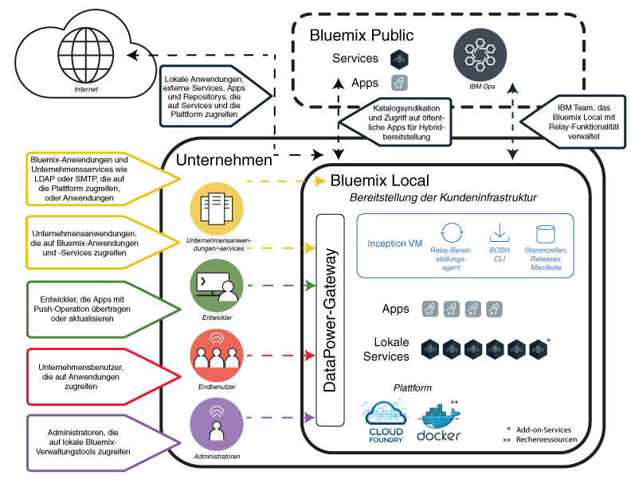

---

copyright:

  years: 2015, 2017

lastupdated: "2017-01-12"

---

{:new_window: target="_blank"}
{:shortdesc: .shortdesc}

# {{site.data.keyword.Bluemix_local_notm}}
{: #local}

{{site.data.keyword.Bluemix_local}} bringt die Leistungsstärke und Beweglichkeit der cloudbasierten {{site.data.keyword.Bluemix_notm}}-Plattform in Ihr Rechenzentrum. Mit {{site.data.keyword.Bluemix_local_notm}} können Sie die hochsensiblen Verarbeitungsprozesse hinter der Firewall Ihres Unternehmens schützen und gleichzeitig eine sichere Verbindung und Synchronisation mit {{site.data.keyword.Bluemix_notm}} Public gewährleisten.
{:shortdesc}

IBM® verwendet Cloudoperationen als Service zum Überwachen und Verwalten Ihrer Umgebung, damit Sie sich auf das Erstellen von Apps und Services konzentrieren können, die in dieser Umgebung ausgeführt werden. {{site.data.keyword.IBM_notm}} führt zudem Plattformaktualisierungen aus, während Sie sich um Ihre Geschäftsabläufe kümmern.

{{site.data.keyword.Bluemix_local_notm}}-Umgebungen verfügen in Hinblick auf die Betriebssicherheit über dieselben Sicherheitsstandards wie die öffentliche {{site.data.keyword.Bluemix_notm}}-Plattform. Sie stellen die Hardware und Infrastruktur bereit und erhalten so die Kontrolle über die Infrastruktur und physische [Sicherheit](/docs/security/index.html#localplatformsecurity). Der Zugriff von Entwicklern auf die lokale {{site.data.keyword.Bluemix_notm}}-Umgebung wird durch Ihre LDAP-Richtlinien gesteuert, die bei der Einrichtung Ihrer Umgebung durch das {{site.data.keyword.Bluemix_notm}}-Team konfiguriert werden können. Sie können innerhalb der lokalen Umgebung über die Verwaltungsseite [Benutzer und Berechtigungen verwalten](/docs/admin/index.html#oc_useradmin).

{{site.data.keyword.Bluemix_local_notm}} wird mit integrierten {{site.data.keyword.Bluemix_notm}}-Laufzeiten und 64 GB Rechenspeicher geliefert.

Darüber hinaus ist eine Reihe von Services als {{site.data.keyword.Bluemix_local_notm}}-Services verfügbar. In der folgenden Tabelle sind die Services aufgeführt, die inbegriffen sind oder optional käuflich erworben werden können.

| **Typ** | **Name** | **Beschreibung** |
|----------|----------|-----------------|
|Inbegriffen | [{{site.data.keyword.Bluemix_notm}}-Laufzeiten](/docs/cfapps/runtimes.html) | Machen Sie mit Laufzeiten Ihre App schnell betriebsbereit, ohne Maschinen und Betriebssysteme einrichten und verwalten zu müssen. Alle {{site.data.keyword.Bluemix_notm}}-Laufzeiten stehen Ihnen zur Verwendung in Ihrer {{site.data.keyword.Bluemix_notm}} Local-Instanz zur Verfügung.|
|Inbegriffen | [{{site.data.keyword.autoscaling}}](/docs/services/Auto-Scaling/index.html)| Dynamisches Erhöhen oder Verringern der Rechenleistung Ihrer Anwendung basierend auf Richtlinien. Mit diesem Service können Sie Ihre {{site.data.keyword.Bluemix}} Local-Umgebung unbegrenzt nutzen.|
|Optional | [{{site.data.keyword.apiconnect_short}}](/docs/services/apiconnect/index.html) | {{site.data.keyword.apiconnect_long}} integriert {{site.data.keyword.APIM}} und IBM StrongLoop in ein einzelnes Angebot, das eine Komplettlösung bietet, um APIs und Microservices zu erstellen, auszuführen, zu verwalten und durchzusetzen. |
|Optional | [{{site.data.keyword.cloudant}}](/docs/services/Cloudant/index.html#Cloudant) | {{site.data.keyword.cloudant}} bietet Zugriff auf eine vollständig verwaltete NoSQL-JSON-Datenebene, die permanent aktiv ist. Dieser Service ist mit CouchDB kompatibel und über eine einfache HTTP-Schnittstelle für mobile Anwendungsmodelle und Webanwendungsmodelle zugänglich. Weitere Informationen finden Sie in der vollständigen [Dokumentation ](http://docs.cloudant.com/BluemixLocal.html){: new_window} und in den [Hardwarevoraussetzungen ](http://docs.cloudant.com/BluemixLocalHardware.html){: new_window} für eine lokale Umgebung. |
|Optional | [{{site.data.keyword.containershort}}](/docs/containers/container_index.html) | Docker-Container in {{site.data.keyword.Bluemix_notm}} Local ausführen. Container sind virtuelle Softwareobjekte, die alle für die Ausführung von Apps erforderlichen Elemente enthalten. Container bieten den Vorteil der Ressourcenisolation und -zuordnung, wobei sie besser portierbar und effizienter als beispielsweise virtuelle Maschinen sind. Informationen zu den Hardwarevoraussetzungen finden Sie unter [IBM {{site.data.keyword.containershort}} in {{site.data.keyword.Bluemix_notm}} Dedicated and Bluemix Local](/docs/containers/container_dl.html). |
|Optional | [{{site.data.keyword.datacshort}}](/docs/services/DataCache/index.html#data_cache) | Dieser Service bietet ein speicherinternes Datengitter, durch das Szenarios mit verteiltem Caching für Ihre Apps unterstützt werden. Umfasst 50 GB speicherinternen Cache. |
| Optional (Beta) | [Protokollierung](/docs/monitoringandlogging/cfapps_ml_logs_dedicated_ov.html#container_ml_logs_dedicated_ov) | Stellt Protokolle für Ihre Cloud Foundry-Apps in der {{site.data.keyword.Bluemix_notm}}-Benutzerschnittstelle sowie durchsuchbare Protokolle und Dashboards in Kibana bereit. |
|Optional | [{{site.data.keyword.mobilepush}}](/docs/services/mobilepush/index.html) | {{site.data.keyword.mobilepush}} ist ein Service, mit dem Sie Benachrichtigungen an iOS- und Android-Geräte senden können. Benachrichtigungen können sich an alle Anwendungsbenutzer oder mithilfe von Tags an eine bestimmte Gruppe von Benutzern und Geräten wenden. Sie können Geräte, Tags und Abonnements verwalten. Sie können auch ein SDK (SDK, Software-Development-Kit) und REST-APIs (REST, Representational State Transfer; API, Application Program Interface) verwenden, um die Clientanwendung weiterzuentwickeln. |
|Optional | [{{site.data.keyword.sescashort}}](/docs/services/SessionCache/index.html#session_cache) | Um die Redundanz zu erhöhen, stellt {{site.data.keyword.sescashort}} eine Replik für eine Sitzung bereit, die im Cache gespeichert ist. Daher kann Ihre Clientanwendung auch im Falle eines Spannungsabfalls oder einer Betriebsunterbrechung weiterhin auf die im Cache gespeicherte Sitzung zugreifen. Der Service unterstützt das Sitzungs-Caching für Webanwendungen und mobile Anwendungen. |
|Optional | [{{site.data.keyword.iot_short}}](/docs/services/IoT/index.html) | Dieser Service ermöglicht Ihren Apps die Kommunikation mit und die Nutzung der erfassten Daten von Ihren verbundenen Geräten, Sensoren und Gateways. Das lokale Basisangebot beinhaltet eine Startumgebung, die die Ausführung einer privaten Version von IBM {{site.data.keyword.iot_short}} in der lokalen Umgebung mit einer Kapazität für 100.000 gleichzeitig verbundene Geräte oder Anwendungen und 1,6 TB für den Datenaustausch ermöglicht. |
{: caption="Table 1. Local services and runtimes" caption-side="top"}
{: #table01}

Durch optionale Komponenten, die zusätzlich zum Kauf angeboten werden, können Sie die Kapazität Ihrer Ressourcen und Services skalieren und erweitern. Wenden Sie sich zum Kauf dieser Optionen an das Vertriebsteam unter [Contact us](https://console.ng.bluemix.net/?direct=classic/#/contactUs/cloudOEPaneId=contactUs), um Kontakt mit einem Vertriebsbeauftragten aufzunehmen. Um Ihren Serviceplan zu erweitern, können Sie den Plan über die Kachel für den Service in Ihrem Katalog auswählen.

| **Name** | **Beschreibung** |
|----------|-----------------|
|{{site.data.keyword.Bluemix_notm}} Local {{site.data.keyword.apiconnect_short}} Professional - 5 Millionen API-Aufrufe | Diese Umgebung ermöglicht die Ausführung einer privaten Version von {{site.data.keyword.apiconnect_short}} mit einer Kapazität von 5 Millionen API-Aufrufen pro Monat. Richtet sich an API-Projekte auf Abteilungsebene. |
|{{site.data.keyword.Bluemix_notm}} Local {{site.data.keyword.apiconnect_short}} Professional - Kapazitätserweiterung auf 100.000 API-Aufrufe| Diese Erweiterung der {{site.data.keyword.apiconnect_short}} Professional-Umgebung bietet eine zusätzliche Kapazität von 100.000 API-Aufrufen pro Monat. |
|{{site.data.keyword.Bluemix_notm}} Local {{site.data.keyword.apiconnect_short}} Enterprise - 25 Millionen API-Aufrufe | Diese Umgebung ermöglicht die Ausführung einer privaten Version von {{site.data.keyword.apiconnect_short}} mit einer Kapazität von 25 Millionen API-Aufrufen pro Monat. Richtet sich an API-Projekte auf Unternehmensebene. |
|{{site.data.keyword.Bluemix_notm}} Local {{site.data.keyword.apiconnect_short}} Enterprise - Kapazitätserweiterung auf 100.000 API-Aufrufe | Diese Erweiterung der {{site.data.keyword.apiconnect_short}} Enterprise-Umgebung bietet eine zusätzliche Kapazität von 100.000 API-Aufrufen pro Monat. |
|{{site.data.keyword.Bluemix_notm}} Local {{site.data.keyword.cloudant}} Cluster | Diese Umgebung ermöglicht die Bereitstellung eines aus drei Knoten bestehenden Clusters des {{site.data.keyword.cloudant}}-Service. Die Datenkapazität der Knoten legen Sie durch die Infrastruktur fest, die Sie für die lokale Umgebung bereitstellen. |
|{{site.data.keyword.Bluemix_notm}} Data & Session Cache - Kapazitätserweiterung um 50 GB | Diese Umgebung ermöglicht die Bereitstellung und Ausführung von Data Cache- und Session Cache-Instanzen bis zu einer kumulativen Kapazität von 50 GB. |
|{{site.data.keyword.Bluemix_notm}} {{site.data.keyword.iot_short}} Local - inkrementelle Erhöhung | Diese zusätzliche Umgebung zum {{site.data.keyword.iot_short}} Local-Basisserviceangebot ermöglicht die Ausführung einer privaten Version von {{site.data.keyword.iot_short}} in der lokalen Umgebung mit einer Kapazität für 100.000 gleichzeitig verbundene Geräte oder Anwendungen und 0,5 TB für den Datenaustausch. |
|{{site.data.keyword.IBM_notm}} {{site.data.keyword.mobilepush}} Local - Add-on-Instanz | Eine Umgebung, die die Implementierung und Ausführung der {{site.data.keyword.mobilepush}}-Instanz mit der Möglichkeit, 300 zusätzliche Anfragen pro Sekunde zu akzeptieren, bietet. |
{: caption="Table 2. Optional services components for purchase" caption-side="top"}
{: #table02}

| **Name** | **Beschreibung** |
|----------|-----------------|
|Lokale Cloud Foundry-Laufzeiten - 64 GB Kapazität  | Cloud Foundry-Laufzeitumgebung mit 64 GB Laufzeitkapazität. |
|Lokale Cloud Foundry-Laufzeiten - Kapazitätserweiterung um 16 GB  | Diese Erweiterung der Cloud Foundry-Laufzeitumgebung stellt zusätzlich 16 GB Laufzeitkapazität zur Verfügung. |
|Lokale {{site.data.keyword.containerlong}} - Kapazitätserweiterung um 16 GB  | Diese Erweiterung der {{site.data.keyword.containerlong}}-Umgebung stellt zusätzlich 16 GB Kapazität zur Verfügung. |
|Lokale {{site.data.keyword.containerlong}} - 64 GB Kapazität  | {{site.data.keyword.containerlong}}-Umgebung mit 64 GB Kapazität. |
{: caption="Table 3. Optional platform add-on components for purchase" caption-side="top"}
{: #table03}

**Hinweis:** Für {{site.data.keyword.Bluemix_notm}} Local-Komponenten wird möglicherweise eine bestimmte konfigurierte Kapazität (z. B. Gigabyte oder Transaktionen pro Sekunde) angegeben. Da die tatsächliche Kapazität im realen Einsatz für eine bestimmte Konfiguration des Cloud-Service von vielen verschiedenen Faktoren abhängt, kann die tatsächliche Kapazität in der Praxis nach oben oder unten von der konfigurierten Kapazität abweichen.

### Syndizierter Katalog
{: #cataloglocal}

{{site.data.keyword.Bluemix_local_notm}} umfasst einen privaten Katalog, der genehmigte Services der öffentlichen und lokalen Bereitstellungen kombiniert. Sie können sogar Ihre eigenen Services über den {{site.data.keyword.Bluemix_notm}}-Katalog veröffentlichen und verwalten. Sie können auf der Basis Ihrer Kriterien für Datenschutz und Sicherheit entscheiden, welche öffentlichen Services die Anforderungen Ihres Unternehmens erfüllen.

Wenn es sich um eine private Instanz eines {{site.data.keyword.Bluemix_notm}}-Service für Ihre lokale Umgebung handelt, wird bei den Servicenamen in Ihrer Katalog-Verwaltungsansicht das Tag "Lokal" angezeigt. Entsprechend sehen Sie "Angepasst" bei den Servicekacheln (d. h. Sie haben einen Servicebroker für die Erstellung verwendet), wenn es sich um einen benutzerdefinierten Service handelt. Alle anderen aufgelisteten Services ohne das Tag "Lokal" oder "Angepasst" sind über die Syndikation aus {{site.data.keyword.Bluemix_notm}} Public verfügbar. Syndizierte Services bieten die Funktion zum Erstellen von Hybridanwendungen, die aus öffentlichen und privaten Services bestehen.

|Service	|Verfügbar in Region 'US South'	|Verfügbar in Region 'Europe United Kingdom' |Verfügbar in Region 'Australia Sydney'|
|:----------|:------------------------------|:------------------|:------------------|
|{{site.data.keyword.alchemyapishort}} 		|Ja	   	|Ja  		|Ja|
|{{site.data.keyword.alertnotificationshort}}	|Ja		|Ja		|Ja	|
|{{site.data.keyword.apiconnect_short}}         |Ja            |Ja            |Ja  |
|{{site.data.keyword.appseccloudshort}}		|Ja		|Ja		|Ja |
|{{site.data.keyword.apiconnect_short}} 	|Ja   	 	|Ja  	 	|Ja   |
|Automatisches Prüfprogramm für Eingabehilfen |Ja       |Ja    |Ja   |
|{{site.data.keyword.rules_short}}		|Ja		|Ja		|Ja |
|{{site.data.keyword.cloudant}}			|Ja		|Ja		|Ja |
|{{site.data.keyword.iotmapinsights_short}}    |Ja  |Ja  |Ja  |
|{{site.data.keyword.conversationshort}}  |Ja  |Ja  |Ja  |
|{{site.data.keyword.dashdbshort}}		|Ja		|Ja		|Ja |
|{{site.data.keyword.dataworks_short}}		|Ja		|Ja		|Nein|
|{{site.data.keyword.DB2OnCloud_short}}		|Ja		|Ja		|Ja |
|Prüfprogramm für digitalen Inhalt |Ja  |Ja  |Ja  |
|{{site.data.keyword.documentconversionshort}}	|Ja		|Ja		|Ja|
|{{site.data.keyword.iotdriverinsights_short}}  |Ja |Ja  |Ja  |
|{{site.data.keyword.geospatialshort_Geospatial}}	|Ja	|Ja		|Ja |
|{{site.data.keyword.GlobalizationPipeline_short}}	|Ja		| Ja		| Ja |
|{{site.data.keyword.identitymixershort}}		|Ja		|Ja		|Ja|
|{{site.data.keyword.iot4auto_short}} |Ja   |Ja  |Ja  |
|{{site.data.keyword.iotelectronics}}  |Ja  |Ja  |Nein |
|{{site.data.keyword.iotinsurance_short}} |Nein   |Nein   |Ja  |
|{{site.data.keyword.twittershort}}		|Ja		|Ja		|Ja|
|{{site.data.keyword.languagetranslationshort}}	|Ja		|Ja		|Ja |
|{{site.data.keyword.languagetranslatorshort}} |Ja  |Ja  |Ja  |
|{{site.data.keyword.dwl_short}}  |Ja  |Ja  |Nein  |
|{{site.data.keyword.eventhubshort}}		|Ja		|Nein		|Nein|
|{{site.data.keyword.messagehub}}		|Ja		|Ja		|Nein|
|{{site.data.keyword.manda}}			|Ja		|Ja		|Ja |
|{{site.data.keyword.amashort}}			|Ja		|Ja		|Ja |
|{{site.data.keyword.mqa}}			|Ja		|Ja		|Ja |
|{{site.data.keyword.mql}}			|Nein		|Nein		|Ja |
|{{site.data.keyword.nlclassifierlshort}} 	|Ja 		|Ja 		|Ja|
|{{site.data.keyword.personalityinsightsshort}}	|Ja		|Ja		|Ja|
|{{site.data.keyword.pm_short}}			|Ja		|Ja		|Nein |
|{{site.data.keyword.mobilepush}}		|Ja		|Ja		|Ja |
|{{site.data.keyword.retrieveandrankshort}}	|Ja 		|Ja 		|Ja|
|{{site.data.keyword.runbook_short}}		|Ja		|Ja		|Ja|
|{{site.data.keyword.SecureGateway}}		|Ja		|Ja		|Ja |
|{{site.data.keyword.ssofull}}			|Ja		|Nein		|Nein|
|{{site.data.keyword.speechtotextshort}}	|Ja 		|Ja	 	|Ja|
|{{site.data.keyword.streaminganalyticsshort}}	|Ja		|Ja		|Ja |
|{{site.data.keyword.texttospeechshort}} 	|Ja 		|Ja	 	|Ja|
|{{site.data.keyword.toneanalyzershort}} 	|Ja 		|Ja 		|Ja|
|{{site.data.keyword.tradeoffanalyticsshort}}	|Ja		|Ja		|Ja|
|{{site.data.keyword.visualrecognitionshort}}	|Ja 		|Ja	 	|Ja|
|{{site.data.keyword.iot_short}}		|Ja		|Ja		|Nein|
|{{site.data.keyword.weather_short}}		|Ja		|Ja		|Ja|
|{{site.data.keyword.workloadscheduler}}	|Ja		|Ja		|Ja |
{: caption="Table 4. Services available for syndication from {{site.data.keyword.Bluemix_notm}} Public by region" caption-side="top"}
{: #table04}

**Hinweis:** Diese Tabelle enthält keine Services von Drittanbietern. Überprüfen Sie Ihren Katalog auf Optionen für Services von Drittanbietern.

## {{site.data.keyword.Bluemix_local_notm}}-Architektur
{: #localarch}

{{site.data.keyword.Bluemix_local_notm}} befindet sich auf einer virtuellen Maschine hinter der Firewall Ihres Unternehmens. Auf diese Weise steht Ihnen eine besonders leistungsfähige und sichere Cloudinfrastruktur zur Verfügung. {{site.data.keyword.IBM_notm}} installiert und verwaltet {{site.data.keyword.Bluemix_local_notm}} mit der [Relay](#localrelay)-Technologie von {{site.data.keyword.IBM_notm}} in Ihrem Rechenzentrum und führt eine Fernüberwachung durch. Die logische Architektur in [Abbildung 1](#figure01) veranschaulicht, wie {{site.data.keyword.Bluemix_notm}} in Ihrer lokalen Umgebung eingerichtet wird und wie {{site.data.keyword.IBM_notm}} Ihre lokale Instanz wartet:

 

Abbildung 1. {{site.data.keyword.Bluemix_local_notm}}-Architektur
{: #figure01}

Die virtuelle Konzeptionsmaschine (Inception Virtual Machine, Inception VM) wird in der virtualisierten Infrastruktur Ihres Unternehmens hinter der Unternehmensfirewall ausgeführt. Die virtuelle Konzeptionsmaschine erstellt eine abgehende Netzverbindung zum {{site.data.keyword.IBM_notm}} Operations Center über die {{site.data.keyword.IBM_notm}} Relay-Technologie. Relay führt verschiedene Funktionen aus und ist nachfolgend im Abschnitt [Relay](#localrelay) beschrieben.

Die Komponenten der {{site.data.keyword.Bluemix_notm}}-Plattform und die zentralen Features, die die Plattformkomponenten unterstützen, werden in einem privaten, isolierten virtuellen LAN (VLAN) ausgeführt. {{site.data.keyword.Bluemix_local_notm}} verwendet für das private Teilnetz ein virtuelles LAN (VLAN). Die Verwendung eines privaten Teilnetzes ist sicherer als ein öffentliches VLAN und kann helfen, Routingprobleme zu vermeiden. Zu den zentralen Features, die die Plattform bilden und unterstützen, gehören die folgenden:

<dl>
<dt>Plattform</dt>
<dd>In der Mindestkonfiguration besteht die Plattform aus den Cloud Foundry-Komponenten und einigen lokalen Anwendungsservices. {{site.data.keyword.Bluemix_notm}} stellt sowohl Cloud Foundry als auch {{site.data.keyword.containerlong}}-basierte Rechenumgebungen bereit. In einem Unternehmen können eine oder beide dieser Rechenumgebungen konfiguriert sein.  
Außerdem kann ein Unternehmen weitere lokale Anwendungsservices hinzufügen. 

Informationen zu zusätzlichen Services und Rechenfunktionen, die hinzugefügt werden können, finden Sie in den Tabellen [Optional beziehbare Komponenten: Service-Add-ons](#table02) und [Optional beziehbare Komponenten: Plattform-Add-ons](#table03).

</dd>
<dt>{{site.data.keyword.Bluemix_notm}} Public</dt>
<dd>
Eine {{site.data.keyword.Bluemix_local_notm}}-Umgebung kann über eine abgehende Verbindung zu einer {{site.data.keyword.Bluemix_notm}} Public-Region verfügen. Eine Verbindung zu Public ermöglicht die Syndikation von Public-Services für den lokalen Katalog. Die Servicesyndikation von {{site.data.keyword.Bluemix_notm}} Public ist ein komfortables Verfahren für Entwickler, um Anwendungen zu erstellen, deren Host die {{site.data.keyword.Bluemix_local_notm}}-Umgebung des Unternehmens ist, und um auf Services zuzugreifen, die in {{site.data.keyword.Bluemix_notm}} Public ausgeführt werden. Eine Liste der {{site.data.keyword.IBM_notm}} Services, die aus {{site.data.keyword.Bluemix_notm}} Public syndiziert werden können, enthält der Abschnitt [Syndizierter Katalog](#cataloglocal).
</dd>
<dt>{{site.data.keyword.IBM_notm}} Operations</dt>
<dd>
{{site.data.keyword.IBM_notm}} verwaltet, überwacht und wartet die lokale Plattform und die lokalen Services. Sie können sich somit ganz auf die Erstellung innovativer Anwendungen konzentrieren. Das Team von {{site.data.keyword.IBM_notm}} Operations Support Services (OSS) führt Operationen unter Verwendung einer VPN-Tunnelverbindung von der virtuellen Konzeptionsmaschine zum Betriebsnetz von {{site.data.keyword.IBM_notm}} durch.
</dd>
<dt>Unternehmen</dt>
<dd>
Die Unternehmensnetzumgebung besitzt eine bidirektionale Netzverbindung zu {{site.data.keyword.Bluemix_local_notm}}. Hierdurch können Anwendungen, die in {{site.data.keyword.Bluemix_local_notm}} gehostet sind, auf Services und Ressourcen im Unternehmen zugreifen. Hierzu zählen auch Datenquellen und Unternehmensservices. Die Netzverbindung ermöglicht {{site.data.keyword.Bluemix_local_notm}} außerdem die Verwendung Ihrer LDAP-Komponenten zur Authentifizierung Ihrer Entwickler und Administratoren.
</dd>
<dt>Local-Services</dt>
<dd>In Ihrer {{site.data.keyword.Bluemix_local_notm}}-Umgebung steht eine Gruppe von Services zur Verfügung, die privat genutzt werden können. Normalerweise entscheiden Sie vor der Bereitstellung durch das {{site.data.keyword.IBM_notm}} Team, welche Services Sie für Ihre Umgebung wünschen. Eine Liste der verfügbaren Services enthält die Tabelle [Local-Services und -Laufzeiten](#table01).
</dd>
<dt>DataPower-Gateway</dt>
<dd>
{{site.data.keyword.IBM_notm}} DataPower Gateway-Appliances stellen den Zugriff auf {{site.data.keyword.Bluemix_notm}}-Anwendungsdomänen bereit. Diese Appliances stellen eine Verbindung zur Ihrem Intranet und zum privaten Netz von {{site.data.keyword.Bluemix_notm}} her und bieten auf diese Weise ein sicheres Gateway für die {{site.data.keyword.Bluemix_notm}}-Bereitstellung. Ihre Entwickler, die Apps und Services bereitstellen, erhalten durch dieses Gateway Zugriff aus Ihrem Intranet. Die Benutzer der Anwendungen erhalten den Zugriff ebenso durch die DataPower-Appliances wie Ihre Administratoren.
</dd>
<dt>Sicherheitsdaten</dt>
<dd>
{{site.data.keyword.IBM_notm}} arbeitet mit QRadar Security Intelligence Platform, um eine vereinheitlichte Architektur zur Integration verschiedener Schlüsselkomponenten bereitzustellen. Diese Komponenten umfassen Sicherheitsinformationen und Ereignismanagement, Protokollmanagement, Anomalieerkennung, Vorfallforensik sowie Konfigurations- und Schwachstellenmanagement. {{site.data.keyword.Bluemix_notm}} verwendet außerdem {{site.data.keyword.IBM_notm}} QRadar SIEM (Security Information and Event Management, Sicherheitsinformations- und Ereignismanagement), um Aktionen privilegierter Benutzer sowie erfolgreiche und nicht erfolgreiche Anmeldeversuche von Anwendungsentwicklern zu überwachen. QRadar stellt für den Kunden Informationen im Abschnitt für Berichte und Protokolle der Verwaltungsseite bereit. Informationen zu Sicherheitsberichten finden Sie unter [Berichte anzeigen](/docs/admin/index.html#oc_report).

{{site.data.keyword.IBM_notm}} BigFix stellt sicher, dass in angemessenen Abständen Fixes für Betriebssysteme angewendet werden. Der Patchprozess ist automatisiert und der Zeitplan wird zwischen Ihnen und IBM abgestimmt. Informationen zu Wartungen und Upgrades finden Sie unter [Lokale Instanz warten](index.html#maintainlocal).

</dd>
</dl>

Ihre Apps werden in virtuellen Containern bereitgestellt, die auf virtuellen Cloud Foundry-Maschinen ausgeführt werden. Alle Cloud Foundry-Komponenten, wie zum Beispiel Cloud-Controller, Statusmanager, Router und Droplet Execution Agents (DEAs), werden bei der Einrichtung von {{site.data.keyword.Bluemix_notm}} bereitgestellt. Die verschiedenen {{site.data.keyword.Bluemix_notm}}-Managementkomponenten sind auch in der {{site.data.keyword.Bluemix_notm}}-Bereitstellung enthalten.

Informationen zu den Netzspezifikationen und den Infrastrukturanforderungen finden Sie in [Infrastrukturanforderungen für {{site.data.keyword.Bluemix_local_notm}}](/docs/local/index.html#localinfra).

### Relay
{: #localrelay}

Relay ist die sichere Verbindung zwischen Ihrem Unternehmensnetz und {{site.data.keyword.IBM_notm}} Cloud Operations. Bei dem Datenverkehr über die Relay-Verbindung handelt es sich um eine automatisierte Aktivität zum Bereitstellen und Verwalten der Plattform, Rechenressourcen und Services von {{site.data.keyword.Bluemix_local_notm}} für Ihre Instanzen. Der Datenverkehr über die Relay-Verbindung kann folgendermaßen kategorisiert werden:

* Überwachung und Ereignisse
* Sicherheitsdaten
* Bereitstellungen und Aktualisierungen
* Problembestimmung und Fixes
* Notfallwartung

<dl>
<dt>
Überwachung und Ereignisse
</dt>
<dd>
Die Überwachungs- und Ereignisfunktionen werden in Ihrem Rechenzentrum bereitgestellt. Anwendungsdaten verbleiben in Ihrem Rechenzentrum.  
Der Datenverkehr über die Relay-Verbindung schließt die Überwachungsfunktionen ein, mit denen {{site.data.keyword.IBM_notm}} Operations bei Bedarf die Zustandsüberwachung und Problembestimmung durchführen kann. 

Die Überwachungsdaten enthalten keine sensiblen Daten, also keine Kennwörter, keine Anwendungsdaten, keine Anwendungsprotokolle und keine Schlüssel. Der Datenverkehr über Relay schließt die Datenflüsse von der virtuellen Konzeptionsmaschine zum {{site.data.keyword.Bluemix_notm}} Operations Center ein.

</dd>
<dt>
Sicherheitsdaten
</dt>
<dd>
{{site.data.keyword.IBM_notm}} arbeitet mit QRadar Security Intelligence Platform, um eine vereinheitlichte Architektur zur Integration verschiedener Schlüsselkomponenten bereitzustellen. Diese Komponenten umfassen Sicherheitsinformationen und Ereignismanagement, Protokollmanagement, Anomalieerkennung, Vorfallforensik sowie Konfigurations- und Schwachstellenmanagement. 

{{site.data.keyword.Bluemix_notm}} verwendet außerdem {{site.data.keyword.IBM_notm}} QRadar SIEM (Security Information and Event Management, Sicherheitsinformations- und Ereignismanagement), um Aktionen privilegierter Benutzer sowie erfolgreiche und nicht erfolgreiche Anmeldeversuche zu überwachen.

QRadar stellt für den {{site.data.keyword.Bluemix_notm}}-Administrator Informationen zu Ereignissen und Ereignisdaten über den Abschnitt für Berichte und Protokolle der Verwaltungsseite bereit. QRadar-Berichte werden regelmäßig erstellt, je nach Berichtstyp entweder täglich oder monatlich. Alle Berichte werden in der Administrationskonsole gespeichert und können 90 Tage lang abgerufen werden. Nach Ablauf dieser 90 Tage sind die Berichte auf Anforderung an {{site.data.keyword.IBM_notm}} 9 Monate lang offline verfügbar. Insgesamt sind die Berichte bis zu 1 Jahr verfügbar.

Der von QRadar verarbeitete Datenverkehr enthält keine Anwendungsdaten. Die einzigen Daten, die möglicherweise als sensibel betrachtet werden könnten, sind Benutzer-IDs für die Berichte über Anmeldeversuche und IP-Adressen einiger {{site.data.keyword.Bluemix_notm}}-Komponenten.
Der Datenverkehr über Relay schließt die Datenflüsse zwischen dem QRadar-Ereignisprozessor in {{site.data.keyword.Bluemix_local_notm}} und einer QRadar-Konsole im {{site.data.keyword.IBM_notm}} Operations Center ein.

</dd>
<dt>
Bereitstellung und Wartungsaktualisierungen
</dt>
<dd>
Mit Ausnahme der Erstinstallation der virtuellen Konzeptionsmaschine, die relativ früh im Bereitstellungsprozess erfolgt, ist die Bereitstellung der meisten anderen Komponenten mittels UrbanCode Deploy automatisiert. 

Bei den Bereitstellungsaktivitäten stützt sich UrbanCode Deploy auf [BOSH ](https://bosh.cloudfoundry.org/){:new_window}. Hierbei werden zuerst unter anderem die BOSH-Komponenten aus der virtuellen Konzeptionsmaschine bereitgestellt. Mit der Continuous-Delivery-Funktionalität von UrbanCode Deploy werden Plattformaktualisierungen im Rahmen eines konsistenten Test- und Validierungsprozesses bereitgestellt.

Scripts und Pakete werden vom {{site.data.keyword.IBM_notm}} Operations Center über Relay an Ihre lokale {{site.data.keyword.Bluemix_notm}}-Plattform übertragen.

</dd>
<dt>
Fixes
</dt>
<dd>
{{site.data.keyword.IBM_notm}} BigFix stellt sicher, dass Sicherheitsupdates für Betriebssysteme in der angemessenen Häufigkeit angewendet werden. Der Patchprozess ist automatisiert und der Zeitplan wird zwischen Ihnen und IBM abgestimmt.
</dd>
<dt>
Problembestimmung und Notfallwartung
</dt>
<dd>
{{site.data.keyword.IBM_notm}} stellt eine Liste genehmigter Benutzer und IDs aus {{site.data.keyword.IBM_notm}} Operations bereit, die auf Ihre Umgebung zugreifen können. Auf der Verwaltungsseite für Ihre {{site.data.keyword.Bluemix_local_notm}}-Umgebung können Sie jedweden Zugriff auf Ihre Umgebung überprüfen. 

{{site.data.keyword.IBM_notm}} Operations-Benutzer greifen nur zum Zweck besserer Erkenntnisse über den Plattformstatus auf Ihre {{site.data.keyword.Bluemix_local_notm}}-Umgebung zu. Das Operations-Team erhält in keinem Fall Zugriff auf Ihren Anwendungscode oder Ihre Anwendungsdaten und führt ausschließlich Befehle aus, die für die Problembestimmung erforderlich sind, um in Notfällen Konfigurationen oder Parameter zu überprüfen, die nicht automatisiert sind. Bei keinem dieser Befehle werden über Relay sensible Daten übertragen.

Der Zugriff auf Ihre lokale Umgebung wird bei mehreren Schritten im Verbindungsprozess durch eine Zwei-Faktor-Authentifizierung geschützt. Durch Generieren eines Sicherheitsberichts haben Sie die Möglichkeit, zu ermitteln, wer auf Ihre Umgebung zugegriffen hat. Dies beinhaltet auch die Feststellung, wann und zu welchem Zweck auf die Umgebung zugegriffen wurde.

Der Datenverkehr über Relay für die Problembestimmung und Notfallwartung besteht aus SSH-Datenverkehr sowie aus LDAP- und Kerberos-Datenverkehr, mit dem die {{site.data.keyword.IBM_notm}} Benutzer authentifiziert werden.  
Die Umgebung ist für Sie als Administrator für die Verwaltung von Vorfällen, Problemen, Änderungen sowie der Kapazität und der Sicherheit vollständig sichtbar. Sie können auf die Informationen zu Ihrer Umgebung über die Seite 'Verwaltung' zugreifen. Durch die Relay-Technologie enthält die Verwaltungsseite immer die aktuellsten Plattformereignisdaten aus QRadar. 

</dd>
</dl>

### SSL-Inspektion
{: #sslinspection}

Cloud Foundry- und {{site.data.keyword.Bluemix_notm}}-Anwendungen können mit SSL-Inspektionszertifikaten arbeiten, wenn sie auf Quellen außerhalb der lokalen Umgebung zugreifen. Die Inspektion von SSL-Inhalten ist für Ihre Umgebung verfügbar, wenn Sie ein Stammzertifikat zum Signieren inspizierter SSL-Datenströme bereitstellen. 

Das {{site.data.keyword.Bluemix_notm}}-Bereitstellungsteam lädt das Stammzertifikat, um die SSL-Inspektion während des Bereitstellungsprozesses für Ihre lokale Umgebung in der Umgebung zu aktivieren. Durch das Aktivieren der SSL-Inspektion während der Umgebungseinrichtung wird keine zusätzliche Zeit für die Bereitstellung hinzugefügt. Wenn diese Funktion nicht bei der Erstbereitstellung aktiviert wird, können Sie ihre Aktivierung anfordern. Dies kann jedoch zusätzliche Kosten verursachen und abhängig von Ihren verfügbaren Wartungszeiten zwei bis vier Tage dauern.

## {{site.data.keyword.Bluemix_local_notm}}-Instanz einrichten
{: #setuplocal}

{{site.data.keyword.Bluemix_local_notm}} wurde konzipiert, um eine private Version des Produktangebots {{site.data.keyword.Bluemix_notm}} Public bereitzustellen, die auf der von Ihnen ausgewählten Hardware gehostet wird. Sie haben zwei Optionen: Sie können die Hardware in Form von VMware bereitstellen oder {{site.data.keyword.Bluemix_notm}} Local System bestellen. Dieses System befindet sich auf einer vorkonfigurierten PureApplication-Appliance, die Sie über {{site.data.keyword.IBM_notm}} bestellen können. Weitere Informationen zu den Optionen der PureApplication-Appliance finden Sie unter [IBM {{site.data.keyword.Bluemix_notm}} Local System W3500 and W3550 models run cloud native services, enabled middleware, and open pattern workloads concurrently ](https://www-01.ibm.com/common/ssi/rep_ca/5/897/ENUS216-325/){: new_window}.

Für {{site.data.keyword.Bluemix_local_notm}} können Sie die {{site.data.keyword.Bluemix_notm}}-Services und -Laufzeiten verwenden, um Ihre Datenverarbeitungsanforderungen in einer sicheren, vom Kunden gehosteten und verwalteten Cloudumgebung zu unterstützen. {{site.data.keyword.IBM_notm}} bietet Ihnen über eine kennwortgesicherte Anmeldung Zugriff auf {{site.data.keyword.Bluemix_local_notm}}. Sie können auf die Services, Laufzeiten und zugehörigen Ressourcen zugreifen und {{site.data.keyword.Bluemix_notm}}-Apps bereitstellen und entfernen. Überprüfen Sie die folgenden Schritte zur Arbeit mit Ihrem {{site.data.keyword.IBM_notm}} Ansprechpartner zum Einrichten Ihrer lokalen Instanz von {{site.data.keyword.Bluemix_notm}}.

**Hinweis:** Wenn Sie {{site.data.keyword.Bluemix_local_notm}} auf der Hardwareoption {{site.data.keyword.Bluemix_notm}} Local System ausführen möchten, weicht der Einrichtungsprozess möglicherweise insofern ab, als Sie dem IBM Ansprechpartner nicht so viele Informationen zur Verfügung stellen müssen. Des Weiteren können Ihre Rollen und Zuständigkeiten in den Konzeptions- und Fortschrittsphasen aufgrund des Wartungsmodells "Call Home" der PureApplication-Appliance im Umfang reduziert werden, da sich dieses von dem Managementmodell unterscheidet, das für die Verwendung von vom Kunden gehosteten VMware-Systemen erforderlich ist. 

Gehen Sie wie folgt vor, um Ihre private Version von {{site.data.keyword.Bluemix_notm}} einzurichten:

<ol>
<li>Informationen zur Einrichtung Ihrer lokalen Instanz finden Sie auf der Seite <a href="index.html#localinfra" title="Wird in einem neuen Fenster geöffnet">Infrastrukturanforderungen für {{site.data.keyword.Bluemix_local_notm}}</a>.</li>
<li>Wenden Sie sich an Ihren zugewiesenen {{site.data.keyword.IBM_notm}} Kundenbeauftragten oder <a href="https://console.ng.bluemix.net/?direct=classic/#/contactUs/cloudOEPaneId=contactUs" target="_blank">wenden Sie sich an {{site.data.keyword.Bluemix_notm}} </a>, um mit der Arbeit zu beginnen.</li>
<li>Erstellen Sie Ihre Vereinbarung zu {{site.data.keyword.Bluemix_local_notm}} einschließlich Meilensteindaten für die Bereitstellung mit {{site.data.keyword.IBM_notm}}.
	<ol type="a">
	<li>Erarbeiten Sie mit IBM Ihre einmalige Einrichtung und die monatlich fälligen Gebühren für Ihre {{site.data.keyword.Bluemix_notm}} Local-Instanz. Die monatlich fällige Gebühr basiert auf den lokalen Services, die Sie nutzen möchten. Hinzu kommt ein Abonnement für alle {{site.data.keyword.Bluemix_notm}} Public-Services. Sie erhalten dann eine Rechnung für alle Nutzungen, die über die Abonnementvereinbarung hinausgehen.</li>
	<li>Ermitteln Sie die Fristen für die einzelnen Einrichtungsphasen Ihrer {{site.data.keyword.Bluemix_local_notm}}-Instanz.</li>
	</ol>
	</li>
<li>Nach dem Erstellen der Plattform und des Kontos ermitteln Sie die Personen in Ihrer Organisation für die Rollen, die benötigt werden, um Ihre lokale Instanz betriebsbereit zu machen. Weitere Informationen zu den Rollen, die Sie zuweisen, finden Sie unter <a href="/docs/local/index.html#rolesresponsibilities">{{site.data.keyword.Bluemix_notm}} Local-Rollen und -Zuständigkeiten</a>.
</li>
<li>Sie stellen die Hardware bereit und {{site.data.keyword.IBM_notm}} hilft Ihnen beim Definieren und Festlegen der Netzkonnektivität zwischen Ihrem Unternehmensnetz und Ihrer {{site.data.keyword.Bluemix_local_notm}} Local-Instanz. Weitere Informationen zu Infrastrukturanforderungen finden Sie unter <a href="index.html#localinfra">Infrastrukturanforderungen für {{site.data.keyword.Bluemix_local_notm}}</a>.
	<ol type="a">
	<li>{{site.data.keyword.IBM_notm}} konfiguriert den Netzzugriff und LDAP Ihren Angaben entsprechend. Die von Ihnen bestimmten Ansprechpartner erhalten Verwaltungszugriff. Sie müssen auch einen Ansprechpartner für die Unterstützung und die Abrechnung bestimmen.</li>
	<li>{{site.data.keyword.IBM_notm}} richtet in Ihrer lokalen Umgebung einen syndizierten Katalog ein, um Ihnen Ihre lokalen Services und viele der öffentlichen {{site.data.keyword.Bluemix_notm}}-Services zu zeigen.</li>
	<li>Sie überprüfen die Netz- und Firewallkonfiguration sowie den LDAP-Endpunkt und -Zugriff.</li>
	</ol>
</li>
</ol>

Für die Erstbereitstellung und Erstkonfiguration Ihrer Umgebung können Sie einen Prozess wie in der folgenden Liste dargestellt erwarten. Details dazu, wer für die einzelnen Tasks verantwortlich ist, finden Sie unter [Rollen und Zuständigkeiten](/docs/local/index.html#rolesresponsibilities).

**Hinweis:** Wenn Sie Ihre lokale Instanz auf der Hardwareoption {{site.data.keyword.Bluemix_notm}} Local System hosten möchten, können Sie in der folgenden Liste die Schritte 1 bis 3 überspringen.

<ol>
<li>Sie stellen die VMware-Konfiguration bereit, die die Spezifikationen für Rechenressourcen, Netzbetrieb und Speicher erfüllt. Weitere Informationen zu den Infrastrukturanforderungen finden Sie unter <a href="/docs/local/index.html#localinfra">Infrastrukturanforderungen für {{site.data.keyword.Bluemix_notm}} Local</a>.</li>
<li>Sie stellen die Berechtigungsnachweise für den vCenter-Cluster bereit, die von der virtuellen Konzeptionsmaschine verwendet werden sollen. Sie müssen die folgenden Informationen angeben:
<ul>
<li>Name des VMware-Clusters</li>
<li>Berechtigungsnachweise für den vCenter-Cluster aus Benutzer-ID und Kennwort</li>
<li>Datenspeichername bzw. -namen (LUN-Name für den Speicher)</li>
<li>VLAN ID-/VMware-Portgruppe</li>
<li>Name für den Ressourcenpool</li>
</ul>
</li>
<li>Sie und {{site.data.keyword.IBM_notm}} arbeiten zusammen, um die Berechtigungsnachweise zu validieren,
die Sie in der vorherigen Task bereitgestellt haben.</li>
<li>Sie stellen sieben IP-Adressen in Ihrem Netz bereit. Wenn Sie einen gesicherten Web-Proxy haben, um ausgehenden Zugriff auf das Internet für interne {{site.data.keyword.Bluemix_notm}}-Komponenten zuzulassen, müssen Sie die Berechtigungsnachweise für die entsprechende Verbindung bereitstellen.

**Hinweis:** Wenn Ihr Web-Proxy nicht geschützt wird, brauchen Sie die Berechtigungsnachweise nicht bereitzustellen. Beachten Sie außerdem, dass nicht alle {{site.data.keyword.Bluemix_local_notm}}-Kunden einen Web-Proxy verwenden.
</li>
<li>{{site.data.keyword.IBM_notm}} stellt eine Whitelist von URLs bereit, die über Ihren Web-Proxy zugelassen werden müssen, bevor die Bereitstellung beginnt. 

**Hinweis:** Damit die vorhandenen bzw. neuen Anwendungen auf die erforderlichen Ressourcen zugreifen können, müssen Sie möglicherweise zusätzliche Schritte ausführen, um die Ressourcen mit dem Buildpack zu bündeln oder die zur Ausführung der Anwendungen erforderlichen URLs in Zusammenarbeit mit dem Sicherheitsteam in die Whitelist einzutragen. Weitere Informationen zum Arbeiten mit Node.js- und Liberty for Java-Buildpacks finden Sie in <a href="../runtimes/nodejs/offlineMode.html">Offlinemodus für Node.js</a> und <a href="../runtimes/liberty/offlineMode.html">Offlinemodus für Liberty for Java</a>.

</li>
<li>Sie geben die Domänennamen für die Bereitstellung und die gewünschten IDs an. Sie erhalten zwei teilweise definierte Domänen, wenn Sie Ihre lokale Instanz einrichten, und wählen das Präfix für die beiden Domänen aus. Beispiel: Sie wählen das Präfix für <code>*mycompany*.bluemix.net</code> und <code>*mycompany*.mybluemix.net</code> aus. 
 
Sie können auch eine vollständig angepasste Domäne definieren, z. B. mycustombmx.mycompany.com oder application.mycompany.com. Sie müssen das SSL-Zertifikat, den Zertifikatsschlüssel und das Stammzertifikat angeben, bevor die Umgebung bereitgestellt wird. Das bereitgestellte Stammzertifikat kann auch verwendet werden, um auf Wunsch die <a href="index.html#sslinspection">SSL-Inspektion</a> für Ihre Umgebung einzurichten.  
 
Sie können beliebig viele angepasste Domänen für Ihre Anwendungen auswählen, sofern Sie die Zertifikate für die angepassten Domänen bereitstellen. Informationen zur Erstellung einer angepassten Domäne finden Sie unter <a href="../manageapps/updapps.html#domain">Angepasste Domäne erstellen und verwenden</a>.</li>
<li>Sie wählen die Technologie (IPSec- oder OpenVPN-Tunnel) aus, die zur Konfiguration von Relay für die Rückverbindung zum {{site.data.keyword.IBM_notm}} Operations Center verwendet wird.</li>
<li>{{site.data.keyword.IBM_notm}} installiert und startet die virtuelle Konzeptionsmaschine im {{site.data.keyword.Bluemix_notm}}-Cluster. Wenn Sie ein eigenes VMware bereitstellen, wird Ihr Kundenvertreter von einem {{site.data.keyword.IBM_notm}} Ansprechpartner bei der Ausführung dieser Task unterstützt. Wenn Sie die Hardwareoption {{site.data.keyword.Bluemix_notm}} Local System bestellt haben, wird diese Task von einem IBM Ansprechpartner durchgeführt.</li>
<li>{{site.data.keyword.IBM_notm}} konfiguriert Relay für die Kommunikation mit dem {{site.data.keyword.IBM_notm}} Operations Center.</li>
<li>Das Repository für die virtuelle Konzeptionsmaschine extrahiert die aktualisierten Buildartefakte.</li>
<li>Sie stellen {{site.data.keyword.IBM_notm}} die Berechtigungsnachweise für die Verbindung zur unternehmenseigenen LDAP-Verzeichnisinstanz zur Verfügung.</li>
<li>{{site.data.keyword.IBM_notm}} arbeitet mit einer Automatisierung, um die zentrale {{site.data.keyword.Bluemix_notm}}-Plattform bereitzustellen.</li>
<li>{{site.data.keyword.IBM_notm}} stellt die zentrale Plattform bereit, die elastische Laufzeiten, Konsolen, Verwaltungsfunktionen und Überwachung umfasst.</li>
<li>{{site.data.keyword.IBM_notm}} verlinkt Ihren syndizierten Katalog aus Ihrer lokalen Bereitstellung mit einer öffentlichen {{site.data.keyword.Bluemix_notm}}-Instanz für die Verwendung öffentlicher Services. Eine Gruppe öffentlicher Services ist standardmäßig in Ihrer lokalen Instanz verfügbar. Sie können die Verwaltungsseite für die Katalogverwaltung verwenden, um die Services für Ihre lokale Instanz zu aktivieren oder zu inaktivieren.</li>
<li>{{site.data.keyword.IBM_notm}} konfiguriert Ihren Verwaltungszugriff auf die Umgebung.</li>
<li>Sie können mit der Verwendung Ihrer lokalen Instanz beginnen, die vom {{site.data.keyword.IBM_notm}} Operationsteam überwacht wird, um auf Alerts zu reagieren.</li>
</ol>

Nach der Einrichtung Ihrer {{site.data.keyword.Bluemix_notm}}-Instanz können Sie die Ihre {{site.data.keyword.Bluemix_notm}}-Instanz über die Verwaltungsseite ('Administration') überwachen und verwalten. Weitere Informationen finden Sie unter [{{site.data.keyword.Bluemix_local_notm}} und Bluemix Dedicated verwalten](../admin/index.html#mng). Weitere Informationen zu Upgrades und Wartung finden Sie unter [Lokale Instanz warten](index.html#maintainlocal).

##Rollen und Zuständigkeiten
{: #rolesresponsibilities}

Wenn Sie ein {{site.data.keyword.Bluemix_local_notm}}-Konto einrichten, ermitteln Sie die Personen in Ihrer Organisation für die Rollen, die benötigt werden, um Ihre lokale Instanz betriebsbereit zu machen.

###Rollen

In der folgenden Liste sind die Kundenrollen und -zuständigkeiten enthalten, die Sie zuweisen:

<dl>
<dt>**Zentraler Ansprechpartner für das Beschaffungswesen**</dt>
<dd>Arbeitet mit dem {{site.data.keyword.IBM_notm}} Ansprechpartner zusammen an der Einrichtung Ihrer {{site.data.keyword.Bluemix_local_notm}}-Umgebung. Dazu gehört das Ermitteln geeigneter Personen in Ihrer Organisation für die Arbeit an den einzelnen Aspekten des Projekts. Die Person, die dieser Rolle zugewiesen ist, überwacht die Musterauswahl, die geschäftlichen Vereinbarungen und die Regelung für den Zugang zu Kundenressourcen. Dieser zentrale Ansprechpartner ist der allgemeine Ansprechpartner für die Einrichtung der lokalen Instanz.</dd>
<dt>**Compliance-Manager**</dt>
<dd>Arbeitet mit dem {{site.data.keyword.IBM_notm}} Ansprechpartner zusammen, um eine Topologie und eine Bereitstellungsoption auszuwählen, die Ihren Sicherheitsanforderungen entsprechen. Die Person, die dieser Rolle zugewiesen ist, legt gemeinsam mit dem {{site.data.keyword.IBM_notm}} Compliance-Berater fest, mit welchen Implementierungsmustern die Compliance-Ziele erreicht werden.</dd>
<dt>**Netzspezialist**</dt>
<dd>Arbeitet mit dem {{site.data.keyword.IBM_notm}} Ansprechpartner zusammen an den Netzplänen für die {{site.data.keyword.Bluemix_notm}}-Bereitstellung. Die Person, die dieser Rolle zugewiesen ist, überprüft die von {{site.data.keyword.IBM_notm}} vorausgesetzten Netzspezifikationen und arbeitet gemeinsam mit {{site.data.keyword.IBM_notm}} an einem Implementierungsplan. Am Ende der Installations- und Verifizierungsphase prüft die Person, die dieser Rolle zugewiesen ist, dass die Netzkonfiguration im Einklang mit den Unternehmensstandards ist.</dd>
<dt>**Zentraler DevOps-Ansprechpartner**</dt>
<dd>Arbeitet mit dem {{site.data.keyword.IBM_notm}} Ansprechpartner zusammen, um die für die {{site.data.keyword.Bluemix_notm}}-Plattform, -Services und -Laufzeiten benötigten Wartungsaktualisierungen zu planen und anzuwenden. Die Person, die dieser Rolle zugewiesen ist, arbeitet auch mit dem {{site.data.keyword.IBM_notm}} Ansprechpartner an der Konfiguration Ihrer {{site.data.keyword.Bluemix_local_notm}}-Instanz.</dd>
<dt>**IaaS-Spezialist**</dt>
<dd>Arbeitet mit den {{site.data.keyword.IBM_notm}} Ansprechpartnern an dem Bereitstellungsplan für VMware. Typischerweise handelt es sich hierbei um einen VMware-Administrator im Rechenzentrum. Die Person, die dieser Rolle zugewiesen ist, überprüft die <a href="../local/index.html#localinfra">Infrastrukturanforderungen für {{site.data.keyword.Bluemix_local_notm}}</a> und arbeitet gemeinsam mit {{site.data.keyword.IBM_notm}} an einem Implementierungsplan. Am Ende der Installationsphase prüft die Person, die dieser Rolle zugewiesen ist, dass die Implementierung im Einklang mit den Unternehmensstandards auf der IaaS-Ebene ist.</dd>
<dt>**Operations-Ansprechpartner**</dt>
<dd>Arbeitet bei Bedarf mit dem {{site.data.keyword.IBM_notm}} Support-Team zusammen, sobald die Umgebung betriebsbereit ist. Die entsprechende Person besitzt einen **Superuser**-Zugriff auf die Administrationskonsole, kann Wartungsaktualisierungen für die {{site.data.keyword.Bluemix_notm}}-Umgebung genehmigen und planen und steht für den Fall eines kritischen Vorfalls jederzeit zur Verfügung. Die Person, die dieser Rolle zugewiesen ist, muss technisches Wissen über die {{site.data.keyword.Bluemix_notm}}-Umgebung besitzen und in der Lage sein, andere Mitarbeiter des Unternehmens zu erreichen, die Expertenkenntnisse über einen Bereich besitzen, der betroffen sein könnte (z. B. Netzbetrieb oder Sicherheit).
</dd>
</dl>

Ihre Ansprechpartner beim Kunden arbeiten mit {{site.data.keyword.IBM_notm}} Spezialisten zusammen, um sicherzustellen, dass Sie immer die benötigte Unterstützung erhalten. Sie können ein Upgrade auf die Stufe Premium Support durchführen, um für Ihr Konto mit einem dedizierten Cluster Systems Manager (CSM) zu arbeiten. Weitere Informationen zu den unterschiedlichen Unterstützungskategorien finden Sie unter [Support kontaktieren](../support/index.html#contacting-support). Der CSM führt folgende Typen von Tasks aus:

<ul>
<li>Technische Koordination zwischen Ihnen und IBM.</li>
<li>Koordination von Aktualisierungen, Upgrades, kompetenter Hilfe von IBM und Erstaktivierung durch einen {{site.data.keyword.Bluemix_notm}}-Supportmitarbeiter.</li>
<li>Bereitstellen von Informationen zu den verfügbaren Typen von Support.</li>
<li>Ggf. Fungieren als erster Eskalationspunkt.</li>
</ul>

Das {{site.data.keyword.Bluemix_notm}}-Support- und -Operationsteam, das gemeinsam mit Ihnen an der {{site.data.keyword.Bluemix_notm}}-Instanz arbeitet, kann auf die lokale Umgebung zugreifen, tut dies aber nur unter den folgenden Umständen.

<ul>
<li>Zum Antworten auf Alerts und zum Durchführen einer Betriebswartung</li>
<li>Zum Reproduzieren eines Problems, das in einem Support-Ticket berichtet wurde</li>
</ul>

###Zuständigkeiten

Von der Einrichtung Ihrer Umgebung bis hin zur kontinuierlichen Wartung müssen von Ihnen und von IBM eine Vielfalt von Tasks abgeschlossen werden. Die folgenden Tabellen beschreiben grob die erforderlichen Tasks und die Eigner zum Abschließen der Task in den Phasen der Konzeption, des Fortschritts und der Fertigstellung.

In der Konzeptionsphase wird die {{site.data.keyword.Bluemix_local_notm}}-Umgebung eingerichtet. Zu diesem Zeitpunkt haben Sie sich bereits mit den [Infrastrukturanforderungen für Local](../local/index.html#localinfra) vertraut gemacht. Die primären Ziele dieser Phase sind unter anderem:

- Überprüfung der finanziellen Vereinbarung und Festlegung der Meilensteindaten für die Bereitstellung.
- Erstellung der {{site.data.keyword.Bluemix_notm}}-Plattform und Bereitstellung von Zugriff auf Laufzeiten und Services.
- Definition und Einrichtung der Netzkonnektivität zwischen Ihrem Unternehmensnetz und {{site.data.keyword.Bluemix_notm}}-Operationen.
- Ermittlung und Zuweisung von Rollen für Ihr Verwaltungsteam.

| **Task** | **Taskdetails** | **Zuständiges Team** |
|----------|------------------|-----------------------|
|Festlegen von Konformitätsstandards | Ermitteln Sie Behörden-, Branchen- und proprietäre Unternehmensstandards, die für die Umgebung erforderlich sind. | Kunde |
|Erstellen eines Sicherheits- und Konformitätsintegrationsplans | Erstellen Sie einen Sicherheits- und Integrationsplan, der Kosten, Planung und Ressourcen einbezieht, die für die Einhaltung von Sicherheitsbestimmungen erforderlich sind. | {{site.data.keyword.IBM_notm}} |
|Genehmigen des Konformitätsplans | Genehmigen Sie den Konformitätsplan. | Kunde |
|Dimensionieren der Umgebung |  	Dimensionieren Sie die Umgebung auf der Basis von vordefinierten Optionen, die die Hochverfügbarkeits- und Disaster-Recovery-Ziele sowie den ursprünglichen DEA und die Servicebereitstellung berücksichtigen, die zur Unterstützung der mit der Plattform erstellten Apps erforderlich sind. Gemeinsam mit {{site.data.keyword.IBM_notm}} definieren Sie
beispielsweise, welche Datenbanken
erforderlich sind, welche Services im syndizierten Katalog des Benutzers
angeboten werden und vieles mehr. | {{site.data.keyword.IBM_notm}} und Kunde |
|Auswählen der Architektur | Wählen Sie die Architektur auf der Basis vordefinierter Optionen aus, die Hochverfügbarkeits- und Disaster-Recovery-Anforderungen berücksichtigen. | {{site.data.keyword.IBM_notm}} |
|Definieren von Disaster-Recovery-Zielen | Definieren Sie die Disaster-Recovery-Anforderungen für die Umgebung. | Kunde |
|Erstellen eines Disaster-Recovery-Plans | Konsultieren und definieren Sie den Disaster-Recovery-Plan. {{site.data.keyword.IBM_notm}} erstellt ein Disaster-Recovery-Modell und berät mit Ihnen, wo Sie Feedback
bereitstellen und den Plan genehmigen. | {{site.data.keyword.IBM_notm}} und Kunde |
|Erstellen eines Sicherungs- und Wiederherstellungsplans | Erstellen Sie einen Sicherungs- und Wiederherstellungsplan, der die Häufigkeit und die Anforderungen einer zentralen bzw. dezentralen Verteilung der Sicherung definiert. {{site.data.keyword.IBM_notm}} sichert Plattformkomponenten, {{site.data.keyword.IBM_notm}}
Services, Servicemetadaten wie
Benutzerrollen und vieles mehr. Sie sichern alle anwendungsspezifischen Daten, für die Sie verantwortlich sind. | {{site.data.keyword.IBM_notm}} und Kunde |
|Angeben von Tools für Ereigniserkennung und Problembestimmung | Geben Sie {{site.data.keyword.IBM_notm}}
Tools und Tools von Drittanbietern für die Ereigniserkennung und
Problembestimmung auf der
{{site.data.keyword.Bluemix_notm}}-Plattformebene an. | {{site.data.keyword.IBM_notm}} |
|Definieren eines Eskalationsplans | Definieren Sie den Eskalationsplan zur Klassifizierung und Auflösung von Ereignissen, die von Überwachungskomponenten erkannt werden. | {{site.data.keyword.IBM_notm}} |
|Unterzeichnen von Infrastruktur-, Plattform- und Supportvereinbarungen | Unterzeichnen Sie die Abonnementvereinbarung, einschließlich der finanziellen Vertragsbedingungen für die Umgebung. Unterzeichnen Sie das Supportabonnement. | Kunde |
|Beschaffen einer Umgebung | Beschaffen Sie Rechen-, Netz- und Speicherressourcen. Weitere Informationen zu den Infrastrukturanforderungen für die Umgebung finden Sie unter [ Local-Infrastrukturanforderungen](../local/index.html#localinfra). | Kunde |
|Installieren einer VPN-Lösung | Installieren Sie eine bidirektionale VPN-Lösung. | {{site.data.keyword.IBM_notm}} |
|Installieren von Plattform-, Anwendungs- sowie Überwachungs- und Verwaltungskomponenten | Installieren, konfigurieren und überprüfen Sie Plattformkomponenten wie BOSH Director, Cloud-Controller, Statusmanager, Messaging, Router, DEAs und Service-Provider sowie die Überwachungskomponenten, die im Eskalations- und Problemerkennungsplan definiert sind. | {{site.data.keyword.IBM_notm}} |
|Installieren und Konfigurieren von Sicherheitskomponenten | Installieren und
konfigurieren Sie Sicherheitskomponenten, die in den Überwachungs- und
Eskalationsplan eingebunden sind, darunter {{site.data.keyword.IBM_notm}} QRadar, Vault für
Berechtigungsnachweise, Abwehrsystem gegen Angriffe von außen, {{site.data.keyword.IBM_notm}} BigFix und
{{site.data.keyword.IBM_notm}} Security Privileged Identity Management. | {{site.data.keyword.IBM_notm}} |
|Konfigurieren eines Anmeldungsservers | Konfigurieren Sie den Anmeldungsserver für die Verwendung mit dem unternehmensweiten LDAP. | {{site.data.keyword.IBM_notm}} |
|Installieren und Konfigurieren von angepassten Komponenten |  	Installieren und konfigurieren Sie angepasste Komponenten, die sich außerhalb des Geltungsbereichs des {{site.data.keyword.Bluemix_notm}}-Produkts und der -Services befinden. | Kunde |
|Verbinden einer {{site.data.keyword.Bluemix_notm}}-Pipeline | Verbinden Sie eine {{site.data.keyword.Bluemix_notm}}-Pipeline für
kontinuierliche Integration und Bereitstellung mit {{site.data.keyword.IBM_notm}} Repositorys. | {{site.data.keyword.IBM_notm}} |
|Anpassen externer Lösungskomponenten | Passen Sie Lastausgleichsfunktionen für Disaster-Recovery-Szenarios an. | Kunde |
|Verfolgen des Status von Sicherheits-, Konformitäts- und Prüfungsmaßnahmen  | Verfolgen Sie den Status bis zu dem Zeitpunkt, an dem alle Tools und Prozesse zum Erzielen der gewünschten Konformität vorhanden und einsatzbereit sind. | Kunde |
|Überprüfen der physischen Infrastruktur | Überprüfen Sie die Orte, an denen die Lösungskomponenten für Bedrohungen gehostet werden, und überprüfen Sie die Sicherheitsmaßnahmen zum Schutz des Rechenzentrums. | Kunde |
|Untersuchen der Überwachungssoftware | Untersuchen Sie Überwachungs- und Verwaltungskomponenten, wie im Eskalations- und Problembestimmungsplan definiert. | Kunde |
|Untersuchen des Betriebssystems | Stellen Sie sicher, dass das Betriebssystemimage Konfomitätsstandards entspricht. {{site.data.keyword.IBM_notm}} stellt Zugriff auf das Betriebssystemimage bereit. | {{site.data.keyword.IBM_notm}} und Kunde |
{: caption="Table 5. Inception phase tasks" caption-side="top"}

Als nächstes folgt die Fortschrittsphase. Die Fortschrittsphase beschreibt die laufende, interaktive Beziehung zwischen Ihnen und IBM. Die primären Ziele dieser Phase sind unter anderem:

- Überprüfen der Kapazität und Koordinieren von erforderlichen Anpassungen.
- Überprüfen von Wartungs- und Plattformverbesserungen.
- Koordinieren der Aktivitäten für Fehlerbehebung und Ursachenanalyse.

| **Task** | **Taskdetails** | **Zuständiges Team** |
|----------|------------------|-----------------------|
|Überprüfen von wöchentlichen Kapazitätsberichten | Überprüfen Sie die wöchentlichen Kapazitätsberichte und ergreifen Sie ggf. Korrekturmaßnahmen. | Kunde |
|Erstellen von monatlichen Projektionen | Erfassen Sie Informationen und erstellen Sie eine monatliche Projektion von Kapazität und Nutzung. | {{site.data.keyword.IBM_notm}} und Kunde |
|Überprüfen von Kapazitätsprojektionen | Überprüfen Sie die Kapazitätsprojektionen hinsichtlich externer Ereignisse, die sich sowohl auf die Kapazität als auch auf geplante neue Implementierungen von Apps auswirken können. Arbeiten Sie gemeinsam mit {{site.data.keyword.IBM_notm}} an der Überprüfung der Projektionen und der
entsprechenden Planung. | {{site.data.keyword.IBM_notm}} und Kunde |
|Anpassen der Kapazität |  Fügen Sie Kapazität hinzu oder entfernen Sie Kapazität nach Bedarf. | {{site.data.keyword.IBM_notm}} |
|Veröffentlichen zukünftiger Aktualisierungen und Wartungen | Erstellen Sie
eine Dokumentation für die erforderliche Wartung von {{site.data.keyword.IBM_notm}} Komponenten. | {{site.data.keyword.IBM_notm}} |
|Durchführen einer Wartung | Planen Sie gemeinsam mit {{site.data.keyword.IBM_notm}} die erforderliche
Wartung innerhalb eines 21-tägigen Zeitraums. Sie können innerhalb des
21-tägigen Zeitraums Daten angeben, an denen keine Wartungsarbeiten ausgeführt
werden sollen, und {{site.data.keyword.IBM_notm}} bemüht sich, die Wartung entsprechend zu planen. | {{site.data.keyword.IBM_notm}} und Kunde |
|Adressieren von Bereitstellungsfehlern | Beheben Sie ggf. auftretende Bereitstellungsfehler für vom Kunden erstellte Services, die im Katalog implementiert werden. | {{site.data.keyword.IBM_notm}} |
|Durchführen von Netz- und IP-Scans | Führen Sie tägliche und monatliche Netz- und IP-Scans durch. | {{site.data.keyword.IBM_notm}} und Kunde |
|Bereitstellen von Zugriff auf Prüfprotokolle | Stellen Sie Zugriff auf alle Sicherheits- und Verwaltungsprüfprotokolle bereit.   | {{site.data.keyword.IBM_notm}} und Kunde |
|Durchführen von Tests | Führen Sie regelmäßige Kontrollen für Operationstests und Penetrationstests von Drittanbietern durch. | {{site.data.keyword.IBM_notm}} und Kunde |
|Statusberichterstattung, Prüfungskoordination und Konformitätsbesprechungen  | Führen Sie eine Statusberichterstattung, eine externe Prüfungskoordination und eine Präsentation bei Statusbesprechungen zur Konformitätsprüfung aus. | {{site.data.keyword.IBM_notm}} |
|Prüfung der Beschäftigungssituation und Geschäftsanforderungen | Führen Sie
eine vierteljährliche Prüfung der Beschäftigungssituation sowie eine Prüfung
kontinuierlicher Geschäftsanforderungen für {{site.data.keyword.IBM_notm}} Ansprechpartner aus, die
Zugriff auf die Umgebung des Kunden haben. | {{site.data.keyword.IBM_notm}} |
|Beheben von Sicherheitslücken | Beheben Sie berichtete Sicherheitslücken in der Plattform. | {{site.data.keyword.IBM_notm}} |
{: caption="Table 6. Progression phase tasks" caption-side="top"}

Die finale Phase der Fertigstellung stellt das Ende der Beziehung zwischen Ihnen und {{site.data.keyword.IBM_notm}} {{site.data.keyword.Bluemix_notm}} dar. Die primären Tasks in dieser Phase sind unter anderem:

* Beenden der finanziellen Vereinbarung
* Entfernen aller Netzverbindungen
* Recyceln der Infrastruktur

| **Task** | **Taskdetails** | **Zuständiges Team** |
|----------|------------------|-----------------------|
|Beenden der finanziellen Vereinbarung | Erörtern und vereinbaren Sie ein Ende der finanziellen Vereinbarung. | {{site.data.keyword.IBM_notm}} und Kunde |
|Stilllegen der Umgebung | Inaktivieren Sie den Zugriff auf und die Berechtigungsnachweise für die Umgebung. | {{site.data.keyword.IBM_notm}} und Kunde |
|Beenden von Relay | Beenden Sie die Relay-Verbindung. | {{site.data.keyword.IBM_notm}} |
|Recyceln der Infrastruktur | Recyceln Sie Ihre Infrastruktur im Einklang mit Unternehmensrichtlinien. | Kunde |
{: caption="Table 7. Completion phase tasks" caption-side="top"}

## Infrastrukturanforderungen
für {{site.data.keyword.Bluemix_local_notm}}
{: #localinfra}

Bei {{site.data.keyword.Bluemix_local_notm}} entscheiden Sie über die physische Sicherheit und die Hosting-Infrastruktur für die lokale Instanz. Die Infrastrukturanforderungen sind identisch, und zwar unabhängig davon, ob Sie ein eigenes VMware-System verwenden und verwalten oder das {{site.data.keyword.Bluemix_local_notm}}-System kaufen, das eine von IBM bestellte PureApp-Appliance enthält. Es gibt jedoch zwei PureApp-Applianceoptionen, aus denen Sie bei Ihrer Bestellung wählen können, und der Skalierungsprozess für Ihre Umgebung ist bei VMware und dem {{site.data.keyword.Bluemix_local_notm}}-System unterschiedlich. Weitere Informationen zu den PureApp-Applianceoptionen finden Sie unter [IBM {{site.data.keyword.Bluemix_notm}} Local System W3500 and W3550 models run cloud native services, enabled middleware, and open pattern workloads concurrently ](https://www-01.ibm.com/common/ssi/rep_ca/5/897/ENUS216-325/){: new_window}.

Die Mindestanforderungen für das Einrichten von {{site.data.keyword.Bluemix_local_notm}} sind von {{site.data.keyword.IBM_notm}} wie im Folgenden angegeben festgelegt.

### Hardware

Während es feste Anforderungen für Typ und Größe der verfügbaren Hardware gibt, können Sie sich für eine beliebige Kombination entscheiden, die die definierten Gesamtressourcenanforderungen erfüllt.

<dl>
<dt>**VMware ESXi-Hardware**</dt>
<dd>
Bei ESXi handelt es sich um eine Virtualisierungsebene, die auf physischen Servern ausgeführt wird und auf abstrakter Ebene Prozessor, Hauptspeicher, Speicher und Ressourcen in mehreren virtuellen Maschinen bereitstellt. Wählen Sie eine beliebige Kombination, die dem folgenden Gesamtumfang an Ressourcen entspricht. Berücksichtigen Sie dabei, dass die Mindestanzahl an physischen Kernen pro ESXi-Server bei 8 liegt. Die folgenden Spezifikationen beziehen sich nur auf die {{site.data.keyword.Bluemix_notm}}-Kernlaufzeit.
<ul>
<li>32 physische Kerne mit jeweils mindestens 2,0 GHz</li>
<li>512 GB physischer Arbeitsspeicher</li>
<li>Gesamtdatenspeichergröße von 7,5 TB
<ul>
<li>7 TB Datenspeicher für {{site.data.keyword.Bluemix_notm}}</li>
<li>500 GB Datenspeicher für die virtuelle Anfangsmaschine</li>
</ul>
</li>
</ul>

<strong>Hinweis:</strong> Wenn Sie mehrere Datenspeicher verwenden, muss das Präfix bei diesen Datenspeichern übereinstimmen.

</dd>
<dt>**Hochverfügbarkeit**</dt>
<dd>
Um den Ausfall eines einzelnen Knotens auffangen zu können, müssen Sie über n+1 ESXi-Server verfügen. Wenn der Bedarf an 32 Kernen und 512 GB Speicher durch ESXi-Server mit 2 x 16 Kernen und 256 GB Speicher gedeckt wird, benötigen Sie drei dieser Server, um den vollständigen Ausfall eines einzelnen Knotens auffangen zu können.

<strong>Hinweis:</strong> Der VMware-Administrator beim Kunden kann über ein striktes Durchsetzen der automatischen Funktionsübernahme für hohe Verfügbarkeit im Cluster entscheiden, die die Verfügbarkeit der Ressourcen garantiert. Wenn Sie ohne die automatische Funktionsübernahme für hohe Verfügbarkeit fortfahren, wird der Ressourcenbedarf von mindestens 32 Kernen und 512 GB Speicher erfüllt.

</dd>
<dt>**Netz**</dt>
<dd>
Zu den empfohlenen Voraussetzungen gehört eine für den Kunden zugängliche Portgruppe mit sieben IP-Adressen des Kundennetzes, die einen abgehenden Internetzugriff im selben Teilnetz ermöglichen. Zwei Ports werden von der virtuellen Konzeptionsmaschine verwendet, drei Ports sind virtuelle IP-Adresse, die für die Domänen verwendet werden, und die letzten beiden Ports sind öffentliche IP-Adressen für DataPower-Systeme. Anschließend definieren Sie ein zweites privates VLAN, das auf die ESXi-Server beschränkt ist, die für {{site.data.keyword.Bluemix_local_notm}} verwendet werden. Dieses VLAN wird in VMware als Portgruppe angezeigt. {{site.data.keyword.Bluemix_local_notm}} verwendet dieses VLAN für das private Teilnetz, das sicherer ist und Probleme bei der Weiterleitung verringern kann. 

Die folgenden Ports werden verwendet:

<ul>
<li>Port 443 für die Relay-Verbindung

**Hinweis:** Wenn Sie einen IPSec-Tunnel anstelle eines OpenVPN-Tunnels auswählen, öffnen Sie einen Kundenport für diese Verbindung.
</li>
<li>Port 389 oder SSL 636 für die LDAP- oder Active Directory-Verbindung</li>
</ul>

**Hinweis:** {{site.data.keyword.IBM_notm}} kann erkennen, ob die Netzverbindung verloren geht. Falls die Netzverbindung verloren geht, nimmt {{site.data.keyword.IBM_notm}} mit Ihnen Kontakt auf, um das Problem zusammen mit Ihrem Netzspezialisten zu beheben.

</dd>
<dt>**Netz-Uplinks**</dt>
<dd>Verwenden Sie zwei oder mehr Schnittstellen mit einem Bereich von 1 bis 10 Gbps abhängig von der vorgesehenen Auslastung für das System.</dd>
</dl>

### vCenter Server-Konfiguration

Informieren Sie sich über die folgenden Anforderungen in Bezug auf Version, Rechenzentrum, Ressourcenpool und Datenspeicher.

<dl>
<dt>**Unterstützte VMware-Versionen**</dt>
<dd>vCenter und ESXi 5.1, 5.5 und 6.0</dd>
<dt>**Unterstützte VMware-Typen**</dt>
<dd>vSphere Enterprise 
vSphere Enterprise plus, wenn Sie beabsichtigen, verteilte virtuelle Switches zu verwenden</dd>
<dt>**Rechenzentrum**</dt>
<dd>Erstellen Sie ein Rechenzentrum, soweit noch nicht vorhanden.</dd>
<dt>**Ordner für Rechenzentrum**</dt>
<dd>Erstellen Sie einen VM-Ordner mit dem Namen des Clusters, wenn nicht geplant ist, dass ein Administratorzugriff erteilt werden soll, der über das Rechenzentrum weitergegeben wird.</dd>
<dt>**Cluster**</dt>
<dd>Erstellen Sie speziell für {{site.data.keyword.Bluemix_local_notm}} einen Cluster. Wählen Sie als Namen für den Cluster beispielsweise den Namen `bluemix`.</dd>
<dt>**Ressourcenpool**</dt>
<dd>Erstellen Sie einen Ressourcenpool für den {{site.data.keyword.Bluemix_local_notm}}-Cluster. Wählen Sie als Namen für den Ressourcenpool beispielsweise den Namen
`local`.</dd>
</dt>**Datenspeicher**</dt>
<dd>Erfordert 7,5 TB für die Erstbereitstellung von {{site.data.keyword.Bluemix_notm}}. 
 
**Hinweis:** Wenn Sie mehrere Datenspeicher verwenden, müssen Sie sicherstellen, dass alle Datenspeicher mit demselben Präfix beginnen. Die Datenspeicher könnten z. B. als `bluemix_datastore_01` und `bluemix_datastore_02` bezeichnet werden.</dd>
<dt>**Netz**</dt>
<dd>Sie müssen über ein für Kunden zugängliches Netz mit ausgehender Internetfähigkeit verfügen. Das VLAN hostet das private Teilnetz, in dem die Bluemix Local-Komponenten ausgeführt werden. Aller Datenverkehr wird aus dem privaten Teilnetz an das Kundenteilnetz geleitet. Für alle Zugriffe auf Bluemix Local wird eine Kundenteilnetz-ID verwendet. Anschließend können Sie ein zweites privates VLAN definieren, das auf die ESXi-Server beschränkt ist, die für Bluemix Local verwendet werden. Dieses VLAN wird in VMware als Portgruppe angezeigt. Bluemix Local verwendet dieses VLAN für das private Teilnetz, das sicherer ist und Probleme bei der Weiterleitung verringern kann.

Wenn Sie verteilte vSphere-Switches (vDS, vSphere Distributed Switches) verwenden, erstellen Sie einen Ordner für die vDS und platzieren Sie die vDS in diesem Ordner.

</dl>

### Netzbandbreite für Relay

Der empfohlene Durchsatz liegt bei 5 Mbps (Hochladen) und 5 Mbps (Herunterladen). Es ist im Schnitt mit einer monatlichen Datennutzung im Umfang von 10 GB zu rechnen. {{site.data.keyword.IBM_notm}} richtet vereinbarte Fenster ein, wenn umfangreiche Datenpakete eingehen, die bis zu 4 GB groß sein können.

### VMware-Berechtigungen

Legen Sie die im Folgenden beschriebenen Rollen und Berechtigungen fest. Für alle Berechtigungen ist eine Weitergabe eingerichtet. Wird eine Berechtigung weitergegeben, wird sie bis in die unterste Objekthierarchie durchgereicht. Berechtigungen für untergeordnete Objekte setzen Berechtigungen eines übergeordneten Objekts jedoch immer außer Kraft.

<dl>
<dt>**vCenter Server**</dt>
<dd>Definieren Sie die Rolle als Nur-Lese-Berechtigung ohne Weitergabe. 
 
**Hinweis:** Diese Rolle wird benötigt, um den Taskstatus für bestimmte Plattenoperationen abzurufen.</dd>
<dt>**Rechenzentrum**</dt>
<dd>Erstellen Sie die Rolle "{{site.data.keyword.Bluemix_notm}}" und erteilen Sie ihr die folgenden Berechtigungen:
<ul>
<li>Für **Datastore** legen Sie **Low level file operations** und **Update virtual machine files** fest.</li>
<li>Für **vApp** legen Sie **Import** fest.</li>
<li>Für die Gruppe **dvPort** legen Sie **Modify** fest. Dies gilt nur für die Verwendung durch vDS.</li>
</ul>
**Hinweis:** Diese Rolle wird zur Unterstützung von Dateisendungen an die Datenspeicher benötigt.</dd>
<dt>**Cluster**</dt>
<dd>Definieren Sie die Rolle als Administratorrolle mit Weitergabe.</dd>
<dt>**Datenspeicher**</dt>
<dd>Definieren Sie die Administratorberechtigung und eine Weitergabe an alle
{{site.data.keyword.Bluemix_notm}}-Datenspeicher.</dd>
<dt>**Netz**</dt>
<dd><ul>
<li>Für vSwitch definieren Sie öffentliche und private Portgruppen mit Administratorberechtigung ohne Weitergabe.</li>
<li>Für den übergeordneten Ordner von vDS legen Sie schreibgeschützt ohne Weitergabe fest.</li>
<li>Für vDS definieren Sie öffentliche und private Portgruppen mit Administratorberechtigung ohne Weitergabe.</li>
</ul>
</dd>
</dl>

### Umgebung skalieren

#### VMware-Option

Wenn Sie basierend auf den Mindestspezifikationen Ihre eigene VMware-Hardwareoption bereitstellen möchten, stehen Ihnen 64 GB verfügbarer Speicher zur Verfügung. Wenn Sie 16 oder 32 GB hinzufügen möchten, müssen Sie mit Ihrem Hardwareteam zusammenarbeiten, um den verfügbaren Speicher bereitzustellen oder bei Bedarf einen ESXi-Server hinzuzufügen, wie im folgenden Beispiel beschrieben. Wenn die Hardwarekapazität verfügbar ist, arbeiten Sie mit Ihrem Kundenerfolgsmanager zusammen, der wiederum mit dem IBM Team zusammenarbeiten kann, um die Vergrößerung des Rechenspeichers vorzunehmen.

Zur Vergrößerung des DEA-Pools ist jeder DEA (Droplet Execution Agent) wie folgt konfiguriert:

- 16 oder 32 GB RAM
- 2 oder 4 vCPU
- 150 oder 300 GB Speicher

Ist z. B. der ESXi-Host mit 256 GB Hauptspeicher und 16 Kernen ausgestattet, werden acht DEA hinzugefügt. Sind für den ESXi-Host 64 GB Hauptspeicher und 8 Kerne vorgesehen, werden zwei ESXi-Server benötigt und es müssen vier DEA hinzugefügt werden. Weitere 1,5 TB Speicher werden für jeweils vier DEA benötigt. Bei diesem Beispiel wird davon ausgegangen, dass ein DEA mit 32 GB RAM, 4 vCPUs und 300 GB Speicher konfiguriert ist.

#### Bluemix Local System-Option

Wenn Sie die PureApplication-Hardware über {{site.data.keyword.IBM_notm}} bestellen, um Ihre {{site.data.keyword.Bluemix_notm}} Local-Instanz zu hosten, müssen Sie einen weiteren Rechenknoten in der Spezifikationsgröße bestellen, die Sie bereits zuvor gekauft haben. Sie können einen weiteren Knoten über Ihren Kundenerfolgsmanager bestellen, der mit dem IBM Team zusammenarbeitet, um die aktualisierte Hardware direkt zu Ihnen liefern zu lassen. Nachdem die Hardware zugestellt und installiert wurde, wird IBM benachrichtigt und das Bereitstellungsteam fügt weitere 64 GB hinzu. Abhängig von der Größe des bestellten Rechenknotens steht Ihnen möglicherweise weitere Kapazität für zukünftige Upgrades zur Verfügung. Wenden Sie sich in diesem Fall einfach an IBM, damit das Team bei Bedarf weiteren verfügbaren Speicher in 64-GB-Schritten hinzufügen kann.

## Lokale Instanz warten
{: #maintainlocal}

{{site.data.keyword.IBM_notm}} wartet und installiert Aktualisierungen und Fixes für die {{site.data.keyword.Bluemix_notm}}-Laufzeiten und -Services, sofern {{site.data.keyword.IBM_notm}} dies für angemessen hält. Es kann vorkommen, dass Services während Wartungszeiten nicht verfügbar sind. Zusätzlich arbeitet {{site.data.keyword.IBM_notm}} mit Ihnen bei der Terminierung von Wartungszeiten für die {{site.data.keyword.Bluemix_notm}}-Plattform zusammen.

### Wartung für {{site.data.keyword.Bluemix_notm}}

Die folgenden Wartungsarten sind für
{{site.data.keyword.Bluemix_local_notm}} erforderlich:

<dl>
<dt>**Standardwartung für Services**</dt>
<dd>Die Services verwenden vordefinierte Standardwartungsfenster, die dazu führen können, dass die Services nicht verfügbar sind. {{site.data.keyword.IBM_notm}} benötigt nicht die Genehmigung des Kunden, um Servicewartungsarbeiten durchzuführen, versucht jedoch, die Auswirkungen auf Ihre Services so gering wie möglich zu halten. 
 
{{site.data.keyword.IBM_notm}} sendet Broadcastnachrichten mit den Details zu den geplanten Änderungen für jeden Wartungszeitraum auf der Statusseite. 
 
**Wichtig**: Einige Services stehen Ihnen während des Wartungszeitraums möglicherweise nicht zur Verfügung.</dd>

<dt>**Standardwartung für die {{site.data.keyword.Bluemix_notm}}-Plattform**</dt>
<dd>Wartungsaktualisierungen werden basierend auf der Koordination zwischen Ihnen und {{site.data.keyword.IBM_notm}} innerhalb eines 21-tägigen Zeitfensters angewendet. Sie geben {{site.data.keyword.IBM_notm}} vorab genehmigte Wartungszeiten und bestimmte Daten oder Uhrzeiten an, zu denen eine Wartung nicht möglich ist. {{site.data.keyword.IBM_notm}} plant die Aktualisierungen dann entsprechend der von Ihnen ausgewählten Wartungs- und Ausschlusszeiten. 

Wechseln Sie zu **Verwaltung > Systeminformationen**, um anstehende und ausstehende Wartungsaktualisierungen anzuzeigen. Weitere Informationen zu Einstellungen Ihrer vorab genehmigten Zeiten, zu nicht verfügbaren Daten und zur Anzeige oder Prüfung der geplanten Wartungsaktualisierungen finden Sie unter <a href="../admin/index.html#oc_schedulemaintenance">Wartungsaktualisierung</a>.
</dd>
</dl>

**Wichtig**: {{site.data.keyword.IBM_notm}} behält sich das Recht vor, Services zu unterbrechen, um im Bedarfsfall Notfallwartungen vorzunehmen. {{site.data.keyword.IBM_notm}} kann die geplanten Wartungszeiten ändern, wird Sie aber über solche Änderungen sowie über eventuelle Notfallwartungen benachrichtigen.

Falls nach einer Wartungsaktualisierung ein Problem berichtet wird, entscheiden Sie gemeinsam mit dem {{site.data.keyword.Bluemix_notm}} Support, ob es sinnvoll wäre, dass {{site.data.keyword.IBM_notm}} die Aktualisierung rückgängig macht. Nachdem Sie sich geeinigt haben, macht {{site.data.keyword.IBM_notm}} die Aktualisierung rückgängig und stellt die Umgebung in ihrem ursprünglichen Zustand wieder her.

### Wartung der Kundeninfrastruktur
{: #inframaintenance}

{{site.data.keyword.Bluemix_local_notm}} wird auf dem ESXi-Hypervisor bereitgestellt. Die vCenter-Anwendung ermöglicht die zentrale Verwaltung virtueller Maschinen und ESXi-Hosts. {{site.data.keyword.Bluemix_notm}} unterstützt die drei letzten Versionen von ESXi und vCenter, einschließlich aller temporären Updates und Patches. Die neuesten unterstützten Versionen finden Sie immer in der Dokumentation zu den [Anforderungen an die lokale Infrastruktur](../local/index.html#localinfra).

**Wichtig**: Wenn {{site.data.keyword.Bluemix_local_notm}} auf dem ESXi-Hypervisor bereitgestellt wird, können Upgrades und Patches für ESXi die Verfügbarkeit der lokalen Umgebung unterbrechen, einschließlich aller in der Umgebung ausgeführten Anwendungen und Services. Vor der Durchführung von Upgrades oder der Anwendung von Patches müssen Sie {{site.data.keyword.Bluemix_notm}} unter Verwendung eines Support-Tickets kontaktieren, um sicherzustellen, dass die Unterbrechung das Operationsteam nicht irrtümlich benachrichtigt. Wenn ein CSM (Client Success Manager) zugeordnet ist, können Sie mithilfe des CSM den Zeitplan für das Upgrade kommunizieren.

Das {{site.data.keyword.Bluemix_notm}}-Operationsteam überwacht die Umgebung auf nicht unterstützte Versionen, die möglicherweise nicht mit den neuesten Aktualisierungen der {{site.data.keyword.Bluemix_notm}} Local-Umgebung übereinstimmen, um sicherzustellen, dass die lokale Instanz mit den neuesten unterstützten Versionen kompatibel ist. Für einige {{site.data.keyword.Bluemix_notm}}-Aktualisierungen, wie beispielsweise Cloud Foundry-Versionsaktualisierungen, muss die ESXi- oder vCenter-Software aktualisiert werden. Der {{site.data.keyword.Bluemix_notm}}-Support informiert Sie darüber, was zu welchem Zeitpunkt aktualisiert werden muss. Diese Aktualisierung muss in einem bestimmten Zeitfenster durchgeführt werden.

{{site.data.keyword.Bluemix_notm}} bemüht sich darum, die Kompatibilität der lokalen Umgebungen mit den neuesten ESXi- und vCenter-Versionen zu gewährleisten. Es kann jedoch vorkommen, dass die neuesten ESXi- und vCenter-Versionen für kurze Zeit nicht unterstützt werden. Vor der Anwendung von Aktualisierungen können Sie die neuesten kompatiblen Versionen der Dokumentation zu den [Anforderungen an die lokale Infrastruktur](/docs/local/index.html#localinfra) entnehmen.

## Intervention und Unterstützung bei Vorfällen für
{{site.data.keyword.Bluemix_local_notm}}
{: #incidentresponse}

### Von Kunden erkannte Probleme

Wenn Sie ein Problem feststellen, das durch den {{site.data.keyword.IBM_notm}} Support und durch IBM Operationen behandelt werden muss, können Sie mit verschiedenen Methoden Kontakt mit dem Support aufnehmen. Informationen zur Kontaktaufnahme mit dem Support finden Sie unter [Support kontaktieren](../support/index.html#contacting-bluemix-support-local). Die Behebung des Problems erfolgt je nach Problem entweder durch Sie selbst, durch IBM oder in Zusammenarbeit von Ihnen und IBM.

### Von IBM erkannte kritische Probleme

Kritische Probleme (Vorfälle) sind dringende, nicht erwartete Serviceausfälle und Stabilitätsprobleme, die sich auf Ihre Umgebung oder Ihre Benutzer auswirken. Wenn {{site.data.keyword.IBM_notm}} ein kritisches Problem in Ihrer Umgebung erkennt, werden Sie durch eine Benachrichtigung auf der Seite **Status** darüber informiert. Auf der Statusseite finden Sie außerdem bekannte Probleme mit Ihrer Plattform oder Ihren Services. Weitere Informationen zur Seite 'Status' finden Sie in [Status anzeigen](../admin/index.html#oc_status).

Wenn Sie Ihre Benachrichtigungen in einen Web-Service, der Web-Hooks unterstützt, integrieren wollen, finden Sie Informationen zur Erweiterung der Benachrichtigungsfunktionalität unter [Benachrichtigungen und Ereignisabonnements](/docs/admin/index.html#oc_eventsubscription).

Abbildung 2. Problembehebungsprozess

Die Behebung des Problems erfolgt je nach Problem entweder durch Sie selbst, durch IBM oder in Zusammenarbeit von Ihnen und IBM. Wenn Sie eine Frage in Bezug auf das Problem haben oder wenn Sie Hilfe durch einen {{site.data.keyword.IBM_notm}} Ansprechpartner bei der Lösung des Problems benötigen, können Sie ein Support-Ticket öffnen. Informationen zur Kontaktaufnahme mit dem Support finden Sie unter [Support kontaktieren](../support/index.html#contacting-bluemix-support-local).

**Hinweis:** Support-Tickets der Priorität 1 werden 24 Stunden täglich und 7 Tage die Woche überwacht. Andere Ticket werden in der Zeit zwischen Sonntag 22:00 Uhr GMT und Samstag 12:00 GMT bearbeitet. Weitere Informationen zu Prioritätsstufen von Support-Tickets sowie zur Zusammenarbeit mit dem Support finden Sie unter <a href="/docs/support/index.html#contacting-bluemix-support-local">Support kontaktieren</a>.

## Disaster-Recovery for
{{site.data.keyword.Bluemix_local_notm}}
{: #dr}

Disaster Recovery für {{site.data.keyword.Bluemix_short}} Local kann auf ähnliche Weise konfiguriert werden wie bei der Verwendung von {{site.data.keyword.Bluemix_short}} Public. {{site.data.keyword.Bluemix_short}} Public bietet eine fortlaufend verfügbare Plattform für Innovationen mit mehreren sichern Kennzahlen, die sicherstellen, dass Ihre Organisationen, Bereiche und Apps immer verfügbar sind. Durch das Bereitstellen von Apps in mehreren geografischen Regionen lässt sich eine kontinuierliche Verfügbarkeit realisieren, die vor einem ungeplanten, gleichzeitigen Ausfall mehrerer Hardware- und Softwarekomponenten bzw. dem Ausfall eines gesamten Rechenzentrums schützt. Auf diese Weise sind selbst im Fall einer Naturkatastrophe an einem spezifischen Standort die verteilten Instanzen der {{site.data.keyword.Bluemix_notm}} Public-App an anderen Standorten weiterhin verfügbar.
{: shortdesc}

Disaster-Recovery für {{site.data.keyword.Bluemix_short}} Local ist aufgrund einer kontinuierlichen Verfügbarkeit für Ihre Apps, der integrierten Hochverfügbarkeit der Plattform und der Möglichkeit, Ihre Instanz im Fall eines Fehlers wiederherzustellen, möglich. Ihre Aufgabe ist es, eine kontinuierliche Verfügbarkeit für Ihre Apps zu ermöglichen, indem Sie die Apps in mehreren Regionen bereitstellen. Hochverfügbarkeit ist über Technologien in Cloud Foundry und anderen Komponenten auf Plattformebene integriert. Und Sie können gemeinsam mit {{site.data.keyword.IBM_notm}} sicherstellen, dass Ihre Daten ordnungsgemäß gesichert werden, falls Sie Ihre Instanz zu einem beliebigen Zeitpunkt wiederherstellen müssen.

### Kontinuierliche Verfügbarkeit für {{site.data.keyword.Bluemix_local_notm}} aktivieren
{: #enabling}

Standardmäßig wird {{site.data.keyword.Bluemix_notm}} Public an mehreren Standorten bereitgestellt. Sie müssen jedoch folgende Schritte ausführen, um global verteilte {{site.data.keyword.Bluemix_local_notm}}-Instanzen zu ermöglichen:

* Stellen Sie entweder manuell oder mithilfe eines automatisierten Prozesses sicher, dass Ihre Entwickler Apps in mehr als einer Region bereitstellen. Die ausgewählten Regionen sollten mehr als 200 km auseinander liegen, damit sichergestellt ist, dass eine Naturkatastrophe nicht beide Standorte betrifft.
* Konfigurieren Sie eine globale Lastausgleichsfunktion wie Akamai oder Dyn, um auf Apps in mindestens zwei unterschiedlichen Regionen zu verweisen.

**Hinweis:** Nicht alle {{site.data.keyword.Bluemix_notm}}-Services unterstützen eine regionale Verteilung. Wenn Sie eine App erstellen, müssen Sie, falls Sie eine geografische Verteilung erzielen möchten, sicherstellen, dass die von dieser App verwendeten Services über eine Datensynchronisation als Schlüsselfunktion verfügen.

#### {{site.data.keyword.Bluemix_local_notm}}-Apps an mehreren Standorten bereitstellen
{: #deploying}

Für eine Bereitstellung an einem zweiten Standort bzw. an mehreren Standorten müssen Sie einen Prozess ganz ähnlich dem zur Aktivierung Ihres primären Standorts ausführen:

1. Aktivieren Sie eine neue lokale Umgebung, in der zusätzliche Instanzen Ihrer Anwendungen gehostet werden sollen. Wenden Sie sich zum Erstellen einer neuen Umgebung an Ihr {{site.data.keyword.IBM_notm}} Vertriebsteam, das den Prozess einleitet. Weitere Informationen zum Einrichten einer lokalen Instanz finden Sie unter [{{site.data.keyword.Bluemix_local_notm}}-Instanz einrichten](../local/index.html#setuplocal). Für den Zugriff auf die einzelnen Umgebungen müssen Sie sich bei jeder Umgebung separat anmelden. Die Standorte für die gehosteten Umgebungen sollten mindestens 200 km entfernt von dem ursprünglichen Standort liegen, damit ihre Verfügbarkeit sichergestellt werden kann.
2. Rufen Sie den eindeutigen Namen der Domäne ab, in der Ihre neue bereitgestellte App gehostet wird. Beispiel: Wenn Ihre ursprüngliche Domäne *mycompany.caeast.bluemix.net* ist, können Sie eine neue lokale Umgebung mit einer neuen Domäne wie *mycompany.cawest.bluemix.net* erstellen und die App in der neuen Domäne bereitstellen.
3. Stellen Sie Ihre ursprüngliche App jedes Mal auch an dem neuen Standort bereit. Weitere Informationen zur Bereitstellung finden Sie unter [Anwendung hochladen](/docs/starters/upload_app.html).

#### Globale Lastausgleichsfunktion für {{site.data.keyword.Bluemix_local_notm}} aktivieren
{: #glb}

Eine globale Lastausgleichsfunktion stellt nicht nur eine kontinuierliche Verfügbarkeit sicher und ist für eine Disaster-Recovery unverzichtbar, sie hat auch diverse andere Vorteile:

* Standardmäßige Weiterleitung von Benutzern zur nächstgelegenen {{site.data.keyword.Bluemix_notm}}-Region.
* Leistungsabhängige Weiterleitung.
* Gezielte Übertragung eines Prozentsatzes des Datenverkehrs an eine neue Anwendungsversion.
* Bereitstellung von Failover für einen Standort auf der Basis einer Regionsdiagnose.
* Bereitstellung von Failover für einen Standort auf der Basis einer Anwendungsdiagnose.
* Gewichtete Weiterleitung zwischen Endpunkten.

Sie können eine globale Lastausgleichsfunktion wie Akamai oder Dyn auswählen. Weitere Informationen zur Verwendung von Akamai als globale Lastausgleichsfunktion finden Sie unter [Global Traffic Management ](https://www.akamai.com/us/en/solutions/products/web-performance/global-traffic-management.jsp){: new_window}. Weitere Informationen zur Verwendung von Dyn als globale Lastausgleichsfunktion finden Sie unter [4 Reasons Businesses Are Taking Global Load Balancing to the Cloud ](http://dyn.com/blog/4-reasons-businesses-are-taking-global-load-balancing-to-the-cloud/){: new_window}.

### Hochverfügbarkeit
{: #ha}

Zusätzlich zur Aktivierung einer kontinuierlichen Verfügbarkeit stellt {{site.data.keyword.Bluemix_notm}} durch den Einsatz von Technologien, die in Cloud Foundry und andere Komponenten integriert sind, auch eine plattformübergreifende Hochverfügbarkeit bereit.

Zu diesen Technologien zählen die folgenden:

<dl>
<dt>DEA-Skalierbarkeit in Cloud Foundry</dt>
<dd>Ein Cloud Foundry <a href="https://docs.cloudfoundry.org/concepts/architecture/execution-agent.html" target="_blank">Droplet
Execution Agent (DEA) </a> führt Diagnosen
der integrierten Apps aus. Falls ein Problem mit der App oder dem DEA selbst auftritt, werden zusätzliche Instanzen der App in einem alternativen DEA bereitgestellt, um das Problem zu beheben. Weitere Informationen finden Sie unter <a href="https://docs.cloudfoundry.org/concepts/high-availability.html" target="_blank">Configuring CF for High Availability with Redundancy </a>.

Um die Hochverfügbarkeit für Ihre Anwendungen sicherzustellen, benötigen Sie genügend Rechenressourcen für den Lastausgleich sowie gegebenenfalls weitere Rechenressourcen zur Unterstützung einer möglichen Störung. Wenn Sie Ihre Umgebung skalieren möchten, indem Sie den DEA-Pool vergrößern, um für eine Störung vorbereitet zu sein oder eine Lastspitze für Ihre App-Instanzen auszugleichen, können Sie in Absprache mit Ihrem IBM Ansprechpartner zusätzliche DEAs bestellen und sicherstellen, dass Sie über die entsprechende Hardware verfügen, um die zusätzlichen Ressourcen zu unterstützen.

</dd>
<dt>Metadatensicherung</dt>
<dd>Metadaten werden an einem sekundären Standort, typischerweise einer lokalen virtuellen Maschine, gesichert. Falls möglich, sollten Sie die Sicherung in Ihrer eigenen Umgebung, die mindestens 200 km entfernt liegt, replizieren.</dd>
</dl>

## Lokale Instanz wiederherstellen
{: #restorelocal}

{{site.data.keyword.Bluemix_local_notm}}-Einstellungen, -Metadaten und -Konfigurationen werden für den Fall ungeplanter Ausfälle in der Umgebung regelmäßig gesichert. Zu den Daten, für deren Sicherung Sie zuständig sind, zählen Anwendungsdaten, Daten aus Clouddatenbankservices und Objektspeicher.

Im Rahmen der Datensicherung, die Systemmetadaten und Konfigurationen umfasst, führt {{site.data.keyword.IBM_notm}} die folgenden Tasks aus:

<ul>
<li>Verschlüsselung aller Sicherungskopien und Verwaltung von Verschlüsselungsschlüsseln</li>
<li>Überwachung und Verwaltung der Sicherungsaktivität</li>
<li>Bereitstellung der verschlüsselten Sicherungsdateien</li>
<li>Wiederherstellen der angeforderten Daten</li>
<li>Beheben von Planungskonflikten bei Optionen des Sicherungs- und Fixmanagements</li>
</ul>

Da der Schutz privater Daten kritisch ist, ist {{site.data.keyword.IBM_notm}} beim Umgang mit dem Sicherungsdateimanagement auf Ihre Kooperation angewiesen, damit die Dateien nicht an einen Ort außerhalb der Rechenzentren verschoben werden können. Deswegen fordert Sie {{site.data.keyword.IBM_notm}} auf, die folgenden Tasks auszuführen:

<ul>
<li>Lagern Sie eine Kopie Ihrer verschlüsselten Sicherungsdaten analog zur Vorgehensweise für alle anderen von Ihnen verwalteten Sicherungsdaten aus.</li>
<li>Stellen Sie die Sicherungsdateien für den {{site.data.keyword.IBM_notm}} Administrator bereit, falls eine Wiederherstellung erforderlich sein sollte.</li>
</ul>

# Zugehörige Links
{: rellinks}
## Allgemein
{: general}
* [Entdecken Sie: {{site.data.keyword.Bluemix_local_notm}} ](http://www.ibm.com/cloud-computing/bluemix/hybrid/local/){: new_window}
* [Neuerungen in {{site.data.keyword.Bluemix_notm}}](/docs/whatsnew/index.html)
* [{{site.data.keyword.Bluemix_notm}}-Glossar](/docs/overview/glossary/index.html)
* [{{site.data.keyword.Bluemix_local_notm}} und {{site.data.keyword.Bluemix_notm}} Dedicated verwalten](/docs/admin/index.html#mng)
* [Support kontaktieren](/docs/support/index.html#getting-customer-support)
