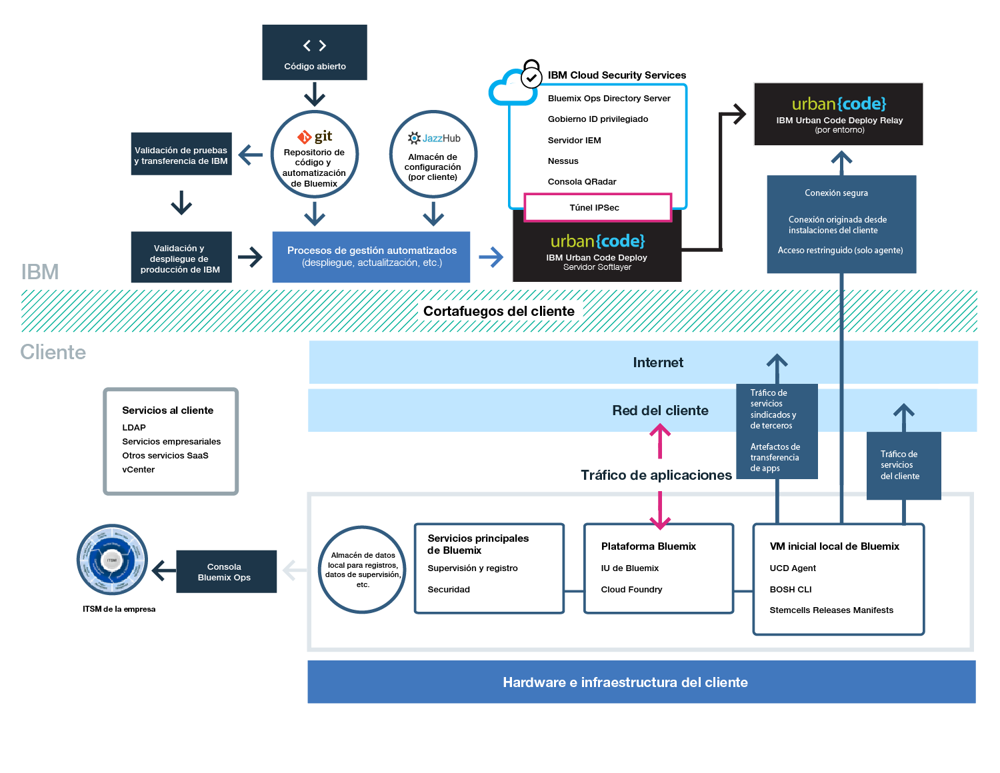

{:new_window: target="_blank"}
{:shortdesc: .shortdesc}

#{{site.data.keyword.Bluemix_notm}} Local
{: #local}
*Última actualización: 20 de octubre de 2015*

{{site.data.keyword.Bluemix}} local proporciona la potencia y la agilidad de la plataforma basada en nubes de {{site.data.keyword.Bluemix_notm}} para el centro de datos. Con {{site.data.keyword.Bluemix_notm}} local, puede proteger las cargas de trabajo más sensibles detrás del cortafuegos de la empresa, mientras que permanecen conectadas de forma segura y en sincronización con {{site.data.keyword.Bluemix_notm}} público.
{:shortdesc}

IBM® utiliza operaciones de nube como un servicio para supervisar y mantener el entorno, de modo que puede centrarse en la construcción de aplicaciones y servicios que se ejecutan en la parte superior del entorno. IBM también maneja actualizaciones a la plataforma, de modo que puede centrarse en la empresa.

{{site.data.keyword.Bluemix_notm}} local incluye un catálogo privado y sindicado que muestra los servicios locales que están disponibles de forma exclusiva para el usuario. También incluye servicios adicionales sindicados disponibles que puede utilizar desde {{site.data.keyword.Bluemix_notm}} público.

{{site.data.keyword.Bluemix_notm}} local forma parte de una máquina virtual que está detrás del cortafuegos de la empresa, de forma que disponga de la infraestructura de nube de alto rendimiento y más segura. IBM instala, supervisa de forma remota y gestiona {{site.data.keyword.Bluemix_notm}} local en el centro de datos a través de la tecnología de relé de IBM.

El relé es una prestación de entrega que se incluye con {{site.data.keyword.Bluemix_notm}} local que habilita a IBM para entregar actualizaciones de forma automática y coherente a todos los despliegues locales, de forma que tenga siempre un sistema seguro, estable y actualizado. El relé consigue una conectividad segura mediante un túnel VPN y una SSL abierta y saliente que se origina a partir de la máquina virtual inicial utilizando certificados que son específicos para cada instancia de {{site.data.keyword.Bluemix_notm}} local. El tráfico en este túnel es automatización de Urban Code Deployer para servir y mantener la plataforma, los recursos de cálculo y los servicios para la instancia.

*Figura 1. Visión general detallada de {{site.data.keyword.Bluemix_notm}} local*

Los entornos de {{site.data.keyword.Bluemix_notm}} local tienen los mismos estándares de seguridad que {{site.data.keyword.Bluemix_notm}} público en términos de seguridad operativa. Proporcione el hardware y la infraestructura, que le proporciona control sobre la infraestructura y la seguridad física. El acceso de desarrollador a {{site.data.keyword.Bluemix_notm}} local está controlado por las políticas de LDAP, que puede configurar el equipo de {{site.data.keyword.Bluemix_notm}} al configurar el entorno. En el entorno local, utilizando la Consola de administración, puede gestionar los roles y permisos de usuarios.

{{site.data.keyword.Bluemix_notm}} local se suministra con todos los tiempos de ejecución de {{site.data.keyword.Bluemix_notm}} incluidos y a los 64 GB de memoria de cálculo.

Además, hay un conjunto de servicios disponibles para {{site.data.keyword.Bluemix_notm}} local.

| **Tipo** | **Nombre** | **Descripción** |    
|----------|----------|-----------------|
|Incluido | Tiempos de ejecución de {{site.data.keyword.Bluemix_notm}} | Utilice los tiempos de ejecución para que su app esté activa y en funcionamiento con rapidez, sin necesidad de configurar y gestionar las VM ni los sistemas operativos. Todos los tiempos de ejecución de {{site.data.keyword.Bluemix_notm}} están disponibles para utilizarlos en la instancia de {{site.data.keyword.Bluemix_notm}} local.|
|Incluido | {{site.data.keyword.autoscaling}}| Aumente o reduzca de forma dinámica la capacidad de cálculo de la aplicación en función de políticas. Con este servicio, dispone de un uso ilimitado del entorno de {{site.data.keyword.Bluemix}} local.|
|Opcional |{{site.data.keyword.datacshort}}| Este servicio proporciona una cuadrícula de datos en memoria que da soporte a casos de ejemplo de memoria caché distribuidos para las apps. Incluye 50 GB de memoria caché en memoria. |
|Opcional | {{site.data.keyword.APIM}} | Utilice el servicio de {{site.data.keyword.APIMfull}}
para componer, gestionar y socializar API. Puede importar API con recursos utilizando un URL de proxy o ensamblando datos de fuentes de datos HTTP. La ventaja de utilizar el servicio de {{site.data.keyword.APIM}} es que puede gestionar cómo se utilizan las API. |

*Tabla 1. Servicios locales*

##Configuración de la instancia de {{site.data.keyword.Bluemix_notm}} local
{: #setuplocal}

{{site.data.keyword.Bluemix_notm}} local se ha diseñado para proporcionar una versión privada del producto {{site.data.keyword.Bluemix_notm}} público alojado en su propio hardware, gestionado por el usuario. Puede utilizar servicios y tiempos de ejecución de {{site.data.keyword.Bluemix_notm}} para satisfacer sus necesidades de cálculo en un entorno de nube seguro, alojado por el cliente y gestionado.

IBM le proporciona acceso a {{site.data.keyword.Bluemix_notm}} local mediante un inicio de sesión protegido por contraseña. Puede acceder a los servicios, tiempos de ejecución y recursos asociados, y desplegar y eliminar apps {{site.data.keyword.Bluemix_notm}}. Revise los pasos siguientes para trabajar con el representante de IBM para configurar la instancia local de {{site.data.keyword.Bluemix_notm}}.

Para configurar su versión privada de {{site.data.keyword.Bluemix_notm}}:

<ol>
<li>Revise los requisitos de infraestructura de <a href="index.html#localinfra">{{site.data.keyword.Bluemix_notm}} local</a> para configurar la instancia local.</li>
<li>Póngase en contacto con el representante designado de la cuenta de IBM o con el equipo de <a href="https://console.ng.bluemix.net/?direct=classic/#/contactUs/cloudOEPaneId=contactUs" target="_blank">{{site.data.keyword.Bluemix_notm}}</a> para empezar a trabajar.</li>
<li>Establezca su acuerdo de {{site.data.keyword.Bluemix_notm}} local con IBM, que incluye fechas de objetivo de entrega.
<ol type="a">
	<li>Trabaje con IBM, a cargo del cliente, para configurar la instancia de {{site.data.keyword.Bluemix_notm}} local. El cargo mensual se basa en los servicios locales que desee utilizar, más una suscripción a todos los servicios públicos de {{site.data.keyword.Bluemix_notm}}. Recibirá una factura por todo lo que utilice por encima del acuerdo de suscripción.</li>
	<li>Identifique los plazos límite para cada fase de la configuración de la instancia de {{site.data.keyword.Bluemix_notm}} local.</li>
	</ol>
	</li>
<li>Una vez que se cree la plataforma y la cuenta, identifique las personas de la organización para los roles necesarios para configurar y activar la instancia local. Para cada rol hay un representante de IBM correspondiente. 

Roles del cliente:

<dl>
<dt>**Contacto de suministro**</dt>
<dd>Trabaja con el representante de IBM en el establecimiento del entorno de {{site.data.keyword.Bluemix_notm}} local, incluida la identificación de las personas adecuadas de la organización que trabajarán en cualquier aspecto del proyecto. Este rol supervisa la selección del patrón, las formas comerciales y la disposición de acceso a los recursos del cliente. El contacto de suministro es el contacto general para configurar la instancia local.</dd>
<dt>**Responsable de suministro**</dt>
<dd>Trabaja con el representante de IBM para seleccionar una topología y opción de despliegue que se ajuste a sus requisitos de seguridad. Este rol funciona con el asesor de suministro de IBM para determinar qué patrones de despliegue consiguen los objetivos y las metas de conformidad.</dd>
<dt>**Especialista de red**</dt>
<dd>Trabaja con el representante de IBM en los planes de red para el despliegue de {{site.data.keyword.Bluemix_notm}}. Este rol proporciona los requisitos al representante de IBM y trabaja con él en un plan de implementación. Al final de la fase de instalación y de verificación, este rol "concluirá" que la configuración de red está en conformidad con los estándares corporativos.</dd>
<dt>**Contacto de DevOps**</dt>
<dd>Trabaja con el representante de IBM para planificar y aplicar las actualizaciones de mantenimiento necesarias para la plataforma, servicios y tiempos de ejecución de {{site.data.keyword.Bluemix_notm}}. Este rol también trabaja con el representante de IBM en la configuración de la instancia de {{site.data.keyword.Bluemix_notm}} local.</dd>
</dl>

Roles de IBM:

<dl>
<dt>**Gestor de suministro de IBM**</dt>
<dd>Trabaja con el contacto de suministro del cliente para establecer el entorno del cliente.</dd>
<dt>**Asesor de conformidad de IBM**</dt>
<dd>Trabaja con el representante de conformidad de cliente para seleccionar una topología y una opción de despliegue que cumpla los requisitos de seguridad.</dd>
<dt>**Especialista de red de IBM**</dt>
<dd>Trabaja con el especialista de red de cliente para establecer los planes de red para el despliegue. Este rol funciona con el cliente para recopilar requisitos y crear un plan de implementación. Este rol también realiza las pruebas automatizadas para verificar el resultado físico del plan de implementación.</dd>	
<dt>**Contacto de DevOps de IBM**</dt>
<dd>Trabaja con el contacto de DevOps del cliente en la instalación y en el mantenimiento en curso de la topología de despliegue. Este rol funciona con el cliente para planificar y llevar a cabo las actualizaciones necesarias para la plataforma y los servicios.</dd>
</dl>
</li>
<li>El usuario proporciona el hardware, e IBM le ayuda a definir y a establecer la conectividad de red entre su red corporativa y la instancia de {{site.data.keyword.Bluemix_notm}} local. Para obtener más información sobre los requisitos de la infraestructura, consulte requisitos de la infraestructura de <a href="index.html#localinfra">{{site.data.keyword.Bluemix_notm}} local</a>.
<ol type="a">
	<li>IBM configura el acceso a la red y LDAP en función de lo que proporcione el usuario. Se ofrece acceso de administración a los contactos que designe el cliente. También debe designar un contacto para soporte y facturación. </li>
	<li>IBM configura un catálogo sindicado en el entorno local para mostrar los servicios locales y muchos de los servicios públicos de {{site.data.keyword.Bluemix_notm}}.</li>
	<li>El cliente debe validar la configuración de la red y del cortafuegos, además del punto final LDAP y el acceso.</li>
	</ol>
</li>
</ol>
	
##Requisitos de infraestructura de {{site.data.keyword.Bluemix_notm}} local
{: #localinfra}

En {{site.data.keyword.Bluemix_notm}} local, usted es
el propietario de la seguridad física y de la infraestructura para alojar la instancia local. IBM establece los siguientes requisitos para configurar {{site.data.keyword.Bluemix_notm}} local.
###Hardware
Aunque hay requisitos para el tipo y el tamaño del hardware disponible, puede elegir cualquier
combinación que cumpla los requisitos totales de los recursos definidos.
<dl>
<dt>**Hardware VMware ESXi**</dt>
<dd>
ESXi es una capa de virtualización que se ejecuta en servidores físicos y que abstrae el procesador,
la memoria, el almacenamiento y los recursos en varias máquinas virtuales. Elija cualquier combinación que cumpla los siguientes totales de recursos, con la condición de que el recuento mínimo de núcleos físicos por ESXi sea ocho. Las siguientes especificaciones son sólo para el tiempo de ejecución de núcleo de {{site.data.keyword.Bluemix_notm}}.
<ul>
<li>48 núcleos físicos a 2,0 de más GHz cada uno</li>
<li>756 GB de memoria RAM física</li>
</li>Tamaño total de almacenes de datos: 7,5 TB
<ul>
<li>7 TB de almacén de datos para alojar {{site.data.keyword.Bluemix_notm}}</li>
<li>500 GB de almacén de datos para alojar la máquina virtual inicial</li>
</ul>
</ul>

<strong>Nota:</strong> Si utiliza varios almacenes de datos, utilice el mismo prefijo para cada uno de ellos.

</dd>
<dt>**Alta disponibilidad**</dt>
<dd>
Para poder dar soporte a un solo error de nodo debe tener n+1 ESXi. Por ejemplo, si se utilizan dos ESXi (es decir, 16x núcleos cada uno), se necesita un tercero.
<strong>Nota:</strong> El administrador de VMware del cliente puede optar por aplicar
una migración tras error estricta de alta disponibilidad en el clúster para garantizar los recursos.

</dd>
<dt>**Red**</dt>
<dd>
Entre los requisitos recomendados se incluye un grupo de puertos accesibles para el cliente con 10 direcciones IP de red del cliente
que tengan acceso saliente a Internet. A continuación, defina una segunda VLAN privada solo entre los ESXi utilizados para {{site.data.keyword.Bluemix_notm}} local.
Esta VLAN se muestra como un grupo de puertos en VMware. {{site.data.keyword.Bluemix_notm}} local lo utiliza para la subred privada,
que es más segura y puede ayudar a evitar problemas de direccionamiento.</dd>
</dl>

###Configuración de servidor de vCenter
Revise los siguientes requisitos relacionados con la versión, el centro de datos, la agrupación de recursos y el almacén de datos.
<dl>
<dt>**Versiones soportadas de VMware**</dt>
<dd>vCenter y ESXi 5.1 y 5.5</dd>
<dt>**Centro de datos**</dt>
<dd>Cree un centro de datos (si no hay ninguno).</dd>
<dt>**Carpeta del centro de datos**</dt>
<dd>Cree una carpeta de la máquina virtual con el mismo nombre que el clúster si no tiene pensado otorgar un acceso de administrador
que se propague desde el centro de datos.</dd>
<dt>**Clúster**</dt>
<dd>Cree un clúster específicamente para {{site.data.keyword.Bluemix_notm}} local. Un ejemplo del nombre del clúster sería `bluemix`.</dd>
<dt>**Agrupación de recursos**</dt>
<dd>Cree una agrupación de recursos en el clúster de {{site.data.keyword.Bluemix_notm}} local. Un ejemplo del nombre de la agrupación de recursos sería `local`.</dd>
</dt>**Almacenes de datos**</dt>
<dd>Requiere 7,5 TB para el despliegue inicial de {{site.data.keyword.Bluemix_notm}}. 
 
**Nota**: Si utiliza más de un
almacén de datos, asegúrese de que todos ellos empiezan con el mismo prefijo. Un ejemplo de varios nombres de almacén de datos
con el mismo prefijo sería `almacén_datos_bluemix_01` y `almacén_datos_bluemix_02`.</dd>
</dl>

###Ancho de banda de red
El rendimiento recomendado es de 5 Mbps de subida y de 5 Mbps de bajada; puede esperar
un uso de datos mensual de 10 GB. IBM establece
ventanas acordadas cuando se entregan paquetes de datos grandes, que pueden tener un tamaño de 3 GB.
###Permisos de VMware
Establezca los siguientes roles y permisos. La propagación se establece
para cada permiso. Si el permiso se propaga, pasa por la jerarquía de objetos. Sin embargo, los permisos de un objeto hijo siempre sustituyen los permisos que se propagan desde un objeto padre.
<dl>
<dt>**vCenter Server**</dt>
<dd>Establezca el rol como de solo lectura y propagado. 
 
**Nota**: Este rol es necesario para recuperar estados de tareas de determinadas operaciones de disco.</dd>
<dt>**Centro de datos**</dt>
<dd>Cree el rol "{{site.data.keyword.Bluemix_notm}}" y otorgue permisos para **Almacén de datos** (como **Operaciones de archivos de nivel bajo** y **Actualizar archivos de la máquina virtual**). 
 
**Nota**: Este rol es necesario para poder dar soporte a las publicaciones de archivos en los almacenes de datos.</dd>
<dt>**Clúster**</dt>
<dd>Establezca el rol como administrador y propagado.</dd>
<dt>**Almacenes de datos**</dt>
<dd>Establezca el rol administrador y propagado para cada almacén de datos de {{site.data.keyword.Bluemix_notm}}.</dd>
<dt>**Red**</dt>
<dd>Establezca grupos de puertos públicos y privados con el rol de administrador, no con el rol propagado.</dd>
</dl>

###Agrupación de agentes de ejecución de gotas (DEA)
Cada DEA está configurado con:
- 16 - 32 GB de RAM
- 2x - 4x vCPU
- 150 - 300 GB de almacenamiento

Por ejemplo, si el tamaño de host ESXi es de 256 GB de memoria con 16x núcleos, se añaden ocho DEA. Si el tamaño de host ESXi es de 64 GB de memoria con 8x núcleos, se deben añadir dos ESXi y cuatro DEA. Se necesita 1,5 TB más de almacenamiento para cada cuatro DEA. Este ejemplo se basa en un DEA configurado con 32 GB de RAM, 4x vCPU y 300 GB de almacenamiento.

##Mantenimiento de la instancia local
{: #maintainlocal}

IBM mantiene e instala actualizaciones y arreglos como cambios de IBM adecuados para la plataforma, los tiempos de ejecución y los servicios de Bluemix local. Es posible que los servicios no estén disponibles durante las ventanas de mantenimiento.

**Importante**: IBM se reserva el derecho de interrumpir servicios para aplicar mantenimiento emergencia si es necesario. IBM puede modificar las horas de mantenimiento planificadas, pero le notificará de cualquier cambio, así como la información de mantenimiento de emergencia.

Se requieren los siguientes tipos de mantenimiento para {{site.data.keyword.Bluemix_notm}} local:
<dl>
<dt>**Ventanas de mantenimiento estándar**</dt>
<dd>Los servicios utilizan ventanas de mantenimiento estándar y predefinidas, lo cual podría hacer que los servicios no estén disponibles. IBM no requiere aprobación del cliente para realizar el mantenimiento, pero intenta minimizar el impacto en los servicios. 
 
IBM envía mensajes de difusión general de los cambios planificados para cada ventana de mantenimiento, por correo electrónico, por teléfono o mediante otros métodos. 
 
**Importante**: Es posible que algún servicio no esté disponible durante el periodo de mantenimiento.</dd>

<dt>**Ventana de cambio mensual**</dt>
<dd>La ventana de mantenimiento mensual se aplica en función de la coordinación entre el usuario y IBM dentro de una ventana de 21 días. Puede proporcionar a IBM horas o fechas específicas dentro de la ventana de 21 días que puede que no funcionen para el usuario. IBM intenta planificar actualizaciones alrededor de esas horas. En función de las solicitudes, IBM se comunicará con la ventana de mantenimiento planificada. No se espera que las ventanas de cambio mensual produzcan un impacto en la ejecución del entorno de Bluemix local. 
 
**Nota**: Si no solicita una hora específica para la actualización, se aplicará automáticamente el mantenimiento al final de la ventana. 
 
Vaya a **ADMINISTRACIÓN > INFORMACIÓN DEL SISTEMA** para ver las actualizaciones pendientes, establecer fechas no disponibles y aprobar actualizaciones. Para obtener más información sobre las notificaciones y la planificación de actualizaciones pendientes, consulte <a href="../admin/index.html#oc_system">Visualización de información del sistema</a>.</dd>

<dt>**Otro**</dt>
<dd>IBM intenta limitar todo el mantenimiento que pueda afectar a los servicios, en particular a la disponibilidad del entorno, los tiempos de ejecución y los servicios de Bluemix local, a las ventanas estándares y mensuales. Es posible que, de forma excepcional, se utilicen otras ventanas de cambios para la gestión del entorno. IBM hará todo lo posible para minimizar el impacto en su entorno durante estas ventanas de cambios y se lo notificará por adelantado. </dd>
</dl>

Para configurar el mantenimiento de la instancia local, póngase en contacto con el representante designado de su cuenta de IBM para identificar una ventana acordada para el mantenimiento estándar.
   
