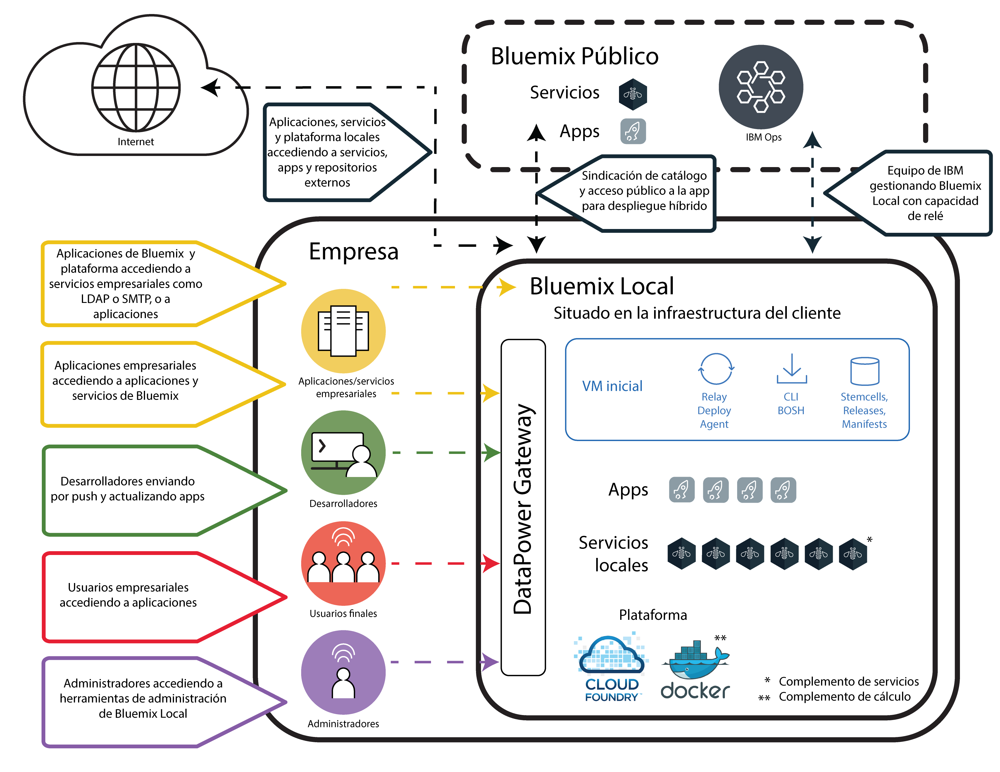
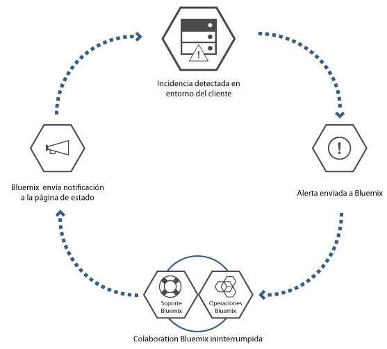

---

copyright:

  years: 2015, 2017

lastupdated: "2017-04-11"

---

{:new_window: target="_blank"}
{:shortdesc: .shortdesc}

# {{site.data.keyword.Bluemix_local_notm}}
{: #local}

{{site.data.keyword.Bluemix_local}} proporciona la potencia y la agilidad de la plataforma basada en nubes de {{site.data.keyword.Bluemix_notm}} para el centro de datos. Con {{site.data.keyword.Bluemix_local_notm}}, puede proteger las cargas de trabajo más sensibles detrás del cortafuegos de la empresa, mientras que permanecen conectadas de forma segura y en sincronización con {{site.data.keyword.Bluemix_notm}} público.
{:shortdesc}

IBM® utiliza operaciones de nube como un servicio para supervisar y mantener el entorno, de modo que puede centrarse en la construcción de apps y servicios que se ejecutan en la parte superior del entorno. {{site.data.keyword.IBM_notm}} también maneja actualizaciones a la plataforma, de modo que puede centrarse en la empresa.

Los entornos de {{site.data.keyword.Bluemix_local_notm}} tienen los mismos estándares de seguridad que {{site.data.keyword.Bluemix_notm}} público en términos de seguridad operativa. Proporcione el hardware y la infraestructura, que le proporciona control sobre la infraestructura y la [seguridad](/docs/security/index.html#localplatformsecurity) física. El acceso de desarrollador al entorno de {{site.data.keyword.Bluemix_notm}} local está controlado por las políticas de LDAP, que puede configurar el equipo de {{site.data.keyword.Bluemix_notm}} al configurar el entorno. En el entorno local, utilizando la página de administración, puede [gestionar usuarios y permisos](/docs/admin/index.html#oc_useradmin).

{{site.data.keyword.Bluemix_local_notm}} se suministra con todos los tiempos de ejecución de {{site.data.keyword.Bluemix_notm}} incluidos y a los 64 GB de memoria de cálculo.

Además, hay un conjunto de servicios que están disponibles como servicios de {{site.data.keyword.Bluemix_local_notm}}. Revise la tabla siguiente para ver lo que se incluye y qué hay disponible para comprar.

| **Tipo** | **Nombre** | **Descripción** |
|----------|----------|-----------------|
|Incluido | [Tiempos de ejecución de {{site.data.keyword.Bluemix_notm}}](/docs/cfapps/runtimes.html) | Utilice los tiempos de ejecución para que su app esté activa y en funcionamiento con rapidez, sin necesidad de configurar y gestionar las máquinas ni los sistemas operativos. Todos los tiempos de ejecución de {{site.data.keyword.Bluemix_notm}} están disponibles para utilizarlos en la instancia de {{site.data.keyword.Bluemix_notm}} local.|
|Incluido | [{{site.data.keyword.autoscaling}}](/docs/services/Auto-Scaling/index.html)| Aumente o reduzca de forma dinámica la capacidad de cálculo de la app en función de políticas. Con este servicio, dispone de un uso ilimitado del entorno de {{site.data.keyword.Bluemix}} local.|
|Opcional | [{{site.data.keyword.apiconnect_short}}](/docs/services/apiconnect/index.html) | {{site.data.keyword.apiconnect_long}} integra {{site.data.keyword.APIM}} e IBM StrongLoop en una única oferta que proporciona una solución completa para crear, ejecutar gestionar e imponer API y microservicios. |
|Opcional | [{{site.data.keyword.containershort}}](/docs/containers/container_index.html) | Ejecutar contenedores de Docker en {{site.data.keyword.Bluemix_notm}} local. Los contenedores son objetos de software virtuales que incluyen todos los elementos que una app necesita para ejecutarse. Un contenedor tiene las ventajas del aislamiento y asignación de recursos, pero es más portable y eficiente que, por ejemplo, una máquina virtual. Para obtener información sobre los requisitos de hardware, consulte [IBM {{site.data.keyword.containershort}} en {{site.data.keyword.Bluemix_notm}} Dedicado y Bluemix Local](/docs/containers/container_ov.html#container_dl). |
|Opcional | [{{site.data.keyword.datacshort}}](/docs/services/DataCache/index.html#data_cache) | Este servicio proporciona una cuadrícula de datos en memoria que da soporte a casos de ejemplo de memoria caché distribuidos para las apps. Incluye 50 GB de memoria caché en memoria. |
| Opcional (Beta) | [Registro](/docs/monitoringandlogging/cfapps_ml_logs_dedicated_ov.html#container_ml_logs_dedicated_ov) | Proporciona registros para las apps de Cloud Foundry en la interfaz de usuario de {{site.data.keyword.Bluemix_notm}} y registros y paneles de control en los que pueden realizarse búsquedas en Kibana. |
|Opcional | [{{site.data.keyword.mobilepush}}](/docs/services/mobilepush/index.html) | {{site.data.keyword.mobilepush}} es un servicio que puede utilizar para enviar notificaciones a un dispositivo iOS y Android. Las notificaciones pueden dirigirse a todos los usuarios de aplicaciones o a un conjunto específico de usuarios y dispositivos utilizando etiquetas. Puede administrar dispositivos, etiquetas y suscripciones. También puede utilizar un kit de desarrollo de software (SDK) y una interfaz de programa de aplicación (API) de aplicación REST (Representational State Transfer) para seguir desarrollando las aplicaciones cliente. |
|Opcional | [{{site.data.keyword.sescashort}}](/docs/services/SessionCache/index.html#session_cache) | Para una mayor redundancia, {{site.data.keyword.sescashort}} proporciona una réplica de una sesión almacenada en la memoria caché. Por lo tanto en el caso de una caída de la red o una interrupción, la aplicación cliente mantiene el acceso a la sesión en la memoria caché. El servicio da soporte a casos de ejemplo de almacenamiento en caché de sesión para aplicaciones web y para móvil. |
|Opcional | [{{site.data.keyword.iot_short}}](/docs/services/IoT/index.html) | Este servicio permite a las apps comunicarse y consumir datos recopilados por los dispositivos, sensores y pasarelas conectados. La oferta de base local incluye un entorno inicial que permite la ejecución de una versión privada de IBM {{site.data.keyword.iot_short}} dentro del entorno local con una capacidad de 100.000 aplicaciones o dispositivos conectados simultáneamente y 1,6 TB de intercambio de datos. |
{: caption="Tabla 1. Tiempos de ejecución y servicios locales" caption-side="top"}
{: #table01}

Hay componentes opcionales que se pueden adquirir para escalar y ampliar la capacidad de los recursos y servicios. Puede adquirir cualquiera de estos componentes poniéndose en contacto con el equipo de ventas de; vaya a [Póngase en contacto con nosotros](https://console.ng.bluemix.net/?direct=classic/#/contactUs/cloudOEPaneId=contactUs) para obtener información acerca de cómo ponerse en contacto con un representante de ventas. Para aumentar el plan para un servicio, puede seleccionar el plan en el mosaico del servicio del catálogo.

| **Nombre** | **Descripción** |
|----------|-----------------|
|{{site.data.keyword.Bluemix_notm}} 5 millones de llamadas de API de {{site.data.keyword.apiconnect_short}} Professional local | Un entorno que permite ejecutar una versión privada de {{site.data.keyword.apiconnect_short}} con una capacidad para 5 millones de llamadas de API al mes destinadas a proyectos de API de departamento. |
|{{site.data.keyword.Bluemix_notm}} Aumento de 100 mil llamadas de API de {{site.data.keyword.apiconnect_short}} Professional local| Una extensión del entorno {{site.data.keyword.apiconnect_short}} Professional para proporcionar una capacidad adicional de 100 mil llamadas de API al mes. |
|{{site.data.keyword.Bluemix_notm}} 25 millones de llamadas de API de {{site.data.keyword.apiconnect_short}} Enterprise local | Un entorno que permite ejecutar una versión privada de {{site.data.keyword.apiconnect_short}} con una capacidad para 25 millones de llamadas de API al mes destinadas a proyectos de API. |
|{{site.data.keyword.Bluemix_notm}} Aumento de 100 mil llamadas de API de {{site.data.keyword.apiconnect_short}} Enterprise local | Una extensión del entorno {{site.data.keyword.apiconnect_short}} Enterprise para proporcionar una capacidad adicional de 100 mil llamadas de API al mes. |
|Aumento de capacidad de 50 GB de Datos y Sesión de {{site.data.keyword.Bluemix_notm}} | Entorno que permite desplegar y ejecutar instancias de caché de datos y caché de sesión hasta una capacidad acumulativa de 50 GB. |
|Aumento incremental de {{site.data.keyword.Bluemix_notm}} {{site.data.keyword.iot_short}} local | Un entorno adicional para la oferta de servicio base de {{site.data.keyword.iot_short}} local que permite ejecutar una versión privada de {{site.data.keyword.iot_short}} dentro del entorno local con una capacidad de 100.000 aplicaciones o dispositivos conectados simultáneamente y 0,5 TB de intercambio de datos. |
|Instancia de complemento de {{site.data.keyword.IBM_notm}} {{site.data.keyword.mobilepush}} Local | Un entorno que permite el despliegue y la ejecución de instancias de {{site.data.keyword.mobilepush}} con capacidad para aceptar 300 solicitudes adicionales por segundo. |
{: caption="Tabla 2. Componentes de servicio opcionales para su compra" caption-side="top"}
{: #table02}

| **Nombre** | **Descripción** |
|----------|-----------------|
|Capacidad de 64 GB de los tiempos de ejecución de Local Cloud Foundry  | Entorno de tiempos de ejecución de Cloud Foundry con 64 GB de capacidad de tiempo de ejecución. |
|Aumento de la capacidad de 16 GB de los tiempos de ejecución de Local Cloud Foundry  | Extensión del entorno de tiempos de ejecución de Cloud Foundry para proporcionar 16 GB adicionales de capacidad de tiempo de ejecución. |
|Aumento de capacidad de 16 GB de {{site.data.keyword.containerlong}} local  | Extensión del entorno de {{site.data.keyword.containerlong}} para proporcionar 16 GB adicionales de capacidad. |
|Capacidad local de 64 GB de {{site.data.keyword.containerlong}}  | Entorno de {{site.data.keyword.containerlong}} con 64 GB de capacidad. |
{: caption="Tabla 3. Componentes de complemento de plataforma opcionales para su compra" caption-side="top"}
{: #table03}

**Nota**: Los componentes de {{site.data.keyword.Bluemix_notm}} local pueden iniciar una capacidad configurada específica, como gigabytes o transacciones por segundo. Dado que la capacidad actual en la práctica para cualquier configuración del servicio de nube varía en función de muchos factores, la capacidad real en la práctica puede ser superior o inferior a la capacidad configurada.

### Catálogo sindicado
{: #cataloglocal}

{{site.data.keyword.Bluemix_local_notm}} incluye un catálogo privado que aúna servicios aprobados de los despliegues públicos y locales. Incluso puede publicar y gestionar el acceso a sus propios servicios a través del catálogo de {{site.data.keyword.Bluemix_notm}}. Tiene la opción de decidir qué servicios públicos cumplen los requisitos de su empresa en función de sus criterios de privacidad de datos y de seguridad.

Si es una instancia privada de un servicio de {{site.data.keyword.Bluemix_notm}} para el entorno local, verá una etiqueta "Local" con los nombres del servicio en la vista de administración del catálogo. De forma parecida, si es un servicio personalizado (es decir, para cuya creación se ha utilizado un intermediario de servicio) verá "Personalizado" listado con el nombre del servicio. El resto de servicios listados que no incluyen la etiqueta "local" o "personalizado" están disponibles mediante la sindicación desde {{site.data.keyword.Bluemix_notm}} público. Los servicios sindicados proporcionan la función para crear aplicaciones híbridas que constan de servicios públicos o privados.

|Servicio	|Disponible en la región EE.UU. sur	|Disponible en la región Europa Reino Unido |Disponible en la región Australiana Sídney|
|:----------|:------------------------------|:------------------|:------------------|
|{{site.data.keyword.alchemyapishort}} 		|Sí	   	|Sí  		|Sí|
|{{site.data.keyword.alertnotificationshort}}	|Sí		|Sí		|Sí	|
|{{site.data.keyword.apiconnect_short}}         |Sí            |Sí            |Sí  |
|{{site.data.keyword.appseccloudshort}}		|Sí		|Sí		|Sí |
|{{site.data.keyword.apiconnect_short}} 	|Sí   	 	|Sí  	 	|Sí   |
|Comprobador de accesibilidad automatizado |Sí       |Sí    |Sí   |
|{{site.data.keyword.rules_short}}		|Sí		|Sí		|Sí |
|{{site.data.keyword.iotmapinsights_short}}    |Sí  |Sí  |Sí  |
|{{site.data.keyword.conversationshort}}  |Sí  |Sí  |Sí  |
|{{site.data.keyword.dashdbshort}}		|Sí		|Sí		|Sí |
|{{site.data.keyword.dataworks_short}}		|Sí		|Sí		|No|
|{{site.data.keyword.DB2OnCloud_short}}		|Sí		|Sí		|Sí |
|Comprobador de contenido digital |Sí  |Sí  |Sí  |
|{{site.data.keyword.documentconversionshort}}	|Sí		|Sí		|Sí|
|{{site.data.keyword.iotdriverinsights_short}}  |Sí |Sí  |Sí  |
|{{site.data.keyword.geospatialshort_Geospatial}}	|Sí	|Sí		|Sí |
|{{site.data.keyword.GlobalizationPipeline_short}}	|Sí		| Sí		| Sí |
|{{site.data.keyword.identitymixershort}}		|Sí		|Sí		|Sí|
|{{site.data.keyword.iot4auto_short}} |Sí   |Sí  |Sí  |
|{{site.data.keyword.iotelectronics}}  |Sí  |Sí  |No |
|{{site.data.keyword.iotinsurance_short}} |No   |No   |Sí  |
|{{site.data.keyword.twittershort}}		|Sí		|Sí		|Sí|
|{{site.data.keyword.languagetranslationshort}}	|Sí		|Sí		|Sí |
|{{site.data.keyword.languagetranslatorshort}} |Sí  |Sí  |Sí  |
|{{site.data.keyword.dwl_short}}  |Sí  |Sí  |No  |
|{{site.data.keyword.eventhubshort}}		|Sí		|No		|No|
|{{site.data.keyword.messagehub}}		|Sí		|Sí		|No|
|{{site.data.keyword.manda}}			|Sí		|Sí		|Sí |
|{{site.data.keyword.amashort}}			|Sí		|Sí		|Sí |
|{{site.data.keyword.mqa}}			|Sí		|Sí		|Sí |
|{{site.data.keyword.mql}}			|No		|No		|Sí |
|{{site.data.keyword.nlclassifierlshort}} 	|Sí 		|Sí 		|Sí|
|{{site.data.keyword.personalityinsightsshort}}	|Sí		|Sí		|Sí|
|{{site.data.keyword.pm_short}}			|Sí		|Sí		|No |
|{{site.data.keyword.mobilepush}}		|Sí		|Sí		|Sí |
|{{site.data.keyword.retrieveandrankshort}}	|Sí 		|Sí 		|Sí|
|{{site.data.keyword.runbook_short}}		|Sí		|Sí		|Sí|
|{{site.data.keyword.SecureGateway}}		|Sí		|Sí		|Sí |
|{{site.data.keyword.ssofull}}			|Sí		|No		|No|
|{{site.data.keyword.speechtotextshort}}	|Sí 		|Sí	 	|Sí|
|{{site.data.keyword.streaminganalyticsshort}}	|Sí		|Sí		|Sí |
|{{site.data.keyword.texttospeechshort}} 	|Sí 		|Sí	 	|Sí|
|{{site.data.keyword.toneanalyzershort}} 	|Sí 		|Sí 		|Sí|
|{{site.data.keyword.tradeoffanalyticsshort}}	|Sí		|Sí		|Sí|
|{{site.data.keyword.visualrecognitionshort}}	|Sí 		|Sí	 	|Sí|
|{{site.data.keyword.iot_short}}		|Sí		|Sí		|No|
|{{site.data.keyword.weather_short}}		|Sí		|Sí		|Sí|
|{{site.data.keyword.workloadscheduler}}	|Sí		|Sí		|Sí |
{: caption="Tabla 4. Servicios disponibles para su sindicación desde Bluemix Public por región" caption-side="top"}
{: #table04}

**Nota**: Los servicios de terceros no están incluidos en la tabla. Compruebe el catálogo para opciones de servicio de terceros.

## Arquitectura de {{site.data.keyword.Bluemix_local_notm}}
{: #localarch}

{{site.data.keyword.Bluemix_local_notm}} forma parte de una infraestructura virtualizada que está detrás del cortafuegos de la empresa, lo que le permite disponer de la infraestructura de nube de alto rendimiento y más segura. {{site.data.keyword.IBM_notm}} instala, supervisa de forma remota y gestiona
{{site.data.keyword.Bluemix_local_notm}} en su centro de datos gracias a la tecnología [Relay](#localrelay) de {{site.data.keyword.IBM_notm}}. La arquitectura lógica de [Figure 1](#figure01) describe cómo {{site.data.keyword.Bluemix_notm}} configura el entorno local y cómo {{site.data.keyword.IBM_notm}} mantiene la instancia local:

 

Figura 1. Arquitectura de {{site.data.keyword.Bluemix_local_notm}}
{: #figure01}

La máquina virtual inicial (VM inicial) se ejecuta en la infraestructura virtualizada de la empresa detrás del cortafuegos de la empresa. La VM inicial crea una conexión de red de salida con el centro de operaciones de {{site.data.keyword.IBM_notm}} a través de la tecnología de relé de {{site.data.keyword.IBM_notm}}. La tecnología de relé realiza varias funciones que se describen en la siguiente sección [Relay (Relé)](#localrelay).

Los componentes de la plataforma de {{site.data.keyword.Bluemix_notm}} y las funciones principales que dan soporte a los componentes de la plataforma, se ejecutan en una red de área local virtual aislada y privada (VLAN). {{site.data.keyword.Bluemix_local_notm}} utiliza una VLAN para la subred privada. El uso de una subred privada en lugar de una VLAN pública es más seguro y puede ayudar a evitar problemas de direccionamiento. El conjunto de funciones centrales que dan soporte
a la plataforma son:

<dl>
<dt>Plataforma</dt>
<dd>Como mínimo, la plataforma consta de componentes de Cloud Foundry y de algunos servicios de aplicaciones locales. {{site.data.keyword.Bluemix_notm}} proporciona entornos de cálculo basados en Cloud Foundry y en {{site.data.keyword.containerlong}}. Una empresa puede tener configurado uno de estos entornos de cálculo o ambos. 
Una empresa también puede tener servicios de aplicaciones locales adicionales. 

Consulte [Componentes opcionales para su adquisición: Complementos de servicio](#table02) y [Componentes opcionales para su adquisición: Componentes de plataforma](#table03) para ver los servicios y las funciones de cálculo que se pueden añadir.

</dd>
<dt>{{site.data.keyword.Bluemix_notm}} público</dt>
<dd>
Un entorno de {{site.data.keyword.Bluemix_local_notm}} puede tener una conexión de salida con una región pública de {{site.data.keyword.Bluemix_notm}}. Una conexión con una región pública habilita la sindicación de servicios públicos en el catálogo local. La sindicación del servicio {{site.data.keyword.Bluemix_notm}} público ofrece a los desarrolladores un método práctico para crear aplicaciones alojadas en el entorno {{site.data.keyword.Bluemix_local_notm}} de la empresa, así como para acceder a los servicios que se ejecutan en {{site.data.keyword.Bluemix_notm}} público. Consulte la lista de servicios de {{site.data.keyword.IBM_notm}} que se pueden sindicar desde {{site.data.keyword.Bluemix_notm}} público en la sección [Catálogo sindicado](#cataloglocal).
</dd>
<dt>{{site.data.keyword.IBM_notm}} Operations</dt>
<dd>
{{site.data.keyword.IBM_notm}} gestiona, supervisa y mantiene la plataforma local y los servicios locales, de modo que pueda centrarse en la creación de aplicaciones innovadores. El equipo de Servicios de soporte de operaciones (OSS) de {{site.data.keyword.IBM_notm}} lleva a cabo operaciones utilizando una conexión de túnel VPN entre la VM inicial y la red de {{site.data.keyword.IBM_notm}} Operations.
</dd>
<dt>Empresa</dt>
<dd>
El entorno de red de la empresa tiene un enlace de red bidireccional con {{site.data.keyword.Bluemix_local_notm}}. Esto permite que las aplicaciones alojadas en {{site.data.keyword.Bluemix_local_notm}} puedan acceder a los servicios y recursos de la empresa, incluidas fuentes de datos y servicios de empresa. El enlace de red también permite a {{site.data.keyword.Bluemix_local_notm}} utilizar su LDAP para la autenticación de desarrolladores y administradores.
</dd>
<dt>Servicios locales</dt>
<dd>Dispone de un conjunto de servicios que se utilizan de forma privada en el entorno {{site.data.keyword.Bluemix_local_notm}}. Normalmente, se deciden los servicios que se desea para el entorno antes del despliegue por parte del equipo de {{site.data.keyword.IBM_notm}}. Para obtener una lista de servicios disponibles, vaya al apartado sobre [Servicios y tiempos de ejecución locales](#table01).
</dd>
<dt>DataPower Gateway</dt>
<dd>
Los dispositivos {{site.data.keyword.IBM_notm}} DataPower Gateway proporcionan acceso a los dominios de aplicaciones de {{site.data.keyword.Bluemix_notm}}. Estos dispositivos se conectan a la red intranet y a la red privada de {{site.data.keyword.Bluemix_notm}}, proporcionando una pasarela segura al despliegue de {{site.data.keyword.Bluemix_notm}}. Los desarrolladores que despliegan apps y servicios obtienen acceso desde la intranet a través de la pasarela. Los usuarios de la aplicación obtienen acceso a través de los dispositivos DataPower, así como los administradores.
</dd>
<dt>Security intelligence</dt>
<dd>
{{site.data.keyword.IBM_notm}} utiliza la plataforma QRadar Security Intelligence para ofrecer una arquitectura unificada para mejorar diversos componentes clave. Estos componentes incluyen información de seguridad y gestión de sucesos,
gestión de registros, detección de anomalías, actividades forenses de incidencias y gestión de configuración y vulnerabilidades. {{site.data.keyword.Bluemix_notm}} también utiliza la información de seguridad de {{site.data.keyword.IBM_notm}} QRadar y la gestión de sucesos (SIEM) para supervisar acciones de usuarios
privilegiados y los intentos de inicio de sesión tanto correctos como incorrectos de los desarrolladores de aplicaciones. Los informes de
QRadar proporcionan al cliente visibilidad a través de la sección Informes y registros de la página Administración. Para obtener información sobre los informes de seguridad, consulte [Visualización de informes](/docs/admin/index.html#oc_report).

{{site.data.keyword.IBM_notm}} BigFix garantiza que los arreglos de los sistemas operativos se aplican con la frecuencia adecuada. El proceso de aplicación de parches está automatizado, y la planificación se acuerda entre usted e IBM. Para obtener información sobre el mantenimiento y actualizaciones, consulte
[Mantenimiento de su instancia local](index.html#maintainlocal).

</dd>
</dl>

Sus apps se despliegan dentro de contenedores virtuales que se ejecutan en máquinas virtuales de Cloud Foundry. Todos los componentes
de Cloud Foundry, como los controladores de nube, los gestores de estado, direccionadores y agentes de ejecución de droplet (DEA)
se despliegan cuando se configura {{site.data.keyword.Bluemix_notm}}. Los diversos componentes de gestión de {{site.data.keyword.Bluemix_notm}} también se incluyen en el despliegue de {{site.data.keyword.Bluemix_notm}}.

Para obtener más información sobre las especificaciones de red y los requisitos de infraestructura, consulte [Requisitos de la infraestructura de {{site.data.keyword.Bluemix_local_notm}}](/docs/local/index.html#localinfra).

### Relay (Relé)
{: #localrelay}

Relay es el enlace seguro entre la red de la empresa e {{site.data.keyword.IBM_notm}} Cloud Operations. El tráfico sobre la conexión relay es una actividad automatizada para el servicio y
mantenimiento de la plataforma {{site.data.keyword.Bluemix_local_notm}}, los recursos de cálculo y los servicios para su instancia. El tráfico sobre la conexión relay se pueden clasificar como se indica a continuación:

* supervisión y sucesos
* inteligencia y seguridad
* despliegues y actualizaciones
* determinación de problemas y arreglos
* mantenimiento de emergencia

<dl>
<dt>
Supervisión y sucesos
</dt>
<dd>
Las funciones de supervisión y sucesos se despliegan en sus centros de datos. Los datos de la aplicación permanecen en el centro de datos. 
El tráfico sobre la conexión relay incluye la prestación de supervisión
que utiliza {{site.data.keyword.IBM_notm}} Operations para llevar a cabo la supervisión de estado y la determinación de problemas cuando sea necesario. 

No se incluyen datos confidenciales en la información de supervisión, lo que significa nada de contraseñas, datos de aplicación, registros de aplicación ni claves. El tráfico sobre relay incluye flujos entre VM inicial y el centro de operaciones de {{site.data.keyword.Bluemix_notm}}.

</dd>
<dt>
Security Intelligence
</dt>
<dd>
{{site.data.keyword.IBM_notm}} utiliza la plataforma QRadar Security Intelligence para ofrecer una arquitectura unificada para mejorar diversos componentes clave. Estos componentes incluyen información de seguridad y gestión de sucesos,
gestión de registros, detección de anomalías, actividades forenses de incidencias y gestión de configuración y vulnerabilidades. 

{{site.data.keyword.Bluemix_notm}} también utiliza la información de seguridad de {{site.data.keyword.IBM_notm}} QRadar y la gestión de sucesos (SIEM) para supervisar acciones de usuarios
privilegiados y los intentos de inicio de sesión tanto correctos como incorrectos.

Los informes de
QRadar proporcionan al administrador de {{site.data.keyword.Bluemix_notm}} visibilidad sobre los sucesos y los datos de sucesos a través de la sección Informes y registros de la página Administración. Los informes de QRadar se generan de forma regular, ya sea diaria o mensualmente, según el tipo de informe. Todos los informes se conservan 90 días en la consola administrativa para su recuperación. Transcurridos 90 días, los informes están disponibles fuera de línea desde {{site.data.keyword.IBM_notm}} durante 9 meses. En total, los informes están disponibles para su recuperación un máximo de un año.

No se incluyen datos de aplicaciones en el tráfico que consume QRadar. Los únicos datos que podrían considerarse como confidenciales son los ID de usuario de los informes sobre intentos de inicio de sesión y las direcciones IP de algunos componentes de {{site.data.keyword.Bluemix_notm}}.
El tráfico a través de relé incluye los flujos entre el procesador de sucesos en QRadar de {{site.data.keyword.Bluemix_local_notm}} y una consola de QRadar del centro de {{site.data.keyword.IBM_notm}} Operations.

</dd>
<dt>
Actualizaciones en el despliegue y el mantenimiento
</dt>
<dd>
Excepto por la instalación inicial de la VM inicial que se instala en la etapa temprana del proceso de despliegue, el despliegue de la mayoría de los demás componentes está automatizado mediante UrbanCode Deploy. 

Para la actividad de despliegue, UrbanCode Deploy se basa en [BOSH ](https://bosh.cloudfoundry.org/){:new_window}; los componentes de BOSH se encuentran entre los primeros componentes desplegados desde VM inicial. Se utiliza la capacidad de entrega continua de UrbanCode Deploy para ofrecer actualizaciones de plataforma mediante un proceso coherente de pruebas y validaciones.

Los scripts y paquetes se transfieren entre el centro de {{site.data.keyword.IBM_notm}} Operations y la plataforma de {{site.data.keyword.Bluemix_notm}} local a través de Relay.

</dd>
<dt>
Arreglos
</dt>
<dd>
{{site.data.keyword.IBM_notm}} BigFix garantiza que las actualizaciones de seguridad de los sistemas operativos se aplican con la frecuencia adecuada. El proceso de aplicación de parches está automatizado, y la planificación se acuerda entre usted e IBM.
</dd>
<dt>
Determinación de problemas y mantenimiento de emergencia
</dt>
<dd>
{{site.data.keyword.IBM_notm}} proporciona una lista de los usuarios y los ID aprobados desde {{site.data.keyword.IBM_notm}} Operations que pueden acceder al entorno. Puede realizar una auditoría de los accesos al entorno desde la página Administración del entorno {{site.data.keyword.Bluemix_local_notm}}. 

Los usuarios de {{site.data.keyword.IBM_notm}} Operations solo accederán al entorno {{site.data.keyword.Bluemix_local_notm}} para ver detalles del estado de la plataforma. El equipo de operaciones nunca accede al código ni a los datos de la aplicación, y solo ejecuta los mandatos necesarios para la determinación de problemas para comprobar configuraciones o parámetros en casos de emergencia para llevar a cabo operaciones que no están automatizadas. Ninguno de estos mandatos transfiere datos confidenciales sobre la relé.

El acceso al entorno local está protegido mediante la autenticación de dos factores durante los diversos pasos del proceso de conexión. Mediante la generación de un informe de seguridad puede saber quién ha accedido al entorno, incluido cuándo y por qué ha accedido.

El tráfico sobre relé para la determinación de problemas y el mantenimiento de emergencia es tráfico SSH; se utiliza tráfico LDAP y Kerberos para autenticar a los usuarios de {{site.data.keyword.IBM_notm}}. 
El entorno está completamente visible para usted, como administrador, para gestión de incidencias, problemas, cambios, capacidad y seguridad. Puede
acceder a la información sobre su entorno usando la página de Administración. La tecnología Relay mantiene actualizada la página Administración
con los datos de sucesos de la plataforma más recientes de QRadar. 

</dd>
</dl>

### Inspección SSL
{: #sslinspection}

Cloud Foundry y las aplicaciones de {{site.data.keyword.Bluemix_notm}} pueden trabajar con certificados de inspección SSL cuando acceden a fuentes de datos externas al entorno local. Dispone de inspección de contenido SSL para el entorno si proporciona un certificado raíz que se utiliza para firmar las secuencias SSL inspeccionadas. 

El equipo de despliegue de {{site.data.keyword.Bluemix_notm}} carga los certificados raíz para permitir la inspección SSL en el entorno durante el proceso de despliegue para el entorno local. El hecho de habilitar la inspección SSL durante el proceso de configuración del entorno no prolonga el tiempo de despliegue. Si esta función no se habilita durante el despliegue inicial, puede solicitar que se habilite; sin embargo, es posible que haya un coste asociado y se puede tardar entre dos y cuatro días en llevar a cabo, en función de sus ventanas de mantenimiento disponibles.

## Configuración de la instancia de {{site.data.keyword.Bluemix_local_notm}}
{: #setuplocal}

{{site.data.keyword.Bluemix_local_notm}} proporciona una versión privada del producto {{site.data.keyword.Bluemix_notm}} Público alojado en el hardware que elija. Las dos opciones comúnmente admitidas son las siguientes:
* Proporciona hardware de VMware.
* Pide {{site.data.keyword.Bluemix_notm}} Local System, que está creado en un dispositivo PureApplication preconfigurado del que puede realizar un pedido a través de {{site.data.keyword.IBM_notm}}. Para obtener más información sobre las opciones del dispositivo PureApplication, consulte [IBM {{site.data.keyword.Bluemix_notm}} Local System modelos W3500 y W3550 ejecutan servicios nativos en la nube, middleware habilitado y cargas de trabajo de patrón abierto simultáneamente ](https://www-01.ibm.com/common/ssi/rep_ca/5/897/ENUS216-325/){: new_window}.

Para {{site.data.keyword.Bluemix_local_notm}}, puede utilizar servicios y tiempos de ejecución de {{site.data.keyword.Bluemix_notm}} para satisfacer sus necesidades de cálculo en un entorno de nube seguro, alojado por el cliente y gestionado. {{site.data.keyword.IBM_notm}} le proporciona acceso a {{site.data.keyword.Bluemix_local_notm}} mediante un inicio de sesión protegido por contraseña. Puede acceder a los servicios, tiempos de ejecución y recursos asociados, y desplegar y eliminar apps {{site.data.keyword.Bluemix_notm}}. Revise los pasos siguientes para trabajar con el representante de {{site.data.keyword.IBM_notm}} para configurar la instancia local de {{site.data.keyword.Bluemix_notm}}.

**Nota**: Si opta por alojar {{site.data.keyword.Bluemix_local_notm}} en el hardware de {{site.data.keyword.Bluemix_notm}} Local System, el proceso de configuración puede ser distinto - necesitará proporcionar menos información al representante de IBM. Además, es posible que se reduzca el ámbito de sus roles y responsabilidades durante las fases de inicio y de progreso, debido al modelo de mantenimiento "call-home" del dispositivo PureApplication, en comparación con el modelo de gestión necesario para utilizar VMware propiedad del cliente.

Para configurar su versión privada de {{site.data.keyword.Bluemix_notm}}:

<ol>
<li>Revise los requisitos de infraestructura de <a href="index.html#localinfra" title="Se abre en una nueva ventana">{{site.data.keyword.Bluemix_local_notm}}</a> para configurar la instancia local.</li>
<li>Póngase en contacto con el representante de su cuenta de {{site.data.keyword.IBM_notm}} o <a href="https://console.ng.bluemix.net/?direct=classic/#/contactUs/cloudOEPaneId=contactUs" target="_blank">póngase en contacto con {{site.data.keyword.Bluemix_notm}} 
</a> para comenzar a trabajar.</li>
<li>Establezca su acuerdo de {{site.data.keyword.Bluemix_local_notm}} con {{site.data.keyword.IBM_notm}}, que incluye fechas de objetivo de entrega.
	<ol type="a">
	<li>Trabaje con IBM sobre su configuración de una sola vez y sobre los cargos mensuales recurrentes para su instancia de {{site.data.keyword.Bluemix_notm}} Local. El cargo mensual se basa en los servicios locales que desee utilizar, más una suscripción a todos los servicios públicos de {{site.data.keyword.Bluemix_notm}}. Recibirá una factura por todo lo que utilice por encima del acuerdo de suscripción.</li>
	<li>Identifique los plazos límite para cada fase de la configuración de la instancia de {{site.data.keyword.Bluemix_local_notm}}.</li>
	</ol>
	</li>
<li>Una vez que se cree la plataforma y la cuenta, identifique las personas de la organización para los roles necesarios para configurar y activar la instancia local. Para obtener más información sobre los roles que puede asignar, consulte <a href="/docs/local/index.html#rolesresponsibilities">Roles y responsabilidades de {{site.data.keyword.Bluemix_notm}} local</a>.
</li>
<li>El usuario proporciona el hardware e {{site.data.keyword.IBM_notm}} le ayuda a definir y a establecer la conectividad de red entre su red corporativa y la instancia de {{site.data.keyword.Bluemix_local_notm}}. Para obtener más información sobre los requisitos de la infraestructura, consulte requisitos de la infraestructura de <a href="index.html#localinfra">{{site.data.keyword.Bluemix_local_notm}}</a>.
	<ol type="a">
	<li>{{site.data.keyword.IBM_notm}} configura el acceso a la red y LDAP en función de lo que proporcione el usuario. Se ofrece acceso de administración a los contactos que designe el cliente. También debe designar un contacto para soporte y facturación.</li>
	<li>{{site.data.keyword.IBM_notm}} configura un catálogo sindicado en el entorno local para mostrar los servicios locales y muchos de los servicios públicos de {{site.data.keyword.Bluemix_notm}}.</li>
	<li>El cliente debe validar la configuración de la red y del cortafuegos, además del punto final LDAP y el acceso.</li>
	</ol>
</li>
</ol>

Puede prever un proceso similar a la siguiente lista para el despliegue y la configuración iniciales de su entorno. Para obtener detalles sobre la persona responsable de cada tarea, consulte [Roles y responsabilidades](/docs/local/index.html#rolesresponsibilities).

**Nota**: si opta por alojar la instancia local en la opción de hardware {{site.data.keyword.Bluemix_notm}}, puede saltarse los pasos del 1 al 3 de la lista siguiente.

<ol>
<li>Proporcione la configuración de VMware que cumpla las especificaciones para calcular recursos, la red y el almacenamiento. Para obtener más información sobre los requisitos de la infraestructura, consulte requisitos de la infraestructura de <a href="/docs/local/index.html#localinfra">{{site.data.keyword.Bluemix_notm}} local</a>.</li>
<li>Proporcione las credenciales de clúster de vCenter que utilizará la máquina virtual inicial. Debe proporcionar la siguiente información:
<ul>
<li>Nombre del clúster VMware</li>
<li>Credenciales del clúster vCenter incluidos el ID de usuario y la contraseña</li>
<li>Nombre o nombres del almacén de datos (nombre del LUN de almacenamiento)</li>
<li>ID de VLAN/grupo de puertos VMware</li>
<li>Nombre de agrupación de recursos</li>
</ul>
</li>
<li>Usted e {{site.data.keyword.IBM_notm}} trabajan conjuntamente para validar las credenciales que ha proporcionado en la tarea anterior.</li>
<li>Debe proporcionar 7 direcciones IP en la red. Si tiene un proxy web protegido para permitir el acceso de salida a Internet para componentes internos de {{site.data.keyword.Bluemix_notm}}, debe proporcionar las credenciales para conectarse a él.

**Nota**: Si el proxy web no es seguro, no necesita proporcionar las credenciales. Además, tenga en cuenta que no todos los clientes de {{site.data.keyword.Bluemix_local_notm}} utilizan un proxy web.
</li>
<li>{{site.data.keyword.IBM_notm}} proporciona una lista blanca de los URL que deben estar permitidos a través del proxy web antes de iniciar el despliegue. 

**Nota**: para garantizar que las aplicaciones nuevas y existentes puedan acceder a los recursos necesarios, es posible que deba realizar pasos adicionales para empaquetar los recursos con el paquete de compilación, o trabajar con el equipo de seguridad para crear una lista blanca con los URL necesarios para ejecutar las aplicaciones. Para obtener más información sobre cómo trabajar con paquetes de compilación de node.js y Liberty for Java, consulte <a href="../runtimes/nodejs/offlineMode.html">Modalidad fuera de línea para node.js</a> y
<a href="../runtimes/liberty/offlineMode.html">Modalidad fuera de línea para Liberty for Java</a>.

</li>
<li>Debe especificar los nombres de dominio para el despliegue, y los ID que desea utilizar. Obtendrá dos dominios definidos parcialmente al configurar la instancia local, y seleccione el prefijo para los dos dominios. Por ejemplo, seleccione el prefijo para <code>*mycompany*.bluemix.net</code> y <code>*mycompany*.mybluemix.net</code>. 
 
También puede definir un dominio completamente personalizado, como mycustombmx.mycompany.com y application.mycompany.com. Deberá proporcionar el certificado SSL, la clave de certificado y el certificado raíz antes de desplegar el entorno. El certificado raíz proporcionado también se puede utilizar para configurar la <a href="index.html#sslinspection">inspección SSL</a> para el entorno bajo petición.  
 
Puede elegir tantos dominios personalizados para sus aplicaciones como desee, siempre y cuando proporcione los certificados para los dominios personalizados. Para obtener información sobre cómo crear el dominio personalizado, consulte <a href="../manageapps/updapps.html#domain">Creación y utilización de un dominio personalizado</a>.</li>
<li>Puede elegir qué tecnología, IPSec o túnel OpenVPN utilizará para configurar el Relé para volver a conectarse al centro de operaciones de {{site.data.keyword.IBM_notm}}.</li>
<li>{{site.data.keyword.IBM_notm}} instala e inicia la máquina virtual inicial dentro del clúster de {{site.data.keyword.Bluemix_notm}}. Si proporciona su propio VMware, un representante de {{site.data.keyword.IBM_notm}} ayuda al representante del cliente a completar esta tarea. Si ha solicitado la opción de hardware {{site.data.keyword.Bluemix_notm}} Local System, un representante de IBM lleva a cabo esta tarea.</li>
<li>{{site.data.keyword.IBM_notm}} configura el Relé para comunicarse de nuevo con el centro de operaciones de {{site.data.keyword.IBM_notm}}.</li>
<li>El repositorio de máquina virtual inicial detiene los artefactos de compilación actualizados.</li>
<li>Proporcione las credenciales correspondientes a {{site.data.keyword.IBM_notm}} para conectarse con la instancia de directorios LDAP corporativos.</li>
<li>{{site.data.keyword.IBM_notm}} utiliza la automatización para desplegar la plataforma central de {{site.data.keyword.Bluemix_notm}}.</li>
<li>{{site.data.keyword.IBM_notm}} despliega la plataforma principal que incluye los tipos de ejecución elásticos, la consola, la función de administración y la supervisión.</li>
<li>{{site.data.keyword.IBM_notm}} enlaza el catálogo sindicado desde el despliegue local a una instancia pública de {{site.data.keyword.Bluemix_notm}} para su uso de los servicios públicos. Hay disponible un conjunto de servicios públicos en la instancia local de forma predeterminada. Puede utilizar la página de administración para la gestión de catálogos para activar o desactivar los servicios para la instancia local.</li>
<li>{{site.data.keyword.IBM_notm}} configura el acceso administrativo al entorno.</li>
<li>Puede empezar a utilizar la instancia local supervisada por el equipo de operaciones de {{site.data.keyword.IBM_notm}} para responder a las alertas.</li>
</ol>

Una vez que se configure la instancia de {{site.data.keyword.Bluemix_notm}}, puede supervisar y gestionar la instancia de {{site.data.keyword.Bluemix_notm}} utilizando la página Administración. Para obtener más información, consulte [Gestión de {{site.data.keyword.Bluemix_local_notm}} y dedicado](../admin/index.html#mng). Para obtener información sobre las actualizaciones y el mantenimiento, consulte [Mantenimiento de la instancia local](index.html#maintainlocal).

##Roles y responsabilidades
{: #rolesresponsibilities}

Si establece una cuenta de {{site.data.keyword.Bluemix_local_notm}}, puede identificar a las personas de su organización para los roles necesarios para configurar y activar la instancia.

###Roles

La lista siguiente muestra los roles y responsabilidades de cliente que se asignan:

<dl>
<dt>**Contacto de suministro**</dt>
<dd>Trabaja con el representante de {{site.data.keyword.IBM_notm}} en el establecimiento del entorno de {{site.data.keyword.Bluemix_local_notm}}, incluida la identificación de las personas adecuadas de la organización que trabajarán en cualquier aspecto del proyecto. La persona asignada a este rol supervisa la selección del patrón, las formas comerciales y la disposición de acceso a los recursos del cliente. El contacto de suministro es el contacto general para configurar la instancia local.</dd>
<dt>**Responsable de suministro**</dt>
<dd>Trabaja con el representante de {{site.data.keyword.IBM_notm}} para seleccionar una topología y opción de despliegue que se ajuste a sus requisitos de seguridad. La persona asignada a este rol trabaja con el asesor de suministro de {{site.data.keyword.IBM_notm}} para determinar qué patrones de despliegue consiguen los objetivos y las metas de conformidad.</dd>
<dt>**Especialista en redes**</dt>
<dd>Trabaja con el representante de {{site.data.keyword.IBM_notm}} en los planes de red para el despliegue de {{site.data.keyword.Bluemix_notm}}. La persona asignada a este rol revisa las especificaciones de red necesarias para {{site.data.keyword.IBM_notm}} y trabaja conjuntamente con {{site.data.keyword.IBM_notm}} en un plan de implementación. Al final de la fase de instalación y de verificación, la persona asignada a este rol concluirá que la configuración de red está en conformidad con los estándares corporativos.</dd>
<dt>**Contacto de DevOps**</dt>
<dd>Trabaja con el representante de {{site.data.keyword.IBM_notm}} para planificar y aplicar las actualizaciones de mantenimiento necesarias para la plataforma, servicios y tiempos de ejecución de {{site.data.keyword.Bluemix_notm}}. La persona asignada a este rol también trabaja con el representante de {{site.data.keyword.IBM_notm}} en la configuración de la instancia de {{site.data.keyword.Bluemix_local_notm}}.</dd>
<dt>**Especialista IaaS**</dt>
<dd>Trabaja con los representantes de {{site.data.keyword.IBM_notm}} en el plan de despliegue para VMware. Normalmente se trata de algún administrador de VMware en el centro de datos. La persona asignada a este rol revisa los <a href="../local/index.html#localinfra">requisitos de infraestructura de {{site.data.keyword.Bluemix_local_notm}}</a> y trabaja conjuntamente con {{site.data.keyword.IBM_notm}} en un plan de implementación. Al final del despliegue, la persona asignada a este rol concluye que el despliegue cumple los estándares corporativos en la capa IaaS.</dd>
<dt>**Contacto de operaciones**</dt>
<dd>Trabaja con el equipo de soporte de {{site.data.keyword.IBM_notm}} cuando sea necesario una vez el entorno está activo y en ejecución. Se trata de alguien con acceso de **Superusuario** a la consola de administración que puede aprobar y planificar actualizaciones de mantenimiento para el entorno {{site.data.keyword.Bluemix_notm}} y que está siempre disponible en el caso de que se produzca un incidente crítico. La persona asignada a este rol debe tener conocimientos técnicos del entorno {{site.data.keyword.Bluemix_notm}} y debe tener capacidad para establecer contacto con la persona de la organización con los conocimientos específicos del área que se vea afectada, incluidas, por ejemplo, las áreas de red o de seguridad.
</dd>
</dl>

Los representantes de los clientes trabajan con los especialistas de {{site.data.keyword.IBM_notm}} que trabajan conjuntamente para asegurarse de que siempre tenga el soporte que necesita. Puede actualizar al nivel de soporte Premium para trabajar con un CSM (Client Success Manager) dedicado para su cuenta. Para obtener más información sobre los distintos niveles de soporte, consulte [Cómo obtener soporte](../support/index.html#contacting-support). El CSM completa los siguientes tipos de tareas:

<ul>
<li>Ofrece coordinación técnica entre usted e IBM.</li>
<li>Coordina actualizaciones, ayuda de expertos de IBM y una habilitación inicial de un ingeniero de soporte de {{site.data.keyword.Bluemix_notm}}.</li>
<li>Proporciona información sobre los tipos de soporte que están disponibles.</li>
<li>Actúa como punto de escalada inicial, si es necesario.</li>
</ul>

El equipo de soporte y operaciones de {{site.data.keyword.Bluemix_notm}} que trabaja con usted en la instancia de {{site.data.keyword.Bluemix_notm}} puede acceder a su entorno local, pero solo por los siguientes motivos:

<ul>
<li>Para responder a las alertas y realizar tareas de mantenimiento operativo</li>
<li>Para intentar reproducir un problema notificado en una incidencia de soporte</li>
</ul>

###Responsabilidades

Desde configurar su entorno hasta efectuar tareas de mantenimiento continuado, hay una gran variedad de tareas que deben llevar a cabo usted e IBM. En las tablas siguientes se describen las tareas necesarias, así como los encargados de llevar a cabo la tarea durante la fase inicial, de progresión y de finalización.

La fase inicial se utiliza para establecer el entorno de {{site.data.keyword.Bluemix_local_notm}}. En este punto, ya ha revisado los [requisitos de la infraestructura local](../local/index.html#localinfra). Los objetivos principales de dicha fase son los siguientes:

- Revisar el acuerdo financiero y establecer las fechas objetivo para la entrega.
- Crear la plataforma {{site.data.keyword.Bluemix_notm}} y proporcionar acceso a tiempos de ejecución y servicios.
- Definir y establecer la conectividad de red entre su red corporativa y las operaciones de {{site.data.keyword.Bluemix_notm}}.
- Identificar y asignar roles al equipo de administración.

| **Tarea** | **Detalles de la tarea** | **Parte responsable** |
|----------|------------------|-----------------------|
|Establecer estándares de conformidad | Identificar estándares gubernamentales, sectoriales y de propiedad corporativa necesarios para el entorno. | Cliente |
|Crear un plan de seguridad y de integración de conformidad | Crear un plan de seguridad e integración que incluya costes, planificación y recursos necesarios para conseguir la conformidad de seguridad. | {{site.data.keyword.IBM_notm}} |
|Aprobación de un plan de conformidad | Aprobar el plan de conformidad. | Cliente |
|Crear una variación de tamaño para los entornos |  	Crear una variación de tamaño de los entornos en función de opciones predefinidas que tengan en cuenta los objetivos de alta disponibilidad y la recuperación en caso de error, así como el DEA inicial y el suministro de servicios necesario para dar soporte a las apps creadas con la plataforma. Usted e {{site.data.keyword.IBM_notm}} trabajan conjuntamente para definir, por ejemplo, qué bases de datos son necesarias, qué servicios se ofrecen en el catálogo sindicado del cliente, entre otros. | {{site.data.keyword.IBM_notm}} y el cliente comparten responsabilidades |
|Seleccionar una arquitectura | Seleccionar una arquitectura basada en opciones predefinidas que tengan en cuenta requisitos de alta disponibilidad y de recuperación en caso de desastre. | {{site.data.keyword.IBM_notm}} |
|Definir objetivos de recuperación en caso de error | Definir los requisitos de recuperación en caso de error para el entorno. | Cliente |
|Crear un plan de recuperación en caso de error | Consultar y definir el plan de recuperación en caso de error. {{site.data.keyword.IBM_notm}} crea un modelo de recuperación en caso de error y le consulta dónde debe proporcionar comentarios y aprobar el plan. | {{site.data.keyword.IBM_notm}} y el cliente comparten responsabilidades |
|Crear un plan de copia de seguridad y recuperación | Crear un plan de copia de seguridad y recuperación que defina la frecuencia y los requisitos para la distribución interna y externa de la copia de seguridad. {{site.data.keyword.IBM_notm}} realiza una copia de seguridad de componentes de plataforma, servicios de {{site.data.keyword.IBM_notm}}, metadatos de servicios (roles de usuarios), etc. Debe realizar una copia de seguridad de todos los datos específicos de app de los que sea responsable. | {{site.data.keyword.IBM_notm}} y el cliente comparten responsabilidades |
|Identificar herramientas para la detección de sucesos y la determinación de problemas | Identificar herramientas de {{site.data.keyword.IBM_notm}} y de terceros utilizadas para la detección de sucesos y la determinación de problemas en el nivel de plataforma de {{site.data.keyword.Bluemix_notm}}. | {{site.data.keyword.IBM_notm}} |
|Definir un plan de escalamiento | Definir el plan de escalamiento para seleccionar y resolver sucesos detectados desde los componentes de supervisión. | {{site.data.keyword.IBM_notm}} |
|Firmar acuerdos de infraestructuras, plataformas y soporte | Firmar el acuerdo de suscripción, incluidos los términos y condiciones financieros del entorno. Firmar la suscripción de soporte. | Cliente |
|Obtener un entorno | Conseguir recursos informáticos, de redes y almacenamiento. Para obtener más información sobre los requisitos de la infraestructura del entorno, consulte los [requisitos de la infraestructura local](../local/index.html#localinfra). | Cliente |
|Instalar una solución VPN | Instalar una solución VPN bidireccional. | {{site.data.keyword.IBM_notm}} |
|Instalar plataforma, aplicación, y componentes de supervisión y gestión | Instalar, configurar y verificar componentes de plataforma, como BOSH Director, Cloud Controller, Health Manager, mensajería, routers, DEA y proveedores de servicios y los componentes de supervisión definidos en el plan de escalamiento y detección de problemas. | {{site.data.keyword.IBM_notm}} |
|Instalar y configurar componentes de seguridad | Instalar y configurar componentes de seguridad enlazados con el plan de supervisión y escalamiento, incluyendo {{site.data.keyword.IBM_notm}} QRadar, almacén de credenciales, sistema de prevención de intrusión, {{site.data.keyword.IBM_notm}} BigFix e {{site.data.keyword.IBM_notm}} Security Privileged Identity Management. | {{site.data.keyword.IBM_notm}} |
|Configurar un servidor de inicio de sesión | Configurar el servidor de inicio de sesión para utilizarlo con el LDAP corporativo. | {{site.data.keyword.IBM_notm}} |
|Instalar y configurar componentes personalizados |  	Instalar y configurar componentes personalizados que residen fuera del ámbito del producto y los servicios de {{site.data.keyword.Bluemix_notm}}. | Cliente |
|Conectar el conducto de {{site.data.keyword.Bluemix_notm}} | Conectar la integración continua y el conducto de entrega continua de {{site.data.keyword.Bluemix_notm}} con repositorios de {{site.data.keyword.IBM_notm}}. | {{site.data.keyword.IBM_notm}} |
|Personalizar componentes de soluciones externas | Personalizar equilibradores de carga para escenarios de recuperación en caso de error. | Cliente |
|Hacer un seguimiento del estado de la seguridad, la conformidad y los controles de auditoría  | Hacer un seguimiento del estado hasta el punto en que todas las herramientas y procesos estén en regla para conseguir la conformidad identificada. | Cliente |
|Revisar la infraestructura física | Revisar las instalaciones físicas que alojan los componentes de la solución para detectar amenazas y revisar los controles de seguridad para proteger el centro de datos. | Cliente |
|Inspeccionar el software de supervisión | Inspeccionar los componentes de supervisión y gestión, como se define en el plan de escalamiento y determinación de problemas. | Cliente |
|Inspeccionar el SO | Inspeccionar y asegurarse de que la imagen del sistema operativo cumple los estándares de conformidad. {{site.data.keyword.IBM_notm}} proporciona acceso a la imagen del SO. | {{site.data.keyword.IBM_notm}} y el cliente comparten responsabilidades |
{: caption="Tabla 5. Tareas de fases iniciales" caption-side="top"}

A continuación tenemos la fase de progresión. En la fase de progresión se describe la relación de colaboración entre usted e IBM. Los objetivos principales de esta fase son los siguientes:

- Revisar la capacidad y coordinar los ajustes necesarios.
- Revisar el mantenimiento y las mejoras en la plataforma.
- Coordinar las actividades para la resolución de problemas y analizar las causas originarias.

| **Tarea** | **Detalles de la tarea** | **Parte responsable** |
|----------|------------------|-----------------------|
|Revisar informes de capacidad semanalmente | Revisar los informes de capacidad semanalmente y tomar acciones de corrección, si procede. | Cliente |
|Crear proyecciones mes a mes | Recopilar información y crear una proyección mes a mes de la capacidad y el consumo. | {{site.data.keyword.IBM_notm}} y el cliente comparten responsabilidades |
|Revisar las proyecciones de capacidad | Revisar las proyecciones de capacidad relacionadas con sucesos externos que puedan afectar a la capacidad, así como la previsión de nuevos despliegues de apps. Trabajar con {{site.data.keyword.IBM_notm}} para revisar las proyecciones y efectuar una planificación según convenga. | {{site.data.keyword.IBM_notm}} y el cliente comparten responsabilidades |
|Ajustar la capacidad |  Añadir o eliminar capacidad a medida que cambien sus necesidades. | {{site.data.keyword.IBM_notm}} |
|Publicar actualizaciones venideras y realizar mantenimiento | Crear documentación para el mantenimiento necesario de los componentes de {{site.data.keyword.IBM_notm}}. | {{site.data.keyword.IBM_notm}} |
|Realizar tareas de mantenimiento | Trabajar con {{site.data.keyword.IBM_notm}} para planificar tareas de mantenimiento necesarias en un intervalo de 21 días. Puede proporcionar fechas que no le vayan bien en dicho período de 21 días, e {{site.data.keyword.IBM_notm}} trabajará para planificar el mantenimiento según convenga. | {{site.data.keyword.IBM_notm}} y el cliente comparten responsabilidades |
|Abordar fallos de aprovisionamiento | Corregir fallos de aprovisionamiento, si se producen, de los servicios creados por el cliente desplegados en el catálogo. | {{site.data.keyword.IBM_notm}} |
|Realizar exploraciones de red y de IP | Realizar exploraciones diarias y mensuales de red y de IP. | {{site.data.keyword.IBM_notm}} y el cliente comparten responsabilidades |
|Proporcionar acceso a los registros de auditoría | Proporcionar acceso a todos los registros de auditoría de seguridad y administración.   | {{site.data.keyword.IBM_notm}} y el cliente comparten responsabilidades |
|Realizar pruebas | Realizar pruebas Key Controls over Operations (KCO) periódicas y pruebas de penetración de terceros. | {{site.data.keyword.IBM_notm}} y el cliente comparten responsabilidades |
|Informes de estado, coordinación de auditorías y reuniones de conformidad  | Efectuar informes de estado, coordinación de auditorías externas y representación en reuniones de estado de revisión de conformidad. | {{site.data.keyword.IBM_notm}} |
|Verificación de necesidades empresariales y de ocupación | Efectuar verificaciones de ocupación trimestrales y verificaciones de necesidades empresariales continuadas para los representantes de {{site.data.keyword.IBM_notm}} que tienen acceso al entorno del cliente. | {{site.data.keyword.IBM_notm}} |
|Resolución de vulnerabilidades de seguridad | Resolver vulnerabilidades de seguridad notificadas en la plataforma. | {{site.data.keyword.IBM_notm}} |
{: caption="Tabla 6. Tareas de las fases de progresión" caption-side="top"}

La etapa final de la finalización representa el final de la relación entre usted e {{site.data.keyword.IBM_notm}} {{site.data.keyword.Bluemix_notm}}. Las tareas principales de esta fase son las siguientes:

* Finalización del acuerdo financiero
* Eliminación de todas las conexiones de red
* Reciclaje de la infraestructura

| **Tarea** | **Detalles de la tarea** | **Parte responsable** |
|----------|------------------|-----------------------|
|Finalizar el acuerdo financiero | Debatir y acordar el contrato del acuerdo financiero. | {{site.data.keyword.IBM_notm}} y el cliente comparten responsabilidades |
|Retirar el entorno | Cerrar el acceso y retirar las credenciales del entorno. | {{site.data.keyword.IBM_notm}} y el cliente comparten responsabilidades |
|Finalizar el relé | Terminar la conexión del relé. | {{site.data.keyword.IBM_notm}} |
|Reciclar la infraestructura | Reciclar la infraestructura de acuerdo con las directrices de la empresa. | Cliente |
{: caption="Tabla 7. Tareas de la fase de finalización" caption-side="top"}

## Requisitos de la infraestructura de {{site.data.keyword.Bluemix_local_notm}}
{: #localinfra}

En {{site.data.keyword.Bluemix_local_notm}}, usted es
el propietario de la seguridad física y de la infraestructura para alojar la instancia local. Los requisitos de infraestructura son los mismos si elige utilizar y gestionar su propio VMware que si adquiere {{site.data.keyword.Bluemix_local_notm}} System que incluye un dispositivo PureApp que se solicita a IBM. Sin embargo, hay dos opciones de dispositivo PureApp entre las que debe elegir al realizar el pedido y el proceso de escalado del entorno difiere para VMware y {{site.data.keyword.Bluemix_local_notm}} System. Para obtener más información sobre las opciones de dispositivo PureApp, consulte [IBM {{site.data.keyword.Bluemix_notm}} Local System modelos W3500 y W3550 ejecutan servicios nativos en la nube, middleware habilitado y cargas de trabajo de patrón abierto simultáneamente ](https://www-01.ibm.com/common/ssi/rep_ca/5/897/ENUS216-325/){: new_window}.

{{site.data.keyword.IBM_notm}} establece los siguientes requisitos mínimos para configurar {{site.data.keyword.Bluemix_local_notm}}.

### Hardware

Aunque hay requisitos para el tipo y el tamaño del hardware disponible, puede elegir cualquier
combinación que cumpla los requisitos totales de los recursos definidos.

<dl>
<dt>**Hardware VMware ESXi**</dt>
<dd>
ESXi es una capa de virtualización que se ejecuta en servidores físicos y que abstrae el procesador,
la memoria, el almacenamiento y los recursos en varias máquinas virtuales. Elija cualquier combinación que cumpla los siguientes totales de recursos, con la condición de que el recuento mínimo de núcleos físicos por ESXi sea ocho. Las siguientes especificaciones son sólo para el tiempo de ejecución de núcleo de {{site.data.keyword.Bluemix_notm}}.
<ul>
<li>40 núcleos físicos a 2.0 o más GHz cada uno de ellos</li>
<li>768 GB de memoria RAM física</li>
<li>Tamaño total de almacenes de datos: 10 TB
<ul>
<li>9.5 TB de almacén de datos para alojar {{site.data.keyword.Bluemix_notm}}</li>
<li>500 GB de almacén de datos para alojar la máquina virtual inicial</li>
</ul>
</li>
</ul>

<strong>Nota:</strong> Si utiliza varios almacenes de datos, utilice el mismo prefijo para cada uno de ellos.

</dd>
<dt>**Alta disponibilidad**</dt>
<dd>
Para poder dar soporte a un solo error de nodo debe tener n+1 ESXi. Por ejemplo, si los 40 núcleos y 768 GB de memoria se cumplen utilizando servidores de dos núcleos 16x con 256 GB ESXi, necesitará tres de estos servidores para dar soporte al fallo completo de un nodo individual.

<strong>Nota:</strong> El administrador de VMware del cliente puede optar por aplicar
una migración tras error estricta de alta disponibilidad en el clúster para garantizar los recursos. Si decide continuar sin migración tras error de alta disponibilidad, puede cumplir el requisito mínimo de recursos de 40 núcleos y 768 GB.

</dd>
<dt>**Red**</dt>
<dd>
Entre los requisitos recomendados se incluye un grupo de puertos accesibles para el cliente con siete direcciones IP de red del cliente que tienen acceso saliente a Internet en la misma subred. La máquina virtual inicial utiliza dos puertos, tres puertos son direcciones IP virtuales utilizadas para los dominios, y las últimas dos son direcciones IP públicas para el DataPowers. A continuación, defina una segunda VLAN privada sólo entre los ESXi utilizados para {{site.data.keyword.Bluemix_local_notm}}. Esta VLAN se muestra como un grupo de puertos en VMware. {{site.data.keyword.Bluemix_local_notm}} lo utiliza para la subred privada,
que es más segura y puede ayudar a evitar problemas de direccionamiento. 

Se utilizarán los puertos siguientes:

<ul>
<li>Puerto 443 para la conexión de relé

**Nota**: Si elige utilizar un túnel IPSec en lugar de una OpenVPN, abra a continuación un puerto de cliente para esta conexión.
</li>
<li>Puerto 389 o SSL 636 para la conexión LDAP o Active Directory</li>
</ul>

**Nota**: {{site.data.keyword.IBM_notm}} puede detectar si se ha perdido la conexión de red. En caso de que se pierda la conexión de red, {{site.data.keyword.IBM_notm}} se pondrá en contacto con usted y trabajará con el especialista de red para resolver el problema.

</dd>
<dt>**Enlaces de red**</dt>
<dd>Utilice dos o más interfaces de 1 a 10 Gbps, según la carga de trabajo esperada para el sistema.</dd>
</dl>

### Configuración de servidor de vCenter

Revise los siguientes requisitos relacionados con la versión, el centro de datos, la agrupación de recursos y el almacén de datos.

<dl>
<dt>**Versiones soportadas de VMware**</dt>
<dd>vCenter y ESXi 5.1, 5.5 y 6.0</dd>
<dt>**Tipos soportados de VMware**</dt>
<dd>vSphere Enterprise 
vSphere Enterprise más, si tiene pensado utilizar conmutadores virtuales distribuidos</dd>
<dt>**Centro de datos**</dt>
<dd>Cree un centro de datos (si no hay ninguno).</dd>
<dt>**Carpeta del centro de datos**</dt>
<dd>Cree una carpeta de la máquina virtual con el mismo nombre que el clúster si no tiene pensado otorgar un acceso de administrador
que se propague desde el centro de datos.</dd>
<dt>**Clúster**</dt>
<dd>Cree un clúster específicamente para {{site.data.keyword.Bluemix_local_notm}}. Un ejemplo del nombre del clúster sería `bluemix`.</dd>
<dt>**Agrupación de recursos**</dt>
<dd>Cree una agrupación de recursos en el clúster de {{site.data.keyword.Bluemix_local_notm}}. Un ejemplo del nombre de la agrupación de recursos sería `local`.</dd>
</dt>**Almacenes de datos**</dt>
<dd>Requiere 7,5 TB para el despliegue inicial de {{site.data.keyword.Bluemix_notm}}. 
 
**Nota**: Si utiliza más de un
almacén de datos, asegúrese de que todos ellos empiezan con el mismo prefijo. Un ejemplo de varios nombres de almacén de datos
con el mismo prefijo sería `almacén_datos_bluemix_01` y `almacén_datos_bluemix_02`.</dd>
<dt>**Red**</dt>
<dd>Debe tener una red accesible de cliente con capacidad de Internet de salida. La VLAN aloja la subred privada en la que se ejecutan
los componentes del Bluemix Local. Todo el tráfico se direcciona desde la subred privada a la subred del cliente. Se utiliza una IP de subred
de cliente para todos los accesos al Bluemix Local. A continuación, puede definir una segunda VLAN privada solo entre
los ESXi que se utilizan para el Bluemix Local. Esta VLAN se muestra como un grupo de puertos en VMware. El Bluemix Local la utiliza
para la subred privada, que es más segura y puede ayudar a evitar problemas de direccionamiento.

Si utiliza conmutadores distribuidos de vSphere (vDS), cree una carpeta para alogar los vDS, y colóquelos en la carpeta.

</dl>

### Ancho de banda de red para Relay

El rendimiento recomendado es de 5 Mbps de subida y de 5 Mbps de bajada; puede esperar
un uso de datos mensual de 10 GB. {{site.data.keyword.IBM_notm}} establece
ventanas acordadas cuando se entregan paquetes de datos grandes, que pueden tener un tamaño de 4 GB.

### Permisos de VMware

Establezca los siguientes roles y permisos. La propagación se establece
para cada permiso. Si el permiso se propaga, pasa por la jerarquía de objetos. Sin embargo, los permisos de un objeto hijo siempre sustituyen los permisos que se propagan desde un objeto padre.

<dl>
<dt>**Servidor vCenter**</dt>
<dd>Establezca el rol como de solo lectura y propagado. 
 
**Nota**: Este rol es necesario para recuperar estados de tareas de determinadas operaciones de disco.</dd>
<dt>**Centro de datos**</dt>
<dd>Crear el rol "{{site.data.keyword.Bluemix_notm}}" y otorgarle los permisos siguientes:
<ul>
<li>Para **Datastore**, establecer **Operaciones de archivo de bajo nivel** y **Actualizar archivos de máquina virtual**.</li>
<li>Para **vApp**, establecer **Importar**.</li>
<li>Para el grupo **dvPort**, establecer **Modificar**. Esto solo es para uso de vDS.</li>
</ul>
**Nota**: Este rol es necesario para poder dar soporte a las publicaciones de archivos en los almacenes de datos.</dd>
<dt>**Clúster**</dt>
<dd>Establezca el rol como administrador y propagado.</dd>
<dt>**Almacenes de datos**</dt>
<dd>Establezca el rol administrador y propagado para cada almacén de datos de {{site.data.keyword.Bluemix_notm}}.</dd>
<dt>**Red**</dt>
<dd><ul>
<li>Para vSwitch, establecer grupos de puertos públicos y privados con el rol de administrador, no con el rol propagado.</li>
<li>Para la carpeta padre vDS, establecer como sólo lectura y propagado.</li>
<li>Para vDS, establecer grupos de puertos públicos y privados con el rol de administrador, no con el rol propagado.</li>
</ul>
</dd>
</dl>

### Cómo escalar el entorno

#### Opción VMware

Si ha elegido la opción de proporcionar su propio hardware en función de las especificaciones mínimas, se configura el entorno con 64 GB de memoria disponible. Si desea añadir 16 o 32 GB, debe ponerse en contacto con el equipo de hardware para que proporcione la memoria disponible o añada un servidor ESXi, si es necesario según se describe en el siguiente ejemplo. Si la capacidad de hardware está disponible, trabaje con su gestor de cliente, quien, junto con el equipo de IBM, gestionará el aumento de memoria de su equipo.

Para aumentar la agrupación de DEA, cada DEA está configurado con:

- 16 o 32 GB de RAM
- vCPU 2x o 4x
- 150 o 300 GB de almacenamiento

Por ejemplo, si el tamaño de host ESXi es de 256 GB de memoria con 16x núcleos, se añaden ocho DEA. Si el tamaño de host ESXi es de 64 GB de memoria con 8x núcleos, se deben añadir dos ESXi y cuatro DEA. Se necesita 1,5 TB más de almacenamiento para cada cuatro DEA. Este ejemplo se basa en un DEA configurado con 32 GB de RAM, 4x vCPU y 300 GB de almacenamiento.

#### Opción Bluemix Local System

Si elige hacer un pedido del hardware PureApplication a través de {{site.data.keyword.IBM_notm}} para alojar la instancia de {{site.data.keyword.Bluemix_notm}} local, debe solicitar otro nodo del sistema con el tamaño de especificación que haya adquirido previamente. Puede solicitar otro nodo a través de su gestor de cliente, quien trabajará con el equipo de IBM para enviarle directamente el hardware actualizado. Cuando reciba y haya instalado el hardware, se envía una notificación a IBM y el equipo de despliegue añade 64 GB adicionales. En función del tamaño de nodo de sistema que haya solicitado, es posible que disponga de capacidad adicional disponible para futuras actualizaciones. En este caso, simplemente deberá ponerse en contacto con IBM y el equipo puede añadir incrementos adicionales de 64 GB de memoria de sistema disponible cuando sea necesario.

## Mantenimiento de la instancia local
{: #maintainlocal}

{{site.data.keyword.IBM_notm}} mantiene e instala actualizaciones y arreglos en los tiempos de ejecución y servicios de {{site.data.keyword.Bluemix_notm}}, como {{site.data.keyword.IBM_notm}} considere adecuado. Es posible que los servicios no estén disponibles durante las ventanas de mantenimiento. Además, {{site.data.keyword.IBM_notm}} trabaja con usted para planificar actualizaciones de mantenimiento para la plataforma {{site.data.keyword.Bluemix_notm}}.

### Mantenimiento de {{site.data.keyword.Bluemix_notm}}

Se requieren los siguientes tipos de mantenimiento para {{site.data.keyword.Bluemix_local_notm}}:

<dl>
<dt>**Mantenimiento estándar para servicios**</dt>
<dd>Los servicios utilizan ventanas de mantenimiento estándar y predefinidas, lo cual podría hacer que los servicios no estén disponibles. {{site.data.keyword.IBM_notm}} no requiere aprobación del cliente para realizar el mantenimiento de servicios, aunque intenta minimizar el impacto en los servicios. 
 
{{site.data.keyword.IBM_notm}} envía mensajes de difusión general detallando los cambios planificados para cada ventana de mantenimiento en la página Estado. 
 
**Importante**: algunos servicios pueden no estar disponible durante el periodo de mantenimiento.</dd>

<dt>**Mantenimiento estándar para la plataforma de {{site.data.keyword.Bluemix_notm}}**</dt>
<dd>Las actualizaciones de mantenimiento se aplican en función de la coordinación entre el usuario e {{site.data.keyword.IBM_notm}} dentro de un periodo de 21 días. Usted proporciona a {{site.data.keyword.IBM_notm}} ventanas de mantenimiento y fechas u horas específicas aprobadas previamente que pueden no funcionar para usted, e {{site.data.keyword.IBM_notm}} trabaja para planificar actualizaciones durante o alrededor de las fechas seleccionadas. 

Vaya a **ADMINISTRACIÓN > INFORMACIÓN DEL SISTEMA** para ver las actualizaciones de mantenimiento planificadas y pendientes. Para obtener más información sobre cómo establecer las ventanas aprobadas previamente y las fechas no disponibles y para visualizar o aprobar actualizaciones de mantenimiento planificadas, consulte <a href="../admin/index.html#oc_schedulemaintenance">Actualizaciones de mantenimiento</a>.
</dd>
</dl>

**Importante**: {{site.data.keyword.IBM_notm}} se reserva el derecho de interrumpir servicios para aplicar mantenimiento emergencia si es necesario. {{site.data.keyword.IBM_notm}} puede modificar las horas de mantenimiento planificadas, pero le notificará de cualquier cambio, así como la información de mantenimiento de emergencia.

Si hay un problema después de una actualización de mantenimiento, acuerda con el soporte de {{site.data.keyword.Bluemix_notm}} si le conviene permitir que {{site.data.keyword.IBM_notm}} retrotraiga la actualización. Si así se acuerda, {{site.data.keyword.IBM_notm}} retrotrae la actualización para restaurar el entorno al estado anterior.

### Mantenimiento de infraestructuras de cliente
{: #inframaintenance}

{{site.data.keyword.Bluemix_local_notm}} se despliega en el hipervisor ESXi, y la aplicación vCenter se utiliza para gestionar de forma centralizada las máquinas virtuales y los hosts ESXi. {{site.data.keyword.Bluemix_notm}} admite las tres últimas versiones de ESXi y vCenter, incluidas todas las actualizaciones y los parches intermedios. Siempre encontrará las últimas versiones admitidas en la documentación de [Requisitos de infraestructura local](../local/index.html#localinfra).

**Importante**: si despliega {{site.data.keyword.Bluemix_local_notm}} en el hipervisor ESXi, las actualizaciones y los parches de ESXi pueden interferir en la disponibilidad del entorno local, incluidas todas las aplicaciones y servicios que se ejecuten en el entorno. Debe notificarlo a {{site.data.keyword.Bluemix_notm}} mediante una incidencia de soporte antes de completar o una actualización y parche para garantizar que la interrupción no alerte por error al equipo de operaciones. Si tiene asignado un CSM (client success manager), pueden trabajar conjuntamente para comunicar la programación de la actualización.

A fin de garantizar que la instancia local es compatible con las últimas versiones admitidas, el equipo de operaciones de {{site.data.keyword.Bluemix_notm}} supervisa el entorno para determinar que versiones no admitidas pueden no coincidir con las últimas actualizaciones del entorno de {{site.data.keyword.Bluemix_notm}} Local. Algunas actualizaciones de {{site.data.keyword.Bluemix_notm}}, como las actualizaciones de la versión de Cloud Foundry, requieren actualizar el software de ESXi o vCenter. El equipo de soporte de {{site.data.keyword.Bluemix_notm}} le indicará qué actualizaciones debe hacer y cuándo debe hacerlas. Se le asignará un periodo determinado de tiempo para realizar la actualización.

{{site.data.keyword.Bluemix_notm}} realiza todos los esfuerzos necesarios para que los entornos sean compatibles con las últimas versiones de ESXi y vCenter. Sin embargo, puede haber breves periodos de tiempo en los que las versiones más recientes de ESXi y vCenter no se admitan. Consulte en la documentación los [requisitos de la infraestructura local](/docs/local/index.html#localinfra) para obtener información sobre las últimas versiones compatibles antes de llevar a cabo alguna actualización.

## Respuesta y soporte de incidencias para {{site.data.keyword.Bluemix_local_notm}}
{: #incidentresponse}

### Problemas detectados por el cliente

Si detecta un problema que necesite la atención de operaciones y soporte de {{site.data.keyword.IBM_notm}} puede ponerse en contacto con el soporte mediante diversos
métodos. Para obtener información sobre cómo contactar con el soporte, consulte [Cómo obtener soporte](../support/index.html#contacting-bluemix-support-local). Según la naturaleza del problema, el usuario, IBM o ambos pueden trabajar para solucionarlo.

### Incidencias críticas detectadas por IBM

Las incidencias críticas son urgentes, cortes de servicio inesperados y problemas de estabilidad que afectan a su
entorno o sus usuarios. Si {{site.data.keyword.IBM_notm}} detecta una incidencia crítica en su entorno, se le envía una notificación en la página
**Estado**. También se puede revisar la página Estado para buscar problemas conocidos para la plataforma o
sus servicios. Para obtener más información sobre la página Estado, consulte [Visualización de estado](../admin/index.html#oc_status).

Si quiere integrar sus notificaciones con un servicio web que admita ganchos (hooks), consulte
[Notificaciones y suscripciones de sucesos](/docs/admin/index.html#oc_eventsubscription) para obtener información sobre
cómo ampliar las funciones de notificación.

Figura 2. Proceso de respuesta de incidencias

Según la naturaleza del problema, el usuario, IBM o ambos pueden trabajar para solucionarlo. Si tiene alguna pregunta relativa a la incidencia, o si necesita que un representante de {{site.data.keyword.IBM_notm}} le ayude a resolver el problema, puede abrir una incidencia de soporte. Para obtener información sobre cómo contactar con el soporte, consulte [Cómo obtener soporte](../support/index.html#contacting-bluemix-support-local).

**Nota**: Las incidencias de soporte de gravedad 1 se supervisan 24 horas al día, 7 días por semana. Otras incidencias
se procesan desde las 22:00 del domingo (GMT) hasta las 00:00 del sábado (GMT). Para obtener más información sobre la gravedad de
las incidencias de soporte y cómo trabajar con soporte, consulte <a href="/docs/support/index.html#contacting-bluemix-support-local">Contacto
con soporte</a>.

## Recuperación tras desastre para {{site.data.keyword.Bluemix_local_notm}}
{: #dr}

La recuperación tras desastre para {{site.data.keyword.Bluemix_short}} local puede configurarse de forma parecida a la forma en que funciona cuando utiliza
{{site.data.keyword.Bluemix_short}} público. {{site.data.keyword.Bluemix_short}} público proporciona una plataforma disponible de forma continua para la innovación con varias medidas libre de errores para garantizar que las organizaciones, los espacios y las apps estén siempre disponibles. El despliegue de apps en varias regiones geográficas permite la disponibilidad continua, que protege frente a la pérdida no planificada y simultánea de varios componentes de hardware o software, o la pérdida de todo un centro de datos, de modo que, incluso en el caso de un desastre natural en una ubicación geográfica, las instancias distribuidas de la app de {{site.data.keyword.Bluemix_notm}} público, situadas en ubicaciones geográficas alternativas, seguirán estando disponibles.
{: shortdesc}

La recuperación en caso de error de {{site.data.keyword.Bluemix_short}} local es posible gracias a la disponibilidad continua de sus apps, la alta disponibilidad inherente de la plataforma y la capacidad de restaurar la instancia en caso de error. Es responsable de habilitar una disponibilidad continua de sus apps desplegándolas en varias regiones. La alta disponibilidad está integrada en el nivel de la plataforma mediante tecnologías incluidas en Cloud Foundry y otros componentes. También puede trabajar conjuntamente con {{site.data.keyword.IBM_notm}} para asegurarse de que se ha hecho una copia de seguridad correcta de sus datos en el caso de que necesite restaurar su instancia en cualquier momento.

### Habilitación de la disponibilidad continua para {{site.data.keyword.Bluemix_local_notm}}
{: #enabling}

De forma predeterminada, {{site.data.keyword.Bluemix_notm}} público se despliega en varias ubicaciones geográficas. Sin embargo, debe llevar a cabo lo siguiente para habilitar las instancias de {{site.data.keyword.Bluemix_local_notm}} distribuidas globalmente:

* Asegúrese de que los desarrolladores están desplegando apps en más de una región, ya sea a través de un proceso manual o automatizado. Las regiones seleccionadas deben estar a una distancia de más de 200 km entre ellas para garantizar que, en caso de desastre natural, ambas ubicaciones geográficas no se vean afectadas.
* Configure un equilibrador de carga global, como Akamai o Dyn, para que apunten a apps en al menos dos regiones distintas.

**Nota**: No todos los servicios de {{site.data.keyword.Bluemix_notm}} admiten la distribución regional. Al construir una app, si desea lograr la distribución geográfica, también debe asegurarse de que los servicios que se utilizan en la app tienen la sincronización de datos como característica clave.

#### Despliegue de apps de {{site.data.keyword.Bluemix_local_notm}} en varias ubicaciones geográficas
{: #deploying}

Para efectuar un despliegue en una segunda ubicación o en varias ubicaciones, debe seguir un proceso similar al que siguió para habilitar la ubicación geográfica primaria:

1. Habilite un nuevo entorno local para alojar instancias adicionales de las apps. Para crear un nuevo entorno, póngase en contacto con el equipo de ventas de {{site.data.keyword.IBM_notm}} para iniciar el proceso. Para obtener más información sobre cómo configurar una instancia local, consulte [Configuración de {{site.data.keyword.Bluemix_local_notm}}](../local/index.html#setuplocal). Debe iniciar sesión por separado para acceder a cada entorno. Cada ubicación física de los entornos alojados debe estar a una distancia mínima de 200 km de la ubicación original para garantizar la disponibilidad.
2. Obtenga el nombre de dominio exclusivo en el que se alojará la nueva app desplegada. Por ejemplo, si el dominio original es *mycompany.caeast.bluemix.net*, puede crear un nuevo entorno local con un nuevo dominio como *mycompany.cawest.bluemix.net* y realizar el despliegue en el nuevo dominio.
3. Efectúe un despliegue en la nueva ubicación cada vez que despliegue la app original. Para obtener más información sobre el despliegue, consulte [Carga de una app](/docs/starters/upload_app.html).

#### Habilitación de un equilibrador de carga global para {{site.data.keyword.Bluemix_local_notm}}
{: #glb}

Un equilibrador de carga global no solo garantiza una disponibilidad continua y es necesario para la recuperación en caso de error, sino que también presenta varias ventajas adicionales:

* Dirige a los usuarios a la región más próxima de {{site.data.keyword.Bluemix_notm}} de forma predeterminada
* Efectúa un enrutamiento en función del rendimiento
* Dirige de forma selectiva un porcentaje de tráfico a una nueva versión de una app
* Proporciona migración tras error de sitio en función de la comprobación del estado de la región
* Proporciona migración tras error de sitio en función de la comprobación del estado de la app
* Utiliza un direccionamiento ponderado entre los puntos finales

Puede elegir un equilibrador de carga global como Akamai o Dyn. Para obtener más información sobre cómo utilizar Akamai como equilibrador de carga global, consulte [Gestión de tráfico global ](https://www.akamai.com/us/en/solutions/products/web-performance/global-traffic-management.jsp){: new_window}. Para obtener más información sobre cómo utilizar Dyn como equilibrador de carga global, consulte [4 Reasons Businesses Are Taking Global Load Balancing to the Cloud ](http://dyn.com/blog/4-reasons-businesses-are-taking-global-load-balancing-to-the-cloud/){: new_window}.

### Alta disponibilidad
{: #ha}

Además de habilitar una disponibilidad continua, {{site.data.keyword.Bluemix_notm}} también proporciona alta disponibilidad en la plataforma mediante tecnologías integradas en Cloud Foundry y otros componentes.

Estas tecnologías incluyen:

<dl>
<dt>Escalabilidad de DEA en Cloud Foundry</dt>
<dd>Un <a href="https://docs.cloudfoundry.org/concepts/architecture/execution-agent.html" target="_blank">agente de ejecución de gotas (DEA) 
</a> de Cloud Foundry efectúa comprobaciones de estado en las apps que se ejecutan en el mismo. Si se produce algún problema con la app o con el propio DEA, despliega instancias adicionales de la app en un DEA alternativo para solucionar el problema. Para obtener más información, consulte <a href="https://docs.cloudfoundry.org/concepts/high-availability.html" target="_blank">Configuración de CF para la alta disponibilidad con redundancia 
</a>.

Para asegurar la alta disponibilidad de las aplicaciones, serán necesarios suficientes recursos de cálculo para equilibrar la carga y también pueden ser necesarios recursos de cálculo adicionales para dar soporte a una posible anomalía. Si es necesario escalar el entorno aumentando la agrupación de DEA para que esté preparada para una anomalía o abordar un pico en la carga para las instancias de la app, puede trabajar con el representante de IBM para solicitar DEA adicionales y asegurarse de que tiene el hardware apropiado para dar soporte a los recursos añadidos.

</dd>
<dt>Copia de seguridad de metadatos</dt>
<dd>Se realiza una copia de seguridad de los metadatos en una ubicación secundaria, normalmente en una máquina virtual local. Si es posible, debe replicar la copia de seguridad a su propio entorno a una distancia mínima de 200 km.</dd>
</dl>

## Restauración de la instancia local
{: #restorelocal}

Se hace una copia de seguridad de forma regular de los valores, los metadatos y las configuraciones de {{site.data.keyword.Bluemix_local_notm}} para prepararse ante cualquier interrupción no planificada del entorno. Los datos de cuya copia de seguridad es responsable incluyen datos de app, datos de servicios de bases de datos en la nube y almacenes de objetos.

Como parte de la copia de seguridad de los datos, que incluye metadatos del sistema y configuraciones, {{site.data.keyword.IBM_notm}} lleva a cabo las tareas siguientes:

<ul>
<li>Cifra todas las copias de seguridad y gestiona las claves de cifrado</li>
<li>Supervisa y gestiona la actividad de copia de seguridad</li>
<li>Proporciona los archivos de copia de seguridad cifrados</li>
<li>Restaura los datos solicitados</li>
<li>Gestiona conflictos de planificación entre operaciones de copia de seguridad y de gestión de arreglos</li>
</ul>

Puesto que la protección de datos privados es crítica, {{site.data.keyword.IBM_notm}} necesita su colaboración cuando se trabaja con la gestión de archivos de copia de seguridad, de modo que los archivos no se traspasen fuera de sus centros de datos. Específicamente, {{site.data.keyword.IBM_notm}} le solicita que complete las tareas siguientes:

<ul>
<li>Mover una copia de los datos de copia de seguridad cifrados fuera del sitio, como lo haría para cualesquiera otros datos de copia de seguridad que gestione.</li>
<li>Proporcionar los archivos de copia de seguridad al administrador de {{site.data.keyword.IBM_notm}} en caso de cualquier necesidad de restauración.</li>
</ul>

# rellinks
{: rellinks}
## general
{: general}
* [Descubrir: {{site.data.keyword.Bluemix_local_notm}} ](http://www.ibm.com/cloud-computing/bluemix/hybrid/local/){: new_window}
* [Novedades de {{site.data.keyword.Bluemix_notm}}](/docs/whatsnew/index.html)
* [{{site.data.keyword.Bluemix_notm}} glosario](/docs/overview/glossary/index.html)
* [Gestión de {{site.data.keyword.Bluemix_local_notm}} y {{site.data.keyword.Bluemix_notm}} dedicado](/docs/admin/index.html#mng)
* [Cómo obtener soporte](/docs/support/index.html#getting-customer-support)
